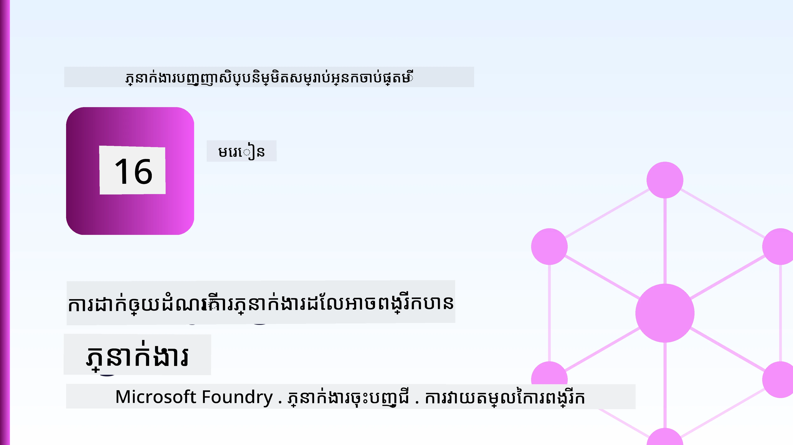
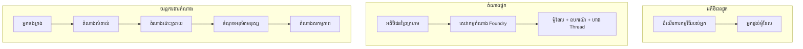
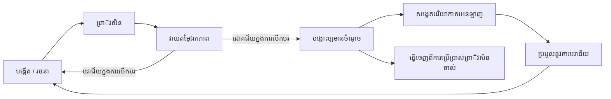
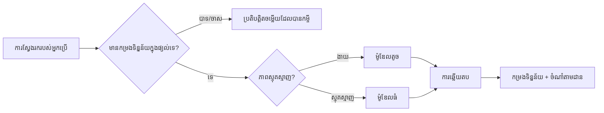
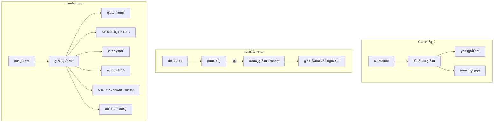

# ការចេញផ្សាយភ្នាក់ងារដែលអាចពង្រីកបានជាមួយ Microsoft Foundry



រហូតដល់ពេលនេះក្នុងវគ្គសិក្សា អ្នកបានបង្កើតភ្នាក់ងារដែលរត់នៅលើកុំព្យូទ័រយួរដៃរបស់អ្នក ក្នុងសៀវភៅកំណត់ត្រា ដោយមានការបញ្ជា `az login` និងអថេរបរិស្ថានមួយចំនួន។ វាគឺជាវិធីត្រឹមត្រូវសម្រាប់ការសិក្សា។ តែមិនមែនជាវិធីត្រឹមត្រូវសម្រាប់ការរត់ភ្នាក់ងារដែលអតិថិជនរាប់ពាន់នាក់ទុកចិត្តនៅម៉ោង 3 ព្រឹកឡើយ។

មេរៀននេះពិភាក្សាអំពីចន្លោះរវាង "វាដំណើរការលើម៉ាស៊ីនរបស់ខ្ញុំ" និង "វាដំណើរការ ដោយទៀងទាត់ និងថ្លៃសមរម្យ នៅក្នុងបរិស្ថានផលិតកម្ម។" យើងបិទចន្លោះនោះដោយប្រើ **Microsoft Foundry** និង **Microsoft Foundry Agent Service** ហើយយើងធ្វើវាតាមរយៈការបង្កើតភ្នាក់ងារគាំទ្រអតិថិជនពិតដែលមានឧបករណ៍ ប្រើប្រាស់កម្មវិធីទាញយក ព្រមទាំងអនុញ្ញាតផ្ទេរកំណត់ចិត្ត ការវាយតម្លៃ និងការត្រួតពិនិត្យ។

## ការណែនាំ

មេរៀននេះនឹងពាក់ព័ន្ធដូចខាងក្រោម៖

- ផ្សំផ្សេងគ្នារវាង **ភ្នាក់ងារតំណាង** និង **ភ្នាក់ងារចេញផ្សាយ** ហើយហេតុអ្វីការផ្លាស់ប្តូរមុខកាន់តែច្រើនគឺជារឿងនៅជុំវិញម៉ូដែល។
- **គំរូបង្ហាញលក្ខណៈការចេញផ្សាយ** សម្រាប់ភ្នាក់ងារ៖ អតិថិជនម៉ាស៊ីនភ្ញៀវ របស់អ្នកម៉ាស៊ីនបម្រើ (Hosted Agents) និងការត្រួតត្រាប្រតិបត្ដិការក្នុងសកម្មភាព។
- **ជំនួយដំណើរការ Agent** នៅលើ Microsoft Foundry — បង្កើត កំណែ ចេញផ្សាយ វាយតម្លៃ មើលលទ្ធផល និងដកចេញ។
- **យុទ្ធសាស្ត្រពង្រីក**: ការបញ្ជូនម៉ូដែល ការផ្ទុកទិន្នន័យប្រើឡើងវិញ សមត្ថភាពធ្វើការ đồng thời និងរចនាភាពគ្មានស្ថានភាព។
- **ការយល់ដឹងពីសកម្មភាព** ជាមួយ OpenTelemetry និង ការតាមដាន Foundry។
- **ការបង្កើតប្រសិទ្ធភាពថ្លៃចំណាយ** តាមរយៈការជ្រើសរើសម៉ូដែល ការបញ្ជូន និងច្រកវាយតម្លៃ។
- **កត្តាអាជីវកម្មធំ**៖ ការគ្រប់គ្រង ការអនុម័តដោយមនុស្ស និងការរត់ម៉ាស៊ីនបម្រើ MCP យ៉ាងសុវត្ថិភាពក្នុងផលិតកម្ម។

## គោលបំណងការសិក្សា

បន្ទាប់ពីបញ្ចប់មេរៀននេះ អ្នកនឹងស្គាល់វិធីសាស្ត្រដូចខាងក្រោម៖

- ជ្រើសរើសគំរូបង្ហាញសម្រាប់ការចេញផ្សាយត្រឹមត្រូវសម្រាប់បន្ទុកការងារភ្នាក់ងារ។
- ចេញផ្សាយភ្នាក់ងារទៅ Microsoft Foundry Agent Service ដើម្បីវាបានជាកំណែ មានការគ្រប់គ្រង និងអាចមើលឃើញបាន។
- បំពាក់ភ្នាក់ងារសម្រាប់ការតាមដាន និងភ្ជាប់បំពង់វាយតម្លៃដំណើរការពីមុនចេញផ្សាយរាល់ដង។
- អនុវត្តការបញ្ជូនម៉ូដែល និងការផ្ទុកតម្លៃឡើងវិញ ដើម្បីរក្សាថយចុះនិងថ្លៃដើមនៅក្រោមការគ្រប់គ្រងនៅកម្រិតពង្រីក។
- បន្ថែមក្រឡាចុះអនុម័តដោយមនុស្សសម្រាប់សកម្មភាពមានហានិភ័យខ្ពស់ និងបញ្ចូលម៉ាស៊ីនបម្រើ MCP នៅក្នុងវិធីដែលមានសុវត្ថិភាពផលិតកម្ម។

## លក្ខខណ្ឌមុន

មេរៀននេះសន្មត់ថាអ្នកបានបញ្ចប់មេរៀនមុនៗ ហើយមានជំនាញលើ៖

- ការបង្កើតភ្នាក់ងារជាមួយ [Microsoft Agent Framework](../14-microsoft-agent-framework/README.md) (មេរៀនទី 14)។
- [ការប្រើប្រាស់ឧបករណ៍](../04-tool-use/README.md) (មេរៀនទី 4) និង [Agentic RAG](../05-agentic-rag/README.md) (មេរៀនទី 5)។
- [កំណត់ចិត្តភ្នាក់ងារ](../13-agent-memory/README.md) (មេរៀនទី 13) និង [Agentic Protocols / MCP](../11-agentic-protocols/README.md) (មេរៀនទី 11)។
- [ការយល់ដឹង និងការវាយតម្លៃ](../10-ai-agents-production/README.md) (មេរៀនទី 10) — មេរៀននេះគឺបង្កើតផ្ទាល់លើមេរៀននោះ។

អ្នកត្រូវការផងដែរ៖

- **ការជាវ Azure** និង **គម្រោង Microsoft Foundry** ដែលមានម៉ូដែលប៉ុន្នឹងមួយណាមួយចេញផ្សាយរួច។
- **Azure CLI** បាន Authenticate ដោយ `az login`។
- Python 3.12+ និង បណ្ណាល័យក្នុងឯកសារ [`requirements.txt`](../../../requirements.txt)។

## ពីរូបមន្តខ្នាតតូចទៅផលិតកម្ម៖ អ្វីដែលបានផ្លាស់ប្តូរ

ភ្នាក់ងាររូបមន្តខ្នាតតូច និងភ្នាក់ងារផលិតកម្មប្រើលំហូរកណ្តាលដូចគ្នា — យល់ដឹង អ្នកប្រើឧបករណ៍ និយាយប្រាស្រ័យ។ អ្វីដែលផ្លាស់ប្តូរនោះគឺអ្វីដែលជុំវិញលំហូរនោះ។ ម៉ូដែលប្រហែលជា ២០% នៃភ្នាក់ងារផលិតកម្ម ហើយ ៨០% ផ្សេងទៀតគឺរាងដើមដំណើរការ។

| បញ្ហា | រូបមន្តខ្នាតតូច | ផលិតកម្ម |
| --- | --- | --- |
| **ការផ្ទុក** | រត់ក្នុងសៀវភៅកំណត់ត្រារ | រត់ជាសេវាដែលបានផ្ទុក បង្កើតកំណែ និងផ្សព្វផ្សាយ |
| **អត្តសញ្ញាណ** | ស្លាក `az login` របស់អ្នក | អត្តសញ្ញាណគ្រប់គ្រងជាមួយ RBAC ដែលមានដែនកំណត់ |
| **ស្ថានភាព** | មានក្នុងចិត្ត បាត់បង់ពេលចាប់ផ្តើមឡើងវិញ | បន្តិកម្មក្រៅ (ផ្ទុកខ្សែ, សេវាកម្មចងចាំ) |
| **មិនជោគជ័យ** | អ្នកមើលឃើញតាមកូដត្រូវជម្លោះ | ព្យាយាមម្តងទៀត, បដិសេធ, លិខិតស្លាប់, រោទ៍បញ្ហា |
| **ថ្លៃ** | "វាជាទំព័រពិចារណាចំនួនតិច" | តាមដានរាល់សំណើ សូមបញ្ជូន ផ្ទុក និងកំណត់ថវិកា |
| **គុណភាព** | អ្នកមើលតាមភ្នែក | វាយតម្លៃដោយស្វ័យប្រវត្តិមុនចេញផ្សាយរាល់ដង |
| **ទំនុកចិត្ត** | អ្នកអនុម័តរាល់សកម្មភាព | គោលការណ៍ + មនុស្សនៅក្នុងសកម្មភាពសម្រាប់សកម្មភាពហានិភ័យ |

ចាំបាច់រក្សាតារាងនេះក្នុងចិត្ត។ រាល់ផ្នែកខាងក្រោមសម្រង់ទៅកាន់ជួរតារាងណាមួយ។

## គំរូបង្ហាញចេញផ្សាយភ្នាក់ងារ

មានគំរូបង្ហាញបីដែលអ្នកនឹងប្រើ ជាញឹកញាប់ក្នុងការរួមបញ្ចូល។

### 1. ភ្នាក់ងារម៉ាស៊ីនភ្ញៀវ

វត្ថុភ្នាក់ងាររស់នៅក្នុងដំណើរការអនុវត្តកម្មវិធីរបស់ *អ្នក*។ កូដរបស់អ្នកហៅទៅកាន់អ្នកផ្គត់ផ្គង់ម៉ូដែលដោយផ្ទាល់; លំហូរការយល់ឃើញដំណើរការនៅក្នុងសេវាកម្មរបស់អ្នក។ នេះគឺជាវិធីដែលមេរៀនមុនៗបានធ្វើ។

- **ប្រើពេលណា**អ្នកត្រូវការត្រួតពិនិត្យលំហូរពេញលេញ មធ្យោបាយរៀបចំដៃឯង ឬអ្នកបញ្ចូលភ្នាក់ងារជាផ្នែកមួយនៅក្នុងបំពង់ក្រោយដែលមានស្រាប់។
- **ការជួញដូរ**: អ្នកទទួលខុសត្រូវការបង្កើនទំហំ ស្ថានភាព និងភាពរឹងមាំដោយខ្លួនឯង។

### 2. ភ្នាក់ងារផ្ទុក (Foundry Agent Service)

ភ្នាក់ងារត្រូវបាន *ចុះបញ្ជីជាធនធាន* នៅក្នុង Microsoft Foundry។ Foundry ផ្ទុកលំហូរការយល់ឃើញ, រក្សាកំណត់ខ្សែ, ប្រតិបត្តិការ Content Safety និង RBAC ហើយធ្វើអោយភ្នាក់ងារមើលឃើញក្នុងកំពូល Foundry។ កម្មវិធីរបស់អ្នកក្លាយជាម៉ាស៊ីនភ្ញៀវស្រាលដែលបង្កើតខ្សែ និងអានចម្លើយ។

- **ប្រើពេលណា**អ្នកចង់បានភាពរឹងមាំ ការត្រួតពិនិត្យដែលមាននៅក្នុង សេវាកម្មគ្រប់គ្រង និងការត្រួតពិនិត្យប្រតិបត្តិការច្រើនតិច។
- **ការជួញដូរ**: ត្រួតពិនិត្យកម្រិតទាបជាងក្នុងវិចិត្រសម្រាប់រត់ runtime បានគ្រប់គ្រង។

### 3. បំពង់សូមភ្នាក់ងារ

ភ្នាក់ងារច្រើន (និងឧបករណ៍) ត្រូវបានចងក្រងជាក្រាហ្វជាមួយលំហូរការគ្រប់គ្រងបញ្ជាក់ — ជំហៀងតម្លើង ច្រកបង្កើត កំណត់អនុម័តមនុស្ស និងចំណុចបញ្ឈប់ដែលអាចផ្អាក និងបន្ត។ នេះគឺជា **Workflows** ទីកន្លែង Microsoft Agent Framework ដែលអនុវត្តនៅកម្រិតចេញផ្សាយ។

- **ប្រើពេលណា** ការងារតែមួយរាប់បញ្ចូលភ្នាក់ងារពិសេសជាច្រើន ឬត្រូវការជំហានអនុម័តនៅកណ្ដាល។
- **ការជួញដូរ**: ផ្នែកចល័តច្រើន; ត្រូវការត្រួតពិនិត្យកម្រិតបញ្ជាក់។



## ជំនួយដំណើរការ Agent នៅលើ Microsoft Foundry

ការចេញផ្សាយភ្នាក់ងារមិនមែនជាការបញ្ចេញ `push` ម្តងតែម្ដងទេ។ វាជាលំហូរ មើលទៅដូចជា វដ្តចេញផ្សាយកម្មវិធី ព្រោះវាជាដូច្នេះ។



គំនិតសំខាន់ ផ្ទុកពី [មេរៀន ១០](../10-ai-agents-production/README.md): **ការវាយតម្លៃក្រៅបណ្តាញ គឺជាច្រក ច្បាប់មិនមែនជាមុនកន្លែងលេងសោះ។** កំណែភ្នាក់ងារថ្មីមិនចេញរហូតដល់វាឆ្លងច្រកវាយតម្លៃរបស់អ្នក។ ការយល់ដឹងតាមអនឡាញ បញ្ចូនករណីបរាជ័យពិតទៅប្រើក្នុងកំណត់ត្រាការធ្វើតេស្តក្រៅបណ្តាញ។ នេះគឺជាលំហូរទាំងមូល។

## យុទ្ធសាស្ត្រពង្រីក

ការពង្រីកភ្នាក់ងារខុសគ្នាពីការពង្រីក API វេបគ្មានស្ថានភាព ព្រោះរាល់សំណើអាចបញ្ចូលការហៅម៉ូដែល និងឧបករណ៍ថ្លៃថ្នូរស្រួលៗបានច្រើន។ វិធីសាស្ត្រសំខាន់បួនចេញសំរាប់ម៉ាស៊ីនផ្ទុកភារកិច្ច។

**ការគ្រប់គ្រងសំណើគ្មានស្ថានភាព។** កុំរក្សាស្ថានភាពតាមអ្នកប្រើក្នុងចំណុចចងចាំដំណើរការ។ រក្សាខ្សែកាន់តំណភាគបច្ចុប្បន្នក្នុងភ្ញៀវ Foundry ឬសេវាកម្មចងចាំ ដូច្នេះឧបករណ៍ណាមួយអាចដោះស្រាយសំណើណាមួយបាន។ នេះជាវិធីដែលអនុញ្ញាតឱ្យអ្នកពង្រីកផ្តេក — បន្ថែមឧបករណ៍ មិនមានសម័យដាក់ផ្សារចូល។

**ការបញ្ជូនម៉ូដែល។** មិនមែនរាល់សំណើទាំងអស់ត្រូវការ ម៉ូដែលមានសមត្ថភាពខ្ពស់បំផុត (និងថ្លៃថ្នូរបំផុត) របស់អ្នកទេ។ ផ្ដល់មុខងារសាមញ្ញ — ការបែងចែកចេតនា, ចម្លើយខ្លីៗ — ទៅម៉ូដែលតូច លឿន ហើយរក្សាទុកម៉ូដែលធំសម្រាប់ការយល់ឃើញពិតប្រាកដ។ **Model Router** របស់ Foundry អាចធ្វើការនេះសម្រាប់អ្នក ឬ អ្នកអាចអនុវត្តកម្មវិធីអ្នកដោយខ្លួនឯង។ អ្នកនឹងបង្កើតកំណែ DIY ក្នុងមន្ទីរពិសោធន៍។

**ការផ្ទុកចម្លើយ ប្រើឡើងវិញ។** សំណួរគាំទ្រច្រើនជាសំណួរដូចគ្នា ("តើខ្ញុំធ្វើដូចម្តេចដើម្បីកំណត់ពាក្យសម្ងាត់វិញ?")។ ផ្ទុកចម្លើយសម្រាប់សំណួរជាប់ច្រើន និងបម្រុងរួចជាស្រេច ដើម្បីជួយទុកទុកពីការហៅម៉ូដែលទាំងមូល។ ការទទួលចំណុចផ្ទុកតិចតួច កាត់ថ្លៃ និងពេលយូរចំហាយយ៉ាងមានន័យ។

**ការធ្វើការ đồng thời និងបន្ទុកបត់បែន។** អ្នកផ្គត់ផ្គង់ម៉ូដែលមានកំណត់អត្រា។ កំណត់កម្រិតការធ្វើការ đồng thời រើសយកការ Retry ជាមួយ Backoff បង្គោល ហើយបរាជ័យយ៉ាងរលូន (ចម្លើយ"យើងកំពុងដោះស្រាយ"ក្នុងវ៉ាក្យទី ដាច់មុខជាងកំហុស 500)។



## ការយល់ដឹងពីសកម្មភាពនៅផលិតកម្ម

អ្នកមិនអាចដំណើរការអ្វីដែលមិនអាចមើលឃើញបានទេ។ ដូចបានគ្របដណ្តប់ក្នុងមេរៀន ១០ Microsoft Agent Framework បញ្ចេញកំណត់ត្រា **OpenTelemetry** ដោយដើម — រាល់ការហៅម៉ូដែល ការហៅឧបករណ៍ និងជំហានត្រួតពិនិត្យ ក្លាយជាផ្នែកមួយ។ នៅលើផលិតកម្ម អ្នកនាំចេញផ្នែកទាំងនោះទៅ Microsoft Foundry (ឬបច្ចេកវិទ្យាផ្សេងទៀតដែលគាំទ្រ OTel) ដើម្បីអ្នកអាច៖

- តាមដានបញ្ហាអតិថិជនម្នាក់ពីដាច់ដិតនៅលើរាល់ការហៅម៉ូដែល និងឧបករណ៍។
- មើលពេលឆ្លើយ p50/p95 និងថ្លៃចំណាយសម្រាប់រាល់សំណើអំឡុងពេល។
- ផ្ដល់រោទ៍បញ្ហាកន្លែងកើតកើតកើតហេតុ និងការព្រមានថ្លៃថ្នូរមុនឲ្យអ្នកប្រើ (ឬក្រុមហ៊ុនហិរញ្ញវត្ថុ) ដឹង។

```python
from agent_framework.observability import get_tracer

tracer = get_tracer()

with tracer.start_as_current_span("support_request") as span:
    span.set_attribute("customer.tier", "enterprise")
    span.set_attribute("routed.model", "gpt-4.1-mini")
    # ការអនុវត្តភ្នាក់ងារត្រូវបានតាមដានដោយស្វ័យប្រវត្តិនៅក្នុងខួបនេះ
```

គុណលក្ខណៈដូចជា `customer.tier` និង `routed.model` ជាជនបំប្រែការតាមដានជាច្រើនទៅជា សំណួរដែលអាចឆ្លើយបាន ("តើអតិថិជនឧស្សាហកម្មត្រូវបានបញ្ជូនទៅម៉ូដែលតូចច្រើនពេកទេ?")។

## ការបង្កើតប្រសិទ្ធភាពថ្លៃដើម

ថ្លៃដើមក្នុងភ្នាក់ងារផលិតកម្មត្រូវអំពាក់ដោយ Token។ ឧបករណ៍បី ក្នុងតម្រៀបផលប៉ះពាល់៖

1. **រចនាម៉ូដែលត្រឹមត្រូវ។** ម៉ូដែលតូចដែលឆ្លងច្រកវាយតម្លៃរបស់អ្នក ជាញឹកញាប់ថ្លៃថោកជាងម៉ូដែលធំនឹងឆ្លងវា។ ប្រើការវាយតម្លៃដើម្បី *បង្ហាញ* ម៉ូដែលតូចគ្រប់គ្រាន់ ផ្ទុយពីជ្រើសរៀងតាមម៉ូដែលធំឡើងវិញដោយការយកចិត្តទុកដាក់។
2. **បញ្ជូនតាមភាពស្មុគស្មាញ។** ដូចខាងលើ — មានតម្លៃម៉ូដែលធំសម្រាប់សំណើដែលត្រូវការយល់ដឹងដោយម៉ូដែលធំតែប៉ុណ្ណោះ។
3. **ផ្ទុកតម្លៃឡើងវិញយ៉ាងខ្លាំង។** ការហៅម៉ូដែលដែលថោកបំផុតគឺការហៅដែលអ្នកមិនធ្វើឡើង។

ក្រឡាចុះវាយតម្លៃ និងការត្រួតពិនិត្យថ្លៃដើម គឺជាវិជ្ជាជីវៈដូចគ្នាបានមើលពីពីរជ្រុង៖ ការវាយតម្លៃប្រាប់អ្នកពី *មូលដ្ឋានគុណភាព* រួច បញ្ជូន និងជំនួញតម្លៃឡើងវិញរក្សាឲ្យខិតជិត *ថ្លៃ* នៃមូលដ្ឋាននោះ។ 

## ការពិចារណាចេញផ្សាយសម្រាប់សហគ្រាស

**ការគ្រប់គ្រង។** Hosted Agents ទទួលបាន RBAC, សុវត្ថិភាពមាតិកា និងកំណត់ហេតុខណៈព្រឹត្តិការណ៍ Foundry។ ផ្តល់ភ្នាក់ងារ​នីមួយៗជា​អត្តសញ្ញាណ​គ្រប់គ្រង ដែលមានតិចតួចដែនកំណត់ដែលត្រូវការ — ចូលបានតែអានទៅកាន់មូលដ្ឋានចំណេះដឹង, ចូលដំណើរការដោយមានដែនកំណត់ទៅកាន់ API សំបុត្រ, គ្មានសិទ្ធិមួយចំណែកផ្សេងទេ។

**មនុស្សនៅក្នុងសកម្មភាព។** សកម្មភាពខ្លះសំខាន់ខ្លាំងទ្រង់ទ្រាយដែលមិនអាចបញ្ចេញអូតូបាន — ការបញ្ចូនប្រាក់ត្រឡប់ ការលុបគណនី ការតម្កល់ក្រុមច្បាប់។ Microsoft Agent Framework គាំទ្រឧបករណ៍ដែល **ត្រូវការអនុម័ត**: ភ្នាក់ងារផ្តល់យោបល់ សកម្មភាពផ្អាក, មនុស្សអនុម័ត ឬបដិសេធ ហើយលំហូរការបន្ត។ អ្នកបានឃើញទីប្រូមទីមាននៅ [មេរៀន ៦](../06-building-trustworthy-agents/README.md); នៅទីនេះអ្នកចេញផ្សាយវា។

**MCP នៅផលិតកម្ម។** [MCP](../11-agentic-protocols/README.md) អនុញ្ញាតឱ្យភ្នាក់ងារអ្នកប្រើឧបករណ៍ខាងក្រៅតាមចំណុចប្រទាក់ស្តង់ដារ។ នៅផលិតកម្ម អនុវត្តថា ចំណុចបញ្ចប់ MCP គឺជាស្ទឹងមិនទុកចិត្តបាន៖ ចាក់កំណែម៉ាស៊ីនបម្រើ, រត់វានៅជាមួយអត្តសញ្ញាណដែលមានដែនកំណត់, ត្រួតពិនិត្យលទ្ធផលវា និងកុំបង្ហាញសម្ងាត់ណាមួយ។ ម៉ាស៊ីនបម្រើ MCP ជាការពឹងផ្អែក និងការពឹងផ្អែកទទួលបានការជួសជុល អុកប៊ីត និងកំណត់កម្រិតអត្រា។



រូបភាពបីនោះ — ការអភិវឌ្ឍ ការចេញផ្សាយ រត់ runtime — គឺជាភ្នាក់ងារដូចគ្នានៅបីដំណាក់កាលនៃជីវិតវា។ មន្ទីរពិសោធន៍បន្ទាប់នឹងដឹកនាំអ្នកតាមការបង្កើតវា។

## មន្ទីរពិសោធន៍អនុវត្ត: ភ្នាក់ងារគាំទ្រអតិថិជនរួចរាល់សម្រាប់ផលិតកម្ម

បើក [`code_samples/16-python-agent-framework.ipynb`](./code_samples/16-python-agent-framework.ipynb) ហើយធ្វើការចូលរួមពេញលេញ។ អ្នកនឹងតាំងពីភ្នាក់ងារគាំទ្រអតិថិជន Contoso ដោយភ្ជាប់គ្រប់បញ្ហាបានបញ្ចូលៈ

1. **ហៅឧបករណ៍** — ស្វែងរកស្ថានភាពការបញ្ជាទិញ និងបើកសំបុត្រគាំទ្រ។
2. **RAG** — ឆ្លើយសំណួរលក្ខណៈគោលការណ៍ពីមូលដ្ឋានចំណេះដឹង (Azure AI Search, មានជំនួសក្នុងចិត្តដើម្បីអនុញ្ញាតឲ្យសៀវភៅកំណត់ត្រារត់ដោយគ្មានធនធានស្វែងរក)។
3. **ចងចាំ** — កត់សម្គាល់អតិថិជននៅតាមជំហាននៃការសន្ទនា។
4. **បញ្ជូនម៉ូដែល** — ការបែងចែកភាពស្មុគស្មាញ នាំសំណើរទៅម៉ូដែលតូច ឬធំ។
5. **ផ្ទុកតម្លៃឡើងវិញ** — សំណួរដដែលត្រូវបានបម្រុងចម្លើយពីចង្វាក់។
6. **អនុម័តដោយមនុស្ស** — បង្រ្កាបប្រាក់ត្រឡប់ខ្ពស់ជាងកម្រិតអនុញ្ញាតសម្រាប់ការចុះហត្ថលេខា។
7. **បំពង់វាយតម្លៃ** — គំរូតេស្តក្រៅបណ្តាញតូចនាំពិន្ទុភ្នាក់ងារ និងដំណើរការជាច្រកចេញផ្សាយ។
8. **ការយល់ដឹងពីសកម្មភាព** — ឆ្លងកាត់ OpenTelemetry ពីរាល់សំណើ។

### ការប្រាប់របៀប

សៀវភៅកំណត់ត្រាត្រូវបានរៀបចំដើម្បីអោយរាល់បញ្ហាផលិតកម្មជារូបភាពដែលអាចដំណើរការបានដោយខ្លួនឯង។ ចំណុចកណ្តាលគឺជា អ្នកទទួលសំណើរ routing សម្រង់ caching តាមបំពង់។

```python
async def handle_support_request(query: str, customer_id: str) -> str:
    # 1. បម្រើពីកាឆេពេលដែលយើងអាចធ្វើបាន។
    cached = response_cache.get(normalize(query))
    if cached:
        return cached

    # 2. តាមផ្លូវតាមកម្រិតស្មុគស្មាញដើម្បីគ្រប់គ្រងថ្លៃកម្ចី។
    model = "gpt-4.1-mini" if is_simple(query) else "gpt-4.1"

    # 3. ប្រតិបត្តិភ្នាក់ងារជាមួយក្នុងតំបន់តាមដានសម្រាប់ការមើលឃើញ។
    with tracer.start_as_current_span("support_request") as span:
        span.set_attribute("routed.model", model)
        span.set_attribute("customer.id", customer_id)
        response = await support_agent.run(query, model=model)

    # 4. កាឆេ និងត្រឡប់មកវិញ។
    response_cache.set(normalize(query), response.text)
    return response.text
```

ច្រកវាយតម្លៃដែលការពារជាច្រកចេញផ្សាយមានរូបរាងដូចខាងក្រោម៖

```python
async def evaluation_gate(agent, test_cases, threshold: float = 0.8) -> bool:
    passed = 0
    for case in test_cases:
        result = await agent.run(case["input"])
        if score_response(result.text, case["expected"]) >= 0.8:
            passed += 1
    pass_rate = passed / len(test_cases)
    print(f"Evaluation pass rate: {pass_rate:.0%} (gate: {threshold:.0%})")
    return pass_rate >= threshold  # បើកតែប៉ុណ្ណោះប្រសិនបើទ្វារឆ្លងកាត់
```

អានរាល់បន្ទាត់ — សៀវភៅកំណត់ត្រា រក្សាទុកកូដធម្មតា ដូច្នេះគ្មានអ្វីលាក់ពីក្រោយហៅរៀងប្រព័ន្ធ។

## ការផ្ទៀងផ្ទាត់ភ្នាក់ងារចេញផ្សាយជាមួយតេស្តបាញ់ញាតិ

ច្រកវាយតម្លៃខាងលើដំណើរការ *ក្រៅបណ្តាញ* ទល់នឹងវត្ថុភ្នាក់ងាររបស់អ្នក។ ពេលភ្នាក់ងារត្រូវបានចេញផ្សាយជា Hosted Agent អ្នកត្រូវការត្រួតពិនិត្យបន្ថែមមួយទៀតដែលថោកជាង៖ **តើចំណុចចេញផ្សាយពិតប្រាកដឆ្លើយតបទេ?**

ការចេញផ្សាយជោគជ័យ បញ្ជាក់ថា ផ្តាច់គ្រប់គ្រងទទួលយកការកំណត់ តែវាមិនបញ្ជាក់ថាភ្នាក់ងារឆ្លើយតបទេ។ ការពឹងផ្អែកបែកបាក់ មេរោគបញ្ជូនខុស ឬការតភ្ជាប់ផុតកំណត់អាចបណ្តាលឲ្យការចេញផ្សាយមានពណ៌បៃតងប៉ុន្ដែមិនមានចម្លើយ។ **តេស្តបាញ់ញាតិ** សម្លាប់វិញ្ញាណនោះក្នុងប៉ុន្មានវិនាទី នៅក្នុងរាល់ការចេញផ្សាយ ដោយគ្មានថ្លៃដើមគមនីយកម្មពេញលេញ។

រ៉េប៉ូនេះផ្គត់ផ្គង់បំពង់តេស្តបាញ់ញាតិប្រើបានរួច ដែលបង្កើតលើ [AI Smoke Test](https://github.com/marketplace/actions/ai-smoke-test) GitHub Action៖

- **កាតាឡុក** — [`tests/lesson-16-smoke-tests.json`](../../../tests/lesson-16-smoke-tests.json) មានតម្រង និងការផ្ទៀងផ្ទាត់សម្រាប់ភ្នាក់ងារគាំទ្រ Contoso (ចម្លើយគោលការណ៍គាំទ្រ ស្វែងរកការបញ្ជាទិញ, រស់នៅលើប្រធានបទ និងការគ្រប់គ្រងខ្សែការសន្ទនា)។ កាតាឡុកសម្រាប់ភ្នាក់ងារមេរៀនផ្សេងៗរួចស្ថិតនៅក្បែរវា — មើល [`tests/README.md`](../tests/README.md)។
- **កម្មវិធីឡើងវិញ** — [`.github/workflows/smoke-test.yml`](../../../.github/workflows/smoke-test.yml) ចូលជាមួយ Azure OIDC ហើយ POST រាល់តម្រងទៅចំណុច Responses របស់ភ្នាក់ងារ វិក័យបត្រដែលមានកំហុសឡើង។

```yaml
- name: Smoke-test hosted agent
  uses: JFolberth/ai-smoketest@v1
  with:
    project_endpoint: ${{ inputs.project_endpoint }}
    agent_name: ContosoSupportAgent
    tests_file: tests/lesson-16-smoke-tests.json
```


ចាប់ផ្តើមវាចេញពីផ្ទាំង **Actions** នៅពេលភ្នាក់ងាររបស់អ្នកត្រូវបានដាក់ស្រាយ ហើយផ្តល់កម្មវិធីគម្រោង Foundry របស់អ្នក និងឈ្មោះភ្នាក់ងារ។ អត្តសញ្ញាណដែលភ្ជាប់គ្នាត្រូវការតួនាទី **Azure AI User** នៅក្នុងវិស័យគម្រោង Foundry។ គិតពីស្ទឹងជាសំណុំកំពូល: ការធ្វើតេស្តអាស់មួយ (អាចចូលដំណើរការនិងឆ្លើយតបបាន?) រត់លើការដាក់ស្រាយរាល់ដង, ការវាយតម្លៃក្រៅបណ្តាញ (គ្រប់គ្រាន់សម្រាប់ដឹកជញ្ជូនទេ?) រត់មុនការជំរុញ, និងការវាយតម្លៃលើបណ្តាញ (ការចូលរបស់វានៅលើទូទៅយ៉ាងដូចម្តេច?) រត់ជាបន្តបន្ទាប់។

## ការត្រួតពិនិត្យចំណេះដឹង

សាកល្បងយល់ដឹងរបស់អ្នកមុនពេលចូលទៅកិច្ចការ។

**1. ប្រហែលមួយភាគរយប៉ុន្មាននៃភ្នាក់ងារផលិតកម្មគឺជារ៉ូបូត "ម៉ូដែល," ហើយអ្វីដែលនៅសល់វាជាអ្វី?**

<details>
<summary>ចម្លើយ</summary>

ម៉ូដែលគឺជាភាគតិចនៃប្រព័ន្ធ — ជាទូទៅបានរាយការណ៍ប្រហែលជា ២០%។ អ្វីដែលនៅសល់គឺសាំងឡេតិកដែលដំណើរការ: ការបង្ហោះ និងការបម្លែងវើសិន, អត្តសញ្ញាណ និង RBAC, ស្ថានភាពខាងក្រៅ, ការដោះស្រាយបញ្ហា, ការតាមដានថ្លៃថ្នូរ, ការវាយតម្លៃ, និងការត្រួតពិនិត្យដោយមនុស្សក្នុងរង្វង់។ ការផ្លាស់ប្តូរទៅផលិតកម្មគឺជាចំពោះការនាវាគ្រប់គ្រងទាំងអស់ចូលក្នុងរង្វង់សុក្រឹតចិត្ត។
</details>

**2. ពេលណាអ្នកនឹងជ្រើសរើសភ្នាក់ងារដែលមានការផ្ទុករួចជាងភ្នាក់ងារដែលភ្ញាក់ផ្អាចជាគ្លាយ?**

<details>
<summary>ចម្លើយ</summary>

ពេលដែលអ្នកចង់បានរតនាគារគ្រប់គ្រងជាមួយភាពធន់ទ្រាំដែលស្ថិតក្នុង (ភាគល្អិតដែលមានភាពស្ថិតស្ថេរ និងអាចបន្តបាន), ការសង្កេតជំនាញ, សុវត្ថិភាពមាតិកា, និង RBAC, ហើយអ្នកមានចិត្តព្រោះការគ្រប់គ្រងកម្រិតទាបលើរង្វង់សុក្រឹតចិត្តបន្ថយការចំរុះចំរាសសេវាកម្ម។ ភ្នាក់ងារដែលភ្ញាក់ផ្អាចជាគ្លាយល្អប្រសើរពេលអ្នកត្រូវការគ្រប់គ្រងពេញលេញលើរង្វង់ ឬបញ្ចូលភ្នាក់ងារនៅក្នុងបដិសណ្ឋារកិច្ចដែលមានស្រាប់។
</details>

**3. ហេតុអ្វីបានជា ភ្នាក់ងារដែលអាចពង្រីកត្រូវត្រូវបានរក្សាទុកអត់ស្ថានភាពនៅក្នុងខ្សែអនុស្សារបស់វាជាពិសេស?**

<details>
<summary>ចម្លើយ</summary>

ដូច្នេះ មុខជំនួសណាមួយអាចដោះស្រាយសំណើណាមួយបាន ដែលមិនមានសមត្ថភាពប្រើសេសชั่นកាក់កប។ ស្ថានភាពសន្ទនារបស់អ្នកប្រើត្រូវបានផ្ទុកខាងក្រៅទៅកាន់ហាងខ្សែអនុស្សារឬសេវាសុខាភិបាល។ ប្រសិនបើស្ថានភាពនៅក្នុងខ្សែអនុស្សារបស់ដំណើរការ អ្នកនឹងបាត់បង់វាចំពោះការចាប់ផ្តើមឡើងវិញ ហើយមិនអាចចែកចាយបន្ទុកបានដោយសេរី។
</details>

**4. បញ្ហាអ្វីដែលការបញ្ជូនម៉ូដែលដោះស្រាយ ហើយវាសុទ្ធសម្រាប់ការវាយតម្លៃយ៉ាងដូចម្តេច?**

<details>
<summary>ចម្លើយ</summary>

ការបញ្ជូនផ្ញើសំណើសាមញ្ញទៅម៉ូដែលតូច, ថោក, លឿន ហើយរក្សាទុកម៉ូដែលធំសម្រាប់ការសំណូមពរពិតប្រាកដ, ហើយគ្រប់គ្រងទាំងរយៈពេល និងថ្លៃថ្នូរ។ វាភ្ជាប់ទៅនឹងការវាយតម្លៃព្រោះការវាយតម្លៃជាអ្វីដែល *បញ្ជាក់* ម៉ូដែលតូចមានគុណភាពល្អគ្រប់គ្រាន់សម្រាប់ប្រភេទសំណើណាមួយ — ការបញ្ជូនបើគ្មានការវាយតម្លៃគឺជាការសន្មត់។
</details>

**5. "ត្រង់វាយតម្លៃ" គឺជាអ្វី ហើយវាត្រូវនៅឯណានៅក្នុងរបៀបរស់នៅ?**

<details>
<summary>ចម្លើយ</summary>

ត្រង់វាយតម្លៃដំណើរការតេស្តអនឡាញ​ក្នុងកំណត់ធាតុមួយចំនួនលើម៉ូដែលថ្មីហើយរារាំងការដាក់ស្រាយបើអត្រាជោគជ័យមិនបានលើសកម្រិត។ វាទៅរវាង "កំណែ" និង "ដាក់ស្រាយ" នៅក្នុងរបៀបរស់នៅធ្វើឱ្យគុណភាពជាស្រេចខ្លួនសម្រាប់ការចេញផ្សាយ មិនមែនតែនៅពេលក្រោយពេលដឹកជញ្ជូន។
</details>

**6. ហេតុអ្វីបានជាស៊ែរវើម៉ាស៊ីន MCP ត្រូវបានគេប្រើជាគូប្រកួតមិនជឿទុកចិត្តនៅក្នុងផលិតកម្ម?**

<details>
<summary>ចម្លើយ</summary>

ព្រោះវាជាឧបករណ៍ខាងក្រៅដែលភ្នាក់ងាររបស់អ្នកហៅចូលទៅវិញ។ អ្នកគួរតែលាតត្រដាងកំណែវា, ប្រតិបត្តិវាជាមួយអត្តសញ្ញាណមានដែនកំណត់, ប្រើប្រាស់ការធានាថាផលិតផលរបស់វាត្រឹមត្រូវ, កំណត់ល្បឿនវា, ហើយមិនចែងអោយមានរឿងសម្ងាត់ទៅវាទេ — វិញ្ញាណដូចគ្នាដែលអ្នកអនុវត្តទៅលើឧបករណ៍ភាគីទីបីណាមួយ។ ផលិតផលរបស់វាចេញទៅក្នុងសេចក្ដីសុក្រឹតចិត្តរបស់ភ្នាក់ងារ ដូច្នេះការជឿទុកចិត្តគ្មានការផ្ទៀងផ្ទាត់គឺជាហានិភ័យសុវត្ថិភាព។
</details>

**7. តើការផ្លាស់ប្តូរតែមួយទៅជាធម្មតាមានឥទ្ឋិពលធំនៅលើថ្លៃថ្នូរភ្នាក់ងារផលិតកម្ម ហើយហេតុអ្វី?**

<details>
<summary>ចម្ល័យ</summary>

ការជ្រើសម៉ូដែលមានទំហំត្រឹមត្រូវ — ប្រើម៉ូដែលតូចបំផុតដែលនៅតែឆ្លងត្រង់វាយតម្លៃ។ ថ្លៃថ្នូរត្រូវបានគ្រប់គ្រងដោយតួអក្សរ និងម៉ូដែលតូចត្រូវបានគេប្រើប្រាស់ជាច្រើនជាងម៉ូដែលធំសម្រាប់គុណភាពដែលគ្មានការប្រកួត។ ការផ្ទុកអាចទុករួចហើយ និងការបញ្ជូនបន្តនិងកាត់បន្ថយថ្លៃថ្នូរបន្ថែមទៀត ប៉ុន្តែការជ្រើសម៉ូដែលគោលមានឥទ្ធិពលដំបូងធំបំផុត។
</details>

**8. តួនាទីនៃគុណលក្ខណៈ span ដូចជា `customer.tier` និង `routed.model` នៅក្នុងការសង្កេតព័ត៍មានជាអ្វី?**

<details>
<summary>ចម្លើយ</summary>

ពួកវាបំប្លែងសំឡេងដើមជាសំណួរអាជីវកម្មដែលមានចម្លើយ។ ប្រសិនបើគ្មានគុណលក្ខណៈ អ្នកមានជញ្ជាំងនៃ span; បានពួកវាអ្នកអាចសួរ "តើអតិថិជនសហគ្រាសត្រូវបានផ្ញើទៅម៉ូដែលតូចច្រើនពេកទេ?" ឬ "ម៉ូដែលណាដោះស្រាយសំណើយឺតបំផុតរបស់យើង?" គុណលក្ខណៈគឺជារបៀបដែលអ្នកចែកកំណត់ការបញ្ជូនទិន្នន័យដោយទំហំនៃរឿងដែលសំខាន់សម្រាប់ការប្រតិបត្តិរបស់អ្នក។
</details>

## កិច្ចការ

យកភ្នាក់ងារគាំទ្រអតិថិជនពីមន្ទីរពិសោធន៍ ហើយធ្វើវាអោយរឹងមាំសម្រាប់ស្ថានភាពជាក់លាក់មួយ៖ **ភ្នាក់ងារគាំទ្រការបង់ប្រាក់ទូទាត់សម្រាប់ក្រុមហ៊ុន SaaS។**

ការដាក់ស្នើរបស់អ្នកគួរតែ:

1. **ជំនួសឧបករណ៍** ជាមួយឧបករណ៍ដែលពាក់ព័ន្ធនឹងការបង់ប្រាក់៖ `get_subscription_status`, `get_invoice`, និង `issue_credit` (ឥណទានលើស $50 ត្រូវការអនុម័តពីមនុស្ស)។
2. **បន្ថែមឯកសារ RAG បីឯកសារ** ដែលគ្របដណ្តប់លើគោលនយោបាយសងប្រាក់របស់ក្រុមហ៊ុន, វដ្តការបង់ប្រាក់, និងគោលនយោបាយបង្វិលចេញ។
3. **ពង្រីកកំណត់ត្រាវាយតម្លៃ** 至อย่างតិចប្រាំបួនករណី រួមមានពីរករណីដែលត្រូវតែចាប់ផ្តើមផ្លូវអនុម័តដោយមនុស្ស និងបញ្ជាក់ថាត្រង់វាយតម្លៃរបស់អ្នកបញ្ជូនត្រឹមត្រូវឬបរាជ័យ។
4. **បន្ថែមរបាយការណ៍ថ្លៃថ្នូរ​មួយ**: បន្ទាប់ពីប្រតិបត្តិកការសំណួរលាយចំនួនដប់តាមរយៈភ្នាក់ងារ ចេញបង្ហាញចំនួនដែលទៅម៉ូដែលតូច, ចំនួនទៅម៉ូដែលធំ, និងចំនួនដែលបានបម្រើពីកាស។

សរសេរបទបញ្ជាក់ខ្លីមួយ (ក្នុងក្រឡាចត្រង្គ markdown) ឲ្យពន្យល់ពីនីតិវិធីការបញ្ជូនម៉ូដែលដែលអ្នកបានជ្រើស ហើយតើអ្នកនឹងផ្ទៀងផ្ទាត់វាជាមួយចរន្តពិតយ៉ាងដូចម្តេច។ មិនមានចម្លើយត្រឹមត្រូវតែមួយទេ — អ្នកត្រូវបានវាយតម្លៃពីវិធីដែលកង្វះការផលិតបានចងក្រងគ្នាយ៉ាងត្រឹមត្រូវ។

## សេចក្ដីសរុប

នៅក្នុងមេរៀននេះ អ្នកបានបម្លែងភ្នាក់ងារពីគំរូទៅផលិតកម្មជាមួយ Microsoft Foundry៖

- ការបម្រែបម្រួលទៅផលិតកម្មជាចម្បងគឺអំពី **សាំងឡេតិកប្រតិបត្តិការ** ជុំវិញម៉ូដែល — ការបង្ហោះ, អត្តសញ្ញាណ, ស្ថានភាព, ការដោះស្រាយបញ្ហា, ថ្លៃថ្នូរ, គុណភាព, និងការជឿទុកចិត្ត។
- អ្នកបានរៀនពីបែបផែន **ការដាក់ស្រាយបី** — client-hosted, Hosted Agents, និង Agent Workflows — និងពេលដែលគ្រប់គ្រាន់សម្រាប់នីមួយៗ។
- អ្នកបានដើរតាម **របៀបរស់នៅភ្នាក់ងារ** ដែលមានការវាយតម្លៃក្រៅបណ្តាញដូចជា **ទ្វារចេញផ្សាយ** និងការសង្កេតលើបណ្តាញដែលផ្តល់មតិក្នុងការប្រកួតប្រជែង។
- អ្នកបានអនុវត្ត **យុទ្ធសាស្ត្រពង្រីក** — រចនាសម្ព័ន្ធអត់ស្ថានភាព, ការបញ្ជូនម៉ូដែល, ការចំណត, និងការប្រកួតគ្នាត្រឹមត្រូវ — ដែលភ្ជាប់វាជាមួយ **ការកាត់បន្ថយថ្លៃថ្នូរ**។
- អ្នកបានភ្ជាប់ **ការត្រួតពិនិត្យអាជីវកម្ម**: RBAC, អនុម័តដោយមនុស្សក្នុងរង្វង់, និងការសម្របសម្រួល MCP ដែលមានសុវត្ថិភាពក្នុងផលិតកម្ម។
- អ្នកបានបង្កើតភ្នាក់ងារគាំទ្រអតិថិជនរួចរាល់សម្រាប់ផលិតកម្មដែលភ្ជាប់ផលប៉ះពាល់ទាំងអស់ទាំងនេះក្នុងកូដដំណើរការ។

មេរៀនបន្ទាប់នឹងធ្វើដំណើរប្រឆាំង: ផ្ទុយពីការពង្រីកភ្នាក់ងារចូលទៅមេឃ អ្នកនឹងយកពួកវាចុះទៅលើម៉ាស៊ីនអភិវឌ្ឍន៍តែមួយ ហើយបើកដំណើរការពួកវាឲ្យស្របជាកន្លែងបញ្ចូលទាំងមូល។

## ឯកសារបន្ថែម

- <a href="https://learn.microsoft.com/azure/ai-foundry/what-is-azure-ai-foundry" target="_blank">ឯកសារ Microsoft Foundry</a>
- <a href="https://learn.microsoft.com/azure/ai-foundry/agents/overview" target="_blank">ទិដ្ឋភាពសេវាភ្នាក់ងារ Microsoft Foundry</a>
- <a href="https://aka.ms/ai-agents-beginners/agent-framework" target="_blank">ស៊ុមរូបភាគភ្នាក់ងារ Microsoft</a>
- <a href="https://learn.microsoft.com/azure/ai-foundry/concepts/model-router" target="_blank">ការបញ្ជូនម៉ូដែលនៅ Microsoft Foundry</a>
- <a href="https://learn.microsoft.com/azure/search/search-what-is-azure-search" target="_blank">Azure AI Search</a>
- <a href="https://opentelemetry.io/" target="_blank">OpenTelemetry</a>
- <a href="https://github.com/marketplace/actions/ai-smoke-test" target="_blank">សកម្មភាព AI Smoke Test GitHub</a>
- <a href="https://modelcontextprotocol.io/" target="_blank">ពិធីសម្ព័ន្ធ Model Context (MCP)</a>

## មេរៀនមុន

[ការបង្កើតភ្នាក់ងារប្រើប្រាស់កុំព្យូទ័រ (CUA)](../15-browser-use/README.md)

## មេរៀនបន្ទាប់

[ការបង្កើតភ្នាក់ងារបញ្ញាស مصنوع​](../17-creating-local-ai-agents/README.md)

---

<!-- CO-OP TRANSLATOR DISCLAIMER START -->
**ការបដិសេធ**:
ឯកសារនេះត្រូវបានបម្លែងភាសា ដោយប្រើសេវាបម្លែងភាសា AI [Co-op Translator](https://github.com/Azure/co-op-translator)។ ទោះយើងខ្ញុំមានក្តីប្រាថ្នាឱ្យបានច្បាស់លាស់ តែសូមយល់ដឹងថាការបម្លែងដោយស្វ័យប្រវត្តិក៏អាចមានកំហុសឬភាពមិនត្រឹមត្រូវ។ ឯកសារដើមជាភាសាទីតាំងគួរត្រូវបានគេប្រើជាប្រភពច្បាស់លាស់។ សម្រាប់ព័ត៌មានសំខាន់ៗ សូមណែនាំឱ្យប្រើប្រាស់ការប្រែដោយមនុស្សជំនាញ។ យើងខ្ញុំមិនទទួលខុសត្រូវចំពោះការយល់ច្រឡំ ឬការបកស្រាយខុសបន្ទាប់ពីការប្រើប្រាស់ការបម្លែងនេះនោះទេ។
<!-- CO-OP TRANSLATOR DISCLAIMER END -->