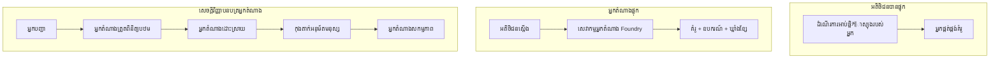
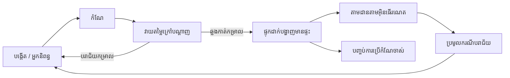
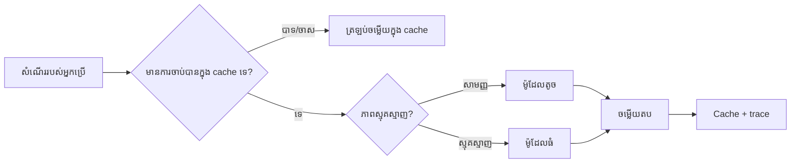
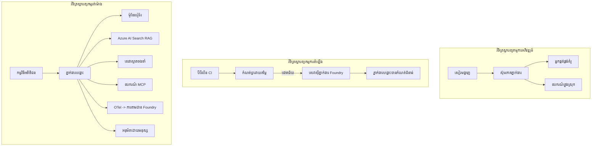

# ការផ្សព្វផ្សាយ​អ្នក​ប្រតិបត្ដិការដែលអាច​វាស់​ទំហំពេញលេញ​ជាមួយ Microsoft Foundry


រហូតដល់ពេលនេះនៅក្នុងមេរៀន អ្នកបានបង្កើតអ្នកប្រតិបត្តិការដែលរត់នៅលើកុំព្យូទ័រយួរដៃរបស់អ្នក ខាងក្នុងសៀវភៅកំណត់ត្រា ដោយបើកបរ `az login` និងអថេរបរិស្ថានខ្លះៗ។ នេះគឺជាវិធីត្រឹមត្រូវក្នុងការរៀន។ វាមិនមែនជាវិធីត្រឹមត្រូវសម្រាប់រត់អ្នកប្រតិបត្តិការដែលអ្នកប្រើប្រាស់រោចរាប់ពាន់នាក់អាស្រ័យនៅម៉ោងបីព្រឹកនោះទេ។

មេរៀននេះនិយាយអំពីដំណាក់កាលចន្លោះពី "វាដំណើរការលើម៉ាស៊ីនរបស់ខ្ញុំ" និង "វាដំណើរការ ដោយទុកចិត្ត និងថ្លៃថោកលើវិស័យផលិតកម្ម។" យើងបិទដំណាក់កាលនោះដោយប្រើ **Microsoft Foundry** និង **Microsoft Foundry Agent Service** ហើយធ្វើដោយសំណង់អ្នកប្រតិបត្តិការគាំទូមោទនភាពពិតប្រាកដដែលមានឧបករណ៍ ស្វែងរក អង្គចាំ វាយតម្លៃ និងការត្រួតពិនិត្យ។

## ទីបរិច្ឆេទ

មេរៀននេះនឹងគ្របដណ្តប់៖

- ភាពខុសគ្នារវាង **អ្នកប្រតិបត្តិការរូបមន្ត** និង **អ្នកប្រតិបត្តិការដែលបានផ្សព្វផ្សាយ** និងមូលហេតុដែលការផ្លាស់ប្តូរមួយនេះដោយជាងមួយគឺអំពីគ្រប់យ៉ាង *នៅជុំវិញ* ម៉ូដែល។
- **លំនាំការផ្សព្វផ្សាយ** សម្រាប់អ្នកប្រតិបត្តិការៈ បម្រើការជាអតិថិជន ផ្តល់សេវាអ្នកប្រតិបត្តិការ (Hosted Agents) និងការគ្រប់គ្រងដោយលំនាំការងារ។
- **ជីវិតវង់របស់អ្នកប្រតិបត្តិការ** នៅលើ Microsoft Foundry — បង្កើត កំណែ ប្រើការផ្សព្វផ្សាយ វាយតម្លៃ សង្កេត និងប្រើប្រាស់។
- **យុទ្ធសាស្រ្តវិសាលភាព**៖ នាវាចរ ម៉ូដែល កំណត់ផ្ទុក លំនាំការពហុតំបន់ និងរចនានៃការមិនអនុវត្តបញ្ជីស្ថិតិ។
- **ការសង្កេតឃើញ** ជាមួយ OpenTelemetry និងការត្រួតពិនិត្យ Foundry។
- **ការថយចុះលើកតម្កើតដើម្បីទទួលបានថ្លៃថោក** តាមរយៈការជ្រើសម៉ូដែល នាវាចរ និងកម្រិតវាយតម្លៃ។
- **ការពិចារណាលើសហគ្រាស**៖ ការគ្រប់គ្រង អនុម័តដោយមនុស្ស និងការរត់ម៉ាស៊ីន MCP យ៉ាងសុវត្ថិភាពក្នុងផលិតកម្ម។

## គោលបំណងរៀន

បន្ទាប់ពីបញ្ចប់មេរៀននេះ អ្នកនឹងដឹងវិធី៖

- ជ្រើសរើសលំនាំការផ្សព្វផ្សាយត្រឹមត្រូវសម្រាប់បន្ទុកការងារអ្នកប្រតិបត្តិការ។
- ផ្សព្វផ្សាយអ្នកប្រតិបត្តិការទៅ Microsoft Foundry Agent Service ដើម្បីឲ្យវាមានកំណែ គ្រប់គ្រង និងអាចសង្កេតឃើញបាន។
- ធ្វើឲ្យអ្នកប្រតិបត្តិការមានឧបករណ៍សម្រាប់ត្រួតពិនិត្យ និងភ្ជាប់បណ្តាញវាយតម្លៃមួយដែលរត់មុននឹងមានការចេញផ្សាយគ្រប់លើក។
- អនុវត្តនាវាចរម៉ូដែល និងកំណត់ផ្ទុកដើម្បីរក្សា ពេលយឺត និងថ្លៃដើមក្រោមការត្រួតគ្រប់គ្រងនៅវិសាលភាព។
- បន្ថែមទ្វារអនុម័តដោយមនុស្សសម្រាប់សកម្មភាពដែលមានហានិភ័យខ្ពស់ ហើយភ្ជាប់ម៉ាស៊ីន MCP នៅក្នុងវិធីសាស្រ្តសុវត្ថិភាពផលិតកម្ម។

## លក្ខខណ្ឌមុន

មេរៀននេះទាមទារអ្នកបានបញ្ចប់មេរៀនពីមុន និងមានជំនាញ៖

- បង្កើតអ្នកប្រតិបត្តិការជាមួយ [Microsoft Agent Framework](../14-microsoft-agent-framework/README.md) (មេរៀន 14)។
- [ការប្រើរបស់ឧបករណ៍](../04-tool-use/README.md) (មេរៀន 4) និង [Agentic RAG](../05-agentic-rag/README.md) (មេរៀន 5)។
- [Agent Memory](../13-agent-memory/README.md) (មេរៀន 13) និង [Agentic Protocols / MCP](../11-agentic-protocols/README.md) (មេរៀន 11)។
- [ការសង្កេតឃើញ និងវាយតម្លៃ](../10-ai-agents-production/README.md) (មេរៀន 10) — មេរៀននេះសាងលើវាដោយផ្ទាល់។

អ្នកក៏ត្រូវការផងដែរ៖

- អ្នកជាវ **Azure** និងគម្រោង **Microsoft Foundry** ដែលមានម៉ូដែលជជែកបានផ្សព្វផ្សាយយ៉ាងហោចណាស់មួយ។
- **Azure CLI** ដែលបានអះអាង (`az login`)។
- Python 3.12+ និងកញ្ចប់ក្នុងសត្រិយ `[requirements.txt](../../../requirements.txt)`។

## ពីរូបមន្តដល់ផលិតកម្ម៖ អ្វីដែលពិតជាប្រែប្រាស់

អ្នកប្រតិបត្តិការរូបមន្ត និងអ្នកប្រតិបត្តិការផលិតកម្មចែករំលែករង្វង់កណ្តាលដូចគ្នា — សាំញចេរ ហៅឧបករណ៍ និងឆ្លើយតប។ អ្វីដែលផ្លាស់ប្តូរគឺគ្រប់យ៉ាងនៅជុំវិញរង្វង់នោះ។ ម៉ូដែលប្រហែលជា 20% នៃអ្នកប្រតិបត្តិការផលិតកម្ម អ្វីដែលនៅសល់ 80% គឺរចនាសម្ព័ន្ធប្រតិបត្តិការ។

| បញ្ហា | រូបមន្ត | ផលិតកម្ម |
| --- | --- | --- |
| **ការផ្ដល់ម៉ាស៊ីនបម្រើ** | រត់ក្នុងសៀវភៅកំណត់ត្រារបស់អ្នក | រត់ក្នុងសេវាកម្មដែលបានផ្ដល់ បង្កើតកំណែ និងដាក់ចេញ |
| **អត្តសញ្ញាណ** | token `az login` របស់អ្នក | អត្តសញ្ញាណគ្រប់គ្រងជាមួយ RBAC ផ្តោតសំខាន់ |
| **ស្ថានភាព** | នៅក្នុងចងចាំ នៅពេលចាប់ផ្ដើមឡើងវិញបាត់ហើយ | ការផ្ទុកខាងក្រៅ (ផ្ទុករឿង, សេវាចងចាំ) |
| **ករណីបរាជ័យ** | អ្នកឃើញបណ្តាលកំហុស | អនុវត្តចម្លង ឆ្លងកាត់ សារ dead-letter និងការជូនដំណឹង |
| **ថ្លៃដើម** | "តិចតួចគត់" | តាមដានជាការស្នើសុំ កំណត់ផ្លូវ និងថវិកា |
| **គុណភាព** | អ្នកព្រមានចន្ទ្រា | វាយតម្លៃដោយស្វ័យប្រវត្តិមុននឹងចេញផ្សាយ |
| **ទំនុកចិត្ត** | អ្នកអនុម័តសកម្មភាពរាល់មួយ | គោលនយោបាយ + មនុស្សក្នុងរង្វង់សម្រាប់សកម្មភាពហានិភ័យ |

សូមចងចាំតារាងនេះ។ ផ្នែករាល់មួយខាងក្រោមតំណាងឲ្យមួយជួរនេះ។

## លំនាំការផ្សព្វផ្សាយអ្នកប្រតិបត្តិការ

មានលំនាំបីដែលអ្នកនឹងប្រើ ជាញឹកញាប់ក្នុងការលាយលង់។

### 1. អ្នកប្រតិបត្តិការដែលផ្ដល់សេវាជាអតិថិជន

អ្នកប្រតិបត្តិការនៅកន្លែង *កម្មវិធី* របស់អ្នក។ កូដរបស់អ្នកហៅអ្នកផ្តល់ម៉ូដែលដោយផ្ទាល់; រង្វង់គិតគូររត់នៅក្នុងសេវាកម្មរបស់អ្នក។ នេះជារឿងដែលបានធ្វើក្នុងមេរៀនមុនៗទាំងអស់។

- **ប្រើពេល** អ្នកត្រូវការត្រួតត្រាពេញលេញលើរង្វង់ រចនាឥណ្ឌ្រី ឬបន្ថែមអ្នកប្រតិបត្តិការចូលក្នុងកំព្យូទ័រចុងក្រោយដែលមាន។
- **ការបាត់បង់**៖ អ្នកទទួលខុសត្រូវចំពោះវិសាលភាព ស្ថានភាព និងភាពរឹងមាំដោយខ្លួនឯង។

### 2. អ្នកប្រតិបត្តិការផ្ដល់សេវា (Foundry Agent Service)

អ្នកប្រតិបត្តិការត្រូវបាន *ចុះបញ្ជីជាដើមទុន* នៅក្នុង Microsoft Foundry។ Foundry ធ្វើរង្វង់គិតគូរ រក្សាទុកផ្លូវចរាចរណ៍ អនុវត្តសុវត្ថិភាពមាតិកា និង RBAC ហើយធ្វើឲ្យអ្នកប្រតិបត្តិការបង្ហាញនៅក្នុងផ្លូវ Foundry។ កម្មវិធីរបស់អ្នកក្លាយជាកម្មវិធីតូចមួយដែលបង្កើតផ្លូវចរន្ត និងអានចំលើយ។

- **ប្រើពេល** អ្នកចង់ទទួលបានភាពឆាប់រហ័ស សមត្ថភាពសង្កេត ដឹកនាំ និងក្របខ័ណ្ឌប្រតិបត្តិការ។
- **ការបាត់បង់**៖ ការត្រួតត្រាថ្នាក់ទាបជាងក្នុងនាមជាចរិត runtime។

### 3. ឆ្នំពេញអ្នកប្រតិបត្តិការ

អ្នកប្រតិបត្តិការច្រើន (និងឧបករណ៍) ត្រូវបានបង្កើតជាក្រាហ្វដែលមានការត្រួតត្រាយ៉ាងច្បាស់ — ជំហានជាដំណាក់កាល តំបន់លំដាប់មនុស្ស អនុម័ត និងចំណុចសំណើមដែលអាចផ្អាក់ និងបន្ត។ នេះជាសមត្ថភាព **Workflows** របស់ Microsoft Agent Framework ដែលអនុវត្តនៅវិសាលភាពផ្សព្វផ្សាយ។

- **ប្រើពេល** ភារកិច្ចមួយផ្សំពីអ្នកប្រតិបត្តិការពិសេសជាច្រើន ឬត្រូវការជំហានអនុម័តនៅចន្លោះកណ្តាល។
- **ការបាត់បង់**៖ មានផ្នែកចល័តច្រើន; ត្រូវការសមត្ថភាពសង្កេតនារង្វង់ការគ្រប់គ្រង។



## ជីវិតវង់អ្នកប្រតិបត្តិការនៅ Microsoft Foundry

ការផ្សព្វផ្សាយអ្នកប្រតិបត្តិការមិនមែនជាដំណើរការម្តងទេ `push`។ វាជារង្វង់ ហើយវាមើលទៅដូចជាវដំណើរការចេញផ្សាយកម្មវិធី ដោយសារតែវាជារឿងដូច្នេះ។



គំនិតសំខាន់ មកពី [មេរៀន 10](../10-ai-agents-production/README.md)៖ **វាយតម្លៃក្រៅបណ្តាញគឺជាទ្វារ មិនមែនជាការគិតក្រោយ។** កំណែអ្នកប្រតិបត្តិការថ្មីមិនចេញទេបើមិនឆ្លងកាត់តម្រងវាយតម្លៃរបស់អ្នក។ ការសង្កេតឃើញប្រព័ន្ធរបស់អ្នកនៅលើបណ្តាញ បង្ហាញករណីបរាជ័យពិតប្រាកដទៅក្នុងការតេស្តក្រៅបណ្តាញ។ នេះជារង្វង់ទាំងមូល។

## យុទ្ធសាស្រ្ត​វិសាលភាព

ការវិសាលភាពអ្នកប្រតិបត្តិការខុសពីការវិសាលភាព Web API ដែលគ្មានស្ថានភាព ព្រោះសំណើរ័ទាំងអស់អាចបណ្តាលឲ្យមានការហៅម៉ូដែល និងឧបករណ៍ដែលតម្រូវថ្លៃថោក។ បច្ចេកទេសបួននេះផ្ទុកភាគច្រើននៃបន្ទុក។

**ការដោះស្រាយសំណើគ្មានស្ថានភាព។** កុំរក្សាស្ថានភាពនៅក្នុងចងចាំដើម្បីអ្នកប្រើ បណ្ដោះអាសន្ននៃការជជែកនៅក្នុងផ្លូវបណ្ដោះអាសន្ន Foundry ឬសេវាចងចាំ ដូច្នេះឧបករណ៍ណាមួយអាចដោះស្រាយសំណើណាមួយបាន។ នេះជាឯកសារដែលអនុញ្ញាតឱ្យអ្នកវិសាលផ្ទាល់ខ្លួន — បន្ថែមឧបករណ៍ ដោយគ្មានសម័យស្តិចខាងតំណក់ភ្លើង។

**នាវាចរម៉ូដែល។** មិនមែនសំណើរ​ទាំងអស់ត្រូវការ ម៉ូដែលមានសមត្ថភាពខ្ពស់ និងថ្លៃថោកបំផុតរបស់អ្នកទេ។ នាវាចរម៉ូដែលសាមញ្ញ — ផ្នែកចំណាត់ថ្នាក់បំណង បម្លើយខ្លីផ្អែកលើការពិត — ទៅម៉ូដែលតូច លឿន ហើយរក្សា ម៉ូដែលធំសម្រាប់ការគិតគូរ ពិតប្រាកដ។ Foundry **Model Router** អាចធ្វើបានការនេះ ឬអ្នកអាចអនុវត្តរូបមន្តតិចតួចដោយខ្លួនឯង។ អ្នកនឹងសាងសង់កំណែប្រើប្រាស់ផ្ទាល់ខ្លួននៅក្នុងមន្ទីរពិសោធន៍។

**កំណត់ជំពូកចំលើយ។** ពត៌មានជំនួយជាច្រើនស្ទើរតែដូចគ្នា ("ធ្វើដូចម្តេចដើម្បីកំណត់លេខសំងាត់របស់ខ្ញុំឡើងវិញ?")។ កំណត់ជំពូកចម្លើយសម្រាប់សំណួរញឹកញាប់ ហើយបម្រើដោយគ្មានការប៉ះពាល់ម៉ូដែលទេ។ ប្រសិនបើអត្រាកំណត់ជំពូកចម្លើយ មធ្យមសំរាប់កាត់ថ្លៃដើម និងពេលយឺតបានយ៉ាងចម្រុះ។

**ការពហុតំបន់ និងសំពាធមកក្រោយ។** អ្នកផ្តល់ម៉ូដែលមានដំណាក់កាលកំណត់ល្បឿន។ កំណត់ការពហុតំបន់ ប្រើការចម្លងជ្រើសរើសដោយចម្ងាយ ការសាកល្បងឡើងវិញ និងបរាជ័យយ៉ាងល្អ (ពត៌មានថាកំពុងដំណើរការ មានប្រសិទ្ធភាពជាងកំហុស 500)។



## ការសង្កេតឃើញក្នុងផលិតកម្ម

អ្នកនៅមិនអាចដំណើរការ អ្វីដែលមិនអាចឃើញបាន។ ដូចដែលបានគ្របដណ្តប់ក្នុងមេរៀន 10 ប្រព័ន្ធ Microsoft Agent Framework ផ្ដល់ចេញ **OpenTelemetry** ចំនុចតាមដានដោយធម្មជាតិ — រាល់ការហៅម៉ូដែល ការហៅឧបករណ៍ និងជំហានគ្រប់គ្រងក្លាយជាចំណុចតាមដាន។ នៅក្នុងផលិតកម្ម អ្នកនាំចេញចំនុចទាំងនេះទៅ Microsoft Foundry (ឬ backend ដែលជាមួយ OTel) ដើម្បីអាច៖

- តាមដានករណីបញ្ហាអតិថិជនមួយចប់ពីលើរាល់ម៉ូដែល និងការហៅឧបករណ៍។
- មើលពេលយឺត p50/p95 និងថ្លៃដើមជាការស្នើសុំជារៀងរាល់ពេល។
- ជូនសញ្ញាពីអត្រាកំហុសកើនឡើង និងភាពមិនទៀងទាត់ថ្លៃដើម មុនពេលអ្នកប្រើ (ឬក្រុមហិរញ្ញវត្ថុ) ដឹង។

```python
from agent_framework.observability import get_tracer

tracer = get_tracer()

with tracer.start_as_current_span("support_request") as span:
    span.set_attribute("customer.tier", "enterprise")
    span.set_attribute("routed.model", "gpt-5-nano")
    # ការប្រតិបត្តិភ្នាក់ងារត្រូវបានតាមដានដោយស្វ័យប្រវត្តិនៅក្នុងផ្នែកនេះ
```

គុណលក្ខណៈដូចជា `customer.tier` និង `routed.model` ជាឧបករណ៍បម្លែងជាការសួរដែលអាចឆ្លើយបាន ("តើអតិថិជនសហគ្រាសត្រូវបាននាវាចរទៅម៉ូដែលតូចច្រើនពេកទេ?")។

## ការត្រួតពិនិត្យថ្លៃថោក

ថ្លៃដើមក្នុងអ្នកប្រតិបត្តិការផលិតកម្មគឺចំណុចសំខាន់ដោយការtoken។ ដៃជំនួញបី មានលំដាប់ផលប៉ះពាល់ដូចជា៖

1. **ជ្រើសម៉ូដែលត្រឹមត្រូវ។** ម៉ូដែលតូចដែលឆ្លងកាត់ទ្វារវាយតម្លៃរបស់អ្នក ជាញឹកញាប់ថ្លៃថោកជាងម៉ូដែលធំមួយដែលសមត្ថភាពដូចគ្នា។ ប្រើវាយតម្លៃដើម្បី *បញ្ជាក់* ថាម៉ូដែលតូចគ្រប់គ្រាន់ មិនមែនលើករាល់ពេលប្រើសំរាប់ម៉ូដែលធំប្រាកដឡើយ។
2. **នាវាចរតាមភាពស្មុគស្មាញ។** ដូចខាងលើ — បង់ថ្លៃម៉ូដែលធំមួយសម្រាប់សំណើដែលចាំបាច់តែមានការគិតគូរដោយម៉ូដែលធំ។
3. **កំណត់ជំពូកយ៉ាងទាក់ទាញ។** ការហៅម៉ូដែលថ្លៃថោកបំផុតគឺការហៅមិនដែលធ្វើឡេីង។

ទ្វារវាយតម្លៃ និងការគ្រប់គ្រងថ្លៃថោកជាចរិតមួយដែលមើលពីពីរជ្រុង៖ វាយតម្លៃប្រាប់អ្នកពី *ជាន់គុណភាព*​ នាវាចរ និងការកំណត់ផ្ទុករក្សាទុកឲ្យនៅក្បែរជាន់ *ថ្លៃ*។

## ការពិចារណាក្នុងការផ្សព្វផ្សាយសហគ្រាស

**ការគ្រប់គ្រង។** Hosted Agents ទទួលបាន RBAC, សុវត្ថិភាពមាតិកា និងការ audit logging ពី Foundry។ ផ្តល់អត្តសញ្ញាណគ្រប់គ្រងមួយជាមួយអាទិភាពតិចជាងសម្រាប់រាល់អ្នកប្រតិបត្តិការ — ចូលដំណើរការព័ត៌មានចំណេះដឹង តាមដានសិទ្ធិ API កម្មវិធី និងមិនចូលលើសកម្រិតណាមួយឡើយ។

**មនុស្សនៅក្នុងស្ពាន។** សកម្មភាពជាច្រើនមានប្រសិទ្ធភាពខ្ពស់សម្រាប់ផ្ទាល់ខ្លួន — ដាក់ត្រលប់ប្រាក់ សម្អាតគណនី ឬបន្តការជួបប្រឹងទៅក្រុមច្បាប់។ Microsoft Agent Framework គាំទ្រឧបករណ៍ដែលតម្រូវឲ្យ **មានការអនុម័ត**៖ អ្នកប្រតិបត្តិការស្នើស_ACTION រារពេល និងមនុស្សអនុម័ត ឬបដិសេធ ហើយផ្លូវការងារបន្ត។ អ្នកបានឃើញការស្នូលមួយនៅ [មេរៀន 6](../06-building-trustworthy-agents/README.md) ហើយឥឡូវនេះអ្នកផ្សព្វផ្សាយវា។

**MCP ក្នុងផលិតកម្ម។** [MCP](../11-agentic-protocols/README.md) អនុញ្ញាតឲ្យអ្នកប្រតិបត្តិការប្រើឧបករណ៍ខាងក្រៅតាមចំណុចផ្ទាល់។ ក្នុងផលិតកម្ម គ្រប់ម៉ាស៊ីន MCP ត្រូវបានទុកចិត្តថាជាព្រំដែនមិនទុកចិត្ត៖ ចំណាត់ថ្នាក់ម៉ាស៊ីន សម្របសម្រួលដោយអត្តសញ្ញាណ ការពិនិត្យលទ្ធផល និងមិនបង្ហាញអ្វីដែលជារ៉ഹស្យដល់វា។ ម៉ាស៊ីន MCP គឺជាឧបមាណ ត្រូវបានថែទាំ ពិនិត្យ និងមានដែនកំណត់ល្បឿន។



រូបភាពបីនេះ — ការអភិវឌ្ឍ ការផ្សព្វផ្សាយ Runtime — ជាអ្នកប្រតិបត្តិការដូចគ្នានៅតំណាក់កាលជីវិតបី។ មន្ទីរពិសោធន៍បន្ទាប់នឹងដឹកនាំអ្នកសម្រាប់បង្កើតវា។

## មន្ទីរពិសោធន៍ជាក់ស្តែង៖ អ្នកប្រតិបត្តិការជំនួយអតិថិជនដែលមានភាពរួចជាស្រេចសម្រាប់ផលិតកម្ម

បើក [`code_samples/16-python-agent-framework.ipynb`](./code_samples/16-python-agent-framework.ipynb) ហើយធ្វើតាមពីដើមដល់ចុង។ អ្នកនឹងប្រមូលផ្តុំ **អ្នកប្រតិបត្តិការជំនួយអតិថិជន Contoso** រួមមានគ្រប់ការពិចារណាចំពោះផលិតកម្ម៖

1. **ការហៅឧបករណ៍** — ស្វែងរកស្ថានភាពបញ្ជាទិញ និងបើកសំបុត្រជំនួយ។
2. **RAG** — ឆ្លើយសំណួរពីគោលការណ៍ពីមូលដ្ឋានចំណេះដឹង (Azure AI Search, មាន fallback នៅក្នុងចងចាំដើម្បីឲ្យសៀវភៅកំណត់ត្រារត់ដោយគ្មានការដំណើរការ Search)។
3. **អង្គចាំ** — ចងចាំអតិថិជននាពេលដែលមានការជជែក។
4. **នាវាចរម៉ូដែល** — ចំណាត់ថ្នាក់ភាពស្មុគស្មាញនាវាចរជាមួយម៉ូដែលតូច ឬធំ។
5. **កំណត់ជំពូកចំលើយ** — សំណួរដដែលផ្ដល់ពី cache។
6. **អនុម័តដោយមនុស្ស** — ការត្រឡប់ប្រាក់លើសកម្រិតតម្រូវឲ្យមនុស្សពិនិត្យ។
7. **បណ្តាញវាយតម្លៃ** — ក្រុមតេស្តតូចក្រៅបណ្តាញ វាយតម្លៃអ្នកប្រតិបត្តិការនិងជាទ្វារចេញផ្សាយ។
8. **សង្កេតឃើញ** — OpenTelemetry តាមដានរាល់សំណើ។

### ការដើរតាម

សៀវភៅកំណត់ត្រាត្រូវបានរៀបចំឲ្យគ្រប់ការពិចារណាផលិតកម្មជាផ្នែកអាចដំណើរការ រងចាំដោយខ្លួនឯង។ មូលដ្ឋាន គឺជាកម្មវិធីរង្វង់នាវាចរជាមួយកំណត់ជំពូក៖

```python
async def handle_support_request(query: str, customer_id: str) -> str:
    # 1. បម្រើពីខ្សែរក្សាទុកពេលដែលយើងអាចធ្វើបាន។
    cached = response_cache.get(normalize(query))
    if cached:
        return cached

    # 2. បញ្ជូនតាមភាពស្មុគស្មាញដើម្បីគ្រប់គ្រងថ្លៃដើម។
    model = "gpt-5-nano" if is_simple(query) else "gpt-5-mini"

    # 3. រត់ភ្នាក់ងារជាក្នុងចំណុចតាមដានសម្រាប់ការសង្កេត។
    with tracer.start_as_current_span("support_request") as span:
        span.set_attribute("routed.model", model)
        span.set_attribute("customer.id", customer_id)
        response = await support_agent.run(query, model=model)

    # 4. រក្សាទុកក្នុងខ្សែបញ្ជី និងត្រឡប់មកវិញ។
    response_cache.set(normalize(query), response.text)
    return response.text
```

ទ្វារវាយតម្លៃដែលការពារការចេញផ្សាយមានរូបរាងដូចនេះ៖

```python
async def evaluation_gate(agent, test_cases, threshold: float = 0.8) -> bool:
    passed = 0
    for case in test_cases:
        result = await agent.run(case["input"])
        if score_response(result.text, case["expected"]) >= 0.8:
            passed += 1
    pass_rate = passed / len(test_cases)
    print(f"Evaluation pass rate: {pass_rate:.0%} (gate: {threshold:.0%})")
    return pass_rate >= threshold  # ដាក់បែងចែកគ្រាន់តែកាលណាត្រង់ច្រកប្រព្រឹត្តិតាមលក្ខណៈ
```

អានរាល់បន្ទាត់ — សៀវភៅកំណត់ត្រាបន្តិចៗផ្នែកគ្រប់គ្រងដូច្នេះគ្មានអ្វីលាក់នៅពីក្រោយការហៅ framework។

## ការបញ្ជាក់អ្នកប្រតិបត្តិការដែលបានផ្សព្វផ្សាយជាមួយតេស្តចំហេះក្រហម

ទ្វារវាយតម្លៃខាងលើរត់ *ក្រៅបណ្តាញ* លើវត្ថុអ្នកប្រតិបត្តិការរបស់អ្នក។ នៅពេលដែលអ្នកប្រតិបត្តិការត្រូវបានផ្សព្វផ្សាយជាអ្នកផ្តល់សេវា Hosted Agent អ្នកត្រូវការតេស្តមួយទៀតដោយថ្លៃថោកជាង៖ **តើចុងបញ្ចប់ដែលបានផ្សព្វផ្សាយឆ្លើយតបមែនទេ?**

ការផ្សព្វផ្សាយដោយ "ជោគជ័យ" គ្រាន់តែកម្មវិធីគ្រប់គ្រងទទួលយកការបញ្ជាក់នោះ — វាមិនបញ្ជាក់អ្នកប្រតិបត្តិការឆ្លើយតបនោះទេ។ អាទិភាពខ្វះ ប្រើមធ្យោបាយនាវាចរម៉ូដែលខុស ឬការតភ្ជាប់ផុតកំណត់អាចបន្សល់ទុកការផ្សព្វផ្សាយបៃតងដែលមិនមានចម្លើយ។ **តេស្តចំហេះក្រហម** ពិនិត្យភ្លាមៗ នាពេលផ្សព្វផ្សាយរង់ចាំ បើគ្មានថ្លៃដើមនៃការវាយតម្លៃពេញលេញ។

កន្លែងរក្សាទុកនេះផ្ដល់ឡើងនូវបណ្តាញតេស្តចំហេះក្រហមរួចរាល់ ដែលសាងសង់នៅលើ [AI Smoke Test](https://github.com/marketplace/actions/ai-smoke-test) ជាអនុសាសន៍ GitHub៖

- **កាតាឡុក** — [`tests/lesson-16-smoke-tests.json`](../../../tests/lesson-16-smoke-tests.json) មានសំណើនិងការបញ្ជាក់សម្រាប់អ្នកជំនួយ Contoso (ចម្លើយគោលការណ៍ដែលមានមូលដ្ឋាន ការស្វែងរកបញ្ជាទិញ ការរក្សាទុកលើប្រធានបទ និងភាពបន្តខ្សែជជែកច្រើនជំហាន។ កាតាឡុកសម្រាប់អ្នកប្រតិបត្តិការមេរៀនផ្សេងទៀតមាននៅជាមួយវា — មើល [`tests/README.md`](../tests/README.md))។
- **លំនាំការងារ** — [`.github/workflows/smoke-test.yml`](../../../.github/workflows/smoke-test.yml) ចូលដោយ Azure OIDC ហើយ POST សំណើរ រៀងរាល់មួយទៅចុងបញ្ចប់ Responses របស់អ្នកប្រតិបត្តិការរួច បរាជ័យកិច្ចការ ប្រសិនបើមានការបាត់បង់ការបញ្ជាក់ណាមួយ។

```yaml
- name: Smoke-test hosted agent
  uses: JFolberth/ai-smoketest@v1
  with:
    project_endpoint: ${{ inputs.project_endpoint }}
    agent_name: ContosoSupportAgent
    tests_file: tests/lesson-16-smoke-tests.json
```


ប្រតិបត្ដិមួយនេះពីផ្ទាំង **Actions** ពេលដែលអ្នកភ្នាក់ងាររបស់អ្នកត្រូវបានចែកចាយ ដោយផ្តល់ចំណុចបញ្ចប់គម្រោង Foundry និងឈ្មោះភ្នាក់ងារ។ អត្តសញ្ញាណបណ្តាញត្រូវការតួនាទី **Azure AI User** នៅលំហគម្រោង Foundry។ គិតពីស្រទាប់ដូចជាអាគារ: ការធ្វើតេស្តផ្សែង (អាចចូលដំណើរការបាន និងឆ្លើយតប?) ប្រតិបត្ដិលើការចែកចាយរាល់ដង, ការវាយតម្លៃក្រៅបណ្តាញ (គ្រប់គ្រាន់សម្រាប់ចេញផ្សាយទេ?) ប្រតិបត្ដិមុនការលើកស្ទួយ, និងការវាយតម្លៃតាមអនឡាញ (វាកំពុងធ្វើការយ៉ាងដូចម្តេចក្នុងជីវិតពិត?) ប្រតិបត្ដិយ៉ាងជាបន្តៗ។

## ការត្រួតពិនិត្យចំណេះដឹង

សាកល្បងសមត្ថភាពរបស់អ្នកមុនពេលធ្វើបេសកកម្ម។

**1. ប្រហែលប៉ុន្មានភាគរយនៃភ្នាក់ងារផលិតកម្មគឺជាម៉ូដែល ហើយអ្វីគឺសល់?**

<details>
<summary>ចម្លើយ</summary>

ម៉ូដែលគឺជាផ្នែកតិចតួចនៃប្រព័ន្ធ — ដែលភាគច្រើនបានយោងថា ប្រហែល ២០%។ អ្វីសល់គឺជាដំបញ្ជាក់ប្រតិបត្តិការ: ការផ្ដល់ដំណែង និងកំណែផ្សេងៗ, អត្តសញ្ញាណ និង RBAC, រដ្ឋបញ្ញាតិខាងក្រៅ, ការដោះស្រាយបរាជ័យ, ការតាមដានថ្លៃដើម, ការវាយតម្លៃ និងការគ្រប់គ្រងមនុស្សនៅក្នុងខ្សែដំណើរ។ ការផ្លាស់ប្តូរទៅផលិតកម្មគឺភាគច្រើនស្តីពីការសាងសង់អ្វីគ្រប់យ៉ាង *ជុំវិញ* ខ្សែដំណើរគិត។
</details>

**2. តើពេលណាអ្នកនឹងជ្រើសរើសភ្នាក់ងារដែលមានមូលដ្ឋាន Hosted Agent ជាជាងភ្នាក់ងារដែលមានមូលដ្ឋាន client-hosted?**

<details>
<summary>ចម្លើយ</summary>

នៅពេលអ្នកចង់បាន runtime ដែលគ្រប់គ្រងដោយផ្ទាល់ជាមួយភាពធន់ទ្រាំដែលមានក្នុងខ្លួន (threads ដែលនៅកាន់តែបានហើយអាចបន្តបាន), ការអាចបង្ហាញបាន, សុវត្ថិភាពមាតិកា និង RBAC, ហើយអ្នកព្រមរំពឹងបម្រាស់ការគ្រប់គ្រងកម្រិតទាបខ្លះលើខ្សែដំណើរការគិត សម្រាប់កំណត់ទំហំការប្រតិបត្តិការកាន់តែតិច។ Client-hosted គឺល្អបំផុតនៅពេលដែលអ្នកត្រូវការគ្រប់គ្រងពេញលេញលើខ្សែដំណើរការគិត ឬបញ្ចូលភ្នាក់ងារនៅក្នុង backend មានស្រាប់។
</details>

**3. ហេតុអ្វីបានជាភ្នាក់ងារដែលអាចតម្រូវទំហំបានត្រូវតែគ្មានរដ្ឋក្នុងអង្គចងចាំដំណើរការផ្ទាល់ខ្លួន?**

<details>
<summary>ចម្លើយ</summary>

ដូច្នេះឱ្យឧទាហរណ៍ណាមួយអាចដោះស្រាយសំណើណាមួយបាន ដែលអាចអនុញ្ញាតឱ្យមានការតម្រូវទំហំខាតមិនមាន session រឹង។ រដ្ឋការសន្ទនាប្រើប្រាស់នៅខាងក្រៅទៅក្នុងស្តុក thread ឬសេវាអង្គចងចាំ។ ប្រសិនបើរដ្ឋនៅក្នុងអង្គចងចាំដំណើរការ អ្នកនឹងបាត់បង់វាក្នុងពេលចាប់ផ្ដើមឡើងវិញ និងមិនអាចចែកចាយបន្ទុកបានសេរី។
</details>

**4. បញ្ហាអ្វីដែលការបញ្ជូនម៉ូដែលដោះស្រាយ ហើយវាភ្ជាប់ទៅការវាយតម្លៃយ៉ាងដូចម្តេច?**

<details>
<summary>ចម្លើយ</summary>

ការបញ្ជូនផ្ញើសំណើសាមញ្ញទៅម៉ូដែលតូច ខ្សែដ៏ថោក និងលឿន ហើយរក្សាទុកម៉ូដែលធំសម្រាប់ការគិតពិតប្រាកដ ជាការគ្រប់គ្រងរយៈពេលហើយថ្លៃដើម។ វាភ្ជាប់ទៅការវាយតម្លៃព្រោះការវាយតម្លៃគឺជាអ្វីដែល *បញ្ជាក់* ថាម៉ូដែលតូចគ្រប់គ្រាន់សម្រាប់ប្រភេទសំណើមួយ — ការបញ្ជូនដោយគ្មានការវាយតម្លៃគឺជាការសន្មត់។
</details>

**5. តើ "ទ្វារវាយតម្លៃ" មានអ្វីខ្លះ ហើយវាស្ថិតនៅឯណានៅក្នុងជីវវដ្ដ?**

<details>
<summary>ចម្លើយ</summary>

ទ្វារវាយតម្លៃដំណើរការប្រភេទតេស្តក្រៅបណ្តាញលើការបញ្ចូនភ្នាក់ងារថ្មី ហើយហាមឃាត់ការចែកចាយចោល ប្រសិនបើអត្រាជាប់មិនឆ្លងកំណត់។ វាស្ថិតនៅចន្លោះ "កំណែ" និង "ការចែកចាយ" នៅក្នុងជីវវដ្ដ ដោះស្រាយគុណភាពជាគន្លងមុនសម្រាប់ការចេញផ្សាយ មិនមែនជាអ្វីដែលអ្នកត្រូវពិនិត្យបន្ទាប់ពីចេញផ្សាយឡើយ។
</details>

**6. ហេតុអ្វីបានជា MCP server ត្រូវបានចាត់ទុកជាចំណុចព្រំដែនដែលមិនទុកចិត្តនៅក្នុងផលិតកម្ម?**

<details>
<summary>ចម្លើយ</summary>

ព្រោះវាជាការពឹងផ្អែកខាងក្រៅដែលភ្នាក់ងាររបស់អ្នកហៅចូល។ អ្នកគួរតែលៃតម្រូវកំណែវា ប្រតិបត្ដិវា ជាមួយអត្តសញ្ញាណពិសេសធ្នេញ, បំពេញការត្រួតពិនិត្យលទ្ធផល ផ្តល់កំណត់ញឹកញាប់ ក៏មិនត្រូវបង្ហាញអាថ៌កំបាំងណាមួយចំពោះវា — ជាព្យាបាលដូចគ្នាជាមួយការពឹងផ្អែកភាគីទីបី។ លទ្ធផលរបស់វាត្រូវចូលទៅក្នុងការគិតរបស់ភ្នាក់ងារ ដូច្នេះការជឿជាក់ដែលមិនត្រូវបានផ្ទៀងផ្ទាត់គឺជាហានិភ័យសុវត្ថិភាព។
</details>

**7. ការផ្លាស់ប្តូរមួយណាដែលសាមញ្ញភាគច្រើនមានឥទ្ធិពលធំបំផុតលើថ្លៃដើមផលិតកម្ម និងហេតុអ្វី?**

<details>
<summary>ចម្លើយ</summary>

ការបង្កើតទំហំនៃម៉ូដែល — ប្រើម៉ូដែលតូចបំផុត ដែលនៅតែឆ្លងកាត់ទ្វារវាយតម្លៃរបស់អ្នក។ ថ្លៃដើមត្រូវគិតតាម tokens, និងម៉ូដែលតូចដែលបំពេញលក្ខណៈគុណភាពជាងគេ ភាគច្រើនមានតំលៃទាបជាងម៉ូដែលធំ។ ការផ្ទុកទុក និងការបញ្ជូនបន្តិចបន្តួចបន្ថយថ្លៃដើមបន្ថែមទៀត ប៉ុន្តែម៉ូដែលមូលដ្ឋានខាងស្អាតមានឥទ្ធិពលដំបូងធំបំផុត។
</details>

**8. តួនាទីនៃលក្ខណៈ span ដូចជា `customer.tier` និង `routed.model` ក្នុងការបង្កើតការយល់ដឹងមានអ្វីខ្លះ?**

<details>
<summary>ចម្លើយ</summary>

វាបម្លែងពត៌មានយក្សទៅជាសំណួរអាជីវកម្មដែលអាចឆ្លើយបាន។ បើគ្មានលក្ខណៈអ្នកនឹងមានជញ្ជាំងនៃ spans; ជាមួយវាអ្នកអាចសួរថា "តើអតិថិជនសហគ្រឹះត្រូវបានបញ្ជូនទៅម៉ូដែលតូចញឹកញាប់ពេកទេ?" ឬ "ម៉ូដែលណាដែលដោះស្រាយសំណើបញ្ឈប់យឺតបំផុត?" លក្ខណៈគឺជាវិធីដែលអ្នកបំបែក telemetry តាមវិមាត្រដែលមានសារៈសំខាន់សម្រាប់ប្រតិបត្តិការរបស់អ្នក។
</details>

## បេសកកម្ម

ទាញយកភ្នាក់ងារគាំទ្រអតិថិជនពីមន្ទីរពិសោធន៍ ហើយកែលម្អវាឲ្យរឹងមាំសម្រាប់ស្ថានការណ៍ជាក់លាក់: **ភ្នាក់ងារគាំទ្រការបង់ប្រាក់ជាវសម្រាប់ក្រុមហ៊ុន SaaS។**

ការដាក់ស្នើរបស់អ្នកគួរតែ:

1. **ជំនួសឧបករណ៍** ជាមួយឧបករណ៍ទាក់ទងនឹងការបង់ប្រាក់: `get_subscription_status`, `get_invoice`, និង `issue_credit` (ឥណទានលើស $50 ត្រូវការអនុម័តពីមនុស្ស)។
2. **បន្ថែមឯកសារ RAG បី** ដែលជំរុញគោលការណ៍សងប្រាក់របស់ក្រុមហ៊ុន, វដ្តបង់ប្រាក់ និងគោលការណ៍បោះបង់។
3. **បន្ថែមក្រុមតេស្តវាយតម្លៃ** ដល់យ៉ាងហោចណាស់ប្រាំបីករណី, រួមបញ្ចូលយ៉ាងណាមួយពីពីរដែល *គួរតែ* បង្ការផ្លូវការអនុម័តដោយមនុស្ស ហើយបញ្ជាក់ថាទ្វារវាយតម្លៃរបស់អ្នកឆ្លងឬបរាជ័យត្រឹមត្រូវ។
4. **បន្ថែមរបាយការណ៍ថ្លៃដើមមួយ**: បន្ទាប់ពីប្រតិបត្ដិការសំណួរលាយគ្នារយៈពេលដប់ដងតាមភ្នាក់ងារ ព្រីនថាប៉ុន្មានក្នុងនោះបានទៅម៉ូដែលតូច, ម៉ូដែលធំ និងបំរើពីកញ្ចប់។

សរសេរឃ្លាខ្លីមួយ (នៅក្នុងក្រឡាចត្រង្គ markdown) ពន្យល់ពីគោលការណ៍ផ្សារភ្ជាប់ម៉ូដែលដែលអ្នកជ្រើសរើស និងតើអ្នកនឹងផ្ទៀងផ្ទាត់វាបានយ៉ាងដូចម្តេចជាមួយចរាចរណ៍ពិត។ គ្មានចម្លើយត្រឹមត្រូវតែមួយ — អ្នកត្រូវបានវាយតម្លៃលើភាពស្របគ្នារវាងបញ្ហាផលិតកម្ម។

## សេចក្តីសំរាប់បូកសរុប

នៅមេរៀននេះ អ្នកបានផ្លាស់ប្តូរភ្នាក់ងារពីគំរូទៅផលិតកម្មជាមួយ Microsoft Foundry:

- ការរត់ទៅផលិតកម្មភាគច្រើនមានការផ្តោតលើ **ដំបូន្មានប្រតិបត្តិការ** ជុំវិញម៉ូដែល — ការផ្ដល់ដំណែង, អត្តសញ្ញាណ, រដ្ឋ, ការដោះស្រាយបរាជ័យ, ថ្លៃ, គុណភាព និងភាពទុកចិត្ត។
- អ្នកបានរៀនពីបំណងចេញផ្សាយបីយ៉ាង — client-hosted, Hosted Agents និង Agent Workflows — និងពេលណាដែលគ្រប់គ្រាន់។
- អ្នកបានដើរតាម **ជីវវដ្ដភ្នាក់ងារ**, ដែលការវាយតម្លៃក្រៅបណ្តាញចូលជាទ្វារចេញផ្សាយ និងការយល់ដឹងតាមអនឡាញស្តាប់តាមបញ្ហាអស់លើកលែងវិញជាកំណត់ត្រាតេស្ត។
- អ្នកបានអនុវត្ត **យុទ្ធសាស្រ្តតម្រូវទំហំ** — រចនាបថគ្មានរដ្ឋ, ការបញ្ជូនម៉ូដែល, ការផ្ទុកទុក និងប្រតិបត្តិការរួមមានដែនកំណត់ — ហើយភ្ជាប់វាទៅដល់ **ការបង្កើតសុវត្ថិភាពថ្លៃដើម**។
- អ្នកបានភ្ជាប់ **ការគ្រប់គ្រងសហគ្រាស** : RBAC, ការអនុម័តមនុស្សនៅក្នុងខ្សែដំណើរ និងការចូលរួម MCP សុវត្ថិភាពផលិតកម្ម។
- អ្នកបានកសាង **ភ្នាក់ងារគាំទ្រអតិថិជនដែលសាកសមសម្រាប់ផលិតកម្ម** ដែលភ្ជាប់បញ្ហាទាំងមូលទាំងអស់នោះជាមួយកូដដែលអាចដំណើរការបាន។

មេរៀនបន្ទាប់នឹងធ្វើដំណើរចំរូង: មិនមែនបណ្ដុះបណ្ដាលភ្នាក់ងារឡើងទៅពពកទេ ប៉ុន្តែនាំពួកវាចុះទៅលើម៉ាស៊ីនអភិវឌ្ឍន៍តែមួយហើយដំណើរការពេញលេញថ្នាក់ក្នុងផ្ទៃ។

## បង្ហាញធនធានបន្ថែម

- <a href="https://learn.microsoft.com/azure/ai-foundry/what-is-azure-ai-foundry" target="_blank">ឯកសារជំនួយ Microsoft Foundry</a>
- <a href="https://learn.microsoft.com/azure/ai-foundry/agents/overview" target="_blank">ទិដ្ឋភាពទូទៅសេវា Microsoft Foundry Agent</a>

- <a href="https://aka.ms/ai-agents-beginners/agent-framework" target="_blank">សំណុំបែបបទភ្នាក់ងាររបស់ Microsoft</a>
- <a href="https://learn.microsoft.com/azure/ai-foundry/concepts/model-router" target="_blank">Model Router នៅក្នុង Microsoft Foundry</a>
- <a href="https://learn.microsoft.com/azure/search/search-what-is-azure-search" target="_blank">ការស្វែងរក Azure AI</a>
- <a href="https://opentelemetry.io/" target="_blank">OpenTelemetry</a>
- <a href="https://github.com/marketplace/actions/ai-smoke-test" target="_blank">កម្មវិធី AI Smoke Test GitHub Action</a>
- <a href="https://modelcontextprotocol.io/" target="_blank">Model Context Protocol (MCP)</a>

## មេរៀនមុន

[ការសាងសង់ភ្នាក់ងារប្រើប្រាស់កុំព្យូទ័រ (CUA)](../15-browser-use/README.md)

## មេរៀនបន្ទាប់

[ការបង្កើតភ្នាក់ងារបញ្ញាស人工្យក្នុងក្នុងស្រុក](../17-creating-local-ai-agents/README.md)

---

<!-- CO-OP TRANSLATOR DISCLAIMER START -->
**ការបដិសេធ**:
ឯកសារនេះត្រូវបានបម្លែងភាសា ដោយប្រើសេវាបម្លែងភាសា AI [Co-op Translator](https://github.com/Azure/co-op-translator)។ ទោះយើងខ្ញុំមានក្តីប្រាថ្នាឱ្យបានច្បាស់លាស់ តែសូមយល់ដឹងថាការបម្លែងដោយស្វ័យប្រវត្តិក៏អាចមានកំហុសឬភាពមិនត្រឹមត្រូវ។ ឯកសារដើមជាភាសាទីតាំងគួរត្រូវបានគេប្រើជាប្រភពច្បាស់លាស់។ សម្រាប់ព័ត៌មានសំខាន់ៗ សូមណែនាំឱ្យប្រើប្រាស់ការប្រែដោយមនុស្សជំនាញ។ យើងខ្ញុំមិនទទួលខុសត្រូវចំពោះការយល់ច្រឡំ ឬការបកស្រាយខុសបន្ទាប់ពីការប្រើប្រាស់ការបម្លែងនេះនោះទេ។
<!-- CO-OP TRANSLATOR DISCLAIMER END -->