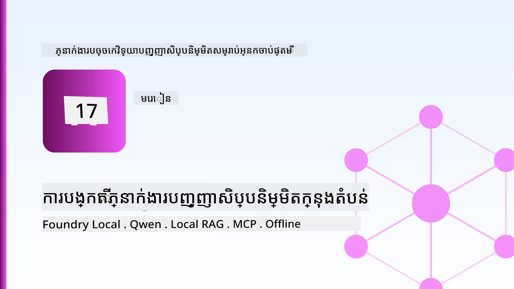
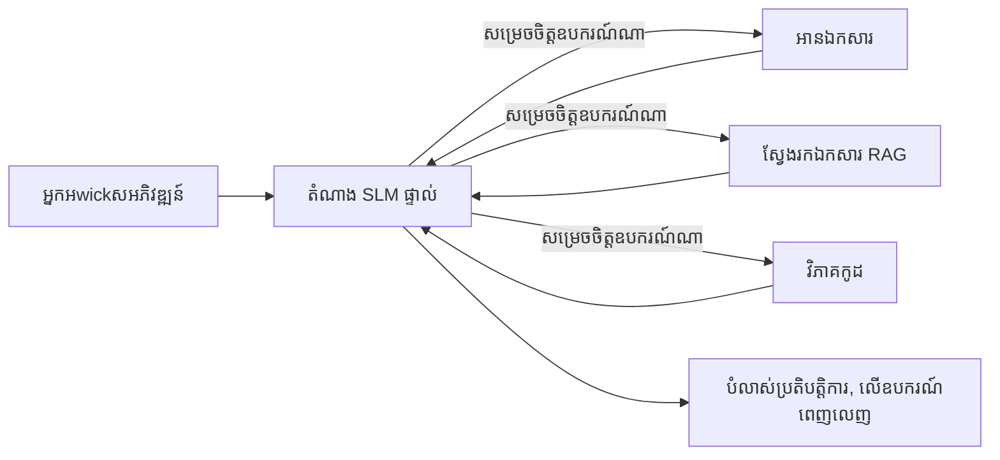
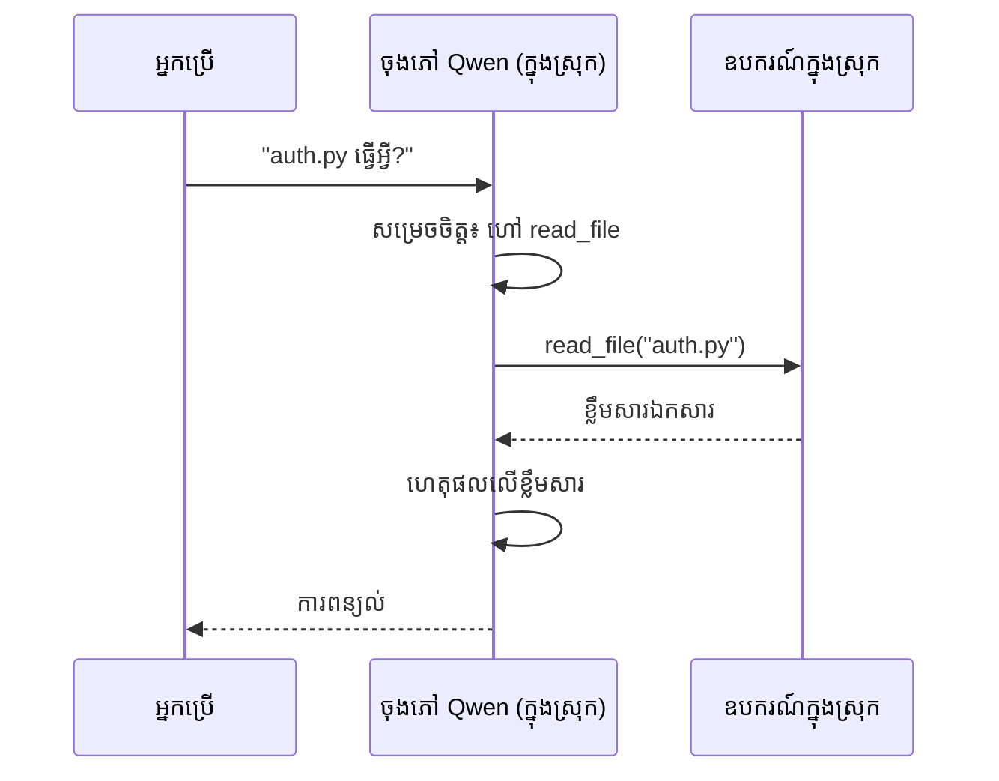
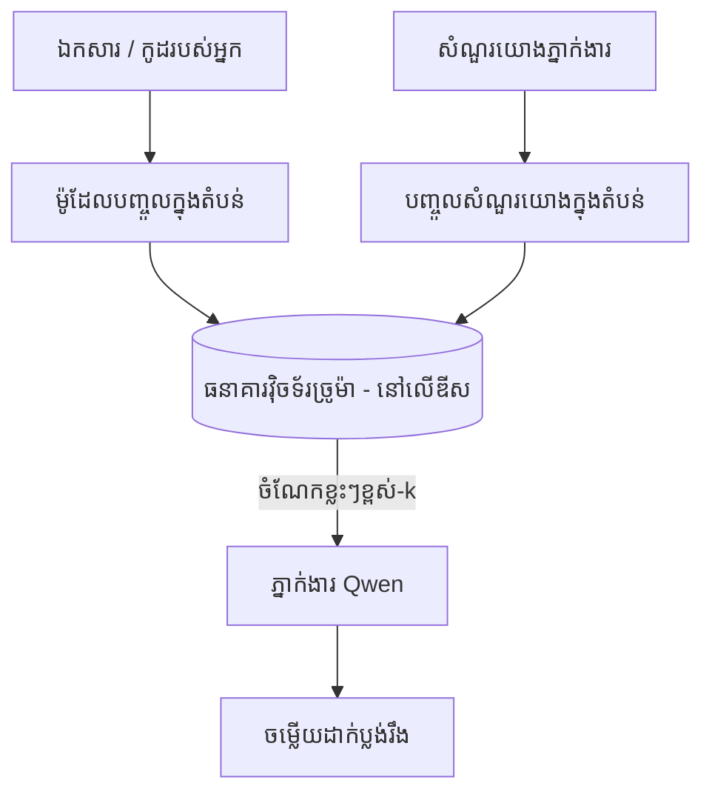
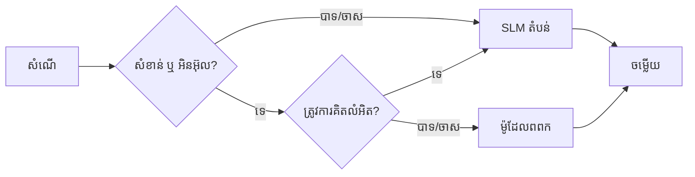

# បង្កើតភ្នាក់ងារបញ្ញាសិប្បនិម្មិតមូលដ្ឋានដោយប្រើ Microsoft Foundry Local និង Qwen



មេរៀនមុននេះបានបង្កើនទំហំភ្នាក់ងារជារូងចូលមេឃ។ មេរៀននេះនាំពួកវាចុះទៅលើកុំព្យូទ័រតែមួយ។ នៅចុងបញ្ចប់ អ្នកនឹងមានជំនួយការបច្ចេកទេសដែលដំណើរការបាន នឹកឃើញ សម្រង់ឧបករណ៍ អានឯកសាររបស់អ្នក និងស្វែងរកឯកសារជំនួយរបស់អ្នក — **ដោយមិនមានការហៅករណីបញ្ញាសិប្បនិម្មិតមេឃជាដើម។**

ហេតុអ្វីបានជាអ្នកចង់បានបែបនេះ? មានបីហេតុផលដែលបង្ហាញឡើងជាប្រចាំក្នុងការងារបច្ចេកទេសពិតប្រាកដ៖

- **ភាពឯកជន។** កូដ និងឯកសារមិនធ្លាក់ចេញពីកុំព្យូទ័រ។ គ្មានការបញ្ចូនពាក្យបញ្ជា ស្នាដៃ ឬទិន្នន័យអតិថិជនឆ្លងកាត់ព្រំដែនបណ្ដាញទេ។
- **ថ្លៃចំណាយ។** ការសន្និដ្ឋានមូលដ្ឋានមិនមានវិល័យពីរ Token ទេ។ អ្នកអាចធ្វើការសាកល្បងបានរាល់ថ្ងៃដោយថ្លៃបូកគិតតាមអគ្គិសនី។
- **ធ្វើការបិទភ្ជាប់។** នៅលើយន្តហោះ ក្នុងកន្លែងដែលមានសុវត្ថិភាព ឬពេលការផ្អាកការប្រើប្រាស់ បុគ្គលលោហៈនៅតែអាចដំណើរការ។

បញ្ហាគឺថាអ្នកកំពុងប្តូរគំរូបង្ហាញមេឃមួយសម្រាប់ **គំរូភាសាតូច (SLM)** ដែលដំណើរការលើ CPU, GPU, ឬ NPU របស់អ្នក។ មេរៀននេះគឺអំពីការសាងសង់ភ្នាក់ងារដែលមានគុណភាពក្នុងកំណត់នោះជាងតែធ្វើមើលថាកំណត់នោះមិនមាន។

## ការណែនាំ

មេរៀននេះគ្រប់គ្រងដូចតទៅ៖

- **គំរូភាសាតូច (SLMs)** — ជាអ្វី ព្រមទាំងកន្លែងដែលពួកវាអាចធ្វើបាន និងមិនអាចធ្វើបាន។
- **Microsoft Foundry Local** — គ្រប់ដំណើរការដែលទាញយក និងបម្រើគំរូនៅលើឧបករណ៍ដោយរយៈម៉ាស៊ីនតែមួយ តាមរយៈ **API ដែលសមរម្យជាមួយ OpenAI**។
- **គំរូហៅមុខងារ Qwen** — SLMs ដែលមានសុពលភាពផ្តល់ការហៅឧបករណ៍ ដែលធ្វើឲ្យភ្នាក់ងារលោកជាតិ *នៅលើកុំព្យូទ័រ* អាចដំណើរការបាន (មិនមែនតែជាចាត់តែសន្ទនា)។
- **ឧបករណ៍ការងារមូលដ្ឋាន RAG និង MCP** — ផ្តល់សមត្ថភាពឲ្យភ្នាក់ងារដោយគ្មានប្រើប្រាស់មេឃ។
- **គំរូបែបបញ្ចូល** — ពេលណាគួរតែរក្សាទុកមូលដ្ឋាន និងពេលណាគួរតែទៅរកមេឃ។

## គោលបំណងសិក្សា

បន្ទាប់ពីបញ្ចប់មេរៀននេះ អ្នកនឹងដឹងថាអាច៖

- ពន្យល់អំពីការជួញដូរសម្រួលរវាង SLMs ហើយជ្រើសរើសករណីប្រើប្រាស់ភ្នាក់ងារមូលដ្ឋានឲ្យសមរម្យ។
- បម្រើគំរូ Qwen មូលដ្ឋានជាមួយ Foundry Local ហើយភ្ជាប់វាតាមរយៈចំណុចចូលសមរម្យជាមួយ OpenAI។
- បង្កើតភ្នាក់ងារហៅឧបករណ៍ដែលដំណើរការចំពោះកុំព្យូទ័ររបស់អ្នកតែមួយ។
- បន្ថែម Local RAG លើឯកសាររបស់អ្នកដោយប្រើមូលដ្ឋានទិន្នន័យវែវទ័រមូលដ្ឋានរបស់កុំព្យូទ័រ (Chroma)។
- ភ្ជាប់ភ្នាក់ងារជាមួយម៉ាស៊ីន MCP មូលដ្ឋាន ហើយពិចារណាអំពីការរចនាបែបបញ្ចូលមូលដ្ឋាន/មេឃ។

## លក្ខខណ្ឌមុន

មេរៀននេះបំរាស់បំរើថាអ្នកបានបញ្ចប់មេរៀនមុនៗ ហើយមានជំនាញ៖

- [ការប្រើប្រាស់ឧបករណ៍](../04-tool-use/README.md) (មេរៀន 4) និង [Agentic RAG](../05-agentic-rag/README.md) (មេរៀន 5)។
- [ប្រព័ន្ធ Agentic / MCP](../11-agentic-protocols/README.md) (មេរៀន 11)។
- [Microsoft Agent Framework](../14-microsoft-agent-framework/README.md) (មេរៀន 14)។

អ្នកក៏ត្រូវការផងដែរ៖

- កុំព្យូទ័រអភិវឌ្ឍន៍មួយ។ **RAM 8 GB គឺជាចំនួនតិចបំផុតដែលទូលំទូលាយ**; 16 GB+ គឺងាយស្រួល។ GPU ឬ NPU ជួយបាន ប៉ុន្តែមិនរឹតបន្ទាប់ឡើយ។
- បានដំឡើង **Microsoft Foundry Local** (មើលផ្នែកដំឡើងខាងក្រោម)។
- Python 3.12+ និងកញ្ចប់នៅក្នុងឃ្លាំង [`requirements.txt`](../../../requirements.txt), បូករួម `foundry-local-sdk`, `openai`, និង `chromadb` សម្រាប់មេរៀននេះ។

## គំរូភាសាតូច៖ ឧបករណ៍ត្រឹមត្រូវសម្រាប់ការងារមូលដ្ឋាន

គំរូមេឃជាគំរូដែលមានប៉ារ៉ាម៉ែត្រ៖រាប់រយពាន់លាន និងមានមជ្ឈមណ្ឌលទិន្នន័យពីក្រោយ។ SLM មានប៉ារ៉ាម៉ែត្រចំនួនប៉ុន្មានពាន់លាន ហើយត្រូវតែដាក់បានក្នុង RAM នៃកុំព្យូទ័រយួរដៃរបស់អ្នក។ ភាពខុសគ្នានេះកំណត់ការរំពឹងទុកយ៉ាងច្បាស់។

**SLMs ល្អក្នុងការធ្វើ៖**

- ការងារដែលមានរចនាសម្ព័ន្ធ និងកំណត់ — ចាត់ថ្នាក់ ការដកសេចក្ដីសង្ខេប ឯកសារដែលបានស្គាល់។
- **ការហៅឧបករណ៍** — សម្រេចចិត្តថាតើហៅមុខងារអ្វី និងជាមួយអាគុយម៉ង់អ្វី។
- ការធ្វើការេតគ្រឹងលឿន និងថ្លៃថោក ព្រមទាំងភាពឯកជនលើទិន្នន័យផ្ទាល់ខ្លួន។

**SLMs ខ្សោយក្នុងការធ្វើ៖**

- ការត្រួតពិនិត្យច្រើនជំហាន ចាប់ពីបរិបទធំទូលាយ។
- ចំណេះដឹងបរិស្ស័យទូទៅ (ពួកវាធ្លាប់ឃើញតិចជាង ហើយភ្លេចបានច្រើន)។

របៀបជោគជ័យសម្រាប់ភ្នាក់ងារមូលដ្ឋានគឺ: **អនុញ្ញាតឲ្យ SLM គ្រប់គ្រង ប៉ុន្តែឲ្យឧបករណ៍ធ្វើការការងារកម្រ**។ គំរូមិនត្រូវតែនឹង *ស្គាល់* កូដរបស់អ្នកទេ — ត្រូវតែកំណត់ពេលណាហៅ `read_file` និង `search_docs`។ នេះជារបៀបដែលបញ្ចេញក្រសោប SLM។



## Microsoft Foundry Local

**Microsoft Foundry Local** គឺជាកម្មវិធីដំណើរការស្រាលដែលទាញយក គ្រប់គ្រង និងបម្រើគំរូទាំងស្រុងនៅលើម៉ាស៊ីនរបស់អ្នក។ លក្ខណៈសំខាន់បំផុតរបស់វាទៅកាន់យើងគឺបង្ហាញ **ចំណុចចូល HTTP សមរម្យជាមួយ OpenAI** — ដែលមានអរគុណថា OpenAI SDK និង Microsoft Agent Framework OpenAI client អាចប្រើជាមួយវាតាមរយៈការផ្លាស់ប្តូរ `base_url`តែប៉ុណ្ណោះ។ អ្វីៗដែលអ្នកបានរៀនអំពីការសាងសង់ភ្នាក់ងារត្រូវបានផ្ទេរត្រឹមតែចំណុចចូលប្តូរពីមេឃមកកាន់ `localhost`។

Foundry Local ក៏ជ្រើសរើសចាប់ជំនួសកំណែគំរូល្អបំផុតសម្រាប់រឹងម៉ាស៊ីនរបស់អ្នកដោយស្វ័យប្រវត្តិ — កំណែ CPU, កំណែ CUDA/GPU ឬ NPU — ដូច្នេះអ្នកមិនត្រូវផ្លាស់ប្តូរដោយដៃសម្រាប់ម៉ាស៊ីននីមួយៗទេ។

### ការដំឡើង

ដំឡើង Foundry Local (មើលឯកសារណែនាំ [documentation](https://learn.microsoft.com/azure/ai-foundry/foundry-local/) សម្រាប់ប្រព័ន្ធប្រតិបត្តិការ របស់អ្នក) បន្ទាប់មកធ្វើការបញ្ជាក់ថាវាដំណើរការ៖

```bash
# ធ្វើការតម្លើង (ឧទាហរណ៍; អនុវត្តតាមឯកសារសម្រាប់វេទិការបស់អ្នក)
winget install Microsoft.FoundryLocal      # វីនដូ
# brew install microsoft/foundrylocal/foundrylocal   # macOS

# ទាញយក និងរត់គំរូ Qwen មួយ បន្ទាប់មកចាប់ផ្តើមសេវាកម្មក្នុងស្រុក
foundry model run qwen2.5-7b-instruct
foundry service status
```

ពេលដែលសេវាកម្មកំពុងដំណើរការអ្នកមានចំណុចចូល OpenAI-compatible local (ធម្មតា `http://localhost:PORT/v1`)។ សៀវភៅកំណត់ត្រាប្រើ `foundry-local-sdk` ដើម្បីរកចំណុចចូលដោយស្វ័យប្រវត្តិ ដូច្នេះអ្នកមិនត្រូវបញ្ចូលលេខ Port ដោយដៃទេ។

## Qwen Function Calling៖ មូលហេតុដែលវាមានសារៈសំខាន់

ភ្នាក់ងារត្រូវតែជាភ្នាក់ងារ បើវាអាចហៅឧបករណ៍បាន។ SLMs ជាច្រើនអាចសន្ទនាបាន ប៉ុន្តែមិនមានសុពលភាពក្នុងការបង្កើតហៅឧបករណ៍ត្រឹមត្រូវ។ **គំរូ Qwen** ត្រូវបានហ្វឹកហាត់សម្រាប់ហៅមុខងារ ហើយបញ្ចេញរចនាសម្ព័ន្ធហៅឧបករណ៍បែបត្រឹមត្រូវជាប្រចាំ — ការនេះហើយនាំឲ្យម៉ូចាតមូលដ្ឋានបម្លែងទៅជាភ្នាក់ងារមូលដ្ឋាន។

ជំនួសស្វ័យប្រវត្តិហៅឧបករណ៍ជារង្វង់ដែលអ្នកបានស្គាល់ ស្ទើរតែដំណើរការនៅលើឧបករណ៍៖



## Local RAG

ការស្វែងរកឯកសារជីវិតនៅចំណុចដែលភ្នាក់ងារមូលដ្ឋានមានតម្លៃ។ ជំនួសការរំពឹងថា SLM មានឯកសាររចនាសម្ព័ន្ធ អ្នកបញ្ចូលវិចិត្រសញ្ញានៃឯកសារជាលេខតូចៗនៅក្នុង **មូលដ្ឋានទិន្នន័យវែវទ័រមូលដ្ឋានមូលដ្ឋានមូលដ្ឋាន** ហើយអោយភ្នាក់ងារទាញយកចំណុចមានសារៈសំខាន់នៅពេលត្រូវការ។

យើងប្រើ **Chroma** គឺជាស្តុរក្សាទិន្នន័យវែវទ័រដែលបញ្ចូលនៅក្នុងដំណើរការដោយគ្មានសេវាកម្មជួយគ្រប់គ្រង។ សំណង់បណ្ដាញគឺពេញលេញមូលដ្ឋាន៖ ម៉ូដែលបញ្ចូលមូលដ្ឋាន → វែវទ័រមូលដ្ឋាន → ការទាញយកមូលដ្ឋាន → SLM មូលដ្ឋាន។



នេះគឺជាអ្វីដែលចម្លងពីគំរូ Agentic RAG ក្នុងមេរៀន 5 — ផ្តល់ការផ្លាស់ប្តូរតែគ្រឿងផ្សំប៉ុណ្ណោះដែលរត់លើម៉ាស៊ីនរបស់អ្នក។

## ម៉ាស៊ីនមេ MCP មូលដ្ឋាន

[MCP](../11-agentic-protocols/README.md) គឺជាការដឹកជញ្ជូនមួយ មិនមែនសេវាកម្មមេឃទេ។ ម៉ាស៊ីនមេ MCP អាចដំណើរការជាដំណើរការមូលដ្ឋានលើ `stdio` ដែលបង្ហាញឧបករណ៍ទៅភ្នាក់ងារ ហើយប្រើប្រព័ន្ធស្តង់ដារ។ នេះអាចឲ្យអ្នកប្រើប្រាស់ម៉ាស៊ីនមេ MCP ដែលកំពុងដំណើរការជាច្រើន ដូចជា ការចូលប្រព័ន្ធឯកសារ ប្រតិបត្តិការហ្គីត សំណួរទិន្នន័យ ដោយគ្មានការតភ្ជាប់ទៅមេឃ។

ទស្សនៈសុវត្ថិភាពខុសពីមេឃ ប៉ុន្តែមិនបាត់បង់៖ ម៉ាស៊ីនមេ MCP មូលដ្ឋាននៅតែដំណើរការជាមួយសិទ្ធិរបស់អ្នកប្រើ ប្រាប់អោយកំណត់វិសាលភាពអ្វីដែលវាអាចប៉ះដល់ (ថតគម្រោង មិនមែនថតផ្ទះទាំងមូល) ហើយគួរសម្របសម្រួលលទ្ធផលរបស់វាទៅជា ទិន្នន័យបញ្ចូលសម្រាប់ផ្ទៀងផ្ទាត់។

## គំរូបញ្ចូលមេឃនិងមូលដ្ឋាន

មូលដ្ឋានជាមុនមិនមានន័យថាជា មូលដ្ឋានតែមួយ។ ប្រព័ន្ធមានវ័យវង្វេងគឺបញ្ជូនតាមភាពរក្សារពាត និងកំលូលៈ

| ស្ថានភាព | កន្លែងដំណើរការ |
| --- | --- |
| កូដ / ទិន្នន័យដែលមានអានុភាព ឬបិទភ្ជាប់ | **SLM មូលដ្ឋាន** |
| ការងារងាយស្រួល កំណត់ | **SLM មូលដ្ឋាន** (ថ្លៃថោក លឿន) |
| ការត្រួតពិនិត្យច្រើនជំហានលំបាកលើទិន្នន័យមិនសំខាន់ | **គំរូមេឃ** |
| អ្វីគ្រប់យ៉ាង ពេលការផ្អាក | **SLM មូលដ្ឋាន** (ការធ្លាក់ថយយ៉ាងរាបសារ) |

នេះតំណាងឲ្យគំនិត **កំពង់ផែគំរូ** ពីមេរៀន 16 — ប៉ុន្តែមួយក្នុងចំណោមគំរូ "គំរូ" គឺជាម៉ាស៊ីនរបស់អ្នក។ ទិដ្ឋភាពរចនាកម្រិតខ្ពស់ វិលទៅមូលដ្ឋានពេលមេឃមិនអាចប្រើបាន ដូច្នេះភ្នាក់ងារធ្លាក់ថយគុណភាពជាងបរាជ័យនៅមិនឲ្យកើតឡើង។



## បរិយាកាសអនុវត្ត៖ ជំនួយការបច្ចេកទេសមូលដ្ឋាន

បើក [`code_samples/17-local-agent-foundry-local.ipynb`](./code_samples/17-local-agent-foundry-local.ipynb) ហើយធ្វើការសិក្សាតាម។ អ្នកនឹងបង្កើត **ជំនួយការបច្ចេកទេសមូលដ្ឋាន** ដែលដំណើរការចំពោះកុំព្យូទ័ររបស់អ្នក ហើយអាច៖

1. **ហៅឧបករណ៍** — តាមរយៈ Qwen function calling តាម Foundry Local។
2. **អនុវត្តប្រតិបត្តិការឯកសារមូលដ្ឋាន** — បញ្ជី និងអានឯកសារពីថតគម្រោងមួយ។
3. **វិភាគកូដ** — របាយការណ៍មាត្រដ្ឋានមូលដ្ឋានលើឯកសារប្រភពមួយ។
4. **ស្វែងរកឯកសារ** — Local RAG លើថតឯកសារជាមួយ Chroma។
5. **ប្រើ MCP** — ភ្ជាប់ទៅម៉ាស៊ីនមេ MCP មូលដ្ឋាន (ជាមួយការជៀសវាងស្ទាត់ករណីមិនមានម៉ាស៊ីនមេប្រើប្រាស់)។

គ្មានការហៅករណីបញ្ញាសិប្បនិម្មិតមេឃណាមួយប្រើនៅពេលណាទេ។

### ដំណើរការរយៈពេលវេលា

ជំនួយការ ភ្ជាប់ទៅ Foundry Local តាមចំណុចចូលដែលសមរម្យជាមួយ OpenAI ដូច្នេះកូដភ្នាក់ងារត្រូវស្រដៀងគ្នាច្រើនជាមួយមេរៀនមេឃ — ផ្លាស់ប្តូរតែ Client ប៉ុណ្ណោះ។

```python
from foundry_local import FoundryLocalManager
from openai import OpenAI

# Foundry Local រកឃើញ/ទាញយកម៉ូដែលនិងផ្តល់ឲ្យយើងនូវចំណុចបញ្ចប់ក្នុងស្រុក។
manager = FoundryLocalManager(\"qwen2.5-7b-instruct\")
client = OpenAI(base_url=manager.endpoint, api_key=manager.api_key)  # api_key គឺជាផ្ទាំងកន្លែងសម្រាប់ក្នុងស្រុក។
```

ឧបករណ៍គឺជា Python functions ធម្មតាដែលកំណត់ជួរផ្នែកលើថតគម្រោងមួយ៖

```python
def read_file(path: str) -> str:
    \"\"\"Read a file, but only inside the sandboxed project directory.\"\"\"
    full = (PROJECT_ROOT / path).resolve()
    if PROJECT_ROOT not in full.parents and full != PROJECT_ROOT:
        return \"Access denied: path is outside the project directory.\"
    return full.read_text(encoding=\"utf-8\")
```

ចំណាំការត្រួតពិនិត្យSandbox — ទោះបីនៅក្នុងមូលដ្ឋានក៏ដោយ ឧបករណ៍អានផ្លូវណាមួយពិត​ជា អាចបង្កអំពើហិង្សា។ សៀវភៅកំណត់ត្រួតពិនិត្យឲ្យឧបករណ៍ទាំងអស់នៅក្នុងកំណត់ថតគម្រោងតែមួយ។

## ពិនិត្យចំណេះដឹង

សាកល្បងយកចំណេះដឹងរបស់អ្នកមុនចូលទៅប្រទេសការងារ។

**1. ផ្តល់ហេតុផលពីរដើម្បីដំណើរការភ្នាក់ងារមូលដ្ឋានជំនួសជាមេឃ។**

<details>
<summary>ចម្លើយ</summary>

មួយក្នុងចំណោម: **ភាពឯកជន** (កូដ និងទិន្នន័យមិនចេញពីម៉ាស៊ីន), **ថ្លៃឈ្នួលមិនមានវិល័យពីរ Token** និង **សមត្ថភាពបិទភ្ជាប់** (ដំណើរការបានពេលគ្មានបណ្ដាញ — លើយន្តហោះ នៅកន្លែងសុវត្ថិភាព ឬពេលបាត់បង់ភ្ជាប់)។ ការរឹតត្បិតអំពីច្បាប់ឬបទបញ្ញត្តិនាំឲ្យមិនអនុញ្ញាតឲ្យបញ្ជូនទិន្នន័យចេញពីឧបករណ៍គឺហេតុផលនៃភាពឯកជន។
</details>

**2. តើការបែងចែកការងារដែលណែនាំរវាង SLM និងឧបករណ៍នៅក្នុងភ្នាក់ងារមូលដ្ឋានគឺដូចម្តេច ហើយហេតុអ្វី?**

<details>
<summary>ចម្លើយ</summary>

ឲ្យ SLM **គ្រប់គ្រង** (សម្រេចចិត្តថាតើហៅឧបករណ៍អ្វី និងជាមួយអាគុយម៉ង់អ្វី) និងឲ្យ **ឧបករណ៍ធ្វើការងារទំងន់ធ្ងន់** (អានឯកសារ ទាញយកឯកសារ គណនា លទ្ធផល)។ SLM ធ្លាប់មានភាពជាអ្នកសម្រេចចិត្តកំណត់ ដូចជាការជ្រើសរើសឧបករណ៍ ប៉ុន្តែខ្សោយចំណេះនៅទូលាយ និងការត្រួតពិនិត្យច្រើនជំហានយូរ ដូច្នេះការពឹងផ្អែកលើឧបករណ៍ជួយបង្ហាញកំណត់សមត្ថភាពរបស់ពួកវា។
</details>

**3. តើអ្វីជាអ្វីដែលធ្វើឲ្យអាចប្រើវិញកូដភ្នាក់ងារមេឃជាមួយ Foundry Local?**

<details>
<summary>ចម្លើយ</summary>

Foundry Local បង្ហាញ **ចំណុចចូល HTTP សមរម្យជាមួយ OpenAI**។ OpenAI SDK និង Agent Framework OpenAI client អាចប្រើវាបានដោយផ្លាស់ប្តូរតែ `base_url` (និងប្រើ API key ជំនួសក្នុងមូលដ្ឋាន)។ អ្វីដែលនៅសល់នៃកូដភ្នាក់ងារស្រដៀងគ្នាទាំងស្រុង។
</details>

**4. ហេតុអ្វីបានជាយើងប្រើគំរូហៅមុខងារ Qwen ជាក់លាក់ មិនប្រើ SLM ណាមួយទេ?**

<details>
<summary>ចម្លើយ</summary>

ពីព្រោះភ្នាក់ងារត្រូវការបង្កើត **ការហៅឧបករណ៍** ដែលមានសុពលភាព និងរឹងប៉ឹង។ SLMs ខ្លះអាចសន្ទនាបាន ប៉ុន្តែបញ្ចេញរចនាសម្ព័ន្ធហៅឧបករណ៍ខូចឬមិនស្របតាម។ គំរូ Qwen ត្រូវបានហ្វឹកហាត់សម្រាប់ហៅមុខងារ ហើយបញ្ចេញការហៅឧបករណ៍ជាប្រចាំ ដែលធ្វើឲ្យម៉ូចាតមូលដ្ឋានបម្លែងទៅជាភ្នាក់ងារមូលដ្ឋានដំណើរការ។
</details>

**5. ក្នុងបណ្តាញ Local RAG ឧបករណ៍ណាត្រូវដំណើរការលើម៉ាស៊ីន?**

<details>
<summary>ចម្លើយ</summary>

ពួកវាគ្រប់គ្នា៖ ម៉ូដែលបញ្ចូល, មូលដ្ឋានទិន្នន័យវែវទ័រ (Chroma នៅលើឌីស), ជំហានទាញយក, និង SLM។ ឯកសារត្រូវបានបញ្ចូលមូលដ្ឋាន, រក្សាទុកមូលដ្ឋាន, ទាញយកមូលដ្ឋាន, និង សង្កេតដោយគំរូមូលដ្ឋាន — គ្មានផ្នែកណាត្រូវចូលទៅមេឃទេ។
</details>

**6. ម៉ាស៊ីនមេ MCP មូលដ្ឋានដំណើរការលើម៉ាស៊ីនរបស់អ្នក។ តើនោះធ្វើអោយវាសុវត្ថិដោយស្វ័យប្រវត្តិទេ? តើអ្នកត្រូវយកការប្រុងប្រយ័ត្នអ្វីបន្ថែមទៀត?**

<details>
<summary>ចម្លើយ</summary>

មិនទេ។ ម៉ាស៊ីនមេ MCP មូលដ្ឋានដំណើរការជាមួយសិទ្ធិរបស់អ្នកប្រើ ដូច្នេះវាអាចប៉ះពាល់អ្វីដែលអ្នកអាចប៉ះបាន។ កំណត់វាទៅតាមអ្វីដែលវាត្រូវការ (ឧទាហរណ៍ថតគម្រោងតែមួយ មិនមែនថតផ្ទះទាំងមូល) ហើយរក្សាទុកលទ្ធផលជាទិន្នន័យបញ្ចូលសម្រាប់ពិនិត្យមុនប្រើប្រាស់។
</details>

**7. សូមពិពណ៌នាអំពីច្បាប់ត្រួតសម្ភាសដែលសមរម្យ ដែលរាប់បញ្ចូលគំរូមូលដ្ឋានមួយ។**

<details>
<summary>ចម្លើយ</summary>

បញ្ជូនសំណើដែលមានភាពរក្សារពាត ឬបិទភ្ជាប់ទៅ SLM មូលដ្ឋាន; បញ្ជូនការងារងាយស្រួលកំណត់ទៅ SLM មូលដ្ឋាន ដើម្បីលឿន និងថ្លៃថោក; បញ្ជូនការត្រួតពិនិត្យច្រើនជំហានលំបាកលើទិន្នន័យមិនសំខាន់ទៅគំរូមេឃ; ហើយវិលត្រឡប់ទៅ SLM មូលដ្ឋាន ប្រសិនបើមេឃមិនអាចប្រើបាន ដើម្បីឲ្យភ្នាក់ងារធ្លាក់ថយយ៉ាងរាបសារ មិនបរាជ័យទាំងស្រុង។ នេះគឺជាកំពង់ផែគំរូ (មេរៀន 16) ដោយម៉ាស៊ីនរបស់អ្នកជាមួយគំរូមួយក្នុងចំណោមគំរូ។
</details>

**8. តើតម្លៃ RAM តិចបំផុតសម្រាប់ដំណើរការភ្នាក់ងារមូលដ្ឋានក្នុងមេរៀននេះមានប៉ុន្មាន ហើយ RAM ច្រើនជួយអ្វី?**

<details>
<summary>ចម្លើយ</summary>

ប្រហែល **8 GB** គឺតិចបំផុតដែលសមរម្យ; 16 GB+ គឺងាយស្រួល។ RAM ច្រើនជួយអ្នកដំណើរការគំរូធំធេង និងមាន សមត្ថភាពខ្ពស់ និងរក្សាបរិបទច្រើនក្នុងម៉េម៉ូរី។ GPU ឬ NPU ធ្វើឲ្យវាលឿនក្នុងការសន្និដ្ឋាន ប៉ុន្តែមិនចាំបាច់ទេ — Foundry Local ជ្រើសរើសកំណែ CPU បើគ្មានឧបករណ៍ដំណើរការជំនួយ។
</details>

## មុខងារងារ

ពង្រីកជំនួយការបច្ចេកទេសមូលដ្ឋានទៅជាអ្នកពិនិត្យឯកសារមូលដ្ឋានសម្រាប់គម្រោងតូចមួយដែលអ្នកចូលចិត្ត (ប្រើថតមេរៀនមួយនៅក្នុងបណ្ណដា repo នេះ បើអ្នកចូលចិត្ត)។

ការដាក់ស្នើរបស់អ្នកគួរតែ៖

1. **ជម្រេីសថតឯកសារ/កូដពិត** ទៅក្នុង Chroma (យ៉ាងហោចណាស់ ៥ ឯកសារ)។
2. **ដាក់ឧបករណ៍ `find_todos`** ដែលស្កេនគម្រោងសម្រាប់ចំណាំ `TODO`/`FIXME` ហើយបញ្ចូនជាមួយឈ្មោះឯកសារ និងលេខខួប — រក្សាការត្រួតពិនិត្យ sandbox ដូច `read_file`។

3. **សួរអ្នកប្រតិបត្តិការបីសំណួរ** ដែលបណ្តាលឱ្យវាត្រូវបញ្ចូលឧបករណ៍: សំណួរមួយ RAG ពិតប្រាកដមួយ, សំណួរមួយដែលត្រូវការអានឯកសារពិសេសមួយ, និងសំណួរមួយដែលត្រូវការស្វែងរក TODOs។
4. **វាស់វែងវា**: វេលាឆ្លើយតបទាំងបីនោះ ហើយកត់សម្គាល់នៅក្នុងកោសិកា markdown មួយ។ អ្នកអាចយល់ថា​ពេលយឺតនេះ​ទទួលយក​បាន​សម្រាប់លំហូរការងារដែលអ្នកចង់បានទេ។

បន្ទាប់មកសរសេរបថ្ចេកខ្លីអំពី **អ្វីដែលអ្នកនឹងផ្លាស់ប្តូរទៅក្នុងពពក និងអ្វីដែលអ្នកនឹងរក្សាទុកក្នុងកន្លែងក្នុងម៉ាស៊ីន** សម្រាប់អ្នកពិនិត្យនេះ ហើយហេតុអ្វី។ អ្នកត្រូវបានវាយតម្លៃថា ឧបករណ៍ក្នុងកន្លែងត្រូវបានភ្ជាប់គ្នាឲ្យត្រឹមត្រូវ និងតើការត្រួតពិនិត្យចម្រុះរបស់អ្នកគួរឱ្យទុកចិត្ត ឬ មិនមែនលើគុណភាពម៉ូឌែលទេ។

## សេចក្ដីសង្ខេប

ក្នុងមេរៀននេះ អ្នកបានបង្កើតអ្នកប្រតិបត្តិការដែលដំណើរការបំពេញនៅលើម៉ាស៊ីនរបស់អ្នកដោយផ្ទាល់:

- **SLMs** ជួញដូរព្រីដ្ឋភាពសម្រាប់ភាពឯកជន, ថ្លៃដើម, និងប្រតិបត្តិនៅក្រៅបណ្តាញ — ហើយ​បង្ហាញភាពល្អពេលដែលវា **រៀបចំឧបករណ៍** ជំនួសការពេញលេញនៃចំណេះដឹងដោយខ្លួនឯង។
- **Foundry Local** បម្រើម៉ូឌែលនៅលើឧបករណ៍ក្រោយពេលហៅហើយកាន់តែបង្ហាញនូវ **ចំណុចចេញផ្សាយដែលអាចផ្គូផ្គង OpenAI** ដូច្នេះកូដភ្នាក់ងារពពករបស់អ្នកអាចផ្លាស់ប្តូរបានដោយបម្លែងមួយជាប់។ 
- **ម៉ូឌែលហៅមុខងារ Qwen** អនុញ្ញាតឱ្យហៅឧបករណ៍ក្នុងកន្លែងបានយ៉ាងរឹងប៉ឹង — ហើយពាក់ព័ន្ធពាក់ព័ន្ធនឹងភ្នាក់ងារក្នុងកន្លែង។
- **RAG ក្នុងកន្លែង** (Chroma) និង **MCP ក្នុងកន្លែង** ផ្ដល់សមត្ថភាពដល់ភ្នាក់ងារដោយគ្មានការចាកចេញពីម៉ាស៊ីន។
- **គំរូចម្រុះ** អនុញ្ញាតឱ្យអ្នកផ្ញើរតាមភាពអារម្មណ៍និងភាពលំបាក ដោយមានកន្លែងក្នុងម៉ាស៊ីនជាជម្រើសជំនួសដោយផ្អែមល្ហែម។

នេះបញ្ចប់ដំណើរផ្សាយផ្សងបន្តរណ៍ ៖ មេរៀនទី១៦ បានពង្រីកភ្នាក់ងារទៅកាន់ Microsoft Foundry, ហើយមេរៀននេះបានថយចុះទៅលើកុំព្យូទ័រតែមួយ។ មេរៀនបន្ទាប់នឹងផ្ដោតទៅលើការជួយការពារភ្នាក់ងារដែលបានផ្សាយ។

## ឯកសារបន្ថែម

- <a href="https://learn.microsoft.com/azure/ai-foundry/foundry-local/" target="_blank">ឯកសារពាក់ព័ន្ធ Foundry Local របស់ Microsoft</a>
- <a href="https://learn.microsoft.com/azure/ai-foundry/what-is-azure-ai-foundry" target="_blank">ឯកសារពាក់ព័ន្ធ Microsoft Foundry</a>
- <a href="https://aka.ms/ai-agents-beginners/agent-framework" target="_blank">ស្ថាបត្យកម្មភ្នាក់ងារបស់ Microsoft</a>
- <a href="https://qwen.readthedocs.io/en/latest/framework/function_call.html" target="_blank">ឯកសារហៅមុខងាររបស់ Qwen</a>
- <a href="https://modelcontextprotocol.io/" target="_blank">ប្រព័ន្ធគោលការណ៍បរិបទម៉ូឌែល (MCP)</a>
- <a href="https://docs.trychroma.com/" target="_blank">មូលដ្ឋានទិន្នន័យវ៉ិចទ័រ Chroma</a>

## មេរៀនមុន

[ការចេញផ្សាយភ្នាក់ងារដែលអាចប្រើបានធំទូលាយ](../16-deploying-scalable-agents/README.md)

## មេរៀនបន្ទាប់

[ការការពារភ្នាក់ងារបច្ចេកវិទ្យាបញ្ញាសិប្បនិម្មិត្ត](../18-securing-ai-agents/README.md)

---

<!-- CO-OP TRANSLATOR DISCLAIMER START -->
**ការបដិសេធ**:
ឯកសារនេះត្រូវបានបម្លែងភាសា ដោយប្រើសេវាបម្លែងភាសា AI [Co-op Translator](https://github.com/Azure/co-op-translator)។ ទោះយើងខ្ញុំមានក្តីប្រាថ្នាឱ្យបានច្បាស់លាស់ តែសូមយល់ដឹងថាការបម្លែងដោយស្វ័យប្រវត្តិក៏អាចមានកំហុសឬភាពមិនត្រឹមត្រូវ។ ឯកសារដើមជាភាសាទីតាំងគួរត្រូវបានគេប្រើជាប្រភពច្បាស់លាស់។ សម្រាប់ព័ត៌មានសំខាន់ៗ សូមណែនាំឱ្យប្រើប្រាស់ការប្រែដោយមនុស្សជំនាញ។ យើងខ្ញុំមិនទទួលខុសត្រូវចំពោះការយល់ច្រឡំ ឬការបកស្រាយខុសបន្ទាប់ពីការប្រើប្រាស់ការបម្លែងនេះនោះទេ។
<!-- CO-OP TRANSLATOR DISCLAIMER END -->