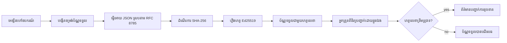
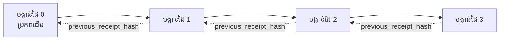

[មើលវីដេអូមេរៀន: ការការពារ​ប្រតិភូត AI ជាមួយ​របាយការណ៍គ្រីបតូក្រាហ្វី](https://youtu.be/PLACEHOLDER_VIDEO_ID)

> _(វីដេអូមេរៀន និងរូបភាពខាងឆ្វេង នឹងត្រូវបានបន្ថែមដោយក្រុមមាតិកា Microsoft បន្ទាប់ពីការរួមបញ្ចូល ដោយប្រើលំនាំមេរៀនទី 14 / 15)_

# ការការពារ​ប្រតិភូត AI ជាមួយ​របាយការណ៍គ្រីបតូក្រាហ្វី

## ការណែនាំ

មេរៀននេះនឹងគ្របដណ្តប់៖

- ហេតុអ្វីបានជា audit trails សម្រាប់​ប្រតិភូត AI មានសារៈសំខាន់សម្រាប់ការបំពេញគោលការណ៍, ការជួសជុលបញ្ហា និងការជឿទុកចិត្ត។
- របាយការណ៍គ្រីបតូក្រាហ្វីគឺជាអ្វី ហើយវាផ្សេងពីបណ្ដាញកំណត់លើកតែមិនបានចូលហត្ថលេខាដូចម្តេច។
- របៀបផលិត​របាយការណ៍​មានហត្ថលេខាសម្រាប់ការហៅឧបករណ៍របស់​ប្រតិភូតក្នុង Python រង់។
- របៀបផ្ទៀងផ្ទាត់របាយការណ៍អូហ្វឡាញ និងរកឃើញការបន្លំ។
- របៀបចងរបាយការណ៍ជាសួងដើម្បីធានាថាការដកចេញឬប្តូរតម្រៀបរបាយការណ៍មួយនឹងបំបែកសួង។
- របាយការណ៍បង្ហាញអ្វី និងអ្វីដែលវាបញ្ជាក់មិនបាន។

## គោលបំណងរៀន

បន្ទាប់ពីបញ្ចប់មេរៀននេះ អ្នកនឹងដឹងពីរបៀប៖

- កំណត់មុខងារបរាជ័យដែលជាមូលហេតុមួយសម្រាប់ការផ្ដល់ប្រភពគ្រីបតូក្រាហ្វីសម្រាប់សកម្មភាពប្រតិភូត។
- ផលិត​របាយការណ៍​មានហត្ថលេខា Ed25519 លើ payload JSON មួយដែលមានសម្រួល។
- ផ្ទៀងផ្ទាត់របាយការណ៍ដោយឯករាជ្យដោយប្រើតែឈ្មោះសាធារណៈនៃអ្នកហត្ថលេខា។
- រកឃើញការបន្លំដោយបើកផ្ទៀងផ្ទាត់ឡើងវិញលើ​របាយការណ៍ដែលបានកែប្រែ។
- បង្កើតស៊េរីរបាយការណ៍ដែលចងខ្សែកូដ ហើយពន្យល់មកលើហេតុផលដែលសួងមានសារៈសំខាន់។
- ស្គាល់ព្រំដែនរវាងអ្វីដែលរបាយការណ៍បញ្ជាក់ (ការចងក្រង, ភាពស្មើរមាន, ការរៀបចំ) និងអ្វីដែលវាមិនបញ្ជាក់ (ភាពត្រឹមត្រូវនៃសកម្មភាព, ភាពភរិយាដោយគោលការណ៍)។

## បញ្ហា៖ របាយការណ៍តាមដានប្រតិភូតរបស់អ្នក

សូមចូលចិត្តថាអ្នកបានបញ្ចូលប្រតិភូត AI សម្រាប់ Contoso Travel។ ប្រតិភូតនេះអានសំណើរពីអតិថិជន ទៅហៅ API សម្រាប់ស្វែងរកជម្រើសជាហោះហើរ ហើយកក់កៅអីជំនួសអតិថិជន។ ក្នុងត្រីមាសចុងក្រោយ អ្នកប្រតិភូតបានដំណើរការ ការកក់ជាង 50,000 ដង។

ថ្ងៃនេះ អ្នកត្រួតពិនិត្យមកដល់ ហើយសួរចំពោះសំណួរងាយៗ៖ "បង្ហាញជូនខ្ញុំអ្វីដែលប្រតិភូតរបស់អ្នកបានធ្វើ។"

អ្នកផ្តល់ឯកសារកំណត់ត្រារបស់អ្នក។ អ្នកត្រួតពិនិត្យមើលហើយសួរអ្វីដែលញឹកញាប់៖ "តើធ្វើយ៉ាងដូចម្តេចខ្ញុំនឹងដឹងថាកំណត់ត្រានេះមិនត្រូវបានកែប្រែ?"

នេះជាបញ្ហារបាយការណ៍តាមដាន។ ការដំឡើងប្រតិភូតភាគច្រើនសព្វថ្ងៃពឹងផ្អែកលើ៖

- **កំណត់ត្រាកម្មវិធី** ៖ ដែលបានសរសេរដោយប្រតិភូតផ្ទាល់ អាចកែប្រែបានដោយនរណាមួយដែលមានការចូលដំណើរការលើប្រព័ន្ធហត្ថលេខា។
- **សេវាកម្មកំណត់ត្រាក្លោឌ** ៖ មានការបង្ហាញព័ត៌មានបន្លំក្រោមកម្រិតវេទិកាទេ តែមានប្រសិទ្ធភាពតែពេលអ្នកត្រួតពិនិត្យទុកចិត្តចំពោះអង្គការវេទិកា។
- **កំណត់ត្រាប្រតិបត្តិការមូលដ្ឋានទិន្នន័យ** ៖ សមស្របសម្រាប់ការផ្លាស់ប្តូរប្រព័ន្ធទិន្នន័យ ប៉ុន្តែមិនសមស្របសម្រាប់ការហៅឧបករណ៍ដោយចៃដន្យ។

គ្មានអ្វីទាំងនេះអាចឆ្លើយសំណួររបស់អ្នកត្រួតពិនិត្យដោយគ្មានការទាមទារឲ្យពួកគេទុកចិត្តនរណាមួយ (អ្នក ផ្តល់សេវាកម្មក្លោឌ រឺ អ្នកផ្គត់ផ្គង់មូលដ្ឋានទិន្នន័យ)។ សម្រាប់ការប្រើប្រាស់ក្នុងផ្ទៃក្នុង ការទុកចិត្តនេះគឺអាចទទួលយកបាន។ សម្រាប់ការងារដែលត្រូវបានគ្រប់គ្រង (ហិរញ្ញវត្ថុ សុខាភិបាល ឬអ្វីដែលស្ថិតក្រោមច្បាប់ EU AI) វាមិនអាចទទួលយកបានទេ។

របាយការណ៍គ្រីបតូក្រាហ្វីដោះស្រាយបញ្ហានេះដោយធ្វើឲ្យសកម្មភាពប្រតិភូតនីមួយៗអាចផ្ទៀងផ្ទាត់ដោយឯករាជ្យ។ អ្នកត្រួតពិនិត្យមិនចាំបាច់ទុកចិត្តអ្នកទេ ពួកគេត្រូវការតែសោសាធារណៈនិងរបាយការណ៍ផ្ទាល់។

## របាយការណ៍គ្រីបតូក្រាហ្វីគឺជាអ្វី?

របាយការណ៍គឺជា​វត្ថុ JSON មួយដែលកត់ត្រាអំពីអ្វីដែល​ប្រតិភូតបានធ្វើ ហើយបានចុះហត្ថលេខា​ដោយហត្ថលេខាឌីជីថល។



របាយការណ៍តូចបំផុតមានរូបរាងដូចខាងក្រោម៖

```json
{
  "type": "agent.tool_call.v1",
  "agent_id": "contoso-travel-bot",
  "tool_name": "lookup_flights",
  "tool_args_hash": "sha256:a3f9c1...",
  "result_hash": "sha256:7b2e1d...",
  "policy_id": "contoso-travel-policy-v3",
  "timestamp": "2026-04-25T14:30:00Z",
  "sequence": 47,
  "previous_receipt_hash": "sha256:9d4e6a...",
  "signature": {
    "alg": "EdDSA",
    "sig": "c5af83...",
    "public_key": "8f3b2c..."
  }
}
```

លក្ខណៈបីនេះកំពុងតែបញ្ចាំងការ​ធ្វើការ៖

1. **ហត្ថលេខា**។ របាយការណ៍ត្រូវបានចុះហត្ថលេខា​ដោយប្រព័ន្ធច្រករបស់ប្រតិភូត ដែលប្រើកូនសោឯកជន Ed25519។ អ្នកណាមួយដែលមានសោសាធារណៈអាចផ្ទៀងផ្ទាត់ហត្ថលេខាបានអូហ្វឡាញ។ ការបន្លំក្នុង​ដែនណាមួយនៃរបាយការណ៍នឹងបំបែកហត្ថលេខា។

2. **ការអ៊ិនកូដគែនិចល (Canonical encoding)**។ មុនពេលចុះហត្ថលេខា របាយការណ៍ត្រូវបានស្រាលចេញដោយប្រើស្ដង់ដារ JSON Canonicalization Scheme (JCS, RFC 8785)។ វាបញ្ជាក់ថាការអនុវត្តពីរដែលផលិតរបាយការណ៍ដូចគ្នានឹងបញ្ចេញលទ្ធផលផ្ទាល់ខ្លួនស្មើគ្នានៅក្នុងបង្ហាញបៃទ។ បើគ្មាន canonicalization អ្នកអាចមានកូដ JSON ផ្សេងៗដែលផលិតហត្ថលេខាផ្សេងគ្នាសម្រាប់មាតិកាដូចគ្នា។

3. **ការចងខ្សែកូដ hash chaining**។ ដែន `previous_receipt_hash` ផ្ដល់ភាពតភ្ជាប់រវាងរបាយការណ៍មួយទៅមួយមុន។ ការដកចេញ ឬប្តូរតម្រៀបរបាយការណ៍មួយនឹងបំបែករបាយការណ៍ដែលបន្ទាប់ប្រើវា។ ការបន្លំកាន់តែច្បាស់នៅលើកម្រិតសួង ទោះបីបិទសញ្ញាលេខមួយៗជោគជ័យក៏ដោយ។

លក្ខណៈទាំងនេះផ្តល់នូវការធានាដូចខាងក្រោម៖

- **ការចងក្រង**: គោលសញ្ញានេះបានចុះហត្ថលេខាដល់មាតិកានេះ។
- **ភាពស្មើរមាន**: មាតិកាមិនបានផ្លាស់ប្តូរពីពេលចុះហត្ថលេខាទេ។
- **ការរៀបចំ**: របាយការណ៍នេះបានបង្ហាញក្រោយរបាយការណ៍នោះនៅក្នុងសួង។

## ការផលិតរបាយការណ៍ក្នុង Python

អ្នកមិនចាំបាច់ប្រើបណ្ណាល័យពិសេសណាមួយសម្រាប់ផលិតរបាយការណ៍។ វិធីគ្រីបតូក្រាហ្វីមានស្រាប់ និងកូដភាសា Python មិនច្រើនទេ។

ការហាត់ប្រាណដៃ ក្នុង `code_samples/18-signed-receipts.ipynb` នឹងធ្វើការបង្ហាញជំហានពេញលេញ។ ជាសង្ខេប៖

```python
import json
import hashlib
import base64
from nacl import signing
from jcs import canonicalize  # JSON ការ្មងតាម RFC 8785

def b64url_nopad(data: bytes) -> str:
    return base64.urlsafe_b64encode(data).decode("ascii").rstrip("=")

def sha256_canonical(obj) -> str:
    """SHA-256 of a Python object's JCS-canonical JSON form."""
    return f"sha256:{hashlib.sha256(canonicalize(obj)).hexdigest()}"

# បង្កើត ឬផ្ទុកកូនសោហត្ថជូន (ក្នុងការផលិត, រក្សាទុកនៅក្នុងគោលដៅកូនសោ)
signing_key = signing.SigningKey.generate()
verify_key = signing_key.verify_key

# សង់ទម្រង់ប៊ិចបញ្ជាក់ (មិនទាន់មានហត្ថលេខា)
tool_args = {"origin": "SYD", "destination": "LAX"}
tool_result = [{"flight": "QF11", "price": 1850, "stops": 0}]

payload = {
    "type": "agent.tool_call.v1",
    "agent_id": "contoso-travel-bot",
    "tool_name": "lookup_flights",
    "tool_args_hash": sha256_canonical(tool_args),
    "result_hash": sha256_canonical(tool_result),
    "policy_id": "contoso-travel-policy-v3",
    "timestamp": "2026-04-25T14:30:00Z",
    "sequence": 0,
    "previous_receipt_hash": None,
}

# បំលាស់ជាារ្សស្ដង់ដារ, ធ្វើ hash, ហត្ថលេខា។
canonical_bytes = canonicalize(payload)
message_hash = hashlib.sha256(canonical_bytes).digest()
signature_bytes = signing_key.sign(message_hash).signature

# ភ្ជាប់វត្ថុហត្ថលេខាប្រព័ន្ធរៀបចំ។
receipt = {
    **payload,
    "signature": {
        "alg": "EdDSA",
        "sig": b64url_nopad(signature_bytes),
        "public_key": b64url_nopad(bytes(verify_key)),
    },
}
```

នេះជាប្រព័ន្ធចុះហត្ថលេខាទាំងមូល។ ការហាត់នៅក្នុង notebook នឹងបង្ហាញជាការជំហានមួយៗ។

## ការផ្ទៀងផ្ទាត់របាយការណ៍ និងការរកឃើញការបន្លំ

ការផ្ទៀងផ្ទាត់គឺជាដំណើរការផ្ទុយ៖

```python
import base64
import hashlib
from nacl import signing
from nacl.exceptions import BadSignatureError
from jcs import canonicalize

def b64url_decode(s: str) -> bytes:
    padding = "=" * ((4 - len(s) % 4) % 4)
    return base64.urlsafe_b64decode(s + padding)

def verify_receipt(receipt: dict) -> bool:
    # ហត្ថលេខាគឺជាវត្ថុដែលមានរចនាសម្ព័ន្ធៈ {"alg", "sig", "public_key"}.
    sig_obj = receipt.get("signature")
    if not sig_obj or sig_obj.get("alg") != "EdDSA":
        return False

    # ព្រមទាំងសង្វឹកpayload ដែលត្រូវបានហត្ថលេខាពិតប្រាកដ (អ្វីដែលមិនមែនហត្ថលេខា).
    payload = {k: v for k, v in receipt.items() if k != "signature"}

    canonical_bytes = canonicalize(payload)
    message_hash = hashlib.sha256(canonical_bytes).digest()

    try:
        verify_key = signing.VerifyKey(b64url_decode(sig_obj["public_key"]))
        verify_key.verify(message_hash, b64url_decode(sig_obj["sig"]))
        return True
    except BadSignatureError:
        return False
```

មុខងារនេះទទួលរបាយការណ៍មួយ ហើយត្រឡប់ `True` ប្រសិនបើហត្ថលេខា​ត្រឹមត្រូវ ហើយ `False` ប្រសិនបើមិនត្រឹមត្រូវ។ មិនមានការហៅបណ្តាញ មិនមានការពឹងផ្អែកលើសេវា គ្មានការទុកចិត្តជាមួយភាគីទីបី។

ដើម្បីមើលការរកឃើញការបន្លំ វេចខ្ចប់ណូតប៊ុកនឹងបង្ហាញ៖

1. ផលិតរបាយការណ៍ត្រឹមត្រូវ ហើយបញ្ជាក់ថាវាផ្ទៀងផ្ទាត់បាន។
2. កែប្រែបៃតែមួយនៅក្នុងដែន `tool_args_hash`។
3. ផ្ទៀងផ្ទាត់ឡើងវិញ ហើយឃើញថាបរាជ័យ។

នេះជាការបង្ហាញការពិតថារបាយការណ៍កំណត់ត្រា​មានភាពបន្លំមើលឃើញ៖ ការផលិតផ្លាស់ប្ដូរ, ចៃដន្យ ណាមួយគឺបំបែកហត្ថលេខា។

## ចងរបាយការណ៍សម្រាប់ប្រតិភូតជាច្រើនជំហាន

របាយការណ៍ចុះហត្ថលេខាតែមួយការពារសកម្មភាពមួយ។ សួងរបាយការណ៍ការពារលំដាប់រៀង។



របាយការណ៍មួយម្ដងៗបានកត់ត្រាតុល្យភាពរបស់របាយការណ៍មុនវា។ ដើម្បីដករបាយការណ៍លេខ 2 ដោយមិនឲ្យគេសង្កេតឃើញ អ្នកវាយប្រហារត្រូវតែធ្វើណាមួយ៖

- កែប្រែដែន `previous_receipt_hash` របស់របាយការណ៍លេខ 3 (បំបែកហត្ថលេខារបស់របាយការណ៍លេខ 3) ឬ
- បង្កើតហត្ថលេខាថ្មីលើរបាយការណ៍លេខ 3 ដែលបានកែប្រែ (ត្រូវការកូនសោឯកជនរបស់ប្រតិភូត)។

ប្រសិនបើកូនសោឯកជននៅក្នុង hardware key vault ហើយអ្នកផ្សាយសោសាធារណៈជាមួយរបាយការណ៍ រៀបរាប់រកការវាយប្រហារមិនអាចធ្វើបានដោយគ្មានការរកឃើញ។

ណូតប៊ុកនឹងបង្ហាញ៖

1. បង្កើតសួងរបស់របាយការណ៍បី។
2. ផ្ទៀងផ្ទាត់ថា `previous_receipt_hash` របស់គ្រប់របាយការណ៍ត្រូវគ្នានឹងតុល្យភាពពិតរបស់របាយការណ៍មុន។
3. បន្លំរបាយការណ៍មួយនៅមជ្ឈមណ្ឌល នឹងឃើញសួងខូចចៅត្រូវចំណុចនោះ។

នេះហើយជារបៀបដែលអ្នកបង្កើត audit trail ដែលអ្នកត្រួតពិនិត្យខាងក្រៅអាចផ្ទៀងផ្ទាត់ដោយមិនត្រូវទុកចិត្តអ្នក។

## របាយការណ៍បញ្ជាក់អ្វី (និងអ្វីដែលវាមិនបញ្ជាក់)

នេះជាផ្នែកសំខាន់បំផុតនៃមេរៀននេះ។ របាយការណ៍មានថាមពលទង្កឹម ប៉ុន្តែថាមពលរបស់វាត្រូវបានកំណត់។

**របាយការណ៍បញ្ជាក់បីរឿង ៖**

1. **ការចងក្រង**: សោសពណ៌នាមួយបានចុះហត្ថលេខាចំពោះ payload មួយ។
2. **ភាពស្មើរមាន**: payload មិនបានផ្លាស់ប្ដូរពីពេលចុះហត្ថលេខា។
3. **ការរៀបចំ**: របាយការណ៍នេះមកក្រោយរបាយការណ៍មួយចំនួននៃសួងហាស។

**របាយការណ៍មិនបញ្ជាក់៖**

1. **ភាពត្រឹមត្រូវ**: ថាសកម្មភាពរបស់ប្រតិភូតគឺសកម្មភាពត្រឹមត្រូវ។ របាយការណ៍អាចចុះហត្ថលេខាពីចម្លើយខុសដោយភាពច្បាស់ដូចដដែល។ 
2. **ការអនុវត្តគោលការណ៍**: ថាគោលការណ៍ដែលបានយោងនៅក្នុង `policy_id` ត្រូវបានវាយតម្លៃពិត ឬត្រូវបានអនុញ្ញាតសកម្មភាពនេះ ប្រសិនបើវាត្រូវបានពិនិត្យ។ របាយការណ៍កត់ត្រាអ្វីដែលត្រូវបានអះអាង មិនមែនអ្វីដែលត្រូវបានអនុវត្តផ្លូវការទេ។
3. **អត្តសញ្ញាណលើសពីសោ**: របាយការណ៍និយាយថា "សោនេះបានចុះហត្ថលេខាផ្ទាល់លើមាតិការនេះ" មិនមែនថា "មនុស្សនេះបានអនុម័ត" ទេ។ ការភ្ជាប់សោទៅអ្នក ឬអង្គការ ត្រូវការរចនាសម្ព័ន្ធអត្តសញ្ញាណបន្ថែម (ឯកសារ, កំណត់ត្រាសោសាធារណៈ ជាដើម)។
4. **ភាពពិតប្រាកដនៃចូលបញ្ចូល**: ប្រសិនបើប្រតិភូតទទួលបានសារបញ្ចូលដែលបានបន្លំ និងអនុវត្តសកម្មភាព នោះរបាយការណ៍កត់ត្រាសកម្មភាពទាំងស្មើ៕ របាយការណ៍មិនជំនួសការត្រួតពិនិត្យចូលបញ្ចូលទេ តែមាននៅក្រោយវ៉ា។

ព្រំដែននេះមានសារៈសំខាន់ពីរបារម្ភ៖

- វាបង្ហាញអ្វីដែលរបាយការណ៍មានប្រយោជន៍ សម្រាប់ធ្វើឲ្យទ្រព្យសកម្មភាពប្រតិភូតអាចត្រួតពិនិត្យ និងមានភាពបន្លំឃើញ ជាពិសេសចំណាត់ថ្នាក់អង្គការ។
- វាបង្ហាញថាអ្នកត្រូវការ​ស្រទាប់បន្ថែមមួយចំនួន៖ ការត្រួតពិនិត្យចូលបញ្ចូល (មេរៀន 6), ការអនុវត្តគោលការណ៍ (បានលើកឡើងខ្លីក្រោមនេះ), និងរចនាសម្ព័ន្ធអត្តសញ្ញាណ (មិននៅក្នុងវិសាលភាពមេរៀននេះ)។

កំហុសធម្មតាគឺគិតថា "យើងមានរបាយការណ៍" មានន័យថា "យើងត្រូវបានគ្រប់គ្រង"។ វាមិនមែនបែបនោះទេ។ របាយការណ៍គឺជាគ្រឹះមួយ។ ការគ្រប់គ្រងគឺជាប្រព័ន្ធដែលអ្នកបង្កើតលើវា។

## បញ្ជាក់មនុស្សបានអនុម័តសកម្មភាពជាក់លាក់

ចំណុច 3 ខាងលើមានតម្លៃអត្ថបទផ្ទាល់ខ្លួន ៖ របាយការណ៍សកម្មភាពនិយាយថា "សោនេះបានចុះហត្ថលេខាដល់មាតិកានេះ" មិនដែលនិយាយថា "មនុស្សនេះបានអនុញ្ញាត" ទេ។ សម្រាប់សកម្មភាពមានហានិភ័យខ្ពស់ (ការសងប្រាក់ ការលុប ចុះបញ្ជីផ្ទាល់ខ្លួន) បណ្តាញគ្រប់គ្រងកាន់តែទាមទារច្បាប់ពាក្យដែលខ្វះនេះ ហើយវាអាចផលិតបានដោយការប្រើប្រាស់ឧបករណ៍ដែលអ្នកបានរៀបចំក្នុងមេរៀននេះ។

ណូតប៊ុកបន្ថែម `code_samples/human-authorization-receipts.ipynb` បន្ថែមប្រភេទរបាយការណ៍ទីពីរ `human.approval.v1` ក្នុងទ្រង់ទ្រាយដូចគ្នាដូចរបាយការណ៍មេរៀន (payload typed ដែលបានហត្ថលេខា Ed25519 លើ canonical SHA-256 របស់វា ហើយ `signature` ស្ថិតក្រៅបៃត៍ដែលបានហត្ថលេខា)។ អ្នកអនុម័តចុះហត្ថលេខាលើ​សកម្មភាព canonical ពេញលេញ និង digest របស់វា មុនពេលអនុវត្ត។ របាយការណ៍សកម្មភាពប្រតិភូតមាន digest សកម្មភាពដូចគ្នា និងមាន `parent_approval_ref` ដែលជាជម្រើស `receipt_hash` នៃការអនុម័ត ដូចប្រព័ន្ធ `previous_receipt_hash` នៅក្នុងសួងដែលអ្នកបានបង្កើតខាងលើ។ មុខងារ `verify_chain` មួយធ្វើការត្រួតពិនិត្យទាំងពីរព្រះបន្ទាត់ដោយប្រើបញ្ជីសោចាំបាច់ផ្សេងគ្នា (សោអ្នកអនុម័ត និងសោប្រតិភូត) ដូច្នេះផ្លូវកូដត្រូវបានរៀបចំជា ចែករំលែក ប៉ុន្តែមិត្តរដ្ឋាភិបាលមិនដែលស្មូតស្មារតី។

លក្ខណៈដែលបានទទួល និយាយយ៉ាងយកចិត្តទុកដាក់ ៖ *មនុស្សបានអនុម័តសកម្មភាពជាក់លាក់នេះ ហើយប្រតិភូតបានអនុវត្តសកម្មភាពដែលបានអនុម័តនោះ*។ ណូតប៊ុកនឹងបដិសេធជាករណី ដែលធ្វើឲ្យលក្ខណៈនេះមានភាពជាក់ស្តែង មិនមែនតែការបដិសេធ៖

- វិធីសាស្រ្តចាស់ៗ៖ ការបន្លំ ការយល់ច្រឡំចំពោះអាជ្ញា បញ្ចាំងឡើងវិញ ការចុះហត្ថលេខាប្រភេទក្លែងក្លាយពីភាគីណាមួយ ការបញ្ចូលមិនត្រឹមត្រូវ;
- **អាជ្ញា​ចាស់** ៖ ហត្ថលេខាដែលនៅតែផ្ទៀងផ្ទាត់បាន ប៉ុន្តែត្រូវបដិសេធដោយសារតែសំណុំគោលការណ៍បានផ្លាស់ទី សោអ្នកអនុម័តបានប្ដូរចេញពីបញ្ជីសោ pinned ឬអនុម័តបានផុតកំណត់មុនការអនុវត្ត។
- **ការផ្លាស់ប្ដូរ digest**៖ របាយការណ៍សកម្មភាពដែលហត្ថលេខាត្រឹមត្រូវ បញ្ជាក់ពីការអនុម័តពិត ដែលភ្ជាប់បានជាមួយសកម្មភាព canonical ផ្សេងទៀត។

ជួបបរាជ័យទាំងនេះនឹងបដិសេធដោយហេតុផលច្បាស់លាស់ ដូច្នេះអ្នកត្រួតពិនិត្យអាចដឹងថា អាជ្ញាទៅចាស់ ឬសកម្មភាពបានផ្លាស់ប្ដូរ។ ច្បាប់ដែលណូតប៊ុកបង្រៀន៖ អនុម័តបានហត្ថលេខា មិនមែនជាអាជ្ញាដោយខ្លួនឯងទេ។ អាជ្ញាមានតែបើរបាយការណ៍ទាំងពីរតยังភ្ជាប់ទៅសកម្មភាព canonical ដូចគ្នានៅពេលអនុវត្ត។ ផ្លូវហត្ថលេខារួមនៅក្នុង Internet-Draft ដែលមេរៀននេះអនុវត្ត (`draft-farley-acta-signed-receipts`) គឺជាទ្រង់ទ្រាយតាមផ្លូវស្តង់ដា។

## ឯកសារអនុញ្ញាតប្រៀបធៀប

កូដ Python នៅក្នុងមេរៀននេះមានសម្រួលច្រើន ដើម្បីឲ្យអ្នកអានរាល់បន្ទាត់ហើយយល់ថាអ្វីកំពុងកើតឡើង។ នៅក្នុងផលិតកម្ម មានជម្រើសពីររបស់អ្នក៖

1. **កសាងផ្ទាល់លើ primitive គ្រីបតូក្រាហ្វី**។ បន្ទាត់ ៥០ ដែលអ្នកបានឃើញខាងលើគឺគ្រប់គ្រាន់សម្រាប់ជំនួសជាច្រើនករណីប្រើ។ PyNaCl (Ed25519) និង package `jcs` (JSON canonical) គឺជាបណ្ណាល័យដែលរក្សាទុក និងត្រួតពិនិត្យយ៉ាងល្អ។

2. **ប្រើបណ្ណាល័យរបាយការណ៍ក្នុងផលិតកម្ម**។ គម្រោង open-source ជាច្រើនអនុវត្តលំនាំដដែលមានមុខងារបន្ថែម (បង្វិលសោ ការផ្ទៀងផ្ទាត់ចម្រុះ ការ​ចែកចាយ JWK Set ការស្របច្បាប់ជាមួយម៉ាស៊ីនគោលការណ៍)៖
   - ទ្រង់ទ្រាយរបាយការណ៍ដែលប្រើក្នុងមេរៀននេះ អនុវត្តតាម IETF Internet-Draft ([`draft-farley-acta-signed-receipts`](https://datatracker.ietf.org/doc/draft-farley-acta-signed-receipts/), កែប្រែ 02) ដែលកំពុងនៅក្នុងដំណើរការស្តង់ដារ មានកន្លែងផ្សព្វផ្សាយតេស្តសម្រាប់ការផ្ទៀងផ្ទាត់លើ byte-identical canonical output ([agent-governance-testvectors](https://github.com/ScopeBlind/agent-governance-testvectors))។
   - Microsoft Agent Governance Toolkit បង្កើតរបាយការណ៍ជាមួយសេចក្ដីសម្រេចគោលការណ៍ដែលស្ថិតលើ Cedar; មើលមេរៀន 33 នៅក្នុង repository នោះសម្រាប់ឧទាហរណ៍ត្រូវរួមចំណុចពីដើមដល់ចប់។
   - package `protect-mcp` (npm) និង `@veritasacta/verify` (npm) ផ្តល់នូវការអនុវត្ត NodeJS សម្រាប់ចុះហត្ថលេខារបាយការណ៍ និងការផ្ទៀងផ្ទាត់អូហ្វឡាញ ទុកចិត្តសម្រាប់បូករួម MCP server ទាំងការផ្ទាល់ auditable ដែលបានរកឃើញ, រួមមាន flow ที่សកម្មភាពបានផ្អាកចេញ approval receipt បានភ្ជាប់ទៅ digest សកម្មភាព (គាំទ្រដោយ WebAuthn នៅ desktop flow), ផែនការសំខាន់ដូចជា​ approval-receipt pattern នៅ notebook សម្រាប់អនុម័តមនុស្សខាងលើ។
   - SDK Python **[nobulex](https://github.com/arian-gogani/nobulex)** (`pip install nobulex`) ផ្តល់លំនាំចុះហត្ថលេខា Ed25519 + JCS ដូចគ្នាជាមួយនឹងការតភ្ជាប់ LangChain និង CrewAI រួមមាន vectors តេស្តបញ្ចូល និងផែនទីស្របច្បាប់ដែលបានចែកចាយតាមរយៈ [OWASP PR #2210](https://github.com/OWASP/CheatSheetSeries/pull/2210)។

ការសម្រេចចិត្តច្រើនរវាងការសរសេរផ្ទាល់ និងប្រើបណ្ណាល័យ ប្រៀបបាននឹងការសរសេរបណ្ណាល័យ JWT ផ្ទាល់ និងប្រើបានដែលសាកល្បង៖ ទាំងពីរយ៉ាងត្រឹមត្រូវ។ បណ្ណាល័យជា saving time និងគ្រប់គ្រាន់ audit surface. ដំណើរពីដើមបង្ហាញអ្នកយល់ព្រម primitive ទាំងអស់។ មេរៀននេះបង្រៀនផ្លូវពីដើមដើម្បីផ្ដល់គ្រឹះសម្រាប់ជម្រើសណាមួយ។

## ការត្រួតពិនិត្យចំណេះដឹង

សាកល្បងការយល់ដឹងរបស់អ្នកមុនការផ្លាស់ទៅការអនុវត្ត។

**1. របាយការណ៍ត្រូវបានចុះហត្ថលេខារួចជាមួយកូនសោឯកជន Ed25519 របស់ប្រតិភូត។ អ្នកត្រួតពិនិត្យមានតែសោសាធារណៈប៉ុណ្ណោះ។ តើអ្នកត្រួតពិនិត្យអាចផ្ទៀងផ្ទាត់របាយការណ៍បានលើអូហ្វឡាញទេ?**

<details>
<summary>ចម្លើយ</summary>

បាទ/ចាស។ ការផ្ទៀងផ្ទាត់ Ed25519 ត្រូវការតែសោសាធារណៈនិងបៃហត្ថលេខា។ គ្មានការហៅបណ្តាញ និងគ្មានការពឹងផ្អែកលើសេវា។ នេះជាគុណលក្ខណៈដែលធ្វើឲ្យរបាយការណ៍មានប្រយោជន៍នៅក្នុងបរិបទដែលនៅតែមិនមានការតភ្ជាប់បណ្តាញ, ពហុអង្គការឬការត្រួតពិនិត្យដែលមានទំនុកចិត្តទាប។
</details>

**2. អ្នកវាយប្រហារកែប្រែដែន `policy_id` របស់របាយការណ៍ ដើម្បីអះអាងថាវាត្រូវបានគ្រប់គ្រងដោយគោលការណ៍ដែលមានភាពឥតគិតថ្លៃបន្ថែម។ ហត្ថលេខាត្រូវបានធ្វើលើpayloadដើម។ តើមានអ្វីកើតឡើងពេលផ្ទៀងផ្ទាត់?**

<details>
<summary>ចម្លើយ</summary>


ការផ្ទៀងផ្ទាត់បរាជ័យ។ ហត្ថលេខាត្រូវបានគណនា​លើ​បៃត៌មាន​ផ្លូវការ​របស់​វត្ថុដើម; ការបម្លែងចន្លោះណាមួយនៃវាលផ្សេងៗនាំឲ្យបៃត៌មានផ្លូវការ​ផ្លាស់ប្តូរ​ ដែល​នាំឲ្យ​រក​ឃើញពាក្យសម្ងាត់ SHA-256 ដែលផ្លាស់ប្តូរហត្ថលេខាឱ្យមិនមានតម្លៃ។ អំពើហេតុនេះ ចោរបទចាំបាច់ត្រូវការកូនសោខាងបុគ្គលដើម្បីផលិតហត្ថលេខាថ្មីដែលត្រឹមត្រូវ ដែលពួកគេមិនមានឡើយ។
</details>

**3. ហេតុអ្វីបានជា រក្សារដ្ឋប័ត្រមាន `tool_args_hash` និង `result_hash` ជំនួស arguments និង result ដើម?**

<details>
<summary>ចម្លើយ</summary>

មានពីហេតុផល។ ជាមុនសិន រេស៊ីបអាចត្រូវបានរក្សាទុក ឬ ផ្ញើជាសំណុំក្នុងបរិស្ថានដែលការលេចធ្លាយមាតិកដើម (PII, ទិន្នន័យអាជីវកម្ម) ជាបញ្ហា។ ការធ្វើ Hash ការរក្សារដ្ឋប័ត្រឲ្យមានទំហំតូច និងការបង្រួបបង្រួមមាតិកា; អ្នកត្រួតពិនិត្យពិនិត្យថាម៉ាសដែលចុះសហភាពសមនឹងច្បាប់គ្រប់គ្រាន់នៃមាតិកាដែលបានរក្សាទុកឡើយ។ ទីពីរ តម្លៃ Hash មានទំហំថេរ; រក្សារដ្ឋប័ត្រដែលមាន Hash គឺមានទំហំដដែល ដោយមិនពឹងបរិមាណបញ្ចូល និងលទ្ធផលតែម្តង។
</details>

**4. វាល `previous_receipt_hash` ភ្ជាប់រាល់រក្សារដ្ឋប័ត្រទៅនឹងរបស់មុន។ ប្រសិនបើចោរបបទំលាប់លុបរក្សារដ្ឋប័ត្រមួយចេញពីកណ្តាលខ្សែ តើអ្វីដែលក្លាយជាមិនត្រឹមត្រូវ?**

<details>
<summary>ចម្លើយ</summary>

រាល់រក្សារដ្ឋប័ត្រដែលមកក្រោយនិងមិនមាន។ វាល `previous_receipt_hash` របស់ពួកគេមិនផ្គូរផ្គងជាមួយខ្សែពិតទេ (ដោយសារតែរក្សារដ្ឋប័ត្រដែលពួកគេយោងមិនមាន ឬខ្សែឥឡូវនេះបង្ហាញទៅរដ្ឋប័ត្របុរាណផ្សេងទៀត)។ ដើម្បីលាក់ការលុបចោល អ្នកចោរការពិតត្រូវតែរក្សារដ្ឋប័ត្របញ្ជាក់រាល់ការស្នាក់នៅក្រោយ និងត្រូវការកូនសោបុគ្គល។
</details>

**5. រក្សារដ្ឋប័ត្រត្រូវបានផ្ទៀងផ្ទាត់បានស្អាត។ តើវាបញ្ជាក់ថាសកម្មភាពរបស់ភ្នាក់ងារត្រឹមត្រូវ មាំមែង ឬអនុវត្តតាមគោលការណ៍?**

<details>
<summary>ចម្លើយ</summary>

ទេ។ រក្សារដ្ឋប័ត្រដែលមានតម្លៃបញ្ចាក់ប្រាប់ចំនួនបី៖ ការចាត់ទុក (កូនសោនេះបានហត្ថលេខាលើមាតិកានេះ), ភាពគ្មានការផ្លាស់ប្តូរ (មាតិកាមិនបានផ្លាស់ប្តូរ), និងលំដាប់ (រក្សារដ្ឋប័ត្រនេះបានមកក្រោយរក្សារដ្ឋប័ត្រនោះ)។ វាមិនបញ្ជាក់ថាសកម្មភាពត្រឹមត្រូវ មាតិកាគោលការណ៍ក្នុង `policy_id` ត្រូវបានបកស្រាយ មែនទេ ឬភ្នាក់ងារបានអនុវត្តតាមច្បាប់ទាំងអស់ទេ។ រក្សារដ្ឋប័ត្រធ្វើឱ្យអាចត្រួតពិនិត្យរឿងអាកប្បកិរិយារបស់ភ្នាក់ងារ មិនមែនត្រឹមត្រូវទេ។ នេះគឺជាទង្វាយសំខាន់បំផុតក្នុងមេរៀន។
</details>

## ការអនុវត្តបម្រាស់

បើកឯកសារ `code_samples/18-signed-receipts.ipynb` ហើយបញ្ចប់កន្លែងទាំងបួន៖

១. **ផ្នែក ១**: ហត្ថលេខារក្សារដ្ឋប័ត្រដំបូងរបស់អ្នក ហើយធ្វើការ​ផ្ទៀងផ្ទាត់វិញ។
២. **ផ្នែក ២**: បំភ្លឺលើរក្សារដ្ឋប័ត្រ ហើយមើលមិនជោគជ័យនៃការផ្ទៀងផ្ទាត់។
៣. **ផ្នែក ៣**: សង់ខ្សែតួរក្សារដ្ឋប័ត្រ ៣ និងធ្វើការផ្ទៀងផ្ទាត់ភាពរឹងមាំនៃខ្សែ។
៤. **ផ្នែក ៤**: អនុវត្តលំនាំទៅលើភ្នាក់ងារដែលបានកសាងជាមួយ Microsoft Agent Framework: បត់ការហៅឧបករណ៍ក្នុងការហត្ថលេខារក្សារដ្ឋប័ត្រ រួចផ្ទៀងផ្ទាត់រក្សារដ្ឋប័ត្រ​ឯករាជ្យ។

**បញ្ចូលបញ្ហាការប្រឡងរឹង ១៖** ពង្រីកschema រក្សារដ្ឋប័ត្រជាមួយវាលបន្ថែមមួយដែលអ្នកជ្រើសរើស (ឧ. លេខសំណើសម្រាប់តាមដាន), បន្ទាប់មកបន្ទាន់សម័យលក្ខណៈកំណត់ហត្ថលេខា canonical ដើម្បីរួមបញ្ចូលវា ហើយបញ្ជាក់ថារក្សារដ្ឋប័ត្រនៅតែអាចត្រឡប់វិញតាមការផ្ទៀងផ្ទាត់។ បន្ទាប់ពីហត្ថលេខា ពង្រីកវាលនោះ ហើយបញ្ជាក់ថាការផ្ទៀងផ្ទាត់បរាជ័យ។ នេះបង្ខំឲ្យអ្នកយល់ពីរបៀបគ្រប់បៃនៃកូដកំណត់បណ្ដូលមានផាសកភាពលើហត្ថលេខា។

**បញ្ចូលបញ្ហាការប្រឡងរឹង ២ៈ** SHA-256 hash រក្សារដ្ឋប័ត្រ ២ របស់អ្នករួមគ្នា (ភ្ជាប់បៃត៌មាន canonical របស់ពួកវាតាមលំដាប់កំណត់) ហើយបន្ថែម digest លទ្ធផលជាវាលថ្មីនៅលើរដ្ឋប័ត្រទីបីមុនហត្ថលេខា។ ធ្វើការផ្ទៀងផ្ទាត់ថារក្សារដ្ឋប័ត្រ ៣ ទាំងអស់នៅតែអាចត្រលប់វិញ។ អ្នកបានបង្កើតស្នាដៃនៃការសរុបបញ្ចូលនៅជំហានមួយ៖ អ្នកណាមួយដែលកាន់រក្សារដ្ឋប័ត្រទីបី អាចបង្ហាញថារក្សារដ្ឋប័ត្រទីមួយ និងទីពីរបានមាននៅពេលវាដូចជាហត្ថលេខាត្រូវបានធ្វើ ដោយមិនចាំបាច់បង្ហាញមាតិការបស់ពួកវា។ នេះគឺជាលំនាំដែលរក្សារដ្ឋប័ត្រផ្ទាំងជ្រើសរើសប្រើនៅវិមាត្រធំ (ការប្តេជ្ញាចិត្ត Merkle, RFC 6962)។

## សេចក្តីសន្និដ្ឋាន

រក្សារដ្ឋប័ត្រជាមួយការអ៊ិនគ្រីបផ្តល់ឲ្យភ្នាក់ងារ AI ជាសំណងត្រួតពិនិត្យដែល:

- **អាចផ្ទៀងផ្ទាត់ដោយឯករាជ្យ**: បន្តិចណាម្នាក់មានកូនសោសាធារណៈអាចផ្ទៀងផ្ទាត់ គ្មានការពឹងផ្អែកសេវាកម្មណាមួយ។
- **មិនអាចកែប្រែដោយគ្មានរាកបំបែរ**: ការបម្លែងណាមួយនាំឲ្យហត្ថលេខាមិនត្រឹមត្រូវឡើយ។
- **អាចផ្ទុកចែកចាយបាន**: រក្សារដ្ឋប័ត្រជាឯកសារ JSON តូចមួយ; អាចរក្សាទុក ផ្ញើ និងផ្ទៀងផ្ទាត់បាននៅគ្រប់កន្លែង។
- **ស្របតាមវិមាត្រស្តង់ដារ**: បង្កើតលើ Ed25519 (RFC 8032), JCS (RFC 8785) និង SHA-256 ដែលគ្រប់គ្រងយ៉ាងទូលំទូលាយ។

ពួកវាមិនមែនជាចំនុចជំនួសសម្រាប់ការត្រួតពិនិត្យចូល ប្រតិបត្តិការគោលការណ៍ ឬហេដ្ឋារចនាសម្ព័ន្ធអត្តសញ្ញាណទេ។ ពួកវាគឺជាគ្រឹះសម្រាប់ស្រទាប់ទាំងនោះ។ ពេលអ្នកចេញផ្សាយភ្នាក់ងារចូលក្នុងបរិស្ថានត្រួតពិនិត្យ កម្មវិធីមុខបានរួមជាមួយច្រើនស្ថាប័ន ឬកន្លែងណាមួយដែលអ្នកតំណាងអតីតកាលមិនអាចទុកចិត្តបាន ពួកវាជាវិធីសាស្រ្តបង្កើតសំណងត្រួតពិនិត្យដែលស្មោះត្រង់។

ចំណុចសំខាន់បំផុត៖ រក្សារដ្ឋប័ត្របញ្ជាក់ថា អ្នកណានិយាយអ្វី នៅពេលណា។ វាមិនបញ្ជាក់ថាអ្វីដែលបាននិយាយគឺពិត ឬត្រឹមត្រូវ។ សូមរក្សាសម្គាល់នោះយ៉ាងតឹងរឹង។ វាជាការប្រៀបធៀបរវាងប្រព័ន្ធប្រវត្តិសាស្ត្រដែលស្មោះត្រង់ និងប្រព័ន្ធដែលបញ្ចេញភាពច្រឡំ។

## បញ្ជីត្រួតពិនិត្យការផលិត

ពេលដែលអ្នកប្រកបការចេញពីមេរៀននេះទៅការចេញផ្សាយភ្នាក់ងាររក្សារដ្ឋប័ត្រហត្ថលេខារស្ថិតក្នុងបរិស្ថានពិតប្រាកដ៖

- [ ] **ផ្លាស់ប្តូរកូនសោហត្ថលេខា ចេញពីកំព្យូទ័រអភិវឌ្ឍន៍។** ប្រើ Azure Key Vault, AWS KMS ឬ ម៉ូឌុលសុវត្ថិភាពរឹងមាំ硬件។ កូនសោះធម្មតាដែលហត្ថលេខារក្សារដ្ឋប័ត្ររបស់អ្នកមិនគួររស់នៅក្នុងការគ្រប់គ្រងឬជាអត្ថបទប្លែកក្នុងម៉ាស៊ីនកម្មវិធីឡើយ។
- [ ] **ផ្សព្វផ្សាយកូនសោសាធារណៈផ្ទៀងផ្ទាត់។** អ្នកត្រួតពិនិត្យត្រូវការវាមានដើម្បីផ្ទៀងផ្ទាត់ក្រៅបណ្តាញ។ លំនាំស្តង់ដា​គឺជាឈុត JWK នៅ URL ដែលគេដឹង (RFC 7517) ឧ. `https://your-org.example.com/.well-known/agent-keys.json`។
- [ ] **ភ្ជាប់ខ្សែខាងក្រៅ។** រក្សាទុកការសរសេរចុងក្រោយនៃ hash ខ្សែទៅកាន់កំណត់ហេតុភាពចេះច្បាស់ (Sigstore Rekor, RFC 3161 ពេលវេលាអាជ្ញាធរ ឬ ប្រព័ន្ធផ្ទៃក្នុងទីពីរ) ដើម្បីបញ្ជាក់ពីភាគីខាងក្រៅ "ខ្សែនេះមាននៅពេលនេះ"។
- [ ] **រក្សារដ្ឋប័ត្រជាមិនអាចផ្លាស់ប្តូរបាន។** ទំនិញតែមួយបន្ថែមតែពី Azure Storage ជាមួយនីតិវិធីអសកម្មភាព (immutability policies), AWS S3 Object Lock មិនអនុញ្ញាតឲ្យមនុស្សខាងក្នុងសរសេរប្រែប្រវត្តិសាស្ត្រឡើយ។
- [ ] **សម្រេចចិត្តលើការរក្សាទុករយៈពេលប៉ះពាល់។** ច្បាប់ជាច្រើនតម្រូវឲ្យរក្សារយៈពេលជាច្រើនឆ្នាំ។ គ្រោងទុកការរីកចម្រើនរបស់រក្សារដ្ឋប័ត្រ (រាល់រក្សារដ្ឋប័ត្រមានទំហំ ~៥០០ បៃ; ភ្នាក់ងារដែលហៅ ១០,០០០ ដងក្នុងមួយថ្ងៃបង្កើតប្រហែល ១.៨ GB ក្នុងមួយឆ្នាំ)។
- [ ] **ឯកសារអ្វីដែលរក្សារដ្ឋប័ត្រមិនគ្របដណ្ដប់។** រក្សារដ្ឋប័ត្របញ្ជាក់ការចាត់ទុក ភាពគ្មានការផ្លាស់ប្តូរ និងលំដាប់។ សៀវភៅរត់របស់អ្នកគួរចុះបញ្ជីច្បាស់ថាគ្រប់ការត្រួតពិនិត្យបន្ថែម (ការ validate inputs, បច្ចោធន៍គោលការណ៍, កំណត់ទំនុកចិត្ត, ហេដ្ឋារចនាសម្ព័ន្ធអត្តសញ្ញាណ) ដែលស្ថិតនៅជាមួយរក្សារដ្ឋប័ត្រនៅក្នុងគោលការណ៍គ្រប់គ្រងរបស់អ្នក។

### តើអ្នកមានសំណួរបន្ថែមអំពីការសុវត្ថិភាពភ្នាក់ងារ AI?

ចូលរួម [Microsoft Foundry Discord](https://aka.ms/ai-agents/discord) ដើម្បីជួបជាមួយអ្នករៀនផ្សេងទៀត ទៅរកម៉ោងការិយាល័យ ហើយទទួលបានចម្លើយសំណួរអំពី AI Agents របស់អ្នក។

## ក្រៅពីមេរៀននេះ

មេរៀននេះគ្របដណ្តប់ការហត្ថលេខារក្សារដ្ឋប័ត្រតែមួយ និងខ្សែ hash-chained។ និរន្តរង្វិលសំខាន់ៗដូចគ្នានេះសម្របសម្រួលទៅលើលំនាំរបស់អ្នកនៅពេលខាងមុខពេលគោលការណ៍របស់អ្នករីកចម្រើន៖

- **ការបំផ្លាញជ្រើសរើស។** ពេលវាលរបស់រក្សារដ្ឋប័ត្រត្រូវបានដាក់ទុកដោយឯករាជ្យ (Merkle tree តាម RFC 6962) អ្នកអាចបង្ហាញវាលជាក់លាក់ទៅអ្នកត្រួតពិនិត្យជាក់លាក់ ហើយបញ្ជាក់ថាវាលផ្សេងទៀតមិនបានផ្លាស់ប្តូរដោយមិនបង្ហាញពួកវា។ វាមានប្រយោជន៍ពេលរក្សារដ្ឋប័ត្រដូចគ្នាត្រូវត្រូវបំពេញអត្រាសម្របសម្រួល (ដែលទាមទារភាពពេញលេញ) និងច្បាប់កំណត់ទិន្នន័យដូចជា GDPR (ដែលចង់ឲ្យអ្នកត្រួតពិនិត្យមើលតិចតួចបំផុត)។
- **ការលុបបញ្ចូលរក្សារដ្ឋប័ត្រ។** ប្រសិនបើកូនសោហត្ថលេខាសន្លប់ អ្នកត្រូវការវិធីសាស្រ្តសម្រាប់សម្គាល់ថាចាប់ពីពេលណាដើម្បីលុបបញ្ចូលរក្សារដ្ឋប័ត្រទាំងអស់ដែលបានហត្ថលេខា។ លំនាំស្តង់ដា៖ កូនសោហត្ថលេខាខ្លីពេលជាមួយបញ្ជីលុបបញ្ចូលផ្សព្វផ្សាយ ឬកំណត់ហេតុភាពចេះច្បាស់ជាមួយรายการលុបបញ្ចូល។
- **រក្សារដ្ឋប័ត្របញ្ជាក់ពីភាគីពីរ / ហត្ថលេខាបែងចែក។** ការអនុវត្តខ្លះបែកចែកខ្សែហត្ថលេខាបានជា pre-execution (`authorization_*`) និង post-execution (`result_*`) ដែលមានហត្ថលេខាឯករាជ្យ ប្រយោជន៍ពេលកំណត់ការអនុញ្ញាត និងលទ្ធផលដែលបានកត់សំគាល់ត្រូវបានផលិតដោយអ្នកដទៃ ឬនៅពេលខុសៗគ្នា។ វាអាចច្រកលើលំនាំរក្សារដ្ឋប័ត្រដែលបានបង្រៀននៅក្នុងមេរៀននេះ។
- **ការរួមបញ្ចូល payload។** រក្សារដ្ឋប័ត្រចាក់មាតិកាណាមួយដែលអ្នកដាក់នៅ `result_hash` ។ Payloads ក្រៅពីការហៅឧបករណ៍ជាមួយលទ្ធផលតែមួយតែងកាន់តែល្អជាងនេះ៖ ការគិតមុនចេញសេចក្តីសម្រេច (ការព្យាករណ៍ម៉ូដែល, ជម្រើសបានពិចារណា, ភស្តុតាង និងភាពលំអិតរបស់វា, ទ្រឹស្តីហានិភ័យ, ខ្សែការបញ្ជាក់, លទ្ធផលកម្រិតពិនិត្យ) អាចទប់ syllable ក្នុង payload ដែលបានចាក់ដោយរក្សារដ្ឋប័ត្រតែមួយ។ វាផ្ដល់ឱ្យទ្រង់ទ្រាយរក្សារដ្ឋប័ត្រតូចតែមិនប៉ះពាល់ការអភិវឌ្ឍ schema ផ្សេងៗ។
- **ការសម្របសម្រួលគ្នាសម្រាប់ការអនុវត្តផ្សេងៗគ្នា។** ការអនុវត្តឯករាជ្យជាច្រើននៃទ្រង់ទ្រាយរក្សារដ្ឋប័ត្រដូចគ្នា (Python, TypeScript, Rust, Go)​ផ្ទៀងផ្ទាត់គ្នាចំពោះវុត្ថុសាកល្បងដែលបានចែករំលែក។ ប្រសិនបើអ្នកបង្កើតការអនុវត្តផ្ទាល់អ្នកផ្ទៀងផ្ទាត់លើវុត្ថុផ្សព្វផ្សាយបញ្ជាក់សមត្ថភាពស្គ្រីបcompatibility។
- **ការផ្លាស់ប្ដូរពីបច្ចេកវិទ្យាវគ្គបន្ទាប់ក្រោយគណិតវិទ្យា។** Ed25519 ត្រូវបានប្រើយ៉ាងទូលំទូលាយថ្ងៃនេះ ប៉ុន្តែមិនប្រើរូបមន្តបន្ទាប់ក្រោយគណិតវិទ្យាទេ។ ទ្រង់ទ្រាយរក្សារដ្ឋប័ត្រជាអាល់ហ្គួរមីតចល័ត៖ វាល `signature.alg` អាចដាក់ `ML-DSA-65` (ស្តង់ដាហត្ថលេខាបន្ទាប់ក្រោយគណិតវិទ្យារបស់ NIST) នៅពេលអ្នកត្រូវការផ្លាស់ប្ដូរ។ គ្រោងទុកកំឡុងពេលដែលរក្សារដ្ឋប័ត្រត្រូវបានហត្ថលេខាពីរ។

## ឯកសារបន្ថែម

- <a href="https://datatracker.ietf.org/doc/draft-farley-acta-signed-receipts/" target="_blank">IETF Internet-Draft: រក្សារដ្ឋប័ត្រសម្រេចចិត្តហត្ថលេខាសម្រាប់ការត្រួតពិនិត្យម៉ាស៊ីនទៅម៉ាស៊ីន</a>
- <a href="https://learn.microsoft.com/azure/ai-studio/responsible-use-of-ai-overview" target="_blank">មេរៀនឲ្យប្រើ AI ល្អឥតខ្ចោះ (Azure AI)</a>
- <a href="https://datatracker.ietf.org/doc/html/rfc8032" target="_blank">RFC 8032: អាល់ហ្គួរមីតហត្ថលេខាឌីជីថល Edwards-Curve (EdDSA)</a>
- <a href="https://datatracker.ietf.org/doc/html/rfc8785" target="_blank">RFC 8785: រចនាសម្ព័ន្ធ JSON Canonicalization (JCS)</a>
- <a href="https://datatracker.ietf.org/doc/html/rfc6962" target="_blank">RFC 6962: ភាពចេះច្បាស់នៃវិញ្ញាបនប័ត្រ</a> (កែលម្អ tree Merkle ដែលប្រើដោយរក្សារដ្ឋប័ត្រជ្រើសរើស)
- <a href="https://github.com/microsoft/agent-governance-toolkit/blob/main/docs/tutorials/33-offline-verifiable-receipts.md" target="_blank">Microsoft Agent Governance Toolkit, មេរៀនទី 33: រក្សារដ្ឋប័ត្រសម្រេចចិត្តផ្ទៀងផ្ទាត់ក្រៅបណ្តាញ</a>
- <a href="https://github.com/ScopeBlind/agent-governance-testvectors" target="_blank">វុត្ថុសាកល្បងស្របតាមការអនុវត្តកាត់ខ្នង</a> សម្រាប់ទ្រង់ទ្រាយរក្សារដ្ឋប័ត្រដែលប្រើនៅក្នុងមេរៀននេះ (Apache-2.0)
- <a href="https://pynacl.readthedocs.io/" target="_blank">ឯកសារ PyNaCl</a> (Ed25519 ក្នុង Python)

## មេរៀនមុន

[ការបង្កើតភ្នាក់ងារ AI ដំណាក់កាលក្នុងស្រុក](../17-creating-local-ai-agents/README.md)

---

<!-- CO-OP TRANSLATOR DISCLAIMER START -->
**ការបដិសេធ**:
ឯកសារនេះត្រូវបានបម្លែងភាសា ដោយប្រើសេវាបម្លែងភាសា AI [Co-op Translator](https://github.com/Azure/co-op-translator)។ ទោះយើងខ្ញុំមានក្តីប្រាថ្នាឱ្យបានច្បាស់លាស់ តែសូមយល់ដឹងថាការបម្លែងដោយស្វ័យប្រវត្តិក៏អាចមានកំហុសឬភាពមិនត្រឹមត្រូវ។ ឯកសារដើមជាភាសាទីតាំងគួរត្រូវបានគេប្រើជាប្រភពច្បាស់លាស់។ សម្រាប់ព័ត៌មានសំខាន់ៗ សូមណែនាំឱ្យប្រើប្រាស់ការប្រែដោយមនុស្សជំនាញ។ យើងខ្ញុំមិនទទួលខុសត្រូវចំពោះការយល់ច្រឡំ ឬការបកស្រាយខុសបន្ទាប់ពីការប្រើប្រាស់ការបម្លែងនេះនោះទេ។
<!-- CO-OP TRANSLATOR DISCLAIMER END -->