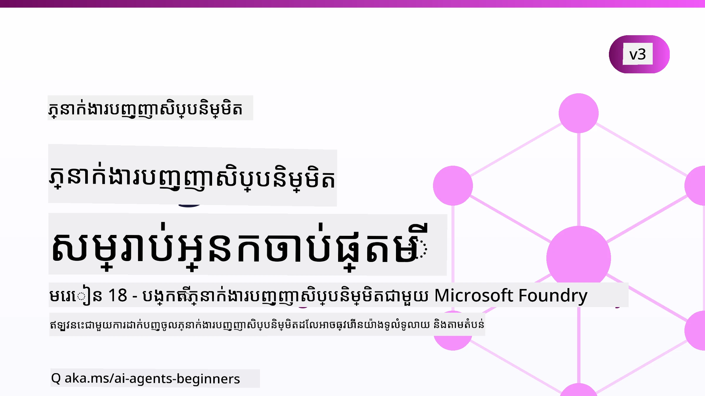

# មន្រ្តី AI សម្រាប់អ្នកចាប់ផ្ដើម - មេរៀនមួយ



## មេរៀនបង្រៀនគ្រប់យ៉ាងដែលអ្នកត្រូវដឹងដើម្បីចាប់ផ្តើមបង្កើតមន្រ្តី AI

[](https://github.com/microsoft/ai-agents-for-beginners/blob/master/LICENSE?WT.mc_id=academic-105485-koreyst)
[](https://GitHub.com/microsoft/ai-agents-for-beginners/graphs/contributors/?WT.mc_id=academic-105485-koreyst)
[](https://GitHub.com/microsoft/ai-agents-for-beginners/issues/?WT.mc_id=academic-105485-koreyst)
[](https://GitHub.com/microsoft/ai-agents-for-beginners/pulls/?WT.mc_id=academic-105485-koreyst)
[](http://makeapullrequest.com?WT.mc_id=academic-105485-koreyst)

### 🌐 គាំទ្រភាសាច្រើន

#### គាំទ្រដោយ GitHub Action (អូតូម៉ាទិច និងមានភាពទាន់សម័យជានិច្ច)

<!-- CO-OP TRANSLATOR LANGUAGES TABLE START -->
[Arabic](../ar/README.md) | [Bengali](../bn/README.md) | [Bulgarian](../bg/README.md) | [Burmese (Myanmar)](../my/README.md) | [Chinese (Simplified)](../zh-CN/README.md) | [Chinese (Traditional, Hong Kong)](../zh-HK/README.md) | [Chinese (Traditional, Macau)](../zh-MO/README.md) | [Chinese (Traditional, Taiwan)](../zh-TW/README.md) | [Croatian](../hr/README.md) | [Czech](../cs/README.md) | [Danish](../da/README.md) | [Dutch](../nl/README.md) | [Estonian](../et/README.md) | [Finnish](../fi/README.md) | [French](../fr/README.md) | [German](../de/README.md) | [Greek](../el/README.md) | [Hebrew](../he/README.md) | [Hindi](../hi/README.md) | [Hungarian](../hu/README.md) | [Indonesian](../id/README.md) | [Italian](../it/README.md) | [Japanese](../ja/README.md) | [Kannada](../kn/README.md) | [Khmer](./README.md) | [Korean](../ko/README.md) | [Lithuanian](../lt/README.md) | [Malay](../ms/README.md) | [Malayalam](../ml/README.md) | [Marathi](../mr/README.md) | [Nepali](../ne/README.md) | [Nigerian Pidgin](../pcm/README.md) | [Norwegian](../no/README.md) | [Persian (Farsi)](../fa/README.md) | [Polish](../pl/README.md) | [Portuguese (Brazil)](../pt-BR/README.md) | [Portuguese (Portugal)](../pt-PT/README.md) | [Punjabi (Gurmukhi)](../pa/README.md) | [Romanian](../ro/README.md) | [Russian](../ru/README.md) | [Serbian (Cyrillic)](../sr/README.md) | [Slovak](../sk/README.md) | [Slovenian](../sl/README.md) | [Spanish](../es/README.md) | [Swahili](../sw/README.md) | [Swedish](../sv/README.md) | [Tagalog (Filipino)](../tl/README.md) | [Tamil](../ta/README.md) | [Telugu](../te/README.md) | [Thai](../th/README.md) | [Turkish](../tr/README.md) | [Ukrainian](../uk/README.md) | [Urdu](../ur/README.md) | [Vietnamese](../vi/README.md)

> **ចូលចិត្តបដិសណ្ឋារក្នុងកន្លែងមូលដ្ឋាន?**
>
> របៀបរក្សាទុកនេះរួមបញ្ចូលការបកប្រែក្នុងភាសាច្រើនជាង ៥០ ដែលបន្ថែមទំហំសម្រាប់ដោនឡូដយ៉ាងខ្លាំង។ ដើម្បីចម្លងដោយគ្មានការបកប្រែ ប្រើ sparse checkout៖
>
> **Bash / macOS / Linux៖**
> ```bash
> git clone --filter=blob:none --sparse https://github.com/microsoft/ai-agents-for-beginners.git
> cd ai-agents-for-beginners
> git sparse-checkout set --no-cone '/*' '!translations' '!translated_images'
> ```
>
> **CMD (Windows):**
> ```cmd
> git clone --filter=blob:none --sparse https://github.com/microsoft/ai-agents-for-beginners.git
> cd ai-agents-for-beginners
> git sparse-checkout set --no-cone "/*" "!translations" "!translated_images"
> ```
>
> នេះផ្តល់អ្វីគ្រប់យ៉ាងដែលអ្នកត្រូវដើម្បីបញ្ចប់មេរៀនដោយមានការដោនឡូដលឿនជាងមុន។
<!-- CO-OP TRANSLATOR LANGUAGES TABLE END -->

**បើអ្នកចង់បានភាសាបកប្រែបន្ថែមទៀត សូមមើលបញ្ជីនៅ [នេះ](https://github.com/Azure/co-op-translator/blob/main/getting_started/supported-languages.md)។**

[](https://GitHub.com/microsoft/ai-agents-for-beginners/watchers/?WT.mc_id=academic-105485-koreyst)
[](https://GitHub.com/microsoft/ai-agents-for-beginners/network/?WT.mc_id=academic-105485-koreyst)
[](https://GitHub.com/microsoft/ai-agents-for-beginners/stargazers/?WT.mc_id=academic-105485-koreyst)

[](https://discord.com/invite/ATgtXmAS5D)


## 🌱 ចាប់ផ្តើម

មេរៀននេះមានមេរៀនដែលគ្របដណ្តប់ទ្រឹស្ដីមូលដ្ឋាននៃការបង្កើតមន្រ្តី AI។ មេរៀននីមួយៗគឺជាប្រធានបទផ្ទាល់ខ្លួន ដូច្នេះចាប់ផ្តើមពីកន្លែងណាមួយដែលអ្នកចូលចិត្ត!

មានគាំទ្រភាសាច្រើនសម្រាប់មេរៀននេះ។ ទៅកាន់ [ភាសាដែលមាននៅទីនេះ](#-multi-language-support).

ប្រសិនបើនេះជាលើកដំបូងអ្នកកំពុងបង្កើតជាមួយម៉ូដែល Generative AI សូមពិនិត្យមេរៀនរបស់យើង [Generative AI សម្រាប់អ្នកចាប់ផ្ដើម](https://aka.ms/genai-beginners) ដែលមានមេរៀន ២១ ស្ដីពីការបង្កើតជាមួយ GenAI។

កុំភ្លេច [ផ្ដល់ពន្លឺ (🌟) លើ repo នេះ](https://docs.github.com/en/get-started/exploring-projects-on-github/saving-repositories-with-stars?WT.mc_id=academic-105485-koreyst) និង [fork repo នេះ](https://github.com/microsoft/ai-agents-for-beginners/fork) ដើម្បីដំណើរកូដ។

### ជួបអ្នករៀនផ្សេងទៀត និងទទួលបានចម្លើយសំនួររបស់អ្នក

ប្រសិនបើអ្នកផ្អាក ឬមានសំណួរអំពីការបង្កើតមន្រ្តី AI សូមចូលរួមក្នុងបញ្ជ្រាប Discord ដោយផ្អែកលើ [Microsoft Foundry Discord](https://aka.ms/ai-agents/discord)។

### អ្វីដែលអ្នកត្រូវការ 

មេរៀននៅក្នុងវគ្គនេះមានឧទាហរណ៍កូដ ដែលអាចរកបានក្នុងថត code_samples។ អ្នកអាច [fork repo នេះ](https://github.com/microsoft/ai-agents-for-beginners/fork) ដើម្បីបង្កើតច្បាប់ចម្លងផ្ទាល់ខ្លួនរបស់អ្នក។

ឧទាហរណ៍កូដក្នុងការអនុវត្តនេះប្រើ Microsoft Agent Framework ជាមួយ Microsoft Foundry Agent Service V2៖

- [Microsoft Foundry](https://aka.ms/ai-agents-beginners/ai-foundry) - ត្រូវការគណនី Azure

វគ្គនេះប្រើបណ្ដុំ Framework និងសេវាអ្នកភ្នាក់ងារយ៉ាងខាងក្រោមពី Microsoft៖

- [Microsoft Agent Framework (MAF)](https://aka.ms/ai-agents-beginners/agent-framework)
- [Microsoft Foundry Agent Service V2](https://aka.ms/ai-agents-beginners/ai-agent-service)

ឧទាហរណ៍កូដខ្លះៗក៏គាំទ្រអ្នកផ្គត់ផ្គង់ដែលសមស្របជាមួយ OpenAI ផ្សេងទៀតដូចជា [MiniMax](https://platform.minimaxi.com/) ដែលផ្ដល់ម៉ូដែល context ធំនៅ (ដល់ 204K tokens)។ សូមមើល [ការរៀបចំវគ្គ](./00-course-setup/README.md) សម្រាប់ព័ត៌មានលំអិត។

សម្រាប់ព័ត៌មានបន្ថែមអំពីការរត់កូដសម្រាប់វគ្គនេះ សូមទៅកាន់ [ការរៀបចំវគ្គ](./00-course-setup/README.md)។

## 🙏 ចង់ជួយទេ?

តើអ្នកមានសំណើណាមួយ ឬឃើញកំហុសអក្សរឬកូដទេ? សូម [បង្កើតបញ្ហា](https://github.com/microsoft/ai-agents-for-beginners/issues?WT.mc_id=academic-105485-koreyst) ឬ [បង្កើត pull request](https://github.com/microsoft/ai-agents-for-beginners/pulls?WT.mc_id=academic-105485-koreyst)


## 📂 មេរៀននីមួយៗមាន

- មេរៀនសរសេរនៅក្នុង README និងវីដេអូខ្លីមួយ
- ឧទាហរណ៍កូដ Python ប្រើ Microsoft Agent Framework ជាមួយ Microsoft Foundry
- តំណភ្ជាប់ទៅឯកសារបន្ថែមដើម្បីបន្តការសិក្សារបស់អ្នក


## 🗃️ មេរៀន

| **មេរៀន**                                  | **អត្ថបទ និងកូដ**                                | **វីដេអូ**                                                | **ការសិក្សាបន្ថែម**                                                                   |
|----------------------------------------------|----------------------------------------------------|------------------------------------------------------------|----------------------------------------------------------------------------------------|
| បំណះបំណុលអំពីមន្រ្តី AI និងករណីប្រើប្រាស់របស់មន្រ្តី | [Link](./01-intro-to-ai-agents/README.md)          | [Video](https://youtu.be/3zgm60bXmQk?si=z8QygFvYQv-9WtO1)  | [Link](https://aka.ms/ai-agents-beginners/collection?WT.mc_id=academic-105485-koreyst) |
| ការស្វែងយល់អំពី Framework មន្រ្តី AI           | [Link](./02-explore-agentic-frameworks/README.md)  | [Video](https://youtu.be/ODwF-EZo_O8?si=Vawth4hzVaHv-u0H)  | [Link](https://aka.ms/ai-agents-beginners/collection?WT.mc_id=academic-105485-koreyst) |
| ការយល់ដឹងអំពីលំនាំរចនាមន្រ្តី AI              | [Link](./03-agentic-design-patterns/README.md)     | [Video](https://youtu.be/m9lM8qqoOEA?si=BIzHwzstTPL8o9GF)  | [Link](https://aka.ms/ai-agents-beginners/collection?WT.mc_id=academic-105485-koreyst) |
| លំនាំរចនាការប្រើប្រាស់ឧបករណ៍                    | [Link](./04-tool-use/README.md)                    | [Video](https://youtu.be/vieRiPRx-gI?si=2z6O2Xu2cu_Jz46N)  | [Link](https://aka.ms/ai-agents-beginners/collection?WT.mc_id=academic-105485-koreyst) |
| Agentic RAG                                  | [Link](./05-agentic-rag/README.md)                 | [Video](https://youtu.be/WcjAARvdL7I?si=gKPWsQpKiIlDH9A3)  | [Link](https://aka.ms/ai-agents-beginners/collection?WT.mc_id=academic-105485-koreyst) |
| ការបង្កើតមន្រ្តី AI ដែលអាចទុកចិត្តបាន               | [Link](./06-building-trustworthy-agents/README.md) | [Video](https://youtu.be/iZKkMEGBCUQ?si=jZjpiMnGFOE9L8OK ) | [Link](https://aka.ms/ai-agents-beginners/collection?WT.mc_id=academic-105485-koreyst) |
| លំនាំរចនាការ​ផែនការ                        | [Link](./07-planning-design/README.md)             | [Video](https://youtu.be/kPfJ2BrBCMY?si=6SC_iv_E5-mzucnC)  | [Link](https://aka.ms/ai-agents-beginners/collection?WT.mc_id=academic-105485-koreyst) |
| លំនាំរចនាមន្រ្តីច្រើន                       | [Link](./08-multi-agent/README.md)                 | [Video](https://youtu.be/V6HpE9hZEx0?si=rMgDhEu7wXo2uo6g)  | [Link](https://aka.ms/ai-agents-beginners/collection?WT.mc_id=academic-105485-koreyst) |

| គំរូការរចនាតំណើរការចិត្តវិចារណា                 | [Link](./09-metacognition/README.md)               | [Video](https://youtu.be/His9R6gw6Ec?si=8gck6vvdSNCt6OcF)  | [Link](https://aka.ms/ai-agents-beginners/collection?WT.mc_id=academic-105485-koreyst) |
| ហ៊ុនអេសអ៊ូមនុស្សប្រើនៅក្នុងផលិតកម្ម                      | [Link](./10-ai-agents-production/README.md)        | [Video](https://youtu.be/l4TP6IyJxmQ?si=31dnhexRo6yLRJDl)  | [Link](https://aka.ms/ai-agents-beginners/collection?WT.mc_id=academic-105485-koreyst) |
| ការប្រើប្រាស់ប្រព័ន្ធអាជ្ញាបណ្ណអេហ្គង់(MCP, A2A និង NLWeb) | [Link](./11-agentic-protocols/README.md)           | [Video](https://youtu.be/X-Dh9R3Opn8)                                 | [Link](https://aka.ms/ai-agents-beginners/collection?WT.mc_id=academic-105485-koreyst) |
| វិស្វកម្មបរិបទសម្រាប់ហ៊ុនអេសអ៊ូមនុស្ស            | [Link](./12-context-engineering/README.md)         | [Video](https://youtu.be/F5zqRV7gEag)                                 | [Link](https://aka.ms/ai-agents-beginners/collection?WT.mc_id=academic-105485-koreyst) |
| ការគ្រប់គ្រងអង្គចងចាំអាជ្ញាបណ្ណ                      | [Link](./13-agent-memory/README.md)     |      [Video](https://youtu.be/QrYbHesIxpw?si=vZkVwKrQ4ieCcIPx)                                                      |                                                                                        |
| ការស្វែងយល់លើស៊ុមហ៊ុនអេសអ៊ូ Microsoft Agent Framework                         | [Link](./14-microsoft-agent-framework/README.md)                            |                                                            |                                                                                        |
| ការបង្កើតហ៊ុនប្រើមេឌៀកុំព្យូទ័រ (CUA)           | [Link](./15-browser-use/README.md)     |                                                            | [Link](https://docs.browser-use.com/examples/templates/playwright-integration)         |
| ការផ្ទេរបញ្ជាហ៊ុនដែលអាចបង្រួមបាន                    | [Link](./16-deploying-scalable-agents/README.md) |                                                    | [Link](https://learn.microsoft.com/azure/ai-foundry/agents/overview)                   |
| ការបង្កើតហ៊ុនអ៊ឺអាយកម្រិតបណ្តាល                     | [Link](./17-creating-local-ai-agents/README.md)  |                                                    | [Link](https://learn.microsoft.com/azure/ai-foundry/foundry-local/)                    |
| ការពារហ៊ុនអ៊ឺអាយ                            | [Link](./18-securing-ai-agents/README.md)  |                                                            | [Link](https://aka.ms/ai-agents-beginners/collection?WT.mc_id=academic-105485-koreyst) |

## 🎒 មេរៀនផ្សេងទៀត

ក្រុមរបស់យើងបង្កើតមេរៀនផ្សេងទៀត! សូមពិនិត្យមើល:

<!-- CO-OP TRANSLATOR OTHER COURSES START -->
### LangChain
[](https://aka.ms/langchain4j-for-beginners)
[](https://aka.ms/langchainjs-for-beginners?WT.mc_id=m365-94501-dwahlin)
[](https://github.com/microsoft/langchain-for-beginners?WT.mc_id=m365-94501-dwahlin)
---

### Azure / Edge / MCP / អាជ្ញាបណ្ណ
[](https://github.com/microsoft/AZD-for-beginners?WT.mc_id=academic-105485-koreyst)
[](https://github.com/microsoft/edgeai-for-beginners?WT.mc_id=academic-105485-koreyst)
[](https://github.com/microsoft/mcp-for-beginners?WT.mc_id=academic-105485-koreyst)
[](https://github.com/microsoft/ai-agents-for-beginners?WT.mc_id=academic-105485-koreyst)

---
 
### ថ្នាក់រៀន AI បង្កើតថ្មី
[](https://github.com/microsoft/generative-ai-for-beginners?WT.mc_id=academic-105485-koreyst)
[-9333EA?style=for-the-badge&labelColor=E5E7EB&color=9333EA)](https://github.com/microsoft/Generative-AI-for-beginners-dotnet?WT.mc_id=academic-105485-koreyst)

[-C084FC?style=for-the-badge&labelColor=E5E7EB&color=C084FC)](https://github.com/microsoft/generative-ai-for-beginners-java?WT.mc_id=academic-105485-koreyst)
[-E879F9?style=for-the-badge&labelColor=E5E7EB&color=E879F9)](https://github.com/microsoft/generative-ai-with-javascript?WT.mc_id=academic-105485-koreyst)

---
 
### ការសិក្សាគ្រឹះ
[](https://aka.ms/ml-beginners?WT.mc_id=academic-105485-koreyst)
[](https://aka.ms/datascience-beginners?WT.mc_id=academic-105485-koreyst)
[](https://aka.ms/ai-beginners?WT.mc_id=academic-105485-koreyst)
[](https://github.com/microsoft/Security-101?WT.mc_id=academic-96948-sayoung)
[](https://aka.ms/webdev-beginners?WT.mc_id=academic-105485-koreyst)
[](https://aka.ms/iot-beginners?WT.mc_id=academic-105485-koreyst)
[](https://github.com/microsoft/xr-development-for-beginners?WT.mc_id=academic-105485-koreyst)

---
 
### ស៊េរី Copilot
[](https://aka.ms/GitHubCopilotAI?WT.mc_id=academic-105485-koreyst)
[](https://github.com/microsoft/mastering-github-copilot-for-dotnet-csharp-developers?WT.mc_id=academic-105485-koreyst)
[](https://github.com/microsoft/CopilotAdventures?WT.mc_id=academic-105485-koreyst)
<!-- CO-OP TRANSLATOR OTHER COURSES END -->

## 🌟 ការដាក់មោទនភាពពីសហគមន៍

អរគុណ [Shivam Goyal](https://www.linkedin.com/in/shivam2003/) សម្រាប់ការរួមចំណែកនូវគំរូកូដសំខាន់ៗដែលបង្ហាញពី Agentic RAG។

## ការរួមចំណែក

គម្រោងនេះស្វាគមន៍ការរួមចំណែកនិងការផ្ដល់យោបល់។ ការរួមចំណែកភាគច្រើនតម្រូវឲ្យអ្នកយល់ព្រម
អំពី Contributor License Agreement (CLA) ដែលស្នើឱ្យអ្នកមានសិទ្ធិក៏ដូចជា បានផ្ដល់សិទ្ធិដល់យើង
ដើម្បីប្រើប្រាស់ការរួមចំណែករបស់អ្នក។ សម្រាប់ព័ត៌មានលម្អិត ចូលទៅកាន់ <https://cla.opensource.microsoft.com>។

នៅពេលដែលអ្នកដាក់ស្នើ pull request មួយ CLA bot នឹងកំណត់ដោយស្វ័យប្រវត្តិយថាអ្នកត្រូវផ្ដល់
CLA ឬអត់ និងតភ្ជាប់សញ្ញាឱ្យ PR នៅតាមគោលការណ៍ (ដូចជា ការត្រួតពិនិត្យស្ថានភាព ការមតិយោបល់)។ គ្រាន់តែធ្វើតាមការណែនាំ
ដែលប៉ុនក៏បានផ្ដល់ដោយ bot។ អ្នកត្រូវធ្វើដំណើរនេះតែម្តងតែម្ដងនៅក្នុង repos ទាំងអស់ដែលប្រើCLA របស់យើង។

គម្រោងនេះបានទទួលយក [Microsoft Open Source Code of Conduct](https://opensource.microsoft.com/codeofconduct/)។
សម្រាប់ព័ត៌មានបន្ថែម សូមមើល [Code of Conduct FAQ](https://opensource.microsoft.com/codeofconduct/faq/) ឬ
ទំនាក់ទំនង [opencode@microsoft.com](mailto:opencode@microsoft.com) បើមានសំណួរបន្ថែម ឬមតិយោបល់។

## រូបសញ្ញាសម្គាល់ពាណិជ្ជកម្ម

គម្រោងនេះអាចមានរូបសញ្ញាសម្គាល់ពាណិជ្ជកម្ម រឺឡូហ្គូសម្រាប់គម្រោង ផលិតផល ឬសេវាកម្ម។ ការប្រើប្រាស់ដែលអនុញ្ញាត
របស់រូបសញ្ញាសម្គាល់ពាណិជ្ជកម្ម ឬឡូហ្គូ Microsoft គឺត្រូវបានគោរពតាមនិងត្រូវតែអនុវត្ត
[Microsoft's Trademark & Brand Guidelines](https://www.microsoft.com/legal/intellectualproperty/trademarks/usage/general)។
ការប្រើប្រាស់រូបសញ្ញាសម្គាល់ពាណិជ្ជកម្ម ឬឡូហ្គូ Microsoft ក្នុងកំណែបានបំលែងរបស់គម្រោងនេះ មិនគួរធ្វើឲ្យមានការជំពាក់ច្របល់ ឬបង្ហាញថា Microsoft គាំទ្រគម្រោង។
ការប្រើប្រាស់ទាំងអស់នៃរូបសញ្ញាសម្គាល់ពាណិជ្ជកម្ម ឬឡូហ្គូរបស់ភាគីទីបីគឺដោយអនុវត្តតាមគោលការណ៍របស់ភាគីទីបីនោះ។

## រកជំនួយ


ប្រសិនបើអ្នករងចាំ ឬមានសំណួរអំពីការបង្កើតកម្មវិធី AI សូមចូលរួម៖

[](https://aka.ms/foundry/discord)

ប្រសិនបើអ្នកមានមតិយោបល់ផលិតផល ឬកំហុសនៅពេលកំពុងបង្កើត សូមទៅកាន់៖


[](https://aka.ms/foundry/forum)

---

<!-- CO-OP TRANSLATOR DISCLAIMER START -->
**ការបដិសេធ**:
ឯកសារនេះត្រូវបានបម្លែងភាសា ដោយប្រើសេវាបម្លែងភាសា AI [Co-op Translator](https://github.com/Azure/co-op-translator)។ ទោះយើងខ្ញុំមានក្តីប្រាថ្នាឱ្យបានច្បាស់លាស់ តែសូមយល់ដឹងថាការបម្លែងដោយស្វ័យប្រវត្តិក៏អាចមានកំហុសឬភាពមិនត្រឹមត្រូវ។ ឯកសារដើមជាភាសាទីតាំងគួរត្រូវបានគេប្រើជាប្រភពច្បាស់លាស់។ សម្រាប់ព័ត៌មានសំខាន់ៗ សូមណែនាំឱ្យប្រើប្រាស់ការប្រែដោយមនុស្សជំនាញ។ យើងខ្ញុំមិនទទួលខុសត្រូវចំពោះការយល់ច្រឡំ ឬការបកស្រាយខុសបន្ទាប់ពីការប្រើប្រាស់ការបម្លែងនេះនោះទេ។
<!-- CO-OP TRANSLATOR DISCLAIMER END -->