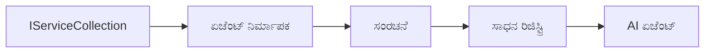

# 🎨 ಏಜೆಂಟಿಕ್ ವಿನ್ಯಾಸ ಮಾದರಿಗಳು ಅಜೂರ್ ಓಪನ್‌ಎಐ (ಪ್ರತಿಕ್ರಿಯೆಗಳು API) (.NET)

## 📋 ಕಲಿಕೆ ಉದ್ದೇಶಗಳು

ಈ ಉದಾಹರಣೆ ಉದ್ಯಮ ಪ್ರಮಾಣದ ಬುದ್ಧಿವಂತ ಏಜೆಂಟುಗಳನ್ನು ನಿರ್ಮಿಸಲು ಮೈಕ್ರೋಸಾಫ್ಟ್ ಏಜೆಂಟ್ ಫ್ರೇಮ್ವರ್ಕ್ ಅನ್ನು .NET ನಲ್ಲಿ ಅಜೂರ್ ಓಪನ್‌ಎಐ (ಪ್ರತಿಕ್ರಿಯೆಗಳು API) ಸಂಯೋಜನೆಯೊಂದಿಗೆ ಬಳಸುವ ವಿನ್ಯಾಸ ಮಾದರಿಗಳನ್ನು ತೋರಿಸುತ್ತದೆ. ನೀವು ವೃತ್ತಿಪರ ಮಾದರಿಗಳು ಮತ್ತು ವಾಸ್ತುಶಿಲ್ಪಿಕ ವಿಧಾನಗಳನ್ನು ಕಲಿಯುತ್ತೀರಿ, ಇದು ಏಜೆಂಟುಗಳನ್ನು ಉತ್ಪಾದನಾ-ತಯಾರಾಗುವ, ನಿರ್ವಹಣೆಯಾದ ಮತ್ತು ವಿಸ್ತರಿಸಬಹುದಾದ ರೂಪದಲ್ಲಿ ಮಾಡುತ್ತದೆ.

### ಉದ್ಯಮ ವಿನ್ಯಾಸ ಮಾದರಿಗಳು

- 🏭 **ಫ್ಯಾಕ್ಟರಿ ಮಾದರಿ**: ಅವಲಂಬನೆ ಇಂಜೆಕ್ಷನ್ ಹೊಂದಿದ ಮಾನ್ಯತೆಯ ಏಜೆಂಟ್ ರಚನೆ
- 🔧 **ಬಿಲ್ಡರ್ ಮಾದರಿ**: ಸುಗಮ ಏಜೆಂಟ್ ಸಂರಚನೆ ಮತ್ತು ಸ್ಥಾಪನೆ
- 🧵 **ತರಮುಖ-ಸುರಕ್ಷಿತ ಮಾದರಿಗಳು**: ಸಮಕಾಲೀನ ಸಂಭಾಷಣೆ ನಿರ್ವಹಣೆ
- 📋 **ದಿನದರ್ಶಕ ಮಾದರಿ**: ಸರಿಯಾದ ಉಪಕರಣ ಮತ್ತು ಸಾಮರ್ಥ್ಯ ನಿರ್ವಹಣೆ

## 🎯 .NET ನಿಗದಿತ ವಾಸ್ತುಶಿಲ್ಪ ಲಾಭಗಳು

### ಉದ್ಯಮ ವೈಶಿಷ್ಟ್ಯಗಳು

- **ದೃಢ ಟೈಪಿಂಗ್**: ಸಂಯೋಜನೆ ಸಮಯದ ಪರಿಶೀಲನೆ ಮತ್ತು ಇಂಟೆಲಿಸೆನ್ಸ್ ಬೆಂಬಲ
- **ಅವಲಂಬನೆ ಇಂಜೆಕ್ಷನ್**: ಹೊತ್ತಾಣಿಕೆ DI ಕಂಟೇನರ್ ಸಂಯೋಜನೆ
- **Конфಿಗರೇಶನ್ ನಿರ್ವಹಣೆ**: IConfiguration ಮತ್ತು ಆಯ್ಕೆ ಮಾದರಿಗಳು
- **ಅಸಿಂಕ್ರೋನಸ್/ವೈಟ್**: ಅತ್ಯುತ್ತಮ ಅಸಿಂಕ್ರೋನಸ್ ಪ್ರೋಗ್ರಾಮಿಂಗ್ ಬೆಂಬಲ

### ಉತ್ಪಾದನಾ-ಸಿದ್ಧ ಮಾದರಿಗಳು

- **ಲಾಗಿಂಗ್ ಸಂಯೋಜನೆ**: ILogger ಮತ್ತು ರಚನಾತ್ಮಕ ಲಾಗಿಂಗ್ ಬೆಂಬಲ
- **ಆರೋಗ್ಯ ಪರಿಶೀಲನೆಗಳು**: ಒಳಗೊಳ್ಳುವ ಗಮನವಿದ್ಯೆ ಮತ್ತು ರೋಗನಿದಾನ
- **Конфಿಗರೇಶನ್ ಪರಿಶೀಲನೆ**: ದಟ್ಟ ಟೈಪಿಂಗ್ ಮತ್ತು ಡೇಟಾ ಅನೋಟೇಶನ್
- **ದೋಷ ನಿರ್ವಹಣೆ**: ರಚನಾತ್ಮಕ ವೈಪರೀತ್ಯ ನಿರ್ವಹಣೆ

## 🔧 ತಾಂತ್ರಿಕ ವಾಸ್ತುಶಿಲ್ಪ

### ಪ್ರಮುಖ .NET ಘಟಕಗಳು

- **Microsoft.Extensions.AI**: ಏಕೀಕೃತ AI ಸೇವಾ ಅಭ್ಯಾಸಗಳು
- **Microsoft.Agents.AI**: ಉದ್ಯಮ ಏಜೆಂಟ್ ಸಮನ್ವಯ ಫ್ರೇಮ್ವರ್ಕ್
- **ಅಜೂರ್ ಓಪನ್‌ಎಐ (ಪ್ರತಿಕ್ರಿಯೆಗಳು API)**: ಅತ್ಯುಚ್ಚ ಕಾರ್ಯಕ್ಷಮತೆಯ API ಗ್ರಾಹಕ ಮಾದರಿಗಳು
- **Конфಿಗರೇಶನ್ ವ್ಯವಸ್ಥೆ**: appsettings.json ಮತ್ತು ಪರಿಸರ ಸಂಯೋಜನೆ

### ವಿನ್ಯಾಸ ಮಾದರಿ ಜಾರಿಗೆ



## 🏗️ ಪ್ರದರ್ಶಿಸಿದ ಉದ್ಯಮ ಮಾದರಿಗಳು

### 1. **ರಚನಾತ್ಮಕ ಮಾದರಿಗಳು**

- **ಏಜೆಂಟ್ ಫ್ಯಾಕ್ಟರಿ**: ಸಮ್ಮಿಳಿತ ಸಂರಚನೆಯೊಂದಿಗೆ ಕೇಂದ್ರಿಕೃತ ಏಜೆಂಟ್ ಸೃಷ್ಟಿ
- **ಬಿಲ್ಡರ್ ಮಾದರಿ**: ಸಂಕೀರ್ಣ ಏಜೆಂಟ್ ಸಂರಚನೆಗೆ ಸುಗಮ API
- **ಸಿಂಗಲ್ಟನ್ ಮಾದರಿ**: ಹಂಚಿಕೊಂಡ ಸಂಪನ್ಮೂಲಗಳು ಮತ್ತು ಸಂರಚನಾ ನಿರ್ವಹಣೆ
- **ಅವಲಂಬನೆ ಇಂಜೆಕ್ಷನ್**: ಖುಲ್ ಜೋಡಣೆ ಮತ್ತು ಪರೀಕ್ಷಿಸುವ ಸಾಮರ್ಥ್ಯ

### 2. **ನಡವಳಿಕೆ ಮಾದರಿಗಳು**

- **ಯುಜನೆತಂತ್ರ ಮಾದರಿ**: ಬದಲಾಯಿಸಬಹುದಾದ ಉಪಕರಣ ಕಾರ್ಯೋನ್ಮುಖತೆ ಯುಜನೆತಂತ್ರಗಳು
- **ಕಮಾಂಡ್ ಮಾದರಿ**: ಹಿಂಪಡೆಯುವ/ಮರುಮಾಡುವ ಚಾಲನೆಗಳೊಂದಿಗೆ ಏಜೆಂಟ್ ಕಾರ್ಯಾಚರಣೆಗಳು
- **ಅವಲೋಕಕ ಮಾದರಿ**: ಘಟನೆ ನಡೆಸುವ ಏಜೆಂಟ್ ಪಾರಂಪರ್ಯ ನಿರ್ವಹಣೆ
- **ಟೆಂಪ್ಲೇಟು ವಿಧಾನ**: ಮಾನ್ಯತೆಯ ಏಜೆಂಟ್ ಕಾರ್ಯಾಚರಣೆ ಕಾರ್ಯಪ್ರವಾಹಗಳು

### 3. **ರಚನಾಮೂಲಕ ಮಾದರಿಗಳು**

- **ಅಡಾಪ್ಟರ್ ಮಾದರಿ**: ಅಜೂರ್ ಓಪನ್‌ಎಐ (ಪ್ರತಿಕ್ರಿಯೆಗಳು API) ಸಂಯೋಜನೆ ಪದರ
- **ಡೆಕೊರೆಟರ್ ಮಾದರಿ**: ಏಜೆಂಟ್ ಸಾಮರ್ಥ್ಯ ವೃದ್ಧಿ
- **ಫೇಸಡೆಯ್ ಮಾದರಿ**: ಸರಳೀಕೃತ ಏಜೆಂಟ್ ಪರಸ್ಪರ ಕ್ರಿಯಾಶೀಲತೆಯ ಮುಖಪುಟಗಳು
- **ಪ್ರಾಕ್ಸಿ ಮಾದರಿ**: ಕಾರ್ಯಕ್ಷಮತೆಗಾಗಿ ನಿಶ್ಚಿತ ಶೇಖರಣೆ ಮತ್ತು ಲೇಜಿ ಲೋಡಿಂಗ್

## 📚 .NET ವಿನ್ಯಾಸ ಸಿದ್ಧಾಂತಗಳು

### SOLID ಸಿದ್ಧಾಂತಗಳು

- **ಘಟಕದ ಒತ್ತಾಯಗಾರಿಕೆ**: ಪ್ರತಿ ಘಟಕಕ್ಕೆ ಒಂದೇ ಸ್ಪಷ್ಟ ಗುರಿ
- **ತೆರೆ/ಮುಚ್ಚು**: ಬದಲಾವಣೆಗಳಿಲ್ಲದೇ ವಿಸ್ತರಣೆ
- **ಲಿಸ್ಕೋವ್ ಬದಲಾವಣೆ**: ಇಂಟರ್ಫೇಸ್ ಆಧಾರಿತ ಉಪಕರಣ ಅನುಷ್ಠಾನಗಳು
- **ಇಂಟರ್ಫೇಸ್ ವಿಭಜನ**: ಕೇಂದ್ರೀಕೃತ, ಸಮ್ಮಿಳಿತ ಇಂಟರ್ಫೇಸುಗಳು
- **ಅವಲಂಬನೆ ಬಿಡಿಲು**: ಖಚಿತತೆಗಳ ಮೇಲೆ ಅವಲಂಬನೆ ಇಟ್ಟುಕೊಳ್ಳುವುದು, ಕಥನಗಳಲ್ಲ

### ಸ್ವಚ್ಛ ವಾಸ್ತುಶಿಲ್ಪ

- **ಡೊಮೇನ್ ಪದರ**: ಮೂಲ ಏಜೆಂಟ್ ಮತ್ತು ಉಪಕರಣ ಖಚಿತತೆಗಳು
- **ಅಪ್ಲಿಕೇಶನ್ ಪದರ**: ಏಜೆಂಟ್ ಸಮನ್ವಯ ಮತ್ತು ಕಾರ್ಯಪ್ರವಾಹಗಳು
- **ಸೌಕರ್ಯ ಪದರ**: ಅಜೂರ್ ಓಪನ್‌ಎಐ (ಪ್ರತಿಕ್ರಿಯೆಗಳು API) ಸಂಯೋಜನೆ ಮತ್ತು ಹೊರಗಿನ ಸೇವೆಗಳು
- **ಪ್ರದೇಶ ಪದರ**: ಬಳಕೆದಾರ ಪರಸ್ಪರ ಕ್ರಿಯೆ ಮತ್ತು ಪ್ರತಿಕ್ರಿಯೆ ರೂಪಗೊಳಿಸುವಿಕೆ

## 🔒 ಉದ್ಯಮ ಪರಿಶೀಲನೆಗಳು

### ಸುರಕ್ಷತೆ

- **ಅಂಗೀಕಾರ ನಿರ್ವಹಣೆ**: IConfiguration ನೊಂದಿಗೆ ಸುರಕ್ಷಿತ API ಕೀ ಹ್ಯಾಂಡ್ಲಿಂಗ್
- **ನೀಡಿಕೆ ಪರಿಶೀಲನೆ**: ದೃಢ ಟೈಪಿಂಗ್ ಮತ್ತು ಡೇಟಾ ಅನೋಟೇಶನ್ ಪರಿಶೀಲನೆ
- **ಔಟ್‌ಪುಟ್ ಶುದ್ಧೀಕರಣ**: ಸುರಕ್ಷಿತ ಪ್ರತಿಕ್ರಿಯೆ ಪ್ರಕ್ರಿಯೆ ಮತ್ತು ಶೋಧನೆ
- **ಆಡಿಟ್ ಲಾಗಿಂಗ್**: ಸಮಗ್ರ ಕಾರ್ಯಾಚರಣೆ ಹಂದಿ

### ಕಾರ್ಯಕ್ಷಮತೆ

- **ಅಸಿಂಕ್ರೋನಸ್ ಮಾದರಿಗಳು**: ಅಡ್ಡಿತಿಲ್ಲದ I/O ಕಾರ್ಯಗಳು
- **ಸಂಪರ್ಕ ಪೂಲಿಂಗ್**: ಪರಿಣಾಮಕಾರಿ HTTP ಗ್ರಾಹಕ ನಿರ್ವಹಣೆ
- **ಶೇಖರಣೆ**: ಉತ್ತಮ ಕಾರ್ಯಕ್ಷಮತೆಯಿಗಾಗಿ ಪ್ರತಿಕ್ರಿಯೆ ಶೇಖರಣೆ
- **ಸಂಪನ್ಮೂಲ ನಿರ್ವಹಣೆ**: ಯೋಗ್ಯ ವಿ‍ನ್ಯಾಸ ಮತ್ತು ಸ್ವಚ್ಛತೆ ಮಾದರಿಗಳು

### ವಿಸ್ತರಣೆ

- **ತರಮುಖ್ಯ ಸುರಕ್ಷತೆ**: ಸಮಕಾಲೀನ ಏಜೆಂಟ್ ನಿರ್ವಹಣೆ ಬೆಂಬಲ
- **ಸಂಪನ್ಮೂಲ ಪೂಲಿಂಗ್**: ಪರಿಣಾಮಕಾರಿ ಸಂಪನ್ಮೂಲ ಬಳಕೆ
- **ಲೋಡ್ ನಿರ್ವಹಣೆ**: ದರ ನಿಯಂತ್ರಣ ಮತ್ತು ಬ್ಯಾಕ್‌ಪ್ರೆಶರ್ ನಿರ್ವಹಣೆ
- **ನಿಗಾವಳಿ**: ಕಾರ್ಯಕ್ಷಮತಾ ಮಾನದಂಡಗಳು ಮತ್ತು ಆರೋಗ್ಯ ಪರಿಶೀಲನೆಗಳು

## 🚀 ಉತ್ಪಾದನಾ ನಿಯೋಜನೆ

- **Конфिगರೇಶನ್ ನಿರ್ವಹಣೆ**: ಪರಿಸರ-ನಿಗದಿತ ಸೆಟ್ಟಿಂಗ್‌ಗಳು
- **ಲಾಗಿಂಗ್ ತಂತ್ರಜ್ಞಾನ**: ಹೊಂದಾಣಿಕೆಯ ಲಾಗಿಂಗ್ ಸಹಿತ
- **ದೋಷ ನಿರ್ವಹಣೆ**: ಜಾಗತಿಕ ವೈಪರೀತ್ಯ ನಿರ್ವಹಣೆ ಮತ್ತು ಸಮರ್ಪಕ ಪುನಶ್ಚೇತನ
- **ನಿಗಾವಳಿ**: ಅಪ್ಲಿಕೇಶನ್ ಒಳನೋಟ ಮತ್ತು ಕಾರ್ಯಕ್ಷಮತಾ ಗಣಕಗಳು
- **ಪರೀಕ್ಷಣೆ**: ಘಟಕ, ಸಮಾದಾನ ಮತ್ತು ಲೋಡ್ ಪರೀಕ್ಷೆ ಮಾದರಿಗಳು

.NET ನೊಂದಿಗೆ ಉದ್ಯಮ ದೃಢವಾದ ಬುದ್ಧಿವಂತ ಏಜೆಂಟ್‌ಗಳನ್ನು ನಿರ್ಮಿಸಲು ಸಿದ್ಧರಾಗಿದ್ದೀರಾ? ಬನ್ನಿ, ದೊಡ್ಡದಾಗಿ ವಾಸ್ತುಶಿಲ್ಪ ಮಾಡೋಣ! 🏢✨

## 🚀 ಪ್ರಾರಂಭಿಸುತ್ತಿರುವುದು

### ಪೂರ್ವಾಪೇಕ್ಷಿತಗಳು

- [.NET 10 SDK](https://dotnet.microsoft.com/download/dotnet/10.0) ಅಥವಾ ಹೈಯರ್
- ಅಜೂರ್ ಓಪನ್‌ಎಐ ಸಂಪನ್ಮೂಲ ಮತ್ತು ಮಾದರಿ ನಿಯೋಜನೆಯೊಂದಿಗೆ [ಅಜೂರ್ ಸಬ್‌ಸ್ಕ್ರಿಪ್ಷನ್](https://azure.microsoft.com/free/)
- [ಅಜೂರ್ CLI](https://learn.microsoft.com/cli/azure/install-azure-cli) — with `az login` ನೊಂದಿಗೆ ಸೈನ್ ಇನ್ ಆಗಿ

### ಅಗತ್ಯಪಡುವ ಪರಿಸರ_VARIABLES

```bash
# zsh/bash
export AZURE_OPENAI_ENDPOINT=https://<your-resource>.openai.azure.com
export AZURE_OPENAI_DEPLOYMENT=gpt-5-mini
# ನಂತರ ಸೈನ್ ಇನ್ ಮಾಡಿ, ಆಗ AzureCliCredential ಟೋಕನ್ ಪಡೆಯಬಹುದು
az login
```

```powershell
# ಪವರ್‌ಶೆಲ್
$env:AZURE_OPENAI_ENDPOINT = "https://<your-resource>.openai.azure.com"
$env:AZURE_OPENAI_DEPLOYMENT = "gpt-5-mini"
# ನಂತರ ಶೈನ್ ಇನ್ ಮಾಡಿ ताकि AzureCliCredential ಟೋಕನ್ ಪಡೆಯಬಹುದು
az login
```

### ಮಾದರಿ ಕೋಡ್

ಕೋಡ್ ಉದಾಹರಣೆಯನ್ನು ರನ್ ಮಾಡಲು,

```bash
# zsh/bash
chmod +x ./03-dotnet-agent-framework.cs
./03-dotnet-agent-framework.cs
```

ಅಥವಾ ಡಾಟ್‌ನೆಟ್ CLI ಬಳಸಿ:

```bash
dotnet run ./03-dotnet-agent-framework.cs
```

ಪೂರ್ಣ ಕೋಡ್‌ಗೆ [`03-dotnet-agent-framework.cs`](../../../../03-agentic-design-patterns/code_samples/03-dotnet-agent-framework.cs) ನೋಡಿ.

```csharp
#!/usr/bin/dotnet run

#:package Microsoft.Extensions.AI@10.*
#:package Microsoft.Agents.AI.OpenAI@1.*-*
#:package Azure.AI.OpenAI@2.1.0
#:package Azure.Identity@1.13.1

using System.ComponentModel;

using Microsoft.Agents.AI;
using Microsoft.Extensions.AI;

using Azure.AI.OpenAI;
using Azure.Identity;

// Tool Function: Random Destination Generator
// This static method will be available to the agent as a callable tool
// The [Description] attribute helps the AI understand when to use this function
// This demonstrates how to create custom tools for AI agents
[Description("Provides a random vacation destination.")]
static string GetRandomDestination()
{
    // List of popular vacation destinations around the world
    // The agent will randomly select from these options
    var destinations = new List<string>
    {
        "Paris, France",
        "Tokyo, Japan",
        "New York City, USA",
        "Sydney, Australia",
        "Rome, Italy",
        "Barcelona, Spain",
        "Cape Town, South Africa",
        "Rio de Janeiro, Brazil",
        "Bangkok, Thailand",
        "Vancouver, Canada"
    };

    // Generate random index and return selected destination
    // Uses System.Random for simple random selection
    var random = new Random();
    int index = random.Next(destinations.Count);
    return destinations[index];
}

// Azure OpenAI with the Responses API (stable v1 endpoint). Sign in with `az login`.
var azureEndpoint = Environment.GetEnvironmentVariable("AZURE_OPENAI_ENDPOINT")
    ?? throw new InvalidOperationException("AZURE_OPENAI_ENDPOINT is not set.");
var deployment = Environment.GetEnvironmentVariable("AZURE_OPENAI_DEPLOYMENT") ?? "gpt-5-mini";

var azureClient = new AzureOpenAIClient(new Uri(azureEndpoint), new AzureCliCredential());

// Define Agent Identity and Comprehensive Instructions
// Agent name for identification and logging purposes
var AGENT_NAME = "TravelAgent";

// Detailed instructions that define the agent's personality, capabilities, and behavior
// This system prompt shapes how the agent responds and interacts with users
var AGENT_INSTRUCTIONS = """
You are a helpful AI Agent that can help plan vacations for customers.

Important: When users specify a destination, always plan for that location. Only suggest random destinations when the user hasn't specified a preference.

When the conversation begins, introduce yourself with this message:
"Hello! I'm your TravelAgent assistant. I can help plan vacations and suggest interesting destinations for you. Here are some things you can ask me:
1. Plan a day trip to a specific location
2. Suggest a random vacation destination
3. Find destinations with specific features (beaches, mountains, historical sites, etc.)
4. Plan an alternative trip if you don't like my first suggestion

What kind of trip would you like me to help you plan today?"

Always prioritize user preferences. If they mention a specific destination like "Bali" or "Paris," focus your planning on that location rather than suggesting alternatives.
""";

// Create AI Agent with Advanced Travel Planning Capabilities
// Get the Responses client for the deployment and create the AI agent
// Configure agent with name, detailed instructions, and available tools
// This demonstrates the .NET agent creation pattern with full configuration
AIAgent agent = azureClient
    .GetChatClient(deployment)
    .AsAIAgent(
        name: AGENT_NAME,
        instructions: AGENT_INSTRUCTIONS,
        tools: [AIFunctionFactory.Create(GetRandomDestination)]
    );

// Create New Conversation Session for Context Management
// Initialize a new conversation session to maintain context across multiple interactions
// Sessions enable the agent to remember previous exchanges and maintain conversational state
// This is essential for multi-turn conversations and contextual understanding
var session = await agent.CreateSessionAsync();

// Execute Agent: First Travel Planning Request
// Run the agent with an initial request that will likely trigger the random destination tool
// The agent will analyze the request, use the GetRandomDestination tool, and create an itinerary
// Using the session parameter maintains conversation context for subsequent interactions
await foreach (var update in agent.RunStreamingAsync("Plan me a day trip", session))
{
    await Task.Delay(10);
    Console.Write(update);
}

Console.WriteLine();

// Execute Agent: Follow-up Request with Context Awareness
// Demonstrate contextual conversation by referencing the previous response
// The agent remembers the previous destination suggestion and will provide an alternative
// This showcases the power of conversation sessions and contextual understanding in .NET agents
await foreach (var update in agent.RunStreamingAsync("I don't like that destination. Plan me another vacation.", session))
{
    await Task.Delay(10);
    Console.Write(update);
}
```

---

<!-- CO-OP TRANSLATOR DISCLAIMER START -->
**ಅಸ್ವೀಕಾರ**:
ಈ ದಸ್ತಾವೇಜು AI ಅನುವಾದ ಸೇವೆ [Co-op Translator](https://github.com/Azure/co-op-translator) ಬಳಸಿ ಅನುವಾದಿಸಲಾಗಿದೆ. ನಾವು ನಿಖರತೆಯನ್ನು ಸಾಧಿಸಲು ಪ್ರಯತ್ನಿಸುತ್ತಿದ್ದರೂ, ದಯವಿಟ್ಟು ಗಮನಿಸಿ, ಸ್ವಯಂಚಾಲಿತ ಅನುವಾದಗಳಲ್ಲಿ ದೋಷಗಳು ಅಥವಾ ಅಸಡ್ಡೆಗಳು ಇರಬಹುದು. ಮೂಲ ಭಾಷೆಯಲ್ಲಿರುವ ಮೂಲ ದಸ್ತಾವೇಜು ಪ್ರಾಮಾಣಿಕ ಮೂಲವೆಂದು ಪರಿಗಣಿಸಬೇಕು. ಪ್ರಮುಖ ಮಾಹಿತಿಗಾಗಿ, ವೃತ್ತಿಪರ ಮಾನವ ಅನುವಾದವನ್ನು ಶಿಫಾರಸು ಮಾಡಲಾಗುತ್ತದೆ. ಈ ಅನುವಾದವನ್ನು ಬಳಸುವ ಮೂಲಕ ಉಂಟಾಗುವ ಯಾವುದೇ ತಪ್ಪು ಅರ್ಥಗಳ ಅಥವಾ ತಪ್ಪು ವ್ಯಾಖ್ಯಾನಗಳ ಬಗ್ಗೆ ನಾವು ಹೊಣೆಗಾರರಲ್ಲ.
<!-- CO-OP TRANSLATOR DISCLAIMER END -->