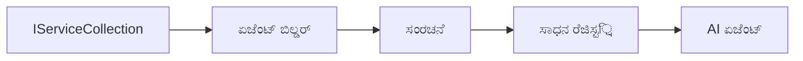

# 🎨 Azure OpenAI (Responses API) (.NET) ಜೊತೆಗೆ ಏಜೆಂಟಿಕ್ ವಿನ್ಯಾಸ ಡಿಸೈನ್ ಮಾದರಿಗಳು

## 📋 ಅಧ್ಯಯನ ಉದ್ದೇಶಗಳು

ಈ ಉದಾಹರಣೆ Microsoft ಏಜೆಂಟ್ ಫ್ರೇಮ್ವರ್ಕ್ ಅನ್ನು .NET ನೊಂದಿಗೆ Azure OpenAI (Responses API) ಎಡಗೈಚುಕೊಂಡು ಬುದ್ಧಿವಂತ ಏಜೆಂಟ್‌ಗಳನ್ನು ನಿರ್ಮಿಸಲು ಉದ್ಯಮ-ಮಟ್ಟದ ವಿನ್ಯಾಸ ಮಾದರಿಗಳನ್ನು ತೋರಿಸುತ್ತದೆ. ನೀವು ವೃತ್ತಿಪರ ಮಾದರಿಗಳು ಮತ್ತು ಆಕೃತಿವಿಧಾನಗಳ ವಿಧಾನಗಳನ್ನು ಕಲಿಯುತ್ತೀರಿ, ಅವು ಏಜೆಂಟ್‌ಗಳನ್ನು ಉತ್ಪಾದನೆಗೆ ಸಿದ್ಧ, ನಿರ್ವಹಣೆಗೆ ಸುಲಭ ಮತ್ತು ವಿಸ್ತರಿಸಬಹುದಾಗಿಸುತ್ತವೆ.

### ಉದ್ಯಮ ಡಿಸೈನ್ ಮಾದರಿಗಳು

- 🏭 **ಫ್ಯಾಕ್ಟರಿ ಪ್ಯಾಟರ್ನ್**: ನಿಯೋಜನೆ ಹೀನಿಕೆಯಿಂದ ಸ್ತandard ಉದ್ಘಾಟನೆ
- 🔧 **ಬಿಲ್ಡರ್ ಪ್ಯಾಟರ್ನ್**: ಸುಗಮ ಏಜೆಂಟ್ ಸಂರಚನೆ ಮತ್ತು ಸೆಟಪ್
- 🧵 **ಥ್ರೆಡ್-ಸುರಕ್ಷಿತ ಮಾದರಿಗಳು**: ಸಮಕಾಲೀನ ಸಂವಾದ ನಿರ್ವಹಣೆ
- 📋 **ರಿಪೋಜಿಟರಿ ಪ್ಯಾಟರ್ನ್**: ಸಂಘಟಿತ ಸಾಧನ ಮತ್ತು ಸಾಮರ್ಥ್ಯ ನಿರ್ವಹಣೆ

## 🎯 .NET-ನಿರ್ದಿಷ್ಟ ವಾಸ್ತುಶಿಲ್ಪ ಲಾಭಗಳು

### ಉದ್ಯಮ ವೈಶಿಷ್ಟ್ಯಗಳು

- **ದೃಢ ಟೈಪಿಂಗ್**: ಸಂಕಲನ-ಸಮಯ ಪರಿಶೀಲನೆ ಮತ್ತು IntelliSense ಬೆಂಬಲ
- **ನಿಯೋಜನೆ ಆಧಾರಿತ ಇಂಜೆಕ್ಷನ್**: ನಿರ್ಮಿತ DI ಕಂಟೈನರ್ ಏಕೀಕರಣ
- **ವಿನ್ಯಾಸ ನಿರ್ವಹಣೆ**: IConfiguration ಮತ್ತು Options ಮಾದರಿಗಳು
- **ಅಸಿಂಕ್ರೋನಸ್ / ಎವೇಟ್**: ಪ್ರಥಮ ದರ್ಜೆಯ ಅಸಿಂಕ್ರೋನಸ್ ಪ್ರೋಗ್ರಾಮಿಂಗ್ ಬೆಂಬಲ

### ಉತ್ಪಾದನೆಗೆ ಸಿದ್ಧ ಮಾದರಿಗಳು

- **ಲಾಗಿಂಗ್ ಏಕೀಕರಣ**: ILogger ಮತ್ತು ರಚನಾತ್ಮಕ ಲಾಗಿಂಗ್ ಬೆಂಬಲ
- **ಆರೋಗ್ಯ ತಪಾಸಣೆಗಳು**: ನಿರ್ಮಿತ ಮೇಲ್ವಿಚಾರಣೆ ಮತ್ತು ವ್ಯತ್ಯಾಸ knife
- **ವಿನ್ಯಾಸ ಪರಿಶೀಲನೆ**: ದತ್ತಾಂಶ ಮಾನ್ಯತೆಗಳೊಂದಿಗೆ ದೃಢ ಟೈಪಿಂಗ್
- **ದೋಷ ನಿರ್ವಹಣೆ**: ರಚನಾತ್ಮಕ ತ್ರುಟಿ ನಿರ್ವಹಣೆ

## 🔧 ತಾಂತ್ರಿಕ ವಾಸ್ತುಶಿಲ್ಪ

### ಮೂಲ .NET ಘಟಕಗಳು

- **Microsoft.Extensions.AI**: ಏಕೀಕೃತ AI ಸೇವೆ ಅವ್ಯವಸ್ಥೆಗಳು
- **Microsoft.Agents.AI**: ಉದ್ಯಮ ಏಜೆಂಟ್ ಸಮನ್ವಯ ಫ್ರೇಮ್ವರ್ಕ್
- **Azure OpenAI (Responses API)**: ಹೆಚ್ಚಿನ ಕಾರ್ಯಕ್ಷಮತೆಯ API ಗ್ರಾಹಕ ಮಾದರಿಗಳು
- **ವಿನ್ಯಾಸ ವ್ಯವಸ್ಥೆ**: appsettings.json ಮತ್ತು ಪರಿಸರ ಏಕೀಕರಣ

### ವಿನ್ಯಾಸ ಮಾದರಿ ಜಾರಿಗೊಳಿಸುವಿಕೆ



## 🏗️ ತೋರಿಸಿದ ಉದ್ಯಮ ಮಾದರಿಗಳು

### 1. **ಸೃಷ್ಟಿಸು ಮಾದರಿಗಳು**

- **ಏಜೆಂಟ್ ಫ್ಯಾಕ್ಟರಿ**: ಸಮಕಾಲೀನ ಚಟುವಟಿಕೆ ಮತ್ತು ಸಂರಚನೆಯೊಂದಿಗೆ ಕೇಂದ್ರಿಕೃತ ಏಜೆಂಟ್ ನಿರ್ಮಾಣ
- **ಬಿಲ್ಡರ್ ಪ್ಯಾಟರ್ನ್**: ಸಂಕೀರ್ಣ ಏಜೆಂಟ್ ಸಂರಚನೆಗಾಗಿ ಸುಗಮ API
- **ಸಿಂಗಲ್‌ಟನ್ ಪ್ಯಾಟರ್ನ್**: ಹಂಚಿಕೆ ಗಳು ವನಕ ಮತ್ತು ಸಂರಚನೆ ನಿರ್ವಹಣೆ
- **ನಿಯೋಜನೆ ಇಂಜೆಕ್ಷನ್**: ಹಿಗ್ಗು ಮುಕ್ತ ಸಂಪರ್ಕ ಮತ್ತು ಪರೀಕ್ಷೆಬಲ್ಲಿಕೆ

### 2. **ಹೊಂದಾಣಿಕೆ ಮಾದರಿಗಳು**

- **ಸ್ಟ್ರಾಟೆಜಿ ಪ್ಯಾಟರ್ನ್**: ಬದಲಾಯಿಸಬಹುದಾದ ಸಾಧನ ಕಾರ್ಯಗತಗೊಳಿಸುವಿಕೆ ತಂತ್ರಗಳು
- **ಕಮಾಂಡ್ ಪ್ಯಾಟರ್ನ್**: ರದ್ದುಪಡಿಸುವುದು / ಮರುಕಳಿಸುವೊಂದಿಗೆ ಏಜೆಂಟ್ ಚಟುವಟಿಕೆ ಅಳವಡಿಕೆ
- **ಒಬ್ಜರ್ವರ್ ಪ್ಯಾಟರ್ನ್**: ಘಟನೆ ಆಧರಿತ ಏಜೆಂಟ್ ಜೀವನಚಕ್ರ ನಿರ್ವಹಣೆ
- **ಟೆಂಪ್ಲೇಟ್ ವಿಧಾನ**: ನಿಯಮಿತ ಏಜೆಂಟ್ ಕಾರ್ಯ ನಿರ್ವಹಣೆ ಕಾರ್ಯಪ್ರವಾಹಗಳು

### 3. **ಸಂರಚನಾ ಮಾದರಿಗಳು**

- **ಆಡಾಪ್ಟರ್ ಪ್ಯಾಟರ್ನ್**: Azure OpenAI (Responses API) ಏಕೀಕರಣ ಪದರ
- **ಡೆಕೊರೇಟರ್ ಪ್ಯಾಟರ್ನ್**: ಏಜೆಂಟ್ ಸಾಮರ್ಥ್ಯ ವೃದ್ಧಿ
- **ಫ್ಯಾಸೇಡ್ ಪ್ಯಾಟರ್ನ್**: ಸರಳೀಕೃತ ಏಜೆಂಟ್ ಸಂವಾದ ಇಂಟರ್ಫೇಸ್ಗಳು
- **ಪ್ರಾಕ್ಸಿ ಪ್ಯಾಟರ್ನ್**: ಪ್ರಸ್ತುತಿಕೆಗೆ ಮರುಹೊಂದಿಸುವಿಕೆ ಮತ್ತು ಕ್ಯಾಸಿಂಗ್

## 📚 .NET ವಿನ್ಯಾಸ ಸಿದ್ಧಾಂತಗಳು

### SOLID ಸಿದ್ಧಾಂತಗಳು

- **ಒಂದು ಜವಾಬ್ದಾರಿ**: ಪ್ರತಿ ಘಟಕಕ್ಕೆ ಒಂದೇ ಸ್ಪಷ್ಟ ಉದ್ದೇಶ
- **ತೆರೆದ/ಮುಚ್ಚಿದ**: ಬದಲಾವಣೆಯಿಲ್ಲದೆ ವಿಸ್ತರಣೆ
- **ಲಿಸ್ಕೋವ್ ಬದಲಿ**: ಇಂಟರ್ಫೇಸ್ ಆಧಾರಿತ ಸಾಧನ ಜಾರಿಗೊಳಿಸುವಿಕೆಗಳು
- **ಇಂಟರ್ಫೇಸ್ ಬೇರ್ಪಟ್ಟು**: ಕೇಂದ್ರೀಕೃತ, ಸೂಕ್ತ ಇಂಟರ್ಫೇಸ್ಗಳು
- **ನಿಯೋಜನೆ ಬದಲಿ**: ರೂಪಕಗಳ ಮೇಲೆ ಅವಲಂಬಿಸು, ನಿರ್ದಿಷ್ಟತೆಗಳ ಮೇಲೆ ಅಲ್ಲ

### ಕ್ಲೀನ್ ವಾಸ್ತುಶಿಲ್ಪ

- **ಡೆಮೇನ್ ಲೇಯರ್**: ಕೋರ್ ಏಜೆಂಟ್ ಮತ್ತು ಸಾಧನ ರೂಪಕಗಳು
- **ಅಪ್ಲಿಕೇಶನ್ ಲೇಯರ್**: ಏಜೆಂಟ್ ಸಮನ್ವಯ ಮತ್ತು ಕಾರ್ಯಪ್ರವಾಹಗಳು
- **ಉಪಕರಣ ಲೇಯರ್**: Azure OpenAI (Responses API) ಏಕೀಕರಣ ಮತ್ತು ಬಾಹ್ಯ ಸೇವೆಗಳು
- **ಪ್ರಸ್ತುತಿ ಲೇಯರ್**: ಬಳಕೆದಾರ ಸಂವಾದ ಮತ್ತು ಪ್ರತಿಕ್ರಿಯಾ ರೂಪಕ

## 🔒 ಉದ್ಯಮ ಗಮನಾರ್ಹ ಅಂಶಗಳು

### ಭದ್ರತೆ

- **ಪ್ರಮಾಣೀಕರಣ ನಿರ್ವಹಣೆ**: IConfiguration ಮೂಲಕ ಸುರಕ್ಷಿತ API ಕೀ ಹ್ಯಾಂಡ್ಲಿಂಗ್‌
- **ಇನ್ಪುಟ್ ಪರಿಶೀಲನೆ**: ದೃಢ ಟೈಪಿಂಗ್ ಮತ್ತು ದತ್ತಾಂಶ ಮಾನ್ಯತೆ ಪರಿಶೀಲನೆ
- **ಔಟ್‌ಪುಟ್ ಶುದ್ಧೀಕರಣ**: ಸುರಕ್ಷಿತ ಪ್ರತಿಕ್ರಿಯಾ ಪ್ರಕ್ರಿಯೆ ಮತ್ತು ಶೋಧನೆ
- **ಆಡಿಟ್ ಲಾಗಿಂಗ್**: ಸಮಗ್ರ ಕಾರ್ಯಾಚರಣೆ ಟ್ರ್ಯಾಕಿಂಗ್

### ಕಾರ್ಯಕ್ಷಮತೆ

- **ಅಸಿಂಕ್ರೋನಸ್ ಮಾದರಿಗಳು**: ಬ್ಲಾಕ್ ಮಾಡದ I/O ಕಾರ್ಯಾಚರಣೆಗಳು
- **ಕನೆಕ್ಷನ್ ಪೂಲಿಂಗ್**: ಪರಿಣಾಮಕಾರಿ HTTP ಗ್ರಾಹಕ ನಿರ್ವಹಣೆ
- **ಕ್ಯಾಸಿಂಗ್**: ಸುಧಾರಿತ ಕಾರ್ಯಕ್ಷಮತೆಗಾಗಿ ಪ್ರತಿಕ್ರಿಯಾ ಕ್ಯಾಸಿಂಗ್
- **ಸಂಪನ್ಮೂಲ ನಿರ್ವಹಣೆ**: ಸರಿಯಾದ ವಿನಾಶ ಮತ್ತು ಶುಚಿಗೊಳಿಸುವಿಕೆ ಮಾದರಿಗಳು

### ವಿಸ್ತರಣೀಯತೆ

- **ಥ್ರೆಡ್ ಸುರಕ್ಷತೆ**: ಸಮಕಾಲೀನ ಏಜೆಂಟ್ ಕಾರ್ಯಾಚರಣೆ ಬೆಂಬಲ
- **ಸಂಪನ್ಮೂಲ ಪೂಲಿಂಗ್**: ಪರಿಣಾಮಕಾರಿ ಸಂಪನ್ಮೂಲ ಉಪಯೋಗ
- **ಲೋಡ್ ನಿರ್ವಹಣೆ**: ದರ ನಿರ್ಬಂಧ ಮತ್ತು ಹಿಂದಿನ ಒತ್ತಡ ನಿರ್ವಹಣೆ
- **ಮೇನೆಟರಿಂಗ್**: ಕಾರ್ಯಕ್ಷಮತೆ ರೇಖಾಚಿತ್ರಗಳು ಮತ್ತು ಆರೋಗ್ಯ ತಪಾಸಣೆಗಳು

## 🚀 ಉತ್ಪಾದನಾ ನಿಯೋಜನೆ

- **ವಿನ್ಯಾಸ ನಿರ್ವಹಣೆ**: ಪರಿಸರ-ನಿರ್ದಿಷ್ಟ ಸೆಟ್ಟಿಂಗ್ಗಳು
- **ಲಾಗಿಂಗ್ ತಂತ್ರಜ್ಞಾನ**: ಸಂರಚಿತ ಲಾಗಿಂಗ್ ಸಹ ಸಮ್ಪರ್ಕ IDಗಳು
- **ದೋಷ ನಿರ್ವಹಣೆ**: ಜಾಗತಿಕ ತ್ರುಟಿ ನಿರ್ವಹಣೆ ಮತ್ತು ಸರಿಯಾದ ಪುನಶ್ಚೇತನ
- **ಮೇನೆಟರಿಂಗ್**: ಅಪ್ಲಿಕೇಶನ್ ಇنسೈಟ್ಸ್ ಮತ್ತು ಕಾರ್ಯಕ್ಷಮತೆ ಕೌಂಟರ್‌ಗಳು
- **ಪರೀಕ್ಷಣೆ**: ಘಟಕ ಪರೀಕ್ಷೆಗಳು, ಏಕೀಕರಣ ಪರೀಕ್ಷೆಗಳು ಮತ್ತು ಲೋಡ್ ಪರೀಕ್ಷೆಗಳ ಮಾದರಿಗಳು

.NET ಜೊತೆ ಉದ್ಯಮಮಟ್ಟದ ಬುದ್ಧಿವಂತ ಏಜೆಂಟ್‌ಗಳನ್ನು ನಿರ್ಮಿಸಲು ಸಿದ್ಧರಾ? ಬನ್ನಿ, ಬಲಿಷ್ಠ वास्तುಶಿಲ್ಪ ನಿರ್ಮಿಸೋಣ! 🏢✨

## 🚀 ಪ್ರಾರಂಭಿಸುವ ವಿಧಾನ

### ಅಗತ್ಯವಾದ ತಯಾರಿಗಳು

- [.NET 10 SDK](https://dotnet.microsoft.com/download/dotnet/10.0) ಅಥವಾ ಹೆಚ್ಚು
- Azure OpenAI ಸಂಪನ್ಮೂಲ ಮತ್ತು ಮಾದರಿ ನಿಯೋಜನೆಯೊಂದಿಗೆ [Azure ಸಬ್ಸ್ಕ್ರಿಪ್ಷನ್](https://azure.microsoft.com/free/)
- [Azure CLI](https://learn.microsoft.com/cli/azure/install-azure-cli) — `az login` ಮೂಲಕ ಲಾಗಿನ್ ಮಾಡಿ

### ಅಗತ್ಯ ಪರಿಸರ ಚರಗಳು

```bash
# zsh/bash
export AZURE_OPENAI_ENDPOINT=https://<your-resource>.openai.azure.com
export AZURE_OPENAI_DEPLOYMENT=gpt-4.1-mini
# ನಂತರ ಹೊಸೂರು ಮಾಡಿ ಆದರೆ AzureCliCredential ಟೋಕನ್ ಪಡೆದುಕೊಳ್ಳಬಹುದು
az login
```

```powershell
# ಪವರ್‌ಶೆಲ್
$env:AZURE_OPENAI_ENDPOINT = "https://<your-resource>.openai.azure.com"
$env:AZURE_OPENAI_DEPLOYMENT = "gpt-4.1-mini"
# ನಂತರ AzureCliCredential ಟೋಕನ್ ಪಡೆಯಲು ಸೈನ್ ಇನ್ ಆಗಿ
az login
```

### ಉದಾಹರಣೆಯ ಕೋಡ್

ಕೋಡ್ ಉದಾಹರಣೆ ನಿರ್ವಹಿಸಲು,

```bash
# zsh/bash
chmod +x ./03-dotnet-agent-framework.cs
./03-dotnet-agent-framework.cs
```

ಅಥವಾ dotnet CLI ಬಳಸಿ:

```bash
dotnet run ./03-dotnet-agent-framework.cs
```

ಸಂಪೂರ್ಣ ಕೋಡ್‌ಗೆ [`03-dotnet-agent-framework.cs`](../../../../03-agentic-design-patterns/code_samples/03-dotnet-agent-framework.cs) ನೋಡಿ.

```csharp
#!/usr/bin/dotnet run

#:package Microsoft.Extensions.AI@10.*
#:package Microsoft.Agents.AI.OpenAI@1.*-*
#:package Azure.AI.OpenAI@2.1.0
#:package Azure.Identity@1.13.1

using System.ComponentModel;

using Microsoft.Agents.AI;
using Microsoft.Extensions.AI;

using Azure.AI.OpenAI;
using Azure.Identity;

// Tool Function: Random Destination Generator
// This static method will be available to the agent as a callable tool
// The [Description] attribute helps the AI understand when to use this function
// This demonstrates how to create custom tools for AI agents
[Description("Provides a random vacation destination.")]
static string GetRandomDestination()
{
    // List of popular vacation destinations around the world
    // The agent will randomly select from these options
    var destinations = new List<string>
    {
        "Paris, France",
        "Tokyo, Japan",
        "New York City, USA",
        "Sydney, Australia",
        "Rome, Italy",
        "Barcelona, Spain",
        "Cape Town, South Africa",
        "Rio de Janeiro, Brazil",
        "Bangkok, Thailand",
        "Vancouver, Canada"
    };

    // Generate random index and return selected destination
    // Uses System.Random for simple random selection
    var random = new Random();
    int index = random.Next(destinations.Count);
    return destinations[index];
}

// Azure OpenAI with the Responses API (stable v1 endpoint). Sign in with `az login`.
var azureEndpoint = Environment.GetEnvironmentVariable("AZURE_OPENAI_ENDPOINT")
    ?? throw new InvalidOperationException("AZURE_OPENAI_ENDPOINT is not set.");
var deployment = Environment.GetEnvironmentVariable("AZURE_OPENAI_DEPLOYMENT") ?? "gpt-4.1-mini";

var azureClient = new AzureOpenAIClient(new Uri(azureEndpoint), new AzureCliCredential());

// Define Agent Identity and Comprehensive Instructions
// Agent name for identification and logging purposes
var AGENT_NAME = "TravelAgent";

// Detailed instructions that define the agent's personality, capabilities, and behavior
// This system prompt shapes how the agent responds and interacts with users
var AGENT_INSTRUCTIONS = """
You are a helpful AI Agent that can help plan vacations for customers.

Important: When users specify a destination, always plan for that location. Only suggest random destinations when the user hasn't specified a preference.

When the conversation begins, introduce yourself with this message:
"Hello! I'm your TravelAgent assistant. I can help plan vacations and suggest interesting destinations for you. Here are some things you can ask me:
1. Plan a day trip to a specific location
2. Suggest a random vacation destination
3. Find destinations with specific features (beaches, mountains, historical sites, etc.)
4. Plan an alternative trip if you don't like my first suggestion

What kind of trip would you like me to help you plan today?"

Always prioritize user preferences. If they mention a specific destination like "Bali" or "Paris," focus your planning on that location rather than suggesting alternatives.
""";

// Create AI Agent with Advanced Travel Planning Capabilities
// Get the Responses client for the deployment and create the AI agent
// Configure agent with name, detailed instructions, and available tools
// This demonstrates the .NET agent creation pattern with full configuration
AIAgent agent = azureClient
    .GetChatClient(deployment)
    .AsAIAgent(
        name: AGENT_NAME,
        instructions: AGENT_INSTRUCTIONS,
        tools: [AIFunctionFactory.Create(GetRandomDestination)]
    );

// Create New Conversation Session for Context Management
// Initialize a new conversation session to maintain context across multiple interactions
// Sessions enable the agent to remember previous exchanges and maintain conversational state
// This is essential for multi-turn conversations and contextual understanding
var session = await agent.CreateSessionAsync();

// Execute Agent: First Travel Planning Request
// Run the agent with an initial request that will likely trigger the random destination tool
// The agent will analyze the request, use the GetRandomDestination tool, and create an itinerary
// Using the session parameter maintains conversation context for subsequent interactions
await foreach (var update in agent.RunStreamingAsync("Plan me a day trip", session))
{
    await Task.Delay(10);
    Console.Write(update);
}

Console.WriteLine();

// Execute Agent: Follow-up Request with Context Awareness
// Demonstrate contextual conversation by referencing the previous response
// The agent remembers the previous destination suggestion and will provide an alternative
// This showcases the power of conversation sessions and contextual understanding in .NET agents
await foreach (var update in agent.RunStreamingAsync("I don't like that destination. Plan me another vacation.", session))
{
    await Task.Delay(10);
    Console.Write(update);
}
```

---

<!-- CO-OP TRANSLATOR DISCLAIMER START -->
**ಅಸ್ವೀಕಾರ**:
ಈ ದಸ್ತಾವೇಜು AI ಅನುವಾದ ಸೇವೆ [Co-op Translator](https://github.com/Azure/co-op-translator) ಬಳಸಿ ಅನುವಾದಿಸಲಾಗಿದೆ. ನಾವು ನಿಖರತೆಯನ್ನು ಸಾಧಿಸಲು ಪ್ರಯತ್ನಿಸುತ್ತಿದ್ದರೂ, ದಯವಿಟ್ಟು ಗಮನಿಸಿ, ಸ್ವಯಂಚಾಲಿತ ಅನುವಾದಗಳಲ್ಲಿ ದೋಷಗಳು ಅಥವಾ ಅಸಡ್ಡೆಗಳು ಇರಬಹುದು. ಮೂಲ ಭಾಷೆಯಲ್ಲಿರುವ ಮೂಲ ದಸ್ತಾವೇಜು ಪ್ರಾಮಾಣಿಕ ಮೂಲವೆಂದು ಪರಿಗಣಿಸಬೇಕು. ಪ್ರಮುಖ ಮಾಹಿತಿಗಾಗಿ, ವೃತ್ತಿಪರ ಮಾನವ ಅನುವಾದವನ್ನು ಶಿಫಾರಸು ಮಾಡಲಾಗುತ್ತದೆ. ಈ ಅನುವಾದವನ್ನು ಬಳಸುವ ಮೂಲಕ ಉಂಟಾಗುವ ಯಾವುದೇ ತಪ್ಪು ಅರ್ಥಗಳ ಅಥವಾ ತಪ್ಪು ವ್ಯಾಖ್ಯಾನಗಳ ಬಗ್ಗೆ ನಾವು ಹೊಣೆಗಾರರಲ್ಲ.
<!-- CO-OP TRANSLATOR DISCLAIMER END -->