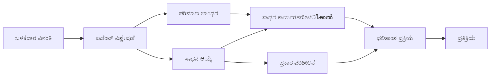

# 🛠️ ಅಜೂರ್ ಓಪನ್‌ಎಐ (ಪ್ರತಿಕ್ರಿಯೆಗಳ API) (.NET) ಬಳಸಿ ಉನ್ನತ ಸಾಧನ ಬಳಕೆ

## 📋 ಕಲಿಕೆ ಗುರಿಗಳು

ಈ ನೋಟ್ಬುಕ್ .NETನಲ್ಲಿ ಮೈಕ್ರೋಸಾಫ್ಟ್ ಏಜೆಂಟ್ ಫ್ರೆಮ್‌ವರ್ಕ್ ಬಳಸಿ ಅಜೂರ್ ಓಪನ್‌ಎಐ (ಪ್ರತಿಕ್ರಿಯೆಗಳ API) ಮೂಲಕ ಎಂಟರ್‌ಪ್ರೈಸ್ ಗ್ರೇಡ್ ಸಾಧನ ಸಂಯೋಜನಾ ಮಾದರಿಗಳನ್ನು ತೋರಿಸುತ್ತದೆ. ನೀವು C# ನ ಬಲವಾದ ಟೈಪಿಂಗ್ ಮತ್ತು .NET ನ ಎಂಟರ್‌ಪ್ರೈಸ್ ವೈಶಿಷ್ಟ್ಯಗಳನ್ನು ಉಪಯೋಗಿಸಿ ಬಹು ವೈಶಿಷ್ಟ್ಯಪೂರ್ಣ ಸಾಧನಗಳೊಂದಿಗೆ ಸುಧಾರಿತ ಏಜೆಂಟ್ಗಳನ್ನು ನಿರ್ಮಿಸಲು ಕಲಿಯುತ್ತೀರಿ.

### ನೀವು ಆಳವಾಗಿ ಕಲಿಯೋ ಸಾಧನ ಸಾಮರ್ಥ್ಯಗಳು

- 🔧 **ಬಹು-ಸಾಧನ ವಾಸ್ತುಶಿಲ್ಪ**: ವಿವಿಧ ವಿಶಿಷ್ಟ ಸಾಮರ್ಥ್ಯಗಳನ್ನು ಹೊಂದಿರುವ ಏಜೆಂಟ್ಗಳ ರಚನೆ
- 🎯 **ಟೈಪ್-ಸೇಫ್ ಸಾಧನ ನಿರ್ವಹಣ**: C# ಸಂಗ್ರಹ ಸಮಯ ಮಾನ್ಯತೆ ಉಪಯೋಗಿಸಿ
- 📊 **ಎಂಟರ್‌ಪ್ರೈಸ್ ಸಾಧನ ಮಾದರಿಗಳು**: ಉತ್ಪಾದನೆಗೆ ತಯಾರಾದ ಸಾಧನ ವಿನ್ಯಾಸ ಮತ್ತು ದೋಷ ನಿರ್ವಹಣೆ
- 🔗 **ಸಾಧನ ಸಂಯೋಜನೆ**: ಜಟಿಲ ವ್ಯವಹಾರ ಕಾರ್ಯಪ್ರವಾಹಗಳನ್ನು ನಿರ್ಮಿಸಲು ಸಾಧನಗಳ ಒಗ್ಗೂಡಿಕೆ

## 🎯 .NET ಸಾಧನ ವಾಸ್ತುಶಿಲ್ಪದ ಲಾಭಗಳು

### ಎಂಟರ್‌ಪ್ರೈಸ್ ಸಾಧನ ವೈಶಿಷ್ಟ್ಯಗಳು

- **ಸಂಗ್ರಹ ಸಮಯ ಮಾನ್ಯತೆ**: ಬಲವಾದ ಟೈಪಿಂಗ್ ಸಾಧನ ಪರಿಮాణಗಳ ತಕ್ಕಂತೆ ಇರಿಸುವುದು ಖಾತ್ರಿ
- **ಆಧಾರ ನಿರ್ವಹಣೆ**: ಸಾಧನ ನಿರ್ವಹಣೆಗೆ IoC ಕಂಟೈನರ್ ಸಂಯೋಜನೆ
- **ಅಸೆಂಕ್/ಅವೇಟ್ ಮಾದರಿಗಳು**: ಸಮರ್ಪಕ ಸಂಪನ್ಮೂಲ ನಿರ್ವಹಣೆಯೊಂದಿಗೆ ನಿರ್ಬಂಧರಹಿತ ಸಾಧನ ನಿರ್ವಹಣೆ
- **ಸಂರಚಿತ ಲಾಗಿಂಗ್**: ಸಾಧನ ನಿರ್ವಹಣೆಯ ಮೇಲ್ವಿಚಾರಣೆಗೆ ನಿರ್ಮಿತ ಲಾಗಿಂಗ್ ಸಂಯೋಜನೆ

### ಉತ್ಪಾದನೆಗೆ ತಯಾರಾದ ಮಾದರಿಗಳು

- **ದೋಷ ನಿರ್ವಹಣೆ**: ಟೈಪ್ ಮಾಡಲಾದ ದೋಷಗಳೊಂದಿಗೆ ಸಮಗ್ರ ದೋಷ ನಿರ್ವಹಣೆ
- **ಸಂಪನ್ಮೂಲ ನಿರ್ವಹಣೆ**: ಸರಿಯಾದ ವಿನಾಶದ ಮಾದರಿಗಳು ಮತ್ತು ಸ್ಮೃತಿ ನಿರ್ವಹಣೆ
- **ಕಾರ್ಯಕ್ಷಮತೆ ಮೇಲ್ವಿಚಾರಣೆ**: ಅಂತರ್ನಿರ್ಮಿತ ಮೆಟ್ರಿಕ್ಸ್ ಮತ್ತು ಕಾರ್ಯಕ್ಷಮತಾ ಕೌಂಟರ್‌ಗಳು
- **ಕಾನ್ಫಿಗರೇಷನ್ ನಿರ್ವಹಣೆ**: ಮಾನ್ಯತೆ ಸಹಿತ ಟೈಪ್-ಸೇಫ್ ಕಾನ್ಫಿಗರೇಷನ್

## 🔧 ತಾಂತ್ರಿಕ ವಾಸ್ತುಶಿಲ್ಪ

### ಕೋರ್ .NET ಸಾಧನ ಘಟಕಗಳು

- **Microsoft.Extensions.AI**: ಏಕೀಕೃತ ಸಾಧನ ಪರಿಕಲ್ಪನಾ ಪದರ
- **Microsoft.Agents.AI**: ಎಂಟರ್‌ಪ್ರೈಸ್ ಗ್ರೇಡ್ ಸಾಧನ ಸಂಯೋಜನೆ
- **ಅಜೂರ್ ಓಪನ್‌ಎಐ (ಪ್ರತಿಕ್ರಿಯೆಗಳ API)**: ಸಂಪರ್ಕ ಪೂಲಿಂಗ್ ಸಹಿತ ಹೆಚ್ಚಿನ ಕಾರ್ಯಕ್ಷಮತೆ API ಕ್ಲಯಿಂಟ್

### ಸಾಧನ ನಿರ್ವಹಣಾ ಸೇರ್ಪಡೆ



## 🛠️ ಸಾಧನ ವರ್ಗಗಳು ಮತ್ತು ಮಾದರಿಗಳು

### 1. **ಡೇಟಾ ಪ್ರಕ್ರಿಯೆ ಸಾಧನಗಳು**

- **ಇನ್ಪುಟ್ ಮಾನ್ಯತೆ**: ಡೇಟಾ ಸೂಚನೆಗಳೊಂದಿಗೆ ಬಲವಾದ ಟೈಪಿಂಗ್
- **ಪರಿವರ್ತನೆ ಶನಿವಾರಗಳು**: ಟೈಪ್-ಸೇಫ್ ಡೇಟಾ ಪರಿವರ್ತನೆ ಮತ್ತು ಸ್ವರೂಪಗೊಳಿಸುವಿಕೆ
- **ವ್ಯವಹಾರ ಲಾಜಿಕ್**: ಡೊಮೇನ್-ನಿರ್ದಿಷ್ಟ ಲೆಕ್ಕಾಚಾರ ಮತ್ತು ವಿಶ್ಲೇಷಣೆ ಸಾಧನಗಳು
- **ಔಟ್ಪುಟ್ ಸ್ವರೂಪಗೊಳಿಸುವಿಕೆ**: ಸಂರಚಿತ ಪ್ರತಿಕ್ರಿಯೆ ತಯಾರಿಕೆ

### 2. **ಸಂಯೋಜನಾ ಸಾಧನಗಳು**

- **API ಸಂಪರ್ಕಕಗಳು**: HttpClient ಸಹಿತ RESTful ಸೇವೆ ಸಂಯೋಜನೆ
- **ಡೇಟಾಬೇಸ್ ಸಾಧನಗಳು**: ಎಂಟಿಟಿ ಫ್ರೇಮುರ್ಕ್ ಸಂಯೋಜನೆ ಡೇಟಾ ಪ್ರವೇಶಕ್ಕೆ
- **ಫೈಲ್ ಕ್ರಿಯೆಗಳು**: ಮಾನ್ಯತೆ ಸಹಿತ ಸುರಕ್ಷಿತ ಕಡತ ವ್ಯವಸ್ಥೆ ಕಾರ್ಯಾಚರಣೆಗಳು
- **ಬಾಹ್ಯ ಸೇವೆಗಳು**: ಮೂರನೆಯ-ಪಕ್ಷ ಸೇವೆ ಸಂಯೋಜನಾ ಮಾದರಿಗಳು

### 3. **ಉಪಯುಕ್ತ ಸಾಧನಗಳು**

- **ಪಠ್ಯ ಪ್ರಕ್ರಿಯೆ**: ಸ್ಟ್ರಿಂಗ್ ಮಾನಿಪ್ಯುಲೇಷನ್ ಮತ್ತು ಸ್ವರೂಪಗೊಳಿಸುವ ಸಾಧನಗಳು
- **ದಿನಾಂಕ/ಸಮಯ ಕ್ರಿಯೆಗಳು**: ಸಂಸ್ಕೃತಿ-ಅರಿವು ದಿನಾಂಕ/ಸಮಯ ಲೆಕ್ಕಾಚಾರಗಳು
- **ಗಣಿತ ಸಾಧನಗಳು**: ನಿಖರ ಲೆಕ್ಕಾಚಾರ ಮತ್ತು ಸಾಂಖ್ಯಿಕ ಕ್ರಿಯೆಗಳು
- **ಮಾನ್ಯತೆ ಸಾಧನಗಳು**: ವ್ಯವಹಾರ ನಿಯಮ ಮಾನ್ಯತೆ ಮತ್ತು ಡೇಟಾ ಪರಿಶೀಲನೆ

ಶಕ್ತಿಶಾಲಿ, ಟೈಪ್-ಸೇಫ್ ಸಾಧನ ಸಾಮರ್ಥ್ಯಗಳೊಂದಿಗೆ ಎಂಟರ್‌ಪ್ರೈಸ್ ಗ್ರೇಡ್ ಏಜೆಂಟ್ಗಳನ್ನು .NET ನಲ್ಲಿ ನಿರ್ಮಿಸುವುದಕ್ಕೆ ಸಿದ್ಧರಿದ್ದೀರಾ? ಬನ್ನಿ, ಕೆಲವು ವೃತ್ತಿಪರ-ಗ್ರೇಡ್ ಪರಿಹಾರಗಳನ್ನು ವಿನ್ಯಾಸ ಮಾಡೋಣ! 🏢⚡

## 🚀 ಪ್ರಾರಂಭಿಸುವುದು

### ಅವಶ್ಯಕತೆಗಳು

- [.NET 10 SDK](https://dotnet.microsoft.com/download/dotnet/10.0) ಅಥವಾ ಹೆಚ್ಚು
- ಅಜೂರ್ ಓಪನ್‌ಎಐ ಸಂಪನ್ಮೂಲ ಮತ್ತು ಮಾದರಿ ನಿಯೋಜನೆಯೊಂದಿಗೆ [ಅಜೂರ್ ಚಂದಾದಾರಿಕೆ](https://azure.microsoft.com/free/)
- [ಅಜೂರ್ CLI](https://learn.microsoft.com/cli/azure/install-azure-cli) — `az login` ಬಳಸಿ ದ್ವಾರ ಪ್ರವೇಶ

### ಅಗತ್ಯ ಸಂಭಾವನೆ ವೇರಿಯಬಲ್ಗಳು

```bash
# zsh/bash
export AZURE_OPENAI_ENDPOINT=https://<your-resource>.openai.azure.com
export AZURE_OPENAI_DEPLOYMENT=gpt-4.1-mini
# ನಂತರ ಲಾಗಿನ್ ಆಗಿ ώστε AzureCliCredential ಟೋಕನ್ ಪಡೆಯಲು ಸಾಧ್ಯವಾಗುತ್ತದೆ
az login
```

```powershell
# ಪವರ್‌ಶೆಲ್
$env:AZURE_OPENAI_ENDPOINT = "https://<your-resource>.openai.azure.com"
$env:AZURE_OPENAI_DEPLOYMENT = "gpt-4.1-mini"
# ನಂತರ AzureCliCredential ಟೋಕನ್ ಪಡೆಯಲು ಸೈನ್ ಇನ್ ಮಾಡಿರಿ
az login
```

### ಮಾದರಿ ಕೋಡ್

ಕೋಡ್ ಉದಾಹರಣೆಯನ್ನು ಚಾಲನೆ ಮಾಡಲು,

```bash
# ಜೆಡ್ಎಸ್ಸೆಚ್/ಬ್ಯಾಶ್
chmod +x ./04-dotnet-agent-framework.cs
./04-dotnet-agent-framework.cs
```

ಅಥವಾ ಡಾಟ್‌ನೆಟ್ CLI ಬಳಸಿ:

```bash
dotnet run ./04-dotnet-agent-framework.cs
```

ಸಂಪೂರ್ಣ ಕೋಡ್ ಅನ್ನು ನೋಡಲು [`04-dotnet-agent-framework.cs`](../../../../04-tool-use/code_samples/04-dotnet-agent-framework.cs) ನೋಡಿ.

```csharp
#!/usr/bin/dotnet run

#:package Microsoft.Extensions.AI@10.*
#:package Microsoft.Agents.AI.OpenAI@1.*-*
#:package Azure.AI.OpenAI@2.1.0
#:package Azure.Identity@1.13.1

using System.ComponentModel;

using Microsoft.Agents.AI;
using Microsoft.Extensions.AI;

using Azure.AI.OpenAI;
using Azure.Identity;

// Tool Function: Random Destination Generator
// This static method will be available to the agent as a callable tool
// The [Description] attribute helps the AI understand when to use this function
// This demonstrates how to create custom tools for AI agents
[Description("Provides a random vacation destination.")]
static string GetRandomDestination()
{
    // List of popular vacation destinations around the world
    // The agent will randomly select from these options
    var destinations = new List<string>
    {
        "Paris, France",
        "Tokyo, Japan",
        "New York City, USA",
        "Sydney, Australia",
        "Rome, Italy",
        "Barcelona, Spain",
        "Cape Town, South Africa",
        "Rio de Janeiro, Brazil",
        "Bangkok, Thailand",
        "Vancouver, Canada"
    };

    // Generate random index and return selected destination
    // Uses System.Random for simple random selection
    var random = new Random();
    int index = random.Next(destinations.Count);
    return destinations[index];
}

// Azure OpenAI with the Responses API (stable v1 endpoint). Sign in with `az login`.
var azureEndpoint = Environment.GetEnvironmentVariable("AZURE_OPENAI_ENDPOINT")
    ?? throw new InvalidOperationException("AZURE_OPENAI_ENDPOINT is not set.");
var deployment = Environment.GetEnvironmentVariable("AZURE_OPENAI_DEPLOYMENT") ?? "gpt-4.1-mini";

var azureClient = new AzureOpenAIClient(new Uri(azureEndpoint), new AzureCliCredential());

// Define Agent Identity and Comprehensive Instructions
// Agent name for identification and logging purposes
var AGENT_NAME = "TravelAgent";

// Detailed instructions that define the agent's personality, capabilities, and behavior
// This system prompt shapes how the agent responds and interacts with users
var AGENT_INSTRUCTIONS = """
You are a helpful AI Agent that can help plan vacations for customers.

Important: When users specify a destination, always plan for that location. Only suggest random destinations when the user hasn't specified a preference.

When the conversation begins, introduce yourself with this message:
"Hello! I'm your TravelAgent assistant. I can help plan vacations and suggest interesting destinations for you. Here are some things you can ask me:
1. Plan a day trip to a specific location
2. Suggest a random vacation destination
3. Find destinations with specific features (beaches, mountains, historical sites, etc.)
4. Plan an alternative trip if you don't like my first suggestion

What kind of trip would you like me to help you plan today?"

Always prioritize user preferences. If they mention a specific destination like "Bali" or "Paris," focus your planning on that location rather than suggesting alternatives.
""";

// Create AI Agent with Advanced Travel Planning Capabilities
// Get the Responses client for the deployment and create the AI agent
// Configure agent with name, detailed instructions, and available tools
// This demonstrates the .NET agent creation pattern with full configuration
AIAgent agent = azureClient
    .GetChatClient(deployment)
    .AsAIAgent(
        name: AGENT_NAME,
        instructions: AGENT_INSTRUCTIONS,
        tools: [AIFunctionFactory.Create(GetRandomDestination)]
    );

// Create New Conversation Session for Context Management
// Initialize a new conversation session to maintain context across multiple interactions
// Sessions enable the agent to remember previous exchanges and maintain conversational state
// This is essential for multi-turn conversations and contextual understanding
await using var session = await agent.CreateSessionAsync();

// Execute Agent: First Travel Planning Request
// Run the agent with an initial request that will likely trigger the random destination tool
// The agent will analyze the request, use the GetRandomDestination tool, and create an itinerary
// Using the session parameter maintains conversation context for subsequent interactions
await foreach (var update in agent.RunStreamingAsync("Plan me a day trip", session))
{
    await Task.Delay(10);
    Console.Write(update);
}

Console.WriteLine();

// Execute Agent: Follow-up Request with Context Awareness
// Demonstrate contextual conversation by referencing the previous response
// The agent remembers the previous destination suggestion and will provide an alternative
// This showcases the power of conversation sessions and contextual understanding in .NET agents
await foreach (var update in agent.RunStreamingAsync("I don't like that destination. Plan me another vacation.", session))
{
    await Task.Delay(10);
    Console.Write(update);
}
```

---

<!-- CO-OP TRANSLATOR DISCLAIMER START -->
**ಅಸ್ವೀಕಾರ**:
ಈ ದಸ್ತಾವೇಜು AI ಅನುವಾದ ಸೇವೆ [Co-op Translator](https://github.com/Azure/co-op-translator) ಬಳಸಿ ಅನುವಾದಿಸಲಾಗಿದೆ. ನಾವು ನಿಖರತೆಯನ್ನು ಸಾಧಿಸಲು ಪ್ರಯತ್ನಿಸುತ್ತಿದ್ದರೂ, ದಯವಿಟ್ಟು ಗಮನಿಸಿ, ಸ್ವಯಂಚಾಲಿತ ಅನುವಾದಗಳಲ್ಲಿ ದೋಷಗಳು ಅಥವಾ ಅಸಡ್ಡೆಗಳು ಇರಬಹುದು. ಮೂಲ ಭಾಷೆಯಲ್ಲಿರುವ ಮೂಲ ದಸ್ತಾವೇಜು ಪ್ರಾಮಾಣಿಕ ಮೂಲವೆಂದು ಪರಿಗಣಿಸಬೇಕು. ಪ್ರಮುಖ ಮಾಹಿತಿಗಾಗಿ, ವೃತ್ತಿಪರ ಮಾನವ ಅನುವಾದವನ್ನು ಶಿಫಾರಸು ಮಾಡಲಾಗುತ್ತದೆ. ಈ ಅನುವಾದವನ್ನು ಬಳಸುವ ಮೂಲಕ ಉಂಟಾಗುವ ಯಾವುದೇ ತಪ್ಪು ಅರ್ಥಗಳ ಅಥವಾ ತಪ್ಪು ವ್ಯಾಖ್ಯಾನಗಳ ಬಗ್ಗೆ ನಾವು ಹೊಣೆಗಾರರಲ್ಲ.
<!-- CO-OP TRANSLATOR DISCLAIMER END -->