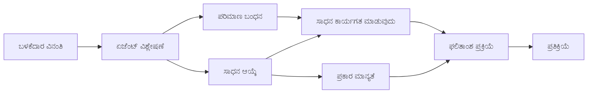

# 🛠️ ಅಜೂರ್ ಓಪನ್‌ಎಐ (ಪ್ರतिक್ರಿಯೆಗಳು API) ក្នុងೊಂದಿಗೆ ಉನ್ನತ ಸಾಧನ ಬಳಕೆ (.NET)

## 📋 ಕಲಿಕೆ ಉದ್ದೇಶಗಳು

ಈ ನೋಟುಬುಕ್ Azure OpenAI (ಪ್ರतिक್ರಿಯೆಗಳು API) ನೊಂದಿಗೆ .NET ನಲ್ಲಿ ಮೈಕ್ರೋಸಾಫ್ಟ್ ಏಜೆಂಟ್ ಫ್ರೇಮ್ವರ್ಕ್ ಬಳಸಿ ಉದ್ಯಮ ಮಟ್ಟದ ಸಾಧನ ಏಕೀಕರಣ ಮಾದರಿಗಳನ್ನು ತೋರಿಸುತ್ತದೆ. ನೀವು C# ನ ಬಲಿಷ್ಠ ಟೈಪಿಂಗ್ ಮತ್ತು .NET ನ ಉದ್ಯಮ ವೈಶಿಷ್ಟ್ಯಗಳನ್ನು ಉಪಯೋಗಿಸಿ ಹಲವಾರು ವಿಶೇಷ ಸಾಧನಗಳೊಂದಿಗೆ ಸುಕ್ಷ್ಮ ಏಜೆಂಟುಗಳನ್ನು ನಿರ್ಮಿಸುವ ಕಲಿಕೆಯಿರಿ.

### ನೀವು ತಮ್ಮೊಂದಿಗೆ ಆದಿವಾಸಿ ಸಾಧನ ಸಾಮರ್ಥ್ಯಗಳನ್ನು ಅರ್ಥಮಾಡಿಕೊಳ್ಳುತ್ತೀರಿ

- 🔧 **ಬಹು-ಸಾಧನ معماري**: ಹಲವಾರು ವಿಶೇಷ ಸಾಮರ್ಥ್ಯಗಳೊಂದಿಗೆ ಏಜೆಂಟುಗಳ ನಿರ್ಮಾಣ
- 🎯 **ಟೈಪ್-ಸೇಫ್ ಸಾಧನ ನಿರ್ವಹಣೆ**: C# ಇತ್ಯಾದಿ ಸಂಯೋಜನಾ-ಕಾಲದ ಶ್ರೇಷ್ಠತೆ ಬಳಸುವಿಕೆ
- 📊 **ಉದ್ಯಮ ಸಾಧನ ಮಾದರಿಗಳನ್ನು**: ಉত್ಪಾದನೆಗೆ ಸಿದ್ಧ ಸಾಧನ ವಿನ್ಯಾಸ ಮತ್ತು ದೋಷ ನಿರ್ವಹಣೆ
- 🔗 **ಸಾಧನ ಸಂಯೋಜನೆ**: ಸಂಕೀರ್ಣ ವ್ಯಾಪಾರ ಕಾರ್ಯಪ್ರವಾಹಗಳಿಗೆ ಸಾಧನಗಳನ್ನು ಸಂಯೋಜಿಸುವುದು

## 🎯 .NET ಸಾಧನ معماري ಲಾಭಗಳು

### ಉದ್ಯಮ ಸಾಧನ ವೈಶಿಷ್ಟ್ಯಗಳು

- **ಸಂಯೋಜನಾ-ಕಾಲದ ಪರಿಶೀಲನೆ**: ಬಲಿಷ್ಠ ಟೈಪಿಂಗ್ ಸಾಧನ ಪ್ಯಾರಾಮೀಟರ್ ಸರಿಯಾದಿಕೆಗೆ ಖಚಿತಪಡಿಸುತ್ತದೆ
- **ಆಧಾರ ಗ್ರಂಥಾಲಯ ಸೇರಿಸುವಿಕೆ**: ಸಾಧನ ನಿರ್ವಹಣೆಗೆ IoC ಕಂಟೈನರ್ ಏಕೀಕರಣ
- **Async/Await ಮಾದರಿಗಳು**: ಸೂಕ್ತ ಸಂಪನ್ಮೂಲ ನಿರ್ವಹಣೆಯೊಂದಿಗೆ ಅড়ಚಣೆ ಇಲ್ಲದ ಸಾಧನ ನಿರ್ವಹಣೆ
- **ಸಂರಚಿತ ಲಾಗಿಂಗ್**: ಸಾಧನ ನಿರ್ವಹಣಾ ನಿಯಂತ್ರಣಕ್ಕಾಗಿ ಒಳಗೊಳ್ಳುವ ಲಾಗಿಂಗ್ ಏಕೀಕರಣ

### ಉತ్పಾದನೆಗೆ ಸಿದ್ಧ ಮಾದರಿಗಳು

- **ವೈಖ್ಯಾತ ದೋಷ ನಿರ್ವಹಣೆ**: ಟೈಪ್ಡ್ ಎಕ್ಸೆಪ್ಷನ್ಗಳೊಂದಿಗೆ ಸಕಲ ದೋಷ ನಿರ್ವಹಣೆ
- **ಸಂಪನ್ಮೂಲ ನಿರ್ವಹಣೆ**: ಸಮರ್ಪಕ ತ್ಯಾಗ ಮಾದರಿಗಳು ಮತ್ತು ಮೆಮರಿ ನಿರ್ವಹಣೆ
- **ಕಾರ್ಯಕ್ಷಮತೆ ಮೇಲ್ವಿಚಾರಣೆ**: ಒಳಗೊಳ್ಳುವ ಮೀಟ್ರಿಕ್ ಮತ್ತು ಕಾರ್ಯಕ್ಷಮತೆ ಮೌಲ್ಯಗಣಕಗಳು
- **ಸಂಕೇತ ನಿರ್ವಹಣೆ**: ಪರಿಶೀಲನೆಯೊಂದಿಗೆ ಟೈಪ್-ಸೇಫ್ ಸಂಕೇತ ನಿರ್ವಹಣೆ

## 🔧 ತಾಂತ್ರಿಕ معماري

### ಮೂಲ .NET ಸಾಧನ ಘಟಕಗಳು

- **Microsoft.Extensions.AI**: ಏಕೀಕೃತ ಸಾಧನ ಸಣ್ಣ ಪದರ
- **Microsoft.Agents.AI**: ಉದ್ಯಮ ಮಟ್ಟದ ಸಾಧನ ನಿಯಂತ್ರಣ
- **Azure OpenAI (ಪ್ರतिक್ರಿಯೆಗಳು API)**: ಸಂಪರ್ಕ ಪೂಳಿತಾಪನದೊಂದಿಗೆ ಹೆಚ್ಚಿನ ಕಾರ್ಯಕ್ಷಮತೆ API ಗ್ರಾಹಕ

### ಸಾಧನ ನಿರ್ವಹಣೆ ಪೈಪ್‌ಲೈನ್



## 🛠️ ಸಾಧನ ವರ್ಗಗಳು ಮತ್ತು ಮಾದರಿಗಳು

### 1. **ಡೇಟಾ ಪ್ರಾಸೆಸಿಂಗ್ ಸಾಧನಗಳು**

- **ಇನ್‌ಪುಟ್ ಪರಿಶೀಲನೆ**: ಡೇಟಾ ಪ್ರಕಟಣೆಯೊಂದಿಗೆ ಬಲಿಷ್ಠ ಟೈಪಿಂಗ್
- **ರೂಪಾಂತರ ಕಾರ್ಯಗಳು**: ಟೈಪ್-ಸೇಫ್ ಡೇಟಾ ಪರಿವರ್ತನೆ ಮತ್ತು ರೂಪರೇಖೆ
- **ವ್ಯಾಪಾರ ತார್ಕಿಕತೆ**: ಡೊಮೇನ್-ನಿರ್ದಿಷ್ಟ ಲೆಕ್ಕಾಚಾರ ಮತ್ತು ವಿಶ್ಲೇಷಣೆ ಸಾಧನಗಳು
- **ಔಟ್‌ಪುಟ್ ರೂಪರೇಖೆ**: ಸೌರಚಿತ ಪ್ರತಿಕ್ರಿಯಾ ಉತ್ಪಾದನೆ

### 2. **ಇಂಟಿಗ್ರೇಶನ್ ಸಾಧನಗಳು**

- **API ಸಂಪರ್ಕಗಳು**: HttpClient ಬಳಸಿ RESTful ಸೇವೆ ಇಂಟಿಗ್ರೇಶನ್
- **ಡೇಟಾಬೇಸ್ ಸಾಧನಗಳು**: ಡೇಟಾ ಪ್ರವೇಶಕ್ಕೆ Entity Framework ಏಕೀಕರಣ
- ** ಫೈಲ್ ಕಾರ್ಯಗಳು**: ಪರಿಶೀಲನೆಯೊಂದಿಗೆ ಸುರಕ್ಷಿತ ಫೈಲ್ ವ್ಯವಸ್ಥೆ ಕಾರ್ಯಗಳು
- **ಬಾಹ್ಯ ಸೇವೆಗಳು**: ಮೂರನೇ ಪಕ್ಷದ ಸೇವೆ ಇಂಟಿಗ್ರೇಶನ್ ಮಾದರಿಗಳು

### 3. **ಉಪಯೋಗಿ ಸಾಧನಗಳು**

- **ಪಠ್ಯ ಪ್ರಕ್ರಿಯೆ**: ಸ್ಟ್ರಿಂಗ್ ತಿದ್ದುಪಡಿ ಮತ್ತು ರೂಪರೇಖೆ ಉಪಕರಣಗಳು
- **ದಿನಾಂಕ/ಸಮಯ ಕಾರ್ಯಗಳು**: ಸಂಸ್ಕೃತಿಗೆ ಅನುಗುಣ ದಿನಾಂಕ/ಸಮಯ ಗಣನೆಗಳು
- **ಗಣಿತ ಸಾಧನಗಳು**: ನಿಖರ ಲೆಕ್ಕಾಚಾರಗಳು ಮತ್ತು ಸ್ಥಿತಿಶಾಸ್ತ್ರ ಕಾರ್ಯಗಳು
- **ಪರಿಶೀಲನಾ ಸಾಧನಗಳು**: ವ್ಯಾಪಾರ ನಿಯಮ ಪರಿಶೀಲನೆ ಮತ್ತು ಡೇಟಾ ದೃಢೀಕರಣ

ಉನ್ನತ, ಟೈಪ್-ಸೇಫ್ ಸಾಧನ ಸಾಮರ್ಥಜಗಳೊಂದಿಗೆ ಉದ್ಯಮ-ಮಟ್ಟದ ಏಜೆಂಟುಗಳನ್ನು ನಿರ್ಮಿಸಲು ಸಿದ್ದಾ? ಬನ್ನಿ ಕೆಲವು ವೃತ್ತಿಪರ-ಮಟ್ಟದ ಪರಿಹಾರಗಳನ್ನು معماري ಮಾಡೋಣ! 🏢⚡

## 🚀 ಪ್ರಾರಂಭಿಸುವುದು

### ಅಗತ್ಯ ಶ್ರೇೕತಿಗಳು

- [.NET 10 SDK](https://dotnet.microsoft.com/download/dotnet/10.0) ಅಥವಾ ಮೇಲಿನ ಆವೃತ್ತಿ
- Azure OpenAI ಸಂಪನ್ಮೂಲ ಮತ್ತು ಮಾದರಿ ನಿಯೋಜನೆಯೊಂದಿಗೆ [ಅಜೂರ್ ಷಬ್ಸ್ಕ್ರಿಪ್ಷನ್](https://azure.microsoft.com/free/)
- [Azure CLI](https://learn.microsoft.com/cli/azure/install-azure-cli) — `az login` ಬಳಸಿ ಲಾಗಿನ್ ಆಗಿರಿ

### ಅಗತ್ಯದ ಪರಿಸರ ಮಾರ್ಪಡಿಗಳು

```bash
# zsh/bash
export AZURE_OPENAI_ENDPOINT=https://<your-resource>.openai.azure.com
export AZURE_OPENAI_DEPLOYMENT=gpt-5-mini
# ನಂತರ ಸಹಿ ಮಾಡಿ, ಆಗ AzureCliCredential ಟೋಕನ್ ಪಡೆಯಬಹುದು
az login
```

```powershell
# ಪವರ್‌ಶೆಲ್
$env:AZURE_OPENAI_ENDPOINT = "https://<your-resource>.openai.azure.com"
$env:AZURE_OPENAI_DEPLOYMENT = "gpt-5-mini"
# ನಂತರ ಸೈನ್ ಇನ್ ಮಾಡಿ ಆದರೆ AzureCliCredential ಟೋಕನ್ ಪಡೆಯಬಹುದು
az login
```

### ಮಾದರಿ ಕೋಡ್

ಉದಾಹರಣೆ ಕೋಡ್ ನಡೆಸಲು,

```bash
# zsh/bash
chmod +x ./04-dotnet-agent-framework.cs
./04-dotnet-agent-framework.cs
```

ಅಥವಾ dotnet CLI ಬಳಸುವಿಕೆ:

```bash
dotnet run ./04-dotnet-agent-framework.cs
```

ಸಂಪೂರ್ಣ ಕೋಡ್ ಅನ್ನು ನೋಡಲು [`04-dotnet-agent-framework.cs`](../../../../04-tool-use/code_samples/04-dotnet-agent-framework.cs) ನೋಡಿ.

```csharp
#!/usr/bin/dotnet run

#:package Microsoft.Extensions.AI@10.*
#:package Microsoft.Agents.AI.OpenAI@1.*-*
#:package Azure.AI.OpenAI@2.1.0
#:package Azure.Identity@1.13.1

using System.ComponentModel;

using Microsoft.Agents.AI;
using Microsoft.Extensions.AI;

using Azure.AI.OpenAI;
using Azure.Identity;

// Tool Function: Random Destination Generator
// This static method will be available to the agent as a callable tool
// The [Description] attribute helps the AI understand when to use this function
// This demonstrates how to create custom tools for AI agents
[Description("Provides a random vacation destination.")]
static string GetRandomDestination()
{
    // List of popular vacation destinations around the world
    // The agent will randomly select from these options
    var destinations = new List<string>
    {
        "Paris, France",
        "Tokyo, Japan",
        "New York City, USA",
        "Sydney, Australia",
        "Rome, Italy",
        "Barcelona, Spain",
        "Cape Town, South Africa",
        "Rio de Janeiro, Brazil",
        "Bangkok, Thailand",
        "Vancouver, Canada"
    };

    // Generate random index and return selected destination
    // Uses System.Random for simple random selection
    var random = new Random();
    int index = random.Next(destinations.Count);
    return destinations[index];
}

// Azure OpenAI with the Responses API (stable v1 endpoint). Sign in with `az login`.
var azureEndpoint = Environment.GetEnvironmentVariable("AZURE_OPENAI_ENDPOINT")
    ?? throw new InvalidOperationException("AZURE_OPENAI_ENDPOINT is not set.");
var deployment = Environment.GetEnvironmentVariable("AZURE_OPENAI_DEPLOYMENT") ?? "gpt-5-mini";

var azureClient = new AzureOpenAIClient(new Uri(azureEndpoint), new AzureCliCredential());

// Define Agent Identity and Comprehensive Instructions
// Agent name for identification and logging purposes
var AGENT_NAME = "TravelAgent";

// Detailed instructions that define the agent's personality, capabilities, and behavior
// This system prompt shapes how the agent responds and interacts with users
var AGENT_INSTRUCTIONS = """
You are a helpful AI Agent that can help plan vacations for customers.

Important: When users specify a destination, always plan for that location. Only suggest random destinations when the user hasn't specified a preference.

When the conversation begins, introduce yourself with this message:
"Hello! I'm your TravelAgent assistant. I can help plan vacations and suggest interesting destinations for you. Here are some things you can ask me:
1. Plan a day trip to a specific location
2. Suggest a random vacation destination
3. Find destinations with specific features (beaches, mountains, historical sites, etc.)
4. Plan an alternative trip if you don't like my first suggestion

What kind of trip would you like me to help you plan today?"

Always prioritize user preferences. If they mention a specific destination like "Bali" or "Paris," focus your planning on that location rather than suggesting alternatives.
""";

// Create AI Agent with Advanced Travel Planning Capabilities
// Get the Responses client for the deployment and create the AI agent
// Configure agent with name, detailed instructions, and available tools
// This demonstrates the .NET agent creation pattern with full configuration
AIAgent agent = azureClient
    .GetChatClient(deployment)
    .AsAIAgent(
        name: AGENT_NAME,
        instructions: AGENT_INSTRUCTIONS,
        tools: [AIFunctionFactory.Create(GetRandomDestination)]
    );

// Create New Conversation Session for Context Management
// Initialize a new conversation session to maintain context across multiple interactions
// Sessions enable the agent to remember previous exchanges and maintain conversational state
// This is essential for multi-turn conversations and contextual understanding
await using var session = await agent.CreateSessionAsync();

// Execute Agent: First Travel Planning Request
// Run the agent with an initial request that will likely trigger the random destination tool
// The agent will analyze the request, use the GetRandomDestination tool, and create an itinerary
// Using the session parameter maintains conversation context for subsequent interactions
await foreach (var update in agent.RunStreamingAsync("Plan me a day trip", session))
{
    await Task.Delay(10);
    Console.Write(update);
}

Console.WriteLine();

// Execute Agent: Follow-up Request with Context Awareness
// Demonstrate contextual conversation by referencing the previous response
// The agent remembers the previous destination suggestion and will provide an alternative
// This showcases the power of conversation sessions and contextual understanding in .NET agents
await foreach (var update in agent.RunStreamingAsync("I don't like that destination. Plan me another vacation.", session))
{
    await Task.Delay(10);
    Console.Write(update);
}
```

---

<!-- CO-OP TRANSLATOR DISCLAIMER START -->
**ಅಸ್ವೀಕಾರ**:
ಈ ದಸ್ತಾವೇಜು AI ಅನುವಾದ ಸೇವೆ [Co-op Translator](https://github.com/Azure/co-op-translator) ಬಳಸಿ ಅನುವಾದಿಸಲಾಗಿದೆ. ನಾವು ನಿಖರತೆಯನ್ನು ಸಾಧಿಸಲು ಪ್ರಯತ್ನಿಸುತ್ತಿದ್ದರೂ, ದಯವಿಟ್ಟು ಗಮನಿಸಿ, ಸ್ವಯಂಚಾಲಿತ ಅನುವಾದಗಳಲ್ಲಿ ದೋಷಗಳು ಅಥವಾ ಅಸಡ್ಡೆಗಳು ಇರಬಹುದು. ಮೂಲ ಭಾಷೆಯಲ್ಲಿರುವ ಮೂಲ ದಸ್ತಾವೇಜು ಪ್ರಾಮಾಣಿಕ ಮೂಲವೆಂದು ಪರಿಗಣಿಸಬೇಕು. ಪ್ರಮುಖ ಮಾಹಿತಿಗಾಗಿ, ವೃತ್ತಿಪರ ಮಾನವ ಅನುವಾದವನ್ನು ಶಿಫಾರಸು ಮಾಡಲಾಗುತ್ತದೆ. ಈ ಅನುವಾದವನ್ನು ಬಳಸುವ ಮೂಲಕ ಉಂಟಾಗುವ ಯಾವುದೇ ತಪ್ಪು ಅರ್ಥಗಳ ಅಥವಾ ತಪ್ಪು ವ್ಯಾಖ್ಯಾನಗಳ ಬಗ್ಗೆ ನಾವು ಹೊಣೆಗಾರರಲ್ಲ.
<!-- CO-OP TRANSLATOR DISCLAIMER END -->