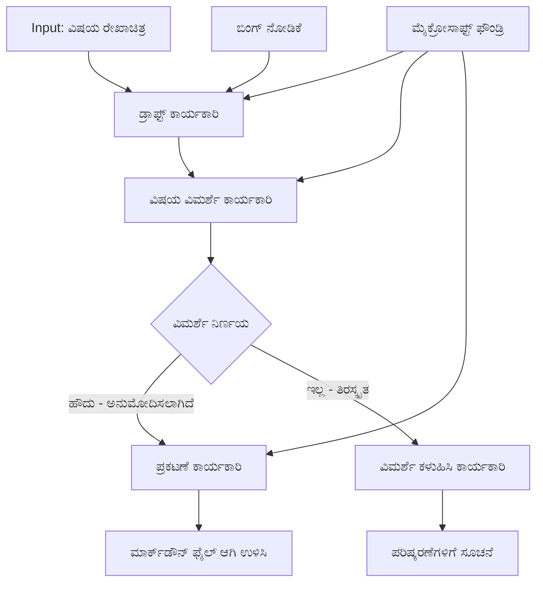

# 🔀 ಮೈಕ್ರೋಸಾಫ್ಟ್ ಫೌಂಡ್ರಿ (.NET) ಜೊತೆಗೆ ಶರತುಗೊಳಿಸಿದ ಏಜೆಂಟ್ ವರ್ಕ್‌ಫ್ಲೋಗಳು

## 📋 ಬುದ್ದಿವಂತಿಕೆ ನಿರ್ಧಾರ ಆಧಾರಿತ ವರ್ಕ್‌ಫ್ಲೋ ಟ್ಯೂಟೋರಿಯಲ್

ಈ ನೋಟುಬುಕ್ ಮೈಕ್ರೋಸಾಫ್ಟ್ ಫೌಂಡ್ರಿ ಮತ್ತು Microsoft Agent Framework ಅನ್ನು .NET ನೊಂದಿಗೆ ಬಳಸಿಕೊಂಡು **ಶರತುಗೊಳಿಸಿದ ವರ್ಕ್‌ಫ್ಲೋ ಮಾದರಿಗಳನ್ನು** ತೋರಿಸುತ್ತದೆ. ನಿಮ್ಮು ಅರ್ಥಮಾಡಿಕೊಳ್ಳುವ, AI ವಿಶ್ಲೇಷಣೆ, ವ್ಯಾಪಾರದ ನಿಯಮಗಳು ಮತ್ತು ಡೈನಾಮಿಕ್ ಶರತ್ತುಗಳಿಗೆ ಆಧಾರಿತವಾಗಿ ಪ್ರಕ್ರಿಯೆಯನ್ನು ಬುದ್ಧಿವಂತಿಕೆಯಿಂದ ಮಾರ್ಗದರ್ಶಿಸುವ ಸುಕ್ಷ್ಮ, ನಿರ್ಧಾರ ಚಾಲಿತ ವರ್ಕ್‌ಫ್ಲೋಗಳನ್ನು ನಿರ್ಮಿಸುವ ಮೂಲಕ ಕಲಿಯುವಿರಿ.

## 🎯 ಕಲಿಕಾ ಉದ್ದೇಶಗಳು

### 🧠 **ಬುದ್ದಿವಂತಿಕೆ ನಿರ್ಧಾರ ವಾಸ್ತುಶಿಲ್ಪ**
- **ಶರತುಗೊಳಿಸಿ ತರ್ಕ ಅನ್ವಯಿಕೆ**: ಅನೇಕ ಶಾಖೆಗಳೊಂದಿಗೆ ಸಂಕೀರ್ಣ ನಿರ್ಧಾರ ಮರಗಳನ್ನು ನಿರ್ಮಿಸಿ
- **AI-ಚಾಲಿತ ಮಾರ್ಗದರ್ಶನ**: ಮೈಕ್ರೋಸಾಫ್ಟ್ ಫೌಂಡ್ರಿ ಮಾದರಿಗಳನ್ನು ಬಳಸಿಕೊಂಡು ಬುದ್ದಿವಂತಿಯ ಮಾರ್ಗದರ್ಶನ ನಿರ್ಧಾರಗಳನ್ನು ಸಂಗ್ರಹಿಸಿ
- **ಡೈನಾಮಿಕ್ ವರ್ಕ್‌ಫ್ಲೋ ಹೊಂದಿಕೆಗೇತೆ**: ರನ್‌ಟೈಮ್ ವಿಶ್ಲೇಷಣೆ ಮತ್ತು ಶರತ್ತುಗಳನ್ನು ಆಧರಿಸಿ ವರ್ಕ್‌ಫ್ಲೋ ವರ್ತನೆ ಬದಲಾಯಿಸಿ
- **ಎಂಟರ್‌ಪ್ರೈಸ್ ನಿಯಮ ಸಂಯೋಜನೆ**: ವ್ಯಾಪಾರದ ತರ್ಕ ಮತ್ತು ಅನುಕೂಲತೆ ನಿಯಮಗಳನ್ನು ವರ್ಕ್‌ಫ್ಲೋಗಳಲ್ಲಿ ಸಮಾವೇಶಿಸಿ

### 🔀 **ಮುನ್ನಡೆದ ಶರತುಗೊಳಿಸಿದ ಮಾದರಿಗಳು**
- **ಬಹು-ಮಾನದಂಡ ನಿರ್ಧಾರ ಕೈಗೊಳ್ಳುವುದು**: ಮಾರ್ಗದರ್ಶನ ನಿರ್ಧಾರಗಳಿಗೆ ಅನೇಕ ಘಟ್ಟಗಳನ್ನು ಮೌಲ್ಯಮಾಪನ ಮಾಡಿ
- **ಪ್ರಸಂಗ-ಸೂಚಿ ಪ್ರಕ್ರಿಯೆ**: ಸಂಗ್ರಹಿತ ವರ್ಕ್‌ಫ್ಲೋ ಸಾಂದರ್ಭಿಕ ಮತ್ತು ಇತಿಹಾಸ ಆಧಾರಿತ ನಿರ್ಧಾರಗಳು
- **ಹೊಂದಿಕೊಳ್ಳುವ ವರ್ಕ್‌ಫ್ಲೋ ಪರಿಷ್ಕರಣೆ**: ನೈಜ ಕಾಲದ ಶರತ್ತುಗಳನ್ನು ಆಧರಿಸಿ ಪ್ರಕ್ರಿಯಾ ಮಾರ್ಗಗಳನ್ನು ವ್ಯವಸ್ಥೆಯಾಗಿಸಿ
- **ನಿಯಮ ಯಂತ್ರ ಸಂಯೋಜನೆ**: ವರ್ಕ್‌ಫ್ಲೋಗಳಲ್ಲಿ ಸುಕ್ಷ್ಮ ವ್ಯಾಪಾರದ ನಿಯಮ ಯಂತ್ರಗಳನ್ನುಅಳವಡಿಸಿ

### 🏢 **ಎಂಟರ್‌ಪ್ರೈಸ್ ಶರತುಗೊಳಿಸಿದ ಅಪ್ಲಿಕೇಶನ್ಗಳು**
- **ಡಾಕ್ಯುಮೆಂಟ್ ವರ್ಗಾವಣೆ ಮತ್ತು ಮಾರ್ಗದರ್ಶನ**: ಡಾಕ್ಯುಮೆಂಟ್‌ಗಳನ್ನು ಸ್ವಯಂಚಾಲಿತವಾಗಿ ವರ್ಗಾಯಿಸಿ ಸೂಕ್ತ ವರ್ಕ್‌ಫ್ಲೋಗಳಿಗೆ ಸಾಗಿಸುವುದು
- **ಗ್ರಾಹಕ ಸೇವಾ ತ್ರಯಾಜ್**: ಗ್ರಾಹಕ ವಿಚಾರಣೆಗಳ ಬುದ್ಧಿವಂತ ಮಾರ್ಗದರ್ಶನ ವಿಶೇಷ ತಂಡಗಳಿಗೆ
- **ಅನುಕೂಲತೆ ಮತ್ತು ಅಪಾಯ ಪ್ರಕ್ರಿಯೆ ಅಳವಡಿಕೆ**: ಅಪಾಯ ಮೌಲ್ಯಮಾಪನಕ್ಕೆ ಅನುಗುಣವಾಗಿ ವಿಭಿನ್ನ ಪರಿಶೀಲನೆ ಮತ್ತು ಮೌಲ್ಯಮಾಪನ ಪ್ರಕ್ರಿಯೆಗಳನ್ನು ಅನ್ವಯಿಸುವುದು
- **ಗುಣಮಟ್ಟ ಖಾತ್ರಿ ವಿವರಣೆಗಳು**: ಗುಣಮಟ್ಟದ ಅಂಕಿಅಂಶಗಳ ಆಧಾರದಲ್ಲಿ ವಿಷಯವನ್ನು ಪರಿಶೀಲನೆ ಪ್ರಕ್ರಿಯೆಗಳ ಮೂಲಕ ಸಾಗಿಸುವುದು

## ⚙️ ಅವಶ್ಯಕತೆಗಳು ಮತ್ತು ಸಂಯೋಜನೆ

### 📦 **ಅವಶ್ಯಕ NuGet ಪ್ಯಾಕೇಜುಗಳು**

ಶರತುಗೊಳಿಸಿದ ವರ್ಕ್‌ಫ್ಲೋ ಪ್ರಕ್ರಿಯೆಗಳಿಗಾಗಿ ಅನುದತ ಪ್ಯಾಕೇಜುಗಳು:

```xml
<!-- Core AI Framework -->
<PackageReference Include="Microsoft.Extensions.AI" Version="9.9.0" />

<!-- Azure AI Agents with Persistent State -->
<PackageReference Include="Azure.AI.Agents.Persistent" Version="1.2.0-beta.5" />

<!-- Azure Identity and Utilities -->
<PackageReference Include="Azure.Identity" Version="1.15.0" />
<PackageReference Include="System.Linq.Async" Version="6.0.3" />
<PackageReference Include="DotNetEnv" Version="3.1.1" />

<!-- Local Workflow Framework References -->
<!-- Microsoft.Agents.Workflows.dll - Advanced workflow orchestration -->
<!-- Microsoft.Agents.AI.AzureAI.dll - Microsoft Foundry integration -->
<!-- Microsoft.Agents.AI.dll - Core agent abstractions -->
```

### 🔑 **ಮೈಕ್ರೋಸಾಫ್ಟ್ ಫೌಂಡ್ರಿ ಸಂರಚನೆ**

**ಅವಶ್ಯಕ ಏಜುರ್ ಸಂಪನ್ಮೂಲಗಳು:**
- ವೈಶಿಷ್ಟ್ಯಪೂರ್ಣ ಪ್ರಕ್ರಿಯೆಯ ಮಾದರಿಗಳೊಂದಿಗೆ ಮೈಕ್ರೋಸಾಫ್ಟ್ ಫೌಂಡ್ರಿ ವರ್ಕ್‌ಸ್ಪೇಸ್
- ಸೂಕ್ತ ಗಣನೆ ಹಂಚಿಕೆ ಮತ್ತು ಅನುಮತಿಗಳೊಂದಿಗೆ ಏಜುರ್ ಚಂದಾದಾರಿಕೆ
- ನಿರ್ಧಾರ ಕೈಗೊಳ್ಳುವಿಕೆಯ ಮತ್ತು ವಿಷಯ ವಿಶ್ಲೇಷಣೆಗಾಗಿ ನಿಯೋಜಿತ AI ಮಾದರಿಗಳು
- (ಐಚ್ಛಿಕ) ಭೂಮೂಲ ಆಧಾರಿತ ಸಾಮರ್ಥ್ಯಗಳಿಗಾಗಿ ಬಿಂಗ್ ಸರ್ಚ್ API ಸಂಪರ್ಕ

**ಪರಿಸರ ಸಂರಚನೆ (.env ಫೈಲ್):**
```env
# Microsoft Foundry Configuration
AZURE_AI_PROJECT_ENDPOINT=https://your-project.cognitiveservices.azure.com/
BING_CONNECTION_ID=your-bing-connection-id
```

**ಪ್ರಾಮಾಣೀಕರಣ ಸಂಯೋಜನೆ:**
```csharp
// Azure CLI or Managed Identity authentication
using Azure.Identity;
var credential = new AzureCliCredential();

// Load environment configuration
DotNetEnv.Env.Load("../../../.env");
```

### 🏗️ **ಶರತುಗೊಳಿಸಿದ ವರ್ಕ್‌ಫ್ಲೋ ವಾಸ್ತುಶಿಲ್ಪ**



**ಪ್ರಮುಖ ಘಟಕಗಳು:**
- **ಡ್ರಾಫ್ಟ್ ಕಾರ್ಯಗತಗೊಳಿಸುವಿಕೆ**: ಅಡಿಗೈಗುಳಿಯಿಂದ ಪ್ರಾರಂಭಿಕ ವಿಷಯ ಡ್ರಾಫ್ಟ್‌ಗಳನ್ನು ರಚಿಸುವ AI ಏಜೆಂಟ್
- **ವಿಷಯ ಪರಿಶೀಲನಾ ಕಾರ್ಯಗತಗೊಳಿಸುವಿಕೆ**: ಡ್ರಾಫ್ಟ್ ಗುಣಮಟ್ಟ ಮತ್ತು ಅನುಕೂಲತೆಯನ್ನು ಮೌಲ್ಯಮಾಪನ ಮಾಡುವ AI ಏಜೆಂಟ್
- **ಶರತುಗೊಳಿಸಿದ ಮಾರ್ಗದರ್ಶನ**: ಪರಿಶೀಲನೆ ಫಲಿತಾಂಶಗಳ ಆಧಾರದ ಮೇಲೆ ಮಾರ್ಗದರ್ಶನ ನಿರ್ಧಾರ ತರ್ಕ
- **ಪ್ರಕಾಶನ/ಪರಿಶೀಲನೆ ಮಾರ್ಗಗಳು**: ಅನುಮೋದಿತ ಮತ್ತು ನಿರಾಕೃತ ವಿಷಯಗಳಿಗೆ ವಿಭಿನ್ನ ಪ್ರಕ್ರಿಯಾ ಮಾರ್ಗಗಳು
- **ಸ್ಥಿತಿ ನಿರ್ವಹಣೆ**: ಸಂಪೂರ್ಣ ವರ್ಕ್‌ಫ್ಲೋ ಸಮಯದಲ್ಲಿ ವಿಷಯ ಮತ್ತು ಪರಿಶೀಲನಾ ಸಾಂದರ್ಭಿಕವನ್ನು ಕಾಪಾಡುವುದು

## 🎨 **ಶರತುಗೊಳಿಸಿದ ವರ್ಕ್‌ಫ್ಲೋ ವಿನ್ಯಾಸ ಮಾದರಿಗಳು**

### 📋 **ಗುಣಮಟ್ಟ ಗೇಟ್ಗಳೊಂದಿಗೆ ವಿಷಯ ಉತ್ಪಾದನೆ**
```
Outline → Draft Creation → Quality Review → {Approve: Publish | Reject: Revise}
```

### 🎯 **ಅಪಾಯ ಆಧಾರಿತ ಡಾಕ್ಯುಮೆಂಟ್ ಪ್ರಕ್ರಿಯೆ**
```
Document → Risk Assessment → {Low: Standard | High: Enhanced Review}
```

### 🔍 **ಬುದ್ಧಿವಂತ ಗ್ರಾಹಕ ಸೇವಾ ಮಾರ್ಗದರ್ಶನ**
```
Customer Query → Analysis → {Simple: FAQ Bot | Complex: Human Agent}
```

### 💼 **ಅನುಕೂಲ ನಿಯಮ ಆಧಾರಿತ ವರ್ಕ್‌ಫ್ಲೋಗಳು**
```
Content → Compliance Check → {Pass: Publish | Fail: Legal Review}
```

## 🏢 **ಎಂಟರ್‌ಪ್ರೈಸ್ ಶರತುಗೊಳಿಸಿದ ಲಾಭಗಳು**

### 🎯 **ಬುದ್ಧಿವಂತ ಸ್ವಯಂಚಾಲನೆ**
- **ಸ್ಮಾರ್ಟ್ ನಿರ್ಧಾರ ಕೈಗೊಳ್ಳುವುದು**: ವಿಷಯ ವಿಶ್ಲೇಷಣೆ ಮತ್ತು ಸಾಂದರ್ಭಿಕದ ಆಧಾರದಲ್ಲಿ AI-ಚಾಲಿತ ಮಾರ್ಗದರ್ಶನ ನಿರ್ಧಾರಗಳು
- **ಹೊಂದಿಕೊಳ್ಳುವ ಪ್ರಕ್ರಿಯೆ**: ಬದಲಾಗುವ ಶರತ್ತುಗಳ ಆಧಾರದಲ್ಲಿ ಸ್ವಯಂಚಾಲಿತವಾಗಿ ಹೊಂದಿಕೊಳ್ಳುವ ವರ್ಕ್‌ಫ್ಲೋಗಳು
- **ವ್ಯಾಪಾರ ನಿಯಮ ಜಾರಿಗೊಳಿಸುವಿಕೆ**: ಸಂಕೀರ್ಣ ವ್ಯಾಪಾರ ತರ್ಕ ಮತ್ತು ನೀತಿಗಳ ಸ್ವಯಂಚಾಲಿತ ಅನ್ವಯಿಕೆ
- **ಸಾಂದರ್ಭಿಕ-ಜಾಗೃತಿ ಮಾರ್ಗದರ್ಶನ**: ಸಂಪೂರ್ಣ ವರ್ಕ್‌ಫ್ಲೋ ಇತಿಹಾಸ ಮತ್ತು ಸಂಗ್ರಹಿತ ಸಾಂದರ್ಭಿಕದ ಆಧಾರದಲ್ಲಿ ನಿರ್ಧಾರಗಳು

### 📈 **ಕಾರ್ಯಕ್ಷಮತೆ ಶ್ರೇಷ್ಠತೆ**
- **ಅತ್ಯುತ್ತಮ ಸಂಪನ್ಮೂಲ ಹಂಚಿಕೆ**: ಕೆಲಸವನ್ನು ಸೂಕ್ತ ತಜ್ಞರು ಮತ್ತು ಪ್ರಕ್ರಿಯೆಗಳಿಗೆ ಮಾರ್ಗದರ್ಶಿಸಿ
- **ಕಡಿಮೆ ಕೈಪಿಡಿ ಹಸ್ತಕ್ಷેપ**: ಸ್ವಯಂಚಾಲಿತ ನಿರ್ಧಾರ ಕೈಗೊಳ್ಳುವುದರಿಂದ ಮಾನವನ ಹಸ್ತಕ್ಷೇಪ ಅಗತ್ಯವನ್ನು ಕಡಿಮೆಮಾಡುತ್ತದೆ
- **ವೇಗದ ಪರಿಹಾರ ಸಮಯಗಳು**: ಸೂಕ್ತ ಪರಿಣತಿ ಮತ್ತು ಪ್ರಕ್ರಿಯಾ ಸಾಮರ್ಥ್ಯಗಳಿಗೆ ನೇರ ಮಾರ್ಗದರ್ಶನ
- **ಸ್ಥಿರ ಅನ್ವಯಿಕೆ**: ವ್ಯಾಪಾರದ ನಿಯಮಗಳು ಮತ್ತು ನಿರ್ಧಾರ ಮಾನದಂಡಗಳ ಏಕೀಕೃತ ಅನ್ವಯಿಕೆ

### 🛡️ **ಅಪಾಯ ನಿರ್ವಹಣೆ ಮತ್ತು ಅನುಕೂಲತೆ**
- **ಸ್ವಯಂಚಾಲಿತ ಅಪಾಯ ಮೌಲ್ಯಮಾಪನ**: ವಿಷಯ ಮತ್ತು ಪರಿಸ್ಥಿತಿಯ ಅಪಾಯ ಮಟ್ಟಗಳ AI-ಚಾಲಿತ ಮೌಲ್ಯಮಾಪನ
- **ಅನುಕೂಲ ನಿಯಮ ಜಾರಿಗೊಳಿಸುವಿಕೆ**: ಅಗತ್ಯ ನಿಯಂತ್ರಣ ಪ್ರಕ್ರಿಯೆಗಳ ಮೂಲಕ ಸ್ವಯಂಚಾಲಿತ ಮಾರ್ಗದರ್ಶನ
- **ಸುರಕ್ಷತಾ ಪ್ರೋಟೋಕಾಲ್ ಅನ್ವಯಿಕೆ**: ಅಪಾಯ ಮೌಲ್ಯಮಾಪನದ ಆಧಾರದ ಮೇಲೆ ವೃದ್ಧಿಪಡಿಸಿದ ಸುರಕ್ಷತಾ ಕ್ರಮಗಳು
- **ಪರಿಶೀಲನಾ ತಿರುವು ಕಾಯ್ದುಕೊಳ್ಳುವಿಕೆ**: ಮಾರ್ಗದರ್ಶನ ನಿರ್ಧಾರಗಳ ಮತ್ತು ಕಾರಣಗಳ ಸಂಪೂರ್ಣ ದಾಖಲೆ

### 📊 **ವಿಶ್ಲೇಷಣೆ ಮತ್ತು ನಿರಂತರ ಸುಧಾರಣೆ**
- **ನಿರ್ಧಾರ ವಿಶ್ಲೇಷಣೆ**: ಮಾರ್ಗದರ್ಶನ ನಿರ್ಧಾರಗಳ ಪರಿಣಾಮಕಾರಿತ್ವ ಮತ್ತು ಖಚಿತತೆ ಟ್ರ್ಯಾಕ್ ಮಾಡಿ
- **ಮಾದರಿ ಗುರುತು ಪಟ್ಟುಕೊಳ್ಳುವುದು**: ಸಮಯಕಾಲದಲ್ಲಿ ಮಾರ್ಗದರ್ಶನ ನಿರ್ಧಾರಗಳ ಪ್ರವೃತ್ತಿಗಳು ಮತ್ತು ಮಾದರಿಗಳನ್ನು ಗುರುತಿಸಿ
- **ಪ್ರದರ್ಶನ ಉತ್ತಮೀಕರಣ**: ನಿರ್ಧಾರ ಮಾನದಂಡ ಮತ್ತು ಮಾರ್ಗದರ್ಶನ ದಕ್ಷತೆಯ ನಿರಂತರ ಸುಧಾರಣೆ
- **ವ್ಯಾಪಾರ ಬುದ್ಧಿವಂತಿಕೆ**: ವಿಷಯ ಲಕ್ಷಣಗಳು ಮತ್ತು ಪ್ರಕ್ರಿಯೆ ಅಗತ್ಯಗಳ ನಿರ್ಣಯ

### 🔧 **ಸಾಂಘಟಿಕ ಶ್ರೇಷ್ಠತೆ**
- **ಸ್ಥಿರ ಸ್ಥಿತಿ ನಿರ್ವಹಣೆ**: ವರ್ಕ್‌ಫ್ಲೋ ಕಾರ್ಯಗತಗೊಳಿಸುವಿಕೆಯಲ್ಲಿ ಸಂಕೀರ್ಣ ಸ್ಥಿತಿಯನ್ನು ಕಾಯ್ದುಕೊಳ್ಳುವುದು
- **ವಿಸ್ತರಿಸಬಹುದಾದ ವಾಸ್ತುಶಿಲ್ಪ**: ಹೆಚ್ಚಿನ ಪ್ರಮಾಣದ ಶರತುಗೊಳಿಸಿದ ಪ್ರಕ್ರಿಯೆ ಅಗತ್ಯಗಳನ್ನು ನಿರ್ವಹಿಸುವುದು
- **ಸಂಯೋಜನೆ ಸಾಮರ್ಥ್ಯಗಳು**: നിലവಿನ ವ್ಯಾಪಾರ ವ್ಯವಸ್ಥೆಗಳು ಮತ್ತು ಪ್ರಕ್ರಿಯೆಗಳ ಸಹಜ ಸಂಯೋಜನೆ
- **ಗಮನಿಸಿ ಮತ್ತು ಪ್ರದರ್ಶನ ತಿಳಿವಳಿಕೆ**: ವರ್ಕ್‌ಫ್ಲೋ ಪ್ರದರ್ಶನ ಮತ್ತು ನಿರ್ಧಾರಗಳ ಸಂಪೂರ್ಣ ಟ್ರ್ಯಾಕಿಂಗ್

.NET ಮೂಲಕ ಬುದ್ಧಿವಂತ, ನಿರ್ಧಾರ ಚಾಲಿತ ಎಂಟರ್‌ಪ್ರೈಸ್ ವರ್ಕ್‌ಫ್ಲೋಗಳನ್ನು ನಿರ್ಮಿಸೋಣ! 🚀

## 💻 ಕೋಡ್ ರನ್ ಮಾಡುವುದು

ಪೂರ್ಣ ಅನುಷ್ಠಾನವು `04.dotnet-agent-framework-workflow-aifoundry-condition.cs` ನಲ್ಲಿ ಲಭ್ಯವಿದೆ. ಇದು **ಗುಣಮಟ್ಟ ಗೇಟ್ಗಳೊಂದಿಗೆ ವಿಷಯ ಉತ್ಪಾದನೆ ವರ್ಕ್‌ಫ್ಲೋ** ಅನ್ನು ತೋರಿಸುತ್ತದೆ:

### 🏗️ **ವರ್ಕ್‌ಫ್ಲೋ ವಾಸ್ತುಶಿಲ್ಪ**

```
Content Outline → Draft Creation → Quality Review → Conditional Routing:
                                                      ├─ Approved (>200 words) → Publish
                                                      └─ Rejected (<200 words) → Review Notification
```

**ವರ್ಕ್‌ಫ್ಲೋದಲ್ಲಿ ಏಜೆಂಟ್‌ಗಳು:**
1. **ಎವಾಂಜೆಲಿಸ್ಟ್ ಏಜೆಂಟ್**: ಬಿಂಗ್ gronding ಜೊತೆಗೆ ರೂಪರೇಖೆಯಿಂದ ಟ್ಯೂಟೋರಿಯಲ್ ಡ್ರಾಫ್ಟ್‌ಗಳು ರಚಿಸುತ್ತದೆ
2. **ವಿಷಯ ವಿಮರ್ಶಕ ಏಜೆಂಟ್**: ಡ್ರಾಫ್ಟ್ ಗುಣಮಟ್ಟ (ಪದ ಎಣಿಕೆ, ಪೂರ್ಣತೆ) ಮೌಲ್ಯಮಾಪನ
3. **ಪ್ರಕಾಶಕ ಏಜೆಂಟ್**: ಅನುಮೋದಿತ ವಿಷಯವನ್ನು ಟೈಮ್‌ಸ್ಟಾಂಪ್ ಮಾಡಲಾದ Markdown ಫೈಲ್‌ಗಳಾಗಿ ಸಂರಕ್ಷಿಸುತ್ತದೆ

**ಕಸ್ಟಮ್ ಕಾರ್ಯಗತಗೊಳಿಸುವಿಕೆಗಳು:**
1. **DraftExecutor**: ಡ್ರಾಫ್ಟ್ ರಚನೆ ನಿರ್ವಹಣೆ ಮಾಡುತ್ತದೆ
2. **ContentReviewExecutor**: ಗುಣಮಟ್ಟ ಮೌಲ್ಯಮಾಪನ ಮಾಡುತ್ತದೆ
3. **PublishExecutor**: ಅನುಮೋದಿತ ವಿಷಯ ಪ್ರಕಟಣೆ ನಿರ್ವಹಣೆ ಮಾಡುತ್ತದೆ
4. **SendReviewExecutor**: ನಿರಾಕೃತ ವಿಷಯಗಳ ಅಧಿಸೂಚನೆಗಳನ್ನು ನಿರ್ವಹಣೆ ಮಾಡುತ್ತದೆ

### 🚀 ಉದಾಹರಣೆ ಚಾಲನೆ

**ಪೂರ್ವಾಪೇಕ್ಷಿತಗಳು:**
- ಮೈಕ್ರೋಸಾಫ್ಟ್ ಫೌಂಡ್ರಿ ವರ್ಕ್‌ಸ್ಪೇಸ್ ಸಂಯೋಜಿಸಿದ್ದಿದ್ದೀರಿ
- ಏಜುರ್ CLI ಪ್ರಾಮಾಣೀಕರಣ (`az login`)
- (ಐಚ್ಛಿಕ) ಭೂಮೂಲ ಆಧಾರಿತ ಬಿಂಗ್ ಸರ್ಚ್ ಸಂಪರ್ಕ

```bash
# ಸ್ಕ್ರಿಪ್ಟ್ ಅನ್ನು ಕಾರ್ಯನಿರ್ವಹಣೀಯವಾಗಿರಿಸಿ (ಯುನಿಕ್ಸ್/ಲಿನಕ್ಸ/ಮ್ಯಾಕ್‌ ಓಎಸ್)
chmod +x 04.dotnet-agent-framework-workflow-aifoundry-condition.cs

# ಶರತ್ತಿನ ಕಾರ್ಯಪ್ರವಾಹವನ್ನು ಚಾಲನೆ ಮಾಡು
./04.dotnet-agent-framework-workflow-aifoundry-condition.cs
```

ಅಥವಾ ವಿಂಡೋಸ್‌ನಲ್ಲಿ:
```powershell
dotnet run 04.dotnet-agent-framework-workflow-aifoundry-condition.cs
```

### 📝 ನಿರೀಕ್ಷಿತ ಔಟ್‌ಪುಟ್

ವರ್ಕ್‌ಫ್ಲೋ:
1. **ಏಜೆಂಟ್‌ಗಳನ್ನು ರಚಿಸಿ**: ಮೂರು ವಿಶಿಷ್ಟ ಮೈಕ್ರೋಸಾಫ್ಟ್ ಫೌಂಡ್ರಿ ಏಜೆಂಟ್‌ಗಳನ್ನು ಪ್ರಾರಂಭಿಸಿ
2. **ಡ್ರಾಫ್ಟ್ ರಚನೆ**: ಎವಾಂಜೆಲಿಸ್ಟ್ ಏಜೆಂಟ್ ರೂಪರೇಖೆಯಿಂದ ಟ್ಯೂಟೋರಿಯಲ್ ಡ್ರಾಫ್ಟ್‌ನ್ನು ರಚಿಸುತ್ತದೆ
3. **ವಿಷಯ ಪರಿಶೀಲನೆ**: ವಿಷಯ ವಿಮರ್ಶಕ ಡ್ರಾಫ್ಟ್ ಗುಣಮಟ್ಟವನ್ನು ಮೌಲ್ಯಮಾಪನ ಮಾಡುತ್ತಾನೆ
4. **ಶರತುಗೊಳಿಸಿದ ಮಾರ್ಗದರ್ಶನ**:
   - **ಅನುಮೋದಿಸಿದರೆ (>200 ಪದಗಳು)**: ಪ್ರಕಾಶಕ ಕಾರ್ಯಗತಗೊಳಿಸುವಿಕೆ Markdown ಫೈಲ್ ಆಗಿ ಉಳಿಸು
   - **ನಿರಾಕৃতರೆ (<200 ಪದಗಳು)**: ವಿಮರ್ಶೆ ಅಧಿಸೂಚನೆಯನ್ನು ಕಳುಹಿಸಿ
5. **ಫಲಿತಾಂಶವನ್ನು ಪ್ರದರ್ಶಿಸಿ**: ಅಂತಿಮ ವರ್ಕ್‌ಫ್ಲೋ ಫಲಿತಾಂಶವನ್ನು ತೋರಿಸು

### 🔧 ಕಸ್ಟಮೈಜೆಶನ್ ಆಯ್ಕೆಗಳು

**ವಿಮರ್ಶೆ ಮಾನದಂಡ ಬದಲಾಯಿಸಿ:**
```csharp
const string ContentReviewerInstructions = @"
You are a content reviewer...
1. Check if content is more than 500 words (instead of 200)
2. Verify technical accuracy
3. Ensure proper formatting
...";
```

**ಹೆಚ್ಚಿನ ಶರತುಗೊಳಿಸಿದ ಪಥಗಳನ್ನು ಸೇರಿಸಿ:**
```csharp
var workflow = new WorkflowBuilder(draftExecutor)
    .AddEdge(draftExecutor, contentReviewerExecutor)
    .AddEdge(contentReviewerExecutor, publishExecutor, condition: GetCondition("Excellent"))
    .AddEdge(contentReviewerExecutor, editExecutor, condition: GetCondition("Good"))
    .AddEdge(contentReviewerExecutor, sendReviewerExecutor, condition: GetCondition("Poor"))
    .Build();
```

**ವಿಷಯ ಅಗತ್ಯಗಳನ್ನು ಬದಲಾಯಿಸಿ:**
```csharp
string OUTLINE_Content = @"
# Your Custom Topic
## Section 1
https://your-reference-url
## Section 2
...
";
```

### 🎯 ನೈಜ ಜಗತ್ತಿನ ಅಪ್ಲಿಕೇಶನ್ಗಳು

ಈ ಶರತುಗೊಳಿಸಿದ ವರ್ಕ್‌ಫ್ಲೋ ಮಾದರಿ ಉತ್ತಮವಾಗಿದೆ:
- **ವಿಷಯ ನಿರ್ವಹಣಾ ವ್ಯವಸ್ಥೆಗಳು**: ಗುಣಮಟ್ಟ ಗೇಟ್ಗಳೊಂದಿಗೆ ಸ್ವಯಂಚಾಲಿತ ಸಂಪಾದಕೀಯ ವರ್ಕ್‌ಫ್ಲೋಗಳು
- **ಡಾಕ್ಯುಮೆಂಟ್ ಪ್ರಕ್ರಿಯೆ**: ವರ್ಗೀಕರಣ ಮತ್ತು ಅನುಕೂಲತೆಯ ಆಧಾರದಲ್ಲಿ ಡಾಕ್ಯುಮೆಂಟ್ ಮಾರ್ಗದರ್ಶನ
- **ಗ್ರಾಹಕ ಬೆಂಬಲ**: ಸಂಕೀರ್ಣತೆ ಮತ್ತು ತುರ್ತುವಿನ ಆಧಾರದಲ್ಲಿ ಬುದ್ಧಿವಂತ ಟಿಕೆಟ್ ಮಾರ್ಗದರ್ಶನ
- **ಕಾನೂನು ಪರಿಶೀಲನೆ**: ಅಪಾಯ ಮೌಲ್ಯಮಾಪನ ಮತ್ತು ಮೌಲ್ಯದ ಆಧಾರದಲ್ಲಿ ಒಪ್ಪಂದಗಳು ಮಾರ್ಗದರ್ಶನ
- **ಮಾನವ ಸಂಪನ್ಮೂಲ ಪ್ರಕ್ರಿಯೆಗಳು**: ಅರ್ಜಿಗಳನ್ನು ಸೂಕ್ತ ತಪಾಸಣೆ ವರ್ಕ್‌ಫ್ಲೋಗಳ ಮೂಲಕ ಮಾರ್ಗದರ್ಶನ

### 🔍 ಶರತುಗೊಳಿಸಿದ ತರ್ಕವನ್ನು ಅರ್ಥಮಾಡಿಕೊಳ್ಳುವುದು

**ಶರತ್ತು ಕಾರ್ಯ:**
```csharp
public Func<object?, bool> GetCondition(string expectedResult) =>
    reviewResult => reviewResult is ReviewResult review && review.Result == expectedResult;
```

ಈ ಕಾರ್ಯವು ಕೆಳಕಂಡವುಗಳನ್ನು ಸೃಷ್ಟಿಸುತ್ತದೆ:
1. ಫಲಿತಾಂಶವು `ReviewResult` ಪ್ರಕಾರವೇ ಎಂದು ಪರಿಶೀಲಿಸುತ್ತದೆ
2. `Result` ಸುಪತ್ಯವನ್ನು ನಿರೀಕ್ಷಿತ ಮೌಲ್ಯವನ್ನು ಹೋಲಿಸುತ್ತಾರೆ
3. ಮಾರ್ಗದರ್ಶನ ನಿರ್ಧಾರಕ್ಕೆ ಸತ್ಯ/ಅಸತ್ಯ ಫಿರ್ಯಾದಿ ಮಾಡುತ್ತದೆ

**ಶರತುಗೊಳಿಸಿದ ವರ್ಕ್‌ಫ್ಲೋ ತುದಿಗಳು:**
```csharp
.AddEdge(contentReviewerExecutor, publishExecutor, condition: GetCondition("Yes"))
.AddEdge(contentReviewerExecutor, sendReviewerExecutor, condition: GetCondition("No"))
```

### 📊 ಮುನ್ನಡೆದ ವೈಶಿಷ್ಟ್ಯಗಳು

**JSON ಸ್ಕೇಮಾ ಮಾನ್ಯತೆ:**
ವರ್ಕ್‌ಫ್ಲೋವು JSON ಸ್ಕೇಮಾ ಬಳಸಿ ರಚಿಸಲಾದ ಪ್ರತಿಕ್ರಿಯೆಗಳನ್ನು ಖಚಿತಪಡಿಸುತ್ತದೆ:

```csharp
// Define response structure
public class ReviewResult
{
    [JsonPropertyName("review_result")]
    public string Result { get; set; } = string.Empty;
    
    [JsonPropertyName("reason")]
    public string Reason { get; set; } = string.Empty;
    
    [JsonPropertyName("draft_content")]
    public string DraftContent { get; set; } = string.Empty;
}

// Apply to agent
ResponseFormat = ChatResponseFormat.ForJsonSchema(
    AIJsonUtilities.CreateJsonSchema(typeof(ReviewResult)), 
    "ReviewResult", 
    "Review Result From DraftContent"
)
```

**ಬಿಂಗ್ ಗ್ರೌಂಡಿಂಗ್ ಸಂಯೋಜನೆ:**
ಎವಾಂಜೆಲಿಸ್ಟ್ ಏಜೆಂಟ್ ಬಿಂಗ್ ಗ್ರೌಂಡಿಂಗ್ ಅನ್ನು ಬಳಸಿಕೊಂಡು ನೈಜ ಕಾಲದ ಮಾಹಿತಿಯನ್ನು ಪ್ರಾಪ್ತಿಮಾಡುತ್ತದೆ:

```csharp
var bingGroundingConfig = new BingGroundingSearchConfiguration(bing_conn_id);
BingGroundingToolDefinition bingGroundingTool = new(
    new BingGroundingSearchToolParameters([bingGroundingConfig])
);
```

ಇದು ಏಜೆಂಟ್ URLಗಳನ್ನು ಅನುಸರಿಸಿ ಪ್ರಸ್ತುತ ಮಾಹಿತಿಯನ್ನು ಹೊರತೆಗೆಯಲು ಅನುಮತಿಸುತ್ತದೆ.

### 🛡️ ದೋಷ ನಿರ್ವಹಣೆ

ವರ್ಕ್‌ಫ್ಲೋ ನಿರಾಕೃತ ವಿಷಯಗಳಿಗಾಗಿ ದೃಢ ದೋಷ ನಿರೋಧಕ ವ್ಯವಸ್ಥೆಯನ್ನು ಒಳಗೊಂಡಿದೆ:
- ಪರಿಶೀಲನಾ ವೈಫಲ್ಯಗಳು ಬದಲಾದ ಮಾರ್ಗವನ್ನು ಪ್ರಾರಂಭಿಸುತ್ತವೆ
- ಅಧಿಸೂಚನೆಗಳು ಸ್ಪಷ್ಟ ನಿರಾಕರಣೆ ಕಾರಣಗಳನ್ನು ನೀಡುತ್ತವೆ
- ವಿಷಯ ಪುನರ್ವಿಮರ್ಶೆಗಾಗಿ ರಕ್ಷಿಸಲ್ಪಡುತ್ತದೆ

### 🔄 ವರ್ಕ್‌ಫ್ಲೋ ವಿಸ್ತರಣೆ

**ಪುನಃ ವಿಮರ್ಶೆ ಲೂಪ್ ಸೇರಿಸಿ:**
ಸ್ವಯಂಚಾಲಿತವಾಗಿ ವಿಷಯವನ್ನು ಮರು ರಚಿಸುವ ಪ್ರತಿಕ್ರಿಯಾ ಲೂಪ್ ಅನ್ನು ರಚಿಸಿ:

```csharp
.AddEdge(contentReviewerExecutor, publishExecutor, condition: GetCondition("Yes"))
.AddEdge(contentReviewerExecutor, draftExecutor, condition: GetCondition("No")) // Loop back
```

**ಬಹು-ಮಟ್ಟದ ವಿಮರ್ಶೆ ಅನುಷ್ಠಾನ ಮಾಡಿರಿ:**
ವಿಭಿನ್ನ ಮಾನದಂಡಗಳೊಂದಿಗೆ ಅನೇಕ ವಿಮರ್ಶಾ ಹಂತಗಳನ್ನು ಸೇರಿಸಿ:

```csharp
.AddEdge(draftExecutor, technicalReviewer)
.AddEdge(technicalReviewer, editorialReviewer, condition: GetCondition("TechPass"))
.AddEdge(editorialReviewer, publishExecutor, condition: GetCondition("EditPass"))
```

ಈ ಶರತುಗೊಳಿಸಿದ ವರ್ಕ್‌ಫ್ಲೋ ಮಾದರಿ ಸುಕ್ಷ್ಮ, ಬುದ್ಧಿವಂತ ಎಂಟರ್‌ಪ್ರೈಸ್ ಸ್ವಯಂಚಾಲನೆ ವ್ಯವಸ್ಥೆಗಳನ್ನು ನಿರ್ಮಿಸಲು ಅಡಿಯಲ್ಲಿ ಬುನಿಯನ್ ಒದಗಿಸುತ್ತದೆ! 🚀

---

<!-- CO-OP TRANSLATOR DISCLAIMER START -->
**ಅಸ್ವೀಕಾರ**:
ಈ ದಸ್ತಾವೇಜು AI ಅನುವಾದ ಸೇವೆ [Co-op Translator](https://github.com/Azure/co-op-translator) ಬಳಸಿ ಅನುವಾದಿಸಲಾಗಿದೆ. ನಾವು ನಿಖರತೆಯನ್ನು ಸಾಧಿಸಲು ಪ್ರಯತ್ನಿಸುತ್ತಿದ್ದರೂ, ದಯವಿಟ್ಟು ಗಮನಿಸಿ, ಸ್ವಯಂಚಾಲಿತ ಅನುವಾದಗಳಲ್ಲಿ ದೋಷಗಳು ಅಥವಾ ಅಸಡ್ಡೆಗಳು ಇರಬಹುದು. ಮೂಲ ಭಾಷೆಯಲ್ಲಿರುವ ಮೂಲ ದಸ್ತಾವೇಜು ಪ್ರಾಮಾಣಿಕ ಮೂಲವೆಂದು ಪರಿಗಣಿಸಬೇಕು. ಪ್ರಮುಖ ಮಾಹಿತಿಗಾಗಿ, ವೃತ್ತಿಪರ ಮಾನವ ಅನುವಾದವನ್ನು ಶಿಫಾರಸು ಮಾಡಲಾಗುತ್ತದೆ. ಈ ಅನುವಾದವನ್ನು ಬಳಸುವ ಮೂಲಕ ಉಂಟಾಗುವ ಯಾವುದೇ ತಪ್ಪು ಅರ್ಥಗಳ ಅಥವಾ ತಪ್ಪು ವ್ಯಾಖ್ಯಾನಗಳ ಬಗ್ಗೆ ನಾವು ಹೊಣೆಗಾರರಲ್ಲ.
<!-- CO-OP TRANSLATOR DISCLAIMER END -->