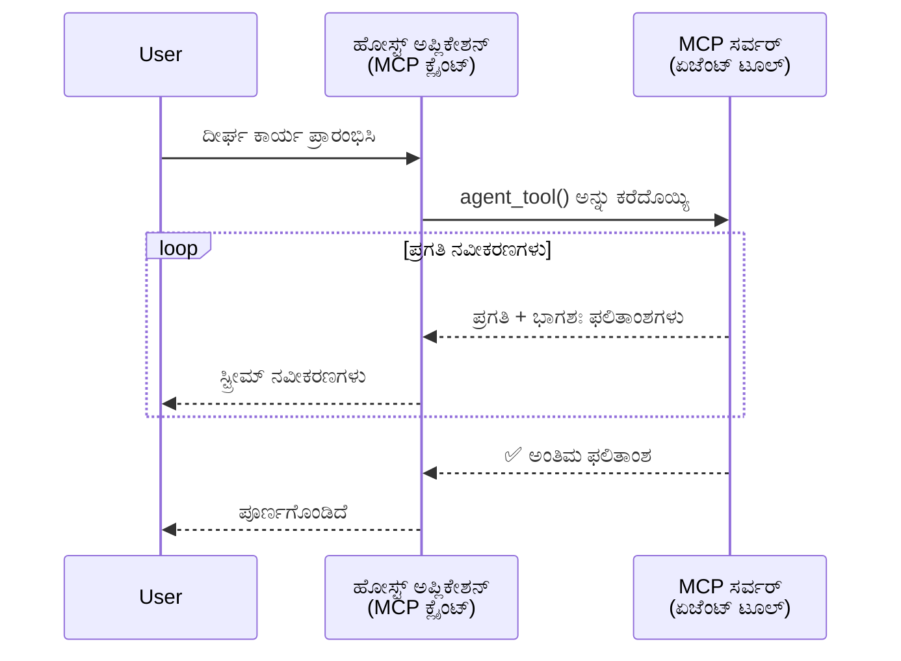
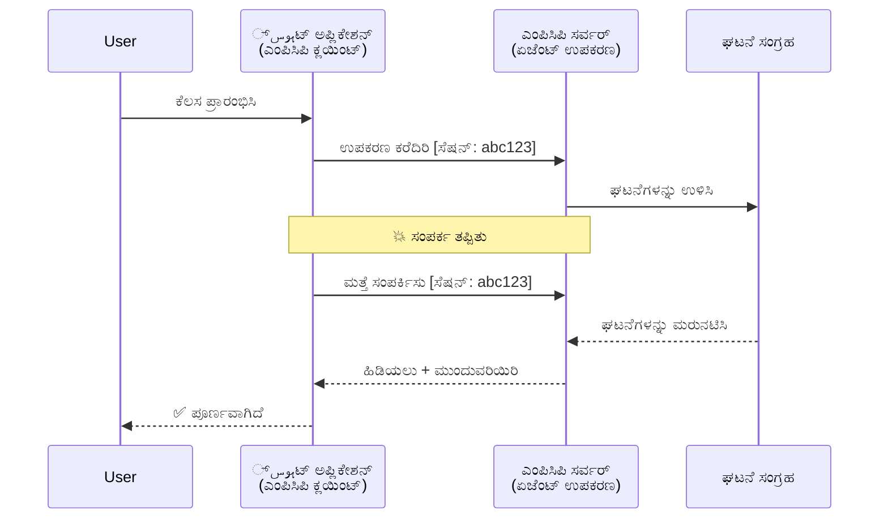
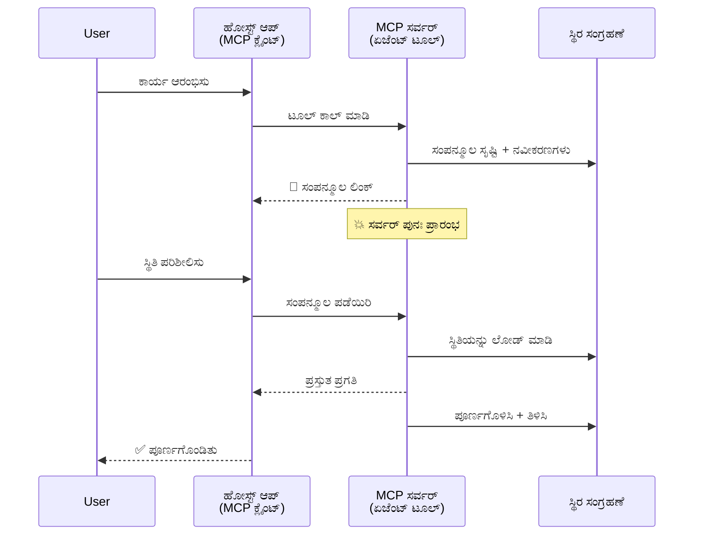
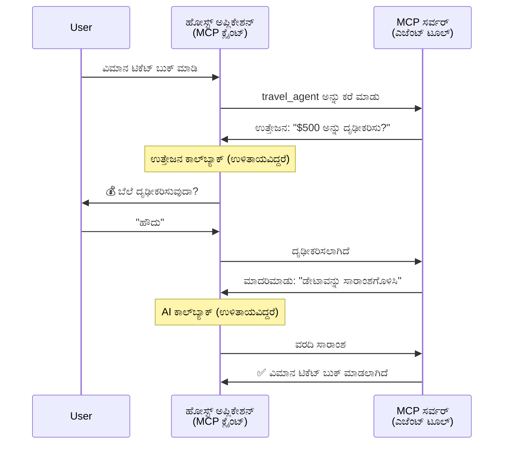
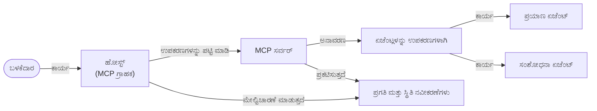

# MCP ಮೂಲಕ ಏಜೆಂಟ್-ಇಡಿಗೇಜೆಂಟ್ ಸಂವಹನ ವ್ಯವಸ್ಥೆಗಳನ್ನು ನಿರ್ಮಿಸುವುದು

> TL;DR - ನೀವು MCP ಮೇಲೆ Agent2Agent ಸಂವಹನ ನಿರ್ಮಿಸಬಹುದೆ? ಹೌದು!

MCP "LLMs ಗೆ ಸಂದರ್ಭ ಒದಗಿಸುವುದು" ಎಂಬ ಅದರ ಮೂಲ ಗುರಿಯನ್ನು ಮೀರಿ ಬಹಳಷ್ಟು ಅಭಿವೃದ್ಧಿಗೊಂಡಿದೆ. ಇತ್ತೀಚಿನ ಸುಧಾರಣೆಗಳಲ್ಲಿ [ಮರುಪ್ರಾರಂಭ ಸಾಧ್ಯವಾದ ಸ್ಟ್ರೀಮ್ಗಳು](https://modelcontextprotocol.io/docs/concepts/transports#resumability-and-redelivery), [ಪ್ರೇರಣೆ](https://modelcontextprotocol.io/specification/2025-06-18/client/elicitation), [ನಮೂದಣೆ](https://modelcontextprotocol.io/specification/2025-06-18/client/sampling), ಮತ್ತು ಸೂಚನೆಗಳು ([ಪ್ರಗತಿ](https://modelcontextprotocol.io/specification/2025-06-18/basic/utilities/progress) ಮತ್ತು [ಸಂಪನ್ಮೂಲಗಳು](https://modelcontextprotocol.io/specification/2025-06-18/schema#resourceupdatednotification)) ಸೇರಿವೆ, MCP ಈಗ ಜಟಿಲ ಏಜೆಂಟ್-ಇಡಿಗೇಜೆಂಟ್ ಸಂವಹನ ವ್ಯವಸ್ಥೆಗಳಿಗೆ ದೃಢ ಮೆಟ್ಟಿಲು ಒದಗಿಸುತ್ತದೆ.

## ಏಜೆಂಟ್/ಉಪಕರಣ ತಪ್ಪು ಕಲ್ಪನೆ

ಹೆಚ್ಚಿನ ಡೆವಲಪರ್‌ಗಳು ಏಜೆಂಟಿಕ್ ವರ್ತನೆಗಳೊಂದಿಗೆ ಉಪಕರಣಗಳನ್ನು (ದೀರ್ಘ ಕಾಲ ಕಾರ್ಯನಿರ್ವಹಿಸುವುದು, ನೆರೆಯಲ್ಲಿಯೇ ಹೆಚ್ಚುವರಿ ಒಳ ತಗಿನ ಅಗತ್ಯವಿರಬಹುದು ಇತ್ಯಾದಿ) ಅನ್ವೇಷಿಸುವಂತೆ, ಒಂದು ಸಾಮಾನ್ಯ ತಪ್ಪು ಕಲ್ಪನೆ MCP ಅನಗುಣವಾಗಿದೆ ಎಂದು ಯೋಚಿಸುವುದು ಆಗಿದೆ, ಮುಖ್ಯವಾಗಿ ಕಾರಣ ಏನೆಂದರೆ ಅದರ ಆರಂಭಿಕ ಉಪಕರಣಗಳು ಸರಳ ವಿನಂತಿ-ಪ್ರತಿಕ್ರಿಯೆ ಮಾದರಿಯಲ್ಲಿ ಕೇಂದ್ರಿತವಾಗಿದ್ದವು.

ಈ ದೃಷ್ಟಿಕೋಣ ಹಳೆಯದು. ಕಳೆದ ಕೆಲವು ತಿಂಗಳಿಂದ MCP ವಿವರಣೆ ಬಹಳ ಸುಧಾರಿಸಲಾಗಿದೆ, ದೀರ್ಘಕಾಲಿಕ ಏಜೆಂಟಿಕ್ ವರ್ತನೆ ನಿರ್ಮಿಸಲು ನಡುವಣ ಅವಕಾಶಗಳನ್ನು ಮುಚ್ಚುವ ಸಾಮರ್ಥ್ಯಗಳೊಂದಿಗೆ:

- **ಸ್ಟ್ರೀಮಿಂಗ್ ಮತ್ತು ಭಾಗಶಃ ಫಲಿತಾಂಶಗಳು**: ಕಾರ್ಯನಿರ್ವಹಣೆಯು ಆಗುತ್ತಿರುವಾಗ ರಿಯಲ್-ಟೈಮ್ ಪ್ರಗತಿ ಅಪ್‌ಡೇಟ್ಸ್
- **ಮರುಪ್ರಾರಂಭ ಸಾಧ್ಯತೆ**: ಕ್ಲೈಂಟ್ಗಳು ಹೊರತುಪಟ್ಟ ನಂತರ ಮರುಸಂಪರ್ಕಿಸಿ ಮುಂದುವರೆಯಬಹುದು
- **ದೃಢತೆ**: ಸೇವರ್ ಪುನಃಪ್ರಾರಂಭಗಳ ನಂತರ ಫಲಿತಾಂಶಗಳು ಉಳಿಸಿಕೊಳ್ಳುತ್ತವೆ (ಉದಾ: ಸಂಪನ್ಮೂಲ ಲಿಂಕ್‌ಗಳ ಮೂಲಕ)
- **ಬಹು-ತಿರುವು**: ಪ್ರೇರಣೆ ಮತ್ತು नमೂದಣೆಯ ಮೂಲಕ ಕಾರ್ಯನಿರ್ವಹಣೆಯ ಮಧ್ಯದಲ್ಲಿ ಸಂವಹನ

ಈ ವೈಶಿಷ್ಟ್ಯಗಳನ್ನು ಸಂಯೋಜಿಸಿ ಜಟಿಲ ಏಜೆಂಟಿಕ್ ಮತ್ತು ಬಹು-ಏಜೆಂಟ್ ಅಪ್ಲಿಕೇಶನ್‌ಗಳನ್ನು ನಿರ್ಮಿಸುವುದು ಸಾಧ್ಯ, ಮತ್ತು ಇವು ಎಲ್ಲಾ MCP ಪ್ರೋಟೋಕಾಲ್‌ನಲ್ಲಿ triểnuyen.

ಉಲ್ಲೇಖಕ್ಕಾಗಿ, ನಾವು ಏಜೆಂಟ್ ಅನ್ನು "ಟೂಲ್" ಎಂದು ಕರೆಯುತ್ತೇವೆ, ಅದು MCP ಸರ್ವರ್‌ನಲ್ಲಿ ಲಭ್ಯವಿದೆ. ಇದಕ್ಕೆ MCP ಕ್ಲೈಂಟ್ ಅನ್ನು ಅಳವಡಿಸಿರುವ ಹೋಸ್ಟ್ ಅಪ್ಲಿಕೇಶನ್ ಇದ್ದಿರಬೇಕು, ಅದು MCP ಸರ್ವರ್ ಜೊತೆ ಸೆಷನ್ ಸ್ಥಾಪಿಸಿ ಏಜೆಂಟ್ ಅನ್ನು ಕರೆ ಮಾಡಬಹುದು.

## MCP ಉಪಕರಣವನ್ನು "ಏಜೆಂಟಿಕ್" ಆಗಿ ಮಾಡುವುದು ಏನು?

ಜಾರಿಗೊಳ್ಳುವ ಮೊದಲು, ದೀರ್ಘಕಾಲಿಕ ಏಜೆಂಟ್ಸ್ ಅನ್ನು ಬೆಂಬಲಿಸಲು ಯಾವ ಮೂಲಸೌಕರ್ಯ ಸಾಮರ್ಥ್ಯಗಳು ಬೇಕಾಗಿವೆ ಎಂಬುದನ್ನು ಸ್ಥಾಪಿಸೋಣ.

> ನಾವು ಏಜೆಂಟ್ ಅನ್ನು ಒಂದು ಸೈರ_ENTITY ಎಂದು ವ್ಯಾಖ್ಯಾನಿಸುತ್ತೇವೆ, ಅದು ಸ್ವಯಂಚಾಲಿತವಾಗಿ ದೀರ್ಘಕಾಲ ನಿರ್ವಹಿಸಬಹುದು, ಅತಿ ಗಾಯುತ್ತಿದೆ ಬಹು-ಸಂವಾದಗಳು ಅಥವಾ ನಿಖರವಾಗಿ ಪ್ರತಿಕ್ರಿಯೆಗಳ ಆಧಾರದ ಮೇಲೆ ನಿಯಂತ್ರಣಗಳು ಅಗತ್ಯವಿರಬಹುದು.

### 1. ಸ್ಟ್ರೀಮಿಂಗ್ ಮತ್ತು ಭಾಗಶಃ ಫಲಿತಾಂಶಗಳು

ಪಾರಂಪರಿಕ ವಿನಂತಿ-ಪ್ರತಿಕ್ರಿಯೆ ಮಾದರಿಗಳು ದೀರ್ಘಕಾಲ ಕಾರ್ಯಾಚರಣೆಗೆ ಸೂಕ್ತವಲ್ಲ. ಏಜೆಂಟ್‌ಗಳು ನೀಡಬೇಕಾದವು:

- ರಿಯಲ್-ಟೈಮ್ ಪ್ರಗತಿ ಅಪ್‌ಡೇಟ್ಸ್
- ಮಧ್ಯಂತರ ಫಲಿತಾಂಶಗಳು

**MCP ಬೆಂಬಲ**: ಸಂಪನ್ಮೂಲ ಅಪ್‌ಡೇಟ್ ಸೂಚನೆಗಳ ಮೂಲಕ ಭಾಗಶಃ ಫಲಿತಾಂಶಗಳನ್ನು ಸ್ಟ್ರೀಂ ಮಾಡಬಹುದು, ಆದರೆ ಇದು JSON-RPC ನ ಯಶಸ್ವೀ ವಿನಂತಿ/ಪ್ರತಿಕ್ರಿಯೆ ಮಾದರಿಯನ್ನು ಧೃಡತೆಗೊಳಿಸಲು ಎಚ್ಚರಿಕೆಯಿಂದ ವಿನ್ಯಾಸ ಮಾಡಬೇಕು.

| ವೈಶಿಷ್ಟ್ಯ                   | ಬಳಕೆಯ ಪ್ರಕರಣ                                                                                                                                                             | MCP ಬೆಂಬಲ                                                                                  |
| --------------------------- | -------------------------------------------------------------------------------------------------------------------------------------------------------------------------- | ------------------------------------------------------------------------------------------ |
| ರಿಯಲ್-ಟೈಮ್ ಪ್ರಗತಿ ಅಪ್‌ಡೇಟ್ಗಳು | ಬಳಕೆದಾರರು ಕೋಡ್‌ಬೇಸ್‌ ಮೈಗ್ರೇಶನ್ ಕಾರ್ಯ ವಿನಂತಿಸುವರು. ಏಜೆಂಟ್ ಪ್ರಗತಿ ಸ್ಟ್ರೀಮ್ ಮಾಡುತ್ತದೆ: "10% - ಅವಲಂಬನೆಗಳು ವಿಶ್ಲೇಷಣೆ ಮಾಡಲಾಗುತ್ತಿದೆ... 25% - ಟೈಪ್‌ಸ್ಕ್ರಿಪ್ಟ್ ಫೈಲ್‌ಗಳನ್ನು ಪರಿವರ್ತಿಸಲಾಗುತ್ತಿದೆ... 50% - ಆಮದುಗಳನ್ನು ನವೀಕರಿಸಲಾಗುತ್ತಿದೆ..." | ✅ ಪ್ರಗತಿ ಸೂಚನೆಗಳು                                                                            |
| ಭಾಗಶಃ ಫಲಿತಾಂಶಗಳು          | " ಪುಸ್ತಕ ರಚಿಸಿ" ಕಾರ್ಯ ಭಾಗಶಃ ಫಲಿತಾಂಶಗಳನ್ನು ಸ್ಟ್ರೀಮ್ ಮಾಡುತ್ತದೆ, ಉದಾ: 1) ಕಥೆಗಳ ರೇಖಾಚಿತ್ರ, 2) ಅಧ್ಯಾಯ ಪಟ್ಟಿ, 3) ಪ್ರತಿ ಅಧ್ಯಾಯ ಪೂರ್ಣಗೊಂಡಿದೆ. ಹೋಸ್ಟ್ ಕಾರ್ಯವನ್ನು ತಪಾಸಣೆ, ರದ್ದು, ಅಥವಾ ಮಾರ್ಗದರ್ಶನ ಮಾಡಬಹುದು. | ✅ ಸೂಚನೆಗಳನ್ನು "ವಿಸ್ತರಿಸಿ" ಭಾಗಶಃ ಫಲಿತಾಂಶಗಳೊಂದಿಗೆ ಬಳಸಬಹುದು PR 383, 776 ಬಗ್ಗೆ ಪ್ರಸ್ತಾಪಗಳು       |

<div align="center" style="font-style: italic; font-size: 0.95em; margin-bottom: 0.5em;">
<strong>ಆಕಾರ 1:</strong> ಈ ರೇಖಾಚಿತ್ರವು MCP ಏಜೆಂಟ್ ಹೇಗೆ ದೀರ್ಘಕಾಲ ಕಾರ್ಯನಿರ್ವಹಣೆಯ ಸಮಯದಲ್ಲಿ ಹೋಸ್ಟ್ ಅಪ್ಲಿಕೇಶನ್‌ಗೆ ರಿಯಲ್-ಟೈಮ್ ಪ್ರಗತಿ ಅಪ್‌ಡೇಟ್ಗಳು ಮತ್ತು ಭಾಗಶಃ ಫಲಿತಾಂಶಗಳನ್ನು ಸ್ಟ್ರೀಮ್ ಮಾಡುತ್ತದೆ ಮತ್ತು ಬಳಕೆದಾರನು ಕ್ರಮಾನುಕ್ರಮಂದನನ್ನನು ನಿರ್ದೇಶಿಸಬಹುದು ಎಂಬುದನ್ನು ತೋರಿಸುತ್ತದೆ.
</div>



### 2. ಮರುಪ್ರಾರಂಭ ಸಾಧ್ಯತೆ

ಏಜೆಂಟ್‌ಗಳು ಜಾಲ ತೊಡೆತಂಡಿತೆಗಳನ್ನ ಸುಲಭವಾಗಿ ನಿರ್ವಹಿಸಬೇಕು:

- (ಕ್ಲೈಂಟ್) ಸಂಪರ್ಕ ಕಡಿತನಂತರ ಮರುಸಂಪರ್ಕಿಸಬಹುದು
- ತೊಡಗಿದ ಸ್ಥಳದಿಂದ ಮುಂದುವರೆಯಬೇಕಾಗುತ್ತದೆ (ಸಂದೇಶ ಮರುಡಿಲಿವರಿ)

**MCP ಬೆಂಬಲ**: MCP StreamableHTTP ತರಲು ಇಂದು ಸೆಷನ್ ಮರುಪ್ರಾರಂಭ ಮತ್ತು ಸಂದೇಶ ಮರುಡಿಲಿವರಿಗಾಗಿ ಸೆಷನ್ ಐಡಿಗಳು ಮತ್ತು ಕೊನೆಯ ಘಟನೆ ಐಡಿಗಳನ್ನು ಬೆಂಬಲಿಸುತ್ತದೆ. ಮುಖ್ಯವಾಗಿರುವುದು ಸರ್ವರ್ ಒಂದು ಘಟನೆ ಸಂಗ್ರಹಣಾಲಯವನ್ನು ಅನುಷ್ಠಾನಗೊಳಿಸಬೇಕು, ಇದರಿಂದ ಬಳಕೆದಾರರು ಮರುಸಂಪರ್ಕಿಸುವಾಗ ಘಟನೆಗಳನ್ನು ಮರುನಡೆಸಬಹುದು.
ಸಮುದಾಯ ಪ್ರಸ್ತಾವನೆಯಾಗಿರುವುದು (PR #975) ಇದು ತರಣಾ-ಸ್ವತಂತ್ರ ಮರುಪ್ರಾರಂಭ ಮಾಡುವ ಸ್ಟ್ರೀಂಗಳ ತಪ್ಪಿಸುವುದನ್ನು ಅನ್ವೇಷಿಸುತ್ತದೆ.

| ವೈಶಿಷ್ಟ್ಯ      | ಬಳಕೆಯ ಪ್ರಕರಣ                                                                                                                                             | MCP ಬೆಂಬಲ                                                              |
| ------------- | ---------------------------------------------------------------------------------------------------------------------------------------------------------- | ---------------------------------------------------------------------- |
| ಮರುಪ್ರಾರಂಭ     | ದೀರ್ಘಕಾಲ ಕಾರ್ಯಾಚರಣೆಯ ವೇಳೆ ಕ್ಲೈಂಟು ಸಂಪರ್ಕ ಕಡಿತ. ಮರುಸಂಪರ್ಕದ ನಂತರ, ಸೆಷನ್ ಮರುಪ್ರಾರಂಭವಾಗುತ್ತದೆ ಮತ್ತು ತಪ್ಪಿದ ಘಟನೆಗಳು ಮರುನಡೆಸಿಕೊಳ್ಳುತ್ತವೆ, ಕಾರ್ಯ ನಿರಂತರವಾಗಿ ಮುಂದುವರಿಯುತ್ತದೆ. | ✅ StreamableHTTP ಸಂಪರ್ಕ, ಸೆಷನ್ ಐಡಿ, ಘಟನೆ ಮರುನಡೆಸಲು EventStore   |

<div align="center" style="font-style: italic; font-size: 0.95em; margin-bottom: 0.5em;">
<strong>ಆಕಾರ 2:</strong> ಈ ರೇಖಾಚಿತ್ರವು MCP StreamableHTTP ತರಲು ಮತ್ತು ಘಟನೆ ಸಂಗ್ರಹಣಾಲಯವು ಹಗುರವಾಗಿ ಬಂತು, ಸೆಷನ್ ಮರುಪ್ರಾರಂಭವನ್ನು ಹೊಂದಿಸುವುದನ್ನು ಹಾಗೂ ಬಳಕೆದಾರರು ಸಂಪರ್ಕ ಕಡಿತವಾದರೂ ಮರುಸಂಪರ್ಕಿಸಿ ತಪ್ಪಿದ ಘಟನೆಗಳನ್ನು ಮರುನಡೆಸಿ ಯಾವುದೇ ಪ್ರಗತಿ ನಷ್ಟವಿಲ್ಲದೆ ಕಾರ್ಯವನ್ನು ಮುಂದುವರಿಸಲು ಸಾಧ್ಯವಾಗುವುದನ್ನು ತೋರಿಸುತ್ತದೆ.
</div>



### 3. ದೃಢತೆ

ದೀರ್ಘಕಾಲಿಕ ಏಜೆಂಟ್‌ಗಳಿಗೆ ಸ್ಥಿರಾವಸ್ಥೆ ಅಗತ್ಯವಿದೆ:

- ಸ್ಪಷ್ಟವಾದ ಸೇವರ್ ಪುನಃಪ್ರಾರಂಭಗಳ ನಂತರ ಫಲಿತಾಂಶಗಳು ಉಳಿಯಬೇಕು
- ಸ್ಥಿತಿಯನ್ನು ಬಾಂಧವಿಕರಿತದಿಂದ ಪಡೆಯಬಹುದು
- ಸೆಷನ್‌ಗಳಲ್ಲಿನ ಪ್ರಗತಿ ಹಾದುಹೋಗುವುದು

**MCP ಬೆಂಬಲ**: MCP ಈಗ ಟೂಲ್ ಕರೆಗಳಿಗೆ ಸಂಪನ್ಮೂಲ ಲಿಂಕ್ ಮರಳಿಸುವ ಪ್ರಕಾರವನ್ನು ಬೆಂಬಲಿಸುತ್ತದೆ. ಸದ್ಯದಲ್ಲಿ, ಸಾಮಾನ್ಯ ಮಾದರಿ ಎಂದರೆ ಒಂದು ಟೂಲ್ ಸಂಪನ್ಮೂಲವನ್ನು ಸೃಷ್ಟಿಸಿ ತಕ್ಷಣ ಸಂಪನ್ಮೂಲ ಲಿಂಕ್ ಮರಳಿಸುವುದು. ಟೂಲ್ ಹಿಂದೆ ಕಾರ್ಯವನ್ನು ನಿಭಾಯಿಸಿ ಸಂಪನ್ಮೂಲವನ್ನು ನವೀಕರಿಸುತ್ತದೆ. ನಂತರ, ಕ್ಲೈಂಟ್ ಈ ಸಂಪನ್ಮೂಲ ಸ್ಥಿತಿಯನ್ನು ಪಿಂಗ್ ಮಾಡಿ ಭಾಗಶಃ ಅಥವಾ ಪೂರ್ಣ ಫಲಿತಾಂಶ ಪಡೆಯಬಹುದು ಅಥವಾ ಸಂಪನ್ಮೂಲದ ಸುಧಾರಣೆ ತತ್ವಾನುಸಾರವಾದ ಸೂಚನೆಗಳನ್ನು ಪಡೆಯಬಹುದು.

ಇಲ್ಲಿ ಒಂದು ಸೀಮಿತತೆ ಇದೆ, ಸಂಪನ್ಮೂಲಗಳನ್ನು ಪಿಂಗ್ ಮಾಡುವುದು ಅಥವಾ ಸುಧಾರಣೆಗೆ ಸಬ್ಸ್‌ಕ್ರೈಬ್ ಆಗುವುದು ದೊಡ್ಡ ಪ್ರಮಾಣದಲ್ಲಿ ಸಂಪನ್ಮೂಲ ವ್ಯಯವನ್ನು ಹೊಂದಬಹುದು. ತೆರೆಯಲಾದ ಸಮುದಾಯ ಪ್ರಸ್ತಾವನೆ (#992 ಸೇರಿದಂತೆ) ವೆಬ್‌ಹುಕ್ಸ್ ಅಥವಾ ಟ್ರಿಗರ್‌ಗಳನ್ನು ಸೇರಿಸುವುದು ಮತ್ತು ಸರ್ವರ್ ನಿಂದ ಕ್ಲೈಂಟ್/ಹೋಸ್ಟ್ ಅಪ್ಲಿಕೇಶನ್‌ಗೆ ಸುಧಾರಣೆಗಳ ಕುರಿತು ಸೂಚಿಸಲು ಅವು ಬಳಕೆಯಲ್ಲಿರಬಹುದು ಎಂದು ಪರಿಶೀಲಿಸುತ್ತಿದೆ.

| ವೈಶಿಷ್ಟ್ಯ    | ಬಳಕೆಯ ಪ್ರಕರಣ                                                                                                                                       | MCP ಬೆಂಬಲ                                                      |
| ---------- | ----------------------------------------------------------------------------------------------------------------------------------------------------- | ---------------------------------------------------------------- |
| ದೃಢತೆ      | ಡೇಟಾ ಸ್ಥಳಾಂತರ ಕಾರ್ಯದಲ್ಲಿ ಸರ್ವರ್ ವಿಫಲ. ಫಲಿತಾಂಶಗಳು ಮತ್ತು ಪ್ರಗತಿ ಪುನರಾರಂಭ ಬದುಕುತ್ತವೆ, ಕ್ಲೈಂಟ್ ಸ್ಥಿತಿಯ ಪರಿಶೀಲಿಸಿ ಅನುವರ್ತಿಸಬಹುದು.                     | ✅ ಸಂಪನ್ಮೂಲ ಲಿಂಕ್‌ಗಳು ಸ್ಥಿರ ಸಂಗ್ರಹಣೆ ಮತ್ತು ಸ್ಥಿತಿ ಸೂಚನೆಗಳೊಂದಿಗೆ      |

ಸದ್ಯದ ಸಾಮಾನ್ಯ ಮಾದರಿ ಎಂದರೆ ಒಂದು ಟೂಲ್ ಸಂಪನ್ಮೂಲವನ್ನು ಸೃಷ್ಟಿಸಿ ತಕ್ಷಣ ಸಂಪನ್ಮೂಲ ಲಿಂಕ್ ಅನ್ನು ಮರಳಿಸುವುದು. ಟೂಲ್ ಹಿಂದೆ ಕಾರ್ಯವನ್ನು ನಿರ್ವಹಿಸಿ ಸಂಪನ್ಮೂಲ ಸೂಚನೆಗಳನ್ನು ನೀಡಿ, ಅವು ಪ್ರಗತಿ ಸೂಚನೆಗಳಾಗಿ ಅಥವಾ ಭಾಗಶಃ ಫಲಿತಾಂಶಗಳಾಗಿ ಕಾರ್ಯನಿರ್ವಹಿಸುವಂತೆ ಮಾಡುತ್ತದೆ ಮತ್ತು ಅಗತ್ಯವಿದ್ದರೆ ಸಂಪನ್ಮೂಲದ ವಿಷಯವನ್ನು ನವೀನಗೊಳಿಸುತ್ತದೆ.

<div align="center" style="font-style: italic; font-size: 0.95em; margin-bottom: 0.5em;">
<strong>ಆಕರ 3:</strong> ಈ ರೇಖಾಚಿತ್ರವು MCP ಏಜೆಂಟ್‌ಗಳು ದೀರ್ಘಕಾಲ ಕಾರ್ಯಗಳು ಸೇವರ್ ಪುನಃಪ್ರಾರಂಭಗೊಳ್ಳುವಾಗ ಬದುಕಿ ಉಳಿಯಲು ಸ್ಥಿರ ಸಂಪನ್ಮೂಲಗಳು ಮತ್ತು ಸ್ಥಿತಿ ಸೂಚನೆಗಳನ್ನು ಹೇಗೆ ಬಳಸುತ್ತವೆ ಎಂದುವುದನ್ನು ತೋರಿಸುತ್ತದೆ, ಇದರಿಂದ客户端 ಪ್ರಗತಿಯನ್ನು ಪರಿಶೀಲಿಸಿ ಫಲಿತಾಂಶಗಳನ್ನು ಪಡೆಯಬಹುದು.
</div>



### 4. ಬಹು-ತಿರುವು ಸಂವಹನಗಳು

ಏಜೆಂಟ್‌ಗಳು ಕಾರ್ಯನಿರ್ವಹಣೆಯ ಮಧ್ಯದಲ್ಲಿ ಹೆಚ್ಚುವರಿ ಒಳನಾಲಿಕೆ ಬೇಕಾಗಬಹುದು:

- ಮಾನವ ಸ್ಪಷ್ಟೀಕರಣ ಅಥವಾ ಅನುಮತಿ
- ಜಟಿಲ ನಿರ್ಧಾರಗಳಿಗೆ AI ನೆರವು
- ಚಲಿತ ನಿಯಮಗಳ ಸುಧಾರಣೆ

**MCP ಬೆಂಬಲ**: ಸಂಪೂರ್ಣವಾಗಿ sampling (AI ಒಳನಾಲಿಕೆಯ) ಮತ್ತು elicitation (ಮಾನವ ಒಳನಾಲಿಕೆಯ) ಮೂಲಕ ಬೆಂಬಲಿಸಲಾಗಿದೆ.

| ವೈಶಿಷ್ಟ್ಯ                 | ಬಳಕೆಯ ಪ್ರಕರಣ                                                                                                                                    | MCP ಬೆಂಬಲ                                             |
| ----------------------- | ------------------------------------------------------------------------------------------------------------------------------------------------ | ----------------------------------------------------- |
| ಬಹು-ತಿರುವು ಸಂವಹನಗಳು    | ಪ್ರಯಾಣದ ಬುಕ್ಕಿಂಗ್ ಏಜೆಂಟ್ ಬಳಕೆದಾರರಿಂದ ಬೆಲೆ ದೃಢೀಕರಣ ಕೇಳುತ್ತದೆ; ನಂತರ AI ಯಿಂದ ಪ್ರಯಾಣದ ಡೇಟಾ ಸಂಕ್ಷಿಪ್ತ ಮಾಡಿಸಲು ಕೇಳಿ, ಬಳಿಕ ಬುಕ್ಕಿಂಗ್ ಪೂರೈಸುತ್ತದೆ.        | ✅ elicitation ಮಾನವ ಒಳನಾಲಿಕೆಗೆ, sampling AI ಒಳನಾಲಿಕೆಗೆ      |

<div align="center" style="font-style: italic; font-size: 0.95em; margin-bottom: 0.5em;">
<strong>ಆಕರ 4:</strong> ಈ ರೇಖಾಚಿತ್ರವು MCP ಏಜೆಂಟ್‌ಗಳು ಪ್ರೇರಣೆಯನ್ನು ಚುರುಕುಗೊಳಿಸಿ ಮಾನವ ಒಳನಾಲಿಕೆ ಅಥವಾ AI ನೆರವಿನ ವಿನಂತಿಯನ್ನು ದೀರ್ಘಕಾಲಕಾರ್ಯಾಚರಣೆ ಮಧ್ಯದಲ್ಲಿಯೇ ಹೇಗೆ ಮಾಡಬಹುದು ಮತ್ತು ನಿಖರತೆಯೊಂದಿಗೆ ಬಹು-ತಿರುವು ಕಾರ್ಯಪ್ರವಾಹಗಳನ್ನು ಬೆಂಬಲಿಸುವುದನ್ನು ತೋರಿಸುತ್ತದೆ.
</div>



## MCP ಮೇಲೆ ದೀರ್ಘಕಾಲ ಕಾರ್ಯನಿರ್ವಹಿಸುವ ಏಜೆಂಟ್‌ಗಳ ಅನುಷ್ಠಾನ - ಕೋಡ್ ಅವಲೋಕನ

ಈ ಲೇಖನದ ಭಾಗವಾಗಿ, ನಾವು [ಕೋಡ್ ರೆಪೊಸಿಟರಿ](https://github.com/victordibia/ai-tutorials/tree/main/MCP%20Agents) ಒದಗಿಸುತ್ತೇವೆ, ಇದು MCP ಪೈಥಾನ್ SDK ಮತ್ತು StreamableHTTP ತರಲು ಬಳಸಿ ಕಾರ್ಯಚರಣೆ ಮರುಪ್ರಾರಂಭ ಮತ್ತು ಸಂದೇಶ ಮರುಡಿಲಿವರಿಯನ್ನು ಹೊಂದಿರುವ ದೀರ್ಘಕಾಲ ಆಜಂಟುಗಳ ಸಂಪೂರ್ಣ ಅನುಷ್ಠಾನವನ್ನು ಒಳಗೊಂಡಿದೆ. ಈ ಅನುಷ್ಠಾನವು MCP ಸಾಮರ್ಥ್ಯಗಳನ್ನು ಸಂಯೋಜಿಸುವ ಮೂಲಕ ನಿಪುಣ ಏಜೆಂಟ್ ತರಹ ವರ್ತನೆಗಳನ್ನು ಹೇಗೆ ಸಾಧ್ಯವಲ್ಲ ಎಂಬುದನ್ನು ತೋರಿಸುತ್ತದೆ.

ನಿರ್ದಿಷ್ಟವಾಗಿ, ನಾವು ಎರಡು ಪ್ರಮುಖ ಏಜೆಂಟ್ ಉಪಕರಣಗಳೊಂದಿಗೆ ಸರ್ವರ್ ಅನ್ನು ಅನುಷ್ಠಾನಗೊಳಿಸುತ್ತೇವೆ:

- **ಪ್ರಯಾಣ ಏಜೆಂಟ್** - ಪ್ರೇರಣೆಯ ಮೂಲಕ ಬೆಲೆ ದೃಢೀಕರಣ ಸಹಿತ ಪ್ರವಾಸ ಬುಕ್ಕಿಂಗ್ ಸೇವೆ ಅನುಕರಿಸುತ್ತದೆ
- **ಶೋಧನಾ ಏಜೆಂಟ್** - ಸಂಗ್ರಹಿತ ಸಾಂದರ್ಭಿಕ ವರದಿಗಳನ್ನು sampling ಮೂಲಕ AI ನೆರವಿನಿಂದ ನಿರ್ವಹಿಸುತ್ತದೆ

ಎರಡೂ ಏಜೆಂಟ್‌ಗಳು ರಿಯಲ್-ಟೈಮ್ ಪ್ರಗತಿ ಅಪ್‌ಡೇಟ್ಗಳು, ಸಂವಹನದ ದೃಢೀಕರಣಗಳು ಮತ್ತು ಪೂರ್ಣ ಸೆಷನ್ ಮರುಪ್ರಾರಂಭ ಸಾಮರ್ಥ್ಯಗಳನ್ನು ಪ್ರದರ್ಶಿಸುತ್ತವೆ.

### ಪ್ರಮುಖ ಅನುಷ್ಠಾನ ಪರಿಕಲ್ಪನೆಗಳು

ಮುಂದಿನ ವಿಭಾಗಗಳಲ್ಲಿ ಪ್ರತಿ ಸಾಮರ್ಥ್ಯದ ಸರ್ವರ್-ಬದಿಯ ಏಜೆಂಟ್ ಅನುಷ್ಠಾನ ಮತ್ತು ಕ್ಲೈಂಟ್-ಬದಿಯ ಹೋಸ್ಟ್ ನಿರ್ವಹಣೆ ತೋರಿಸಲಾಗುವುದು:

#### ಸ್ಟ್ರೀಮಿಂಗ್ ಮತ್ತು ಪ್ರಗತಿ ಅಪ್‌ಡೇಟ್ಗಳು - ರಿಯಲ್-ಟೈಂ ಕಾರ್ಯ ಸ್ಥಿತಿ

ಸ್ಟ್ರೀಮಿಂಗ್ ಮೂಲಕ ದೀರ್ಘಕಾಲ ಕಾರ್ಯನಿರ್ವಹಣೆಯ ಸಮಯದಲ್ಲಿ ಏಜೆಂಟ್‌ಗಳು ತಕ್ಷಣದ ಪ್ರಗತಿ ಪರಿಷ್ಕರಣೆಗಳನ್ನು ನೀಡುತ್ತವೆ, ಬಳಕೆದಾರರನ್ನು ಕಾರ್ಯ ಸ್ಥಿತಿಯ ಮತ್ತು ಮಧ್ಯಂತರ ಫಲಿತಾಂಶಗಳ ಬಗ್ಗೆ ತಿಳಿಸುವುದು.

**ಸರ್ವರ್ ಅನುಷ್ಠಾನ (ಏಜೆಂಟ್ ಪ್ರಗತಿ ಸೂಚನೆಗಳನ್ನು ಕಳುಹಿಸುತ್ತದೆ):**

```python
# ಸರ್ವರ್/server.py ಯಿಂದ - ಪ್ರವಾಸಿ ಏಜೆಂಟ್ ಪ್ರಗತಿ ನವೀಕರಣಗಳನ್ನು ಕಳುಹಿಸುವುದು
for i, step in enumerate(steps):
    await ctx.session.send_progress_notification(
        progress_token=ctx.request_id,
        progress=i * 25,
        total=100,
        message=step,
        related_request_id=str(ctx.request_id)
    )
    await anyio.sleep(2)  # ಕೆಲಸದ ಅನುಕರಣೆ ಮಾಡಿ

# ಪರ್ಯಾಯ: ವಿವರವಾದ ಹಂತ ಹಂತದ ಅಪ್ಡೇಟ್ಗಳಿಗೆ ಲಾಗ್ ಸಂದೇಶಗಳು
await ctx.session.send_log_message(
    level="info",
    data=f"Processing step {current_step}/{steps} ({progress_percent}%)",
    logger="long_running_agent",
    related_request_id=ctx.request_id,
)
```

**ಕ್ಲೈಂಟ್ ಅನುಷ್ಠಾನ (ಹೋಸ್ಟ್ ಪ್ರಗತಿ ಅಪ್‌ಡೇಟ್ಗಳನ್ನು ಸ್ವೀಕರಿಸುತ್ತದೆ):**

```python
# client/client.py ನಲ್ಲಿ നിന്ന് - ಲೈವ್ ಸೂಚನೆಗಳನ್ನು ನಿರ್ವಹಿಸುವ ಕ್ಲೈಂಟ್
async def message_handler(message) -> None:
    if isinstance(message, types.ServerNotification):
        if isinstance(message.root, types.LoggingMessageNotification):
            console.print(f"📡 [dim]{message.root.params.data}[/dim]")
        elif isinstance(message.root, types.ProgressNotification):
            progress = message.root.params
            console.print(f"🔄 [yellow]{progress.message} ({progress.progress}/{progress.total})[/yellow]")

# ಸೆಷನ್ ರಚಿಸುವಾಗ ಸಂದೇಶ ಹ್ಯಾಂಡ್ಲರ್ ಅನ್ನು ನೋಂದಣಿ ಮಾಡಿ
async with ClientSession(
    read_stream, write_stream,
    message_handler=message_handler
) as session:
```

#### ಪ್ರೇರಣೆ - ಬಳಕೆದಾರ ಇನ್‌ಪುಟ್ ವಿನಂತಿಸುವುದು

ಪ್ರೇರಣೆ ಮೂಲಕ ಏಜೆಂಟ್‌ಗಳು ಕಾರ್ಯನಿರವಹಣೆಯ ಮಧ್ಯದಲ್ಲಿ ಬಳಕೆದಾರರ ಇನ್‌ಪುಟ್ ವಿನಂತಿಸಬಹುದು. ಇದು ದೃಢೀಕರಣಗಳು, ಸ್ಪಷ್ಟೀಕರಣಗಳು ಅಥವಾ ಅನುಮತಿಗಳಿಗಾಗಿ ಅಗತ್ಯ.

**ಸರ್ವರ್ ಅನುಷ್ಠಾನ (ಏಜೆಂಟ್ ದೃಢೀಕರಣ ಕೇಳುತ್ತದೆ):**

```python
# ಸರ್ವರ್/server.py ನಿಂದ - ಪ್ರಯಾಣ ಏಜೆಂಟ್ ಬೆಲೆ ದೃಢೀಕರಣವನ್ನು ವಿನಂತಿಸಲಾಗುತ್ತಿದೆ
elicit_result = await ctx.session.elicit(
    message=f"Please confirm the estimated price of $1200 for your trip to {destination}",
    requestedSchema=PriceConfirmationSchema.model_json_schema(),
    related_request_id=ctx.request_id,
)

if elicit_result and elicit_result.action == "accept":
    # ಬುಕ್ಕಿಂಗ್ ಅನ್ನು ಮುಂದುವರಿಸಿ
    logger.info(f"User confirmed price: {elicit_result.content}")
elif elicit_result and elicit_result.action == "decline":
    # ಬುಕ್ಕಿಂಗ್ ರದ್ದುಮಾಡಿ
    booking_cancelled = True
```

**ಕ್ಲೈಂಟ್ ಅನುಷ್ಠಾನ (ಹೋಸ್ಟ್ ಪ್ರೇರಣೆ ಕಾಲ್ಬ್ಯಾಕ್ ಒದಗಿಸುತ್ತದೆ):**

```python
# client/client.py ನಿಂದ - ಕ್ಲೈಂಟ್ ಹ್ಯಾಂಡ್ಲಿಂಗ್ ಎಲಿಸಿಟೇಷನ್ ವಿನಂತಿಗಳು
async def elicitation_callback(context, params):
    console.print(f"💬 Server is asking for confirmation:")
    console.print(f"   {params.message}")

    response = console.input("Do you accept? (y/n): ").strip().lower()

    if response in ['y', 'yes']:
        return types.ElicitResult(
            action="accept",
            content={"confirm": True, "notes": "Confirmed by user"}
        )
    else:
        return types.ElicitResult(
            action="decline",
            content={"confirm": False, "notes": "Declined by user"}
        )

# ಸೆಷನ್ ರಚಿಸಿದಾಗ ಕಾಲ್‌ಬ್ಯಾಕ್ ಅನ್ನು ನೋಂದಾಯಿಸಿ
async with ClientSession(
    read_stream, write_stream,
    elicitation_callback=elicitation_callback
) as session:
```

#### ನಮೂದಣೆ - AI ನೆರವು ಕೇಳುವುದು

sampling ಮೂಲಕ ಏಜೆಂಟ್‌ಗಳು ಜಟಿಲ ನಿರ್ಧಾರಗಳು ಅಥವಾ ವಿಷಯ ರಚನೆಗೆ LLM ನೆರವಿಗೆ ವಿನಂತಿಸಬಹುದು. ಇದು ಮಾನವ-AI ಸಂಯುಕ್ತ ಕಾರ್ಯಪ್ರವಾಹಗಳನ್ನು ಸಾಧಿಸುತ್ತದೆ.

**ಸರ್ವರ್ ಅನುಷ್ಠಾನ (ಏಜೆಂಟ್ AI ನೆರವು ಕೇಳುತ್ತದೆ):**

```python
# server/server.py ನಿಂದ - ಸಂಶೋಧನೆ ಏಜೆಂಟ್ AI ಸಾರಾಂಶವನ್ನು ವಿನಂತಿಸುತ್ತಿದೆ
sampling_result = await ctx.session.create_message(
    messages=[
        SamplingMessage(
            role="user",
            content=TextContent(type="text", text=f"Please summarize the key findings for research on: {topic}")
        )
    ],
    max_tokens=100,
    related_request_id=ctx.request_id,
)

if sampling_result and sampling_result.content:
    if sampling_result.content.type == "text":
        sampling_summary = sampling_result.content.text
        logger.info(f"Received sampling summary: {sampling_summary}")
```

**ಕ್ಲೈಂಟ್ ಅನುಷ್ಠಾನ (ಹೋಸ್ಟ್ sampling ಕಾಲ್ಬ್ಯಾಕ್ ಒದಗಿಸುತ್ತದೆ):**

```python
# ಕ್ಲೈಂಟ್/ಕ್ಲೈಂಟ್.py ನಿಂದ - ಕ್ಲೈಂಟ್ ಸೆಂಪ್ಲಿಂಗ್ ವಿನಂತಿಗಳನ್ನು ನಿರ್ವಹಿಸುತ್ತಿದೆ
async def sampling_callback(context, params):
    message_text = params.messages[0].content.text if params.messages else 'No message'
    console.print(f"🧠 Server requested sampling: {message_text}")

    # ನಿಜವಾದ ಅಪ್ಲಿಕೇಶನ್‌ನಲ್ಲಿ, ಇದು LLM API ಅನ್ನು ಕರೆ ಮಾಡಬಹುದು
    # ಡೆಮೊ ಉದ್ದೇಶಗಳಿಗೆ, ನಾವು ನಕಲಿ ಪ್ರತಿಕ್ರಿಯೆಯನ್ನು ಒದಗಿಸುತ್ತೇವೆ
    mock_response = "Based on current research, MCP has evolved significantly..."

    return types.CreateMessageResult(
        role="assistant",
        content=types.TextContent(type="text", text=mock_response),
        model="interactive-client",
        stopReason="endTurn"
    )

# ಸೆಷನ್ ಸೃಷ್ಟಿಸುವಾಗ ಕಾಲ್‌ಬ್ಯಾಕ್ ಅನ್ನು ನೋಂದಾಯಿಸಿ
async with ClientSession(
    read_stream, write_stream,
    sampling_callback=sampling_callback,
    elicitation_callback=elicitation_callback
) as session:
```

#### ಮರುಪ್ರಾರಂಭ ಸಾಧ್ಯತೆ - ಸಂಪರ್ಕ ಕಡಿತದ ನಂತರ ಸೆಷನ್ ನಿರಂತರತೆ

ಮರುಪ್ರಾರಂಭ ಸಾಧ್ಯತೆ ಖಚಿತಪಡಿಸುವುದು ದೀರ್ಘಕಾಲ ಏಜೆಂಟ್ ಕಾರ್ಯಗಳು ಕ್ಲೈಂಟ್ ಸಂಪರ್ಕ ನಷ್ಟಗಳನ್ನನು ತಮ್ಮೊಂದಿಗೇ ತಾಳಿಕೊಳ್ಳುತ್ತವೆ ಮತ್ತು ಮರುಸಂಪರ್ಕಿಸುವಾಗ ನಿರಂತರವಾಗಿ ಮುಂದುವರಿಯುತ್ತವೆ. ಇದು ಘಟನೆ ಸಂಗ್ರಹಣಾಲಯಗಳು ಮತ್ತು ಮರುಪ್ರಾರಂಭ ಟೋಕನ್‌ಗಳ ಮೂಲಕ ಅನುಷ್ಠಾನಗೊಳ್ಳುತ್ತದೆ.

**ಘಟನೆ ಸಂಗ್ರಹಣಾಲಯ ಅನುಷ್ಠಾನ (ಸರ್ವರ್ ಸೆಷನ್ ಸ್ಥಿತಿ ಹಿಡಿದಿರುವುದು):**

```python
# server/event_store.py ನಲ್ಲಿ - ಸರಳ ಮೆಮೊರಿ ಆಧಾರಿತ ಕಾರ್ಯಕ್ರಮ ಸಂಗ್ರಹ
class SimpleEventStore(EventStore):
    def __init__(self):
        self._events: list[tuple[StreamId, EventId, JSONRPCMessage]] = []
        self._event_id_counter = 0

    async def store_event(self, stream_id: StreamId, message: JSONRPCMessage) -> EventId:
        """Store an event and return its ID."""
        self._event_id_counter += 1
        event_id = str(self._event_id_counter)
        self._events.append((stream_id, event_id, message))
        return event_id

    async def replay_events_after(self, last_event_id: EventId, send_callback: EventCallback) -> StreamId | None:
        """Replay events after the specified ID for resumption."""
        # ಕೊನೆಯವಾಗಿ ತಿಳಿದಿರುವ ಕಾರ್ಯಕ್ರಮದ ನಂತರದ ಕಾರ್ಯಕ್ರಮಗಳನ್ನು ಹುಡುಕಿ ಮತ್ತು ಮರುಕಳಿಸಿ
        for _, event_id, message in self._events[start_index:]:
            await send_callback(EventMessage(message, event_id))

# server/server.py ನಲ್ಲಿ - ಆಟಗಾರ ಸಂಗ್ರಹವನ್ನು ಸೆಷನ್ ನಿರ್ವಾಹಕಕ್ಕೆ ಪಾಸ್ ಮಾಡುವುದು
def create_server_app(event_store: Optional[EventStore] = None) -> Starlette:
    server = ResumableServer()

    # ಪುನರುತ್ಥಾನದ కోసం ಆಟಗಾರ ಸಂಗ್ರಹದೊಂದಿಗೆ ಸೆಷನ್ ನಿರ್ವಾಹಕ ರಚಿಸಿ
    session_manager = StreamableHTTPSessionManager(
        app=server,
        event_store=event_store,  # ಕಾರ್ಯಕ್ರಮ ಸಂಗ್ರಹವು ಸೆಷನ್ ಪುನರುತ್ಥಾನವನ್ನು ಸಕ್ರಿಯಗೊಳಿಸುತ್ತದೆ
        json_response=False,
        security_settings=security_settings,
    )

    return Starlette(routes=[Mount("/mcp", app=session_manager.handle_request)])

# ಬಳಕೆ: ಆಟಗಾರ ಸಂಗ್ರಹದೊಂದಿಗೆ ಪ್ರಾರಂಭಿಸಿ
event_store = SimpleEventStore()
app = create_server_app(event_store)
```

**ಮರುಪ್ರಾರಂಭ ಟೋಕನೊಂದಿಗೆ ಕ್ಲೈಂಟ್ ಮೆಟಾಡೇಟಾ (ಕ್ಲೈಂಟ್ ಸಂಗ್ರಹಿತ ಸ್ಥಿತಿಯನ್ನು ಬಳಸಿ ಮರುಸಂಪರ್ಕಿಸುತ್ತದೆ):**

```python
# client/client.py ನಿಂದ - ಮೆಟಾಡೇಟಾ ಜೊತೆಗೆ ಕ್ಲೈಂಟ್ ಪುನಃ ಪ್ರಾರಂಭ
if existing_tokens and existing_tokens.get("resumption_token"):
    # ನಾವು ನಿಲ್ಲಿಸಿದ್ದು ಅಲ್ಲಿ ಮುಂದುವರಿಯಲು ಇರುವ ಪುನಃ ಪ್ರಾರಂಭ ಟೋಕನ್ ಬಳಸಿ
    metadata = ClientMessageMetadata(
        resumption_token=existing_tokens["resumption_token"],
    )
else:
    # ದೊರೆತಾಗ ಪುನಃ ಪ್ರಾರಂಭ ಟೋಕನ್ ಉಳಿಸಲು ಕಾಲ್‌ಬ್ಯಾಕ್ ರಚಿಸಿ
    def enhanced_callback(token: str):
        protocol_version = getattr(session, 'protocol_version', None)
        token_manager.save_tokens(session_id, token, protocol_version, command, args)

    metadata = ClientMessageMetadata(
        on_resumption_token_update=enhanced_callback,
    )

# ಪುನಃ ಪ್ರಾರಂಭ ಮೆಟಾಡೇಟಾ ಜೊತೆಗೆ ವಿನಂತಿ ಕಳುಹಿಸಿ
result = await session.send_request(
    types.ClientRequest(
        types.CallToolRequest(
            method="tools/call",
            params=types.CallToolRequestParams(name=command, arguments=args)
        )
    ),
    types.CallToolResult,
    metadata=metadata,
)
```

ಹೋಸ್ಟ್ ಅಪ್ಲಿಕೇಶನ್ ಸೆಷನ್ ಐಡಿಗಳು ಮತ್ತು ಮರುಪ್ರಾರಂಭ ಟೋಕನ್‌ಗಳನ್ನು ಸ್ಥಳೀಯವಾಗಿ ನಿರ್ವಹಿಸುತ್ತದೆ, ಇದರಿಂದ ಇದು ಪ್ರಗತಿ ಅಥವಾ ಸ್ಥಿತಿ ನಷ್ಟವಿಲ್ಲದೆ നിലവಿನ ಸೆಷನ್‌ಗಳಿಗೆ ಮರುಸಂಪರ್ಕಿಸಬಹುದು.

### ಕೋಡ್ ವ್ಯವಸ್ಥೆ

<div align="center" style="font-style: italic; font-size: 0.95em; margin-bottom: 0.5em;">
<strong>ಆಕಾರ 5:</strong> MCP ಆಧಾರಿತ ಏಜೆಂಟ್ ವ್ಯವಸ್ಥೆ معماري
</div>



**ಪ್ರಮುಖ ಫೈಲ್‌ಗಳು:**

- **`server/server.py`** - ಮರುಪ್ರಾರಂಭ ಸಾಧ್ಯತೆ MCP ಸರ್ವರ್ ಪ್ರಯಾಣ ಮತ್ತು ಸಂಶೋಧನಾ ಏಜೆಂಟ್‌ಗಳೊಂದಿಗೆ, ಪ್ರೇರಣೆ, sampling, ಪ್ರಗತಿ ಅಪ್‌ಡೇಟ್ಗಳನ್ನು ಪ್ರದರ್ಶಿಸುತ್ತದೆ
- **`client/client.py`** - ಸಂವಹನ ಹೋಸ್ಟ್ ಅಪ್ಲಿಕೇಶನ್ ಅನ್ನು ಮರುಪ್ರಾರಂಭ ಬೆಂಬಲ, ಕಾಲ್ಬ್ಯಾಕ್ ನಿರ್ವಹಣೆ ಮತ್ತು ಟೋಕನ್ ನಿರ್ವಹಣೆಯೊಂದಿಗೆ
- **`server/event_store.py`** - ಸೆಷನ್ ಮರುಪ್ರಾರಂಭ ಮತ್ತು ಸಂದೇಶ ಮರುಡಿಲಿವರಿಗಾಗಿ ಘಟನೆ ಸಂಗ್ರಹಣಾಲಯ ಅನುಷ್ಠಾನ

## MCP ಮೇಲೆ ಬಹು-ಏಜೆಂಟ್ ಸಂವಹನ ವಿಸ್ತರಣೆ

ಮೇಲಿನ ಅನುಷ್ಠಾನವನ್ನು ಹೋಸ್ಟ್ ಅಪ್ಲಿಕೇಶನ್ ಜ್ಞಾನದ ಮತ್ತು ವ್ಯಾಪ್ತಿಯ ವಿಸ್ತಾರ ಮಾಡುವ ಮೂಲಕ ಬಹು-ಏಜೆಂಟ್ ವ್ಯವಸ್ಥೆಗಳಿಗೆ ವಿಸ್ತರಿಸಬಹುದು:

- **ಬುದ್ಧಿವಂತಿಕೆ ಟಾಸ್ಕ್ ವಿ್ಷ್ಲೇಷಣೆ**: ಹೋಸ್ಟ್ ಜಟಿಲ ಬಳಕೆದಾರ ವಿನಂತಿಗಳನ್ನು ವಿಶ್ಲೇಷಿಸಿ ವಿವಿಧ ವಿಶೇಷ ಏಜೆಂಟ್‌ಗಳಿಗೆ ಉಪಕಾರ್ಯಗಳಾಗಿ ಎಡiteursshat
- **ಬಹು-ಸೇರ್ವರ್ ಸಹಯೋಗ**: ಹೋಸ್ಟ್ ಅನೇಕ MCP ಸರ್ವರ್‌ಗಳ ಜೊತೆಗೆ ಸಂಪರ್ಕ ನಿರ್ವಹಣೆ ಮಾಡಿ, ಪ್ರತ್ಯೇಕ ಏಜೆಂಟ್ ಸಾಮರ್ಥ್ಯಗಳನ್ನು ಅನಾವರಣಗೊಳಿಸುವುದು
- **ಟಾಸ್ಕ್ ಸ್ಥಿತಿ ನಿರ್ವಹಣೆ**: ಹೋಸ್ಟ್ ಸರ್ಧಿಸಿದ ಏಜೆಂಟ್ ಟಾಸ್ಕ್‌ಗಳ ಪ್ರಗತಿಯನ್ನು ಹಾದುಹೋಗುತ್ತಾ, ಅವಲಂಭನೆಗಳು ಮತ್ತು ಸರಣೀಕರಣಗಳನ್ನು ನಿರ್ವಹಿಸುತ್ತದೆ
- **ಸಹಿಷ್ಣುತೆ ಮತ್ತು ಪುನಃಪ್ರಯತ್ನಗಳು**: ಹೋಸ್ಟ್ ವಿಫಲತೆಯನ್ನು ನಿರ್ವಹಿಸಿ, ಪುನಃಪ್ರಯತ್ನ ಲಾಜಿಕ್ ಅನುಷ್ಠಾನಗೊಳಿಸಿ, ಒಬ್ದಭ್ಯಸ್ಥೆ ಇಲ್ಲದಾಗ ಟಾಸ್ಕ್‌ಗಳನ್ನು ಮರುನಿರ್ದೇಶನ ಮಾಡುತ್ತದೆ
- **ಫಲಿತಾಂಶ ಸಂಯೋಜನೆ**: ಹೋಸ್ಟ್ ವಿವಿಧ ಏಜೆಂಟ್ ಗಳಿಂದ ಉತ್ಪನ್ನಗಳನ್ನು ಸुसಂಗತ ಅಂತಿಮ ಫಲಿತಾಂಶಗಳಾಗಿ ಭೇದಿಸು

ಹೋಸ್ಟ್ ಸರಳ ಕ್ಲೈಂಟ್‌ನಿಂದ ಬುದ್ಧಿವಂತ ಸಂಯೋಜಕರಾಗಿ ಪರಿವರ್ತನೆ ಗೊಂಡು ಹೋಸ್ಟ್ MCP ಪ್ರೋಟೋಕಾಲ್ ಆಧಾರದ ಮೇರೆಗೆ ವಿತರಿತ ಏಜೆಂಟ್ ಸಾಮರ್ಥ್ಯಗಳನ್ನು ಸಂಯೋಜಿಸುತ್ತದೆ.

## ಸಮಾರೋಪ

MCP ನ ಸುಧಾರಿತ ಸಾಮರ್ಥ್ಯಗಳು - ಸಂಪನ್ಮೂಲ ಸೂಚನೆಗಳು, ಪ್ರೇರಣೆ/ನಮೂದಣೆ, ಮರುಪ್ರಾರಂಭ ಸಾಧ್ಯ ಸ್ಟ್ರೀಂಗಳ, ಮತ್ತು ಸ್ಥಿರ ಸಂಪನ್ಮೂಲಗಳು - ಜಟಿಲ ಏಜೆಂಟ್-ಇಡಿಗೇಜೆಂಟ್ ಸಂವಹನಗಳನ್ನು ಸಹಾಯ ಮಾಡುತ್ತವೆ ಆದರೆ ಪ್ರೋಟೋಕಾಲ್ ಸರಳತೆಯನ್ನು ಕಾಪಾಡುತ್ತವೆ.

## ಪ್ರಾರಂಭಿಸುವುದು

ನಿಮ್ಮ ಸ್ವಂತ agent2agent ವ್ಯವಸ್ಥೆ ನಿರ್ಮಿಸಲು ಸಿದ್ದರಿದ್ದೀರಾ? ಈ ಹಂತಗಳನ್ನು ಅನುಸರಿಸಿ:

### 1. ಡೆಮೊ ಚಾಲನೆ ಮಾಡಿ

```bash
# ಮರುಪ್ರಾರಂಭಕ್ಕಾಗಿ ಘಟನೆ ಸಂಗ್ರಹದೊಂದಿಗೆ ಸರ್ವರ್ ಪ್ರಾರಂಭಿಸಿ
python -m server.server --port 8006

# ಮತ್ತೊಂದು ಟರ್ಮಿನಲ್‌ನಲ್ಲಿ, ಅಂತಃಕ್ರಿಯಾತ್ಮಕ ಗ್ರಾಹಕವನ್ನು ನಡೆಸಿ
python -m client.client --url http://127.0.0.1:8006/mcp
```

**ಇಂಟಾರಾಕ್ಟಿವ್ ಮೋಡ್‌ನಲ್ಲಿನ ಲಭ್ಯವಿರುವ ಕಮಾಂಡ್‌ಗಳು:**

- `travel_agent` - ಪ್ರೇರಣೆಯ ಮೂಲಕ ಬೆಲೆ ದೃಢೀಕರಣದೊಂದಿಗೆ ಪ್ರವಾಸ ಬುಕ್ಕಿಂಗ್ ಮಾಡಿ
- `research_agent` - sampling ಮೂಲಕ AI ನೆರವಿನೊಂದಿಗೆ ವಿಷಯಗಳ ಸಂಶೋಧನೆ ಮಾಡಿ
- `list` - ಎಲ್ಲಾ ಲಭ್ಯವಿರುವ ಉಪಕರಣಗಳನ್ನು ತೋರಿಸಿ
- `clean-tokens` - ಮರುಪ್ರಾರಂಭ ಟೋಕನ್‌ಗಳನ್ನು ಶುಚಿಗೊಳಿಸಿ
- `help` - ವಿವರವಾದ ಕಮಾಂಡ್ ಸಹಾಯ ತೋರಿಸಿ
- `quit` - ಕ್ಲೈಂಟ್ ನಿಂದ ನಿರ್ಗಮನ ಮಾಡಿ

### 2. ಮರುಪ್ರಾರಂಭ ಸಾಮರ್ಥ್ಯಗಳ ಪರೀಕ್ಷೆ ಮಾಡಿ

- ದೀರ್ಘಕಾಲಿಕ ಏಜೆಂಟ್ ಪ್ರಾರಂಭಿಸಿ (ಉದಾಹರಣೆಗೆ, `travel_agent`)
- ಕಾರ್ಯನಿರ್ವಹಣೆಯ ಮಧ್ಯದಲ್ಲಿ ಕ್ಲೈಂಟ್ ಅನ್ನು ವ್ಯತ್ಯಯಗೊಳಿಸಿ (Ctrl+C ಬಳಸಿ)
- ಕ್ಲೈಂಟ್ ಮರುಪ್ರಾರಂಭಿಸಿ - ಅದು ತಾನಾಗಿ ಉಳಿದಿದ್ದಿಂದ ಮುಂದುವರೆಯುತ್ತದೆ

### 3. ಅನ್ವೇಷಿಸಿ ಮತ್ತು ವಿಸ್ತರಿಸಿ

- **ಉದಾಹರಣೆಗಳನ್ನು ಅನ್ವೇಷಿಸಿ**: ಈ [mcp-agents](https://github.com/victordibia/ai-tutorials/tree/main/MCP%20Agents) ಪರಿಶೀಲಿಸಿ
- **ಸಮುದಾಯದಲ್ಲಿ ಸೇರಿ**: MCP ಚರ್ಚೆಗಳಲ್ಲಿ GitHub ನಲ್ಲಿ ಪಾಲ್ಗೊಳ್ಳಿ
- **ಪ್ರಯೋಗ ಮಾಡಿ**: ಸರಳ ದೀರ್ಘಕಾಲಿಕ್ ಟಾಸ್ಕ್‌ನಿಂದ ಪ್ರಾರಂಭಿಸಿ ಮತ್ತು ಧೀರೆಧೀರೆ ಸ್ಟ್ರೀಮಿಂಗ್, ಮರುಪ್ರಾರಂಭ ಸಾಧ್ಯತೆ, ಮತ್ತು ಬಹು-ಏಜೆಂಟ್ ಸಂಯೋಜನೆ ಸೇರಿಸಿ

ಇದು MCP ಹೇಗೆ ಬುದ್ಧಿವಂತ ಏಜೆಂಟ್ ವರ್ತನೆಗಳನ್ನು ಅವಕಾಶ ಮಾಡಿಕೊಳ್ಳುತ್ತದೆ ಮತ್ತು ಉಪಕರಣ ಆಧಾರಿತ ಸರಳತೆ ಉಳಿಸುತ್ತದೆ ಎಂಬುದನ್ನು ತೋರಿಸುತ್ತದೆ.

ಒಟ್ಟು, MCP ಪ್ರೋಟೋಕಾಲ್ ವಿವರಣೆ ತ್ವರಿತವಾಗಿ ಬೆಳೆಯುತ್ತಿದೆ; ಓದುಗರಿಗೆ ಅಧಿಕೃತ ಡಾಕ್ಯುಮೆಂಟೇಷನ್ ವೆಬ್‌ಸೈಟ್ https://modelcontextprotocol.io/introduction ಮೇಲೆ ಇತ್ತೀಚಿನ ನವೀಕರಣಗಳನ್ನು ಪರಿಶೀಲಿಸಲು ಶಿಫಾರಸು ಮಾಡಲಾಗಿದೆ

---

<!-- CO-OP TRANSLATOR DISCLAIMER START -->
**ಅಸ್ವೀಕಾರ**:
ಈ ದಸ್ತಾವೇಜು AI ಅನುವಾದ ಸೇವೆ [Co-op Translator](https://github.com/Azure/co-op-translator) ಬಳಸಿ ಅನುವಾದಿಸಲಾಗಿದೆ. ನಾವು ನಿಖರತೆಯನ್ನು ಸಾಧಿಸಲು ಪ್ರಯತ್ನಿಸುತ್ತಿದ್ದರೂ, ದಯವಿಟ್ಟು ಗಮನಿಸಿ, ಸ್ವಯಂಚಾಲಿತ ಅನುವಾದಗಳಲ್ಲಿ ದೋಷಗಳು ಅಥವಾ ಅಸಡ್ಡೆಗಳು ಇರಬಹುದು. ಮೂಲ ಭಾಷೆಯಲ್ಲಿರುವ ಮೂಲ ದಸ್ತಾವೇಜು ಪ್ರಾಮಾಣಿಕ ಮೂಲವೆಂದು ಪರಿಗಣಿಸಬೇಕು. ಪ್ರಮುಖ ಮಾಹಿತಿಗಾಗಿ, ವೃತ್ತಿಪರ ಮಾನವ ಅನುವಾದವನ್ನು ಶಿಫಾರಸು ಮಾಡಲಾಗುತ್ತದೆ. ಈ ಅನುವಾದವನ್ನು ಬಳಸುವ ಮೂಲಕ ಉಂಟಾಗುವ ಯಾವುದೇ ತಪ್ಪು ಅರ್ಥಗಳ ಅಥವಾ ತಪ್ಪು ವ್ಯಾಖ್ಯಾನಗಳ ಬಗ್ಗೆ ನಾವು ಹೊಣೆಗಾರರಲ್ಲ.
<!-- CO-OP TRANSLATOR DISCLAIMER END -->