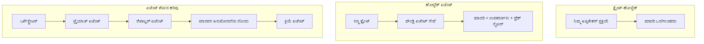
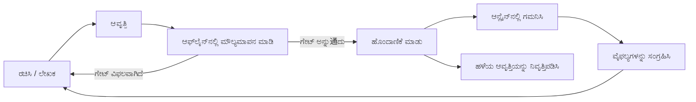
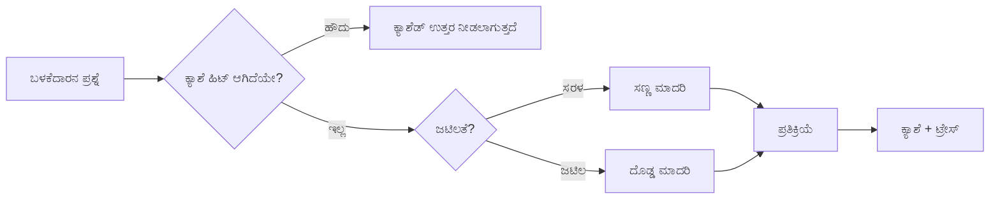
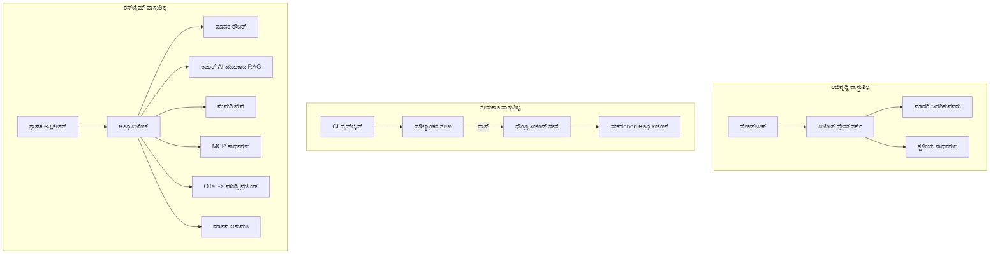

# ಮೈಕ್ರೋಸಾಫ್ಟ್ ಫೌಂಡ್ರಿಯಿಂದ ಅಳತೆಗೊಳ್ಳುವ ಏಜೆಂಟ್‌ಗಳನ್ನು ನಿಯೋಜಿಸುವುದು


ಈ ಕೋರ್ಸ್‌ನ ಈ ಹಂತದವರೆಗೆ ನೀವು ಲ್ಯಾಪ್‌ಟಾಪ್‌ನಲ್ಲಿ, ನೋಟ್‌ಬುಕ್‌ ಒಳಗೆ, `az login` ಮತ್ತು ಕೆಲವು ಪರಿಸರದ ಚರಗಳ ಮೂಲಕ ಚಾಲಿತವಾಗುವ ಏಜೆಂಟ್‌ಗಳನ್ನು ನಿರ್ಮಿಸಿದ್ದೀರಿ. ಅದು ಕಲಿಯಲು ಬಹುಮಾನವಾದ ಸರಿಯಾದ ವಿಧಾನ. ಆದರೆ ಸಾವಿರಾರು ಗ್ರಾಹಕರು ಅವಲಂಬಿಸಿರುವ ಏಜೆಂಟ್ ಅನ್ನು ರಾತ್ರಿ 3 ಗಂಟೆಗೆ ಚಲಿಸುವ ವಿಧಾನ ಅಲ್ಲ.

ಈ ಪಾಠವು "ನನ್ನ ಯಂತ್ರದಲ್ಲಿ ಕಾರ್ಯನಿರ್ವಹಿಸುತ್ತದೆ" ಮತ್ತು "ನಿರ್ವಹಣದಲ್ಲಿ ವಿಶ್ವಾಸಾರ್ಹವಾಗಿ ಮತ್ತು ವ್ಯಯಾಸಕ್ತಿಯಾಗಿ ಕಾರ್ಯನಿರ್ವಹಿಸುತ್ತದೆ" ಎಂಬ ನಡುವಿನ ಪರವಾನಗಿಯ ಕುರಿತು. ನಾವು ಅದನ್ನು **ಮೈಕ್ರೋಸಾಫ್ಟ್ ಫೌಂಡ್ರಿ** ಮತ್ತು **ಮೈಕ್ರೋಸಾಫ್ಟ್ ಫೌಂಡ್ರಿ ಏಜೆಂಟ್ ಸೇವೆ** ಬಳಸಿ ಮುಚ್ಚುತ್ತೇವೆ ಮತ್ತು ನಿಜವಾದ ಗ್ರಾಹಕ ಬೆಂಬಲ ಏಜೆಂಟ್ ತಯಾರಿಸುವ ಮೂಲಕ ಮಾಡುತ್ತೇವೆ, ಅದರಲ್ಲಿ ಸಾಧನಗಳು, ಹಿಂಪಡೆಯುವುದು, ಸ್ಮೃತಿ, ಮೌಲ್ಯಮಾಪನ ಮತ್ತು ಮಾನಿಟರಿಂಗ್ ಇರುತ್ತದೆ.

## ಪರಿಚಯ

ಈ ಪಾಠವು ಹೊಂದಿರುವುದು:

- **ಪ್ರೋಟೋಟೈಪ್ ಏಜೆಂಟ್** ಮತ್ತು **ನಿಯೋಜಿತ ಏಜೆಂಟ್** ನಡುವಿನ ವ್ಯತ್ಯಾಸ, ಮತ್ತು ಮಾದರಿ ಸುತ್ತಲೂ ಇರುವ ಪ್ರಾರಂಭಿಕ ಅಂಶಗಳ ಕುರಿತು.
- ಏಜೆಂಟ್‌ಗಳಿಗೆ **ನಿಯೋಜನೆ ಮಾದರಿಗಳು**: ಕ್ಲೈಂಟ್-ಹೋಸ್ಟೆಡ್, ಸೇವೆ-ಹೋಸ್ಟೆಡ್ (ಹೋಸ್ಟೆಡ್ ಏಜೆಂಟ್‌ಗಳು), ಮತ್ತು ವರ್ಕ್ಫ್ಲೋ-ನಿಯಂತ್ರಿತ.
- ಮೈಕ್ರೋಸಾಫ್ಟ್ ಫೌಂಡ್ರಿಯಲ್ಲಿ **ಏಜೆಂಟ್ ಜೀವಚಕ್ರ** — ರಚಿಸಿ, ಆವೃತ್ತಿ ಮಾಡಿ, ನಿಯೋಜಿಸಿ, ಮೌಲ್ಯಮಾಪನ ಮಾಡಿ, ಗಮನಿಸಿ, ನಿವೃತ್ತಿ ಮಾಡಿ.
- **ಅಳತೆಗೊಳ್ಳುವ ತಂತ್ರಗಳು**: ಮಾದರಿ ಮಾರ್ಗನಿರ್ದೇಶನ, ಕ್ಯಾಶಿಂಗ್, ಸಮಕಾಲೀನತೆ, ಮತ್ತು ಸ್ಥಿತಿಸ್ಥಾಪಕ ವಿನ್ಯಾಸ.
- ಓಪನ್‌ಟೆಲಿಮೆಟ್ರಿ ಮತ್ತು ಫೌಂಡ್ರಿ ಟ್ರೇಸಿಂಗ್ ಮೂಲಕ **ನಿರೀಕ್ಷಣೀಯತೆ**.
- ಮಾದರಿ ಆಯ್ಕೆ, ಮಾರ್ಗನಿರ್ದೇಶನ, ಮತ್ತು ಮೌಲ್ಯಮಾಪನ ಗೇಟುಗಳ ಮೂಲಕ **ವೆಚ್ಚ ನಿಯಂತ್ರಣ**.
- **ವ್ಯವಹಾರ ಸ್ವರೂಪದ ಪರಿಗಣನೆಗಳು**: ಆಡಳಿತ, ಮಾನವ ಅನುಮೋದನೆ, ಮತ್ತು MCP ಸರ್ವರ್‌ಗಳನ್ನು ಸುರಕ್ಷಿತವಾಗಿ ನಿಯೋಜಿಸುವುದು.

## ಕಲಿಕೆ ಗುರಿಗಳು

ಈ ಪಾಠವನ್ನು ಪೂರ್ಣಗೊಳಿಸಿದ ನಂತರ, ನೀವು ತಿಳಿದುಕೊಳ್ಳುತ್ತೀರಿ ಹೇಗೆ:

- ನೀಡಲಾದ ಏಜೆಂಟ್ ಕೆಲಸಭಾರಕ್ಕೆ ಸರಿಯಾದ ನಿಯೋಜನೆ ಮಾದರಿಯನ್ನು ಆರಿಸುವುದು.
- ಏಜೆಂಟ್ ಅನ್ನು ಮೈಕ್ರೋಸಾಫ್ಟ್ ಫೌಂಡ್ರಿ ಏಜೆಂಟ್ ಸೇವೆಗೆ ನಿಯೋಜಿಸುವುದು ಇದರಿಂದ ಅದು ಆವೃತ್ತಿ ಹೊಂದಿದ, ಆಡಿದ, ಮತ್ತು ಗಮನಾರ್ಹವಾಗಿರುತ್ತದೆ.
- ಟ್ರೇಸಿಂಗ್‌ಗಾಗಿ ಏಜೆಂಟ್ ಅನ್ನು ಸಾಧನಮಾಡುವುದು ಮತ್ತು ಮುದ್ರಣದ ಮೊದಲು ದೋ অনೂಲೋಲ ಮಾದರಿ ನಿರ್ಮಿಸುವ ಮೌಲ್ಯಮಾಪನ ಪೈಪ್‌ಲೈನ್ ಜೋಡಿಸುವುದು.
- ಅಳತೆ ಮತ್ತು ವೆಚ್ಚದ ನಿಯಂತ್ರಣಕ್ಕಾಗಿ ಮಾದರಿ ಮಾರ್ಗನಿರ್ದೇಶನ ಮತ್ತು ಕ್ಯಾಶಿಂಗ್ ಅನ್ನು ಅನ್ವಯಿಸುವುದು.
- ದುರ್ಬಲ-ಧೂಂಡ ತುರ್ತು ಕ್ರಿಯೆಗಳಿಗೆ ಮಾನವ ಅನುಮೋದನೆ ಗೇಟ್ ಸೇರಿಸುವುದು ಮತ್ತು ಉತ್ಪಾದನೆ-ಸುರಕ್ಷಿತ ರೀತಿಯಲ್ಲಿ MCP ಸರ್ವರ್‌ ಅನ್ನು ಸಂಯೋಜಿಸುವುದು.

## ಪೂರ್ವಾಪೇಕ್ಷೆಗಳು

ಈ ಪಾಠವು ನೀವು ಹಿಂದಿನ ಪಾಠಗಳನ್ನು ಪೂರ್ಣಗೊಳಿಸಿರುವುದು ಮತ್ತು ಅನುಕೂಲ ವಾಗಿ ಕಲಿತಿರುವುದು ಅಗತ್ಯವಿದೆ:

- [Microsoft Agent Framework](../14-microsoft-agent-framework/README.md) ಬಳಸಿ ಏಜೆಂಟ್‌ಗಳನ್ನು ನಿರ್ಮಿಸುವುದು (ಪಾಠ 14).
- [ಟೂಲ್ ಬಳಕೆ](../04-tool-use/README.md) (ಪಾಠ 4) ಮತ್ತು [Agentic RAG](../05-agentic-rag/README.md) (ಪಾಠ 5).
- [ಏಜೆಂಟ್ ಸ್ಮೃತಿ](../13-agent-memory/README.md) (ಪಾಠ 13) ಮತ್ತು [Agentic Protocols / MCP](../11-agentic-protocols/README.md) (ಪಾಠ 11).
- [ನಿರೀಕ್ಷಣೆ ಮತ್ತು ಮೌಲ್ಯಮಾಪನ](../10-ai-agents-production/README.md) (ಪಾಠ 10) — ಈ ಪಾಠವು ನೇರವಾಗಿ ಆ ಮೇಲಿದೆ.

ನೀವು ಇನ್ನೂ ಬೇಕಾಗುವುದು:

- ಕನಿಷ್ಠ ಒಂದು ನಿಯೋಜಿತ ಚಾಟ್ ಮಾದರಿಯೊಂದಿಗೆ **ಅಝುರ್ ಸಬ್ಸ್ಕ್ರಿಪ್ಷನ್** ಮತ್ತು **ಮೈಕ್ರೋಸಾಫ್ಟ್ ಫೌಂಡ್ರಿ ಪ್ರಾಜೆಕ್ಟ್**.
- **ಅಝುರ್ CLI** ಪ್ರಾಮಾಣೀಕೃತ (`az login`).
- Python 3.12+ ಮತ್ತು ಸಂಗ್ರಹದಲ್ಲಿ ಇರುವ ಪ್ಯಾಕೇಜುಗಳು [`requirements.txt`](../../../requirements.txt).

## ಪ್ರೋಟೋಟೈಪ್‌ನಿಂದ ಉತ್ಪಾದನೆಗೆ: ಶೀತಲವಾಗಿ ಏನಾಗುತ್ತೆ

ಪ್ರೋಟೋಟೈಪ್ ಏಜೆಂಟ್ ಮತ್ತು ಉತ್ಪಾದನಾ ಏಜೆಂಟ್ ಒಂದೇ ಮೂಲಲೂಪ್ ಹಂಚಿಕೊಳ್ಳುತ್ತವೆ — ಯುಕ್ತಿ, ಸಾಧನಗಳನ್ನು ಕರೆ, ಪ್ರತಿಕ್ರಿಯೆ ನೀಡುವಿಕೆ. ಆದರೆ ಆ ಲೂಪ್ ಸುತ್ತಲಿನ ಎಲ್ಲವೂ ಬದಲಾಗುತ್ತದೆ. ಮಾದರಿ ಉತ್ಪಾದನಾ ಏಜೆಂಟ್‌ನ 20% ಇರಬಹುದು; ಉಳಿದ 80% ಕಾರ್ಯಾಚರಣೆ ಅಂಗಬಂಧ.

| ಚಿಂತನೆ | ಪ್ರೋಟೋಟೈಪ್ | ಉತ್ಪಾದನೆ |
| --- | --- | --- |
| **ಹೊಸ್ಠಿಂಗ್** | ನಿಮ್ಮ ನೋಟ್‌ಬುಕ್‌ನಲ್ಲಿ ಕಾರ್ಯನಿರ್ವಹಿಸುತ್ತದೆ | ಹೋಸ್ಟೆಡ್ ಸೇವೆ ಆಗಿ, ಆವೃತ್ತಿ ಹೊಂದಿದ ಮತ್ತು ಬಿಡುಗಡೆಯಾಗುತ್ತದೆ |
| **ಪರಿಚಯ** | ನಿಮ್ಮ `az login` ಟೋಕನ್ | ಸಕೋಪ್ RBAC ಜೊತೆಗೆ ನಿರ್ವಹಿತ ಪರಿಚಯ |
| **ಸ್ಥಿತಿ** | ಮೆಮೊರಿಯಲ್ಲಿದ್ದು, ಮರುಪ್ರಾರಂಭದಲ್ಲಿ ಕಳೆದುಕೊಳ್ಳುತ್ತದೆ | ಹೊರಗೊಂಡ (ಥ್ರೆಡ್ ಸ್ಟೋರ್, ಮೆಮೊರಿ ಸೇವೆ) |
| **ವಿಫಲ್ಯ** | ನೀವು ಟ್ರೇಸ್‌ಬ್ಯಾಕ್ ನೋಡುತ್ತೀರಿ | ಮರುಪ್ರಯತ್ನ, ಬ್ಯಾಕ್‌ಅಪ್, ಡೆಡ್-ಲೇಟರ್, ಎಚ್ಚರಿಕೆಗಳು |
| **ಖರ್ಚು** | "ಇದು ಕೆಲವು ಸೆಂಟುಗಳಷ್ಟೇ" | ಪ್ರತಿಕೋರಿಕೆ ಪ್ರತಿ ಟ್ರ್ಯಾಕ್ ಮಾಡಲಾಗುತ್ತದೆ, ಮಾರ್ಗನಿರ್ದೇಶನ ಮತ್ತು ಕ್ಯಾಶ್ ಮಾಡಲಾಗಿದೆ, ಬಜೆಟ್ ಹೊಂದಿದೆ |
| **ಗುಣಮಟ್ಟ** | ನೀವು ಔಟ್‌ಪುಟ್ ನೋಡುತ್ತೀರಿ | ಬಿಡುಗಡೆಗೂ ಮುಂಚೆ ಸ್ವಯಂಚಾಲಿತ ಮೌಲ್ಯಮಾಪನ |
| **ನಂಬಿಕೆ** | ನೀವು ಪ್ರತಿ ಕ್ರಿಯೆಯೇ ಅನುಮೋದಿಸುತ್ತೀರಿ | ನಿಯಮ + ಅಪಾಯದ ಕಾರ್ಯಗಳಿಗೆ ಮಾನವ-ನಡೆಯುವಿಕೆ |

ಈ ಪಟ್ಟಿ ಗಮನದಲ್ಲಿಡಿ. ಕೆಳಗಿನ ಪ್ರತಿಯೊಂದು ವಿಭಾಗವು ಈ ಸಾಲುಗಳಲ್ಲಿ ಒಂದುವುದಕ್ಕೆ ಹೊಂದಿಕೊಳ್ಳುತ್ತದೆ.

## ಏಜೆಂಟ್ ನಿಯೋಜನೆ ಮಾದರಿಗಳು

ನೀವು ಮೂರು ಮಾದರಿಗಳನ್ನು ಬಳಸಿ, ಅನೇಕ ಸಲ ಸಂಯೋಜನೆಯೊಂದಿಗೆ.

### 1. ಕ್ಲೈಂಟ್-ಹೋಸ್ಟೆಡ್ ಏಜೆಂಟ್‌ಗಳು

ಏಜೆಂಟ್ ಆಬ್ಜೆಕ್ಟ್ ನಿಮ್ಮ ಅಪ್ಲಿಕೇಶನ್ ಪ್ರಕ್ರಿಯೆಯೊಳಗೆ ಇರುತ್ತದೆ. ನಿಮ್ಮ ಕೋಡ್ ನೇರವಾಗಿ ಮಾದರಿ ಒದಗಿಸುವವರನ್ನು ಕರೆಸುತ್ತದೆ; ಯುಕ್ತಿ ಲೂಪ್ ನಿಮ್ಮ ಸೇವೆಯಲ್ಲಿ ಚಲಿಸುತ್ತಿದೆ. ಇದು ಹಿಂದಿನ ಪ್ರತಿಯೊಂದು ಪಾಠದಲ್ಲಿಯೂ ಆಗಿತ್ತು.

- **ಬಳಸಿರಿ ಎಂದರೆ** ಲೂಪ್ ಮೇಲಿನ ಪೂರ್ಣ ನಿಯಂತ್ರಣ, ವಿಶೇಷ ಮಿಡಲ್‌ವೇರ್ ಬೇಕಾದಾಗ ಅಥವಾ ನೀವು ಏಜೆಂಟ್ ಅನ್ನು ಇಲ್ಲಿನ ಬ್ಯಾಕ್‌ಎಂಡ್‌ ಒಳಗೆದ್ದು ಮಾಡುತ್ತಿದ್ದಾಗ.
- **ಹಣಿಕಟ್ಟಿಗೆ**: ನೀವು ಸ್ವತಃ ಅಳತೆ, ಸ್ಥಿತಿ ಮತ್ತು ಪ್ರತಿರೋಧನೆಯನ್ನು ನಿಯಂತ್ರಿಸಬೇಕು.

### 2. ಹೋಸ್ಟೆಡ್ ಏಜೆಂಟ್‌ಗಳು (ಫೌಂಡ್ರಿ ಏಜೆಂಟ್ ಸೇವೆ)

ಏಜೆಂಟ್ ಮೈಕ್ರೋಸಾಫ್ಟ್ ಫೌಂಡ್ರಿಯಲ್ಲಿ *ಸಂಪನ್ಮೂಲವಾಗಿ ನೋಂದಾಯಿತ* ಆಗಿರುತ್ತದೆ. ಫೌಂಡ್ರಿ ಯುಕ್ತಿ ಲೂಪ್ ಅನ್ನು ಹೋಸ್ಟ್ ಮಾಡುತ್ತದೆ, ತಂತುಗಳನ್ನು ಸಂಗ್ರಹಿಸುತ್ತದೆ, ವಿಷಯ ಸುರಕ್ಷತೆ ಮತ್ತು RBAC ಅನುಷ್ಠಾನ ಮಾಡುತ್ತದೆ ಮತ್ತು ಏಜೆಂಟ್ ಅನ್ನು ಫೌಂಡ್ರಿ ಪೋರ್ಟಲ್‌ನಲ್ಲಿ ಗೋಚರಿಸುತ್ತದೆ. ನಿಮ್ಮ ಅಪ್ಲಿಕೇಶನ್ ಒಂದು ಹಾಳ ಸಣ್ಣ ಕ್ಲೈಂಟ್ ಆಗಿ ಕೆಲಸಮಾಡುತ್ತದೆ, ತಂತುಗಳನ್ನು ರಚಿಸುತ್ತದೆ ಮತ್ತು ಪ್ರತಿಕ್ರಿಯೆಗಳನ್ನು ಓದಲು.

- **ಬಳಸಿರಿ ಎಂದರೆ** ನೀವು ದಿರ್ಘಕಾಲೀನತೆ, ಒಳಗೊಂಡಿರುವ ನಿರೀಕ್ಷಣೀಯತೆ, ಆಡಳಿತ ಮತ್ತು ಕಡಿಮೆ ಕಾರ್ಯಾಚರಣೆ ಪ್ರದೇಶವನ್ನು ಬೇಕಾದಾಗ.
- **ಹಣಿಕಟ್ಟಿಗೆ**: ನಿರ್ವಹಿತ ರನ್‌ಟೈಮ್ ವಿನಿಮಯಕ್ಕಾಗಿ ಕಡಿಮೆ ಮಟ್ಟದ ನಿಯಂತ್ರಣ.

### 3. ಏಜೆಂಟ್ ವರ್ಕ್ಫ್ಲೋಗಳು

ಹಲವು ಏಜೆಂಟ್‌ಗಳು (ಮತ್ತು ಸಾಧನಗಳು) ಸ್ಪಷ್ಟ ನಿಯಂತ್ರಣ ಹರಿಯುವಿಕೆಯಿಂದ ಒಂದು ಗ್ರಾಫ್‌ನಲ್ಲಿ ಸಂಯೋಜಿಸಲ್ಪಡುತ್ತವೆ — ಕ್ರಮಬದ್ಧ ಹಂತಗಳು, ಶಾಖೆಗಳು, ಮಾನವ ಅನುಮೋದನೆ nodes, ಮತ್ತು ದಿರ್ಘಕಾಲೀನ ಪಾಯಿಂಟ್‌ಗಳು, ತಾತ್ಕಾಲಿಕ ಸ್ಥಗಿತ ಮತ್ತು ಪುನರಾರಂಭಕ್ಕೆ ಸಾಧ್ಯ. ಇದು ಮೈಕ್ರೋಸಾಫ್ಟ್ ಏಜೆಂಟ್ ಫ್ರೇಮ್ವರ್ಕ್ **ವರ್ಕ್‌ಫ್ಲೋಸ್** ಕಾರ್ಯಕ್ಷಮತೆಯ ನಿಯೋಜನೆ ಅಳತೆ.

- **ಬಳಸಿರಿ ಎಂದರೆ** ಒಂದು ಕಾರ್ಯವು ವಿಶೇಷ ಏಜೆಂಟ್‌ಗಳ ಹಾದಿಯಾದಾಗ ಅಥವಾ ಮಧ್ಯದಲ್ಲಿ ಅನುಮೋದನೆ ಹಂತ ಬೇಕಾದಾಗ.
- **ಹಣಿಕಟ್ಟಿಗೆ**: ಅಧಿಕ ಸಂಚಲನ ಅಂಗಗಳು; ನಿರ್ವಹಣಾ ಮಟ್ಟದ ನಿರೀಕ್ಷಣೀಯತೆ ಬೇಕು.



## ಮೈಕ್ರೋಸಾಫ್ಟ್ ಫೌಂಡ್ರಿಯಲ್ಲಿ ಏಜೆಂಟ್ ಜೀವಚಕ್ರ

ಏಜೆಂಟ್ ನಿಯೋಜನೆಯು ಒಮ್ಮೆ ಮಾಡೋ `push` ಅಲ್ಲ. ಅದು ಒಂದು ಲೂಪ್ ಆಗಿದೆ ಮತ್ತು ಸಾಫ್ಟ್‌ವೇರ್ ಬಿಡುಗಡೆ ಚಕ್ರದಂತೆ ಕಾಣುತ್ತದೆ ಏಕೆಂದರೆ ಅದು ನಿಜವಾಗಿಯೇ ಆದು.



[ಪಾಠ 10](../10-ai-agents-production/README.md) ನಿಂದ ಅಡಿಗಾಯಿಸಿದ್ದು: **ಆಫ್‌ಲೈನ್ ಮೌಲ್ಯಮಾಪನವು ಗೇಟ್ ಆಗಿದೆ, ಬಮತಯನುಗೂ ಅಲ್ಲ.** ಹೊಸ ಏಜೆಂಟ್ ಆವೃತ್ತಿ ನಿಮ್ಮ ಮೌಲ್ಯಮಾಪನ ಮಿತಿ ಗಳನ್ನು ಪಾರದರ್ಶಕವಾಗಿಸಿಕೊಂಡಿಲ್ಲ ಎಂದರೆ ಬಿಡುಗಡೆ ಆಗುವುದಿಲ್ಲ. ಆನ್ಲೈನ್ ನಿರೀಕ್ಷಣೀಯತೆ ನಂತರ ನಿಜವಾದ ವಿಫಲತೆಯನ್ನು ಆಫ್‌ಲೈನ್ ಪರೀಕ್ಷಾ ಸಮೂಹಕ್ಕೆ ಹಿಂತಿರುಗಿಸುತ್ತದೆ. ಅದು ಸಂಪೂರ್ಣ ಲೂಪ್.

## ಅಳತೆ ತಂತ್ರಗಳು

ಏಜೆಂಟ್ ಅನ್ನು ಅಳತೆ ಮಾಡುವುದು ಸ್ಥಿತಿಸ್ಥಾಪಕ ವೆಬ್ API ಅಳತೆಯಿಂದ ಬಿನ್ನಹಾಗುತ್ತದೆ, ಏಕೆಂದರೆ ಪ್ರತಿ ವಿನಂತಿಯು ಜಾಸ್ತಿ ವೆಚ್ಚದ ಮಾದರಿ ಮತ್ತು ಸಾಧನ ಕಾಲ್‌ಗಳನ್ನು ಪ್ರೇರೇಪಿಸಬಹುದು. ನಾಲ್ಕು ತಂತ್ರಗಳು ಹೆಚ್ಚಿನ ಲೋಡ್‌ ಅನ್ನು ಹೊಂದುತ್ತದೆ.

**ಸ್ಥಿತಿಸ್ಥಾಪಕ ವಿನಂತಿ ನಿರ್ವಹಣೆ.** ನಿಮ್ಮ ಪ್ರಕ್ರಿಯೆಯ ಮೆಮೊರಿಯಲ್ಲಿ ಯಾವ ಯუზರ್ ಸ್ಥಿತಿಯನ್ನೂ ಇರಿಸಬೇಡಿ. ಸಂವಾದ ತಂತುಗಳನ್ನು ಫೌಂಡ್ರಿ ಥ್ರೆಡ್ ಸ್ಟೋರ್ ಅಥವಾ ಮೆಮೊರಿ ಸೇವೆಯಲ್ಲಿ ಉಳಿಸಿರಿ ಆದ್ದರಿಂದ ಯಾವುದೇ ಇನ್ಸ್ಟನ್ಸು ಯಾವುದೇ ವಿನಂತಿಯನ್ನು ಕೈಗೊಳ್ಳಬಹುದು. ಇದು ನಿಮಗೆ ಹಾರೈಸಾಂತಿಕವಾಗಿ ಅಳವಡಿಸಿಕೊಳ್ಳಲು ಅನುಮತಿಸುತ್ತದೆ — ಇನ್ಸ್ಟನ್ಸು ಸೇರಿಸಿ, ಯಾವುದೇ ಸ್ಟಿಕ್ಕಿ ಸೆಶನ್ ಇಲ್ಲದೆ.

**ಮಾದರಿ ಮಾರ್ಗನಿರ್ದೇಶನ.** ಪ್ರತಿಯೊಂದು ವಿನಂತಿಗೂ ನಿಮ್ಮ ಅತ್ಯಂತ ಸಾಮರ್ಥ್ಯೆಯ (ಮತ್ತು ಜಾಸ್ತಿ ವೆಚ್ಚದ) ಮಾದರಿ ಬೇಕಾಗಿಲ್ಲ. ಸರಳ ವಿನಂತಿಗಳನ್ನು — ಉದ್ದೇಶ ವರ್ಗೀಕರಣ,ಚುಟುಕು ವಾಸ್ತವಸ್ವರೂಪ ಉತ್ತರಗಳು — ಸಣ್ಣ, ವೇಗವಾದ ಮಾದರಿಯ ಕಡೆ ಮಾರ್ಗನಿರ್ದೇಶಿಸಿ, ಮತ್ತು ದೊಡ್ಡ ಮಾದರಿಯನ್ನು ನಿಜವಾದ ಯುಕ್ತಿಗುಂಡಗಳಿಗೆ ಮೀಸಲಿಡಿ. ಫೌಂಡ್ರಿಯ **ಮಾಡೆಲ್ ರೌಟರ್** ನಿಮ್ಮನ್ನು ಸಹಾಯ ಮಾಡಬಹುದು, ಅಥವಾ ನೀವು ಸ್ವತಃ ಲಘು ವರ್ಗೀಕರಣ ಸಾಧನವನ್ನು ಆವಿಷ್ಕರಿಸಬಹುದು. ನಿಮ್ಮಲ್ಲಿ ಲ್ಯಾಬ್‌ನಲ್ಲಿ DIY ಆವೃತ್ತಿ ನಿರ್ಮಿಸಲಿದ್ದೀರಿ.

**ಪ್ರತಿಕ್ರಿಯೆ ಕ್ಯಾಶಿಂಗ್.** ಬಹುತರ ಬೆಂಬಲ ಪ್ರಶ್ನೆಗಳು ಸಮಾನ ("ನನ್ನ ಪಾಸ್ವರ್ಡ್ ಅನ್ನು ಹೇಗೆ ಮರುಹೊಂದಿಸಬಹುದು?"). ಸಾಮಾನ್ಯ ಪ್ರಶ್ನೆಗಳ ಉತ್ತರಗಳನ್ನು ಕ್ಯಾಶ್ ಮಾಡಿ ಮತ್ತು ಪೂರ್ಣವಿಳಾಸದ ಮಾದರಿ ಕಾಲ್ ಇಲ್ಲದೆ ನೀಡಿರಿ. ಸಾದಾರಣ ಕ್ಯಾಶ್ ಹಿಟ್ ದರವೂ ವೆಚ್ಚ ಮತ್ತು ವಿಳಂಬ ಕಡಿಮೆ ಮಾಡುತ್ತದೆ.

**ಸಮಕಾಲೀನತೆ ಮತ್ತು ಬ್ಯಾಕ್‌ಪ್ರೆಶರ್.** ಮಾದರಿ ಒದಗಿಸುವವರಿಗೆ ದರಮಿತಿ ಇರುತ್ತದೆ. ನಿಮ್ಮ ಸಮಕಾಲೀನತೆ ಮಿತಿ ಮಾಡಿ, ವಿಸ್ತಾರಿತ ಮರುಪ್ರಯತ್ನ ಬಳಸಿ, ಮತ್ತು ಸಿಂಪato ಯಾಗಿ ವಿಫಲಗೊಳಿಸಿ (ಸರಣಿಬದ್ಧ "ನಾವು ಅದರಲ್ಲಿ ಇದ್ದೇವೆ" ಪ್ರತಿಕ್ರಿಯೆ 500 ಕ್ಕಿಂತ ಉತ್ತಮ).



## ಉತ್ಪಾದನೆಯಲ್ಲಿ ನಿರೀಕ್ಷಣೀಯತೆ

ನೀವು ಕಾಣದಿರುವುದನ್ನು ಕಾರ್ಯಗತಗೊಳಿಸಲು ಸಾಧ್ಯವಿಲ್ಲ. ಪಾಠ 10 ರಲ್ಲಿ ಚರ್ಚಿಸಿದಂತೆ, ಮೈಕ್ರೋಸಾಫ್ಟ್ ಏಜೆಂಟ್ ಫ್ರೇಮ್ವರ್ಕ್ ಸ್ವಾಭಾವಿಕವಾಗಿ **OpenTelemetry** ಟ್ರೇಸ್‌ಗಳನ್ನು ನಿಗದಿಪಡಿಸುತ್ತದೆ — ಪ್ರತಿಯೊಂದು ಮಾದರಿ ಕರೆ, ಸಾಧನ ಆಮಂತ್ರಣ, ಮತ್ತು ಸಂಘಟನೆ ಹಂತವು ಒಂದು ಸ್ಪಾನ್ ಆಗುತ್ತದೆ. ಉತ್ಪಾದನೆಯಲ್ಲಿ ನೀವು ಆ ಸ್ಪಾನ್‌ಗಳನ್ನು ಮೈಕ್ರೋಸಾಫ್ಟ್ ಫೌಂಡ್ರಿಗೆ (ಅಥವಾ ಯಾವುದೇ OTel-ಅನುಕೂಲ ಬ್ಯಾಕ್‌ಎಂಡ್‌ಗೆ) ರಫ್ತುಮಾಡಬಹುದು ನಿಮಗೆ ಮುಂತಾದವು ಮಾಡಲು:

- ಒಂದೇ ಗ್ರಾಹಕ ಸಂಶಯವನ್ನು ಪ್ರತಿಯೊಬ್ಬ ಮಾದರಿ ಮತ್ತು ಸಾಧನ ಕರೆಗಳಲ್ಲಿಯೂ ನೋಡಬಹುದು.
- ಕಾಲಕ್ರಮದಲ್ಲಿ p50/p95 ವಿಳಂಬ ಮತ್ತು ವೆಚ್ಚವನ್ನು ಗಮನಿಸಬಹುದು.
- ದೋಷ ದರ ಏರಿಕೆ ಮತ್ತು ವೆಚ್ಚ ಅಸಾಮಾನ್ಯತೆಗಳ ಮೇಲೆ ಬಳಕೆದಾರರ (ಅಥವಾ ಹಣಕಾಸು ತಂಡ) ಗಮನಕ್ಕೆ ಬರುವ ಮುಂಚೆ ಎಚ್ಚರಿಕೆ ನೀಡಬಹುದು.

```python
from agent_framework.observability import get_tracer

tracer = get_tracer()

with tracer.start_as_current_span("support_request") as span:
    span.set_attribute("customer.tier", "enterprise")
    span.set_attribute("routed.model", "gpt-4.1-mini")
    # ಈ ಸ್ಪ್ಯಾನ್ ಒಳಗಿನ ಏಜೆಂಟ್ ಕಾರ್ಯಾಚರಣೆ ಸ್ವಯಂಚಾಲಿತವಾಗಿ ಅನುಸರಿಸಲಾಗುತ್ತದೆ
```

`customer.tier` ಮತ್ತು `routed.model` ಹಾಗು ಗುಣಲಕ್ಷಣಗಳು ಒಂದು ಟ್ರೇಸಿಂಗ್ ಗೋಡೆಯಿಂದ ಪ್ರ ಈ-ಉತ್ತರಿಸುವ ಪ್ರಶ್ನೆಗಳಿಗೆ ("ಉದ್ಯಮ ಗ್ರಾಹಕರು ಚಿಕ್ಕ ಮಾದರికి ಹೆಚ್ಚು ಬಾರಿ ಮಾರ್ಗಗೊಂಡಿರಬಹುದೆ?") ಮರುಮುಖವಾಗುತ್ತದೆ.

## ವೆಚ್ಚದ ನಿರ್ವಹಣೆ

ಉತ್ಪಾದನಾ ಏಜೆಂಟ್‌ಗಳಲ್ಲಿ ವೆಚ್ಚದ ಪ್ರಮುಖ ಭಾಗವು ಟೋಕನ್‌ಗಳು. ಮೂರು ನಿಯಂತ್ರಣಗಳು, ಪರಿಣಾಮದ ಕ್ರಮದಲ್ಲಿ:

1. **ಮಾದರಿಯನ್ನು ಸರಿಯಾದ ಗಾತ್ರ ಮಾಡಿರಿ.** ಒಂದು ಸಣ್ಣ ಮಾದರಿ ನಿಮ್ಮ ಮೌಲ್ಯಮಾಪನ ಗೇಟು ಪಾರಾಗುವ ಪ್ರಮಾಣದಲ್ಲಿ ಸಾಮಾನ್ಯವಾಗಿ ದೊಡ್ಡ ಮಾದರಿಗಿಂತ ಸಸತಾಗಿ ಬರುವದು. ಅತಿಸೂಕ್ಷ್ಮತೆಗಾಗಿ ದೊಡ್ಡ ಮಾದರಿಯ ಬದಲು ಮೌಲ್ಯಮಾಪನದೊಂದಿಗೆ ಸಣ್ಣ ಮಾದರಿಯೇ ಸರಿಯಾಗಿದೆಯೆಂದು ಸಾಬೀತನ್ನಾಗಿ ಮಾಡಿರಿ.
2. **ಸಂಕೀರ್ಣತೆಯಿಂದ ಮಾರ್ಗನಿರ್ದೇಶನ.** ಮೇಲಿನಂತೆ — ದೊಡ್ಡ ಮಾದರಿಯ ಯುಕ್ತಿಗುಂಡಿಗಳನ್ನು ಅಗತ್ಯವಿರುವ ವಿನಂತಿಗಳಿಗೇ ದೊಡ್ಡ ಮಾದರಿಯ ಬೆಲೆ ಕೊಡಿ.
3. **ಜೋರಾಗಿ ಕ್ಯಾಶ್ ಮಾಡಿ.** ಅತ್ಯಂತ ಕಡಿಮೆ ವೆಚ್ಚದ ಮಾದರಿ ಕರೆ ಎಂದರೆ ನೀವು ಎಂದಿಗೂ ಮಾಡದದು.

ಮೌಲ್ಯಮಾಪನ ಗೇಟು ಹಾಗೂ ವೆಚ್ಚ ನಿಯಂತ್ರಣವು ಎರಡು ಮುಖಗಳಿಂದ ನೋಡಲ್ಪಡುವ ಒಂದುಜಂಟು ಶಿಸ್ತಾಗಿದೆ: ಮೌಲ್ಯಮಾಪನವು *ಗುಣಮಟ್ಟದ ಆಧಾರದ ಮೇಲಿರುವುದು* ಎಂದು ಹೇಳುತ್ತದೆ, ಮಾರ್ಗನಿರ್ದೇಶನ ಮತ್ತು ಕ್ಯಾಶಿಂಗ್ ಅದಕ್ಕೆ *ವೆಚ್ಚ*ಯನ್ನೂ ನಿಯಂತ್ರಿಸುತ್ತದೆ.

## ಉದ್ಯಮ ನಿಯೋಜನೆ ಪರಿಗಣನೆಗಳು

**ನಿಯಂತ್ರಣ.** ಹೋಸ್ಟೆಡ್ ಏಜೆಂಟ್‌ಗಳು ಫೌಂಡ್ರಿ RBAC, ವಿಷಯದ ಸುರಕ್ಷತೆ ಮತ್ತು ಲಾಗಿಂಗ್‌ನ ಅಧಿಕಾರವನ್ನು ಪಡೆಯುತ್ತವೆ. ಪ್ರತಿಯೊಂದು ಏಜೆಂಟ್ ಗೆ ಅದಕ್ಕೆ ಬೇಕಾದ ಕಡಿಮೆ ಹಕ್ಕು ನೀಡುವ ನಿರ್ವಹಿತ ಪರಿಚಯ ನೀಡಿ — ಜ್ಞಾನ ಬೇಟೆಗೆ ಓದು-ಮಾತ್ರದ ಪ್ರವೇಶ, ಟಿಕೆಟ್ API ಗೆ ಸಕೋಪ್ ಪ್ರವೇಶ, ಇದಕ್ಕಿಂತ ಹೆಚ್ಚು ಬೇಡ.

**ಮಾನವ-ನಡೆಯುವಿಕೆ.** ಕೆಲವು ಕ್ರಿಯೆಗಳು ಸಂಪೂರ್ಣವಾಗಿ ಸ್ವಯಂಚಾಲಿತವಾಗಲು ತುಂಬಾ ಪರಿಣಾಮಕಾರಿಯಾಗುತ್ತವೆ — ವಿಮರ್ಶೆ ಮಾಡುವುದು, ಖಾತೆ ಅಳಿಸುವುದು, ಕಾನೂನು ತಂಡಕ್ಕೆ ಒತ್ತಾಯಿಸುವುದು. ಮೈಕ್ರೋಸಾಫ್ಟ್ ಏಜೆಂಟ್ ಫ್ರೇಮ್ವರ್ಕ್ **ಅನುಮೋದನೆ-ಬೇಕಾದ** ಸಾಧನಗಳನ್ನು ಬೆಂಬಲಿಸುತ್ತದೆ: ಏಜೆಂಟ್ ಕ್ರಿಯೆಯನ್ನು ಪ್ರಸ್ತಾವಿಸುತ್ತದೆ, ಕಾರ್ಯನಿರ್ವಹಣೆ ಸ್ಥಗಿತಗೊಳ್ಳುತ್ತದೆ, ಮಾನವ ಅನುಮೋದನೆ ಅಥವಾ ನಿರಾಕರಣೆ ಮಾಡುತ್ತಾನೆ, ಮತ್ತು ವರ್ಕ್ಫ್ಲೋ ಮುಂದುವರೆಯುತ್ತದೆ. ನೀವು [ಪಾಠ 6](../06-building-trustworthy-agents/README.md) ನಲ್ಲಿ ಅದನ್ನು ಕಂಡಿದ್ದೀರಿ; ಇಲ್ಲಿ ನೀವು ಅದನ್ನು ನಿಯೋಜಿಸುತ್ತೀರಿ.

**ಉತ್ಪಾದನೆಯಲ್ಲಿ MCP.** [MCP](../11-agentic-protocols/README.md) ನಿಮ್ಮ ಏಜೆಂಟ್‌ಗೆ ಮಾನಕ ಇಂಟರ್ಫೇಸ್ ಮೂಲಕ ಬಾಹ್ಯ ಸಾಧನಗಳನ್ನು ಉಪಯೋಗಿಸಲು ಅನುಮತಿಸುತ್ತದೆ. ಉತ್ಪಾದನೆಯಲ್ಲಿ, ಪ್ರತಿಯೊಂದು MCP ಸರ್ವರ್ ಅನ್ನು ಅಸ್ಥಿರ ಗಡಿ ಎಂದು ಪರಿಗಣಿಸಿ: ಸರ್ವರ್ ಆವೃತ್ತಿ ಸ್ಥಿರಪಡಿಸಿ, ಸಕೋಪ್ ಪರಿಚಯದಿಂದ ಚಲಿಸಿ, ಅದರ ಫಲಿತಾಂಶಗಳನ್ನು ಪರಿಶೀಲಿಸಿ, ಮತ್ತು ಅದಕ್ಕೆ ರಹಸ್ಯಗಳನ್ನು ಬಹಿರಂಗಪಡಿಸಬೇಡಿ. MCP ಸರ್ವರ್ ಒಂದು ಅವಲಂಬನೆ, ಮತ್ತು ಅವಲಂಬನೆ ಕಂಡುಹಿಡಿಯಲ್ಪಡು, ಪರಿಶೀಲನೆ, ಮತ್ತು ದರ ಮಿತಿಗೊಳಿಸುವಿಕೆ ಮಾಡಲ್ಪಡುತ್ತದೆ.



ಆ ಮೂರು ಬಿಲ್ಲುಗಳು — ಅಭಿವೃದ್ಧಿ, ನಿಯೋಜನೆ,_RUNTIME_ — ಏಜೆಂಟ್ ಜೀವನದ ಮೂರು ಹಂತಗಳನ್ನು ಸೂಚಿಸುತ್ತವೆ. ನಂತರ ಲ್ಯಾಬ್ ನೀವು ಅದನ್ನು ನಿರ್ಮಿಸುವುದನ್ನು ನಡಿಸುತ್ತದೆ.

## ಕೈಗೆ ತಗುಲುವ ಲ್ಯಾಬ್: ಉತ್ಪಾದನೆಗೆ ಸಿದ್ಧ ಗ್ರಾಹಕ ಬೆಂಬಲ ಏಜೆಂಟ್

[`code_samples/16-python-agent-framework.ipynb`](./code_samples/16-python-agent-framework.ipynb) ತೆರೆಯಿರಿ ಮತ್ತು ಅದನ್ನು ಪ್ರಾರಂಭದಿಂದ ಕೊನೆವರೆಗೆ ಕೆಲಸಮಾಡಿ. ನೀವು ಒಂದು **ಕಂಟೋಸೊ ಗ್ರಾಹಕ ಬೆಂಬಲ ಏಜೆಂಟ್** ಅನ್ನು ಒಗ್ಗೂಡಿಸುತ್ತೀರಿ, ಪ್ರತಿಯೊಂದು ಉತ್ಪಾದನಾ ಚಿಂತೆಯನ್ನು ಜೋಡಿಸಿ:

1. **ಸಾಧನ ಆನಿರ್ದೇಶನ** — ಪ್ರಕ್ರಿಯೆ ಸ್ಥಿತಿಯನ್ನು ನೋಡಲು ಮತ್ತು ಬೆಂಬಲ ಟಿಕೆಟ್‌ಗಳನ್ನು ತೆರೆಯಲು.
2. **RAG** — ಜ್ಞಾನ ಶ್ರೋತದಿಂದ ನೀತಿಯ ಪ್ರಶ್ನೆಗಳಿಗೆ ಉತ್ತರ (ಅಝುರ್ AI ಶೋಧನೆ, ಮತ್ತು ಎರಡು ಮೇಲ್ನೋಟ ಸಂಘಟನೆ ಸಹಿತ).
3. **ಸ್ಮೃತಿ** — ಸಂಭಾಷಣೆಯ ತಿರುವುಗಳಲ್ಲಿ ಗ್ರಾಹಕನ ನೆನಪಿಸುವುದು.
4. **ಮಾದರಿ ಮಾರ್ಗನಿರ್ದೇಶನ** — ಸಂಕೀರ್ಣ ವರ್ಗೀಕರಣಕಾರನಿಂದ ಪ್ರತಿ ವಿನಂತಿಯನ್ನು ಸಣ್ಣ ಅಥವಾ ದೊಡ್ಡ ಮಾದರಿಗೆ ಮಾರ್ಗನಿರ್ದೇಶಿಸುತ್ತದೆ.
5. **ಪ್ರತಿಕ್ರಿಯೆ ಕ್ಯಾಶಿಂಗ್** — ಪುನರಾವರ್ತಿತ ಪ್ರಶ್ನೆಗಳಿಗೆ ಕ್ಯಾಶ್ ನಿಂದ ಸೇವೆ ನೀಡಲಾಗುತ್ತದೆ.
6. **ಮಾನವ ಅನುಮೋದನೆ** — ನಿರ್ದಿಷ್ಟ ಮಿತಿಗಿಂತ ಮೇಲಾಗುವ ಮೇಲ್ಗಡೆಗಳು ಮಾನವನ ದೃಢೀಕರಣಕ್ಕೆ ಕಾಯುತ್ತವೆ.
7. **ಮೌಲ್ಯಮಾಪನ ಪೈಪ್‌ಲೈನ್** — ಸಣ್ಣ ಆಫ್‌ಲೈನ್ ಪರೀಕ್ಷಾ ಸಮೂಹ ಏಜೆಂಟ್ ಅನ್ನು ಅಂಕೆಗಟ್ಟುತ್ತದೆ ಮತ್ತು ಬಿಡುಗಡೆ ಗೇಟ್ ಆಗಿ ಕಾರ್ಯನಿರ್ವಹಿಸುತ್ತದೆ.
8. **ನಿರೀಕ್ಷಣೀಯತೆ** — ಪ್ರತಿಯೊಂದು ವಿನಂತಿಯ ಸುತ್ತಲೂ OpenTelemetry ಟ್ರೇಸಿಂಗ್.

### ಹಾದಿ ಪರಿಚಯ

ಲ್ಯಾಬ್ ಅನ್ನು ಪ್ರತಿಯೊಂದು ಉತ್ಪಾದನಾ ಚಿಂತೆಯೂ ಸ್ವತಂತ್ರ, ಓಡಬಹುದಾದ ವಿಭಾಗವಾಗಿರುತ್ತದೆ. ಇದರ ಹೃದಯ routng-ಪ್ಲಸ್-ಕ್ಯಾಶಿಂಗ್ ವಿನಂತಿ ಕಾರ್ಯಕರ್ತ.

```python
async def handle_support_request(query: str, customer_id: str) -> str:
    # 1. ನಾವು ಸಾಧ್ಯವಾದರೆ ಕ್ಯಾಶೆ ಬಳಸಿ ಸೇವೆ ನೀಡಿ.
    cached = response_cache.get(normalize(query))
    if cached:
        return cached

    # 2. ವೆಚ್ಚವನ್ನು ನಿಯಂತ್ರಿಸಲು پيraಎಚೊಂದಿ ಮೂಲಕ ಮಾರ್ಗ ನಿಗದಿ ಮಾಡಿ.
    model = "gpt-4.1-mini" if is_simple(query) else "gpt-4.1"

    # 3. ಪರಿಶೀಲನೆಯನ್ನು ಸುಲಭಗೊಳಿಸಲು ಏಜೆಂಟನ್ನು ಟ್ರೇಸ್ ಸ್ಪ್ಯಾನ್ ಒಳಗೆ ಚಲನ ಮಾಡುವಿರಿ.
    with tracer.start_as_current_span("support_request") as span:
        span.set_attribute("routed.model", model)
        span.set_attribute("customer.id", customer_id)
        response = await support_agent.run(query, model=model)

    # 4. ಕ್ಯಾಶೆ ಮಾಡಿ ಮತ್ತು ವಾಪಾಸು ನೀಡಿ.
    response_cache.set(normalize(query), response.text)
    return response.text
```

ಬಿಡುಗಡೆಯನ್ನು ಕಾಯುವ ಮೌಲ್ಯಮಾಪನ ಗೇಟ್ ಹೀಗೆ ಕಾಣಿಸುತ್ತದೆ:

```python
async def evaluation_gate(agent, test_cases, threshold: float = 0.8) -> bool:
    passed = 0
    for case in test_cases:
        result = await agent.run(case["input"])
        if score_response(result.text, case["expected"]) >= 0.8:
            passed += 1
    pass_rate = passed / len(test_cases)
    print(f"Evaluation pass rate: {pass_rate:.0%} (gate: {threshold:.0%})")
    return pass_rate >= threshold  # ಗೇಟ್ ಗೆ ಸರಿದರೆ ಮಾತ್ರ ನಿಯೋಜಿಸಿ
```

ಪ್ರತಿಯೊಂದು ಸಾಲನ್ನು ಓದಿ — ಲ್ಯಾಬ್ ಪ್ರimitives ಅತೀ ಚಿಕ್ಕದಾಗಿ ಇಟ್ಟುಕೊಳ್ಳುತ್ತದೆ ಹಾಗಾಗಿ ಯಾವುದೇ ವಿಭಾಗ-ಕರೆಗೆ ಹಿಂಡು ಇಲ್ಲ.

## ನಿಯೋಜಿತ ಏಜೆಂಟ್ ಅನ್ನು ಧೂಮಪಾನ ಪರೀಕ್ಷೆಗಳಿಂದ ಮಾನ್ಯಗೊಳಿಸುವುದು

ಮೇಲಿನ ಮೌಲ್ಯಮಾಪನ ಗೇಟ್ ಆಫ್‌ಲೈನ್ ನಿಮ್ಮ ಏಜೆಂಟ್ ಆಬ್ಜೆಕ್ಟ್ ವಿರುದ್ಧ ನಡೆಸುತ್ತದೆ. ಏಜೆಂಟ್ ಅನ್ನು ಹೋಸ್ಟೆಡ್ ಏಜೆಂಟ್ ಎಂಬಂತೆ ನಿಯೋಜಿಸಿದ್ದಾಗಿ, ನೀವು ಇನ್ನೊಂದು ಸರಳ ಮಾಪನ, **ನಿಯೋಜಿತ ಅಂತರ್ಜಾಲ ಎಡ್ರೆಸ್ ನಿಜವಾಗಿಯೂ ಉತ್ತರಿಸುತ್ತಿದೆಯೇ?** ಎಂಬ ಪರೀಕ್ಷೆ ಬೇಕು.

"ಯಶಸ್ವಿಯಾಗಿ" ನಿಯೋಜನೆ ಎಂದರೆ ನಿಯಂತ್ರಣ ಪಥವು ವ್ಯಾಖ್ಯಾನವನ್ನು ಸ್ವೀಕರಿಸಿದೆ ಎಂದನ್ನು ಮಾತ್ರ ಗುರ್ತಿಸುತ್ತದೆ — ಅದು ಏಜೆಂಟ್ ಪ್ರತಿಕ್ರಿಯಿಸುವುದಿಲ್ಲ ಎಂದು ಸಾಬೀತುಪಡಿಸುವುದು ಅಲ್ಲ. ಅವಲಂಬನೆ ಕಾಣದಿದೆಯೆ, ಮಾದರಿ ಮಾರ್ಗನಿರ್ದೇಶನ ತಪ್ಪಿದೆಯೆ, ಅಥವಾ ಸಂಪರ್ಕಾವಧಿ ಮುಗಿದಿದೆಯೆ ಎಂಬುದರಿಂದ ಹಸಿರು ನಿಯೋಜನೆ ಇದ್ದರೂ ಯಾವುದೂ ಹಿಂತಿರುಗುವುದಿಲ್ಲ. **ಧೂಮಪಾನ ಪರೀಕ್ಷೆ** ಅದನ್ನು ಸೆಕೆಂಡುಗಳಲ್ಲಿ ಹಿಡಿದುಕೊಳ್ಳುತ್ತದೆ, ಪ್ರತಿಯೊಂದು ನಿಯೋಜನೆಯಲ್ಲಿಯೂ, ಪೂರ್ಣ ಮೌಲ್ಯಮಾಪನ ವೆಚ್ಚವಿಲ್ಲದೇ.

ಈ ಸಂಗ್ರಹವು [AI Smoke Test](https://github.com/marketplace/actions/ai-smoke-test) GitHub ಕ್ರಿಯೆಯ ಮೇಲಿನ ಸಿದ್ಧ-ಬಳಕೆಯ ಧೂಮಪಾನ ಪರೀಕ್ಷಾ ಪೈಪ್‌ಲೈನ್ ಅನ್ನು ಒದಗಿಸುತ್ತದೆ:

- **ಕ್ಯಾಟಲಾಗ್** — [`tests/lesson-16-smoke-tests.json`](../../../tests/lesson-16-smoke-tests.json) ಕಂಟೋಸೊ ಬೆಂಬಲ ಏಜೆಂಟ್‌ಗೆ ಪ್ರಾಂಪ್ಟ್ಸ್ ಮತ್ತು ದೃಢೀಕರಣಗಳನ್ನು ಒಳಗೊಂಡಿದೆ (ಸ್ಥಾಪಿತ ನೀತಿ ಉತ್ತರಗಳು, ಆದೇಶ ವಿಚಾರಣೆ, ವಿಷಯದ ಜೊತೆ ಇರುವುದು, ಮತ್ತು ಬಹು-ತಿರುವು ತಂತು連続ತೆ). ಇತರ ಪಾಠಗಳ ಏಜೆಂಟ್‌ಗಳಿಗೆ ಕ್ಯಾಟಲಾಗ್‌ಗಳು ಇದೊಂದು ಜೊತೆಗೆ ಇರುತ್ತವೆ — ನೋಡಿ [`tests/README.md`](../tests/README.md).
- **ವರ್ಕ್‌ಫ್ಲೋ** — [`.github/workflows/smoke-test.yml`](../../../.github/workflows/smoke-test.yml) ಅಝುರ್ OIDC ಗೆ ಲಾಗಿನ್ ಆಗಿ ಪ್ರತಿಯೊಂದು ಪ್ರಾಂಪ್ಟ್ ಅನ್ನು ಏಜೆಂಟ್ Responses ಅಂತರ್ಜಾಲ ಲಿಖಿತಕ್ಕೆ POST ಮಾಡುತ್ತದೆ, ಒಂದು ದೃಢೀಕರಣ ತಪ್ಪು ಇದ್ದರೆ ಕೆಲಸ ವಿಫಲಗೊಳ್ಳುತ್ತದೆ.

```yaml
- name: Smoke-test hosted agent
  uses: JFolberth/ai-smoketest@v1
  with:
    project_endpoint: ${{ inputs.project_endpoint }}
    agent_name: ContosoSupportAgent
    tests_file: tests/lesson-16-smoke-tests.json
```


ನಿಮ್ಮ ಏಜೆಂಟ್ ನಿಯೋಜನೆಗೊಂಡ ನಂತರ, ನಿಮ್ಮ Foundry ಪ್ರಾಜೆಕ್ಟ್ ಅಂತಿಮ ಬಿಂದುವನ್ನು ಮತ್ತು ಏಜೆಂಟ್ ಹೆಸರನ್ನು ಪೂರೈಸಿ, **Actions** ಟ್ಯಾಬ್ ನಿಂದ ಅದನ್ನು ನಡೆಸಿ. ಫೆಡರೇಟೆಡ್ ಐಡೆಂಟಿಟಿಗೆ Foundry ಪ್ರಾಜೆಕ್ಟ್ ವ್ಯಾಪ್ತಿಯಲ್ಲಿ **Azure AI User** ಪಾತ್ರ ಬೇಕಾಗುತ್ತದೆ. ಲೇಯರ್‌ಗಳನ್ನು ಪಿರಮಿಡ್ ಎಂದು ಭಾವಿಸಿ: ಸಾಹಸ ಪರೀಕ್ಷೆಗಳು (ಸಂಪರ್ಕ ಸಾಧ್ಯವೋ ಹಾಗೂ ಪ್ರತಿಕ್ರಿಯಿಸುತ್ತಿದೆಯೋ?) ಪ್ರತಿ ನಿಯೋಜನೆ ಮೇಲೆ ನಡೆಯುತ್ತವೆ, ಆಫ್ಲೈನ್ ಮೌಲ್ಯಮಾಪನ (ಕಮ್ಮಿ ಮೌಲ್ಯ ಇದ್ದೇ?). ಆನ್‌ಲೈನ್ ಮೌಲ್ಯಮಾಪನ (ಜಂಗಲದಲ್ಲಿ ಅದು ಹೇಗಿದೆ?) ನಿರಂತರವಾಗಿ ನಡೆಯುತ್ತದೆ.

## ಜ್ಞಾನ ಪರೀಕ್ಷೆ

ನಿಯೋಜನೆಗೆ ಮೊದಲು ನಿಮ್ಮ ಅರ್ಥವನ್ನು ಪರೀಕ್ಷಿಸಿ.

**1. ಉತ್ಪಾದನಾ ಏಜೆಂಟಿನ ಎಷ್ಟು ಭಾಗವನ್ನು ಸಾಮಾನ್ಯವಾಗಿ "ಮಾದರಿ" ನಿಗದಿಪಡಿಸುತ್ತದೆ ಮತ್ತು ಅವಶಿಷ್ಟ ಭಾಗವೇನು?**

<details>
<summary>ಉತ್ತರ</summary>

ಮಾದರಿಗೆ ವ್ಯವಸ್ಥೆಯ ಸಣ್ಣ ಭಾಗವಿದ್ದು — ಸಾಮಾನ್ಯವಾಗಿ ಸುಮಾರು 20% ಎಂದು ಹೇಳಲಾಗುತ್ತದೆ. ಉಳಿದ حصہ ಕಾರ್ಯಾಚರಣೆ ಕಂಕಾಲ: ಹೋಸ್ಕಿಂಗ್ ಮತ್ತು ಆವೃತ್ತಿಗೊಳಿಸುವಿಕೆ, ಐಡೆಂಟಿಟಿ ಮತ್ತು RBAC, ಹೊರಗಿನ ಸ್ಥಿತಿ, ವಿಫಲತೆ ನಿರ್ವಹಣೆ, ವೆಚ್ಚ ಟ್ರ್ಯಾಕಿಂಗ್, ಮೌಲ್ಯಮಾಪನ, ಮತ್ತು ಮಾನವ ನಿಯಂತ್ರಣಗಳು. ಉತ್ಪಾದನಕ್ಕೆ ಹೋಗುವುದು ಮುಖ್ಯವಾಗಿ ಯುಕ್ತಿಗೊಳಿಸುವಿಕೆ ಲೂಪ್ ಸುತ್ತಲೂ ಎಲ್ಲಾ ಬಿಲ್ಲೆಗಳನ್ನು ನಿರ್ಮಿಸುವುದಾಗಿದೆ.
</details>

**2. ಯಾವಾಗ ನೀವು ಕ್ಲೈಂಟ್-ಹೋಸ್ಟ್ ಆಗಿರುವ ಏಜೆಂಟಿಗಿಂತ ಹೋಸ್ಟ್ ಮಾಡಲಾದ ಏಜೆಂಟ್ ಆಯ್ಕೆಮಾಡಿಕೊಳ್ಳುತ್ತೀರಿ?**

<details>
<summary>ಉತ್ತರ</summary>

ನೀವು ನಿರ್ವಹಿಸಲಾದ ಸಮಯಚಲನವಿರುವಿಕೆ (ಪರಿಸರಾರು ತಿರುವುಗಳು ಇರುತ್ತವೆ ಮತ್ತು ಪುನರುರ್ನ್ ಆಗಬಹುದು), ಗಮನಾರ್ಹತೆ, ವಿಷಯ ಸುರಕ್ಷತೆ, ಮತ್ತು RBAC ಹೊಂದಿರುವ ವ್ಯವಸ್ಥೆಯನ್ನು ಬಯಸಿದಾಗ ಮತ್ತು reasoning loop ನಲ್ಲಿ ಕಡಿಮೆ ಕಾರ್ಯಾಚರಣಾ ಸವರಣೆಯಾದರೇಕೂಡ ನಿಯಂತ್ರಣ ಕಮ್ಮಿಯಾಗುತ್ತದೆ. ಕ್ಲೈಂಟ್-ಹೋಸ್ಟ್ ಆದಾಗ ನೀವು ಪೂರ್ಣ ನಿಯಂತ್ರಣ ಬಯಸುವಾಗ ಅಥವಾ ಏಜೆಂಟ್ ಅನ್ನು ಇನ್ಮುಂದೆ nyuma backend ಗೆ ಸೇರಿಸುವಾಗ ಅನುಕೂಲಕರವಾಗಿದೆ.
</details>

**3. ಏಕೆ ಸ್ಕೇಲಬಲ್ ಏಜೆಂಟ್ ತನ್ನ ಸ್ವಂತ ಪ್ರಕ್ರಿಯೆ ಮೆಮೊರಿಯಲ್ಲಿ ಸ್ಥಿತಿರಹಿತವಾಗಿರಬೇಕು?**

<details>
<summary>ಉತ್ತರ</summary>

ಯಾವುದೇ ಘಟಕವು ಯಾವುದೇ ವಿನಂತಿಯನ್ನು ನಿರ್ವಹಿಸಬಲ್ಲದು, ಇದು ಸ್ಥಿರ ಸೇಶನ್ ಇಲ್ಲದೆ ಅಡ್ಡವಾಗಿ ವಿಸ್ತಾರಕ್ಕೂ ಅವಕಾಶ ಒದಗಿಸುತ್ತದೆ. ಪ್ರತಿ ಬಳಕೆದಾರ ಸಂಭಾಷಣಾ ಸ್ಥಿತಿಯು ಥ್ರೆಡ್ ಸ್ಟೋರ್ ಅಥವಾ ಮೆಮೊರಿ ಸೇವೆಗೆ ಹೊರಗೆ ಇರುತ್ತದೆ. ಸ್ಥಿತಿಯು ಪ್ರಕ್ರಿಯೆಯ ಮೆಮೊರಿಯಲ್ಲಿ ಇದ್ದರೆ, ಮರುಪ್ರಾರಂಭದಲ್ಲಿ ಅದನ್ನು ನಷ್ಟಮಾಡುತ್ತೀರಿ ಮತ್ತು ಲೋಡ್ ಅನ್ನು ಮುಕ್ತವಾಗಿ ಹಂಚಿಕೊಳ್ಳಲು ಸಾಧ್ಯವಾಗುವುದಿಲ್ಲ.
</details>

**4. ಮಾದರಿ ಮಾರ್ಗನಿರ್ದೇಶನ ಯಾವ ಸಮಸ್ಯೆ ಪರಿಹರಿಸುತ್ತದೆ, ಮತ್ತು ಅದು ಮೌಲ್ಯಮಾಪನಕ್ಕೆ ಹೇಗೆ ಸಂಬಂಧಿಸಿದೆ?**

<details>
<summary>ಉತ್ತರ</summary>

ಮಾರ್ಗನಿರ್ದೇಶನ ಸರಳ ವಿನಂತಿಗಳನ್ನು ಚಿಕ್ಕ, ಕಡಿಮೆ ವೆಚ್ಚದ ಮತ್ತು ವೇಗವಾದ ಮಾದರಿಗೆ ಕಳುಹಿಸುತ್ತದೆ ಮತ್ತು ದೊಡ್ಡ ಮಾದರಿಯನ್ನು ನಿಜವಾದ ಯುಕ್ತಿಕರಣಕ್ಕೆ ಕಾಯ್ದಿರಿಸುತ್ತದೆ, ಇದರಿಂದ BOTH latency ಮತ್ತು ವೆಚ್ಚ ನಿಯಂತ್ರಣವಾಗುತ್ತದೆ. ಇದು ಮೌಲ್ಯಮಾಪನಕ್ಕೆ ಸಂಬಂಧಿಸಿದೆ ಏನಂದರೆ ಮೌಲ್ಯಮಾಪನವು ಚಿಕ್ಕ ಮಾದರಿ ಒಂದು ವಿನಂತಿ ವರ್ಗಕ್ಕೆ ಸಾಕಾಗುತ್ತದೆ ಎಂಬುದನ್ನು ಸಾಬೀತುಮಾಡುತ್ತದೆ — ಮೌಲ್ಯಮಾಪನ ಇಲ್ಲದ ಮಾರ್ಗದರ್ಶನ ಊಹಾಪೋಹವೇ.
</details>

**5. "ಮೌಲ್ಯಮಾಪನ ಗೇಟ್" ಎಂದರೇನು ಮತ್ತು ಅದು ಜೀವನಚಕ್ರದಲ್ಲಿ ಎಲ್ಲಿ ಇರುತ್ತದೆ?**

<details>
<summary>ಉತ್ತರ</summary>

ಮೌಲ್ಯಮಾಪನ ಗೇಟ್ ಹೊಸ ಏಜೆಂಟ್ ಆವೃತ್ತಿಗೆ ವಿರುದ್ಧವಾಗಿ ಆಫ್ಲೈನ್ ಪರೀಕ್ಷಾ ಸಮೂಹವನ್ನು ಓಡಿಸುತ್ತದೆ ಮತ್ತು ಪಾಸ್ ರೇಟ್ ದೋಣಿಯ ಮೇಲ್ಭಾಗದಿ ಇಲ್ಲದಿದ್ದರೆ ನಿಯೋಜನೆಯನ್ನು ತಡೆಯುತ್ತದೆ. ಇದು "ಆವೃತ್ತಿ" ಮತ್ತು "ನಿಯೋಜನೆ" ನಡುವೆ ಜೀವನಚಕ್ರದಲ್ಲಿ ಇರುತ್ತದೆ, ಬಿಡುಗಡೆಗಾಗಿ ಗುಣಮಟ್ಟವನ್ನು ಒಂದು ಪೂರ್ವಶರತ್ತನ್ನಾಗಿಸುತ್ತಾ ಸರಪಳಿ ಕೊನೆಯಲ್ಲಿ ಪರೀಕ್ಷಿಸುವುದಿಲ್ಲ.
</details>

**6. ಉತ್ಪಾದನೆಯಲ್ಲಿ MCP ಸರ್ವರ್ ಅನ್ನು ವಿಶ್ವಾಸಾರ್ಹವಾಗದ ಗಡಿಯಲ್ಲಿ ನೋಡಬೇಕು ಯಾಕೆ?**

<details>
<summary>ಉತ್ತರ</summary>

ಏಕೆಂದರೆ ಅದು ನಿಮ್ಮ ಏಜೆಂಟ್ ಕರೆಯುವ ಹೊರಗಿನ ಅವಲಂಬನೆಯಾಗಿದೆ. ನೀವು ಅದರ ಆವೃತ್ತಿಯನ್ನು ಪಿನ್ ಮಾಡಬೇಕು, ವ್ಯಾಪ್ತಿಯ ಐಡೆಂಟ್ ಜೊತೆ ಅದನ್ನು ಓಡಿಸಬೇಕು, ಅದರ ಔಟ್‌ಪುಟ್‌ಗಳನ್ನು ಪರಿಶೀಲಿಸಬೇಕು, ದರ ನಿಯಂತ್ರಣ ಮಾಡಬೇಕು, ಮತ್ತು ಯಾರಿಗಾದರೂ ರಹಸ್ಯಗಳನ್ನು ಬಹಿರಂಗಪಡಿಸಬಾರದು — ನೀವು ಯಾವುದೇ ತೃತೀಯ-ಪಾರ್ಟಿ ಅವಲಂಬನೆಗೆ ನೀಡುವ ನಿಯಮಗಳು ಇದೇುವೇ ಆಗಿರಬೇಕು. ಇದರ ಔಟ್‌ಪುಟ್‌ಗಳು ನಿಮ್ಮ ಏಜೆಂಟ್ ಪರಿಕಲ್ಪನೆಗೆ ಸೇರುತ್ತವೆ, ಆದ್ದರಿಂದ ಪರಿಶೀಲಿಸದ ವಿಶ್ವಾಸವು ಭದ್ರತೆ ಅಪಾಯವಾಗುತ್ತದೆ.
</details>

**7. ಏಕೆ ಸರಾಸರಿ, ಉತ್ಪಾದನಾ ಏಜೆಂಟ್ ವೆಚ್ಚದ ಮೇಲೆ ದೊಡ್ಡ ಪರಿಣಾಮ ಬೀರುವ ಒಂದು ಬದಲಾವಣೆ ಯಾವದು ಮತ್ತು ಯಾಕೆ?**

<details>
<summary>ಉತ್ತರ</summary>

ಮಾದರಿಯ ಗಾತ್ರ ನಿಗದಿಪಡಿಸುವುದು — ನಿಮ್ಮ ಮೌಲ್ಯಮಾಪನ ಗೇಟ್ ಅನ್ನು ಪಾಸುಮಾಡುವ ಅತಿ ಚಿಕ್ಕ ಮಾದರಿ ಬಳಸುವುದು. ವೆಚ್ಚವನ್ನು ಟೋಕನ್‌ಗಳು ನಿಬಂಧಿಸುತ್ತದೆ, ಮತ್ತು ಉತ್ತಮ ಗುಣಮಟ್ಟದ ಅಡಿಯಲ್ಲಿ ಚಿಕ್ಕ ಮಾದರಿ ದೊಡ್ಡದಕ್ಕಿಂತ ಕಡಿಮೆ ಖರ್ಚಿನದ್ದಾಗಿರುತ್ತದೆ. ಕ್ಯಾಶಿಂಗ್ ಮತ್ತು ಮಾರ್ಗನಿರ್ದೇಶನ ವೆಚ್ಚವನ್ನು ಇನ್ನಷ್ಟು ನಿಲ್ಲಿಸುತ್ತವೆ, ಆದರೆ ಸರಿಯಾದ ಮೂಲ ಮಾದರಿ ಆಯ್ಕೆ ದೊಡ್ಡ ಮುಂಭಾಗದ ಪರಿಣಾಮ ಬೀರುತ್ತದೆ.
</details>

**8. `customer.tier` ಮತ್ತು `routed.model` ಮುಂತಾದ ಸ್ಪಾನ್ ಗುಣಲಕ್ಷಣಗಳು ಗಮನಾರ್ಹತೆಯಲ್ಲಿ ಯಾವ ಪಾತ್ರ ವಹಿಸುತ್ತವೆ?**

<details>
<summary>ಉತ್ತರ</summary>

ಅವು ಅಸಂಪೂರ್ಣ ಟ್ರೇಸ್ಗಳನ್ನು ಉತ್ತರಿಸುವ ವ್ಯವಹಾರ ಪ್ರಶ್ನೆಗಳಲ್ಲಿ ಪರಿವರ್ತಿಸುತ್ತವೆ. ಗುಣಲಕ್ಷಣಗಳಿಲ್ಲದಿದ್ದರೆ ನಿಮ್ಮ ಬಳಿ ಸ್ಪಾನ್‌ಗಳ ಗೋಡೆ ಇರುತ್ತದೆ; ಅವುಳ್ಳಾಗ ನೀವು "ಎಂಟರ್ಪ್ರೈಸ್ ಗ್ರಾಹಕರನ್ನು ಚಿಕ್ಕ ಮಾದರಿಗೆ ಬಹಳ ಬಾರಿ ಮಾರ್ಗದರ್ಶನ ಮಾಡಲಾಗುತ್ತಿದೆಯೇ?" ಅಥವಾ "ಯಾವ ಮಾದರಿ ನಮ್ಮ pinakamಂದಗ ವೇಗದ ವಿನಂತಿಗಳನ್ನು ನಿರ್ವಹಿಸುತ್ತದೆ?" ಎಂದು ಕೇಳಬಹುದು. ಗುಣಲಕ್ಷಣಗಳು ನಿಮ್ಮ ಕಾರ್ಯಾಚರಣೆ ಅವರಿಗೆ ಮುಖ್ಯವಾಗುವ ಆಯಾಮಗಳ ಮೂಲಕ ದೂರದರ್ಶನವನ್ನು ಕಡಿದಾಡುವುದಕ್ಕೆ ಉಪಾಯ.
</details>

## ನಿಯೋಜನೆ

ಪ್ರಯೋಗಾಲಯದ ಗ್ರಾಹಕ ಬೆಂಬಲ ಏಜೆಂಟಿನಿಂದ ತೆಗೆದುಕೊಳ್ಳಿ ಮತ್ತು ಅದನ್ನು ನಿರ್ದಿಷ್ಟ ದೃಶ್ಯಾವಳಿಗೆ ಗಟ್ಟಿಗೊಳಿಸಿ: **SaaS ಕಂಪನಿಗಾಗಿ ಸಬ್ಸ್ಕ್ರಿಪ್ಷನ್ ಬಿಲ್ಲಿಂಗ್ ಬೆಂಬಲ ಏಜೆಂಟ್.**

ನಿಮ್ಮ ಸಲ್ಲಿಕೆ ಇವುಗಳನ್ನು ಹೊಂದಿರಬೇಕು:

1. ಟೂಲ್ಸ್‌ಗಳನ್ನು ಬಿಲಿಂಗ್-ಸಂಬಂಧಿತವಾಗಿರುವಂತೆ ಬದಲಾಯಿಸಿ: `get_subscription_status`, `get_invoice`, ಮತ್ತು `issue_credit` (₹50 ಹೆಚ್ಚು ಕ್ರೆಡಿಟ್‌ಗಳು ಮಾನವ ಅನುಮೋದನೆಯನ್ನು ಅಗತ್ಯವಿರುತ್ತದೆ).
2. ಕಂಪನಿಯ ಮರುಪಾವತಿ ನೀತಿ, ಬಿಲ್ಲಿಂಗ್ ಚಕ್ರ, ಮತ್ತು ರದ್ದತಿ ನೀತಿಯನ್ನು ಒಳಗೊಂಡ ಮೂರು RAG ದಸ್ತಾವೇಜುಗಳನ್ನು ಸೇರಿಸಿ.
3. ಮೌಲ್ಯಮಾಪನ ಸೆಟ್ ಅನ್ನು ಕನಿಷ್ಠ ಎಂಟು ಪ್ರಕರಣಗಳಿಗೆ ವಿಸ್ತರಿಸಿ, ಕನಿಷ್ಠ ಎರಡನ್ನು ಮಾನವ ಅನುಮೋದನಾ ಮಾರ್ಗವನ್ನು ಉಂಟುಮಾಡುವಂತೆ ಜೋಡಿಸಿ ಮತ್ತು ನಿಮ್ಮ ಮೌಲ್ಯಮಾಪನ ಗೇಟ್ ಸರಿಯಾಗಿ ಪಾಸು ಅಥವಾ ಅಸಾಧ್ಯವಾಗುವುದನ್ನು ಖಚಿತಪಡಿಸಿ.
4. ಒಂದು ವೆಚ್ಚ ವರದಿಯನ್ನು ಸೇರಿಸಿ: ಏಜೆಂಟ್ ಮೂಲಕ ಮಿಶ್ರಿತ 10 ಪ್ರಶ್ನೆಗಳನ್ನು ಓಡಿಸಿದ ನಂತರ, ಚಿಕ್ಕ ಮಾದರಿಗೆ ಎಷ್ಟು ಹೋದವು, ದೊಡ್ಡ ಮಾದರಿಗೆ ಎಷ್ಟು ಹೋದವು ಮತ್ತು ಕ್ಯಾಶೆಯಿಂದ ಎಷ್ಟನ್ನು ಸೇರುವುದಾಯಿತು ಎಂದು ಮುದ್ರಿಸಿ.

ಈ ನಿಯೋಜನೆಯೆ ಪುಟದಲ್ಲಿ ಒಂದು ಸಣ್ಣ परिच್ಛೇದವನ್ನು ಬರೆದು ನೀವು ಆಯ್ಕೆಮಾಡಿದ ಮಾದರಿ-ಮಾರ್ಗನಿರ್ದೇಶನ ನಿಯಮವೇನು ಮತ್ತು ಅದನ್ನು ನೈಜ ಟ್ರಾಫಿಕ್ ಜೊತೆ ಹೇಗೆ ಪರಿಶೀಲಿಸುವಿರಿ ಎಂಬುದನ್ನು ವಿವರಿಸಿ. ಯಾವುದೇ ಒಂದೇ ಸರಿಯಾದ ಉತ್ತರವಿಲ್ಲ — ಉತ್ಪಾದನಾ ಚಿಂತೆಗಳನ್ನು ಸಮ್ಮಿಲನ ಮಾಡಲಾಗಿದೆ ಎಂದು ನಿಮಗೆ ಮೌಲ್ಯಮಾಪನ ನೀಡಲಾಗುತ್ತದೆ.

## ಸಾರಾಂಶ

ಈ ಪಾಠದಲ್ಲಿ ನೀವು Microsoft Foundry ಬಳಸಿ ಏಜೆಂಟ್ ಅನ್ನು ಪ್ರೋಟೋಟೈಪ್ ನಿಂದ ಉತ್ಪಾದನೆಗೆ ಮುಂದಾಳ್ಗೊಳಿಸಿದಿರಿ:

- ಉತ್ಪಾದನೆಗೆ ಹಾರಾಟ ಮುಖ್ಯವಾಗಿ ಮಾದರಿ ಸುತ್ತಲಿನ **ಕಾರ್ಯಾಚರಣಾ ಹಡಗು** ಬಗ್ಗೆ — ಹೋಸ್ಟ್, ಐಡೆಂಟಿಟಿ, ಸ್ಥಿತಿ, ವಿಫಲತೆ ನಿರ್ವಹಣೆ, ವೆಚ್ಚ, ಗುಣಮಟ್ಟ, ಮತ್ತು ವಿಶ್ವಾಸ.
- ನೀವು ಮೂರು **ನಿಯೋಜನೆ ಮಾದರಿಗಳನ್ನು** ಕಲಿತಿರಿ — ಕ್ಲೈಂಟ್-ಹೋಸ್ಟ್, ಹೋಸ್ಟ್ ಆಜಂಟ್ಗಳು, ಮತ್ತು ಏಜೆಂಟ್ ವರ್ಕ್‌ಫ್ಲೋಗಳು — ಮತ್ತು ಯಾವುದು ಯಾವಾಗ ಸೂಕ್ತ.
- ನೀವು **ಏಜೆಂಟ್ ಜೀವನಚಕ್ರ** ಮೂಲಕ ನಡೆದು, ಆಫ್ಲೈನ್ **ಮೌಲ್ಯಮಾಪನ ಬಿಡುಗಡೆ ಗೇಟ್ ಆಗಿ ಕಾರ್ಯನಿರ್ವಹಿಸುತ್ತದೆ** ಮತ್ತು ಆನ್‌ಲೈನ್ ಗಮನಾರ್ಹತೆಯು ವೈಫಲ್ಯಗಳನ್ನು ಪರೀಕ್ಷಾ ಸಮೂಹಕ್ಕೆ ತಿರುಗಿಸಿ ನೀಡುತ್ತದೆ.
- ನೀವು **ಸ್ಕೇಲಿಂಗ್ ತಂತ್ರಗಳು** — ಸ್ಥಿತಿರಹಿತ ವಿನ್ಯಾಸ, ಮಾದರಿ ಮಾರ್ಗನಿರ್ದೇಶನ, ಕ್ಯಾಶಿಂಗ್, ಮತ್ತು ನಿರ್ದಿಷ್ಟ ಸಂಯೋಜನೆ — ಅನ್ನು ಅನ್ವಯಿಸಿ ಮತ್ತು ಅವುಗಳನ್ನು **ವೆಚ್ಚ ಆಪ್ಟಿಮೈಸೇಶನ್** ಗೆ ಸಂಪರ್ಕಿಸಿದಿರಿ.
- ನೀವು **ನಿಗಮ ನಿಯಂತ್ರಣಗಳನ್ನು** ಜೋಡಿಸಿ: RBAC, ಮಾನವ-ನಿಯಂತ್ರಣದಲ್ಲಿ ಅನುಮೋದನೆ, ಮತ್ತು ಉತ್ಪಾದನಾ-ಸುರಕ್ಷಿತ MCP ಏಕೀಕರಣ.
- ನೀವು **ಉತ್ಪಾದನಾ-ಸಜ್ಜಿಗೊಳಿಸಿದ ಗ್ರಾಹಕ ಬೆಂಬಲ ಏಜೆಂಟ್** ಅನ್ನು ನಿರ್ಮಿಸಿದ್ದು, ಈ ಎಲ್ಲಾ ಚಿಂತೆಗಳನ್ನು runnable ಕೋಡ್ ನಲ್ಲಿ ಜೋಡಿಸಿದೆ.

ಮುಂದಿನ ಪಾಠವು ವಿರುದ್ಧ ದಾರಿಯನ್ನು ಅನುಸರಿಸುತ್ತದೆ: ಏಜೆಂಟ್ಗಳನ್ನು ಮేఘಕ್ಕೆ ವಿಸ್ತರಿಸದೆ, ನೀವು ಅವುಗಳನ್ನು *ಕಡಿಮೆ*ಗೊಳಿಸಿ ಒಂದು ಡೆವಲಪರ್ ಯಂತ್ರದಲ್ಲಿ ಸಂಪೂರ್ಣ ಸ್ಥಳೀಯವಾಗಿ ಚಾಲನೆ ಮಾಡುವುದು.

## ಹೆಚ್ಚುವರಿ ಸಂಪನ್ಮೂಲಗಳು

- <a href="https://learn.microsoft.com/azure/ai-foundry/what-is-azure-ai-foundry" target="_blank">Microsoft Foundry ಡಾಕ್ಯುಮೆಂಟೇಶನ್</a>
- <a href="https://learn.microsoft.com/azure/ai-foundry/agents/overview" target="_blank">Microsoft Foundry Agent ಸೇವೆ ಅವಲೋಕನ</a>
- <a href="https://aka.ms/ai-agents-beginners/agent-framework" target="_blank">Microsoft Agent Framework</a>
- <a href="https://learn.microsoft.com/azure/ai-foundry/concepts/model-router" target="_blank">Microsoft Foundry ನಲ್ಲಿ ಮಾದರಿ ಮಾರ್ಗನಿರ್ದೇಶನ</a>
- <a href="https://learn.microsoft.com/azure/search/search-what-is-azure-search" target="_blank">Azure AI Search</a>
- <a href="https://opentelemetry.io/" target="_blank">OpenTelemetry</a>
- <a href="https://github.com/marketplace/actions/ai-smoke-test" target="_blank">AI Smoke Test GitHub ಕ್ರಿಯೆ</a>
- <a href="https://modelcontextprotocol.io/" target="_blank">ಮಾದರಿ ಸಂದರ್ಭ ಪ್ರೋಟೋಕಾಲ್ (MCP)</a>

## ಹಿಂದಿನ ಪಾಠ

[ಕಂಪ್ಯೂಟರ್ ಬಳಕೆ ಏಜೆಂಟ್ಗಳ ನಿರ್ಮಾಣ (CUA)](../15-browser-use/README.md)

## ಮುಂದಿನ ಪಾಠ

[ಸ್ಥಳೀಯ AI ಏಜೆಂಟ್ಗಳ ಸೃಜನೆ](../17-creating-local-ai-agents/README.md)

---

<!-- CO-OP TRANSLATOR DISCLAIMER START -->
**ಅಸ್ವೀಕಾರ**:
ಈ ದಸ್ತಾವೇಜು AI ಅನುವಾದ ಸೇವೆ [Co-op Translator](https://github.com/Azure/co-op-translator) ಬಳಸಿ ಅನುವಾದಿಸಲಾಗಿದೆ. ನಾವು ನಿಖರತೆಯನ್ನು ಸಾಧಿಸಲು ಪ್ರಯತ್ನಿಸುತ್ತಿದ್ದರೂ, ದಯವಿಟ್ಟು ಗಮನಿಸಿ, ಸ್ವಯಂಚಾಲಿತ ಅನುವಾದಗಳಲ್ಲಿ ದೋಷಗಳು ಅಥವಾ ಅಸಡ್ಡೆಗಳು ಇರಬಹುದು. ಮೂಲ ಭಾಷೆಯಲ್ಲಿರುವ ಮೂಲ ದಸ್ತಾವೇಜು ಪ್ರಾಮಾಣಿಕ ಮೂಲವೆಂದು ಪರಿಗಣಿಸಬೇಕು. ಪ್ರಮುಖ ಮಾಹಿತಿಗಾಗಿ, ವೃತ್ತಿಪರ ಮಾನವ ಅನುವಾದವನ್ನು ಶಿಫಾರಸು ಮಾಡಲಾಗುತ್ತದೆ. ಈ ಅನುವಾದವನ್ನು ಬಳಸುವ ಮೂಲಕ ಉಂಟಾಗುವ ಯಾವುದೇ ತಪ್ಪು ಅರ್ಥಗಳ ಅಥವಾ ತಪ್ಪು ವ್ಯಾಖ್ಯಾನಗಳ ಬಗ್ಗೆ ನಾವು ಹೊಣೆಗಾರರಲ್ಲ.
<!-- CO-OP TRANSLATOR DISCLAIMER END -->