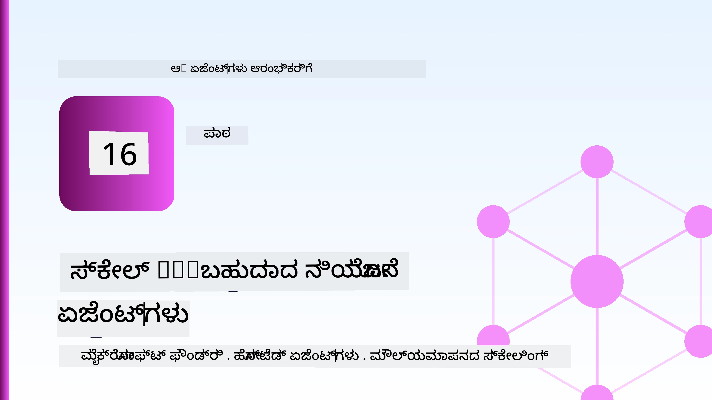
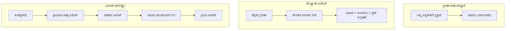
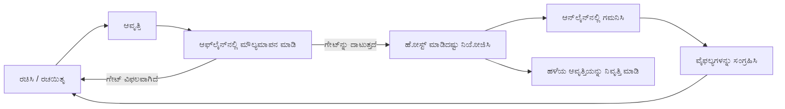
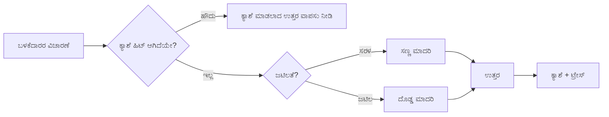
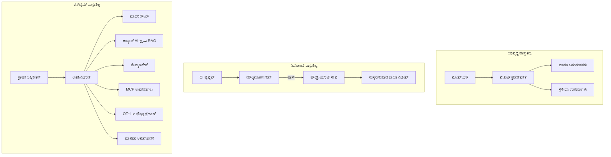

# ಮೈಕ್ರೋಸಾಫ್ಟ್ ಫೌಂಡ್ರಿಯಿಂದ ಸ್ಕೇಲಬಲ್ ಏಜೆಂಟ್ಸ್ ಅನ್ನು ನಿಯೋಜಿಸುವುದು



ಈ ಪಾಠದವರೆಗೆ ನೀವು ನಿಮ್ಮ ಲ್ಯಾಪ್‌ಟಾಪ್‌ನಲ್ಲಿ, ಒಂದು ನೋಟ್ಬುಕ್‌ ಒಳಗೆ, `az login` ಮತ್ತು ಕೆಲವು ಪರಿಸರ ವ್ಯತ್ಯಾಸಗಳಿಂದ ಚಾಲಿತವಾಗುವ ಏಜೆಂಟ್ಸ್ ಅನ್ನು ನಿರ್ಮಿಸಿದ್ದಾರೆ. ಅದು ನಿಖರವಾಗಿ ಕಲಿಯಲು ಸರಿಯಾಗಿರುವ ವಿಧಾನ. ಅದು ಸಾವಿರಾರು ಗ್ರಾಹಕರು 3 ಗಂಟೆಗೆ ಅವಲಂಬಿಸುವ ಏಜೆಂಟ್ ಅನ್ನು ಓಡಿಸುವ ಸರಿಯಾದ ವಿಧಾನವಲ್ಲ.

ಈ ಪಾಠವು "ನನ್ನ ಯಂತ್ರದಲ್ಲಿ ಇದು ಕೆಲಸ ಮಾಡುತ್ತದೆ" ಮತ್ತು "ಉತ્પાદನದಲ್ಲಿ ವಿಶ್ವಾಸಾರ್ಹವಾಗಿ ಮತ್ತು ವಿಶಯಕ್ಕೆ ತಕ್ಕಂತೆ ಕೆಲಸ ಮಾಡುತ್ತದೆ" ನಡುವಿನ ವ್ಯತ್ಯಾಸವನ್ನು ಕುರಿತು ಇದೆ. ನಾವು ಆ ವ್ಯತ್ಯಾಸವನ್ನು **ಮೈಕ್ರೋಸಾಫ್ಟ್ ಫೌಂಡ್ರಿ** ಮತ್ತು **ಮೈಕ್ರೋಸಾಫ್ಟ್ ಫೌಂಡ್ರಿ ಏಜೆಂಟ್ ಸೇವೆ** ಬಳಸಿ ಮುಚ್ಚುತ್ತೇವೆ, ಮತ್ತು ನಾವು ವಾಸ್ತವಿಕ ಗ್ರಾಹಕ ಬೆಂಬಲ ಏಜೆಂಟ್ ಅನ್ನು ನಿರ್ಮಿಸುವ ಮೂಲಕ ಇದನ್ನು ನೆರವೇರಿಸುತ್ತೇವೆ, ಅದರಲ್ಲಿ ಉಪಕರಣಗಳು, ರಿಟ್ರೀವುಲ್, ಮೆಮೊರಿ, ಮೌಲ್ಯಮಾಪನ, ಮತ್ತು ನಿಗಾವರಣೆ ಇರುತ್ತದೆ.

## ಪರಿಚಯ

ಈ ಪಾಠವು ಒಳಗೊಂಡಿದೆ:

- **ಪ್ರೋಟೊಟೈಪ್ ಏಜೆಂಟ್** ಮತ್ತು **ನಿಯೋಜಿತ ಏಜೆಂಟ್** ನಡುವಿನ ವ್ಯತ್ಯಾಸ, ಮತ್ತು ಪರಿಗಣನೆ ಬಹುಮುಖ್ಯವಾಗಿ ಮಾದರಿಯ ಸುತ್ತಲಿನ ಪ್ರತಿಯೊಂದರ ಬಗ್ಗೆ.
- ಏಜೆಂಟ್ಸ್‌ಗಾಗಿ **ನಿಯೋಜನೆ ಮಾದರಿಗಳು**: ಕ್ಲೈಂಟ್-ಹೋಸ್ಟೆಡ್, ಸೇವಾ-ಹೋಸ್ಟೆಡ್ (ಹೋಸ್ಟೆಡ್ ಏಜೆಂಟ್ಸ್), ಮತ್ತು ವರ್ಕ್‌ಫ್ಲೋ ಆರ್ಕೆಸ್ಟ್ರೇಟೆಡ್.
- ಮೈಕ್ರೋಸಾಫ್ಟ್ ಫೌಂಡ್ರಿಯಲ್ಲಿ **ಏಜೆಂಟ್ ಜೀವನಚಕ್ರ** — ರಚನೆ, ಆವೃತ್ತಿ, ನಿಯೋಜನೆ, ಮೌಲ್ಯಮಾಪನ, ಅವಲೋಕನ, ನಿವೃತ್ತಿ.
- **ಸ್ಕೇಲಿಂಗ್ حکمت عمليಗಳು**: ಮಾದರಿ ಮಾರ್ಗನಿರ್ದೇಶನ, ಕ್ಯಾಶಿಂಗ್, ಸಹಕಾಲೀನತೆ, ಮತ್ತು ಸ್ಥಿತಿಹೀನ ವಿನ್ಯಾಸ.
- OpenTelemetry ಮತ್ತು ಫೌಂಡ್ರಿ ಟ್ರೇಸಿಂಗ್ ಬಳಸಿ **ನಿರೀಕ್ಷಣೀಯತೆ**.
- ಮಾದರಿ ಆಯ್ಕೆ, ಮಾರ್ಗನಿರ್ದೇಶನ, ಮತ್ತು ಮೌಲ್ಯಮಾಪನ ಗೇಟುಗಳ ಮೂಲಕ **ಖರ್ಚು ಓಪ್ಟಿಮೈಸೆಷನ್**.
- **ಎಂಟರ್ಪ್ರೈಸ್ ಪರಿಗಣನೆಗಳು**: ಆಡಳಿತ, ಮಾನವ ಅನುಮೋದನೆ, ಮತ್ತು ಉತ್ಪಾದನೆಯಲ್ಲಿ MCP ಸರ್ವರ್‌ಗಳು ಸುರಕ್ಷಿತವಾಗಿ ಓಡಿಸುವಿಕೆ.

## ಕಲಿಕೆಯ ಗುರಿಗಳು

ಈ ಪಾಠ ಮುಗಿಸಿ ನಿಮಗೆ ತಿಳಿದಿರುತ್ತದೆ ಹೇಗೆ:

- ನಿರ್ದಿಷ್ಟ ಏಜೆಂಟ್ ಕಾರ್ಯಭಾರಕ್ಕೆ ಸರಿಯಾದ ನಿಯೋಜನೆ ಮಾದರಿಯನ್ನು ಆರಿಸುವುದು.
- ಏಜೆಂಟ್ ಅನ್ನು ಮೈಕ್ರೋಸಾಫ್ಟ್ ಫೌಂಡ್ರಿ ಏಜೆಂಟ್ ಸೇವೆಗೆ ನಿಯೋಜಿಸುವುದರಿಂದ ಅದು ಆವೃತ್ತಿಗೊಳಿಸಲ್ಪಡುತ್ತದೆ, ಆಳವೇಳಿಸಲಾಗುತ್ತದೆ ಮತ್ತು ದೂರದರ್ಶನದ ಅಳವಡಿಕೆಯನ್ನು ಪಡೆಯುತ್ತದೆ.
- ಟ್ರೇಸಿಂಗ್‌ಗಾಗಿ ಏಜೆಂಟ್‌ಗೆ ಸಾಧನಗಳನ್ನು ಹಾಕುವುದು ಮತ್ತು ಪ್ರತಿಯೊಂದು ಬಿಡುಗಡೆಗೂ ಮುಂಚಿತವಾಗಿಯೇ ನಡೆಯುವ ಮೌಲ್ಯಮಾಪನ ಪೈಪ್ಲೈನ್ ಅನ್ನು ಜೋಡಿಸುವುದು.
- ಸ್ಕೇಲ್‌ನಲ್ಲಿ ವಿಳಂಬ ಮತ್ತು ವೆಚ್ಚವನ್ನು ನಿಯಂತ್ರಣದಲ್ಲಿ ಉಳಿಸಲು ಮಾದರಿ ಮಾರ್ಗನಿರ್ದೇಶನ ಮತ್ತು ಕ್ಯಾಶಿಂಗ್ ಅನ್ವಯಿಸುವುದು.
- ಹೆಚ್ಚು ಅಪಾಯಕಾರಿಯಾದ ಕ್ರಮಗಳಿಗೆ ಮಾನವ ಅನುಮೋದನೆ ಗೇಟನ್ನು ಸೇರಿಸುವುದು ಮತ್ತು ಉತ್ಪಾದನ-ಸುರಕ್ಷಿತ ವಿಧಾನದಲ್ಲಿ MCP ಸರ್ವರ್ ಅನ್ನು ಸಂಯೋಜಿಸುವುದು.

## ಪೂರ್ವಾಪೇಕ್ಷೆಗಳು

ಈ ಪಾಠವು ನೀವು ಮೊದಲು ಕಲಿತ ಪಾಠಗಳನ್ನು ಪೂರ್ಣಗೊಳಿಸಿದ್ದೀರಿ ಮತ್ತು ಅನುಕೂಲವಾಗಿದ್ದೀರಿ ಎಂದು ಊಹಿಸುತ್ತದೆ:

- [Microsoft Agent Framework](../14-microsoft-agent-framework/README.md) ಬಳಸಿ ಏಜೆಂಟ್ಸ್ ನಿರ್ಮಾಣ (ಪಾಠ 14).
- [ಉಪಕರಣ ಬಳಕೆ](../04-tool-use/README.md) (ಪಾಠ 4) ಮತ್ತು [Agentic RAG](../05-agentic-rag/README.md) (ಪಾಠ 5).
- [ಏಜೆಂಟ್ ಮೆಮೊರಿ](../13-agent-memory/README.md) (ಪಾಠ 13) ಮತ್ತು [Agentic ಪ್ರೊಟೋಕಾಲ್ಸ್ / MCP](../11-agentic-protocols/README.md) (ಪಾಠ 11).
- [ನಿರೀಕ್ಷಣೀಯತೆ ಮತ್ತು ಮೌಲ್ಯಮಾಪನ](../10-ai-agents-production/README.md) (ಪಾಠ 10) — ಈ ಪಾಠ ಅದನ್ನೇ ನೇರವಾಗಿ ಮುಂದುವರಿಸುತ್ತದೆ.

ನಿಮಗೆ ಇದರ ಜೊತೆಗೆ ಬೇಕಾಗುವುದು:

- ಕನಿಷ್ಠ ಒಂದು ನಿಯೋಜಿತ ಚಾಟ್ ಮಾದರಿಯನ್ನು ಹೊಂದಿರುವ **Azure ಚಂದಾದಾರಿಕೆ** ಮತ್ತು **Microsoft Foundry ಯೋಜನೆ**.
- **Azure CLI** ಪ್ರಮಾಣೀಕೃತವಾಗಿದೆ (`az login`).
- Python 3.12+ ಮತ್ತು ಸಂಗ್ರಹದಲ್ಲಿ ಇರುವ ಪ್ಯಾಕೇಜುಗಳು [`requirements.txt`](../../../requirements.txt).

## ಪ್ರೋಟೊಟೈಪ್‌ನಿಂದ ಉತ್ಪಾದನೆಗೆ: ಯಾಕೆ ಬದಲಾವಣೆ ಆಗುತ್ತದೆ

ಪ್ರೋಟೊಟೈಪ್ ಏಜೆಂಟ್ ಮತ್ತು ಉತ್ಪಾದನಾ ಏಜೆಂಟ್ ಸಹಜವಿಧಾನವು ಒಂದೇ — ಕಾರಣ, ಉಪಕರಣಗಳನ್ನು ಕರೆ ಮಾಡಿ, ಪ್ರತಿಕ್ರಿಯೆ ನೀಡುತ್ತದೆ. ಬದಲಾವಣೆಯಾದದ್ದು ಆ ಲೂಪ್ ಸುತ್ತಲಿನ ಎಲ್ಲದಾಗಿದೆ. ಮಾದರಿ ಉತ್ಪಾದನಾ ಏಜೆಂಟ್‌ನ ಒಟ್ಟು 20% ಮಾತ್ರ; ಉಳಿದ 80% ಕಾರ್ಯಾಚರಣೆ ಕಂಕಾಲ.

| ವಿಚಾರ | ಪ್ರೋಟೊಟೈಪ್ | ಉತ್ಪಾದನೆ |
| --- | --- | --- |
| **ಹೋಸ್ಟಿಂಗ್** | ನಿಮ್ಮ ನೋಟ್ಬುಕ್‌ನಲ್ಲಿ ಓಡುತ್ತದೆ | ಹೋಸ್ಟ್ ಮಾಡಿದ ಸೇವೆಯಾಗಿ ಓಡುತ್ತದೆ, ಆವೃತ್ತಿಗೊಳಿಸಲಾಗಿದೆ ಮತ್ತು ಪರಿಚಯಿಸಲಾಗುತ್ತದೆ |
| **ಹಸುರುಕೈ** | ನಿಮ್ಮ `az login` ಟೋಕನ್ | ಸ್ಕೋಪ್ಡ್ RBAC ನೊಂದಿಗೆ ನಿರ್ವಹಿಸಲಾದ ಗುರುತು |
| **ಸ್ಥಿತಿ** | ಮೆಂಟಲಿ, ಪುನಃಪ್ರಾರಂಭದಲ್ಲಿ ಕಳೆದುಕೊಳ್ಳುತ್ತದೆ | ಬಾಹ್ಯೀಕೃತ (ಥ್ರೆಡ್ ಸ್ಟೋರ್, ಮೆಮೊರಿ ಸೇವೆ) |
| **ವಿಫಲತೆ** | ನೀವು ಟ್ರೇಸ್‌ಬ್ಯಾಕ್ ನೋಡುತ್ತೀರಿ | ಮರುಪ್ರಯತ್ನ, ಬದಲಾವಣೆಗಳು, ಡೆಡ್ ಲೆಟರ್, ಎಚ್ಚರಿಕೆಗಳು |
| **ಖರ್ಚು** | "ಕೆಲವು ಸೆಂಟುಗಳು" | ಬೇಡಿಕೆಗೆ ಪ್ರತಿ ಟ್ರ್ಯಾಕ್ ಮಾಡಲಾಗಿದೆ, ಮಾರ್ಗನಿರ್ದೇಶನ, ಕ್ಯಾಶ್, ಬಜೆಟ್ ಮಾಡಿ |
| **ಗುಣಮಟ್ಟ** | ನೀವು ಔಟ್ಪುಟ್ ನೋಡುತ್ತೀರಿ | ಪ್ರತಿ ಬಿಡುಗಡೆಗೂ ಮುಂಚೆ ಸ್ವಯಂಚಾಲಿತವಾಗಿ ಮೌಲ್ಯಮಾಪನ |
| **ನಂಬಿಕೆ** | ನೀವು ಪ್ರತಿ ಕ್ರಮವನ್ನು ಅನುಮೋದಿಸುತ್ತೀರಿ | ನೀತಿ + ಅಪಾಯಕಾರಿ ಕಾರ್ಯಗಳಿಗೆ ಮಾನವ-ಆಡಳಿತ |

ಈ ಟೇಬಲ್ ಅನ್ನು ಮನಸ್ಸಿನಲ್ಲಿ ಇಟ್ಟುಕೊಳ್ಳಿ. ಕೆಳಗಿನ ಪ್ರತಿಯೊಂದು ವಿಭಾಗವು ಈ ಸಾಲುಗಳಲ್ಲಿ ಒಂದನ್ನು ಹೊಂದಿದೆ.

## ಏಜೆಂಟ್ ನಿಯೋಜನೆ ಮಾದರಿಗಳು

ನೀವು ಬಳಸುವ ಮೂರು ಮಾದರಿಗಳಿವೆ, ಹೆಚ್ಚುಮಟ್ಟಿನಲ್ಲಿ ಸಂಯೋಜನೆಯಲ್ಲಿ.

### 1. ಕ್ಲೈಂಟ್-ಹೋಸ್ಟೆಡ್ ಏಜೆಂಟ್ಸ್

ಏಜೆಂಟ್ ವಸ್ತು ನಿಮ್ಮ ಅಪ್ಲಿಕೇಶನ್ ಪ್ರಕ್ರಿಯೆಯಲ್ಲಿ ಇರುತ್ತದೆ. ನಿಮ್ಮ ಕೋಡ್ ನೇರವಾಗಿ ಮಾದರಿ ಪೂರೈಕೆದಾರನಿಗೆ ಕರೆ ಮಾಡುತ್ತದೆ; ತರ್ಕದ ಲೂಪ್ ನಿಮ್ಮ ಸೇವೆಯಲ್ಲಿ ಓಡುತ್ತದೆ. ಇದು ಹಿಂದಿನ ಪ್ರತಿಯೊಂದು ಪಾಠವೂ ಮಾಡಿದದ್ದು.

- **ಬಳಸುವಾಗ** ನೀವು ಪೂರ್ಣ ನಿಯಂತ್ರಣ ಹೊಂದಿರಬೇಕು, ಕಸ್ಟಮ್ ಮಿಡಲ್‌ವೇರ್ ಬೇಕಾದಾಗ ಅಥವಾ ಏಜೆಂಟ್ ಅನ್ನು ಇತ್ತೀಚಿನ ಬ್ಯಾಕ್‌ಎಂಡ್‌ನೊಳಗೆ ಅಂಟಿಸಲು.
- **ವ್ಯಾಪಾರ-ಬಿದಿರಿಕೆ**: ನೀವು ಸ್ವತಂತ್ರವಾಗಿ ಸ್ಕೇಲಿಂಗ್, ಸ್ಥಿತಿ ಮತ್ತು ಸ್ಥಿರತೆಗೆ ಹೊಣೆಗಾರರಾಗಿರುತ್ತೀರಿ.

### 2. ಹೋಸ್ಟೆಡ್ ಏಜೆಂಟ್ಸ್ (ಫೌಂಡ್ರಿ ಏಜೆಂಟ್ ಸೇವೆ)

ಏಜೆಂಟ್ ಅನ್ನು ಮೈಕ್ರೋಸಾಫ್ಟ್ ಫೌಂಡ್ರಿಯಲ್ಲಿ *ಸಂಪನ್ಮೂಲವಾಗಿ ನೋಂದಾಯಿಸಲಾಗಿದೆ*. ಫೌಂಡ್ರಿ ತರ್ಕ ಲೂಪ್ ಒತ್ತಡ ಸುರಕ್ಷತೆ ಮತ್ತು RBAC ಅನ್ವಯಿಸುತ್ತದೆ ಮತ್ತು ಏಜೆಂಟ್ನನ್ನು ಫೌಂಡ್ರಿ ಪೋರ್ಟಲ್‌ನಲ್ಲಿ ಕಾಣಿಸುತ್ತದೆ. ನಿಮ್ಮ ಅಪ್ಲಿಕೇಶನ್ ಒಂದು ಸೊಪ್ಪಾದ ಕ್ಲೈಂಟ್ ಆಗಿ ಆಗುತ್ತದೆ, ಇದು ಥ್ರೆಡ್‌ಗಳನ್ನು ರಚಿಸಿ ಪ್ರತಿಕ್ರಿಯೆಗಳನ್ನು ಓದುತ್ತದೆ.

- **ಬಳಸುವಾಗ** ನೀವು ಸ್ಥಿರತೆ, ಒಳಗೊಂಡಿರುವ ನಿರೀಕ್ಷಣೀಯತೆ, ಆಡಳಿತ, ಮತ್ತು ಕಡಿಮೆ ಕಾರ್ಯಾಚರಣಾ ಪ್ರದೇಶವನ್ನು ಬಯಸುತ್ತೀರಿ.
- **ವ್ಯಾಪಾರ-ಬಿದಿರಿಕೆ**: ನಿರ್ವಹಿಸಲ್ಪಟ್ಟ ರನ್‌ಟೈಮ್‌ಗೆ ಕಡಿಮೆ ತಳಮಟ್ಟದ ನಿಯಂತ್ರಣ.

### 3. ಏಜೆಂಟ್ ವರ್ಕ್‌ಫ್ಲೋಗಳು

ಬಹು ಏಜೆಂಟ್‌ಗಳು (ಮತ್ತು ಉಪಕರಣಗಳು) ಸ್ಪಷ್ಟ ನಿಯಂತ್ರಣ ಪ್ರವಾಹದಲ್ಲಿ ಗುಂಪು ಮಾಡಲ್ಪಟ್ಟಿವೆ — ಕ್ರಮಬದ್ಧ ಹಂತಗಳು, ಶಾಖಾಕೃತಿ, ಮಾನವ ಅನುಮೋದನೆ ನೋಡೆಗಳು, ಮತ್ತು ಸ್ಥಿರವಾದ ಚೆಕ್‌ಪಾಯಿಂಟ್‌ಗಳು, ಅವು ನಿಲ್ಲಿಸಿ ಮರುಪ್ರಾರಂಭ ಮಾಡಬಹುದು. ಇದು ಮೈಕ್ರೋಸಾಫ್ಟ್ ಏಜೆಂಟ್ ಫ್ರೇಮ್ವರ್ಕ್ **ವರ್ಕ್‌ಫ್ಲೋಸ್** ಸಾಮರ್ಥ್ಯವನ್ನು ನಿಯೋಜನೆ ಮಟ್ಟದಲ್ಲಿ ಅನ್ವಯಿಸುತ್ತದೆ.

- **ಬಳಸುವಾಗ** ಒಬ್ಬಾ ಕಾರ್ಯಕ್ಕೆ ಹಲವಾರು ವಿಶೇಷ ಏಜೆಂಟ್‌ಗಳು দরಕಾರವಾಗಿದ್ದಾಗ ಅಥವಾ ಮಧ್ಯದಲ್ಲಿ ಅನುಮೋದನೆ ಹಂತ ಬೇಕಾದಾಗ.
- **ವ್ಯಾಪಾರ-ಬಿದಿರಿಕೆ**: ಹೆಚ್ಚುವರಿ ಚಲವಳಿಗಳಿವೆ; ಆರ್ಕೆಸ್ಟ್ರೇಷನ್ ಮಟ್ಟದ ನಿರೀಕ್ಷಣೆಯ ಅಗತ್ಯ.



## ಮೈಕ್ರೋಸಾಫ್ಟ್ ಫೌಂಡ್ರಿಯಲ್ಲಿ ಏಜೆಂಟ್ ಜೀವನಚಕ್ರ

ಏಜೆಂಟ್ ಅನ್ನು ನಿಯೋಜಿಸುವುದು ಒಂದು ಬಾರಿಗೆ `push` ಮಾಡುವ ಕೆಲಸವಲ್ಲ. ಅದು ಲೂಪ್ ಆಕಾರದಲ್ಲಿದ್ದು, ಸಂಪೂರ್ಣ ಸಾಫ್ಟ್‌ವೇರ್ ಬಿಡುಗಡೆ ಚಕ್ರದಂತೆ ಕಾಣುತ್ತದೆ ಏಕೆಂದರೆ ಅದು ನಿಜವಾಗಿಯೂ ಅದೇ.



ಮುಖ್ಯ ಆಲೋಚನೆ, [ಪಾಠ 10](../10-ai-agents-production/README.md)ದಿಂದ ಬಂದಿದೆ: **ಆఫ్‌ಲೈನ್ ಮೌಲ್ಯಮಾಪನವು ಗೇಟಾಗಿದೆ, ನಂತರದ ಆಲೋಚನೆಯಲ್ಲ.** ಹೊಸ ಏಜೆಂಟ್ ಆವೃತ್ತಿ ನಿಮ್ಮ ಮೌಲ್ಯಮಾಪನ ಗಡಿಲಗಿಗಳನ್ನು ದಾಟದಿದ್ದರೆ ಬಿಡುಗಡೆ ಆಗುವುದಿಲ್ಲ. ಆನ್‌ಲೈನ್ ನಿರೀಕ್ಷಣೆಯು ನಿಜವಾದ ವಿಫಲತೆಯನ್ನು ನಿಮ್ಮ ಆಫ್‌ಲೈನ್ ಪರೀಕ್ಷಾ ಸೆಟ್‌ಗೆ ಹಿಂತಿರುಗಿಸುತ್ತದೆ. ಇದು ಸಂಪೂರ್ಣ ಲೂಪ್.

## ಸ್ಕೇಲಿಂಗ್ حکمت عمليಗಳು

ಏಜೆಂಟ್ ಸ್ಕೇಲಿಂಗ್ ಸ್ಟೇಟ್‌ಲೆಸ್ ವೆಬ್ API ಗೆ ಭಿನ್ನವಾಗಿದೆ, ಏಕೆಂದರೆ ಪ್ರತಿಯೊಂದು ವಿನಂತಿ ಬಹುಮೂಲ್ಯ ಮಾದರಿ ಮತ್ತು ಉಪಕರಣ ಕರೆಗಳನ್ನು ಪ್ರಾರಂಭಿಸಬಹುದು. ನಾಲ್ಕು ತಂತ್ರಗಳು ಹೆಚ್ಚಿನ ಭಾರವನ್ನು ಕಳೆಯುತ್ತವೆ.

**ಸ್ಥಿತಿಹೀನ ವಿನಂತಿ ನಿರ್ವಹಣೆ.** ಪ್ರತಿ ಬಳಕೆದಾರ ಸ್ಥಿತಿಯನ್ನು ನಿಮ್ಮ ಪ್ರಕ್ರಿಯೆ ಮೆಮೊರಿಯಲ್ಲಿ ಇಟ್ಟುಕೊಳ್ಳಬೇಡಿ. ಫೌಂಡ್ರಿ ಥ್ರೆಡ್ ಸ್ಟೋರ್ ಅಥವಾ ಮೆಮೊರಿ ಸೇವೆಯಲ್ಲಿ ಸಂವಾದ ಥ್ರೆಡ್‌ಗಳನ್ನು ಸ್ಥಿರಗೊಳಿಸಿ ಹೀಗಾಗಿ ಯಾವುದೇ ಉದಾಹರಣೆ ಯಾವುದೇ ವಿನಂತಿಯನ್ನು ನಿರ್ವಹಿಸಬಹುದು. ಇದು ನಿಮ್ಮನ್ನು ಸಮತಲವಾಗಿ ಸ್ಕೇಲ್ ಮಾಡಲು ಅವಕಾಶ ನೀಡುತ್ತದೆ — ಉದಾಹರಣೆಗಳನ್ನು ಸೇರ್ಸಿ, ಯಾವುದೇ ಸ್ಟಿಕ್ಕಿ ಸೆಷನ್ ಇಲ್ಲ.

**ಮಾದರಿ ಮಾರ್ಗನಿರ್ದೇಶನ.** ನಿಮ್ಮ ಅತ್ಯಂತ ಶಕ್ತಿಶಾಲಿ (ಮತ್ತು ಮೊತ್ತದೊಳಗಿನ) ಮಾದರಿಯನ್ನು ಪ್ರತಿಯೊಂದು ವಿನಂತಿಗೂ ಬೇಕಾಗುವುದಿಲ್ಲ. ಸರಳ ವಿನಂತಿಗಳಿಗೆ — ಉದ್ದೇಶ ವರ್ಗೀಕರಣ, ಕಡಿಮೆ ಸತ್ಯ ಉತ್ತರಗಳು — ಸಣ್ಣ, ವೇಗವಾದ ಮಾದರಿಯನ್ನು ಬಳಸಿಸಿ, ಮತ್ತು ದೊಡ್ಡ ಮಾದರಿ ನಿಜವಾದ ತರ್ಕಕ್ಕಾಗಿ ಉಳಿಸಿರಿ. ಫೌಂಡ್ರಿಯು **ಮಾದರಿ ರೌಟರ್** ಮೂಲಕ ಇದನ್ನು ನಿಮಗಾಗಿ ಮಾಡಬಹುದು ಅಥವಾ ನೀವು ತೂಕಕ್ಕನುಸಾರ (ಲಾಯಿಟ್‌ವೇಟ್ ವರ್ಗೀಕರಣೆ)ไนರ್ ಅನ್ನು ಸ್ವಯಂ ಪಾಲಣಾ ಮಾಡಬಹುದು. ಲ್ಯಾಬ್‌ನಲ್ಲಿ ನೀವು ಈ DIY ಆವೃತ್ತಿಯನ್ನು ನಿರ್ಮಿಸುತ್ತೀರಿ.

**ಪ್ರತಿಕ್ರಿಯೆ ಕ್ಯಾಶಿಂಗ್.** ಬಹುಮಟ್ಟದ ಬೆಂಬಲ ಪ್ರಶ್ನೆಗಳು ಸಮೀಪದಿಂದ ಹೋಲಿಕೆ ಮಾಡಬಹುದು ("ನಾನು ನನ್ನ ಪಾಸ್ವರ್ಡ್ ಅನ್ನು ಹೇಗೆ ಮರುಹೊಂದಿಸಬಹುದು?"). ಸಾಮಾನ್ಯ ಪ್ರಶ್ನೆಗಳ ಉತ್ತರಗಳನ್ನು ಕ್ಯಾಶ್ ಮಾಡಿ ಮತ್ತು ಮಾದರಿಯನ್ನು ಬಳಸದೆ ಸೇವೆ ನೀಡಿ. ಸಣ್ಣ ಕ್ಯಾಶ್ ಹಿಟ್ ದರವೂ ವೆಚ್ಚ ಮತ್ತು ವಿಳಂಬವನ್ನು ಅರ್ಥಪೂರಕವಾಗಿ ಕಡಿಮೆ ಮಾಡುತ್ತದೆ.

**ಸಹಕಾಲೀನತೆ ಮತ್ತು ಬ್ಯಾಕ್‌ಪ್ರೆಶರ್.** ಮಾದರಿ ಪೂರೈಕೆದಾರರಿಗೆ ದರ ಮಿತಿಗಳು ಇವೆ. ನಿಮ್ಮ ಸಹಕಾಲೀನತೆಯನ್ನು ಮಿತಿಗೊಳಿಸಿ, ಪ್ರತ್ಯೇಕಿಕೃತ ಮರುಪ್ರಯತ್ನಗಳನ್ನು ಬಳಸಿ, ಹಾಗು ಸೌಮ್ಯವಾಗಿ ವೈಫಲ್ಯವನ್ನು ನಿರ್ವಹಿಸಿ (ಒಂದು ಸಾಲಿನಲ್ಲಿ "ನಾವು ಅದರಲ್ಲಿ ಕಾರ್ಯನಿರ್ವಹಿಸುತ್ತಿದ್ದೇವೆ" ಪ್ರತಿಕ್ರಿಯೆ 500 ಅನ್ನು ಎದುರಿಸುತ್ತದೆ).



## ಉತ್ಪಾದನೆಯಲ್ಲಿ ನಿರೀಕ್ಷಣೀಯತೆ

ನೀವು ನೋಡುವುದಿಲ್ಲವೆಂದರೆ ನೀವು ಆಪರೇಟ್ ಮಾಡಲಾರೆವು. ಪಾಠ 10 ರಲ್ಲಿ ಚರ್ಚಿಸಿದಂತೆ, ಮೈಕ್ರೋಸಾಫ್ಟ್ ಏಜೆಂಟ್ ಫ್ರೇಮುರ್ಕ್ ನೈಸರ್ಗಿಕವಾಗಿ **OpenTelemetry** ಟ್ರೇಸ್ಗಳನ್ನು ಹೊರತensos qiladi — ಪ್ರತಿಯೊಂದು ಮಾದರಿ ಕರೆ, ಉಪಕರಣ ಆಮಂತ್ರಣೆ, ಮತ್ತು ಅವಲೋಕನ ಹಂತವು ಒಂದು ಸ್ಪಾನ್ ಆಗಿ ಪರಿಗಣಿಸಲಾಗುತ್ತದೆ. ಉತ್ಪಾದನೆಯಲ್ಲಿ ನೀವು ಆ ಸ್ಪಾನ್‌ಗಳನ್ನು ಮೈಕ್ರೋಸಾಫ್ಟ್ ಫೌಂಡ್ರಿಗೆ (ಅಥವಾ ಯಾವುದೇ OTel-ಸಂಗತ ಬ್ಯಾಕ್‌ಎಂಡ್‌ಗೆ) ರಫ್ತು ಮಾಡಬಹುದು, ನೀವು:

- ಪ್ರತಿಯೊಂದು ಹಂತದಲ್ಲಿಯೂ ಗ್ರಾಹಕ ದೂರು ಒಂದು ಅಂತ್ಯದವರೆಗೆ ಟ್ರೇಸ್ ಮಾಡಿ.
- ಕಾಲಕ್ರಮದಲ್ಲಿ ಪ್ರತಿಯೊಂದು ವಿನಂತಿಗೆ p50/p95 ವಿಳಂಬ ಮತ್ತು ವೆಚ್ಚವನ್ನು ಅನುಸರಿಸಿ.
- ದೋಷದರ ಏರಿಕೆ ಮತ್ತು ವೆಚ್ಚ ಅಸಾಮಾನ್ಯತೆಗಳನ್ನು ನೀವು ಅಥವಾ ನಿಮ್ಮ ಹಣಕಾಸು ತಂಡ ಗಮನಿಸುವ ಮುಂಚೆಗೆ ಎಚ್ಚರಿಸಿ.

```python
from agent_framework.observability import get_tracer

tracer = get_tracer()

with tracer.start_as_current_span("support_request") as span:
    span.set_attribute("customer.tier", "enterprise")
    span.set_attribute("routed.model", "gpt-5-nano")
    # ಏಜೆಂಟ್ ಅನುಷ್ಠಾನವು ಸ್ವಯಂಚಾಲಿತವಾಗಿ ಈ ಸ್ಪಾನ್ ಒಳಗೆ ಹಾದುಹೋದೆ.
```

`customer.tier` ಮತ್ತು `routed.model`ಂತಹ ಗುಣಲಕ್ಷಣಗಳು ಟ್ರೇಸ್ನ ಗೋಡೆಯಿಂದ ಉತ್ತರಗಳನ್ನು ಪಡೆಯಲು ಸಹಾಯ ಮಾಡುತ್ತವೆ ("ಎಂಟರ್ಪ್ರೈಸ್ ಗ್ರಾಹಕರು ಚಿಕ್ಕ ಮಾದರಿಗೆ ಹೆಚ್ಚು ಬಾರಿ ಮಾರ್ಗನಿರ್ದೇಶನಗೊಳ್ಳ್ತಿದೆಯೆ?").

## ವೆಚ್ಚದ ಪರಿಮಾರ್ಜನೆ

ಉತ್ಪಾದನಾ ಏಜೆಂಟ್‌ಗಳಲ್ಲಿ ವೆಚ್ಚವು ಟೋಕನ್‌ಗಳ ಮೂಲಕ ಪ್ರಭಾವಿತವಾಗುತ್ತದೆ. ಪರಿಣಾಮದ ಆದ್ಯತೆಯ ಕ್ರಮದಲ್ಲಿ ಮೂರು ಎಂದಗಳಿವೆ:

1. **ಮಾದರಿಯ ಸರಿಯಾದ ಗಾತ್ರ.** ನಿಮ್ಮ ಮೌಲ್ಯಮಾಪನ ಗೇಟನ್ನು ದಾಟಿದ ಸಣ್ಣ ಮಾದರಿ ದೊಡ್ಡದಿಗಿಂತಲೂ ಶೇಕಡಾ ಕಡಿಮೆ ವೆಚ್ಚದು. ಎಚ್ಚರಿಕೆಗಾಗಿ ಅತಿ ದೊಡ್ಡ ಮಾದರಿಯನ್ನು ಇಡದೆ ಸಣ್ಣ ಮಾದರಿ ಸಾಕಾಗುತ್ತದೆ ಎಂದು ಮೌಲ್ಯಮಾಪನ ಮೂಲಕ ಸಾಬೀತು ಮಾಡಿರಿ.
2. **ಸಂಕೀರ್ಣತೆಗೆ ಅನುಗುಣವಾಗಿ ಮಾರ್ಗನಿರ್ದೇಶನ.** ಮೇಲೆ ಹೇಳಿದಂತೆ — ದೊಡ್ಡ-ಮಾದರಿ ಬೆಲೆಗಳನ್ನು ನೀವು ಅತಿ ಪ್ರಮಾಣದಲ್ಲಿ ಮಾತ್ರ ಅವಶ್ಯಕವಾಗಿ ಕಲ್ಪಿಸಿ.
3. **ಆಕ್ರಮಣಕಾರಿ ಕ್ಯಾಶಿಂಗ್.** ನೀವು ಎಂದಿಗೂ ಮಾಡದ ಮಾದರಿ ಕರೆ ಅತೀ ಕಡಿಮೆ ವೆಚ್ಚದಾಗಿದೆ.

ಮೌಲ್ಯಮಾಪನ ಗೇಟುಗಳು ಮತ್ತು ವೆಚ್ಚ ನಿಯಂತ್ರಣವು ಸಮಾನ ಶಿಸ್ತಿನ ಎರಡು ಅಂಶಗಳು: ಮೌಲ್ಯಮಾಪನವು *ಗುಣಮಟ್ಟದ ಮಟ್ಟ* ಅನ್ನು ಹೇಳುತ್ತದೆ, ಮಾರ್ಗನಿರ್ದೇಶನ ಮತ್ತು ಕ್ಯಾಶಿಂಗ್ ವೆಚ್ಚವನ್ನು ಆ ಮಟ್ಟದ ಹತ್ತಿರ ಇಡುತ್ತವೆ.

## ಎಂಟರ್ಪ್ರೈಸ್ ನಿಯೋಜನೆ ಪರಿಗಣನೆಗಳು

**ಆಡಳಿತ.** ಹೋಸ್ಟೆಡ್ ಏಜೆಂಟ್ಸ್ ಫೌಂಡ್ರಿ RBAC, ವಿಷಯ ಸುರಕ್ಷತೆ, ಮತ್ತು ಪರಿಶೀಲನಾ ಲಾಗ್ ಗಳನ್ನು ವಂಶವಲ್ಲಿ ಪಡೆಯುತ್ತವೆ. ಪ್ರತಿ ಏಜೆಂಟ್‌ಗೆ ಅತ್ಯಲ್ಪ ಪರವಾನಗಿಯ.managed identity ನೀಡಿ — ಜ್ಞಾನದ ಆಧಾರದ ಓದಾಟದ ಪ್ರವೇಶ, ಟಿಕೆಟ್ API ಗೆ ಸೀಮಿತ ಪ್ರವೇಶ, ಹೆಚ್ಚು ಬೇಡ.

**ಮಾನವ-ಇನ್-ದಿ-ಲೂಪ್.** ಕೆಲವು ಕ್ರಿಯೆಗಳು ನೇರವಾಗಿ ಸ್ವಯಂಚಾಲಿತಗೊಳಿಸಲು ಬಹಳ ಪರಿಣಾಮಶಾಲಿ — ಹಣ ಹಿಂತಗುರುವಿಕೆ ನೀಡುವುದು, ಖಾತೆಯನ್ನು ಅಳಿಸುವುದು, ಕಾನೂನಿನ ತಂಡದ ಬಳಿ ಹೆಚ್ಚಿಸುವುದು. ಮೈಕ್ರೋಸಾಫ್ಟ್ ಏಜೆಂಟ್ ಫ್ರೇಮ್ವರ್ಕ್ **ಅನುಮೋದನೆ-ಮಾ ಗ್ಯ** ಉಪಕರಣಗಳನ್ನು ಬೆಂಬಲಿಸುತ್ತದೆ: ಏಜೆಂಟ್ ಕ್ರಮವನ್ನು ಪ್ರಸ್ತಾಪಮಾಡುತ್ತದೆ, ಕಾರ್ಯನಿರ್ವಹಣೆ ನಿಲ್ಲುತ್ತದೆ, ಮಾನವನು ಅನುಮೋದಿಸುತ್ತಾನೆ ಅಥವಾ ನಿರಾಕರಿಸುತ್ತಾನೆ, ಮತ್ತು ವರ್ಕ್‌ಫ್ಲೋ ಮುಂದುವರೆಯುತ್ತದೆ. ನೀವು [ಪಾಠ 6](../06-building-trustworthy-agents/README.md) ನಲ್ಲಿ ಆ ಮೂಲವನ್ನು ನೋಡಿದ್ದೀರಿ; ಇಲ್ಲಿ ನೀವು ಅದನ್ನು ನಿಯೋಜಿಸುತ್ತೀರಿ.

**MCP ಉತ್ಪಾದನೆಯಲ್ಲಿ.** [MCP](../11-agentic-protocols/README.md) ನಿಮ್ಮ ಏಜೆಂಟ್‌ಗೆ ಹೊರಗಿನ ಉಪಕರಣಗಳನ್ನು ಮಾನಕ ಅಂತರ್ಜಾಲ ಮೂಲಕ ಬಳಸಲು ಮಾಡುತ್ತದೆ. ಉತ್ಪಾದನೆಯಲ್ಲಿ ಪ್ರತಿಯೊಂದು MCP ಸರ್ವರನ್ನು ಅವಿಶ್ವಸನೀಯ ಗಡಿಯಾಗಿಸಬೇಕು: ಸರ್ವರ್ ಆವೃತ್ತಿಯನ್ನು ಪಿನ್ ಮಾಡಿ, ಸ್ಕೋಪ್ಡ್ ಗುರುತು ಮೂಲಕ ಓಡಿಸಿ, ಅದರ ಔಟ್‌ಪುಟ್‌ಗಳನ್ನು ಸರಿಯಾದಾಗಲಿ ಪರಿಶೀಲಿಸಿ ಮತ್ತು ಅದಕ್ಕೆ ರಹಸ್ಯಗಳನ್ನು ಎಂದಿಗೂ ಬಹಿರಂಗಪಡಿಸಬೇಡಿ. MCP ಸರ್ವರ್ ಆಧಾರವೊಂದಾಗಿದ್ದು, ಆಧಾರಗಳನ್ನು ಪ್ಯಾಚ್ ಮಾಡಲಾಗುತ್ತದೆ, ಪರಿಶೀಲಿಸಲಾಗುತ್ತವೆ ಮತ್ತು ದರ-ಮಿತಿಗೊಳಿಸಲಾಗುತ್ತದೆ.



ಆ ಮೂರು ಚಿತ್ರಣಗಳು — ಅಭಿವೃದ್ಧಿ, ನಿಯೋಜನೆ, ರನ್‌ಟೈಮ್ — ಅದರ ಜೀವನದ ಮೂರು ಹಂತಗಳಲ್ಲಿ ಒಂದೇ ಏಜೆಂಟ್. ನಂತರದ ಪ್ರಯೋಗಶಾಲೆ ಅದನ್ನು ನಿರ್ಮಿಸುವುದನ್ನು ನಿಮಗೆ ಹಾದಿ ನೀಡುತ್ತದೆ.

## ಕೈಯಲ್ಲಿ ಪ್ರಯೋಗಶಾಲೆ: ಉತ್ಪಾದನೆ-ಸಿದ್ಧ ಗ್ರಾಹಕ ಬೆಂಬಲ ಏಜೆಂಟ್

[`code_samples/16-python-agent-framework.ipynb`](./code_samples/16-python-agent-framework.ipynb) ತೆರೆಯಿರಿ ಮತ್ತು ಮುಗಿವರೆಗೆ ಕೆಲಸ ಮಾಡಿ. ನೀವು **Contoso ಗ್ರಾಹಕ ಬೆಂಬಲ ಏಜೆಂಟ್** ಅನ್ನು ತುಂಬಾ ನಿಯೋಜನೆ ಪರಿಗಣನೆಗಳೊಂದಿಗೆ ಸಂಯೋಜಿಸುವಿರಿ:

1. **ಉಪಕರಣ ಕರೆ** — ಆರ್ಡರ್ ಸ್ಥಿತಿ ನೋಡಿಕೊಳ್ಳುವುದು ಮತ್ತು ಬೆಂಬಲ ಟಿಕೆಟ್‌ಗಳನ್ನು ತೆರೆಯುವುದು.
2. **RAG** — ಜ್ಞಾನಾಧಾರದಿಂದ ನೀತಿಸಂಬಂಧಿ ಪ್ರಶ್ನೆಗಳಿಗೆ ಉತ್ತರ (Azure AI Search, ಮತ್ತು ಮೆಮೊರಿ ಬ್ಯಾಕ್‌ಅಪ್ ಇದರಿಂದ ನೋಟ್ಬುಕ್ Search ಸಂಪನ್ಮೂಲವಿಲ್ಲದೆ ಚಾಲನೆ ಪಡೆಯುತ್ತದೆ).
3. **ಮೆಮೊರಿ** — ಸಂವಾದದ ತಿರುವುಗಳ ನಡುವೆ ಗ್ರಾಹಕನನ್ನು ನೆನಪಿನಿಡುವುದನ್ನು.
4. **ಮಾದರಿ ಮಾರ್ಗನಿರ್ದೇಶನ** — ಸಂಕೀರ್ಣತೆ ವರ್ಗೀಕರಣವು ಪ್ರತಿಯೊಂದು ವಿನಂತಿಯನ್ನು ಸಣ್ಣ ಅಥವಾ ದೊಡ್ಡ ಮಾದರಿಗೆ ಮಾರ್ಗನಿರ್ದೇಶನ ಮಾಡುತ್ತದೆ.
5. **ಪ್ರತಿಕ್ರಿಯೆ ಕ್ಯಾಶಿಂಗ್** — ಪುನರಾವರ್ತಿತ ಪ್ರಶ್ನೆಗಳು ಕ್ಯಾಶ್‌ನಿಂದ ಸೇವೆಯಾಗುತ್ತವೆ.
6. **ಮಾನವ ಅನುಮೋದನೆ** — ನಿಖರ ಮಿತಿ ಮೀರುವ ಹಣ ಹಿಂತಿಗೆಗೆ ಮಾನವ ಸಹಿ ಬೇಕು.
7. **ಮೌಲ್ಯಮಾಪನ ಪೈಪ್ಲೈನ್** — ಸಣ್ಣ ಆಫ್‌ಲೈನ್ ಪರೀಕ್ಷಾ ಸೆಟ್ ಏಜೆಂಟ್ ಅನ್ನು ಅಂಕ ಸಲ್ಲಿಸಲು ಮತ್ತು ಬಿಡುಗಡೆ ಗೇಟಾಗಿ ಕಾರ್ಯನಿರ್ವಹಿಸುತ್ತದೆ.
8. **ನಿರೀಕ್ಷಣೀಯತೆ** — ಪ್ರತಿಯೊಂದು ವಿನಂತಿಯ ಸುತ್ತಲೂ OpenTelemetry ಟ್ರೇಸಿಂಗ್.

### ಮುಖಾಮುಖಿ

ನೋಟ್ಬುಕ್ ನಿರ್ಮಿತವಾಗಿದೆ ಹೀಗೆ ಪ್ರತಿಯೊಂದು ಉತ್ಪಾದನಾ ಪರಿಗಣನೆ ಸ್ವತಂತ್ರ, ಚಾಲನೀಯ ವಿಭಾಗವಾಗಿರುತ್ತದೆ. ಕೇಂದ್ರದಲ್ಲಿದೆ ಮಾರ್ಗನಿರ್ದೇಶನ-ಪ್ಲಸ್-ಕ್ಯಾಶಿಂಗ್ ವಿನಂತಿ ನಿರ್ವಾಹಕ:

```python
async def handle_support_request(query: str, customer_id: str) -> str:
    # 1. ನಾವು ಸಾಧ್ಯವಿರುವಾಗ ಕ್ಯಾಶ್‌ನಿಂದ ಸೇವೆ ಸಲ್ಲಿಸಿ.
    cached = response_cache.get(normalize(query))
    if cached:
        return cached

    # 2. ವೆಚ್ಚವನ್ನು ನಿಯಂತ್ರಿಸಲು ಜಟಿಲತೆಗೆ ಅನುಗುಣವಾಗಿ ಮಾರ್ಗನಿರ್ದೇಶನ ಮಾಡಿ.
    model = "gpt-5-nano" if is_simple(query) else "gpt-5-mini"

    # 3. ಗಮನೀಕರಣಕ್ಕಾಗಿ ಏಜೆಂಟ್ ಅನ್ನು ಟ್ರೇಸ್ ಸ್ಪಾನ್ ಒಳಗೆ ನಡೆಸಿ.
    with tracer.start_as_current_span("support_request") as span:
        span.set_attribute("routed.model", model)
        span.set_attribute("customer.id", customer_id)
        response = await support_agent.run(query, model=model)

    # 4. ಕ್ಯಾಶ್ ಮಾಡಿ ಮತ್ತು ಹಿಂತಿರುಗಿಸಿ.
    response_cache.set(normalize(query), response.text)
    return response.text
```

ಬಿಡುಗಡೆಗೆ ರಕ್ಷಿಸುವ ಮೌಲ್ಯಮಾಪನ ಗೇಟು ಹೀಗಿದೆ:

```python
async def evaluation_gate(agent, test_cases, threshold: float = 0.8) -> bool:
    passed = 0
    for case in test_cases:
        result = await agent.run(case["input"])
        if score_response(result.text, case["expected"]) >= 0.8:
            passed += 1
    pass_rate = passed / len(test_cases)
    print(f"Evaluation pass rate: {pass_rate:.0%} (gate: {threshold:.0%})")
    return pass_rate >= threshold  # ಗೇಟ್ ಪಾಸಾದರೆ ಮಾತ್ರ ಮೋಷಣಗೊಳಿಸಿ
```

ಪ್ರತಿಯೊಂದು ಸಾಲನ್ನು ಓದಿ — ನೋಟ್ಬುಕ್ ಮೂಲಭೂತಗಳನ್ನು ಉದ್ದೇಶಪೂರ್ವಕವಾಗಿ ಸಣ್ಣದಾಗಿ ಇಡುತ್ತದೆ ಹೀಗಾಗಿ ಯಾವುದೇ ಅಡಕಲೆ ಇಲ್ಲದೆ ಫ್ರೇಮ್ವರ್ಕ್ ಕರೆ ಹಿಂದಿನಲ್ಲಿದೆ.

## ನಿಯೋಜಿಸಲಾದ ಏಜೆಂಟ್ ಅನ್ನು ಸ್ಮೋಕ್ ಪರೀಕ್ಷೆಗಳಿಂದ ಮಾನ್ಯಗೊಳಿಸುವುದು

ಮೇಲಿನ ಮೌಲ್ಯಮಾಪನ ಗೇಟು ನಿಮ್ಮ ಏಜೆಂಟ್ ವಸ್ತುವಿಗೆ *ಆಫ್‌ಲೈನ್* ಆಗಿ ನಡೆಸಲಾಗುತ್ತದೆ. ಏಜೆಂಟ್ ಹೋಸ್ಟೆಡ್ ಏಜೆಂಟ್ ಆಗಿ ನಿಯೋಜಿತವಾದ ಮೇಲಲ್ಲಿಯೇ, ನಿಮಗೆ ಇನ್ನೊಂದು, ಇನ್ನಷ್ಟು ಕಡಿಮೆ ವೆಚ್ಚದ ಪರಿಶೀಲನೆ ಬೇಕು: **ನಿಯೋಜಿತ ಎಂಡ್‌ಪಾಯಿಂಟ್ ನಿಜವಾಗಿಯೂ ಉತ್ತರಿಸುತ್ತಿದೆಯೇ?**

"ಯಶಸ್ವಿಯಾಗಿ" ನಿಯೋಜಿಸುವುದು ನಿಯಂತ್ರಣ ವಿಮಾನ ನಿಯಮಾವಳಿಯನ್ನು ಸ್ವೀಕರಿಸಿದ್ದು ಮಾತ್ರ ಸಾಬೀತಾಗಿಸುತ್ತದೆ — ಅದು ಏಜೆಂಟ್ ಪ್ರತಿಕ್ರಿಯಿಸುವುದನ್ನು ಸಾಬೀತು ಮಾಡೋದಿಲ್ಲ. ಇಲ್ಲದ ಅವಲಂಬನೆ, ದುಷ್ಟ ಮಾದರಿ ಮಾರ್ಗನಿರ್ದೇಶನ ಅಥವಾ ಅವಧಿ ಮುಕ್ತಾಯವಾದ ಸಂಪರ್ಕ ಹಸಿರು ನಿಯೋಜನೆ ಮಾಡಬಹುದು ಆದರೆ ಏನೂ ಮರಳಿಸುವುದಿಲ್ಲ. **ಸ್ಮೋಕ್ ಟೆಸ್ಟ್** ಅದನ್ನು ಸೆಕೆಂಡುಗಳೊಳಗೆ ಪತ್ತೆಹಚ್ಚುತ್ತದೆ, ಪ್ರತಿಯೊಂದು ನಿಯೋಜನದ ಮೇಲೆ, ಸಂಪೂರ್ಣ ಮೌಲ್ಯಮಾಪನೆಯ ವೆಚ್ಚವಿಲ್ಲದೆ.

ಈ ಸಂಗ್ರಹ ಏಜೆಂಟ್‌ಗೆ ಸಿದ್ದವಿರುವ ಸ್ಮೋಕ್-ಟೆಸ್ಟ್ ಪೈಪ್ಲೈನ್ ಅನ್ನು [AI Smoke Test](https://github.com/marketplace/actions/ai-smoke-test) GitHub ಕಾರ್ಯಾಚರಣೆ ಮೇಲೆ ನಿರ್ಮಿಸಿದೆ:

- **ಕ್ಯಾಟಲಾಗ್** — [`tests/lesson-16-smoke-tests.json`](../../../tests/lesson-16-smoke-tests.json) Contoso ಬೆಂಬಲ ಏಜೆಂಟ್‌ಗೆ ಪ್ರಶ್ನೆಮತ್ತು ದೃಢೀಕರಣಗಳನ್ನು ಹೊಂದಿದೆ (ಆಧಾರಿತ ನೀತಿ ಉತ್ತರಗಳು, ಆರ್ಡರ್ ಲುಕ್‌ಅಪ್, ವಿಷಯದ ಮೇಲ್ಮೈ ಕಾಯುವಿಕೆ, ಮತ್ತು ಬಹು-ತಿರುವು ಸಂವಾದ ನಿರಂತರತೆ). ಇತರ ಪಾಠಗಳ ಏಜೆಂಟ್‌ಗಳ ಕ್ಯಾಟಲಾಗ್ ಗಳು ಕೂಡ ಇದೊಂದಿಗಿವೆ — ನೋಡಿರಿ [`tests/README.md`](../tests/README.md).
- **ವರ್ಕ್ಫ್ಲೋ** — [`.github/workflows/smoke-test.yml`](../../../.github/workflows/smoke-test.yml) Azure OIDC ನೊಂದಿಗೆ ಲಾಗಿನ್ ಮಾಡುತ್ತದೆ ಮತ್ತು ಪ್ರತಿಯೊಂದು ಪ್ರಾಂಪ್ಟ್ ಅನ್ನು ಏಜೆಂಟ್ Responses ಎಂಡ್‌ಪಾಯಿಂಟ್‌ಗೆ POST ಮಾಡುತ್ತದೆ, ಯಾವುದೇ ದೃಢೀಕರಣ ತಪ್ಪು ಸಿದ್ದಾಂತದಲ್ಲಿ ಕೆಲಸವನ್ನು ನಷ್ಟಮಾಡುತ್ತದೆ.

```yaml
- name: Smoke-test hosted agent
  uses: JFolberth/ai-smoketest@v1
  with:
    project_endpoint: ${{ inputs.project_endpoint }}
    agent_name: ContosoSupportAgent
    tests_file: tests/lesson-16-smoke-tests.json
```


ನಿಮ್ಮ ಏಜಂಟ್ ನಿಯೋಜಿಸಲಾದಾಗ, ಅದನ್ನು **Actions** ಟ್ಯಾಬ್ ನಿಂದ ರನ್ ಮಾಡಿ, ನಿಮ್ಮ Foundry ಪ್ರಾಜೆಕ್ಟ್ ಎಂಡ್‌ಪಾಯಿಂಟ್ ಮತ್ತು ಏಜೆಂಟ್ ಹೆಸರು ಒದಗಿಸಿ. ಫೆಡೆರೆಟ್ ಮಾಡಿದ ಗುರುತಿನೊಡನೆ Foundry ಪ್ರಾಜೆಕ್ಟ್ ವಿಸ್ತೃತಿಯಲ್ಲಿಯೇ **Azure AI User** ಪಾತ್ರ ಬೇಕಾಗುತ್ತದೆ. ಲೇಯರ್‌ಗಳನ್ನು ಪಿರಮಿಡ್ ಎಂದು ಭಾವಿಸಿ: ಧೂಮಪಾನ ಪರೀಕ್ಷೆಗಳು (ಸಾಧ್ಯವಾಗಿತ್ತೇ ಮತ್ತು ಪ್ರತಿಕ್ರಿಯಿಸುತ್ತಿದೆಯೇ?) ಪ್ರತಿಯೊಂದು ನಿಯೋಜನೆಗೂ ನಡೆಯುತ್ತವೆ, ಆಫ್‌ಲೈನ್ ಮೌಲ್ಯಮಾಪನ (ಸರಿಯಾಗಿ ಸಾಗಿಸಲು ಸಾಕಾಗುತ್ತದೆಯೇ?) ಪ್ರಚಾರಕ್ಕೂ ಮುಂಚೆ ನಡೆಯುತ್ತದೆ, ಹಾಗೂ ಆನ್‌ಲೈನ್ ಮೌಲ್ಯಮಾಪನ (ನೆರೆದೇಶದಲ್ಲಿ ಹೇಗಿದೆ?) ನಿರಂತರವಾಗಿ ನಡೆಯುತ್ತದೆ.

## ಜ್ಞಾನ ಪರೀಕ್ಷೆ

ನಿಯೋಜನೆಗೆ ಮುನ್ನ ನಿಮ್ಮ ಅರ್ಥವನ್ನು ಪರೀಕ್ಷಿಸಿ.

**1. ಒಂದು ಉತ್ಪಾದನಾ ಏಜೆಂಟ್‌ನಲ್ಲಿ “ಮಾದರಿ” ಎಷ್ಟು ಪ್ರಮಾಣದಲ್ಲಿದೆ ಮತ್ತು ಉಳಿದಿದೆ ಏನು?**

<details>
<summary>ಉತ್ತರ</summary>

ಮಾದರಿ ವ್ಯವಸ್ಥೆಯ ಕನಿಷ್ಟ ಭಾಗವಾಗಿದೆ — ಸಾಮಾನ್ಯವಾಗಿ ಸುಮಾರು 20% ಅಷ್ಟೇ ಎಂದು ಹೇಳಲಾಗಿದೆ. ಉಳಿದದ್ದು ಕಾರ್ಯಾಚರಣೆ ದಂಡಾಪಟ್ಟಿ: ಹೋಸ್ಟಿಂಗ್ ಮತ್ತು ಸಂಸ್ಕರಣ, ಗುರುತು ಮತ್ತು RBAC, ಹೊರಗಿನ ಸ್ಥಿತಿ, ವೈಫಲ್ಯ ನಿರ್ವಹಣೆ, ವೆಚ್ಚ ಹಣೆದಾರಿಕೆ, ಮೌಲ್ಯಮಾಪನ, ಮತ್ತು ಮಾನವ-ನರಳಿಕೆ ನಿಯಂತ್ರಣಗಳು. ಉತ್ಪಾದನಿಗೆ ಹೋಗುವುದು ಹೆಚ್ಚಿನ ಪ್ರಮಾಣದಲ್ಲಿ ವಿಚಾರಿಸುವ ಲೂಪ್ *ಮುತ್ತಿರುತ್ತ* ಇರುವುದರ ಬಗ್ಗೆ.
</details>

**2. ನೀವು ಯಾವಾಗ ಕ್ಲೈಂಟ್-ಹೋಸ್ಟಡ್ ಏಜೆಂಟ್‌ಗೆ ಬದಲು ಹೋಸ್ಟಡ್ ಏಜೆಂಟ್ ಆಯ್ಕೆ ಮಾಡುತ್ತೀರಿ?**

<details>
<summary>ಉತ್ತರ</summary>

ನೀವು ನಿರ್ವಹಿತ ರನ್‌ಟೈಮ್ (ತೊಂಡೆಗಳು ಸ್ಥಿರವಾಗಿದ್ದು ಪುನರಾರಂಭಿಸಬಹುದು), ಗಮನಾರ್ಹತೆ, ವಿಷಯ ಸುರಕ್ಷತೆ, ಮತ್ತು RBAC ಇದ್ದಾಗ ಬೇಕಾಗುತ್ತದೆ, ಮತ್ತು ಕಾರ್ಯಾಚರಣೆ ಪ್ರದೇಶ ಕಡಿಮೆ ಆಗಲು ನೀವು ವಿಚಾರಿಸುವ ಲೂಪ್ ಮೇಲೆ ಕೆಲವು ನಿಯಂತ್ರಣವನ್ನು ತಪ್ಪಿಸುವುದನ್ನು ಸಮ್ಮತಿಸುತ್ತೀರಾ. ಕ್ಲೈಂಟ್-ಹೋಸ್ಟಡ್ ಉತ್ತಮವಾಗಿದ್ದು, ನೀವು ಲೂಪ್ ತುಲನೆಗೆ ಪೂರ್ಣ ನಿಯಂತ್ರಣ ಬೇಕಾಗಿದ್ದಾಗ ಅಥವಾ ಏಜೆಂಟ್ ಅನ್ನು ಇತರ ಹಿನ್ನೆಲೆಯೊಡನೆ ಸಂಯೋಜಿಸುತ್ತಿಯೇ ಇದ್ದಾಗ.
</details>

**3. ಏಕೆ ವಿಸ್ತಾರೆ ಯೋಗ್ಯವಾದ ಏಜೆಂಟ್ ತನ್ನದೇ ಪ್ರಕ್ರಿಯೆಯ ಮೆಮರಿಯಲ್ಲಿ ಸ್ಥಿತಿ ಇಲ್ಲದಂತೆ ಇರಬೇಕು?**

<details>
<summary>ಉತ್ತರ</summary>

ಯಾವ ಅಂಶವೂ ಯಾವುದೇ ವಿನಂತಿಯನ್ನು ಕೈಗಾರಿಸಬಲ್ಲದು, ಇದು ಸಾಂದರ್ಭಿಕ ಸೇಶನ್‌ಗಳಿಲ್ಲದೆ ಹೋರಿಜಾಂಟಲ್ ವಿಸ್ತರಣೆಯನ್ನು ಸಾಧ್ಯ ಮಾಡುತ್ತದೆ. ಪ್ರತಿ ಬಳಕೆದಾರ ಸಂಭಾಷಣೆ ಸ್ಥಿತಿ ಥ್ರೆಡ್ ಸ್ಟೋರ್ ಅಥವಾ ಮೆಮರಿ ಸೇವೆಗೆ ಹೊರಗಿನ ಮಾಡಲಾಗಿದೆ. ಸ್ಥಿತಿ ಪ್ರಕ್ರಿಯೆಯ ಮೆಮರಿಯಲ್ಲಿ ಇರುತ್ತಿದ್ದರೆ, ಮರುಪ್ರಾರಂಭಿಸಿದಾಗ ನಾಶವಾಗುತ್ತದೆ ಮತ್ತು ಲೋಡ್ ಅನ್ನು ಮುಕ್ತವಾಗಿ ವಿತರಿಸಲಾಗದು.
</details>

**4. ಮಾದರಿ ಮಾರ್ಗನಿರೂಪಣೆಯು ಯಾವ ಸಮಸ್ಯೆಯನ್ನು ಪರಿಹರಿಸುತ್ತದೆ ಮತ್ತು ಮೌಲ್ಯಮಾಪನಕ್ಕೆ ಅದು ಹೇಗೆ ಸಂಬಂಧಿಸಿದೆ?**

<details>
<summary>ಉತ್ತರ</summary>

ಮಾರ್ಗನಿರೂಪಣೆಯಿಂದ ಸರಳ ವಿನಂತಿಗಳನ್ನು ಸಣ್ಣ, ಕಡಿಮೆ ವೆಚ್ಚದ, ವೇಗವಾದ ಮಾದರಿಗೆ ಕಳುಹಿಸಲಾಗುತ್ತದೆ ಮತ್ತು ದೊಡ್ಡ ಮಾದರಿ сапраўತ ವಿವೇಚನೆಗೆ ಕಾಯ್ದಿರಿಸಲಾಗುತ್ತದೆ, ಇದರಿಂದ ವಿಳಂಬ ಮತ್ತು ವೆಚ್ಚಗಳನ್ನು ನಿಯಂತ್ರಿಸಲಾಗುತ್ತದೆ. ಮೌಲ್ಯಮಾಪನಕ್ಕೆ ಸಂಬಂಧಿಸಿದುದು ಕಾರಣವೆಂದರೆ ಮೌಲ್ಯಮಾಪನವೇ ಆ ಸಣ್ಣ ಮಾದರಿ ವಿವೇಕಬುದ್ಧಿಯನ್ನು ಹೊಂದಿದ್ದುದೆಂದು *ಸಾಧಿಸುತ್ತದೆ* — ಮೌಲ್ಯಮಾಪನೆಯಿಲ್ಲದೆ ಮಾರ್ಗನಿರೂಪಣೆ ಊಹೆಯಾಗುವುದು.
</details>

**5. "ಮೌಲ್ಯಮಾಪನ ಗೇಟ್" ಎಂದರೇನು ಮತ್ತು ಅದು ಜೀವನಚರಿತ್ರೆಯ ಯಾವ ಹಂತದಲ್ಲಿ ಇರುತ್ತದೆ?**

<details>
<summary>ಉತ್ತರ</summary>

ಮೌಲ್ಯಮಾಪನ ಗೇಟ್ ಹೊಸ ಏಜೆಂಟ್ ಆವೃತ್ತಿಗೆ ವಿರುದ್ಧ ಆಫ್‌ಲೈನ್ ಟೆಸ್ಟ್ ಸೆಟ್ ನಡೆಸುತ್ತದೆ ಮತ್ತು ಪಾಸ್ ದರವು ಗಡಿಬೀಳುವ ತನಕ ನಿಯೋಜನೆಯನ್ನು ತಡೆಯುತ್ತದೆ. ಇದು "ಆವೃತ್ತಿ" ಮತ್ತು "ನಿಯೋಜನೆ" ನಡುವೆ ಜೀವನಚರಿತ್ರೆಯಲ್ಲಿ ಇರುತ್ತದೆ, ಬಿಡುಗಡೆಗಾಗಿ ಗುಣಮಟ್ಟವನ್ನು ಮುಂಚಿತ ನಿಯಮವಾಗಿ ಮಾಡುತ್ತದೆ, ಸಾಗಣೆಯ ನಂತರ ಪರಿಶೀಲಿಸುವುದಲ್ಲ.
</details>

**6. ಉತ್ಪಾದನೆಯಲ್ಲಿ MCP ಸರ್ವರ್ ಅನ್ನು ಅನಾಸಕ್ತ ಗಡಿಯಾಗಿ ಚಿಕಿತ್ಸೆ ನೀಡಬೇಕಾದ ಕಾರಣವೇನು?**

<details>
<summary>ಉತ್ತರ</summary>

ಏಕೆಂದರೆ ಅದು ನಿಮ್ಮ ಏಜೆಂಟ್ ಕರೆ ಮಾಡುವ ಹೊರಗಿನ ಅವಲಂಬನೆಯಾಗಿದೆ. ನೀವು ಅದರ ಆವೃತ್ತಿಯನ್ನು ನಿಶ್ಚಿತಗೊಳಿಸಬೇಕು, ಗಡುವು ಗುರುತಿನಿಂದ ಅದನ್ನು ಚಲಾಯಿಸಬೇಕು, ಅದರ ತೋರಣೆಗಳನ್ನು ಮಾನ್ಯಗೊಳಿಸಬೇಕು, ದರ ನಿರ್ಧಾರ ಮಾಡಬೇಕು ಮತ್ತು ಅದಕ್ಕೆ ಯಾವುದೇ ರಹಸ್ಯಗಳನ್ನು ಬಹಿರಂಗಪಡಿಸಬಾರದು — ನೀವು ಯಾವುದೇ ತೃತೀಯ ಪಕ್ಷ ಅವಲಂಬನೆಯೊಂದಿಗೆ ಕೈಗೊಳ್ಳುವ ಶಿಸ್ತಿನಂತೆ. ಅದರ ಔಟ್ಪುಟ್‌ಗಳು ನಿಮ್ಮ ಏಜೆಂಟ್ ವಿವೇಚನೆಗೆ ಸೇರುತ್ತವೆ, ಆದ್ದರಿಂದ ಮಾನ್ಯಗೊಳಿಸದ ನಂಬಿಕೆ ಭದ್ರತೆ ಸಂಕಟ.
</details>

**7. ಒಗ್ಗಟ್ಟಾಗಿ ಯಾವ ಬದಲಾವಣೆ ಹೆಚ್ಚು ಉತ್ಪಾದನಾ ಏಜೆಂಟ್ ವೆಚ್ಚವನ್ನು ತಡಿಸುತ್ತದೆ ಮತ್ತು ಏಕೆ?**

<details>
<summary>ಉತ್ತರ</summary>

ಮಾದರಿಯ ಸರಿಯಾಗಿ ಆಯ್ಕೆ — ನಿಮ್ಮ ಮೌಲ್ಯಮಾಪನ ಗೇಟ್ ಅನ್ನು ಪಾಸ್ ಮಾಡುವ ಸಣ್ಣ ಮಾದರಿಯನ್ನು ಉಪಯೋಗಿಸುವುದು. ವೆಚ್ಚವು ಟೋಕನ್ಸ್ ಮೂಲಕ ಆಳವಾಗಿ ನಿಯಂತ್ರಣಗೊಂಡಿದ್ದು, ಉತ್ತಮ ಗುಣಮಟ್ಟ ಹೊಂದಿದ ಒಂದು ಸಣ್ಣ ಮಾದರಿ ಯಾವಾಗಲೂ ದೊಡ್ಡದಿಗಿಂತ ಕಡಿಮೆ ವೆಚ್ಚವಿರುತ್ತದೆ. ಕ್ಯಾಶಿಂಗ್ ಮತ್ತು ಮಾರ್ಗನಿರೂಪಣೆಯು ನಂತರ ವೆಚ್ಚವನ್ನು ಇನ್ನಷ್ಟೇ ಕಡಿಮೆಮಾಡುತ್ತವೆ, ಆದರೆ ಸರಿಯಾದ ಮೂಲ ಮಾದರಿಯನ್ನು ಆಯ್ಕೆ ಮಾಡುವುದು ಪ್ರಮುಖ ಪ್ರಭಾವ.
</details>

**8. `customer.tier` ಮತ್ತು `routed.model`ಂತಹ ಸ್ಪ್ಯಾನ್ ಗುಣಲಕ್ಷಣಗಳು ಗಮನಾರ್ಹತೆಯಲ್ಲಿ ಯಾವ ಭಾಗವನ್ನು ಸಮರ್ಪಿಸುತ್ತವೆ?**

<details>
<summary>ಉತ್ತರ</summary>

ಅವು ಕಚ್ಚಾ ಟ್ರೇಸ್‌ಗಳನ್ನು ಉತ್ತರ ನೀಡಬಹುದಾದ ವ್ಯವಹಾರ ಪ್ರಶ್ನೆಗಳಿಗೆ ಪರಿವರ್ತಿಸುತ್ತವೆ. ಗುಣಲಕ್ಷಣಗಳಿಲ್ಲದೆ ನೀವು ಸ್ಪ್ಯಾನ್‌ಗಳ ನಮಗೊಳ್ಳುವ ಗೋಡೆಯನ್ನು ಹೊಂದಿದ್ದೀರಿ; ಅವುಗಳೊಂದಿಗೆ ನೀವು "ಉದ್ಯಮ ಗ್ರಾಹಕರು ಸಣ್ಣ ಮಾದರಿಗೆ ತುಂಬಾ ಹೆಚ್ಚು ಮಾರ್ಗನಿರೂಪಿಸಲ್ಪಡುತ್ತಾರೆಯೆ?" ಅಥವಾ "ಯಾವ ಮಾದರಿ ನಮ್ಮ ನಿಧಾನಗತಿಯ ವಿನಂತಿಗಳನ್ನು ನಿರ್ವಹಿಸುತ್ತದೆ?" ಎಂದು ಕೇಳಬಹುದು. ಗುಣಲಕ್ಷಣಗಳೇあなたの ಸಂಚಲನವನ್ನು ಕಾರ್ಯಾಚರಣೆಗಾಗಿ ಪ್ರಮುಖ ಆಯಾಮಗಳಿಂದ ತುಂಡುಮಾಡುವ ವಿಧಾನ.
</details>

## ನಿಯೋಜನೆ

ಪ್ರಯೋಗಾಲಯದ ಗ್ರಾಹಕ ಬೆಂಬಲ ಏಜೆಂಟ್ ತೆಗೆದು ಇದನ್ನು ಒಂದು ನಿರ್ದಿಷ್ಟ ಸಂದರ್ಭಕ್ಕಾಗಿ ಗಾಢಗೊಳಿಸಿ: **ಒಂದು ಸಾಫ್ಟ್‌ವೇರ್ ಸಂವಿಧಾನ ಕಂಪನಿಗೆ ಚಂದಾ ಬಿಲ್ಲಿಂಗ್ ಬೆಂಬಲ ಏಜೆಂಟ್.**

ನಿಮ್ಮ ಸಲ್ಲಿಕೆ ಈ ಕೆಳಗಿನಂತೆ ಇರಬೇಕು:

1. **ಸರಂಜಾಮುಗಳನ್ನು ಬದಲಿಸಿ** ಬಿಲ್ಲಿಂಗ್ ಸಂಬಂಧಿತ: `get_subscription_status`, `get_invoice`, ಮತ್ತು `issue_credit` (₹50 ಕ್ಕಿಂತ ಹೆಚ್ಚು ಕ್ರೆಡಿಟ್‌ಗಳಿಗೆ ಮಾನವ ಅನುಮೋದನೆ ಬೇಕಾಗುತ್ತದೆ).
2. **ಮೂರು RAG ದಾಖಲೆಗಳು ಸೇರಿಸಿ** ಕಂಪನಿಯ ಹಿಂತಿರುಗಿಸುವ ನೀತಿ, ಬಿಲ್ಲಿಂಗ್ ಚಕ್ರ, ಮತ್ತು ರದ್ದುಪಡಿಸುವ ನೀತಿಯನ್ನು ಒಳಗೊಂಡಂತೆ.
3. **ಮೌಲ್ಯಮಾಪನ ಸೆಟ್ ವಿಸ್ತರಿಸಿ** ಕನಿಷ್ಠ ಎಂಟು ಪ್ರಕರಣಗಳಿಗೆ, ಕನಿಷ್ಠ ಎರಡು ಮಾನವ-ಅನುಮೋದನೆ ಮಾರ್ಗ ತಲುಪಿಸಲೇಬೇಕು, ಮತ್ತು ನಿಮ್ಮ ಮೌಲ್ಯಮಾಪನ ಗೇಟ್ ಸರಿಯಾಗಿ ಪಾಸ್ ಅಥವಾ ಫೇಲ್ ಸಮರ್ಪಕವಾಗಿದೆ ಎಂದು ದೃಢೀಕರಿಸಿ.
4. **ಒಂದು ವೆಚ್ಚ ವರದಿಯನ್ನು ಸೇರಿಸಿ**: ಏಜೆಂಟ್ ಮೂಲಕ ಹತ್ತು ಮಿಶ್ರಿತ ಫೆರಿಕೆಗಳನ್ನು ನಡೆಸಿದ ನಂತರ, ಎಷ್ಟು ಸಣ್ಣ ಮಾದರಿಗೆ ಹೋದೆ ಎಂದು, ಎಷ್ಟು ದೊಡ್ಡ ಮಾದರಿಗೆ ಹೋದೆ, ಮತ್ತು ಎಷ್ಟು ಕ್ಯಾಶೆಯಿಂದ ನೀಡಲಾಯಿತು ಎಂದು ಮುದ್ರಿಸಿ.

ಎಷ್ಟು ಪ್ಯಾರಾಗ್ರಾಫ್ ಬರೆಯಿರಿ (ಮಾರ್ಕ್ಡೌನ್ ಸೆಲ್‌ನಲ್ಲಿ) ನೀವು ಯಾವ ಮಾದರಿ-ಮಾರ್ಗನಿರೂಪಣೆಯ ನಿಯಮವನ್ನು ಆಯ್ಕೆಮಾಡಿದ್ದೀರಿ ಮತ್ತು ನಿಜವಾದ ಟ್ರಾಫಿಕ್‌ನೊಂದಿಗೆ ಅದನ್ನು ಹೇಗೆ ಮಾನ್ಯಗೊಳಿಸುವಿರಿ ಎಂದು ವಿವರಿಸಿ. ಏಕೈಕ ಸರಿಯಾದ ಉತ್ತರವಿಲ್ಲ — ನೀವು ಪರೀಕ್ಷಿಸುವುದು ಉತ್ಪಾದನಾ ಸಂಬಂಧಿತ ವಿಚಾರಗಳು ಏಕಸುತ್ರವಾಗಿ ಜೋಡಿಸಲ್ಪಟ್ಟಿವೆ ಎಂಬುದಾಗಿದೆ.

## ಸಾರಾಂಶ

ಈ ಪಾಠದಲ್ಲಿ ನೀವು Microsoft Foundry ಬಳಸಿ ಏಜೆಂಟ್ ಅನ್ನು ಪ್ರೋಟೋಟೈಪ್‌ನಿಂದ ಉತ್ಪಾದನೆಗೆ ಪರಿವರ್ತನೆಮಾಡಿದ್ದೀರಿ:

- ಉತ್ಪಾದನೆಯ ಕಡೆಗೆ ಹೋಗುವುದು ಹೆಚ್ಚಿನ ಪ್ರಮಾಣದಲ್ಲಿ ಮಾದರಿಯ ಸುತ್ತಲೂ ಇರುವ **ಕಾರ್ಯಾಚರಣೆ ದಂಡಾಪಟ್ಟಿ** — ಹೋಸ್ಟಿಂಗ್, ಗುರುತು, ಸ್ಥಿತಿ, ವೈಫಲ್ಯ ನಿರ್ವಹಣ, ವೆಚ್ಚ, ಗುಣಮಟ್ಟ ಮತ್ತು ನಂಬಿಕೆ.
- ನೀವು ಮೂರು **ನಿಯೋಜನೆ ಮಾದರಿಗಳನ್ನು** ಕಲಿತಿರಿ — ಕ್ಲೈಂಟ್-ಹೋಸ್ಟಡ್, ಹೋಸ್ಟಡ್ ಏಜೆಂಟ್ಸ್, ಮತ್ತು ಏಜೆಂಟ್ ಕಾರ್ಯಪ್ರವಾಹಗಳು — ಮತ್ತು ಯಾವಾಗ ಯಾವುದು ಅನುಕೂಲಕರವಾಗುತ್ತದೆ.
- ನೀವು **ಏಜೆಂಟ್ ಜೀವನಚರಿತ್ರೆಯನ್ನು** ನಡೆದಿರಿ, ಇಲ್ಲಿ ಆಫ್‌ಲೈನ್ **ಮೌಲ್ಯಮಾಪನ ಬಿಡುಗಡೆ ಗೇಟ್ ಆಗಿ ಕಾರ್ಯನಿರ್ವಹಿಸುತ್ತದೆ** ಮತ್ತು ಆನ್‌ಲೈನ್ ಗಮನಾರ್ಹತೆಯು ವೈಫಲ್ಯಗಳನ್ನು ಪರೀಕ್ಷೆ ಸೆಟ್‌ಗೆ ಮರಳು ಮಾಡುತ್ತದೆ.
- ನೀವು **ವಾರಿಸುವೆ ವಿಧಾನಗಳನ್ನು** ಅನ್ವಯಿಸಿಕೊಂಡಿರಿ — ಸ್ಥಿತಿ ರಹಿತ ವಿನ್ಯಾಸ, ಮಾದರಿ ಮಾರ್ಗನಿರೂಪಣೆ, ಕ್ಯಾಶಿಂಗ್, ಮತ್ತು ಗೌಣ ಸಂಯಮ — ಮತ್ತು ಅವುಗಳನ್ನು **ವೆಚ್ಚದ ಉತ್ತಮಮಾಡಿಕೆಗೆ** ಸಂಪರ್ಕಿಸಿದಿರಿ.
- ನೀವು **ಉದ್ಯಮ ನಿಯಂತ್ರಣಗಳನ್ನು** ಸಂಪರ್ಕಿಸಿದಿರಿ: RBAC, ಮಾನವ-ನರಳಿ ಅನುಮೋದನೆ, ಮತ್ತು ಉತ್ಪಾದನೆ-ಸುರಕ್ಷಿತ MCP ಸಂಯೋಜನೆ.
- ನೀವು **ಉತ್ಪಾದನೆಗೆ ಸಿದ್ಧರಾದ ಗ್ರಾಹಕ ಬೆಂಬಲ ಏಜೆಂಟ್** ನಿರ್ಮಿಸಿದಿರಿ, ಇದು ಎಲ್ಲ ಸಮಸ್ಯೆಗಳನ್ನೂ runnable ಕೋಡ್‌ನಲ್ಲಿ ಜೋಡಿಸುತ್ತದೆ.

ಮುಂದಿನ ಪಾಠವು ವಿರುದ್ಧ ಪ್ರಯಾಣವನ್ನು ಮಾಡುತ್ತದೆ: ಏಜೆಂಟನ್ನು ಮೇಘದಲ್ಲಿ ವಿಸ್ತಾರಗೊಳಿಸುವ ಬದಲು, ನೀವು ಅದನ್ನು *ಕೆಳಗೆ* ತಂದೊಡ್ಡಿ ಒಂದು ಡೆವಲಪರ್ ಯಂತ್ರದಲ್ಲಿ ಸಂಪೂರ್ಣವಾಗಿ ಸ್ಥಳೀಯವಾಗಿ ನಡೆಸುತ್ತೀರಿ.

## ಇತರ ಸಂಪನ್ಮೂಲಗಳು

- <a href="https://learn.microsoft.com/azure/ai-foundry/what-is-azure-ai-foundry" target="_blank">Microsoft Foundry ಡಾಕ್ಯುಮೆಂಟೇಶನ್</a>
- <a href="https://learn.microsoft.com/azure/ai-foundry/agents/overview" target="_blank">Microsoft Foundry ಏಜೆಂಟ್ ಸೇವೆಯ ಅವಲೋಕನ</a>
- <a href="https://aka.ms/ai-agents-beginners/agent-framework" target="_blank">Microsoft Agent Framework</a>
- <a href="https://learn.microsoft.com/azure/ai-foundry/concepts/model-router" target="_blank">Microsoft Foundry ನಲ್ಲಿ ಮಾದರಿ ಮಾರ್ಗನಿರೂಪಣೆ</a>
- <a href="https://learn.microsoft.com/azure/search/search-what-is-azure-search" target="_blank">Azure AI Search</a>
- <a href="https://opentelemetry.io/" target="_blank">OpenTelemetry</a>
- <a href="https://github.com/marketplace/actions/ai-smoke-test" target="_blank">AI Smoke Test GitHub Action</a>
- <a href="https://modelcontextprotocol.io/" target="_blank">Model Context Protocol (MCP)</a>

## ಹಿಂದಿನ ಪಾಠ

[ಕಂಪ್ಯೂಟರ್ ಬಳಕೆ ಏಜೆಂಟ್ಗಳನ್ನು ನಿರ್ಮಿಸುವುದು (CUA)](../15-browser-use/README.md)

## ಮುಂದಿನ ಪಾಠ

[ಸ್ಥಳೀಯ AI ಏಜೆಂಟ್ಗಳನ್ನು ರಚಿಸುವುದು](../17-creating-local-ai-agents/README.md)

---

<!-- CO-OP TRANSLATOR DISCLAIMER START -->
**ಅಸ್ವೀಕಾರ**:
ಈ ದಸ್ತಾವೇಜು AI ಅನುವಾದ ಸೇವೆ [Co-op Translator](https://github.com/Azure/co-op-translator) ಬಳಸಿ ಅನುವಾದಿಸಲಾಗಿದೆ. ನಾವು ನಿಖರತೆಯನ್ನು ಸಾಧಿಸಲು ಪ್ರಯತ್ನಿಸುತ್ತಿದ್ದರೂ, ದಯವಿಟ್ಟು ಗಮನಿಸಿ, ಸ್ವಯಂಚಾಲಿತ ಅನುವಾದಗಳಲ್ಲಿ ದೋಷಗಳು ಅಥವಾ ಅಸಡ್ಡೆಗಳು ಇರಬಹುದು. ಮೂಲ ಭಾಷೆಯಲ್ಲಿರುವ ಮೂಲ ದಸ್ತಾವೇಜು ಪ್ರಾಮಾಣಿಕ ಮೂಲವೆಂದು ಪರಿಗಣಿಸಬೇಕು. ಪ್ರಮುಖ ಮಾಹಿತಿಗಾಗಿ, ವೃತ್ತಿಪರ ಮಾನವ ಅನುವಾದವನ್ನು ಶಿಫಾರಸು ಮಾಡಲಾಗುತ್ತದೆ. ಈ ಅನುವಾದವನ್ನು ಬಳಸುವ ಮೂಲಕ ಉಂಟಾಗುವ ಯಾವುದೇ ತಪ್ಪು ಅರ್ಥಗಳ ಅಥವಾ ತಪ್ಪು ವ್ಯಾಖ್ಯಾನಗಳ ಬಗ್ಗೆ ನಾವು ಹೊಣೆಗಾರರಲ್ಲ.
<!-- CO-OP TRANSLATOR DISCLAIMER END -->