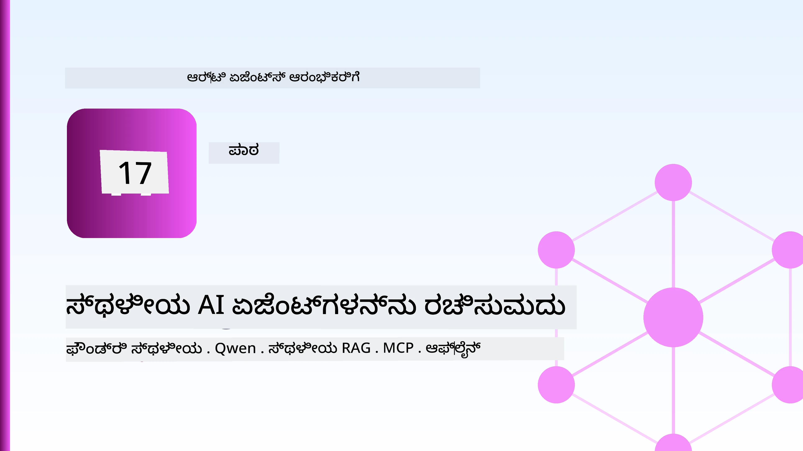
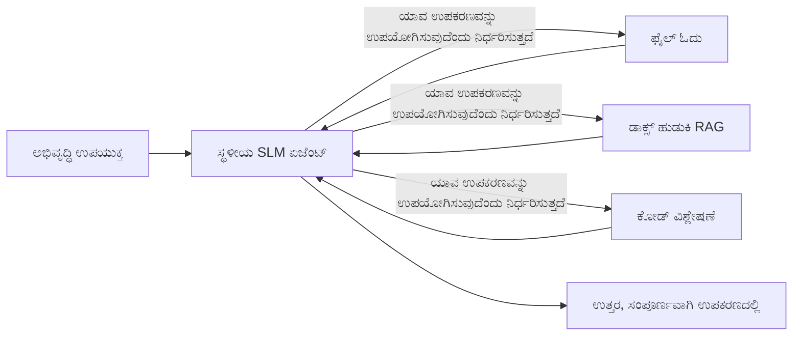
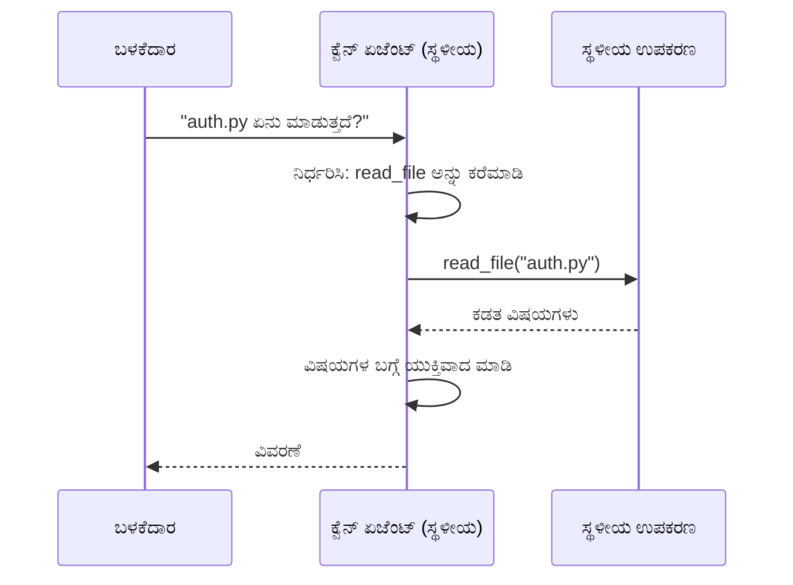
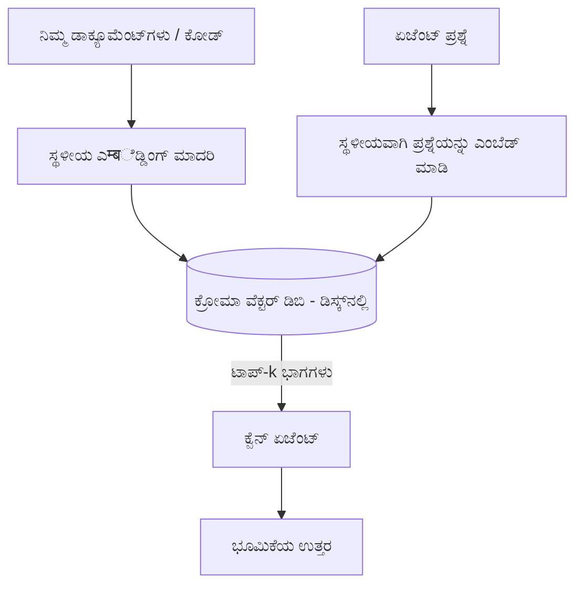
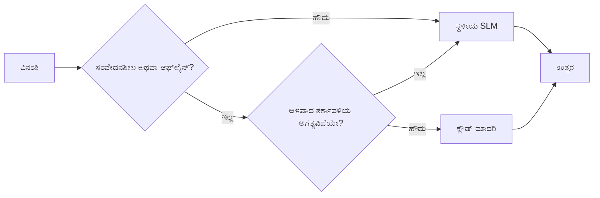

# ಮೈಕ್ರೋಸಾಫ್ಟ್ ಫೌಂಡ್ರಿ ಲೋಕಲ್ ಮತ್ತು ಕ್ವೆನ್ ಬಳಸಿ ಸ್ಥಳೀಯ AI ಏಜೆಂಟುಗಳನ್ನು ರಚಿಸುವುದು



ಹಿಂದಿನ ಪಾಠ ಏಜೆಂಟುಗಳನ್ನು *ಮೇಘ*ದಲ್ಲಿ ವಿಸ್ತರಿಸಿತು. ಇದು ಅವುಗಳನ್ನು *ಒಂದು ಯಂತ್ರದಲ್ಲಿ*ಗೆ ತರುತ್ತದೆ. ಕೊನೆಯಲ್ಲಿ ನೀವು ಕಾರ್ಯನಿರ್ವಹಿಸುವ ಎಂಜಿನಿಯರಿಂಗ್ ಸಹಾಯಕನನ್ನು ಹೊಂದಿರುತ್ತೀರಿ, ಅದು ತರ್ಕಮಾಡುತ್ತದೆ, ಉಪಕರಣಗಳನ್ನು ಕರೆಸುತ್ತದೆ, ನಿಮ್ಮ கோப்பುಗಳನ್ನು ಓದುತ್ತದೆ ಮತ್ತು ನಿಮ್ಮ ಡಾಕ್ಯುಮೆಂಟೇಶನ್ ಅನ್ನು ಹುಡುಕುತ್ತದೆ — **ಏಕೈಕ ಮೇಲ್ಮೈ ಘನಗಣನೆ ಕರೆವಿಲ್ಲದೆ.**

ನೀವು ಅದನ್ನು ಏಕೆ ಬಯಸುತ್ತೀರಿ? ನಿಜವಾದ ಎಂಜಿನಿಯರಿಂಗ್ ಕೆಲಸದಲ್ಲಿ ಮೂರು ಕಾರಣಗಳು ನಿರಂತರವಾಗಿ ಬರುತ್ತವೆ:

- **ಗೌಪ್ಯತೆ.** ನಿರೀಕ್ಷೆ ಮಾತ್ರ ಕಡತಗಳು ಮತ್ತು ಡಾಕ್ಯುಮೆಂಟ್ ಗಳಿಗೆ ಯಂತ್ರವನ್ನು ಬಿಟ್ಟು ಹೊರ ಹೋಗುವುದಿಲ್ಲ. ಯಾವುದೇ ಪ್ರಾಂಪ್ಟ್, ಯಾವುದೇ ತುಣುಕು, ಯಾವುದೇ ಗ್ರಾಹಕ ಮಾಹಿತಿಯು ನೆಟ್ವರ್ಕ್ ಬೌಂಡರಿಯನ್ನು ದಾಟುವುದಿಲ್ಲ.
- **ಖರ್ಚು.** ಜಾಗತಿಕ ಇನ್ಫರೆನ್ಸ್‌ಗಾಗಿ ಪ್ರತಿ ಟೋಕನ್‌ಗಾಗಿ ಬಿಲ್ ಇಲ್ಲ. ವಿದ್ಯುತ್ ಬೆಲೆಗಾಗಿ ನೀವು ದಿನ ತುಂಬಾ ಪುನರಾವರ್ತಿಸಬಹುದು.
- **ಆನ್‌ಲೈನ್ ಅಲ್ಲದೆ.** ವಿಮಾನದಲ್ಲಿ, ಸುರಕ್ಷಿತ ಸೌಕರ್ಯದಲ್ಲಿ ಅಥವಾ ವಿದ್ಯುತ್ ಬಿಟ್ಟಾಗಲೂ ಏಜೆಂಟ್ ಕಾರ್ಯನಿರ್ವಹಿಸುತ್ತದೆ.

ಪೋರಿಕೆಗೆ ನೀವು ನಿಮ್ಮ CPU, GPU, ಅಥವಾ NPU ನಲ್ಲಿ ಚಲಿಸುವ **ಸಣ್ಣ ಭಾಷಾ ಮಾದರಿಯನ್ನು (SLM)** ವಿನಿಮಯ ಮಾಡಿಕೊಳ್ಳುತ್ತಿದ್ದೀರಿ. ಈ ಪಾಠವು ಆ ನಿಯಂತ್ರಣಕ್ಕೆ ಒಳಪಟ್ಟಿರುವ ಉತ್ತಮ ಏಜೆಂಟುಗಳನ್ನು ನಿರ್ಮಿಸುವ ಬಗ್ಗೆ ಅದೃಷ್ಟವಂತವಾಗಿದೆ, ನಿಯಂತ್ರಣವಿಲ್ಲದಂತೆ ನಟಿಸುವುದಿಲ್ಲ.

## ಪರಿಚಯ

ಈ ಪಾಠವು ಒಳಗೊಂಡಿರುವುದು:

- **ಸಣ್ಣ ಭಾಷಾ ಮಾದರಿಗಳು (SLMs)** — ಅವು ಏನೆಂದು, ಅವು ಎಲ್ಲೆಡೆ ಚೆನ್ನಾಗಿವೆ, ಮತ್ತು ಎಲ್ಲೆಡೆ ಇಲ್ಲ.
- **ಮೈಕ್ರೋಸಾಫ್ಟ್ ಫೌಂಡ್ರಿ ಲೋಕಲ್** — ಸಾಧನದಲ್ಲಿ ಮಾದರಿಗಳನ್ನು ಡೌನ್‌ಲೋಡ್ ಮಾಡಿ ಸೇವಿಸುವ ರನ್ಟೈಮ್, **OpenAI-ಸಮಾನುಕೂಲ API** ಮೂಲಕ.
- **ಕ್ವೆನ್ ಫಂಕ್ಷನ್-ಕಾಲಿಂಗ್ ಮಾದರಿಗಳು** — SLMಗಳು, ಇವು ಸಾಧನಗಳನ್ನು ನಿರಂತರವಾಗಿ ಕಾಲ್ ಮಾಡುತ್ತವೆ, ಇದು ಸ್ಥಳೀಯ *ಏಜೆಂಟ್‌ಗಳು* (ಮಾತ್ರ ಸ್ಥಳೀಯ ಚಾಟ್ ಅಲ್ಲ) ಸಾಧ್ಯವಾಗಿಸುತ್ತದೆ.
- **ಸ್ಥಳೀಯ ಉಪಕರಣಗಳು, ಸ್ಥಳೀಯ RAG, ಮತ್ತು ಸ್ಥಳೀಯ MCP** — ಮೇಘವಿಲ್ಲದೆ ಏಜೆಂಟ್ ಸಾಮರ್ಥ್ಯವನ್ನು ನೀಡುತ್ತದೆ.
- **ಹೈಬ್ರಿಡ್ ಮಾದರಿಗಳು** — ಯಾವಾಗ ಸ್ಥಳೀಯವಾಗಿ ಇರಬೇಕೆಂಬುದು ಮತ್ತು ಯಾವಾಗ ಮೇಘಕ್ಕೆ ತಲುಪಬೇಕೆಂಬುದು.

## ಕಲಿಕಾ ಗುರಿಗಳು

ಈ ಪಾಠವನ್ನು ಮುಗಿಸಿದ ನಂತರ, ನೀವು ತಿಳಿದುಕೊಳ್ಳುವಿರಿ:

- SLMಗಳ ವಾಣಿ-ನಿಮ್ಮ ಸ್ಥಳೀಯ ಏಜೆಂಟ್ ಬಳಕೆ ಪ್ರಕರಣಗಳನ್ನು ವಿವರಿಸಿ.
- ಫೌಂಡ್ರಿ ಲೋಕಲ್ ಮೂಲಕ ಸ್ಥಳೀಯವಾಗಿ ಕ್ವೆನ್ ಮಾದರಿಯನ್ನು ಸೇವಿಸಿ ಮತ್ತು OpenAI-ಸಮಾನುಕೂಲ ಎಂಡ್‌ಪಾಯಿಂಟ್‌ಗೆ ಸಂಪರ್ಕ ಸಾಧಿಸಿ.
- ಸಂಪೂರ್ಣವಾಗಿ ನಿಮ್ಮ ವರ್ಕ್‌ಸ್ಟೇಶನ್‌ನಲ್ಲಿ ಓಡಿಸುವ ಉಪಕರಣ-ಕಾಲಿಂಗ್ ಏಜೆಂಟ್ ನಿರ್ಮಿಸಿ.
- ನಿಮ್ಮ ಡಾಕ್ಯುಮೆಂಟುಗಳ ಮೇಲೆ ಸ್ಥಳೀಯ RAG ಅನ್ನು ಸ್ಥಳೀಯ ವೆಕ್ಟರ್ ಡೇಟಾಬೇಸ್ (ಕ್ರೋಮಾ) ಉಪಯೋಗಿಸಿ ಸೇರಿಸಿ.
- ಏಜೆಂಟ್ ಅನ್ನು ಸ್ಥಳೀಯ MCP ಸರ್ವರ್‌ಗೆ ಸಂಪರ್ಕಿಸಿ ಹಾಗೂ ಹೈಬ್ರಿಡ್ ಸ್ಥಳೀಯ/ಮೇಘ ವಿನ್ಯಾಸಗಳ ಬಗ್ಗೆ ತರ್ಕಮಾಡಿ.

## ಪೂರ್ವಾಪೇಕ್ಷಿತಗಳು

ಈ ಪಾಠವು ಹಿಂದಿನ ಪಾಠಗಳನ್ನು ಪೂರೈಸಿದ್ದೀರಿ ಮತ್ತು ಕೆಳಗಿನ ವಿಷಯಗಳಲ್ಲಿ ಆರಾಮವಾಗಿರುವಿರಿ ಎಂದು ಊಹಿಸುತ್ತದೆ:

- [ಉಪಕರಣ ಬಳಕೆ](../04-tool-use/README.md) (ಪಾಠ 4) ಮತ್ತು [ಏಜೆಂಟಿಕ್ RAG](../05-agentic-rag/README.md) (ಪಾಠ 5).
- [ಏಜೆಂಟಿಕ್ ಪ್ರೋಟೋಕಾಲ್ಸ್ / MCP](../11-agentic-protocols/README.md) (ಪಾಠ 11).
- [ಮೈಕ್ರೋಸಾಫ್ಟ್ ಏಜೆಂಟ್ ಫ್ರೇಮ್ವರ್ಕ್](../14-microsoft-agent-framework/README.md) (ಪಾಠ 14).

ನೀವು ಇಲ್ಲಿನ ಬ್ಯಾಂಕಿಸಿ ಬೇಕಾಗುತ್ತದೆ:

- ಡೆವಲಪರ್ ವರ್ಕ್‌ಸ್ಟೇಶನ್. **8 GB RAM ಕನಿಷ್ಠ ವಾಸ್ತವವಾದದು**; 16 GB+ ಆರಾಮದಾಯಕ. GPU ಅಥವಾ NPU ಸಹಾಯ ಮಾಡುವುದಾದರೂ ಅವಶ್ಯಕ ಇಲ್ಲ.
- **ಮೈಕ್ರೋಸಾಫ್ಟ್ ಫೌಂಡ್ರಿ ಲೋಕಲ್** ಸ್ಥಾಪಿತ (ಕೆಳಗಿನ ಸೆಟಪ್ ವಿಭಾಗ ನೋಡಿ).
- Python 3.12+ ಮತ್ತು ರೆಪೊದಲ್ಲಿ ಇರುವ ಪ್ಯಾಕೇಜುಗಳು [`requirements.txt`](../../../requirements.txt), ಜೊತೆಗೆ `foundry-local-sdk`, `openai`, ಮತ್ತು `chromadb` ಈ ಪಾಠಕ್ಕಾಗಿ.

## ಸಣ್ಣ ಭಾಷಾ ಮಾದರಿಗಳು: ಸ್ಥಳೀಯ ಕಾರ್ಯಕ್ಕಾಗಿ ಸರಿಯಾದ ಉಪಕರಣ

ಫ್ರಂಟಿಯರ್ ಮೇಘ ಮಾದರಿಯು ನೂರಾರು ಬಿಲಿಯನ್ ಪರಿಚಯಿಕೆಗಳಿವೆ ಮತ್ತು ಡೇಟಾ ಕೇಂದ್ರ ಇದೆ. SLM ಕೆಳಗಾಗಿ ಕೆಲ ಬಿಲಿಯನ್ ಪರಿಚಯಿಕೆಗಳಿವೆ ಮತ್ತು ನಿಮ್ಮ ಲ್ಯಾಪ್‌ಟಾಪ್‌ನ RAM ಗೆ ಹೊಂದಿಕೊಳ್ಳಬೇಕು. ಈ ವ್ಯತ್ಯಾಸ ಸ್ಪಷ್ಟ ನಿರೀಕ್ಷೆಗಳನ್ನು ಹೊಂದಿಸುತ್ತದೆ.

**SLMಗಳು ಚೆನ್ನಾಗಿರುವುದರಲ್ಲಿ:**

- ರಚನಾತ್ಮಕ, ನಿಯತ ಕಾರ್ಯಗಳು — ವರ್ಗೀಕರಣ, ಹೊರತೆಗೆಯುವುದು, ತಿಳಿದಿರುವ ಡಾಕ್ಯುಮೆಂಟ್ ಅನ್ನು ಸಾರಾಂಶಗೊಳಿಸುವುದು.
- **ಉಪಕರಣ ಕಾಲಿಂಗ್** — ಯಾವ ಕಾರ್ಯವನ್ನು ಯಾವ ಅರ್ಗ್ಯೂಮೆಂಟ್ಗಳು ಜೊತೆಗೆ ಕರೆಸಬೇಕೆಂದು ನಿರ್ಧರಿಸುವುದು.
- ನಿಮ್ಮ ಸ್ವಂತ ಡೇಟಾದ ಮೇಲೆ ವೇಗವಾದ, ಕಡಿಮೆ ವೆಚ್ಚದ, ಖಾಸಗಿ ಪುನರಾವರ್ತನೆ.

**SLMಗಳು ದುರ್ಬಲವಾಗಿರುವುದರಲ್ಲಿ:**

- ವಿಶಾಲವಾದ, ಬಹು ಹಂತದ ತರ್ಕ.
- ವ್ಯಾಪಕ ಜ್ಞಾನ (ಅವರು ಕಡಿಮೆ ನೋಡಿದ್ದಾರೆ ಮತ್ತು ಹೆಚ್ಚುಮರೆತುಬಿಡುತ್ತಾರೆ).

ಸ್ಥಳೀಯ ಏಜೆಂಟ್‌ಗಳಿಗೆ ಗೆಲುವಿನ ತಂತ್ರವು: **SLM ನೇತೃತ್ವ ಹಾಗೂ ಉಪಕರಣಗಳು ಗಂಭೀರ ಕೆಲಸ ಮಾಡಲಿ.** ಮಾದರಿ ನಿಮ್ಮ ಕೋಡ್‌ಬೇಸ್ ಅನ್ನು *ತಿಳಿದುಕೊಳ್ಳಬೇಕಾಗಿಲ್ಲ* — ಅದು `read_file` ಮತ್ತು `search_docs` ಜನಿಸಿದಾಗ ತಿಳಿಯಬೇಕು. ಇದು SLMಗಳ ಶಕ್ತಿಯ ಮೇಲೆ ನೇರವಾಗಿ ಆಡುತ್ತದೆ.



## ಮೈಕ್ರೋಸಾಫ್ಟ್ ಫೌಂಡ್ರಿ ಲೋಕಲ್

**ಮೈಕ್ರೋಸಾಫ್ಟ್ ಫೌಂಡ್ರಿ ಲೋಕಲ್** ಒಂದು ತೂಕ ಕಡಿಮೆ ರನ್ಟೈಮ್ ಆಗಿದ್ದು, ಸಂಪೂರ್ಣವಾಗಿ ನಿಮ್ಮ ಯಂತ್ರದಲ್ಲಿ ಮಾದರಿಗಳನ್ನು ಡೌನ್‌ಲೋಡ್ ಮಾಡಿ ನಿರ್ವಹಿಸಿ ಸೇವೆ ಮಾಡುತ್ತದೆ. ನಮಗೆ ಮುಖ್ಯವಾದುದು ಅದು **OpenAI-ಸಮಾನುಕೂಲ HTTP ಎಂಡ್‌ಪಾಯಿಂಟ್** ಅನ್ನು ಎಕ್ಸ್‌ಪೋಸ್ ಮಾಡುತ್ತದೆ — ಇದರಿಂದ OpenAI SDK ಮತ್ತು ಮೈಕ್ರೋಸಾಫ್ಟ್ ಏಜೆಂಟ್ ಫ್ರೇಮ್ವರ್ಕ್‌ನ OpenAI ಕ್ಲೈಂಟ್ ಅದಕ್ಕೆ `base_url` ಬದಲಿಸುವ ಮೂಲಕ ಮಾತ್ರ ಕೆಲಸ ಮಾಡುತ್ತವೆ. ಏಜೆಂಟ್ ನಿರ್ಮಿಸುವುದರ ಎಲ್ಲವೂ ನೇರವಾಗಿ ವರ್ಗಾಯಿಸುತ್ತದೆ; ಕೇವಲ ಎಂಡ್‌ಪಾಯಿಂಟ್ ಮೇಘದಿಂದ `localhost` ಗೆ ಬದಲಾಯುತ್ತದೆ.

ಫೌಂಡ್ರಿ ಲೋಕಲ್ ನಿಮ್ಮ ಹಾರ್ಡ್‌ವೇರ್‌ಗೆ ಒಳ್ಳೆಯ ಮಾದರಿಯ ನಿರ್ಮಾಣವನ್ನು ಆತ್ಮವಾಗಿ ಆರಿಸುತ್ತದೆ — CPU ಕಟ್ಟಡು, CUDA/GPU ಕಟ್ಟಡು, ಅಥವಾ NPU ಕಟ್ಟಡು — ಆದ್ದರಿಂದ ನೀವು ಪ್ರತಿಯೊಂದು ಯಂತ್ರಕ್ಕೆ ಆಪ್ಟಿಮೈಸ್ ಮಾಡಬೇಕಾಗಿಲ್ಲ.

### ಸೆಟಪ್

ಫೌಂಡ್ರಿ ಲೋಕಲ್ ಅನ್ನು ಇನ್ಸ್ಟಾಲ್ ಮಾಡಿ (ನಿಮ್ಮ OS ಗೆ [ಡಾಕ್ಯುಮೆಂಟ್](https://learn.microsoft.com/azure/ai-foundry/foundry-local/) ನೋಡಿ), ನಂತರ ಅದು ಕೆಲಸ ಮಾಡುವುದನ್ನು ದೃಢೀಕರಿಸಿ:

```bash
# ಇನ್‌ಸ್ಟಾಲ್ ಮಾಡಿ (ಉದಾಹರಣೆ; ನಿಮ್ಮ ಪ್ಲಾಟ್‌ಫಾರ್ಮ್‌ಗೆ ಡಾಕ್ಯುಮೆಂಟ್‌ಗಳನ್ನು ಅನುಸರಿಸಿ)
winget install Microsoft.FoundryLocal      # ವಿಂಡೋಸ್
# brew install microsoft/foundrylocal/foundrylocal   # macOS

# Qwen ಮಾದರಿಯನ್ನು ಡೌನ್‌ಲೋಡ್ ಮಾಡಿ ಓಡಿಸಿ, ನಂತರ ಸ್ಥಳೀಯ ಸೇವೆಯನ್ನು ಪ್ರಾರಂಭಿಸಿ
foundry model run qwen2.5-7b-instruct
foundry service status
```

ಸೇವೆ ಓಡುತ್ತಿರುವಾಗ ನಿಮಗೆ ಸ್ಥಳೀಯ, OpenAI-ಸಮಾನುಕೂಲ ಎಂಡ್‌ಪಾಯಿಂಟ್ (ಸಾಮಾನ್ಯವಾಗಿ `http://localhost:PORT/v1`) ಸಿಗುತ್ತದೆ. ನೋಟ್ಬುಕ್ `foundry-local-sdk` ಬಳಸಿಕೊಂಡು ಎಂಡ್‌ಪಾಯಿಂಟ್ ಅನ್ನು ಸ್ವಯಂಚಾಲಿತವಾಗಿ ಹುಡುಕುತ್ತದೆ, ಆದ್ದರಿಂದ ನೀವು ಪೋರ್ಟ್ ಅನ್ನು ಹಾರ್ಡ್-ಕೋಡ್ ಮಾಡಬೇಕಾಗುವುದಿಲ್ಲ.

## ಕ್ವೆನ್ ಫಂಕ್ಷನ್ ಕಾಲಿಂಗ್: ಅದು ಯಾಕೆ ಪ್ರಮುಖ

ಏಜೆಂಟ್ ಎಂದರೆ ಅದು ಉಪಕರಣಗಳನ್ನು ಕರೆಸಬೇಕಾಗುತ್ತದೆ. ಬಹುತೇಕ SLMಗಳು ಚಾಟ್ ಮಾಡಬಹುದು ಆದರೆ ಅವಿಶ್ವಾಸಾರ್ಹ, ಅಸ್ವರೂಪಿತ ಉಪಕರಣ ಕಾಲ್‌ಗಳನ್ನು ಉತ್ಪಾದಿಸುತ್ತವೆ. **ಕ್ವೆನ್** ಮಾದರಿಗಳು ಫಂಕ್ಷನ್ ಕಾಲಿಂಗ್ ತರಬೇತಿ ಪಡೆದಿವೆ ಮತ್ತು ಸದೃಢ, ಸರಿಯಾದ ಉಪಕರಣ-ಕಾಲ್ ರಚನೆಯನ್ನು ಕ್ರಮವಾಗಿ ನೀಡುತ್ತವೆ — ಇದೇ ಸ್ಥಳೀಯ ಚಾಟ್ ಮಾದರಿಯನ್ನು ಸ್ಥಳೀಯ *ಏಜೆಂಟ್* ಆಗಿ ಮಾಡುತ್ತದೆ.

ಅನುಸ್ಥಾನವು ನೀವು ತಿಳಿದಿರುವ ಸೂಪರ್ ಉಪಕರಣ-ಕಾಲಿಂಗ್ ಲೂಪ್, ಕೇವಲ ಸಾಧನದಲ್ಲಿ ಓಡುತ್ತಿದೆ:



## ಸ್ಥಳೀಯ RAG

ಡಾಕ್ಯುಮೆಂಟೇಶನ್ ಹುಡುಕಾಟದಲ್ಲಿ ಸ್ಥಳೀಯ ಏಜೆಂಟ್‌ಗಳು ತಮ್ಮ ಅರ್ಥವನ್ನು ಖರಿದಿಕೊಳ್ಳುತ್ತವೆ. SLM ನಿಮ್ಮ ಫ್ರೇಮ್ವರ್ಕ್ ಡಾಕ್ಸ್ ನೆನಸಿಕೊಂಡಾಗ ತಿಳಿದುಕೊಳ್ಳುವುದನ್ನು ಬದಲಾಗಿ, ನೀವು ಆ ಡಾಕ್ಸ್ ಅನ್ನು **ಸ್ಥಳೀಯ ವೆಕ್ಟರ್ ಡೇಟಾಬೇಸ್** ಗೆ ನುಗ್ಗಿಸಿ, ಏಜೆಂಟ್ ಅದನ್ನು ಬೇಡಿಕೆಯಂತೆ ಪ್ರಾಪ್ತಿಮಾಡುತ್ತದೆ.

ನಾವು **ಕ್ರೋಮಾ** ಬಳಸುತ್ತೇವೆ, ಇದು ಒಂದು ನಂಪ್ರಾಸಾಸಾದ ವೆಕ್ಟರ್ ಸ್ಟೋರ್ ಆಗಿದ್ದು ಯಾವುದೇ ಸರ್ವರ್ ನಿರ್ವಹಣೆ ಇಲ್ಲದೆ ಕ್ರಮದಲ್ಲಿಯೇ ಓಡುತ್ತದೆ. ಪೈಪ್‌ಲಾಗ್ ಸಂಪೂರ್ಣ ಸ್ಥಳೀಯವಾಗಿದೆ: ಸ್ಥಳೀಯ ಎಂಬರ್‌ಡಿಂಗ್ ಮಾದರಿ → ಸ್ಥಳೀಯ ವೆಕ್ಟರ್‌ಗಳು → ಸ್ಥಳೀಯ ರಿಟ್ರிவಲ್ → ಸ್ಥಳೀಯ SLM.



ಇದು ಪಾಠ 5 ರ ಏಜೆಂಟಿಕ್ RAG ಮಾದರಿಯೇ —唯ಬದಲಾವಣೆ ಅವುಗಳ ಪ್ರತಿಯೊಂದು ಘಟಕಗಳು ನಿಮ್ಮ машинеನಲ್ಲಿ ಓಡುತ್ತಿವೆ.

## ಸ್ಥಳೀಯ MCP ಸರ್ವರ್‌ಗಳು

[MCP](../11-agentic-protocols/README.md) ಒಂದು ಸಾರಿಗೆ ವ್ಯವಸ್ಥೆ, ಮೇಘ ಸೇವೆ ಅಲ್ಲ. MCP ಸರ್ವರ್ ಸ್ಥಳೀಯ ಪ್ರಕ್ರಿಯೆಯಾಗಿ `stdio` ಯಲ್ಲಿ ಓಡಬಹುದು, ವಿಧಾನಾಲಯದ ಪ್ರೋಟೋಕಾಲ್ ಮೂಲಕ ಏಜೆಂಟ್‌ಗೆ ಉಪಕರಣಗಳನ್ನು ಪ್ರದರ್ಶಿಸುತ್ತದೆ. ಇದರಿಂದ ನೀವು MCP ಸರ್ವರ್‌ಗಳ ಬೆಳವಣಿಗೆ ಪರಿಸರವನ್ನು ಪುನಃ ಬಳಕೆ ಮಾಡಬಹುದು — ಫೈಲ್‌ಸಿಸ್ಟಂ ಪ್ರವೇಶ, ಗಿಟ್ ಕಾರ್ಯಾಚರಣೆ, ಡೇಟಾಬೇಸ್ ವಿಚಾರಣೆಗಳೆಲ್ಲಾ — ಸಂಪೂರ್ಣ ಆಫ್‌ಲೈನ್.

ಸುರಕ್ಷತಾ ದೃಷ್ಟಿಕೋನವು ಮೇಘದಿಂದ ವಿಭಿನ್ನವಾಗಿರುತ್ತದೆ, ಆದರೆ ಇಲ್ಲದಿರುವುದಿಲ್ಲ: ಸ್ಥಳೀಯ MCP ಸರ್ವರ್ ನಿಮ್ಮ ಬಳಕೆದಾರರ ಅನುಮತಿಗಳೊಂದಿಗೆ ಚಲಿಸುತ್ತದೆ, ಆದ್ದರಿಂದ ಅದು ಸ್ಪರ್ಶಿಸಬಹುದಾದವನ್ನೂ ನಿರ್ಬಂಧಿಸಿ (ಒಂದು ಯೋಜನೆಯ ಡೈರೆಕ್ಟರಿ, ನಿಮ್ಮ ಸಂಪೂರ್ಣ ಹೋಮ್ ಫೋಲ್ಡರ್ ಅಲ್ಲ) ಮತ್ತು ಅದರ ಉತ್ಪನ್ನಗಳನ್ನು ಪರಿಶೀಲಿಸಲು ಇನ್‌ಪುಟ್ ಎಂದು ಭಾಗಿ.

## ಹೈಬ್ರಿಡ್ ಮೇಘ-ಮತ್ತು-ಸ್ಥಳೀಯ ಮಾದರಿಗಳು

ಸ್ಥಳೀಯ-ಮೊದಲನೇ ಎಂಬುದು ಸ್ಥಳೀಯ ಮಾತ್ರವಲ್ಲ. ನಿಪುಣ ವ್ಯವಸ್ಥೆಗಳು ಸಂವೇದನಶೀಲತೆ ಮತ್ತು ಕಷ್ಟತೆ ಮೇಲೆ ಮಾರ್ಗನಿರ್ದೇಶನ ಮಾಡುತ್ತವೆ:

| ಪರಿಸ್ಥಿತಿ | ಎಲ್ಲಿ ನಡೆಯುತ್ತದೆ |
| --- | --- |
| ಸಂವೇದನಶೀಲ ಕೋಡ್ / ಡೇಟಾ, ಅಥವಾ ಆಫ್‌ಲೈನ್ | **ಸ್ಥಳೀಯ SLM** |
| ಸರಳ, ನಿಯತ ಕಾರ್ಯ | **ಸ್ಥಳೀಯ SLM** (ಅಗ್ಗ, ವೇಗವಂತ) |
| ಕಠಿಣ ಬಹು ಹಂತ ತರ್ಕವು ಆಫ್-ಲೇವು ಡೇಟಾದ ಮೇಲೆ | **ಮೇಘ ಮಾದರಿ** |
| ಎಲ್ಲವೂ, ವಿದ್ಯುತ್ ಕಡಿತ ಸಮಯದಲ್ಲಿ | **ಸ್ಥಳೀಯ SLM** (ಸರಳ ಕುಸಿತ) |

ಇದು ಪಾಠ 16 ರ **ಮಾದರಿ ಮಾರ್ಗನಿರ್ದೇಶನ** ಕಲ್ಪನೆ ಬಳಸುತ್ತದೆ — ಆದರೆ ಒಂದು "ಮಾದರಿ" ಈಗ ನಿಮ್ಮ ಸ್ವಂತ ಯಂತ್ರವಾಗಿದೆ. ವಿಶ್ವಾಸಾರ್ಹ ವಿನ್ಯಾಸ ಮೇಘ ಲಭ್ಯವಿಲ್ಲದಾಗ ಸ್ಥಳೀಯಕ್ಕೆ ಹಿಂತಿರುಗುತ್ತದೆ, ಆದ್ದರಿಂದ ಏಜೆಂಟ್ ರುಜುವಾತು ಇಲ್ಲದೆ ಗುಣಾತ್ಮಕ ಕುಸಿತವನ್ನು ಅನುಭವಿಸುತ್ತದೆ.



## ಪ್ರಾಯೋಗಿಕ ಪ್ರಯೋಗಾಲಯ: ಸ್ಥಳೀಯ ಎಂಜಿನಿಯರಿಂಗ್ ಸಹಾಯಕ

[ `code_samples/17-local-agent-foundry-local.ipynb`](./code_samples/17-local-agent-foundry-local.ipynb) ತೆರೆದು ಇದರಲ್ಲಿ ಕೆಲಸ ಮಾಡಿ. ನೀವು ಸಂಪೂರ್ಣವಾಗಿ ನಿಮ್ಮ ವರ್ಕ್‌ಸ್ಟೇಶನ್‌ನಲ್ಲಿ ಓಡುವ **ಸ್ಥಳೀಯ ಎಂಜಿನಿಯರಿಂಗ್ ಸಹಾಯಕನನ್ನು** ನಿರ್ಮಿಸುವಿರಿ, ಅದು:

1. **ಉಪಕರಣಗಳನ್ನು ಕರೆಸುತ್ತದೆ** — ಫೌಂಡ್ರಿ ಲೋಕಲ್ ಮೂಲಕ ಕ್ವೆನ್ ಫಂಕ್ಷನ್ ಕಾಲಿಂಗ್ ಮೂಲಕ.
2. **ಸ್ಥಳೀಯ ಫೈಲ್ ಕಾರ್ಯಾಚರಣೆಗಳನ್ನು ನಡೆಸುತ್ತದೆ** — ಯೋಜನೆ ಡೈರೆಕ್ಟರಿಯಲ್ಲಿನ ಫೈಲ್ಗಳನ್ನು ಪಟ್ಟಿ ಹಾಗೂ ಓದುವಿಕೆ.
3. **ಕೋಡ್ ವಿಶ್ಲೇಷಣೆ ಮಾಡುತ್ತದೆ** — ಮೂಲ ಫೈಲ್ ಮೇಲೆ ಮೂಲಭೂತ ಅಂಕಿ-ಅಂಶಗಳನ್ನು ವರದಿ ಮಾಡುವುದು.
4. **ಡಾಕ್ಯುಮೆಂಟೇಶನ್ ಹುಡುಕುತ್ತದೆ** — ಕ್ರೋಮಾ ಬಳಸಿ ಡಾಕ್ಸ್ ಫೋಲ್ಡರ್ ಮೇಲೆ ಸ್ಥಳೀಯ RAG.
5. **MCP ಬಳಸುತ್ತದೆ** — ಸ್ಥಳೀಯ MCP ಸರ್ವರ್‌ಗೆ ಸಂಪರ್ಕ (ಯಾವುದೇದರಿಲ್ಲದಿದ್ದರೂ ಮರುಕಳಿಸುವ ಮುಕ್ತಾಯ ಸಹಿತ).

ಯಾವ ಮೇಘ ಇನ್ಫರೆನ್ಸ್‌ನ್ನೂ ಬಳಸುವುದಿಲ್ಲ.

### ನಿರ್ವಹಣೆ

ಸಹಾಯಕ ಫೌಂಡ್ರಿ ಲೋಕಲ್ ಮೂಲಕ OpenAI-ಸಮಾನುಕೂಲ ಎಂಡ್‌ಪಾಯಿಂಟ್‌ಗೆ ಸಂಪರ್ಕ ಹೊಂದುತ್ತದೆ, ಆದ್ದರಿಂದ ಏಜೆಂಟ್ ಕೋಡ್ ಮೇಘ ಪಾಠಗಳಿಗೆ ತುಂಬಾ ಸಮಾನವಾಗಿದೆ — ಕೇವಲ ಕ್ಲೈಂಟ್ ಬದಲಾವಣೆ:

```python
from foundry_local import FoundryLocalManager
from openai import OpenAI

# ಫೌಂಡ್ರಿ ಲೊಕಲ್ ಮಾದರಿಯನ್ನು ಕಂಡುಹಿಡಿದು/ಡೌನ್‌ಲೋಡ್ ಮಾಡಿ ನಮ್ಮಿಗೆ ಸ್ಥಳೀಯ ಅಂತಿಮ ಬಿಂದುವನ್ನು ನೀಡುತ್ತದೆ.
manager = FoundryLocalManager(\"qwen2.5-7b-instruct\")
client = OpenAI(base_url=manager.endpoint, api_key=manager.api_key)  # api_key ಒಂದು ಸ್ಥಳೀಯ ತಾತ್ಕാലಿಕ ಚಿಹ್ನೆ
```

ಉಪಕರಣಗಳು ಸಾಮಾನ್ಯ Python ಕಾರ್ಯಗಳಾಗಿವೆ ಮತ್ತು ಯೋಜನೆ ಡೈರೆಕ್ಟರಿಗೆ ಸೀಮಿತವಾಗಿವೆ:

```python
def read_file(path: str) -> str:
    \"\"\"Read a file, but only inside the sandboxed project directory.\"\"\"
    full = (PROJECT_ROOT / path).resolve()
    if PROJECT_ROOT not in full.parents and full != PROJECT_ROOT:
        return \"Access denied: path is outside the project directory.\"
    return full.read_text(encoding=\"utf-8\")
```

ಸ್ಯಾಂಡ್‌ಬಾಕ್ಸ್ ಪರಿಶೀಲನೆಯನ್ನು ಗಮನಿಸಿ — ಸ್ಥಳೀಯವಾಗಿಯೇ ಆದರೆ, ಯಾರಾದರೂ ಬೇರೆ ಮಾರ್ಗಗಳನ್ನು ಓದುವ ಉಪಕರಣ ಜವಾಬ್ದಾರಿಯಾಗಿದೆ. ನೋಟ್ಬುಕ್ ದೇಶರ ಪ್ರತಿ ಉಪಕರಣವನ್ನೂ ಒಂದೇ ಯೋಜನ ಮೂಲಕ್ಕಾಗಿಯೇ ಸೀಮಿತಗೊಳಿಸುತ್ತದೆ.

## ಜ್ಞಾನ ಪರಿಶೀಲನೆ

ನಿಯೋಜನೆಗೆ ಹೋಗುವ ಮೊದಲು ನಿಮ್ಮ ತಿಳುವಳಿಕೆಯನ್ನು ಪರೀಕ್ಷಿಸಿ.

**1. ಏಜೆಂಟ್ ಅನ್ನು ಸ್ಥಳೀಯವಾಗಿ ಓಡಿಸಲು ಯಾರಾದರೂ ಎರಡು ಸ್ಪಷ್ಟ ಕಾರಣಗಳನ್ನು ನೀಡಿ.**

<details>
<summary>ಉತ್ತರ</summary>

ಯಾವುದೇ ಎರಡು: **ಗೌಪ್ಯತೆ** (ಕೋಡ್ ಮತ್ತು ಡೇಟಾ ಯಂತ್ರವನ್ನು ಬಿಡುವುದಿಲ್ಲ), **ಖರ್ಚು** (ಪ್ರತಿ ಟೋಕನ್ ಇನ್ಫರೆನ್ಸ್ ಬಿಲ್ ಇಲ್ಲ), ಮತ್ತು **ಆಫ್‌ಲೈನ್ ಸಾಮರ್ಥ್ಯ** (ನೆಟ್ವರ್ಕ್ ಇಲ್ಲದೆ ಕಾರ್ಯನಿರ್ವಹಿಸುತ್ತದೆ — ವಿಮಾನದಲ್ಲಿ, ಸುರಕ್ಷಿತ ಸೌಲಭ್ಯದಲ್ಲಿ ಅಥವಾ ವಿದ್ಯುತ್ ಕಡಿತದಲ್ಲಿ). ನಿಯಂತ್ರಣ/ಅನುಪಾಲನಾ ಬಡ್ಡಿಗಳು ಡೇಟಾ ಗಳನ್ನು ಸಾಧನದಿಂದ ಹೊರಗೆ ಕಳುಹಿಸುವುದನ್ನು ನಿಷೇಧಿಸುತ್ತವೆ, ಮತ್ತು ಇದು ಗೌಪ್ಯತೆ ಕಾರಣವನ್ನು ಆಹ್ವಾನಿಸುತ್ತದೆ.
</details>

**2. ಸ್ಥಳೀಯ ಏಜೆಂಟ್‌ನಲ್ಲಿ SLM ಮತ್ತು ಅದರ ಉಪಕರಣಗಳ ನಡುವಿನ ಶಿಫಾರಸು ചെയ്തത് ಯಾವ ಕೆಲಸ ಹಂಚಿಕೆಯಾಗಿದ್ದು, ಯಾಕೆ?**

<details>
<summary>ಉತ್ತರ</summary>

SLM ಗಳಿಗೆ **ನಿರ್ದೇಶಿಸಲು** ಪದವಿ ನೀಡಿ (ಯಾವ ಉಪಕರಣವನ್ನು ಕರೆಸಬೇಕೆಂದು ನಿರ್ಧರಿಸುವುದು) ಮತ್ತು **ಉಪಕರಣಗಳು ಗಂಭೀರ ಕೆಲಸ ಮಾಡಲಿ** (ಕಡತಗಳನ್ನು ಓದುವುದು, ಡಾಕ್ಯುಮೆಂಟ್‌ಗಳನ್ನು ತೆಗೆದುಕೊಳ್ಳುವುದು, ಫಲಿತಾಂಶಗಳನ್ನು ಲೆಕ್ಕಹಾಕುವುದು). SLMಗಳು ಅಧಿಸೂಚನೆಗಳ ಆಯ್ಕೆಗೆ ಶಕ್ತಿಶಾಲಿ ಆದರೆ ವ್ಯಾಪಕ ಜ್ಞಾನ ಮತ್ತು ಬಹು ಹಂತ ತರ್ಕದಲ್ಲಿ ದುರ್ಬಲ; ಆದ್ದರಿಂದ ಉಪಕರಣಗಳ ಮೇಲೆ ಅವಲಂಬನೆ ಅವರ ಶಕ್ತಿಗೆ ಅನುಗುಣ.
</details>

**3. Foundry Local ಜೊತೆಗೆ ಮೇಘ ಏಜೆಂಟ್ ಕೋಡ್ ಪುನಃಬಳಕೆಗೆ ಏನನ್ನು ಸಾಧ್ಯಮಾಡುತ್ತದೆ?**

<details>
<summary>ಉತ್ತರ</summary>

ಫೌಂಡ್ರಿ ಲೋಕಲ್ ಒಂದು **OpenAI-ಸಮಾನುಕೂಲ HTTP ಎಂಡ್‌ಪಾಯಿಂಟ್** ಅನ್ನು ಎಕ್ಸ್‌ಪೋಸ್ ಮಾಡುತ್ತದೆ. OpenAI SDK ಮತ್ತು ಏಜೆಂಟ್ ಫ್ರೇಮ್ವರ್ಕ್‌ನ OpenAI ಕ್ಲೈಂಟ್ `base_url` ಮಾತ್ರ ಬದಲಾಯಿಸುವ ಮೂಲಕ (ಸ್ಥಳೀಯ ಪ್ಲೇಸ್‌ಹೋಲ್ಡರ್ API ಕೀ ಬಳಸಿ) ಅದನ್ನೊಳಗಾಗಿ ಕೆಲಸ ಮಾಡುತ್ತವೆ. ಏಜೆಂಟ್ ಕೋಡಿನ ಉಳಿದ ಭಾಗ ಅವಶ್ಯವೂ ಉಳಿಯುತ್ತದೆ.
</details>

**4. ಯಾಕೆ ನಾವು ಯಾವುದಾದರೂ SLM ಗಿಂತ ಕ್ವೆನ್ ಫಂಕ್ಷನ್-ಕಾಲಿಂಗ್ ಮಾದರಿಯನ್ನು ವಿಶಿಷ್ಟವಾಗಿ ಬಳಕೆಮಾಡುತ್ತೇವೆ?**

<details>
<summary>ಉತ್ತರ</summary>

ಏಕೆಂದರೆ ಏಜೆಂಟ್ ಸ್ಥಿರ, ಸರಿಯಾದ **ಉಪಕರಣ ಕಾಲ್‌ಗಳು** ಉತ್ಪಾದಿಸಬೇಕು. ಬಹುತೇಕ SLMಗಳು ಚಾಟ್ ಮಾಡಬಹುದು ಆದರೆ ದುರ್ಬಲ ಅಥವಾ ಕೈಗರಿ ರೂಪದ ಉಪಕರಣ-ಕಾಲ್ ರಚನೆಗಳನ್ನು ನೀಡಬಹುದು. ಕ್ವೆನ್ ಮಾದರಿಗಳು ಫಂಕ್ಷನ್ ಕಾಲಿಂಗ್ ತರಬೇತಿ ಪಡೆದಿದ್ದು ಸರಿಯಾದ ಉಪಕರಣ ಕಾಲ್‌ಗಳನ್ನು ಉತ್ಪಾದಿಸುತ್ತವೆ, ಇದು ಸ್ಥಳೀಯ ಚಾಟ್ ಮಾದರಿಯನ್ನು ಕಾರ್ಯನಿರ್ವಹಿಸುವ ಸ್ಥಳೀಯ ಏಜೆಂಟ್ ಆಗಿ ಮಾಡುತ್ತದೆ.
</details>

**5. ಸ್ಥಳೀಯ RAG ಪೈಪ್ಲೈನಿನಲ್ಲಿ ಯಾವ ಘಟಕಗಳು ಯಂತ್ರದಲ್ಲಿ ಓಡುತ್ತವೆ?**

<details>
<summary>ಉತ್ತರ</summary>

ಎಲ್ಲಾ: ಎಂಬರ್‌ಡಿಂಗ್ ಮಾದರಿ, ವೆಕ್ಟರ್ ಡೇಟಾಬೇಸ್ (ಕ್ರೋಮಾ, ಡಿಸ್ಕ್ ಮೇಲೆ), ರಿಟ್ರಿವಲ್ ಹಂತ, ಮತ್ತು SLM. ಡಾಕ್ಯುಮೆಂಟುಗಳು ಸ್ಥಳೀಯವಾಗಿ ನುಗ್ಗುವವು, ಸ್ಥಳೀಯವಾಗಿ ಸಂಗ್ರಹಿಸುವುದು, ಸ್ಥಳೀಯವಾಗಿ ಪಡೆಯುವುದನ್ನು — ಯಾವುದೇ ಘಟಕ ಮೇಘವನ್ನು ಸ್ಪರ್ಶಿಸುವುದಿಲ್ಲ.
</details>

**6. ಸ್ಥಳೀಯ MCP ಸರ್ವರ್ ನಿಮ್ಮ ಯಂತ್ರದಲ್ಲಿ ಓಡುತ್ತದೆ. ಅದು ಸ್ವಯಂಚಾಲಿತವಾಗಿಯೇ ಸುರಕ್ಷಿತವೇ? ನೀವು ಇನ್ನೂ ಯಾವ ಜಾಗೃತಿ ತೆಗೆದುಕೊಳ್ಳಬೇಕು?**

<details>
<summary>ಉತ್ತರ</summary>

ಇಲ್ಲ. ಸ್ಥಳೀಯ MCP ಸರ್ವರ್ ನಿಮ್ಮ ಬಳಕೆದಾರರ ಅನುಮತಿಗಳೊಂದಿಗೆ ಓಡುತ್ತದೆ, ಆದ್ದರಿಂದ ಅದು ನೀವು ತಲುಪಬಹುದಾದ ಎಲ್ಲವನ್ನೂ ತಲುಪಬಹುದು. ಅದನ್ನು ಅದರ ಅಗತ್ಯವಿರುವದಕ್ಕೆ ಮಾತ್ರ ಸೀಮಿತಗೊಳಿಸಿ (ಉದಾಹರಣೆಗೆ, ಒಂದು ಯೋಜನೆ ಡೈರೆಕ್ಟರಿ, ನಿಮ್ಮ ಸಂಪೂರ್ಣ ಹೋಮ್ ಫೋಲ್ಡರ್ ಅಲ್ಲ) ಮತ್ತು ಅದರ ಉತ್ಪನ್ನಗಳನ್ನು ಇನ್‌ಪುಟ್‌ಗಳಾಗಿ ಪರಿಗಣಿಸಿ ಕಾರ್ಯಾಚರಣೆ ಮಾಡುವ ಮೊದಲು ಪರಿಶೀಲಿಸಿ.
</details>

**7. ಸ್ಥಳೀಯ ಮಾದರಿಯನ್ನು ಒಳಗೊಂಡಿರುವ ಸೂಕ್ತ ಹೈಬ್ರಿಡ್ ಮಾರ್ಗನಿರ್ದೇಶನ ನಿಯಮವನ್ನು ವಿವರಿಸಿ.**

<details>
<summary>ಉತ್ತರ</summary>

ಸಂವೇದನಶೀಲ ಅಥವಾ ಆಫ್‌ಲೈನ್ ವಿನಂತಿಗಳನ್ನು ಸ್ಥಳೀಯ SLMಗೆ ಮಾರ್ಗ ನಿಡಿ; ಸರಳ ನಿಯತ ಕಾರ್ಯಗಳನ್ನು ವೇಗ ಮತ್ತು ವೆಚ್ಚಕ್ಕಾಗಿ ಸ್ಥಳೀಯ SLMಗೆ ಮಾರ್ಗ ನಿಡಿ; ಕಠಿಣ ಬಹು ಹಂತ ತರ್ಕ ಆಫ್-ಸಂವೇದನಶೀಲ ಡೇಟಾದ ಮೇಲೆ ಮೇಘ ಮಾದರಿಗೆ ಮಾರ್ಗ ನಿಡಿ; ಮೇಘ ಲಭ್ಯವಿಲ್ಲದಿದ್ದರೆ ಸ್ಥಳೀಯ SLMಗೆ ಹಿಂತಿರುಗಿ ಏಜೆಂಟ್ ಸೌಮ್ಯವಾಗಿ ಕುಸಿತ ಪಡೆಯಲಿ ಬದಲಾಗಿ ನೇರವಾಗಿ ವೈಫಲ್ಯ ಕಂಡುಬರುವುದಿಲ್ಲ. ಇದು ಪಾಠ 16 ರ ಮಾದರಿ ಮಾರ್ಗನಿರ್ದೇಶನ, ಸ್ಥಳೀಯ ಯಂತ್ರವೊಂದು ಮಾದರಿಗಳಲ್ಲಿ ಒಂದರೀತಿಗೆ.
</details>

**8. ಈ ಪಾಠದಲ್ಲಿ ಸ್ಥಳೀಯ ಏಜೆಂಟ್ ಓಡಿಸಲು ವಾಸ್ತವವಾದ ಕನಿಷ್ಠ RAM ಧರೆಯೇನು, ಮತ್ತು ಹೆಚ್ಚಿನ RAM ನಿಮಗೆ ಏನು ಕೊಡುವುದು?**

<details>
<summary>ಉತ್ತರ</summary>

ಸುಮಾರು **8 GB** ವಾಸ್ತವವು ಕನಿಷ್ಠ; 16 GB+ ಆರಾಮದಾಯಕ. ಹೆಚ್ಚು RAM ದೊಡ್ಡ, ಹೆಚ್ಚು ಸಾಮರ್ಥ್ಯಮಯ ಮಾದರಿಗಳನ್ನು ಚಾಲನೆ ಮಾಡಲು ಮತ್ತು ಹೆಚ್ಚು ಸಂಧರ್ಭವನ್ನು ಸ್ಮೃತಿ ಉಳಿಸಲು ಸಹಾಯ ಮಾಡುತ್ತದೆ. GPU ಅಥವಾ NPU ಇನ್ಫರೆನ್ಸ್ ವേഗವನ್ನು ಹೆಚ್ಚಿಸುವಲ್ಲಿ ಸಹಾಯಮಾಡುತ್ತವೆ ಆದರೆ ಅವಶ್ಯಕವಲ್ಲ — ಫೌಂಡ್ರಿ ಲೋಕಲ್ ಯಾವುದೇ ವೇಗವರ್ಧಕ ಇಲ್ಲದಿದ್ದಾಗ CPU ಕಟ್ಟಡವನ್ನು ಆರಿಸುತ್ತದೆ.
</details>

## ನಿಯೋಜನೆ

ನಿಮ್ಮ ಆಯ್ಕೆಯ ಒಂದು ಸಣ್ಣ ಯೋಜನೆಯಿಗೆ **ಸ್ಥಳೀಯ ಡಾಕ್ಯುಮೆಂಟೇಶನ್ ವಿಮರ್ಶಕನಾಗಿ** ಸ್ಥಳೀಯ ಎಂಜಿನಿಯರಿಂಗ್ ಸಹಾಯಕರನ್ನು ವಿಸ್ತರಿಸಿ (ನೀವು ಇಚ್ಛಿಸಿದರೆ ಈ ರೆಪೊದ ಪಾಠ ಫೋಲ್ಡರ್‌ಗ ಬಳಸಿ).

ನಿಮ್ಮ ಸಲ್ಲಿಕೆ:

1. ಕ್ರೋಮಾದಲ್ಲಿ ಒಂದು ನಿಜವಾದ ಡಾಕ್ಸ್/ಕೋಡ್ ಫೋಲ್ಡರ್ ಅನ್ನು ಸೂಚ್ಯಂಕ ಮಾಡಬೇಕು (ಕನಿಷ್ಠ ಐದು ಫೈಲ್‌ಗಳು).
2. `find_todos` ಉಪಕರಣವನ್ನು ಸೇರಿಸಿ, ಇದು ಯೋಜನೆಯಲ್ಲಿ `TODO`/`FIXME` ಕಾಮೆಂಟ್‌ಗಳನ್ನು ಸ್ಕ್ಯಾನ್ ಮಾಡಿ ಫೈಲ್ ಹಾಗೂ ಸಾಲು ಸಂಖ್ಯೆಯೊಂದಿಗೆ ವಾಪಸು ನೀಡುತ್ತದೆ — `read_file` ನಲ್ಲಿ ಇರುವಂತೆ ಸ್ಯಾಂಡ್‌ಬಾಕ್ಸ್ ಪರಿಶೀಲನೆ ಉಳಿಯಬೇಕು.

3. **ತಂತ್ರಜ್ಞಾನಗಳನ್ನು ಸಂಯೋಜಿಸಲು ಬಲಭರಿತವಾಗಿ ನೌಕರನಿಗೆ ಮೂರು ಪ್ರಶ್ನೆಗಳನ್ನು ಕೇಳಿ**: ಒಂದು ಶುದ್ಧ RAG ಪ್ರಶ್ನೆ, ಒಂದು ವಿಶೇಷ ಫೈಲ್ ಅನ್ನು ಓದಲು ಅಗತ್ಯವಿರುವುದು, ಮತ್ತು ಒಂದು TODOಗಳನ್ನು ಹುಡುಕಲು ಅಗತ್ಯವಿರುವುದು.
4. **ಅಳತೆಯನ್ನಿಡಿ**: ಮೂರು ಪ್ರತಿಕਿਰಣಗಳಿಗೂ ಸಮಯವನ್ನು ಅಳತೆಯಿಡಿ ಮತ್ತು ಅದನ್ನು ಒಂದು ಮಾರ್ಕ್ಡೌನ್ ಸೆಲ್‌ನಲ್ಲಿ ಗುರುತಿಸಿ. ನಿಮ್ಮ ನಿರೀಕ್ಷಿತ ಕಾರ್ಯಪ್ರವಾಹಕ್ಕೆ ವಿಳಂಬವು ಸ್ವೀಕಾರಾರ್ಹವೆಂದು ವಿವರಣೆ ಬರೆಹಿಸಿ.

ನಂತರ ಈ ವಿಮರ್ಶಕನಿಗಾಗಿ **ನೀವು ಕೌಪ್ಗೆ ಏನನ್ನು ಸಾಗಿಸುತ್ತೀರಿ ಮತ್ತು ಸ್ಥಳೀಯವಾಗಿ ಏನನ್ನು ಇಡುತ್ತೀರಿ** ಎಂಬ ಕುರಿತಾಗಿ ಸಂಕ್ಷಿಪ್ತ ಪಠ್ಯ ಬರೆಹಿಸಿ, ಮತ್ತು ಯಾಕೆ ಎಂದು ವಿವರಿಸಿ. ಸ್ಥಳೀಯ ಘಟಕಗಳು ಸರಿಯಾಗಿ ಜೋಡಿಸಿಕೊಂಡಿದೆಯೇ ಮತ್ತು ನಿಮ್ಮ ಸಂಯೋಜಿತ ತರ್ಕವು ಶ್ರುತವಾಗಿದೆಯೇ ಎಂಬುದರ ಮೇರೆಗೆ ನಿಮ್ಮನ್ನು ಮೌಲ್ಯಮಾಪನ ಮಾಡಲಾಗುತ್ತದೆ — ಮಾದರಿ ಗುಣಮಟ್ಟದ ಮೇಲೆ ಅಲ್ಲ.

## ಸಾರಾಂಶ

ಈ ಪಾಠದಲ್ಲಿ ನೀವು ನಿಮ್ಮ ಸ್ವಂತ ಯಂತ್ರದಲ್ಲಿ ಸಂಪೂರ್ಣವಾಗಿ ನಡೆಯುವ ಒಂದು ನೌಕರನ್ನು ನಿರ್ಮಿಸಿದ್ದೀರಿ:

- **SLMಗಳು** ಗೌಪ್ಯತೆ, ವೆಚ್ಚ ಮತ್ತು ಆಫ್‌ಲೈನ್ ಕಾರ್ಯಾಚರಣೆಗೆ ವ್ಯಾಪ್ತಿಯನ್ನು ವ್ಯತ್ಯಯಿಸುತ್ತವೆ — ಮತ್ತು ಎಲ್ಲಾ ಜ್ಞಾನವನ್ನು ತಡವದೆ ತಾವು **ಸಾಧನಗಳನ್ನು ನಿರ್ವಹಿಸುವಾಗ** ಪ್ರಭಾವಶಾಲಿಯಾಗುತ್ತವೆ.
- **Foundry Local** OpenAI-ಸಂಗತಿಷ್ಠಿತ ಅಂತಿಮ ಬಿಂದು ಕೆಳಗಿನ ಸಾಧನದಲ್ಲಿ ಮಾದರಿಗಳನ್ನು ಸೇವಿಸುತ್ತವೆ, ಹೀಗಾಗಿ ನಿಮ್ಮ ಕೌಪ್ನೌಕರ ಕೋಡ್ ಒಂದೇ ಸಾಲಿನ ಬದಲಾವಣೆ ಮೂಲಕ ವರ್ಗಾಯಿಸಲಾಗುತ್ತದೆ.
- **Qwen ಕಾರ್ಯ-ಕರೆದ ಮಾದರಿಗಳು** ಉತ್ಕೃಷ್ಟ ಸ್ಥಳೀಯ ಸಾಧನ ಕರೆಗಳನ್ನು ಸಾಧ್ಯಮಾಡುತ್ತದೆ — ಆದ್ದರಿಂದ ಸ್ಥಳೀಯ *ನೌಕರರು* ಸಾಧ್ಯವಾಗುತ್ತಾರೆ.
- **ಸ್ಥಳೀಯ RAG** (Chroma) ಮತ್ತು **ಸ್ಥಳೀಯ MCP** ಯಂತ್ರವನ್ನು ಬಿಟ್ಟು ನೌಕರನಿಗೆ ಸಾಮರ್ಥ್ಯವನ್ನು ನೀಡುತ್ತವೆ.
- **ಸಂಯೋಜಿತ ಮಾದರಿಗಳು** ಸಂವೇದನಶೀಲತೆ ಮತ್ತು ಕಷ್ಟತೆಯನ್ನು ಆಧರಿಸಿ ನೇತೃತ್ವ ನೀಡಲು ಅವಕಾಶ ನೀಡುತ್ತವೆ, graceಗೂಣ ಹೊಂದಿದ ಸ್ಥಳೀಯ ಪರ್ಯಾಯ ರೂಪದಲ್ಲಿ.

ಇದು ನಿಯೋಜನಾ ಪ್ರವರ್ತನೆಯ ಪೂರ್ಣತೆ: ಪಾಠ 16 ನೌಕರರು Microsoft Foundry ಗೆ ಅಳತೆಯನ್ನು ಹೆಚ್ಚಿಸಿದರೆ, ಈ ಪಾಠವು ಅದನ್ನು ಏಕಕ ಕಂಪ್ಯೂಟರ್ ಗೆ ಕಡಿಮೆಮಾಡಿದೆ. ಮುಂದಿನ ಪಾಠವು ನಿಯೋಜಿತ ನೌಕರರನ್ನು ಸುರಕ್ಷಿತವಾಗಿಡುವ ಬದಿಗೆ ತಿರುಗುತ್ತದೆ.

## ಹೆಚ್ಚುವರಿ ಸಂಪನ್ಮೂಲಗಳು

- <a href="https://learn.microsoft.com/azure/ai-foundry/foundry-local/" target="_blank">Microsoft Foundry Local ಡಾಕ್ಯುಮೆಂಟೇಶನ್</a>
- <a href="https://learn.microsoft.com/azure/ai-foundry/what-is-azure-ai-foundry" target="_blank">Microsoft Foundry ಡಾಕ್ಯುಮೆಂಟೇಶನ್</a>
- <a href="https://aka.ms/ai-agents-beginners/agent-framework" target="_blank">Microsoft ನೌಕರರ ಫ್ರೆ임್ವರ್ಕ್</a>
- <a href="https://qwen.readthedocs.io/en/latest/framework/function_call.html" target="_blank">Qwen ಕಾರ್ಯ ಕರೆ ಡಾಕ್ಯುಮೆಂಟೇಶನ್</a>
- <a href="https://modelcontextprotocol.io/" target="_blank">ಮಾದರಿ ಸಂದರ್ಭದಲ್ಲಿ ಪ್ರೋಟೋಕಾಲ್ (MCP)</a>
- <a href="https://docs.trychroma.com/" target="_blank">Chroma ವೆಕ್ಟರ್ ಡೇಟಾಬೇಸ್</a>

## ಹಿಂದಿನ ಪಾಠ

[ಅಳತೆ ಮಾಡಬಹುದಾದ ನೌಕರರನ್ನು ನಿರ್ವಹಣೆ](../16-deploying-scalable-agents/README.md)

## ಮುಂದಿನ ಪಾಠ

[AI ನೌಕರರನ್ನು ಸುರಕ್ಷಿತಗೊಳಿಸುವುದು](../18-securing-ai-agents/README.md)

---

<!-- CO-OP TRANSLATOR DISCLAIMER START -->
**ಅಸ್ವೀಕಾರ**:
ಈ ದಸ್ತಾವೇಜು AI ಅನುವಾದ ಸೇವೆ [Co-op Translator](https://github.com/Azure/co-op-translator) ಬಳಸಿ ಅನುವಾದಿಸಲಾಗಿದೆ. ನಾವು ನಿಖರತೆಯನ್ನು ಸಾಧಿಸಲು ಪ್ರಯತ್ನಿಸುತ್ತಿದ್ದರೂ, ದಯವಿಟ್ಟು ಗಮನಿಸಿ, ಸ್ವಯಂಚಾಲಿತ ಅನುವಾದಗಳಲ್ಲಿ ದೋಷಗಳು ಅಥವಾ ಅಸಡ್ಡೆಗಳು ಇರಬಹುದು. ಮೂಲ ಭಾಷೆಯಲ್ಲಿರುವ ಮೂಲ ದಸ್ತಾವೇಜು ಪ್ರಾಮಾಣಿಕ ಮೂಲವೆಂದು ಪರಿಗಣಿಸಬೇಕು. ಪ್ರಮುಖ ಮಾಹಿತಿಗಾಗಿ, ವೃತ್ತಿಪರ ಮಾನವ ಅನುವಾದವನ್ನು ಶಿಫಾರಸು ಮಾಡಲಾಗುತ್ತದೆ. ಈ ಅನುವಾದವನ್ನು ಬಳಸುವ ಮೂಲಕ ಉಂಟಾಗುವ ಯಾವುದೇ ತಪ್ಪು ಅರ್ಥಗಳ ಅಥವಾ ತಪ್ಪು ವ್ಯಾಖ್ಯಾನಗಳ ಬಗ್ಗೆ ನಾವು ಹೊಣೆಗಾರರಲ್ಲ.
<!-- CO-OP TRANSLATOR DISCLAIMER END -->