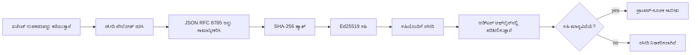
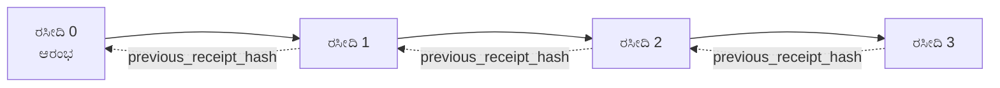

[ಪಾಠದ ವೀಡಿಯೋವನ್ನು ವೀಕ್ಷಿಸಿ: ಕ್ರಿಪ್ಟೋಗ್ರಾಫಿಕ್ ರಸೀದಿಗಳೊಂದಿಗೆ AI ಏಜೆಂಟ್ಗಳನ್ನು ಸುರಕ್ಷಿತಗೊಳಿಸುವುದು](https://youtu.be/PLACEHOLDER_VIDEO_ID)

> _(ಮೈಕ್ರೋಸಾಫ್ಟ್ ವಿಷಯ ತಂಡವು ಮರ್ಜಿ ನಂತರ ಪಾಠದ ವೀಡಿಯೋ ಮತ್ತು ಥಂಬ್ನೇಲ್ ಅನ್ನು ಸೇರಿಸುವುದು, ಪಾಠ 14 / 15 ಮಾದರಿಯಂತೆ.)_

# ಕ್ರಿಪ್ಟೋಗ್ರಾಫಿಕ್ ರಸೀದಿಗಳೊಂದಿಗೆ AI ಏಜೆಂಟ್ಗಳನ್ನು ಸುರಕ್ಷಿತಗೊಳಿಸುವುದು

## ಪರಿಚಯ

ಈ ಪಾಠವು ಈ ಕೆಳಕಂಡ್ದನ್ನು ಆವರಿಸುತ್ತದೆ:

- AI ಏಜೆಂಟ್ಗಳಿಗಾಗಿ ಆಡಿಟ್ ಟ್ರೇಲ್‌ಗಳು ಅನುಕೂಲ, ಡಿಬಗ್ಗಿಂಗ್ ಮತ್ತು ನಂಬಿಕೆಗೆ ಯಾಕೆ ಪ್ರಮುಖವಾಗಿವೆ ಎಂಬುದು.
- ಕ್ರಿಪ್ಟೋಗ್ರಾಫಿಕ್ ರಸೀದಿ ಎಂದರೇನು ಮತ್ತು ಅದನ್ನು ಸಹಿ ಇಲ್ಲದ ಲಾಗ್ ಲೈನ್‌ಗಿಂತ ಹೇಗೆ ಭಿನ್ನವಾಗಿದೆ ಎಂಬುದು.
- ಸರಳ ಪೈಥಾನ್‌ನಲ್ಲಿ ಏಜೆಂಟ್‌ನ ಸಾಧನ ಕರೆಗೆ ಸಹಿ ರಸೀದಿಯನ್ನು ಹೇಗೆ ಉತ್ಪಾದಿಸುವುದು.
- ರಸೀದಿಯನ್ನು ಆಫ್‌ಲೈನ್‌ನಲ್ಲಿ ಹೇಗೆ ಪರಿಶೀಲಿಸಲು ಮತ್ತು ತಿರುವುದನ್ನು ಹೇಗೆ ಪತ್ತೆಹಚ್ಚಲು.
- ಪ್ರಕರಣಗಳನ್ನು ಸರಣಿಯಲ್ಲಿ ಬಿಗಡಿಸುವ ಮೂಲಕ ಒಂದು ರಸೀದಿಯನ್ನು ತೆಗೆದುಹಾಕಿದಾಗ ಅಥವಾ ಪುನಾರೂಪಿಸುವಾಗ ಸರಣಿಯನ್ನು ತುಂಡುಮಾಡುವುದು ಹೇಗೆ.
- ರಸೀದಿಗಳು ಯಾವ ಸಂಗತಿಗಳನ್ನು ಸಾಬೀತುಪಡಿಸುತ್ತವೆ ಮತ್ತು ಅವು ಸ್ಪಷ್ಟವಾಗಿ ಯಾವ ಸಂಗತಿಗಳನ್ನು ಸಾಬೀತುಪಡಿಸುವುದಿಲ್ಲ ಎಂಬುದು.

## ಕಲಿಕೆಯ ಗುರಿಗಳು

ಈ ಪಾಠವನ್ನು ಪೂರ್ಣಗೊಳಿಸಿದ ನಂತರ, ನೀವು ತಿಳಿದುಕೊಳ್ಳಲಿದ್ದೀರಿ:

- ಏಜೆಂಟ್ ಕ್ರಿಯೆಗಳ ಕುರಿತಾಗಿ ಕ್ರಿಪ್ಟೋಗ್ರಾಫಿಕ್ ಮೂಲವನ್ನು ಪ್ರೇರೇಪಿಸುವ ವಿಫಲತೆ ಮಾದರಿಗಳನ್ನು ಗುರುತಿಸುವುದು.
- ಕನೋನಿಕಲ್ JSON ಪೇಲೋಡ್ ಮೇಲೆ Ed25519 ಸಹಿ ಯುಕ್ತ ರಸೀದಿಯನ್ನು ಉತ್ಪಾದಿಸುವುದು.
- ಸಹಿ ಮಾಡುವವರ ಸಾರ್ವಜನಿಕ ಕೀಲಿಯನ್ನು ಮಾತ್ರ ಬಳಸಿ ರಸೀದಿಯನ್ನು ಸ್ವತಂತ್ರವಾಗಿ ಪರಿಶೀಲಿಸುವುದು.
- ಬದಲಾವಣೆ ಮಾಡಿದ ರಸೀದಿ ಮೇಲೆ ಪರಿಶೀಲನೆ ಮರುಚಲಾಯಿಸುವ ಮೂಲಕ ತಿರುವುದನ್ನು ಪತ್ತೆಹಚ್ಚುವುದು.
- ರಸೀದಿಗಳ ಹ್ಯಾಷ್ ಸರಣಿಯನ್ನು ನಿರ್ಮಿಸಿ ಮತ್ತು ಸರಣಿಯ ಪ್ರಾಮುಖ್ಯತೆಯನ್ನು ವಿವರಿಸುವುದು.
- ರಸೀದಿಗಳು ಸಾಬೀತುಪಡಿಸುವಂತಹವುಗಳ (ಸ್ವೀಕೃತಿ, ಅಖಂಡತೆ, ಕ್ರಮದ ಸ್ಥಿತಿ) ಮತ್ತು ಸಾಬೀತುಪಡಿಸುವುದಿಲ್ಲದವುಗಳ (ಕೃತ್ಯದ ನಿಖರತೆ, ನೀತಿಯ soundness) ಗಡಿಯನ್ನು ಗುರುತಿಸುವುದು.

## ಸಮಸ್ಯೆ: ನಿಮ್ಮ ಏಜೆಂಟ್‌ನ ಆಡಿಟ್ ಟ್ರೇಲ್

ನೀವು Contoso ಟ್ರಾವೆಲ್‌ಗಾಗಿ AI ಏಜೆಂಟ್ ಅನ್ನು ನಿಯೋಜಿಸಿದ್ದೀರೋ ಎಂದು ಕಲ್ಪಿಸಿ. ಏಜೆಂಟ್ ಗ್ರಾಹಕರು ಕೇಳಿದನ್ನು ಓದುತ್ತದೆ, ವಿಮಾನಗಳ API ಅನ್ನು ಕರೆ ಮಾಡಿ ಆಯ್ಕೆಗಳನ್ನು ಹುಡುಕುತ್ತದೆ ಮತ್ತು ಗ್ರಾಹಕರ ಪರವಾಗಿ ಆಸನಗಳನ್ನು ಬುಕ್ ಮಾಡುತ್ತದೆ. ಹೋಗಿರುವ ತ್ರೈಮಾಸಿಕದಲ್ಲಿ, ಏಜೆಂಟ್ 50,000 ಬುಕ್ಕಿಂಗ್‌ಗಳನ್ನು ಪ್ರಕ್ರಿಯೆಗೊಳಿಸಿಕೊಂಡಿದೆ.

ಇಂದು ಒಂದು ಆಡಿಟರ್ ಬರುವನು. ಅವನು ಸರಳ ಪ್ರಶ್ನೆ ಕೇಳುತ್ತಾನೆ: "ನಿಮ್ಮ ಏಜೆಂಟ್ ಏನು ಮಾಡಿತು ಎನಿಸಿಕೊಂಡಿರಿ."

ನೀವು ನಿಮ್ಮ ಲಾಗ್ ಫೈಲುಗಳನ್ನು ಹಸ್ತಾಂತರಿಸುತ್ತೀರಿ. ಆಡಿಟರ್ ಅವುಗಳನ್ನು ನೋಡಿಕೊಳ್ಳುತ್ತಾನೆ ಮತ್ತು ಗಂಭೀರ ಪ್ರಶ್ನೆ ಕೇಳುತ್ತಾನೆ: "ನನಗೆ ಹೇಗೆ ಗೊತ್ತಾಗುತ್ತದೆ ಈ ಲಾಗ್‌ಗಳು ಸಂಪಾದಿತವಾಗಿಲ್ಲ?"

ಇದು ಆಡಿಟ್-ಟ್ರೇಲ್ ಸಮಸ್ಯೆಯಾಗಿದ್ದು, ಇಂದಿನ ಹೆಚ್ಚಿನ ಏಜೆಂಟ್ ನಿಯೋಜನೆಗಳು ಹೀಗೆ ಅವಲಂಬಿಸುತ್ತವೆ:

- **ಅನ್ವಯ ಲಾಗ್‌ಗಳು**: ಏಜೆಂಟು ಸ್ವಯಂ ಬರೆಯುತ್ತದೆ, ಫೈಲ್ ಸಿಸ್ಟಂ ಪ್ರವೇಶವಿರುವ ಯಾರಾದರೂ ಸಂಪಾದಿಸಬಹುದು.
- **ಮೇಘ ಲಾಗ್ ಸೇವೆಗಳು**: ವೇದಿಕೆ ಮಟ್ಟದಲ್ಲಿ ತಿರುವು-ಪ್ರমাণಪತ್ರ ಇದೆ ಆದರೆ ಆಡಿಟರ್ ವೇದಿಕೆ ನಿರ್ವಹಣೆದಾರರನ್ನು ನಂಬಿದರೆ ಮಾತ್ರ.
- **ಡೇಟಾಬೇಸ್ ವ್ಯವಹಾರ ಲಾಗ್‌ಗಳು**: ಡೇಟಾಬೇಸ್ ಬದಲಾವಣೆಗಳಿಗೆ ಸೂಕ್ತವಾದವು ಆದರೆ ಸಾದರಣ ಸಾಧನ ಕರೆಗಳಿಗೆ ಅಲ್ಲ.

ವೇರೊಬ್ಬರಿಗು ನಂಬಿಕೆ ಇರಬೇಕಿಲ್ಲದೆ ಆಡಿಟರ್ ಪ್ರಶ್ನೆಗೆ ಉತ್ತರಿಸುವುದು ಈ ಸಬಲೀಕರಣಗಳಲ್ಲಿ ಯಾರಿಗೂ ಸಾಧ್ಯವಿಲ್ಲ (ನೀವು, ನಿಮ್ಮ ಮೇಘ ಪೂರೈಕೆದಾರ, ನಿಮ್ಮ ಡೇಟಾಬೇಸ್ ಮಾರಾಟಗೈದು). ಆಂತರಿಕ ಬಳಕೆಗೆ, ಆ ನಂಬಿಕೆ ತಕ್ಕದ್ದು. ನಿಯಂತ್ರಿತ ಕೆಲಸಗಾಗಿದ್ದರೆ (ಸಾವುಮುಖ, ಆರೋಗ್ಯಸೇವೆ, EU AI ಕಾಯ್ದೆ ಅಡಿಯಲ್ಲಿ), ಅದು ಸಮರ್ಥವಲ್ಲ.

ಕ್ರಿಪ್ಟೋಗ್ರಾಫಿಕ್ ರಸೀದಿಗಳು ಪ್ರತಿ ಏಜೆಂಟ್ ಕ್ರಿಯೆಯನ್ನು ಸ್ವತಂತ್ರವಾಗಿ ಪರಿಶೀಲಿಸಲು ಸಾಧ್ಯವಾಗಿಸುವ ಮೂಲಕ ಈ ಸಮಸ್ಯೆಯನ್ನು ಪರಿಹರಿಸುತ್ತವೆ. ಆಡಿಟರ್ ನಿಮಗೆ ನಂಬಿಕೆ ಇರಬೇಕಾಗಿಲ್ಲ. ಅವರಿಗೆ ನಿಮ್ಮ ಸಾರ್ವಜನಿಕ ಕೀ ಮತ್ತು ರಸೀದಿ ತನ್ನಷ್ಟೇ ಬೇಕು.

## ಕ್ರಿಪ್ಟೋಗ್ರಾಫಿಕ್ ರಸೀದಿ ಎಂದರೇನು?

ರಸೀದಿ ಒಂದು JSON ವಸ್ತು ಆಗಿದ್ದು ಏಜೆಂಟ್ ಏನು ಮಾಡಿದೆಂದು ದಾಖಲಿಸುತ್ತದೆ ಮತ್ತು ಡಿಜಿಟಲ್ ಸಹಿತಿಯೊಂದಿಗೆ ಸಹಿ ಮಾಡಲಾಗಿದೆ.



ಸರಳ ರಸೀದಿ ಹೀಗೆ ಕಾಣುತ್ತದೆ:

```json
{
  "type": "agent.tool_call.v1",
  "agent_id": "contoso-travel-bot",
  "tool_name": "lookup_flights",
  "tool_args_hash": "sha256:a3f9c1...",
  "result_hash": "sha256:7b2e1d...",
  "policy_id": "contoso-travel-policy-v3",
  "timestamp": "2026-04-25T14:30:00Z",
  "sequence": 47,
  "previous_receipt_hash": "sha256:9d4e6a...",
  "signature": {
    "alg": "EdDSA",
    "sig": "c5af83...",
    "public_key": "8f3b2c..."
  }
}
```

ಮೂವರು ಗುಣಲಕ್ಷಣಗಳು ಕೆಲಸ ಮಾಡುತ್ತಿವೆ:

1. **ಸಹಿತಿ**. ರಸೀದಿಯನ್ನು ಏಜೆಂಟ್ ಗೇಟ್ವೇ ದಿಂದ Ed25519 ಖಾಸಗಿ ಕೀಲಿಯನ್ನು ಬಳಸಿ ಸಹಿ ಮಾಡಲಾಗಿದೆ. ಸದಸ್ಯರಿಗೆ ಸಂಬಂಧಿಸಿದ ಸಾರ್ವಜನಿಕ ಕೀಲಿಯೊಂದಿಗೆ ಸಹಿತಿಯನ್ನು ಆಫ್‌ಲೈನ್‌ನಲ್ಲಿ ಪರಿಶೀಲಿಸಬಹುದು. ಯಾವುದೇ ಕ್ಷೇತ್ರದಲ್ಲಿ ತಿರುವು ಸಾಕ್ಷ್ಯವನ್ನು ಅಮಾನ್ಯಗೊಳಿಸುತ್ತದೆ.

2. **ಕನೋನಿಕಲ್ ಎನ್ಕೋಡಿಂಗ್**. ಸಹಿ ಮಾಡುವ ಮೊದಲು, JSON ಕನೋನಿಕಲೈಜೆಶನ್ ಸ್ಕೀಮ್ (JCS, RFC 8785) ಬಳಸಿ ರಸೀದಿ ಸರಣಿಬದ್ಧಗೊಳ್ಳುತ್ತದೆ. ಇದು ಒಂದೇ ತಾರ್ಕಿಕ ರಸೀದಿಯನ್ನು ಉತ್ಪಾದಿಸುವ ಎರಡು ರಚನೆಗಳು ಒಂದೇ ಬಯ್ಟ್-ಅನುರೂಪ ಔಟ್‌ಪುಟ್ ನೀಡುವಂತೆ ಖಚಿತಪಡಿಸುತ್ತದೆ. ಕನೋನಿಕಲೈಜೆಶನ್ ಇಲ್ಲದೆ, ವಿಭಿನ್ನ JSON ರಿಲೈಸರ್‌ಗಳು ಒಂದೇ ವಿಷಯಕ್ಕೆ ವಿಭಿನ್ನ ಸಹಿತಿಗಳನ್ನು ಉತ್ಪಾದಿಸುತ್ತೆವು.

3. **ಹ್ಯಾಶ್ ಸರಣಿಕರಣ**. `previous_receipt_hash` ಕ್ಷೇತ್ರವು ಪ್ರತಿಯೊಂದು ರಸೀದಿಯನ್ನು ಹಿಂದೆ ಇರುವ ರಸೀದಿಯನ್ನು ಸಂಪರ್ಕಿಸುತ್ತದೆ. ರಸೀದಿಯನ್ನು ತೆಗೆದುಹಾಕಿದಾಗ ಅಥವಾ ಪುನಾರೂಪಿಸಿದಾಗ ನಂತರದ ಎಲ್ಲಾ ರಸೀದಿಗಳ ಸಹಿತಿಗಳು ಮುರಿಯುತ್ತವೆ. ತಿರುವು ಸರಣಿಯಲ್ಲಿ ಸ್ಪಷ್ಟವಾಗಿ ಕಾಣಿಸುತ್ತದೆ, ಅಷ್ಟೇ ಅಲ್ಲದ ಸಹಿತಿಗಳು ಬಾಯ್‌ಪ್ಯಾಸಾಗಿದರೂ.

ಈ ಗುಣಲಕ್ಷಣಗಳು ಮೂರು ಭರವಸೆಗಳನ್ನು ಒದಗಿಸುತ್ತವೆ:

- **ಸ್ವೀಕೃತಿ**: ಈ ಕೀ ಈ ವಿಷಯವನ್ನು ಸಹಿ ಮಾಡಿದೆ.
- **ಅಖಂಡತೆ**: ಸಹಿತಿಯಿಂದ ಮೇಲೆ ವಿಷಯ ಬದಲಾಯಿಸಲ್ಪಡುವುದಿಲ್ಲ.
- **ಕ್ರಮಾನುಗತತೆ**: ಈ ರಸೀದಿ ಸರಣಿಯಲ್ಲಿ ಆ ರಸೀದಿಯನ್ನು ನಂತರನಲ್ಲಿ ಬಂದಿದೆ.

## ಪೈಥಾನಿನಲ್ಲಿ ರಸೀದಿಯನ್ನು ಉತ್ಪಾದಿಸುವುದು

ಒಂದು ವಿಶೇಷ ಗ್ರಂಥಾಲಯ ಬೇಕಾಗಿಲ್ಲ. ಕ್ರಿಪ್ಟೋಗ್ರಾಫಿಕ್ ಮೂಲಭೂತಗಳು ವ್ಯಾಪಕವಾಗಿದೆ ಮತ್ತು ಲಾಜಿಕ್ ಕೆಲ ಪೈಥಾನ್ ಸಾಲೆಗಳಷ್ಟೇ.

`code_samples/18-signed-receipts.ipynb`ಯಲ್ಲಿನ ಹಸ್ತಚಾಲಿತ ಅಭ್ಯಾಸಗಳು ಸಂಪೂರ್ಣ ಪ್ರಕ್ರಿಯೆಯನ್ನು ವಿವರಿಸುತ್ತವೆ. ಸಂಕ್ಷಿಪ್ತ ಆವೃತ್ತಿ:

```python
import json
import hashlib
import base64
from nacl import signing
from jcs import canonicalize  # RFC 8785 ನಿಯಮಿತ JSON

def b64url_nopad(data: bytes) -> str:
    return base64.urlsafe_b64encode(data).decode("ascii").rstrip("=")

def sha256_canonical(obj) -> str:
    """SHA-256 of a Python object's JCS-canonical JSON form."""
    return f"sha256:{hashlib.sha256(canonicalize(obj)).hexdigest()}"

# ಸಹಿ ಕೀವನ್ನು ರಚಿಸು ಅಥವಾ ಲೋಡ್ ಮಾಡು (ಉತ್ಪಾದನೆದಲ್ಲಿ, ಕೀ ವಾಲ್ಟ್‌ನಲ್ಲಿ ಸಂಗ್ರಹಿಸಿ)
signing_key = signing.SigningKey.generate()
verify_key = signing_key.verify_key

# ರಸೀದಿ ಪೇಲೋಡ್ ಅನ್ನು ನಿರ್ಮಿಸಿ (ಇನ್ನೂ ಸಹಿ ಇಲ್ಲ)
tool_args = {"origin": "SYD", "destination": "LAX"}
tool_result = [{"flight": "QF11", "price": 1850, "stops": 0}]

payload = {
    "type": "agent.tool_call.v1",
    "agent_id": "contoso-travel-bot",
    "tool_name": "lookup_flights",
    "tool_args_hash": sha256_canonical(tool_args),
    "result_hash": sha256_canonical(tool_result),
    "policy_id": "contoso-travel-policy-v3",
    "timestamp": "2026-04-25T14:30:00Z",
    "sequence": 0,
    "previous_receipt_hash": None,
}

# ನಿಯಮಿತಮಾಡು, ಹ್ಯಾಶ್ ಮಾಡಿ, ಸಹಿ ಮಾಡು.
canonical_bytes = canonicalize(payload)
message_hash = hashlib.sha256(canonical_bytes).digest()
signature_bytes = signing_key.sign(message_hash).signature

# ರಚನಾತ್ಮಕ ಸಹಿ ವಸ್ತುವನ್ನು ಲಗತ್ತಿಸು.
receipt = {
    **payload,
    "signature": {
        "alg": "EdDSA",
        "sig": b64url_nopad(signature_bytes),
        "public_key": b64url_nopad(bytes(verify_key)),
    },
}
```

ಅದು ಸಂಪೂರ್ಣ ಸಹಿ ಪೈಪ್‌ಲೈನ್. ನೋಟ್‌ಬುಕ್‌ನ ಅಭ್ಯಾಸಗಳು ಪ್ರತಿ ಹಂತವನ್ನು ವಿವರಿಸುತ್ತವೆ.

## ರಸೀದಿಯನ್ನು ಪರಿಶೀಲಿಸುವುದು ಮತ್ತು ತಿರುವುದನ್ನು ಪತ್ತೆಹಚ್ಚುವುದು

ಪರಿಶೀಲನೆ ವಿರುದ್ಧ ಪ್ರಕ್ರಿಯೆಯಾಗಿರುತ್ತದೆ:

```python
import base64
import hashlib
from nacl import signing
from nacl.exceptions import BadSignatureError
from jcs import canonicalize

def b64url_decode(s: str) -> bytes:
    padding = "=" * ((4 - len(s) % 4) % 4)
    return base64.urlsafe_b64decode(s + padding)

def verify_receipt(receipt: dict) -> bool:
    # ಸಹಿ ಒಂದು ರಚನೆಯಾದ ವಸ್ತು: {"alg", "sig", "ಪಬ್ಲಿಕ್_ಕೀ"}.
    sig_obj = receipt.get("signature")
    if not sig_obj or sig_obj.get("alg") != "EdDSA":
        return False

    # ನಿಜವಾಗಿಯೂ ಸಹಿ ಹಾಕಲಾದ ಪೇಲೋಡ್ ಅನ್ನು ಮರುನಿರ್ಮಿಸಲು (ಸಹಿಯನ್ನು ಹೊರತುಪಡಿಸಿ ಎಲ್ಲವನ್ನೂ).
    payload = {k: v for k, v in receipt.items() if k != "signature"}

    canonical_bytes = canonicalize(payload)
    message_hash = hashlib.sha256(canonical_bytes).digest()

    try:
        verify_key = signing.VerifyKey(b64url_decode(sig_obj["public_key"]))
        verify_key.verify(message_hash, b64url_decode(sig_obj["sig"]))
        return True
    except BadSignatureError:
        return False
```

ಈ ಕಾರ್ಯವು ರಸೀದಿಯನ್ನು ಸ್ವೀಕರಿಸಿ ಸಹಿತಿ ಸರಿಯಾದರೆ `True`, ಇಲ್ಲದಿದ್ದರೆ `False` ಅನ್ನು ಮರಳಿಸುತ್ತದೆ. ಯಾವುದೇ ಜಾಲವೈಧ್ಯ, ಸೇವಾ ನಿರ್ಭರತೆ ಇಲ್ಲದೆ ಅಥವಾ ಮೂರನೇ ಪಕ್ಷವನ್ನು ನಂಬದೆ.

ತಿರುವು ಪತ್ತೆಯ ಪ್ರಕ್ರಿಯೆಯನ್ನು ನೋಡುವುದಕ್ಕಾಗಿ ನೋಟ್‌ಬುಕ್ ಹೀಗಿದೆ:

1. ಮಾನ್ಯ ರಸೀದಿ ಉತ್ಪಾದಿಸಿ ಅದರ ಪರಿಶೀಲನೆಯನ್ನು ದೃಢೀಕರಿಸುವುದು.
2. `tool_args_hash` ಕ್ಷೇತ್ರದ ಒಂದೇ ಬೈಟ್ ಅನ್ನು ಬದಲಾಯಿಸುವುದು.
3. ಪರಿಶೀಲನೆಯನ್ನು ಮರುಚಲಾಯಿಸಿ ವಿಫಲತೆಯನ್ನು ನೋಡುವುದು.

ಇದು ರಸೀದಿಗಳು ತಿರುವುನಿರೋಧಕವಾಗಿರುವುದರ ಪ್ರಾಯೋಗಿಕ ಪ್ರದರ್ಶನ: ಯಾವುದೇ ಬದಲಾವಣೆ ಸಹಿತಿಯನ್ನು ಮುರಿಯುತ್ತದೆ.

## ಬಹು ಹಂತದ ಏಜೆಂಟ್ಗಳುಗಾಗಿ ರಸೀದಿಗಳ ಸರಣಿಚೈನ್

ಒಂದೇ ಸಹಿ ರಸೀದಿ ಒಂದು ಕ್ರಿಯೆಯನ್ನು ರಕ್ಷಿಸುತ್ತದೆ. ರಸೀದಿಗಳ ಸರಣಿ ಸರಣಿಯನ್ನು ರಕ್ಷಿಸುತ್ತದೆ.



ಪ್ರತಿಯೊಂದು ರಸೀದಿ ಹಿಂದಿನ ರಸೀದಿಯ ಹ್ಯಾಶ್ ಅನ್ನು ದಾಖಲಿಸುತ್ತದೆ. ರಸೀದಿ 2 ಅನ್ನು ಮೌನವಾಗಿ ತೆಗೆದುಹಾಕಲು ದಾಳಿಗಾರನು ಈ ಕೆಲಸಗಳನ್ನು ಮಾಡಬೇಕಾಗುತ್ತದೆ:

- ರಸೀದಿ 3ರ `previous_receipt_hash` ಕ್ಷೇತ್ರವನ್ನು ಬದಲಾಯಿಸುವುದು (ರಸೀದಿ 3ರ ಸಹಿತಿಯನ್ನು ಮುರಿಯುತ್ತದೆ), ಅಥವಾ
- ಬದಲಾಯಿಸಿದ ರಸೀದಿ 3 ಮೇಲೆ ಹೊಸ ಸಹಿತಿಯನ್ನು ತಯಾರಿಸುವುದು (ಏಜೆಂಟ್ ಖಾಸಗಿ ಕೀಲಿಯ ಅಗತ್ಯವಿದೆ).

ಖಾಸಗಿ ಕೀ ಒಂದು ಹಾರ್ಡ್‌ವೇರ್ ಕೀ ವಾಲ್ಟ್‌ನಲ್ಲಿ ಇದ್ದಾಗ ಮತ್ತು ನೀವು ಸಾರ್ವಜನಿಕ ಕಿಯನ್ನು ಪ್ರತಿಯೊಂದು ರಸೀದಿಯ ಜೊತೆಗೆ ಪ್ರಕಟಿಸಿದರೆ, ಈ ದಾಳಿಯು ಕಂಡುಹಿಡಿಯದೆ ಸಾಧ್ಯವಿಲ್ಲ.

ನೋಟ್‌ಬುಕ್ ಇಲ್ಲಿ ವಿವರಿಸುತ್ತದೆ:

1. ಮೂವರು ರಸೀದಿಗಳ ಸರಣಿಯನ್ನು ನಿರ್ಮಿಸುವುದು.
2. ಪ್ರತಿಯೊಂದು ರಸೀದಿಯ `previous_receipt_hash` ಪೂರ్వ ರಸೀದಿಯ ಯಥಾರ್ಥ ಹ್ಯಾಶ್ ಜೊತೆ ಹೊಂದಿಕೆಯಾಗುವುದನ್ನು ಪರಿಶೀಲಿಸುವುದು.
3. ಮಧ್ಯದಲ್ಲಿ ಒಂದೇ ರಸೀದಿಯನ್ನು ತಿರುವುಮಾಡಿ ಸರಣಿ ಅದರಲ್ಲಿಯೇ ಮುರಿಯುವುದು.

ಇಂತಹ ಆಡಿಟ್ ಟ್ರೇಲ್ ಅನ್ನು ನೀವು ಉತ್ಪಾದಿಸಬಹುದು; ಹೊರಗಿನ ಆಡಿಟರ್ ನಿಮ್ಮನ್ನು ನಂಬದೆ ಪರಿಶೀಲಿಸಬಹುದು.

## ರಸೀದಿಗಳು ಸಾಬೀತುಪಡಿಸುವುದು (ಮತ್ತು ಸಾಬೀತುಪಡಿಸುವುದಿಲ್ಲ)

ಇದು ಈ ಪಾಠದ ಅತ್ಯಂತ ಪ್ರಮುಖ ವಿಭಾಗ. ರಸೀದಿಗಳು ಶಕ್ತಿಶಾಲಿಯಾದವು ಆದರೆ ಅವರ ಶಕ್ತಿ ಮಿತವಾಗಿದೆ.

**ರಸೀದಿಗಳು ಮೂರು ಸಂಗತಿಗಳನ್ನು ಸಾಬೀತುಪಡಿಸುತ್ತವೆ:**

1. **ಸ್ವೀಕೃತಿ**: ನಿರ್ದಿಷ್ಟ ಕೀ ನಿರ್ದಿಷ್ಟ ಪೇಲೋಡನ್ನು ಸಹಿ ಮಾಡಿದೆ.
2. **ಅಖಂಡತೆ**: ಪೇಲೋಡ್ ಸಹಿತಿಯ ನಂತರ ಬದಲಾಗಿಲ್ಲ.
3. **ಕ್ರಮಾನುಗತತೆ**: ಈ ರಸೀದಿ ಆ ರಸೀದಿಗೆ ಹ್ಯಾಶ್ ಸರಣಿಯಲ್ಲಿ ನಂತರ ಬಂದಿದೆ.

**ರಸೀದಿಗಳು ಸಾಬೀತುಪಡಿಸುವುದಿಲ್ಲ:**

1. **ಸರಿಯಾಗಿರುವುದು**: ಏಜೆಂಟ್‌ನ ಕ್ರಮವು ಸರಿಯಾದ ಕ್ರಮವೇ ಎಂದು. ತಪ್ಪು ಉತ್ತರಕ್ಕೂ ರಸೀದಿ ಸಹಿ ಮಾಡಬಹುದು.
2. **ನೀತಿ ಅನುಕೂಲತೆ**: `policy_id`ನಲ್ಲಿ ಉಲ್ಲೇಖಿಸಿರುವ ನೀತಿ ಅಳವಡಿಸಲಾಗಿದೆ ಅಥವಾ ಪರಿಶೀಲಿಸಿದಾಗ ಈ ಕ್ರಮಕ್ಕೆ ಅನುಮತಿ ನೀಡುತ್ತದೆ ಎಂದು. ರಸೀದಿ ಹೇಳುವುದು ಏನು দাবಿಯಾಯಿತು, ಏನು ಅಳವಡಿಸಲ್ಪಟ್ಟಿಲ್ಲ.
3. **ಕೀಲಿಯಿಂದ ಮೇಲೆ ಗುರುತು**: ರಸೀದಿ ಹೇಳುವುದು "ಈ ಕೀ ಈ ವಿಷಯವನ್ನು ಸಹಿ ಮಾಡಿತು." ಆದರೆ "ಈ ಮಾನವನು ಅನುಮೋದಿಸಿತು." ಎಂದು ಅಲ್ಲ. ಕೀಲಿಯನ್ನು ವ್ಯಕ್ತಿ ಅಥವಾ ಸಂಸ್ಥೆಗೆ ಸಂಪರ್ಕಿಸುವುದಕ್ಕೆ ಬೇರೆ ಗುರುತು ವ್ಯವಸ್ಥೆ (ಡೈರೆಕ್ಟರಿ, ಸಾರ್ವಜನಿಕ ಕೀ ದಾಖಲೆ) ಬೇಕು.
4. **ಇನ್‌ಪುಟ್‌ಗಳ ಸತ್ಯತೆ**: ಏಜೆಂಟ್ ವಂಚಿತ ಪ್ರಾಂಪ್ಟ್ ಸ್ವೀಕರಿಸಿ ಕ್ರಮ ಕೈಗೊಂಡರೂ, ರಸೀದಿ ಆ ಕ್ರಮವನ್ನು ನಿಜವಾಗಿ ದಾಖಲಿಸುತ್ತದೆ. ರಸೀದಿಗಳು ಇನ್‌ಪುಟ್ ಮಾನ್ಯತೆಯ ಮೇಲೆ ನೆಲಸಿದ್ದು, ಅದಕ್ಕೆ ಬದಲಿ ಅಲ್ಲ.

ಈ ಗಡಿ ಎರಡು ಕಾರಣಗಳಿಗಾಗಿ ಪ್ರಮುಖ:

- ಇದು ನಿಮಗೆ ಎನು ಹೇಳುತ್ತದೆ: ಏಜೆಂಟ್ ವರ್ತನೆ ಆಡಿಟ್ ಆಗಬೇಕಾದ್ದಾಗಿ ಮತ್ತು ತಿರುವಯುತ (ತಿರುವು ಕಂಡುಬರುವಂತೆ), ಸಂಘಟನೆಯ ಗಡಿಗಳನ್ನು ಮೀರಿ ಸಹ.
- ನೀವು ಇನ್ನೂ ಅಗತ್ಯವಿರುವ ಹೆಚ್ಚುವರಿ ಹಂತಗಳನ್ನು ತಿಳಿಸುತ್ತದೆ: ಇನ್‌ಪುಟ್ ಮಾನ್ಯತೆ (ಪಾಠ 6), ನೀತಿ ಜಾರಿ (ಕೆಲವೇ ಸಂದರ್ಭದಲ್ಲಿ ಕೆಳಗೆ ಉಲ್ಲೇಖಿಸಲಾಗಿದೆ), ಗುರುತು ವ್ಯವಸ್ಥೆ (ಈ ಪಾಠದ ವ್ಯಾಪ್ತಿಗೆ ಹೊರಗೆ).

ಸಾಮಾನ್ಯ ತಪ್ಪುವೆಂದರೆ "ನಮಗೆ ರಸೀದಿಗಳು ಇವೆ" ಅಂದರೆ "ನಾವು ಆಡಳಿತದಡಿಯಲ್ಲಿ ಇವೆವು" ಎಂದು assume ಮಾಡುವುದು. ಅದು ಅಲ್ಲ. ರಸೀದಿಗಳು ನೆಲೆತಟ್ಟಿನಂತೆ; ಆಡಳಿತವು ನೀವು ನಿರ್ಮಿಸುವ ಅಳವಡಿಕೆ ವ್ಯವಸ್ಥೆ.

## ಮಾನವನು ಸ್ಪಷ್ಟ ಕ್ರಿಯೆಯನ್ನು ಅನುಮೋದಿಸಿದೆ ಎಂಬದನ್ನು ಸಾಬೀತುಪಡಿಸುವುದು

ಮೇಲಿನ ಅಂಶ 3 ತನ್ನ	deluxe	ಖಂಡಿತವಾಗಿ ಒಂದು ವಿಭಾಗಕ್ಕಿದೆ: ಕ್ರಮ ರಸೀದಿ ಹೇಳುವುದು "ಈ ಕೀ ಈ ವಿಷಯ ಸಹಿ ಮಾಡಿತು", ಎಂದಷ್ಟೇ, "ಮಾನವನ ಅನುಮೋದನೆಯಿದೆ" ಎಂದಿಲ್ಲ. ಉನ್ನತ-ആപತ್ತು ಕ್ರಮಗಳಿಗಾಗಿ (ನಿರ್ನಿಮಿಸು, ಅಳಿಸುವಿಕೆ, ವಾಯರ್ ವರ್ಗಾವಣೆ), ಆಡಳಿತದ ಜಾಲಗಳು ಹೆಚ್ಚಾಗಿ ನಿಖರವಾಗಿ ಆ ಕಾಣೆಯ ಹೇಳಿಕೆಯನ್ನು ಬೇಕಾಗುತ್ತದೆ, ಮತ್ತು ಅದನ್ನು ಈ ಪಾಠದಲ್ಲಿನ ಮೂಲಭೂತಗಳೊಂದಿಗೆ ಉತ್ಪಾದಿಸಬಹುದು.

ಮುಂದಿನ ನೋಟ್‌ಬುಕ್ `code_samples/human-authorization-receipts.ipynb` ಎರಡನೇ ರಸೀದಿ ವಿಧವನ್ನು ಸೇರಿಸುತ್ತದೆ, `human.approval.v1`, ಪಾಠದ ರಸೀದಿಗಳ ಸಮಾನ ಸಂರಚನೆಯೊಂದಿಗೆ (Typed Payload Ed25519 ಸಹಿ, Canonical SHA-256 ಮೇಲ್ಪಟ್ಟದ್ದು, `signature` ವಸ್ತುವು ಸಹಿ ಮಾಡಿದ ಬೈಟ್ಗಳ ಹೊರಗೆ). ಒಂದು ಹೆಸರು ಪಡೆದ ಅನುಮೋದಕ ಪೂರ್ಣ ಕನೋನಿಕಲ್ ಕ್ರಮ ಮತ್ತು ಅದರ ಡೈಜೆಸ್ಟ್‌ಗೆ ಸಹಿ ಮಾಡುತ್ತಾನೆ; ಏಜೆಂಟ್ ಕ್ರಮ ರಸೀದಿ ಅದೇ ಕ್ರಮ ಡೈಜೆಸ್ಟ್ ಮತ್ತು `parent_approval_ref` (ಅನುಮೋದನೆಯ ರಸೀದಿ ಹ್ಯಾಶ್), ಮೇಲಿನ ಸರணಿಯಲ್ಲಿ `previous_receipt_hash`ಗಾಗಿ ಪ್ರಕ್ರಿಯೆಯಂತೆ. ಒಂದು `verify_chain` ಇಬ್ಬರ ವಸ್ತುಗಳನ್ನು ವಿಭಿನ್ನ ಕೀ ದಾಖಲಾತಿಯಡಿಯಲ್ಲಿ ಪರಿಶೀಲಿಸುತ್ತದೆ (ಅನುಮೋದಕ ಕೀಗಳು ವಿರುದ್ಧ ಏಜೆಂಟ್ ಕೀಗಳು), ಆದಾಗ ಕೋಡ್ ಮಾರ್ಗ ಹಂಚಿಕೊಳ್ಳುತ್ತದೆ ಆದರೆ ಅಧಿಕಾರಿಗಳು ಹಂಚಿಕೊಳ್ಳುವುದಿಲ್ಲ.

ಈ ಗುಣಲಕ್ಷಣನು ಪ್ರಾಮಾಣಿಕವಾಗಿ ಹೇಳುವುದು: *ಮಾನವನು ಈ ನಿಖರ ಕ್ರಮವನ್ನು ಅನುಮೋದಿಸಿದನು ಮತ್ತು ಏಜೆಂಟ್ ಆ ಅನುಮೋದಿತ ಕ್ರಮವನ್ನು ನಿಖರವಾಗಿ ನಿರ್ವಹಿಸಿದ್ದನು.* ನೋಟ್‌ಬುಕ್‌ನ ತಿರಸ್ಕಾರ ಸಿದ್ಧಾಂತಗಳು ಈ ಗುಣಲಕ್ಷಣವನ್ನು ವಾಸ್ತವಿಕಗೊಳಿಸುತ್ತವೆ:

- ಪುರಾಣಾತ್ಮಕ ಸೆಟ್: ತಿರುವುಮಾಡುವಿಕೆ, ಗೊಂದಲದ ದೂತ, ಮರುಚಲಾವಣೆ, ಇಬ್ಬರಿಗೂ ನಕಲಿ ಕೀಲಿಗಳು, ಹಾಳಾದ ಇನ್‌ಪುಟ್;
- **ಹಳೆಯ ಅಧಿಕಾರ**: ಯಾವ ಸಹಿತಿಯು ಇನ್ನೂ ಪರಿಶೀಲಿಸುವುದಾದರೂ, ನೀತಿ ಆವೃತ್ತಿ ಬದಲಾಗಿದೆ, ಅನುಮೋದಕ ಕೀ ಪಿನ್ ಮಾಡಿದ ದಾಖಲಾತಿಯಿಂದ ತೆಗೆಯಲ್ಪಟ್ಟಿದೆ, ಅಥವಾ ಅನುಮೋದನೆ ಕಾರ್ಯಗೊಳಿಸುವ ಮೊದಲು ಕೊನೆಗೊಂಡಿದೆಂದು ನಿರಾಕಾರ ಮಾಡಲಾಗಿದೆ;
- **ಡೈಜೆಸ್ಟ್ ಬದಲಾವಣೆ**: ನಿಖರವಾಗಿ ಸಹಿ ಮಾಡಲಾದ ಕ್ರಮ ರಸೀದಿ ನಿಜವಾದ ಅನುಮೋದನೆಯನ್ನು ಸೂಚಿಸುತ್ತದೆ ಆದರೆ ಅದು ಬೇರೆ ಕನೋನಿಕಲ್ ಕ್ರಮವೊಂದರ ಸೆರವಣೆ ಇರಬಹುದು.

ಪ್ರತಿ ವಿಫಲತೆ ವಿಭಿನ್ನ ಕಾರಣದಿಂದ ನಿರಾಕರಿಸಲಾಗುತ್ತದೆ, ಆದ್ದರಿಂದ ಆಡಿಟರ್ ನಿರಾಕಾರವನ್ನು ಓದಿದಾಗ ಅಧಿಕಾರ ಹಳೆಯದಾಗಿದೆ ಅಥವಾ ನಿರ್ವಹಿಸಿದ ಕ್ರಮ ಬದಲಾಗಿದೆ ಎಂದು ತಿಳಿಯಬಹುದು. ನೋಟ್‌ಬುಕ್ ಬೋಧಿಸುವ ನಿಯಮ: ಸಹಿ ಮಾಡಿದ ಅನುಮೋದನೆ ಸ್ವತಂತ್ರ ಅಧಿಕಾರವಲ್ಲ. ಅಧಿಕಾರವು ಮಾತ್ರ ಆ ಎರಡು ರಸೀದಿಗಳೂ ಕಾರ್ಯನಿರ್ವಹಿಸುವ ವೇಳೆಯಲ್ಲಿ ಒಂದೇ ಕನೋನಿಕಲ್ ಕ್ರಮಕ್ಕೆ ಬೈಸಿಕೊಳ್ಳುವಾಗ ಇರುತ್ತದೆ. ಈ ಪಾಠ ಅನುಸರಿಸಿದ ಅನ್ಲೈನ್ ಡ್ರಾಫ್ಟ್ನಲ್ಲಿ (`draft-farley-acta-signed-receipts`) ಸಹಿ ಸಹಿ ಮಾರ್ಗದರ್ಶಿಕೆಯನ್ನು ಇದು ಪ್ರತಿನಿಧಿಸುತ್ತದೆ.

## ಉತ್ಪಾದನಾ ಸೂಚನೆಗಳು

ಈ ಪಾಠದ ಪೈಥಾನ್ ಕೋಡ್ ಉದ್ದೇಶಿತವಾಗಿ ಅಧೀನಕ್ಕೆ ಸರಳವಾಗಿದೆ, ನೀವು ಪ್ರತಿ ಸಾಲನ್ನು ಓದಿ ನಿಜವಾದ ಪ್ರಕ್ರಿಯೆಯನ್ನು ಅರ್ಥಮಾಡಿಕೊಳ್ಳಲು. ಉತ್ಪಾದನೆಯಲ್ಲಿ, ಎರಡು ಆಯ್ಕೆಗಳಿವೆ:

1. **ಕ್ರಿಪ್ಟೋಗ್ರಾಫಿಕ್ ಮೂಲಭೂತಗಳ ಮೇಲೆ ನೇರವಾಗಿ ನಿರ್ಮಿಸು.** ಮೇಲ್ಬança 50 ಸಾಲು ಹಲವು ಬಳಕೆಗಳಿಗೆ ಸಾಕಾಗುತ್ತದೆ. PyNaCl (Ed25519) ಮತ್ತು `jcs` ಪ್ಯಾಕೇಜ್ (ಕನೋನಿಕಲ್ JSON) ಚೆನ್ನಾಗಿ ನಿರ್ವಹಿಸಲ್ಪಟ್ಟ ಮತ್ತು ಪರಿಶೀಲಿತ ಗ್ರಂಥಾಲಯಗಳಾಗಿವೆ.

2. **ಉತ್ಪಾದನಾ ರಸೀದಿ ಗ್ರಂಥಾಲಯ ಬಳಸಿರಿ.** ಕೆಲವು ಓಪನ್-ಸೋರ್ಸ್ ಪ್ರಾಜೆಕ್ಟ್ಗಳು ಈ ಮಾದರಿಯನ್ನು ಹೆಚ್ಚುವರಿ ವೈಶಿಷ್ಟ್ಯಗಳೊಂದಿಗೆ (ಕೀ ತಿರುಗостоя, ಬ್ಯಾಚ್ ಪರಿಶೀಲನೆ, JWK ಸೆಟ್ ವಿತರಣೆ, ನೀತಿ ಎಂಜಿನ್ ಸಮನ್ವಯ) ರಚಿಸುತ್ತವೆ:
   - ಈ ಪಾಠದಲ್ಲಿ ಬಳಸಲಾದ ರಸೀದಿ ಸ್ವರೂಪ IETF ಇಂಟರ್ನೆಟ್-ಡ್ರಾಫ್ಟ್([`draft-farley-acta-signed-receipts`](https://datatracker.ietf.org/doc/draft-farley-acta-signed-receipts/), ಪರಿಷ್ಕರಣೆ 02)ನಲ್ಲಿ നിലവಿನ ಪ್ರಕ್ರಿಯೆಯಲ್ಲಿ ಇದೆ, ಹೊಂದಾಣಿಕೆಯ ಪರೀಕ್ಷಾಮಾಲೆಯೊಂದಿಗೆ (agent-governance-testvectors) ಸ್ವತಂತ್ರ ಅನುಷ್ಠಾನಗಳು ಬೈಟ್-ಅನುರೂಪ ಕನೋನಿಕಲ್ ಔಟ್‌ಪುಟ್ ಬಗ್ಗೆ ಪರಸ್ಪರ ಪರಿಶೀಲನೆ ಮಾಡುತ್ತಿವೆ.
   - ಮೈಕ್ರೋಸಾಫ್ಟ್ ಏಜೆಂಟ್ ಆಡಳಿತ ಉಪಕರಣಗಳು ಸರಣಿಯೊಂದಿಗೆ Cedar ಆಧಾರಿತ ನೀತಿ ನಿರ್ಣಯಗಳನ್ನು ಸೇರಿಸುತ್ತವೆ; ಆ ರೆಪೊಸಿಟರಿಯ ಟ್ಯೂಟೋರಿಯಲ್ 33 ರಲ್ಲಿ ಪೂರ್ಣದೇವಾದ ಉದಾಹರಣೆಯಿದೆ.
   - `protect-mcp` (npm) ಮತ್ತು `@veritasacta/verify` (npm) ಪ್ಯಾಕೇಜ್ಗಳು ನೋಡ್ ಆಧಾರಿತ ರಸೀದಿ ಸಹಿತ ಮತ್ತು ಆಫ್‌ಲೈನ್ ಪರಿಶೀಲನೆ ಅನುಷ್ಠಾನವನ್ನು ಒದಗಿಸುತ್ತವೆ, ಯಾವುದೇ MCP ಸರ್ವರ್‌ನ್ನು ತಿರುವು-ಪ್ರತಿರೋಧಕ ಆಡಿಟ್ ಟ್ರೇಲ್‌ಗಾಗಿ ಹೊರೆತೀರುವುದಾಗಿ, ಮೂಲಕ ನಿಯೋಜಿತ ಕ್ರಮ ನಿರ್ವಹಣೆಯಲ್ಲಿ ನಿರ್‌ಬಂಧಿತ ಅನುಮೋದನೆ ರಸೀದಿಯನ್ನು ಒಳಗೊಂಡಂತೆ (ಡೆಸ್ಕ್‌ಟಾಪ್ ದಾರಿಯಲ್ಲಿ WebAuthn-ಆಧಾರಿತ), ಮೇಲಿನ ಮಾನವ-ಅನುಮೋದನಾ ನೋಟ್‌ಬುಕ್‌ನಂತಹ ಸಹಿ-ಅನುಮೋದನೆ ಮಾದರಿ.
   - **[nobulex](https://github.com/arian-gogani/nobulex)** ಪೈಥಾನ್ SDK (`pip install nobulex`) LangChain ಮತ್ತು CrewAI ಒಟ್ಟಿಗೆಯನ್ನೊಳಗೊಂಡಂತೆ Pythonನಲ್ಲಿ ಅದೇ Ed25519 + JCS ಸಹಿ ಮಾದರಿಯನ್ನು ಒದಗಿಸುತ್ತದೆ, ಪ್ರಕಟಿತ ಕ್ರಾಸ್-ಮಾನ್ಯತೆ ಪರೀಕ್ಷಾ ವೆಕ್ಟರ್‌ಗಳು ಮತ್ತು [OWASP PR #2210](https://github.com/OWASP/CheatSheetSeries/pull/2210) ಮೂಲಕ ಕೊಡುಗೆ ನೀಡಲಾದ ಅನುಕೂಲತೆಗಳೊಂದಿಗೆ.

ಇದನ್ನೇ ಸ್ವತಃ ರೂಪಿಸುವುದು ಮತ್ತು ಗ್ರಂಥಾಲಯ ಬಳಸುವಿಕೆಗೆ ಮಧ್ಯೆ ನಿರ್ಣಯ JWT ಗ್ರಂಥಾಲಯವನ್ನು ಬರೆಯುವ ಅಥವಾ ಪರೀಕ್ಷಿತವೊಂದನ್ನು ಬಳಸುವುದರಲ್ಲಿ ಪ್ರಕಾರ. ಇಬ್ಬರೂ ಯೋಗ್ಯವಿದೆ; ಗ್ರಂಥಾಲಯ ಸಮಯ ಉಳಿಸಿ ಪರೀಕ್ಷೆಯ ವಿಸ್ತೃತಲಿಪಿ ಕಡಿಮೆ ಮಾಡುತ್ತದೆ; ಆರಂಭದಿಂದಲೇ ತಯಾರಿಸುವಿಕೆ ಪ್ರತಿಯೊಂದು ಮೂಲಭೂತವನ್ನು ಅರ್ಥಮಾಡಿಕೊಳ್ಳಲಿ. ಈ ಪಾಠ ಮೂಲಭೂತ ಮಾರ್ಗವನ್ನು ಕಲಿಸುತ್ತದೆ.

## ಜ್ಞಾನ ಪರಿಶೀಲನೆ

ಅಭ್ಯಾಸಕ್ಕೆ ಹೋಗುವುದಕ್ಕೆ ಮೊದಲು ನಿಮ್ಮ ಅರಿವನ್ನು ಪರೀಕ್ಷಿಸಿ.

**1. ರಸೀದಿ ಏಜೆಂಟ್‌ನ ಖಾಸಗಿ Ed25519 ಕೀಯಿಂದ ಸಹಿ ಆಗಿದೆ. ಆಡಿಟರ್‌ಗೆ ಮಾತ್ರ ಸಾರ್ವಜನಿಕ ಕೀ ಇದೆ. ಆಡಿಟರ್ ರಸೀದಿಯನ್ನು ಆಫ್‌ಲೈನ್‌ನಲ್ಲಿ ಪರಿಶೀಲಿಸಬಹುದೇ?**

<details>
<summary>ಉತ್ತರ</summary>

ಹೌದು. Ed25519 ಪರಿಶೀಲನೆಗೆ ಸಾರ್ವಜನಿಕ ಕೀ ಮತ್ತು ಸಹಿ ಮಾಡಿದ ಬೈಟ್ಗಳು ಮಾತ್ರ ಬೇಕು. ಯಾವುದೇ ಜಾಲವೈಧ್ಯ, ಸೇವಾ ನಿರ್ಭರತೆ ಅಗತ್ಯವಿಲ್ಲ. ಇದು ರಸೀದಿಗಳನ್ನು ಗಾಳಿಉಡಿದ, ಬಹು-ಸಂಸ್ಥಾನ, ಅಥವಾ ಕಡಿಮೆ ನಂಬಿಕೆ ಆಡಿಟ್ ಪರಿಸರಗಳಲ್ಲಿ ಉಪಯುಕ್ತವಾಗಿಸುವ ಗುಣಲಕ್ಷಣ.
</details>

**2. ದಾಳಿಗಾರನು ರಸೀದಿಯ `policy_id` ಕ್ಷೇತ್ರವನ್ನು ಬದಲಿಸಿ ಹೆಚ್ಚು ಅನುಮತಿಕುಡಿಯ ನೀತಿಯಂತೆ ಹೇಳಿಕೊಳ್ಳುತ್ತಾನೆ. ಸಹಿತಿ ಮೂಲ ಪೇಲೋಡ್ ಮೇಲೆ ಆಗಿದೆ. ಪರಿಶೀಲನೆಯ ವೇಳೆ ಏನು ಸಂಭವಿಸುತ್ತದೆ?**

<details>
<summary>ಉತ್ತರ</summary>


ಪರಿಶೀಲನೆ ವಿಫಲವಾಗಿದೆ. ಸಹಿ ಮೂಲ ಪೇಲೋಡ್‌ನ ಕ್ಯಾನೊನಿಕಲ್ ಬೈಟ್ಗಳೀಗ ಹಂಚಿಕೆಮಾಡಲಾಯಿತು; ಯಾವುದಾದರೂ ಕ್ಷೇತ್ರವನ್ನು ಬದಲಿಸಿದರೆ ಕ್ಯಾನೊನಿಕಲ್ ಬೈಟ್ಗಳು ಬದಲಾಗುತ್ತವೆ, ಅದು SHA-256 ಹ್ಯಾಶ್ ಬದಲಾವಣೆಗೆ ಕಾರಣವಾಗುತ್ತದೆ, ಹಾಗಾಗಿ ಸಹಿ ಅಮಾನ್ಯವಾಗುತ್ತದೆ. ದಾಳಿಗಾರರಿಗೆ ಹೊಸ, ಮಾನ್ಯವಾದ ಸಹಿ ಉತ್ಪಾದಿಸಲು ಖಾಸಗಿ ಕೀಲಿಯ ಅಗತ್ಯವಿರುವದು, ಅದು ಅವರಿಗೆ ಇಲ್ಲ.
</details>

**3. ರಸೀದಿನಲ್ಲಿ ಕಚ್ಚಾ ಆರ್ಗ್ಯುಮೆಂಟ್‌ಗಳ ಬದಲು `tool_args_hash` ಮತ್ತು `result_hash` ಇದೇಕೆ ಸೇರಿಸಲಾಗಿವೆ?**

<details>
<summary>ಉತ್ತರ</summary>

ಎರಡು ಕಾರಣಗಳಿವೆ. ಪ್ರಥಮವಾಗಿ, ರಸೀದಿಯನ್ನು ಸಂಗ್ರಹಿಸುವ ಅಥವಾ ಪ್ರಸಾರ ಮಾಡುವ ಪರಿಸ್ಥಿತಿಗಳಲ್ಲಿ ನೇರ ವಿಷಯ (ಪಿಎಐಐ, ವ್ಯವಹಾರ ಡೇಟಾ) ಫಿಕವಾಗುವುದು ಸಮಸ್ಯೆಯಾಗಬಹುದು. ಹ್ಯಾಶ್ ರಸೀದಿಯನ್ನು ಚಿಕ್ಕದು ಮತ್ತು ವಿಷಯವನ್ನು ಖಾಸಗಿಯಾಗಿಸಬಹುದು; ಪರಿಶೀಲಕನ ಪಾರ್ಶ್ವದಲ್ಲಿ ಸಂಗ್ರಹಿಸಿದ ನಿಜವಾದ ವಿಷಯದ ನಕಲು ಹ್ಯಾಶ್ ಸಮನ್ವಯವಾಗಿದೆ ಎಂದು ದೃಢೀಕರಿಸುತ್ತದೆ. ಎರಡನೆಯದಾಗಿ, ಹ್ಯಾಶ್‌ಗಳಿಗೆ ಸ್ಥಿರ ಗಾತ್ರವಿದೆ; ಹ್ಯಾಶ್‌ಗಳಿರುವ ರಸೀದಿಗಳ ಗಾತ್ರ ಯಾವಾಗಲೂ ನಿರ್ದಿಷ್ಟವಾಗಿದೆ, ಇನ್ಪುಟ್ ಮತ್ತು ಔಟ್‌ಪುಟ್ ಗಾತ್ರಗಳಿಗೆ ಸಂಬಂಧ ಇಲ್ಲ.
</details>

**4. `previous_receipt_hash` ಕ್ಷೇತ್ರವು ಪ್ರತಿ ರಸೀದಿಕೆಯನ್ನು ಅದರ ಪೂರ್ವಸ್ತಕ್ಕಾಗಿ ಲಿಂಕ್ ಮಾಡುತ್ತದೆ. ದಾಳಿಗಾರನು ಸರಣಿಯ ಮಧ್ಯಮಣಿಯಲ್ಲಿ ಒಂದು ರಸೀದಿಯನ್ನು ಮೌನವಾಗಿ ಅಳಿಸಿದರೆ ಏನು ಅಮಾನ್ಯವಾಗುತ್ತದೆ?**

<details>
<summary>ಉತ್ತರ</summary>

ಅಳಿಸಿದ ರಸೀದಿಗಿಂತ ಆನಂತರ ಬರುವ ಪ್ರತಿಯೊಂದು ರಸೀದಿಗಳು. ಅವುಗಳ `previous_receipt_hash` ಕ್ಷೇತ್ರಗಳು ನಿಜವಾದ ಸರಣಿಗೆ ಹೊಂದಿಕೆಯಾಗುವುದಿಲ್ಲ (ಅವರು ಉಲ್ಲೇಖಿಸಿದ ರಸೀದಿ ಈಗ ಇಲ್ಲದಿರುವುದರಿಂದ ಅಥವಾ ಸರಣಿ ಈಗ ಬೇರೆ ಪೂರ್ವಸ್ತಕ್ಕೆ ಸೂಚಿಸುವುದರಿಂದ). ಅಳಿಸುವಿಕೆಯನ್ನು ಮರೆಮಾಡಲು, ದಾಳಿಗಾರನು ಪ್ರೈವೇಟ್ ಕೀಲಿಯನ್ನು ಬಳಸಿಕೊಂಡು ನಂತರದ ಎಲ್ಲಾ ರಸೀದಿಗಳಿಗೂ ಮರು ಸಹಿ ಹಾಕಬೇಕಾಗುತ್ತದೆ.
</details>

**5. ಒಂದು ರಸೀದಿ ಸ್ವಚ್ಛವಾಗಿ ಪರಿಶೀಲನೆಗೆ ಒಳಪಟ್ಟಿತೇ. ಅದು ಏಜೆಂಟ್‌ನ ಕ್ರಿಯೆ ಸರಿಯೇ, ಧ್ವನಿಯಾದ್ದೇ ಅಥವಾ ನೀತಿಯ ಅನುಕೂಲದಲ್ಲಿದೆಯೇ ಎಂದು ಸಾಬೀತು ಪಡಿಸುತ್ತದೆಯೆ?**

<details>
<summary>ಉತ್ತರ</summary>

ಇಲ್ಲ. ಮಾನ್ಯ ರಸೀದಿ ಮೂರು ವಿಷಯಗಳನ್ನು ಸಾಬೀತು ಪಡಿಸುತ್ತದೆ: ಒಪ್ಪಿಗೆ (ಈ ಕೀ ಈ ವಿಷಯವನ್ನು ಸಹಿ ಮಾಡಿದೆ), ಕಾಂಪ್ಲೀಟ್ನೆಸ್ (ವಿಷಯ ಬದಲಾಗಿಲ್ಲ), ಮತ್ತು ಕ್ರಮ (ಈ ರಸೀದಿ ಆ ರಸೀದಿಗೆ ನಂತರ ಬಂದಿದೆ). ಇದು ಕ್ರಿಯೆ ಸರಿಯಾಗಿದೆ, `policy_id` ನಲ್ಲಿ ನಮೂದಿಸಿರುವ ನೀತಿ ಪರಿಶೀಲನೆಯಾಗಿದೆ ಅಥವಾ ಏಜೆಂಟ್ ಪ್ರತಿ ನಿಯಮವನ್ನು ಅನುಸರಿಸಿದೆ ಎಂದು ಸಾಬೀತು ಪಡಿಸುವುದಿಲ್ಲ. ರಸೀದಿಗಳು ಏಜೆಂಟ್ ನಡತೆಯನ್ನು ಪರಿಶೀಲೆ ಮಾಡಲು ಬಳಸಲಾಗುತ್ತವೆ, ಇದು ತಪ್ಪು ಇಲ್ಲ. ಇದು ಪಾಠದ ಅತ್ಯಂತ ಪ್ರಮುಖ ಮಿತಿಯಾಗಿದೆ.
</details>

## ಅಭ್ಯಾಸ ವ್ಯಾಯಾಮ

`code_samples/18-signed-receipts.ipynb` ಫೈಲನ್ನು ತೆರೆಯಿರಿ ಮತ್ತು ಎಲ್ಲಾ ನಾಲ್ಕು ವಿಭಾಗಗಳನ್ನು ಪೂರ್ಣಗೊಳಿಸಿ:

1. **ವಿಭಾಗ 1**: ನಿಮ್ಮ ಮೊದಲ ರಸೀದಿಯನ್ನು ಸಹಿ ಮಾಡಿ ಮತ್ತು ಪರಿಶೀಲಿಸಿ.
2. **ವಿಭಾಗ 2**: ರಸೀದಿಯನ್ನು ತೊಂದರೆ ಮಾಡಿರಿ ಮತ್ತು ಪರಿಶೀಲನೆ ವಿಫಲವಾಗಿರುವುದನ್ನು ಗಮನಿಸಿ.
3. **ವಿಭಾಗ 3**: ಮೂರು ರಸೀದಿ ಸರಣಿಯನ್ನು ರಚಿಸಿ ಮತ್ತು ಸರಣಿ ಸಮಗ್ರತೆಯನ್ನು ಪರಿಶೀಲಿಸಿ.
4. **ವಿಭಾಗ 4**: Microsoft Agent Framework ಬಳಸಿಕೊಂಡು ಏಜೆಂಟ್ ನಿರ್ಮಿಸಿ, ರಸೀದಿ ಸಹಿ ಮಾಡಲು ಒಂದು ಉಪಕರಣ ಕರೆಗೆ ಮಾರ್ಪಡಿಸಿ, ನಂತರ ಸ್ವತಂತ್ರವಾಗಿ ರಸೀದಿಯನ್ನು ಪರಿಶೀಲಿಸಿ.

**ಸ್ಟ್ರೆಚ್ ಚಾಲೆಂಜ್ 1:** ನಿಮ್ಮ ಆಯ್ಕೆದಲ್ಲಿರುವ ಹೆಚ್ಚುವರಿ ಕ್ಷೇತ್ರವನ್ನು ಸೇರಿಸಿ (ಉದಾಹರಣೆಗೆ, ಟ್ರೇಸಿಂಗ್‌ಗೆ ವಿನಂತಿ ಐಡಿ), ಅದನ್ನು ಸಹಿ ಮಾಡುವ ಲಾಜಿಕ್ನಲ್ಲಿ ಸೇರಿಸಿ, ಮತ್ತು ರಸೀದಿ ಪರಿಶೀಲನೆಯಲ್ಲಿ ಇನ್ನೂ ಸುತ್ತಿಬಂದಿರುವುದನ್ನು ದೃಢೀಕರಿಸಿ. ನಂತರ ಸಹಿ ಹಾಕಿದ ಮೇಲೆ ಆ ಕ್ಷೇತ್ರವನ್ನು ಬದಲಿಸಿ ಮತ್ತು ಪರಿಶೀಲನೆ ವಿಫಲವಾಗುವುದನ್ನು ಖಚಿತಪಡಿಸಿಕೊಳ್ಳಿ. ಇದರಿಂದ ಕ್ಯಾನೊನಿಕಲ್ ಎನ್ಕೋಡಿಂಗ್‌ನ ಪ್ರತಿಯೊಂದು ಬೈಟ್ ಸಹಿಗೆ ಹೇಗೆ ಸಹಕರಿಸುತ್ತಿದೆಯೋ ನಿಮಗೆ ಅರ್ಥವಾಗುತ್ತದೆ.

**ಸ್ಟ್ರೆಚ್ ಚಾಲೆಂಜ್ 2:** ನೀವು ಹೊಂದಿರುವ ಎರಡು ರಸೀದಿಗಳನ್ನು SHA-256 ಹ್ಯಾಶ್ ಮಾಡಿ (ಅವರ ಕ್ಯಾನೊನಿಕಲ್ ಬೈಟ್ಗಳನ್ನು ನಿರ್ಧಿಷ್ಟ ಕ್ರಮದಲ್ಲಿ Concatenate ಮಾಡಿ) ಮತ್ತು ಫಲಿತಾಂಶ ಡೈಜೆಸ್ಟ್ ಅನ್ನು ಮೂರನೇ ರಸೀದಿಯಲ್ಲಿ ಹೊಸ ಕ್ಷೇತ್ರವಾಗಿ ಸೇರಿಸಿ ಮತ್ತು ಸಹಿ ಮಾಡಿ. ಎಲ್ಲಾ ಮೂರು ರಸೀದಿಗಳು ಇನ್ನೂ ಪರಿಶೀಲನೆ ಸುತ್ತಿಬಂದಿರುವುದನ್ನು ದೃಢೀಕರಿಸಿ. ನೀವು ಈಗ ಒಂದು ಹಂತದ ಒಳಗೊಂಡಿರುವ ಸಾಬೀತಾದ ಪ್ರತಿಜ್ಞೆಯನ್ನು ರಚಿಸಿದ್ದೀರಿ: ಮೂರನೇ ರಸೀದಿಯನ್ನು ಹೊಂದಿರುವ ಯಾರಿಗಾದರೂ ಮೊದಲು ಎರಡು ರಸೀದಿಗಳಿರುವಾಗ ಸಹಿ ಆಗಿತ್ತು ಎಂದು ಸಾಬೀತುಪಡಿಸಲು ಸಾಧ್ಯವಿದೆ, ಅವರ ವಿಷಯಗಳನ್ನು ಬಹಿರಂಗಪಡಿಸದೆ. ಇದು ವರ್ಗಾಯಿಸಬಹುದಾದ ರಸೀದಿಗಳು ಬಳಸುವ ಮಾದರಿಯಾಗಿದೆ (Merkle Commitment, RFC 6962).

## ಸಮಾಪ್ತಿ

ಕ್ರಿಪ್ಟೋಗ್ರಾಫಿಕ್ ರಸೀದಿಗಳು AI ಏಜೆಂಟ್‌ಗಳಿಗೆ ಈ ರೀತಿಯಾದ ಪರಿಶೀಲನಾ ದಾಖಲೆಗಳನ್ನು ನೀಡುತ್ತವೆ:

- **ಸ್ವತಂತ್ರವಾಗಿ ಪರಿಶೀಲಿಸಲು ಸಾಧ್ಯ:** ಸಾರ್ವಜನಿಕ ಕೀಲಿಯೊಂದಿಗೆ ಯಾವುದೇ ಪಕ್ಷ ಪರಿಶೀಲಿಸಬಹುದು, ಯಾವುದೇ ಸೇವಾ ಅವಲಂಬನenschaft ಇಲ್ಲದೆ.
- **ತೊಂದರೆಪ್ರತಿಬಂಧಕ:** ಯಾವುದೇ ಬದಲಾವಣೆ ಸಹಿಯನ್ನು ಅಮಾನ್ಯಗೊಳಿಸುತ್ತದೆ.
- **ಪೋರ್ಸಬಲ್:** ರಸೀದಿ ಒಂದು ಚಿಕ್ಕ JSON ಫೈಲು; ಅದನ್ನು ಭಂಡಾರ ಮಾಡಬಹುದು, ಪ್ರಸಾರ ಮಾಡಬಹುದು ಮತ್ತು ಎಲ್ಲೆಲ್ಲೂ ಪರಿಶೀಲಿಸಬಹುದು.
- **ಪ್ರಮಾಣಿತಕ್ಕೆ ಅನುಗುಣ:** Ed25519 (RFC 8032), JCS (RFC 8785), ಮತ್ತು SHA-256 ಆಧಾರಿತ ಮುಖ್ಯ ಉಪಕರಣಗಳು.

ಇವು ಇನ್ಪುಟ್ ಮಾನ್ಯತೆ, ನೀತಿ ಜಾರಿ ಅಥವಾ ಗುರುತು ವ್ಯವಸ್ಥೆಯ ಪರ್ಯಾಯವಲ್ಲ. ಅವು ಆಮದ್ಯ ಮಟ್ಟಗಳಿಗೆ ಆಧಾರವಾಗಿದೆ. ನೀವು ನಿಯಂತ್ರಿತ ಕೆಲಸದ ಸ್ಥಳಗಳಲ್ಲಿ, ಬಹು-ಸಂಸ್ಥಾ ಕಾರ್ಯವಿಧಾನಗಳಲ್ಲಿ, ಅಥವಾ ಭವಿಷ್ಯದ ಪರಿಶೀಲಕನ ಮೇಲೆ ನಂಬಿಕೆ ಇರಲಾರದು ಎನ್ನುವ ಪರಿಸ್ಥಿತಿಗಳಲ್ಲಿ ಏಜೆಂಟ್‌ಗಳನ್ನು ವ್ಯವಸ್ಥಾಪಿಸುವಾಗ, ರಸೀದಿಗಳು ಪರಿಶೀಲನಾ ದಾಖಲೆಕ್ಕೆ ನೈತಿಕತೆಯನ್ನು ನೀಡುತ್ತವೆ.

ಬಹುಮುಖ್ಯ ವಿಚಾರ: ರಸೀದಿಗಳು ಯಾರು ಯಾವಾಗ ಏನು ಹೇಳಿದ್ದಾರೆ ಎನ್ನುವುದನ್ನು ಸಾಬೀತುಪಡಿಸುತ್ತವೆ. ಅವರು ಹೇಳಿದವು ಸತ್ಯ ಅಥವಾ ಸರಿಯಾಗಿದೆ ಎಂದು ಸಾಬೀತುಪಡಿಸುವುದಿಲ್ಲ. ಆ ಭೇದವನ್ನು ಕಟ್ಟುನಿಟ್ಟಾಗಿ ಹಿಡುಕೊಳ್ಳಿ. ಇದು ಪ್ರಾಮಾಣಿಕ ಪ್ರಾಮುಖ್ಯತೆಯ ಸಿಸ್ಟಮ್ ಮತ್ತು ತಪ್ಪು ಸಂಗತಿಯ ಮಧ್ಯೆ ವ್ಯತ್ಯಾಸ.

## ಉತ್ಪಾದನಾ ಪರಿಕಲ್ಪನೆ ಇರಿಸಿಕೊಳ್ಳಿ

ನೀವು ಈ ಪಾಠವನ್ನು ಪೂರ್ಣಗೊಳಿಸಿ ನಿಜವಾದ ಪರಿಸರದಲ್ಲಿ ರಸೀದಿ ಸಹಿ ಮಾಡಿದ ಏಜೆಂಟ್‌ಗಳನ್ನು ನಿಯೋಜಿಸಲು ಸಜ್ಜಾಗುವಾಗ:

- [ ] **ಸಹಿ ಕೀಲಿಯನ್ನು ಡೆವಲಪರ್ ಲ್ಯಾಪ್‌ಟಾಪ್‌ನಿಂದ ಹೊರಗೆ ಹರಿಸಲಾಗುವುದು.** Azure Key Vault, AWS KMS ಅಥವಾ ಹಾರ್ಡ್‌ವೇರ್ ಸೆಕ್ಯುರಿಟಿ ಮ್ಯಾಡ್ಯೂಲ್ ಬಳಸಿ. ನಿಮ್ಮ ರಸೀದಿಗಳ ಖಾಸಗಿ ಕೀ ಸೋರ್ಸ್ ಕಂಟ್ರೋಲ್ ಅಥವಾ ಅಪ್ಲಿಕೇಶನ್ ಮಷೀನಿನಲ್ಲಿ ಪLAINಟೆಕ್ಸ್ಟ್ ಆಗಿ ಇರಬೇಕಿಲ್ಲ.
- [ ] **ಪರಿಶೀಲನಾ ಸಾರ್ವಜನಿಕ ಕೀಲಿಯನ್ನು ಪ್ರಕಟಿಸಿ.** ಪರಿಶೀಲಕರು ಆಫ್‌ಲೈನ್ ಪರಿಶೀಲನೆಗೆ ಅದನ್ನು ಬೇಕಾಗುತ್ತದೆ. ಸಾಮಾನ್ಯ ಮಾದರಿ JWK ಸೆಟ್ ಅನ್ನು ಕೆಲವು ಪ್ರಸಿದ್ಧ ಯುಆರ್‌ಎಲ್‌ನಲ್ಲಿ (RFC 7517), ಉದಾ., `https://your-org.example.com/.well-known/agent-keys.json`.
- [ ] **ಸರಣಿಯನ್ನು ಬಾಹ್ಯವಾಗಿ ಅಂಕರ್ ಮಾಡಿ.** ನಿಯತಕಾಲಿಕವಾಗಿ ಇತ್ತೀಚಿನ ಸರಣಿ ಮುಖ್ಯ ಹ್ಯಾಶ್ ಅನ್ನು ಸರಳ ಪಾರದರ್ಶಕತಾ ಲಾಗ್‌ಗೆ ಬರೆಯಿರಿ (Sigstore Rekor, RFC 3161 ಟೈಮ್‌ಸ್ಟ್ಯಾಂಪ್ ಪ್ರಾಧಿಕಾರ ಅಥವಾ ಎರಡನೇ ಆಂತರಿಕ ವ್ಯವಸ್ಥೆ) ಹೀಗಾಗಿ ಬಾಹ್ಯ ಪಕ್ಷವು "ಈ ಸರಣಿ ಈ ಸಮಯದಲ್ಲಿ ಇತ್ತು" ಎಂದು ದೃಢಪಡಿಸಬಹುದು.
- [ ] **ರಸೀದಿಗಳನ್ನು ಅಚಲವಾಗಿ ಸಂಗ್ರಹಿಸಿ.** ಆಪ್‌ಲಿಬ್ಲ್ ಸ್ಟೋರೆಜ್ (Azure ಸ್ಟೋರೇಜ್ ಇಮ್ಯುಟಬಿಲಿಟಿ ನೀತಿಗಳೊಂದಿಗೆ, AWS S3 ಆಬ್ಜೆಕ್ಟ್ ಲಾಕ್) ಇನ್ಸೈಡರ್‌ನು ಇತಿಹಾಸವನ್ನು ಮರೆಯಂಗೊಳಿಸಲು ನಿರೋಧಿಸುತ್ತದೆ.
- [ ] **ಧಾರಣೆ ನೀತಿ ತೀರ್ಮಾನಿಸಿ.** ಬಹು ನಿಯಂತ್ರಣ ನಿಯಮಗಳು ಬಹು ವರುಷ ಭದ್ರತೆ ಅಗತ್ಯವಿರಬಹುದು. ರಸೀದಿ ವೃದ್ಧಿಯನ್ನು ಯೋಜಿಸಿ (ಪ್ರತಿ ರಸೀದಿ ~500 ಬೈಟ್; ಪ್ರತಿದಿನ 10,000 ಕರೆಗಳನ್ನು ಮಾಡುವ ಏಜೆಂಟ್ ವರ್ಷಕ್ಕೆ ~1.8 GB ಉತ್ಪಾದಿಸುತ್ತದೆ).
- [ ] **ರಸೀದಿಗಳ ಅಡಿಯಲ್ಲಿ ಏನು ಬರೆಯುವುದಿಲ್ಲ ಎಂದು ದಾಖಲೆ ಮಾಡಿ.** ರಸೀದಿಗಳು ಒಪ್ಪಿಗೆಯನ್ನು, ನಿರಾಕರಿಸಲು ಅಸಾಧ್ಯತೆ, ಮತ್ತು ಕ್ರಮವನ್ನು ಸಾಬೀತುಪಡಿಸುತ್ತವೆ. ನಿಮ್ಮ ಕಾರ್ಯ ಪುಸ್ತಕದಲ್ಲಿ ಇನ್ಪುಟ್ ಮಾನ್ಯತೆ, ನೀತಿ ಅನುಸರಣೆ, ದರ ನಿಯಂತ್ರಣ, ಗುರುತು ವ್ಯವಸ್ಥೆ ಇತ್ಯಾದಿ ನಿಯಂತ್ರಣಗಳನ್ನು ಸ್ಪಷ್ಟವಾಗಿ ಉಲ್ಲೇಖಿಸಬೇಕು.

### AI ಏಜೆಂಟ್‌ಗಳ ಸುರಕ್ಷತೆಯ ಬಗ್ಗೆ ಇನ್ನಷ್ಟು ಪ್ರಶ್ನೆಗಳಿದ್ದರೆ?

[Microsoft Foundry Discord](https://aka.ms/ai-agents/discord) ನೊಂದಿಗೆ ಸೇರ್ಪಡೆಗೊಂಡು ಇತರ ಕಲಿಯುವವರಿಗೆ ಭೇಟಿ ನೀಡಿ, ಕಾರ್ಯಕ್ಷೇತ್ರದ ಸಮಯಗಳಲ್ಲಿ ಭಾಗವಹಿಸಿ ಮತ್ತು ನಿಮ್ಮ AI ಏಜೆಂಟ್‌ಗಳ ಪ್ರಶ್ನೆಗಳಿಗೆ ಉತ್ತರ ಪಡೆಯಿರಿ.

## ಈ ಪಾಠದ ಹೊರತಾಗಿಯೂ

ಈ ಪಾಠದಲ್ಲಿ ಒಂದೇ ರಸೀದಿ ಸಹಿ ಮತ್ತು ಹ್ಯಾಶ್ ಸರಣಿಗಳನ್ನು ಹೊಂದಿಸಿದೆ. ಇದೇ ಮೂಲ ಉಪಕರಣಗಳು ನೀವು ನಿಮ್ಮ ಆಡಳಿತ ವ್ಯವಸ್ಥೆ ಬಲಪಡಿಸುವಂತೆ ಹಲವಾರು ಹೆಚ್ಚಿನ ಪ್ರಗತಿಶೀಲ ಮಾದರಿಗಳೊಡನೆ ಸಂಯೋಜಿಸುವ ಸಾಧ್ಯತೆ ಇದೆ:

- **ಆಯ್ಕೆಮಾಡಿದ ಬಹಿರಂಗಪಡಿಸುವಿಕೆ.** ರಸೀದಿ ಕ್ಷೇತ್ರಗಳು ಸ್ವತಂತ್ರವಾಗಿ ಬದ್ಧವಾಗಿದ್ದರೆ (RFC 6962 ಶೈಲಿಯ ಮರ್ಕಲ್ ಮರ), ನೀವು ನಿರ್ದಿಷ್ಟ ಕ್ಷೇತ್ರಗಳನ್ನು ನಿರ್ದಿಷ್ಟ ಪರಿಶೀಲಕರಿಗೆ ಬಹಿರಂಗಪಡಿಸಿ ಉಳಿದಭಾಗ ಬದಲಾಯಿಸಿಲ್ಲ ಎಂದು ಸಾಬೀತುಪಡಿಸಬಹುದು. ಇದರಿಂದ ಸಮಗ್ರ ಪರಿಶೀಲನೆ ಬೇಕಾದರೆ ಮತ್ತು GDPR ಮುಂತಾದ ಡೇಟಾ ಹೂಡಿಕೆ ನಿಯಮಗಳನ್ನು ಪೂರೈಸುವುದು ಸಾಧ್ಯ.
- **ರಸೀದಿ ರದ್ದುಗೊಳಿಸುವಿಕೆ.** ಸಹಿ ಕೀ ಅಚ್ಚುಗೆಬಂದಿದ್ದರೆ, ಆ ಕೀ ಸಹಿ ಮಾಡಿದ ಎಲ್ಲಾ ರಸೀದಿಗಳನ್ನು ನಂಬಿಕೆ ಇಲ್ಲದಂತೆ ಗುರುತಿಸುವ ವಿಧಾನ ಅಗತ್ಯ. ಸಾಮಾನ್ಯ ಮಾದರಿಗಳು: ಅಲ್ಪಾವಧಿ ಸಹಿ ಕೀಗಳು ಮತ್ತು ಪ್ರಕಟಿತ ರದ್ದುಗೊಳಿಸುವಿಕೆಯ ಪಟ್ಟಿ, ಅಥವಾ ಪರದರ್ಶಕ ಲಾಗ್.
- **ರಾಸ್ಟರ / ವಿಭಜಿತ ಸಹಿ ರಸೀದಿಗಳು.** ಕೆಲವು ಅನುಷ್ಠಾನಗಳಲ್ಲಿ ಸಹಿ ಮಾಡಿದ ಪೇಲೋಡ್ ಅನ್ನು ಪೂರ್ವ-ಕ್ರಿಯೆ (`authorization_*`) ಮತ್ತು ನಂತರ-ಕ್ರಿಯೆ (`result_*`) ಭಾಗಗಳಾಗಿ ವಿಭಜಿಸಿ ಸ್ವತಂತ್ರ ಸಹಿ ಮಾಡುವುದು; ಅಧಿಕಾರ ನಿರ್ಣಯ ಮತ್ತು ನೋಡಿದ ಫಲಿತಾಂಶ ವಿಭಿನ್ನ ವೇಳೆ ಅಥವಾ ವ್ಯಕ್ತಿಗಳಿಂದ ಬಂದಿದೆ ನಿಗದಿಪಡಿಸಲು ಉಪಯುಕ್ತ. ಇದು ಈ ಪಾಠದಲ್ಲಿ ಕಲಿಸಿದ ರಸೀದಿ ಮಾದರಿಗೆಯೂ ಸೇರಿಸಬಹುದಾದದ್ದು.
- **ಪೇಲೋಡ್ ರಚನೆ.** `result_hash` ನಲ್ಲಿ ನೀವು ಹಾಕುವ ಯಾವುದೇ ಬೈಟ್‌ಗಳನ್ನು ರಸೀದಿ ಫೆಕ್ಕಿಸುವುದು. ನೈಜ ಲೋಕದಲ್ಲಿ ಪೇಲೋಡ್‌ಗಳು ಒಂದು ಉಪಕರಣದ ಫಲಿತಾಂಶಕ್ಕಿಂತ ಹೆಚ್ಚಿನದ್ದು ಇದ್ದಾರೆ: ಪೂರ್ವ-ನಿರ್ಧಾರ ವೈಚಾರಿಕೆ, ಮಾದರಿ ಮುಂಭಾಗ, ಪರ್ಯಾಯಗಳು, ಸಾಕ್ಷ್ಯ ಮತ್ತು ಅದರ ಪೂರಿತ್ತನೆ, ಅಪಾಯ ಸ್ಥಿತಿ, ಹೊಣೆಗಾರಿಕೆಯ ಸರಣಿ, ಗುರಿ ಫಲಿತಾಂಶ ಮುಂತಾದವುಗಳು ಪೇಲೋಡ್ ನಡುವಿನಿದ್ದರೂ ಇರುತ್ತವೆ, ಒಂದು ರಸೀದಿ ಸಹಿ ಮೂಲಕ ಘನಗೊಳಿಸಲಾಗುತ್ತದೆ. ಇದರಿಂದ ರಸೀದಿ ಮಾದರಿಯನ್ನು ಕಡಿಮೆ ಇಡುತ್ತಾ ಪೇಲೋಡ್ schemas ಪ್ರತಿ ಕ್ಷೇತ್ರ ಪ್ರವೃತ್ತಿಯಂತೆ ಬೆಳೆಯುವ ಸಾಧ್ಯತೆ ಸುಲಭ.
- **ಅನುಷ್ಠಾನದ ನಡುವೆ ಅನುಕೂಲ.** ಬಗೆಬಗೆದ ಅನ್ವಯಿಕೆಗಳು (Python, TypeScript, Rust, Go) ಒಂದೇ ರಸೀದಿ ಮಾದರಿಗಾಗಿ ಸಾಫ್ಟ್ವೇರ್ ಪರೀಕ್ಷಾ ವೆಕ್ಟರ್ಗಳ ಮೂಲಕ ಪರಸ್ಪರ ಪರಿಶೀಲನೆ ಮಾಡುತ್ತವೆ. ನೀವು ನಿಮ್ಮ ಸ್ವಂತ ಅನುಷ್ಠಾನ ಮಾಡಿದ್ದರೆ, ಪ್ರಕಟಿತ ವೆಕ್ಟರ್‌ಗಳ ವಿರುದ್ಧ ಪರಿಶೀಲನೆ ಮಾಡಿ ವೈರ್ ಹೊಂದಿಕೆಯನ್ನು ಖಚಿತಪಡಿಸಿಕೊಳ್ಳಿರಿ.
- **ಪೋಸ್ಟ್-ಕ್ವಾಂಟಮ್ ವರ್ಗಾವಣೆ.** Ed25519 ಈಗ ಮರ್ಯಾದೆಯಾಗಿದೆ ಆದರೆ ಕ್ವಾಂಟಮ್ ಪ್ರತಿರೋಧಕವೇ ಇಲ್ಲ. ರಸೀದಿ ಮಾದರಿ ಎಂದಿನಂತೆ ಅಲ್ಗೊರಿದಂ-ಆಜಿಲ್ ಆಗಿದೆ: `signature.alg` ಕ್ಷೇತ್ರ `ML-DSA-65` (NIST ಪೋಸ್ಟ್-ಕ್ವಾಂಟಮ್ ಸಹಿ ಪ್ರಮಾಣಿತ) ಬೋಳಿಸುವ ವೇಳೆಯಲ್ಲಿ ಬಳಕೆ ಮಾಡಬಹುದು. ವರ್ಗಾವಣೆ ಸಮಯವಿದ್ದು, ರಸೀದಿಗಳನ್ನು ದ್ವಂದ್ವ ಸಹಿ ಮಾಡುವ ಕಾಲ.

## ಹೆಚ್ಚುವರಿ ಸಂಪನ್ಮೂಲಗಳು

- <a href="https://datatracker.ietf.org/doc/draft-farley-acta-signed-receipts/" target="_blank">IETF ಇಂಟರ್‌ನೆಟ್-ಡ್ರಾಫ್ಟ್: ಯಂತ್ರದಿಂದ-ಯಂತ್ರಕ್ಕೆ ಪ್ರವೇಶ ನಿಯಂತ್ರಣಕ್ಕಾಗಿ ಸಹಿ ಮಾಡಿದ ನಿರ್ಣಯ ರಸೀದಿಗಳು</a>
- <a href="https://learn.microsoft.com/azure/ai-studio/responsible-use-of-ai-overview" target="_blank">ಜವાબ್ದಾರಿಯುತ AI ಸಂಕ್ಷೇಪ (Azure AI)</a>
- <a href="https://datatracker.ietf.org/doc/html/rfc8032" target="_blank">RFC 8032: ಎಡ್ವರ್ಡ್ಸ್-ವಕ್ರ ಡಿಜಿಟಲ್ ಸಹಿ ಅಲ್ಗೊರಿದಂ (EdDSA)</a>
- <a href="https://datatracker.ietf.org/doc/html/rfc8785" target="_blank">RFC 8785: JSON ಕ್ಯಾನೊನಿಕಲೈಸೇಶನ್ ಸ್ಕೀಮ್ (JCS)</a>
- <a href="https://datatracker.ietf.org/doc/html/rfc6962" target="_blank">RFC 6962: ಪ್ರಮಾಣಪತ್ರ ಪಾರದರ್ಶಕತೆ</a> (ಆಯ್ಕೆಯುಳ್ಳ ಬಹಿರಂಗಪಡಿಸುವಿಕೆ ರಸೀದಿಗಳಲ್ಲಿ ಬಳಸುವ ಮರ್ಕಲ್ ಮರ ನಿರ್ಮಾಣ)
- <a href="https://github.com/microsoft/agent-governance-toolkit/blob/main/docs/tutorials/33-offline-verifiable-receipts.md" target="_blank">Microsoft ಏಜೆಂಟ್ ಆಡಳಿತ ಟೂಲ್‌ಕಿಟ್, ಟ್ಯುಟೋರಿಯಲ್ 33: ಆಫ್‌ಲೈನ್-ಪರಿಶೀಲಿಸಬಹುದಾದ ನಿರ್ಣಯ ರಸೀದಿಗಳು</a>
- <a href="https://github.com/ScopeBlind/agent-governance-testvectors" target="_blank">ಇದು ಪಾಠದಲ್ಲಿ ಬಳಸಿರುವ ರಸೀದಿ ಮಾದರಿಗಾಗಿ ಪಾರಸ್ಪರ ಅನುಷ್ಠಾನದ ಅನುಗುಣತೆ ಪರೀಕ್ಷಾ ವೇಕ್ಟರ್‌ಗಳು (Apache-2.0)</a>
- <a href="https://pynacl.readthedocs.io/" target="_blank">PyNaCl ದಾಖಲೆಗಳು</a> (Python ನಲ್ಲಿನ Ed25519)

## ಹಿಂದಿನ ಪಾಠ

[ಸ್ಥಳೀಯ AI ಏಜೆಂಟ್‌ಗಳನ್ನು ರಚಿಸುವುದು](../17-creating-local-ai-agents/README.md)

---

<!-- CO-OP TRANSLATOR DISCLAIMER START -->
**ಅಸ್ವೀಕಾರ**:
ಈ ದಸ್ತಾವೇಜು AI ಅನುವಾದ ಸೇವೆ [Co-op Translator](https://github.com/Azure/co-op-translator) ಬಳಸಿ ಅನುವಾದಿಸಲಾಗಿದೆ. ನಾವು ನಿಖರತೆಯನ್ನು ಸಾಧಿಸಲು ಪ್ರಯತ್ನಿಸುತ್ತಿದ್ದರೂ, ದಯವಿಟ್ಟು ಗಮನಿಸಿ, ಸ್ವಯಂಚಾಲಿತ ಅನುವಾದಗಳಲ್ಲಿ ದೋಷಗಳು ಅಥವಾ ಅಸಡ್ಡೆಗಳು ಇರಬಹುದು. ಮೂಲ ಭಾಷೆಯಲ್ಲಿರುವ ಮೂಲ ದಸ್ತಾವೇಜು ಪ್ರಾಮಾಣಿಕ ಮೂಲವೆಂದು ಪರಿಗಣಿಸಬೇಕು. ಪ್ರಮುಖ ಮಾಹಿತಿಗಾಗಿ, ವೃತ್ತಿಪರ ಮಾನವ ಅನುವಾದವನ್ನು ಶಿಫಾರಸು ಮಾಡಲಾಗುತ್ತದೆ. ಈ ಅನುವಾದವನ್ನು ಬಳಸುವ ಮೂಲಕ ಉಂಟಾಗುವ ಯಾವುದೇ ತಪ್ಪು ಅರ್ಥಗಳ ಅಥವಾ ತಪ್ಪು ವ್ಯಾಖ್ಯಾನಗಳ ಬಗ್ಗೆ ನಾವು ಹೊಣೆಗಾರರಲ್ಲ.
<!-- CO-OP TRANSLATOR DISCLAIMER END -->