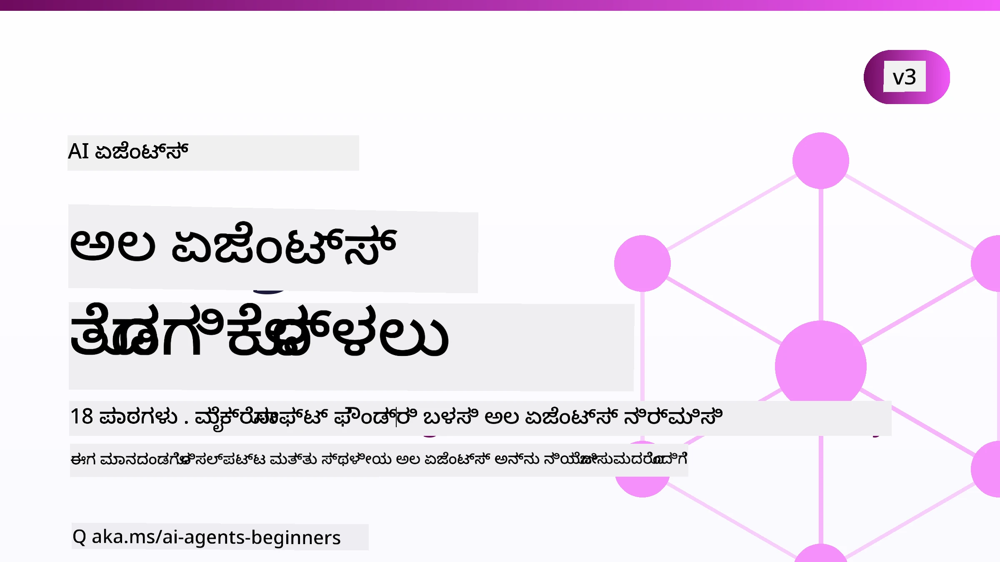

# ಆರಂಭಿಕರಿಗಾಗಿ ಎಐ ಏಜೆಂಟ್ಗಳು - ಒಂದು ಕೋರ್ಸ್



## ಎಐ ಏಜೆಂಟ್ಗಳು ನಿರ್ಮಿಸಲು ಪ್ರಾರಂಭಿಸುವುದಕ್ಕೆ ನಿಮಗೆ ಬೇಕಾದ ಎಲ್ಲವನ್ನೂ ಕಲಿಸುವ ಒಂದು ಕೋರ್ಸ್

[](https://github.com/microsoft/ai-agents-for-beginners/blob/master/LICENSE?WT.mc_id=academic-105485-koreyst)
[](https://GitHub.com/microsoft/ai-agents-for-beginners/graphs/contributors/?WT.mc_id=academic-105485-koreyst)
[](https://GitHub.com/microsoft/ai-agents-for-beginners/issues/?WT.mc_id=academic-105485-koreyst)
[](https://GitHub.com/microsoft/ai-agents-for-beginners/pulls/?WT.mc_id=academic-105485-koreyst)
[](http://makeapullrequest.com?WT.mc_id=academic-105485-koreyst)

### 🌐 ಬಹುಭಾಷಾ ಬೆಂಬಲ

#### GitHub ಆಕ್ಷನ್ ಮೂಲಕ (ಸ್ವಯಂಚಾಲಿತ ಮತ್ತು ಸದಾ ನವೀಕೃತ)

<!-- CO-OP TRANSLATOR LANGUAGES TABLE START -->
[ಅರಬಿಕ್](../ar/README.md) | [ಬಂಗಾಳಿ](../bn/README.md) | [ಬಲ್ಗೇರಿಯನ್](../bg/README.md) | [ಬರ್ಮೀಸ್ (ಮಯನ್ಮಾರ್)](../my/README.md) | [ಚೈನೀಸ್ (ಸರಳೀಕೃತ)](../zh-CN/README.md) | [ಚೈನೀಸ್ (ಪಾರಂಪರಿಕ, ಹಾಂಗ್ ಕಾಂಗ್)](../zh-HK/README.md) | [ಚೈನೀಸ್ (ಪಾರಂಪರಿಕ, ಮಾಕಾವು)](../zh-MO/README.md) | [ಚೈನೀಸ್ (ಪಾರಂಪರಿಕ, ತೈವಾನ್)](../zh-TW/README.md) | [ಕ್ರೊಯೇಷಿಯನ್](../hr/README.md) | [ಚೆಕ್](../cs/README.md) | [ಡೆನಿಷ್](../da/README.md) | [ಡಚ್](../nl/README.md) | [ಎಸ್ತೋನಿಯನ್](../et/README.md) | [ಫಿನ್](../fi/README.md) | [ಫ್ರೆಂಚ್](../fr/README.md) | [ಜರ್ಮನ್](../de/README.md) | [ಗ್ರೀಕ್](../el/README.md) | [ಹೆಬ್ರೂ](../he/README.md) | [ಹಿಂದಿ](../hi/README.md) | [ಹಂಗೇರಿಯನ್](../hu/README.md) | [ಇಂಡೋನೇಶಿಯನ್](../id/README.md) | [ಇಟಾಲಿಯನ್](../it/README.md) | [ಜಪಾನೀಸ್](../ja/README.md) | [ಕನ್ನಡ](./README.md) | [ಖ್ಮೇರ್](../km/README.md) | [ಕೊറിയನ್](../ko/README.md) | [ಲಿಥುವೇನಿಯನ್](../lt/README.md) | [ಮಲಯ್](../ms/README.md) | [ಮಲಯಾಳಂ](../ml/README.md) | [ಮರಾಠಿ](../mr/README.md) | [ನೇಪಾಳಿ](../ne/README.md) | [ನೈಜೀರಿಯನ್ ಪಿಜಿನ್](../pcm/README.md) | [ನಾರ್ವೆಜಿಯನ್](../no/README.md) | [ಪರ್ಷಿಯನ್ (ಫಾರ್ಸಿ)](../fa/README.md) | [ಪೊಲಿಷ್](../pl/README.md) | [ಪೋರ್ಚುಗೀಸ್ (ಬ್ರಾಜಿಲ್)](../pt-BR/README.md) | [ಪೋರ್ಚುಗೀಸ್ (ಪೋರ್ಚುಗಲ್)](../pt-PT/README.md) | [ಪಂಜಾಬಿ (ಗುಗಳಿಖಿ)](../pa/README.md) | [ರೋಮೇನಿಯನ್](../ro/README.md) | [ರಷ್ಯನ್](../ru/README.md) | [ಸರ್ಬಿಯನ್ (ಸಿರಿಲಿಕ್)](../sr/README.md) | [ಸ್ಲೋವಾಕಿಯನ್](../sk/README.md) | [ಸ್ಲೋವೇನಿಯನ್](../sl/README.md) | [ಸ್ಪ್ಯಾನಿಷ್](../es/README.md) | [ಸ್ವಾಹಿಲಿ](../sw/README.md) | [ಸ್ವೀಡಿಷ್](../sv/README.md) | [ಟಾಗಲಾಗ್ (ಫಿಲಿಪಿನೋ)](../tl/README.md) | [ತಮಿಳು](../ta/README.md) | [ತೆಲುಗು](../te/README.md) | [ಥಾಯ್](../th/README.md) | [ಟರ್ಕಿಷ್](../tr/README.md) | [ಉಕ್ರೇನಿಯನ್](../uk/README.md) | [ಉರ್ದು](../ur/README.md) | [ವಿಯೆಟ್ನಾಮೀಸ್](../vi/README.md)

> **ಸ್ಥಳೀಯವಾಗಿ ಕ್ಲೋನ್ ಮಾಡಲು ಇಚ್ಛಿಸುತ್ತಿರುವಿರಾ?**
>
> ಈ ರೆಪೊಸಿಟರಿಯಲ್ಲಿ 50+ ಭಾಷಾ ಅನುವಾದಗಳಿವೆ, ಇದು ಡೌನ್ಲೋಡ್ ಗಾತ್ರವನ್ನು ಗುರುತಿಸುವಂತೆ ಹೆಚ್ಚಿಸುತ್ತದೆ. ಅನುವಾದಗಳಿಲ್ಲದೆ ಕ್ಲೋನ್ ಮಾಡಲು, ಸ್ಪಾರ್ಸ್ ಚೆಕೌಟ್ ಬಳಸಿ:
>
> **ಬಾಷ್ / ಮ್ಯಾಕ್‌ಓಎಸ್ / ಲಿನಕ್ಸು:**
> ```bash
> git clone --filter=blob:none --sparse https://github.com/microsoft/ai-agents-for-beginners.git
> cd ai-agents-for-beginners
> git sparse-checkout set --no-cone '/*' '!translations' '!translated_images'
> ```
>
> **CMD (ವಿಂಡೋಸ್):**
> ```cmd
> git clone --filter=blob:none --sparse https://github.com/microsoft/ai-agents-for-beginners.git
> cd ai-agents-for-beginners
> git sparse-checkout set --no-cone "/*" "!translations" "!translated_images"
> ```
>
> ಇದು ನಿಮಗೆ ಕೋರ್ಸ್ನು ಪೂರ್ಣಗೊಳಿಸಲು ಬೇಕಾದ ಎಲ್ಲವನ್ನೂ ಹೆಚ್ಚು ವೇಗದ ಡೌನ್ಲೋಡ್ ಸಲುವಾಗಿ ನೀಡುತ್ತದೆ.
<!-- CO-OP TRANSLATOR LANGUAGES TABLE END -->

**ನೀವು ಹೆಚ್ಚಿನ ಅನುವಾದ ಭಾಷೆಗಳ ಬೆಂಬಲವನ್ನು ಬಯಸಿದ್ದರೆ, ಅವುಗಳನ್ನು [ಇಲ್ಲಿ](https://github.com/Azure/co-op-translator/blob/main/getting_started/supported-languages.md) ಪಟ್ಟಿ ಮಾಡಲಾಗಿದೆ.**

[](https://GitHub.com/microsoft/ai-agents-for-beginners/watchers/?WT.mc_id=academic-105485-koreyst)
[](https://GitHub.com/microsoft/ai-agents-for-beginners/network/?WT.mc_id=academic-105485-koreyst)
[](https://GitHub.com/microsoft/ai-agents-for-beginners/stargazers/?WT.mc_id=academic-105485-koreyst)

[](https://discord.com/invite/ATgtXmAS5D)


## 🌱 ಪ್ರಾರಂಭಿಸೋಣ

ಈ ಕೋರ್ಸ್ ಎಐ ಏಜೆಂಟ್‌ಗಳನ್ನು ನಿರ್ಮಿಸುವ ಮೂಲಭೂತಗಳನ್ನು ಒಳಗೊಂಡ ಪಾಠಗಳನ್ನು ಹೊಂದಿದೆ. ಪ್ರತಿ ಪಾಠವು ತನ್ನದೇ ವಿಷಯವನ್ನು ಒಳಗೊಂಡಿದೆ ಆದ್ದರಿಂದ ನೀವು ಇಷ್ಟಪಟ್ಟ ಸ್ಥಳದಿಂದ ಪ್ರಾರಂಭಿಸಿ!

ಈ ಕೋರ್ಸ್‌ಗೆ ಬಹುಭಾಷಾ ಬೆಂಬಲವಿದೆ. ನಮ್ಮ [ಲಭ್ಯವಿರುವ ಭಾಷೆಗಳಿಗೆ ಇಲ್ಲಿ](#-multi-language-support) ಹೋಗಿ.

ಇದನ್ನು ನಿಮ್ಮ ಮೊದಲ ಬಾರಿ ಜನರೇಟಿವ್ ಎಐ ಮಾದರಿಗಳೊಂದಿಗೆ ನಿರ್ಮಿಸುತ್ತಿದ್ದರೆ, ನಮ್ಮ [ಆರಂಭಿಕರಲ್ಲಿ ಜನರೇಟಿವ್ ಎಐ](https://aka.ms/genai-beginners) ಕೋರ್ಸ್ ಅನ್ನು ಪರಿಶೀಲಿಸಿ, ಇದು ಜನ್ಐ ಸಂಯೋಜನೆಗೆ 21 ಪಾಠಗಳನ್ನು ಒಳಗೊಂಡಿದೆ.

ಈ ರೆಪೊವನ್ನು [ನಕ್ಷತ್ರ (🌟) ನೀಡಿ](https://docs.github.com/en/get-started/exploring-projects-on-github/saving-repositories-with-stars?WT.mc_id=academic-105485-koreyst) ಮತ್ತು [ಫೋರ್ಕ್ ಮಾಡಿ](https://github.com/microsoft/ai-agents-for-beginners/fork) ಕೋಡ್ ಅನ್ನು ನಡೆಸಲು ಮರೆಯಬೇಡಿ.

### ಇತರ ಕಲಿಕಾರ್ಥಿಗಳನ್ನ ಭೇಟಿ ಮಾಡಿ, ನಿಮ್ಮ ಪ್ರಶ್ನೆಗಳಿಗೆ ಉತ್ತರಗಳನ್ನು ಪಡೆಯಿರಿ

ನೀವು ಅಲ್ಬತ್ತಾ ಅಥವಾ ಎಐ ಏಜೆಂಟ್‌ಗಳನ್ನು ನಿರ್ಮಿಸುವ ಬಗ್ಗೆ ಯಾವುದೇ ಪ್ರಶ್ನೆಗಳಿದ್ದರೆ, ನಮ್ಮ ಬೇಟೆಯಾದ Discord ಚಾನಲ್ ಸೇರಿ [Microsoft Foundry Discord](https://aka.ms/ai-agents/discord) ನಲ್ಲಿ.

### ನಿಮಗೆ ಬೇಕಾಗುವವು

ಈ ಕೋರ್ಸ್‌ನ ಪ್ರತಿ ಪಾಠವು ಕೋಡ್ ಉದಾಹರಣೆಗಳನ್ನು ಹೊಂದಿದ್ದು, ಅವುಗಳನ್ನು code_samples ಫೋಲ್ಡರ್‌ನಲ್ಲಿ ಹುಡುಕಿ. ನೀವು [ಈ ರೆಪೊವನ್ನು ಫೋರ್ಕ್ ಮಾಡಿ](https://github.com/microsoft/ai-agents-for-beginners/fork) ನಿಮ್ಮದೇ ಒಂದು ಪ್ರತಿಯನ್ನು ನಿರ್ಮಿಸಬಹುದು.

ಈ ವ್ಯಾಯಾಮಗಳಲ್ಲಿನ ಕೋಡ್ ಉದಾಹರಣೆಗಳು Microsoft Agent Framework ಹಾಗೂ Microsoft Foundry Agent Service V2 ಅನ್ನು ಬಳಸುತ್ತವೆ:

- [Microsoft Foundry](https://aka.ms/ai-agents-beginners/ai-foundry) -ಏಜರ್ ಖಾತೆ ಅಗತ್ಯವಿದೆ

ಈ ಕೋರ್ಸ್ Microsoft ನಿಂದ ಕೆಳಗಿನ ಎಐ ಏಜೆಂಟ್ ಫ್ರೇಮ್‌ವರ್ಕ್‌ಗಳು ಮತ್ತು ಸೇವೆಗಳು ಬಳಸುತ್ತದೆ:

- [Microsoft Agent Framework (MAF)](https://aka.ms/ai-agents-beginners/agent-framework)
- [Microsoft Foundry Agent Service V2](https://aka.ms/ai-agents-beginners/ai-agent-service)

ಕೆಲವು ಕೋಡ್ ಉದಾಹರಣೆಗಳು ಅಲ್ಟರ್ನೇಟಿವ್ OpenAI ಹೊಂದಾಣಿಕೆಯ ಪೂರೈಕೆದಾರರನ್ನು ಕೂಡ ಬೆಂಬಲಿಸುತ್ತವೆ, ಉದಾಹರಣೆಗೆ [MiniMax](https://platform.minimaxi.com/), ಇದು ದೊಡ್ಡ-ಸಂದರ್ಭ ಮಾದರಿಗಳನ್ನು (204K ಟೋಕನ್ಗಳವರೆಗೂ) ಒದಗಿಸುತ್ತದೆ. ಸಂರಚನಾ ವಿವರಗಳಿಗೆ [ಕೋರ್ಸ್ ಸೆಟ್‌ಅಪ್](./00-course-setup/README.md) ನೋಡಿ.

ಈ ಕೋರ್ಸಿನ ಕೋಡ್ ಚಾಲನೆ ಕುರಿತು ಹೆಚ್ಚಿನ ಮಾಹಿತಿ ಪಡೆಯಲು [ಕೋರ್ಸ್ ಸೆಟ್‌ಅಪ್](./00-course-setup/README.md) ಗೆ ಹೋಗಿ.

## 🙏 ಸಹಾಯ ಮಾಡಲು ಇಚ್ಛಿಸುತ್ತೀರಾ?

ನಿಮಗೆ ಯಾವುದೇ ಸಲಹೆಗಳು ಅಥವಾ ವ್ಯಾಕರಣ ಅಥವಾ ಕೋಡ್ ದೋಷಗಳು ಕಂಡುಬಂದರೆ, [ಅವುಗಳನ್ನು ತಿಳಿಸಿ](https://github.com/microsoft/ai-agents-for-beginners/issues?WT.mc_id=academic-105485-koreyst) ಅಥವಾ [ಪೂಲ್ ವಿನಂತಿ ರಚಿಸಿ](https://github.com/microsoft/ai-agents-for-beginners/pulls?WT.mc_id=academic-105485-koreyst)


## 📂 ಪ್ರತಿ ಪಾಠದಲ್ಲಿ ಸೇರಿವೆ

- README ನಲ್ಲಿ ಬರೆಯಲಾದ ಪಾಠ ಮತ್ತು ಅಲ್ಪ ವಿಡಿಯೋ
- Microsoft Agent Framework ಮತ್ತು Microsoft Foundry ಬಳಸುವ Python ಕೋಡ್ ಉದಾಹರಣೆಗಳು
- ನಿಮ್ಮ ಕಲಿಕೆಯನ್ನು ಮುಂದುವರಿಸಲು ಹೆಚ್ಚುವರಿ ಸಂಪನ್ಮೂಲಗಳ ಲಿಂಕ್ಗಳು


## 🗃️ ಪಾಠಗಳು

| **ಪಾಠ**                                   | **ಲೆಖನ ಮತ್ತು ಕೋಡ್**                                    | **ವೀಡಿಯೋ**                                                  | **ಹೆಚ್ಚಿನ ಕಲಿಕೆ**                                                                    |
|----------------------------------------------|----------------------------------------------------|------------------------------------------------------------|---------------------------------------------------------------------------------------|
| ಎಐ ಏಜೆಂಟ್‌ಗಳಿಗೆ ಪರಿಚಯ ಮತ್ತು ಏಜೆಂಟ್ ಬಳಕೆದಾರಿಕೆ | [ಕೊಂಡಿ](./01-intro-to-ai-agents/README.md)          | [ವೀಡಿಯೋ](https://youtu.be/3zgm60bXmQk?si=z8QygFvYQv-9WtO1)  | [ಕೊಂಡಿ](https://aka.ms/ai-agents-beginners/collection?WT.mc_id=academic-105485-koreyst) |
| ಎಐ ಏಜೆಂಟಿಕ್ ಫ್ರೇಮ್‌ವರ್ಕ್‌ಗಳನ್ನು ಅನ್ವೇಷಣೆ ಮಾಡುವುದು | [ಕೊಂಡಿ](./02-explore-agentic-frameworks/README.md)  | [ವೀಡಿಯೋ](https://youtu.be/ODwF-EZo_O8?si=Vawth4hzVaHv-u0H)  | [ಕೊಂಡಿ](https://aka.ms/ai-agents-beginners/collection?WT.mc_id=academic-105485-koreyst) |
| ಎಐ ಏಜೆಂಟಿಕ್ ವಿನ್ಯಾಸ ಮಾದರಿಗಳನ್ನು հասկಿಕೊಳ್ಳುವುದು | [ಕೊಂಡಿ](./03-agentic-design-patterns/README.md)     | [ವೀಡಿಯೋ](https://youtu.be/m9lM8qqoOEA?si=BIzHwzstTPL8o9GF)  | [ಕೊಂಡಿ](https://aka.ms/ai-agents-beginners/collection?WT.mc_id=academic-105485-koreyst) |
| ಉಪಕರಣ ಬಳಕೆ ವಿನ್ಯಾಸ ಮಾದರಿ                      | [ಕೊಂಡಿ](./04-tool-use/README.md)                    | [ವೀಡಿಯೋ](https://youtu.be/vieRiPRx-gI?si=2z6O2Xu2cu_Jz46N)  | [ಕೊಂಡಿ](https://aka.ms/ai-agents-beginners/collection?WT.mc_id=academic-105485-koreyst) |
| ಏಜೆಂಟಿಕ್ RAG                                  | [ಕೊಂಡಿ](./05-agentic-rag/README.md)                 | [ವೀಡಿಯೋ](https://youtu.be/WcjAARvdL7I?si=gKPWsQpKiIlDH9A3)  | [ಕೊಂಡಿ](https://aka.ms/ai-agents-beginners/collection?WT.mc_id=academic-105485-koreyst) |
| ನಂಬಿಗಸ್ತ ಎಐ ಏಜೆಂಟ್ ಕಂಡು ನಿರ್ಮಿಸುವುದು         | [ಕೊಂಡಿ](./06-building-trustworthy-agents/README.md) | [ವೀಡಿಯೋ](https://youtu.be/iZKkMEGBCUQ?si=jZjpiMnGFOE9L8OK ) | [ಕೊಂಡಿ](https://aka.ms/ai-agents-beginners/collection?WT.mc_id=academic-105485-koreyst) |
| ಯೋಜನೆ ವಿನ್ಯಾಸ ಮಾದರಿ                            | [ಕೊಂಡಿ](./07-planning-design/README.md)             | [ವೀಡಿಯೋ](https://youtu.be/kPfJ2BrBCMY?si=6SC_iv_E5-mzucnC)  | [ಕೊಂಡಿ](https://aka.ms/ai-agents-beginners/collection?WT.mc_id=academic-105485-koreyst) |
| ಬಹು-ಏಜೆಂಟ್ ವಿನ್ಯಾಸ ಮಾದರಿ                       | [ಕೊಂಡಿ](./08-multi-agent/README.md)                 | [ವೀಡಿಯೋ](https://youtu.be/V6HpE9hZEx0?si=rMgDhEu7wXo2uo6g)  | [ಕೊಂಡಿ](https://aka.ms/ai-agents-beginners/collection?WT.mc_id=academic-105485-koreyst) |

| ಮೆಟಾಕಾಗ್ನಿಷನ್ ಡಿಸೈನ್ ಪ್ಯಾಟರ್ನ್                 | [Link](./09-metacognition/README.md)               | [Video](https://youtu.be/His9R6gw6Ec?si=8gck6vvdSNCt6OcF)  | [Link](https://aka.ms/ai-agents-beginners/collection?WT.mc_id=academic-105485-koreyst) |
| ಉತ್ಪಾದನೆಯಲ್ಲಿ AI ಏಜೆಂಟ್ಸ್                      | [Link](./10-ai-agents-production/README.md)        | [Video](https://youtu.be/l4TP6IyJxmQ?si=31dnhexRo6yLRJDl)  | [Link](https://aka.ms/ai-agents-beginners/collection?WT.mc_id=academic-105485-koreyst) |
| ಏಜೆಂಟಿಕ್ ಪ್ರೋಟೋಕಾಲ್ಗಳ ಬಳಕೆ (MCP, A2A ಮತ್ತು NLWeb) | [Link](./11-agentic-protocols/README.md)           | [Video](https://youtu.be/X-Dh9R3Opn8)                                 | [Link](https://aka.ms/ai-agents-beginners/collection?WT.mc_id=academic-105485-koreyst) |
| AI ಏಜೆಂಟ್ಸ್ಗಾಗಿ ಕಾನ್ಟೆಕ್ಸ್ಟ್ ಎಂಜಿನಿಯರಿಂಗ್            | [Link](./12-context-engineering/README.md)         | [Video](https://youtu.be/F5zqRV7gEag)                                 | [Link](https://aka.ms/ai-agents-beginners/collection?WT.mc_id=academic-105485-koreyst) |
| ಏಜೆಂಟಿಕ್ ಮೆಮೊರಿಯನ್ನು ನಿರ್ವಹಿಸುವಿಕೆ                      | [Link](./13-agent-memory/README.md)     |      [Video](https://youtu.be/QrYbHesIxpw?si=vZkVwKrQ4ieCcIPx)                                                      |                                                                                        |
| ಮೈಸ್ರೋಸಾಫ್ಟ್ ಏಜೆಂಟ್ ಫ್ರೇಮ್ವರ್ಕ್ ಅನ್ವೇಷಣೆ                         | [Link](./14-microsoft-agent-framework/README.md)                            |                                                            |                                                                                        |
| ಕಂಪ್ಯೂಟರ್ ಬಳಕೆಯ ಏಜೆಂಟ್ಸ್ ನಿರ್ಮಾಣ (CUA)           | [Link](./15-browser-use/README.md)     |                                                            | [Link](https://docs.browser-use.com/examples/templates/playwright-integration)         |
| ವಿಸ್ತಾರಗೊಳ್ಳುವ ಏಜೆಂಟ್ಸ್ ಅನ್ನು ನಿಯೋಜಿಸುವಿಕೆ                    | [Link](./16-deploying-scalable-agents/README.md) |                                                    | [Link](https://learn.microsoft.com/azure/ai-foundry/agents/overview)                   |
| ಸ್ಥಳೀಯ AI ಏಜೆಂಟ್ಸ್ ರಚನೆ                     | [Link](./17-creating-local-ai-agents/README.md)  |                                                    | [Link](https://learn.microsoft.com/azure/ai-foundry/foundry-local/)                    |
| AI ಏಜೆಂಟ್ಸ್ ಅನ್ನು ಸುರಕ್ಷಿತಗೊಳಿಸುವಿಕೆ                           | [Link](./18-securing-ai-agents/README.md)  |                                                            | [Link](https://aka.ms/ai-agents-beginners/collection?WT.mc_id=academic-105485-koreyst) |

## 🎒 ಇतर ಕೋರ್ಸುಗಳು

ನಮ್ಮ ತಂಡ ಇತರ ಕೋರ್ಸುಗಳನ್ನು ಉತ್ಪಾದಿಸುತ್ತದೆ! ನೋಡಿರಿ:

<!-- CO-OP TRANSLATOR OTHER COURSES START -->
### ಲಾಂಗ್ಚೈನ್
[](https://aka.ms/langchain4j-for-beginners)
[](https://aka.ms/langchainjs-for-beginners?WT.mc_id=m365-94501-dwahlin)
[](https://github.com/microsoft/langchain-for-beginners?WT.mc_id=m365-94501-dwahlin)
---

### ಅಜೂರ್ / ಎಜ್ / MCP / ಏಜೆಂಟ್ಸ್
[](https://github.com/microsoft/AZD-for-beginners?WT.mc_id=academic-105485-koreyst)
[](https://github.com/microsoft/edgeai-for-beginners?WT.mc_id=academic-105485-koreyst)
[](https://github.com/microsoft/mcp-for-beginners?WT.mc_id=academic-105485-koreyst)
[](https://github.com/microsoft/ai-agents-for-beginners?WT.mc_id=academic-105485-koreyst)

---
 
### ಜನರೆಟಿವ್ AI ಸರಣಿ
[](https://github.com/microsoft/generative-ai-for-beginners?WT.mc_id=academic-105485-koreyst)
[-9333EA?style=for-the-badge&labelColor=E5E7EB&color=9333EA)](https://github.com/microsoft/Generative-AI-for-beginners-dotnet?WT.mc_id=academic-105485-koreyst)

[-C084FC?style=for-the-badge&labelColor=E5E7EB&color=C084FC)](https://github.com/microsoft/generative-ai-for-beginners-java?WT.mc_id=academic-105485-koreyst)
[-E879F9?style=for-the-badge&labelColor=E5E7EB&color=E879F9)](https://github.com/microsoft/generative-ai-with-javascript?WT.mc_id=academic-105485-koreyst)

---
 
### ಕೋರ್‌ ಅಧ್ಯಯನ
[](https://aka.ms/ml-beginners?WT.mc_id=academic-105485-koreyst)
[](https://aka.ms/datascience-beginners?WT.mc_id=academic-105485-koreyst)
[](https://aka.ms/ai-beginners?WT.mc_id=academic-105485-koreyst)
[](https://github.com/microsoft/Security-101?WT.mc_id=academic-96948-sayoung)
[](https://aka.ms/webdev-beginners?WT.mc_id=academic-105485-koreyst)
[](https://aka.ms/iot-beginners?WT.mc_id=academic-105485-koreyst)
[](https://github.com/microsoft/xr-development-for-beginners?WT.mc_id=academic-105485-koreyst)

---
 
### ಕೋಪಿಲಾಟ್ ಸರಣಿ
[](https://aka.ms/GitHubCopilotAI?WT.mc_id=academic-105485-koreyst)
[](https://github.com/microsoft/mastering-github-copilot-for-dotnet-csharp-developers?WT.mc_id=academic-105485-koreyst)
[](https://github.com/microsoft/CopilotAdventures?WT.mc_id=academic-105485-koreyst)
<!-- CO-OP TRANSLATOR OTHER COURSES END -->

## 🌟 ಸಮುದಾಯಕ್ಕೆ ಧನ್ಯವಾದಗಳು

ಏಜೆಂಟಿಕ್ RAG ಅನ್ನು ತೋರಿಸುವ ಮಹತ್ವದ ಕೋಡ್ ಮಾದರಿಗಳನ್ನು ಕೊಡುಗೆ ನೀಡಿದ [ಶಿವಂ ಗೋಯಲ್](https://www.linkedin.com/in/shivam2003/) ಅವರಿಗೆ ಧನ್ಯವಾದಗಳು.

## ಕೊಡುಗೆ ನೀಡುವುದು

ಈ ಯೋಜನೆಗೆ ಕೊಡುಗೆಗಳು ಮತ್ತು ಸಲಹೆಗಳನ್ನು ಸ್ವಾಗತಿಸುತ್ತದೆ. ಹೆಚ್ಚಿನ ಕೊಡುಗೆಗಳಿಗೆ ನೀವು ಒಪ್ಪಿಗೆ ನೀಡಬೇಕು
ಕೊಡುಗೆ ನೀಡುವ ಹಕ್ಕುಗಳನ್ನು ನೀವು ಹೊಂದಿದ್ದೀರಾ ಮತ್ತು ನಿಜವಾಗಿಯೂ ಹೊಂದಿದ್ದೀರಾ ಎಂದು ಘೋಷಿಸುವ
ಸಹಯೋಗಿ ಪರವಾನಿಗೆ ಒಪ್ಪಂದ (CLA). ವಿವರಗಳಿಗೆ, ಭೇಟಿ ನೀಡಿ <https://cla.opensource.microsoft.com>.

ನೀವು ಪುಲ್ ವಿನಂತಿಯನ್ನು ಸಲ್ಲಿಸುವಾಗ, CLA ಬಾಟ್ ಸ್ವಯಂಚಾಲಿತವಾಗಿ ನಿರ್ಧರಿಸುತ್ತದೆ ನೀವು CLA ಒದಗಿಸಬೇಕು ಎಂದು
ಮತ್ತು PR ಅನ್ನು ಸರಿಯಾಗಿ ಅಲಂಕರಿಸುತ್ತದೆ (ಉದಾ: ಸ್ಥಿತಿ ಪರಿಶೀಲನೆ, ಟಿಪ್ಪಣಿ). ಬಾಟ್ ನೀಡುವ ನಿರ್ದೇಶನಗಳನ್ನು ಅನುಸರಿಸಿ.
ನೀವು ಈ ಕಾರ್ಯವನ್ನು ನಮ್ಮ ಎಲ್ಲಾ ರಿಪೋಗಳ ಮೂಲಕ ಒಂದೇ ಬಾರಿ ಮಾತ್ರ ಮಾಡಬೇಕಾಗುತ್ತದೆ.

ಈ ಯೋಜನೆ [Microsoft Open Source Code of Conduct](https://opensource.microsoft.com/codeofconduct/) ಅನ್ನು ಅಂಗೀಕರಿಸಿದೆ.
ಹೆಚ್ಚಿನ ಮಾಹಿತಿಗೆ [Code of Conduct FAQ](https://opensource.microsoft.com/codeofconduct/faq/) ನೋಡಿ ಅಥವಾ
ಯಾವುದೇ ಹೆಚ್ಚುವರಿ ಪ್ರಶ್ನೆಗಳಿಗಾಗಿ ಅಥವಾ ಟಿಪ್ಪಣಿಗಳಿಗಾಗಿ [opencode@microsoft.com](mailto:opencode@microsoft.com) ಗೆ ಸಂಪರ್ಕಿಸಿ.

## ವ್ಯಾಪಾರ ಗುರುತುಗಳು

ಈ ಯೋಜನೆಯಲ್ಲಿ ಪ್ರಾಜೆಕ್ಟ್ಗಳು, ಉತ್ಪನ್ನಗಳು ಅಥವಾ ಸೇವೆಗಳ ವ್ಯಾಪಾರ ಗುರುತುಗಳು ಅಥವಾ ಲೋಗೋಗಳು ಇರಬಹುದು. ಮೈಕ್ರೋಸಾಫ್ಟ್
ವ್ಯಾಪಾರ ಗುರುತುಗಳ ಅಥವಾ ಲೋಗೋಗಳ ಅಧಿಕೃತ ಬಳಕೆ, [Microsoft's Trademark & Brand Guidelines](https://www.microsoft.com/legal/intellectualproperty/trademarks/usage/general) ಮುಟ್ಟಿದಂತೆ ಮತ್ತು ಅನುಸರಿಸುವಂತೆ ಇರಬೇಕು.

ಈ ಯೋಜನೆಯ ಪರಿಷ್ಕೃತ ಆವೃತ್ತಿಗಳಲ್ಲಿ ಮೈಕ್ರೋಸಾಫ್ಟ್ ವ್ಯಾಪಾರ ಗುರುತುಗಳ ಅಥವಾ ಲೋಗೋಗಳ ಬಳಕೆ ಗೊಂದಲ ಸೃಷ್ಟಿಸಬಾರದು ಅಥವಾ ಮೈಕ್ರೋಸಾಫ್ಟ್ ಪ್ರಾಯೋಜನೆಯನ್ನು ಸೂಚಿಸಬಾರದು.
ಮೂರನೇ ಪಕ್ಷದ ವ್ಯಾಪಾರ ಗುರುತುಗಳ ಅಥವಾ ಲೋಗೋಗಳ ಯಾವುದೇ ಬಳಕೆ ಆ ಮೂರನೇ ಪಕ್ಷದ ನೀತಿಗಳ ಆಧೀನದಲ್ಲಿದೆ.

## ಸಹಾಯ ಪಡೆದುಕೊಳ್ಳುವುದು


ನೀವು ಅಡ್ಡಿಪಡಿದರೆ ಅಥವಾ AI ಅಪ್ಲಿಕೇಶನ್‌ಗಳ ನಿರ್ಮಾಣ ಕುರಿತು ಯಾವುದೇ ಪ್ರಶ್ನೆಗಳಿದ್ದರೆ, ಈ ಜಾಯಿಂನ್ ಆಗಿ:

[](https://aka.ms/foundry/discord)

ಉತ್ಪನ್ನ ಪ್ರತಿಕ್ರಿಯೆ ಅಥವಾ ನಿರ್ಮಾಣದ ಸಮಯದಲ್ಲಿ ದೋಷಗಳಿದ್ದರೆ ಭೇಟಿನೀಡಿ:


[](https://aka.ms/foundry/forum)

---

<!-- CO-OP TRANSLATOR DISCLAIMER START -->
**ಅಸ್ವೀಕಾರ**:
ಈ ದಸ್ತಾವೇಜು AI ಅನುವಾದ ಸೇವೆ [Co-op Translator](https://github.com/Azure/co-op-translator) ಬಳಸಿ ಅನುವಾದಿಸಲಾಗಿದೆ. ನಾವು ನಿಖರತೆಯನ್ನು ಸಾಧಿಸಲು ಪ್ರಯತ್ನಿಸುತ್ತಿದ್ದರೂ, ದಯವಿಟ್ಟು ಗಮನಿಸಿ, ಸ್ವಯಂಚಾಲಿತ ಅನುವಾದಗಳಲ್ಲಿ ದೋಷಗಳು ಅಥವಾ ಅಸಡ್ಡೆಗಳು ಇರಬಹುದು. ಮೂಲ ಭಾಷೆಯಲ್ಲಿರುವ ಮೂಲ ದಸ್ತಾವೇಜು ಪ್ರಾಮಾಣಿಕ ಮೂಲವೆಂದು ಪರಿಗಣಿಸಬೇಕು. ಪ್ರಮುಖ ಮಾಹಿತಿಗಾಗಿ, ವೃತ್ತಿಪರ ಮಾನವ ಅನುವಾದವನ್ನು ಶಿಫಾರಸು ಮಾಡಲಾಗುತ್ತದೆ. ಈ ಅನುವಾದವನ್ನು ಬಳಸುವ ಮೂಲಕ ಉಂಟಾಗುವ ಯಾವುದೇ ತಪ್ಪು ಅರ್ಥಗಳ ಅಥವಾ ತಪ್ಪು ವ್ಯಾಖ್ಯಾನಗಳ ಬಗ್ಗೆ ನಾವು ಹೊಣೆಗಾರರಲ್ಲ.
<!-- CO-OP TRANSLATOR DISCLAIMER END -->