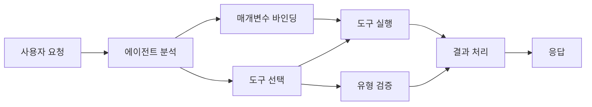

# 🛠️ Azure OpenAI(.NET) 응답 API를 활용한 고급 도구 사용

## 📋 학습 목표

이 노트북은 Azure OpenAI(Responses API)와 .NET에서 Microsoft Agent Framework를 사용하여 엔터프라이즈 수준의 도구 통합 패턴을 보여줍니다. C#의 강력한 형식 지정과 .NET의 엔터프라이즈 기능을 활용하여 여러 전문 도구를 갖춘 정교한 에이전트를 구축하는 방법을 익힙니다.

### 여러분이 마스터하게 될 고급 도구 기능

- 🔧 **다중 도구 아키텍처**: 여러 전문 기능을 갖춘 에이전트 구축
- 🎯 **형식 안전 도구 실행**: C#의 컴파일 타임 검증 활용
- 📊 **엔터프라이즈 도구 패턴**: 프로덕션 대비 도구 설계 및 오류 처리
- 🔗 **도구 조합**: 복잡한 비즈니스 워크플로를 위한 도구 결합

## 🎯 .NET 도구 아키텍처의 이점

### 엔터프라이즈 도구 기능

- **컴파일 타임 검증**: 강력한 형식 지정으로 도구 매개변수 정확성 보장
- **의존성 주입**: 도구 관리를 위한 IoC 컨테이너 통합
- **Async/Await 패턴**: 적절한 리소스 관리를 통해 논블로킹 도구 실행
- **구조화 로그**: 도구 실행 모니터링을 위한 내장 로깅 통합

### 프로덕션 준비 패턴

- **예외 처리**: 형식화된 예외를 통한 포괄적 오류 관리
- **리소스 관리**: 적절한 해제 패턴 및 메모리 관리
- **성능 모니터링**: 내장 메트릭 및 성능 카운터
- **구성 관리**: 검증이 포함된 형식 안전 구성

## 🔧 기술 아키텍처

### 핵심 .NET 도구 구성 요소

- **Microsoft.Extensions.AI**: 통합 도구 추상화 계층
- **Microsoft.Agents.AI**: 엔터프라이즈 수준 도구 오케스트레이션
- **Azure OpenAI (Responses API)**: 연결 풀링을 지원하는 고성능 API 클라이언트

### 도구 실행 파이프라인



## 🛠️ 도구 카테고리 및 패턴

### 1. **데이터 처리 도구**

- **입력 검증**: 데이터 주석을 활용한 강력한 형식 지정
- **변환 작업**: 형식 안전 데이터 변환 및 포매팅
- **비즈니스 로직**: 도메인 특화 계산 및 분석 도구
- **출력 포맷팅**: 구조화된 응답 생성

### 2. **통합 도구**

- **API 커넥터**: HttpClient를 이용한 RESTful 서비스 통합
- **데이터베이스 도구**: Entity Framework 통합을 통한 데이터 액세스
- **파일 작업**: 검증을 통한 안전한 파일 시스템 작업
- **외부 서비스**: 타사 서비스 통합 패턴

### 3. **유틸리티 도구**

- **텍스트 처리**: 문자열 조작 및 포맷팅 유틸리티
- **날짜/시간 작업**: 문화권 인식 날짜/시간 계산
- **수학 도구**: 정밀 계산 및 통계 작업
- **검증 도구**: 비즈니스 규칙 검증 및 데이터 확인

강력하고 형식 안전한 도구 기능을 갖춘 엔터프라이즈급 에이전트를 .NET에서 구축할 준비가 되셨나요? 전문급 솔루션을 설계해 봅시다! 🏢⚡

## 🚀 시작하기

### 사전 요구사항

- [.NET 10 SDK](https://dotnet.microsoft.com/download/dotnet/10.0) 이상
- Azure OpenAI 리소스와 모델 배포가 포함된 [Azure 구독](https://azure.microsoft.com/free/)
- 로그인한 상태의 [Azure CLI](https://learn.microsoft.com/cli/azure/install-azure-cli) — `az login`로 로그인

### 필요한 환경 변수

```bash
# zsh/bash
export AZURE_OPENAI_ENDPOINT=https://<your-resource>.openai.azure.com
export AZURE_OPENAI_DEPLOYMENT=gpt-5-mini
# 그런 다음 AzureCliCredential이 토큰을 얻을 수 있도록 로그인하세요
az login
```

```powershell
# PowerShell
$env:AZURE_OPENAI_ENDPOINT = "https://<your-resource>.openai.azure.com"
$env:AZURE_OPENAI_DEPLOYMENT = "gpt-5-mini"
# 그런 다음 AzureCliCredential이 토큰을 얻을 수 있도록 로그인합니다
az login
```

### 샘플 코드

예제 코드를 실행하려면,

```bash
# zsh/bash
chmod +x ./04-dotnet-agent-framework.cs
./04-dotnet-agent-framework.cs
```

또는 dotnet CLI를 사용하세요:

```bash
dotnet run ./04-dotnet-agent-framework.cs
```

전체 코드는 [`04-dotnet-agent-framework.cs`](../../../../04-tool-use/code_samples/04-dotnet-agent-framework.cs)에서 확인하세요.

```csharp
#!/usr/bin/dotnet run

#:package Microsoft.Extensions.AI@10.*
#:package Microsoft.Agents.AI.OpenAI@1.*-*
#:package Azure.AI.OpenAI@2.1.0
#:package Azure.Identity@1.13.1

using System.ComponentModel;

using Microsoft.Agents.AI;
using Microsoft.Extensions.AI;

using Azure.AI.OpenAI;
using Azure.Identity;

// Tool Function: Random Destination Generator
// This static method will be available to the agent as a callable tool
// The [Description] attribute helps the AI understand when to use this function
// This demonstrates how to create custom tools for AI agents
[Description("Provides a random vacation destination.")]
static string GetRandomDestination()
{
    // List of popular vacation destinations around the world
    // The agent will randomly select from these options
    var destinations = new List<string>
    {
        "Paris, France",
        "Tokyo, Japan",
        "New York City, USA",
        "Sydney, Australia",
        "Rome, Italy",
        "Barcelona, Spain",
        "Cape Town, South Africa",
        "Rio de Janeiro, Brazil",
        "Bangkok, Thailand",
        "Vancouver, Canada"
    };

    // Generate random index and return selected destination
    // Uses System.Random for simple random selection
    var random = new Random();
    int index = random.Next(destinations.Count);
    return destinations[index];
}

// Azure OpenAI with the Responses API (stable v1 endpoint). Sign in with `az login`.
var azureEndpoint = Environment.GetEnvironmentVariable("AZURE_OPENAI_ENDPOINT")
    ?? throw new InvalidOperationException("AZURE_OPENAI_ENDPOINT is not set.");
var deployment = Environment.GetEnvironmentVariable("AZURE_OPENAI_DEPLOYMENT") ?? "gpt-5-mini";

var azureClient = new AzureOpenAIClient(new Uri(azureEndpoint), new AzureCliCredential());

// Define Agent Identity and Comprehensive Instructions
// Agent name for identification and logging purposes
var AGENT_NAME = "TravelAgent";

// Detailed instructions that define the agent's personality, capabilities, and behavior
// This system prompt shapes how the agent responds and interacts with users
var AGENT_INSTRUCTIONS = """
You are a helpful AI Agent that can help plan vacations for customers.

Important: When users specify a destination, always plan for that location. Only suggest random destinations when the user hasn't specified a preference.

When the conversation begins, introduce yourself with this message:
"Hello! I'm your TravelAgent assistant. I can help plan vacations and suggest interesting destinations for you. Here are some things you can ask me:
1. Plan a day trip to a specific location
2. Suggest a random vacation destination
3. Find destinations with specific features (beaches, mountains, historical sites, etc.)
4. Plan an alternative trip if you don't like my first suggestion

What kind of trip would you like me to help you plan today?"

Always prioritize user preferences. If they mention a specific destination like "Bali" or "Paris," focus your planning on that location rather than suggesting alternatives.
""";

// Create AI Agent with Advanced Travel Planning Capabilities
// Get the Responses client for the deployment and create the AI agent
// Configure agent with name, detailed instructions, and available tools
// This demonstrates the .NET agent creation pattern with full configuration
AIAgent agent = azureClient
    .GetChatClient(deployment)
    .AsAIAgent(
        name: AGENT_NAME,
        instructions: AGENT_INSTRUCTIONS,
        tools: [AIFunctionFactory.Create(GetRandomDestination)]
    );

// Create New Conversation Session for Context Management
// Initialize a new conversation session to maintain context across multiple interactions
// Sessions enable the agent to remember previous exchanges and maintain conversational state
// This is essential for multi-turn conversations and contextual understanding
await using var session = await agent.CreateSessionAsync();

// Execute Agent: First Travel Planning Request
// Run the agent with an initial request that will likely trigger the random destination tool
// The agent will analyze the request, use the GetRandomDestination tool, and create an itinerary
// Using the session parameter maintains conversation context for subsequent interactions
await foreach (var update in agent.RunStreamingAsync("Plan me a day trip", session))
{
    await Task.Delay(10);
    Console.Write(update);
}

Console.WriteLine();

// Execute Agent: Follow-up Request with Context Awareness
// Demonstrate contextual conversation by referencing the previous response
// The agent remembers the previous destination suggestion and will provide an alternative
// This showcases the power of conversation sessions and contextual understanding in .NET agents
await foreach (var update in agent.RunStreamingAsync("I don't like that destination. Plan me another vacation.", session))
{
    await Task.Delay(10);
    Console.Write(update);
}
```

---

<!-- CO-OP TRANSLATOR DISCLAIMER START -->
**면책 조항**:
이 문서는 AI 번역 서비스 [Co-op Translator](https://github.com/Azure/co-op-translator)를 사용하여 번역되었습니다. 정확성을 기하기 위해 노력하고 있으나, 자동 번역은 오류나 부정확한 부분이 있을 수 있음을 유의하시기 바랍니다. 원본 문서의 원어본이 권위 있는 자료로 간주되어야 합니다. 중요한 정보의 경우, 전문가의 인간 번역을 권장합니다. 이 번역 사용으로 인해 발생하는 오해나 잘못된 해석에 대해 당사는 책임을 지지 않습니다.
<!-- CO-OP TRANSLATOR DISCLAIMER END -->