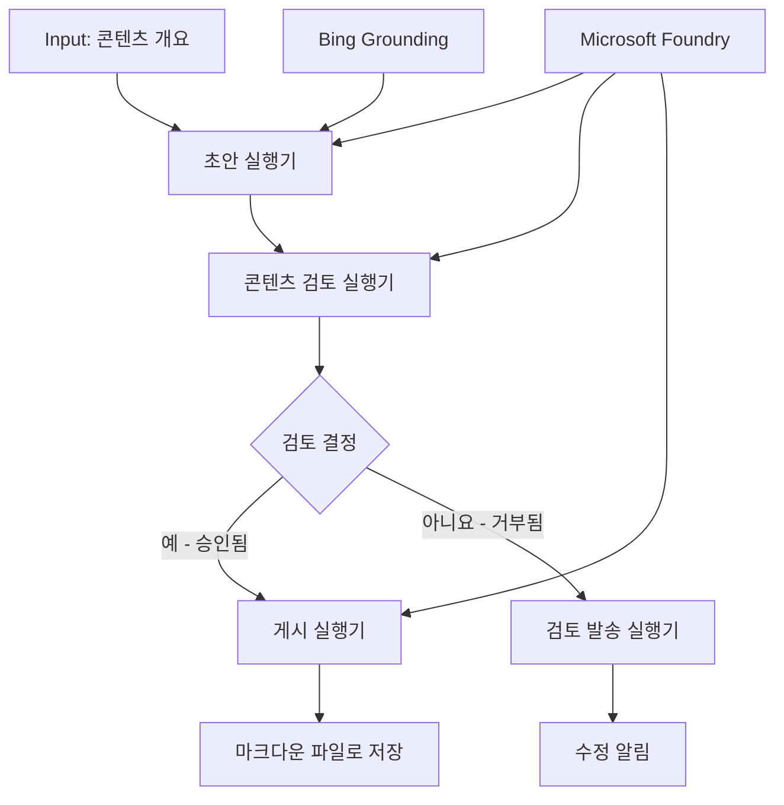

# 🔀 Microsoft Foundry(.NET)를 활용한 조건부 에이전트 워크플로

## 📋 지능형 결정 기반 워크플로 튜토리얼

이 노트북에서는 Microsoft Foundry와 Microsoft Agent Framework for .NET을 사용한 <strong>조건부 워크플로 패턴</strong>을 시연합니다. AI 분석, 비즈니스 규칙, 동적 조건에 따른 지능적 라우팅을 기반으로 하는 복잡하고 의사결정 중심의 워크플로를 구축하는 방법을 배웁니다.

## 🎯 학습 목표

### 🧠 **지능형 결정 아키텍처**
- **조건부 논리 구현**: 여러 분기점을 가진 복잡한 결정 트리 구축
- **AI 기반 라우팅**: Microsoft Foundry 모델을 사용하여 지능적인 라우팅 결정 수행
- **동적 워크플로 적응**: 실행 시 분석 및 조건에 따라 워크플로 동작 수정
- **엔터프라이즈 규칙 통합**: 비즈니스 로직과 컴플라이언스 요구사항을 워크플로에 포함

### 🔀 **고급 조건부 패턴**
- **다중 기준 의사결정**: 라우팅 결정을 위한 여러 요소 평가
- **컨텍스트 인식 처리**: 누적된 워크플로 컨텍스트와 이력을 기반으로 결정
- **적응형 워크플로 수정**: 실시간 조건에 따라 처리 경로를 동적으로 조정
- **규칙 엔진 통합**: 워크플로 내에서 정교한 비즈니스 규칙 엔진 구현

### 🏢 **엔터프라이즈 조건부 응용 사례**
- **문서 분류 및 라우팅**: 문서를 자동으로 분류하고 적절한 워크플로로 라우팅
- **고객서비스 분류**: 고객 문의 사항을 전문 처리 팀으로 지능적 라우팅
- **컴플라이언스 및 위험 처리**: 위험 평가에 따른 다양한 검증 및 검토 프로세스 적용
- **품질 보증 워크플로**: 품질 지표에 따른 적절한 검토 과정으로 콘텐츠 라우팅

## ⚙️ 사전 준비 및 설정

### 📦 **필수 NuGet 패키지**

조건부 워크플로 처리용 고급 패키지:

```xml
<!-- Core AI Framework -->
<PackageReference Include="Microsoft.Extensions.AI" Version="9.9.0" />

<!-- Azure AI Agents with Persistent State -->
<PackageReference Include="Azure.AI.Agents.Persistent" Version="1.2.0-beta.5" />

<!-- Azure Identity and Utilities -->
<PackageReference Include="Azure.Identity" Version="1.15.0" />
<PackageReference Include="System.Linq.Async" Version="6.0.3" />
<PackageReference Include="DotNetEnv" Version="3.1.1" />

<!-- Local Workflow Framework References -->
<!-- Microsoft.Agents.Workflows.dll - Advanced workflow orchestration -->
<!-- Microsoft.Agents.AI.AzureAI.dll - Microsoft Foundry integration -->
<!-- Microsoft.Agents.AI.dll - Core agent abstractions -->
```

### 🔑 **Microsoft Foundry 구성**

**필수 Azure 리소스:**
- 조건부 처리 모델이 포함된 Microsoft Foundry 작업 공간
- 적절한 컴퓨트 할당량과 권한을 갖춘 Azure 구독
- 의사결정 및 콘텐츠 분석을 위한 배포된 AI 모델
- (선택 사항) 접지 기능용 Bing Search API 연결

**환경 구성(.env 파일):**
```env
# Microsoft Foundry Configuration
AZURE_AI_PROJECT_ENDPOINT=https://your-project.cognitiveservices.azure.com/
BING_CONNECTION_ID=your-bing-connection-id
```

**인증 설정:**
```csharp
// Azure CLI or Managed Identity authentication
using Azure.Identity;
var credential = new AzureCliCredential();

// Load environment configuration
DotNetEnv.Env.Load("../../../.env");
```

### 🏗️ **조건부 워크플로 아키텍처**



**핵심 구성 요소:**
- **초안 실행기**: 개요에서 초안 콘텐츠를 생성하는 AI 에이전트
- **콘텐츠 검토 실행기**: 초안 품질 및 컴플라이언스 평가 AI 에이전트
- **조건부 라우팅**: 검토 결과에 따른 라우팅 결정 논리
- **게시/검토 경로**: 승인된 콘텐츠와 거부된 콘텐츠의 별도 처리 경로
- **상태 관리**: 전체 워크플로 동안 콘텐츠 및 검토 컨텍스트 유지

## 🎨 **조건부 워크플로 디자인 패턴**

### 📋 **품질 게이트가 포함된 콘텐츠 제작**
```
Outline → Draft Creation → Quality Review → {Approve: Publish | Reject: Revise}
```

### 🎯 **위험 기반 문서 처리**
```
Document → Risk Assessment → {Low: Standard | High: Enhanced Review}
```

### 🔍 **지능형 고객 서비스 라우팅**
```
Customer Query → Analysis → {Simple: FAQ Bot | Complex: Human Agent}
```

### 💼 **컴플라이언스 중심 워크플로**
```
Content → Compliance Check → {Pass: Publish | Fail: Legal Review}
```

## 🏢 **엔터프라이즈 조건부 이점**

### 🎯 **지능형 자동화**
- **스마트 의사결정**: 콘텐츠 분석과 컨텍스트 기반의 AI 지원 라우팅 결정
- **적응형 처리**: 변화하는 조건에 따라 자동으로 조정되는 워크플로
- **비즈니스 규칙 강제 적용**: 복잡한 비즈니스 로직과 정책의 자동적용
- **컨텍스트 인식 라우팅**: 전체 워크플로 이력과 누적 컨텍스트 기반 결정

### 📈 **운영 우수성**
- **최적화된 자원 할당**: 가장 적합한 전문가와 프로세스로 작업 라우팅
- **수동 개입 감소**: 자동화된 의사결정으로 인력 라우팅 최소화
- **빠른 문제 해결 시간**: 적절한 전문 영역과 처리 역량으로 직접 라우팅
- **일관된 적용**: 비즈니스 규칙과 결정 기준의 균일한 적용

### 🛡️ **위험 관리 및 컴플라이언스**
- **자동화된 위험 평가**: 콘텐츠 및 상황 위험 수준에 대한 AI 평가
- **컴플라이언스 강제 적용**: 필요한 규제 프로세스 자동 라우팅
- **보안 프로토콜 적용**: 위험 평가에 따른 강화된 보안 조치 적용
- **감사 기록 유지**: 라우팅 결정과 근거에 대한 완전한 문서화

### 📊 **분석 및 지속적 개선**
- **의사결정 분석**: 라우팅 결정의 효과성과 정확성 추적
- **패턴 인식**: 시간에 따른 라우팅 결정의 경향과 패턴 식별
- **성능 최적화**: 결정 기준과 라우팅 효율성의 지속적 개선
- **비즈니스 인텔리전스**: 콘텐츠 특성과 처리 요구사항에 대한 인사이트

### 🔧 **기술적 우수성**
- **지속적인 상태 관리**: 워크플로 실행 전반에 걸친 복잡한 상태 유지
- **확장 가능한 아키텍처**: 대용량 조건부 처리 요구사항 처리
- **통합 역량**: 기존 비즈니스 시스템과 프로세스와의 원활한 통합
- **모니터링 및 관찰성**: 워크플로 성능과 결정에 대한 포괄적 추적

.NET으로 지능형, 결정 중심의 엔터프라이즈 워크플로를 구축해 봅시다! 🚀

## 💻 코드 실행

전체 구현은 `04.dotnet-agent-framework-workflow-aifoundry-condition.cs`에 있으며, <strong>품질 게이트가 포함된 콘텐츠 제작 워크플로</strong>를 시연합니다:

### 🏗️ **워크플로 아키텍처**

```
Content Outline → Draft Creation → Quality Review → Conditional Routing:
                                                      ├─ Approved (>200 words) → Publish
                                                      └─ Rejected (<200 words) → Review Notification
```

**워크플로 내 에이전트:**
1. **Evangelist Agent**: Bing 접지를 활용해 개요에서 튜토리얼 초안 생성
2. **Content Reviewer Agent**: 초안 품질(단어 수, 완성도) 평가
3. **Publisher Agent**: 승인된 콘텐츠를 타임스탬프가 포함된 Markdown 파일로 저장

**커스텀 실행기:**
1. **DraftExecutor**: 초안 생성 조율
2. **ContentReviewExecutor**: 품질 평가 수행
3. **PublishExecutor**: 승인된 콘텐츠 게시 처리
4. **SendReviewExecutor**: 거부된 콘텐츠 알림 관리

### 🚀 예제 실행 방법

**사전 준비 사항:**
- 구성된 Microsoft Foundry 작업 공간
- Azure CLI 인증 (`az login`)
- (선택 사항) 접지를 위한 Bing Search 연결

```bash
# 스크립트를 실행 가능하게 만들기 (Unix/Linux/macOS)
chmod +x 04.dotnet-agent-framework-workflow-aifoundry-condition.cs

# 조건부 워크플로 실행하기
./04.dotnet-agent-framework-workflow-aifoundry-condition.cs
```

Windows에서는:
```powershell
dotnet run 04.dotnet-agent-framework-workflow-aifoundry-condition.cs
```

### 📝 예상 출력

워크플로는 다음을 수행합니다:
1. **에이전트 생성**: 세 개의 전문 Microsoft Foundry 에이전트 초기화
2. **초안 생성**: Evangelist 에이전트가 개요 기반 튜토리얼 초안 생성
3. **콘텐츠 검토**: Content Reviewer가 초안 품질 평가 수행
4. **조건부 라우팅**:
   - **승인 시 (>200 단어)**: Publish executor가 Markdown 파일로 저장
   - **거부 시 (<200 단어)**: Send review 알림 발송
5. **결과 표시**: 최종 워크플로 결과 출력

### 🔧 사용자 설정 옵션

**검토 기준 수정:**
```csharp
const string ContentReviewerInstructions = @"
You are a content reviewer...
1. Check if content is more than 500 words (instead of 200)
2. Verify technical accuracy
3. Ensure proper formatting
...";
```

**조건부 경로 추가:**
```csharp
var workflow = new WorkflowBuilder(draftExecutor)
    .AddEdge(draftExecutor, contentReviewerExecutor)
    .AddEdge(contentReviewerExecutor, publishExecutor, condition: GetCondition("Excellent"))
    .AddEdge(contentReviewerExecutor, editExecutor, condition: GetCondition("Good"))
    .AddEdge(contentReviewerExecutor, sendReviewerExecutor, condition: GetCondition("Poor"))
    .Build();
```

**콘텐츠 요구사항 변경:**
```csharp
string OUTLINE_Content = @"
# Your Custom Topic
## Section 1
https://your-reference-url
## Section 2
...
";
```

### 🎯 실제 적용 사례

이 조건부 워크플로 패턴은 다음에 이상적입니다:
- **콘텐츠 관리 시스템**: 품질 게이트가 포함된 자동화 에디토리얼 워크플로
- **문서 처리**: 분류 및 컴플라이언스에 따른 문서 라우팅
- **고객 지원**: 복잡성과 긴급성에 따른 지능형 티켓 라우팅
- **법률 검토**: 위험 평가와 가치에 따른 계약 라우팅
- **인사 프로세스**: 적절한 심사 워크플로를 통한 지원서 라우팅

### 🔍 조건부 논리 이해하기

**조건 함수:**
```csharp
public Func<object?, bool> GetCondition(string expectedResult) =>
    reviewResult => reviewResult is ReviewResult review && review.Result == expectedResult;
```

이 함수는 다음을 수행하는 술어를 생성합니다:
1. 결과가 `ReviewResult` 타입인지 확인
2. `Result` 속성을 예상 값과 비교
3. 라우팅 결정을 위한 true/false 반환

**조건부 워크플로 엣지:**
```csharp
.AddEdge(contentReviewerExecutor, publishExecutor, condition: GetCondition("Yes"))
.AddEdge(contentReviewerExecutor, sendReviewerExecutor, condition: GetCondition("No"))
```

### 📊 고급 기능

**JSON 스키마 검증:**
워크플로는 JSON 스키마를 사용하여 구조화된 응답을 보장합니다:

```csharp
// Define response structure
public class ReviewResult
{
    [JsonPropertyName("review_result")]
    public string Result { get; set; } = string.Empty;
    
    [JsonPropertyName("reason")]
    public string Reason { get; set; } = string.Empty;
    
    [JsonPropertyName("draft_content")]
    public string DraftContent { get; set; } = string.Empty;
}

// Apply to agent
ResponseFormat = ChatResponseFormat.ForJsonSchema(
    AIJsonUtilities.CreateJsonSchema(typeof(ReviewResult)), 
    "ReviewResult", 
    "Review Result From DraftContent"
)
```

**Bing 접지 통합:**
Evangelist 에이전트는 실시간 정보를 얻기 위해 Bing 접지를 사용합니다:

```csharp
var bingGroundingConfig = new BingGroundingSearchConfiguration(bing_conn_id);
BingGroundingToolDefinition bingGroundingTool = new(
    new BingGroundingSearchToolParameters([bingGroundingConfig])
);
```

이로 인해 에이전트는 개요 내 URL을 따라가 현재 정보를 추출할 수 있습니다.

### 🛡️ 오류 처리

워크플로는 거부된 콘텐츠에 대해 견고한 오류 처리를 포함합니다:
- 검토 실패 시 대체 경로 실행
- 알림은 명확한 거부 이유 제공
- 콘텐츠는 수정용으로 보존

### 🔄 워크플로 확장

**수정 루프 추가:**
콘텐츠를 자동으로 재작성하는 피드백 루프 생성:

```csharp
.AddEdge(contentReviewerExecutor, publishExecutor, condition: GetCondition("Yes"))
.AddEdge(contentReviewerExecutor, draftExecutor, condition: GetCondition("No")) // Loop back
```

**다단계 검토 구현:**
다양한 기준을 가진 여러 검토 단계 추가:

```csharp
.AddEdge(draftExecutor, technicalReviewer)
.AddEdge(technicalReviewer, editorialReviewer, condition: GetCondition("TechPass"))
.AddEdge(editorialReviewer, publishExecutor, condition: GetCondition("EditPass"))
```

이 조건부 워크플로 패턴은 정교하고 지능형 엔터프라이즈 자동화 시스템을 구축하기 위한 토대를 제공합니다! 🚀

---

<!-- CO-OP TRANSLATOR DISCLAIMER START -->
**면책 조항**:
이 문서는 AI 번역 서비스 [Co-op Translator](https://github.com/Azure/co-op-translator)를 사용하여 번역되었습니다. 정확성을 기하기 위해 노력하고 있으나, 자동 번역은 오류나 부정확한 부분이 있을 수 있음을 유의하시기 바랍니다. 원본 문서의 원어본이 권위 있는 자료로 간주되어야 합니다. 중요한 정보의 경우, 전문가의 인간 번역을 권장합니다. 이 번역 사용으로 인해 발생하는 오해나 잘못된 해석에 대해 당사는 책임을 지지 않습니다.
<!-- CO-OP TRANSLATOR DISCLAIMER END -->