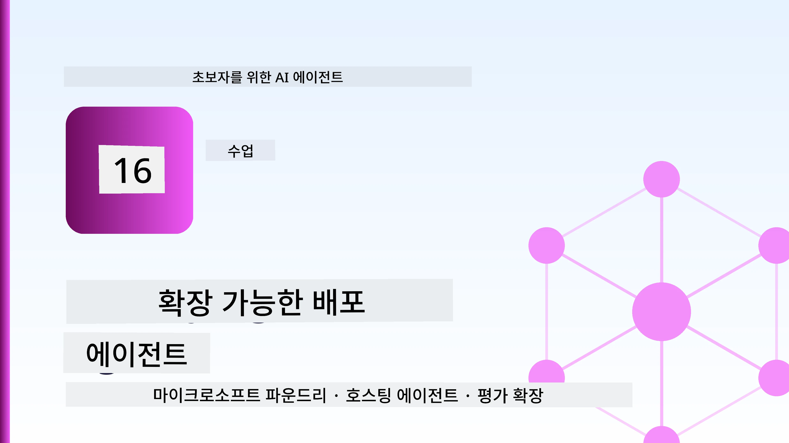
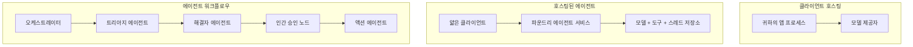
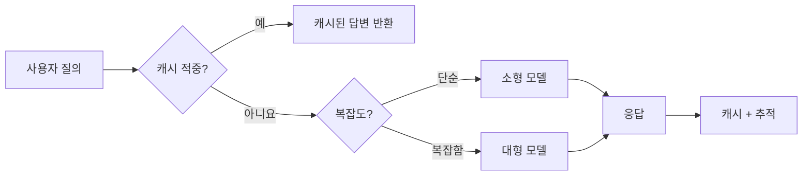
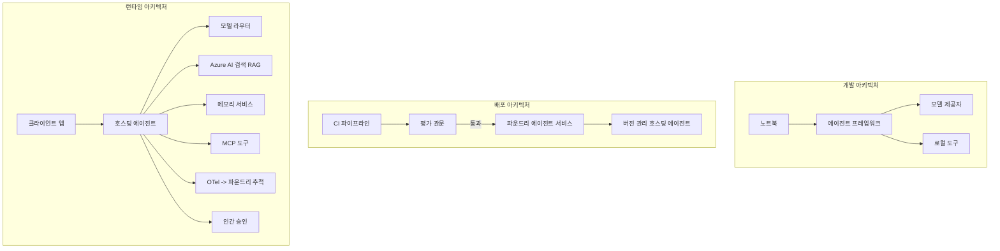

# Microsoft Foundry로 확장 가능한 에이전트 배포하기



지금까지의 과정에서는 노트북 안에서, `az login`과 몇 가지 환경 변수로 구동되는 노트북 내에서 실행되는 에이전트를 만들었습니다. 이것이 배우기에 가장 적합한 방법입니다. 하지만 수천 명의 고객이 새벽 3시에 의존하는 에이전트를 운영하는 데에는 맞지 않습니다.

이 수업은 "내 컴퓨터에서는 작동한다"는 것과 "프로덕션에서 신뢰할 수 있고 저렴하게 작동한다"는 것 사이의 간극에 관한 것입니다. 이 간극을 <strong>Microsoft Foundry</strong>와 <strong>Microsoft Foundry Agent Service</strong>를 사용해 극복하며, 도구, 검색, 메모리, 평가 및 모니터링 기능을 갖춘 실제 고객 지원 에이전트를 구축합니다.

## 소개

이 수업에서는 다음 내용을 다룹니다:

- <strong>프로토타입 에이전트</strong>와 <strong>배포된 에이전트</strong>의 차이점, 그리고 전환이 주로 모델 <em>주변</em>의 모든 것에 관한 이유.
- 에이전트의 **배포 패턴**: 클라이언트 호스팅, 서비스 호스팅(Hosted Agents), 워크플로우 오케스트레이션.
- Microsoft Foundry에서의 **에이전트 수명 주기** — 생성, 버전 관리, 배포, 평가, 관찰, 폐기.
- **확장 전략**: 모델 라우팅, 캐싱, 동시성, 상태 비저장 설계.
- OpenTelemetry와 Foundry 추적을 통한 **관찰 가능성**.
- 모델 선택, 라우팅, 평가 게이트를 통한 **비용 최적화**.
- **기업 고려사항**: 거버넌스, 인간 승인, MCP 서버를 프로덕션에서 안전하게 운영하기.

## 학습 목표

이 수업을 완료하면 다음을 알 수 있습니다:

- 특정 에이전트 작업 부하에 맞는 적절한 배포 패턴 선택.
- 에이전트를 Microsoft Foundry Agent Service에 배포하여 버전 관리, 거버넌스, 관찰 가능성을 확보.
- 추적을 위한 에이전트 계측 및 모든 릴리스 전에 실행되는 평가 파이프라인 연결.
- 모델 라우팅과 캐싱을 적용해 대규모 사용 시 지연 시간과 비용 제어.
- 높은 위험 작업에 대한 인간 승인 게이트 추가 및 생산 안전 방식으로 MCP 서버 통합.

## 전제 조건

이 수업은 이전 수업들을 완료했고 다음에 익숙하다는 가정하에 진행합니다:

- [Microsoft Agent Framework](../14-microsoft-agent-framework/README.md)로 에이전트 빌딩 (수업 14).
- [도구 사용법](../04-tool-use/README.md) (수업 4) 및 [Agentic RAG](../05-agentic-rag/README.md) (수업 5).
- [Agent Memory](../13-agent-memory/README.md) (수업 13) 및 [Agentic Protocols / MCP](../11-agentic-protocols/README.md) (수업 11).
- [관찰 가능성과 평가](../10-ai-agents-production/README.md) (수업 10) — 이 수업은 직접 연계됨.

또한 다음이 필요합니다:

- 최소 하나의 배포된 채팅 모델이 포함된 <strong>Azure 구독</strong>과 **Microsoft Foundry 프로젝트**.
- 인증된 **Azure CLI** (`az login`).
- Python 3.12 이상과 저장소 [`requirements.txt`](../../../requirements.txt)에 있는 패키지.

## 프로토타입에서 프로덕션으로: 실제로 무엇이 변할까

프로토타입 에이전트와 프로덕션 에이전트는 동일한 핵심 루프 — 추론, 도구 호출, 응답 — 를 공유합니다. 다만 그 루프를 둘러싼 모든 것이 달라집니다. 모델은 프로덕션 에이전트의 약 20%에 불과하며, 나머지 80%는 운영 골격입니다.

| 고려사항 | 프로토타입 | 프로덕션 |
| --- | --- | --- |
| <strong>호스팅</strong> | 노트북 내에서 실행 | 호스팅 서비스로 실행, 버전 관리 및 점진적 배포 |
| <strong>식별</strong> | 당신의 `az login` 토큰 | 범위 제한 RBAC가 적용된 관리 ID |
| <strong>상태</strong> | 메모리 내, 재시작 시 소실 | 외부화 (스레드 저장소, 메모리 서비스) |
| **장애 처리** | 트레이스백 확인 가능 | 재시도, 폴백, 데드레터, 알림 |
| <strong>비용</strong> | "몇 센트 수준" | 요청별 추적, 라우팅, 캐싱, 예산 관리 |
| <strong>품질</strong> | 결과를 직접 판단 | 모든 릴리스 전 자동 평가 |
| <strong>신뢰</strong> | 모든 행동 수동 승인 | 정책 + 위험 작업 인적 개입 |

이 표를 기억하세요. 아래 각 섹션은 여기 표의 한 행에 대응됩니다.

## 에이전트 배포 패턴

세 가지 패턴이 자주 함께 사용됩니다.

### 1. 클라이언트 호스팅 에이전트

에이전트 객체는 <em>당신의</em> 애플리케이션 프로세스 내에 존재합니다. 코드가 모델 공급자를 직접 호출하며, 추론 루프가 서비스 내에서 실행됩니다. 앞선 모든 수업이 이 방식을 사용했습니다.

- **사용 시기**: 루프를 완전히 제어해야 하거나, 맞춤 미들웨어가 필요하거나, 기존 백엔드에 에이전트를 임베딩할 때.
- <strong>단점</strong>: 확장성, 상태, 복원력을 직접 관리해야 함.

### 2. 호스티드 에이전트 (Foundry Agent Service)

에이전트는 Microsoft Foundry에 <em>리소스로 등록</em>됩니다. Foundry가 추론 루프를 호스트하며, 스레드를 저장하고, 콘텐츠 안전과 RBAC를 시행하며, Foundry 포털에서 에이전트를 가시화합니다. 애플리케이션은 스레드를 생성하고 응답을 읽는 얇은 클라이언트가 됩니다.

- **사용 시기**: 내구성, 내장 관찰 가능성, 거버넌스, 운영 표면 감소가 필요할 때.
- <strong>단점</strong>: 관리되는 런타임으로 낮은 수준의 제어 감소.

### 3. 에이전트 워크플로우

여러 에이전트(및 도구)를 명시적 제어 흐름이 있는 그래프로 구성 — 순차 단계, 분기, 인간 승인 노드, 일시중지 및 재개가 가능한 내구성 체크포인트. 이것이 Microsoft Agent Framework의 <strong>워크플로우</strong> 기능의 배포 규모 적용입니다.

- **사용 시기**: 단일 작업이 여러 특화된 에이전트를 거치거나 중간에 승인 단계가 필요할 때.
- <strong>단점</strong>: 부품이 많아지며, 오케스트레이션 수준의 관찰 가능성 필요.



## Microsoft Foundry에서의 에이전트 수명주기

에이전트 배포는 일회성 `push`가 아닙니다. 반복 주기이며, 소프트웨어 릴리스 사이클과 매우 유사합니다. 그게 바로 배포의 본질입니다.


[수업 10](../10-ai-agents-production/README.md)에서 이어진 핵심 아이디어: **오프라인 평가가 부수적 과정이 아닌 게이트다.** 새로운 에이전트 버전은 평가 기준을 통과하지 않으면 배포되지 않습니다. 온라인 관찰 가능성은 실제 오류를 오프라인 테스트 케이스에 피드백합니다. 이것이 전체 주기입니다.

## 확장 전략

에이전트 확장은 상태 비저장 웹 API 확장과 다릅니다. 각 요청이 여러 고비용 모델 및 도구 호출을 유발할 수 있기 때문입니다. 네 가지 기술이 대부분의 부하를 처리합니다.

**상태 비저장 요청 처리.** 프로세스 메모리에 사용자별 상태를 남기지 마세요. 대화 스레드는 Foundry 스레드 저장소나 메모리 서비스에 보존해 모든 인스턴스가 임의의 요청을 처리하도록 합니다. 이것이 수평 확장을 가능하게 하며, 인스턴스를 추가하고 세션 고착이 없습니다.

**모델 라우팅.** 모든 요청에 가장 강력하고 비용이 높은 모델이 필요한 것은 아닙니다. 단순한 요청 — 의도 분류, 짧은 사실 답변 — 은 작고 빠른 모델에, 복잡한 추론은 큰 모델에 라우팅하세요. Foundry의 <strong>Model Router</strong>가 이를 지원하며, 직접 경량 분류기를 구현할 수도 있습니다. 실습에서 직접 구현해 볼 것입니다.

**응답 캐싱.** 많은 지원 문의가 거의 중복("비밀번호를 어떻게 재설정하나요?")입니다. 흔한 질문의 답변을 캐시해 모델 호출 없이 제공합니다. 어느 정도의 캐시 적중률만으로도 비용과 지연을 크게 줄일 수 있습니다.

**동시성 및 백프레셔.** 모델 공급자는 속도 제한(rate limits)이 있습니다. 동시성 한도를 정하고, 지수적 재시도와 우아한 실패를 도입하세요(대기열에서 "처리 중"응답이 500 에러보다 낫습니다).



## 프로덕션에서의 관찰 가능성

보지 못하는 것은 운영할 수 없습니다. 수업 10에서 다뤘듯, Microsoft Agent Framework는 **OpenTelemetry** 추적을 기본 지원합니다 — 모든 모델 호출, 도구 실행, 오케스트레이션 단계가 스팬이 됩니다. 프로덕션에서는 이 스팬들을 Microsoft Foundry(또는 OTel 호환 백엔드)로 내보내 다음을 할 수 있습니다:

- 단일 고객 불만을 모든 모델 및 도구 호출에 걸쳐 끝까지 추적.
- 시간 경과에 따른 요청별 p50/p95 지연 시간과 비용 모니터링.
- 사용자나 재무팀이 알아차리기 전에 오류율 급증과 비용 이상 징후에 알림.

```python
from agent_framework.observability import get_tracer

tracer = get_tracer()

with tracer.start_as_current_span("support_request") as span:
    span.set_attribute("customer.tier", "enterprise")
    span.set_attribute("routed.model", "gpt-4.1-mini")
    # 이 범위 내에서 에이전트 실행이 자동으로 추적됩니다
```

`customer.tier`와 `routed.model` 같은 속성이 추적 정보의 대량 해석을 문의에 대한 답변 가능한 질문으로 변화시킵니다("기업 고객이 소형 모델로 너무 자주 라우팅되고 있나요?").

## 비용 최적화

프로덕션 에이전트에서 비용은 주로 토큰 사용량에 의해 결정됩니다. 영향을 많이 미치는 순서대로 세 가지 방안이 있습니다:

1. **적절한 모델 크기 선택.** 평가 게이트를 통과하는 작은 모델이 평가를 통과하는 큰 모델보다 거의 항상 비용이 저렴합니다. 평가를 이용해 작은 모델이 충분함을 증명하고, 무조건 큰 모델을 선택하는 것이 아닙니다.
2. **복잡도에 따른 라우팅.** 앞서 말한대로 — 큰 모델 추론이 필요한 요청에만 큰 모델 비용을 지불합니다.
3. **적극적 캐싱.** 가장 저렴한 모델 호출은 아예 하지 않는 호출입니다.

평가 게이트와 비용 관리는 동일한 훈련의 두 면입니다: 평가는 <em>품질 최저선</em>을 알려주고, 라우팅과 캐싱은 그 최저선 <em>비용</em>에 최대한 접근하도록 돕습니다.

## 기업용 배포 고려사항

**거버넌스.** 호스티드 에이전트는 Foundry의 RBAC, 콘텐츠 안전, 감사 로깅을 상속합니다. 각 에이전트에는 최소 권한의 관리 ID를 부여하세요 — 지식베이스 읽기 전용, 티켓 API 범위 제한 액세스, 그 이상은 없습니다.

**인간 개입.** 환불 발급, 계정 삭제, 법무팀으로의 에스컬레이션 같이 자동화하기에 너무 중요한 작업이 있습니다. Microsoft Agent Framework는 **승인이 필요한** 도구를 지원해, 에이전트가 작업을 제안하고 실행을 일시 정지, 사람이 승인 혹은 거부하고 워크플로우가 다시 시작됩니다. [수업 6](../06-building-trustworthy-agents/README.md)에서 기본을 보았고 여기서 배포합니다.

**프로덕션의 MCP.** [MCP](../11-agentic-protocols/README.md)는 표준 인터페이스를 통해 에이전트가 외부 도구를 사용할 수 있게 합니다. 프로덕션에서는 모든 MCP 서버를 신뢰할 수 없는 경계로 취급하세요: 서버 버전 고정, 범위 지정된 ID로 실행, 출력 검증, 비밀 정보 노출 금지. MCP 서버는 의존성이고, 의존성은 패치, 감사, 속도 제한이 필요합니다.



이 세 다이어그램 — 개발, 배포, 런타임 — 은 생애 단계가 다른 같은 에이전트를 나타냅니다. 이어지는 실습을 통해 이를 구축해 봅니다.

## 실습: 프로덕션 준비가 완료된 고객 지원 에이전트

[`code_samples/16-python-agent-framework.ipynb`](./code_samples/16-python-agent-framework.ipynb)를 열고 처음부터 끝까지 따라 해 보세요. 모든 프로덕션 요구사항이 반영된 <strong>Contoso 고객 지원 에이전트</strong>를 조립합니다:

1. **도구 호출** — 주문 상태 조회 및 지원 티켓 오픈.
2. **RAG** — 지식 베이스에서 정책 질문에 답변 (Azure AI Search, 노트북 실행을 위한 메모리 내 폴백 포함).
3. <strong>메모리</strong> — 대화 턴에 걸쳐 고객을 기억.
4. **모델 라우팅** — 복잡도 분류기가 각 요청을 작은 모델이나 큰 모델에 라우트.
5. **응답 캐싱** — 반복 질문에 캐시 응답 제공.
6. **인간 승인** — 특정 임계점 이상의 환불에 대해 인간 승인 대기.
7. **평가 파이프라인** — 소규모 오프라인 테스트 세트가 에이전트를 점수화하고 릴리스 게이트 역할 수행.
8. **관찰 가능성** — 모든 요청에 대해 OpenTelemetry 추적.

### 진행 방법

노트북은 각 프로덕션 요구사항이 독립적이고 실행 가능한 섹션으로 조직되어 있습니다. 핵심은 라우팅과 캐싱을 결합한 요청 처리기입니다:

```python
async def handle_support_request(query: str, customer_id: str) -> str:
    # 1. 가능할 때 캐시에서 제공하십시오.
    cached = response_cache.get(normalize(query))
    if cached:
        return cached

    # 2. 비용 관리를 위해 복잡도별로 라우팅하십시오.
    model = "gpt-4.1-mini" if is_simple(query) else "gpt-4.1"

    # 3. 관측 가능성을 위해 추적 스팬 내에서 에이전트를 실행하십시오.
    with tracer.start_as_current_span("support_request") as span:
        span.set_attribute("routed.model", model)
        span.set_attribute("customer.id", customer_id)
        response = await support_agent.run(query, model=model)

    # 4. 캐시하고 반환하십시오.
    response_cache.set(normalize(query), response.text)
    return response.text
```

릴리스를 지키는 평가 게이트는 다음과 같습니다:

```python
async def evaluation_gate(agent, test_cases, threshold: float = 0.8) -> bool:
    passed = 0
    for case in test_cases:
        result = await agent.run(case["input"])
        if score_response(result.text, case["expected"]) >= 0.8:
            passed += 1
    pass_rate = passed / len(test_cases)
    print(f"Evaluation pass rate: {pass_rate:.0%} (gate: {threshold:.0%})")
    return pass_rate >= threshold  # 게이트를 통과할 때만 배포하십시오
```

모든 줄을 읽어 보세요 — 노트북은 프리미티브를 일부러 작게 유지해 프레임워크 호출 뒤에 숨겨진 것이 없도록 합니다.

## 배포된 에이전트 검증: 스모크 테스트

위 평가 게이트는 에이전트 객체에 대해 <em>오프라인</em>으로 실행됩니다. 호스티드 에이전트로 배포했다면, 더 저렴한 한 가지 점검이 필요합니다: **배포된 엔드포인트가 실제로 응답하고 있는가?**

"성공적인" 배포는 제어 플레인이 정의를 수용했다는 뜻일 뿐, 에이전트가 응답한다는 뜻은 아닙니다. 누락된 의존성, 잘못된 모델 라우팅, 만료된 연결로 인해 아무것도 반환하지 않는 녹색 배포가 있을 수 있습니다. <strong>스모크 테스트</strong>는 이를 몇 초 내에 잡아내며, 모든 배포에서 전체 평가 비용 없이 실행됩니다.

이 저장소는 [AI Smoke Test](https://github.com/marketplace/actions/ai-smoke-test) GitHub Action 기반의 바로 사용 가능한 스모크 테스트 파이프라인을 제공합니다:

- <strong>카탈로그</strong> — [`tests/lesson-16-smoke-tests.json`](../../../tests/lesson-16-smoke-tests.json)에는 Contoso 지원 에이전트를 위한 프롬프트와 검증, 예: 근거가 명확한 정책 답변, 주문 조회, 주제 유지, 다중 턴 스레드 연속성 포함. 다른 수업 에이전트용 카탈로그도 함께 있습니다 — [`tests/README.md`](../tests/README.md) 참조.
- <strong>워크플로우</strong> — [`.github/workflows/smoke-test.yml`](../../../.github/workflows/smoke-test.yml)는 Azure OIDC로 로그인하여 각 프롬프트를 에이전트 Responses 엔드포인트에 POST, 어설션 실패 시 작업 실패 처리.

```yaml
- name: Smoke-test hosted agent
  uses: JFolberth/ai-smoketest@v1
  with:
    project_endpoint: ${{ inputs.project_endpoint }}
    agent_name: ContosoSupportAgent
    tests_file: tests/lesson-16-smoke-tests.json
```


에이전트를 배포한 후 **Actions** 탭에서 실행하고 Foundry 프로젝트 엔드포인트와 에이전트 이름을 제공하세요. 연합 신원에는 Foundry 프로젝트 범위에서 **Azure AI User** 역할이 필요합니다. 계층을 피라미드로 생각하세요: 연기 테스트(도달 가능하고 응답 중인가?)는 모든 배포에서 실행되고, 오프라인 평가(출시할 만큼 충분한가?)는 승격 전에 실행되며, 온라인 평가(현장에서 어떻게 작동하는가?)는 지속적으로 실행됩니다.

## 지식 점검

과제로 넘어가기 전에 이해도를 테스트하세요.

**1. 프로덕션 에이전트에서 "모델"은 대략 얼마나 차지하며 나머지는 무엇인가요?**

<details>
<summary>답변</summary>

모델은 시스템의 소수로, 보통 약 20% 정도로 언급됩니다. 나머지는 운영 뼈대이며, 호스팅 및 버전 관리, 신원 및 RBAC, 외부 상태 저장, 장애 처리, 비용 추적, 평가, 그리고 인간 개입 제어로 구성됩니다. 프로덕션으로 이동하는 것은 주로 추론 루프 <em>주변</em>의 모든 것을 구축하는 것입니다.
</details>

**2. 언제 클라이언트 호스팅 에이전트보다 Hosted Agent를 선택하나요?**

<details>
<summary>답변</summary>

내장된 내구성(지속되고 재개 가능한 스레드), 관찰 가능성, 콘텐츠 안전성, RBAC가 있는 관리형 런타임이 필요하고 추론 루프의 저수준 제어를 줄이는 대신 운영 표면적을 줄이려 할 때 Hosted Agent를 선택합니다. 클라이언트 호스팅은 루프를 완전히 제어하거나 기존 백엔드에 에이전트를 임베딩할 때 선호됩니다.
</details>

**3. 확장 가능한 에이전트가 자체 프로세스 메모리 내에서 상태 비저장(stateless)이어야 하는 이유는 무엇인가요?**

<details>
<summary>답변</summary>

모든 인스턴스가 아무 요청이나 처리할 수 있어야 하므로 달라붙는 세션 없이 수평 확장이 가능합니다. 사용자별 대화 상태는 스레드 저장소나 메모리 서비스로 분리되어 있습니다. 상태가 프로세스 메모리에 있으면 재시작 시 손실되고 부하 분산이 자유롭지 못합니다.
</details>

**4. 모델 라우팅이 해결하는 문제는 무엇이며 평가와는 어떤 관련이 있나요?**

<details>
<summary>답변</summary>

라우팅은 간단한 요청을 작고 저렴하며 빠른 모델로 보내고 진짜 추론은 큰 모델에 예약하여 대기 시간과 비용을 통제합니다. 이는 평가와 관련이 있는데, 평가는 *어떤 요청군에 대해* 작은 모델이 충분히 좋은지 <em>입증</em>하기 때문입니다 — 평가 없는 라우팅은 추측입니다.
</details>

**5. '평가 게이트(evaluation gate)'란 무엇이며 라이프사이클에서 어디에 위치하나요?**

<details>
<summary>답변</summary>

평가 게이트는 새로운 에이전트 버전에 대해 오프라인 테스트 세트를 실행하여 통과율이 임계값을 넘지 않으면 배포를 차단합니다. 라이프사이클에서 "버전"과 "배포" 사이에 위치해 품질을 릴리스의 전제 조건으로 만들고, 출시 후 확인하는 것이 아니라 미리 검증하게 합니다.
</details>

**6. MCP 서버를 프로덕션에서 신뢰할 수 없는 경계로 취급해야 하는 이유는 무엇인가요?**

<details>
<summary>답변</summary>

MCP 서버는 에이전트가 호출하는 외부 의존성이기 때문입니다. 버전을 고정하고, 범위가 제한된 신원으로 실행하며, 출력값을 검증하고, 속도 제한을 적용하고, 비밀을 절대 노출하지 않아야 합니다 — 모든 서드파티 의존성에 적용하는 동일한 규율입니다. 출력값이 에이전트의 추론에 사용되므로 검증되지 않은 신뢰는 보안 위험입니다.
</details>

**7. 일반적으로 프로덕션 에이전트 비용에 가장 큰 영향을 미치는 단일 변경 사항은 무엇이며, 그 이유는?**

<details>
<summary>답변</summary>

모델의 크기를 적절히 조절하는 것 — 평가 게이트를 통과하는 가장 작은 모델을 사용하는 것입니다. 비용은 토큰 사용량에 의해 지배되며, 품질 기준을 만족하는 작은 모델이 거의 항상 큰 모델보다 저렴합니다. 캐싱과 라우팅이 비용을 추가로 줄이지만, 적절한 기본 모델 선택이 가장 큰 일차 효과를 가집니다.
</details>

**8. `customer.tier` 및 `routed.model`과 같은 스팬 속성은 관찰 가능성에서 어떤 역할을 하나요?**

<details>
<summary>답변</summary>

원시 추적을 해답 가능한 비즈니스 질문으로 바꿉니다. 속성이 없으면 스팬이 벽처럼 쌓이겠지만, 있으면 "기업 고객이 너무 자주 작은 모델로 라우팅되고 있는가?" 또는 "가장 느린 요청을 처리하는 모델은 무엇인가?" 같은 질문을 할 수 있습니다. 속성은 운영에 중요한 차원으로 텔레메트리를 분류하는 방법입니다.
</details>

## 과제

실습에서 만든 고객 지원 에이전트를 특정 시나리오에 맞게 강화하세요: **SaaS 회사의 구독 청구 지원 에이전트**.

제출물에는 다음이 포함되어야 합니다:

1. 청구 관련 도구들로 <strong>도구를 교체</strong>합니다: `get_subscription_status`, `get_invoice` 및 `issue_credit` ($50 이상의 크레딧은 인간 승인이 필요).
2. 회사의 환불 정책, 청구 주기, 해지 정책을 다루는 <strong>세 개의 RAG 문서</strong>를 추가합니다.
3. 평가 세트를 최소 8개의 사례로 <strong>확장</strong>하고, 최소 두 개는 *인간 승인 경로를 트리거해야 하며*, 평가 게이트가 올바르게 통과/실패하는지 확인합니다.
4. **비용 보고서 하나 추가**: 에이전트를 통해 10개의 혼합 쿼리를 실행한 후, 얼마나 많은 쿼리가 작은 모델에, 큰 모델에, 캐시에서 처리되었는지 출력합니다.

모델 라우팅 규칙을 어떤 것을 선택했는지, 실제 트래픽으로 어떻게 검증할 것인지에 대해 짧은 단락(마크다운 셀에) 작성하세요. 정답은 없으며, 프로덕션 문제들이 일관되게 연결되어 있는지 평가합니다.

## 요약

이 수업에서는 Microsoft Foundry로 에이전트를 프로토타입에서 프로덕션까지 옮겼습니다:

- 프로덕션으로의 도약은 주로 모델 주위의 **운영 뼈대** — 호스팅, 신원, 상태, 장애 처리, 비용, 품질, 그리고 신뢰에 관한 것입니다.
- 세 가지 **배포 패턴** — 클라이언트 호스팅, Hosted Agents, 에이전트 워크플로우 — 과 각각의 적합 시기를 배웠습니다.
- 오프라인 <strong>평가가 릴리스 게이트로 작용</strong>하고 온라인 관찰 가능성이 실패를 테스트 세트에 피드백하는 <strong>에이전트 라이프사이클</strong>을 살펴보았습니다.
- **확장 전략** — 상태 비저장 설계, 모델 라우팅, 캐싱, 한정된 동시성 — 을 적용하고 이를 <strong>비용 최적화</strong>와 연결했습니다.
- **엔터프라이즈 제어**: RBAC, 인간 개입 승인, 프로덕션 안전 MCP 통합을 연결했습니다.
- 이 모든 문제들을 실행 가능한 코드로 묶어 <strong>프로덕션 준비가 된 고객 지원 에이전트</strong>를 구축했습니다.

다음 수업은 반대 여정입니다: 클라우드로 확장하는 대신, 에이전트를 개별 개발자 머신으로 <em>내려와</em> 완전히 로컬에서 실행합니다.

## 추가 자료

- <a href="https://learn.microsoft.com/azure/ai-foundry/what-is-azure-ai-foundry" target="_blank">Microsoft Foundry 문서</a>
- <a href="https://learn.microsoft.com/azure/ai-foundry/agents/overview" target="_blank">Microsoft Foundry Agent Service 개요</a>
- <a href="https://aka.ms/ai-agents-beginners/agent-framework" target="_blank">Microsoft Agent Framework</a>
- <a href="https://learn.microsoft.com/azure/ai-foundry/concepts/model-router" target="_blank">Microsoft Foundry의 모델 라우터</a>
- <a href="https://learn.microsoft.com/azure/search/search-what-is-azure-search" target="_blank">Azure AI Search</a>
- <a href="https://opentelemetry.io/" target="_blank">OpenTelemetry</a>
- <a href="https://github.com/marketplace/actions/ai-smoke-test" target="_blank">AI Smoke Test GitHub Action</a>
- <a href="https://modelcontextprotocol.io/" target="_blank">Model Context Protocol (MCP)</a>

## 이전 수업

[컴퓨터 사용 에이전트(CUA) 구축](../15-browser-use/README.md)

## 다음 수업

[로컬 AI 에이전트 생성](../17-creating-local-ai-agents/README.md)

---

<!-- CO-OP TRANSLATOR DISCLAIMER START -->
**면책 조항**:
이 문서는 AI 번역 서비스 [Co-op Translator](https://github.com/Azure/co-op-translator)를 사용하여 번역되었습니다. 정확성을 기하기 위해 노력하고 있으나, 자동 번역은 오류나 부정확한 부분이 있을 수 있음을 유의하시기 바랍니다. 원본 문서의 원어본이 권위 있는 자료로 간주되어야 합니다. 중요한 정보의 경우, 전문가의 인간 번역을 권장합니다. 이 번역 사용으로 인해 발생하는 오해나 잘못된 해석에 대해 당사는 책임을 지지 않습니다.
<!-- CO-OP TRANSLATOR DISCLAIMER END -->