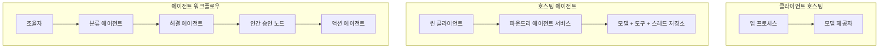
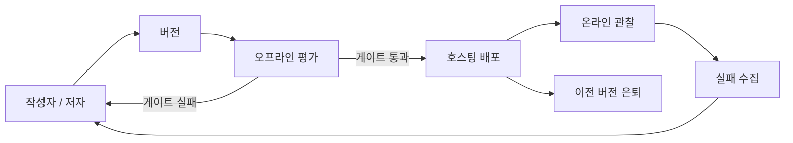
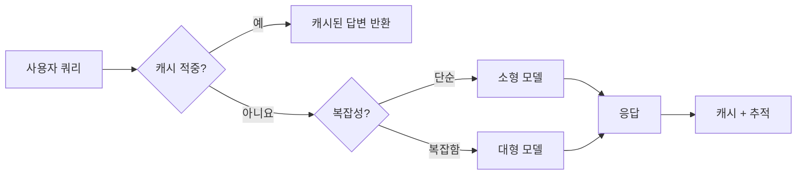
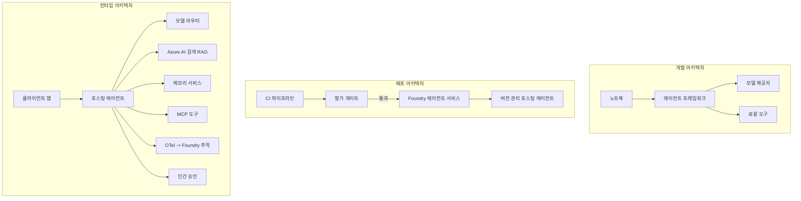

# Microsoft Foundry로 확장 가능한 에이전트 배포하기


지금까지는 노트북 안에서, `az login`과 몇 가지 환경 변수를 기반으로 노트북 내에서 실행되는 에이전트를 만들어 보았습니다. 이것이 배우기에 딱 맞는 방법입니다. 하지만 수천 명의 고객이 새벽 3시에 의존하는 에이전트를 운영하는 방법은 전혀 다릅니다.

이 강의는 "내 기계에서는 잘 작동하는데"와 "프로덕션 환경에서 신뢰할 수 있고 경제적으로 작동하는" 간극을 다룹니다. 우리는 <strong>Microsoft Foundry</strong>와 <strong>Microsoft Foundry Agent Service</strong>를 사용하여 그 간극을 메울 것입니다. 그리고 도구, 검색, 메모리, 평가, 모니터링을 갖춘 실제 고객 지원 에이전트를 만들면서 이를 실현합니다.

## 소개

이 강의에서 다룰 내용:

- <strong>프로토타입 에이전트</strong>와 <strong>배포된 에이전트</strong>의 차이점, 그리고 전환이 모델 그 자체보다 모델 <em>주변</em> 모든 것에 더 관련 있다는 점.
- 에이전트의 **배포 패턴**: 클라이언트 호스팅, 서비스 호스팅(호스티드 에이전트), 워크플로우 오케스트레이션.
- Microsoft Foundry에서의 **에이전트 라이프사이클** — 생성, 버전 관리, 배포, 평가, 관찰, 폐기.
- **확장 전략**: 모델 라우팅, 캐싱, 동시성, 무상태 설계.
- OpenTelemetry 및 Foundry 추적으로 보는 **관찰 가능성**.
- 모델 선택, 라우팅, 평가 게이트를 통한 **비용 최적화**.
- **엔터프라이즈 고려 사항**: 거버넌스, 인간 승인, 프로덕션에서 MCP 서버 안전 운영.

## 학습 목표

이 강의를 마치면 다음을 알게 됩니다:

- 특정 에이전트 워크로드에 적합한 배포 패턴 선택 방법.
- 에이전트를 Microsoft Foundry Agent Service에 배포하여 버전관리, 거버넌스, 관찰 가능하게 만드는 방법.
- 추적 도구를 계측하고, 매 릴리스 전에 실행되는 평가 파이프라인을 연결하는 방법.
- 대규모에서도 지연 시간과 비용을 제어하기 위해 모델 라우팅과 캐싱을 적용하는 방법.
- 고위험 작업에 대한 인간 승인 게이트를 추가하고 프로덕션 안전 방식으로 MCP 서버를 통합하는 방법.

## 사전 준비사항

이 강의는 이전 강의를 완료하고 다음에 익숙하다고 가정합니다:

- [Microsoft Agent Framework](../14-microsoft-agent-framework/README.md)로 에이전트를 빌드하기 (강의 14).
- [도구 사용](../04-tool-use/README.md) (강의 4) 및 [Agentic RAG](../05-agentic-rag/README.md) (강의 5).
- [에이전트 메모리](../13-agent-memory/README.md) (강의 13) 및 [Agentic 프로토콜 / MCP](../11-agentic-protocols/README.md) (강의 11).
- [관찰 가능성 및 평가](../10-ai-agents-production/README.md) (강의 10) — 이 강의는 해당 내용을 직접 기반으로 합니다.

다음도 필요합니다:

- <strong>Azure 구독</strong>과 하나 이상의 배포된 채팅 모델을 가진 **Microsoft Foundry 프로젝트**.
- 인증된 **Azure CLI** (`az login`).
- Python 3.12+와 저장소 내 [`requirements.txt`](../../../requirements.txt) 패키지.

## 프로토타입에서 프로덕션까지: 실제로 무엇이 바뀌는가

프로토타입 에이전트와 프로덕션 에이전트는 같은 핵심 루프를 공유합니다 — 추론, 도구 호출, 응답. 바뀌는 것은 그 루프를 감싸는 모든 것입니다. 모델은 프로덕션 에이전트의 약 20%이고, 나머지 80%는 운용 골격입니다.

| 관심사 | 프로토타입 | 프로덕션 |
| --- | --- | --- |
| <strong>호스팅</strong> | 노트북에서 실행 | 버전 관리되고 배포된 호스티드 서비스로 실행 |
| <strong>신원</strong> | `az login` 토큰 사용 | 범위가 제한된 RBAC가 적용된 관리되는 아이덴티티 |
| <strong>상태</strong> | 메모리 내, 재시작시 사라짐 | 외부화됨 (스레드 저장소, 메모리 서비스) |
| <strong>실패</strong> | 트레이스백을 직접 봄 | 재시도, 폴백, 데드레터, 알림 있음 |
| <strong>비용</strong> | "몇 센트 정도" | 요청별 추적, 라우팅, 캐싱, 예산 관리 |
| <strong>품질</strong> | 출력물을 직접 확인 | 매 릴리스 전 자동 평가 |
| <strong>신뢰</strong> | 모든 동작을 직접 승인 | 정책 + 위험한 작업에 대해 사람 개입 |

이 표를 기억하세요. 아래의 모든 섹션이 이 표의 한 줄과 매핑됩니다.

## 에이전트 배포 패턴

자주 결합하여 사용할 세 가지 패턴이 있습니다.

### 1. 클라이언트 호스팅 에이전트

에이전트 객체가 <em>귀하의</em> 애플리케이션 프로세스 내부에 존재합니다. 귀하의 코드는 모델 제공자를 직접 호출하며, 추론 루프는 귀하의 서비스에서 실행됩니다. 이전 강의들에서 해 왔던 방식이 바로 이것입니다.

- **사용 시기**: 루프에 대한 완전한 제어, 맞춤 미들웨어가 필요하거나 에이전트를 기존 백엔드에 임베딩할 때.
- <strong>트레이드오프</strong>: 확장, 상태, 복원력 모두 직접 관리해야 함.

### 2. 호스티드 에이전트 (Foundry Agent Service)

에이전트가 Microsoft Foundry 내 <em>리소스로 등록</em>됩니다. Foundry는 추론 루프를 호스팅하고, 스레드를 저장하며, 콘텐츠 안전과 RBAC를 시행하고, 포털에서 에이전트를 가시화합니다. 귀하의 앱은 스레드를 생성하고 응답을 읽는 얇은 클라이언트가 됩니다.

- **사용 시기**: 내구성, 내장 관찰 가능성, 거버넌스, 운영 범위 감소를 원할 때.
- <strong>트레이드오프</strong>: 관리되는 런타임 대신 낮은 수준의 제어권이 감소함.

### 3. 에이전트 워크플로우

여러 에이전트(및 도구)가 명시적 제어 흐름으로 그래프 형태로 구성됩니다 — 순차 단계, 분기, 인간 승인 노드, 일시중지 및 재개 가능한 내구성 체크포인트 등. 이것은 Microsoft Agent Framework의 <strong>워크플로우</strong> 기능을 배포 규모에 적용한 것입니다.

- **사용 시기**: 하나의 작업이 여러 전문 에이전트를 필요로 하거나 중간에 승인 단계가 필요한 경우.
- <strong>트레이드오프</strong>: 많은 이동 부품; 오케스트레이션 수준의 관찰 가능성 필요.



## Microsoft Foundry에서의 에이전트 라이프사이클

에이전트를 배포하는 것은 단순한 `push` 작업이 아닙니다. 소프트웨어 릴리스 사이클과 매우 유사한 반복 과정입니다.



[강의 10](../10-ai-agents-production/README.md)에서 이어진 핵심 아이디어: **오프라인 평가는 단순한 부연 설명이 아니라 게이트입니다.** 새 에이전트 버전은 평가 기준을 통과해야만 릴리스됩니다. 온라인 관찰 가능성은 실제 실패를 다시 오프라인 테스트 세트로 피드백합니다. 이것이 전체 루프입니다.

## 확장 전략

에이전트를 확장하는 것은 무상태 웹 API 확장과 다릅니다. 각 요청이 다수의 비용 높은 모델 및 도구 호출을 트리거할 수 있기 때문입니다. 네 가지 기술이 대부분의 부하를 처리합니다.

**무상태 요청 처리.** 사용자별 상태를 프로세스 메모리에 두지 마십시오. 대화 스레드는 Foundry 스레드 저장소나 메모리 서비스에 저장하여 어떤 인스턴스든 어떤 요청이든 처리할 수 있게 합니다. 이것이 수평 확장을 가능하게 하는 핵심입니다 — 인스턴스 추가, 스티키 세션 없음.

**모델 라우팅.** 모든 요청이 가장 강력하고 비용이 높은 모델을 필요로 하진 않습니다. 간단한 요청(예: 의도 분류, 짧은 사실적 답변)은 작고 빠른 모델에 라우팅하고, 진정한 추론에는 대형 모델을 예약합니다. Foundry의 <strong>모델 라우터</strong>가 이를 제공하거나, 직접 가벼운 분류기를 구현할 수 있습니다. 실습에서 DIY 버전을 구축할 것입니다.

**응답 캐싱.** 많은 지원 쿼리는 거의 중복입니다("비밀번호 어떻게 재설정하나요?"). 일반 질문에 대한 답변을 캐시하고 모델을 호출하지 않고도 제공합니다. 적당한 캐시 적중률만으로도 비용과 지연 시간을 크게 줄일 수 있습니다.

**동시성 및 역압.** 모델 제공자는 속도 제한이 있습니다. 동시성 한계를 설정하고, 지수 백오프를 사용하는 재시도, 그리고 우아한 실패 처리 (큐에 "처리 중" 응답 제공이 500 오류보다 낫습니다)를 구현하세요.



## 프로덕션에서의 관찰 가능성

볼 수 없는 것은 운영할 수 없습니다. 강의 10에서 다룬 바와 같이, Microsoft Agent Framework는 **OpenTelemetry** 추적을 기본 제공합니다 — 모든 모델 호출, 도구 작동, 오케스트레이션 단계가 스팬으로 기록됩니다. 프로덕션에서는 이 스팬들을 Microsoft Foundry(또는 OTel 호환 백엔드)로 내보내 다음과 같은 작업이 가능합니다:

- 단일 고객 불만 사항을 모든 모델 및 도구 호출 전반에 걸쳐 추적.
- 시간 경과에 따른 요청당 p50/p95 지연 시간과 비용 감시.
- 오류율 급증 및 비용 이상 징후를 사용자가 (또는 재무팀이) 눈치채기 전에 알림.

```python
from agent_framework.observability import get_tracer

tracer = get_tracer()

with tracer.start_as_current_span("support_request") as span:
    span.set_attribute("customer.tier", "enterprise")
    span.set_attribute("routed.model", "gpt-5-nano")
    # 이 범위 내에서 에이전트 실행이 자동으로 추적됩니다
```

`customer.tier`와 `routed.model` 같은 속성은 추적의 무더기를 쿼리 가능한 질문으로 바꿔줍니다("엔터프라이즈 고객이 너무 자주 소형 모델로 라우팅되나요?").

## 비용 최적화

프로덕션 에이전트 비용은 토큰에서 주로 발생합니다. 영향력 순서대로 세 가지 방법:

1. **적절한 크기의 모델 사용.** 평가 게이트를 통과하는 작은 모델이 평가적으로 큰 모델보다 거의 항상 저렴합니다. 조심해서 가장 큰 모델에 기본 설정하는 대신 평가를 사용하여 작은 모델이 충분히 좋은지 <em>증명</em>하세요.
2. **복잡도에 따른 라우팅.** 앞서 말한 대로, 대형 모델 가격은 대형 모델 추론이 필요한 요청에만 지불하세요.
3. **공격적인 캐싱.** 가장 저렴한 모델 호출은 호출하지 않는 것입니다.

평가 게이트와 비용 관리는 두 관점에서 본 동일한 규율입니다: 평가는 <em>품질 하한</em>을 알려주고, 라우팅과 캐싱은 그 하한의 <em>비용</em>에 최대한 근접하게 유지합니다.

## 엔터프라이즈 배포 고려사항

**거버넌스.** 호스티드 에이전트는 Foundry의 RBAC, 콘텐츠 안전, 감사 로그를 상속합니다. 각 에이전트에 최소 권한만 가진 관리 아이덴티티를 부여하세요 — 지식 베이스에 대한 읽기 전용, 티켓팅 API에 대한 범위 제한된 접근, 그 외는 없음.

**인간 개입.** 환불 발행, 계정 삭제, 법무 팀으로의 에스컬레이션 등 너무 중대한 작업은 자동화해서는 안 됩니다. Microsoft Agent Framework는 **승인 필요** 도구를 지원합니다: 에이전트가 작업을 제안하고, 실행이 일시 중지되며, 사람이 승인 또는 거부하고, 워크플로우가 재개됩니다. [강의 6](../06-building-trustworthy-agents/README.md)에서 원시 개념을 보았고, 여기서 배포합니다.

**프로덕션에서의 MCP.** [MCP](../11-agentic-protocols/README.md)는 표준 인터페이스를 통해 에이전트가 외부 도구를 사용할 수 있게 해줍니다. 프로덕션에서는 모든 MCP 서버를 신뢰할 수 없는 경계로 간주하세요: 서버 버전을 고정하고, 범위가 제한된 아이덴티티로 실행하며, 출력물을 검증하고, 비밀 정보를 노출하지 마세요. MCP 서버는 의존성이고, 의존성은 패치, 감사, 속도 제한을 받아야 합니다.



개발, 배포, 런타임이라는 세 다이어그램은 동일한 에이전트의 생애 세 단계를 나타냅니다. 이어지는 실습에서 이를 직접 구축해봅니다.

## 실습: 프로덕션 준비가 된 고객 지원 에이전트

[`code_samples/16-python-agent-framework.ipynb`](./code_samples/16-python-agent-framework.ipynb)를 열고 처음부터 끝까지 따라가세요. 모든 프로덕션 고려사항이 연결된 <strong>Contoso 고객 지원 에이전트</strong>를 조립할 것입니다:

1. **도구 호출** — 주문 상태 조회 및 지원 티켓 생성.
2. **RAG** — 지식 베이스(메모리 내 폴백 포함 Azure AI 검색)에서 정책 질문에 답변.
3. <strong>메모리</strong> — 대화 중 고객을 기억.
4. **모델 라우팅** — 복잡도 분류기가 각 요청을 작은 모델 또는 큰 모델로 라우팅.
5. **응답 캐싱** — 반복되는 질문은 캐시에서 제공.
6. **인간 승인** — 기준액 이상의 환불은 인간 승인을 위해 일시 중지.
7. **평가 파이프라인** — 작은 오프라인 테스트 세트가 에이전트를 평가하고 릴리스 게이트 역할.
8. **관찰 가능성** — 모든 요청에 대한 OpenTelemetry 추적.

### 워크스루

노트북은 각 프로덕션 고려사항을 자체 완결적인 실행 가능한 섹션으로 조직했습니다. 핵심은 라우팅과 캐싱이 합쳐진 요청 처리기입니다:

```python
async def handle_support_request(query: str, customer_id: str) -> str:
    # 1. 가능할 때 캐시에서 제공하십시오.
    cached = response_cache.get(normalize(query))
    if cached:
        return cached

    # 2. 비용을 제어하기 위해 복잡성에 따라 라우팅하십시오.
    model = "gpt-5-nano" if is_simple(query) else "gpt-5-mini"

    # 3. 관찰성을 위해 트레이스 스팬 내에서 에이전트를 실행하십시오.
    with tracer.start_as_current_span("support_request") as span:
        span.set_attribute("routed.model", model)
        span.set_attribute("customer.id", customer_id)
        response = await support_agent.run(query, model=model)

    # 4. 캐시하고 반환하십시오.
    response_cache.set(normalize(query), response.text)
    return response.text
```

릴리스를 보호하는 평가 게이트는 다음과 같습니다:

```python
async def evaluation_gate(agent, test_cases, threshold: float = 0.8) -> bool:
    passed = 0
    for case in test_cases:
        result = await agent.run(case["input"])
        if score_response(result.text, case["expected"]) >= 0.8:
            passed += 1
    pass_rate = passed / len(test_cases)
    print(f"Evaluation pass rate: {pass_rate:.0%} (gate: {threshold:.0%})")
    return pass_rate >= threshold  # 게이트가 통과된 경우에만 배포합니다
```

각 줄을 읽어보세요 — 노트북은 프리미티브를 의도적으로 작게 유지하여 프레임워크 호출 뒤에 숨겨진 것이 없습니다.

## 배포된 에이전트를 스모크 테스트로 검증하기

위 평가 게이트는 에이전트 객체에 대해 <em>오프라인</em>으로 실행됩니다. 호스티드 에이전트로 배포된 후에는 한 가지 더 저비용 검사가 필요합니다: **배포된 엔드포인트가 실제로 응답하는가?**

"성공적인" 배포는 제어 평면이 정의를 수락했다는 것만 증명합니다 — 에이전트가 응답한다는 증거는 아닙니다. 누락된 의존성, 잘못된 모델 라우팅, 만료된 연결 등으로 아무 응답 없이 녹색 배포가 나올 수 있습니다. <strong>스모크 테스트</strong>는 몇 초 내에 매 배포마다 그것을 포착하며 전체 평가를 할 필요가 없습니다.

이 저장소는 [AI Smoke Test](https://github.com/marketplace/actions/ai-smoke-test) GitHub 액션을 기반으로 한 즉시 사용할 수 있는 스모크 테스트 파이프라인을 제공합니다:

- <strong>카탈로그</strong> — [`tests/lesson-16-smoke-tests.json`](../../../tests/lesson-16-smoke-tests.json)은 Contoso 지원 에이전트를 위한 프롬프트와(assertion 포함) 정책 답변, 주문 조회, 주제 유지, 다중 턴 스레드 연속성을 포함함. 다른 강의 에이전트용 카탈로그도 이와 함께 존재합니다 — [`tests/README.md`](../tests/README.md) 참조.
- <strong>워크플로우</strong> — [`.github/workflows/smoke-test.yml`](../../../.github/workflows/smoke-test.yml)은 Azure OIDC로 로그인하고 각 프롬프트를 에이전트의 Responses 엔드포인트로 POST하여 어떤 assertion 실패라도 작업에 실패를 리턴함.

```yaml
- name: Smoke-test hosted agent
  uses: JFolberth/ai-smoketest@v1
  with:
    project_endpoint: ${{ inputs.project_endpoint }}
    agent_name: ContosoSupportAgent
    tests_file: tests/lesson-16-smoke-tests.json
```


에이전트가 배포되면 **Actions** 탭에서 실행하여 Foundry 프로젝트 엔드포인트 및 에이전트 이름을 제공합니다. 연합 신원은 Foundry 프로젝트 범위에서 **Azure AI User** 역할이 필요합니다. 계층을 피라미드로 생각하세요: 스모크 테스트(도달 가능하고 응답 중인지?)는 모든 배포마다 실행되고, 오프라인 평가(출시할 만큼 충분한가?)는 승격 전 실행되며, 온라인 평가(실제 환경에서 어떻게 운영되는가?)는 지속적으로 실행됩니다.

## 지식 점검

과제로 넘어가기 전에 이해도를 테스트하세요.

**1. 프로덕션 에이전트에서 '모델'이 차지하는 비중은 얼마나 되며, 나머지는 무엇인가요?**

<details>
<summary>답변</summary>

모델은 시스템의 소수이며 — 보통 약 20%로 인용됩니다. 나머지는 운영 골격으로, 호스팅 및 버전 관리, 인증 및 RBAC, 외부 상태, 장애 처리, 비용 추적, 평가, 그리고 휴먼 인 더 루프 제어 등이 포함됩니다. 프로덕션으로 전환하는 것은 대부분 추론 루프 <em>주변</em>의 모든 것을 구축하는 것입니다.
</details>

**2. 클라이언트 호스팅 에이전트 대신 Hosted Agent를 선택하는 경우는 언제인가요?**

<details>
<summary>답변</summary>

내장된 내구성(지속되고 재개 가능한 스레드), 관찰 가능성, 콘텐츠 안전, RBAC가 있는 관리형 런타임을 원하고, 추론 루프에 대한 세부 제어를 일부 포기하는 대신 운영 표면을 줄이고 싶을 때 Hosted Agent를 선택합니다. 루프에 대한 완전한 제어가 필요하거나 에이전트를 기존 백엔드에 통합할 때는 클라이언트 호스팅이 더 적합합니다.
</details>

**3. 확장 가능한 에이전트가 자체 프로세스 메모리에서 상태 비저장이어야 하는 이유는 무엇인가요?**

<details>
<summary>답변</summary>

어떤 인스턴스든 요청을 처리할 수 있도록 하기 위해서이며, 이는 고정 세션 없이 수평 확장을 가능하게 합니다. 사용자별 대화 상태는 스레드 저장소나 메모리 서비스로 외부화됩니다. 상태가 프로세스 메모리에 있으면 재시작 시 잃어버리고 부하를 자유롭게 분산할 수 없습니다.
</details>

**4. 모델 라우팅이 해결하는 문제와 평가와의 관계는 무엇인가요?**

<details>
<summary>답변</summary>

라우팅은 단순 요청을 작고 저렴하며 빠른 모델로 보내고, 진짜 추론은 대형 모델에 예약하여 지연 시간과 비용을 제어합니다. 평가는 소형 모델이 특정 요청 유형에 충분히 좋은지 <em>증명</em>하는 과정이라 라우팅이 평가 없이 이루어지면 단순 추측이 됩니다.
</details>

**5. "평가 게이트"란 무엇이며 라이프사이클에서 어디에 위치하나요?**

<details>
<summary>답변</summary>

평가 게이트는 새 에이전트 버전에 대해 오프라인 테스트 세트를 실행하며, 합격률이 기준치를 넘지 않으면 배포를 차단합니다. 라이프사이클에서 "버전"과 "배포" 사이에 위치하여 품질을 릴리스의 전제 조건으로 만들고, 출시에 따른 후속 검사로 만들지 않습니다.
</details>

**6. MCP 서버를 프로덕션에서 신뢰할 수 없는 경계로 취급해야 하는 이유는 무엇인가요?**

<details>
<summary>답변</summary>

MCP 서버는 에이전트가 호출하는 외부 종속성이기 때문입니다. 버전을 고정하고, 범위가 지정된 신원으로 실행하며, 출력물을 검증하고, 속도 제한을 적용하며, 비밀 정보를 절대 노출하지 않아야 합니다 — 모든 타사 종속성에 적용하는 규율과 동일합니다. 출력은 에이전트의 추론에 영향을 미치므로 검증되지 않은 신뢰는 보안 위험입니다.
</details>

**7. 프로덕션 에이전트 비용에 가장 큰 영향을 미치는 단일 변경사항은 무엇이며, 이유는 무엇인가요?**

<details>
<summary>답변</summary>

적절한 모델 크기 선정 — 평가 게이트를 통과하는 가장 작은 모델을 사용하는 것입니다. 비용은 토큰에 의해 지배되며, 품질 기준을 충족하는 작은 모델은 거의 항상 큰 모델보다 저렴합니다. 캐싱과 라우팅은 비용을 더 줄이지만, 올바른 기본 모델을 선택하는 것이 가장 큰 1차 영향입니다.
</details>

**8. `customer.tier` 및 `routed.model`과 같은 스팬 속성은 관찰 가능성에서 어떤 역할을 하나요?**

<details>
<summary>답변</summary>

원시 추적을 대답 가능한 비즈니스 질문으로 전환합니다. 속성이 없으면 스팬이 벽처럼 쌓이지만, 속성이 있으면 "기업 고객이 너무 자주 작은 모델로 라우팅되고 있는가?" 또는 "어떤 모델이 가장 느린 요청을 처리하는가?" 등의 질문을 할 수 있습니다. 속성은 운영에 중요한 차원별로 원격 측정을 분할하는 방법입니다.
</details>

## 과제

실습에서 만든 고객 지원 에이전트를 특정 시나리오에 맞게 강화하세요: <strong>SaaS 회사의 구독 청구 지원 에이전트</strong>입니다.

제출물은 다음을 포함해야 합니다:

1. 청구 관련 도구로 <strong>도구를 교체</strong>하세요: `get_subscription_status`, `get_invoice`, `issue_credit` (50달러 이상 크레딧은 인간 승인이 필요).
2. 회사의 환불 정책, 청구 주기, 취소 정책을 다루는 <strong>세 개의 RAG 문서</strong>를 추가하세요.
3. 최소 여덟 개 사례를 포함하는 <strong>평가 세트를 확장</strong>하고, 최소 두 개는 반드시 인간 승인 경로를 유발해야 하며, 평가 게이트가 올바르게 통과 또는 실패하는지 확인하세요.
4. 혼합 쿼리 열 개를 에이전트에 실행한 후, 소형 모델로 처리된 수, 대형 모델로 처리된 수, 캐시에서 제공된 수를 출력하는 <strong>비용 보고서 하나를 추가</strong>하세요.

어떤 모델 라우팅 규칙을 선택했는지와 실제 트래픽으로 이를 어떻게 검증할지 설명하는 짧은 문단(마크다운 셀)을 작성하세요. 정답은 없으며, 프로덕션 고려 사항을 일관되게 연결했는지가 평가 기준입니다.

## 요약

본 수업에서는 Microsoft Foundry로 에이전트를 프로토타입에서 프로덕션으로 전환했습니다:

- 프로덕션 전환은 대부분 모델 주위의 **운영 골격** — 호스팅, 인증, 상태, 장애 처리, 비용, 품질, 신뢰를 다룹니다.
- 세 가지 **배포 패턴** — 클라이언트 호스팅, Hosted Agents, 에이전트 워크플로우 — 및 적절한 시기를 배웠습니다.
- <strong>에이전트 라이프사이클</strong>을 따라가며 오프라인 <strong>평가가 릴리스 게이트 역할</strong>을 하고 온라인 관찰 가능성이 실패를 테스트 세트로 되돌린다는 것을 확인했습니다.
- **확장 전략** — 상태 비저장 설계, 모델 라우팅, 캐싱, 제한된 동시성 — 를 적용하고 이를 <strong>비용 최적화</strong>와 연결했습니다.
- <strong>기업 제어</strong>인 RBAC, 휴먼 인 더 루프 승인, 프로덕션에 안전한 MCP 통합을 설정했습니다.
- 모든 고려 사항을 실행 가능한 코드로 묶어 <strong>프로덕션 준비된 고객 지원 에이전트</strong>를 구축했습니다.

다음 수업은 반대 방향으로 진행됩니다: 에이전트를 클라우드로 확장하는 대신, 단일 개발자 기계로 끌어내어 완전히 로컬에서 실행할 것입니다.

## 추가 자료

- <a href="https://learn.microsoft.com/azure/ai-foundry/what-is-azure-ai-foundry" target="_blank">Microsoft Foundry 문서</a>
- <a href="https://learn.microsoft.com/azure/ai-foundry/agents/overview" target="_blank">Microsoft Foundry Agent Service 개요</a>
- <a href="https://aka.ms/ai-agents-beginners/agent-framework" target="_blank">Microsoft Agent Framework</a>
- <a href="https://learn.microsoft.com/azure/ai-foundry/concepts/model-router" target="_blank">Microsoft Foundry의 모델 라우터</a>
- <a href="https://learn.microsoft.com/azure/search/search-what-is-azure-search" target="_blank">Azure AI Search</a>
- <a href="https://opentelemetry.io/" target="_blank">OpenTelemetry</a>
- <a href="https://github.com/marketplace/actions/ai-smoke-test" target="_blank">AI Smoke Test GitHub 액션</a>
- <a href="https://modelcontextprotocol.io/" target="_blank">Model Context Protocol (MCP)</a>

## 이전 수업

[컴퓨터 사용 에이전트(CUA) 빌드하기](../15-browser-use/README.md)

## 다음 수업

[로컬 AI 에이전트 만들기](../17-creating-local-ai-agents/README.md)

---

<!-- CO-OP TRANSLATOR DISCLAIMER START -->
**면책 조항**:
이 문서는 AI 번역 서비스 [Co-op Translator](https://github.com/Azure/co-op-translator)를 사용하여 번역되었습니다. 정확성을 기하기 위해 노력하고 있으나, 자동 번역은 오류나 부정확한 부분이 있을 수 있음을 유의하시기 바랍니다. 원본 문서의 원어본이 권위 있는 자료로 간주되어야 합니다. 중요한 정보의 경우, 전문가의 인간 번역을 권장합니다. 이 번역 사용으로 인해 발생하는 오해나 잘못된 해석에 대해 당사는 책임을 지지 않습니다.
<!-- CO-OP TRANSLATOR DISCLAIMER END -->