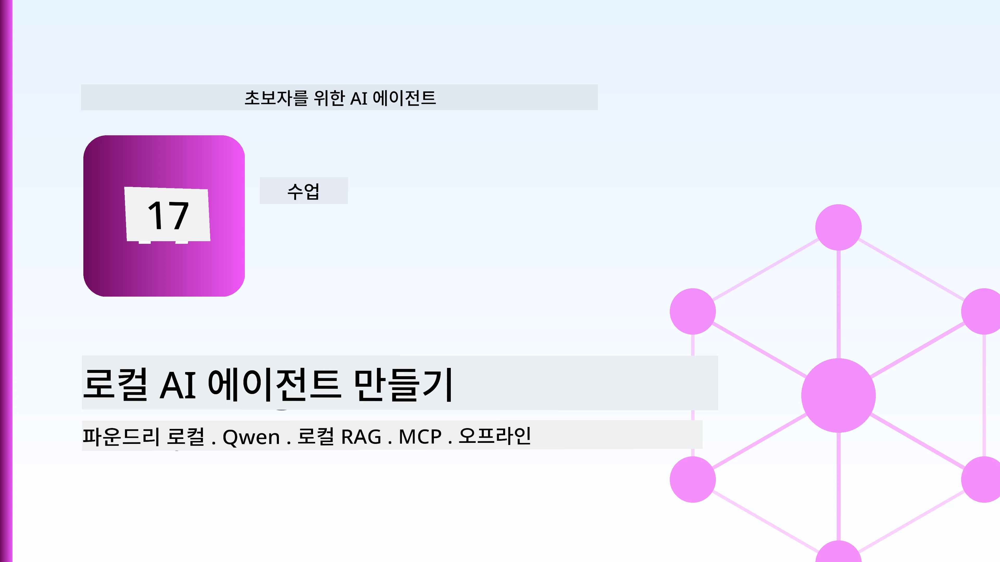
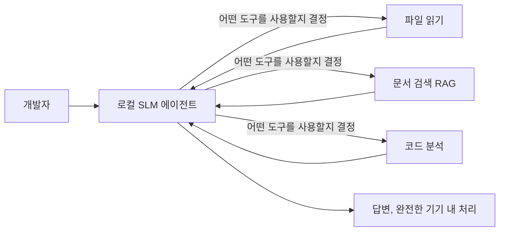
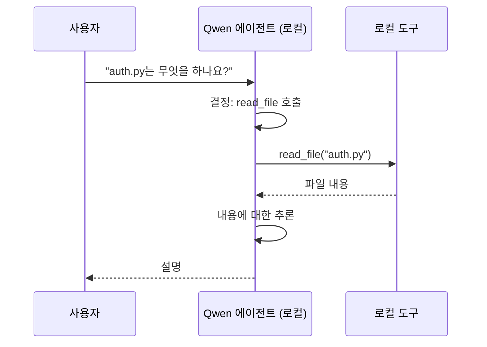
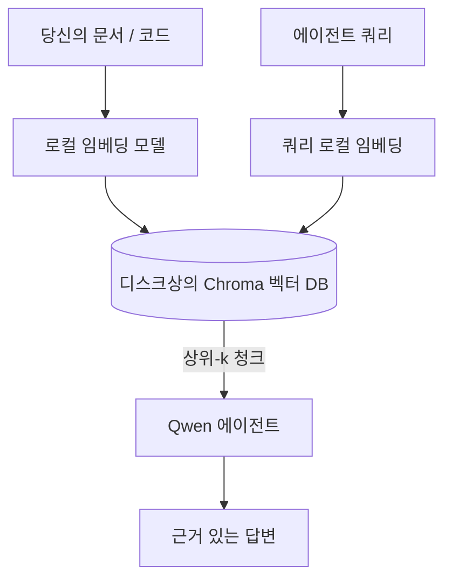
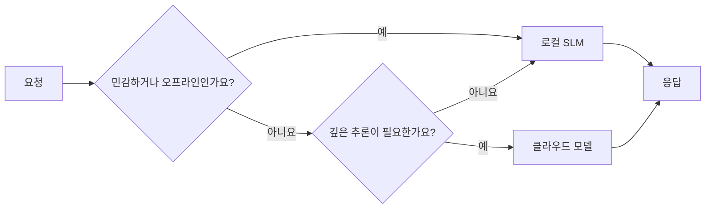

# Microsoft Foundry Local과 Qwen을 사용하여 로컬 AI 에이전트 만들기



이전 수업은 에이전트를 클라우드로 <em>확장</em>했습니다. 이번 수업은 에이전트를 단일 머신으로 <em>내려옵니다</em>. 수업이 끝나면 추론을 호출하지 않고도 추론하고 도구를 부르고, 파일을 읽고, 문서를 검색하는 작동하는 엔지니어링 어시스턴트를 갖게 됩니다 — **클라우드 추론 호출 단 한 번도 없이.**

왜 이런 것을 원할까요? 현실 엔지니어링 작업에서 자주 나오는 세 가지 이유가 있습니다:

- **프라이버시.** 코드와 문서는 절대 머신을 떠나지 않습니다. 프롬프트도, 코드 스니펫도, 고객 데이터도 네트워크 경계를 넘지 않습니다.
- **비용.** 로컬 추론에는 토큰별 과금이 없습니다. 전기요금만 내면 하루 종일 실험할 수 있습니다.
- **오프라인.** 비행기 안, 보안 시설 내, 또는 장애 발생 시에도 에이전트가 작동합니다.

단점은 최첨단 클라우드 모델 대신 CPU, GPU 또는 NPU에서 실행되는 <strong>소형 언어 모델(SLM)</strong>을 사용하는 것이라는 점입니다. 이번 수업은 제약을 부정하지 않고 그 제약 안에서 <em>잘</em> 작동하는 에이전트를 만드는 방법에 관한 것입니다.

## 소개

이번 수업에서 다룰 내용은 다음과 같습니다:

- **소형 언어 모델(SLM)** — 무엇인지, 어디서 뛰어난지, 어디서 약한지.
- **Microsoft Foundry Local** — 모델을 장치에 다운로드 및 서비스하는 런타임으로, <strong>OpenAI 호환 API</strong>를 제공합니다.
- **Qwen 함수 호출 모델** — 로컬 <em>에이전트</em>(로컬 챗(chat) 그 이상)를 가능하게 하는 도구 호출이 신뢰성 있게 나오는 SLM.
- **로컬 도구, 로컬 RAG, 로컬 MCP** — 클라우드 없이 에이전트에 기능 부여.
- **하이브리드 패턴** — 언제 로컬에 두고 언제 클라우드를 활용할지에 대해.

## 학습 목표

이 수업을 완료하면 다음을 알게 될 것입니다:

- SLM의 trade-off를 설명하고 적절한 로컬 에이전트 사용 사례를 선택하는 법.
- Foundry Local로 Qwen 모델을 로컬에서 서비스하고 OpenAI 호환 엔드포인트에 연결하는 법.
- 워크스테이션에서 완전히 실행되는 도구 호출 에이전트를 만드는 법.
- 로컬 벡터 데이터베이스(Chroma)를 사용하여 자신의 문서 위에 로컬 RAG를 추가하는 법.
- 에이전트를 로컬 MCP 서버에 연결하고 로컬/클라우드 하이브리드 설계를 논리적으로 설계하는 법.

## 필수 조건

이 수업은 이전 수업들을 완료했고 다음 내용에 익숙하다고 가정합니다:

- [도구 사용](../04-tool-use/README.md) (수업 4) 및 [에이전틱 RAG](../05-agentic-rag/README.md) (수업 5).
- [에이전틱 프로토콜 / MCP](../11-agentic-protocols/README.md) (수업 11).
- [Microsoft Agent Framework](../14-microsoft-agent-framework/README.md) (수업 14).

또한 필요한 것은:

- 개발자 워크스테이션. <strong>8GB RAM이 현실적인 최소 사양</strong>이며 16GB 이상이 편안합니다. GPU 또는 NPU가 도움이 되지만 필수는 아닙니다.
- **Microsoft Foundry Local** 설치(아래 설치 섹션 참조).
- Python 3.12+ 및 이 수업을 위한 리포지토리 [`requirements.txt`](../../../requirements.txt)의 패키지들, plus `foundry-local-sdk`, `openai`, `chromadb`.

## 소형 언어 모델: 로컬 작업에 적합한 도구

최첨단 클라우드 모델은 수천억 개의 파라미터와 데이터 센터를 기반으로 합니다. SLM은 수십억 개의 파라미터로 노트북 RAM에 맞춰야 하는 차이가 확실한 기대치를 만듭니다.

**SLM이 잘하는 것:**

- 구조적이고 한정된 작업 — 분류, 추출, 알려진 문서 요약.
- **도구 호출** — 어떤 함수를 호출할지, 어떤 인자로 호출할지 결정.
- 빠르고 저렴하며 개인적인 데이터 반복 작업.

**SLM이 약한 것:**

- 열린 결말의, 대규모 문맥에서 다중 단계 추론.
- 광범위한 세계 지식 (덜 봤고, 더 잘 잊음).

로컬 에이전트의 승리 전략은: <strong>SLM이 오케스트레이션을 하고 도구들이 무거운 작업을 수행하게 하는 것</strong>입니다. 모델이 코드베이스 자체를 <em>알아야</em> 하는 것이 아니라 `read_file`과 `search_docs`를 언제 호출해야 할지를 <em>알아야</em> 합니다. 이것이 SLM의 강점에 정확히 부합합니다.



## Microsoft Foundry Local

<strong>Microsoft Foundry Local</strong>은 모델을 전적으로 내 머신에서 다운로드, 관리, 서비스하는 경량 런타임입니다. 우리의 가장 중요한 특징은 <strong>OpenAI 호환 HTTP 엔드포인트</strong>를 노출한다는 점으로, OpenAI SDK와 Microsoft Agent Framework의 OpenAI 클라이언트가 `base_url`만 바꾸면 작동합니다. 에이전트 구축에 대해 배운 모든 것은 그대로 적용되며, 단지 엔드포인트가 클라우드에서 `localhost`로 이동할 뿐입니다.

Foundry Local은 또한 하드웨어별 최적의 모델 빌드(CPU 빌드, CUDA/GPU 빌드, NPU 빌드)를 자동으로 선택하므로 개별 머신마다 직접 최적화하지 않아도 됩니다.

### 설치

OS에 맞는 Foundry Local [설명서](https://learn.microsoft.com/azure/ai-foundry/foundry-local/)를 참고해 설치한 후 다음 명령으로 동작을 확인하세요:

```bash
# 설치 (예: 플랫폼에 맞는 문서를 따르세요)
winget install Microsoft.FoundryLocal      # 윈도우
# brew install microsoft/foundrylocal/foundrylocal   # macOS

# Qwen 모델을 다운로드하고 실행한 다음 로컬 서비스를 시작하세요
foundry model run qwen2.5-7b-instruct
foundry service status
```

서비스가 실행 중이면 로컬 OpenAI 호환 엔드포인트(보통 `http://localhost:PORT/v1`)를 사용할 수 있습니다. 노트북은 `foundry-local-sdk`를 사용해 자동으로 엔드포인트를 발견하므로 포트를 직접 하드코딩할 필요가 없습니다.

## Qwen 함수 호출: 왜 중요한가

에이전트는 도구를 호출할 수 있을 때만 진정한 에이전트입니다. 많은 SLM이 채팅은 가능하지만 신뢰할 수 없는, 잘못된 도구 호출을 생성합니다. **Qwen** 모델은 함수 호출로 훈련되어 일관되게 잘 형성된 도구 호출 구조를 생성합니다 — 이것이 로컬 챗 모델을 로컬 <em>에이전트</em>로 만드는 핵심입니다.

흐름은 익숙한 표준 도구 호출 루프이며 다만 장치 내에서 실행된다는 점만 다릅니다:



## 로컬 RAG

문서 검색은 로컬 에이전트가 제값을 하는 장소입니다. SLM이 프레임워크 문서를 암기했길 기대하기보다는, 해당 문서를 <strong>로컬 벡터 데이터베이스</strong>에 임베딩해서 에이전트가 필요할 때 관련 조각을 검색하도록 합니다.

우리는 서버가 필요 없는 인프로세스 임베딩 벡터 저장소인 <strong>Chroma</strong>를 사용합니다. 파이프라인은 전적으로 로컬입니다: 로컬 임베딩 모델 → 로컬 벡터 → 로컬 검색 → 로컬 SLM.



이것은 수업 5에서 다룬 Agentic RAG 패턴과 같으며, 차이점은 모든 구성 요소가 내 머신에서 실행된다는 점입니다.

## 로컬 MCP 서버

[MCP](../11-agentic-protocols/README.md)은 클라우드 서비스가 아닌 전송 프로토콜입니다. MCP 서버는 `stdio`에서 로컬 프로세스로 실행할 수 있으며, 표준 프로토콜을 통해 에이전트에 도구를 노출합니다. 이로써 파일 시스템 접근, git 작업, 데이터베이스 쿼리 등 MCP 서버 생태계를 완전 오프라인 상태에서도 재사용할 수 있습니다.

보안 방침은 클라우드와 다르지만 아예 없는 것은 아닙니다: 로컬 MCP 서버는 사용자 권한으로 실행되어 접근 범위를 지정해야 합니다(예: 전체 홈 폴더가 아니라 프로젝트 디렉터리) 그리고 출력물을 입력으로 처리해 검증해야 합니다.

## 하이브리드 클라우드 및 로컬 패턴

로컬 퍼스트는 로컬 온리만 뜻하지 않습니다. 성숙한 시스템은 민감도와 난이도에 따라 라우팅합니다:

| 상황 | 어디에서 실행할지 |
| --- | --- |
| 민감한 코드/데이터 또는 오프라인 | **로컬 SLM** |
| 단순한 한정 작업 | **로컬 SLM** (저렴하고 빠름) |
| 민감하지 않은 데이터에 대한 난해한 다중 단계 추론 | **클라우드 모델** |
| 장애 시 모든 작업 | **로컬 SLM** (점진적 저하) |

이는 수업 16의 **모델 라우팅** 개념과 일치하며, "모델" 중 하나가 이제는 내 머신이라는 점이 다릅니다. 견고한 설계는 클라우드가 없을 때 로컬로 대체하여, 에이전트 품질이 완전히 실패하지 않고 저하되도록 합니다.



## 실습: 로컬 엔지니어링 어시스턴트

[`code_samples/17-local-agent-foundry-local.ipynb`](./code_samples/17-local-agent-foundry-local.ipynb)을 열고 따라 해 보세요. 워크스테이션에서 완전히 실행되는 <strong>로컬 엔지니어링 어시스턴트</strong>를 만들 수 있으며 다음 작업을 수행합니다:

1. **도구 호출** — Foundry Local을 통해 Qwen 함수 호출 사용.
2. **로컬 파일 작업 수행** — 프로젝트 디렉터리 내 파일 목록 확인 및 읽기.
3. **코드 분석** — 소스 파일에 대한 기본 지표 보고.
4. **문서 검색** — Chroma를 이용한 도큐먼트 폴더 내 로컬 RAG.
5. **MCP 사용** — 로컬 MCP 서버에 연결(구성 안 된 경우 유연하게 건너뛰기).

어느 단계에서도 클라우드 추론을 사용하지 않습니다.

### 진행 과정

어시스턴트는 OpenAI 호환 엔드포인트를 통해 Foundry Local에 연결하므로 에이전트 코드는 클라우드 수업과 거의 같습니다 — 클라이언트만 변경됩니다:

```python
from foundry_local import FoundryLocalManager
from openai import OpenAI

# Foundry Local은 모델을 발견/다운로드하고 로컬 엔드포인트를 제공합니다.
manager = FoundryLocalManager(\"qwen2.5-7b-instruct\")
client = OpenAI(base_url=manager.endpoint, api_key=manager.api_key)  # api_key는 로컬 자리 표시자입니다.
```

도구들은 프로젝트 디렉터리에 한정된 일반적인 Python 함수입니다:

```python
def read_file(path: str) -> str:
    \"\"\"Read a file, but only inside the sandboxed project directory.\"\"\"
    full = (PROJECT_ROOT / path).resolve()
    if PROJECT_ROOT not in full.parents and full != PROJECT_ROOT:
        return \"Access denied: path is outside the project directory.\"
    return full.read_text(encoding=\"utf-8\")
```

샌드박스 체크를 주목하세요 — 로컬이라도 임의 경로를 읽는 도구는 위험할 수 있습니다. 노트북은 모든 도구의 범위를 단일 프로젝트 루트로 제한합니다.

## 지식 점검

과제를 시작하기 전에 이해도를 테스트하세요.

**1. 에이전트를 클라우드 대신 로컬에서 실행하는 구체적인 두 가지 이유를 말하세요.**

<details>
<summary>답변</summary>

다음 중 두 가지: <strong>프라이버시</strong> (코드와 데이터가 머신을 떠나지 않음), <strong>비용</strong> (토큰별 과금 없음), 그리고 **오프라인 기능** (네트워크 없이 작동 — 비행기, 보안 시설, 장애 중). 데이터가 장치 외부로 나가는 것을 금지하는 규제/준수 제약이 프라이버시 이유를 자주 유발합니다.
</details>

**2. 로컬 에이전트에서 SLM과 도구 간 권장 업무 분담은 무엇이며 그 이유는?**

<details>
<summary>답변</summary>

SLM은 <strong>오케스트레이션</strong> (어떤 도구를 어떤 인자로 호출할지 결정)을 맡고, 도구는 **무거운 작업** (파일 읽기, 문서 검색, 결과 계산)을 합니다. SLM은 도구 선택과 같은 한정된 결정에 강하지만, 광범위한 지식과 장기 다중 단계 추론에는 약하기 때문에 도구에 의존하는 것이 강점에 맞습니다.
</details>

**3. Foundry Local로 클라우드 에이전트 코드를 재사용할 수 있는 이유는?**

<details>
<summary>답변</summary>

Foundry Local이 <strong>OpenAI 호환 HTTP 엔드포인트</strong>를 노출하기 때문입니다. OpenAI SDK와 Agent Framework OpenAI 클라이언트는 `base_url` 만 바꾸고(로컬 자리표시자 API 키 사용) 그대로 작동합니다. 에이전트 코드는 나머지 부분 모두 동일하게 유지됩니다.
</details>

**4. 모든 SLM 대신 왜 Qwen 함수 호출 모델을 특별히 사용하나요?**

<details>
<summary>답변</summary>

에이전트는 신뢰성 있고 잘 형성된 <strong>도구 호출</strong>을 생성해야 하기 때문입니다. 많은 SLM은 대화가 가능하지만 잘못되거나 일관성 없는 도구 호출 구조를 냅니다. Qwen 모델은 함수 호출에 최적화되어 일관된 도구 호출을 생성하므로 로컬 챗 모델을 제대로 작동하는 로컬 에이전트로 변모시킵니다.
</details>

**5. 로컬 RAG 파이프라인에서 어떤 구성 요소가 머신에서 실행되나요?**

<details>
<summary>답변</summary>

모두입니다: 임베딩 모델, 벡터 데이터베이스(Chroma, 디스크 상), 검색 단계, 그리고 SLM. 문서는 로컬에서 임베딩되고, 로컬에 저장되고, 로컬에서 검색되며, 로컬 모델이 추론합니다 — 어떤 구성 요소도 클라우드에 닿지 않습니다.
</details>

**6. 로컬 MCP 서버가 머신에서 실행된다고 해서 자동으로 안전한가요? 어떤 주의가 필요하나요?**

<details>
<summary>답변</summary>

아닙니다. 로컬 MCP 서버는 사용자 권한으로 실행되어 사용자가 접근할 수 있는 모든 것에 접근할 수 있습니다. 필요한 범위만 허용하세요(예: 전체 홈 폴더 대신 단일 프로젝트 디렉터리), 그리고 출력물을 받아서 검증한 후에 사용해야 합니다.
</details>

**7. 로컬 모델을 포함하는 합리적인 하이브리드 라우팅 규칙을 설명하세요.**

<details>
<summary>답변</summary>

민감하거나 오프라인 요청은 로컬 SLM으로 라우팅하고, 단순한 한정 작업도 속도와 비용을 위해 로컬 SLM으로 라우팅하며, 민감하지 않은 데이터에 대한 난해한 다중 단계 추론은 클라우드 모델로 라우팅합니다. 클라우드를 사용할 수 없으면 로컬 SLM으로 대체하여 에이전트가 실패하지 않고 점진적으로 저하하게 만듭니다. 이는 수업 16 모델 라우팅 아이디어에 내 머신을 포함한 것입니다.
</details>

**8. 이번 수업의 로컬 에이전트를 실행하기 위한 현실적인 최소 RAM 사양은 얼마이며, 더 많은 RAM이 어떤 이점이 있나요?**

<details>
<summary>답변</summary>

약 <strong>8GB</strong>가 현실적인 최소 사양이며 16GB 이상이면 더 쾌적합니다. RAM이 많으면 더 크고 더 능력 있는 모델을 실행하고 더 많은 문맥을 메모리에 유지할 수 있습니다. GPU 또는 NPU는 추론 속도를 높이지만 필수는 아닙니다 — 가속기가 없으면 Foundry Local이 CPU 빌드를 선택합니다.
</details>

## 과제

로컬 엔지니어링 어시스턴트를 발전시켜, 작은 프로젝트를 위한 <strong>로컬 문서 검토 도구</strong>를 만드세요 (원한다면 이 리포지토리 수업 폴더 중 하나 사용).

제출물은 다음을 포함해야 합니다:

1. 실제 문서/코드 폴더를 Chroma에 인덱싱하기(최소 5개 파일)
2. `TODO`/`FIXME` 주석을 찾아 프로젝트 내 파일명과 줄 번호와 함께 반환하는 `find_todos` 도구 추가 — `read_file`과 같은 샌드박스 체크 유지

3. **에이전트에게 세 가지 질문을 하세요**: 하나는 순수 RAG 질문, 하나는 특정 파일을 읽어야 하는 질문, 그리고 하나는 TODO를 찾아야 하는 질문으로 도구를 결합하도록 강제하세요.
4. <strong>측정하세요</strong>: 세 가지 응답 각각의 시간을 측정하고 마크다운 셀에 기록하세요. 레이턴시가 의도한 작업 흐름에 적합한지에 대해 코멘트하세요.

그런 다음 이 리뷰어를 위해 <strong>클라우드로 옮길 것과 로컬에 유지할 것</strong>에 대해 짧게 설명하세요. 로컬 구성 요소들이 올바르게 연결되었는지와 하이브리드 추론이 타당한지가 평가 기준이며, 모델의 품질은 평가 대상이 아닙니다.

## 요약

이번 레슨에서는 완전히 자신의 컴퓨터에서 실행되는 에이전트를 만들었습니다:

- <strong>SLM</strong>은 개인정보 보호, 비용, 오프라인 작동을 위해 범위를 희생하며, 지식 전체를 스스로 갖기보다는 **도구를 조율할 때** 빛을 발합니다.
- <strong>Foundry Local</strong>은 장치 내에서 모델을 OpenAI 호환 엔드포인트 뒤에서 제공하므로, 클라우드 에이전트 코드는 한 줄만 변경하면 전환됩니다.
- **Qwen 함수 호출 모델** 덕분에 신뢰할 수 있는 로컬 도구 호출, 나아가 로컬 <em>에이전트</em>가 가능해졌습니다.
- **로컬 RAG**(Chroma)와 <strong>로컬 MCP</strong>는 에이전트에게 머신을 떠나지 않는 기능을 제공합니다.
- <strong>하이브리드 패턴</strong>을 통해 민감도와 난이도에 따라 경로를 지정할 수 있으며, 로컬을 우아한 대체 경로로 활용할 수 있습니다.

이것으로 배포 아크가 완성됩니다: 16과에서는 에이전트를 Microsoft Foundry로 확장했고, 이번 레슨에서는 단일 워크스테이션으로 축소했습니다. 다음 레슨에서는 배포된 에이전트를 안전하게 유지하는 방법을 다룹니다.

## 추가 자료

- <a href="https://learn.microsoft.com/azure/ai-foundry/foundry-local/" target="_blank">Microsoft Foundry Local 문서</a>
- <a href="https://learn.microsoft.com/azure/ai-foundry/what-is-azure-ai-foundry" target="_blank">Microsoft Foundry 문서</a>
- <a href="https://aka.ms/ai-agents-beginners/agent-framework" target="_blank">Microsoft Agent Framework</a>
- <a href="https://qwen.readthedocs.io/en/latest/framework/function_call.html" target="_blank">Qwen 함수 호출 문서</a>
- <a href="https://modelcontextprotocol.io/" target="_blank">Model Context Protocol (MCP)</a>
- <a href="https://docs.trychroma.com/" target="_blank">Chroma 벡터 데이터베이스</a>

## 이전 레슨

[Deploying Scalable Agents](../16-deploying-scalable-agents/README.md)

## 다음 레슨

[Securing AI Agents](../18-securing-ai-agents/README.md)

---

<!-- CO-OP TRANSLATOR DISCLAIMER START -->
**면책 조항**:
이 문서는 AI 번역 서비스 [Co-op Translator](https://github.com/Azure/co-op-translator)를 사용하여 번역되었습니다. 정확성을 기하기 위해 노력하고 있으나, 자동 번역은 오류나 부정확한 부분이 있을 수 있음을 유의하시기 바랍니다. 원본 문서의 원어본이 권위 있는 자료로 간주되어야 합니다. 중요한 정보의 경우, 전문가의 인간 번역을 권장합니다. 이 번역 사용으로 인해 발생하는 오해나 잘못된 해석에 대해 당사는 책임을 지지 않습니다.
<!-- CO-OP TRANSLATOR DISCLAIMER END -->