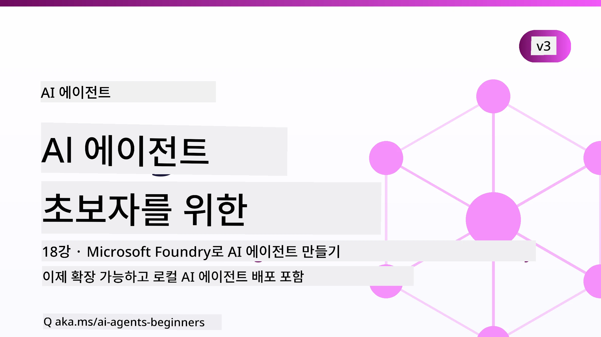

# 초보자를 위한 AI 에이전트 - 강의



## AI 에이전트 구축을 시작하는 데 필요한 모든 것을 가르치는 강의

[](https://github.com/microsoft/ai-agents-for-beginners/blob/master/LICENSE?WT.mc_id=academic-105485-koreyst)
[](https://GitHub.com/microsoft/ai-agents-for-beginners/graphs/contributors/?WT.mc_id=academic-105485-koreyst)
[](https://GitHub.com/microsoft/ai-agents-for-beginners/issues/?WT.mc_id=academic-105485-koreyst)
[](https://GitHub.com/microsoft/ai-agents-for-beginners/pulls/?WT.mc_id=academic-105485-koreyst)
[](http://makeapullrequest.com?WT.mc_id=academic-105485-koreyst)

### 🌐 다국어 지원

#### GitHub 액션을 통한 지원 (자동화 및 항상 최신 상태 유지)

<!-- CO-OP TRANSLATOR LANGUAGES TABLE START -->
[아랍어](../ar/README.md) | [벵골어](../bn/README.md) | [불가리아어](../bg/README.md) | [버마어 (미얀마)](../my/README.md) | [중국어 (간체)](../zh-CN/README.md) | [중국어 (번체, 홍콩)](../zh-HK/README.md) | [중국어 (번체, 마카오)](../zh-MO/README.md) | [중국어 (번체, 대만)](../zh-TW/README.md) | [크로아티아어](../hr/README.md) | [체코어](../cs/README.md) | [덴마크어](../da/README.md) | [네덜란드어](../nl/README.md) | [에스토니아어](../et/README.md) | [핀란드어](../fi/README.md) | [프랑스어](../fr/README.md) | [독일어](../de/README.md) | [그리스어](../el/README.md) | [히브리어](../he/README.md) | [힌디어](../hi/README.md) | [헝가리어](../hu/README.md) | [인도네시아어](../id/README.md) | [이탈리아어](../it/README.md) | [일본어](../ja/README.md) | [칸나다어](../kn/README.md) | [크메르어](../km/README.md) | [한국어](./README.md) | [리투아니아어](../lt/README.md) | [말레이어](../ms/README.md) | [말라얄람어](../ml/README.md) | [마라티어](../mr/README.md) | [네팔어](../ne/README.md) | [나이지리아 피진어](../pcm/README.md) | [노르웨이어](../no/README.md) | [페르시아어 (파르시)](../fa/README.md) | [폴란드어](../pl/README.md) | [포르투갈어 (브라질)](../pt-BR/README.md) | [포르투갈어 (포르투갈)](../pt-PT/README.md) | [펀자브어 (구르무키)](../pa/README.md) | [루마니아어](../ro/README.md) | [러시아어](../ru/README.md) | [세르비아어 (키릴 문자)](../sr/README.md) | [슬로바키아어](../sk/README.md) | [슬로베니아어](../sl/README.md) | [스페인어](../es/README.md) | [스와힐리어](../sw/README.md) | [스웨덴어](../sv/README.md) | [타갈로그어 (필리핀어)](../tl/README.md) | [타밀어](../ta/README.md) | [텔루구어](../te/README.md) | [태국어](../th/README.md) | [터키어](../tr/README.md) | [우크라이나어](../uk/README.md) | [우르두어](../ur/README.md) | [베트남어](../vi/README.md)

> **로컬 복제를 선호하시나요?**
>
> 이 저장소에는 50개 이상의 언어 번역이 포함되어 있어 다운로드 크기가 크게 증가합니다. 번역 없이 복제하려면 sparse checkout을 사용하세요:
>
> **Bash / macOS / Linux:**
> ```bash
> git clone --filter=blob:none --sparse https://github.com/microsoft/ai-agents-for-beginners.git
> cd ai-agents-for-beginners
> git sparse-checkout set --no-cone '/*' '!translations' '!translated_images'
> ```
>
> **CMD (Windows):**
> ```cmd
> git clone --filter=blob:none --sparse https://github.com/microsoft/ai-agents-for-beginners.git
> cd ai-agents-for-beginners
> git sparse-checkout set --no-cone "/*" "!translations" "!translated_images"
> ```
>
> 이 방법은 훨씬 빠른 다운로드로 강의를 완료하는 데 필요한 모든 것을 제공합니다.
<!-- CO-OP TRANSLATOR LANGUAGES TABLE END -->

**추가 번역 언어 지원을 원하시면, [여기](https://github.com/Azure/co-op-translator/blob/main/getting_started/supported-languages.md)에 목록이 있습니다.**

[](https://GitHub.com/microsoft/ai-agents-for-beginners/watchers/?WT.mc_id=academic-105485-koreyst)
[](https://GitHub.com/microsoft/ai-agents-for-beginners/network/?WT.mc_id=academic-105485-koreyst)
[](https://GitHub.com/microsoft/ai-agents-for-beginners/stargazers/?WT.mc_id=academic-105485-koreyst)

[](https://discord.com/invite/ATgtXmAS5D)


## 🌱 시작하기

이 강의는 AI 에이전트 구축의 기본을 다루는 수업들로 구성되어 있습니다. 각 수업은 자체 주제를 다루므로 원하는 곳에서 시작하세요!

이 강의는 다국어 지원을 제공합니다. [여기에서 사용 가능한 언어](#-multi-language-support)를 확인하세요.

생성 AI 모델로 처음 빌드하는 경우, 21개의 수업을 포함하는 [초보자를 위한 생성 AI](https://aka.ms/genai-beginners) 강의를 확인해 보세요.

코드 실행을 위해 [이 저장소에 별 표시(🌟)하기](https://docs.github.com/en/get-started/exploring-projects-on-github/saving-repositories-with-stars?WT.mc_id=academic-105485-koreyst)와 [저장소를 포크하기](https://github.com/microsoft/ai-agents-for-beginners/fork)를 잊지 마세요.

### 다른 학습자 만나기, 질문 해결하기

AI 에이전트 구축에 대해 막혔거나 궁금한 점이 있으면, [Microsoft Foundry Discord](https://aka.ms/ai-agents/discord)의 전용 Discord 채널에 참여하세요.

### 필요한 것

이 강의의 각 수업에는 code_samples 폴더에서 볼 수 있는 코드 예제가 포함되어 있습니다. [저장소를 포크](https://github.com/microsoft/ai-agents-for-beginners/fork)하여 자신만의 복사본을 만들 수 있습니다.  

이 연습의 코드 예제들은 Microsoft Foundry Agent Service V2와 함께 Microsoft Agent Framework을 사용합니다:

- [Microsoft Foundry](https://aka.ms/ai-agents-beginners/ai-foundry) - Azure 계정 필요

이 강의에서는 Microsoft의 다음 AI 에이전트 프레임워크와 서비스를 사용합니다:

- [Microsoft Agent Framework (MAF)](https://aka.ms/ai-agents-beginners/agent-framework)
- [Microsoft Foundry Agent Service V2](https://aka.ms/ai-agents-beginners/ai-agent-service)

일부 코드 샘플은 최대 204K 토큰을 지원하는 대용량 컨텍스트 모델을 제공하는 [MiniMax](https://platform.minimaxi.com/)와 같은 OpenAI 호환 대체 공급자도 지원합니다. 구성 세부 정보는 [강의 설정](./00-course-setup/README.md)을 참조하세요.

이 강의 코드 실행에 대한 자세한 정보는 [강의 설정](./00-course-setup/README.md)을 참조하세요.

## 🙏 도움을 원하시나요?

제안사항이나 맞춤법 또는 코드 오류를 발견했다면, [이슈 제기하기](https://github.com/microsoft/ai-agents-for-beginners/issues?WT.mc_id=academic-105485-koreyst) 또는 [풀 리퀘스트 생성하기](https://github.com/microsoft/ai-agents-for-beginners/pulls?WT.mc_id=academic-105485-koreyst)를 해주세요.


## 📂 각 수업에는 포함된 것

- README에 있는 서면 수업 및 짧은 비디오
- Microsoft Agent Framework과 Microsoft Foundry를 이용한 Python 코드 샘플
- 학습을 계속하기 위한 추가 자료 링크


## 🗃️ 수업 목록

| <strong>수업</strong>                                   | **텍스트 & 코드**                                    | <strong>비디오</strong>                                                  | **추가 학습 자료**                                                                     |
|----------------------------------------------|----------------------------------------------------|------------------------------------------------------------|----------------------------------------------------------------------------------------|
| AI 에이전트 소개 및 에이전트 활용 사례       | [링크](./01-intro-to-ai-agents/README.md)          | [비디오](https://youtu.be/3zgm60bXmQk?si=z8QygFvYQv-9WtO1)  | [링크](https://aka.ms/ai-agents-beginners/collection?WT.mc_id=academic-105485-koreyst) |
| AI 에이전트 프레임워크 탐색                  | [링크](./02-explore-agentic-frameworks/README.md)  | [비디오](https://youtu.be/ODwF-EZo_O8?si=Vawth4hzVaHv-u0H)  | [링크](https://aka.ms/ai-agents-beginners/collection?WT.mc_id=academic-105485-koreyst) |
| AI 에이전트 설계 패턴 이해                    | [링크](./03-agentic-design-patterns/README.md)     | [비디오](https://youtu.be/m9lM8qqoOEA?si=BIzHwzstTPL8o9GF)  | [링크](https://aka.ms/ai-agents-beginners/collection?WT.mc_id=academic-105485-koreyst) |
| 도구 사용 설계 패턴                          | [링크](./04-tool-use/README.md)                    | [비디오](https://youtu.be/vieRiPRx-gI?si=2z6O2Xu2cu_Jz46N)  | [링크](https://aka.ms/ai-agents-beginners/collection?WT.mc_id=academic-105485-koreyst) |
| 에이전틱 RAG                                | [링크](./05-agentic-rag/README.md)                 | [비디오](https://youtu.be/WcjAARvdL7I?si=gKPWsQpKiIlDH9A3)  | [링크](https://aka.ms/ai-agents-beginners/collection?WT.mc_id=academic-105485-koreyst) |
| 신뢰할 수 있는 AI 에이전트 구축               | [링크](./06-building-trustworthy-agents/README.md) | [비디오](https://youtu.be/iZKkMEGBCUQ?si=jZjpiMnGFOE9L8OK ) | [링크](https://aka.ms/ai-agents-beginners/collection?WT.mc_id=academic-105485-koreyst) |
| 계획 설계 패턴                              | [링크](./07-planning-design/README.md)             | [비디오](https://youtu.be/kPfJ2BrBCMY?si=6SC_iv_E5-mzucnC)  | [링크](https://aka.ms/ai-agents-beginners/collection?WT.mc_id=academic-105485-koreyst) |
| 다중 에이전트 설계 패턴                       | [링크](./08-multi-agent/README.md)                 | [비디오](https://youtu.be/V6HpE9hZEx0?si=rMgDhEu7wXo2uo6g)  | [링크](https://aka.ms/ai-agents-beginners/collection?WT.mc_id=academic-105485-koreyst) |

| 메타인지 설계 패턴                 | [Link](./09-metacognition/README.md)               | [Video](https://youtu.be/His9R6gw6Ec?si=8gck6vvdSNCt6OcF)  | [Link](https://aka.ms/ai-agents-beginners/collection?WT.mc_id=academic-105485-koreyst) |
| 생산 환경의 AI 에이전트                      | [Link](./10-ai-agents-production/README.md)        | [Video](https://youtu.be/l4TP6IyJxmQ?si=31dnhexRo6yLRJDl)  | [Link](https://aka.ms/ai-agents-beginners/collection?WT.mc_id=academic-105485-koreyst) |
| 에이전트 프로토콜 사용 (MCP, A2A 및 NLWeb) | [Link](./11-agentic-protocols/README.md)           | [Video](https://youtu.be/X-Dh9R3Opn8)                                 | [Link](https://aka.ms/ai-agents-beginners/collection?WT.mc_id=academic-105485-koreyst) |
| AI 에이전트를 위한 컨텍스트 엔지니어링            | [Link](./12-context-engineering/README.md)         | [Video](https://youtu.be/F5zqRV7gEag)                                 | [Link](https://aka.ms/ai-agents-beginners/collection?WT.mc_id=academic-105485-koreyst) |
| 에이전트 메모리 관리                      | [Link](./13-agent-memory/README.md)     |      [Video](https://youtu.be/QrYbHesIxpw?si=vZkVwKrQ4ieCcIPx)                                                      |                                                                                        |
| 마이크로소프트 에이전트 프레임워크 탐색                         | [Link](./14-microsoft-agent-framework/README.md)                            |                                                            |                                                                                        |
| 컴퓨터 사용 에이전트 구축 (CUA)           | [Link](./15-browser-use/README.md)     |                                                            | [Link](https://docs.browser-use.com/examples/templates/playwright-integration)         |
| 확장 가능한 에이전트 배포                    | [Link](./16-deploying-scalable-agents/README.md) |                                                    | [Link](https://learn.microsoft.com/azure/ai-foundry/agents/overview)                   |
| 로컬 AI 에이전트 생성                     | [Link](./17-creating-local-ai-agents/README.md)  |                                                    | [Link](https://learn.microsoft.com/azure/ai-foundry/foundry-local/)                    |
| AI 에이전트 보안                           | [Link](./18-securing-ai-agents/README.md)  |                                                            | [Link](https://aka.ms/ai-agents-beginners/collection?WT.mc_id=academic-105485-koreyst) |

## 🎒 기타 강의

저희 팀은 다른 강의도 제작합니다! 확인해 보세요:

<!-- CO-OP TRANSLATOR OTHER COURSES START -->
### LangChain
[](https://aka.ms/langchain4j-for-beginners)
[](https://aka.ms/langchainjs-for-beginners?WT.mc_id=m365-94501-dwahlin)
[](https://github.com/microsoft/langchain-for-beginners?WT.mc_id=m365-94501-dwahlin)
---

### Azure / Edge / MCP / 에이전트
[](https://github.com/microsoft/AZD-for-beginners?WT.mc_id=academic-105485-koreyst)
[](https://github.com/microsoft/edgeai-for-beginners?WT.mc_id=academic-105485-koreyst)
[](https://github.com/microsoft/mcp-for-beginners?WT.mc_id=academic-105485-koreyst)
[](https://github.com/microsoft/ai-agents-for-beginners?WT.mc_id=academic-105485-koreyst)

---
 
### 생성 AI 시리즈
[](https://github.com/microsoft/generative-ai-for-beginners?WT.mc_id=academic-105485-koreyst)
[-9333EA?style=for-the-badge&labelColor=E5E7EB&color=9333EA)](https://github.com/microsoft/Generative-AI-for-beginners-dotnet?WT.mc_id=academic-105485-koreyst)
[-C084FC?style=for-the-badge&labelColor=E5E7EB&color=C084FC)](https://github.com/microsoft/generative-ai-for-beginners-java?WT.mc_id=academic-105485-koreyst)
[-E879F9?style=for-the-badge&labelColor=E5E7EB&color=E879F9)](https://github.com/microsoft/generative-ai-with-javascript?WT.mc_id=academic-105485-koreyst)

---
 
### 핵심 학습
[](https://aka.ms/ml-beginners?WT.mc_id=academic-105485-koreyst)
[](https://aka.ms/datascience-beginners?WT.mc_id=academic-105485-koreyst)
[](https://aka.ms/ai-beginners?WT.mc_id=academic-105485-koreyst)
[](https://github.com/microsoft/Security-101?WT.mc_id=academic-96948-sayoung)
[](https://aka.ms/webdev-beginners?WT.mc_id=academic-105485-koreyst)
[](https://aka.ms/iot-beginners?WT.mc_id=academic-105485-koreyst)
[](https://github.com/microsoft/xr-development-for-beginners?WT.mc_id=academic-105485-koreyst)

---
 
### 코파일럿 시리즈
[](https://aka.ms/GitHubCopilotAI?WT.mc_id=academic-105485-koreyst)
[](https://github.com/microsoft/mastering-github-copilot-for-dotnet-csharp-developers?WT.mc_id=academic-105485-koreyst)
[](https://github.com/microsoft/CopilotAdventures?WT.mc_id=academic-105485-koreyst)
<!-- CO-OP TRANSLATOR OTHER COURSES END -->

## 🌟 커뮤니티 감사

Agentic RAG을 보여주는 중요한 코드 샘플을 기여해 주신 [Shivam Goyal](https://www.linkedin.com/in/shivam2003/) 님께 감사드립니다.

## 기여하기

이 프로젝트는 기여와 제안을 환영합니다. 대부분 기여는
귀하가 기여한 내용을 사용할 권리가 있고 실제로 권리를 부여한다는 것을 선언하는
기여자 라이선스 계약서(CLA)에 동의해야 합니다. 자세한 내용은 <https://cla.opensource.microsoft.com>을 참조하세요.

풀 리퀘스트를 제출하면 CLA 봇이 자동으로 CLA 제출이 필요한지 판단하고 PR에 적절한 표시(예: 상태 검사, 댓글)를 합니다.
봇의 지침을 따라주시면 됩니다. 우리 CLA를 사용하는 모든 저장소에서 단 한 번만 수행하면 됩니다.


이 프로젝트는 [마이크로소프트 오픈 소스 행동 강령](https://opensource.microsoft.com/codeofconduct/)을 채택했습니다.
자세한 내용은 [행동 강령 FAQ](https://opensource.microsoft.com/codeofconduct/faq/)를 참조하거나
추가 질문이나 의견이 있으시면 [opencode@microsoft.com](mailto:opencode@microsoft.com)으로 연락해 주세요.

## 상표권

이 프로젝트에는 프로젝트, 제품 또는 서비스의 상표나 로고가 포함될 수 있습니다. 마이크로소프트의
상표 또는 로고를 권한 있게 사용하는 것은
[마이크로소프트의 상표 및 브랜드 가이드라인](https://www.microsoft.com/legal/intellectualproperty/trademarks/usage/general)을 따라야 합니다.
이 프로젝트의 수정 버전에 사용되는 마이크로소프트 상표나 로고는 혼동을 유발하거나 마이크로소프트 후원을 의미하지 않아야 합니다.
제3자 상표나 로고 사용은 해당 제3자의 정책을 따라야 합니다.

## 도움 받기


AI 앱 개발 중 막히거나 질문이 있으면 참여하세요:

[](https://aka.ms/foundry/discord)

제품 피드백이나 빌드 중 오류가 있으면 방문하세요:

[](https://aka.ms/foundry/forum)

---

<!-- CO-OP TRANSLATOR DISCLAIMER START -->
**면책 조항**:
이 문서는 AI 번역 서비스 [Co-op Translator](https://github.com/Azure/co-op-translator)를 사용하여 번역되었습니다. 정확성을 기하기 위해 노력하고 있으나, 자동 번역은 오류나 부정확한 부분이 있을 수 있음을 유의하시기 바랍니다. 원본 문서의 원어본이 권위 있는 자료로 간주되어야 합니다. 중요한 정보의 경우, 전문가의 인간 번역을 권장합니다. 이 번역 사용으로 인해 발생하는 오해나 잘못된 해석에 대해 당사는 책임을 지지 않습니다.
<!-- CO-OP TRANSLATOR DISCLAIMER END -->