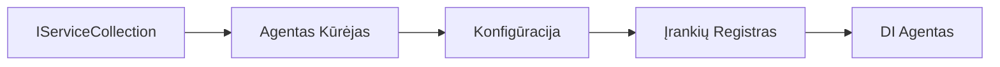

# 🎨 Agentinių dizaino modelių taikymas su Azure OpenAI (Atsakymų API) (.NET)

## 📋 Mokymosi tikslai

Šis pavyzdys iliustruoja įmonių lygio dizaino modelius, skirtus protingų agentų kūrimui naudojant Microsoft Agent Framework .NET su Azure OpenAI (Atsakymų API) integracija. Išmoksite profesionalius modelius ir architektūrinius požiūrius, kurie padaro agentus paruoštais gamybai, lengvai prižiūrimą ir skalėjamą.

### Įmonių dizaino modeliai

- 🏭 **Fabriko modelis**: Standartizuotas agentų kūrimas su priklausomybių injekcija
- 🔧 **Konstruktoriaus modelis**: Sklandus agento konfigūravimas ir paruošimas
- 🧵 **Saugūs dėl gijų modeliai**: Kelių pokalbių valdymas vienu metu
- 📋 **Saugyklos modelis**: Įrankių ir galimybių organizavimas

## 🎯 .NET specifinės architektūrinės naudos

### Įmonių savybės

- **Stiprus tipavimas**: Kompiliavimo metu patikrinimas ir IntelliSense palaikymas
- **Priklausomybių injekcija**: Įmontuotas DI konteinerio integravimas
- **Konfigūracijos valdymas**: IConfiguration ir Options modeliai
- **Async/Await**: Pirmos klasės asinchroninio programavimo palaikymas

### Gamybai paruošti modeliai

- **Registracijos integracija**: ILogger ir struktūruota registracija
- **Sveikatos patikra**: Įmontuotas stebėjimas ir diagnostika
- **Konfigūracijos patikra**: Stiprus tipavimas su duomenų anotacijomis
- **Klaidų tvarkymas**: Struktūruota išimčių valdymas

## 🔧 Techninė architektūra

### Pagrindiniai .NET komponentai

- **Microsoft.Extensions.AI**: Suvienyti DI paslaugų abstrakcijos
- **Microsoft.Agents.AI**: Įmonių agentų koordinavimo sistema
- **Azure OpenAI (Atsakymų API)**: Aukšto našumo API kliento modeliai
- **Konfigūracijos sistema**: appsettings.json ir aplinkos integracija

### Dizaino modelio įgyvendinimas



## 🏗️ Demonstravimo įmonių modeliai

### 1. **Kūrimo modeliai**

- **Agentų fabriko modelis**: Centralizuotas agentų kūrimas su nuoseklia konfigūracija
- **Konstruktoriaus modelis**: Sklandus API sudėtingai agento konfigūracijai
- **Vienetinis modelis**: Bendrų resursų ir konfigūracijos valdymas
- **Priklausomybių injekcija**: Laisvas sujungimas ir testavimas

### 2. **Elgesio modeliai**

- **Strategijos modelis**: Keičiamos įrankių vykdymo strategijos
- **Komandos modelis**: Įkapsuliuotos agentų operacijos su anuliavimu / pakartojimu
- **Stebėtojo modelis**: Renginių pagrindu agentų gyvavimo ciklo valdymas
- **Šablono metodas**: Standartizuotos agento vykdymo darbo eigos

### 3. **Struktūriniai modeliai**

- **Adapterio modelis**: Azure OpenAI (Atsakymų API) integracijos sluoksnis
- **Dekoratoriaus modelis**: Agentų galimybių išplėtimas
- **Fasado modelis**: Supaprastintos agentų sąsajos
- **Proksio modelis**: Atsipalaidavęs įkėlimas ir kešavimas našumui gerinti

## 📚 .NET dizaino principai

### SOLID principai

- **Vienos atsakomybės principas**: Kiekvienas komponentas turi aiškų tikslą
- **Atviras/Uždarytas**: Plečiama be modifikavimo
- **Liskovo pakeitimo principas**: Sąsajos pagrindu įrankių įgyvendinimai
- **Sąsajų segregacija**: Tikslinės, vientisos sąsajos
- **Priklausomybių inversija**: Priklausomybė nuo abstrakcijų, ne konkrečių klasių

### Švari architektūra

- **Domėnio sluoksnis**: Pagrindinės agentų ir įrankių abstrakcijos
- **Taikymo sluoksnis**: Agentų koordinavimas ir darbo eigos
- **Infrastruktūros sluoksnis**: Azure OpenAI (Atsakymų API) integracija ir išorinės paslaugos
- **Pristatymo sluoksnis**: Vartotojo sąveika ir atsakymų formatavimas

## 🔒 Įmonių svarstymai

### Saugumas

- **Autentifikavimo valdymas**: Saugus API raktų tvarkymas su IConfiguration
- **Įvesties patikra**: Stiprus tipavimas ir duomenų anotacijų patikra
- **Išvesties valymas**: Saugus atsakymų apdorojimas ir filtravimas
- **Auditų registracija**: Visapusiškas operacijų sekimas

### Našumas

- **Asinchroniniai modeliai**: Blokavimą išvengiančios įvesties/išvesties operacijos
- **Ryšių telkimas**: Efektyvus HTTP klientų valdymas
- **Kešavimas**: Atsakymų kešavimas našumo gerinimui
- **Išteklių valdymas**: Tinkamas išteklių utilizavimas ir išvalymas

### Skalėjamumas

- **Saugumas gijų atžvilgiu**: Kelių agentų vykdymo vienu metu palaikymas
- **Išteklių telkimas**: Efektyvus išteklių panaudojimas
- **Krūvio valdymas**: Greičio ribojimas ir atgalinio spaudimo tvarkymas
- **Stebėjimas**: Našumo metrikos ir sveikatos patikros

## 🚀 Gamybinis diegimas

- **Konfigūracijos valdymas**: Aplinkai būdingi nustatymai
- **Registracijos strategija**: Struktūruota registracija su koreliacijos ID
- **Klaidų tvarkymas**: Globalus išimčių valdymas su tinkamu atsigavimu
- **Stebėjimas**: Programų įžvalgos ir našumo skaitikliai
- **Testavimas**: Vienetų testai, integraciniai testai ir apkrovos testavimo modeliai

Pasiruošę sukurti įmonių lygio protingus agentus su .NET? Sukurkime kažką tvirto! 🏢✨

## 🚀 Pradžia

### Reikalavimai

- [.NET 10 SDK](https://dotnet.microsoft.com/download/dotnet/10.0) arba naujesnė versija
- [Azure prenumerata](https://azure.microsoft.com/free/) su Azure OpenAI resursu ir modelio diegimu
- [Azure CLI](https://learn.microsoft.com/cli/azure/install-azure-cli) — prisijunkite su `az login`

### Būtini aplinkos kintamieji

```bash
# zsh/bash
export AZURE_OPENAI_ENDPOINT=https://<your-resource>.openai.azure.com
export AZURE_OPENAI_DEPLOYMENT=gpt-5-mini
# Tada prisijunkite, kad AzureCliCredential galėtų gauti žetoną
az login
```

```powershell
# PowerShell
$env:AZURE_OPENAI_ENDPOINT = "https://<your-resource>.openai.azure.com"
$env:AZURE_OPENAI_DEPLOYMENT = "gpt-5-mini"
# Tada prisijunkite, kad AzureCliCredential galėtų gauti žetoną
az login
```

### Pavyzdinis kodas

Norėdami paleisti kodo pavyzdį,

```bash
# zsh/bash
chmod +x ./03-dotnet-agent-framework.cs
./03-dotnet-agent-framework.cs
```

Arba naudodami dotnet CLI:

```bash
dotnet run ./03-dotnet-agent-framework.cs
```

Žr. [`03-dotnet-agent-framework.cs`](../../../../03-agentic-design-patterns/code_samples/03-dotnet-agent-framework.cs) pilną kodą.

```csharp
#!/usr/bin/dotnet run

#:package Microsoft.Extensions.AI@10.*
#:package Microsoft.Agents.AI.OpenAI@1.*-*
#:package Azure.AI.OpenAI@2.1.0
#:package Azure.Identity@1.13.1

using System.ComponentModel;

using Microsoft.Agents.AI;
using Microsoft.Extensions.AI;

using Azure.AI.OpenAI;
using Azure.Identity;

// Tool Function: Random Destination Generator
// This static method will be available to the agent as a callable tool
// The [Description] attribute helps the AI understand when to use this function
// This demonstrates how to create custom tools for AI agents
[Description("Provides a random vacation destination.")]
static string GetRandomDestination()
{
    // List of popular vacation destinations around the world
    // The agent will randomly select from these options
    var destinations = new List<string>
    {
        "Paris, France",
        "Tokyo, Japan",
        "New York City, USA",
        "Sydney, Australia",
        "Rome, Italy",
        "Barcelona, Spain",
        "Cape Town, South Africa",
        "Rio de Janeiro, Brazil",
        "Bangkok, Thailand",
        "Vancouver, Canada"
    };

    // Generate random index and return selected destination
    // Uses System.Random for simple random selection
    var random = new Random();
    int index = random.Next(destinations.Count);
    return destinations[index];
}

// Azure OpenAI with the Responses API (stable v1 endpoint). Sign in with `az login`.
var azureEndpoint = Environment.GetEnvironmentVariable("AZURE_OPENAI_ENDPOINT")
    ?? throw new InvalidOperationException("AZURE_OPENAI_ENDPOINT is not set.");
var deployment = Environment.GetEnvironmentVariable("AZURE_OPENAI_DEPLOYMENT") ?? "gpt-5-mini";

var azureClient = new AzureOpenAIClient(new Uri(azureEndpoint), new AzureCliCredential());

// Define Agent Identity and Comprehensive Instructions
// Agent name for identification and logging purposes
var AGENT_NAME = "TravelAgent";

// Detailed instructions that define the agent's personality, capabilities, and behavior
// This system prompt shapes how the agent responds and interacts with users
var AGENT_INSTRUCTIONS = """
You are a helpful AI Agent that can help plan vacations for customers.

Important: When users specify a destination, always plan for that location. Only suggest random destinations when the user hasn't specified a preference.

When the conversation begins, introduce yourself with this message:
"Hello! I'm your TravelAgent assistant. I can help plan vacations and suggest interesting destinations for you. Here are some things you can ask me:
1. Plan a day trip to a specific location
2. Suggest a random vacation destination
3. Find destinations with specific features (beaches, mountains, historical sites, etc.)
4. Plan an alternative trip if you don't like my first suggestion

What kind of trip would you like me to help you plan today?"

Always prioritize user preferences. If they mention a specific destination like "Bali" or "Paris," focus your planning on that location rather than suggesting alternatives.
""";

// Create AI Agent with Advanced Travel Planning Capabilities
// Get the Responses client for the deployment and create the AI agent
// Configure agent with name, detailed instructions, and available tools
// This demonstrates the .NET agent creation pattern with full configuration
AIAgent agent = azureClient
    .GetChatClient(deployment)
    .AsAIAgent(
        name: AGENT_NAME,
        instructions: AGENT_INSTRUCTIONS,
        tools: [AIFunctionFactory.Create(GetRandomDestination)]
    );

// Create New Conversation Session for Context Management
// Initialize a new conversation session to maintain context across multiple interactions
// Sessions enable the agent to remember previous exchanges and maintain conversational state
// This is essential for multi-turn conversations and contextual understanding
var session = await agent.CreateSessionAsync();

// Execute Agent: First Travel Planning Request
// Run the agent with an initial request that will likely trigger the random destination tool
// The agent will analyze the request, use the GetRandomDestination tool, and create an itinerary
// Using the session parameter maintains conversation context for subsequent interactions
await foreach (var update in agent.RunStreamingAsync("Plan me a day trip", session))
{
    await Task.Delay(10);
    Console.Write(update);
}

Console.WriteLine();

// Execute Agent: Follow-up Request with Context Awareness
// Demonstrate contextual conversation by referencing the previous response
// The agent remembers the previous destination suggestion and will provide an alternative
// This showcases the power of conversation sessions and contextual understanding in .NET agents
await foreach (var update in agent.RunStreamingAsync("I don't like that destination. Plan me another vacation.", session))
{
    await Task.Delay(10);
    Console.Write(update);
}
```

---

<!-- CO-OP TRANSLATOR DISCLAIMER START -->
**Atsakomybės apribojimas**:
Šis dokumentas buvo išverstas naudojant dirbtinio intelekto vertimo paslaugą [Co-op Translator](https://github.com/Azure/co-op-translator). Nors siekiame tikslumo, prašome atkreipti dėmesį, kad automatiniai vertimai gali turėti klaidų ar netikslumų. Originalus dokumentas jo gimtąja kalba laikomas autoritetingu šaltiniu. Svarbiai informacijai rekomenduojama naudoti profesionalų žmogiškąjį vertimą. Mes neatsakome už jokius nesusipratimus ar neteisingą interpretaciją, kilusią naudojantis šiuo vertimu.
<!-- CO-OP TRANSLATOR DISCLAIMER END -->