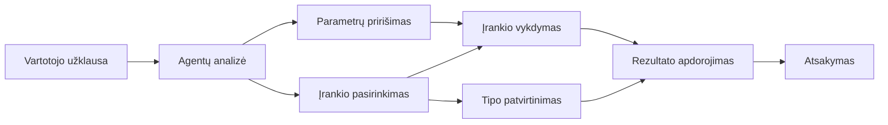

# 🛠️ Išplėstinis įrankių naudojimas su Azure OpenAI (Responses API) (.NET)

## 📋 Mokymosi tikslai

Ši užrašų knygutė demonstruoja įmonės lygio įrankių integracijos metodus, naudojant Microsoft Agent Framework .NET su Azure OpenAI (Responses API). Išmoksite kurti sudėtingus agentus su keliomis specializuotomis priemonėmis, pasinaudodami C# stipriuoju tipavimu ir .NET įmonės funkcijomis.

### Išplėstiniai įrankių gebėjimai, kuriuos įvaldysite

- 🔧 **Daugiainiai įrankiai**: agentų kūrimas su keliomis specializuotomis galimybėmis
- 🎯 **Tipu saugus įrankių vykdymas**: C# kompiliavimo metu atliekama validacija
- 📊 **Įmonės įrankių modeliai**: gamybai paruošto įrankio dizainas ir klaidų valdymas
- 🔗 **Įrankių sudėtis**: įrankių derinimas sudėtingiems verslo procesams

## 🎯 .NET įrankių architektūros privalumai

### Įmonės įrankių savybės

- **Kompiliavimo laiko validacija**: stiprus tipavimas užtikrina įrankių parametrų teisingumą
- **Priklausomybių injekcija**: IoC konteinerio integracija įrankių valdymui
- **Async/Await modeliai**: neblokuojamas įrankių vykdymas su tinkamu resursų valdymu
- **Struktūrizuotas žurnalas**: integruotas įrankių vykdymo stebėjimo žurnalas

### Gamybai paruošti modeliai

- **Išimčių valdymas**: išsamus klaidų valdymas su tipizuotomis išimtimis
- **Resursų valdymas**: tinkami išmetimo modeliai ir atminties valdymas
- **Veiklos stebėjimas**: integruoti matavimai ir veiklos skaitikliai
- **Konfigūravimo valdymas**: tipu saugi konfigūracija su validacija

## 🔧 Techninė architektūra

### Pagrindiniai .NET įrankių komponentai

- **Microsoft.Extensions.AI**: vieningas įrankių abstrakcijos sluoksnis
- **Microsoft.Agents.AI**: įmonės lygio įrankių organizavimas
- **Azure OpenAI (Responses API)**: aukšto našumo API klientas su ryšių balansavimu

### Įrankių vykdymo vamzdelis



## 🛠️ Įrankių kategorijos ir modeliai

### 1. **Duomenų apdorojimo įrankiai**

- **Įvesties validacija**: stiprus tipavimas su duomenų anotacijomis
- **Transformavimo operacijos**: tipu saugus duomenų konvertavimas ir formatavimas
- **Verslo logika**: srities specifiniai skaičiavimų ir analizės įrankiai
- **Išvesties formatavimas**: struktūrizuotas atsakymų generavimas

### 2. **Integracijos įrankiai**

- **API jungtys**: REST paslaugų integracija su HttpClient
- **Duomenų bazės įrankiai**: Entity Framework integracija duomenų prieigai
- **Failų operacijos**: saugios failų sistemos operacijos su validacija
- **Išorinės paslaugos**: trečiųjų šalių paslaugų integracijos modeliai

### 3. **Naudingi įrankiai**

- **Teksto apdorojimas**: teksto manipuliavimo ir formatavimo įrankiai
- **Datos/laiko operacijos**: kultūros kontekstui pritaikyti datos/laiko skaičiavimai
- **Matematiniai įrankiai**: tikslūs skaičiavimai ir statistinės operacijos
- **Validacijos įrankiai**: verslo taisyklių patikra ir duomenų tikrinimas

Pasiruošę kurti įmonės lygio agentus su galingomis, tipu saugiomis įrankių galimybėmis .NET? Sukurkime profesionalaus lygio sprendimus! 🏢⚡

## 🚀 Pradžia

### Išankstiniai reikalavimai

- [.NET 10 SDK](https://dotnet.microsoft.com/download/dotnet/10.0) arba naujesnė versija
- [Azure prenumerata](https://azure.microsoft.com/free/) su Azure OpenAI resursu ir modelio diegimu
- [Azure CLI](https://learn.microsoft.com/cli/azure/install-azure-cli) — prisijunkite komandą `az login`

### Reikalingi aplinkos kintamieji

```bash
# zsh/bash
export AZURE_OPENAI_ENDPOINT=https://<your-resource>.openai.azure.com
export AZURE_OPENAI_DEPLOYMENT=gpt-5-mini
# Tada prisijunkite, kad AzureCliCredential galėtų gauti žetoną
az login
```

```powershell
# PowerShell
$env:AZURE_OPENAI_ENDPOINT = "https://<your-resource>.openai.azure.com"
$env:AZURE_OPENAI_DEPLOYMENT = "gpt-5-mini"
# Tada prisijunkite, kad AzureCliCredential galėtų gauti žetoną
az login
```

### Pavyzdinis kodas

Norėdami paleisti pavyzdinį kodą,

```bash
# zsh/bash
chmod +x ./04-dotnet-agent-framework.cs
./04-dotnet-agent-framework.cs
```

Arba naudodami dotnet CLI:

```bash
dotnet run ./04-dotnet-agent-framework.cs
```

Žr. [`04-dotnet-agent-framework.cs`](../../../../04-tool-use/code_samples/04-dotnet-agent-framework.cs) su pilnu kodu.

```csharp
#!/usr/bin/dotnet run

#:package Microsoft.Extensions.AI@10.*
#:package Microsoft.Agents.AI.OpenAI@1.*-*
#:package Azure.AI.OpenAI@2.1.0
#:package Azure.Identity@1.13.1

using System.ComponentModel;

using Microsoft.Agents.AI;
using Microsoft.Extensions.AI;

using Azure.AI.OpenAI;
using Azure.Identity;

// Tool Function: Random Destination Generator
// This static method will be available to the agent as a callable tool
// The [Description] attribute helps the AI understand when to use this function
// This demonstrates how to create custom tools for AI agents
[Description("Provides a random vacation destination.")]
static string GetRandomDestination()
{
    // List of popular vacation destinations around the world
    // The agent will randomly select from these options
    var destinations = new List<string>
    {
        "Paris, France",
        "Tokyo, Japan",
        "New York City, USA",
        "Sydney, Australia",
        "Rome, Italy",
        "Barcelona, Spain",
        "Cape Town, South Africa",
        "Rio de Janeiro, Brazil",
        "Bangkok, Thailand",
        "Vancouver, Canada"
    };

    // Generate random index and return selected destination
    // Uses System.Random for simple random selection
    var random = new Random();
    int index = random.Next(destinations.Count);
    return destinations[index];
}

// Azure OpenAI with the Responses API (stable v1 endpoint). Sign in with `az login`.
var azureEndpoint = Environment.GetEnvironmentVariable("AZURE_OPENAI_ENDPOINT")
    ?? throw new InvalidOperationException("AZURE_OPENAI_ENDPOINT is not set.");
var deployment = Environment.GetEnvironmentVariable("AZURE_OPENAI_DEPLOYMENT") ?? "gpt-5-mini";

var azureClient = new AzureOpenAIClient(new Uri(azureEndpoint), new AzureCliCredential());

// Define Agent Identity and Comprehensive Instructions
// Agent name for identification and logging purposes
var AGENT_NAME = "TravelAgent";

// Detailed instructions that define the agent's personality, capabilities, and behavior
// This system prompt shapes how the agent responds and interacts with users
var AGENT_INSTRUCTIONS = """
You are a helpful AI Agent that can help plan vacations for customers.

Important: When users specify a destination, always plan for that location. Only suggest random destinations when the user hasn't specified a preference.

When the conversation begins, introduce yourself with this message:
"Hello! I'm your TravelAgent assistant. I can help plan vacations and suggest interesting destinations for you. Here are some things you can ask me:
1. Plan a day trip to a specific location
2. Suggest a random vacation destination
3. Find destinations with specific features (beaches, mountains, historical sites, etc.)
4. Plan an alternative trip if you don't like my first suggestion

What kind of trip would you like me to help you plan today?"

Always prioritize user preferences. If they mention a specific destination like "Bali" or "Paris," focus your planning on that location rather than suggesting alternatives.
""";

// Create AI Agent with Advanced Travel Planning Capabilities
// Get the Responses client for the deployment and create the AI agent
// Configure agent with name, detailed instructions, and available tools
// This demonstrates the .NET agent creation pattern with full configuration
AIAgent agent = azureClient
    .GetChatClient(deployment)
    .AsAIAgent(
        name: AGENT_NAME,
        instructions: AGENT_INSTRUCTIONS,
        tools: [AIFunctionFactory.Create(GetRandomDestination)]
    );

// Create New Conversation Session for Context Management
// Initialize a new conversation session to maintain context across multiple interactions
// Sessions enable the agent to remember previous exchanges and maintain conversational state
// This is essential for multi-turn conversations and contextual understanding
await using var session = await agent.CreateSessionAsync();

// Execute Agent: First Travel Planning Request
// Run the agent with an initial request that will likely trigger the random destination tool
// The agent will analyze the request, use the GetRandomDestination tool, and create an itinerary
// Using the session parameter maintains conversation context for subsequent interactions
await foreach (var update in agent.RunStreamingAsync("Plan me a day trip", session))
{
    await Task.Delay(10);
    Console.Write(update);
}

Console.WriteLine();

// Execute Agent: Follow-up Request with Context Awareness
// Demonstrate contextual conversation by referencing the previous response
// The agent remembers the previous destination suggestion and will provide an alternative
// This showcases the power of conversation sessions and contextual understanding in .NET agents
await foreach (var update in agent.RunStreamingAsync("I don't like that destination. Plan me another vacation.", session))
{
    await Task.Delay(10);
    Console.Write(update);
}
```

---

<!-- CO-OP TRANSLATOR DISCLAIMER START -->
**Atsakomybės apribojimas**:
Šis dokumentas buvo išverstas naudojant dirbtinio intelekto vertimo paslaugą [Co-op Translator](https://github.com/Azure/co-op-translator). Nors siekiame tikslumo, prašome atkreipti dėmesį, kad automatiniai vertimai gali turėti klaidų ar netikslumų. Originalus dokumentas jo gimtąja kalba laikomas autoritetingu šaltiniu. Svarbiai informacijai rekomenduojama naudoti profesionalų žmogiškąjį vertimą. Mes neatsakome už jokius nesusipratimus ar neteisingą interpretaciją, kilusią naudojantis šiuo vertimu.
<!-- CO-OP TRANSLATOR DISCLAIMER END -->