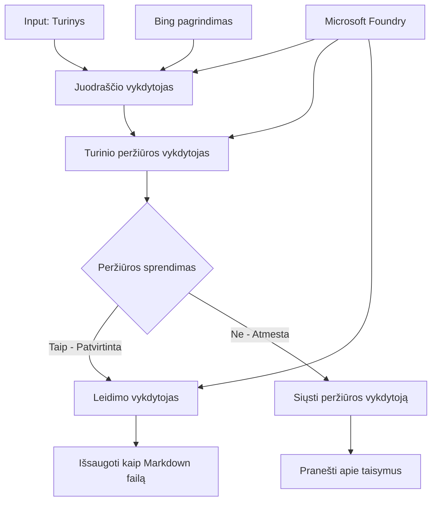

# 🔀 Sąlyginiai agentų darbo procesai su Microsoft Foundry (.NET)

## 📋 Protingo sprendimų pagrindu veikiantis darbo proceso vadovas

Šis užrašų knygelės pavyzdys demonstruoja **sąlyginių darbo procesų šablonus** naudojant Microsoft Foundry ir Microsoft Agent Framework .NET aplinkoje. Išmoksite kurti sudėtingus, sprendimais paremtus darbo procesus, kurie protingai nukreipia apdorojimą remiantis DI analize, verslo taisyklėmis ir dinaminėmis sąlygomis įmonių lygio automatizavimui.

## 🎯 Mokymosi tikslai

### 🧠 **Protinga sprendimų architektūra**
- **Sąlyginės logikos įgyvendinimas**: Kurkite sudėtingus sprendimų medžius su daugeliu šakų
- **DI pagrįstas nukreipimas**: Naudokite Microsoft Foundry modelius protingiems nukreipimo sprendimams priimti
- **Darbo proceso dinaminis pritaikymas**: Keiskite darbo proceso elgesį remiantis vykdymo metu vykdoma analize ir sąlygomis
- **Įmonių taisyklių integracija**: Įtraukite verslo logiką ir atitikimo reikalavimus į darbo procesus

### 🔀 **Išplėstiniai sąlyginiai šablonai**
- **Daugialypis kriterijų vertinimas**: Vertinkite kelis veiksnius nukreipimo sprendimams
- **Konteksto pagrindu veikiantis apdorojimas**: Priimkite sprendimus remiantis sukauptu darbo proceso kontekstu ir istorija
- **Adaptuojamas darbo proceso keitimas**: Dinamiškai koreguokite apdorojimo kelius pagal realaus laiko sąlygas
- **Taisyklių variklio integracija**: Įgyvendinkite išplėstinius verslo taisyklių variklius darbo procesuose

### 🏢 **Įmonių sąlyginės programos**
- **Dokumentų klasifikavimas ir nukreipimas**: Automatiškai klasifikuokite ir nukreipkite dokumentus į tinkamus darbo procesus
- **Klientų aptarnavimo atranka**: Protingas klientų užklausų nukreipimas į specializuotas komandas
- **Atitikties ir rizikos apdorojimas**: Taikykite skirtingus patikrinimo ir peržiūros procesus pagal rizikos vertinimą
- **Kokybės užtikrinimo darbo procesai**: Nukreipkite turinį per tinkamus peržiūros procesus pagal kokybės rodiklius

## ⚙️ Reikalavimai ir paruošimas

### 📦 **Reikalingi NuGet paketai**

Išplėstiniai paketai sąlyginiam darbo procesų apdorojimui:

```xml
<!-- Core AI Framework -->
<PackageReference Include="Microsoft.Extensions.AI" Version="9.9.0" />

<!-- Azure AI Agents with Persistent State -->
<PackageReference Include="Azure.AI.Agents.Persistent" Version="1.2.0-beta.5" />

<!-- Azure Identity and Utilities -->
<PackageReference Include="Azure.Identity" Version="1.15.0" />
<PackageReference Include="System.Linq.Async" Version="6.0.3" />
<PackageReference Include="DotNetEnv" Version="3.1.1" />

<!-- Local Workflow Framework References -->
<!-- Microsoft.Agents.Workflows.dll - Advanced workflow orchestration -->
<!-- Microsoft.Agents.AI.AzureAI.dll - Microsoft Foundry integration -->
<!-- Microsoft.Agents.AI.dll - Core agent abstractions -->
```

### 🔑 **Microsoft Foundry konfigūracija**

**Reikalingi Azure ištekliai:**
- Microsoft Foundry darbo aplinka su sąlyginiais apdorojimo modeliais
- Azure prenumerata su tinkamomis apskaičiavimo kvotomis ir leidimais
- Diegti DI modeliai sprendimų priėmimui ir turinio analizei
- (Pasirinktinai) Bing Search API ryšys pagrindimo funkcijoms

**Aplinkos konfigūracija (.env failas):**
```env
# Microsoft Foundry Configuration
AZURE_AI_PROJECT_ENDPOINT=https://your-project.cognitiveservices.azure.com/
BING_CONNECTION_ID=your-bing-connection-id
```

**Autentifikacijos paruošimas:**
```csharp
// Azure CLI or Managed Identity authentication
using Azure.Identity;
var credential = new AzureCliCredential();

// Load environment configuration
DotNetEnv.Env.Load("../../../.env");
```

### 🏗️ **Sąlyginio darbo proceso architektūra**



**Pagrindinės dalys:**
- **Draft Executor**: DI agentas, kuris sukuria pradinius turinio juodraščius pagal aprašymus
- **Content Review Executor**: DI agentas vertina juodraščio kokybę ir atitikimą
- **Sąlyginis nukreipimas**: Sprendimų logika, kuri nukreipia pagal peržiūros rezultatus
- **Publikavimo/peržiūros keliai**: Atskirti apdorojimo keliai patvirtintam ir atmesta turiniui
- **Būsenos valdymas**: Išlaiko turinio ir peržiūros kontekstą per visą darbo procesą

## 🎨 **Sąlyginių darbo procesų dizaino šablonai**

### 📋 **Turinio kūrimas su kokybės kontrolės vartais**
```
Outline → Draft Creation → Quality Review → {Approve: Publish | Reject: Revise}
```

### 🎯 **Rizika pagrįstas dokumentų apdorojimas**
```
Document → Risk Assessment → {Low: Standard | High: Enhanced Review}
```

### 🔍 **Protingas klientų aptarnavimo nukreipimas**
```
Customer Query → Analysis → {Simple: FAQ Bot | Complex: Human Agent}
```

### 💼 **Atitikties pagrindu veikiantys darbo procesai**
```
Content → Compliance Check → {Pass: Publish | Fail: Legal Review}
```

## 🏢 **Įmonių sąlyginių procesų privalumai**

### 🎯 **Protinga automatizacija**
- **Išmanūs sprendimai**: DI pagrindu veikiantys nukreipimo sprendimai remiantis turinio analize ir kontekstu
- **Adaptuojamas apdorojimas**: Darbo procesai, kurie automatiškai prisitaiko prie kintančių sąlygų
- **Verslo taisyklių taikymas**: Automatinis sudėtingos verslo logikos ir politikos vykdymas
- **Konteksto pagrindu veikiantis nukreipimas**: Sprendimai remiantis visa darbo proceso istorija ir sukauptu kontekstu

### 📈 **Veiklos kokybė**
- **Optimizuotas išteklių paskirstymas**: Nukreipkite darbą tinkamiausiems specialistams ir procesams
- **Mažiau rankinių įsikišimų**: Automatizuotas sprendimų priėmimas sumažina rankinį nukreipimą
- **Greitesnis sprendimų priėmimas**: Tiesioginis nukreipimas į tinkamą ekspertizę ir apdorojimo galimybes
- **Nuoseklus taikymas**: Vienodas verslo taisyklių ir sprendimų kriterijų taikymas

### 🛡️ **Rizikos valdymas ir atitiktis**
- **Automatinė rizikos vertinimas**: DI pagrindu veikianti turinio ir situacijos rizikos lygių įvertinimas
- **Atitikties užtikrinimas**: Automatinis nukreipimas per privalomus reguliavimo procesus
- **Saugumo protokolų taikymas**: Sustiprintos saugumo priemonės taikomos pagal rizikos vertinimą
- **Auditų įrašų palaikymas**: Išsamus nukreipimo sprendimų ir motyvų dokumentavimas

### 📊 **Analitika ir nuolatinis tobulinimas**
- **Sprendimų analizė**: Sekti nukreipimo sprendimų efektyvumą ir tikslumą
- **Šablonų atpažinimas**: Nustatyti tendencijas ir modelius nukreipimo sprendimuose laikui bėgant
- **Veiklos optimizavimas**: Nuolatinis sprendimų kriterijų ir nukreipimo efektyvumo gerinimas
- **Verslo žvalgyba**: Įžvalgos apie turinio charakteristikas ir apdorojimo reikalavimus

### 🔧 **Techninis tobulumas**
- **Nuolatinis būsenos valdymas**: Išlaikyti sudėtingą būseną per darbo proceso vykdymą
- **Mastelio architektūra**: Tvarkyti didelio našumo sąlyginio apdorojimo reikalavimus
- **Integracijos galimybės**: Sklandi integracija su esamomis verslo sistemomis ir procesais
- **Stebėsena ir matomumas**: Išsami darbo proceso našumo ir sprendimų sekimas

Sukurkime protingus, sprendimais paremtus įmonių darbo procesus su .NET! 🚀

## 💻 Kodų paleidimas

Pilna įgyvendinimo versija yra `04.dotnet-agent-framework-workflow-aifoundry-condition.cs`. Šis pavyzdys demonstruoja **turinio gamybos darbo procesą su kokybės vartais**:

### 🏗️ **Darbo proceso architektūra**

```
Content Outline → Draft Creation → Quality Review → Conditional Routing:
                                                      ├─ Approved (>200 words) → Publish
                                                      └─ Rejected (<200 words) → Review Notification
```

**Darbo procese naudojami agentai:**
1. **Evangelizmo agentas**: Kuria mokymų juodraščius iš aprašymų su Bing pagrindimu
2. **Turinio vertinimo agentas**: Vertina juodraščio kokybę (žodžių skaičius, pilnumas)
3. **Leidybos agentas**: Išsaugo patvirtintą turinį laiko žymėtais Markdown failais

**Pasirinktiniai vykdytojai:**
1. **DraftExecutor**: Organizuoja juodraščių kūrimą
2. **ContentReviewExecutor**: Atlieka kokybės vertinimą
3. **PublishExecutor**: Tvarko patvirtinto turinio leidimą
4. **SendReviewExecutor**: Valdo atmesto turinio pranešimus

### 🚀 Pavyzdžio paleidimas

**Reikalavimai:**
- Microsoft Foundry darbo aplinka paruošta
- Azure CLI autentifikacija (`az login`)
- (Pasirinktinai) Bing Search ryšys pagrindimui

```bash
# Padarykite skriptą vykdomą (Unix/Linux/macOS)
chmod +x 04.dotnet-agent-framework-workflow-aifoundry-condition.cs

# Vykdykite sąlyginį darbo eigą
./04.dotnet-agent-framework-workflow-aifoundry-condition.cs
```

Ar Windows aplinkoje:
```powershell
dotnet run 04.dotnet-agent-framework-workflow-aifoundry-condition.cs
```

### 📝 Tikėtinas rezultatas

Darbo procesas:
1. **Sukuria agentus**: Inicijuoja tris specializuotus Microsoft Foundry agentus
2. **Generuoja juodraštį**: Evangelizmo agentas kuria mokymo juodraštį iš aprašo
3. **Vertina turinį**: Turinio vertintojas įvertina juodraščio kokybę
4. **Sąlyginis nukreipimas**:
   - **Jei patvirtinta (>200 žodžių)**: Leidybos vykdytojas išsaugo kaip Markdown failą
   - **Jei atmesta (<200 žodžių)**: Siunčia peržiūros pranešimą
5. **Rodo rezultatus**: Parodo galutinį darbo proceso rezultatą

### 🔧 Pritaikymo galimybės

**Keisti peržiūros kriterijus:**
```csharp
const string ContentReviewerInstructions = @"
You are a content reviewer...
1. Check if content is more than 500 words (instead of 200)
2. Verify technical accuracy
3. Ensure proper formatting
...";
```

**Pridėti daugiau sąlyginių kelių:**
```csharp
var workflow = new WorkflowBuilder(draftExecutor)
    .AddEdge(draftExecutor, contentReviewerExecutor)
    .AddEdge(contentReviewerExecutor, publishExecutor, condition: GetCondition("Excellent"))
    .AddEdge(contentReviewerExecutor, editExecutor, condition: GetCondition("Good"))
    .AddEdge(contentReviewerExecutor, sendReviewerExecutor, condition: GetCondition("Poor"))
    .Build();
```

**Pakeisti turinio reikalavimus:**
```csharp
string OUTLINE_Content = @"
# Your Custom Topic
## Section 1
https://your-reference-url
## Section 2
...
";
```

### 🎯 Realūs panaudojimai

Šis sąlyginis darbo proceso šablonas idealus:
- **Turinio valdymo sistemoms**: Automatiniai redakcijos procesai su kokybės vartais
- **Dokumentų apdorojimui**: Nukreipti dokumentus pagal klasifikaciją ir atitikimą
- **Klientų aptarnavimui**: Protingas užklausų nukreipimas pagal sudėtingumą ir skubumą
- **Teisinė peržiūra**: Nukreipti sutartis pagal rizikos vertinimą ir vertę
- **Žmogiškųjų išteklių procesams**: Nukreipti paraiškas per tinkamus patikros procesus

### 🔍 Sąlyginės logikos supratimas

**Sąlygos funkcija:**
```csharp
public Func<object?, bool> GetCondition(string expectedResult) =>
    reviewResult => reviewResult is ReviewResult review && review.Result == expectedResult;
```

Ši funkcija sukuria predikatą, kuris:
1. Tikrina, ar rezultatas yra `ReviewResult` tipo
2. Lygina `Result` savybę su laukiamu reikšme
3. Grąžina tiesa/netiesa sprendžiant nukreipimą

**Darbo proceso kraštai su sąlygomis:**
```csharp
.AddEdge(contentReviewerExecutor, publishExecutor, condition: GetCondition("Yes"))
.AddEdge(contentReviewerExecutor, sendReviewerExecutor, condition: GetCondition("No"))
```

### 📊 Išplėstinės funkcijos

**JSON schemos validacija:**
Darbo procesas naudoja JSON schemas užtikrinti struktūrizuotus atsakymus:

```csharp
// Define response structure
public class ReviewResult
{
    [JsonPropertyName("review_result")]
    public string Result { get; set; } = string.Empty;
    
    [JsonPropertyName("reason")]
    public string Reason { get; set; } = string.Empty;
    
    [JsonPropertyName("draft_content")]
    public string DraftContent { get; set; } = string.Empty;
}

// Apply to agent
ResponseFormat = ChatResponseFormat.ForJsonSchema(
    AIJsonUtilities.CreateJsonSchema(typeof(ReviewResult)), 
    "ReviewResult", 
    "Review Result From DraftContent"
)
```

**Bing pagrindimo integracija:**
Evangelizmo agentas naudoja Bing pagrindimą realaus laiko informacijai pasiekti:

```csharp
var bingGroundingConfig = new BingGroundingSearchConfiguration(bing_conn_id);
BingGroundingToolDefinition bingGroundingTool = new(
    new BingGroundingSearchToolParameters([bingGroundingConfig])
);
```

Tai leidžia agentui sekti URL apraše ir išgauti aktualią informaciją.

### 🛡️ Klaidų tvarkymas

Darbo procese įtrauktas tvirtas klaidų tvarkymas atmestam turiniui:
- Peržiūros nesėkmės aktyvuoja alternatyvų kelią
- Pranešimai aiškiai nurodo atmetimo priežastis
- Turinys išsaugomas pataisymams

### 🔄 Darbo proceso išplėtimas

**Pridėti pataisymų ciklą:**
Sukurkite atsiliepimų ciklą, kuris automatiškai perrašo turinį:

```csharp
.AddEdge(contentReviewerExecutor, publishExecutor, condition: GetCondition("Yes"))
.AddEdge(contentReviewerExecutor, draftExecutor, condition: GetCondition("No")) // Loop back
```

**Įgyvendinti daugialypę peržiūrą:**
Pridėkite kelis peržiūros etapus su skirtingais kriterijais:

```csharp
.AddEdge(draftExecutor, technicalReviewer)
.AddEdge(technicalReviewer, editorialReviewer, condition: GetCondition("TechPass"))
.AddEdge(editorialReviewer, publishExecutor, condition: GetCondition("EditPass"))
```

Šis sąlyginis darbo proceso šablonas sudaro pamatus sudėtingoms, protingoms įmonių automatizavimo sistemoms kurti! 🚀

---

<!-- CO-OP TRANSLATOR DISCLAIMER START -->
**Atsakomybės apribojimas**:
Šis dokumentas buvo išverstas naudojant dirbtinio intelekto vertimo paslaugą [Co-op Translator](https://github.com/Azure/co-op-translator). Nors siekiame tikslumo, prašome atkreipti dėmesį, kad automatiniai vertimai gali turėti klaidų ar netikslumų. Originalus dokumentas jo gimtąja kalba laikomas autoritetingu šaltiniu. Svarbiai informacijai rekomenduojama naudoti profesionalų žmogiškąjį vertimą. Mes neatsakome už jokius nesusipratimus ar neteisingą interpretaciją, kilusią naudojantis šiuo vertimu.
<!-- CO-OP TRANSLATOR DISCLAIMER END -->