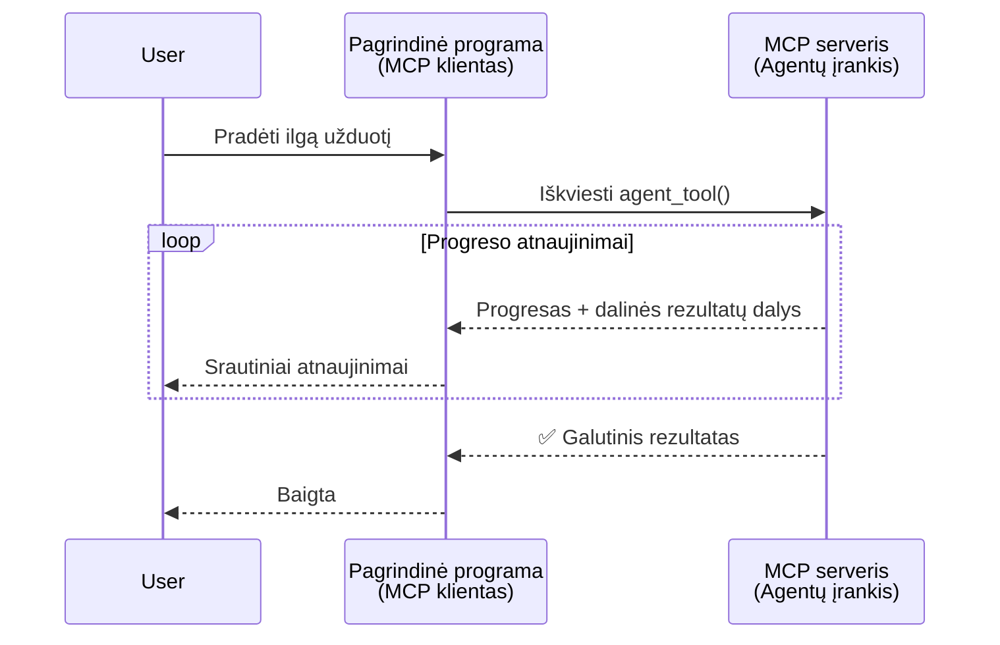
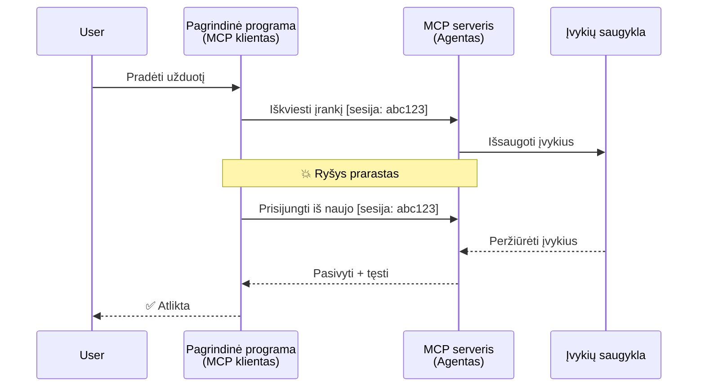
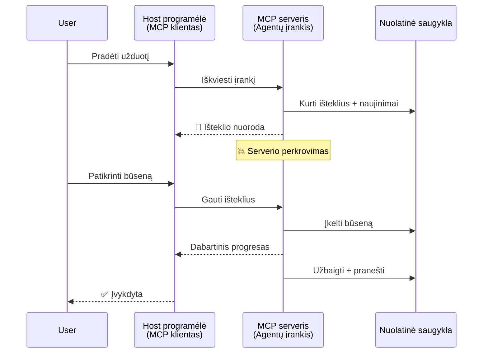
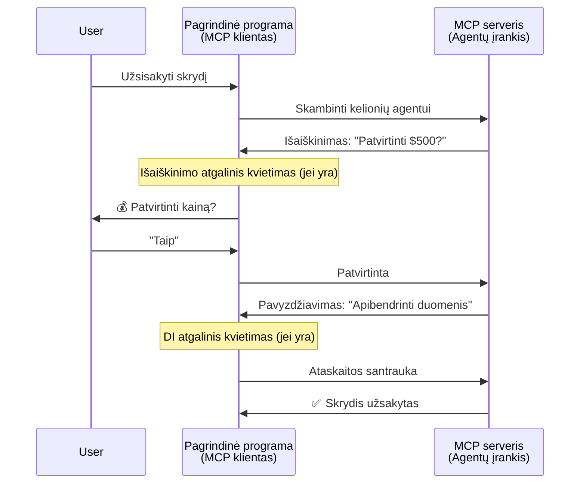
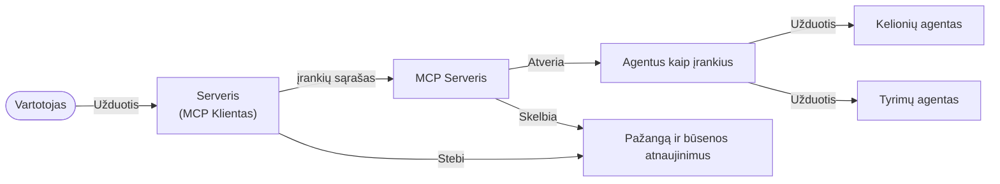

# Kuriame agentų tarpusavio komunikacijos sistemas su MCP

> TL;DR - Ar galima sukurti Agent2Agent komunikaciją su MCP? Taip!

MCP stipriai patobulėjo nuo pirminės „konteksto LLM’ams“ teikimo funkcijos. Naujausi patobulinimai, įskaitant [nutraukiamą srautą](https://modelcontextprotocol.io/docs/concepts/transports#resumability-and-redelivery), [inputo prašymą](https://modelcontextprotocol.io/specification/2025-06-18/client/elicitation), [mėginių ėmimą](https://modelcontextprotocol.io/specification/2025-06-18/client/sampling) ir pranešimus ([progreso](https://modelcontextprotocol.io/specification/2025-06-18/basic/utilities/progress) ir [išteklių](https://modelcontextprotocol.io/specification/2025-06-18/schema#resourceupdatednotification)), dabar MCP suteikia tvirtą pagrindą kurti sudėtingas agentų tarpusavio komunikacijos sistemas.

## Netinkamas agento/įrankio suvokimas

Kai vis daugiau kūrėjų tyrinėja įrankius su agentiniais elgesiais (veikia ilgą laiką, gali prireikti papildomo įvesties vykdymo metu ir pan.), plačiai paplitęs klaidingas įsitikinimas, kad MCP netinkamas, nes ankstyvieji įrankių pavyzdžiai buvo primityvūs ir orientuoti į paprastus užklausos-atsakymo modelius.

Šis požiūris yra pasenęs. MCP specifikacija per pastaruosius kelis mėnesius buvo smarkiai patobulinta ir dabar turi galimybių, kurios užpildo spragas ilgai veikiančių agentinių elgsenų kūrimui:

- **Srautiniai ir daliniai rezultatai**: realaus laiko progreso atnaujinimai vykdymo metu
- **Nutraukimo galimybė**: klientai gali prisijungti iš naujo ir tęsti po atjungimo
- **Ištvermingumas**: rezultatai išlieka net serveriui perkraunant (pvz., per išteklių nuorodas)
- **Daugiakartis įsikišimas**: interaktyvi įvestis vykdymo metu, per elicitation ir sampling

Šios funkcijos gali būti derinamos, kad būtų sukurtos sudėtingos agentinės ir daugiagentės programos, visas jas diegiant MCP protokolu.

Nuorodai naudosime agentą kaip „įrankį“, kuris yra MCP serveryje. Tai reiškia, kad egzistuoja pagrindinė programa, kuri įgyvendina MCP klientą, užmezganti seansą su MCP serveriu ir gali kvieti agentą.

## Kas daro MCP įrankį „agentiniu“?

Prieš pradedant diegimą, nustatykime, kokių infrastruktūros galimybių reikia ilgai veikiančių agentų palaikymui.

> Agentu apibrėžiame vienetą, galintį veikti autonomiškai ilgas valandas, gebantį spręsti sudėtingas užduotis, kurios gali reikalauti kelių sąveikų arba koregavimų, remiantis realaus laiko grįžtamuoju ryšiu.

### 1. Srautinis perdavimas ir daliniai rezultatai

Tradiciniai užklausos-atsakymo modeliai netinka ilgai trunkančioms užduotims. Agentai turi teikti:

- realaus laiko progreso atnaujinimus
- tarpiniai rezultatai

**MCP palaikymas**: Išteklių atnaujinimo pranešimai leidžia srautinį dalinių rezultatų perdavimą, nors reikia kruopštaus dizaino, kad nekiltų konfliktų su JSON-RPC 1:1 užklausos/atsakymo modeliu.

| Funkcija                   | Panaudojimo pavyzdys                                                                                                                                                           | MCP palaikymas                                                                              |
| -------------------------- | ------------------------------------------------------------------------------------------------------------------------------------------------------------------------------ | ------------------------------------------------------------------------------------------ |
| Realiojo laiko progreso    | Vartotojas užsako kodo migracijos užduotį. Agentas srautu siunčia progresą: „10% - analizuoja priklausomybes... 25% - konvertuoja TypeScript failus... 50% - atnaujina importus...“ | ✅ Progreso pranešimai                                                                      |
| Daliniai rezultatai        | „Sukurk knygą“ užduotis siunčia dalinius rezultatus, pvz., 1) siužeto santrauka, 2) skyrių sąrašas, 3) kiekvienas skyrius užbaigtas. Pagrindas gali tikrinti, atšaukti ar nukreipti bet kada. | ✅ Pranešimai gali būti „išplėsti“ ir apimti dalinius rezultatus, žr. pasiūlymus PR 383, 776  |

<div align="center" style="font-style: italic; font-size: 0.95em; margin-bottom: 0.5em;">
<strong>1 pav.: </strong> Šis diagramas pavaizduoja, kaip MCP agentas srautu siunčia realaus laiko progreso atnaujinimus ir dalinius rezultatus pagrindinei programai ilgai veikiančios užduoties metu, leidžiant vartotojui stebėti vykdymą realiuoju laiku.
</div>



### 2. Nutraukimo galimybė

Agentai turi tvarkyti tinklo sutrikimus tvarkingai:

- Prisijungti iš naujo po (kliento) atjungimo
- Tęsti nuo likimo taško (žinučių perdavimas iš naujo)

**MCP palaikymas**: MCP StreamableHTTP transportas šiandien palaiko sesijos atnaujinimą ir žinučių perdavimą iš naujo su sesijos ID ir paskutinio įvykio ID. Svarbu pažymėti, kad serveris turi įgyvendinti įvykių saugyklą (EventStore), kuri leidžia leisti įvykius iš naujo, kai klientas prisijungia.  
Atkreipkite dėmesį, kad yra bendruomenės pasiūlymas (PR #975), tyrinėjantis transporto nepriklausomas nutraukiamas srautas.

| Funkcija       | Panaudojimo pavyzdys                                                                                                                                                   | MCP palaikymas                                                          |
| -------------- | ---------------------------------------------------------------------------------------------------------------------------------------------------------------------- | ---------------------------------------------------------------------- |
| Nutraukimo galimybė | Klientas atjungiamas vykdant ilgą užduotį. Prisijungus iš naujo, sesija atnaujinama, praleisti įvykiai atkuriami, tęsiama sklandžiai nuo paskutinio taško.             | ✅ StreamableHTTP transportas su sesijos ID, įvykių atkūrimu ir EventStore |

<div align="center" style="font-style: italic; font-size: 0.95em; margin-bottom: 0.5em;">
<strong>2 pav.:</strong> Šis diagramas rodo, kaip MCP StreamableHTTP transportas ir įvykių saugykla leidžia sklandų sesijos atnaujinimą: jei klientas atjungiamas, jis gali prisijungti iš naujo ir atkurti praleistus įvykius, tęsiant užduotį neprarandant progreso.
</div>



### 3. Ištvermingumas

Ilgai veikiančiams agentams reikia nuolatinės būseno:

- Rezultatai išlieka serveriui perkrovus
- Statusą galima gauti nepriklausomai
- Progreso sekimas per kelis seansus

**MCP palaikymas**: Dabar MCP palaiko išteklių nuorodos grąžinimo tipą įrankių kvietimams. Šiandien įprasta praktika – sukurti įrankį, kuris sukuria išteklių ir tuoj pat grąžina jo nuorodą. Įrankis gali toliau spręsti užduotį fone ir atnaujinti išteklių. Klientas gali pasirinkti tikrinti šio išteklių būseną, gauti dalinius arba galutinius rezultatus (priklausomai nuo serverio siunčiamų atnaujinimų) arba prenumeruoti išteklių naujienas.

Viena problema yra ta, kad išteklių tikrinimas arba naujienų prenumeravimas gali vartoti resursus su mastelio padariniais. Yra atviras bendruomenės pasiūlymas (įskaitant #992), nagrinėjantis galimybes įtraukti webhook'us ar trigerius, kuriuos serveris galėtų kviesti pranešdamas klientui/pagrindinei programai apie atnaujinimus.

| Funkcija  | Panaudojimo pavyzdys                                                                                                                                    | MCP palaikymas                                                    |
| -------- | ------------------------------------------------------------------------------------------------------------------------------------------------------- | ---------------------------------------------------------------- |
| Ištvermingumas | Serveris sugenda vykdant duomenų migraciją. Rezultatai ir progresas išlieka po perkrovimo, klientas gali tikrinti statusą ir tęsti iš išlaikytos būsenos. | ✅ Išteklių nuorodos su nuolatiniu saugojimu ir statuso pranešimais |

Šiandien dažnas modelis yra sukurti įrankį, kuris sukuria išteklių ir tuoj pat grąžina jo nuorodą. Įrankis fone tęsia užduotį, siunčia išteklių pranešimus kaip progreso atnaujinimus ar dalinius rezultatus ir atnaujina išteklių turinį pagal poreikį.

<div align="center" style="font-style: italic; font-size: 0.95em; margin-bottom: 0.5em;">
<strong>3 pav.: </strong> Šiame diagramoje demonstruojama, kaip MCP agentai naudoja nuolatinius išteklius ir statuso pranešimus, kad užtikrintų, jog ilgai trunkančios užduotys išlieka ir po serverio perkrovimo, leidžiant klientams tikrinti progresą ir gauti rezultatus net ir po gedimų.
</div>



### 4. Daugiakartis sąveikavimas

Agentams dažnai reikia papildomos įvesties vykdymo metu:

- Žmogiško paaiškinimo arba patvirtinimo
- Dirbtinio intelekto pagalbos sudėtingiems sprendimams
- Dinaminio parametro koregavimo

**MCP palaikymas**: pilnai palaikomas per sampling (AI įvestis) ir elicitation (žmogiška įvestis).

| Funkcija               | Panaudojimo pavyzdys                                                                                                                                    | MCP palaikymas                                               |
| --------------------- | ------------------------------------------------------------------------------------------------------------------------------------------------------- | ------------------------------------------------------------- |
| Daugiakartis įsikišimas | Kelionių agentas prašo vartotojo patvirtinti kainą, tada prašo AI suvesti kelionių duomenis prieš užbaigiant rezervaciją.                              | ✅ Elicitation žmogiškai įvestiai, sampling AI įvestiai      |

<div align="center" style="font-style: italic; font-size: 0.95em; margin-bottom: 0.5em;">
<strong>4 pav.:</strong> Šis diagramas vaizduoja, kaip MCP agentai gali interaktyviai prašyti žmogiškos įvesties arba AI pagalbos vykdymo metu, palaikydami sudėtingus, daugiakartius darbo srautus, tokius kaip patvirtinimai ir dinaminiai sprendimai.
</div>



## Ilgai veikiančių agentų diegimas MCP - kodo apžvalga

Šio straipsnio dalyje pateikiame [kodo saugyklą](https://github.com/victordibia/ai-tutorials/tree/main/MCP%20Agents), kur yra pilna ilgai veikiančių agentų diegimo su MCP Python SDK pavyzdžių, naudojant StreamableHTTP transportą sesijos nutraukimo atkūrimui ir žinučių perdavimui iš naujo. Diegimas demonstruoja, kaip MCP funkcijos gali būti derinamos, kad būtų sukurtas sudėtingas agentinis elgesys.

Konkretus pavyzdys – serveris su dviem pagrindiniais agentų įrankiais:

- **Kelionių agentas** - simuliuoja kelionių užsakymo paslaugą su kainos patvirtinimu per elicitation
- **Tyrimų agentas** - atlieka tyrimų užduotis su AI pagalba summarizuojant sampling metu

Abu agentai demonstruoja realaus laiko progreso atnaujinimus, interaktyvius patvirtinimus ir pilną sesijos atnaujinimo galimybę.

### Pagrindinės diegimo sąvokos

Toliau pateikti skyriai rodo serverio pusės agentų diegimą ir kliento pusės pagrindinės programos valdymą kiekvienai funkcijai:

#### Srautas ir progreso atnaujinimai - realaus laiko užduoties būsena

Srautas leidžia agentams teikti realaus laiko progreso atnaujinimus vykdant ilgai trunkančias užduotis, informuojant vartotojus apie užduoties būseną ir tarpinį rezultatą.

**Serverio diegimas (agentas siunčia progreso pranešimus):**

```python
# Iš server/server.py - Kelionių agentas siunčia pažangos atnaujinimus
for i, step in enumerate(steps):
    await ctx.session.send_progress_notification(
        progress_token=ctx.request_id,
        progress=i * 25,
        total=100,
        message=step,
        related_request_id=str(ctx.request_id)
    )
    await anyio.sleep(2)  # Dirbtinis darbo atvaizdavimas

# Alternatyva: Įrašyti žinutes išsamiai žingsnis po žingsnio atnaujinimams
await ctx.session.send_log_message(
    level="info",
    data=f"Processing step {current_step}/{steps} ({progress_percent}%)",
    logger="long_running_agent",
    related_request_id=ctx.request_id,
)
```

**Kliento diegimas (pagrindinė programa gauna progreso atnaujinimus):**

```python
# Iš client/client.py - Kliento realaus laiko pranešimų apdorojimas
async def message_handler(message) -> None:
    if isinstance(message, types.ServerNotification):
        if isinstance(message.root, types.LoggingMessageNotification):
            console.print(f"📡 [dim]{message.root.params.data}[/dim]")
        elif isinstance(message.root, types.ProgressNotification):
            progress = message.root.params
            console.print(f"🔄 [yellow]{progress.message} ({progress.progress}/{progress.total})[/yellow]")

# Užregistruoti žinutės apdorotoją kuriant sesiją
async with ClientSession(
    read_stream, write_stream,
    message_handler=message_handler
) as session:
```

#### Elicitation - vartotojo įvesties prašymas

Elicitation leidžia agentams paprašyti vartotojo įvesties vykdymo metu. Tai svarbu patvirtinimams, paaiškinimams ar patvirtinimams ilgai trunkančių užduočių procese.

**Serverio diegimas (agentas prašo patvirtinimo):**

```python
# Iš server/server.py - Kelionių agentas prašo kainos patvirtinimo
elicit_result = await ctx.session.elicit(
    message=f"Please confirm the estimated price of $1200 for your trip to {destination}",
    requestedSchema=PriceConfirmationSchema.model_json_schema(),
    related_request_id=ctx.request_id,
)

if elicit_result and elicit_result.action == "accept":
    # Tęsti rezervavimą
    logger.info(f"User confirmed price: {elicit_result.content}")
elif elicit_result and elicit_result.action == "decline":
    # Atšaukti rezervavimą
    booking_cancelled = True
```

**Kliento diegimas (pagrindinė programa suteikia elicitation callback):**

```python
# Iš client/client.py - Kliento užklausų prašymų tvarkymas
async def elicitation_callback(context, params):
    console.print(f"💬 Server is asking for confirmation:")
    console.print(f"   {params.message}")

    response = console.input("Do you accept? (y/n): ").strip().lower()

    if response in ['y', 'yes']:
        return types.ElicitResult(
            action="accept",
            content={"confirm": True, "notes": "Confirmed by user"}
        )
    else:
        return types.ElicitResult(
            action="decline",
            content={"confirm": False, "notes": "Declined by user"}
        )

# Užregistruoti atgalinio kvietimo funkciją kuriant sesiją
async with ClientSession(
    read_stream, write_stream,
    elicitation_callback=elicitation_callback
) as session:
```

#### Sampling - AI pagalbos prašymas

Sampling leidžia agentams kreiptis į LLM dėl sudėtingų sprendimų ar turinio generavimo vykdymo metu. Tai palaiko hibridinius žmogiško-AI darbų srautus.

**Serverio diegimas (agentas prašo AI pagalbos):**

```python
# Iš server/server.py - Tyrimų agentas prašo AI santraukos
sampling_result = await ctx.session.create_message(
    messages=[
        SamplingMessage(
            role="user",
            content=TextContent(type="text", text=f"Please summarize the key findings for research on: {topic}")
        )
    ],
    max_tokens=100,
    related_request_id=ctx.request_id,
)

if sampling_result and sampling_result.content:
    if sampling_result.content.type == "text":
        sampling_summary = sampling_result.content.text
        logger.info(f"Received sampling summary: {sampling_summary}")
```

**Kliento diegimas (pagrindinė programa suteikia sampling callback):**

```python
# Iš client/client.py - Kliento užklausų dėl mėginių tvarkymas
async def sampling_callback(context, params):
    message_text = params.messages[0].content.text if params.messages else 'No message'
    console.print(f"🧠 Server requested sampling: {message_text}")

    # Realiame taikyme tai galėtų iškviesti LLM API
    # Demonstravimo tikslais pateikiame imituotą atsakymą
    mock_response = "Based on current research, MCP has evolved significantly..."

    return types.CreateMessageResult(
        role="assistant",
        content=types.TextContent(type="text", text=mock_response),
        model="interactive-client",
        stopReason="endTurn"
    )

# Užregistruokite atgalinį kvietimą kuriant sesiją
async with ClientSession(
    read_stream, write_stream,
    sampling_callback=sampling_callback,
    elicitation_callback=elicitation_callback
) as session:
```

#### Nutraukimo galimybė - sesijos tęstinumas po atjungimų

Nutraukimo galimybė užtikrina, kad ilgai trunkančios agentų užduotys gali išgyventi kliento atjungimus ir sklandžiai tęstis prisijungus iš naujo. Tai įgyvendinama per įvykių saugyklas ir tęstinumo žetonus.

**Įvykių saugyklos diegimas (serveris saugo sesijos būseną):**

```python
# Iš server/event_store.py - Paprasta įvykių saugykla atmintyje
class SimpleEventStore(EventStore):
    def __init__(self):
        self._events: list[tuple[StreamId, EventId, JSONRPCMessage]] = []
        self._event_id_counter = 0

    async def store_event(self, stream_id: StreamId, message: JSONRPCMessage) -> EventId:
        """Store an event and return its ID."""
        self._event_id_counter += 1
        event_id = str(self._event_id_counter)
        self._events.append((stream_id, event_id, message))
        return event_id

    async def replay_events_after(self, last_event_id: EventId, send_callback: EventCallback) -> StreamId | None:
        """Replay events after the specified ID for resumption."""
        # Rasti įvykius po paskutinio žinomo įvykio ir juos paleisti iš naujo
        for _, event_id, message in self._events[start_index:]:
            await send_callback(EventMessage(message, event_id))

# Iš server/server.py - Perduodama įvykių saugykla sesijų tvarkytojui
def create_server_app(event_store: Optional[EventStore] = None) -> Starlette:
    server = ResumableServer()

    # Sukurti sesijų tvarkytuvą su įvykių saugykla tęsimui
    session_manager = StreamableHTTPSessionManager(
        app=server,
        event_store=event_store,  # Įvykių saugykla leidžia tęsti sesiją
        json_response=False,
        security_settings=security_settings,
    )

    return Starlette(routes=[Mount("/mcp", app=session_manager.handle_request)])

# Naudojimas: Inicijuoti su įvykių saugykla
event_store = SimpleEventStore()
app = create_server_app(event_store)
```

**Kliento metaduomenys su tęstinumo žetonu (klientas prisijungia iš naujo naudodamas saugotą būseną):**

```python
# Iš client/client.py - Kliento atnaujinimas su metaduomenimis
if existing_tokens and existing_tokens.get("resumption_token"):
    # Naudokite esamą atnaujinimo žetoną tęsti nuo ten, kur baigėme
    metadata = ClientMessageMetadata(
        resumption_token=existing_tokens["resumption_token"],
    )
else:
    # Sukurkite atgalinį kvietimą (callback) atnaujinimo žetonui išsaugoti gavus
    def enhanced_callback(token: str):
        protocol_version = getattr(session, 'protocol_version', None)
        token_manager.save_tokens(session_id, token, protocol_version, command, args)

    metadata = ClientMessageMetadata(
        on_resumption_token_update=enhanced_callback,
    )

# Siųsti užklausą su atnaujinimo metaduomenimis
result = await session.send_request(
    types.ClientRequest(
        types.CallToolRequest(
            method="tools/call",
            params=types.CallToolRequestParams(name=command, arguments=args)
        )
    ),
    types.CallToolResult,
    metadata=metadata,
)
```

Pagrindinė programa laiko sesijos ID ir tęstinumo žetonus lokaliai, leidžiant jai prisijungti prie esamų sesijų neprarandant progreso ar būsenos.

### Kodo organizacija

<div align="center" style="font-style: italic; font-size: 0.95em; margin-bottom: 0.5em;">
<strong>5 pav.:</strong> MCP pagrindu sukurta agentų sistemos architektūra
</div>



**Svarbūs failai:**

- **`server/server.py`** - Nutraukiamas MCP serveris su kelionių ir tyrimų agentais, demonstruojantis elicitation, sampling ir progreso atnaujinimus
- **`client/client.py`** - Interaktyvi pagrindinė programa su tęstinumo palaikymu, callback tvarkyklėmis ir žetonų valdymu
- **`server/event_store.py`** - Įvykių saugyklos diegimas, leidžiantis sesijos atnaujinimą ir žinučių perdavimą iš naujo

## Plėtojimas į daugiagentinę komunikaciją MCP

Aukščiau pateiktą diegimą galima plėtoti daugiagentinėms sistemoms, stiprinant pagrindinės programos intelektą ir apimtį:

- **Inteligentiška užduočių skaidymas**: pagrindinė programa analizuoja sudėtingus vartotojo prašymus ir skaido juos į potaskius skirtingiems specializuotiems agentams
- **Daugelio serverių koordinavimas**: pagrindinė programa palaiko ryšius su keliais MCP serveriais, kiekvienas iš jų atveria skirtingas agentų galimybes
- **Užduoties būsenos valdymas**: pagrindinė programa seka progresą per kelias vienu metu vykstančias agentų užduotis, tvarko priklausomybes ir seką
- **Atsparumas ir pakartojimai**: pagrindinė programa valdo gedimus, įgyvendina pakartotinio bandymo logiką ir nukreipia užduotis, kai agentai tampa nepasiekiami
- **Rezultatų sintezė**: pagrindinė programa kombinuoja kelių agentų rezultatus į nuoseklius galutinius rezultatus

Pagrindinė programa vystosi iš paprasto kliento į intelektualų organizatorių, koordinuojantį paskelbtas agentų galimybes, tačiau išlaikant MCP protokolo pagrindą.

## Išvados

MCP patobulintos funkcijos - išteklių pranešimai, elicitation/sampling, nutraukiami srautai ir nuolatiniai ištekliai - leidžia sudėtingas agentų tarpusavio sąveikas išlaikant paprastą protokolą.

## Pradžia

Norite sukurti savo agent2agent sistemą? Sekite šiuos žingsnius:

### 1. Paleiskite demonstraciją

```bash
# Paleiskite serverį su įvykių saugykla atnaujinimui
python -m server.server --port 8006

# Kitoje terminalo langelyje paleiskite interaktyvų klientą
python -m client.client --url http://127.0.0.1:8006/mcp
```

**Galimi komandos interaktyviame režime:**

- `travel_agent` - užsisakykite kelionę su kainos patvirtinimu per elicitation
- `research_agent` - tyrinėkite temas su AI pagalba per sampling
- `list` - parodyti visus turimus įrankius
- `clean-tokens` - išvalyti tęstinumo žetonus
- `help` - parodyti išsamią komandos pagalbą
- `quit` - išeiti iš kliento

### 2. Išbandykite tęstinumo galimybes

- Pradėkite ilgai veikiančią agento užduotį (pvz., `travel_agent`)
- Nutraukite klientą vykdymo metu (Ctrl+C)
- Iš naujo paleiskite klientą - jis automatiškai tęsis nuo paskutinio taško

### 3. Tyrinėkite ir plėtokite

- **Tyrinėkite pavyzdžius**: Peržiūrėkite šią [mcp-agents](https://github.com/victordibia/ai-tutorials/tree/main/MCP%20Agents)
- **Prisijunkite prie bendruomenės**: Dalyvaukite MCP diskusijose GitHub'e
- **Eksperimentuokite**: Pradėkite nuo paprastos ilgai trunkančios užduoties ir palaipsniui pridėkite srautinį perdavimą, nutraukiamumą ir daugiagentę koordinaciją

Tai demonstruoja, kaip MCP leidžia intelektualų agentų elgesį, išlaikant įrankiais pagrįstą paprastumą.

MCP protokolo specifikacija sparčiai tobulėja; rekomenduojame peržiūrėti oficialią dokumentacijos svetainę naujausioms atnaujinimų versijoms - https://modelcontextprotocol.io/introduction

---

<!-- CO-OP TRANSLATOR DISCLAIMER START -->
**Atsakomybės apribojimas**:
Šis dokumentas buvo išverstas naudojant dirbtinio intelekto vertimo paslaugą [Co-op Translator](https://github.com/Azure/co-op-translator). Nors siekiame tikslumo, prašome atkreipti dėmesį, kad automatiniai vertimai gali turėti klaidų ar netikslumų. Originalus dokumentas jo gimtąja kalba laikomas autoritetingu šaltiniu. Svarbiai informacijai rekomenduojama naudoti profesionalų žmogiškąjį vertimą. Mes neatsakome už jokius nesusipratimus ar neteisingą interpretaciją, kilusią naudojantis šiuo vertimu.
<!-- CO-OP TRANSLATOR DISCLAIMER END -->