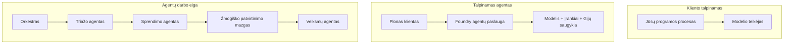
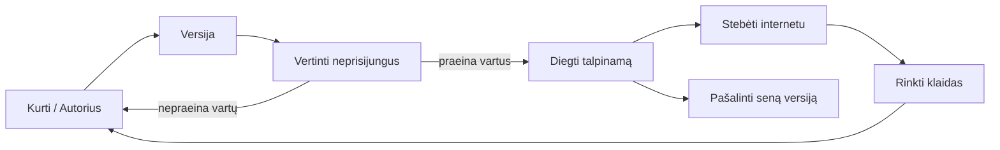
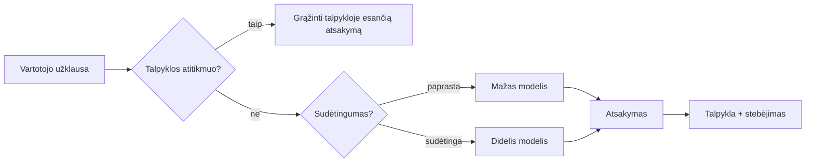
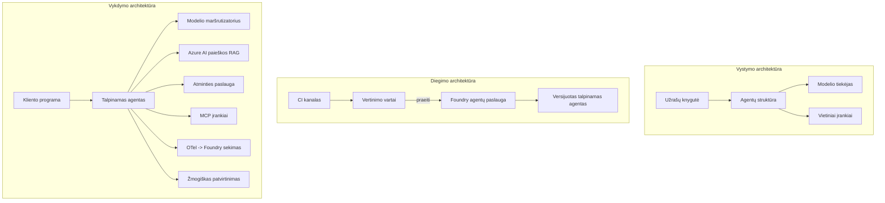

# Skalpuojamų agentų diegimas su Microsoft Foundry


Iki šiol kurse jūs kūrėte agentus, kurie veikia jūsų nešiojamajame kompiuteryje, užrašų knygelėje, valdoma `az login` ir kelių aplinkos kintamųjų. Tai tikrai tinkamas mokymosi būdas. Tačiau tai nėra tinkamas būdas paleisti agentą, nuo kurio priklauso tūkstančiai klientų 3 val. nakties.

Ši pamoka yra apie atotrūkį tarp „veikia mano mašinoje“ ir „veikia patikimai ir prieinamai gamyboje.“ Mes jį uždarome naudodami **Microsoft Foundry** ir **Microsoft Foundry Agent Service**, statydami tikrą klientų aptarnavimo agentą, kuris turi įrankius, paiešką, atmintį, vertinimą ir stebėjimą.

## Įvadas

Ši pamoka apims:

- Skirtumas tarp **prototipinio agento** ir **diegiama agento**, ir kodėl pereinamasis procesas daugiausia susijęs su viskuo, kas *supasi aplink* modelį.
- **Diegimo modelius** agentams: klientui talpinami, paslaugai talpinami (Hosted Agents) ir darbo eigų orkestracija.
- **Agentų gyvavimo ciklą** Microsoft Foundry — sukurti, versijuoti, diegti, vertinti, stebėti ir nutraukti.
- **Mastelio keitimo strategijas**: modelio maršruto nustatymas, talpinimas, lygiagrečios užklausos ir bevalstis dizainas.
- **Stebimąją sistemą** su OpenTelemetry ir Foundry sekimu.
- **Sąnaudų optimizavimą** per modelio pasirinkimą, maršrutizavimą ir vertinimo postus.
- **Įmonių aspektus**: valdymą, žmogaus patvirtinimą ir saugų MCP serverių vykdymą gamyboje.

## Mokymosi tikslai

Baigę šią pamoką, žinosite, kaip:

- Pasirinkti tinkamą diegimo modelį konkrečiam agento krūviui.
- Diegti agentą į Microsoft Foundry Agent Service, kad jis būtų versijuojamas, valdomas ir stebimas.
- Instrumentuoti agentą sekimui ir sukurti vertinimo grandinę, kuri veikia prieš kiekvieną išleidimą.
- Taikyti modelio maršrutizavimą ir talpinimą, kad mastelio keitimo metu būtų kontroliuojamas delsos laikas ir išlaidos.
- Pridėti žmogaus patvirtinimo postą rizikingiems veiksmams ir integruoti MCP serverį saugiai gamyboje.

## Priešistorė

Ši pamoka daro prielaidą, kad esate baigę ankstesnes pamokas ir esate pažįstami su:

- Agentų kūrimu su [Microsoft Agent Framework](../14-microsoft-agent-framework/README.md) (Pamoka 14).
- [Įrankių naudojimu](../04-tool-use/README.md) (Pamoka 4) ir [Agentic RAG](../05-agentic-rag/README.md) (Pamoka 5).
- [Agentų atmintimi](../13-agent-memory/README.md) (Pamoka 13) ir [Agentic protokolais / MCP](../11-agentic-protocols/README.md) (Pamoka 11).
- [Stebėjimu ir vertinimu](../10-ai-agents-production/README.md) (Pamoka 10) — ši pamoka tiesiogiai jį išplečia.

Taip pat reikės:

- **Azure prenumeratos** ir **Microsoft Foundry projekto** su bent vienu diegtu pokalbių modeliu.
- Autentifikuoto **Azure CLI** (`az login`).
- Python 3.12+ ir paketų iš saugyklos [`requirements.txt`](../../../requirements.txt).

## Nuo prototipo iki gamybos: kas iš tikrųjų keičiasi

Prototipinis agentas ir gamybos agentas dalijasi ta pačia pagrindine ciklo struktūra — mąstyti, kviesti įrankius, atsakyti. Kinta viskas, kas supa tą ciklą. Modelis sudaro gal apie 20% gamybos agento; kiti 80% yra operacijų karkasas.

| Poreikis | Prototipas | Gamyba |
| --- | --- | --- |
| **Talpinimas** | Veikia jūsų užrašų knygelėje | Veikia kaip talpinama paslauga, versijuojama ir diegiama |
| **Tapatybė** | Jūsų `az login` tokenas | Valdoma tapatybė su ribotu RBAC |
| **Būsena** | Atmintyje, prarandama perkrovus | Išorinė (gijų saugykla, atminties paslauga) |
| **Klaidos** | Matote klaidų atsekimą | Kartojimas, atsarginiai variantai, negyvų laiškų mechanizmas, įspėjimai |
| **Kaina** | „Tai keli centai“ | Sekama už užklausą, maršrutizuojama, talpinama, biudžetuojama |
| **Kokybė** | Matote išvestį akimis | Vertinama automatiškai prieš kiekvieną išleidimą |
| **Pasitikėjimas** | Patvirtinate kiekvieną veiksmą | Politika + žmogus procese rizikingiems veiksmams |

Įsidėmėkite šią lentelę. Kiekviena tolesnė skiltis atitinka šias eilutes.

## Agentų diegimo modeliai

Yra trys modeliai, kuriuos naudosite, dažnai derindami.

### 1. Klientui talpinami Agentai

Agentas gyvena *jūsų* programos procese. Jūsų kodas tiesiogiai kviečia modelio tiekėją; mąstymo ciklas vyksta jūsų paslaugoje. Tai daro kiekviena ankstesnė pamoka.

- **Naudokite, kai** reikia pilnos kontrolės ciklo, jūsų vidurinio kodo ar kai įterpiate agentą esamame fone.
- **Kompromisas**: jūs atsakingi už mastelio keitimą, būseną ir atsparumą pati.

### 2. Talpinami Agentai (Foundry Agent Service)

Agentas yra *užregistruotas kaip resursas* Microsoft Foundry. Foundry laiko mąstymo ciklą, saugo gijas, užtikrina turinio saugumą ir RBAC, ir daro agentą matomu Foundry portale. Jūsų programa tampa plonu klientu, kuris kuria gijas ir skaito atsakymus.

- **Naudokite, kai** norite patikimumo, įmontuoto stebėjimo, valdymo ir mažesnės operacinės sąnaudos.
- **Kompromisas**: mažiau žemo lygio kontrolės, bet valdoma vykdymo aplinka.

### 3. Agentų darbo eigos

Kelis agentus (ir įrankius) sujungiame į grafą su aiškiu valdymo srautu — nuosekliais žingsniais, šaknimis, žmogaus patvirtinimo mazgais ir patvariais atskaitos taškais, kurie leidžia pristabdyti ir atnaujinti darbą. Tai yra Microsoft Agent Framework **Workflows** funkcija, taikoma diegimo mastelyje.

- **Naudokite, kai** viena užduotis apima kelis specializuotus agentus arba reikia patvirtinimo žingsnio viduryje.
- **Kompromisas**: daugiau judančių dalių; reikalauja orkestracijos lygmens stebėjimo.



## Agentų gyvavimo ciklas Microsoft Foundry

Agentų diegimas nėra vienkartinis `push`. Tai ciklas, labai panašus į programinės įrangos išleidimo ciklą, nes būtent toks jis yra.



Pagrindinė idėja, perimta iš [pamokos 10](../10-ai-agents-production/README.md): **offline vertinimas yra stotelė, o ne atsitiktinumas.** Nauja agento versija neišleidžiama, kol neįveikia vertinimo slenksčių. Online stebėjimas sugrąžina realias klaidas į jūsų offline testų rinkinį. Tai ir yra visas ciklas.

## Mastelio keitimo strategijos

Agentų mastelio keitimas skiriasi nuo bevalstės žiniatinklio API mastelio, nes kiekviena užklausa gali sukelti daug brangių modelio ir įrankių kvietimų. Keturios technikos atlieka didžiąją apkrovą.

**Bevalstis užklausų apdorojimas.** Nelaikykite vartotojo būsenos procesoriaus atmintyje. Išsaugokite pokalbių gijas Foundry gijų saugykloje arba atminties paslaugoje, kad bet kuri instancija gali apdoroti bet kurią užklausą. Tai leidžia horizontaliai mastelio keitimui — pridėkite instancijų, nereikia pridėtinių sesijų.

**Modelio maršrutizavimas.** Ne kiekviena užklausa reikalauja jūsų pajėgiausio (ir brangiausio) modelio. Paprastas užklausas — ketinimų klasifikavimą, trumpus faktinius atsakymus — nukreipkite į mažą, greitą modelį, o didelį modelį rezervuokite tik išoriniam mechaniniam mąstymui. Foundry **Model Router** gali tai padaryti už jus arba galite sukurti savadarbį lengvą klasifikatorių. Jį kursite laboratorijoje.

**Atsakymų talpinimas.** Dauguma palaikymo užklausų yra beveik dublikatai („kaip atstatyti slaptažodį?“). Talpinkite atsakymus į dažnai užduodamus klausimus ir aptarnaukite juos be modelio kvietimo. Net vidutinis talpinimo efektyvumas ženkliai sumažina išlaidas ir delsą.

**Lygiagretumas ir atgalinė įtampa.** Modelio tiekėjai turi ribas užklausų riboms. Ribokite lygiagrečias užklausas, naudokite bandymus iš naujo su eksponentiniu delsos didinimu, ir tvarkykite klaidas gražiai (eilėje laukiančios „mestėsime sprendimus“ atsakymas yra geriau negu 500 klaida).



## Stebėjimas gamyboje

Negalite valdyti to, ko nematote. Kaip aptarta pamokoje 10, Microsoft Agent Framework natūraliai generuoja **OpenTelemetry** sekimus — kiekvienas modelio kvietimas, įrankio paleidimas ir orkestracijos žingsnis tampa pleištu. Gamyboje tuos pleištus eksportuojate į Microsoft Foundry (ar bet kurią OTel suderinamą sistemą), kad galėtumėte:

- Sekti vieną kliento skundą nuo pradžios iki pabaigos per visus modelio ir įrankio kvietimus.
- Stebėti p50/p95 delsą ir išlaidas už užklausą laike.
- Įspėti apie klaidų šuolius ir išlaidų anomalijas dar prieš nei jūsų vartotojai (ar finansų komanda) pastebi.

```python
from agent_framework.observability import get_tracer

tracer = get_tracer()

with tracer.start_as_current_span("support_request") as span:
    span.set_attribute("customer.tier", "enterprise")
    span.set_attribute("routed.model", "gpt-4.1-mini")
    # agento vykdymas automatiškai sekamas šioje spandoje
```

Tokie atributai kaip `customer.tier` ir `routed.model` leidžia virsti sekų siena į atsakyklesnius klausimus („ar įmonių klientai pernelyg dažnai nukreipiami į mažą modelį?“).

## Išlaidų optimizavimas

Gamyboje agentų išlaidas daugiausia lemia žetonai. Trys svertai, įtakos dydžio tvarka:

1. **Tinkamas modelio dydis.** Mažas modelis, kuris įveikia vertinimo postą, beveik visada yra pigesnis nei didelis, kuris taip pat įveikia. Naudokite vertinimą, kad *įrodytumėte*, jog mažas modelis pakankamas, o ne atsargiai automatiškai pasirinkite didžiausią.
2. **Maršrutas pagal sudėtingumą.** Kaip ir aukščiau — mokėkite už didelį modelį tik užklausoms, kurioms reikia giluminio mąstymo.
3. **Aktyvus talpinimas.** Pigiausias modelio kvietimas yra tas, kurio jūs niekada neužklausite.

Vertinimo postai ir išlaidų valdymas yra ta pati disciplina iš dviejų pusių: vertinimas nustato *kokybės ribą*, maršrutizavimas ir talpinimas leidžia būti arčiausiai tos ribos *išlaidų*.

## Įmonių diegimo svarstymai

**Valdymas.** Talpinami agentai paveldi Foundry RBAC, turinio saugumą ir audito žurnalus. Kiekvienam agentui suteikite valdomą tapatybę su mažiausiomis privilegijomis — skaitymo teisės į žinių bazę, ribotos teisės į bilietų API, nieko daugiau.

**Žmogus procese.** Kai kurios veiksmai yra pernelyg svarbūs automatikai — grąžinimas, paskyros pašalinimas, eskalavimas teisiniam skyriui. Microsoft Agent Framework palaiko **patvirtinimo reikalaujančius** įrankius: agentas siūlo veiksmą, vykdymas pristabdomas, žmogus patvirtina arba atmeta, po to darbo eiga tęsiasi. Jūs matėte šį primityvą [Pamokoje 6](../06-building-trustworthy-agents/README.md); čia jį diegiate.

**MCP gamyboje.** [MCP](../11-agentic-protocols/README.md) leidžia agentui naudotis išoriniais įrankiais per standartinę sąsają. Gamyboje laikykite kiekvieną MCP serverį kaip nepasitikimą ribą: pririškite serverio versiją, vykdykite su ribota tapatybe, tikrinkite jo išvestis ir niekada neatskleiskite jam slaptažodžių. MCP serveris yra priklausomybė, o priklausomybės taisomos, audituojamos ir turi užklausų ribojimus.



Šie trys diagramos — vystymas, diegimas, vykdymas — vaizduoja tą patį agentą trijuose gyvavimo etapuose. Toliau pateikta laboratorija parodo kaip jį sukurti.

## Praktinė laboratorija: Gamybai paruoštas klientų aptarnavimo agentas

Atidarykite [`code_samples/16-python-agent-framework.ipynb`](./code_samples/16-python-agent-framework.ipynb) ir dirbkite nuo pradžios iki galo. Jūs sukursite **Contoso klientų aptarnavimo agentą** su visais gamybos rūpesčiais:

1. **Įrankių kvietimas** — užsakymų statuso paieška ir atvirų palaikymo bilietų peržiūra.
2. **RAG** — atsakymai į politikos klausimus iš žinių bazės (Azure AI Search su atminties atsarginiu planu, kad užrašinė veiktų be Search resurso).
3. **Atmintis** — atsimena klientą per pokalbio raundus.
4. **Modelio maršrutizavimas** — sudėtingumo klasifikatorius nukreipia kiekvieną užklausą į mažą arba didelį modelį.
5. **Atsakymų talpinimas** — pakartotiniai klausimai aptarnaujami iš talpyklos.
6. **Žmogaus patvirtinimas** — grąžinimai virš ribos pristabdomi žmogaus patvirtinimui.
7. **Vertinimo grandinė** — mažas offline testų rinkinys įvertina agentą ir veikia kaip išleidimo postas.
8. **Stebėjimas** — OpenTelemetry sekimas kiekvienos užklausos aplinkoje.

### Žingsnis po žingsnio

Užrašinė suorganizuota taip, kad kiekvienas gamybos rūpestis būtų atskira, vykdoma dalis. Širdis yra maršrutizavimo su talpinimu užklausų apdorotojas:

```python
async def handle_support_request(query: str, customer_id: str) -> str:
    # 1. Aptarnauti iš talpyklos, kai galime.
    cached = response_cache.get(normalize(query))
    if cached:
        return cached

    # 2. Maršrutuoti pagal sudėtingumą, kad kontroliuotume sąnaudas.
    model = "gpt-4.1-mini" if is_simple(query) else "gpt-4.1"

    # 3. Vykdyti agentą viduje sekos intervalo dėl stebėjimo.
    with tracer.start_as_current_span("support_request") as span:
        span.set_attribute("routed.model", model)
        span.set_attribute("customer.id", customer_id)
        response = await support_agent.run(query, model=model)

    # 4. Talpinti į talpyklą ir grąžinti.
    response_cache.set(normalize(query), response.text)
    return response.text
```

Vertinimo postas, saugantis išleidimą, atrodo taip:

```python
async def evaluation_gate(agent, test_cases, threshold: float = 0.8) -> bool:
    passed = 0
    for case in test_cases:
        result = await agent.run(case["input"])
        if score_response(result.text, case["expected"]) >= 0.8:
            passed += 1
    pass_rate = passed / len(test_cases)
    print(f"Evaluation pass rate: {pass_rate:.0%} (gate: {threshold:.0%})")
    return pass_rate >= threshold  # diegti tik jei vartai praeina
```

Perskaitykite kiekvieną eilutę — užrašinė palaiko primityvus sąmoningai mažais, kad niekas nebūtų paslėpta už karkaso kvietimo.

## Diegto agento validavimas dūmų testais

Aukščiau pateiktas vertinimo postas vykdomas *offline* jūsų agento objekte. Kai agentas įdiegiamas kaip Talpinamas Agentas, reikia dar vienos, dar pigesnės patikros: **ar diegiamas galinis taškas iš tikrųjų atsako?**

Sėkmingas diegimas tik įrodo, kad valdymo plokštė priėmė apibrėžimą — tai neįrodo, kad agentas atsako. Priklausomybės nebuvimas, klaidingas modelio maršrutas ar pasibaigusi jungtis gali sukelti žalią diegimą, kuris nieko negrąžina. **Dūmų testas** aptinka tai per kelias sekundes, kaskart diegiant, be pilno vertinimo kaštų.

Ši saugykla turi paruoštą naudoti dūmų testų grandinę, pagrįstą [AI Smoke Test](https://github.com/marketplace/actions/ai-smoke-test) GitHub veiksmais:

- **Katalogas** — [`tests/lesson-16-smoke-tests.json`](../../../tests/lesson-16-smoke-tests.json) saugo skatinimus ir patikras Contoso aptarnavimo agentui (pagrįsti politikos atsakymai, užsakymų paieška, temos išlaikymas ir daugiaraukščių gijų tęstinumas). Kitų pamokų agentų katalogai gyvena šalia — žr. [`tests/README.md`](../tests/README.md).
- **Darbo eiga** — [`.github/workflows/smoke-test.yml`](../../../.github/workflows/smoke-test.yml) prisijungia su Azure OIDC ir POST siunčia kiekvieną skatinimą agentui adresu Responses, ir nepavykus patikrai praneša apie klaidą.

```yaml
- name: Smoke-test hosted agent
  uses: JFolberth/ai-smoketest@v1
  with:
    project_endpoint: ${{ inputs.project_endpoint }}
    agent_name: ContosoSupportAgent
    tests_file: tests/lesson-16-smoke-tests.json
```


Paleiskite jį iš **Actions** skirtuko, kai jūsų agentas bus dislokuotas, nurodydami savo Foundry projekto galinį tašką ir agento pavadinimą. Federuojama tapatybė turi turėti **Azure AI User** rolę Foundry projekto lygyje. Galvokite apie sluoksnius kaip piramidę: dūmų testai (pasiekiamas ir atsako?) vykdomi kiekvieno diegimo metu, neprisijungus vertinimas (ar pakankamai geras pristatymui?) vykdomas prieš pakėlimą, o internetinis vertinimas (kaip veikia veikiant realiomis sąlygomis?) vyksta nuolat.

## Žinių patikra

Išbandykite savo supratimą prieš pereidami prie užduoties.

**1. Apytiksliai kiek gamybos agente sudaro „modelis“, o kas yra likusi dalis?**

<details>
<summary>Atsakymas</summary>

Modelis sudaro mažumą sistemos — dažnai nurodoma apie 20%. Likusi dalis yra operacinis karkasas: talpinimas ir versijų valdymas, tapatybė ir RBAC, išorinis būsena, gedimų valdymas, sąnaudų sekimas, vertinimas ir žmogaus įvedimo kontrolės. Pereiti į gamybą daugiausia reiškia sukurti viską *aplink* mąstymo ciklą.
</details>

**2. Kada pasirinktumėte Hosted Agent vietoje kliento talpinamo agente?**

<details>
<summary>Atsakymas</summary>

Kai norite valdomos vykdymo aplinkos su įmontuotu patikimumu (gijos, kurios išlieka ir gali atsinaujinti), stebėjimu, turinio saugumu ir RBAC, ir esate pasiruošę atsisakyti dalies žemo lygio kontrolės mąstymo ciklo naudai mažesniam operaciniam paviršiui. Kliento talpinimas yra pageidautinas, kai reikia pilnos kontrolės ciklui arba kai agentas įterpiamas į esamą backend'ą.
</details>

**3. Kodėl skalaujamas agentas turi būti bevalstis savo proceso atmintyje?**

<details>
<summary>Atsakymas</summary>

Taip bet kuri instancija gali tvarkyti bet kokį užklausimą, o tai leidžia horizontalų skalavimą be prisirišimo prie sesijų. Kiekvieno vartotojo pokalbio būsena yra išorinė gijų saugykloje arba atminties paslaugoje. Jei būsena būtų proceso atmintyje, ji prarastųsi perkrovimo metu ir neįmanoma būtų laisvai paskirstyti krūvio.
</details>

**4. Kokią problemą sprendžia modelių maršruto valdymas ir kaip tai susiję su vertinimu?**

<details>
<summary>Atsakymas</summary>

Maršruto valdymas siunčia paprastus užklausimus mažam, pigiui ir greitam modeliui ir skiria didelį modelį tik tikram mąstymui, kontroliuodamas vėlavimą ir kainą. Tai siejasi su vertinimu, nes vertinimas yra tas, kuris *įrodo*, kad mažas modelis yra pakankamai geras tam tikrai užklausų klasei — maršruto valdymas be vertinimo yra spėjimas.
</details>

**5. Kas yra „vertinimo vartai“ ir kur jie yra gyvavimo cikle?**

<details>
<summary>Atsakymas</summary>

Vertinimo vartai vykdo neprisijungus esamų testų rinkinį naujai agento versijai ir blokuoja diegimą, jei praeinamumo rodiklis neperžengia ribos. Jie yra tarp „versijos“ ir „diegimo“ gyvavimo cikle, tokiu būdu kokybė tampa išleidimo sąlyga, o ne dalyku, kurį tikrinate po pristatymo.
</details>

**6. Kodėl MCP serveris gamyboje turėtų būti laikomas nepatikima riba?**

<details>
<summary>Atsakymas</summary>

Nes tai išorinė priklausomybė, į kurią jūsų agentas kreipiasi. Jūs turėtumėte pritvirtinti jo versiją, paleisti su ribota tapatybe, tikrinti jo išvestis, riboti užklausų skaičių ir niekada neatskleisti jam paslapčių — ta pati disciplina, taikoma bet kokiai trečiųjų šalių priklausomybei. Jo išvestys patenka į agento mąstymą, todėl nepatikrintas pasitikėjimas yra saugumo rizika.
</details>

**7. Koks vienas pokytis paprastai turi didžiausią poveikį gamybos agentei kainai ir kodėl?**

<details>
<summary>Atsakymas</summary>

Tinkamas modelio dydis — naudoti mažiausią modelį, kuris vis tiek praeina jūsų vertinimo vartus. Kaina daugiausia priklauso nuo žetonų, o mažesnis modelis, atitinkantis kokybės standartą, beveik visada yra pigesnis nei didesnis. Talpyklos ir maršrutizavimas dar labiau sumažina kainą, bet tinkamo pagrindinio modelio pasirinkimas turi didžiausią pirmojo laipsnio poveikį.
</details>

**8. Kokią reikšmę stebėjimui turi span atributai, tokie kaip `customer.tier` ir `routed.model`?**

<details>
<summary>Atsakymas</summary>

Jie paverčia žalius trasavimus į atsakomas verslo klausimus. Be atributų turite vien tik spanų sieną; su jais galite paklausti „ar verslo klientai pernelyg dažnai nukreipiami į mažą modelį?“ arba „kuris modelis apdoroja mūsų lėčiausias užklausas?“ Atributai leidžia suskaidyti telemetriją pagal operacijai svarbias dimensijas.
</details>

## Užduotis

Paimkite laboratorinį klientų aptarnavimo agentą ir pritaikykite jį konkrečiai situacijai: **prenumeratos sąskaitų aptarnavimo agentas SaaS įmonei.**

Jūsų pateikimas turėtų:

1. **Pakeisti įrankius** į su sąskaitomis susijusius: `get_subscription_status`, `get_invoice` ir `issue_credit` (kredito viršijančio 50 USD patvirtinimas žmogaus reikalingas).
2. **Pridėti tris RAG dokumentus** apimančius įmonės grąžinimo politiką, sąskaitų ciklą ir nutraukimo politiką.
3. **Išplėsti vertinimo rinkinį** bent iki aštuonių atvejų, įskaitant bent du, kurie *turėtų* suaktyvinti žmogaus patvirtinimo kelią, ir patvirtinti, kad vertinimo vartai teisingai praleidžia ar blokuoja.
4. **Pridėti vieną sąnaudų ataskaitą**: paleidus dešimt mišrių užklausimų per agentą, spausdinti kiek nukeliavo į mažą modelį, kiek į didelį modelį, ir kiek buvo aptarnauta iš talpyklos.

Parašykite trumpą pastraipą (markdown ląstelėje), paaiškinančią, kurią modelių maršruto taisyklę pasirinkote ir kaip ją patikrintumėte su realiu srautu. Nėra vieningo teisingo atsakymo — vertinama, ar gamybos aspektai susieti nuosekliai.

## Santrauka

Šioje pamokoje perkeliate agentą nuo prototipo iki gamybos su Microsoft Foundry:

- Pereiti į gamybą daugiausia reiškia **operacinį karkasą** aplink modelį — talpinimą, tapatybę, būseną, gedimų valdymą, kainą, kokybę ir pasitikėjimą.
- Išmokote tris **diegimo modelius** — kliento talpinimą, Hosted Agent ir Agent Workflows — ir kada kiekvienas tinka.
- Praėjote **agento gyvavimo ciklą**, kur neprisijungus **vertinimas veikia kaip išleidimo vartai**, o nuolatinis stebėjimas sujungia gedimus su testais.
- Taikėte **skalavimo strategijas** — bevalstį dizainą, modelių maršrutizavimą, talpyklavimą ir ribotą konkurenciją — ir susiejote jas su **sąnaudų optimizavimu**.
- Įdiegėte **įmonės kontrolės priemones**: RBAC, žmogaus įvesties patvirtinimą ir gamybai saugų MCP integravimą.
- Sukūrėte **gamybai parengtą klientų aptarnavimo agentą**, kuris sujungia visas šias problemas veikiančiame kode.

Kita pamoka yra priešinga kelionė: vietoje to, kad agentus skalautumėte debesyje, jūs juos parsinešite *žemyn* į vieną kūrėjo mašiną ir paleisite visiškai lokaliai.

## Papildomi ištekliai

- <a href="https://learn.microsoft.com/azure/ai-foundry/what-is-azure-ai-foundry" target="_blank">Microsoft Foundry dokumentacija</a>
- <a href="https://learn.microsoft.com/azure/ai-foundry/agents/overview" target="_blank">Microsoft Foundry Agent Service apžvalga</a>
- <a href="https://aka.ms/ai-agents-beginners/agent-framework" target="_blank">Microsoft Agent Framework</a>
- <a href="https://learn.microsoft.com/azure/ai-foundry/concepts/model-router" target="_blank">Model Router Microsoft Foundry</a>
- <a href="https://learn.microsoft.com/azure/search/search-what-is-azure-search" target="_blank">Azure AI Search</a>
- <a href="https://opentelemetry.io/" target="_blank">OpenTelemetry</a>
- <a href="https://github.com/marketplace/actions/ai-smoke-test" target="_blank">AI Smoke Test GitHub veiksmas</a>
- <a href="https://modelcontextprotocol.io/" target="_blank">Model Context Protocol (MCP)</a>

## Ankstesnė pamoka

[Kompiuterinių naudojimo agentų kūrimas (CUA)](../15-browser-use/README.md)

## Kita pamoka

[Lokalių AI agentų kūrimas](../17-creating-local-ai-agents/README.md)

---

<!-- CO-OP TRANSLATOR DISCLAIMER START -->
**Atsakomybės apribojimas**:
Šis dokumentas buvo išverstas naudojant dirbtinio intelekto vertimo paslaugą [Co-op Translator](https://github.com/Azure/co-op-translator). Nors siekiame tikslumo, prašome atkreipti dėmesį, kad automatiniai vertimai gali turėti klaidų ar netikslumų. Originalus dokumentas jo gimtąja kalba laikomas autoritetingu šaltiniu. Svarbiai informacijai rekomenduojama naudoti profesionalų žmogiškąjį vertimą. Mes neatsakome už jokius nesusipratimus ar neteisingą interpretaciją, kilusią naudojantis šiuo vertimu.
<!-- CO-OP TRANSLATOR DISCLAIMER END -->