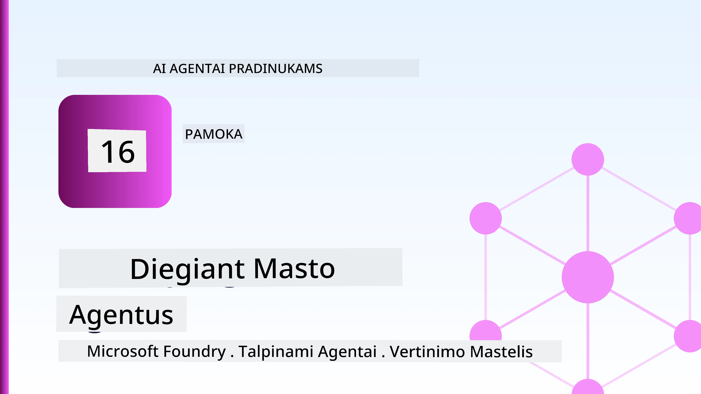
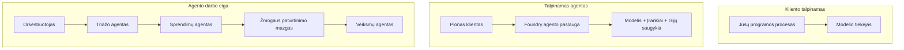
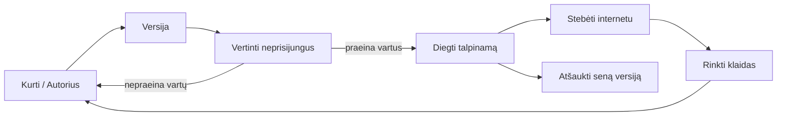
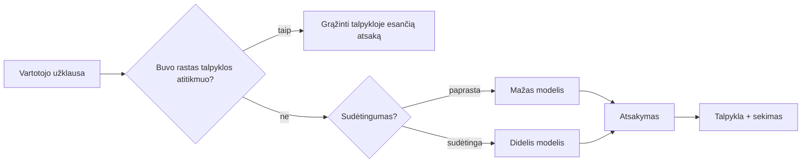
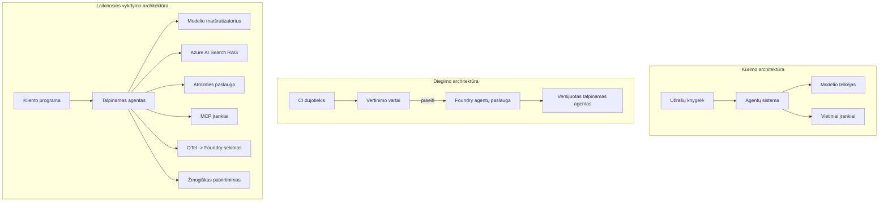

# Masto keičiamų agentų diegimas su Microsoft Foundry



Iki šiol šiame kurse jūs sukūrėte agentus, kurie veikia jūsų nešiojamajame kompiuteryje, užrašų knygelėje, valdomi per `az login` ir keletą aplinkos kintamųjų. Tai būtent tinkamas būdas mokytis. Tačiau tai nėra tinkamas būdas paleisti agentą, nuo kurio 3 val. nakties priklauso tūkstančiai klientų.

Ši pamoka yra apie skirtumą tarp "veikia mano kompiuteryje" ir "veikia patikimai ir ekonomiškai gamyboje." Tą skirtumą užtverdami naudodami **Microsoft Foundry** ir **Microsoft Foundry Agent Service**. Mes tai darome kurdami tikrą klientų aptarnavimo agentą, kuriame yra įrankiai, informacijos paieška, atmintis, vertinimas ir stebėjimas.

## Įvadas

Ši pamoka apima:

- Skirtumą tarp **prototipo agento** ir **įdiegtinio agento**, ir kodėl perėjimas daugiausiai susijęs su tuo, kas vyksta *apie* modelį.
- Agentų **diegimo modeliai**: klientų hositinimas, paslaugų hositinimas (Hosted Agents) ir darbo srautų orkestravimas.
- **Agento gyvenimo ciklas** Microsoft Foundry — sukūrimas, versijavimas, diegimas, vertinimas, stebėjimas, pašalinimas.
- **Masto keitimo strategijos**: modelio nukreipimas, talpyklų naudojimas, lygiagretumas ir bevaldinis dizainas.
- **Stebėjimas** naudojant OpenTelemetry ir Foundry sekimo priemones.
- **Išlaidų optimizavimas** pasirinkus modelį, nukreipimą ir vertinimo vartus.
- **Įmonių aspektai**: valdymas, žmonių patvirtinimas, ir saugus MCP serverių paleidimas gamyboje.

## Mokymosi tikslai

Baigę šią pamoką sugebėsite:

- Pasirinkti tinkamą diegimo modelį pagal agento apkrovą.
- Įdiegti agentą Microsoft Foundry Agent Service, kad jis būtų versijuojamas, valdomas ir stebimas.
- Įrankinti agentą stebėjimui ir sujungti vertinimo procesą, vykstantį prieš kiekvieną išleidimą.
- Pritaikyti modelio nukreipimą ir talpyklavimą, kad masto metu kontroliuotumėte delsą ir išlaidas.
- Įtraukti žmonių patvirtinimo vartus svarbiais veiksmais ir saugiai integruoti MCP serverį gamyboje.

## Išankstinės sąlygos

Ši pamoka daro prielaidą, kad esate baigę ankstesnes pamokas ir gerai mokate:

- Kurti agentus naudojant [Microsoft Agent Framework](../14-microsoft-agent-framework/README.md) (14 pamoka).
- [Įrankių naudojimą](../04-tool-use/README.md) (4 pamoka) ir [Agentic RAG](../05-agentic-rag/README.md) (5 pamoka).
- [Agentų atmintį](../13-agent-memory/README.md) (13 pamoka) ir [Agentic protokolus / MCP](../11-agentic-protocols/README.md) (11 pamoka).
- [Stebėjimą ir vertinimą](../10-ai-agents-production/README.md) (10 pamoka) — ši pamoka tiesiogiai juo remiasi.

Taip pat reikės:

- **Azure prenumeratos** ir **Microsoft Foundry projekto** su bent vienu įdiegtu pokalbių modeliu.
- Autentifikuotos **Azure CLI** (`az login`).
- Python 3.12+ ir paketų iš saugyklos [`requirements.txt`](../../../requirements.txt).

## Nuo prototipo iki gamybos: kas iš tikrųjų keičiasi

Prototipo agentas ir gamybinis agentas dalijasi ta pačia pagrindine kilpa — mąstyti, kviesti įrankius, atsakyti. Kas keičiasi, yra visa tai, kas supa šią kilpą. Modelis sudaro galbūt 20% gamybinio agento; likę 80% yra operacinė struktūra.

| Sritis | Prototipas | Gamyba |
| --- | --- | --- |
| **Hositinimas** | Veikia jūsų užrašų knygelėje | Veikia kaip hositinama paslauga, versijuojama ir diegiama |
| **Tapatybė** | Jūsų `az login` tokenas | Valdoma tapatybė su ribotu RBAC |
| **Būsena** | Atmintyje, prarandama perkrovus | Išorinė saugykla (siūlų saugykla, atminties tarnyba) |
| **Klaidos** | Matote klaidos trasą | Pakartotiniai bandymai, atsarginiai variantai, neapdoroti pranešimai, įspėjimai |
| **Išlaidos** | "Tai keli centai" | Sekamos pagal užklausą, nukreipiamos, talpinamos, planuojamos |
| **Kokybė** | Žiūrite rezultatą akimis | Vertinama automatiškai prieš kiekvieną išleidimą |
| **Pasitikėjimas** | Patvirtinate kiekvieną veiksmą | Politika + žmogaus patvirtinimas rizikingiems veiksmams |

Atminkite šią lentelę. Kiekviena žemiau esanti dalis atitinka šias eilutes.

## Agentų diegimo modeliai

Yra trys modeliai, kuriuos naudosite, dažnai derindami.

### 1. Klientų hositinami agentai

Agentas egzistuoja *jūsų* programos procese. Jūsų kodas tiesiogiai kviečia modelio tiekėją; mąstymo kilpa veikia jūsų paslaugoje. Tai darė kiekviena ankstesnė pamoka.

- **Naudokite, kai** reikia visiškos kontrolės kilpai, tinkintos tarpinės programinės įrangos ar agento įterpimo į esamą backend.
- **Kompromisas**: patys valdote mastelį, būseną ir atsparumą.

### 2. Hositinami agentai (Foundry Agent Service)

Agentas *užregistruotas kaip resursas* Microsoft Foundry. Foundry palaiko mąstymo kilpą, saugo siūlus, užtikrina turinio saugumą ir RBAC, leidžia agentą matyti Foundry portale. Jūsų programa tampa plonu klientu, kuris kuria siūlus ir skaito atsakymus.

- **Naudokite, kai** norite patvarumo, įmontuoto stebėjimo, valdymo ir mažesnio operacinio paviršiaus.
- **Kompromisas**: mažiau žemesnio lygio kontrolės mainais į valdomą vykdymo aplinką.

### 3. Agentų darbo srautai

Keli agentai (ir įrankiai) sudedami į grafą su aiškia valdymo eiga — nuoseklūs žingsniai, šakos, žmonių patvirtinimo mazgai ir patvarūs kontroliniai taškai, kuriuos galima pristabdyti ir atnaujinti. Tai yra Microsoft Agent Framework **Workflows** galimybė, taikoma diegimo mastu.

- **Naudokite, kai** viena užduotis apima kelis specializuotus agentus arba viduryje reikalingas patvirtinimo žingsnis.
- **Kompromisas**: daugiau judančių dalių; reikia orkestravimo lygmens stebėjimo.



## Agento gyvenimo ciklas Microsoft Foundry

Agento diegimas nėra vienkartinis `push`. Tai kilpa, kuri labai primena programinės įrangos išleidimo ciklą, nes iš tikrųjų tai ir yra.



Pagrindinė idėja, perimta iš [10 pamokos](../10-ai-agents-production/README.md): **neprisijungęs vertinimas yra vartai, o ne požiūris "vėliau".** Nauja agento versija neišleidžiama, kol neperžengia jūsų vertinimo slenksčių. Online stebėjimas sugrąžina realius klaidų duomenis į jūsų neprisijungusių testų rinkinį. Tai visa kilpa.

## Masto keitimo strategijos

Agentų masto keitimas skiriasi nuo bevaldinės web API masto keitimo, nes kiekviena užklausa gali suaktyvinti kelis brangius modelio ir įrankių kvietimus. Keturios technikos neša daugumą apkrovos.

**Bevaldinis užklausų apdorojimas.** Neišlaikykite būsenos apie vartotoją savo proceso atmintyje. Išsaugokite pokalbių siūlus Foundry siūlų saugykloje arba atminties tarnyboje, kad bet kuri egzempliorius galėtų apdoroti bet kurią užklausą. Tai leidžia horizontaliai plėsti — pridėti egzempliorių, be lipnių sesijų.

**Modelio nukreipimas.** Ne kiekviena užklausa reikalauja jūsų pajėgiausio (ir brangiausio) modelio. Nukreipkite paprastas užklausas — ketinimų klasifikavimą, trumpus faktinius atsakymus — į mažą ir greitą modelį, o didelį modelį rezervuokite tik tikrajai mąstysenai. Foundry **modelių nukreipėjas** gali tai atlikti už jus, arba pats galite sukurti lengvą klasifikatorių. Jūs kūrsite savo versiją laboratorijoje.

**Atsakymų talpyklavimas.** Daugelis pagalbos užklausų yra beveik dubliuotos („kaip atstatyti slaptažodį?“). Talpinkite dažnai užduodamus klausimus ir tiekkite atsakymus be modelio kvietimo. Net vidutinis talpyklos pataikymo rodiklis žymiai sumažina išlaidas ir delsą.

**Lygiagretumas ir atgalinis slėgis.** Modelių tiekėjai turi ribojimus. Ribokite lygiagrečių užklausų skaičių, naudokite eksponentinį pakartotinį bandymą, ir klaidos atveju elkitės maloniai (užstatyta "mes dirbame" atsakymo eilė geriau nei klaida 500).



## Stebėjimas gamyboje

Negalite valdyti to, ko nematote. Kaip aprašyta 10 pamokoje, Microsoft Agent Framework natūraliai generuoja **OpenTelemetry** sekas — kiekvienas modelio kvietimas, įrankio paleidimas ir orkestravimo žingsnis tampa intervalais. Gamyboje šias sekas eksportuojate į Microsoft Foundry (ar bet kurį OTel suderinamą backendą), kad galėtumėte:

- Sekti atskiro kliento skundo kelią per kiekvieną modelio ir įrankio kvietimą.
- Stebėti p50/p95 delsą ir išlaidas pagal užklausas laikui bėgant.
- Gauti įspėjimus apie klaidų spurtus ir išlaidų anomalijas anksčiau negu vartotojai (ar jūsų finansų komanda).

```python
from agent_framework.observability import get_tracer

tracer = get_tracer()

with tracer.start_as_current_span("support_request") as span:
    span.set_attribute("customer.tier", "enterprise")
    span.set_attribute("routed.model", "gpt-5-nano")
    # agento vykdymas automatiškai stebimas šiame intervale
```

Atributai, tokie kaip `customer.tier` ir `routed.model`, paverčia didelį kiekį sekų į užduodamus klausimus ("ar verslo klientai per dažnai nukreipiami į mažą modelį?").

## Išlaidų optimizavimas

Išlaidos gamybos agentuose daugiausia priklauso nuo žetonų naudojimo. Trys svirtelės, pagal poveikį:

1. **Tinkamai pasirinkite modelio dydį.** Mažas modelis, kuris praeina jūsų vertinimo vartus, beveik visada yra pigesnis už didelį modelį, kuris taip pat praeina. Naudokite vertinimą įrodymui, kad mažas modelis yra pakankamai geras, o ne vykdykite korektiškai didžiausią modelį.
2. **Nukreipčiau pagal sudėtingumą.** Kaip ir anksčiau — mokėkite už didelio modelio naudojimą tik užklausoms, kurios tikrai to reikalauja.
3. **Agresyviai naudokite talpyklavimą.** Pigiausias modelio kvietimas yra tas, kurio išvis nepadarote.

Vertinimo vartai ir išlaidų kontrolė yra ta pati disciplina žiūrima iš dviejų pusių: vertinimas nustato *kokybės ribą*, nukreipimas ir talpyklavimas leidžia laikytis kuo arčiau tos ribos *išlaidų*.

## Įmonių diegimo aspektai

**Valdymas.** Hositinami agentai paveldi Foundry RBAC, turinio saugumą ir audito žurnalus. Kiekvienam agentui suteikite valdomą tapatybę su minimaliais būtinais leidimais — tik skaitymo prieiga prie žinių bazės, ribota prieiga prie bilietų API, nieko daugiau.

**Žmogus procese.** Kai kurie veiksmai per daug svarbūs, kad būtų vykdomi automatiškai — grąžinti pinigus, ištrinti paskyrą, perduoti teisinei komandai. Microsoft Agent Framework palaiko **reikalaujančius patvirtinimo** įrankius: agentas siūlo veiksmą, vykdymas pristabdomas, žmogus patvirtina arba atmeta, darbų srautas tęsiamas. Šį elementą matėte [6 pamokoje](../06-building-trustworthy-agents/README.md); čia jį diegiate.

**MCP gamyboje.** [MCP](../11-agentic-protocols/README.md) leidžia agentui naudotis išoriniais įrankiais per standartinę sąsają. Gamyboje laikykite MCP serverį kaip nepatikimą ribą: fiksuokite serverio versiją, paleiskite su ribota tapatybe, tikrinkite jo išėjimus, ir niekada neatskleiskite jam slaptų duomenų. MCP serveris yra priklausomybė, o priklausomybės gauna pataisymus, auditą ir ribojimus.



Šie trys diagramos — vystymas, diegimas, vykdymas — vaizduoja tą patį agentą jo gyvavimo trijose stadijose. Sekanti laboratorija jus veda per jo kūrimą.

## Praktinė laboratorija: gamybai paruoštas klientų aptarnavimo agentas

Atidarykite [`code_samples/16-python-agent-framework.ipynb`](./code_samples/16-python-agent-framework.ipynb) ir dirbkite per viską nuo pradžios iki pabaigos. Surinksite **Contoso klientų aptarnavimo agentą** su visomis gamybos rūpimis įjungtomis:

1. **Įrankių kvietimas** — užsakymų statuso paieška ir atvirų bilietų valdymas.
2. **RAG** — atsakymai į politikos klausimus iš žinių bazės (Azure AI Search, su laikinąją atminties atsvara, kad užrašų knygelė veiktų be Search resurso).
3. **Atmintis** — atsiminti klientą per pokalbio etapus.
4. **Modelio nukreipimas** — sudėtingumo klasifikatorius nukreipia kiekvieną užklausą į mažą arba didelį modelį.
5. **Atsakymų talpyklavimas** — pasikartojančios užklausos aptarnaujamos iš talpyklos.
6. **Žmogiškas patvirtinimas** — pinigų grąžinimai virš slenksčio sustabdomi žmogaus parašui.
7. **Vertinimo procesas** — mažas neprisijungęs testų rinkinys įvertina agentą ir veikia kaip išleidimo vartai.
8. **Stebėjimas** — OpenTelemetry sekimas aplink kiekvieną užklausą.

### Vadybinė dalis

Užrašų knygelė suorganizuota taip, kad kiekviena gamybos rūpestis yra atskira, paleidžiama sekcija. Jos širdis yra nukreipimo + talpyklavimo užklausų apdorotojas:

```python
async def handle_support_request(query: str, customer_id: str) -> str:
    # 1. Aptarnauti iš talpyklos, kai galime.
    cached = response_cache.get(normalize(query))
    if cached:
        return cached

    # 2. Maršrutuoti pagal sudėtingumą, kad kontroliuotume išlaidas.
    model = "gpt-5-nano" if is_simple(query) else "gpt-5-mini"

    # 3. Vykdyti agentą viduje trasos ruožo stebimumui.
    with tracer.start_as_current_span("support_request") as span:
        span.set_attribute("routed.model", model)
        span.set_attribute("customer.id", customer_id)
        response = await support_agent.run(query, model=model)

    # 4. Talpyklinti ir grąžinti.
    response_cache.set(normalize(query), response.text)
    return response.text
```

Išleidimo vartai atrodo taip:

```python
async def evaluation_gate(agent, test_cases, threshold: float = 0.8) -> bool:
    passed = 0
    for case in test_cases:
        result = await agent.run(case["input"])
        if score_response(result.text, case["expected"]) >= 0.8:
            passed += 1
    pass_rate = passed / len(test_cases)
    print(f"Evaluation pass rate: {pass_rate:.0%} (gate: {threshold:.0%})")
    return pass_rate >= threshold  # diegti tik jei vartai praeina
```

Perskaitykite kiekvieną eilutę — užrašų knygelė palaiko elementus tyčia mažus, kad niekas nebūtų paslėpta už kitų kvietimų.

## Diegto agento patikra su dūmų testais

Aukščiau aprašyti vertinimo vartai veikia *neprisijungę* prieš jūsų agento objektą. Kai agentas įdiegtas kaip Hositinamas Agentas, reikia dar vieno, net pigesnio, patikrinimo: **ar įdiegtas galinis taškas iš tikrųjų atsakinėja?**

Sėkmingas diegimas tik įrodo, kad valdymo plokštė priėmė apibrėžimą — tai neįrodo, kad agentas atsako. Trūkstama priklausomybė, klaidingas modelio nukreipimas ar pasibaigęs ryšys gali palikti žalią diegimą, kuris nieko negrąžina. **Dūmų testas** tai užfiksuoja per kelias sekundes, kiekvieno diegimo metu, be pilno vertinimo kainos.

Ši saugykla tiekia paruoštą naudoti dūmų testų procesą, pastatytą ant [AI Smoke Test](https://github.com/marketplace/actions/ai-smoke-test) GitHub Action:

- **Katalogas** — [`tests/lesson-16-smoke-tests.json`](../../../tests/lesson-16-smoke-tests.json) turi šablonus ir patikrinimus Contoso aptarnavimo agentui (tikslūs politinės atsakymai, užsakymo paieška, temos laikymasis, daugiaturnis pokalbio tęstinumas). Kitų pamokų agentų katalogai yra šalia — žr. [`tests/README.md`](../tests/README.md).
- **Darbo srautas** — [`.github/workflows/smoke-test.yml`](../../../.github/workflows/smoke-test.yml) prisijungia su Azure OIDC ir POST siunčia kiekvieną užklausą į agento responses galinį tašką, nepavykus bet kuriam patikrinimui, neleidžia darbui tęstis.

```yaml
- name: Smoke-test hosted agent
  uses: JFolberth/ai-smoketest@v1
  with:
    project_endpoint: ${{ inputs.project_endpoint }}
    agent_name: ContosoSupportAgent
    tests_file: tests/lesson-16-smoke-tests.json
```


Vykdykite tai skirtuke **Actions**, kai jūsų agentas bus diegiamas, pateikdami savo Foundry projekto galinį tašką ir agento pavadinimą. Federuota tapatybė turi turėti **Azure AI User** vaidmenį Foundry projekto aprėptyje. Galvokite apie sluoksnius kaip piramidę: dūmų testai (pasiekiamas ir atsako?) vykdomi kiekvieno diegimo metu, neprisijungus vykdoma vertinimas (pakankamai geras pristatymui?) vykdomas prieš paaukštinimą, o prisijungus vykdoma vertinimas (kaip jam sekasi realiame pasaulyje?) vyksta nuolat.

## Žinių patikrinimas

Išbandykite savo supratimą prieš pereidami prie užduoties.

**1. Apie kiek procentų veikiamo agento sudaro „modelis“, ir kas yra likusi dalis?**

<details>
<summary>Atsakymas</summary>

Modelis sudaro mažumą sistemos — dažnai sakoma apie 20%. Likusi dalis yra operacinė sistema: viešinimas ir versijų valdymas, tapatybė ir RBAC, išorinė būsena, klaidų valdymas, sąnaudų sekimas, vertinimas ir žmogaus įtraukimo valdymas. Pereiti į gamybą daugiausia reiškia viską sukurti *aplink* samprotavimo ciklą.
</details>

**2. Kada rinktumėtės Hostinamą Agentą vietoj kliento talpinamo agente?**

<details>
<summary>Atsakymas</summary>

Kai norite valdomos laikmenos su įmontuotu patvarumu (gijos, kurios išlieka ir gali atnaujinti), stebėjimo, turinio saugumo ir RBAC ir esate pasirengę paaukoti dalį žemesnio lygio samprotavimo ciklo valdymo, kad sumažintumėte operacinį paviršių. Kliento talpinamas agentas yra rekomenduojamas, kai reikia visiško ciklo valdymo arba kai agentas įterpiamas į esamą backendą.
</details>

**3. Kodėl skaliuojamas agentas turi būti bevalstis savo proceso atmintyje?**

<details>
<summary>Atsakymas</summary>

Kad bet kuris instancijos atvejis galėtų apdoroti bet kurį užklausą, tai leidžia horizontaliai skalauti be prisirišimo prie konkrečių sesijų. Vartotojo pokalbio būsena yra saugoma išoriniame gijų saugyklos arba atminties paslaugoje. Jei būsena būtų proceso atmintyje, ją prarastumėte perkrovus ir negalėtumėte laisvai paskirstyti apkrovos.
</details>

**4. Kokią problemą sprendžia modelio maršrutizavimas ir kaip jis susijęs su vertinimu?**

<details>
<summary>Atsakymas</summary>

Maršrutizavimas siunčia paprastas užklausas mažam, pigiems ir greitam modeliui, o didelį modelį palieka tik tikram samprotavimui, taip kontroliuodamas delsą ir sąnaudas. Tai susiję su vertinimu, nes vertinimas yra tas, kas *įrodo*, kad mažas modelis yra pakankamai geras tam tikrai užklausų klasei — maršrutizavimas be vertinimo yra spėjimas.
</details>

**5. Kas yra „vertinimo vartai“ ir kur jie yra gyvavimo cikle?**

<details>
<summary>Atsakymas</summary>

Vertinimo vartai vykdo offline testų rinkinį prieš naują agento versiją ir blokuoja diegimą, jei pralaidumo rodiklis nepasiekia ribos. Jie yra „versijos“ ir „diegimo“ gyvavimo ciklo dalies viduryje – kokybė tampa išleidimo išankstine sąlyga, o ne kažkuo, ką tikriname po pristatymo.
</details>

**6. Kodėl MCP serveris gamyboje turi būti traktuojamas kaip nepatikima riba?**

<details>
<summary>Atsakymas</summary>

Nes tai yra išorinė priklausomybė, į kurią kviečiasi jūsų agentas. Turėtumėte prisegti jo versiją, paleisti jį su apribota tapatybe, tikrinti jo išvestis, riboti jo užklausas ir niekada neskelbti jam slaptų duomenų – ta pati drausmė, kuri taikoma bet kokiai trečiųjų šalių priklausomybei. Jo išvestys patenka į agento samprotavimą, tad netikrinamas pasitikėjimas kelia saugumo riziką.
</details>

**7. Koks vienas pokytis paprastai turi didžiausią įtaką gamybos agentei kainai ir kodėl?**

<details>
<summary>Atsakymas</summary>

Tinkamo dydžio modelio pasirinkimas – naudoti mažiausią modelį, kuris vis tiek praeina jūsų vertinimo vartus. Sąnaudas daugiausia lemia žetonai, ir mažesnis modelis, atitinkantis kokybės standartą, beveik visada yra pigesnis už didesnį. Talpyklos ir maršrutizavimas dar labiau sumažina kainą, bet teisingas bazinio modelio pasirinkimas turi didžiausią pirmo laipsnio poveikį.
</details>

**8. Kokią reikšmę stebimumui turi užfiksuoti atributai, tokie kaip `customer.tier` ir `routed.model`?**

<details>
<summary>Atsakymas</summary>

Jie paverčia žaliąsias sekas į atsakymus į verslo klausimus. Be atributų turite tik galybę įrašų; su jais galite klausti „ar verslo klientai per dažnai nukreipiami į mažą modelį?“ arba „koks modelis apdoroja mūsų lėčiausias užklausas?“ Atributai leidžia rūšiuoti telemetriją pagal svarbias jūsų veiklai dimensijas.
</details>

## Užduotis

Paimkite laboratorijoje sukurtą klientų palaikymo agentą ir pritaikykite jį konkrečiam scenarijui: **sąskaitų faktūrų aptarnavimo agentui abonementų SaaS kompanijai.**

Jūsų pateiktame darbe reikia:

1. **Pakeisti įrankius** į tuos, kurie susiję su sąskaitomis: `get_subscription_status`, `get_invoice` ir `issue_credit` (kredito virš $50 reikalauja žmogaus patvirtinimo).
2. **Pridėti tris RAG dokumentus** apie įmonės grąžinimo politiką, sąskaitų ciklą ir atšaukimo politiką.
3. **Išplėsti vertinimo rinkinį** bent iki aštuonių atvejų, įskaitant bent du, kurie *turėtų* suaktyvinti žmogaus patvirtinimo kelią, ir patvirtinkite, kad jūsų vertinimo vartai tinkamai priima arba atmeta.
4. **Pridėti vieną sąnaudų ataskaitą**: po dešimties mišrių užklausų paleidimo per agentą atspausdinkite, kiek užklausų nukeliavo į mažą modelį, kiek į didelį, ir kiek buvo aptarnauta iš talpyklos.

Parašykite trumpą pastraipą (markdown langelyje), paaiškindami, kokią modelio maršrutizavimo taisyklę pasirinkote ir kaip ją patikrintumėte tikru srautu. Tikslaus teisingo atsakymo nėra – jus vertins, ar sugebėjote sujungti gamybos aspektus nuosekliai.

## Santrauka

Šiame pamokoje jūs perkėlėte agentą iš prototipo į gamybą su Microsoft Foundry:

- Šuolis į gamybą daugiausia susijęs su **operaciniu skeletu** aplink modelį — talpinimu, tapatybe, būsena, klaidų valdymu, sąnaudomis, kokybe ir pasitikėjimu.
- Sužinojote tris **diegimo modelius** — kliento talpinamą, Hostinamą Agentą ir Agentų Darbo eigos — bei kada kuriuos taikyti.
- Išmokote agento **gyvavimo ciklą**, kur offline **vertinimas veikia kaip išleidimo vartai**, o online stebimumas grąžina klaidas į testų rinkinį.
- Taikėte **skalavimo strategijas** — bevalstę architektūrą, modelio maršrutizavimą, talpyklavimą ir ribotą lygiagretumą — ir sujungėte juos su **sąnaudų optimizavimu**.
- Integravote **įmonės valdymo priemones**: RBAC, žmogaus patvirtinimą ir gamybai saugią MCP integraciją.
- Sukūrėte **gamybai pasirengusį klientų palaikymo agentą**, kuris apjungia visus šiuos aspektus veiksniame kode.

Kita pamoka eina priešinga kryptimi: vietoje to, kad agentus skalautumėte debesyje, juos nuleisite *žemyn* į vieną kūrėjo kompiuterį ir paleisite visiškai lokaliai.

## Papildomi ištekliai

- <a href="https://learn.microsoft.com/azure/ai-foundry/what-is-azure-ai-foundry" target="_blank">Microsoft Foundry dokumentacija</a>
- <a href="https://learn.microsoft.com/azure/ai-foundry/agents/overview" target="_blank">Microsoft Foundry Agent Service apžvalga</a>
- <a href="https://aka.ms/ai-agents-beginners/agent-framework" target="_blank">Microsoft Agent Framework</a>
- <a href="https://learn.microsoft.com/azure/ai-foundry/concepts/model-router" target="_blank">Modelio maršrutizatorius Microsoft Foundry</a>
- <a href="https://learn.microsoft.com/azure/search/search-what-is-azure-search" target="_blank">Azure AI Search</a>
- <a href="https://opentelemetry.io/" target="_blank">OpenTelemetry</a>
- <a href="https://github.com/marketplace/actions/ai-smoke-test" target="_blank">AI Smoke Test GitHub Action</a>
- <a href="https://modelcontextprotocol.io/" target="_blank">Model Context Protocol (MCP)</a>

## Ankstesnė pamoka

[Kompiuterio naudojimo agentų kūrimas (CUA)](../15-browser-use/README.md)

## Kita pamoka

[Lokalių AI agentų kūrimas](../17-creating-local-ai-agents/README.md)

---

<!-- CO-OP TRANSLATOR DISCLAIMER START -->
**Atsakomybės apribojimas**:
Šis dokumentas buvo išverstas naudojant dirbtinio intelekto vertimo paslaugą [Co-op Translator](https://github.com/Azure/co-op-translator). Nors siekiame tikslumo, prašome atkreipti dėmesį, kad automatiniai vertimai gali turėti klaidų ar netikslumų. Originalus dokumentas jo gimtąja kalba laikomas autoritetingu šaltiniu. Svarbiai informacijai rekomenduojama naudoti profesionalų žmogiškąjį vertimą. Mes neatsakome už jokius nesusipratimus ar neteisingą interpretaciją, kilusią naudojantis šiuo vertimu.
<!-- CO-OP TRANSLATOR DISCLAIMER END -->