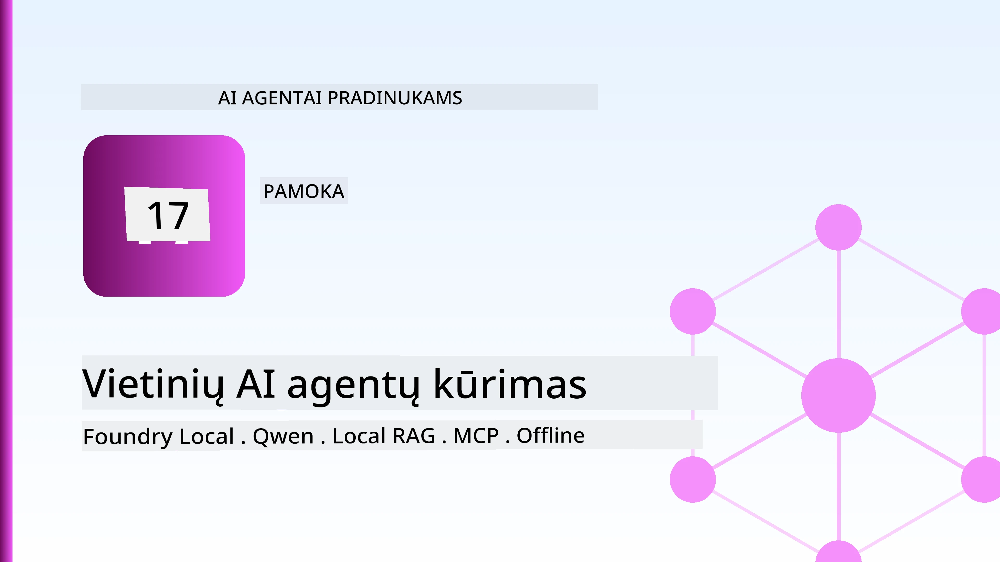
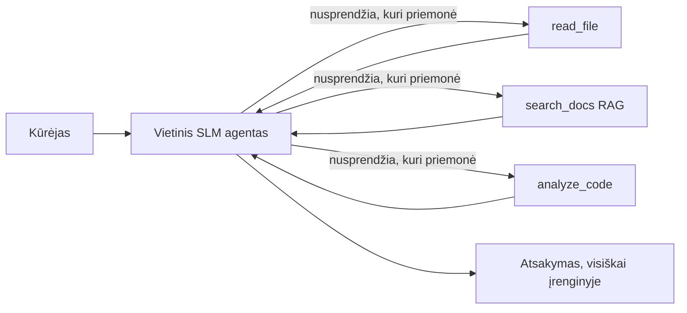
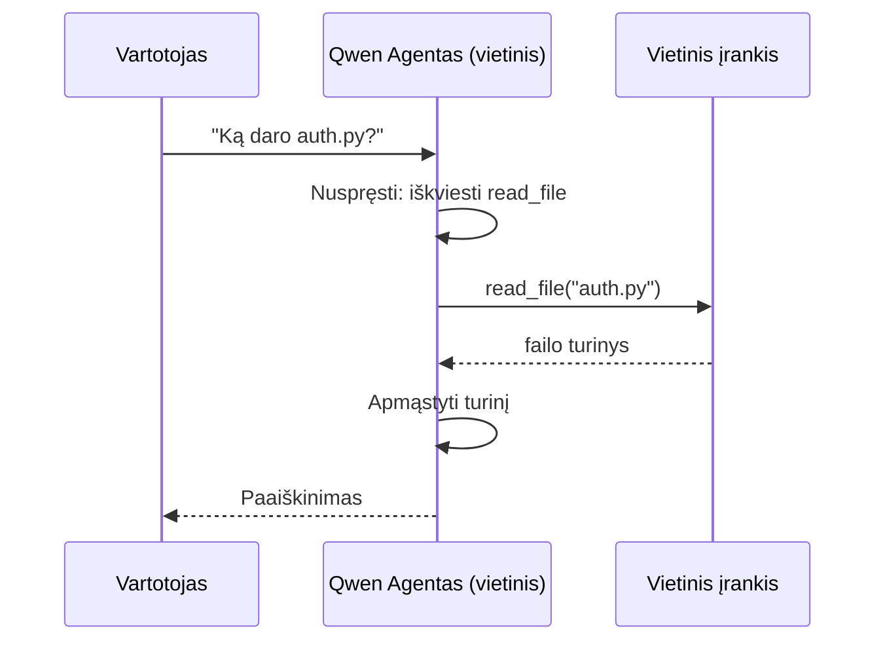
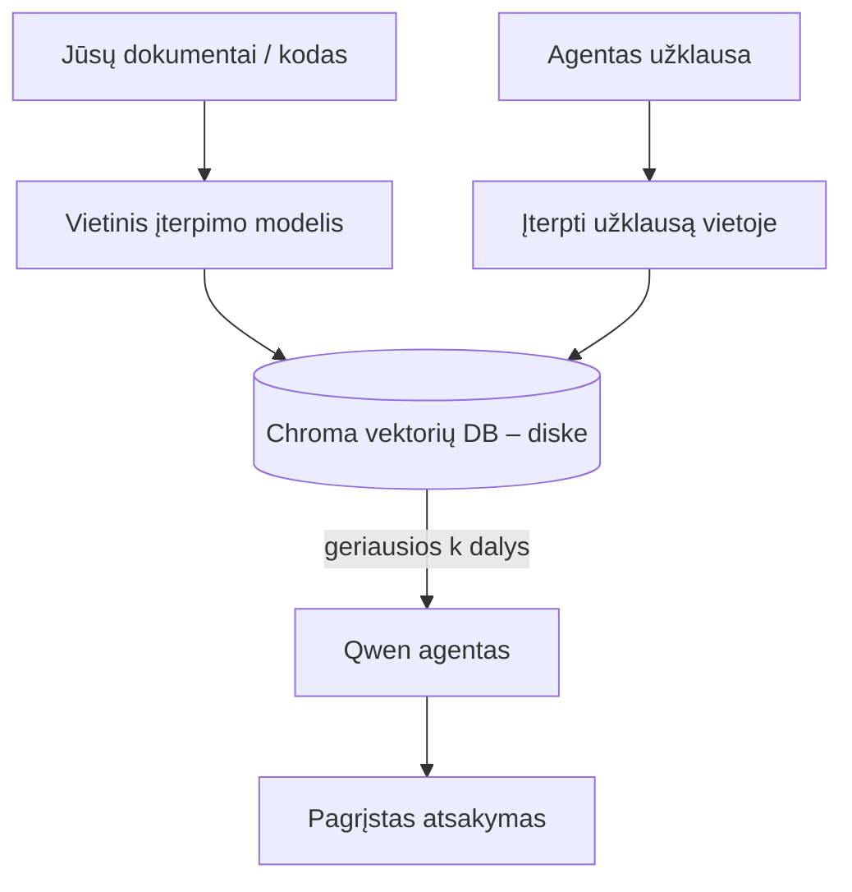
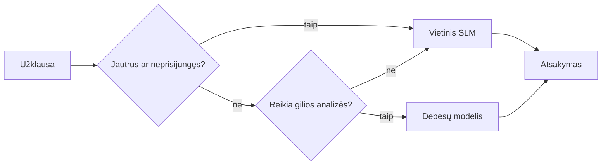

# Vietinių DI agentų kūrimas naudojant Microsoft Foundry Local ir Qwen



Ankstesnėje pamokoje agentai buvo išplėsti *į debesį*. Šioje jie perkelti *žemyn* į vieną įrenginį. Pamokos pabaigoje turėsite veikiančią inžinerijos asistentą, kuri mąsto, iškviečia įrankius, skaito jūsų failus ir ieško dokumentacijoje — **be jokio debesies užklausos kvietimo.**

Kodėl to norėtumėte? Trys dažnai kylančios priežastys tikroje inžinerinėje veikloje:

- **Privatumas.** Kodeksas ir dokumentai niekada neišeina iš įrenginio. Nė vienas užklausos fragmentas, nė vieni klientų duomenys neperžengia tinklo ribos.
- **Kaina.** Vietinė inferencija neturi jokio mokesčio už žodį. Galite tobulinti visą dieną už elektros kainą.
- **Veikimas neprisijungus.** Lėktuve, saugiame objekte ar gedimo metu agentas veikia.

Taip yra todėl, kad mainote pažangų debesies modelį į **mažą kalbos modelį (SLM)**, kuris veikia jūsų CPU, GPU arba NPU. Ši pamoka apie agentų kūrimą, kurie yra *geri* tokioje aplinkoje, o ne apsimetimą, kad tokios aplinkos nėra.

## Įvadas

Šioje pamokoje aptarsime:

- **Maži kalbos modeliai (SLM)** — kas jie yra, kur jie pasižymi, o kur ne.
- **Microsoft Foundry Local** — vykdymo aplinka, kuri įrenginyje parsisiunčia ir teikia modelius per **OpenAI suderinamą API**.
- **Qwen funkcijų iškvietimo modeliai** — SLM, kuriuos patikimai kuria įrankių iškvietimus ir leidžia kurti vietinius *agentus* (ne tik vietines diskusijas).
- **Vietiniai įrankiai, vietinė RAG ir vietinis MCP** — suteikia agentui galimybių be debesies.
- **Hibridiniai modeliai** — kada laikyti vietinius sprendimus, o kada kreiptis į debesį.

## Mokymosi tikslai

Užbaigus šią pamoką, žinosite, kaip:

- Paaiškinti SLM kompromisus ir parinkti tinkamus vietinių agentų scenarijus.
- Vietoje serverio su Foundry Local paleisti Qwen modelį ir jungtis prie jo per OpenAI suderinamą galinį tašką.
- Kurti visiškai jūsų darbo stotyje veikiančią įrankių iškvietimo agentą.
- Pridėti vietinę RAG prie savo dokumentų, naudodami vietinę vektorinę duomenų bazę (Chroma).
- Prijungti agentą prie vietinio MCP serverio ir aptarti hibridinius vietinius/debesies dizainus.

## Reikalavimai

Ši pamoka daroma remiantis, kad jau baigėte ankstesnes pamokas ir gerai suprantate:

- [Įrankių naudojimą](../04-tool-use/README.md) (4 pamoka) ir [Agentic RAG](../05-agentic-rag/README.md) (5 pamoka).
- [Agentinių protokolų / MCP](../11-agentic-protocols/README.md) (11 pamoka).
- [Microsoft agentų sistemą](../14-microsoft-agent-framework/README.md) (14 pamoka).

Taip pat reikės:

- Vystymo darbo stoties. **8 GB RAM yra realus minimumas**; 16 GB ar daugiau yra patogiau. GPU arba NPU padeda, bet nėra privalomas.
- Įdiegto **Microsoft Foundry Local** (žr. žemiau diegimo skyrių).
- Python 3.12+ ir paketus iš šio repozitorijos [`requirements.txt`](../../../requirements.txt), taip pat `foundry-local-sdk`, `openai` ir `chromadb` šiai pamokai.

## Maži kalbos modeliai: tinkamas įrankis vietiniam darbui

Pažangus debesies modelis turi šimtus milijardų parametrų ir už jo yra duomenų centras. SLM turi kelis milijardus parametrų ir telpa jūsų nešiojamojo kompiuterio atmintyje. Šis skirtumas nusako aiškius lūkesčius.

**SLM yra geri:**

- Struktūruotoms, ribotoms užduotims — klasifikacija, išskyrimas, santrauka iš žinomo dokumento.
- **Įrankių iškvietimas** — sprendžiant, kurią funkciją iškviesti ir kokiais argumentais.
- Greitam, pigiam ir privačiam kartojimui su savo duomenimis.

**SLM yra silpnesni:**

- Atviro tipo, daugiasluoksnio mąstymo dideliame kontekste.
- Platus pasaulinis žinojimas (jie mažiau matė ir daugiau pamiršta).

Dėl to vietinių agentų laimėjimo strategija yra: **leiskite SLM organizuoti, o įrankiams atlikti sunkius darbus.** Modelis neturi *žinoti* jūsų kodo — jam svarbu žinoti, kada iškviesti `read_file` ir `search_docs`. Tai puikiai atitinka SLM stipriąsias puses.



## Microsoft Foundry Local

**Microsoft Foundry Local** yra lengva vykdymo aplinka, kuri pilnai jūsų įrenginyje atsisiunčia, valdo ir teikia modelius. Svarbiausia mums savybė yra ta, kad ji atveria **OpenAI suderinamą HTTP galinį tašką** — tai reiškia, kad OpenAI SDK ir Microsoft Agent Framework OpenAI klientas veikia jį naudodami tik pakeisdamas `base_url`. Visa, ką išmokote apie agentų kūrimą, perkelia tiesiogiai; tik galinis taškas perkeltas iš debesies į `localhost`.

Foundry Local taip pat automatiškai parenka geriausią modelio versiją jūsų aparatūrai — CPU versiją, CUDA/GPU versiją arba NPU versiją — tad nebereikia rankomis optimizuoti kiekvienai mašinai.

### Diegimas

Įdiekite Foundry Local (žr. [dokumentaciją](https://learn.microsoft.com/azure/ai-foundry/foundry-local/) savo OS), tada patvirtinkite, kad veikia:

```bash
# Įdiegti (pavyzdžiui; vadovaukitės savo platformos dokumentacija)
winget install Microsoft.FoundryLocal      # Windows
# brew install microsoft/foundrylocal/foundrylocal   # macOS

# Atsisiųskite ir paleiskite Qwen modelį, tada pradėkite vietinę paslaugą
foundry model run qwen2.5-7b-instruct
foundry service status
```

Paleidus servisą, turite vietinį, OpenAI suderinamą galinį tašką (dažniausiai `http://localhost:PORT/v1`). Užrašų knyga automatiškai naudojasi `foundry-local-sdk`, todėl jums nereikia kietai koduoti porto.

## Qwen funkcijų iškvietimas: kodėl tai svarbu

Agentas yra agentas tik tuomet, jei jis gali iškviesti įrankius. Daugelis SLM gali kalbėtis, bet generuoja nepatikimus, netaisyklingus įrankių iškvietimus. **Qwen** modeliai apmokyti funkcijų iškvietimui ir nuosekliai generuoja taisyklingas įrankių struktūras — tai yra būtent tai, kas paverčia vietinį pokalbių modelį į vietinį *agentą*.

Srautas yra standartinis žinomas įrankių iškvietimo ciklas, tiesiog vykstantis įrenginyje:



## Vietinė RAG

Dokumentacijos paieška yra ta vieta, kur vietiniai agentai atsiperka. Vietoj to, kad tikėtumėtės, jog SLM įsiminė jūsų sistemos dokumentus, jūs įterpiate juos į **vietinę vektorinę duomenų bazę** ir leidžiate agentui pagal poreikį gauti reikiamus fragmentus.

Naudojame **Chromą**, įterptą vektorų saugyklą, kuri veikia procese be serverio. Srautas yra visiškai vietinis: vietinis įterpimo modelis → vietiniai vektoriai → vietiniai paieškos rezultatai → vietinis SLM.



Tai tas pats Agentic RAG modelis kaip 5 pamokoje — vienintelis skirtumas yra tas, kad visi komponentai veikia jūsų įrenginyje.

## Vietiniai MCP serveriai

[MCP](../11-agentic-protocols/README.md) yra transportas, o ne debesies servisas. MCP serveris gali veikti kaip vietinis procesas per `stdio`, atveriant įrankius jūsų agentui pagal standartinį protokolą. Tai leidžia pakartotinai naudoti vis didėjantį MCP serverių ekosistemą — prieigą prie failų sistemos, git operacijas, duomenų bazės užklausas — visiškai neprisijungus.

Saugumo pozicija skiriasi nuo debesies, bet nėra nulinė: vietinis MCP serveris veikia su jūsų naudotojo teisėmis, todėl išdėstykite ribas, ką jis gali valdyti (pvz., tik projekto direktoriją, ne visą namų katalogą) ir elkitės su jo rezultatais kaip su duomenimis, kuriuos verta patikrinti.

## Hibridinės debesies ir vietinio modelio architektūros

Vietinis pirmiausia nereiškia tik vietinį. Subrendę sprendimai paskirsto darbą pagal jautrumą ir sudėtingumą:

| Situacija | Kur veikia |
| --- | --- |
| Jautrus kodas / duomenys arba darbas neprisijungus | **Vietinis SLM** |
| Paprasta, ribota užduotis | **Vietinis SLM** (pigu, greita) |
| Sunkus daugiasluoksnis mąstymas ant nesvarbių duomenų | **Debesies modelis** |
| Viskas gedimo metu | **Vietinis SLM** (sklandus nuosmukis) |

Tai atkartoja **modelių maršrutizavimo** idėją iš 16 pamokos — išskyrus tai, kad vienas "modelių" yra jūsų paties mašina. Patvari sistema reaguoja į vietinius resursus jei debesis nepasiekiamas, tad agentas ne sugestų, o sumažintų veikimo kokybę.



## Praktinė užduotis: vietinis inžinerijos asistentas

Atidarykite [`code_samples/17-local-agent-foundry-local.ipynb`](./code_samples/17-local-agent-foundry-local.ipynb) ir dirbkite su juo. Jūs sukursite **vietinį inžinerijos asistentą**, kuris veikia visiškai jūsų darbo stotyje ir gali:

1. **Iškviečia įrankius** — per Qwen funkcijų iškvietimą naudojant Foundry Local.
2. **Atlieka vietines failų operacijas** — surašo ir skaito failus projekto direktorijoje.
3. **Analizuoja kodą** — pateikia bazinius metrikas šaltinio faile.
4. **Ieško dokumentacijoje** — vietinė RAG per dokumentų aplanką su Chromą.
5. **Naudoja MCP** — jungiasi prie vietinio MCP serverio (su sklandžiu praleidimu, jei nėra sukonfigūruotas).

Nėra naudojama jokia debesies inferencija.

### Vykdymo eiga

Asistentas jungiasi prie Foundry Local per OpenAI suderinamą galinį tašką, todėl agento kodas atrodo beveik identiškas debesies pamokose — tik pasikeičia klientas:

```python
from foundry_local import FoundryLocalManager
from openai import OpenAI

# Foundry Local aptinka/atsisiunčia modelį ir suteikia mums vietinį galinį tašką.
manager = FoundryLocalManager(\"qwen2.5-7b-instruct\")
client = OpenAI(base_url=manager.endpoint, api_key=manager.api_key)  # api_key yra vietinis vietos laikiklis
```

Įrankiai yra įprastos Python funkcijos, ribojamos projekto direktorijai:

```python
def read_file(path: str) -> str:
    \"\"\"Read a file, but only inside the sandboxed project directory.\"\"\"
    full = (PROJECT_ROOT / path).resolve()
    if PROJECT_ROOT not in full.parents and full != PROJECT_ROOT:
        return \"Access denied: path is outside the project directory.\"
    return full.read_text(encoding=\"utf-8\")
```

Atkreipkite dėmesį į smėlio dėžės patikrinimą — net ir vietoje, įrankis, kuris skaito bet kokius kelius, yra rizikingas. Užrašų knyga palaiko, kad kiekvienas įrankis būtų ribojamas iki vieno projekto šaknies.

## Žinių patikra

Išbandykite savo supratimą prieš pereinant prie užduoties.

**1. Pateikite du konkrečius argumentus, kodėl agentą paleisti vietoje, o ne debesyje.**

<details>
<summary>Atsakymas</summary>

Bet kurie du iš: **privatumas** (kodas ir duomenys niekada neišeina iš mašinos), **kaina** (nėra mokesčio už žodį), ir **veikimas neprisijungus** (veikia be tinklo — lėktuve, saugioje vietoje ar gedimo metu). Reguliavimo / atitikties reikalavimai, draudžiantys duomenis siųsti iš įrenginio, dažnai lemia privatumo priežastį.
</details>

**2. Koks yra rekomenduojamas darbo pasidalijimas tarp SLM ir jo įrankių vietiniame agente, ir kodėl?**

<details>
<summary>Atsakymas</summary>

Leiskite SLM **organizuošti** (spręsti, kurį įrankį iškviesti ir su kokiais argumentais) ir leiskite **įrankiams atlikti sunkius darbus** (skaityti failus, gauti dokumentaciją, skaičiuoti rezultatus). SLM yra stiprūs sprendžiant ribotas užduotis, kaip įrankių pasirinkimas, bet silpnesni plačiai žiniai ir sudėtingam daugiasluoksniam mąstymui, todėl atsikratymas įrankiams maksimaliai išnaudoja jų privalumus.
</details>

**3. Kas leidžia naudoti debesies agentų kodą su Foundry Local?**

<details>
<summary>Atsakymas</summary>

Foundry Local atidaro **OpenAI suderinamą HTTP galinį tašką**. OpenAI SDK ir Agent Framework OpenAI klientas veikia su juo tik pakeisdami `base_url` (ir naudodami vietinį vietos laikinojo rakto API). Visi kiti agento kodo aspektai lieka tokie patys.
</details>

**4. Kodėl būtent naudojame Qwen funkcijų iškvietimo modelį, o ne bet kokį SLM?**

<details>
<summary>Atsakymas</summary>

Nes agentas privalo kurti patikimus, taisyklingus **įrankių iškvietimus**. Daugelis SLM gali kalbėtis, bet generuoja netaisyklingas ar nepatikimas įrankių struktūras. Qwen modeliai mokomi funkcijų iškvietimui ir kuria nuoseklius įrankių iškvietimus, kurie paverčia vietinį pokalbio modelį į veikiantį vietinį agentą.
</details>

**5. Vietinės RAG duomenų apdorojimo grandinėje, kurie komponentai veikia mašinoje?**

<details>
<summary>Atsakymas</summary>

Visi: įterpimo modelis, vektorinė duomenų bazė (Chroma, diske), paieškos žingsnis ir SLM. Dokumentai įterpiami vietoje, saugomi vietoje, ieškoma vietoje ir sprendžiama vietinio modelio — nė vienas komponentas nenaudoja debesies.
</details>

**6. Vietinis MCP serveris veikia jūsų mašinoje. Ar tai automatiškai padaro jį saugiu? Kokias atsargumo priemones vis tiek turėtumėte taikyti?**

<details>
<summary>Atsakymas</summary>

Ne. Vietinis MCP serveris veikia jūsų naudotojo teisėmis, todėl gali pasiekti viską, ką galite ir jūs. Ribokite jį prie to, ko reikia (pvz., vieną projekto aplanką, o ne visą namų katalogą) ir traktuokite jo išvestis kaip duomenis, kuriuos verta patikrinti prieš veikdami pagal juos.
</details>

**7. Aprašykite prasmingą hibridinį maršrutizavimo taisyklę su vietiniu modeliu.**

<details>
<summary>Atsakymas</summary>

Perduokite jautrias ar neprisijungusias užklausas vietiniam SLM; paprastas ribotas užduotis perduokite vietiniam SLM dėl greičio ir kainos; sunkų daugiasluoksnį mąstymą nesijaudinančiais duomenimis perduokite debesies modeliui; ir jei debesis neveikia, pereikite prie vietinio SLM, kad agentas sumažintų kokybę, bet nesugestų. Tai yra modelių maršrutizavimas (16 pamoka) su jūsų mašina kaip vienu iš modelių.
</details>

**8. Koks yra realus RAM minimumas vietinio agente šioje pamokoje ir ką jums suteikia daugiau RAM?**

<details>
<summary>Atsakymas</summary>

Apie **8 GB** yra realus minimumas; 16 GB ar daugiau yra patogiau. Daugiau RAM leidžia paleisti didesnius, pajėgesnius modelius ir laikyti daugiau konteksto atmintyje. GPU arba NPU pagreitina inferenciją, bet nėra būtini — Foundry Local parinks CPU versiją, jei nėra pagreitintuvo.
</details>

## Užduotis

Išplėskite vietinį inžinerijos asistentą į **vietinį dokumentacijos peržiūros įrankį** mažam pasirinktam projektui (galite naudoti vieną iš šio repozitorijos pamokų aplankų).

Jūsų darbas turėtų:

1. **Indeksuoti tikrą dokumentų/kodo aplanką** į Chromą (mažiausiai penki failai).
2. **Pridėti `find_todos` įrankį** kuris ieško projekte `TODO` / `FIXME` komentarų ir grąžina juos su failo ir eilutės numeriais — laikantis to paties smėlio dėžės patikrinimo kaip `read_file`.

3. **Užduokite agentui tris klausimus**, kurie privers jį derinti įrankius: vieną grynai RAG klausimą, vieną, reikalaujantį perskaityti konkretų failą, ir vieną, reikalaujantį rasti TODO.
4. **Išmatuokite tai**: pamatuokite kiekvieno iš trijų atsakymų laiką ir užfiksuokite jį markdown ląstelėje. Pakomentuokite, ar delsos laikas yra priimtinas jūsų numatytam darbo procesui.

Tada parašykite trumpą pastraipą apie **ką perkeltumėte į debesį, o ką laikytumėte vietoje** šiam peržiūrėtojui ir kodėl. Vertinama, ar vietinės komponentės yra tinkamai sujungtos ir ar jūsų hibridinis mąstymas yra pagrįstas — o ne modelio kokybė.

## Santrauka

Šioje pamokoje sukūrėte agentą, kuris veikia visiškai jūsų pačių mašinoje:

- **SLM** keičia apimtį į privatumo, kaštų ir neprisijungusio darbo naudą — ir spindi, kai jie **orchestruoja įrankius**, o ne patys saugo visą žinių bazę.
- **Foundry Local** aptarnauja modelius įrenginyje už **OpenAI suderinamo pabaigos taško**, todėl jūsų debesies agente kodas persikelia su vienu eilutės pakeitimu.
- **Qwen funkcijų kvietimo modeliai** leidžia patikimai kviesti vietinius įrankius — ir tuo pačiu vietinius *agentus*.
- **Vietinis RAG** (Chroma) ir **vietinis MCP** suteikia agentui galimybes neišeinant iš mašinos.
- **Hibridiniai modeliai** leidžia maršrutuoti pagal jautrumą ir sudėtingumą, turint vietinį kaip elegantišką atsarginį variantą.

Tai užbaigia diegimo ciklą: 16 pamoka padidino agentus Microsoft Foundry, o ši pamoka juos sumažino iki vieno darbo stoties. Kitoje pamokoje nagrinėjama, kaip išlaikyti įdiegtų agentų saugumą.

## Papildomi Ištekliai

- <a href="https://learn.microsoft.com/azure/ai-foundry/foundry-local/" target="_blank">Microsoft Foundry Local dokumentacija</a>
- <a href="https://learn.microsoft.com/azure/ai-foundry/what-is-azure-ai-foundry" target="_blank">Microsoft Foundry dokumentacija</a>
- <a href="https://aka.ms/ai-agents-beginners/agent-framework" target="_blank">Microsoft Agent Framework</a>
- <a href="https://qwen.readthedocs.io/en/latest/framework/function_call.html" target="_blank">Qwen funkcijų kvietimo dokumentacija</a>
- <a href="https://modelcontextprotocol.io/" target="_blank">Model Context Protocol (MCP)</a>
- <a href="https://docs.trychroma.com/" target="_blank">Chroma vektorinė duomenų bazė</a>

## Ankstesnė pamoka

[Scalable Agents diegimas](../16-deploying-scalable-agents/README.md)

## Kitoji pamoka

[AI agentų saugumas](../18-securing-ai-agents/README.md)

---

<!-- CO-OP TRANSLATOR DISCLAIMER START -->
**Atsakomybės apribojimas**:
Šis dokumentas buvo išverstas naudojant dirbtinio intelekto vertimo paslaugą [Co-op Translator](https://github.com/Azure/co-op-translator). Nors siekiame tikslumo, prašome atkreipti dėmesį, kad automatiniai vertimai gali turėti klaidų ar netikslumų. Originalus dokumentas jo gimtąja kalba laikomas autoritetingu šaltiniu. Svarbiai informacijai rekomenduojama naudoti profesionalų žmogiškąjį vertimą. Mes neatsakome už jokius nesusipratimus ar neteisingą interpretaciją, kilusią naudojantis šiuo vertimu.
<!-- CO-OP TRANSLATOR DISCLAIMER END -->