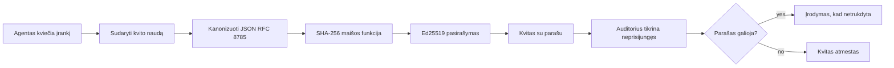
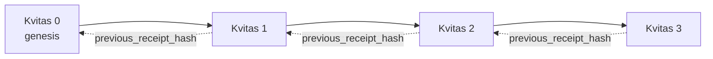

[Žiūrėkite pamokos vaizdo įrašą: Dirbtinio intelekto agentų apsauga su kriptografiniais kvitais](https://youtu.be/PLACEHOLDER_VIDEO_ID)

> _(Pamokos vaizdo įrašas ir miniatiūra bus pridėti po sujungimo Microsoft turinio komandos, atitinkant pamokų 14 / 15 modelį.)_

# Dirbtinio intelekto agentų apsauga su kriptografiniais kvitais

## Įvadas

Šioje pamokoje bus aptarta:

- Kodėl audito takeliai dirbtinio intelekto agentams svarbūs atitikties, klaidų taisymo ir pasitikėjimo prasme.
- Kas yra kriptografinis kvitas ir kuo jis skiriasi nuo nepasirašytos žurnalo eilutės.
- Kaip sukurti pasirašytą kvitą agento įrankio iškvietimui tiesioginėje Python kalboje.
- Kaip patikrinti kvitą neprisijungus ir aptikti klastojimus.
- Kaip sukurti kvitų grandinėlę taip, kad pašalinus ar pakeitus eilę, grandinė būtų pažeista.
- Ką kvitai įrodo ir ko jie aiškiai neįrodo.

## Mokymosi tikslai

Baigę šią pamoką žinosite, kaip:

- Nustatyti gedimo režimus, kurie skatina kriptografinį agento veiksmų iškilmingumą.
- Sukurti Ed25519 pasirašytą kvitą virš kanoninio JSON paketo.
- Nepriklausomai patikrinti kvitą naudodami tik pasirašančiojo viešąjį raktą.
- Aptikti klastojimus vėl atlikus patikrinimą modifikuotam kvitui.
- Sukurti hash grandinę kvitų seka ir paaiškinti, kodėl grandinė yra svarbi.
- Atpažinti ribą tarp to, ką kvitai įrodo (atribucija, vientisumas, tvarka), ir to, ko jie neįrodo (veiksmų teisingumas, politikos tvirtumas).

## Problema: jūsų agento audito takelis

Įsivaizduokite, kad įdiegėte AI agentą Contoso Travel. Agentas skaito klientų užklausas, kviečia skrydžių API, kad surastų galimybes, ir rezervuoja vietas kliento vardu. Praėjusį ketvirtį agentas apdorodavo 50 000 rezervacijų.

Šiandien atėjo auditorius. Jis užduoda paprastą klausimą: „Parodykite, ką jūsų agentas darė.“

Jūs perduodate savo žurnalo failus. Auditorius juos peržiūri ir užduoda sudėtingesnį klausimą: „Kaip žinoti, kad šie žurnalai nebuvo redaguoti?“

Tai yra audito takelio problema. Dauguma šiandieninių agentų diegimų pasikliauja:

- **Programų žurnalais**: kuriuos rašo pats agentas, redaguoti gali bet kas, kas turi failų sistemos prieigą.
- **Debesų žurnalavimo paslaugomis**: apdorojimas yra atsparus klastojimams platformos lygyje, bet tik jei auditorius pasitiki platformos operatoriumi.
- **Duomenų bazės transakcijų žurnalais**: puikiai tinkami duomenų bazės pokyčiams, bet ne atsitiktiniams įrankių iškvietimams.

Nė viena iš šių priemonių negali atsakyti auditoriaus klausimo nepasitikint kažkuo (jumis, jūsų debesų tiekėju, duomenų bazės tiekėju). Vidiniam naudojimui toks pasitikėjimas dažnai yra priimtinas. Reguliuojamiems darbo krūviams (finansai, sveikatos priežiūra, bet kas, kas priklauso ES DI priedui) - ne.

Kriptografiniai kvitai išsprendžia šią problemą padarydami kiekvieną agento veiksmą nepriklausomai patikrinamą. Auditorius jums pasitikėti neprivalo. Jam reikia tik jūsų viešojo rakto ir paties kvito.

## Kas yra kriptografinis kvitas?

Kvitas yra JSON objektas, kuris fiksuoja, ką agentas padarė, pasirašytas skaitmeniniu parašu.



Minimalus kvitas atrodo taip:

```json
{
  "type": "agent.tool_call.v1",
  "agent_id": "contoso-travel-bot",
  "tool_name": "lookup_flights",
  "tool_args_hash": "sha256:a3f9c1...",
  "result_hash": "sha256:7b2e1d...",
  "policy_id": "contoso-travel-policy-v3",
  "timestamp": "2026-04-25T14:30:00Z",
  "sequence": 47,
  "previous_receipt_hash": "sha256:9d4e6a...",
  "signature": {
    "alg": "EdDSA",
    "sig": "c5af83...",
    "public_key": "8f3b2c..."
  }
}
```

Trys savybės atlieka darbą:

1. **Parašas**. Kvitas pasirašomas agento vartų naudojant Ed25519 privatų raktą. Bet kas, kas turi atitinkamą viešąjį raktą, gali neprisijungęs patikrinti parašą. Bet koks lauko klastojimas paneigia parašo galiojimą.

2. **Kanoninis kodavimas**. Prieš pasirašant, kvitas serializuojamas pagal JSON Kanonizacijos schemą (JCS, RFC 8785). Tai užtikrina, kad du įgyvendinimai, sukuriantys tokį patį logišką kvitą, pateikia bitų identišką išvestį. Be kanonizacijos skirtingi JSON serijavimo įrankiai pateiktų skirtingus parašus tam pačiam turiniui.

3. **Hash grandinės kūrimas**. Laukas `previous_receipt_hash` susieja kiekvieną kvitą su prieš tai buvusiu. Pašalinus arba pakeitus kvitą, nutraukiamos visos vėliau buvusios kvitų grandinės. Klastojimas tampa matomas grandinės lygyje, net jei pavieniai parašai apeinami.

Kartu šios savybės užtikrina tris garantijas:

- **Attribucija**: šis raktas pasirašė šį turinį.
- **Vientisumas**: turinys nepasikeitė nuo pasirašymo momento.
- **Tvarka**: šis kvitas sekė po to kvito grandinėje.

## Kvitų kūrimas Python kalba

Kvito kūrimui nereikia specialios bibliotekos. Kriptografiniai primityvai yra plačiai prieinami, o logika užima vos keliasdešimt Python kodo eilučių.

Praktinės užduotys faile `code_samples/18-signed-receipts.ipynb` žingsnis po žingsnio apima visą procesą. Santraukos versija:

```python
import json
import hashlib
import base64
from nacl import signing
from jcs import canonicalize  # RFC 8785 kanoninis JSON

def b64url_nopad(data: bytes) -> str:
    return base64.urlsafe_b64encode(data).decode("ascii").rstrip("=")

def sha256_canonical(obj) -> str:
    """SHA-256 of a Python object's JCS-canonical JSON form."""
    return f"sha256:{hashlib.sha256(canonicalize(obj)).hexdigest()}"

# Sugeneruokite arba įkelkite pasirašymo raktą (gamyboje laikykite rakto saugykloje)
signing_key = signing.SigningKey.generate()
verify_key = signing_key.verify_key

# Sukurkite kvito naudą (kol kas be parašo)
tool_args = {"origin": "SYD", "destination": "LAX"}
tool_result = [{"flight": "QF11", "price": 1850, "stops": 0}]

payload = {
    "type": "agent.tool_call.v1",
    "agent_id": "contoso-travel-bot",
    "tool_name": "lookup_flights",
    "tool_args_hash": sha256_canonical(tool_args),
    "result_hash": sha256_canonical(tool_result),
    "policy_id": "contoso-travel-policy-v3",
    "timestamp": "2026-04-25T14:30:00Z",
    "sequence": 0,
    "previous_receipt_hash": None,
}

# Kanonizuokite, suskaičiuokite maišą, pasirašykite.
canonical_bytes = canonicalize(payload)
message_hash = hashlib.sha256(canonical_bytes).digest()
signature_bytes = signing_key.sign(message_hash).signature

# Pridėkite struktūrizuotą parašo objektą.
receipt = {
    **payload,
    "signature": {
        "alg": "EdDSA",
        "sig": b64url_nopad(signature_bytes),
        "public_key": b64url_nopad(bytes(verify_key)),
    },
}
```

Tai visas pasirašymo procesas. Užduotys užrašeanalizuoja kiekvieną žingsnį.

## Kvito patvirtinimas ir klastojimų aptikimas

Patvirtinimas yra priešingas veiksmas:

```python
import base64
import hashlib
from nacl import signing
from nacl.exceptions import BadSignatureError
from jcs import canonicalize

def b64url_decode(s: str) -> bytes:
    padding = "=" * ((4 - len(s) % 4) % 4)
    return base64.urlsafe_b64decode(s + padding)

def verify_receipt(receipt: dict) -> bool:
    # Parašas yra struktūruotas objektas: {"alg", "sig", "public_key"}.
    sig_obj = receipt.get("signature")
    if not sig_obj or sig_obj.get("alg") != "EdDSA":
        return False

    # Atstatykite duomenis, kurie iš tikrųjų buvo pasirašyti (visi elementai, išskyrus parašą).
    payload = {k: v for k, v in receipt.items() if k != "signature"}

    canonical_bytes = canonicalize(payload)
    message_hash = hashlib.sha256(canonical_bytes).digest()

    try:
        verify_key = signing.VerifyKey(b64url_decode(sig_obj["public_key"]))
        verify_key.verify(message_hash, b64url_decode(sig_obj["sig"]))
        return True
    except BadSignatureError:
        return False
```

Ši funkcija gauna kvitą ir grąžina `True`, jei parašas galioja, ir `False` kitu atveju. Jokių tinklo kvietimų, jokių paslaugų priklausomybių, joks pasitikėjimas trečia šalis nereikalingas.

Kad pamatytumėte klastojimų aptikimą veiksme, užrašeanalizuoja:

1. Veikiantį kvito sukūrimą ir jo patvirtinimą.
2. Vieno baito modifikavimą lauke `tool_args_hash`.
3. Pakartotinį patvirtinimą ir jo nesėkmę.

Tai praktinis įrodymas, kad kvitai yra atsparūs klastojimams: bet koks pakeitimas, koks bebūtų mažas, sulaužo parašą.

## Kvito grandinės sudarymas daugiasluoksniams agentams

Vienas pasirašytas kvitas saugo vieną veiksmą. Kvitų grandinė saugo seką.



Kiekvienas kvitas įrašo ankstesnio kvito maišos reikšmę. Norint tyliai pašalinti kvitą nr. 2, atakuotojui reikėtų:

- Pakeisti kvito nr. 3 lauką `previous_receipt_hash` (sulaužytų kvito nr. 3 parašą), ARBA
- Sufalsifikuoti naują parašą modifikuotam kvitui nr. 3 (reikėtų agento privataus rakto).

Jei privatus raktas laikomas aparatinėje saugykloje ir viešasis raktas skelbiamas su kiekvienu kvitu, nei viena ataka nėra įmanoma be aptikimo.

Užrašeanalizuoja:

1. Kvitų grandinės sudarymą iš trijų kvitų.
2. Patvirtinimą, kad kiekvieno kvito `previous_receipt_hash` atitinka ankstesnio kvito tikrąjį maišą.
3. Vieno kvito viduryje klastojimą ir grandinės sutrupėjimą būtent toje vietoje.

Taip sukuriate audito takelį, kurį išorinis auditorius gali patikrinti nepasitikėdamas jumis.

## Ką kvitai įrodo (ir ko neįrodo)

Tai svarbiausia šios pamokos dalis. Kvitai yra galingi, bet jų galia ribota.

**Kvitai įrodo tris dalykus:**

1. **Attribucija**: konkretus raktas pasirašė konkretų paketą.
2. **Vientisumas**: paketas nepasikeitė nuo pasirašymo momento.
3. **Tvarka**: šis kvitas sekė po to kvito hash grandinėje.

**Kvitai NEĮRODO:**

1. **Teisingumo**: kad agento veiksmas buvo teisingas. Kvitas gali būti pasirašytas ir už neteisingą atsakymą taip pat patikimai, kaip ir už teisingą.
2. **Politikos laikymosi**: kad `policy_id` nurodyta politika tikrai buvo vertinta arba leistų šį veiksmą. Kvitas fiksuoja teiginį, bet ne taikymą.
3. **Tapatybės už rakto ribų**: kvitas sako „šis raktas pasirašė šį turinį“, bet nesako „šis žmogus įgaliotas“. Raktą priskirti asmeniui ar organizacijai reikia atskiros tapatybės infrastruktūros (katalogo, viešųjų raktų registro ir kt.).
4. **Įvesties tikrumo**: jei agentas gauna manipuliuotą užklausą ir veikia pagal ją, kvitas tiksliai fiksuoja veiksmą. Kvitai priklauso nuo įvesties validacijos, o ne yra jos pakaitalas.

Ši riba svarbi dėl dviejų priežasčių:

- Ji nurodo, kam kvitai naudingi: padaryti agento elgesį audituojamą ir atsparų klastojimams, net tarp organizacijų ribų.
- Ji nurodo, kokių papildomų sluoksnių dar reikia: įvesties validacijos (Pamoka 6), politikos vykdymo (trumpai aprašyta žemiau) ir tapatybės infrastruktūros (ne pamokos darbotvarkėje).

Dažna klaida manyti, kad „turime kvitus“ reiškia „mes valdome“. Nereiškia. Kvitai yra pagrindas. Valdymas yra sistema, kurią statote ant jo.

## Įrodymas, kad žmogus patvirtino tikslų veiksmą

Punktas 3 verta atskiros dalies: veiksmo kvitas sako „šis raktas pasirašė šį turinį“, niekada „žmogus įgaliotas“. Dėl didelės rizikos veiksmų (grąžinimai, ištrynimai, pervedimai) valdymo sistemos vis dažniau reikalauja būtent šio trūkstamo teiginio, ir jį galima sukurti tais pačiais primityvais, kuriuos jau sudėjote šioje pamokoje.

Tolimesnė užduotis faile `code_samples/human-authorization-receipts.ipynb` prideda antrą kvito tipą, `human.approval.v1`, tokiu pačiu formatu kaip pamokos kvitai (tipuotas paketas pasirašytas Ed25519 ant kanoninio SHA-256, su `signature` objektu už pasirašytų baitų ribų). Pavadintas patvirtintojas pasirašo **visą kanoninį veiksmą ir jo suvestinę** prieš vykdymą; agento veiksmo kvitas neša **tą patį veiksmų suvestinę** ir `parent_approval_ref`, tai yra patvirtinimo `receipt_hash`, ta pati tvarka kaip `previous_receipt_hash` grandinėje, kurią jau sukūrėte. Vienas `verify_chain` kelias peržvelgia abu artefaktus pagal **atidžiai fiksuotus raktų registrus** (patvirtintojų raktai vs agento raktai), taigi kodo kelias yra bendras, bet institucijos niekada nebus bendros.

Savybė, kurią tai suteikia, tiksliai išreikšta: *žmogus patvirtino būtent šį veiksmą, o agentas jį ir įvykdė.* Užrašo patvirtinimo klaidų pavyzdžiai yra tikri įrodymai, o ne teiginiai:

- klasikinis rinkinys: klastojimas, paini įgaliotinio tapatybė, perdarymas, suklastoti raktai abiem pusėm, netvarkinga įvestis;
- **pasenusi institucija**: parašas, kuris dar patikrina, bet atmestas, nes persikėlė politikos versija, patvirtintojų raktas buvo pašalintas iš fiksuoto registro arba patvirtinimas pasibaigė prieš vykdymą;
- **suvestinės pakeitimas**: teisėtas pasirašytas veiksmų kvitas, nurodantis *tikrą* patvirtinimą, susietą su *kitu* kanoniniu veiksmu.

Kiekviena klaida atmetama su skirtinga priežastimi, todėl auditorius, skaitydamas atmetimą, gali žinoti, ar valdžia paseno, ar veiksmų apimtis pasikeitė. Užrašo taisyklė: pasirašytas patvirtinimas pats nėra valdžia. Valdžia egzistuoja tik jei abu kvitai vis dar susieti su tuo pačiu kanoniniu veiksmu vykdymo metu. Šio pamokos darbinio projekto bendra priedas (`draft-farley-acta-signed-receipts`) yra šio modelio standartizacijos forma.

## Naudojimo atvejai gamyboje

Python kodas šioje pamokoje yra tyčia minimalus, kad galėtumėte perskaityti kiekvieną eilutę ir tiksliai suprasti, kas vyksta. Gamyboje turite dvi galimybes:

1. **Kurti tiesiogiai ant kriptografinių primityvų.** 50 eilučių, kurias matėte aukščiau, dažnai pakanka daugeliui atvejų. PyNaCl (Ed25519) ir `jcs` paketas (kanoninis JSON) yra gerai prižiūrimos ir audituotos bibliotekos.

2. **Naudoti gamybos kvitų biblioteką.** Kelios atviro kodo projektai įgyvendina tą patį modelį su papildomomis funkcijomis (raktų rotacija, grupinė patikra, JWK rinkinys, integracija su politikos varikliais):
   - Kvitų formatas, naudojamas šioje pamokoje, atitinka IETF interneto projektą ([`draft-farley-acta-signed-receipts`](https://datatracker.ietf.org/doc/draft-farley-acta-signed-receipts/), redakcija 02), šiuo metu standartų procese, su bendru atitikimo rinkiniu ([agent-governance-testvectors](https://github.com/ScopeBlind/agent-governance-testvectors)), kurį nepriklausomi įgyvendinimai patikrina prieš bitų identišką kanoninę išvestį.
   - Microsoft Agent Governance Toolkit suderina kvitus su Cedar pagrindu vykdomais politikas; žr. 33 pamoką jų saugykloje pilnam pavyzdžiui.
   - `protect-mcp` (npm) ir `@veritasacta/verify` (npm) paketai teikia Node pagrindu veikiančią kvitų pasirašymo ir neprisijungus patikros įgyvendinimą, skirtą MCP serverio audito takelio apsaugai, įskaitant bendrai pasirašomų veiksmų srautą, kuriame pristabdytas veiksmas sukuria patvirtinimo kvitą, susietą su veiksmo suvestine (WebAuthn pagrįstas darbalaukio sraute), tokį pat modelį kaip žmogaus autorizacijos užrašeanalizėje aukščiau.
   - **[nobulex](https://github.com/arian-gogani/nobulex)** Python SDK (`pip install nobulex`) pateikia tą patį Ed25519 + JCS pasirašymo modelį Python kalboje su LangChain ir CrewAI integracijomis, įskaitant publikacinius kryžminius testavimo vektorius ir atitikties žemėlapį, kurį prisidėjo [OWASP PR #2210](https://github.com/OWASP/CheatSheetSeries/pull/2210).

Sprendimas tarp savo sprendimo rašymo ir bibliotekos naudojimo atspindi sprendimą tarp savo JWT bibliotekos rašymo ir testuotos naudojimo: abu yra pagrįsti; biblioteka taupo laiką ir mažina audito paviršių; nuo nulio rašoma versija verčia suprasti kiekvieną primityvą. Ši pamoka moko nuo nulio, kad turėtumėte pagrindą bet kuriam variantui.

## Žinių patikrinimas

Patikrinkite savo supratimą prieš pereidami prie praktinės užduoties.

**1. Kvitas pasirašomas agento privačiu Ed25519 raktu. Auditorius turi tik viešąjį raktą. Ar auditorius gali neprisijungęs patikrinti kvitą?**

<details>
<summary>Atsakymas</summary>

Taip. Ed25519 patikrinimui reikia tik viešojo rakto ir pasirašytų baitų. Nėra tinklo kvietimų, nėra paslaugų priklausomybės. Tai savybė, dėl kurios kvitai naudingi neprisijungus, kelių organizacijų ar mažo pasitikėjimo audito aplinkoje.
</details>

**2. Atakuotojas modifikuoja kvito lauką `policy_id` teigdamas, kad jį valdė liberalesnė politika. Parašas buvo virš originalaus paketo. Kas vyksta patikrinimo metu?**

<details>
<summary>Atsakymas</summary>


Patvirtinimas nepavyksta. Parašas buvo apskaičiuotas pagal originalaus duomenų krepšio kanoninius baitus; bet kokios lauko modifikacijos keičia kanoninius baitus, o tai keičia SHA-256 maišą, todėl parašas tampa negaliojantis. Užpuolikas turėtų turėti privatų raktą, kad sukurtų naują galiojantį parašą, ko jis neturi.
</details>

**3. Kodėl kvitas apima `tool_args_hash` ir `result_hash`, o ne žalius argumentus ir rezultatą?**

<details>
<summary>Atsakymas</summary>

Dvi priežastys. Pirma, kvitą gali reikėti archyvuoti ar perduoti aplinkose, kur žalių duomenų (asmens duomenų, verslo informacijos) nutekėjimas yra problema. Maišymas leidžia kvitui būti mažam ir turiniui būti privatumui; auditorius patikrina, ar maišas atitinka atskirai saugomą tikrojo turinio kopiją. Antra, maišai turi fiksuotą dydį; kvito su maišais dydis yra ribotas nepriklausomai nuo įėjimų ir išėjimų dydžio.
</details>

**4. Laukas `previous_receipt_hash` susieja kiekvieną kvitą su jo pirmtaku. Jei užpuolikas tyliai ištrina vieną kvitą grandinės viduryje, kas tampa negaliojančiu?**

<details>
<summary>Atsakymas</summary>

Visi kvitai, kurie buvo po ištrinto. Jų laukai `previous_receipt_hash` nebebus suderinti su tikrąja grandine (nes kvitas, kurį jie nurodė, nebėra arba grandinė dabar rodo į kitą pirmtaką). Kad paslėptų ištrynimą, užpuolikas turėtų iš naujo pasirašyti kiekvieną vėlesnį kvitą, tam reikia privataus rakto.
</details>

**5. Kvitas patikrinamas sėkmingai. Ar tai įrodo, kad agento veiksmas buvo teisingas, pagrįstas ar atitinka politiką?**

<details>
<summary>Atsakymas</summary>

Ne. Galiojantis kvitas įrodo tris dalykus: priskyrimą (šis raktas pasirašė tą turinį), vientisumą (turinys nepasikeitė) ir tvarką (šis kvitas atėjo po to kvito). Jis NEĮRODO, kad veiksmas buvo teisingas, kad politika identifikuota `policy_id` buvo iš tikrųjų įvertinta ar kad agentas laikėsi kiekvienos taisyklės. Kvituose agento elgesys yra audituojamas, bet ne visada teisingas. Tai svarbiausia šios pamokos riba.
</details>

## Praktinė užduotis

Atidarykite `code_samples/18-signed-receipts.ipynb` ir užbaikite visas keturias dalis:

1. **1 dalis**: Pasirašykite pirmąjį kvitą ir patikrinkite jį.
2. **2 dalis**: Pakeiskite kvitą ir stebėkite, kaip nepavyksta patvirtinimas.
3. **3 dalis**: Sukurkite trijų kvitų grandinę ir patikrinkite grandinės vientisumą.
4. **4 dalis**: Pritaikykite šį modelį agentui, sukurtam naudojant Microsoft Agent Framework: apvyniokite įrankio kvietimą kvitų pasirašymu, o tada atskirai patikrinkite kvitą.

**Iššūkis 1:** išplėskite kvito schemą pridėdami naują lauką (pvz., užklausos ID stebėjimui), atnaujinkite kanoninį pasirašymo logiką, kad jį įtrauktumėte, ir įsitikinkite, kad kvitas vis dar sėkmingai patvirtintas. Tada modifikuokite lauką po pasirašymo ir patikrinkite, kad patvirtinimas nepavyksta. Tai priverčia jus suprasti, kaip kiekvienas kanoninio kodavimo baitas prisideda prie parašo.

**Iššūkis 2:** SHA-256 nauju maišu sujunkite du savo kvitus (sujunkite jų kanoninius baitus deterministiniu būdu) ir įterpkite gautą maišą kaip naują lauką trečiajame kvite prieš pasirašant. Patikrinkite, kad visi trys kvitai vis dar sėkmingai patvirtinami. Jūs ką tik sukūrėte vieno žingsnio įtraukimo įrodymą: kas turi trečią kvitą, gali įrodyti, kad pirmieji du egzistavo pasirašymo metu, nereikalaujant atskleisti jų turinio. Tai modelis, kurį plataus masto kvitai su selektyviu atskleidimu naudoja (Merkle įsipareigojimai, RFC 6962).

## Išvada

Kriptografiniai kvitai suteikia DI agentams audito kelią, kuris yra:

- **Nepriklausomai patikrinamas**: bet kuri šalis su viešuoju raktu gali patikrinti, nepriklausomai nuo paslaugų.
- **Nepakeičiamumo įrodymas**: bet koks modifikavimas panaikina parašą.
- **Nešiojamas**: kvitas yra mažas JSON failas; jį galima archyvuoti, perduoti ir patikrinti bet kur.
- **Atitinka standartus**: sukurtas naudojant Ed25519 (RFC 8032), JCS (RFC 8785) ir SHA-256 – plačiai naudojamus primityvus.

Jie nėra pakaitalas įvesties patikrinimui, politikos vykdymui ar tapatybės infrastruktūrai. Jie yra pagrindas tiems sluoksniams. Kai diegiate agentus reguliuojamose darbo krūvio aplinkose, daugialypėse organizacijų darbo eigos vietose ar bet kur, kur ateities auditorius negali būti laikomas patikimu, kvitai yra būdas, kaip padaryti audito kelią sąžiningu.

Svarbiausia pamoka: kvitai įrodo, kas ką pasakė ir kada. Jie neįrodo, kad pasakyta buvo tiesa ar teisinga. Šia atskirtimi laikykitės. Tai yra skirtumas tarp sąžiningos kilmės sistemos ir klaidinančios.

## Gamybos kontrolinis sąrašas

Kai būsite pasiruošę pereiti nuo šios pamokos prie kvitus pasirašančių agentų diegimo realioje aplinkoje:

- [ ] **Perkelkite pasirašymo raktą nuo kūrėjo kompiuterio.** Naudokite Azure Key Vault, AWS KMS arba aparatūros saugumo modulį. Privatus raktas, kuris pasirašo jūsų kvitus, neturi būti saugomas šaltinio valdyme ar tekstiniu formatu programų mašinose.
- [ ] **Skelbkite patikros viešąjį raktą.** Auditoriams reikia jo neparduotuviam patikrinimui. Standartinis modelis yra JWK rinkinys gerai žinomu URL (RFC 7517), pvz., `https://your-org.example.com/.well-known/agent-keys.json`.
- [ ] **Išorėje pritvirtinkite grandinę.** Periodiškai įrašykite naujausio grandinės galvos maišą į skaidrumo žurnalą (Sigstore Rekor, RFC 3161 laiko žyma arba kita vidinė sistema), kad išorinė šalis galėtų patvirtinti „ši grandinė egzistavo tuo metu“.
- [ ] **Saugojimas nesikeičiamai.** Tik pridėjimui skirta blob saugykla (Azure Storage su nekintamumo politika, AWS S3 Object Lock) neleidžia vidiniams asmenims keisti istorijos saugyklos lygmenyje.
- [ ] **Nustatykite saugojimo trukmę.** Daugelis atitikties reikalavimų numato daugybės metų saugojimą. Planuokite kvitų augimą (kiekvienas kvitas ~500 baitų; agentas, kuris daro 10K kvietimų per dieną, sugeneruoja ~1,8 GB per metus).
- [ ] **Dokumentuokite, kas nėra apimta kvituose.** Kvituose įrodoma priskyrimas, vientisumas ir tvarka. Jūsų veiklos vadove aiškiai nurodykite papildomas kontrolius (įvesties patikrinimas, politikos vykdymas, ribojimas, tapatybės infrastruktūra), kurie yra kartu su kvitais valdymo požiūriu.

### Turite daugiau klausimų apie DI agentų apsaugą?

Prisijunkite prie [Microsoft Foundry Discord](https://aka.ms/ai-agents/discord), kad susitiktumėte su kitais besimokančiais, dalyvautumėte valandų biuruose ir gautumėte atsakymus į savo DI agentų klausimus.

## Po šios pamokos

Ši pamoka apima vieno kvito pasirašymą ir maišytas grandines. Tos pačios primityvos yra sudedamos į kelis sudėtingesnius modelius, kuriuos galite susidurti, kai jūsų valdymo požiūris brandėja:

- **Selektinis atskleidimas.** Kai kvito laukai yra nepriklausomai įsipareigoję (RFC 6962 stiliaus Merkle medis), galite atskleisti tam tikrus laukus tam tikriems auditoriams ir įrodyti, kad kiti liko nepakitę, neatskleisdami jų. Naudinga, kai tas pats kvitas turi patenkinti ir visapusišką auditą (kuris nori pilnumo), ir duomenų minimalizavimo reglamentus kaip GDPR (kur auditorius turi matyti kuo mažiau).
- **Kvito panaikinimas.** Jei pasirašymo raktas kompromituojamas, reikia būdo pažymėti visus tuo raktu pasirašytus kvitus kaip nepatikimus nuo tam tikro laiko momento. Standartiniai modeliai: trumpalaikiai pasirašymo raktai su paskelbta panaikinimo sąrašu arba skaidrumo žurnalas su panaikinimo įrašais.
- **Dvipusiai / dalinami parašo kvitai.** Kai kurios įgyvendinimo versijos skiria pasirašytą turinį į priešvykdymo (`authorization_*`) ir povykdymo (`result_*`) dalis su nepriklausomais parašais, naudinga, kai autorizacijos sprendimą ir stebėtą rezultatą kuria skirtingi veikėjai arba skirtingu laiku. Tai yra papildoma sudedamoji dalis šiame pamokoje mokytam kvito formatui.
- **Turinio sudėtis.** Kvitas užantspauduoją bet kokius baitus, kuriuos dedate į `result_hash`. Realūs duomenys dažnai yra turtingesni negu vienas įrankio kvietimo rezultatas: priešsprendimo apmąstymai (modelio prognozė, svarstyti variantai, įrodymai ir jų pilnumas, rizikos būklė, atsakomybės grandinė, vartų rezultatas) gali būti viskas turinyje, užantspauduota vienu kvitu. Tai leidžia kvito formatą laikyti paprastu, kol duomenų schemos vystosi pagal domenus.
- **Tarp-įgyvendinimo suderinamumas.** Kelios nepriklausomos tos pačios kvito formato įgyvendinimo versijos (Python, TypeScript, Rust, Go) patikrina vienos kitos testinius vektorius. Jei kuriate savo įgyvendinimą, patvirtinimas pagal paskelbtus vektorius patvirtina laidynės suderinamumą.
- **Po kvantinę migraciją.** Ed25519 šiandien naudojamas plačiai, bet nėra kvantams atsparus. Kvito formatas yra algoritmo lankstus: laukas `signature.alg` gali turėti `ML-DSA-65` (NIST po kvantinė parašo standartas), kai reikia pereiti. Planuokite pereinamojo laikotarpio, kai kvitai bus dvigubai pasirašyti.

## Papildomi šaltiniai

- <a href="https://datatracker.ietf.org/doc/draft-farley-acta-signed-receipts/" target="_blank">IETF Internet-Draft: Pasirašyti sprendimų kvitai mašinų prieigos kontrolei</a>
- <a href="https://learn.microsoft.com/azure/ai-studio/responsible-use-of-ai-overview" target="_blank">Atsakingas DI apžvalga (Azure DI)</a>
- <a href="https://datatracker.ietf.org/doc/html/rfc8032" target="_blank">RFC 8032: Edwards kreivės skaitmeninis parašų algoritmas (EdDSA)</a>
- <a href="https://datatracker.ietf.org/doc/html/rfc8785" target="_blank">RFC 8785: JSON kanonizavimo schema (JCS)</a>
- <a href="https://datatracker.ietf.org/doc/html/rfc6962" target="_blank">RFC 6962: Sertifikatų skaidrumas</a> (Merkle medžio konstrukcija, naudojama selektyvaus atskleidimo kvituose)
- <a href="https://github.com/microsoft/agent-governance-toolkit/blob/main/docs/tutorials/33-offline-verifiable-receipts.md" target="_blank">Microsoft Agent Governance Toolkit, 33 pamoka: neprisijungus tikrinami sprendimų kvitai</a>
- <a href="https://github.com/ScopeBlind/agent-governance-testvectors" target="_blank">Tarp-įgyvendinimo atitikimo testų vektoriai</a> kvito formatui, naudotam šioje pamokoje (Apache-2.0)
- <a href="https://pynacl.readthedocs.io/" target="_blank">PyNaCl dokumentacija</a> (Ed25519 Python’e)

## Ankstesnė pamoka

[Vietinių DI agentų kūrimas](../17-creating-local-ai-agents/README.md)

---

<!-- CO-OP TRANSLATOR DISCLAIMER START -->
**Atsakomybės apribojimas**:
Šis dokumentas buvo išverstas naudojant dirbtinio intelekto vertimo paslaugą [Co-op Translator](https://github.com/Azure/co-op-translator). Nors siekiame tikslumo, prašome atkreipti dėmesį, kad automatiniai vertimai gali turėti klaidų ar netikslumų. Originalus dokumentas jo gimtąja kalba laikomas autoritetingu šaltiniu. Svarbiai informacijai rekomenduojama naudoti profesionalų žmogiškąjį vertimą. Mes neatsakome už jokius nesusipratimus ar neteisingą interpretaciją, kilusią naudojantis šiuo vertimu.
<!-- CO-OP TRANSLATOR DISCLAIMER END -->