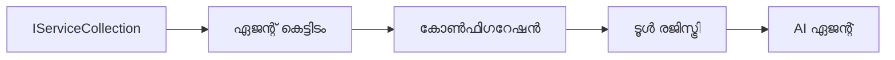

# 🎨 Azure OpenAI (Responses API) (.NET) ഉപയോഗിച്ചുള്ള ഏജന്റിക് ഡിസൈൻ പാറ്റേണുകൾ

## 📋 പഠന ലക്ഷ്യങ്ങൾ

ഈ ഉദാഹരണം Azure OpenAI (Responses API) ഇന്റഗ്രേഷനിനൊപ്പം .NET ൽ Microsoft ഏജന്റ് ഫ്രെയിംവർക്ക് ഉപയോഗിച്ച് ബുദ്ധിമുട്ടുള്ള ഏജന്റുകൾ സൃഷ്ടിക്കാൻ എന്റർപ്രൈസ്-ഗ്രേഡ് ഡിസൈൻ പാറ്റേണുകൾ കാണിക്കുന്നു. ഏജന്റുകൾ പ്രൊഡക്ഷൻ-സജ്ജത, സംരക്ഷിക്കാവുന്നവയും സ്ക്കെയിലബിളുമായവയാക്കുന്ന പ്രൊഫഷണൽ പാറ്റേണുകളും ആർക്കിടെക്ചറൽ സമീപനങ്ങളും നിങ്ങൾ പഠിക്കുന്നതാണ്.

### എന്റർപ്രൈസ് ഡിസൈൻ പാറ്റേണുകൾ

- 🏭 **ഫാക്ടറി പാറ്റേൺ**: ആശ്രിത ഇൻജക്ഷനോടെയുള്ള മാനദണ്ഡപ്പെടുത്തിയ ഏജന്റ് സൃഷ്ടിക്കൽ
- 🔧 **ബിൽഡർ പാറ്റേൺ**: സുതാര്യമായ ഏജന്റ് ക്രമീകരണവും സെറ്റപ്പും
- 🧵 **ത്രെഡ്-സേഫ് പാറ്റേണുകൾ**: സമാന്തര സംഭാഷണം നിയന്ത്രണം
- 📋 **റിപ്പോസിറ്ററി പാറ്റേൺ**: സജ്ജീകരിച്ച ടൂൾസ്, ശേഷി മാനേജ്മെന്റ്

## 🎯 .NET-വശ്യമായ ആർക്കിടെക്ചറൽ ലാഭങ്ങൾ

### എന്റർപ്രൈസ് ഫീച്ചറുകൾ

- **മजबൂത്ത് ടൈപ്പിംഗ്**: സംയോജിത-സമയം സാധൂകരണം, IntelliSense പിന്തുണ
- **ഡിപ്പൻഡൻസി ഇൻജക്ഷൻ**: നിർമിത DI കണ്ടെയ്നർ ഇന്റഗ്രേഷന്‍
- **ക്രമീകരണ മാനേജ്മെന്റ്**: IConfiguration, ഓപ്ഷൻ പാറ്റേണുകൾ
- **Async/Await**: മുൻനിര അസിങ്ക്രോണസ് പ്രോഗ്രാമിംഗ് പിന്തുണ

### പ്രൊഡക്ഷൻ-സജ്ജത പാറ്റേണുകൾ

- **ലോഗിംഗ് ഇന്റഗ്രേഷൻ**: ILogger, ഘടനാഭരിത ലോഗിംഗ് പിന്തുണ
- **ഹെൽത്ത് ചെക്കുകൾ**: നിർമിത മേൽനോട്ടവും ഡയഗ്നോസ്റ്റിക്സും
- **ക്രമീകരണ സാധൂകരണം**: ഡാറ്റ അനോട്ടേഷൻസോടെ മજબൂത് ടൈപ്പിംഗ്
- **പിശക് കൈകാര്യം ചെയ്യൽ**: ഘടനാഭരിത എക്സെപ്ഷൻ മാനേജ്മെന്റ്

## 🔧 സാങ്കേതിക ആർക്കിടെക്ചർ

### കോർ .NET ഘടകങ്ങൾ

- **Microsoft.Extensions.AI**: ഐക്യകൃത AI സേവന ആബ്സ്ട്രാക്ഷനുകൾ
- **Microsoft.Agents.AI**: എന്റർപ്രൈസ് ഏജന്റ് ഓർകസ്സ്‌ട്രേഷൻ ഫ്രെയിംവർക്ക്
- **Azure OpenAI (Responses API)**: ഉയർന്ന പ്രകടന API ക്ലയന്റ് പാറ്റേണുകൾ
- **ക്രമീകരണ സിസ്റ്റം**: appsettings.json, പരിസ്ഥിതി ഇന്റഗ്രേഷൻ

### ഡിസൈൻ പാറ്റേൺ നടപ്പാക്കി



## 🏗️ പ്രദർശിപ്പിച്ച എന്റർപ്രൈസ് പാറ്റേണുകൾ

### 1. **സൃഷ്ടിക്കൽ പാറ്റേണുകൾ**

- **ഏജന്റ് ഫാക്ടറി**: സുസൂക്ഷ്മ ക്രമീകരണത്തോടെ കേന്ദ്രികൃത ഏജന്റ് സൃഷ്ടിക്കൽ
- **ബിൽഡർ പാറ്റേൺ**: സങ്കീർണ്ണ ഏജന്റ് ക്രമീകരണത്തിന് സുതാര്യ API
- **സിംഗിൾടൺ പാറ്റേൺ**: പങ്കുവയ്ക്കപ്പെട്ട വിഭവങ്ങളും ക്രമീകരണവും
- **ഡിപ്പൻഡൻസി ഇൻജക്ഷൻ**: സ്വതന്ത്രമായ ബന്ധപ്പെട്ടതും പരിശോധനക്ഷമതയും

### 2. **ചരിത്രീയ പാറ്റേണുകൾ**

- **സ്ട്രാറ്റജി പാറ്റേൺ**: മാറാവുന്ന ടൂൾ നിർവഹണ തന്ത്രങ്ങൾ
- **കമാൻഡ് പാറ്റേൺ**: അപരിവർത്തന/ പുനഃസൃഷ്ടിയോടുള്ള എൻകാപ്പ്സുലേറ്റഡ് ഏജന്റ് പ്രവർത്തനങ്ങൾ
- **ഓബ്സർവർ പാറ്റേൺ**: ഇവന്റ് പ്രേരിത ഏജന്റ് ജീവിതചക്രം മാനേജ്മെന്റ്
- **ടെംപ്ലേറ്റ് മെത്തഡ്**: മാനദണ്ഡമായ ഏജന്റ് പ്രവർത്തന പ്രവാഹങ്ങൾ

### 3. **ഘടനാത്മക പാറ്റേണുകൾ**

- **അഡാപ്റ്റർ പാറ്റേൺ**: Azure OpenAI (Responses API) ഇന്റഗ്രേഷൻ ലെയർ
- **ഡെക്കറേറ്റർ പാറ്റേൺ**: ഏജന്റ് ശേഷി വർദ്ധിപ്പിക്കൽ
- **ഫസഡ് പാറ്റേൺ**: ലളിതമാക്കിയ ഏജന്റ് ഇടപാടിന്റെ ഇന്റർഫേസുകൾ
- **പ്രോക്സി പാറ്റേൺ**: lazy ലോഡിങ്ങും ക്യാഷിംഗും പ്രകടനത്തിനായി

## 📚 .NET ഡിസൈൻ സിദ്ധാന്തങ്ങൾ

### SOLID സിദ്ധാന്തങ്ങൾ

- **ഒറ്റ ഉത്തരവാദിത്വം**: ഓരോ ഘടകത്തിന് ഒരു വ്യക്തമായ ഉദ്ദേശ്യം
- **ഓപ്പൺ/ക്ലോസ്‌ഡ്**: മാറ്റമില്ലാതെ വിപുലീകരണയോഗ്യമാകുക
- **ലിസ്‌കോവ് സബ്‌സ്റ്റിറ്റ്യൂഷൻ**: ഇന്റർഫേസ് അടിസ്ഥാനമുള്ള ടൂൾ നിലവാരങ്ങൾ
- **ഇന്റർഫേസ് സെഗ്രിഗേഷൻ**: കേന്ദ്രീകൃതവും ഏകോപിതവുമായ ഇന്റർഫേസുകൾ
- **ഡിപ്പൻഡൻസി ഇൻവേഴ്ഷൻ**: കൃത്രിമങ്ങളല്ലാംക്കാൾ ആബ്സ്ട്രാക്ഷനുകളിൽ ആശ്രയം

### ക്ലീൻ ആർക്കിടെക്ചർ

- **ഡൊമെയ്ൻ ലെയർ**: കോർ ഏജന്റ്, ടൂൾ ആബ്സ്ട്രാക്ഷനുകൾ
- **അപ്ലിക്കേഷൻ ലെയർ**: ഏജന്റ് ഓർകസ്സ്‌ട്രേഷൻ, പ്രവാഹങ്ങൾ
- **ഇൻഫ്രാസ്ട്രക്ടർ ലെയർ**: Azure OpenAI (Responses API) ഇന്റഗ്രേഷൻ, പുറം സേവനങ്ങൾ
- **പ്രസെന്റേഷൻ ലെയർ**: ഉപയോക്തൃ ഇടപാട്, പ്രതികരണ രൂപീകരണം

## 🔒 എന്റർപ്രൈസ് പരിഗണനകൾ

### സുരക്ഷ

- **ക്രെഡൻഷ്യൽ മാനേജ്മെന്റ്**: IConfiguration ഉപയോഗിച്ച് സുരക്ഷിത API കീ കൈകാര്യം
- **ഇൻപുട്ട് സാധൂകരണം**: മજબൂത് ടൈപ്പിംഗ്, ഡാറ്റ അനോട്ടേഷൻ പരിശോധന
- **ഔട്ട്പുട്ട് ശുദ്ധീകരണം**: സുരക്ഷിത പ്രതികരണ പ്രോസസ്സിംഗ്, ഫിൽറ്ററിംഗ്
- **ഓഡിറ്റ് ലോഗിംഗ്**: സമഗ്ര പ്രവർത്തന ട്രാക്കിംഗ്

### പ്രകടനം

- **അസിങ്ക്രോണസ് പാറ്റേണുകൾ**: ബ്ലോക്കിംഗ്-രഹിത I/O പ്രവർത്തനങ്ങൾ
- **കണക്ഷൻ പൂലിംഗ്**: കാര്യക്ഷമ HTTP ക്ലയന്റ് മാനേജ്മെന്റ്
- **കാഷിംഗ്**: പുരോഗമനാർത്ഥം പ്രതികരണ കാഷിംഗ്
- **ആവശ്യക നിര്‍വൃത്തി**: ശരിയായ വിസർജ്ജനം, ക്ലീനപ്പ് പാറ്റേണുകൾ

### സ്ക്കെയിലബിലിറ്റി

- **ത്രെഡ് സുരക്ഷ**: സമാന്തര ഏജന്റ് പ്രവർത്തന പിന്തുണ
- **വിനിയോഗം പൂലിംഗ്**: കാര്യക്ഷമ വിഭവങ്ങളുടെ ഉപയോഗം
- **ലോഡ് മാനേജ്മെന്റ്**: നിരക്ക് പരിധിയും ബാക്ക്പ്രഷറും കൈകാര്യം
- **മോനിറ്ററിംഗ്**: പ്രകടന മെട്രിക്‌സ്, ഹെൽത്ത് ചെക്കുകൾ

## 🚀 പ്രൊഡക്ഷൻ ഡിപ്ലോയ്‌മെന്റ്

- **ക്രമീകരണ മാനേജ്മെന്റ്**: പരിസ്ഥിതി പ്രത്യേക ക്രമീകരണങ്ങൾ
- **ലോഗിംഗ് തന്ത്രം**: ഘടനാഭരിത ലോഗിംഗ്, കോറിലേഷൻ ഐഡിയോടുകൂടെ
- **പിശക് കൈകാര്യം ചെയ്യലും**: വ്യാപക എക്സെപ്ഷൻ ഹാൻഡ്ലിങ്ങും യോജിച്ച പുനരുദ്ധാരണവും
- **മോനിറ്ററിംഗ്**: അപ്‌ളിക്കേഷൻ ഇൻസൈറ്റ്സ്, പ്രകടന കൗണ്ടറുകൾ
- **ടെസ്റ്റിംഗ്**: യൂണിറ്റ് ടെസ്റ്റുകൾ, ഇന്റഗ്രേഷൻ ടെസ്റ്റുകൾ, ലോഡ് ടെസ്റ്റിംഗ് പാറ്റേണുകൾ

.NET ഉപയോഗിച്ച് എന്റർപ്രൈസ്-ഗ്രേഡ് ബുദ്ധിമുട്ടുള്ള ഏജന്റുകൾ നിർമ്മിക്കാൻ തയ്യാറോ? ഒരു മജ്ബൂതമായ ആർക്കിടെക്ചർ നിർമാണം തുടങ്ങാം! 🏢✨

## 🚀 ആരംഭിക്കൽ

### മുൻ‌ആവശ്യങ്ങൾ

- [.NET 10 SDK](https://dotnet.microsoft.com/download/dotnet/10.0) അല്ലെങ്കിൽ അതിന് മുകളിലുള്ള വേർഷൻ
- ഒരു [Azure സബ്സ്ക്രിപ്ഷൻ](https://azure.microsoft.com/free/) Azure OpenAI റിസോഴ്സ്, മോഡൽ ഡിപ്ലോയ്മെന്റിനൊപ്പം
- [Azure CLI](https://learn.microsoft.com/cli/azure/install-azure-cli) — `az login` ഉപയോഗിച്ച് സൈൻ ഇൻ ചെയ്യുക

### ആവശ്യമായ പരിസ്ഥിതി ചരണങ്ങൾ

```bash
# zsh/bash
export AZURE_OPENAI_ENDPOINT=https://<your-resource>.openai.azure.com
export AZURE_OPENAI_DEPLOYMENT=gpt-4.1-mini
# AzureCliCredential ടോക്കൺ ലഭിക്കാനുള്ളതിന് ശേഷം സൈൻ ഇൻ ചെയ്യുക
az login
```

```powershell
# പവർഷെൽ
$env:AZURE_OPENAI_ENDPOINT = "https://<your-resource>.openai.azure.com"
$env:AZURE_OPENAI_DEPLOYMENT = "gpt-4.1-mini"
# പിന്നെ സൈൻ ഇൻ ചെയ്യുക, അതേസമയം AzureCliCredential ടോക്കൺ നേടും
az login
```

### സാമ്പിൾ കോഡ്

കോഡ് ഉദാഹരണം നടത്താൻ,

```bash
# zsh/bash
chmod +x ./03-dotnet-agent-framework.cs
./03-dotnet-agent-framework.cs
```

അല്ലെങ്കിൽ dotnet CLI ഉപയോഗിച്ച്:

```bash
dotnet run ./03-dotnet-agent-framework.cs
```

മുഴുവൻ കോഡിനു, [`03-dotnet-agent-framework.cs`](../../../../03-agentic-design-patterns/code_samples/03-dotnet-agent-framework.cs) കാണുക.

```csharp
#!/usr/bin/dotnet run

#:package Microsoft.Extensions.AI@10.*
#:package Microsoft.Agents.AI.OpenAI@1.*-*
#:package Azure.AI.OpenAI@2.1.0
#:package Azure.Identity@1.13.1

using System.ComponentModel;

using Microsoft.Agents.AI;
using Microsoft.Extensions.AI;

using Azure.AI.OpenAI;
using Azure.Identity;

// Tool Function: Random Destination Generator
// This static method will be available to the agent as a callable tool
// The [Description] attribute helps the AI understand when to use this function
// This demonstrates how to create custom tools for AI agents
[Description("Provides a random vacation destination.")]
static string GetRandomDestination()
{
    // List of popular vacation destinations around the world
    // The agent will randomly select from these options
    var destinations = new List<string>
    {
        "Paris, France",
        "Tokyo, Japan",
        "New York City, USA",
        "Sydney, Australia",
        "Rome, Italy",
        "Barcelona, Spain",
        "Cape Town, South Africa",
        "Rio de Janeiro, Brazil",
        "Bangkok, Thailand",
        "Vancouver, Canada"
    };

    // Generate random index and return selected destination
    // Uses System.Random for simple random selection
    var random = new Random();
    int index = random.Next(destinations.Count);
    return destinations[index];
}

// Azure OpenAI with the Responses API (stable v1 endpoint). Sign in with `az login`.
var azureEndpoint = Environment.GetEnvironmentVariable("AZURE_OPENAI_ENDPOINT")
    ?? throw new InvalidOperationException("AZURE_OPENAI_ENDPOINT is not set.");
var deployment = Environment.GetEnvironmentVariable("AZURE_OPENAI_DEPLOYMENT") ?? "gpt-4.1-mini";

var azureClient = new AzureOpenAIClient(new Uri(azureEndpoint), new AzureCliCredential());

// Define Agent Identity and Comprehensive Instructions
// Agent name for identification and logging purposes
var AGENT_NAME = "TravelAgent";

// Detailed instructions that define the agent's personality, capabilities, and behavior
// This system prompt shapes how the agent responds and interacts with users
var AGENT_INSTRUCTIONS = """
You are a helpful AI Agent that can help plan vacations for customers.

Important: When users specify a destination, always plan for that location. Only suggest random destinations when the user hasn't specified a preference.

When the conversation begins, introduce yourself with this message:
"Hello! I'm your TravelAgent assistant. I can help plan vacations and suggest interesting destinations for you. Here are some things you can ask me:
1. Plan a day trip to a specific location
2. Suggest a random vacation destination
3. Find destinations with specific features (beaches, mountains, historical sites, etc.)
4. Plan an alternative trip if you don't like my first suggestion

What kind of trip would you like me to help you plan today?"

Always prioritize user preferences. If they mention a specific destination like "Bali" or "Paris," focus your planning on that location rather than suggesting alternatives.
""";

// Create AI Agent with Advanced Travel Planning Capabilities
// Get the Responses client for the deployment and create the AI agent
// Configure agent with name, detailed instructions, and available tools
// This demonstrates the .NET agent creation pattern with full configuration
AIAgent agent = azureClient
    .GetChatClient(deployment)
    .AsAIAgent(
        name: AGENT_NAME,
        instructions: AGENT_INSTRUCTIONS,
        tools: [AIFunctionFactory.Create(GetRandomDestination)]
    );

// Create New Conversation Session for Context Management
// Initialize a new conversation session to maintain context across multiple interactions
// Sessions enable the agent to remember previous exchanges and maintain conversational state
// This is essential for multi-turn conversations and contextual understanding
var session = await agent.CreateSessionAsync();

// Execute Agent: First Travel Planning Request
// Run the agent with an initial request that will likely trigger the random destination tool
// The agent will analyze the request, use the GetRandomDestination tool, and create an itinerary
// Using the session parameter maintains conversation context for subsequent interactions
await foreach (var update in agent.RunStreamingAsync("Plan me a day trip", session))
{
    await Task.Delay(10);
    Console.Write(update);
}

Console.WriteLine();

// Execute Agent: Follow-up Request with Context Awareness
// Demonstrate contextual conversation by referencing the previous response
// The agent remembers the previous destination suggestion and will provide an alternative
// This showcases the power of conversation sessions and contextual understanding in .NET agents
await foreach (var update in agent.RunStreamingAsync("I don't like that destination. Plan me another vacation.", session))
{
    await Task.Delay(10);
    Console.Write(update);
}
```

---

<!-- CO-OP TRANSLATOR DISCLAIMER START -->
**അറിയിപ്പ്**:
ഈ രേഖ AI പരിഭാഷാ സേവനം [Co-op Translator](https://github.com/Azure/co-op-translator) ഉപയോഗിച്ച് പരിഭാഷപ്പെടുത്തിയതാണ്. ഞങ്ങൾ കൃത്യതയ്ക്കായി ശ്രമിക്കുന്നുവെങ്കിലും, ഓട്ടോമേറ്റഡ് പരിഭാഷകളിൽ പിഴവുകൾ അല്ലെങ്കിൽ തെറ്റായ വിവരങ്ങൾ ഉണ്ടാകാൻ സാധ്യതയുണ്ട്. അതിന്റെ സ്വാഭാവിക ഭാഷയിലുള്ള അസൽ രേഖയാണ് പ്രാമാണികമായ ഉറവിടമായി പരിഗണിക്കേണ്ടത്. നിർണായകമായ വിവരങ്ങൾക്ക്, പ്രൊഫഷണൽ മനുഷ്യ പരിഭാഷ ശുപാർശ ചെയ്യുന്നു. ഈ പരിഭാഷ ഉപയോഗിച്ച് ഉണ്ടാകുന്ന തെറ്റിദ്ധാരണകൾ അല്ലെങ്കിൽ തെറ്റായ വ്യാഖ്യാനങ്ങൾക്കായി ഞങ്ങൾ ഉത്തരവാദികളല്ല.
<!-- CO-OP TRANSLATOR DISCLAIMER END -->