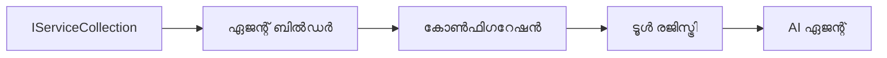

# 🎨 Azure OpenAI (Responses API) ഉപയോഗിച്ചുള്ള ഏജന്റിക് ഡിസൈൻ പാറ്റേണുകൾ (.NET)

## 📋 പഠന ലക്ഷ്യങ്ങൾ

ഈ ഉദാഹരണം Azure OpenAI (Responses API) ഇൻറഗ്രേഷനോടുള്ള .NET-ൽ Microsoft Agent Framework ഉപയോഗിച്ച് ബുദ്ധിമുട്ടുള്ള ഏജന്റുകൾ നിർമ്മിക്കുന്നതിന് എന്റർപ്രൈസ്-ഗ്രേഡ് ഡിസൈൻ പാറ്റേണുകൾ പ്രദർശിപ്പിക്കുന്നു. ഏജന്റുക്കൾ പ്രൊഡക്ഷൻ-രഡി, പരിപാലനക്ഷമവും സ്കേബിളുമായി ആക്കുന്നതിന് പ്രൊഫഷണൽ പാറ്റേണുകളും ആർക്കിടെക്ചറൽ സമീപനങ്ങളും നിങ്ങൾക്ക് പഠിക്കാം.

### എന്റർപ്രൈസ് ഡിസൈൻ പാറ്റേണുകൾ

- 🏭 **Factory Pattern**: ഡിപ്പൻഡൻസി ഇഞ്ചക്ഷനോട് കൂടിയ സ്റ്റാൻഡർഡൈസ്ഡ് ഏജന്റ് സൃഷ്ടി
- 🔧 **Builder Pattern**: സജ്ജീകരണത്തിനും ക്രമീകരണത്തിനും ഫ്‌ളുവന്റ് ഏജന്റ്
- 🧵 **Thread-Safe Patterns**: സഹകരിക്കുന്ന സംഭാഷണ നിയന്ത്രണം
- 📋 **Repository Pattern**: വ്യക്തമായി ടൂൾ-ഉപയോഗ ശേഷി നിയന്ത്രണം

## 🎯 .NET-സ്പെസിഫിക് ആർക്കിടെക്ചറൽ പ്രയോജനങ്ങൾ

### എന്റർപ്രൈസ് ഫീച്ചറുകൾ

- **Strong Typing**: കമ്പൈൽ-ടൈം സത്യതയും IntelliSense പിന്തുണയും
- **Dependency Injection**: ബിൽറ്റ്-ഇൻ DI കണ്ടെയ്‌നർ ഇന്റഗ്രേഷൻ
- **Configuration Management**: IConfiguration ഒപ്പം Options പാറ്റേണുകൾ
- **Async/Await**: ഫസ്റ്റ്-ക്ലാസ് അസിങ്ക്രോണസ് പ്രോഗ്രാമിംഗ് പിന്തുണ

### പ്രൊഡക്ഷൻ-രഡി പാറ്റേണുകൾ

- **Logging Integration**: ILogger ഒപ്പം സ്ട്രക്ചർഡ് ലോഗിംഗ് പിന്തുണ
- **Health Checks**: ബിൽറ്റ്-ഇൻ നിരീക്ഷണം ഒപ്പം ഡയഗ്നോസ്റ്റിക്സ്
- **Configuration Validation**: ഡേറ്റാ അനോട്ടേഷൻസോടു കൂടിയ ശക്തമായ ടൈപ്പിംഗ്
- **Error Handling**: സ്ട്രക്ചർഡ് എക്സെപ്ഷൻ മാനേജ്മെന്റ്

## 🔧 സാങ്കേതിക ആർക്കിടെക്ചർ

### കോർ .NET ഘടകങ്ങൾ

- **Microsoft.Extensions.AI**: ഏകീകൃത AI സർവീസ് അബ്സ്ട്രാക്ഷൻകൾ
- **Microsoft.Agents.AI**: എന്റർപ്രൈസ് ഏജന്റ് ഓർക്കസ്ട്രേഷൻ ഫ്രെയിംവർക്ക്
- **Azure OpenAI (Responses API)**: ഹൈ-പർഫോർമൻസ് API ക്ലയന്റ് പാറ്റേണുകൾ
- **Configuration System**: appsettings.json ഒപ്പം എൻവയോൺമെന്റ് ഇന്റഗ്രേഷൻ

### ഡിസൈൻ പാറ്റേൺ നടപ്പാക്കൽ



## 🏗️ പ്രദർശിപ്പിച്ച എന്റർപ്രൈസ് പാറ്റേണുകൾ

### 1. **സൃഷ്ടിമൂലക പാറ്റേണുകൾ**

- **Agent Factory**: സ്ഥിരതയുള്ള ക്രമീകരണത്തോടെ മദ്ധ്യസ്ഥ ഏജന്റ് സൃഷ്ടി
- **Builder Pattern**: സങ്കീർണ്ണമായ ഏജന്റ് ക്രമീകരണത്തിനുള്ള ഫ്‌ളുവന്റ് API
- **Singleton Pattern**: പങ്കിടുന്ന വിഭവങ്ങൾ അതിന്റെ ക്രമീകരണ നിയന്ത്രണം
- **Dependency Injection**: ലൂസ് കപ്പിലിംഗ് ആൻഡ് ടെസ്റ്റബിലിറ്റി

### 2. **പ്രവൃത്തിപരമായ പാറ്റേണുകൾ**

- **Strategy Pattern**: മാറാവുന്ന ടൂൾ നിർവഹണ രണതീരങ്ങൾ
- **Command Pattern**: നിഖിതമായി ഏജന്റ് പ്രവർത്തനങ്ങൾ ഉൾമുക്കി undo/redo
- **Observer Pattern**: ഇവന്റ്-ചാലിത ഏജന്റ് ലൈഫ്‌സൈക്കിൾ മാനേജ്മെന്റ്
- **Template Method**: സ്റ്റാൻഡർഡൈസ്ഡ് ഏജന്റ് നിർവഹണ പ്രവൃത്തി പ്രവാഹങ്ങൾ

### 3. **ഘടനാപരമായ പാറ്റേണുകൾ**

- **Adapter Pattern**: Azure OpenAI (Responses API) ഇന്റഗ്രേഷൻ ലെയർ
- **Decorator Pattern**: ഏജന്റ് ശേഷി വർദ്ധിപ്പിക്കൽ
- **Facade Pattern**: ലളിതമാക്കിയ ഏജന്റ് ഇടപെടൽ ഇന്റർഫേസുകൾ
- **Proxy Pattern**: പെർഫോർമൻസിനായി ലാസി ലോഡിംഗ് ഒപ്പം കാച്ചിംഗ്

## 📚 .NET ഡിസൈൻ തത്വങ്ങൾ

### SOLID സിദ്ധാന്തങ്ങൾ

- **Single Responsibility**: ഓരോ ഘടകത്തിനും ഒരു വ്യക്തമായ ഉദ്ദേശ്യം
- **Open/Closed**: മാറ്റങ്ങളില്ലാതെ വ്യാപകമാക്കാവുന്നത്
- **Liskov Substitution**: ഇന്റർഫേസ് അടിസ്ഥാനത്തിലുള്ള ടൂൾ നടപ്പാക്കലുകൾ
- **Interface Segregation**: കേന്ദ്രീകൃത, ഒത്തുചേരുന്ന ഇന്റർഫേസുകൾ
- **Dependency Inversion**: ആബ്സ്ട്രാക്ഷനുകളിൽ ആശ്രയിക്കുക, കോൺക്രീഷനുകളിൽ അല്ല

### ക്ലീൻ ആർക്കിടെക്ചർ

- **Domain Layer**: കോർ ഏജന്റ് ഒപ്പം ടൂൾ അബ്സ്ട്രാക്ഷനുകൾ
- **Application Layer**: ഏജന്റ് ഓർക്കസ്ട്രേഷൻ ഒപ്പം പ്രവൃത്തിപരമായ പ്രവാഹങ്ങൾ
- **Infrastructure Layer**: Azure OpenAI (Responses API) ഇന്റഗ്രേഷൻ ഒപ്പം ബാഹ്യ സേവനങ്ങൾ
- **Presentation Layer**: ഉപയോക്തൃ ഇടപെടൽ ഒപ്പം പ്രതികരണ ഫോർമാറ്റിങ്

## 🔒 എന്റർപ്രൈസ് പരിഗണനകൾ

### സുരക്ഷ

- **Credential Management**: IConfiguration ഉപയോഗിച്ച് സുരക്ഷിത API കീ കൈകാര്യം
- **Input Validation**: ശക്തമായ ടൈപ്പിങും ഡേറ്റാ അനോട്ടേഷൻ പരിശോധനയും
- **Output Sanitization**: സുരക്ഷിതമായ പ്രതികരണ പ്രോസസ്സിംഗും ഫിൽറ്ററിംഗും
- **Audit Logging**: സഗ്ഗ്രഹമായ പ്രവർത്തന ട്രാക്കിംഗ്

### പ്രകടനം

- **Async Patterns**: തടസ്സമില്ലാത്ത I/O പ്രവർത്തനങ്ങൾ
- **Connection Pooling**: ദക്ഷിണമായ HTTP ക്ലയന്റ് മാനേജ്മെന്റ്
- **Caching**: മെച്ചപ്പെട്ട പ്രകടനത്തിനായി പ്രതികരണമേൽക്കാളുകൾ
- **Resource Management**: ശരിയായ നശീകരണവും ക്ലീനപ്പും പാറ്റേണുകൾ

### സ്കേബിലിറ്റി

- **Thread Safety**: സഹകരിച്ചുള്ള ഏജന്റ് നിർവഹണ പിന്തുണ
- **Resource Pooling**: ദക്ഷിണമായ വിഭവ ഉപയോഗം
- **Load Management**: നിരക്ക് നിയന്ത്രണവും ബാക്ക്‌പ്രഷർ കൈകാര്യം
- **Monitoring**: പ്രകടന മെട്രിക്‌സ് ഒപ്പം ആരോഗ്യ പരിശോധനകൾ

## 🚀 പ്രൊഡക്ഷൻ ഡിപ്ലോയ്മെന്റ്

- **Configuration Management**: പരിതസ്ഥിതി-വിശിഷ്ട ക്രമീകരണങ്ങൾ
- **Logging Strategy**: കോറിലേഷൻ ID-കളോടുള്ള സ്ട്രക്ചർഡ് ലോഗിംഗ്
- **Error Handling**: ആഗോള എക്സെപ്ഷൻ ഹാൻഡ്ലിംഗ് ശരിയായ പുനരുദ്ധാരണത്തോടെ
- **Monitoring**: ആപ്ലിക്കേഷൻ ഇൻസൈറ്റ്സും പ്രകടന കൗണ്ടർസും
- **Testing**: യൂണിറ്റ് ടെസ്റ്റുകൾ, ഇന്റഗ്രേഷൻ ടെസ്റ്റുകളും ലോഡ് ടെസ്റ്റിങ്ങും പാറ്റേണുകൾ

.NET ഉപയോഗിച്ച് എന്റർപ്രൈസ് ഗ്രേഡ് ബുദ്ധിമുട്ടുള്ള ഏജന്റുകൾ നിർമ്മിക്കാൻ സജ്ജമാണോ? ശക്തമായ ഒരു ആർക്കിടെക്ചർ നിർമ്മിക്കാം! 🏢✨

## 🚀 തുടങ്ങിയെടുക്കാം

### മുൻകൂട്ടി ആവശ്യമുള്ളതു

- [.NET 10 SDK](https://dotnet.microsoft.com/download/dotnet/10.0) അല്ലെങ്കിൽ അതിന് മുകളിലായി
- Azure OpenAI സ്രോതസ്സ് ഒപ്പം മോഡൽ ഡിപ്ലോയ്മെന്റ് ഉൾപ്പെടുത്തിയ [Azure subscription](https://azure.microsoft.com/free/)
- [Azure CLI](https://learn.microsoft.com/cli/azure/install-azure-cli) — `az login` ഉപയോഗിച്ച് സൈൻ ഇൻ

### ആവശ്യമായ പരിതസ്ഥിതി വേരിയബിൾസ്

```bash
# zsh/bash
export AZURE_OPENAI_ENDPOINT=https://<your-resource>.openai.azure.com
export AZURE_OPENAI_DEPLOYMENT=gpt-5-mini
# തുടർന്ന് സൈൻ ഇൻ ചെയ്ത് AzureCliCredential ഒരു ടോക്കൺ ലഭിക്കാൻ അനുവദിക്കുക
az login
```

```powershell
# പവർഷെൽ
$env:AZURE_OPENAI_ENDPOINT = "https://<your-resource>.openai.azure.com"
$env:AZURE_OPENAI_DEPLOYMENT = "gpt-5-mini"
# അതിനു ശേഷം ഒപ്പുവെച്ചു AzureCliCredential ഒരു ടോകൺ നേടാൻ সক্ষমമാകട്ടെ
az login
```

### സാമ്പിൾ കോഡ്

കോഡ് ഉദാഹരണം പ്രവർത്തിപ്പിക്കാൻ,

```bash
# zsh/bash
chmod +x ./03-dotnet-agent-framework.cs
./03-dotnet-agent-framework.cs
```

അല്ലെങ്കിൽ dotnet CLI ഉപയോഗിച്ച്:

```bash
dotnet run ./03-dotnet-agent-framework.cs
```

പൂര്‍ണ്ണ കോഡ് കാണാൻ [`03-dotnet-agent-framework.cs`](../../../../03-agentic-design-patterns/code_samples/03-dotnet-agent-framework.cs) കാണുക.

```csharp
#!/usr/bin/dotnet run

#:package Microsoft.Extensions.AI@10.*
#:package Microsoft.Agents.AI.OpenAI@1.*-*
#:package Azure.AI.OpenAI@2.1.0
#:package Azure.Identity@1.13.1

using System.ComponentModel;

using Microsoft.Agents.AI;
using Microsoft.Extensions.AI;

using Azure.AI.OpenAI;
using Azure.Identity;

// Tool Function: Random Destination Generator
// This static method will be available to the agent as a callable tool
// The [Description] attribute helps the AI understand when to use this function
// This demonstrates how to create custom tools for AI agents
[Description("Provides a random vacation destination.")]
static string GetRandomDestination()
{
    // List of popular vacation destinations around the world
    // The agent will randomly select from these options
    var destinations = new List<string>
    {
        "Paris, France",
        "Tokyo, Japan",
        "New York City, USA",
        "Sydney, Australia",
        "Rome, Italy",
        "Barcelona, Spain",
        "Cape Town, South Africa",
        "Rio de Janeiro, Brazil",
        "Bangkok, Thailand",
        "Vancouver, Canada"
    };

    // Generate random index and return selected destination
    // Uses System.Random for simple random selection
    var random = new Random();
    int index = random.Next(destinations.Count);
    return destinations[index];
}

// Azure OpenAI with the Responses API (stable v1 endpoint). Sign in with `az login`.
var azureEndpoint = Environment.GetEnvironmentVariable("AZURE_OPENAI_ENDPOINT")
    ?? throw new InvalidOperationException("AZURE_OPENAI_ENDPOINT is not set.");
var deployment = Environment.GetEnvironmentVariable("AZURE_OPENAI_DEPLOYMENT") ?? "gpt-5-mini";

var azureClient = new AzureOpenAIClient(new Uri(azureEndpoint), new AzureCliCredential());

// Define Agent Identity and Comprehensive Instructions
// Agent name for identification and logging purposes
var AGENT_NAME = "TravelAgent";

// Detailed instructions that define the agent's personality, capabilities, and behavior
// This system prompt shapes how the agent responds and interacts with users
var AGENT_INSTRUCTIONS = """
You are a helpful AI Agent that can help plan vacations for customers.

Important: When users specify a destination, always plan for that location. Only suggest random destinations when the user hasn't specified a preference.

When the conversation begins, introduce yourself with this message:
"Hello! I'm your TravelAgent assistant. I can help plan vacations and suggest interesting destinations for you. Here are some things you can ask me:
1. Plan a day trip to a specific location
2. Suggest a random vacation destination
3. Find destinations with specific features (beaches, mountains, historical sites, etc.)
4. Plan an alternative trip if you don't like my first suggestion

What kind of trip would you like me to help you plan today?"

Always prioritize user preferences. If they mention a specific destination like "Bali" or "Paris," focus your planning on that location rather than suggesting alternatives.
""";

// Create AI Agent with Advanced Travel Planning Capabilities
// Get the Responses client for the deployment and create the AI agent
// Configure agent with name, detailed instructions, and available tools
// This demonstrates the .NET agent creation pattern with full configuration
AIAgent agent = azureClient
    .GetChatClient(deployment)
    .AsAIAgent(
        name: AGENT_NAME,
        instructions: AGENT_INSTRUCTIONS,
        tools: [AIFunctionFactory.Create(GetRandomDestination)]
    );

// Create New Conversation Session for Context Management
// Initialize a new conversation session to maintain context across multiple interactions
// Sessions enable the agent to remember previous exchanges and maintain conversational state
// This is essential for multi-turn conversations and contextual understanding
var session = await agent.CreateSessionAsync();

// Execute Agent: First Travel Planning Request
// Run the agent with an initial request that will likely trigger the random destination tool
// The agent will analyze the request, use the GetRandomDestination tool, and create an itinerary
// Using the session parameter maintains conversation context for subsequent interactions
await foreach (var update in agent.RunStreamingAsync("Plan me a day trip", session))
{
    await Task.Delay(10);
    Console.Write(update);
}

Console.WriteLine();

// Execute Agent: Follow-up Request with Context Awareness
// Demonstrate contextual conversation by referencing the previous response
// The agent remembers the previous destination suggestion and will provide an alternative
// This showcases the power of conversation sessions and contextual understanding in .NET agents
await foreach (var update in agent.RunStreamingAsync("I don't like that destination. Plan me another vacation.", session))
{
    await Task.Delay(10);
    Console.Write(update);
}
```

---

<!-- CO-OP TRANSLATOR DISCLAIMER START -->
**അറിയിപ്പ്**:
ഈ രേഖ AI പരിഭാഷാ സേവനം [Co-op Translator](https://github.com/Azure/co-op-translator) ഉപയോഗിച്ച് പരിഭാഷപ്പെടുത്തിയതാണ്. ഞങ്ങൾ കൃത്യതയ്ക്കായി ശ്രമിക്കുന്നുവെങ്കിലും, ഓട്ടോമേറ്റഡ് പരിഭാഷകളിൽ പിഴവുകൾ അല്ലെങ്കിൽ തെറ്റായ വിവരങ്ങൾ ഉണ്ടാകാൻ സാധ്യതയുണ്ട്. അതിന്റെ സ്വാഭാവിക ഭാഷയിലുള്ള അസൽ രേഖയാണ് പ്രാമാണികമായ ഉറവിടമായി പരിഗണിക്കേണ്ടത്. നിർണായകമായ വിവരങ്ങൾക്ക്, പ്രൊഫഷണൽ മനുഷ്യ പരിഭാഷ ശുപാർശ ചെയ്യുന്നു. ഈ പരിഭാഷ ഉപയോഗിച്ച് ഉണ്ടാകുന്ന തെറ്റിദ്ധാരണകൾ അല്ലെങ്കിൽ തെറ്റായ വ്യാഖ്യാനങ്ങൾക്കായി ഞങ്ങൾ ഉത്തരവാദികളല്ല.
<!-- CO-OP TRANSLATOR DISCLAIMER END -->