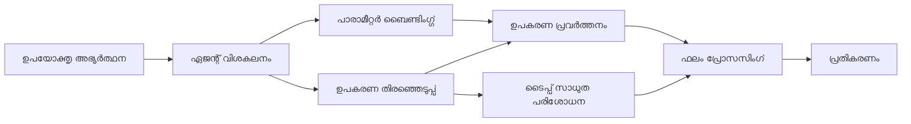

# 🛠️ Azure OpenAI (Responses API) (.NET) ഉപയോഗിച്ച് പുരോഗമിത ടൂൾ ഉപയോഗം

## 📋 പഠന ലക്ഷ്യങ്ങൾ

ഈ നോട്ട്‌ബുക്ക് മൈക്രോസോഫ്‌ട് ഏജന്റ് ഫ്രെയിംവർക്ക് .NET-ൽ Azure OpenAI (Responses API) ഉപയോഗിച്ച് എന്റർപ്രൈസ്-തരത്തിലുള്ള ടൂൾ ഇന്റഗ്രേഷൻ പാറ്റേണുകൾ പ്രദർശിപ്പിക്കുന്നു. നിങ്ങൾ C#-ന്റെ ശക്തമായ ടൈപ്പിംഗ്, .NET-ന്റെ എന്റർപ്രൈസ് സവിശേഷതകൾ ഉപയോഗിച്ച് ബഹുതരം പ്രത്യേക ടൂളുകൾ ഉൾപ്പെടുത്തുന്ന സങ്കീർണ്ണമായ ഏജന്റുകൾ നിർമ്മിക്കുന്നതെങ്ങനെ എന്ന് പഠിക്കും.

### നിങ്ങൾ പരിപൂർണമാക്കാൻ പോകുന്ന പുരോഗമിത ടൂൾ കഴിവുകൾ

- 🔧 **ബഹു-ടൂൾ ആർക്കിടെക്ചർ**: വ്യത്യസ്ത പ്രത്യേക കഴിവുകളുള്ള ഏജന്റുകൾ നിർമ്മിക്കുന്നത്
- 🎯 **ടൈപ്പ്-സേഫ് ടൂൾ എക്സിക്യൂഷൻ**: C#-ന്റെ പകർപ്പായ സമയത്തെ പരിശോധന ഉപയോഗിക്കുന്നു
- 📊 **എന്റർപ്രൈസ് ടൂൾ പാറ്റേണുകൾ**: ഉല്പന്നയോഗ്യമായ ടൂൾ രൂപകൽപനയും പിശക് കൈകാര്യം ചെയ്യലും
- 🔗 **ടൂൾ സംയോജനം**: സങ്കീർണ്ണ ബിസിനസ് പ്രവൃത്തികൾക്കാവശ്യമായ ടൂളുകൾ സംയോജിപ്പിക്കൽ

## 🎯 .NET ടൂൾ ആർക്കിടെക്ചർ നേട്ടങ്ങൾ

### എന്റർപ്രൈസ് ടൂൾ സവിശേഷതകൾ

- **കമ്പൈൽ-സമയം പരിശോധനം**: ശക്തമായ ടൈപ്പിംഗ് ടൂൾ പാരാമീറ്ററുകളുടെ ശരിയാനിയമം ഉറപ്പാക്കുന്നു
- **ഡിപ്പൻഡൻസി ഇൻജക്ഷൻ**: ടൂൾ മാനേജ്മെന്റിനു IoC കണ്ടെയ്നർ സമന്വയം
- **Async/Await പാറ്റേണുകൾ**: തടസ്സരഹിത ടൂൾ പ്രവർത്തനം, സ്രോതസ്സ് മാനേജ്മെന്റ്
- **രൂക്ഷമായ ലോഗിംഗ്**: ടൂൾ പ്രവർത്തന നിരീക്ഷണത്തിനുള്ള ഭേദഗതിയില്ലാത്ത ലോഗിംഗ് സമന്വയം

### ഉല്പന്നയോഗ്യമായ പാറ്റേണുകൾ

- **എക്‌സപ്ഷൻ കൈകാര്യം ചെയ്യൽ**: ടൈപ്പ് ചെയ്ത എക്‌സപ്ഷനുകൾ ഉപയോഗിച്ച സമഗ്ര പിശക് പരിപാലനം
- **സ്രോതസ് മാനേജ്മെന്റ്**: നിർദേശിച്ച ഡിസ്‌പോസ് പാറ്റേണുകളും മെമ്മറി മാനേജ്മെന്റും
- **പ്രകടന നിരീക്ഷണം**: ഉൾക്കൊള്ളുന്ന മെട്രിക്‌സുകളും പ്രകടന കൗണ്ടറുകളും
- **കൺഫിഗറേഷൻ മാനേജ്മെന്റ്**: സാധൂകരണം ചേരുന്ന ടൈപ്പ്-സേഫ് ക്രമീകരണം

## 🔧 സാങ്കേതിക ആർക്കിടെക്ചർ

### പ്രധാന .NET ടൂൾ ഘടകങ്ങൾ

- **Microsoft.Extensions.AI**: ഏകീകൃത ടൂൾ അബ്സ്ട്രാക്ഷൻ ലെയർ
- **Microsoft.Agents.AI**: എന്റർപ്രൈസ്-തരത്തിലുള്ള ടൂൾ ഓർക്കസ്ട്രേഷൻ
- **Azure OpenAI (Responses API)**: ഉയർന്ന പ്രകടനമുള്ള API ക്ലയന്റ് കണക്ഷൻ പൂൾസഹിതം

### ടൂൾ എക്സിക്യൂഷൻ പൈപ്ലൈൻ



## 🛠️ ടൂൾ വിഭാഗങ്ങളും പാറ്റേണുകളും

### 1. **ഡാറ്റ പ്രോസസ്സിംഗ് ടൂളുകൾ**

- **ഇൻപുട്ട് സാധൂകരണം**: ഡാറ്റ അനോട്ടേഷനുകളോടുകൂടെ ശക്തമായ ടൈപ്പിംഗ്
- **പരിവർത്തന പ്രവർത്തനങ്ങൾ**: ടൈപ്പ്-സേഫ് ഡാറ്റ പരിവർത്തനവും ഫോർമാറ്റിംഗും
- **ബിസിനസ് ലജിക്ക്**: ഡൊമൈൻ-നിർദ്ദിഷ്ട കണക്കുകൂട്ടലും വിശകലന ടൂളുകളും
- **ഔട്ട്പുട്ട് ഫോർമാറ്റിംഗ്**: ഘടനാപരമായ മറുപടി സൃഷ്ടിക്കൽ

### 2. **ഇന്റഗ്രേഷൻ ടൂളുകൾ**

- **API കണക്ടറുകൾ**: HttpClient ഉപയോഗിച്ച് RESTful സേവന ഇന്റഗ്രേഷൻ
- **ഡാറ്റാബേസ് ടൂളുകൾ**: ഡേറ്റാ ആക്സസ് വേണ്ടി Entity Framework ഇന്റഗ്രേഷൻ
- **ഫയൽ പ്രവർത്തനങ്ങൾ**: സാധൂകരണം ഉള്ള സുരക്ഷിത ഫയൽ സിസ്റ്റം പ്രവർത്തനങ്ങൾ
- **ബാഹ്യ സേവനങ്ങൾ**: മൂന്നാം পক্ষ സേവന ഇന്റഗ്രേഷൻ പാറ്റേണുകൾ

### 3. **ഉപകരണ ടൂളുകൾ**

- **വാചക പ്രോസസ്സിംഗ്**: സ്‌ട്രിംഗ് മാനിപ്പുലേഷൻ, ഫോർമാറ്റിംഗ് ഉപകരണങ്ങൾ
- **തീയതി/സമയം പ്രവർത്തനങ്ങൾ**: സംസ്കാരജ്ഞ യോഗ്യമായ തീയതി/സമയം കണക്കുകൂട്ടലുകൾ
- **ഗണിത ടൂളുകൾ**: കൃത്യതയുള്ള കണക്കുകൂട്ടലുകളും സ്റ്റാറ്റിസ്റ്റിക്കൽ പ്രവർത്തനങ്ങളും
- **സാധൂകരണം ടൂളുകൾ**: ബിസിനസ് നിയമ സാധൂകരണം, ഡാറ്റ പരിശോധന

ശക്തമായ, ടൈപ്പ്-സേഫ് ടൂൾ കഴിവുകളുള്ള എന്റർപ്രൈസ്-തരത്തിലുള്ള ഏജന്റുകൾ .NET-ൽ നിർമ്മിക്കാൻ tayari ആണോ? നമുക്ക് ചില പ്രൊഫഷണൽ-തരത്തിലുള്ള പരിഹാരങ്ങൾ ആർക്കിടെക്ചർ ചെയ്തു തുടങ്ങാം! 🏢⚡

## 🚀 ആരംഭിക്കുക

### മുൻ‌വശ്യങ്ങൾ

- [.NET 10 SDK](https://dotnet.microsoft.com/download/dotnet/10.0) അല്ലെങ്കിൽ അതിനുമുൾക്കു
- Azure OpenAI റിസോഴ്‌സും മോഡൽ ഡിപ്ലോയ്മെന്റും ഉള്ള [Azure subscription](https://azure.microsoft.com/free/)
- [Azure CLI](https://learn.microsoft.com/cli/azure/install-azure-cli) — `az login` ഉപയോഗിച്ച് സൈൻ ഇൻ ചെയ്യുക

### ആവശ്യമായ പരിസ്ഥിതി ഘടകങ്ങൾ

```bash
# zsh/bash
export AZURE_OPENAI_ENDPOINT=https://<your-resource>.openai.azure.com
export AZURE_OPENAI_DEPLOYMENT=gpt-5-mini
# AzureCliCredential ടോക്കൺ നേടാൻ ശേഷം സൈൻ ഇൻ ചെയ്യുക
az login
```

```powershell
# പവർഷെൽ
$env:AZURE_OPENAI_ENDPOINT = "https://<your-resource>.openai.azure.com"
$env:AZURE_OPENAI_DEPLOYMENT = "gpt-5-mini"
# പിന്നീട് AzureCliCredential ഒരു ടോക്കൺ ലഭിക്കാൻ ലോഗിൻ ചെയ്യുക
az login
```

### സാമ്പിൾ കോഡ്

കോഡ് ഉദാഹരണം പ്രവർത്തിപ്പിക്കാൻ,

```bash
# zsh/bash
chmod +x ./04-dotnet-agent-framework.cs
./04-dotnet-agent-framework.cs
```

അല്ലെങ്കിൽ dotnet CLI ഉപയോഗിച്ച്:

```bash
dotnet run ./04-dotnet-agent-framework.cs
```

പൂർണ്ണ കോഡിന് [`04-dotnet-agent-framework.cs`](../../../../04-tool-use/code_samples/04-dotnet-agent-framework.cs) കാണുക.

```csharp
#!/usr/bin/dotnet run

#:package Microsoft.Extensions.AI@10.*
#:package Microsoft.Agents.AI.OpenAI@1.*-*
#:package Azure.AI.OpenAI@2.1.0
#:package Azure.Identity@1.13.1

using System.ComponentModel;

using Microsoft.Agents.AI;
using Microsoft.Extensions.AI;

using Azure.AI.OpenAI;
using Azure.Identity;

// Tool Function: Random Destination Generator
// This static method will be available to the agent as a callable tool
// The [Description] attribute helps the AI understand when to use this function
// This demonstrates how to create custom tools for AI agents
[Description("Provides a random vacation destination.")]
static string GetRandomDestination()
{
    // List of popular vacation destinations around the world
    // The agent will randomly select from these options
    var destinations = new List<string>
    {
        "Paris, France",
        "Tokyo, Japan",
        "New York City, USA",
        "Sydney, Australia",
        "Rome, Italy",
        "Barcelona, Spain",
        "Cape Town, South Africa",
        "Rio de Janeiro, Brazil",
        "Bangkok, Thailand",
        "Vancouver, Canada"
    };

    // Generate random index and return selected destination
    // Uses System.Random for simple random selection
    var random = new Random();
    int index = random.Next(destinations.Count);
    return destinations[index];
}

// Azure OpenAI with the Responses API (stable v1 endpoint). Sign in with `az login`.
var azureEndpoint = Environment.GetEnvironmentVariable("AZURE_OPENAI_ENDPOINT")
    ?? throw new InvalidOperationException("AZURE_OPENAI_ENDPOINT is not set.");
var deployment = Environment.GetEnvironmentVariable("AZURE_OPENAI_DEPLOYMENT") ?? "gpt-5-mini";

var azureClient = new AzureOpenAIClient(new Uri(azureEndpoint), new AzureCliCredential());

// Define Agent Identity and Comprehensive Instructions
// Agent name for identification and logging purposes
var AGENT_NAME = "TravelAgent";

// Detailed instructions that define the agent's personality, capabilities, and behavior
// This system prompt shapes how the agent responds and interacts with users
var AGENT_INSTRUCTIONS = """
You are a helpful AI Agent that can help plan vacations for customers.

Important: When users specify a destination, always plan for that location. Only suggest random destinations when the user hasn't specified a preference.

When the conversation begins, introduce yourself with this message:
"Hello! I'm your TravelAgent assistant. I can help plan vacations and suggest interesting destinations for you. Here are some things you can ask me:
1. Plan a day trip to a specific location
2. Suggest a random vacation destination
3. Find destinations with specific features (beaches, mountains, historical sites, etc.)
4. Plan an alternative trip if you don't like my first suggestion

What kind of trip would you like me to help you plan today?"

Always prioritize user preferences. If they mention a specific destination like "Bali" or "Paris," focus your planning on that location rather than suggesting alternatives.
""";

// Create AI Agent with Advanced Travel Planning Capabilities
// Get the Responses client for the deployment and create the AI agent
// Configure agent with name, detailed instructions, and available tools
// This demonstrates the .NET agent creation pattern with full configuration
AIAgent agent = azureClient
    .GetChatClient(deployment)
    .AsAIAgent(
        name: AGENT_NAME,
        instructions: AGENT_INSTRUCTIONS,
        tools: [AIFunctionFactory.Create(GetRandomDestination)]
    );

// Create New Conversation Session for Context Management
// Initialize a new conversation session to maintain context across multiple interactions
// Sessions enable the agent to remember previous exchanges and maintain conversational state
// This is essential for multi-turn conversations and contextual understanding
await using var session = await agent.CreateSessionAsync();

// Execute Agent: First Travel Planning Request
// Run the agent with an initial request that will likely trigger the random destination tool
// The agent will analyze the request, use the GetRandomDestination tool, and create an itinerary
// Using the session parameter maintains conversation context for subsequent interactions
await foreach (var update in agent.RunStreamingAsync("Plan me a day trip", session))
{
    await Task.Delay(10);
    Console.Write(update);
}

Console.WriteLine();

// Execute Agent: Follow-up Request with Context Awareness
// Demonstrate contextual conversation by referencing the previous response
// The agent remembers the previous destination suggestion and will provide an alternative
// This showcases the power of conversation sessions and contextual understanding in .NET agents
await foreach (var update in agent.RunStreamingAsync("I don't like that destination. Plan me another vacation.", session))
{
    await Task.Delay(10);
    Console.Write(update);
}
```

---

<!-- CO-OP TRANSLATOR DISCLAIMER START -->
**അറിയിപ്പ്**:
ഈ രേഖ AI പരിഭാഷാ സേവനം [Co-op Translator](https://github.com/Azure/co-op-translator) ഉപയോഗിച്ച് പരിഭാഷപ്പെടുത്തിയതാണ്. ഞങ്ങൾ കൃത്യതയ്ക്കായി ശ്രമിക്കുന്നുവെങ്കിലും, ഓട്ടോമേറ്റഡ് പരിഭാഷകളിൽ പിഴവുകൾ അല്ലെങ്കിൽ തെറ്റായ വിവരങ്ങൾ ഉണ്ടാകാൻ സാധ്യതയുണ്ട്. അതിന്റെ സ്വാഭാവിക ഭാഷയിലുള്ള അസൽ രേഖയാണ് പ്രാമാണികമായ ഉറവിടമായി പരിഗണിക്കേണ്ടത്. നിർണായകമായ വിവരങ്ങൾക്ക്, പ്രൊഫഷണൽ മനുഷ്യ പരിഭാഷ ശുപാർശ ചെയ്യുന്നു. ഈ പരിഭാഷ ഉപയോഗിച്ച് ഉണ്ടാകുന്ന തെറ്റിദ്ധാരണകൾ അല്ലെങ്കിൽ തെറ്റായ വ്യാഖ്യാനങ്ങൾക്കായി ഞങ്ങൾ ഉത്തരവാദികളല്ല.
<!-- CO-OP TRANSLATOR DISCLAIMER END -->