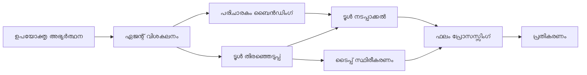

# 🛠️ Azure OpenAI (Responses API) ഉപയോഗിച്ച് ആധുനിക ടൂൾ ഉപയോഗം (.NET)

## 📋 പഠനലക്ഷ്യങ്ങൾ

ഈ നോട്ട്ബുക്ക് Azure OpenAI (Responses API) ഉപയോഗിച്ച് .NET-ൽ Microsoft Agent Framework ഉപയോഗിച്ച് എന്റർപ്രൈസ്-ഗ്രേഡ് ടൂൾ ഏകീകരണ മാതൃകകൾ പ്രദർശിപ്പിക്കുന്നു. നിങ്ങൾ C# ന്റെ ശക്തമായ ടൈപ്പിംഗും .NET ന്റെ എന്റർപ്രൈസ് ഫീച്ചറുകളും ഉപയോഗിച്ചു, მრავალ വിദഗ്‌ദ്ധ ടൂളുകളുള്ള പരിവിഷ്ട ഏജന്റുകളെ നിർമ്മിക്കാൻ പഠിക്കും.

### നിങ്ങൾ നടത്ത പഠിക്കുന്ന ആധുനിക ടൂൾ കഴിവുകൾ

- 🔧 **ബഹുരൂപ ടൂൾ അറകിടെക്ചർ**: വിവിധ വിദഗ്ധ കഴിവുകളുള്ള ഏജന്റുകൾ നിർമ്മിക്കൽ
- 🎯 **തരം-സുരക്ഷിത ടൂൾ നിർവഹണം**: C# ന്‍റെ കമ്പൈൽ സമയ പരിശോധന ഉപയോഗിക്കുക
- 📊 **എന്റർപ്രൈസ് ടൂൾ മാതൃകകൾ**: ഉൽപ്പാദനാനുകൂല ടൂൾ രൂപകൽപ്പനയും പിശക് കൈകാര്യം നിർവ്വഹണവും
- 🔗 **ടൂൾ സംയോജനം**: സങ്കീർണ്ണ ബിസിനസ് പ്രവാഹങ്ങൾക്കായി ടൂളുകൾ സംയോജിപ്പിക്കുക

## 🎯 .NET ടൂൾ അറകിടെക്ചർ ലാബ്ദ്യങ്ങൾ

### എന്റർപ്രൈസ് ടൂൾ ഫീച്ചറുകൾ

- **കമ്പൈൽ-സമയം പരിശോധന**: ശക്തമായ ടൈപ്പിംഗ് ടൂൾ പാരാമീറ്ററുകളുടെ ശരത്വം ഉറപ്പുവരുത്തുന്നു
- **ഡിപെൻഡൻസി ഇൻജക്ഷൻ**: ടൂൾ മാനേജ്മെന്റിനായി IoC കണ്ടയിനർ സമന്വയം
- **Async/Await മാതൃകകൾ**: പ്രാധാന്യമില്ലാതെ ടൂൾ പ്രവർത്തനങ്ങൾ നന്നായി నిర్వహിക്കൽ
- **സംരചിത ലോഗിംഗ്**: ടൂൾ നിർവഹണ നിരീക്ഷണത്തിനായി ഇൻബിൽറ്റ് ലോഗിംഗ് സംയോജനം

### ഉൽപ്പാദനാനുകൂല മാതൃകകൾ

- **എക്സ്പഷൻ കൈകാര്യം**: ടൈപ്പുള്ള പിശക് മാനേജ്‌മെന്റ് സമഗ്രമായി
- **റിസോഴ്‌സ് മാനേജ്മെന്റ്**: ശരിയായി ഒഴിവാക്കൽ മാതൃകകളും മെമ്മറി നിയന്ത്രണവും
- **പ്രവർത്തന നിരീക്ഷണം**: ഇൻബിൽറ്റ് മെട്രിക്കുകളും പ്രകടന കണക്കെടുപ്പുകളും
- **കോൺഫിഗറേഷൻ മാനേജ്മെന്റ്**: പരിശോധനയുള്ള തര-സുരക്ഷിത കോൺഫിഗറേഷൻ

## 🔧 സാങ്കേതിക അറകിടെക്ചർ

### കോർ .NET ടൂൾ ഘടകങ്ങൾ

- **Microsoft.Extensions.AI**: ഏകീകൃത ടൂൾ ആബ്രാക്ഷൻ ലെയർ
- **Microsoft.Agents.AI**: എന്റർപ്രൈസ്-ഗ്രേഡ് ടൂൾ ഓർക്കസ്ട്രേഷൻ
- **Azure OpenAI (Responses API)**: ഉയർന്ന പ്രകടന API ക്ലയന്റ് കണക്ഷൻ പൂലിംഗ് കൂടാതെ

### ടൂൾ നിർവഹണ പൈപ്പൈൻ



## 🛠️ ടൂൾ വർഗ്ഗങ്ങളും മാതൃകകളും

### 1. **ഡാറ്റ പ്രോസസ്സിംഗ് ടൂളുകൾ**

- **ഇൻപുട്ട് പരിശോധന**: ഡാറ്റ അനോട്ടേഷനുകളെയുള്ള ശക്തമായ ടൈപ്പിംഗ്
- **പരിവർത്തന പ്രവർത്തനങ്ങൾ**: തര-സുരക്ഷിത ഡാറ്റ പരിവർത്തനവും ഫോർമാറ്റിംഗും
- **ബിസിനസ് ലോജിക്ക്**: ഡൊമെയ്ൻ-സവിശേഷ കണക്കുകൂട്ടൽ, വിശകലന ടൂളുകൾ
- **ഔട്ട്പുട്ട് ഫോർമാറ്റിംഗ്**: സംരചിത പ്രതികരണം സൃഷ്ടിക്കൽ

### 2. **എക്സ്റ്റ്രാക്ഷൻ ടൂളുകൾ**

- **API കണക്ടറുകൾ**: HttpClient ഉപയോഗിച്ച് RESTful സേവന സംയോജനം
- **ഡാറ്റാബേസ് ടൂളുകൾ**: ഡാറ്റ ആക്സസ് വേണ്ട Entity Framework സംയോജനം
- **ഫയൽ പ്രവർത്തനങ്ങൾ**: പരിശോധനയോടെ സുരക്ഷിത ഫയൽ സിസ്റ്റം പ്രവർത്തനങ്ങൾ
- **ബാഹ്യ സേവനങ്ങൾ**: മൂന്നാം-കക്ഷി സേവന സംയോജനം മാതൃകകൾ

### 3. **ഉപകാരി ടൂളുകൾ**

- **ടെക്സ്റ്റ് പ്രോസസ്സിംഗ്**: സ്‌ട്രിംഗ്omanipുൾനെയും ഫോർമാറ്റിംഗും
- **തിയതി/സമയം പ്രവർത്തനങ്ങൾ**: സംസ്കാര നേർക്കാഴ്ചയുള്ള തീയതി/സമയം കണക്കുകൾ
- **ഗണിത ടൂളുകൾ**: കൃത്യത കണക്കുകൾ, സ്ഥിതിവിശേഷ പ്രവർത്തനങ്ങൾ
- **പരിശോധന ടൂളുകൾ**: ബിസിനസ് നിയമ പരിശോധനയും ഡാറ്റ സ്ഥിരീകരണവും

ശക്തമായ, തര-സുരക്ഷിത ടൂൾ കഴിവുകളുള്ള എന്റർപ്രൈസ്-ഗ്രേഡ് ഏജന്റുകൾ .NET ൽ നിർമ്മിക്കാൻ ഒരുക്കമാണോ? പ്രൊഫഷണൽ-ഗ്രേഡ് പരിഹാരങ്ങൾ രൂപകല്പന ചെയ്യാം! 🏢⚡

## 🚀 തുടക്കമിടാം

### മുൻ‌വശ്യങ്ങൾ

- [.NET 10 SDK](https://dotnet.microsoft.com/download/dotnet/10.0) അല്ലെങ്കിൽ അതിൽ മുകളിൽ
- Azure OpenAI വിഭവവും മോഡൽ വിനിയോഗവും ഉള്ള [Azure സബ്സ്ക്രിപ്ഷൻ](https://azure.microsoft.com/free/)
- [Azure CLI](https://learn.microsoft.com/cli/azure/install-azure-cli) — `az login` ഉപയോഗിച്ച് സൈൻ ഇൻ ചെയ്യുക

### ആവശ്യമായ പരിസ്ഥിതി ചാരങ്ങൾ

```bash
# zsh/bash
export AZURE_OPENAI_ENDPOINT=https://<your-resource>.openai.azure.com
export AZURE_OPENAI_DEPLOYMENT=gpt-4.1-mini
# AzureCliCredential ഒരു ടോക്കൺ നേടാൻ സൈനിന് ചെയ്യുക
az login
```

```powershell
# പവർഷെൽ
$env:AZURE_OPENAI_ENDPOINT = "https://<your-resource>.openai.azure.com"
$env:AZURE_OPENAI_DEPLOYMENT = "gpt-4.1-mini"
# പിന്നീട് സൈൻ ഇൻ ചെയ്യുക, അപ്പോഴേ AzureCliCredential ടോക്കൺ നേടാൻ കഴിയൂ
az login
```

### ഉദാഹരണ കോഡ്

കോഡ് ഉദാഹരണം പ്രവർത്തിപ്പിക്കാൻ,

```bash
# zsh/bash
chmod +x ./04-dotnet-agent-framework.cs
./04-dotnet-agent-framework.cs
```

അല്ലെങ്കിൽ dotnet CLI ഉപയോഗിച്ച്:

```bash
dotnet run ./04-dotnet-agent-framework.cs
```

സമ്പൂർണ്ണ കോഡ് കാണാൻ [`04-dotnet-agent-framework.cs`](../../../../04-tool-use/code_samples/04-dotnet-agent-framework.cs) നോക്കുക.

```csharp
#!/usr/bin/dotnet run

#:package Microsoft.Extensions.AI@10.*
#:package Microsoft.Agents.AI.OpenAI@1.*-*
#:package Azure.AI.OpenAI@2.1.0
#:package Azure.Identity@1.13.1

using System.ComponentModel;

using Microsoft.Agents.AI;
using Microsoft.Extensions.AI;

using Azure.AI.OpenAI;
using Azure.Identity;

// Tool Function: Random Destination Generator
// This static method will be available to the agent as a callable tool
// The [Description] attribute helps the AI understand when to use this function
// This demonstrates how to create custom tools for AI agents
[Description("Provides a random vacation destination.")]
static string GetRandomDestination()
{
    // List of popular vacation destinations around the world
    // The agent will randomly select from these options
    var destinations = new List<string>
    {
        "Paris, France",
        "Tokyo, Japan",
        "New York City, USA",
        "Sydney, Australia",
        "Rome, Italy",
        "Barcelona, Spain",
        "Cape Town, South Africa",
        "Rio de Janeiro, Brazil",
        "Bangkok, Thailand",
        "Vancouver, Canada"
    };

    // Generate random index and return selected destination
    // Uses System.Random for simple random selection
    var random = new Random();
    int index = random.Next(destinations.Count);
    return destinations[index];
}

// Azure OpenAI with the Responses API (stable v1 endpoint). Sign in with `az login`.
var azureEndpoint = Environment.GetEnvironmentVariable("AZURE_OPENAI_ENDPOINT")
    ?? throw new InvalidOperationException("AZURE_OPENAI_ENDPOINT is not set.");
var deployment = Environment.GetEnvironmentVariable("AZURE_OPENAI_DEPLOYMENT") ?? "gpt-4.1-mini";

var azureClient = new AzureOpenAIClient(new Uri(azureEndpoint), new AzureCliCredential());

// Define Agent Identity and Comprehensive Instructions
// Agent name for identification and logging purposes
var AGENT_NAME = "TravelAgent";

// Detailed instructions that define the agent's personality, capabilities, and behavior
// This system prompt shapes how the agent responds and interacts with users
var AGENT_INSTRUCTIONS = """
You are a helpful AI Agent that can help plan vacations for customers.

Important: When users specify a destination, always plan for that location. Only suggest random destinations when the user hasn't specified a preference.

When the conversation begins, introduce yourself with this message:
"Hello! I'm your TravelAgent assistant. I can help plan vacations and suggest interesting destinations for you. Here are some things you can ask me:
1. Plan a day trip to a specific location
2. Suggest a random vacation destination
3. Find destinations with specific features (beaches, mountains, historical sites, etc.)
4. Plan an alternative trip if you don't like my first suggestion

What kind of trip would you like me to help you plan today?"

Always prioritize user preferences. If they mention a specific destination like "Bali" or "Paris," focus your planning on that location rather than suggesting alternatives.
""";

// Create AI Agent with Advanced Travel Planning Capabilities
// Get the Responses client for the deployment and create the AI agent
// Configure agent with name, detailed instructions, and available tools
// This demonstrates the .NET agent creation pattern with full configuration
AIAgent agent = azureClient
    .GetChatClient(deployment)
    .AsAIAgent(
        name: AGENT_NAME,
        instructions: AGENT_INSTRUCTIONS,
        tools: [AIFunctionFactory.Create(GetRandomDestination)]
    );

// Create New Conversation Session for Context Management
// Initialize a new conversation session to maintain context across multiple interactions
// Sessions enable the agent to remember previous exchanges and maintain conversational state
// This is essential for multi-turn conversations and contextual understanding
await using var session = await agent.CreateSessionAsync();

// Execute Agent: First Travel Planning Request
// Run the agent with an initial request that will likely trigger the random destination tool
// The agent will analyze the request, use the GetRandomDestination tool, and create an itinerary
// Using the session parameter maintains conversation context for subsequent interactions
await foreach (var update in agent.RunStreamingAsync("Plan me a day trip", session))
{
    await Task.Delay(10);
    Console.Write(update);
}

Console.WriteLine();

// Execute Agent: Follow-up Request with Context Awareness
// Demonstrate contextual conversation by referencing the previous response
// The agent remembers the previous destination suggestion and will provide an alternative
// This showcases the power of conversation sessions and contextual understanding in .NET agents
await foreach (var update in agent.RunStreamingAsync("I don't like that destination. Plan me another vacation.", session))
{
    await Task.Delay(10);
    Console.Write(update);
}
```

---

<!-- CO-OP TRANSLATOR DISCLAIMER START -->
**അറിയിപ്പ്**:
ഈ രേഖ AI പരിഭാഷാ സേവനം [Co-op Translator](https://github.com/Azure/co-op-translator) ഉപയോഗിച്ച് പരിഭാഷപ്പെടുത്തിയതാണ്. ഞങ്ങൾ കൃത്യതയ്ക്കായി ശ്രമിക്കുന്നുവെങ്കിലും, ഓട്ടോമേറ്റഡ് പരിഭാഷകളിൽ പിഴവുകൾ അല്ലെങ്കിൽ തെറ്റായ വിവരങ്ങൾ ഉണ്ടാകാൻ സാധ്യതയുണ്ട്. അതിന്റെ സ്വാഭാവിക ഭാഷയിലുള്ള അസൽ രേഖയാണ് പ്രാമാണികമായ ഉറവിടമായി പരിഗണിക്കേണ്ടത്. നിർണായകമായ വിവരങ്ങൾക്ക്, പ്രൊഫഷണൽ മനുഷ്യ പരിഭാഷ ശുപാർശ ചെയ്യുന്നു. ഈ പരിഭാഷ ഉപയോഗിച്ച് ഉണ്ടാകുന്ന തെറ്റിദ്ധാരണകൾ അല്ലെങ്കിൽ തെറ്റായ വ്യാഖ്യാനങ്ങൾക്കായി ഞങ്ങൾ ഉത്തരവാദികളല്ല.
<!-- CO-OP TRANSLATOR DISCLAIMER END -->