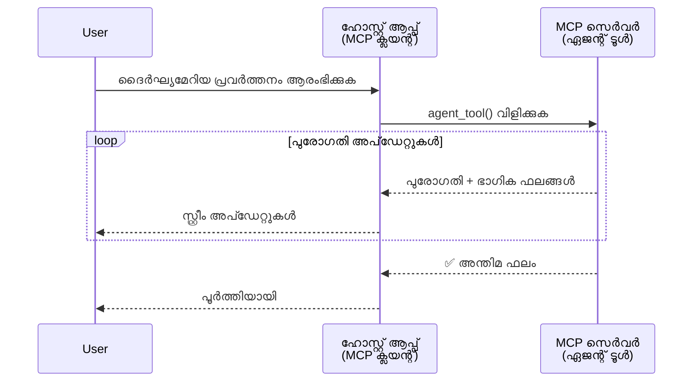
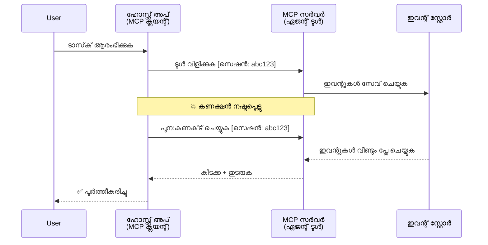
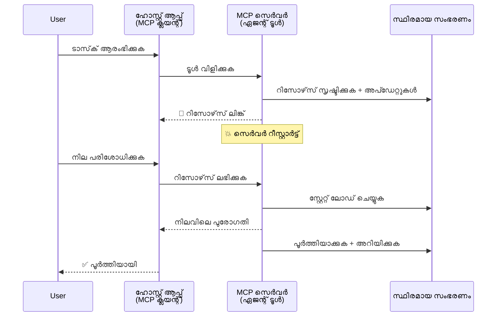
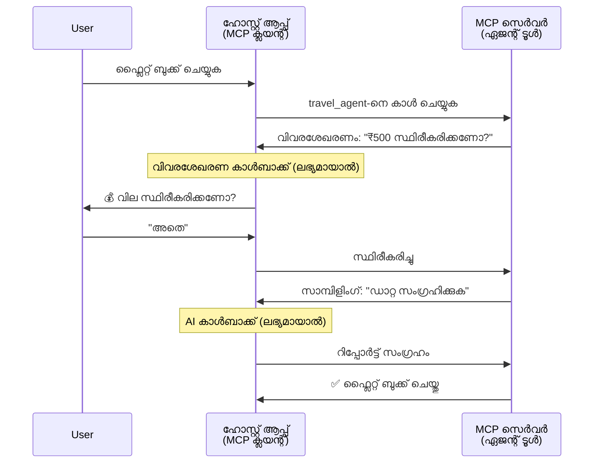
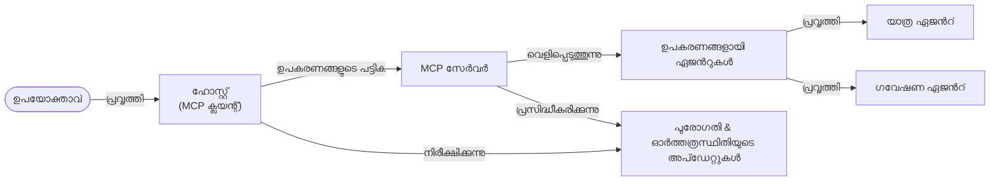

# MCP ഉപയോഗിച്ച് ഏജന്റ്-ഓടെ-ഏജന്റ് സംവാദ വ്യവസ്ഥകൾ നിർമ്മിക്കൽ

> TL;DR - MCPയിൽ ഏജന്റ്2ഏജന്റ് കമ്യൂണിക്കേഷൻ നിങ്ങൾക്ക് നിർമ്മിക്കാമോ? കഴിയും!

MCP ലിമിറ്റഡ്‌ ലാംഗ്വേജ് മോഡലുകൾക്ക് (LLMs) ബന്ധമേകാനുള്ള ഉദ്ദേശ്യം കടന്നു വളർന്നു. [റിസൂമബിൾ സ്റ്റ്രീംസ്](https://modelcontextprotocol.io/docs/concepts/transports#resumability-and-redelivery), [എലിസിറ്റേഷൻ](https://modelcontextprotocol.io/specification/2025-06-18/client/elicitation), [സാമ്പളിംഗ്](https://modelcontextprotocol.io/specification/2025-06-18/client/sampling), അറിയിപ്പുകൾ ([പ്രോഗ്രസ്](https://modelcontextprotocol.io/specification/2025-06-18/basic/utilities/progress) ഉള്ളത് ഉൾപ്പെടെ), ഇനി MCP സങ്കീർണ്ണമായ ഏജന്റ് തരം-ഏജന്റ് കമ്യൂണിക്കേഷൻ സിസ്റ്റങ്ങൾ നിർമ്മിക്കാൻ കരുത്തുറ്റ ഒരു അടിസ്ഥാനമാകുന്നു.

## ഏജന്റ്/ടൂൾ തെറ്റിദ്ധാരണ

ഏജൻറിക് പെരുമാറ്റങ്ങൾ ഉള്ള ഉപകരണങ്ങൾ പരിശോധിക്കുന്ന കൂടുതൽ ഡവലപ്പർമാർക്കിടയിൽ MCP അനുയോജ്യമല്ലെന്ന് പൊതുവായ തെറ്റിദ്ധാരണയുണ്ട്, പ്രത്യേകിച്ച് ആദ്യകാല MCP ടൂൾ ഉദാഹരണങ്ങൾ ലളിതമായ അഭ്യർത്ഥന-പ്രതികരണം മാതൃകകളിൽ മാത്രം കേന്ദ്രീകരിച്ചിരുന്നു.

ഈ കാഴ്ചപാട് പഴക്കം ചെന്നതാണ്. MCP വ്യവസ്ഥാപനത്തിൽ കിഴക്കൂട്ടി കഴിഞ്ഞ മാസങ്ങളിൽ വലിയ മെച്ചപ്പെടുത്തലുകൾ വന്നിട്ടുണ്ട്, കൂടാതെ ദീർഘകാല agentic പെരുമാറ്റം നിർമ്മിക്കാൻ വേണ്ട കഴിവുകൾ അടുത്തിരിക്കുന്നു:

- **സ്ട്രീമിംഗ് & ഭാഗിക ഫലം**: നിർവ്വഹണ സമയത്ത് യഥാർഥകാല പുരോഗതി അപ്ഡേറ്റുകൾ
- **റിസ്യൂമബിൾ**: ക്ലയന്റുകൾ ബന്ധം നഷ്ടപ്പെട്ട ശേഷം പുനരബന്ധം സ്ഥാപിച്ച് തുടരണം
- **ദൃഢത**: ഫലങ്ങൾ സെർവർ റീസ്റ്റാർട്ടുകൾക്കും നിലനിർത്തുന്നു (ഉദാഹരണം, റിസോഴ്‌സ് ലിങ്കുകൾ വഴി)
- **ബഹുഭാഗം സംഭാഷണം**: എലിസിറ്റേഷൻ, സാമ്പളിംഗ് ഉപയോഗിച്ച് നിർവ്വഹിക്കുന്നതിന്റെ നടുവിൽ ഇടയ്ക്കിടെ ഇടപഴകൽ

ഈ സവിശേഷതകൾ ചേർത്ത് കോംപ്ലക്സായ എജന്റിക്, ബഹുഏജന്റ് അപ്ലിക്കേഷനുകൾ MCP പ്രോട്ടോക്കോൾ വഴി പ്രയോഗിക്കാം.

ഉദാഹരണത്തിന്, MCP സെർവറിൽ ലഭ്യമായ ഒരു ടൂൾ "ഏജന്റ്" എന്നറിയിക്കും. അതായത് ഹോസ്റ്റ് അപ്ലിക്കേഷൻ MCP ക്ലയന്റ് ആയി പ്രവർത്തിക്കുകയും MCP സെർവറുമായി സമ്മേളനം സ്ഥാപിക്കുകയും ഏജന്റിനെ വിളിക്കുകയും ചെയ്യുന്നു.

## MCP ടൂൾ "ഏജന്റിക്" ആക്കുന്നത് എന്താണ്?

നടപ്പിലാക്കണമെന്നുള്ള മുൻപായി, ദീർഘകാല ഏജന്റുകൾക്ക് പിന്തുണ നൽകേണ്ട അടിസ്ഥാന സൗകര്യങ്ങൾ എന്താണെന്ന് നിശ്ചയിക്കാം.

> ഒരു ഏജന്റിനെ സ്വയം പ്രവർത്തനശേഷിയുള്ള സত্তയായി നിർവചിക്കാം, അത് ദീർഘസമയത്തോളം പ്രവർത്തിച്ച്, ബഹുദൂരം ഇടപെടലുകൾ അല്ലെങ്കിൽ യഥാർത്ഥകാല പ്രതികരണത്തിന്റെ അടിസ്ഥാനത്തിൽ ക്രമീകരണങ്ങൾ ചെയ്ത് സങ്കീർണ്ണമായ പ്രവർത്തനങ്ങൾ കൈകാര്യം ചെയ്യുന്നവ.

### 1. സ്ട്രീമിംഗ് & ഭാഗിക ഫലങ്ങൾ

പരമ്പരാഗത അഭ്യർത്ഥന-പ്രതികരണം മാതൃക ദൈർഘ്യമേറിയ ജോലികളിൽ ഫലപ്രദമല്ല. ഏജന്റുകൾ നൽകേണ്ടത്:

- യഥാർത്ഥകാല പുരോഗതി അപ്ഡേറ്റുകൾ
- ഇടത്തരം ഫലങ്ങൾ

**MCP പിന്തുണ**: റിസോഴ്‌സ് അപ്ഡേറ്റ് അറിയിപ്പുകൾ ഭാഗിക ഫലങ്ങളുടെ സ്ട്രീമിംഗിന് സഹായകരം, എന്നാൽ ഈ സംവിധാനം JSON-RPCയുടെ 1:1 അഭ്യർത്ഥന/പ്രതികരണം മാതൃകയുമായി കൂട്ടിയിടിക്കാതിരിക്കണം.

| സവിശേഷത                  | ഉപയോഗ കേസ്സ്                                                                                                                                                                   | MCP പിന്തുണ                                                                              |
| -------------------------- | --------------------------------------------------------------------------------------------------------------------------------------------------------------------------- | ---------------------------------------------------------------------------------------- |
| യഥാർത്ഥകാല പുരോഗതി അപ്ഡേറ്റുകൾ | ഉപയോക്താവ് കോഡ് ബെസ് മൈഗ്രേഷൻ ചുമതല ആവശ്യപ്പെടുന്നു. ഏജന്റ് പുരോഗതി സ്ട്രീം ചെയ്യുന്നു: "10% - ആശ്രിതങ്ങൾ വിശകലനം ചെയ്യുന്നു... 25% - ടൈപ്‌സ്‌ക്രിപ്റ്റ് ഫയലുകൾ പരിവർത്തനം ചെയ്യുന്നു... 50% - ഇറക്കുമതി അപ്ഡേറ്റ് ചെയ്യുന്നു..." | ✅ പുരോഗതി അറിയിപ്പുകൾ                                                                    |
| ഭാഗിക ഫലങ്ങൾ            | "ഒരു പുസ്തകം സൃഷ്ടിക്കാൻ" ചുമതല ഭാഗിക ഫലങ്ങൾ സ്ട്രീം ചെയ്യുന്നു, ഉദാ., 1) കഥികരണം ഫോർക്കുന്നു, 2) അദ്ധ്യായങ്ങളുടെ പട്ടിക, 3) ഓരോ അദ്ധ്യായവും പൂർത്തിയാക്കുമ്പോൾ. ഹോസ്റ്റ് പരിശോധിക്കും, റദ്ദാക്കും അല്ലെങ്കിൽ മറ്റുള്ളവർക്കു വഴിമാറും. | ✅ അറിയിപ്പുകളിൽ "വിദീർ‌ഘിപ്പിച്ച" ഭാഗിക ഫലങ്ങൾ ഉൾപ്പെടുത്തുന്നത് സാധ്യമാണ്, PR 383, 776 ൽ നിർദ്ദേശങ്ങൾ കാണുക                                        |

<div align="center" style="font-style: italic; font-size: 0.95em; margin-bottom: 0.5em;">
<strong>ആകെ ചിത്രം 1:</strong> ഈ ചിത്രത്തിൽ MCP ഏജന്റ് ദൈർഘ്യമേറിയ തുടർന്നുള്ള ചുമതലയിൽ യഥാർത്ഥകാല പുരോഗതി അപ്ഡേറ്റുകളും ഭാഗിക ഫലങ്ങളും ഹോസ്റ്റ് അപ്ലിക്കേഷനിലേക്ക് സ്ട്രീം ചെയ്യുന്ന പദ്ധതിയെ വ്യക്തമാക്കുന്നു, ഉപയോക്താവിനു യഥാർത്ഥകാല പ്രവർത്തന നിരീക്ഷണം സാധ്യമാക്കുന്നു.
</div>



### 2. റിസ്യൂമബിൾ

ഏജന്റുകൾ നെറ്റ്‌വർക്ക് ഇടപാടുകൾ വിശദമായി കൈകാര്യം ചെയ്തു:

- (ക്ലയന്റ്) ബന്ധം നഷ്ടപ്പെട്ട ശേഷം പുനരബന്ധം സ്ഥാപിക്കണം
- തുടർന്നു പോയ സ്ഥലം മുതലുടക്കണം (സന്ദേശം പുനരവതരണം)

**MCP പിന്തുണ**: MCP StreamableHTTP ട്രാൻസ്പോർട്ട് ഇപ്പോൾ സെഷൻ പുനരാരംഭവും സന്ദേശ പുനർവിതരണവും സെഷൻ ഐഡികൾക്കും അവസാന ഇവന്റ് ഐഡികൾക്കും ഉപയോഗിച്ച് പിന്തുണയ്ക്കുന്നു. ഇതിന് സെർവർ ഈവന്റ് സ്‌റ്റോർ നടപ്പാക്കണം, ക്ലയന്റ് പുനരബന്ധം സമയത്ത് ഇവന്റുകൾ വീണ്ടും പ്ലേ ചെയ്യാനായി.  
സമുദായ നിർദ്ദേശം(PR #975) ട്രാൻസ്പോർട്ട്-സ്വതന്ത്രമായ റിസൂമബിൾ സ്റ്റ്രീമുകൾ വിശദീകരിക്കുന്നു.

| സവിശേഷത   | ഉപയോഗ കേസ്സ്                                                                                                                                               | MCP പിന്തുണ                                                            |
| ---------- | ---------------------------------------------------------------------------------------------------------------------------------------------------------- | ---------------------------------------------------------------------- |
| റിസ്യൂമബിൾ  | ക്ലയന്റ് ദീർഘകാലത്തിലൊരു ചുമതല നടത്തുമ്പോൾ ബന്ധം മുറിഞ്ഞു. പുനരബന്ധം സ്ഥാപിക്കുമ്പോൾ നഷ്ടപ്പെട്ട ഇവന്റുകൾ വീണ്ടും പ്ലേ ചെയ്ത് സെഷൻ തുടരുമെന്ന് ഉറപ്പ്.                                      | ✅ സെഷൻ ഐഡികൾ, ഇവന്റ് റീപ്ലേ, ഇവന്റ് സ്‌റ്റോർ ഉള്ള StreamableHTTP   |

<div align="center" style="font-style: italic; font-size: 0.95em; margin-bottom: 0.5em;">
<strong>ആകെ ചിത്രം 2:</strong> MCPയുടെ StreamableHTTP ട്രാൻസ്പോർട്ട്, ഇവന്റ് സ്‌റ്റോർ സെഷൻ പുനരാരംഭം എങ്ങനെ സ്നേഹ്യമായി ആവർത്തിക്കാമെന്ന് കാണിക്കുന്നു: ക്ലയന്റ് ബന്ധം നഷ്ടപ്പെട്ടാൽ അത് പുനർബന്ധിപ്പിച്ച് നഷ്ടപ്പെട്ട ഇവന്റുകൾ വീണ്ടും പ്ലേ ചെയ്ത് പുരോഗതിവെട്ടാതെ ചുമതല തുടരാം.
</div>



### 3. ദൃഢത

ദീർഘകാല ഏജന്റുകൾക്ക് സ്ഥിരം സ്റ്റേറ്റ് ആവശ്യമാണ്:

- സെർവർ പുനരാരംഭങ്ങളെ ഫലങ്ങൾ അതിജീവിക്കും
- സ്റ്റാറ്റസ് ബഹിഷ്കൃതമായി ലഭ്യമാക്കാം
- സെഷനുകൾക്കിടയിലെ പുരോഗതി ട്രാക്ക് ചെയ്യാം

**MCP പിന്തുണ**: MCP ഇപ്പോൾ ടൂൾ കോൾസ്‌ക്കായി റിസോഴ്‌സ് ലിങ്ക് റിട്ടേൺ തരത്തിൽ പിന്തുണ നൽകുന്നു. ഇപ്പോൾ സാധാരണ മാതൃക ഒരു ടൂൾ റിസോഴ്‌സ് സൃഷ്ടിച്ച് ഉടനെ ഒരു റിസോഴ്‌സ് ലിങ്ക് റിട്ടേൺ ചെയ്യുകയാണ്. ടൂൾ പിന്നണിയിലായി ചുമതല മേൽനോട്ടം വഹിച്ച് റിസോഴ്‌സ് അപ്ഡേറ്റ് ചെയ്യാം. അതുവഴി, ക്ലയന്റ് ഭാഗിക അല്ലെങ്കിൽ പൂർണ്ണഫലങ്ങൾ ലഭിക്കാൻ റിസോഴ്‌സ് സ്റ്റേറ്റ് പരിശോധിക്കാം അല്ലെങ്കിൽ റിസോഴ്‌സ് അപ്ഡേറ്റുകൾക്കായി സബ്സ്ക്രൈബ് ചെയ്യാം.

ഇതിലെ ഒരു പരിമിതി - റിസോഴ്‌സുകൾക്ക് പോളിംഗ് ചെയ്യൽ അല്ലെങ്കിൽ അപ്ഡേറ്റ്‌ക്കായി സബ്സ്ക്രിപ്‌ഷൻ ക്ലോസ് ചെയ്‌തിരിക്കുമ്പോൾ സ്കെയിലിൽ ദോഷഫലങ്ങൾ ഉണ്ടാകാം. അതുകൊണ്ടുള്ള ഒരു തുടങ്ങി വരുന്ന സമുദായ നിർദ്ദേശവും(PR #992 ഉൾപ്പെടെ) സെർവർ വെബ്‌ഹുക്കുകൾ അല്ലെങ്കിൽ ട്രിഗറുകൾ വഴി ക്ലയന്റ്/ഹോസ്റ്റ് അപ്ലിക്കേഷനിൽ അപ്ഡേറ്റുകൾ അറിയിക്കാനുള്ള പരീക്ഷണവുമുണ്ട്.

| സവിശേഷത       | ഉപയോഗ കേസ്സ്                                                                                                                                                           | MCP പിന്തുണ                                                      |
| ------------ | ---------------------------------------------------------------------------------------------------------------------------------------------------------------------- | ---------------------------------------------------------------- |
| ദൃഢത         | ഡാറ്റ മൈഗ്രേഷൻ ചുമതലയിൽ സെർവർ ക്രാഷ് സംഭവിക്കുന്നു. ഫലങ്ങളും പുരോഗതിയും റീസ്റ്റാർട്ട് തർക്കം നിലനിർത്തുന്നു, ക്ലയന്റ് സ്റ്റാറ്റസ് പരിശോധിച്ച് സ്ഥിരതയുള്ള റിസോഴ്‌സ് വഴി തുടരുമാൻ കഴിയും. | ✅ സ്ഥിരം സംഭരണവും സ്റ്റാറ്റസ് അറിയിപ്പുകളും ഉള്ള റിസോഴ്‌സ് ലിങ്കുകൾ      |

ഇപ്പോൾ സാധാരണ രീതിയാണ് ഒരു ടൂൾ ഒരു റിസോഴ്‌സ് സൃഷ്ടിച്ച് ടൂൾ ഉടനെ റിസോഴ്‌സ് ലിങ്ക് റിട്ടേൺ ചെയ്യുന്നത്. ടൂൾ പിന്നണിയിൽ തുടരുന്ന ചുമതല കൈകാര്യം ചെയ്യുകയും ഈ റിസോഴ്‌സിൽ പുരോഗതി അപ്ഡേറ്റുകളും ഭാഗിക ഫലങ്ങളും ഉൾപ്പെടും. എത്രയും ആവശ്യമെങ്കിൽ റിസോഴ്‌സ് ഉള്ളടക്കം പുതുക്കുകയും ചെയ്യും.

<div align="center" style="font-style: italic; font-size: 0.95em; margin-bottom: 0.5em;">
<strong>ആകെ ചിത്രം 3:</strong> MCP ഏജന്റുകൾ സ്ഥിരമായ റിസോഴ്‌സുകളും സ്റ്റാറ്റസ് അറിയിപ്പുകളും ഉപയോഗിച്ച് ദൈർഘ്യമേറിയ ജോലികൾ സെർവർ റീസ്റ്റാർട്ടിന് ശേഷവും ജീവിച്ചു പോകുന്നുണ്ടെന്ന് കാണിക്കുന്നു, ക്ലയന്റ് പുരോഗതി പരിശോധിച്ച് ഫലങ്ങൾ പുനഃസ്വീകാരം സാധ്യമാക്കുന്നു.
</div>



### 4. ബഹು-ടേർൺ ഇടപെടലുകൾ

ഏജന്റുകൾക്ക് നിർവ്വഹണ നടുവിൽ അധിക വേണമെങ്കിൽ:

- മാനവ വ്യക്തീകരണം അല്ലെങ്കിൽ അംഗീകാരം
- സങ്കീർണ്ണ തീരുമാനങ്ങൾക്ക് AI സഹായം
- ഡൈനമിക് പരാമീറ്റർ ക്രമീകരണങ്ങൾ

**MCP പിന്തുണ**: എളുപ്പത്തിൽ സാമ്പളിംഗ് (AI ഇൻപുട്ടിന്) և എലിസിറ്റേഷൻ (മാനവ ഇൻപുട്ടിന്) വഴി.

| സവിശേഷത                 | ഉപയോഗ കേസ്സ്                                                                                                                                               | MCP പിന്തുണ                                      |
| ----------------------- | ---------------------------------------------------------------------------------------------------------------------------------------------------------- | ------------------------------------------------ |
| ബഹു-ടേർൺ ഇടപെടലുകൾ     | ട്രാവൽ ബുക്കിംഗ് ഏജന്റ് ഉപഭോക്താവിൽ വില സ്ഥിരീകരണം അഭ്യർത്ഥിച്ച്, ശേഷം AI-നോട് യാത്രാ ഡാറ്റ സംഗ്രഹിക്കാൻ പറഞ്ഞ് ബുക്കിംഗ് പൂർത്തിയാക്കുന്നു.                  | ✅ മാനവ ഇൻപുട്ടിന് എലിസിറ്റേഷൻ, AI ഇൻപുട്ടിന് സാമ്പളിംഗ്   |

<div align="center" style="font-style: italic; font-size: 0.95em; margin-bottom: 0.5em;">
<strong>ആകെ ചിത്രം 4:</strong> MCP ഏജന്റുകൾ midway ൽ ആക്റ്റീവായി മാനവൻറെ ഇൻപുട്ട് അഭ്യർത്ഥിക്കാമെന്നും AI സഹായം വേണമെങ്കിൽ ആവശ്യപ്പെടുകയും ബഹുഭാഗം പ്രവാഹം പിന്തുണയ്ക്കുമെന്ന് ഈ ചിത്രത്തിൽ കാണിക്കുന്നു, കണ്ണി സ്ഥിരീകരണങ്ങൾ മുതൽ സങ്കീർണ്ണമായ തീരുമാനമെടുക്കലുകൾ വരെ.
</div>



## MCPയിൽ ദീർഘകാല ഏജന്റുകൾ നടപ്പിലാക്കൽ - കോഡ് അവലോകനം

ഈ ലേഖനത്തിന്റെ ഭാഗമായി, MCP പൈത്തൺ SDK StreamableHTTP ട്രാൻസ്പോർട്ടോടുകൂടി സെഷൻ റിസംപ്ഷനും സന്ദേശ പുനർവിതരണവും സപോർട്ട് ചെയ്യുന്ന ദൈർഘ്യമേറിയ ഏജന്റുകൾക്ക് പൂർത്തി നടപ്പിലാക്കൽ ഉള്ള [കോഡ് റിപ്പോസിറ്ററി](https://github.com/victordibia/ai-tutorials/tree/main/MCP%20Agents) നാം നൽകുന്നു. MCP കഴിവുകൾ ജാർഖിയുടെ ഏജന്റ് പ്രവൃത്തികൾക്കായി എങ്ങനെ ചേർക്കാമെന്നും ഉദാഹരിച്ചു കാണിക്കുന്നു.

പ്രത്യേകിച്ച്, രണ്ട് മുഖ്യ ഏജന്റ് ടൂൾസുകൾ കൊണ്ട് ഒരു സെർവർ നടപ്പിലാക്കുന്നു:

- **ട്രാവൽ ഏജന്റ്** - എലിസിറ്റേഷൻ വഴി വില സ്ഥിരീകരണമുള്ള ടൂറ്ബുക്കിംഗ് സേവനം അനുകരിക്കുന്നു
- **ഗവേഷണ ഏജന്റ്** - സാമ്പളിംഗ് വഴി AI സഹായിച്ച സമരശങ്ങൾ നിർവഹിക്കുന്ന ഗവേഷണ പ്രവർത്തനങ്ങൾ

ഈ രണ്ടും യഥാർത്ഥകാല പുരോഗതി അപ്ഡേറ്റുകളും ഇടപെടൽ സ്ഥിരീകരണ സൗകര്യവും പൂർണ്ണ സെഷൻ പുനരാരംഭ ശേഷികളും കാണിക്കുന്നു.

### പ്രധാന നടപ്പിലാക്കൽ ആശയങ്ങൾ

താഴെ കാണുന്ന വകുപ്പ് MCP ഏജന്റ് നടപ്പിലാക്കലും ക്ലയന്റ്-സൈഡിൽ ഹോസ്റ്റ് നിയന്ത്രണവും വിശദീകരിക്കുന്നു:

#### സ്ട്രീമിംഗ് & പുരോഗതി അപ്ഡേറ്റുകൾ - യഥാർത്ഥകാല ജോബ് നില

സ്ട്രീമിംഗ് വഴി ഏജന്റുകൾ ദീർഘകാല ചുമതലയിൽ യഥാർത്ഥകാല പുരോഗതി വിവരങ്ങൾ നൽകുന്നു, ഉപയോക്താവിനുള്ള ഇടത്തരം ഫലങ്ങളും പ്രസ്തുത ജോലിയുടെ നില അറിയിക്കാം.

**സെർവർ നടപ്പിലാക്കൽ (ഏജന്റ് പുരോഗതി അറിയിപ്പുകൾ അയയ്ക്കുന്നത്):**

```python
# server/server.py മുതൽ - യാത്രാ ഏജൻറ് പുരോഗതി അപ്ഡേറ്റുകൾ അയക്കുന്നു
for i, step in enumerate(steps):
    await ctx.session.send_progress_notification(
        progress_token=ctx.request_id,
        progress=i * 25,
        total=100,
        message=step,
        related_request_id=str(ctx.request_id)
    )
    await anyio.sleep(2)  # പ്രവർത്തനം അനുകൃതമാക്കുക

# മറുവായി: വിശദമായ പടി.പിടി അപ്ഡേറ്റുകൾക്ക് സന്ദേശങ്ങൾ ലോഗുചെയ്യുക
await ctx.session.send_log_message(
    level="info",
    data=f"Processing step {current_step}/{steps} ({progress_percent}%)",
    logger="long_running_agent",
    related_request_id=ctx.request_id,
)
```

**ക്ലയന്റ് നടപ്പിലാക്കൽ (ഹോസ്റ്റ് പുരോഗതി അപ്ഡേറ്റുകൾ സ്വീകരിക്കുന്നു):**

```python
# client/client.py-ൽ നിന്ന് - ക്ലയന്റ് റിയൽ-ടൈം നോട്ടിഫിക്കേഷനുകൾ കൈകാര്യം ചെയ്യുന്നു
async def message_handler(message) -> None:
    if isinstance(message, types.ServerNotification):
        if isinstance(message.root, types.LoggingMessageNotification):
            console.print(f"📡 [dim]{message.root.params.data}[/dim]")
        elif isinstance(message.root, types.ProgressNotification):
            progress = message.root.params
            console.print(f"🔄 [yellow]{progress.message} ({progress.progress}/{progress.total})[/yellow]")

# സെഷൻ സൃഷ്ടിക്കുമ്പോൾ സന്ദേശ ഹാൻഡിലർ രജിസ്റ്റർ ചെയ്യുക
async with ClientSession(
    read_stream, write_stream,
    message_handler=message_handler
) as session:
```

#### എലിസിറ്റേഷൻ - ഉപയോക്താവിൽ നിന്ന് ഇൻപുട്ട് അഭ്യർത്ഥിക്കൽ

എലിസിറ്റേഷൻ വഴി ഏജന്റുകൾ നിർവ്വഹണ നടുവിൽ ഉപയോക്താവിന്റെ സ്ഥിരീകരണം, വ്യക്തീകരണം അല്ലെങ്കിൽ അംഗീകാരം തേടുന്നു. ഇത് ദീർഘകാല ജോലികളിൽ നിർബന്ധമാണ്.

**സെർവർ നടപ്പിലാക്കൽ (ഏജന്റ് സ്ഥിരീകരണം അഭ്യർത്ഥിക്കുന്നു):**

```python
# സെർവർ/server.py മുതൽ - യാത്ര ഏജന്റിന് വില സ്ഥിരീകരണം ആവശ്യപ്പെടുന്നു
elicit_result = await ctx.session.elicit(
    message=f"Please confirm the estimated price of $1200 for your trip to {destination}",
    requestedSchema=PriceConfirmationSchema.model_json_schema(),
    related_request_id=ctx.request_id,
)

if elicit_result and elicit_result.action == "accept":
    # ബുക്കിംഗ് തുടരണം
    logger.info(f"User confirmed price: {elicit_result.content}")
elif elicit_result and elicit_result.action == "decline":
    # ബുക്കിംഗ് റദ്ദാക്കുക
    booking_cancelled = True
```

**ക്ലയന്റ് നടപ്പിലാക്കൽ (ഹോസ്റ്റ് എലിസിറ്റേഷൻ കോൾബാക്ക് നൽകുന്നു):**

```python
# client/client.pyല്‍ നിന്നുള്ളത് - ക്ലയന്റ് കൈകാര്യം ചെയ്യുക elicitation അഭ്യര്‍ത്ഥനകള്‍
async def elicitation_callback(context, params):
    console.print(f"💬 Server is asking for confirmation:")
    console.print(f"   {params.message}")

    response = console.input("Do you accept? (y/n): ").strip().lower()

    if response in ['y', 'yes']:
        return types.ElicitResult(
            action="accept",
            content={"confirm": True, "notes": "Confirmed by user"}
        )
    else:
        return types.ElicitResult(
            action="decline",
            content={"confirm": False, "notes": "Declined by user"}
        )

# സെഷന്‍ സൃഷ്ടിക്കുമ്പോള്‍ callback രജിസ്റ്റര്‍ ചെയ്യുക
async with ClientSession(
    read_stream, write_stream,
    elicitation_callback=elicitation_callback
) as session:
```

#### സാമ്പളിംഗ് - AI സഹായം അഭ്യർത്ഥിക്കൽ

സാമ്പളിംഗ് വഴി ഏജന്റുകൾ നിർവ്വഹണത്തിനിടയിൽ സങ്കീർണ്ണ തീരുമാനങ്ങൾക്കോ ഉള്ളടക്ക രീതിയാക്കലിനോ എൽഎൽഎം സഹായം അഭ്യർത്ഥിക്കുന്നു. ഇത് മാനവ-എഐ സംയുക്ത പ്രവാഹങ്ങൾ സാധ്യമാക്കുന്നു.

**സെർവർ നടപ്പിലാക്കൽ (ഏജന്റ് AI സഹായം അഭ്യർത്ഥിക്കുന്നു):**

```python
# സെർവർ/server.py-ൽ നിന്ന് - ഗവേഷണ ഏജന്റ് AI സംഗ്രഹം അഭ്യർത്ഥിക്കുന്നു
sampling_result = await ctx.session.create_message(
    messages=[
        SamplingMessage(
            role="user",
            content=TextContent(type="text", text=f"Please summarize the key findings for research on: {topic}")
        )
    ],
    max_tokens=100,
    related_request_id=ctx.request_id,
)

if sampling_result and sampling_result.content:
    if sampling_result.content.type == "text":
        sampling_summary = sampling_result.content.text
        logger.info(f"Received sampling summary: {sampling_summary}")
```

**ക്ലയന്റ് നടപ്പിലാക്കൽ (ഹോസ്റ്റ് സാമ്പളിംഗ് കോൾബാക്ക് നൽകുന്നു):**

```python
# client/client.py നിന്ന് - ക്ലയന്റ് ഹാൻഡ്ലിംഗ് സാമ്പ്ലിംഗ് അഭ്യർത്ഥനകൾ
async def sampling_callback(context, params):
    message_text = params.messages[0].content.text if params.messages else 'No message'
    console.print(f"🧠 Server requested sampling: {message_text}")

    # ഒരു യഥാർത്ഥ അപ്ലിക്കേഷനിൽ, ഇത് ഒരു LLM API കോളുചെയ്യാം
    # ഡെമോ ആവശ്യങ്ങൾക്കായി, നാം ഒരു മാക് പ്രതികരണം നൽകുന്നു
    mock_response = "Based on current research, MCP has evolved significantly..."

    return types.CreateMessageResult(
        role="assistant",
        content=types.TextContent(type="text", text=mock_response),
        model="interactive-client",
        stopReason="endTurn"
    )

# സെഷൻ സൃഷ്ടിക്കുമ്പോൾ കോൾബാക്ക് രജിസ്റ്റർ ചെയ്യുക
async with ClientSession(
    read_stream, write_stream,
    sampling_callback=sampling_callback,
    elicitation_callback=elicitation_callback
) as session:
```

#### റിസ്യൂമബിൾ - ബന്ധം നഷ്ടപ്പെട്ടതിനുശേഷം സെഷൻ തുടർച്ച

റിസ്യൂമബിൾ ഉറപ്പാക്കുന്നത് ദീർഘകാല ഏജന്റ് ജോലികൾ, ക്ലയന്റ് ബന്ധം നഷ്ടപ്പെടുമ്പോഴും പുനരബന്ധത്തിനുശേഷം തുടർച്ചയായി പ്രവർത്തിക്കാൻ കഴിയും. ഇവന്റ് സ്റ്റോറുകളും റിസംപ്ഷൻ ടോകണുകളും സഹായിക്കുന്നു.

**ഇവന്റ് സ്റ്റോർ നടപ്പിലാക്കൽ (സെർവർ സെഷൻ നിക്ഷേപിക്കുന്നു):**

```python
# server/event_store.py ൽ നിന്ന് - ലളിതമായ ഇൻ-മെമ്മറി ഇവന്റ് സ്റ്റോർ
class SimpleEventStore(EventStore):
    def __init__(self):
        self._events: list[tuple[StreamId, EventId, JSONRPCMessage]] = []
        self._event_id_counter = 0

    async def store_event(self, stream_id: StreamId, message: JSONRPCMessage) -> EventId:
        """Store an event and return its ID."""
        self._event_id_counter += 1
        event_id = str(self._event_id_counter)
        self._events.append((stream_id, event_id, message))
        return event_id

    async def replay_events_after(self, last_event_id: EventId, send_callback: EventCallback) -> StreamId | None:
        """Replay events after the specified ID for resumption."""
        # അവസാനമായി അറിയപ്പെട്ട ഇവന്റിന് ശേഷം ഇവന്റുകൾ കണ്ടെത്തി അവ പുനരവലംബിക്കുക
        for _, event_id, message in self._events[start_index:]:
            await send_callback(EventMessage(message, event_id))

# server/server.py ൽ നിന്ന് - സെഷൻ മാനേജറിലേക്ക് ഇവന്റ് സ്റ്റോർ അയയ്ക്കുന്നു
def create_server_app(event_store: Optional[EventStore] = None) -> Starlette:
    server = ResumableServer()

    # പുനരാരംഭത്തിനായി ഇവന്റ് സ്റ്റോർ ഉപയോഗിച്ച് സെഷൻ മാനേജർ സൃഷ്ടിക്കുക
    session_manager = StreamableHTTPSessionManager(
        app=server,
        event_store=event_store,  # ഇവന്റ് സ്റ്റോർ സെഷൻ പുനരാരംഭം സാധ്യമാക്കുന്നു
        json_response=False,
        security_settings=security_settings,
    )

    return Starlette(routes=[Mount("/mcp", app=session_manager.handle_request)])

# ഉപയോഗം: ഇവന്റ് സ്റ്റോറുമായി പ്രാരംഭീകരിക്കുക
event_store = SimpleEventStore()
app = create_server_app(event_store)
```

**റിസംപ്ഷൻ ടോകൺ സഹിതം ക്ലയന്റ് മെറ്റാഡേറ്റാ (സുരക്ഷിതമായ സ്റ്റേറ്റ് ഉപയോഗിച്ച് പുനരബന്ധം):**

```python
# client/client.py ൽ നിന്നാണ് - മെറ്റാഡേറ്റയോടെ ക്ലയന്റ് റീസംപ്ഷൻ
if existing_tokens and existing_tokens.get("resumption_token"):
    # നിന്നെടുത്ത ഭാഗത്ത് തുടരുന്നതിനായി നിലവിലുളള റീസംപ്ഷൻ ടോക്കൺ ഉപയോഗിക്കുക
    metadata = ClientMessageMetadata(
        resumption_token=existing_tokens["resumption_token"],
    )
else:
    # റീസംപ്ഷൻ ടോക്കൺ ലഭിച്ചതിന് ശേഷം സേവ് ചെയ്യാനുള്ള കോൾബാക്ക് സൃഷ്ടിക്കുക
    def enhanced_callback(token: str):
        protocol_version = getattr(session, 'protocol_version', None)
        token_manager.save_tokens(session_id, token, protocol_version, command, args)

    metadata = ClientMessageMetadata(
        on_resumption_token_update=enhanced_callback,
    )

# റീസംപ്ഷൻ മെറ്റാഡേറ്റയുമായുള്ള അഭ്യർത്ഥന അയയ്ക്കുക
result = await session.send_request(
    types.ClientRequest(
        types.CallToolRequest(
            method="tools/call",
            params=types.CallToolRequestParams(name=command, arguments=args)
        )
    ),
    types.CallToolResult,
    metadata=metadata,
)
```

ഹോസ്റ്റ് അപേക്ഷ സെഷൻ ഐഡികൾ, റിസംപ്ഷൻ ടോകണുകൾ പ്രാദേശികമായി സൂക്ഷിച്ച്, പുരോഗതി നഷ്ടമാകാതെ സംഭവത്തെ പുനരബന്ധിക്ക നശിക്കുന്നു.

### കോഡ് ഓർഗനൈസേഷൻ

<div align="center" style="font-style: italic; font-size: 0.95em; margin-bottom: 0.5em;">
<strong>ആകെ ചിത്രം 5:</strong> MCP അടിസ്ഥാനമുള്ള ഏജന്റ് സിസ്റ്റം वास्तു ശില്പം
</div>



**പ്രധാന ഫയലുകൾ:**

- **`server/server.py`** - റിസ്യൂമബിൾ MCP സെർവർ, യാത്രാ-ഗവേഷണ ഏജന്റുകൾ, എലിസിറ്റേഷൻ, സാമ്പളിംഗ്, പുരോഗതി അപ്ഡേറ്റുകൾ കാണിക്കുന്നു
- **`client/client.py`** - ഇന്ററാക്ടീവ് ഹോസ്റ്റ് അപ്ലിക്കേഷൻ, റിസംപ്ഷൻ, കോൾബാക്ക് കൈകാര്യം ചെയ്യൽ, ടോക്കൺ മാനേജ്മെന്റ്
- **`server/event_store.py`** - സെഷൻ പുനരാരംഭവും സന്ദേശ പുനർവിതരണവും സാധ്യമാക്കുന്ന ഇവന്റ് സ്റ്റോർ നടപ്പിലാക്കൽ

## MCPയിൽ ബഹു-ഏജന്റ് കമ്യൂണിക്കേഷൻക്ക് വിപുലീകരണം

മുകളിൽ പറയുന്ന നടപ്പിലാക്കൽ കൂടുതൽ ബഹുഏജന്റ് സിസ്റ്റങ്ങളിൽ വിപുലീകരിക്കാം ഹോസ്റ്റ് അപ്ലിക്കേഷൻ ബുദ്ധിമുട്ടുകൾക്ക് അനുസൃതമായി:

- **ബുദ്ധിമുട്ടുള്ള ജോലിവിഭജനം**: ഹോസ്റ്റ് സങ്കീർണ്ണ ഉപഭോക്തൃ അഭ്യർത്ഥനകൾ വിശകലനം ചെയ്ത് വിവിധ വിദഗ്ധ ഏജന്റുകൾക്ക് ഉപജോലികളായി വിഭജിക്കുന്നു
- **ബഹുസെർവർ ഏകീകരണം**: ഹോസ്റ്റ് ബഹു MCP സെർവർകളുമായി ബന്ധം പുലർത്തുന്നു, ഓരോന്നും വ്യത്യസ്ത ഏജന്റ് കഴിവുകൾ നല്കുന്നു
- **ചുമതല സ്റ്റേറ്റ് മാനേജ്മെന്റ്**: ഹോസ്റ്റ് ബഹു സമകാലീന ഏജന്റ് ജോലികളുടെ പുരോഗതി ട്രാക്ക് ചെയ്യുന്നു, ആശ്രിതത്വങ്ങളും ക്രമീകരണങ്ങളും കൈകാര്യം ചെയ്യുന്നു
- **പ്രതിഷേധക്ഷമത & പുനർ ശ്രമങ്ങൾ**: ഹോസ്റ്റ് പരാജയങ്ങൾ കാണുന്നു, പുനർ ശ്രമ ലോജിക് നടപ്പിലാക്കുന്നു, ഏജന്റുകൾ ലഭ്യമല്ലാതെപോകുമ്പോൾ ജോലികൾ പുനർനിർദ്ദേശിക്കുന്നു
- **ഫലം സംയോജനം**: ഹോസ്റ്റ് ബഹു ഏജന്റുകളിൽ നിന്നുള്ള ഔട്ട്‌പുട്ടുകൾ ചേർത്ത് സമഗ്ര അന്തിമഫലം സൃഷ്ടിക്കുന്നു

ഹോസ്റ്റ് ലളിത ക്ലയന്റിൽ നിന്നു ബുദ്ധിമുട്ടുള്ള ഓർക്കസ്ട്രേറ്ററായി പരിണമിക്കുന്നു, MCP പ്രോട്ടോക്കോൾ അടിസ്ഥാനത്തിൽ വിതരണ ഏജന്റ് ശേഷികൾ ഏകോപിപ്പിക്കുന്നു.

## സമാപനം

MCPയുടെ മെച്ചപ്പെട്ട കഴിവുകൾ - റിസോഴ്‌സ് അറിയിപ്പുകൾ, എലിസിറ്റേഷൻ/സാമ്പളിംഗ്, റിസൂമബിൾ സ്ട്രീമുകൾ, സ്ഥിരം റിസോഴ്‌സുകൾ - സങ്കീർണ്ണമായ ഏജന്റ്-തരം-ഏജന്റ് സംഭാഷണങ്ങൾ സാധ്യമാക്കുന്നു, പ്രോട്ടോക്കോൾ ലളിതത്വം നിലനിർത്തുന്നു.

## ആരംഭിക്കാം

നിങ്ങളുടെ സ്വന്തം ഏജന്റ്2ഏജന്റ് സിസ്റ്റം നിർമ്മിക്കാം? ഈ ഘട്ടങ്ങൾ പിന്തുടരുക:

### 1. ഡെമോ ഓടിക്കൂ

```bash
# പുനരാരംഭത്തിനായി ഇവന്റ് സ്റ്റോർ ഉപയോഗിച്ച് സർവർ ആരംഭിക്കുക
python -m server.server --port 8006

# മറ്റൊരു ടെർമിനലിൽ ഇന്ററാക്ടീവ് ക്ലയന്റു പ്രവർത്തിപ്പിക്കുക
python -m client.client --url http://127.0.0.1:8006/mcp
```

**ഇന്ററാക്ടീവ് മോഡിൽ ലഭ്യമായ കമാൻഡുകൾ:**

- `travel_agent` - എലിസിറ്റേഷൻ മുഖേന വില സ്ഥിരീകരിച്ച് യാത്ര ബുക്ക് ചെയ്യുക
- `research_agent` - AI സഹായിച്ച സമരശങ്ങളോടെയാണ് ഗവണ്മെന്റ് ഗവേഷണം
- `list` - ലഭ്യമായ എല്ലാ ടൂളുകളും കാണിക്കുക
- `clean-tokens` - റിസംപ്ഷൻ ടോകണുകൾ മായ്ക്കുക
- `help` - വിശദമായ കമാൻഡ് സഹായം കാണിക്കുക
- `quit` - ക്ലയന്റ് നിന്നു പുറത്തുകടക്കുക

### 2. റിസംപ്ഷൻ കഴിവുകൾ പരീക്ഷിക്കുക

- ഒരു ദീർഘകാല ഏജന്റ് ആരംഭിക്കുക (ഉദാ., `travel_agent`)
- പ്രവർത്തനത്തിനിടെ ക്ലയന്റ് തകരാറ് സംഭവിച്ച് (Ctrl+C)
- ക്ലയന്റ് പുനഃപ്രാരംഭിക്കുക - അത് ഓട്ടോമാറ്റിക്കായി തുടർന്നെടുക്കും

### 3. അന്വഷിച്ച് വിപുലീകരിക്കുക

- **ഉദാഹരണങ്ങൾ പരിശോധിക്കുക**: ഈ [mcp-agents](https://github.com/victordibia/ai-tutorials/tree/main/MCP%20Agents) കാണുക
- **സമുദായംയിൽ ചേരുക**: MCP GitHub ചർച്ചകളിൽ പങ്കാളിയാകുക
- **പരീക്ഷണം നടത്തുക**: ലളിത ദൈർഘ്യമേറിയ കാഴ്ചപ്പാട് തുടങ്ങുകയും സ്ട്രീമിംഗ്, റിസൂമബിൾ, ബഹുഏജന്റ് ഏകോപനവും ചേർക്കുക

ഇത് MCP ടൂൾ അധിഷ്ഠിത ലളിതത്വത്തോടു കൂടി ബുദ്ധിമുട്ടുള്ള ഏജന്റ് പെരുമാറ്റങ്ങൾ എങ്ങനെ സാധ്യമാക്കുന്നുവെന്ന് കാണിക്കുന്നു.

പൊതുവായി MCP പ്രോട്ടോക്കോൾ സ്പെക് വേഗത്തിലുള്ള വളർച്ചയിൽ തുടരുന്നു; ഏറ്റവും പുതിയ അപ്ഡേറ്റുകൾക്കായി ഔദ്യോഗിക ഡോക്യുമെന്റേഷൻ സൈറ്റ് https://modelcontextprotocol.io/introduction സന്ദർശിക്കാൻ വായനക്കാരനെ ആഹ്വാനം ചെയ്യുന്നു.

---

<!-- CO-OP TRANSLATOR DISCLAIMER START -->
**അറിയിപ്പ്**:
ഈ രേഖ AI പരിഭാഷാ സേവനം [Co-op Translator](https://github.com/Azure/co-op-translator) ഉപയോഗിച്ച് പരിഭാഷപ്പെടുത്തിയതാണ്. ഞങ്ങൾ കൃത്യതയ്ക്കായി ശ്രമിക്കുന്നുവെങ്കിലും, ഓട്ടോമേറ്റഡ് പരിഭാഷകളിൽ പിഴവുകൾ അല്ലെങ്കിൽ തെറ്റായ വിവരങ്ങൾ ഉണ്ടാകാൻ സാധ്യതയുണ്ട്. അതിന്റെ സ്വാഭാവിക ഭാഷയിലുള്ള അസൽ രേഖയാണ് പ്രാമാണികമായ ഉറവിടമായി പരിഗണിക്കേണ്ടത്. നിർണായകമായ വിവരങ്ങൾക്ക്, പ്രൊഫഷണൽ മനുഷ്യ പരിഭാഷ ശുപാർശ ചെയ്യുന്നു. ഈ പരിഭാഷ ഉപയോഗിച്ച് ഉണ്ടാകുന്ന തെറ്റിദ്ധാരണകൾ അല്ലെങ്കിൽ തെറ്റായ വ്യാഖ്യാനങ്ങൾക്കായി ഞങ്ങൾ ഉത്തരവാദികളല്ല.
<!-- CO-OP TRANSLATOR DISCLAIMER END -->