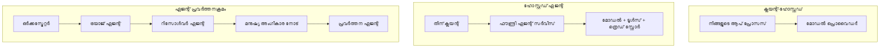
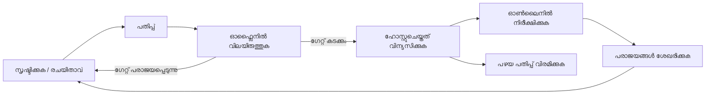
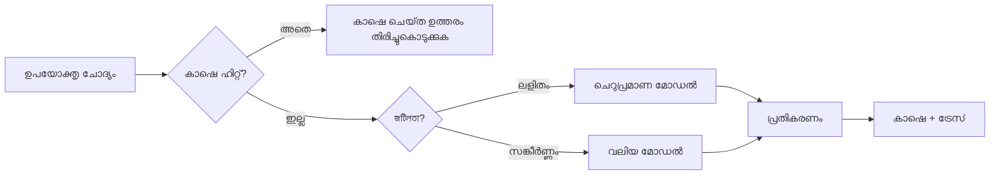
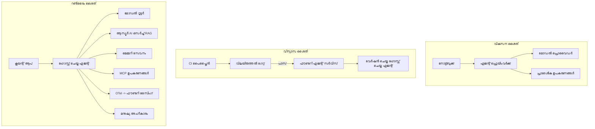

# Microsoft Foundry ഉപയോഗിച്ച് സ്‌കെയിലബിൾ ഏജന്റുകൾ വിനിയോഗിക്കൽ


ഈ കോഴ്സിൽ ഇതുവരെ നിങ്ങൾ ലാപ്‌ടോപിൽ, ഒരു നോട്ട്‌ബുക്കിനുള്ളിൽ, `az login` എതയും ചില എൻവയോൺമെന്റ് വേരിയബിളുകളും ഉപയോഗിച്ച് ഓടുന്ന ഏജന്റുകൾ നിർമ്മിച്ചു. പഠിക്കാൻ അത് ശരിയായ വഴിയാണ്. എന്നാൽ ആയിരക്കണക്കിന് ഉപഭോക്താക്കൾ രാവിലെ 3 മണിക്ക് ആശ്രയിക്കുന്ന ഒരു ഏജന്റിനെ ഓടിക്കാൻ അത് ശരിയായ മാർഗം അല്ല.

ഈ പാഠം "എന്റെ യന്ത്രത്തിൽ അത് പ്രവർത്തിക്കുന്നു" എന്നതും "പ്രൊഡക്ഷനിൽ വിശ്വസനീയമായി, കുറഞ്ഞ ചെലവിൽ അത് പ്രവർത്തിക്കുന്നു" എന്നതിനും ഇടയിലുള്ള വ്യത്യാസത്തെക്കുറിച്ചാണ്. Microsoft Foundryയും Microsoft Foundry Agent Serviceഉം ഉപയോഗിച്ച് ആ വിടവ് പൂരിപ്പിക്കുന്നു, കൂടാതെ ടൂളുകൾ, റിട്രീവൽ, മെമ്മറി, വിലയിരുത്തൽ, മോണിറ്ററിംഗ് എന്നിവയുള്ള ഒരു യഥാർത്ഥ ഉപഭോക്തൃ പിന്തുണ ഏജന്റിനെ നിർമ്മിക്കുന്ന വഴിയാണ് ഞങ്ങൾ ചെയ്യുന്നത്.

## പരിചയം

ഈ പാഠത്തിൽ ഉൾപ്പെടുന്നത്:

- ഒരു **പ്രോട്ടോടൈപ്പ് ഏജന്റും** ഒരു **വിനിയോഗിച്ച ഏജന്റും** തമ്മിലുള്ള വ്യത്യാസവും, മാറ്റം തികച്ചും മോഡലിനു പുറമേ ഉള്ള എല്ലാ ഘടകങ്ങളിലുമാണെന്ന് എന്തുകൊണ്ടെന്നും.
- ഏജന്റുകൾക്കായുള്ള **വിനിയോഗ മാതൃകകൾ**: ക്ലയന്റ്-ഹോസ്റ്റുചെയ്യപ്പെട്ടത്, സേവന-ഹോസ്റ്റുചെയ്യപ്പെട്ടത് (Hosted Agents), വര്‍ക്ക്‌ഫ്ലോ-ഓർക്കസ്ട്രേറ്റഡ്.
- Microsoft Foundry-യിൽ എൻ **ഏജന്റ് ജീവിതചക്രം** — സൃഷ്ടിക്കൽ, പതിപ്പ്, വിനിയോഗം, വിലയിരുത്തല്‍, നിരീക്ഷണം, വിരമിക്കൽ.
- **സ്‌കേലിംഗ് തന്ത്രങ്ങൾ**: മോഡൽ റൂട്ടിംഗ്, കാഷിംഗ്, സമാന്തരപ്രവൃത്തി, സ്റ്റേറ്റ്‌ലസ് ഡിസൈൻ.
- OpenTelemetry യും Foundry ട്രേസിംഗും ഉപയോഗിച്ചുള്ള **നിരീക്ഷണക്ഷമത**.
- മോഡൽ തിരഞ്ഞെടുപ്പ്, റൂട്ടിംഗ്, വിലയിരുത്തൽ ഗേറ്റുകൾ എന്നിവ മുഖേന **ചെലവ് മെച്ചപ്പെടുത്തല്‍**.
- **എന്റർಪ್ರൈസ് പരിഗണനകൾ**: ഗവൺൻസ്, മനുഷ്യ അംഗീകാരം, MCP സെർവറുകൾ പ്രൊഡക്ഷനിൽ സുരക്ഷിതമായി ഓടിക്കൽ.

## പഠന ലക്ഷ്യങ്ങൾ

ഈ പാഠം പൂർത്തിയാക്കിയ ശേഷം നിങ്ങൾക്ക് അറിയാൻ സാധിക്കും:

- ഒരു ഏജന്റ് വർക്‌ലോഡിനായി ശരിയായ വിനിയോഗ മാതൃക തിരഞ്ഞെടുക്കുന്നത്.
- ഏജന്റ് പതിപ്പിച്ചു, ഗവൺൻസ് ഉറപ്പാക്കി, നിരീക്ഷണക്ഷമതയുള്ള Microsoft Foundry Agent Service-ലേക്ക് വിനിയോഗിക്കൽ.
- ട്രേസിംഗിന് ഏജൻറെ ഇൻസ്ട്രുമെന്റേഷന്‍ നടത്തുകയും ഓരോ റിലീസിനും മുൻപ് പ്രവർത്തിക്കുന്ന ഒരു വിലയിരുത്തൽ പൈപ്പ്‌ലൈൻ വൈർ ചെയ്യുകയും ചെയ്യുക.
- സ്‌കെയിലിൽ ലാറ്റൻസി, ചെലവ് നിയന്ത്രിക്കാൻ മോഡൽ റൂട്ടിംഗ്, കാഷിംഗ് പ്രയോഗിക്കുക.
- ഉയർന്ന-റിസ്ക്ക് ക്രിയകൾക്കായി മനുഷ്യ അംഗീകാര ഗേറ്റ് ചേർക്കുക, MCP സെർവർ പ്രൊഡക്ഷൻ-സേഫായി സംയോജിപ്പിക്കുക.

## മുൻ‌അവശ്യങ്ങൾ

ഈ പാഠം ആരംഭിക്കുന്നതിന് മുമ്പ് നിങ്ങൾ ഈ പാഠങ്ങൾ പൂർത്തിയാക്കിയിരിക്കണം, കൂടാതെ ഈ വിഷയങ്ങളിൽ സുഖമായി പ്രവർത്തിക്കണം:

- [Microsoft Agent Framework](../14-microsoft-agent-framework/README.md) ഉപയോഗിച്ച് ഏജന്റുകൾ നിർമ്മിക്കൽ (പാഠം 14).
- [ടൂൾ ഉപയോഗം](../04-tool-use/README.md) (പാഠം 4) ಮತ್ತು [Agentic RAG](../05-agentic-rag/README.md) (പാഠം 5).
- [ഏജന്റ് മെമ്മറി](../13-agent-memory/README.md) (പാഠം 13) ಮತ್ತು [Agentic Protocols / MCP](../11-agentic-protocols/README.md) (പാഠം 11).
- [നിരീക്ഷണക്ഷമതയും വിലയിരുത്തലും](../10-ai-agents-production/README.md) (പാഠം 10) — ഈ പാഠം അതിന്റെ മേലിലാണ് നില്‍ക്കുന്നത്.

നിങ്ങൾക്ക് കൂടാതെ വേണം:

- കുറഞ്ഞത് ഒരു വിനിയോഗിച്ച ചേട്ട് മോഡൽ ഉള്ള **Azure സബ്സ്ക്രിപ്ഷൻ** കൂടാതെ **Microsoft Foundry പ്രോജക്ട്**.
- **Azure CLI** പ്രാമാണീകരണം ചെയ്ത(`az login`).
- Python 3.12+ ഉൾപ്പെടെയുള്ള പാക്കേജുകൾ, റീപൊസിറ്ററിയിലെ [`requirements.txt`](../../../requirements.txt).

## പ്രോട്ടോടൈപ്പിൽ നിന്ന് പ്രൊഡക്ഷനിലേക്ക്: യഥാർത്ഥ മാറ്റങ്ങൾ

ഒരു പ്രോട്ടോടൈപ്പ് ഏജന്റും പ്രൊഡക്ഷൻ ഏജന്റും ഒരേ മുള്ളിൽ ഓടുന്ന ലൂപ്പ് പങ്കുവെക്കുന്നു — ചിന്തിച്ചു, ടൂളുകൾ കോൾ ചെയ്യുക, പ്രതികരിക്കുക. ലൂപ്പിനുള്ളിൽ ചുറ്റിപ്പറ്റിയത് മാത്രം മാറുന്നു. മോഡൽ പ്രൊഡക്ഷൻ ഏജന്റിന്റെ ഏകദേശം 20% ആണ്; ബാക്കി 80% ഓപ്പറേഷണൽ ഘടനയാണ്.

| ആശങ്ക | പ്രോട്ടോടൈപ്പ് | പ്രൊഡക്ഷൻ |
| --- | --- | --- |
| **ഹോസ്റ്റിംഗ്** | നിങ്ങളുടെ നോട്ട്‌ബുക്കിൽ ഓടുന്നു | ഹോസ്റ്റുചെയ്ത സേവനമായി, പതിപ്പിച്ച് വിപുലപ്പെടുത്തിയിട്ടുണ്ട് |
| **ഐഡന്റിറ്റി** | നിങ്ങളുടെ `az login` ടോക്കൺ | സ്കോപ്പുചെയ്‌ത RBAC ഉള്ള മാനേജഡ് ഐഡന്റിറ്റി |
| **റാഷ്ട്രം** | ഇൻ-മെമ്മറി, റസ്റ്റാർട്ടിൽ നഷ്ടപ്പെടുന്നു | ബാഹ്യമായി (ത്രീഡ് സ്റ്റോർ, മെമ്മറി സേവനം) |
| **പ്രതിഷേധം** | ട്രെയ്‌സ്ബാക്ക് നിങ്ങൾ കാണുന്നു | റിട്രൈകൾ, ഫൾബാക്ക്, ഡെഡ്-ലെറ്റർ, അലർട്ടുകൾ |
| **ചെലവ്** | "ചില സെന്റുകൾ മാത്രം" | അഭ്യർത്ഥനയുടെ അടിസ്ഥാനത്തിൽ ട്രാക്ക് ചെയ്യുന്നു, റൂട്ടുചെയ്തു, കാഷ് ചെയ്‌തു, ബജറ്റ് ചെയ്യുന്നു |
| **ഗുണമേന്മ** | നിങ്ങളുടെ കണ്ണ് പരിശോധിക്കുന്നു | ഓരോ റിലീസിന് മുമ്പും സ്വയം വിലയിരുത്തുന്നു |
| **വിശ്വാസം** | നിങ്ങൾ ഓരോ പ്രവർത്തനവും അംഗീകരിക്കുന്നു | നയം + അപകടം ഉള്ള പ്രവർത്തനങ്ങൾക്ക് മനുഷ്യ ഇടപെടൽ |

ഈ പട്ടിക മനസ്സിലാക്കുക. താഴെ വരുന്ന ഓരോ വിഭാഗവും ഇതിലെ ഒരു വരിയ്ക്ക് സമാനമാണ്.

## ഏജന്റ് വിനിയോഗ മാതൃകകൾ

പൊതുവായി നിങ്ങൾ മൂന്ന് മാതൃകകൾ ഉപയോഗിക്കും, പലപ്പോഴും ചേർന്ന്.

### 1. ക്ലയന്റ്-ഹോസ്റ്റുചെയ്ത ഏജന്റുകൾ

ഏജന്റ് ഒബ്ജക്റ്റ് *നിങ്ങളുടെ* അപ്ലിക്കേഷൻ പ്രോസസിനുള്ളിലാണ്. നിങ്ങളുടെ കോഡ് മോഡൽ പ്രൊവൈഡറെ നേരിട്ട് വിളിക്കുന്നു; ചിന്തന ലൂപ്പ് നിങ്ങളുടെ സേവനത്തിലാകും. ഇതാണ് മുമ്പ് പാഠങ്ങളിൽ ചെയ്തതു.

- **ഉപയോഗിക്കുക** നിങ്ങൾക്ക് ലൂപ്പിനെ പൂർണ്ണമായി നിയന്ത്രിക്കാൻ, കസ്റ്റം മിഡിൽവെയർ ആവശ്യമായപ്പോൾ, അല്ലെങ്കിൽ ഏജന്റിനെ നിലവറിയBackend ൽ സേതപ്പെടുത്തുമ്പോൾ.
- **വാണിജ്യ ഹാനി**: സ്‌കെയിലിംഗ്, സ്റ്റേറ്റ്, റെസിലിയൻസ് നിങ്ങൾ തന്നെ സംരക്ഷിക്കണം.

### 2. ഹോസ്റ്റുചെയ്ത ഏജന്റുകൾ (Foundry Agent Service)

ഏജന്റ് മൈക്രോസോഫ്‌റ്റ് ഫൗണ്ട്രിയിൽ *റിസോഴ്സ് ആയി രജിസ്റ്റർ* ചെയ്യപ്പെടുന്നു. Foundry ചിന്തന ലൂപ്പ് ഹോസ്റ്റ് ചെയ്യുകയും, ത്രീഡുകൾ സൂക്ഷിക്കുകയും, കോൺറന്റ് സുരക്ഷയും RBACയും പ്രയോഗിക്കുകയും, ഏജന്റിനെ Foundry പോർട്ടലിൽ കാണിക്കുകയും ചെയ്യുന്നു. നിങ്ങളുടെ ആപ്പ് തൊട്ടു തീർക്കുന്ന ക്ലയന്റായി മാറി ത്രീഡുകൾ സൃഷ്ടിക്കുകയും പ്രതികരണങ്ങൾ വായിക്കുകയും ചെയ്യുന്നു.

- **ഉപയോഗിക്കുക** നിങ്ങൾ durability, ഇൻബിൽറ്റ് നിരീക്ഷണക്ഷമത, ഗവൺൻസ്, കുറഞ്ഞ ഓപ്പറേഷൻ പരിധി ആഗ്രഹിക്കുമ്പോൾ.
- **വാണിജ്യ ഹാനി**: മാനേജുചെയ്ത റൺടൈම් മാറി കുറഞ്ഞ-ലേവൽ നിയന്ത്രണം.

### 3. ഏജന്റ് വര്‍ക്ക്‌ഫ്ലോസ്

പല ഏജന്റുകളും (ടൂളുകളും) സെക്വൻഷ്യൽ ഘട്ടങ്ങൾ, ബ്രാഞ്ചിംഗ്, മനുഷ്യ അംഗീകാരം, ദീർഘകാല ചെക്ക്‌പോയിന്റുകൾ എന്നിവയുള്ള ഗ്രാഫായി ചേർന്ന് ക്രമീകരിക്കപ്പെടുന്നു. ഇത് Microsoft Agent Framework **Workflows** സവിശേഷതയുടെ വിനിയോഗ സ്‌കെയിലിലേക്കുള്ള പ്രയോഗമാണ്.

- **ഉപയോഗിക്കുക** ഒരൊറ്റ ജോലി പല പ്രത്യേക ഏജന്റുകൾ കയ്യിടുകയും മദ്ധ്യേ അംഗീകാരഘട്ടം ആവശ്യപ്പെടുമ്പോൾ.
- **വാണിജ്യ ഹാനി**: കൂടുതൽ ഭാഗങ്ങൾ, ഓർക്കസ്ട്രേഷൻ-നിരീക്ഷണക്ഷമത ആവശ്യമാണ്.



## Microsoft Foundry-യിലെ ഏജന്റ് ജീവിതചക്രം

ഏജന്റ് വിനിയോഗിക്കുന്നത് ഒരിക്കൽ മാത്രം `push` ചെയ്യുന്നതല്ല. ഇത് ഒരു ലൂപ്പാണ്, സോഫ്റ്റ്വെയർ റിലീസ് ചക്രം പോലെ കാണപ്പെടുന്നു കാരണം അതാണ്.



പ്രധാന ആശയം, [പാഠം 10](../10-ai-agents-production/README.md)-ൽ നിന്നാണ്: **ഓഫ്ലൈൻ വിലയിരുത്തൽ ഒരു ഗേറ്റ് ആണ്, ഒത്തു ചിന്തിച്ചിരിക്കുന്നതല്ല.** പുതിയ ഏജന്റ് പതിപ്പ് നിങ്ങളുടെ വിലയിരുത്തൽ ചട്ടങ്ങൾ കടന്നുപോകാതെ ഇറക്കാനില്ല. ഓൺലൈൻ നിരീക്ഷണം പിന്നീടൊരു ലോകത്തിലെ അശ്രദ്ധയാൽ നിങ്ങളുടെ ഓഫ്‌ലൈനു ടെസ്റ്റ് സെറ്റിലേക്ക് ഫീഡ് ചെയ്യുന്നു. അത് മുഴുവൻ ലൂപ്പാണ്.

## സ്‌കേലിംഗ് തന്ത്രങ്ങൾ

ഒരു ഏജന്റ് സ്‌കെയ്ൽ ചെയ്യുന്നത് സ്റ്റേറ്റ്‌ലസ് വെബ് API സ്‌കെയ്ൽ ചെയ്യുന്നതിൽ നിന്ന് വ്യത്യസ്തമാണ്, കാരണം ഓരോ അഭ്യർത്ഥനയും ഒരേ സമയം ചിലവേറിയ മോഡൽ, ടൂൾ കോൾ മടങ്ങിപ്പോക്ക് ചെയ്യാം. നാല് സാങ്കേതിക വിദ്യകൾ മിക്ക ഭാരം ഏറ്റെടുക്കുന്നു.

**സ്റ്റേറ്റ്‌ലസ് അഭ്യർത്ഥന കൈകാര്യം ചെയ്യൽ.** ഓരോ യൂസറുടെയും സ്റ്റേറ്റ് പ്രോസസ്സ് മെമ്മറിയിൽ സൂക്ഷിക്കരുത്. സംഭാഷണ ത്രീഡുകൾ Foundry ത്രീഡ് സ്റ്റോർ അല്ലെങ്കിൽ മെമ്മറി സേവനത്തിൽ സ്ഥിരമാക്കി ഏത് ഇൻസ്റ്റൻസ് അഭ്യർത്ഥന കൈകാര്യം ചെയ്യാനും കഴിയും. ഇതുവഴിയാണ് നിങ്ങൾ ഹൊറിസൊൻറലി സ്‌കെയ്ൽ ചെയ്യുന്നത് — ഇൻസ്റ്റൻസുകൾ കൂട്ടി, സ്റ്റിക്കി സെഷനുകൾ ഇല്ലാതെ.

**മോഡൽ റൂട്ടിംഗ്.** ഓരോ അഭ്യർത്ഥനക്കും നിങ്ങളുടെ ഏറ്റവും ശക്തമായ (അതേ സമയം ഏറ്റവും ചെലവേറിയ) മോഡലും ആവശ്യമില്ല. ലളിതമായ അഭ്യർത്ഥനകൾ — ഉദ്ദേശ്യ വർഗ്ഗീകരണം, ചെറുതായുള്ള വാസ്തവ ഉത്തരം — ചെറിയ, വേഗത്തിലുള്ള മോഡലിലേക്ക് റൂട്ടുചെയ്യുക, യഥാർത്ഥ ചിന്തനത്തിനായി വലിയ മോഡൽ മാറ്റിയിരിക്കുക. Foundry-യുടെ **Model Router** ഇത് ചെയ്യുന്നു, അല്ലെങ്കിൽ നിങ്ങൾ തന്നെ ലളിതമായ ക്ലാസിഫയർ നിർമിക്കാം. നിങ്ങൾ ലാബിൽ DIY പതിപ്പ് നിർമ്മിക്കും.

**പ്രതികരണ കാഷിംഗ്.** ചില പിന്തുണാ ചോദ്യങ്ങൾ ഏകദേശം സമാനമാണ് ("എങ്ങിനെയാണ് പാസ്‌വേഡ് റീസെറ്റ് ചെയ്യുന്നത്?"). സാധാരണ ചോദ്യങ്ങൾക്ക് ഉത്തരം കാഷ് ചെയ്ത് മോഡലിനെ തൊടാതെ സേർവ് ചെയ്യുക. കാഷ് ഹിറ്റ് നിരക്ക് ചെറുതായാലും ചെലവ്, ലാറ്റൻസി കുറയ്ക്കുന്നു.

**സമാന്തര പ്രോസസ്സിംഗ്, ബാക്ക്പ്രഷർ.** മോഡൽ പ്രൊവൈഡറും റേറ്റു പരിധികൾ ഉണ്ട്. നിങ്ങളുടെ concurrency നിയന്ത്രിക്കുക, എക്സ്പൊണീഷ്യൽ ബാക്ക്ഓഫുമായുള്ള റിട്രൈകൾ ഉപയോഗിക്കുക, നിശബ്ദമായി പരാജയപ്പെടുക (ക്യൂടിവായ "നാം അതിൽ പ്രവർത്തിക്കുന്നു" പ്രകാശനം 500 എന്നാര്ധ്യമാക്കുന്ന തകരാറിനെക്കാൾ മികച്ചതാണ്).



## പ്രൊഡക്ഷനിലെ നിരീക്ഷണക്ഷമത

നിങ്ങൾ ഇതു കാണാതെ പ്രവർത്തിപ്പിക്കാൻ കഴിയില്ല. പാഠം 10-ൽ വിവരിച്ചതുപോലെ, Microsoft Agent Framework സ്വരാജ്യമായി **OpenTelemetry** ട്രേസുകൾ പുറപ്പെടുവിക്കുന്നു — ഓരോ മോഡൽ കോൾ, ടൂൾ ഇൻവൊക്കേഷൻ, ഓർക്കസ്ട്രേഷൻ ഘട്ടം ഒരു സ്പാനായി മാറുന്നു. പ്രൊഡക്ഷനിൽ ഈ സ്പാനുകൾ Microsoft Foundry-യിലേയ്ക്ക് (അല്ലെങ്കിൽ ഏതു OTel-സമാനമായ ബാക്ക്‌എൻഡിലേയ്ക്കും) നയിക്കുന്നു, അതുവഴി നിങ്ങൾക്ക്:

- ഒരു ഉപഭോക്തൃ പരാതിയ്ക്ക് എല്ലാ മോഡലുകളും ടൂളുകളും ഉൾപ്പടെ ആറ് വരെയുള്ള ട്രേസ് ചെയ്യുക.
- സമയംകഴിഞ്ഞുള്ള p50/p95 ലാറ്റൻസി, വിവരങ്ങൾ അഭ്യർത്ഥന പ്രകാരം കാണുക.
- ഉപയോക്താക്കൾക്ക് (അല്ലെങ്കിൽ ഫിനാൻസ് ടീം) മുൻപായി പിഴവുകൾക്കും ചെലവ് അനോമലികൾക്കും അലർട്ട് നൽകുക.

```python
from agent_framework.observability import get_tracer

tracer = get_tracer()

with tracer.start_as_current_span("support_request") as span:
    span.set_attribute("customer.tier", "enterprise")
    span.set_attribute("routed.model", "gpt-4.1-mini")
    # ഈ സ്പാനിൽ ഏജന്റ് എക്സിക്യൂഷൻ സ്വയം പിന്‍നോട്ടം ചെയ്യപ്പെടുന്നു
```

`customer.tier`നും `routed.model`നും പോലുള്ള ഗുണനിലവാരങ്ങൾ ഒരു ട്രേസുകളുടെ മതിൽ ഉത്തരം നൽകാനുള്ള ചോദ്യങ്ങളായി മാറ്റുന്നു ("എന്റർപ്രൈസ് ഉപഭോക്താക്കൾക്ക് ചെറിയ മോഡലിലേക്ക് കൂടെപ്പൊക്കുന്നത് വളരെവാറുള്ളതാണോ?").

## ചെലവു മെച്ചപ്പെടുത്തൽ

പ്രൊഡക്ഷൻ ഏജന്റുകളിൽ ചെലവ് ടോക്കൺസ് പ്രകാരം നിർണ്ണയിക്കപ്പെടുന്നു. മൂന്നു ലെവർസ്, പ്രാധാന്യമനുസരിച്ച്:

1. **ശരിയായ വലുപ്പത്തിലുള്ള മോഡൽ തിരഞ്ഞെടുക്കുക.** നിങ്ങളുടെ വിലയിരുത്തൽ ഗേറ്റ് കടന്നുപോകുന്ന ചെറുതായ മോഡൽ വളരെ സാധാരണയായി വലിയ മോഡലിനേക്കാൾ കൂടുതൽ ചെലവു കുറഞ്ഞതാണ്. വലുതായ മോഡൽ പുറത്തുവിടൽ മുൻപായി ചെറിയ മോഡൽ മതിയെന്ന് തെളിയിക്കാൻ വിലയിരുത്തൽ ഉപയോഗിക്കുക.
2. **സങ്കീർണ്ണത അനുസരിച്ചു റൂട്ടുചെയ്യുക.** മുകളിൽ പറഞ്ഞതുപോലെ — വലിയ മോഡൽ ചാഞ്ഞു ചിന്തിക്കേണ്ട അഭ്യർത്ഥനകൾക്കു മാത്രം ചെലവു നൽകുക.
3. **ആഗ്രോസീവ് കാഷിംഗ്.** നിങ്ങൾ ഒരിക്കലും ചെയ്യുന്നില്ലാത്ത മോഡൽ കോൾ ഏറ്റവും വിലക്കുറഞ്ഞതാണ്.

വിലയിരുത്തൽ ഗേറ്റുകളും ചെലവ് നിയന്ത്രണവുമാണ് ഒരേ നൈപുണ്യം രണ്ട് ഭാഗത്ത് നിന്നും നോക്കുന്നത്: വിലയിരുത്തൽ നിങ്ങൾക്ക് *ഗുണമേന്മയുടെ നിലമേൽപ്പാടും* പറയുന്നു, റൂട്ടിംഗ്, കാഷിംഗ് ചെലവ് നില താഴെയായി ഇಡುವുണ്ട്.

## എന്റർപ്രൈസ് വിനിയോഗ പരിഗണനകൾ

**ഗവൺൻസ്.** ഹോസ്റ്റുചെയ്ത ഏജന്റുകൾ Foundry-യുടെ RBAC, കോൺറന്റ് സുരക്ഷ, ഓഡിറ്റ് ലോഗിംഗ് ഉരുത്തിരിയ്ക്കുന്നു. ഓരോ ഏജന്റിനും അതിന്റെ കുറഞ്ഞ അവകാശവും(scoped) മാനേജ്ഡ് ഐഡന്റിറ്റി നൽകുക — അറിവു ബേസ് വായ_only_ , ടിക്കറ്റ് API-യ്ക്ക് സ്കോപ്പുചെയ്‌ത ആക്സസ്, അതിലധികമൊരു അവകാശമല്ല.

**മനുഷ്യ-ഇൻ-ലൂപ്.** ചില പ്രവർത്തനങ്ങൾ നേരിട്ടും ഓട്ടോമേഷന് തെറ്റാണ് — റീഫണ്ട് അനുവദിക്കൽ, അക്കൗണ്ട് ഇല്ലാതാക്കൽ, നിയമസംഘത്തിലേക്ക് ഉന്നതിപ്പിക്കൽ. Microsoft Agent Framework **അംഗീകാരം ആവശ്യമായ** ടൂളുകൾ പിന്തുണയ്ക്കുന്നു: ഏജന്റ് പ്രവർത്തനം നിർദേശിക്കുന്നു, എക്സിക്യൂഷൻ നിർത്തുന്നു, മനുഷ്യ അംഗീകരിക്കുന്നു അല്ലെങ്കിൽ നിഷേധിക്കുന്നു, വർക്‌ഫ്ലോ തുടരും. നിങ്ങൾ മുൻപ് [പാഠം 6](../06-building-trustworthy-agents/README.md)-ൽ പ്രാഥമിക രൂപം കണ്ടിരുന്നു; ഇവിടെ നിങ്ങൾ അത് വിനിയോഗിക്കുന്നു.

**പ്രൊഡക്ഷനിൽ MCP.** [MCP](../11-agentic-protocols/README.md) നിങ്ങളുടെ ഏജന്റിന് ബാഹ്യ ടൂളുകൾ സ്റ്റാന്റേർഡ് ഇന്റർഫേസിലൂടെ ഉപഭോഗിക്കാൻ അനുവദിക്കുന്നു. പ്രൊഡക്ഷനിൽ ഓരോ MCP സെർവറും വിശ്വാസം ഇല്ലാത്ത അതിരുവഴി എന്ന് പരിഗണിക്കുക: സെർവർ പതിപ്പ് പിനിടുക, സ്കോപ്പുചെയ്‌ത ഐഡന്റിറ്റി ഉപയോഗിച്ചു ഓടിക്കുക, ഔട്ട്പുട്ടുകൾ സാധൂകരിക്കുക, രഹസ്യങ്ങൾ അതിലേക്ക് വെളിപ്പെടുത്തരുത്. MCP സെർവർ ഒരു ആശ്രിതമാണെന്നും ആശ്രിതങ്ങൾ പാച്ച് ചെയ്യപ്പെടുന്നു, ഓഡിറ്റ് ചെയ്യപ്പെടുന്നു, റേറ്റ് പരിധിയുണ്ട്.



ആ മൂന്ന് ആകൃതി ചിത്രങ്ങൾ — വികസനം, വിനിയോഗം, റൺടൈം — ഏജന്റിന്റെ ജീവിതത്തിലെ മൂന്ന് ഘട്ടങ്ങളിലാണ്. തുടർന്നു വരുന്ന ലാബ് നിങ്ങളെ അത് നിർമ്മിക്കാൻ വഴിതെളിയിക്കും.

## പ്രായോഗിക ലാബ്: ഒരു പ്രൊഡക്ഷൻ-സജ്ജമായ ഉപഭോക്തൃ പിന്തുണ ഏജന്റ്

തുറക്കുക [`code_samples/16-python-agent-framework.ipynb`](./code_samples/16-python-agent-framework.ipynb) അവസാനത്തേക്ക് പ്രവർത്തിക്കുക. നിങ്ങൾ ഉണ്ടാക്കേണ്ടത് **Contoso ഉപഭോക്തൃ പിന്തുണ ഏജന്റ്** ഉം, എല്ലാ പ്രൊഡക്ഷൻ ആശങ്കകളും ഉൾപ്പെടുത്തിയതാണ്:

1. **ടൂൾ കോൾ ചെയ്യല്‍** — ഓർഡർ സ്ഥിതി നോക്കുക, പിന്തുണ ടിക്കറ്റ് തുറക്കുക.
2. **RAG** — അറിവു ബേസിൽ നിന്നുള്ള നയം ചോദ്യങ്ങൾക്ക് ഉത്തരം (Azure AI Search, നോട്ട്‌ബുക്ക് സേർച്ച് റിസോഴ്‌സ് ഇല്ലാതെ ഓടാൻ ഇൻ-മെമ്മറി ഫാൾ‌ബാക്ക്).
3. **മെമ്മറി** — സംഭാഷണത്തിന്റെ ടേണ്‍മാരിലുടനീളം ഉപഭോക്താവിനെ ഓർക്കുക.
4. **മോഡൽ റൂട്ടിംഗ്** — ഒരു സങ്കീർണ്ണത ക്ലാസിഫയർ ഓരോ അഭ്യർത്ഥനയും ചെറിയത് അല്ലെങ്കില് വലിയ മോഡലിലേക്ക് റൂട്ടുചെയ്യുന്നു.
5. **പ്രതികരണ കാഷിംഗ്** — ആവർത്തിച്ച ചോദ്യങ്ങൾ കാഷിൽ നിന്ന് നൽകുന്നു.
6. **മനുഷ്യ അംഗീകാരം** — ഒരു നിർണ്ണയ പരിധിക്കുപരം റീഫണ്ടുകൾ മനുഷ്യ സമ്മതിക്ക് വേണ്ടി നിർത്തുന്നു.
7. **വിലയിരുത്തൽ പൈപ്പ്‌ലൈൻ** — ചെറിയ ഓഫ്ലൈൻ ടെസ്റ്റ് സെറ്റ് ഏജന്റിനെ സ്കോർ ചെയ്യുകയും റിലീസ് ഗേറ്റ് ആയി പ്രവർത്തിക്കുകയും ചെയ്യുന്നു.
8. **നിരീക്ഷണക്ഷമത** — ഓരോ അഭ്യർത്ഥനക്കുറിച്ച് OpenTelemetry ട്രേസിംഗ്.

### വഴി കാണിക്കൽ

നോട്ട്‌ബുക്ക് എല്ലാവരും പ്രൊഡക്ഷനിലെ ആശങ്കകൾ സ്വയംകൊണ്ട് പ്രവർത്തിക്കുന്ന ഭാഗങ്ങളായി ക്രമീകരിച്ചിട്ടുണ്ട്. ഇതിന്റെ ഹൃദയം റൂട്ടിംഗ്-പ്ലസ്-കാഷിംഗ് അഭ്യർത്ഥന കൈകാര്യം ചെയ്യലാണ്:

```python
async def handle_support_request(query: str, customer_id: str) -> str:
    # 1. സാധ്യമെങ്കിൽ ക്യാഷിൽ നിന്ന് സർവ് ചെയ്യുക.
    cached = response_cache.get(normalize(query))
    if cached:
        return cached

    # 2. ചെലവ് നിയന്ത്രിക്കാൻ സങ്കീർണ്ണത അനുസരിച്ച് റൂട്ടുചെയ്യുക.
    model = "gpt-4.1-mini" if is_simple(query) else "gpt-4.1"

    # 3. നിരീക്ഷണക്ഷമതയ്ക്ക് ഏജന്റ് ട്രേസ് സ്പാനിൽ നടത്തുക.
    with tracer.start_as_current_span("support_request") as span:
        span.set_attribute("routed.model", model)
        span.set_attribute("customer.id", customer_id)
        response = await support_agent.run(query, model=model)

    # 4. ക്യാഷ് ചെയ്യുക, പിന്മടങ്ങുക.
    response_cache.set(normalize(query), response.text)
    return response.text
```

റിലീസ് ഗേറ്റ് ഇങ്ങനെ കാണപ്പെടുന്നു:

```python
async def evaluation_gate(agent, test_cases, threshold: float = 0.8) -> bool:
    passed = 0
    for case in test_cases:
        result = await agent.run(case["input"])
        if score_response(result.text, case["expected"]) >= 0.8:
            passed += 1
    pass_rate = passed / len(test_cases)
    print(f"Evaluation pass rate: {pass_rate:.0%} (gate: {threshold:.0%})")
    return pass_rate >= threshold  # ഗേറ്റ് പാസായാൽ മാത്രമേ ഡിപ്പ്ലോയ് ചെയ്യൂ
```

ഓരോ വരിയും വായിക്കുക — നോട്ട്‌ബുക്ക് പ്രാഥമിക ഘടകങ്ങളെ വളരെ ചെറുതായി സൂക്ഷിക്കുന്നു, ഏതാനും ഫ്രെയിംവർക്ക് കോൾപിണ്ഡത്തിന് പിന്നിൽ ഒന്നും മറച്ചുകാണിക്കുന്നില്ല.

## വിനിയോഗിച്ച ഏജന്റ് സ്മോക്ക് ടെസ്റ്റുകളിലൂടെ സാക്ഷ്യപ്പെടുത്തല്‍

മുകളിൽ പരാമർശിച്ച വിലയിരുത്തൽ ഗേറ്റ് നിങ്ങളുടെ ഏജന്റ് ഒബ്ജക്റ്റിനു നിർബന്ധമായും ഓഫ്ലൈനിൽ പ്രവർത്തിക്കുന്നു. ഒരു ഹോസ്റ്റുചെയ്ത ഏജന്റായി വിനിയോഗിക്കുമ്പോൾ, ഇനിയും ഒരുപാട് ചെലവുകുറഞ്ഞ പരിശോധന നിങ്ങൾക്ക് വേണം: **വിനിയോഗിച്ച എന്റ്പോയിന്റ് ശരിയായി ഉത്തരം നൽകുന്നുണ്ടോ?**

"വിജയം" എന്നതിന്റെ വിനിയോഗം നിയന്ത്രണ പ്ലെയ്ൻ നിർവചനം സ്വീകരിച്ചതാണെന്ന് തെളിയിക്കുന്നു — ഏജന്റ് പ്രതികരിക്കുന്നുണ്ടെന്ന് കാണിക്കുന്നില്ല. ഒരു ആശ്രിതം കാണാതായാൽ, മോഡൽ റൂട്ടിംഗ് തെറ്റായാൽ, കാലഹരണപ്പെട്ട കണക്ഷൻ ചെകുത്താൻ പാടില്ല. **സ്മോക്ക് ടെസ്റ്റ്** സെക്കൻഡുകളിലായി അത് പിടികൂടുന്നു, ഓരോ വിനിയോഗത്തിലും, ഒരു മുഴുവൻ വിലയിരുത്തലിന് ചെലവു ചെരുതാതെ.

ഈ റീപോസിറ്ററി [AI Smoke Test](https://github.com/marketplace/actions/ai-smoke-test) GitHub ആക്ഷൻ അടിസ്ഥാനമാക്കി ഉപയോഗത്തിന് തയ്യാര്‍ സ്മോക്ക്-ടെസ്റ്റ് പൈപ്പ്‌ലൈൻ കൈമാറുന്നു:

- **കാറ്റലോഗ്** — [`tests/lesson-16-smoke-tests.json`](../../../tests/lesson-16-smoke-tests.json) Contoso പിന്തുണ ഏജന്റിന് പ്രോംപ്റ്റുകളും ഉറപ്പുകളും (അടിത്തറ നയം ഉത്തരങ്ങൾ, ഓർഡർ പരിശോധന, വിഷയം പാലിക്കൽ, ബഹുചരിത്ര ത്രീഡ് തുടർച്ച) ഉൾക്കൊള്ളുന്നു. മറ്റ് പാഠങ്ങളുടെ ഏജന്റുകളുടെ കാറ്റലോഗുകൾ അവനൊപ്പം നിലനിൽക്കുന്നു — കാണുക [`tests/README.md`](../tests/README.md).
- **വർക്‌ഫ്ലോ** — [`.github/workflows/smoke-test.yml`](../../../.github/workflows/smoke-test.yml) Azure OIDC-യിലേക്കു ലോഗിൻ ചെയ്ത് ഓരോ പ്രോംപ്റ്റും ഏജന്റിന്റെ Responses എന്റ്പോയിന്റിലേക്ക് POSTചെയ്യുന്നു, യാതൊരു ഉറപ്പും പൂർത്തിയാകാത്താൽ ജോബ് പരാജയപ്പെടുന്നു.

```yaml
- name: Smoke-test hosted agent
  uses: JFolberth/ai-smoketest@v1
  with:
    project_endpoint: ${{ inputs.project_endpoint }}
    agent_name: ContosoSupportAgent
    tests_file: tests/lesson-16-smoke-tests.json
```


നിങ്ങളുടെ ഏജന്റ് വിന്യസിച്ചതിന് ശേഷം, നിങ്ങളുടെ Foundry പ്രോജക്ട് എൻഡ്‌പോയിന്റും ഏജന്റ് നാമവും നൽകി **Actions** ടാബിൽ നിന്ന് ഇത് പ്രവർത്തിപ്പിക്കുക. ഫെഡറേറ്റഡ് ഐഡന്റിറ്റിക്ക് Foundry പ്രോജക്ട് പരിധിയിൽ **Azure AI User** റോളു വേണം. പിരമിഡ് പോലെ ലെയറുകളായി ചിന്തിക്കുക: സാധാരണദിശയിലെ പരിശോധനകൾ (തെത്താനാകുന്നതും പ്രതികരിക്കുന്നതും ആണോ?) എല്ലാ വിന്യസനത്തിലും നടത്തപ്പെടുന്നു, ഓഫ്ലൈൻ മൂല്യനിർണ്ണയം (പുറത്താഴ് ചെയ്യുന്നതിനായി മതിയാണോ?) പ്രമോഷനിനു മുൻപായി നടത്തപ്പെടുന്നു, ഓൺലൈൻ മൂല്യനിർണ്ണയം (വനംഭൂമിയിൽ എങ്ങനെയാണ് പ്രവർത്തിക്കുന്നത്?) തുടർച്ചയായി നടത്തപ്പെടുന്നു.

## അറിവ് പരിശോദ്ധന

അസൈൻമെന്റ് തുടരുന്നതിന് മുമ്പ് നിങ്ങളുടെ മനസിലാക്കൽ പരിശോധിക്കുക.

**1. ഒരു നിർമ്മാണ ഏജന്റിന്റെ "മോഡൽ" എത്രത്തോളം ആണ്, ബാക്കി എന്താണ്?**

<details>
<summary>ഉത്തരം</summary>

സിസ്റ്റമ്മിന്റെ ചെറിയൊരു ഭാഗമാണ് മോഡൽ — സാധാരണയായി 20% വരെ ചൂണ്ടിക്കാട്ടപ്പെടുന്നു. ബാക്കി ഭാഗം ഓപ്പറേഷണൽ അസ്ഥി ഘടനയാണ്: ഹോസ്റ്റിംഗ്, പതിപ്പുകൾ നിയന്ത്രിക്കൽ, ഐഡന്റിറ്റി, RBAC, പുറംനിവർത്തിച്ച രാജ്യാന്തര അവസ്ഥ, പരാജയം കൈകാര്യം ചെയ്യൽ, ചെലവ് ട്രാക്കിംഗ്, മൂല്യനിർണ്ണയം, മനുഷ്യനു ഇടയിലുള്ള നിയന്ത്രണങ്ങൾ. നിർമ്മാണത്തിലേക്ക് പോകുന്നത് പ്രധാനമായും സങ്കല്പ മരവിപ്പിൻ ചുറ്റുമാണ്.
</details>

**2. ഏതെന്ന് നിങ്ങളുടെ സ്വന്തം ക്ലയന്റ് ഹോസ്റ്റുചെയ്യുന്ന ഏജന്റിനെക്കാൾ ഹോസ്റ്റുചെയ്ത ഏജന്റ് തിരഞ്ഞെടുക്കും?**

<details>
<summary>ഉത്തരം</summary>

നിങ്ങൾക്ക് മാനേജ് ചെയ്ത റൺടൈം ആവശ്യമായപ്പോൾ, വായനാസാധ്യത, ഉള്ളടക്ക സുരക്ഷ, RBAC എന്നിവ ഉൾക്കൊള്ളുന്നതും reasoning ലൂപ്പിന്റെ കുറച്ച് താഴത്തെ നിയന്ത്രണം കൈമാറ്റം ചെയ്യാൻ തയ്യാറുള്ളപ്പോൾ ഹോസ്റ്റുചെയ്ത ഏജന്റ് ഉചിതമാണ്. reasoning ലൂപിനും പൂർണ്ണ നിയന്ത്രണം ആവശ്യമുള്ളപ്പോൾ അല്ലെങ്കിൽ ഏജന്റിനെ നിലവിലുള്ള ബാക്ക്എൻഡിൽ സംയോജിപ്പിക്കുന്നപ്പോൾ ക്ലയന്റ് ഹോസ്റ്റുചെയ്ത മോഡൽ ഉന്നതമാണ്.
</details>

**3. ഒരു സ്കേയിലബിൾ ഏജന്റ് തന്റെ പ്രോസസ്സ് മെമ്മറിയിൽ സ്റ്റേറ്റ്‌ലെസ് ആയിരിക്കണം എന്ന് എന്തുകൊണ്ട്?**

<details>
<summary>ഉത്തരം</summary>

ഏത് ഇൻസ്റ്റൻസും ഏത് ആവശ്യവും കൈകാര്യം ചെയ്യാൻ കഴിയണം, ഇത് സ്റ്റിക്കി സെഷനുകളില്ലാതെ ഹോരിസോണ്ടൽ സ്കെയിലിങ്ങിന് അനുവദിക്കുന്നതും. ഉപയോക്തൃ സംഭാഷണാവസ്ഥ സംവർത്തന ശൃംഖല അല്ലെങ്കിൽ മെമ്മറി സേവനമായി പുറത്തേക്ക് മാറ്റപ്പെടുന്നു. പ്രോസസ്സ് മെമ്മറിയിൽ സ്റ്റേറ്റ് ഉണ്ടെങ്കിൽ, റീസ്റ്റാർട്ടിൽ അത് നഷ്ടപ്പെടും, ലോഡ് മുക്തമായി വിതരിക്കാനായില്ല.
</details>

**4. മോഡൽ റൂട്ടിംഗ് ഏത് പ്രശ്നം പരിഹരിക്കുന്നു, ഇത് മൂല്യനിർണ്ണയവുമായി എങ്ങനെ ബന്ധപ്പെട്ടിരിക്കുന്നു?**

<details>
<summary>ഉത്തരം</summary>

സന്ദർഭങ്ങൾ ലളിതമായവയെ ചെറുതും വേഗതയുള്ള മോഡലിലേക്ക് അയയ്ക്കുകയും വലിയ മോഡൽ യഥാർത്ഥ reasoning-ഇനായി സംരക്ഷിക്കുകയും latencyയും ചെലവും നിയന്ത്രിക്കുകയും ചെയ്യുന്നു. മൂല്യനിർണ്ണയം ഈ ചെറിയ മോഡൽ ഒരു ക്ലാസ്സിലുള്ള ആവശ്യങ്ങൾക്കായി മതിയായതാണ് എന്ന് തെളിയിക്കുന്നു — മൂല്യനിർണ്ണയമില്ലാതെ റൂട്ടിംഗ് കണക്കുകൂട്ടലാണ്.
</details>

**5. "മൂല്യനിർണ്ണയ ഗേറ്റ്" എന്താണ്, അത് ജീവിതചക്രത്തിൽ എവിടെയുണ്ട്?**

<details>
<summary>ഉത്തരം</summary>

ഒരു പുതിയ ഏജന്റ് പതിപ്പിൽ ഓഫ്‌ലൈൻ ടെസ്റ്റ് സെറ്റ് നടത്തുകയും പാസ്സ് നിരക്ക് ഒരു ത്രെഷോൾഡ് പൂർത്തിയാകാതെ വിന്യസനം തടയുകയും ചെയ്യുന്നു. ഇത് ജീവിതചക്രത്തിലെ "പതിപ്പ്"ക്കും "വിന്യസനം"ക്കും ഇടയിൽ സജ്ജമാണ്, ഗുണമേന്മ മിതമായി നൽകലിന് മുൻപായി ഉറപ്പാക്കുന്നു.
</details>

**6. നിർമ്മാണത്തിൽ MCP സർവറെ അന്യമായ പരിധിയായി പരിഗണിക്കേണ്ടത് എന്തുകൊണ്ടാണ്?**

<details>
<summary>ഉത്തരം</summary>

ഏജന്റ് വിളിക്കുന്ന വHIRസ്‌പ്രഹിതമായ ശേഷിപ്പാണ്. പതിപ്പ് പിന്‍തുടരmalı, പരിമിത ഐഡന്റിറ്റിയോടെ പ്രവർത്തിപ്പിക്കണം, ഔട്ട്പുട്ടുകൾ പരിശോധനചെയ്യണം, നിരക്ക് നിയന്ത്രണം വേണം, രഹസ്യങ്ങൾ വെ വ്യക്തിഗതമായി വെറും ഏർപ്പെടുത്തരുത് — ഏത് മൂന്നാംപക്ഷ ആശ്രിതകാര്യങ്ങളിലും പാലിക്കുന്ന ശિસ્તി. ഔട്ട്പുട്ട് ഏജന്റിന്റെ reasoning-ലേക്ക് പോകുന്നതുകൊണ്ട്, വിശ്വസനീയമായ പരിശോധന ഇല്ലാതെ സുരക്ഷാപ്രശ്നമാണ്.
</details>

**7. നിർമ്മാണ ഏജന്റിന്റെ ചെലവിൽ ഏറ്റവും വലിയ സ്വാധീനം ചെലുത്തുന്ന ഏക മാറ്റം ഏതാണും എന്തുകൊണ്ട്?**

<details>
<summary>ഉത്തരം</summary>

മോഡലിന്റെ വലിപ്പം ശരിയാക്കൽ — നിങ്ങളുടെ മൂല്യനിർണ്ണയ ഗേറ്റ് കടന്നുപോകുന്ന ഏറ്റവും ചെറു മോഡലാണ്. ചെലവ് ടോക്കണുകൾ കൊണ്ടാണ് നിയന്ത്രിക്കുന്നത്, ഗുണമേന്മ മിൽക്കുന്ന ചെറുതും മോഡൽ സാധാരണയായി വലുതിനേക്കാൾ അല്പം വില കുറഞ്ഞതാണ്. ക്യാഷിംഗ്, റൂട്ടിംഗ് ചെലവു ഒപ്പം കുറക്കുന്നു, പക്ഷേ ശരിയായ അടിസ്ഥാന മോഡൽ തിരഞ്ഞെടുക്കൽ ഏറ്റവും വലിയ പ്രഥമ ക്ഷണപ്രഭാവം.
</details>

**8. `customer.tier` , `routed.model` പോലുള്ള സ്‌പാൻ ആട്രിബ്യൂട്ടുകൾ ശ്രദ്ധയിലേക്ക് എന്ത് പങ്ക് വഹിക്കുന്നു?**

<details>
<summary>ഉത്തരം</summary>

അവ അശുദ്ധമായ ട്രേസുകളെ ഉത്തരം കാണുന്ന ബിസിനസ് ചോദ്യങ്ങളാക്കുന്നു. ആട്രിബ്യൂട്ടുകൾ ഇല്ലാതെ നിങ്ങൾക്ക് കൂട്ടമായ സ്‌പാനുകൾ മാത്രമേ ഉണ്ടാകൂ; ആട്രിബ്യൂട്ടുകൾ ഉപയോഗിച്ച് "എന്റർപ്രൈസ് കസ്റ്റമർമാർ ചെറുമോഡലിലേക്ക് അധികമായി റൂട്ടിലാവുന്നുണ്ടോ?" അല്ലെങ്കിൽ "ഏത് മോഡൽ നമ്മുടെ ഏറ്റവും സ്ലോവായ ആവശ്യങ്ങൾ കൈകാര്യം ചെയ്യുന്നു?" എന്ന് ചോദിച്ചറിയാൻ കഴിയും. വിശകലനം ചെയ്യുന്നതിന് നിര്‍ണായകമായ വശങ്ങളെ അടിസ്ഥാനമാക്കി ടെലിമെട്രി സ്ലൈസ് ചെയ്യുന്ന മാർഗ്ഗമാണ് ആട്രിബ്യൂട്ടുകൾ.
</details>

## അസൈൻമെന്റ്

ലാബിലെ കസ്റ്റമർ സപ്പോർട്ട് ഏജന്റിനെ ഒരു പ്രത്യേക ഘടകത്തിനായി വായു: **ഒരു SaaS കമ്പനിയുടെ സബ്സ്ക്രിപ്ഷൻ ബില്ലിംഗ് സപ്പോർട്ട് ഏജന്റ്.**

നിങ്ങളുടെ സമർപ്പണം ചെയ്യേണ്ടത്:

1. **ഉപകരണങ്ങൾ മാറ്റുക**: ആവശ്യമായ ബില്ലിംഗ് ഉപകരണങ്ങൾ `get_subscription_status`, `get_invoice`, `issue_credit` (ആദ്യത്തെ $50 മേലുള്ള ക്രെഡിറ്റുകൾക്ക് മനുഷ്യ അംഗീകാരം വേണം).
2. **മൂന്ന് RAG ഡോക്യുമെന്റുകൾ ചേർക്കുക**: കമ്പനിയുടെ റീഫണ്ട് നയം, ബില്ലിംഗ് ചക്രം, റദ്ദാക്കൽ നയം ഉൾപ്പെടുത്തി.
3. **മൂല്യനിർണ്ണയ സെറ്റ് പത്തു കേസുകളിൽ വരെ വ്യാപിപ്പിക്കുക**, കുറഞ്ഞത് രണ്ട് കേസുകൾ മനുഷ്യ അംഗീകാരം സ്റ്റീംൾ ചെയ്യണം, നിങ്ങളുടെ മൂല്യനിർണ്ണയ ഗേറ്റ് ശരിയായി പാസാക്കുകയോ പരാജയപ്പെടുകയോ ചെയ്യുന്നതായി സ്ഥിരീകരിക്കുക.
4. **ഒരു ചെലവ് റിപ്പോർട്ട് ചേർക്കുക**: ഏജന്റിലൂടെ മിശ്രാഭിപ്രായം ഉൾപ്പെടെയുള്ള പത്ത് ക്വെറിയുകൾ നടത്തിയത് ശേഷമുള്ള ചെറിയ മോഡലിലേക്ക് പോയവയുടെ എണ്ണം, വലുത് മോഡലിലേക്ക് പോയവയുടെ എണ്ണം, ക്യാഷിൽ നിന്ന് സേവനം ലഭിച്ചവയുടെ എണ്ണം പ്രിന്റ് ചെയ്യുക.

ഒരു മാര്ക്ഡൗൺ സെല്ലിൽ ചെറു പാരഗ്രാഫ് എഴുതുക, നിങ്ങൾ തിരഞ്ഞെടുത്ത മോഡൽ റൂട്ടിംഗ് നിലയുടെയും യഥാർത്ഥ ട്രാഫിക്കിൽ അത് എങ്ങനെ പരിശോധിക്കുമെന്ന് വിശദീകരിക്കുക. ഒരുപാട് ശരിയായ ഉത്തരം ഇല്ല — നിർമ്മാണ ആശങ്കകൾ ഏകസാരമായി ബന്ധിപ്പിച്ചതിന്റെ അടിസ്ഥാനത്തിലാണ് നിങ്ങൾ വിലയിരുത്തപ്പെടുന്നത്.

## സംഗ്രഹം

ഈ പാഠത്തിൽ നിങ്ങളുടെ ഏജന്റിനെ പ്രോട്ടോടൈപ്പിൽ നിന്നും Microsoft Foundry ഉപയോഗിച്ച് നിർമ്മാണത്തിലേക്ക് മാറ്റി:

- നിർമ്മാണത്തിലേക്ക് ചാടുക പ്രധാനമായി മോഡലിനായി **ഓപ്പറേഷണൽ അസ്ഥി ഘടന** — ഹോസ്റ്റിംഗ്, ഐഡന്റിറ്റി, സ്റ്റേറ്റ്, പരാജയം കൈകാര്യം ചെയ്യൽ, ചെലവ്, ഗുണമേന്മ, വിശ്വാസം എന്നിവ ചുറ്റുമാണ്.
- നിങ്ങൾ മൂന്നു **വിന്യസന മാതൃകകൾ** — ക്ലയന്റ്-ഹോസ്റ്റുചെയ്ത, ഹോസ്റ്റുചെയ്ത ഏജന്റുകൾ, ഏജന്റ് വർക്ക്‌ഫ്ലോകൾ — ഏതു സമയത്ത് ഏതാണ് അനുയോജ്യം എന്ന് പഠിച്ചു.
- **ഏജന്റ് ജീവിതചക്രം** പര്യവേക്ഷണം ചെയ്തു, ഓഫ്‌ലൈൻ **മൂല്യനിർണ്ണയം റിലീസ് ഗേറ്റായി** പ്രവർത്തിക്കുകയും ഓൺലൈൻ ശ്രദ്ധാപൂർവ്വം പരാജയങ്ങൾ ടെസ്റ്റ് സെറ്റിലേക്ക് തിരിച്ചു നൽകുന്നതായി.
- **സ്കെയിലിങ് തന്ത്രങ്ങൾ** — സ്റ്റേറ്റ്‌ലസ് ഡിസൈൻ, മോഡൽ റൂട്ടിംഗ്, ക്യാഷിംഗ്, പരിമിത concurency — പ്രയോഗിച്ച് അവയെ **ചെലവ് മികച്ച രീതിയിൽ ഉപയോഗപ്പെടുത്തലുമായി** ബന്ധിപ്പിച്ചു.
- **എന്റർപ്രൈസ് നിയന്ത്രണങ്ങൾ** ചേർത്തു: RBAC, മനുഷ്യന് ഇടയിലുള്ള അംഗീകാരം, നിർമ്മാണ സുരക്ഷിത MCP സംയോജനം.
- runnable കോഡിൽ ഈ എല്ലാ ആശങ്കകളും ഒരുമിപ്പിച്ച **നിർമ്മാണ സജ്ജമായ കസ്റ്റമർ സപ്പോർട്ട് ഏജന്റ്** ഉണ്ടാക്കി.

അടുത്ത പാഠം വിപരീത യാത്രയാണ്: ക്ലൗഡിലേക്ക് ഏജന്റുകൾ സ്കെയിൽ ചെയ്യുന്നതിന് പകരം, അത് ഒരു ഡെവലപ്പർ യന്ത്രത്തിലാണ് പോയി വളരെ കുറവായി പ്രാദേശികമായി പ്രവർത്തിപ്പിക്കും.

## അധിക സഹായ സ്രോതസ്സ്

- <a href="https://learn.microsoft.com/azure/ai-foundry/what-is-azure-ai-foundry" target="_blank">Microsoft Foundry ഡോക്യൂമെന്റേഷൻ</a>
- <a href="https://learn.microsoft.com/azure/ai-foundry/agents/overview" target="_blank">Microsoft Foundry ഏജന്റ് സർവീസ് അവലോകനം</a>
- <a href="https://aka.ms/ai-agents-beginners/agent-framework" target="_blank">Microsoft Agent Framework</a>
- <a href="https://learn.microsoft.com/azure/ai-foundry/concepts/model-router" target="_blank">Microsoft Foundry-യിലെ മോഡൽ റൂട്ടർ</a>
- <a href="https://learn.microsoft.com/azure/search/search-what-is-azure-search" target="_blank">Azure AI Search</a>
- <a href="https://opentelemetry.io/" target="_blank">OpenTelemetry</a>
- <a href="https://github.com/marketplace/actions/ai-smoke-test" target="_blank">AI Smoke Test GitHub Action</a>
- <a href="https://modelcontextprotocol.io/" target="_blank">Model Context Protocol (MCP)</a>

## മുമ്പത്തെ പാഠം

[കമ്പ്യൂട്ടർ ഉപയോഗ ഏജന്റുകൾ നിർമ്മിക്കൽ (CUA)](../15-browser-use/README.md)

## അടുത്ത പാഠം

[പ്രാദേശിക AI ഏജന്റുകൾ സൃഷ്ടിക്കൽ](../17-creating-local-ai-agents/README.md)

---

<!-- CO-OP TRANSLATOR DISCLAIMER START -->
**അറിയിപ്പ്**:
ഈ രേഖ AI പരിഭാഷാ സേവനം [Co-op Translator](https://github.com/Azure/co-op-translator) ഉപയോഗിച്ച് പരിഭാഷപ്പെടുത്തിയതാണ്. ഞങ്ങൾ കൃത്യതയ്ക്കായി ശ്രമിക്കുന്നുവെങ്കിലും, ഓട്ടോമേറ്റഡ് പരിഭാഷകളിൽ പിഴവുകൾ അല്ലെങ്കിൽ തെറ്റായ വിവരങ്ങൾ ഉണ്ടാകാൻ സാധ്യതയുണ്ട്. അതിന്റെ സ്വാഭാവിക ഭാഷയിലുള്ള അസൽ രേഖയാണ് പ്രാമാണികമായ ഉറവിടമായി പരിഗണിക്കേണ്ടത്. നിർണായകമായ വിവരങ്ങൾക്ക്, പ്രൊഫഷണൽ മനുഷ്യ പരിഭാഷ ശുപാർശ ചെയ്യുന്നു. ഈ പരിഭാഷ ഉപയോഗിച്ച് ഉണ്ടാകുന്ന തെറ്റിദ്ധാരണകൾ അല്ലെങ്കിൽ തെറ്റായ വ്യാഖ്യാനങ്ങൾക്കായി ഞങ്ങൾ ഉത്തരവാദികളല്ല.
<!-- CO-OP TRANSLATOR DISCLAIMER END -->