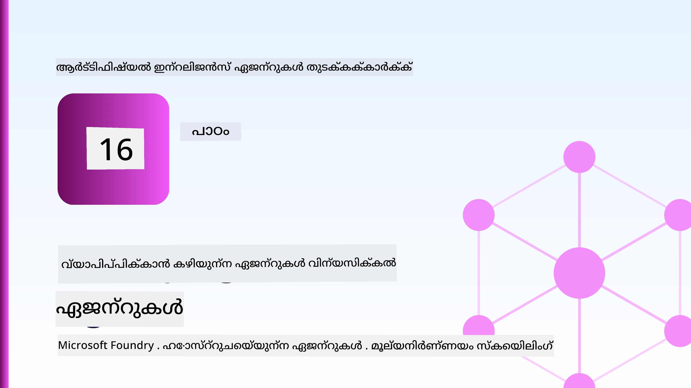
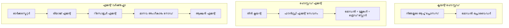
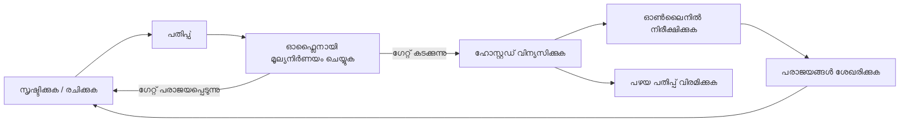
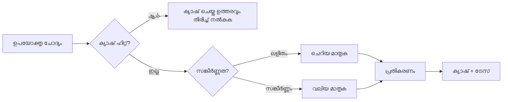
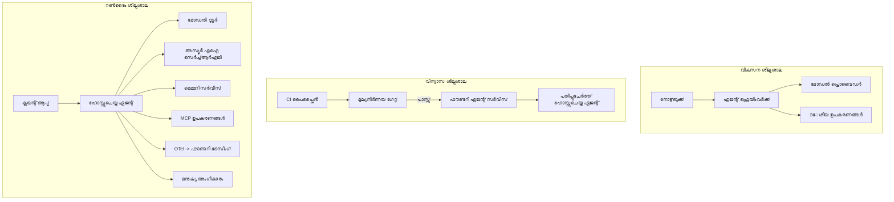

# Microsoft Foundry ഉപയോഗിച്ച് സ്‌കെയ്ലബിൾ ഏജന്റുകൾ വിന്യസിക്കൽ



ഇതുവരെ കോഴ്സിൽ നിങ്ങൾ ലാപ്‌ടോപ്പിൽ, നോട്ട്‌ബുക്കിനുള്ളിൽ, `az login` ന്റെയും ചില പരിസ്ഥിതി വ്യത്യാസങ്ങളുടെയും സഹായത്തോടെ പ്രവർത്തിക്കുന്ന ഏജന്റുകൾ നിർമ്മിച്ചിട്ടുണ്ട്. പഠിക്കാൻ ഇത് ശരിയായ മാര്‍ഗമാണ്. എന്നാൽ ആയിരക്കണക്കിന് ഉപഭോക്താക്കൾ 3 മണിക്ക് ആശ്രയിക്കുന്ന ഏജന്റ് ഓടിക്കുന്നതിനായി ഇതു ശരിയായ മാര്‍ഗമല്ല.

ഈ പാഠം "എന്റെ യന്ത്രത്തിൽ ഇത് പ്രവൃത്തി ചെയ്യുന്നു" എന്നത人与 "പ്രൊഡക്ഷനിൽ വിശ്വാസയോഗ്യമായി, ചെലവ് നിയന്ത്രിതമായി പ്രവർത്തിക്കുന്നു" എന്നതിനു ഇടയിൽ ഉള്ള വ്യത്യാസത്തെക്കുറിച്ചാണ്. നാം **Microsoft Foundry** ഉം **Microsoft Foundry Agent Service** ഉം ഉപയോഗിച്ച് ആ ഇടവേള ബാലൻസ് ചെയ്യുന്നുവെന്നും ഒരു യഥാർത്ഥ ഉപഭോക്തൃ പിന്തുണ ഏജന്റ് നിർമ്മിച്ച് അതിൽ ടൂൾസ്, റെട്രീവൽ, മെമ്മറി, മൂല്യനിർണയം, നിരീക്ഷണം എന്നിവ ഉൾപ്പെടുത്തുമെന്നും ഈ പാഠം പറയുന്നു.

## പരിചയം

ഈ പാഠത്തിൽ ഉൾപ്പെടുന്നത്:

- **പ്രോട്ടോടൈപ്പ് ഏജന്റും** **വിന്യസിച്ച ഏജന്റും** തമ്മിലുള്ള വ്യത്യാസം, കൂടാതെ മാറ്റം മുകളിലുള്ള മോഡലിനും അതിന്റെ ചുറ്റും ഉള്ളവയുമായ ബന്ധമുള്ളതാണ്.
- ഏജന്റുകൾക്കുള്ള **വിന്യാസ മാതൃകകൾ**: ക്ലയന്റ്-ഹോസ്റ്റഡ്, സർവീസ്-ഹോസ്റ്റഡ് (Hosted Agents), വർക്ക്‌ഫ്ലോ-ഓർക്കസ്ട്രേറ്റഡ്.
- Microsoft Foundry-യിലെ **ഏജന്റ് ജീവിതചക്രം** — സൃഷ്ടിക്കുക, പതിപ്പ് വയ്ക്കുക, വിന്യാസം ചെയ്യുക, മൂല്യനിർണയം ചെയ്യുക, നിരീക്ഷിക്കുക, വിരമിക്കുക.
- **സ്കെയ്ലിംഗ് തന്ത്രങ്ങൾ**: മോഡൽ റൂട്ടിംഗ്, കാഷിംഗ്, സമാന്തര പ്രവർത്തനം, സ്റ്റേറ്റ്ലെസ് രൂപകൽപ്പന.
- OpenTelemetry ഉം Foundry ട്രെയ്സിംഗും ഉപയോഗിച്ചുള്ള **നിരീക്ഷണക്ഷമത**.
- മോഡൽ തിരഞ്ഞെടുപ്പ്, റൂട്ടിംഗ്, മൂല്യനിർണയം വഴി **ചെലവ് കാര്യക്ഷമമാക്കൽ**.
- **എന്റർപ്രൈസ് പരിഗണനകൾ**: ഗവേർണൻസ്, മാനവ അംഗീകാരം, പ്രൊഡക്ഷനിൽ MCP സർവർകൾ സുരക്ഷിതമായി ഓടിക്കൽ.

## പഠന ലക്ഷ്യങ്ങൾ

ഈ പാഠം പൂർത്തിയാക്കിയ ശേഷം നിങ്ങൾക്ക് ഇങ്ങനെ അറിയാം:

- ഏജന്റ് പ്രവർത്തനഭാരത്തിനുള്ള യോഗ്യമായ വിന്യാസ മാതൃക തിരഞ്ഞെടുക്കുക.
- Microsoft Foundry Agent Service-ലേക്ക് ഏജന്റിനെ വിന്യസിച്ച് അതിന്റെ പതിപ്പും ഗവേർണന്‍സ് ഉം നിരീക്ഷണക്ഷമതയും ഉറപ്പാക്കുക.
- ട്രേസിംഗിനായി ഏജന്റിനെ ഇൻസ്ട്രുമെന്റ് ചെയ്യുക, ഓരോ റിലീസിനുമുമ്പും പ്രവർത്തിക്കുന്ന മൂല്യനിർണയ പൈപ്പ്‌ലൈൻ സ്ഥാപിക്കുക.
- സ്കെയിൽ ചെയ്യുമ്പോൾ വൈകിപ്പോക്കിനെയും ചെലവിനെയും നിയന്ത്രിക്കാൻ മോഡൽ റൂട്ടിംഗ്, കാഷിംഗ് പ്രയോഗിക്കുക.
- ഉയർന്ന അപകട സാധ്യതയുള്ള പ്രവർത്തനങ്ങൾക്ക് മാനവ അംഗീകാരം പിഴുതെടുക്കുക, MCP സർവർ പ്രൊഡക്ഷനിൽ സുരക്ഷിതമായി സംയോജിപ്പിക്കുക.

## മുന്‍ പരിചയ ആവശ്യകതകള്‍

നിങ്ങൾ മുമ്പ് പഠിച്ച പാഠങ്ങൾ പൂർത്തിയാക്കിയിട്ടുണ്ട് എന്നുമാണ് ഇവിടെ പരിഗണിക്കുന്നത്:

- [Microsoft Agent Framework](../14-microsoft-agent-framework/README.md) ഉപയോഗിച്ച് ഏജന്റുകൾ നിർമ്മിക്കൽ (പാഠം 14).
- [തന്ത്രപരിചയം](../04-tool-use/README.md) (പാഠം 4)യും [Agentic RAG](../05-agentic-rag/README.md) (പാഠം 5)ഉം.
- [ഏജന്റ് മെമ്മറി](../13-agent-memory/README.md) (പാഠം 13) ഉം [Agentic Protocols / MCP](../11-agentic-protocols/README.md) (പാഠം 11)ഉം.
- [നിരീക്ഷണക്ഷമതയും മൂല്യനിർണയവും](../10-ai-agents-production/README.md) (പാഠം 10) — ഈ പാഠം അതിന്റെ അടിസ്ഥാനത്തിലാണ്.

കൂടാതെ നിങ്ങൾക്ക് ഇതും വേണം:

- ഒരു **ആസ്യൂർ സബ്‌സ്‌ക്രിപ്ഷൻ**യും കുറഞ്ഞതെങ്കിലും ഒരു വിന്യസിച്ച ചാറ്റ് മോഡൽ ഉള്ള ഒരു **Microsoft Foundry പ്രോജക്ട്** ഉം.
- **Azure CLI** ഒത്തുചേരിക (authenticated) (`az login`).
- Python 3.12+ ഉം അടങ്ങിയിരിക്കുന്ന പൊക്കേജുകൾ, റീപ്പോസിറ്ററിയിലെ [`requirements.txt`](../../../requirements.txt) ഫയൽ ലഭ്യമായിരിക്കുക.

## പ്രോട്ടോടൈപ്പിൽ നിന്നു പ്രൊഡക്ഷനിലേക്ക്: യാഥാർത്ഥത്തിൽ എന്താണ് മാറുന്നത്

ഒരു പ്രോട്ടോടൈപ്പ് ഏജന്റും പ്രൊഡക്ഷൻ ഏജന്റും ഒരേ മുഖ്യ ലൂപ്പ് പങ്കുവെയ്ക്കുന്നു — കാരണം കണ്ടെത്തൽ, ടൂൾകൾ വിളിക്കൽ, പ്രതികരിക്കൽ. മാറ്റുന്നത് ആ ലൂപിന്റെ ചുറ്റുമുള്ള എല്ലാം ആണ്. മോഡൽ പ്രൊഡക്ഷൻ ഏജന്റിന്റെ ഏകദേശം 20% മാത്രമാണ്; ബാക്കി 80% ഓപ്പറേഷണൽ ഘടനയാണ്.

| വിഷയം | പ്രോട്ടോടൈപ്പ് | പ്രൊഡക്ഷൻ |
| --- | --- | --- |
| **ഹോസ്റ്റിംഗ്** | നിങ്ങളുടെ നോട്ട്‌ബുക്കിൽ ഓടുന്നു | ഹോസ്റ്റഡ് സർവീസായി, പതിപ്പുചെയ്ത് വിന്യസ്സിച്ചു |
| **അഭിപ്രായം** | നിങ്ങളുടെ `az login` ടോക്കൺ | സ്കോപ്പ്ഡ് RBAC ഉള്ള മാനേജഡ് ഐഡന്റിറ്റി |
| **സ്റ്റേറ്റ്** | മെമ്മറിയിൽ, റീസ്റ്റാർട്ട് ചെയ്താൽ നഷ്ടപ്പെടുന്നു | പുറത്തുനിന്ന് (thread store, memory service) |
| **പിഴവ്** | ട്രേസ്‌ബാക്ക് കാണുന്നു | റീറ്റ്രൈ, ഫാൽബാക്ക്, ഡെഡ്-ലറ്റർ, അലേർട്ട് |
| **ചെലവ്** | "അൽപ ചിലവാണ്" | ഓരോ അഭ്യർത്ഥനയ്ക്കും നിരീക്ഷണം, റൂട്ടിംഗ്, കാഷിംഗ്, ബഡ്ജറ്റ് |
| **ഗുണമേന്മ** | ഫലങ്ങൾ നേരിട്ട് പരിശോധിക്കുന്നു | പ്രതി റിലീസിനും സ്വയം മൂല്യനിർണയം |
| **വിശ്വാസം** | എല്ലാ നടപടികൾക്കും അംഗീകരണം | നയം + മാനവ നിയന്ത്രിത റിസ്കി തിരഞ്ഞെടുക്കലുകൾ |

ഈ പട്ടിക ശ്രദ്ധിക്കുക. താഴെ ഉള്ള ഓരോ വിഭാഗവും ഈ പട്ടികയിലെ ഒരു വരിയുമായി അനുബന്ധിച്ചിരിക്കുന്നു.

## ഏജന്റ് വിന്യാസ മാതൃകകൾ

പ്രധാനമായും മൂന്ന് മാതൃകകൾ നിങ്ങൾക്കുണ്ടാകും, സാധാരണ ചേർത്ത് ഉപയോഗിക്കുന്നത്.

### 1. ക്ലയന്റ്-ഹോസ്റ്റഡ് ഏജന്റുകൾ

ഏജന്റ് ഓബ്‌ജക്ട് നിങ്ങളുടെ അപ്ലിക്കേഷൻ പ്രക്രിയ()));’s മോഡൽ പ്രൊവൈഡർ നേരിട്ട് വിളിക്കുന്നു; കാരണം ലൂപ്പ് നിങ്ങളുടെ സർവീസിൽ പ്രവർത്തിക്കുന്നു. മുന്നുള്ള പാഠങ്ങളിൽ ഓരോന്നും ഇത് ചെയ്തിട്ടുണ്ട്.

- **ഉപയോഗം:** ലൂപിന്റെ മുഴുവൻ നിയന്ത്രണം ആവശ്യമെങ്കിൽ, കസ്റ്റം മിഡ്‌വെയർ ഉപയോഗിക്കുമ്പോൾ അല്ലെങ്കിൽ ഏജന്റ് നിലവിലുള്ള ബാക്ക്‌എൻഡിനുള്ളിൽ കോർത്തിണക്കുമ്പോൾ.
- **പരിമിതികൾ:** കടന്ന് വരുന്നത് സ്കെയ്ലിംഗ്, സ്റ്റേറ്റ്, റെസിലിയൻസ് നിധാനം സ്വയം ചെയ്യേണ്ടതാണ്.

### 2. ഹോസ്റ്റഡ് ഏജന്റുകൾ (Foundry Agent Service)

ഏജന്റ് Microsoft Foundry-ൽ *റസോഴ്സ്* ആയി രജിസ്റ്റർ ചെയ്യുന്നു. Foundry കാരണം ലൂപ്പ് ഹോസ്റ്റ് ചെയ്യുന്നു, ത്രെഡുകൾ സൂക്ഷിക്കുന്നു, ഉള്ളടക്കം സുരക്ഷിതമാക്കല്‍ ഉറപ്പ് വരുത്തുന്നു, RBAC പ്രയോഗിക്കുന്നു, ഏജന്റ് Foundry പോർട്ടലിൽ കാണാം. നിങ്ങളുടെ അപ്ലിക്കേഷൻ തThin client ആയി മാറുകയും ത്രെഡുകൾ സൃഷ്ടിക്കുകയും മറുപടികൾ വായിക്കുകയും ചെയ്യുന്നു.

- **ഉപയോഗം:** ദൃഢത, ഉൾക്കാഴ്ച, ഗവേർണൻസ്, കുറഞ്ഞ ഓപ്പറേഷന് പരിധി ആവശ്യമായപ്പോൾ.
- **പരിമിതികൾ:** മാനേജ്ഡ് റൺടൈം കൊണ്ടുള്ള കുറവ് താഴ്ന്ന-നില നിയന്ത്രണം.

### 3. ഏജന്റ് വര്‍ക്ക്‌ഫ്ലോ

നിരവധി ഏജന്റുകളും ടൂളുകളും ഗ്രാഫ് രൂപത്തിൽ സമന്വയിപ്പിച്ചു വ്യക്തമായ നിയന്ത്രണ പ്രവാഹം നല്കുന്നു — അനുക്രമഘട്ടങ്ങൾ, ശാഖങ്ങൾ, മാനവ അംഗീകാരം, ദൃഢമായ ചെക്ക്പോയിന്റുകൾ. ഇതാണ് Microsoft Agent Framework-ന്റെ **Workflows** ഫീച്ചർ വിന്യാസ സ്കെയിലിൽ വിനിയോഗിച്ചിരിക്കുന്നത്.

- **ഉപയോഗം:** ഒരൊറ്റ ടാസ്‌കിന് പല പ്രത്യേക ഏജന്റുകളോ, നടുക്കത്തിൽ അംഗീകാരം ആവശ്യമായാൽ.
- **പരിമിതികൾ:** കൂടുതൽ ഘടകങ്ങൾ; ഓർക്കസ്ട്രേഷൻ നില നിരീക്ഷണം ആവശ്യമാണ്.



## Microsoft Foundryയിലെ ഏജന്റ് ജീവിതചക്രം

ഏജന്റ് വിന്യാസം ഒറ്റത്തവണയുള്ള `push` അല്ല. ഇത് ഒരു ലൂപ്പാണ്, സോഫ്റ്റ്‌വെയർ റിലീസ് ചക്രത്തിൻറെ പോലെ തന്നെയാണ് അത്.



പ്രധാന ആശയം, [പാഠം 10](../10-ai-agents-production/README.md) നിന്ന് കൊണ്ടുവന്നത്: **ഓഫ്ലൈൻ മൂല്യനിർണയം ഒരു കവാടമാണ്, ആദാനമല്ല.** പുതിയ ഏജന്റ് പതിപ്പ് നിങ്ങളുടെ മൂല്യനിർണയ പരിധികൾ കടന്നില്ലെങ്കിൽ അയക്കരുത്. ഓൺ്ലൈൻ നിരീക്ഷണം യഥാർത്ഥ പിഴവുകൾ വീണ്ടും ഓഫ്‌ലൈൻ ടെസ്റ്റ് സെറ്റിലേക്ക് അയക്കുന്നു. ആ ഒട്ടാകമായ ലൂപ്പാണ്.

## സ്കെയ്ലിംഗ് തന്ത്രങ്ങൾ

ഏജന്റ് സ്കെയിൽ ചെയ്യുന്നത് സ്റ്റേറ്റ്ലെസ് വെബ് API സ്കെയ്ലിൽ നിന്നു വ്യത്യസ്തമാണ്, കാരണം ഓരോ അഭ്യർത്ഥനയും വിഹിതം മോഡൽ, ടൂൾ വിളികൾക്ക് കാരണമാകും. നാലു സാങ്കേതിക വിദ്യകൾ ഭാരം ഏറ്റെടുക്കുന്നു.

**സ്റ്റേറ്റ്ലെസ് അഭ്യര്‍ത്ഥന കൈകാര്യം.** ഓരോ ഉപയോക്താവിനും സ്റ്റേറ്റ് പ്രോസസ്സിൽ വെച്ചില്ല. സംഭാഷണ ത്രെഡുകൾ Foundry thread store-ൽ അല്ലെങ്കിൽ മെമ്മറി സർവീസിൽ സൂക്ഷിക്കുമ്പോൾ ഏത് ഇൻസ്റ്റൻസും ഏതൊരു അഭ്യർത്ഥനയും കൈകാര്യം ചെയ്യാൻ കഴിയും. ഇത് ഹോറിസോണ്ടൽ സ്കെയ്ലിനായി സഹായിക്കുന്നു — ഇൻസ്റ്റൻസുകൾ കൂട്ടുക, സ്റ്റിക്കി സെഷനുകൾ ഇല്ല.

**മോഡൽ റൂട്ടിംഗ്.** എല്ലാ അഭ്യർത്ഥനകളും നിങ്ങളുടെ ഏറ്റവും ശേഷിയുള്ള (ഏറ്റവും ചെലവേറിയ) മോഡലിന് വേണ്ടിവരില്ല. ലഘുവായ അഭ്യർത്ഥനകൾ — ഉദ്ദേശം ക്ലാസിഫിക്കേഷൻ, ലഘു വാസ്തവ ഉത്തരം — ചെറുതും വേഗതയുള്ള മോഡലിലേക്ക് റൂട്ടുചെയ്യുക, വലിയ മോഡൽ സത്യമായുള്ള കാരണം കണ്ടെത്തലിനു സൂക്ഷിക്കുക. Foundry-ന്റെ **Model Router** ഇത് ചെയ്യാം, അല്ലെങ്കിൽ നിങ്ങൾക്കും ലളിതമായ ക്ലാസിഫയർ നിർമ്മിക്കാനാകും. ലാബിൽ DIY പതിപ്പ് ഒരുക്കും.

**പ്രതികരണ കാഷിംഗ്.** പല പിന്തുണ ചോദിവിവരങ്ങളും സമാനമാണ് ("എന്റെ പാസ്‌വേഡ് മാറ്റാനെങ്ങനെ?"). സാധാരണ ചോദ്യങ്ങള്ക്കുള്ള ഉത്തരം കാഷെയിൽ സൂക്ഷിച്ച് മോഡൽ ഇടപെടാതെ സേവിക്കുക. ചെറിയ കാഷ് ഹിറ്റ് നിരക്കും ചെലവ്, വൈകിപ്പോക്ക് സുപ്രധാനമായി കുറയ്ക്കുന്നു.

**സമാന്തര പ്രവർത്തനവും ബാക്ക്പ്രഷറും.** മോഡൽ പ്രൊവൈഡറുകൾക്ക് നിരക്ക് പരിധികൾ ഉണ്ട്. നിങ്ങളുടെ സമാന്തര പ്രവർത്തനം നിയന്ത്രിക്കുക, വിപുലീകരണ ബാക്ക്ഒഫ് ഉപയോഗിച്ച് റീറ്റ്രൈ ചെയ്യുക, ശാന്തമായി പിഴവ് കൈകാര്യം ചെയ്യുക (ക്യൂവാക്കിയ "നാം ഇതിൽ ഇരിക്കുന്നു" പ്രതികരണം 500 ഹാരിയേക്കാൾ മികവാണ്).



## പ്രൊഡക്ഷനിൽ നിരീക്ഷണക്ഷമത

നിങ്ങൾക്ക് കാണാനാവാത്തതിനെ പ്രവർത്തിപ്പിക്കാൻ കഴിയില്ല. പാഠം 10 ൽ ചര്‍ച്ചചെയ്തതുപോലെ, Microsoft Agent Framework സ്വാഭാവികമായി **OpenTelemetry** ട്രേസുകൾ പുറപ്പെടുവിക്കുന്നു — ഓരോ മോഡൽ വിളിക്കലും, ടൂൾ വാഗ്ദാനം, ഓർക്കസ്ട്രേഷൻ ഘട്ടം എല്ലാം ഒരു സ്പാനായി മാറുന്നു. പ്രൊഡക്ഷനിൽ ഈ സ്പാനുകൾ Microsoft Foundry (അല്ലെങ്കിൽ ഏതൊരു OTel-ബന്ധപ്പെട്ട ബാക്ക്എൻഡ്) ലേക്കയച്ചുകൊണ്ട് നിങ്ങൾക്ക് കഴിയും:

- ഒരൊറ്റ ഉപഭോക്തൃ പരാതിയും എല്ലാ മോഡലുകളും ടൂൾ വിളിക്കലുകളും സമഗ്രമായി പിന്തുടരുക.
- സമയം കൂടാതെ പ50/പി95 വൈകിപ്പ്, ഓരോ അഭ്യര്‍ത്ഥനയ്ക്കും ചെലവ് കാണുക.
- പിശക് നിരക്ക് വെട്ടം സ്വയം നിങ്ങളുടെ ഉപയോക്താക്കള്ക്ക് (അല്ലെങ്കിൽ ഫിനാൻസ് സംഘത്തിന്) അറിയാൻ മുമ്പ് അലേർട്ടുകൾ ലഭിക്കുക.

```python
from agent_framework.observability import get_tracer

tracer = get_tracer()

with tracer.start_as_current_span("support_request") as span:
    span.set_attribute("customer.tier", "enterprise")
    span.set_attribute("routed.model", "gpt-5-nano")
    # ഈ സ്പാനിനുള്ളിൽ ഏജന്റ് എക്സിക്യൂഷൻ സ്വയം ട്രെയ്സ് ചെയ്യപ്പെടുന്നു
```

`customer.tier` ഉം `routed.model` ഉം പോലുള്ള ഗുണങ്ങളാണ് ട്രേസുകളുടെ മതിൽ മറുപടിയാകാൻ സഹായിക്കുന്നത് ("എന്റർപ്രൈസ് ഉപഭോക്താക്കൾ ചെറിയ മോഡലിലേക്ക് കൂടെയാണോ നിരന്തരം റൂട്ടുചെയ്യപ്പെടുന്നത്?").

## ചെലവ് കാര്യക്ഷമമാക്കൽ

പ്രൊഡക്ഷൻ ഏജന്റുകളിൽ ചെലവ് ടോക്കണുകൾ ആണ് ദീർഘകാലം അധിഷ്ഠിതമാകുന്നത്. മൂന്നു സംവിധാനം - പ്രാധാന്യത്തിൽ:

1. **ശരിയായ വലിപ്പത്തിൽ മോഡൽ തിരഞ്ഞെടുക്കുക.** നിങ്ങളുടെ മൂല്യനിർണയ കവാടം കടക്കുന്ന ചെറിയ മോഡൽ വലിയ മോഡലിനെക്കാൾ കൂടുതലായും ചെലവുകുറയുന്നു. ദോഷസൂചനയില്ലാതെ വലിയ മോഡൽ തിരഞ്ഞെടുക്കുന്നതിന് പകരം ചെറിയ മോഡൽ ശരിയാണെന്ന് മൂല്യനിർണയത്തിലൂടെ തെളിയിക്കുക.
2. **സങ്കീർണത അനുസരിച്ച് റൂട്ടിംഗ് ചെയ്യുക.** മുകളിൽ പറയാനുളളത് പോലെ - വലിയ മോഡൽ ആശ്രയിച്ചുള്ള അഭ്യർത്ഥനകൾക്ക് മാത്രമേ വലിയ മോഡൽ വില നൽകേണ്ടതുള്ളൂ.
3. **മികവുറ്റ കാഷിംഗ്.** ഏറ്റവും കുറഞ്ഞ ചിലവുള്ള മോഡൽ വിളിക്കല്‍ അതുതന്നെയാണ് നിങ്ങൾ ഒരിക്കലും ചെയ്തില്ലാത്തത്.

മൂല്യനിർണയ കവാടങ്ങളും ചെലവ് നിയന്ത്രണവും രണ്ട് ദൃശ്യമാന കോണുകളിൽ നിന്നുള്ള സമാന ശിഷ്ടाचारങ്ങളാണ്: മൂല്യനിർണയം നിങ്ങൾക്ക്* ഗുണമേന്മയുടെ അടിത്തറ* കാണിക്കുന്നു, റൂട്ടിംഗ്, കാഷിംഗ് അതിന്റെ *ചെലവ്* അടുത്തിരിക്കാനും സഹായിക്കുന്നു.

## എന്റർപ്രൈസ് വിന്യാസ പരിഗണനകൾ

**ഗവേർണൻസ്.** ഹോസ്റ്റഡ് ഏജന്റുകൾ Foundry-ന്റെ RBAC, ഉള്ളടക്ക സുരക്ഷ, ഓഡിറ്റ് ലോഗിംഗും പുനരുപയോഗിക്കുന്നു. ഓരോ ഏജന്റിനും കുറഞ്ഞ അധികാരമുള്ള മാനേജഡ് ഐഡന്റിറ്റി നല്‍കണം — അറിവ് ആധാരത്തിന് വായനാനുമതി, ടിക്കറ്റ് API-ന് സ്കോപ്പ്ഡ് ആക്‌സസ്, ഇതിലധികം ഒന്നും അല്ല.

**മാനവ-ഇൻ-ദ-ലൂപ്പ്.** ചില പ്രവർത്തനങ്ങൾ പൂർണമായി ഓട്ടോമേറ്റ് ചെയ്യേണ്ടതില്ല — പണം തിരികെ നൽകൽ, അക്കൗണ്ട് മായ്ക്കൽ, നിയമ സംഘത്തിലേക്ക് ഉയർത്തൽ. Microsoft Agent Framework **അംഗീകാര-ആവശ്യമായ** ടൂളുകൾ പിന്തുണക്കുന്നു: ഏജന്റ് പ്രവൃത്തി നിർദ്ദേശിക്കും, നിർവഹണം തടയും, ഒരു മനുഷ്യന് അംഗീകാരം നൽകും അല്ലെങ്കിൽ നിരസിക്കും, തുടർന്ന് വർക്ക്‌ഫ്ലോ തുടരുന്നു. ഇത് [പാഠം 6](../06-building-trustworthy-agents/README.md) ൽ കണ്ടത്; ഇവിടെ വിന്യസിക്കുന്നു.

**MCP പ്രൊഡക്ഷനിൽ.** [MCP](../11-agentic-protocols/README.md) നിങ്ങളുടെ ഏജന്റിന് സ്റ്റാൻഡേർഡ് ഇന്റർഫേസ് വഴി ബാഹ്യ ടൂളുകളെ ഉപയോഗിക്കാൻ അനുവദിക്കുന്നു. പ്രൊഡക്ഷനിൽ, ഓരോ MCP സർവറും വിശ്വസിക്കാത്ത അതിർത്തിയായിരിക്കണം: സർവർ പതിപ്പ് പിന്വച്ചുക, സ്കോപ്പ്ഡ് ഐഡന്റിറ്റിയോടു് ഓടിക്കുക, പുറംവരികൾ പരിശോദിക്കുക, രഹസ്യങ്ങൾ ഒരിക്കലും പുറത്തുകൊടുക്കരുത്. MCP സർവർ ഒരു ആശ്രിതമാണ്, ആശ്രിതങ്ങൾക്ക് പാച്ച്, ഓഡിറ്റ്, നിരക്ക് നിയന്ത്രണം ഉണ്ടാകും.



ഈ മൂന്ന് ചിത്രങ്ങളുടെ ഗതി — വികസനം, വിന്യാസം, റൺടൈം — ഏജന്റിന്റെ ജീവിതത്തിന്റെ മൂന്നംഗ ഘട്ടങ്ങളിലാണ്ഇതാണ്. ഇതിനെ പിന്‍ ഭാവിയില്‍ പഠനശാല നിങ്ങളെ മുഖാന്തരം നയിക്കും.

## പ്രായോഗിക ലാബ്: പ്രൊഡക്ഷൻ-സജ്ജമായ ഉപഭോക്തൃ പിന്തുണ ഏജന്റ്

[`code_samples/16-python-agent-framework.ipynb`](./code_samples/16-python-agent-framework.ipynb) തുറന്ന് തുടർച്ചയായി പ്രവർത്തിക്കുക. നിങ്ങൾ ഓരോ പ്രൊഡക്ഷൻ കാര്യവും ഉൾപ്പെടുത്തിയ **Contoso ഉപഭോക്തൃ പിന്തുണ ഏജന്റ്** എത്തിക്കും:

1. **ടൂൾ കോൾ ചെയ്യൽ** — ഓർഡർ നില കാണുക, പിന്തുണ ടിക്കറ്റുകൾ തുറക്കുക.
2. **RAG** — അറിവ് ആധാരത്തിൽ നിന്നുള്ള നയം ചോദ്യങ്ങൾക്കുള്ള ഉത്തരങ്ങൾ (Azure AI Search ഉപയോഗിച്ച്, നോട്ട്‌ബുക്ക് Search റിസോഴ്‌സ് ഇല്ലാതെയും പ്രവർത്തിക്കാൻ ഇൻ-മെമ്മറി ഫാൾബാക്ക്).
3. **മെമ്മറി** — സംവാദത്തിന്റെ പല ടേണുകളിലുമായി ഉപഭോക്താവിനെ ഓർക്കുക.
4. **മോഡൽ റൂട്ടിംഗ്** — സങ്കീർണത ക്ലാസിഫയർ ഓരോ അഭ്യർത്ഥനയും ചെറിയ അല്ലെങ്കിൽ വലിയ മോഡലിലേക്ക് റൂട്ടുചെയ്യുന്നു.
5. **പ്രതികരണ കാഷിംഗ്** — ആവർത്തിക്കുന്ന ചോദ്യങ്ങൾ കാഷെയിൽ നിന്ന് സേവിക്കുന്നു.
6. **മാനവ അംഗീകാരം** — ഒരു പരിധി മീതെ റിഫണ്ട് ഓർഡറുകൾക്ക് മാനവ ഒപ്പ് ആവശ്യമാണ്.
7. **മൂല്യനിർണയ പൈപ്പ്‌ലൈൻ** — ചെറിയ ഓഫ്ലൈൻ ടെസ്റ്റ് സെറ്റ് ഏജന്റിനെ സ്കോർ ചെയ്യുകയും റിലീസ് കവാടമായി പ്രവർത്തിക്കുകയും ചെയ്യുന്നു.
8. **നിരീക്ഷണക്ഷമത** — ഓരോ അഭ്യര്‍ത്ഥനയുടെയും ചുറ്റും OpenTelemetry ട്രേസിംഗ്.

### വഴികാട്ടി

നോട്ട്‌ബുക്ക് നിർമ്മിച്ചപ്പോഴാണ് ഓരോ പ്രൊഡക്ഷൻ കാര്യം സ്വയംപര്യാപ്തമായ, ഓടത്തക്ക വിഭാഗങ്ങളായി ക്രമീകരിച്ചിരിക്കുന്നത്. അതിന്റെ ഹൃദയമാണ് റൂട്ടിംഗ്-കാഷിംഗ് അഭ്യർത്ഥന കൈകാര്യം ചെയ്യൽ:

```python
async def handle_support_request(query: str, customer_id: str) -> str:
    # 1. സാധിച്ചുവോൾ കാഷേയിൽ നിന്ന് സേവനം നൽകുക.
    cached = response_cache.get(normalize(query))
    if cached:
        return cached

    # 2. ചെലവ് നിയന്ത്രിക്കാൻ സങ്കീർണ്ണത പ്രകാരം മാർഗം നിശ്ചയിക്കുക.
    model = "gpt-5-nano" if is_simple(query) else "gpt-5-mini"

    # 3. നിരീക്ഷണത്തിന് ഏജന്റ് ട്രേസ് സ്‌പാനിനകത്ത് പ്രവർത്തിക്കുക.
    with tracer.start_as_current_span("support_request") as span:
        span.set_attribute("routed.model", model)
        span.set_attribute("customer.id", customer_id)
        response = await support_agent.run(query, model=model)

    # 4. കാഷേ ചെയ്യുക ಮತ್ತು തിരിച്ചയയ്ക്കുക.
    response_cache.set(normalize(query), response.text)
    return response.text
```

റിലീസിനെ സംരക്ഷിക്കുന്ന മൂല്യനിർണയ കവാടം ഇതുപോലെ കാണുന്നത്:

```python
async def evaluation_gate(agent, test_cases, threshold: float = 0.8) -> bool:
    passed = 0
    for case in test_cases:
        result = await agent.run(case["input"])
        if score_response(result.text, case["expected"]) >= 0.8:
            passed += 1
    pass_rate = passed / len(test_cases)
    print(f"Evaluation pass rate: {pass_rate:.0%} (gate: {threshold:.0%})")
    return pass_rate >= threshold  # ഗേറ്റ് പാസാകുന്ന പക്ഷമുള്ളവ മാത്രമേ വിന്യസിക്കൂ
```

ഓരോ വരിയും വായിക്കുക — നോട്ട്‌ബുക്ക് പ്രാതിനിധ്യങ്ങൾ ചെറുതായി സജ്ജമാക്കി, ഒന്നും ഫ്രെയിംവർക്കിന്റെ പിന്നിൽ മറച്ചിട്ടിട്ടില്ല.

## വിന്യസിച്ച ഏജന്റ് സ്മോക്ക് ടെസ്റ്റുകൾ ഉപയോഗിച്ച് പരിശോധിക്കൽ

മുകളിൽ കാണിച്ച മൂല്യനിർണയ കവാടം നിങ്ങളുടെ ഏജന്റിന് ഓഫ്ലൈനായി നടത്തുന്നു. Hosted Agent ആയി വിന്യസിച്ച ശേഷം നിങ്ങൾക്ക് മറ്റൊരു അത്ര ചെലവുകുറഞ്ഞ ചെന്ന് ആവശ്യമുണ്ട്: **വിന്യസിച്ച എന്റ്പോയിന്റ് പ്രത്യക്ഷമായി ഉത്തരമിടുന്നുണ്ടോ?**

"വിജയകരമായി വിന്യസിച്ചു" എന്ന് പറയുന്നത് നിയന്ത്രണ സമിതി നിർവചനം സ്വീകരിച്ചതായി തെളിയിക്കും — എന്നാൽ ഏജന്റ് ഉത്തരമിടുന്നുണ്ടെന്നു തെളിയിക്കില്ല. നഷ്ടപ്പെട്ട ആശ്രിതം, മോശമായ മോഡൽ റൂട്ടിംഗ്, കാലഹരണപ്പെട്ട കണക്ഷൻ എന്നിവ കാരണം ആളെടുക്കാത്ത വിന്യാസം സംഭവിക്കാം. **സ്മോക്ക് ടെസ്റ്റ്** അതിനെ പെട്ടെന്ന് കണ്ടെത്തും, ഓരോ വിന്യാസത്തിനും, പൂര്‍ണ മൂല്യനിർണയ ചെലവ് ഇല്ലാതെ.

ഈ റീപ്പോ പ്രാപ്തമായ ഒരു സ്മോക്ക്-ടെസ്റ്റ് പൈപ്പ്‌ലൈൻ ഐ-എ-ഐ സ്മോക്ക് ടെസ്റ്റ് GitHub Action-ൽ നിർമ്മിച്ചാണ് നൽകുന്നത്:

- **കാറ്റലോഗ്** — [`tests/lesson-16-smoke-tests.json`](../../../tests/lesson-16-smoke-tests.json) Contoso പിന്തുണ ഏജന്റിനായുള്ള പ്രോംപ്റ്റുകളും ഉറപ്പുകളും (നയം-Dependent ഉത്തരങ്ങൾ, ഓർഡർ പരിശോധിക്കൽ, സാധാരണ വിഷയങ്ങളിൽ നിലനിർത്തൽ, മൾട്ടി-ടേൺ ത്രെഡ് തുടർച്ച) ഉൾക്കൊള്ളുന്നു. മറ്റ് പാഠങ്ങളുടെ ഏജന്റുകളുടെ കാറ്റലോഗുകൾ ഇതിനു സമീപം ഉണ്ട് — കാണുക [`tests/README.md`](../tests/README.md).
- **വർക്ക്‌ഫ്ലോ** — [`.github/workflows/smoke-test.yml`](../../../.github/workflows/smoke-test.yml) Azure OIDC ഉപയോഗിച്ച് ലോഗിൻ ചെയ്ത് പ്രോംപ്റ്റ് ഓരോന്നും ഏജന്റിന്റെ Responses എന്റ്പോയിന്റ്റിലേക്ക് POST ചെയ്ത് പിശക് തെളിയിക്കാത്തില്ലെങ്കിൽ ജോലി പരാജയപ്പെടും.

```yaml
- name: Smoke-test hosted agent
  uses: JFolberth/ai-smoketest@v1
  with:
    project_endpoint: ${{ inputs.project_endpoint }}
    agent_name: ContosoSupportAgent
    tests_file: tests/lesson-16-smoke-tests.json
```


ഏജന്റ് വിന്യസിപ്പിച്ച ശേഷം **Actions** ടാബിൽ നിന്ന് അത് പ്രവർത്തിപ്പിക്കൂ, നിങ്ങളുടെ Foundry പ്രോജക്ട് എൻഡ്പോയിന്റും ഏജന്റ് പേരും വാഗ്ദാനം ചെയ്ത്. ഫെഡറേറ്റഡ് ഐഡന്റിറ്റിക്ക് Foundry പ്രോജക്ട് പരിധിയിൽ **Azure AI User** റോളുണ്ടാകണം. ലയറുകൾ ഒരു പിറമിഡ് പോലെ അനുസരിക്കുക: പ്രദർശന പരീക്ഷണം (ലഭ്യമോ പ്രതികരിക്കുകയോ ചെയ്യുമോ?) ഓരോ വിന്യാസത്തിലും നടത്തപ്പെടുന്നു, ഓഫ്‌ലൈൻ മൂല്യനിർണ്ണയം (കുറഞ്ഞത് ഷിപ്പ് ചെയ്യാൻ യോജിച്ചിരിക്കുന്നു?) പ്രമോഷനിനു മുമ്പ് നടക്കുന്നു, ഓൺലൈൻ മൂല്യനിർണ്ണയം (പ്രകൃതിയിൽ അത് എങ്ങനെ പ്രവർത്തിക്കുന്നു?) തുടർച്ചയായി നടക്കുന്നു.

## അറിവ് പരിശോധന

അസൈന്‌മെന്റിലേക്കു പോകുന്നതിനു മുമ്പ് നിങ്ങളുടെ മനസ്സിലാക്കിയതിന്റെ പരീക്ഷണം നടത്തുക.

**1. ഒരു ഉത്പാദന ഏജന്റിൽ "മോഡൽ" എത്രവ割合മാണ്, ശേഷിക്കുന്ന ഭാഗം എന്താകുന്നു?**

<details>
<summary>ഉത്തരം</summary>

മോഡൽ സിസ്റ്റത്തിലെ അല്പഘടകമാണ് — സാധാരണയായി ഏകദേശം 20% പരമാവധി ഉദ്ധരിക്കപ്പെടുന്നു. ശേഷിക്കുന്നത് പ്രവർത്തന സംര സംരഭമാണ്: ഹോസ്റ്റിംഗ്, വേർഷനിംഗ്, ഐഡന്റിറ്റി, RBAC, നിശ്ചിത അവസ്ഥ, പരാജയ കൈകാര്യം, ചെലവ് നിരീക്ഷണം, മൂല്യനിർണ്ണയം, മാൻ-ഇൻ-ദി-ലൂപ്പ് നിയന്ത്രണങ്ങൾ. ഉത്പാദനത്തിലേക്ക് ചേരുന്നത് പ്രധാനമായും സമ്മർദ്ദ നൂൽക്കൂട്ടത്തിനു ചുറ്റുമുള്ള എല്ലാ ഘടകങ്ങളും നിർമ്മിക്കുന്നതാണ്.
</details>

**2. ക്ലയന്റ് ഹോസ്റ്റഡ് ഏജന്റിന്റെ പകരം ഹോസ്റ്റഡ് ഏജന്റ് തിരഞ്ഞെടുക്കേണ്ട സാഹചര്യം ഏതാണ്?**

<details>
<summary>ഉത്തരം</summary>

നിശ്ചിത സഹകരണ ശേഷിയോടുകൂടിയ സ്ഥാപനമായ മാനേജ് ചെയ്ത റൺടൈം ആവശ്യമായപ്പോൾ, ഇതിൽ ത്രെഡുകൾ നിലനിർത്തുകയും പുനരാരംഭിക്കാനും കഴിയുകയും ചെയ്യുന്നു, വിസ്തൃതികരണവും ഉള്ളടക്കം സുരക്ഷയും ഉൾപ്പെടുന്നു, RBAC ഉം നിലവിലുണ്ട് എന്നാവശ്യപ്പെട്ടു, നിമിഷിമായ നിയന്ത്രണത്തിന്റെ ചില ഭാഗം വഴങ്ങാൻ തയ്യാറായാൽ ഹോസ്റ്റഡ് ഏജന്റ് അനുയോജ്യമാണ്. ലൂപിന്റെ മുഴുവൻ നിയന്ത്രണം ആവശ്യമായപ്പോൾ അല്ലെങ്കിൽ ഏജന്റിനെ നിലവിലുള്ള ബാക്ക്‌എൻഡിലേക്കു ഉൾപ്പെടുത്തിക്കൊണ്ടിരിക്കുമ്പോൾ ക്ലയന്റ് ഹോസ്റ്റഡ് മികച്ചതാണ്.
</details>

**3. ഒരു സ്കേലബിൾ ഏജന്റ് സ്വയം പ്രക്രിയ മെമ്മറിയിൽ സ്റ്റേറ്റ്‌ലെസ്സ് ആയി ഉണ്ടായിരിക്കേണ്ടത് എന്തിനായി ആണ്?**

<details>
<summary>ഉത്തരം</summary>

എങ്ങനെ വേണമെങ്കിലും ഒരു ഉദാഹരണം ഏത് അഭ്യర్థനയും കൈകാര്യം ചെയ്യാൻ കഴിയണം, ഇത് സ്റ്റിക്കി സെഷനുകൾ ഇല്ലാതെ ഹൊറിസോണ്ടൽ സ്കെയ്‌ലിംഗ് സാധ്യമാക്കുന്നു. ഓരോ ഉപയോക്താവിന്റെയും സംഭാഷണ നില(thread state) ത്രെഡ് സ്റ്റോർ അല്ലെങ്കിൽ മെമ്മറി സർവീസ് ആയി പുറത്തു വയ്ക്കുന്നു. നില പ്രക്രിയ മെമ്മറിയിൽ നിന്ന് ഉണ്ടെങ്കിൽ, പുനരാരംഭിക്കുമ്പോൾ അത് നഷ്ടപ്പെടും, ലോഡ് സ്വതന്ത്രമായി വലിത distribuição ചെയ്യാൻ കഴിയില്ല.
</details>

**4. മോഡൽ റൂട്ടിംഗ് ഏത് പ്രശ്നം പരിഹരിക്കുന്നു, അത് മൂല്യനിർണ്ണയവുമായി എങ്ങനെ ബന്ധമുണ്ട്?**

<details>
<summary>ഉത്തരം</summary>

റൂട്ടിംഗ് കൂടിവരുന്ന അഭ്യർത്ഥനകൾ ചെറുതും വേഗതയേറിയ മോഡലിലേക്ക് നേരെ അയയ്ക്കുന്നു, വലുതും സത്യമുള്ള ന്യായീകരണത്തിനായി വെറും വലിയ മോഡൽ സംരക്ഷിക്കുന്നു, ഇത് ലാറ്റൻസിയും ചെലവും നിയന്ത്രിക്കുന്നു. ഇത് മൂല്യനിർണ്ണയവുമായി ബന്ധപ്പെട്ടിരിക്കുന്നു കാരണം മൂല്യനിർണ്ണയം ചെറിയ മോഡൽ ഏതെങ്കിലും അഭ്യർത്ഥന തരത്തിനായി യോജിച്ചതാണെന്ന് ഈ സമർത്ഥിക്കുന്നു — മൂല്യനിർണ്ണയം ഇല്ലാതെ റൂട്ടിംഗ് അനുമാനമാകും.
</details>

**5. "മൂല്യനിർണ്ണയ ഗേറ്റ്" എന്ന് പറയുന്നത് എന്തും അത് ജീവചരിത്രത്തിൽ എവിടെയാണ്?**

<details>
<summary>ഉത്തരം</summary>

മൂല്യനിർണ്ണയ ഗേറ്റ് വേർഷൻ പുതിയത് എതിരെ ഓഫ്‌ലൈൻ ടെസ്റ്റ് സെറ്റ് ഓടിക്കുകയും പാസ്സ് നിരക്ക് ഒരു പരിധി ത(over threshold)കിൽ ആണെങ്കിൽ വിന്യസനം തടയുകയും ചെയ്യുന്നു. ജീവചരിത്രത്തിൽ "വർഷൻ" ന് ഇടയിൽ "വിന്യസനം" ഇടയിൽ ഇരുന്നു, നിലവാരം റിലീസിന് മുൻപുള്ള മുൻ‌അവസ്ഥയായി കരുതുന്നു, ഷിപ്പിംഗിനു ശേഷം പരിശോധിക്കുന്നതിന് പകരം.
</details>

**6. MCP സെർവർ ഉത്പാദനത്തിൽ അതീവവിശ്വാസഹീനമായ പരിധിയായി പരിഗണിക്കേണ്ടത് എന്തിന്?**

<details>
<summary>ഉത്തരം</summary>

കാരണം ഏജന്റ് വിളിക്കുന്ന പുറത്തുള്ള ആശ്രിത ഘടകമാണ് അത്. അതിന്റെ വേർഷൻ പിന്‍ബലപ്പെടുത്തണം, പരിധിയുള്ള ഐഡന്റിറ്റിയോട് ഓടിക്കണം, പുറംഫലങ്ങൾ സാധുവാക്കിയിരിക്കണം, നിരക്ക് നിയന്ത്രണം ചെയ്യണം, രഹസ്യങ്ങൾ അതിന് ഒരിക്കലും വെറുതെ വെക്കരുത് — തന്നെ ഏതൊരു തൃतीय പാതൃക ആശ്രിതത്തിനും നിങ്ങൾ നൽകുന്ന അതേ നിയമങ്ങൾ. അതിന്റെ ഔട്ട്പുട്ടുകൾ ഏജന്റിന്റെ ന്യായീകരണത്തിലേക്ക് ഒഴുകിയെന്ന കാര്യം പരിശോധിക്കാതെ വിശ്വാസം സുരക്ഷാ റിസ്കായിരിക്കുന്നു.
</details>

**7. സാധാരണ ഉത്പാദന ഏജന്റ് ചെലവിൽ ഏറ്റവും വലിയ സ്വാധീനം ഏത് ഏകീകൃത മാറ്റം സൃഷ്ടിക്കുന്നു, എന്തുകൊണ്ട്?**

<details>
<summary>ഉത്തരം</summary>

മോഡലിന്റെ വലിപ്പം ശരിയായി ക്രമീകരിക്കൽ — നിങ്ങളുടെ മൂല്യനിർണ്ണയ ഗേറ്റ് കടന്നുപോകുന്ന ഏറ്റവും ചെറിയ മോഡൽ ഉപയോഗിക്കുക. ചെലവ് ടോക്കണുകൾ നിയന്ത്രിക്കുന്നു, സ്റ്റാൻഡേർഡ് ബാറിന് പൊരുത്തപ്പെടുന്ന ചെറിയ മോഡൽ വലുതിനെക്കാള്‍ ഹംസിയാകും. കാഷിംഗ്, റൂട്ടിംഗ് ഇത് കുറയ്ക്കുന്നു, പക്ഷേ ശരിയായ അടിസ്ഥാന മോഡൽ തിരഞ്ഞെടുക്കൽ പ്രഥമ-ക്രമ സ്വാധീനം സൃഷ്ടിക്കുന്നു.
</details>

**8. `customer.tier` மற்றும் `routed.model` പോലുള്ള സ്പാൻ അത്രിബ്യൂട്ടുകൾ ഒബ്സർവബിലിറ്റിയിൽ എന്ത് പ്രവർത്തനം?**

<details>
<summary>ഉത്തരം</summary>

അവ രോ ട്രേച്ചുകളെ ഉത്തരം കിട്ടാവുന്ന ബിസിനസ് ചോദ്യങ്ങളാക്കി മാറ്റുന്നു. അത്രിബ്യൂട്ടുകൾ ഇല്ലാതെ നിങ്ങൾക്ക് സ്പാൻ മതിലുണ്ടാവും; അവയോടുകൂടി "എന്താണ് എന്റർപ്രൈസ് കസ്റ്റമേഴ്‌സിനെ ചെറു മോഡലിലേക്ക് അധികം റൂട്ടുചെയ്യുന്നത്?" അല്ലെങ്കിൽ "ഏത് മോഡൽ നമ്മുടെ ഏറ്റവും മന്ദഗതിയുള്ള അഭ്യർത്ഥനകൾ കൈകാര്യം ചെയ്യുന്നു?" എന്ന് ചോദിക്കാം. അത്തരം അളവുകൾ വഴിയുള്ള ടെലിമെട്രി വിശകലനം ഇന്റെഗ്രേറ്റഡ് ഓപ്പറേഷൻ വസ്തുക്കൾ അനുസരിച്ച് ചെയ്യാൻ സഹായിക്കുന്നു.
</details>

## അസൈന്മെന്റ്

ലാബിൽ നിന്നും കസ്റ്റമർ സഹായ ഏജന്റ് എടുക്കുക, ഒരു പ്രത്യേക രംഗത്തേക്ക് കെട്ടിപ്പിടിക്കുക: **SaaS കമ്പനിക്കായുള്ള സബ്സ്ക്രിപ്ഷൻ ബില്ലിംഗ് സഹായ ഏജന്റ്.**

നിങ്ങളുടെ സമർപ്പണം ആകണം:

1. ബില്ലിംഗ് ബന്ധപ്പെട്ട ടൂളുകൾക്ക് **സാധനം മാറ്റുക**: `get_subscription_status`, `get_invoice`, `issue_credit` (50 ഡോളർ മുകളിൽ ക്രെഡിറ്റ് അനുവദനത്തിനായി മനുഷ്യ അംഗീകാരമുണ്ട്).
2. കമ്പനിയുടെയും റിഫണ്ട് നയവും, ബില്ലിംഗ് സൈക്കിൾ, റദ്ദാക്കൽ നയം എന്നിവ ഉൾപ്പെടുന്ന **മൂന്ന് RAG ഡോക്യുമെന്റുകൾ ചേർക്കുക**.
3. **മൂല്യനിർണ്ണയ സെറ്റ്** കുറഞ്ഞത് എട്ട് കേസുകൾക്കു ವಿಸ್ತരിക്കുക, കുറഞ്ഞത് രണ്ടർ മനുഷ്യ അംഗീകാര മാർഗ്ഗം പ്രേരിപ്പിക്കണം, നിങ്ങളുടെ മൂല്യനിർണ്ണയ ഗേറ്റ് ശരിയായി പാസ്സ് അല്ലെങ്കിൽ ഫെയിൽ ചെയ്യുന്നതായി ഉറപ്പാക്കുക.
4. **ഒരു ചെലവ് റിപ്പോര്ട്ട് ചേർക്കുക**: ഏജന്റിലേക്ക് പത്തു മിശ്ര ചോദനകൾ ഓടിച്ചതിന് ശേഷം, എത്ര ചെറിയ മോഡലിലേയ്ക്ക്, എത്ര വലിയ മോഡലിലേയ്ക്ക്, എത്ര കാഷിൽ നിന്നുള്ള സേവനം ലഭിച്ചു എന്ന് അച്ചടിക്കുക.

ഇത് മറികടന്ന്, (markdown സെല്ലിൽ) നിങ്ങൾ തെരഞ്ഞെടുത്ത മോഡൽ-റൂട്ടിംഗ് നയവും എങ്ങനെ യഥാർത്ഥ ട്രാഫിക് ഉപയോഗിച്ച് അത് സ്ഥിരീകരിക്കുമെന്നുമുള്ള ഒരു ചെറിയ പാരഗ്രാഫ് എഴുതുക. ഏകദേശം ശരിയായ ഒരു ഉത്തരമില്ല — ഉത്പാദന ആശങ്കകൾ ലളിതം സാദ്ധ്യമായ സംയോജിപ്പിച്ചിട്ടുണ്ടോ എന്ന് നിർണ്ണയിക്കും.

## സംഗ്രഹം

ഈ പാഠത്തിൽ നിങ്ങൾ ഏജന്റിനെ പ്രോട്ടോടൈപ്പിൽ നിന്നു Microsoft Foundry ഉപയോഗിച്ച് ഉത്പാദനത്തിലേക്ക് കൊണ്ടുവന്നു:

- ഉത്പാദനത്തിലേക്ക് ചാടി മാറ്റത്തിന്റെ മിക്കഭാഗവും മോഡലിനു ചുറ്റുമുള്ള **പ്രവർത്തന ഘടന** — ഹോസ്റ്റിംഗ്, ഐഡന്റിറ്റി, അവസ്ഥ, പരാജയ കൈകാര്യം, ചെലവ്, ഗുണമേന്മ, വിശ്വാസം എന്നിവയാണ്.
- നിങ്ങൾ മൂന്നു **വിന്യാസ മാതൃകകൾ** പഠിച്ചു — ക്ലയന്റ്-ഹോസ്റ്റഡ്, ഹോസ്റ്റഡ് ഏജന്റുകൾ, ഏജന്റ് വർക്ക്‌ഫ്ലോസ് — ഏത് എപ്പോൾ അനുയോജ്യമാണ്.
- നിങ്ങൾ **ഏജന്റ് ജീവചക്രം** പാലിച്ചു, ഓഫ്‌ലൈൻ **മൂല്യനിർണ്ണയം റിലീസ് ഗേറ്റ് ആയി പ്രവർത്തിക്കുന്നു**; ഓൺലൈൻ ഒബ്സർവബിലിറ്റി പരാജയങ്ങളെ ടെസ്റ്റ് സെറ്റിലേക്ക് തിരിച്ചു നൽകുന്നു.
- നിങ്ങൾ **അളക്കൽ തന്ത്രങ്ങൾ** — സ്റ്റേറ്റ് ലെസ്സ് ഡിസൈൻ, മോഡൽ റൂട്ടിംഗ്, കാഷിംഗ്, പരിമിതമായ പൊരുത്തം — ഉപയോഗിച്ചു, ഇത് **ചെലവ് പ്രാപ്തീകരണത്തോട്** ബന്ധിപ്പിച്ചു.
- നിങ്ങൾ **എന്റർപ്രൈസ് നിയന്ത്രണങ്ങൾ** നടപ്പിലാക്കി: RBAC, മനുഷ്യ-ഇൻ-ദി-ലൂപ്പ് അംഗീകാരം, ഉത്പാദന സുരക്ഷിത MCP സംയോജനം.
- നിങ്ങൾ **ഉത്പാദനത്തിന് സജ്ജമായ കസ്റ്റമർ പിന്തുണ ഏജന്റ്** സൃഷ്‌ടിച്ചു, ഈ എല്ലാ ആശങ്കകളും പ്രവർത്തന കോഡിൽ സംയോജിപ്പിച്ചു.

അടുത്ത പാഠം വഹിക്കുന്ന വഴിതെറ്റൽ ആണ്: ഏജന്റുകൾ മേഘത്തിലേക്ക് വലുതായി കയറ്റാനുള്ള പകരം, നിങ്ങൾ അവ ഒരു ഡെവലപ്പർ യന്ത്രത്തിൽ താഴ്ന്ന ജിയോതായാക്കി മുഴുവനായി ലോക്കലായി ഓടിക്കും.

## അധിക ആശയങ്ങൾ

- <a href="https://learn.microsoft.com/azure/ai-foundry/what-is-azure-ai-foundry" target="_blank">Microsoft Foundry ഡോക്യുമെന്റേഷൻ</a>
- <a href="https://learn.microsoft.com/azure/ai-foundry/agents/overview" target="_blank">Microsoft Foundry Agent Service അവലോകനം</a>
- <a href="https://aka.ms/ai-agents-beginners/agent-framework" target="_blank">Microsoft Agent Framework</a>
- <a href="https://learn.microsoft.com/azure/ai-foundry/concepts/model-router" target="_blank">Microsoft Foundry-യിലെ മോഡൽ റൂട്ടർ</a>
- <a href="https://learn.microsoft.com/azure/search/search-what-is-azure-search" target="_blank">Azure AI Search</a>
- <a href="https://opentelemetry.io/" target="_blank">OpenTelemetry</a>
- <a href="https://github.com/marketplace/actions/ai-smoke-test" target="_blank">AI Smoke Test GitHub ആക്ഷൻ</a>
- <a href="https://modelcontextprotocol.io/" target="_blank">Model Context Protocol (MCP)</a>

## പൂർവ പാഠം

[കമ്പ്യൂട്ടർ ഉപയോഗ ഏജന്റുകൾ (CUA) നിർമ്മിക്കൽ](../15-browser-use/README.md)

## അടുത്ത പാഠം

[ലോകൽ AI ഏജന്റുകൾ സൃഷ്‌ടിക്കൽ](../17-creating-local-ai-agents/README.md)

---

<!-- CO-OP TRANSLATOR DISCLAIMER START -->
**അറിയിപ്പ്**:
ഈ രേഖ AI പരിഭാഷാ സേവനം [Co-op Translator](https://github.com/Azure/co-op-translator) ഉപയോഗിച്ച് പരിഭാഷപ്പെടുത്തിയതാണ്. ഞങ്ങൾ കൃത്യതയ്ക്കായി ശ്രമിക്കുന്നുവെങ്കിലും, ഓട്ടോമേറ്റഡ് പരിഭാഷകളിൽ പിഴവുകൾ അല്ലെങ്കിൽ തെറ്റായ വിവരങ്ങൾ ഉണ്ടാകാൻ സാധ്യതയുണ്ട്. അതിന്റെ സ്വാഭാവിക ഭാഷയിലുള്ള അസൽ രേഖയാണ് പ്രാമാണികമായ ഉറവിടമായി പരിഗണിക്കേണ്ടത്. നിർണായകമായ വിവരങ്ങൾക്ക്, പ്രൊഫഷണൽ മനുഷ്യ പരിഭാഷ ശുപാർശ ചെയ്യുന്നു. ഈ പരിഭാഷ ഉപയോഗിച്ച് ഉണ്ടാകുന്ന തെറ്റിദ്ധാരണകൾ അല്ലെങ്കിൽ തെറ്റായ വ്യാഖ്യാനങ്ങൾക്കായി ഞങ്ങൾ ഉത്തരവാദികളല്ല.
<!-- CO-OP TRANSLATOR DISCLAIMER END -->