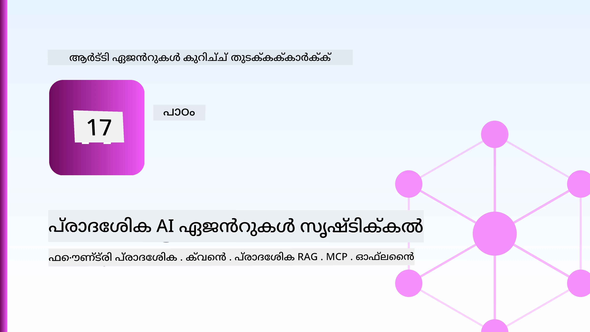
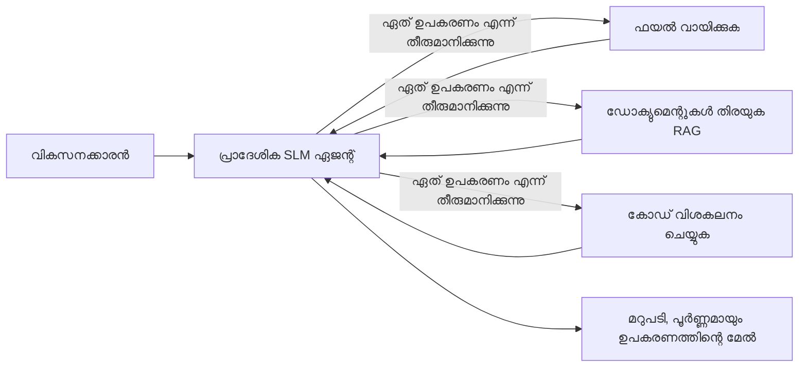
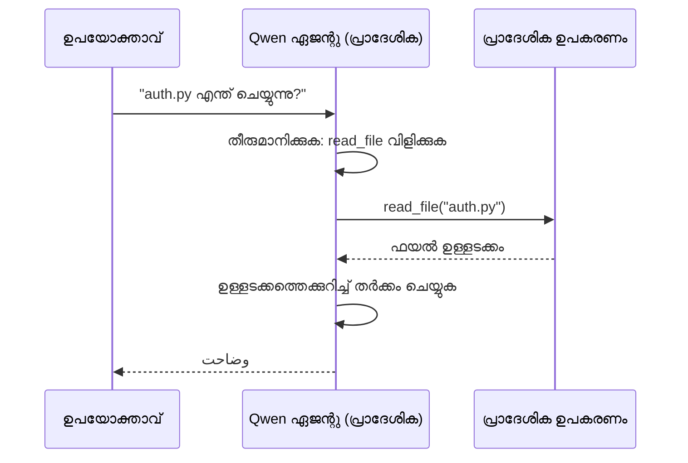
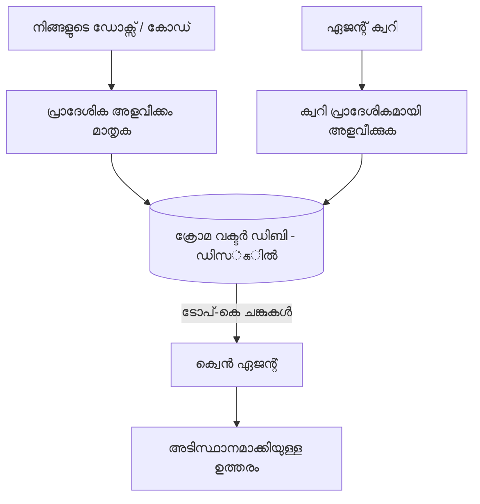
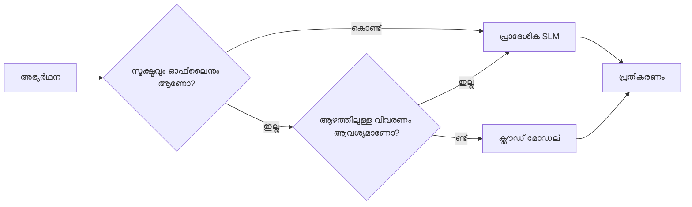

# Microsoft Foundry Localനും Qwenഉം ഉപയോഗിച്ച് ലോക്കൽ എഐ ഏജന്റുകൾ സൃഷ്ടിക്കൽ



മുൻപത്തെ പാഠം ഏജന്റുകൾ ക്ലൗഡിലേക്ക് *വലിയത്രം* വാനെടുത്തത്. ഈ പാഠം അവയെ ഒരു തന്നെ മെഷീനിൽ *താഴേക്ക്* കൊണ്ടുവരുന്നു. പാഠം തീരുമ്പോൾ നിങ്ങൾക്ക് ഓർക്കുന്ന, ടൂൾസ് വിളിക്കുന്ന, നിങ്ങളുടെ ഫയലുകൾ വായിക്കുന്ന, നിങ്ങളുടെ ഡോക്യുമെന്റേഷൻ തിരയുന്നതുൾപ്പെടെയുള്ള ഒരു പ്രവർത്തനക്ഷമമായ എഞ്ചിനീയറിംഗ് സഹായി ഉണ്ടാകും — **ഏത് ക്ലൗഡ് ഇൻഫറൻസ് കോൾ കൂടാതെയാണ്.**

അത് എന്തുകൊണ്ടാണ് നിങ്ങൾക്ക് വേണം? യാഥാർത്ഥ്യ എഞ്ചിനീയറിംഗ് ജോലിയിൽ സ്ഥിരമായി ഉളവാകുന്ന മൂന്ന് കാരണം:

- **സ്വകാര്യത.** കോഡ്‌യും ഡോക്യുമെന്റുകളും ഒരുകീഴിൽ നിന്ന് മെഷീൻ വിട്ടു പോകാറില്ല. ഒരു പ്രോംപ്റ്റും, ഒരു സ്നിപ്പറ്റും, ഒരു ഉപഭോക്തൃ ഡാറ്റയും നെറ്റ്വർക്ക് അതിരു കടക്കാറില്ല.
- **വില.** പ്രാദേശിക ഇൻഫറൻസ് प्रति ടോക്കൺ ബിൽ ഇല്ല. നിങ്ങൾക്ക് മുഴുവൻ ദിവസം വൈദ്യുതി ചിലവിൽ പൊതു തെളിയാം.
- **ഓഫ്ലൈൻ.** ഒരു വിമാനത്തിൽ, സുരക്ഷിത സൌകര്യത്തിൽ, അല്ലെങ്കിൽ ഔട്ടേജിനിടെ ഏജന്റ് ഇത് പ്രവർത്തിക്കും.

പ്രശ്നം എന്തെന്നാൽ നിങ്ങൾ ഫ്രണ്ടിയർ ക്ലൗഡ് മോഡലിന്റെ പകരം നിങ്ങളുടെ CPU, GPU, അല്ലെങ്കിൽ NPU യിൽ പ്രവർത്തിക്കുന്ന ഒരു **ചhavaയ ഭാഷ മോഡൽ (SLM)** ഉപയോഗിക്കുന്നു. ഈ പാഠം അതിന്റെ നിയന്ത്രണത്തിൽ *നല്ല* ഏജന്റുകൾ നിർമ്മിക്കുന്നതേക്കുറിച്ചാണ്, നിയന്ത്രണം ഇല്ലക്കാരനെന്ന് പ്രത്യക്ഷപ്പെടുന്നതിൽ അല്ല.

## പരിചയം

ഈ പാഠം ഉൾക്കൊള്ളുന്നത്:

- **ചhavaയ ഭാഷ മോഡലുകളും (SLMs)** — അവ എന്താണെന്ന്, എവിടെയാണ് അവ ശക്തരെന്ന്, എവിടെയല്ല എന്ന്.
- **Microsoft Foundry Local** — മോഡലുകൾ ഉപകരണത്തിൽ ഡൗൺലോഡ് ചെയ്തും സേവിച്ചും നൽകുന്നൊരു റൺടൈം, അത് **OpenAI-ഉപയോഗയോഗ്യ API** മുഖേന പ്രവർത്തിക്കുന്നു.
- **Qwen ഫംഗ്ഷൻ-കോളിംഗ് മോഡലുകൾ** — വിശ്വാസപ്രദമായ ടൂൾ കോൾസ് സൃഷ്ടിക്കുന്ന SLMകൾ, ഇതാണ് പ്രാദേശിക *ഏജന്റുകൾ* (ചാറ്റ് മാത്രം അല്ല) സാധ്യമാക്കുന്നത്.
- **പ്രാദേശിക ടൂളുകൾ, പ്രാദേശിക RAG, പ്രാദേശിക MCP** — ക്ലൗഡിലവിടാതെ ഏജന്റിന് ശേഷിയേകൽ.
- **ഹൈബ്രിഡ് പാറ്റേണുകൾ** — കാര്യങ്ങൾ പ്രാദേശികവാക്കേണ്ടത് എപ്പോൾ, ക്ലൗഡിലേക്കു എത്തേണ്ടത് എപ്പോൾ.

## പഠന ലക്ഷ്യങ്ങൾ

ഈ പാഠം പൂർത്തിയാക്കിയശേഷം നിങ്ങൾക്ക് അറിയാമാകും:

- SLMകളുടെ ട്രേഡ്-ഓഫുകൾ വിശദമാക്കി അനുയോജ്യമായ പ്രാദേശിക ഏജന്റ് ഉപയോഗ കേസുകൾ കണ്ടെത്തുക.
- Foundry Local വഴി പ്രാദേശികമായി Qwen മോഡൽ സർവ് ചെയ്യാനും OpenAI-ഉപയോഗയോഗ്യ എൻഡ്പോയിന്റുമായി കണക്ടു ചെയ്യാനും.
- മുഴുവൻ വർക്ക്സ്റ്റേഷനിൽ പ്രവർത്തിക്കുന്ന ടൂൾ-കോളിംഗ് ഏജന്റ് നിർമ്മിക്കാനും.
- പ്രാദേശിക വെക്ടർ ഡാറ്റാബേസ് (Chroma) ഉപയോഗിച്ച് നിങ്ങളുടെ സ്വന്തം ഡോക്യുമെന്റുകളിൽ പ്രാദേശിക RAG ചേർക്കാനും.
- പ്രാദേശിക MCP സെർവറുമായി ഏജന്റ് ബന്ധിപ്പിച്ച് ഹൈബ്രിഡ് പ്രാദേശിക/ക്ലൗഡ് ഡിസൈനുകളിൽ കാര്യങ്ങൾ തിരിച്ചറിയാനും വരെ.

## ആവശ്യമായ മുൻിപ്പാതകൾ

ഈ പാഠം മുൻപത്തെ പാഠങ്ങൾ പൂർത്തിയാക്കിയിട്ടുണ്ടെന്ന് കരുതുന്നു, വേണ്ടി:

- [ടൂൾ ഉപയോഗം](../04-tool-use/README.md) (പാഠം 4) ഒപ്പം [ഏജന്റിക് RAG](../05-agentic-rag/README.md) (പാഠം 5).
- [ഏജന്റിക് പ്രോട്ടോകോളുകൾ / MCP](../11-agentic-protocols/README.md) (പാഠം 11).
- [Microsoft Agent Framework](../14-microsoft-agent-framework/README.md) (പാഠം 14).

കൂടാതെ വേണ്ടത്:

- ഒരു ഡെവലപ്പർ വർക്ക്സ്റ്റേഷൻ. **8 GB RAM യഥാർത്ഥപരമായ കുറഞ്ഞത്**; 16 GB+ സൗകര്യപ്രദം. GPU അല്ലെങ്കിൽ NPU സഹായകമാണ്, ആവശ്യമായതിനല്ല.
- **Microsoft Foundry Local** ഇൻസ്റ്റാൾ ചെയ്തിരിക്കുക (താഴെയുള്ള സെറ്റപ്പ് ഭാഗം കാണുക).
- Python 3.12+ සහ റിപോസിറ്ററിയിലെ പാക്കേജുകൾ [`requirements.txt`](../../../requirements.txt), കൂടാതെ `foundry-local-sdk`, `openai`, `chromadb` ഈ പാഠத்திற்கு.

## ചെറിയ ഭാഷാ മോഡലുകൾ: പ്രാദേശിക ജോലിക്ക് ശരിയായ ഉപകരണം

ഫ്രണ്ടിയർ ക്ലൗഡ് മോഡലിന് നൂറുകണക്കിന് ബില്യണുകളോളം പാരാമീറ്ററുകൾ ഉണ്ട്, പിന്നിൽ ഡാറ്റ സെൻട്രുമുണ്ട്. SLMക്ക് കുറച്ച് ബില്യൺ പാരാമീറ്ററുകൾ മാത്രമേ ഉള്ളൂ, അത് നിങ്ങളുടെ ലാപ്ടോപ്പിന്റെ RAMൽ ഒതുക്കേണ്ടതാണ്. ഈ വ്യത്യാസം പ്രതീക്ഷകൾ വ്യക്തമാക്കുന്നു.

**SLMകൾ മികച്ചത്:**

- ഘടിതവും പരിമിതവുമായ പണികൾ — తరഗീകരണം, പ്രയോഗം, ഒരു അറിയപ്പെട്ട ഡോക്യുമെന്റിന്റെ സംഗ്രഹം.
- **ടൂൾ കോളിംഗ്** — ഏത് ഫംഗ്ഷൻ വിളിക്കണമെന്ന് നിന്നും ഏത്.Arguments ഉപയോഗിക്കണമെന്ന് തീരുമാനിക്കൽ.
- നിങ്ങളുടെ സ്വന്തം ഡാറ്റയിൽ വേഗത്തിൽ, വിലകുറഞ്ഞ, സ്വകാര്യമായ ആവർത്തനങ്ങൾ.

**SLMകൾ തമാശയായത്:**

- തുറന്ന, മൾട്ടി ഹോപ്പ് ആലോചന വലുതായ പ്രായോഗികത.
- വ്യാപക ലോകം അറിവ് (അവർ കുറഞ്ഞതും മറക്കുന്നതും).

പ്രാദേശിക ഏജന്റുകൾക്ക് വിജയകരമായ തന്ത്രം: **SLM ഓർക്കസ്ട്രേറ്റ് ചെയ്യട്ടെ, ടൂളുകൾ കഠിനമായ പണി ചെയ്യട്ടെ.** മോഡലിന് നിങ്ങളുടെ കോഡ് ബേസ് *അറിയേണ്ടതില്ല* — അത് `read_file` വിളിക്കേണ്ട സമയവും `search_docs` വിളിക്കേണ്ട സമയവും അറിയണം. ഇത് ശരിക്കും SLMയുടെ ശക്തിക്ക് അനുയോജ്യമാണ്.



## Microsoft Foundry Local

**Microsoft Foundry Local** ഒരു ലൈറ്റ് വെയിറ്റ് റൺടൈമാണ്, നിങ്ങളുടെ മെഷീനിൽ മൂല്യങ്ങൾ ഡൗൺലോഡ്, മാനേജ്, സേവനം നൽകുന്നു. നമുക്ക് ഏറ്റവും പ്രധാനമാണ് അതിന്റെ **OpenAI-ഉപയോഗയോഗ്യ HTTP എൻഡ്പോയിന്റ്** നല്‍കുന്ന സവിശേഷത — അതായത് OpenAI SDKയും Microsoft Agent Frameworkഇന്റെ OpenAI ക്ലയന്റും `base_url` മാറ്റുന്നതു മാത്രം കൊണ്ട് അത് ഉപയോഗപ്പെടുത്തി പ്രവർത്തിക്കും. ഏജന്റ് നിർമ്മിക്കുന്നതിനെ കുറിച്ച് നിങ്ങള്‍ പഠിച്ച എല്ലാ അറിവും നേരിട്ട് ഇక్కడ ഉപയോഗിക്കാം; എൻഡ്പോയിന്റ് മാത്രമാണ് ക്ലൗഡിൽ നിന്നു `localhost`-ലേക്ക് മാറുന്നത്.

Foundry Local നിങ്ങളുടെ ഹാർഡ്വെയറിനുള്ള മികച്ച മോഡൽ നിർമ്മിതിയോ തിരഞ്ഞെടുക്കുന്നു — CPU ബിൽഡ്, CUDA/GPU ബിൽഡ് അല്ലെങ്കിൽ NPU ബിൽഡ് — അതുകൊണ്ടു മെഷീൻ പ്ര кож്യമായി നിങ്ങൾക്ക് കൈ കൊണ്ട് ഒപ്റ്റിമൈസ് ചെയ്യേണ്ടതില്ല.

### സെറ്റപ്പ്

Foundry Local ഇൻസ്റ്റാൾ ചെയ്യുക (നിങ്ങളുടെ ഒഎസിന് [ഡോക്യുമെന്റേഷൻ](https://learn.microsoft.com/azure/ai-foundry/foundry-local/) കാണുക), തുടർന്ന് പ്രവർത്തിക്കുന്നത് സ്ഥിരീകരിക്കുക:

```bash
# ഇൻസ്റ്റാൾ ചെയ്യുക (ഉദാഹരണത്തിന്; നിങ്ങളുടെ പ്ലാറ്റ്ഫോമിന്റെ ഡോക്സ് പാലിക്കുക)
winget install Microsoft.FoundryLocal      # വിൻഡോസ്
# brew install microsoft/foundrylocal/foundrylocal   # macOS

# Qwen മോഡൽ ഡൗൺലോഡ് ചെയ്ത് চালിക്കുക, പിന്നെ ലോക്കൽ സേവനം ആരംഭിക്കുക
foundry model run qwen2.5-7b-instruct
foundry service status
```

സർവീസ് പ്രവർത്തിച്ചതിനുശേഷം നിങ്ങളുടെ പ്രാദേശിക, OpenAI-ഉപയോഗയോഗ്യ എൻഡ്പോയിന്റ് ഉണ്ടായിരിക്കും (സാധാരണ `http://localhost:PORT/v1`). നോട്ട്‌ബുക്ക് `foundry-local-sdk` ഉപയോഗിച്ച് എൻഡ്പോയിന്റ് സ്വയം കണ്ടെത്തുന്നു, അതിനാൽ നിങ്ങൾക്കു പോർട്ട് ഹാർഡ്‌കോഡ് ചെയ്യേണ്ടതില്ല.

## Qwen ഫംഗ്ഷൻ കോളിങ്ങ്: അതിൻറെ പ്രാധാന്യം

ടൂൾസ് വിളിക്കാൻ കഴിയുന്നവയാൺ ഒരേയൊരു ഏജന്റ്. പല SLMകൾക്ക് ചാറ്റ് സാധ്യമാകാം, പക്ഷെ അവ വിശ്വാസയോഗ്യമല്ലാത്തും തെറ്റായ ഫംഗ്ഷൻ-കോളുകൾ ഉണ്ടാക്കും. **Qwen** മോഡലുകൾ ഫംഗ്ഷൻ കോളിങ്ങിനായി പാഠ്യപ്പെടുത്തിയതാണ്, ഒരു രീതി പാലിച്ച ടൂൾ-കാൾ ഘടനകൾ സ്ഥിരമായി ഉത്പാദിപ്പിക്കുന്നു — ഇതുതന്നെയാണ് പ്രാദേശിക ചാറ്റ് മോഡലിനെ പ്രാദേശിക *ഏജന്റായി* മാറ്റുന്നത്.

പ്രവാഹം നിങ്ങൾ മുമ്പ് അറിയുന്ന സാധാരണ ടൂൾ-കോളിംഗ് ലൂപ് തന്നെയാണ്, ഉപകരണത്തിൽ പ്രവർത്തിക്കുന്നു മാത്രം:



## പ്രാദേശിക RAG

ഡോക്യുമെന്റേഷൻ തിരച്ചിൽ പ്രാദേശിക ഏജന്റുകൾക്ക് തകർപ്പൻ പ്രകടനം നൽകും. SLM നിങ്ങളുടെ ഫ്രെയിംവർക്കിന്റെ ഡോക്സ് ഓർമ്മിച്ചിരിക്കുന്നത് പ്രതീക്ഷിക്കേണ്ടത് പകരം, അത് ആ ഡോക്സുകൾ ഒരു **പ്രാദേശിക വെക്ടർ ഡാറ്റാബേസിൽ** ബിന്ദു ചെയ്യുകയും ആവശ്യത്തിനു പ്രാസക്തമായ ഭാഗങ്ങൾ ഏജന്റ് തിരികെ കിട്ടുകയും ചെയ്യുക.

ഞങ്ങൾ **Chroma** ഉപയോഗിക്കുന്നു, ഒരു എംബഡഡ് വെക്ടർ സ്റ്റോർ, സേർവർ മാനേജ്മെന്റ് ഇല്ലാതെ പ്രോസസ്സ്-ഇൻറു പ്രവർത്തിക്കുന്നു. പൈപ്പ്‌ലൈൻ മുഴുവനും പ്രാദേശികമാണ്: പ്രാദേശിക എംബഡിംഗ് മോഡൽ → പ്രാദേശിക വെക്ടറുകൾ → പ്രാദേശിക വീണ്ടെടുക്കൽ → പ്രാദേശിക SLM.



ഇത് പാഠം 5ലെ ഏജന്റിക് RAG പാറ്റേൺ തന്നെയാണ് — മാറിയത് ഏതെല്ലാം ഘടകങ്ങളും നിങ്ങളുടെ മെഷീനിൽ പ്രവർത്തിക്കുന്നതാണ്.

## പ്രാദേശിക MCP സർവറുകൾ

[MCP](../11-agentic-protocols/README.md) ഒരു ട്രാൻസ്പോർട്ടാണ്, ക്ലൗഡ് സേവനം അല്ല. MCP സർവർ പ്രാദേശിക പ്രക്രിയയായി `stdio`-യിൽ പ്രവർത്തിക്കാം, ഏജന്റിന് ടൂളുകൾ സ്റ്റാൻഡേർഡ് പ്രോട്ടോകോളിലൂടെ ലഭ്യമാക്കുന്നു. ഇത് MCP സർവറുകളുടെ വർദ്ധിച്ചുവരുന്ന ഇക്കോസിസ്റ്റം, ഫയൽസിസ്റ്റം ആക്സസ്, git പ്രവർത്തനങ്ങൾ, ഡാറ്റാബേസ് ക്വൈറ്റുകൾ — മുഴുവനും ഓഫ്ലൈനായി ഞങ്ങൾ ഉപയോഗപ്പെടുത്താൻ സാധിക്കും.

സുരക്ഷാ നിലവാരം ക്ലൗഡിൽനിന്ന് വ്യത്യസ്തമായെങ്കിലും ഇല്ല എന്നല്ല: പ്രാദേശിക MCP സർവർ നിങ്ങളുടെ ഉപയോക്താവിന്റെ അനുമതികളിൽ പ്രവർത്തിക്കുന്നതിനാൽ, അത് സ്പർശിക്കുന്നിടം പരിധിവെക്കുക (ഒരു പ്രോജക്ട് ഡയറക്ടറിയിൽ മാത്രം, നിങ്ങളുടെ മുഴുവൻ ഹോം ഫോൾഡർ അല്ല) മറുപടികൾ ഇൻപുട്ടായി കരുതി പരിശോധിക്കുക.

## ഹൈബ്രിഡ് ക്ലൗഡ്-പ്രാദേശിക പാറ്റേണുകൾ

പ്രാദേശിക-ആദ്യം എന്നാൽ പ്രാദേശിക-മാത്രം അല്ല. പ്രായോഗിക സംവിധാനങ്ങൾ പ്രതിസന്ധി പ്രാധാന്യത്തിന് അനുസരിച്ച് റൂട്ടുചെയ്യുന്നു:

| അവസ്ഥ | എവിടെ പ്രവർത്തിക്കുന്നു |
| --- | --- |
| സ്വകാര്യ കോഡ് / ഡാറ്റ / അല്ലെങ്കിൽ ഓഫ്‌ലൈനിൽ | **പ്രാദേശിക SLM** |
| ലളിതവും പരിമിതവുമായ പണി | **പ്രാദേശിക SLM** (വിലകുറഞ്ഞതും വേഗവുമായ) |
| ബുദ്ധിമുട്ടുള്ള മൾട്ടി-ഹോപ്പ് ആലോചന അസ്വതന്ത്ര ഡാറ്റയിൽ | **ക്ലൗഡ് മോഡൽ** |
| എല്ലാതരം ജോലികളും, ഔട്ടേജിനിടയിൽ | **പ്രാദേശിക SLM** (മൃദുവായ കുറവ്) |

ഇത് പാഠം 16ലെ **മോഡൽ റൂട്ടിംഗ്** ആശയം സമാനമാകുന്നു — വ്യത്യാസം ഒരു "മോഡലിൽ" ഇപ്പോൾ നിങ്ങളുടെ സ്വന്തം മെഷീൻ ആണെന്ന്. ഒരു ഉറച്ച ഡിസൈൻ ക്ലൗഡ് ലഭ്യമില്ലെങ്കിൽ പ്രാദേശികത്തേക്ക് തിരികെയെത്തും, അതിനാൽ ഏജന്റ് മുഴുവനായും പരാജയപ്പെടാതെ മിതമായി കുറയുന്നു.



## ഹാൻഡ്സ്-ഓൺ ലാബ്: പ്രാദേശിക എഞ്ചിനീയറിംഗ് സഹായി

[`code_samples/17-local-agent-foundry-local.ipynb`](./code_samples/17-local-agent-foundry-local.ipynb) തുറന്ന് അതിലൂടെ പ്രവർത്തിക്കുക. നിങ്ങൾ നിർമ്മിക്കുന്നതാകും ഒരു **പ്രാദേശിക എഞ്ചിനീയറിംഗ് സഹായി**; ഇത് മുഴുവനായും നിങ്ങളുടെ വർക്ക്സ്റ്റേഷനിൽ പ്രവർത്തിക്കും, കൂടാതെ:

1. **ടൂളുകൾ വിളിക്കും** — Foundry Local മുഖാന്തിരം Qwen ഫംഗ്ഷൻ കോളിങിലൂടെ.
2. **പ്രാദേശിക ഫയൽ പ്രവർത്തനങ്ങൾ നടത്തും** — ഒരു പ്രോജക്ട് ഡയറക്ടറിയിലുള്ള ഫയലുകൾ ലിസ്റ്റ് ചെയ്യുകയും വായിക്കുകയും.
3. **കോഡ് വിശകലനം** — ഒരു സോഴ്‌സ് ഫയലിൽ അടിസ്ഥാന മെട്രിക്കുകൾ റിപ്പോർട്ട് ചെയ്യുക.
4. **ഡോക്യുമെന്റേഷൻ തിരയൽ** — Chroma ഉപയോഗിച്ച് ഡോക്സ് ഫോൾഡറിന്റെ പ്രാദേശിക RAG.
5. **MCP ഉപയോഗിക്കുക** — പ്രാദേശിക MCP സർവറുമായി ബന്ധിപ്പിക്കുക (ഏതെങ്കിലുമില്ലെങ്കിൽ സ്‌കിപ്പ്).

ഒരു ക്ലൗഡ് ഇൻഫറൻസ് ഉപയോഗിക്കരുത്.

### പ്രവൃത്തി മേൽനോട്ടം

സഹായി Foundry Local-ൽ OpenAI-ഉപയോഗയോഗ്യ എൻഡ്പോയിന്റ് വഴി കണക്ട് ചെയ്യുന്നു, അതിനാൽ ഏജന്റ് കോഡ് ക്ലൗഡ് പാഠങ്ങളോട് തുല്യമാണ് — ക്ലയന്റ് മാത്രം മാറുന്നു:

```python
from foundry_local import FoundryLocalManager
from openai import OpenAI

# ഫൗൺഡ്രി ലോക്കൽ മോഡൽ കണ്ടെത്തുകയും ഡൗൺലോഡ് ചെയ്യുകയും ചെയ്ത് നമുക്ക് ഒരു ലോക്കൽ എൻഡ്‌പോയിന്റ് നൽകുന്നു.
manager = FoundryLocalManager(\"qwen2.5-7b-instruct\")
client = OpenAI(base_url=manager.endpoint, api_key=manager.api_key)  # api_key ഒരു ലോക്കൽ പ്ലേസ്‌ഹോൾഡർ ആണ്.
```

ടൂളുകൾ സാധാരണ Python ഫംഗ്ഷനുകളാണ്, പ്രോജക്ട് ഡയറക്ടറിയിൽ പരിമിതപ്പെടുത്തിയിട്ടുണ്ട്:

```python
def read_file(path: str) -> str:
    \"\"\"Read a file, but only inside the sandboxed project directory.\"\"\"
    full = (PROJECT_ROOT / path).resolve()
    if PROJECT_ROOT not in full.parents and full != PROJECT_ROOT:
        return \"Access denied: path is outside the project directory.\"
    return full.read_text(encoding=\"utf-8\")
```

സാൻഡ്ബോക്‌സ് പരിശോധന ശ്രദ്ധിക്കുക — പ്രാദേശികത്തിലും ഇന്നും, അല്ലെങ്കിൽ എല്ലായ്പ്പോഴും, ഒരുമിനുറ്റി പാതകൾ വായിക്കുന്നൊരു ടൂൾ ബാധ്യതയാണ്. നോട്ട് ബുക്ക് എല്ലാ ടൂളുകളും ഒരു പ്രോജക്ട് റൂട്ടിൽ പരിമിതപ്പെടുത്തുന്നു.

## അറിവ് പരിശോധിക്കുക

അസൈൻമെന്റിലേയ്ക്ക് മാറുന്നതിനു മുൻപ് നിങ്ങളുടെ മനസ്സിലാക്കൽ പരിശോധിക്കുക.

**1. ഏജന്റിനെ പ്രാദേശികമായി പ്രവർത്തിപ്പിക്കാൻ ക്ലൗഡിൽക്കാൾ രണ്ടുതരം പ്രായോഗിക കാരണങ്ങൾ പറയൂ.**

<details>
<summary>ഉത്തരം</summary>

ഇവയിൽ ഏതെങ്കിലും രണ്ട്: **സ്വകാര്യത** (കോഡും ഡാറ്റയും മെഷീൻ വിട്ടു പോവുകയില്ല), **വില** (പ്രതി ടോക്കൺ ഇൻഫറൻസ് ബിൽ ഇല്ല), **ഓഫ്ലൈൻ ശേഷി** (നെറ്റ്വർക്ക് ഇല്ലാതെ പ്രവർത്തിക്കും — വിമാനത്തിൽ, സുരക്ഷിത സൌകര്യത്തിൽ അല്ലെങ്കിൽ ഔട്ടേജിന്റെ സമയം). ഉപകരണത്തിന് പുറത്തേക്ക് ഡാറ്റ അയക്കാനാകാത്ത നിയമ/മാനദണ്ഡം സ്വകാര്യത കാരണത്തെ സഹായിക്കുന്നു.
</details>

**2. പ്രാദേശിക ഏജന്റിൽ SLMക്കും അതിന്റെ ടൂളുകൾക്കും ഇടയിൽ ശുപാർശ ചെയ്യുന്ന ജോലി വിഭജനം എന്ത്, എന്തുകൊണ്ട്?**

<details>
<summary>ഉത്തരം</summary>

SLM **ഓർക്കസ്ട്രേറ്റ്** ചെയ്യട്ടെ (ഏത് ടൂൾ വിളിക്കണം, എന്ത് Arguments ലഭിക്കണം തീരുമാനിക്കുക), **ടൂളുകൾ കഠിന പണി ചെയ്യട്ടെ** (ഫയലുകൾ വായിക്കൽ, ഡോക്സ് വീണ്ടെടുത്തു കൊണ്ടു വരൽ, ഫലങ്ങൾ കണക്കുകൂട്ടൽ). SLMകൾ ടൂൾ തിരഞ്ഞെടുപ്പ് പോലുള്ള പരിമിത തീരുമാനങ്ങളിൽ ശക്തവാണ്, എന്നാൽ വ്യാപക അറിവിലും ദൈർഘ്യമേറിയ മൾട്ടി-ഹോപ്പ് ആലോചനയിലും തലച്ചോറുകൾക്കുറവുണ്ട്, അതിനാൽ ടൂളിൽ ആശ്രയിക്കലാണ് അവരുടെ ശക്തിക്കനുസരിച്ചുള്ളത്.
</details>

**3. Foundry Local ഉപയോഗിച്ച് ക്ലൗഡ് ഏജന്റ് കോഡ് വീണ്ടും ഉപയോഗിക്കാൻ കഴിയും എന്ന് എന്താണ് കാരണമാക്കുന്നത്?**

<details>
<summary>ഉത്തരം</summary>

Foundry Local ഒരു **OpenAI-ഉപയോഗയോഗ്യ HTTP എൻഡ്പോയിന്റ്** പ്രദാനം ചെയ്യുന്നു. OpenAI SDKയും ഏജന്റ് ഫ്രെയിംവർക്ക് OpenAI ക്ലയന്റും `base_url` മാത്രം മാറ്റി പ്രവർത്തിക്കും (പ്രാദേശിക API കീ ഉപയോഗിക്കുന്നു). ഏജന്റ് കോഡിന്റെ മറ്റു എല്ലാ കാര്യങ്ങളും ഒരുപോലെ തുടരും.
</details>

**4. എന്തുകൊണ്ട് ഏതൊരു SLM-ഉം അല്ലാതെ Qwen ഫംഗ്ഷൻ-കോളിംഗ് മോഡലാണ് പ്രത്യേകിച്ച് ഉപയോഗിക്കുന്നത്?**

<details>
<summary>ഉത്തരം</summary>

ഒരു ഏജന്റ് വിശ്വാസയോഗ്യമായ, നന്നായി ഘടിപ്പിച്ച **ടൂൾ കോളുകൾ** ഉൽപ്പാദിപ്പിക്കണം. പല SLMകളും ചാറ്റ് കഴിയും, പക്ഷെ തെറ്റായ അല്ലെങ്കിൽ അസംഗതമായ ടൂൾ-കാൾ ഘടനകൾ സൃഷ്ടിക്കും. Qwen മോഡലുകൾ ഫംഗ്ഷൻ കോളിങ്ങിന് പരിശീലിയാൽ, സ്ഥിരമായി ശരിയായ ടൂൾ കോളുകൾ ഉൽപ്പാദിപ്പിക്കുന്നു, അതുകൊണ്ടുതന്നെയാണ് പ്രാദേശിക ചാറ്റ് മോഡൽ പ്രാദേശിക ഏജന്റായി മാറുന്നത്.
</details>

**5. പ്രാദേശിക RAG പൈപ്പ്‌ലൈൻ ഏത് ഘടകങ്ങൾ മെഷീനിൽ പ്രവർത്തിക്കുന്നു?**

<details>
<summary>ഉത്തരം</summary>

എല്ലാ ഘടകങ്ങളും: എംബഡിംഗ് മോഡൽ, വെക്ടർ ഡാറ്റാബേസ് (ച്രോമ, ഡിസ്കിൽ), വീണ്ടെടുപ്പ് ഘട്ടം, SLM. ഡോക്യുമെന്റുകൾ പ്രാദേശികമായി എംബഡ് ചെയ്യപ്പെടുന്നു, പ്രാദേശികമായി സൂക്ഷിക്കപ്പെടുന്നു, പ്രാദേശികമായി വീണ്ടെടുക്കുന്നു, പ്രാദേശിക മോഡൽ ആലോചിക്കുന്നു — ക്ലൗഡിൽ ഒന്നും ബന്ധപ്പെട്ടിട്ടില്ല.
</details>

**6. നിങ്ങളുടെ മെഷീനിൽ പ്രാദേശിക MCP സർവർ പ്രവർത്തിക്കുന്നു. അതുകൊണ്ട് അത് സ്വയം സുരക്ഷിതമാണോ? എന്ത് മുൻകരുതലുകൾ എടുക്കണം?**

<details>
<summary>ഉത്തരം</summary>

അല്ല. പ്രാദേശിക MCP സർവർ നിങ്ങളുടെ ഉപയോക്താവിന്റെ അനുമതികളിൽ പ്രവർത്തിക്കുകയാൽ, നിങ്ങൾക്ക് ലഭ്യമായ എല്ലാ ഫയലുകളേയും സ്പർശിക്കാൻ കഴിയും. അതിനാൽ അതിന് ആവശ്യമുള്ള അടിയന്തരമായ മേഖലകൾക്കുള്ള പരിധി കാണിച്ച് (ഉദാഹരണത്തിന് ഒരു പ്രോജക്ട് ഡയറക്ടറി മാത്രം, മുഴുവൻ ഹോം ഫോൾഡർ അല്ല) അതിന്റെ ഔട്ട്പുട്ടുകൾ ഇൻപുട്ടായി കരുതി പരിശോദിക്കുക.
</details>

**7. പ്രാദേശിക മോഡൽ ഉൾപ്പെടുന്ന അനുയോജ്യമായ ഹൈബ്രിഡ് റൂട്ടിംഗ് നിയമം വിശദീകരിക്കുക.**

<details>
<summary>ഉത്തരം</summary>

സ്വകാര്യ അല്ലെങ്കിൽ ഓഫ്ലൈനായ അഭ്യർത്ഥനകൾ പ്രാദേശിക SLM-ലേക്ക് തിരയുക; ലളിതവും പരിമിതവുമായ പണികൾ വേഗത്തിനും ചെലവിനും പ്രാദേശിക SLM-ലേക്ക് അയയ്ക്കുക; ബുദ്ധിമുട്ടുള്ള മൾട്ടി-ഹോപ്പ് ആലോചന അസ്വതന്ത്ര ഡാറ്റയിൽ ക്ലൗഡ് മോഡലിലേക്ക് മുൻഗണന നൽകുക; മേഘം ലഭ്യമായില്ലെങ്കിൽ പ്രാദേശിക SLM-ലേക്ക് തിരിച്ചുപോകുക, അതിനാൽ ഏജന്റ് പരാജയപ്പെടാതെ സപ്തമായ ചതുരവും ഉയർന്ന നിലവാരവും സംരക്ഷിക്കും. ഇത് പാഠം 16ലെ മോഡൽ റൂട്ടിംഗാണ്, പ്രാദേശിക മെഷീൻ ഒരു മോഡലായി.
</details>

**8. ഈ പാഠത്തിലെ പ്രാദേശിക ഏജന്റ് പ്രവർത്തിപ്പിക്കാൻ യാഥാർത്ഥ്യപരമായ കുറഞ്ഞ RAM എത്ര, കൂടുതൽ RAM കോൾ ചെയ്യുന്ന ഗുണം എന്ത്?**

<details>
<summary>ഉത്തരം</summary>

ഏകദേശം **8 GB** യഥാർത്ഥ കുറഞ്ഞത്; 16 GB+ സൗകര്യപ്രദം. കൂടുതൽ RAM വലിയ, കഴിവേറിയ മോഡലുകൾ പ്രവർത്തിപ്പിക്കാനും കൂടുതൽ കോൺടക്‌സ്‌റ്റ് മെമറിയെ സൂക്ഷിക്കാനും സഹായിക്കും. GPU അല്ലെങ്കിൽ NPU ഇൻഫറൻസ് വേഗത്തിലാക്കുന്നു, പക്ഷെ ആവശ്യമായതല്ല — Foundry Local പുതിയ ബിൽഡ് തിരഞ്ഞെടുക്കുമ്പോൾ സാന്ദ്രികരണമില്ലാത്ത CPU ബിൽഡ് തിരയും.
</details>

## അസൈൻമെന്റ്

പ്രാദേശിക എഞ്ചിനീയറിംഗ് സഹായിയെ ഒരു **പ്രാദേശിക ഡോക്യുമെന്റേഷൻ അവലോകനക്കാരനായി** നിങ്ങളുടെ ഇഷ്ടമുള്ള ഒരു ചെറിയ പ്രോജക്ടിനായി വികസിപ്പിക്കുക (നിങ്ങൾ ആഗ്രഹിക്കുന്നെങ്കിൽ ഈ റിപോസിറ്ററിയിലെ പാഠ ഫോൾഡറുകളിൽ ഒന്നുപയോഗിക്കുക).

നിങ്ങളുടെ സമർപ്പണം കൂടെ:

1. ഒരു യഥാർത്ഥ ഡോക്സ്/കോഡ് ഫോൾഡർ Chroma-യിൽ ഇൻഡക്സ് ചെയ്യുക (കുറഞ്ഞത് അഞ്ചു ഫയലുകൾ).
2. `find_todos` ടൂൾ ചേർക്കുക, പ്രോജക്ടിലുള്ള `TODO`/`FIXME` കമന്റുകൾ സ്കാൻ ചെയ്തു അവ ഫയൽ, ലൈൻ നമ്പർ സ്ഥിരീകരിച്ച് തിരിച്ചുകിട്ടുമെന്നു കാണിക്കുക — `read_file` പോലുള്ള സാൻഡ്ബോക്‌സ് പരിശോധന തുടരുക.

3. **ഓപ്പ്‌റേറ്ററെ ഉപകരണങ്ങൾ സംയോജിപ്പിക്കാൻ നിർബന്ധിതമാക്കുന്ന മൂന്ന് ചോദ്യങ്ങൾ ചോദിക്കുക**:ഒരു റാഗ് ചോദ്യം, നിശ്ചിത ഫയൽ വായിക്കേണ്ടതുള്ള ഒരു ചോദ്യം, TODO കണ്ടെത്തേണ്ട ഒരു ചോദ്യം.
4. **അളക്കുക**: ആ മൂന്ന് ഉത്തരം ഓരോതും സമയമെടുക്കുക, അത് ഒരു മാർക്ക് ഡൗൺ സെല്ലിൽ രേഖപ്പെടുത്തുക. നിങ്ങളുടെ ഉദ്ദേശിക്കുന്ന പ്രവൃത്തി പ്രവാഹത്തിന് ലേറ്റൻസി അനുയോജ്യമാണോ എന്ന് അഭിപ്രായപ്പെടുക.

പിന്നീടുള്ള ഇവിടെ ഈ റിവ്യൂവർക്കായി **ക്ലൗഡിലേക്ക് എന്ത് മാറ്റും, ലൊക്കലിൽ എന്ത് വച്ചുനിൽക്കും** എന്നതിന്റെ ഒരു ചെറിയ പാരഗ്രാഫ് എഴുതുക, എന്തിന് ആ വിധം എന്ന് കാഴ്ചവെക്കുക. ലൊക്കൽ ഘടകങ്ങൾ ശരിയായി ബന്ധിപ്പിച്ചിട്ടുണ്ടോ, നിങ്ങളുടെ ഹൈബ്രിഡ് സങ്കല്പനം യോഗ്യതയുള്ളതാണോ എന്നതാണ് മാദിരിയുടെ ഗുണനിലവാരത്തിന് പകരം വിലയിരുത്തപ്പെടുന്നത്.

## സംക്ഷേപം

ഈ പാഠത്തിൽ നിങ്ങൾ സ്വതന്ത്രമായുള്ള നിങ്ങളുടെ കമ്പ്യൂട്ടറിൽ പൂർണ്ണമായും പ്രവർത്തിക്കുന്ന ഒരു ഏജന്റിനെ നിർമ്മിച്ചു:

- **SLMs** വീതിയായി പ്രൈവസി, ചെലവ്, ഓഫ്‌ലൈൻ പ്രവർത്തനം എന്നിവയ്ക്ക് വ്യാപ്തി വേദന പങ്കുവെക്കുന്നു — സ്വയം എല്ലാ അറിവുകളും കൈവരുത്തുന്നതിനുമപ്പുറം **ഉപകരണങ്ങൾ ഓർക്കസ്‌ട്രേറ്റ് ചെയ്യുമ്പോൾ** മികച്ചതു.
- **Foundry Local** നിങ്ങളുടെ മോഡലുകൾ **OpenAI-ഓളടിൾ എന്റ്പോയിന്റ്** പിന്നിൽ ഉപകരണത്തിൽ സേവനം നൽകുന്നു, അതുകൊണ്ട് നിങ്ങളുടെ ക്ലൗഡ് ഏജന്റ് കോഡ് ഒരു ലൈനിൽ മാറ്റം കൊണ്ട് ട്രാൻസ്ഫർ ചെയ്യാം.
- **Qwen ഫങ്‌ഷൻ-കോൾ ചെയ്യുന്നതിന്റെ മോഡലുകൾ** വിശ്വസനീയമായ ലൊക്കൽ ഉപകരണം കോൾ ചെയ്യുന്നതും അതിനാൽ ലൊക്കൽ *ഏജന്റുകൾ* സാധ്യമാക്കുന്നു.
- **ലൊക്കൽ RAG** (ക്രോമ) һәм **ലൊക്കൽ MCP** ഏജന്റ് കഴിവ് നൽകുന്നു മെഷീൻ വിടാതെ.
- **ഹൈബ്രിഡ് പാറ്റേണുകൾ** സെൻസിറ്റിവിറ്റിയും ബുദ്ധിമുട്ടും പാതയിടാൻ അനുവദിക്കുന്നു, ലൊക്കൽ എളുപ്പ സാധ്യമായ ക്രമീകരണമായി.

ഇത് വിനിയോഗ പ്രക്രിയ പൂര്‍ത്തിയാക്കുന്നു: പാഠം 16 ഏജന്റുകളെ Microsoft Foundry-യിലേക്ക് ഉയർത്തുകയും ഈ പാഠം അതിനെ ഒറ്റ വർക്ക്സ്റേഷൻ വരെ കുറയ്ക്കുകയും ചെയ്തു. അടുത്ത പാഠം വിനിയോഗിച്ച ഏജന്റുകൾ സുരക്ഷിതമാക്കുന്നതിനെ കുറിച്ചാണ്.

## അധിക സ്രോതസ്സുകൾ

- <a href="https://learn.microsoft.com/azure/ai-foundry/foundry-local/" target="_blank">Microsoft Foundry Local ഡോക്യുമെന്റേഷൻ</a>
- <a href="https://learn.microsoft.com/azure/ai-foundry/what-is-azure-ai-foundry" target="_blank">Microsoft Foundry ഡോക്യുമെന്റേഷന്</a>
- <a href="https://aka.ms/ai-agents-beginners/agent-framework" target="_blank">Microsoft Agent Framework</a>
- <a href="https://qwen.readthedocs.io/en/latest/framework/function_call.html" target="_blank">Qwen ഫങ്‌ഷൻ കോൾ ഡോക്യുമെന്റേഷൻ</a>
- <a href="https://modelcontextprotocol.io/" target="_blank">Model Context Protocol (MCP)</a>
- <a href="https://docs.trychroma.com/" target="_blank">Chroma വെക്ടർ ഡാറ്റാബേസ്</a>

## മുൻപത്തെ പാഠം

[Deploying Scalable Agents](../16-deploying-scalable-agents/README.md)

## അടുത്ത പാഠം

[Securing AI Agents](../18-securing-ai-agents/README.md)

---

<!-- CO-OP TRANSLATOR DISCLAIMER START -->
**അറിയിപ്പ്**:
ഈ രേഖ AI പരിഭാഷാ സേവനം [Co-op Translator](https://github.com/Azure/co-op-translator) ഉപയോഗിച്ച് പരിഭാഷപ്പെടുത്തിയതാണ്. ഞങ്ങൾ കൃത്യതയ്ക്കായി ശ്രമിക്കുന്നുവെങ്കിലും, ഓട്ടോമേറ്റഡ് പരിഭാഷകളിൽ പിഴവുകൾ അല്ലെങ്കിൽ തെറ്റായ വിവരങ്ങൾ ഉണ്ടാകാൻ സാധ്യതയുണ്ട്. അതിന്റെ സ്വാഭാവിക ഭാഷയിലുള്ള അസൽ രേഖയാണ് പ്രാമാണികമായ ഉറവിടമായി പരിഗണിക്കേണ്ടത്. നിർണായകമായ വിവരങ്ങൾക്ക്, പ്രൊഫഷണൽ മനുഷ്യ പരിഭാഷ ശുപാർശ ചെയ്യുന്നു. ഈ പരിഭാഷ ഉപയോഗിച്ച് ഉണ്ടാകുന്ന തെറ്റിദ്ധാരണകൾ അല്ലെങ്കിൽ തെറ്റായ വ്യാഖ്യാനങ്ങൾക്കായി ഞങ്ങൾ ഉത്തരവാദികളല്ല.
<!-- CO-OP TRANSLATOR DISCLAIMER END -->