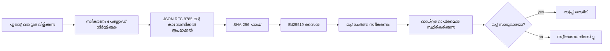
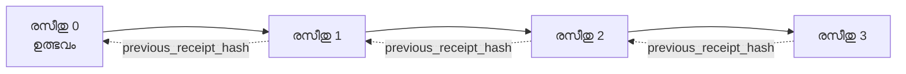

[പാഠ വീഡിയോ കാണുക: കൃത്രിമബുദ്ധി ഏജന്റുകളെ ക്രിപ്റ്റോഗ്രാഫിക് രസീത് ഉപയോഗിച്ച് സുരക്ഷിതമാക്കൽ](https://youtu.be/PLACEHOLDER_VIDEO_ID)

> _(പാഠ വീഡിയോയും തംബ്‌നെയിലും മർജ്‌ ചെയ്ത് ശേഷം മൈക്രോസോഫ്ട് കണ്ടന്റ് ടീം ചേർക്കുന്നതാണ്, പാഠം 14 / 15 ന്റെ نمൂനത്തിന് അനുയോജ്യം.)_

# ക്രിപ്റ്റോഗ്രാഫിക് രസീത് ഉപയോഗിച്ച് AI ഏജന്റുകൾ സുരക്ഷിതമാക്കൽ

## ആമുഖം

ഈ പാഠത്തിൽ കവർചെയ്യുന്നത്:

- ഏജന്റുകളുടെ ഓഡിറ്റ് ട്രെയ്‌ലുകൾ അനുയോജ്യത, ഡീബഗിംഗ്, വിശ്വാസ്യത എന്നിവയ്ക്ക് എന്തുകൊണ്ട് പ്രധാനമാണെന്ന്.
- ക്രിപ്റ്റോഗ്രാഫിക് രസീത് എന്താണെന്നും അത് ഒപ്പിടാത്ത ലോഗ് ലൈൻ മുതൽ എങ്ങനെ വ്യത്യസ്തമാണെന്നും.
- ഏജന്റിന്റെ ടൂൾ കോൾ സൈൻ ചെയ്ത രസീത് പ്ലൈൻ Python ഉപയോഗിച്ച് എങ്ങനെ ഉണ്ടാക്കാമെന്നു.
- രസീത് ഓഫ്‌ലൈൻ പരിശോധന എങ്ങനെ നടത്താമെന്നും പാഴ്‌വി കണ്ടെത്താനും.
- രസീത്തരശികളായി സൃഷ്ടിച്ചാൽ ഒരു രസീത് മാറ്റുകയോ ത്രുട്ടിപ്പെടുത്തുകയോ ചെയ്താൽ എങ്ങനെ താഴെത്തും.
- രസീത് തെളിയിക്കുന്നതും അവ വ്യക്തമായി തെളിയിക്കാത്തതും എന്താണെന്നും.

## പഠന ലക്ഷ്യങ്ങൾ

ഈ പാഠം പൂർത്തിയാക്കിയാൽ നിങ്ങൾക്ക് അറിയാൻ സാധിക്കും:

- ഏജന്റിന്റെ പ്രവർത്തനങ്ങൾക്ക് ക്രിപ്റ്റോഗ്രാഫിക് പ്രൊവനൻസ് പ്രേരിപ്പിക്കുന്ന പരാജയ മോഡുകൾ തിരിച്ചറിയുക.
- ഒരു അടയാളം ഇട്ട Ed25519 സൈൻ ചെയ്ത രസീത് നിർമിക്കുക, അതിന് കേണിക്കൽ JSON പെയ്ലോഡിൽ.
- സിഗ്നർ പബ്ലിക് കീ മാത്രം ഉപയോഗിച്ച് രസീത് സ്വതന്ത്രമായി പരിശോധന നടത്തുക.
- മാറ്റം കണ്ടെത്താൻ തിരുത്തപ്പെട്ട രസീത് വീണ്ടും പരിശോധന നടത്തുക.
- ഹാഷ്-ചെയിനിൽ രസീത് നിരം നിർമ്മിക്കുക, ചൈനിന്റെ വ്യത്യസ്തത വ്യക്തമാക്കുക.
- രസീത് തെളിയിക്കുന്നതും (അട്രിബ്യൂഷൻ, ഇന്റഗ്രിറ്റി, ഓർഡറിംഗ്) തെളിയിക്കാത്തതും (കൃത്യത, പൊളിസി ശാസ്ത്രം) തിരിച്ചറിയുക.

## പ്രശ്നം: നിങ്ങളുടെ ഏജന്റിന്റെ ഓഡിറ്റ് ട്രയിൽ

Contoso Travel എന്ന സ്ഥാപനത്തിനു AI ഏജന്റ് നിയോഗിച്ചിരിക്കുകയാണെന്ന് കരുതുക. ഉപഭോക്താവ് ആവശ്യങ്ങൾ വായിച്ച് വിമാന API കോൾ ചെയ്ത് സീറ്റുകൾ ബുക്ക് ചെയ്യുന്നു. കഴിഞ്ഞ ക്വാർട്ടറിൽ ഏജന്റ് 50,000 ബുക്കിംഗുകൾ നടത്തിയിട്ടുണ്ട്.

ഇന്ന് ഓഡിറ്റർ വരുന്നു. അവർ ചോദിക്കുന്നു: "നിങ്ങളുടെ ഏജന്റ് എന്ത് ചെയ്തു എന്ന് കാണിക്കൂ."

നിങ്ങൾ ലോഗ് ഫയലുകൾ കൈമാറുന്നു. ഓഡിറ്റർ ചോദിക്കുന്നു: "ഈ ലോഗുകൾ എഡിറ്റ് ചെയ്‌തിട്ടില്ലെന്ന് എങ്ങനെ ഉറപ്പാക്കാം?"

ഇത് ഓഡിറ്റ് ട്രെയിൽ പ്രശ്നമാണ്. ഇന്നത്തെ ഏജന്റ് ഡിപ്ലോയ്മെന്റുകൾ മൂലധനം:

- **അപ്ലിക്കേഷൻ ലോഗുകൾ**: ഏജന്റ് തന്നെ എഴുതുന്നു, ഫയൽസിസ്റ്റം ആക്സസുള്ള ആരെങ്കിലും എഡിറ്റ് ചെയ്യാം.
- **ക്ലൗഡ് ലോഗിംഗ് സേവനങ്ങൾ**: പ്ലാറ്റ്ഫോം നിലവാരം tamper-evident ആണ്, പക്ഷേ ഓഡിറ്റർ പ്ലാറ്റ്ഫോം ഓപ്പറേറ്ററെ മാത്രമേ വിശ്വസിക്കുന്നുള്ളൂ.
- **ഡേറ്റാബേസ് ട്രാൻസാക്ഷൻ ലോഗുകൾ**: ഡേറ്റാബേസ് മാറ്റങ്ങൾക്ക് അനുയോജ്യമാണ്, എങ്കിലും പഴയടിസ്ഥാന ടൂൾ കോൾസ് സ്ഥിരമല്ല.

ഈ ഉപരിതലങ്ങൾ ഓഡിറ്ററുടെ ചോദ്യം ഉത്തരം നൽകാതെ, നിങ്ങളോ ക്ലൗഡ് പ്രൊവൈഡറോ ഡേറ്റാബേസ് വിൽപ്പനക്കാരോ വിശ്വസിക്കണമെന്ന് ആവശ്യപ്പെടുന്നു. ആഭ്യന്തരത്തിൽ ഈ വിശ്വാസം സാധാരണ അംഗീകരിക്കപ്പെട്ടതാണ്. നിയന്ത്രിത ജോലി മേഖലയിൽ ( സാമ്പത്തികം, ആരോഗ്യം, EU AI നിയമം വിദ്യേയമായി), ഇതു അടിയന്തിരമല്ല.

ക്രിപ്റ്റോഗ്രാഫിക് രസീതുകൾ ഏജന്റ് പ്രവർത്തനങ്ങൾ സ്വതന്ത്രമായി പരിശോധനയുടെ കാരണമാക്കുന്നു. ഓഡിറ്റർ നിങ്ങൾ വിശ്വസിക്കേണ്ടതില്ല. എങ്കിലും പബ്ലിക് കീയും രസീതും മാത്രം വേണ്ടതാണ്.

## ക്രിപ്റ്റോഗ്രാഫിക് രസീത് എന്നത് എന്ത്?

രസീത് ഒരു JSON ഒബ്ജക്റ്റാണ്, ഏജന്റ് എന്ത് ചെയ്തു എന്ന് രേഖപ്പെടുത്തുന്നു, ഡിജിറ്റൽ ഒപ്പിടലോടെ ഓപ്പറേറ്റു ചെയ്യുന്നു.



ഒരു ചുരുക്കപ്പെട്ട രസീത് ഇങ്ങനെ കാണാം:

```json
{
  "type": "agent.tool_call.v1",
  "agent_id": "contoso-travel-bot",
  "tool_name": "lookup_flights",
  "tool_args_hash": "sha256:a3f9c1...",
  "result_hash": "sha256:7b2e1d...",
  "policy_id": "contoso-travel-policy-v3",
  "timestamp": "2026-04-25T14:30:00Z",
  "sequence": 47,
  "previous_receipt_hash": "sha256:9d4e6a...",
  "signature": {
    "alg": "EdDSA",
    "sig": "c5af83...",
    "public_key": "8f3b2c..."
  }
}
```

മൂന്നു ഗുണങ്ങൾ പ്രവർത്തിക്കുന്നു:

1. **ഒപ്പിടൽ**. ഏജന്റിന്റെ ഗേറ്റ്വേ Ed25519 സ്വകാര്യ കീ ഉപയോഗിച്ച് രസീത് ഒപ്പിടുന്നു. പൊതു കീ ഉള്ളവർക്ക് ഒപ്പിടൽ ഓഫ്‌ലൈൻ പരിശോധിക്കാം. ഏത് ഫീൽഡും മാറ്റിയാൽ ഒപ്പിടൽ അസാധുവാകും.

2. **കാനോണിക്കൽ എൻкодിംഗ്**. ഒപ്പിടുന്നതിന് മുമ്പ് രസീത് JSON Canonicalization Scheme (JCS, RFC 8785) ഉപയോഗിച്ച് സീരിയലൈസ് ചെയ്യുന്നു. ഇതിലൂടെ മൂന്ന് ല​ജിക്കൽ രസീത് യഥാർത്ഥമായ ബൈറ്റ് സാന്ദ്രതയിൽ ഉറപ്പാക്കുന്നു. canonicalization ഇല്ലാതെ വ്യത്യസ്ത JSON സീരിയലൈസറുകൾ വ്യത്യസ്ത ഒപ്പിടലുകൾ സൃഷ്ടിക്കുന്നു.

3. **ഹാഷ് ചൈനിംഗ്**. `previous_receipt_hash` ഫീൽഡ് ഓരോ രസീത് കഴിഞ്ഞതുമായി ബന്ധിപ്പിക്കുന്നു. ഒരനെ നീക്കുകയോ ക്രമം മാറ്റുകയോ ചെയ്താൽ പിന്നെയുള്ള എല്ലാ രസീതുകളും തകരും. ഒറ്റ ഒപ്പിടൽ ഒഴിവാക്കിയാലും ചൈൻ തലത്തിൽ പാഴ്‌വി കാണാം.

ഏകമായി ഈ പ്രത്യേകതകൾ മൂന്നു ഉറപ്പുകൾ നൽകുന്നു:

- **അട്രിബ്യൂഷൻ**: ഈ കീ ഇരു ഉള്ളടക്കം ഒപ്പിട്ടു.
- **ഇന്റഗ്രിറ്റി**: ഒപ്പിടലിനു ശേഷം ഉള്ളടക്കം മാറിയിട്ടില്ല.
- **ഓർഡറിംഗ്**: ഈ രസീത് ചൈനിൽ അതിന്റെ മുൻപുള്ള രസീതിനു ശേഷം വന്നത്.

## Python-ൽ രസീത് നിർമ്മിക്കൽ

രസീത് നിർമ്മിക്കാൻ പ്രത്യേക ലൈബ്രറി ആവശ്യമില്ല. ക്രിപ്റ്റോഗ്രാഫിക് അടിസ്ഥാന ഘടകങ്ങൾ വ്യാപകമായി ലഭ്യമാണ്, ലജിക് കേരളരേഖയുടെ ഏതാനും രേഖകളിലാണ്.

`code_samples/18-signed-receipts.ipynb` എന്ന ഹാൻഡ്‌സ് ഓൺ എക്സർസൈസുകൾ മുഴുവൻ പ്രവൃത്തി വഴി വിശദീകരിക്കുന്നു. സംക്ഷിപ്തം:

```python
import json
import hashlib
import base64
from nacl import signing
from jcs import canonicalize  # RFC 8785 കാനോണിക്കൽ JSON

def b64url_nopad(data: bytes) -> str:
    return base64.urlsafe_b64encode(data).decode("ascii").rstrip("=")

def sha256_canonical(obj) -> str:
    """SHA-256 of a Python object's JCS-canonical JSON form."""
    return f"sha256:{hashlib.sha256(canonicalize(obj)).hexdigest()}"

# ഒരു സൈനിംഗ് കീ സൃഷ്ടിക്കുക അല്ലെങ്കിൽ ലോഡ് ചെയ്യുക (ഉത്പാദനത്തിൽ, ഒരു കീ വാൾട്ടിൽ സംഭരിക്കുക)
signing_key = signing.SigningKey.generate()
verify_key = signing_key.verify_key

# റസീതിന്റെ പേaload നിർമാണം (ഇനിയും സിഗ്നേച്ചർ ഇല്ല)
tool_args = {"origin": "SYD", "destination": "LAX"}
tool_result = [{"flight": "QF11", "price": 1850, "stops": 0}]

payload = {
    "type": "agent.tool_call.v1",
    "agent_id": "contoso-travel-bot",
    "tool_name": "lookup_flights",
    "tool_args_hash": sha256_canonical(tool_args),
    "result_hash": sha256_canonical(tool_result),
    "policy_id": "contoso-travel-policy-v3",
    "timestamp": "2026-04-25T14:30:00Z",
    "sequence": 0,
    "previous_receipt_hash": None,
}

# കാനോണിക്കൽ ആക്കുക, ഹാഷ് ചെയ്യുക, സൈൻ ചെയ്യുക.
canonical_bytes = canonicalize(payload)
message_hash = hashlib.sha256(canonical_bytes).digest()
signature_bytes = signing_key.sign(message_hash).signature

# ഒരു ഘടനാപരമായ സിഗ്നേച്ചർ ഓബ്‌ജക്ട് ചേർക്കുക.
receipt = {
    **payload,
    "signature": {
        "alg": "EdDSA",
        "sig": b64url_nopad(signature_bytes),
        "public_key": b64url_nopad(bytes(verify_key)),
    },
}
```

മുഴുവൻ ഒപ്പിടൽ പൈപ്പ്‌ലൈൻ ഇതാണ്. നോട്ട്‌ബുക്കിലെ പ്രവർത്തനങ്ങൾ ഓരോ ഘട്ടവും വിശദീകരിക്കുന്നു.

## രസീത് പരിശോധിക്കൽയും പാഴ്‌വി കണ്ടെത്തലും

പരിശോധന വൃത്തി വിപരീതമാണ്:

```python
import base64
import hashlib
from nacl import signing
from nacl.exceptions import BadSignatureError
from jcs import canonicalize

def b64url_decode(s: str) -> bytes:
    padding = "=" * ((4 - len(s) % 4) % 4)
    return base64.urlsafe_b64decode(s + padding)

def verify_receipt(receipt: dict) -> bool:
    # സിഗ്നേച്ചർ ഒരു സങ്കീർണ്ണ വസ്തുവാണ്: {"alg", "sig", "public_key"}.
    sig_obj = receipt.get("signature")
    if not sig_obj or sig_obj.get("alg") != "EdDSA":
        return False

    # യഥാർത്ഥത്തിൽ ഒപ്പ് വച്ച പെയ്‌ലോഡിനെ പുനർനിർമ്മിക്കുക (സിഗ്നേച്ചർ ഒഴികെയുള്ള എല്ലാം).
    payload = {k: v for k, v in receipt.items() if k != "signature"}

    canonical_bytes = canonicalize(payload)
    message_hash = hashlib.sha256(canonical_bytes).digest()

    try:
        verify_key = signing.VerifyKey(b64url_decode(sig_obj["public_key"]))
        verify_key.verify(message_hash, b64url_decode(sig_obj["sig"]))
        return True
    except BadSignatureError:
        return False
```

ഈ ഫംഗ്‌ഷൻ ഒരു രസീതുകണ്ടും ഒപ്പിടൽ ശരിയാണെങ്കിൽ `True` തിരികെ നൽകും, അല്ലെങ്കിൽ `False`. നെറ്റ്‌വർക്ക് കോളും സേവന ആശ്രിതത്വവും ആവശ്യമില്ല.

പാഴ്‌വി കണ്ടെത്തൽ പ്രായോഗികമായി കാണാൻ, നോട്ട്‌ബുക്ക് ചുവടെയുള്ള പ്രവർത്തനങ്ങൾ നടത്തുന്നു:

1. ശരിയായ രസീത് നിർമ്മിച്ച് അത് പരിശോധിക്കുന്നതിനുള്ള സ്ഥിരീകരണം.
2. `tool_args_hash` ഫീൽഡ് ഒരു ബൈറ്റ് തിരുത്തൽ.
3. പരിശോധന വീണ്ടും പ്രവർത്തിപ്പിച്ച് പരാജയം കാണുക.

രസീത് പാഴ്‍വി തെളിവ് ആണ്: ഏതെങ്കിലും ചെറിയ തിരുത്തലും ഒപ്പിടൽ തകർക്കും.

## ബഹുവിധ ഏജന്റ Shepherd receipts ചെയിനിംഗ്

ഒറ്റ ഒപ്പിട്ട രസീത് ഒരു പ്രവർത്തനത്തിനും സംരക്ഷണം നൽകും. രസീതുകളുടെ സങ്കേതം ഒരു നിരയ്ക്കുള്ള പരിരക്ഷയാണ്.



ഓരോ രസിതും മുമ്പത്തെ രസിതിന്റെ ഹാഷ് രേഖപ്പെടുത്തുന്നു. രസീത് 2 നിലവിളിക്കാതെ നീക്കം ചെയ്യാൻ ആക്രമകൻ ചെയ്യേണ്ടത്:

- രസീത് 3 ന്റെ `previous_receipt_hash` ഫീൽഡ് തിരുത്തുക (രസീത് 3 ഒപ്പിടൽ തെറ്റിക്കും), അല്ലെങ്കിൽ
- തിരുത്തിയ രസീത് 3 നു പുതിയ ഒപ്പിടൽ കയ്യേറുക (ഏജന്റെ സ്വകാര്യ കീ ആവശ്യമുള്ളത്).

സ്വകാര്യ കീ ഹാർഡ് വെയർ കീ വാൾട്ടിൽ ആണെങ്കിൽ, ഓരോ രസീത് കൂടിയും പൊതു കീ പ്രസിദ്ധീകരിച്ചാൽ ഈ ആക്രമണം കണ്ടെത്താതെ സാധ്യമല്ല.

നോട്ട്‌ബുക്ക് ചുവടെയുള്ള പ്രവർത്തനങ്ങൾ വിശദീകരിക്കുന്നു:

1. മൂന്ന് രസീതുകളുടെ സങ്കേതം നിർമ്മിക്കുന്നു.
2. ഓരോ രസീതിന്റെ `previous_receipt_hash` മുൻപത്തെ രസീതിന്റെ യഥാർത്ഥ ഹാഷുമായി എളുപ്പം പരിശോധിക്കുന്നു.
3. ഇടയ്ക്ക് ഒരു രസീത് തിരുത്തി പരമ്പര തകരുന്നത് കാണാം.

എങ്ങനെ നിങ്ങൾ വിശ്വാസമില്ലാതെ പുറത്തുള്ള ഓഡിറ്റർ പരിശോധനക്ക് അനുയോജ്യമായ ഓഡിറ്റ് ട്രെയിൽ സൃഷ്ടിക്കുമെന്നത് ഇതാണ്.

## രസിതുകൾ തെളിയിക്കുന്നതും (തെളിയിക്കാത്തതും)

ഈ പാഠത്തിലെ ഏറ്റവും പ്രധാന ഭാഗമാണ്. രസിതുകൾ ശക്തമാണ് പക്ഷെ അതിന്റെ ശക്തിക്ക് പരിധിയുണ്ട്.

**രസീതുകൾ തെളിയിക്കുന്നത് മൂന്ന് കാര്യങ്ങൾ:**

1. **അട്രിബ്യൂഷൻ**: ഒരു പ്രത്യേക കീ ഒരു പ്രത്യേക പെയ്ലോഡ് ഒപ്പിട്ടു.
2. **ഇന്റഗ്രിറ്റി**: ഒപ്പിടലിനു ശേഷം പെയ്ലോഡ് മാറിയില്ല.
3. **ഓർഡറിംഗ്**: ഈ രസീത് ഹാഷ് ചൈനിൽ ആ രസീതിനു ശേഷം വന്നത്.

**രസീതുകൾ തെളിയിക്കുന്നത് അല്ല:**

1. **ശുദ്ധത**: ഏജന്റിന്റെ നടപടി ശരിയായതായി ഉറപ്പാക്കാൻ. തെറ്റായ ഉത്തരംക്കും സൈൻ ചെയ്യാം.
2. **പൊളിസി അനുസരണം**: `policy_id` ലെ പൊളിസി പരിശോധിച്ചത് അല്ലെങ്കിൽ അതു ചെയ്യണമെങ്കിൽ അനുമതി നൽകുമായിരുന്നു എന്ന്. രസീത് പറയുന്നത് ക്ലെയിം ചെയ്തതാണു, പ്രാബല്യത്തിൽ ആയതല്ല.
3. **കീയ്ക്ക് അതീതമായ തിരിച്ചറിയൽ**: "ഈ കീ ഈ ഉള്ളടക്കം ഒപ്പിട്ടു" എന്നതാണ് രസീതിലുണ്ടുള്ളത്. "മാനവൻ ഇതു അംഗീകരിച്ചു" എന്നു അല്ല. കീ വ്യക്തിയ്ക്ക് ബന്ധിപ്പിക്കാൻ വേറെ തിരിച്ചറിയൽ സൗകര്യം വേണം (ഡയറക്ടറി, പബ്ലിക് കീ രജിസ്ട്രി തുടങ്ങിയവ).
4. **ഇൻപുട്ടിന്റെ സത്യം**: ഏജന്റ് മാനിപ്പുലേറ്റഡ് പ്രൊംപ്റ്റ് സ്വീകരിച്ച് നടപടി സ്വീകരിച്ചാലും, രസീത് ആ പ്രവർത്തനം ശരിയായി രേഖപ്പെടുത്തും. രസീതുകൾ ഇൻപുട്ട് പരിശോധനാ പകരം അല്ല.

ഈ പരിധി രണ്ട് കാരണങ്ങളാൽ പ്രധാനമാണ്:

- രസീതുകൾ ഏജന്റിന്റെ പ്രവർത്തനം ഓഡിറ്റബിൾ, തട്ടിപ്പ്-സ್ಪഷ്ടമാക്കുന്നതിന് സഹായകമാണ്, സംഘടനാത് പരിമിതികളിലും.
- നിങ്ങൾക്ക് ഒരുപാട് വർഗ്ഗങ്ങൾ കൂടി വേണം: ഇൻപുട്ട് പരിശോധന (പാഠം 6), പൊളിസി നടപ്പാക്കൽ (താഴെ ചുരുക്കി നൽകിയിരിക്കുന്നു), തിരിച്ചറിയൽ മോഡ്യൂൾ (ഈ പാഠത്തിന്റെ പരിധിയിന് പുറത്തു).

"നമുക്ക് രസീതുകൾ ഉണ്ട്" എന്നാൽ "നാം ഭരണം നേടിയിട്ടുണ്ട്" എന്ന് കരുതൽ സാധാരണ പിഴവാണ്. രസീതുകൾ അടിസ്ഥാനമാണ്. ഭരണം ചെയ്തൽ ഒരു സംരംഭമാണ്.

## മനുഷ്യൻ ശര tepat പ്രവർത്തനം അംഗീകരിച്ചതായി തെളിയിക്കൽ

മുകളിലത്തെ 3-ആം ഘടകം പ്രത്യേക വകുപ്പിന് തക്കതാണ്: പ്രവർത്തന രസീത് "ഈ കീ ഒപ്പിട്ടു" എന്ന് മാത്രമേ പറയൂ, "മനുഷ്യൻ അംഗീകരിച്ചു" അല്ല. ഉയർന്ന അപകട പ്രവർത്തനങ്ങൾക്ക് (റിഫണ്ട്, ഡിലീറ്റ്, വയർ ട്രാൻസ്ഫർ), ഭരണം ഘടനകൾ കൃത്യമായ അംഗീകാരം നിർബന്ധിക്കുന്നു, ഇത് ഈ പാഠത്തിലെ ഒന്നിച്ച പ്രാഥമികങ്ങളാൽ നിർമ്മിക്കാവുന്നതാണ്.

തുടർ നോട്ട്‌ബുക്ക് `code_samples/human-authorization-receipts.ipynb` രണ്ട് രസീതുകൾ ചേർക്കുന്നു, `human.approval.v1`, പാഠത്തിലെ രസീതുകളുടെ ഏൽപ്പം ആകൃതിയിൽ (ടൈപ്പ് ചെയ്ത പെയ്ലോഡ്, Ed25519 ന് മേൽ കാനോണിക്കല് SHA-256, ഒപ്പിടൽ ബൈറ്റ് പുറത്തായിട്ടുള്ള `signature` ഒബ്ജക്റ്റ്). പേരുള്ള അംഗീകരകൻ നിർവഹണത്തിന് മുമ്പ് അന്വേഷണം മുഴുവൻ ഒപ്പിടും; ഏജന്റിന്റെ പ്രവർത്തന രസീത് **അതേ പ്രവർത്തന ദിജസ്റ്റ്** സ്പർശിക്കുകയും `parent_approval_ref` (അംഗീകാരം രസീത് ഹാഷ്, `previous_receipt_hash` പോലെയുള്ളത്) സങ്കേതത്തിൽ സൂക്ഷിക്കുകയും ചെയ്യും. `verify_chain` രണ്ട് കലവറ കീ രജിസ്ട്രികളിലായി രണ്ട് രൂപകല്പനകളും പരിശോധിക്കും, കോഡ് പാത പരസ്പരം പങ്കുവെക്കുന്നു പക്ഷെ അധികാരികൾ വേറിട്ടവയാണ്.

ഈ സവിശേഷത നല്ല രീതിയിൽ പറഞ്ഞു: *മനുഷ്യൻ ഈ പ്രത്യേക പ്രവർത്തനം അംഗീകരിച്ചു, ഏജന്റ് ആ അംഗീകരിച്ച പ്രവർത്തനം കൃത്യമായി നിർവഹിച്ചു.* നോട്ട്‌ബുക്കിലെ നിരാകരണം voyant ഇടപെടുന്നവ:

- ക്ലാസിക് സെറ്റ്: പാഴ്‌വി, കൺഫ്യൂസ്ഡ് ഡപ്യുട്ടി, റിപ്ലേ, വ്യാജ കീകൾ, തെറ്റായ ഇൻപുട്ട്;
- **പഴക്കം പോയ അധികാരം**: ഒപ്പിടൽ ഇപ്പോഴും സാധുവായെങ്കിലും നിഷേധം, കാരണം പൊളിസി പതിപ്പ് മാറിയിരിക്കുന്നത്, അംഗീകാരം കീ മാറ്റം, അല്ലെങ്കിൽ അംഗീകാരംêche വ്യവഹാരം മുമ്പ് കാലഹരണപ്പെട്ടു;
- **ഡിജസ്റ്റ് സബ്സ്റ്റിറ്റ്യൂഷൻ**: സാധുവായ ഒപ്പിട്ട പ്രവർത്തന രസീതിന് വ്യത്യസ്ത canonical പ്രവർത്തനം ബന്ധിപ്പിച്ച അംഗീകാരം.

ഓരോ പരാജയത്തിന്റെയും പ്രത്യേക കാരണം ഉണ്ടാകുമ്പോൾ ഓഡിറ്റർ നിഷേധം വായിച്ചപ്പോൾ അധികാരം പഴക്കപ്പെട്ടു സങ്കേതം മാറിയോ എന്ന് തിരിച്ചറിയാം. നോട്ട്‌ബുക്ക് പഠിപ്പിക്കുന്നത് ഒരു ഒപ്പിട്ട അംഗീകാരമാണ് അധികാരം അല്ല. അധികാരം നിലനിൽക്കും എങ്കിൽ രണ്ടുപേരും പരിഗണിക്കുന്ന ഔദ്യോഗിക canonical പ്രവർത്തനം നിർവഹിക്കുമ്പോഴാണ്. ഈ പാഠത്തിന്റെ Internet-Draft `draft-farley-acta-signed-receipts` നിന്നുള്ള സഹ-ഒപ്പിടൽ പാത ഈ മാതൃകയുടെ സ്റ്റാൻഡേർഡ് ട്രാക്ക് രൂപമാണ്.

## നിർമ്മാണ റഫറൻസുകൾ

ഈ പാഠത്തിലെ Python കോഡ് മനസ്സിലാക്കാൻ ലളിതവും വ്യക്തവുമാണ്. നിർമ്മാണത്തിൽ നിങ്ങൾക്ക് രണ്ട് മാർഗ്ഗങ്ങളുണ്ട്:

1. **ക്രിപ്റ്റോഗ്രാഫിക് ഘടകങ്ങളിൽ നേരിട്ട് നിർമ്മിക്കുക.** മുകളിൽ കാണിച്ച 50 രേഖകൾ പല ഉപയോഗത്തിനും മതി. PyNaCl (Ed25519) , `jcs` പാക്കേജ് (കാനോണിക്കൽ JSON) നല്ല രീതിയിൽ പരിപാലനവും ഓഡിറ്റ് ചെയ്ത ലൈബ്രറികളാണ്.

2. **നിർമ്മാണ രസീത് ലൈബ്രറി ഉപയോഗിക്കുക.** ഒന്നിലധികം ഓപ്പൺ സോഴ്‌സ് പ്രോജക്റ്റുകൾ യഥോതൊപ്പം അധിക ഫീച്ചറുകൾ (കീ റോട്ടേഷൻ, ബാച്ച് പരിശോധന, JWK സജ്ജീകരണ വിതരണം, പൊളിസി എഞ്ചിനുകളുമായി ഇന്റഗ്രേഷൻ) ഉൾപ്പെടുത്തുന്നു:
   - ഈ പാഠത്തിൽ ഉപയോഗിക്കുന്ന രസീത് ഫോർമാറ്റ് IETF Internet-Draft ([`draft-farley-acta-signed-receipts`](https://datatracker.ietf.org/doc/draft-farley-acta-signed-receipts/), റിവിഷൻ 02) നിലവിലുള്ള സ്റ്റാൻഡേർഡുകൾക്ക് മുന്നിൽ, സഹ-അംഗീകാരം സ്വതന്ത്രമായ സാങ്കേതിക പ്രയോഗങ്ങൾക്കായി പൊതു അനുരൂപ സ്യൂട്ട് ([agent-governance-testvectors](https://github.com/ScopeBlind/agent-governance-testvectors)) ഉണ്ട്.
   - Microsoft Agent Governance Toolkit Cedar-അടിസ്ഥാനത്തിലുള്ള പൊളിസി തീരുമാനങ്ങളുമായി രസീതുകൾ കോമ്പോസിംഗ് ചെയ്യുന്നു; ടെറ്റോറിയൽ 33 ഇതിന്റെ ഒരു സമ്പൂർണ്ണ ഉദാഹരണം നൽകുന്നു.
   - `protect-mcp` (npm) , `@veritasacta/verify` (npm) എന്നിവ നോട്ജ് അടിസ്ഥാനത്തിലുള്ള രസീത് ഒപ്പിടലും ഓഫ്ലൈൻ പരിശോധനയും സൃഷ്ടിക്കുന്ന പാക്കേജുകൾ, MCP സെർവറുടെ ഓഡിറ്റ് ട്രെയിലിനെ തട്ടിപ്പ് മനസ്സിലാകുക, ഇടവേള ഞാൻ പ്രവർത്തനം ഒരു അംഗീകാര രസീത് സൃഷ്ടിക്കുന്ന കോ-ഒപ്പിംഗ് ഫ്ലോ ഒപ്പം.
   - **[nobulex](https://github.com/arian-gogani/nobulex)** Python SDK (`pip install nobulex`) Python ലാംഗ്‌ചെയ്ൻ, CrewAI ഇന്റഗ്രേഷൻസുമായ Ed25519 + JCS ഒപ്പിടൽ മാതൃക നൽകുന്നു, പ്രസിദ്ധീകരിച്ച ക്രോസ്-വാലിഡേഷൻ ടെസ്റ്റ് വെക്ടറുകളും [OWASP PR #2210](https://github.com/OWASP/CheatSheetSeries/pull/2210) വഴിയായ ഒരു അനുസരിപ്പാന നക്ഷത്രവും.

നിങ്ങളുടെ സ്വന്തം രസീത് നിർമ്മിക്കലും ലൈബ്രറി ഉപയോഗിക്കലുമിടയിൽ തീരുമാനിക്കുന്നത് JWT ലൈബ്രറി എഴുതലും പരീക്ഷിച്ചുള്ളത് ഉപയോഗിക്കലും പോലെയാണ്: രണ്ടും തികച്ചും ഉചിതമാണ്; ലൈബ്രറി സമയം ലെസ്സ് ചെയ്ത് ഓഡിറ്റ് സൂര്യമുള്ളതും കുറയ്ക്കും; സ്വയം പണി പഠനത്തിൽ ഓരോ ഘടകവും മനസ്സിലാക്കേണ്ടതും. ഈ പാഠം സ്വയം നിർമ്മിക്കൽ വഴി പഠിപ്പിക്കുന്നു.

## അറിവ് പരിശോധന

പ്രായോഗികതയെ നേക്കി പോകരുത് മുൻപ് നിങ്ങളുടെ മനസ്സിലാക്കൽ പരീക്ഷിക്കുക.

**1. രസീത് ഏജന്റിന്റെ സ്വകാര്യ Ed25519 കീ ഉപയോഗിച്ച് ഒപ്പിട്ടതാണ്. ഓഡിറ്റലാവർക്ക് പബ്ലിക് കിഴ മാത്രം ഉണ്ട്. അവർ രസീത് ഓഫ്‌ലൈൻ പരിശോധന നടത്താനാകുമോ?**

<details>
<summary>ഉത്തരം</summary>

അതെ. Ed25519 പരിശോധനയ്ക്ക് പബ്ലിക് കീ മാത്രമാണ് വേണ്ടത് ഒപ്പിട്ട ബൈറ്റ് ഉപയോഗിച്ച്. നെറ്റ്‌വർക്ക് കോളും സേവന ആശ്രിതത്വവും ഇല്ല. ഇത് രസീതുകളെ എയർ-ഗ്യാപ്ഡ്, ബഹുസംഘാടിത, കുറഞ്ഞ വിശ്വാസ ഓഡിറ്റ് സാഹചര്യങ്ങളിൽ ട്രസ്റ്റ് ചെയ്യുവാൻ സഹായിക്കുന്നു.
</details>

**2. ആക്രമകൻ രസീത് `policy_id` ഫീൽഡ് മാറ്റുന്നു കൂടുതൽ അനുമതിയുള്ള പൊളിസി ആയി കാണിക്കാൻ. ഒപ്പിടൽ യഥാർത്ഥ പെയ്ലോഡിനാണ്. പരിശോധനയിൽ എന്ത് സംഭവിക്കും?**

<details>
<summary>ഉത്തരം</summary>


സ്ഥിരീകരണം പരാജയപ്പെട്ടു. ഒറിജിനൽ പെയ്ലോഡിന്റെ കാനോനിക്കൽ ബൈറ്റുകൾക്കു മുകളിൽ ഒപ്പിട്ടതാണ് ഒപ്പ; ഏതെങ്കിലും ഫീൽഡ് മാറ്റിയാൽ കാനോנിക്കൽ ബൈറ്റുകൾ മാറും, അതിന്‍റെ ഫലം SHA-256 ഹാഷ് മാറും, ഒപ്പം ഒപ്പ് അസാധുവാകും. പുതിയ ശരിയായ ഒപ്പ് സൃഷ്ടിക്കാൻ അനുയായി സ്വകാര്യ കീ ആവശ്യമാണ്, അവർക്കുണ്ടല്ലോ.
</details>

**3. റ പиഴ്രം `tool_args_hash` എന്നും `result_hash` എന്നുമുള്ളത് എന്തുകൊണ്ടാണ്, കയറ്റം എഴുതപ്പെട്ട ആഗ്യ്‌മെന്റ്‌കളും ഫലവും ഒഴിവാക്കി?**

<details>
<summary>ഉത്തരം</summary>

രണ്ട് കാരണം. ആദ്യമേ, റസീറ്റ്_raw ഉള്ളടക്കം (PII, ബിസിനസ് ഡാറ്റ) ലികേജ് പ്രശ്നമാകുന്ന പരിസ്ഥിതികളിൽ സൂക്ഷിക്കുകയോ അയയ്ക്കുകയോ വേണം എന്ന് സംഭവിക്കാം. ഹാഷിംഗ് റസീറ്റ് സ്റ്റെ ഷോരിക്കും ഉള്ളടക്കം സ്വകാര്യമായിരിക്കും; ഓഡിറ്റർ ഹാഷ് സ്വതന്ത്രമായി സൂക്ഷിച്ച യഥാർത്ഥ ഉള്ളടക്കത്തിന്റെ പകർപ്പുമായി പൊരുത്തപ്പെടുന്നത് പരിശോധിക്കുന്നു. രണ്ടാമത്തേതു, ഹാഷുകൾ സ്ഥിരമായ വലുപ്പമുള്ളവയാണ്; ഹാഷുകളുള്ള റസീറ്റ് ഇൻപുട്ടുകളും ഔട്ട്പുട്ടുകളും എത്ര വലിയതായാലും വലുപ്പം പരിധിയുള്ളതായിരിക്കും.
</details>

**4. മുൻ റസീറ്റ് ഹാഷ് ഫീൽഡ് ഓരോ റസീറ്റിനെയും മുമ്പത്തെത്തൊടുക്കുന്നു. മദ്ധ്യമുള്ള ഒരു റെസീറ്റ് നിശ്ശബ്ദമായി ഇല്ലാതാക്കിയാൽ എന്ത് അസാധുവാകും?**

<details>
<summary>ഉത്തരം</summary>

ഇല്ലാതാക്കിയ റെസിറ്റിന് ശേഷം വന്ന എല്ലാ റെസിറ്റുകളും. അവരുടെ `previous_receipt_hash` ഫീല്ഡുകൾ യഥാർത്ഥ കണക്ഷനുമായി പൊരുത്തപ്പെടുന്നില്ല (അവർ പരാമർശിച്ച റെസിറ്റ് ഇപ്പോൾ ഇല്ല, അല്ലെങ്കിൽ കണക്ഷൻ വ്യത്യസ്ത മുന്‍വിൽക്കുറിക്കും). ഇല്ലാതാക്കിയതു മറയ്ക്കാൻ, അനുയായി എല്ലാ ശേഷമുള്ള റെസിറ്റുകൾ വീണ്ടും ഒപ്പിടണം, അതിനു സ്വകാര്യ കീ വേണം.
</details>

**5. ഒരു റെസീറ്റ് ശുഭ്രമായാണ് പരിശോധിക്കപ്പെട്ടത്. ഇതിൽ ഏജന്റിന്റെ പ്രവർത്തനമെങ്കിൽ സൂക്ഷ്മതയോ, ശരിയായതോ, നയം പാലിച്ചതോ എന്നു തെളിയിക്കുന്നുവോ?**

<details>
<summary>ഉത്തരം</summary>

അല്ല. ഒരു സാധുവായ രസീറ്റ് മൂന്ന് കാര്യങ്ങൾ തെളിയിക്കുന്നു: അടയാളപ്പെടുത്തൽ (ഈ കീ ഈ ഉള്ളടക്കം ഒപ്പിട്ടു), സത്യത (ഉള്ളടക്കം മാറ്റം വരുത്തിയിട്ടില്ല), ക്രമവ്യവസ്ഥ (ഈ രസീറ്റ് ആ രസിറ്റിന് ശേഷം സൃഷ്ടിച്ചു). ഇത് നടപടി ശരിയാണ്, `policy_id` ൽ പറയുന്ന നയം വിലയിരുത്തിയിട്ടുണ്ട്, അല്ലെങ്കിൽ ഏജന്റ് എല്ലാ നിയമങ്ങളും പിന്തുടരുന്നുണ്ടെന്ന് തെളിയിക്കുന്നില്ല. രസീറ്റുകൾ ഏജന്റിന്റെ പെരുമാറ്റം പരിശോധിക്കാവുന്നതിനുള്ളതാണ്, അതിന് ശരിയായതു കാണിക്കാൻ വേണ്ടത് അല്ല. ഇതാണ് പാഠത്തിന്റെ ഏറ്റവും പ്രധാനമായ മാർഗരേഖ.
</details>

## പ്രായോഗിക വ്യായാമം

`code_samples/18-signed-receipts.ipynb` തുറന്ന് നാലു ഭാഗങ്ങളും പൂർത്തിയാക്കുക:

1. **ഭാഗം 1**: നിങ്ങളുടെ ആദ്യ രജീറ്റ് ഒപ്പിട്ട് പരിശോധിക്കുക.
2. **ഭാഗം 2**: രജീറ്റ് തട്ടിവെച്ച് സ്ഥിരീകരണം പരാജയപ്പെടുന്നത് കാണുക.
3. **ഭാഗം 3**: മൂന്ന്-രജീറ്റ് കണക്ഷൻ ഉണ്ടാക്കി കണക്ഷൻ പരസ്യത പരിശോധിക്കുക.
4. **ഭാഗം 4**: Microsoft Agent Framework ഉപയോഗിച്ച് നിർമ്മിച്ച ഏജന്റിൽ ഈ മാതൃക പ്രയോഗിക്കുക: ടൂൾ വിളിക്കുകയായിരുന്നു രജീറ്റ് ഒപ്പിട്ട ശേഷവും, റസീറ്റ് സ്വതന്ത്രമായി സ്ഥിരീകരിക്കുകയും ചെയ്യുക.

**പ്രവർത്തന വിപുലമാക്കൽ 1:** നിങ്ങളുടെ ഇഷ്ടമുള്ള ഒരു അധിക ഫീൽഡ് രസീറ്റ് സ്‌കീമയിൽ ചേർക്കുക (ഉദാഹരണം കേവലംസ്റ്റൂദ് ഐഡി ട്രേസിംഗിന്), ഒപ്പിട്ട നേർക്കാഴ്ചയിൽ ഉൾപ്പെടുത്തുക, അത് വിശകലനത്തിലൂടെ സഞ്ചരിക്കുന്നതും സ്ഥിരീകരിക്കുക. ശേഷം ഒപ്പിട്ടതിനു ശേഷം ഫീൽഡ് മാറ്റി നിർണ്ണയം പരാജയപ്പെടുന്നതായി ഉറപ്പാക്കുക. ഇത് കാനോനിക്കൽ എൻകോഡിംഗ് ബൈറ്റുകൾ ഒപ്പിൽ എങ്ങനെയാണ് പങ്ക് വഹിക്കുന്നത് മനസ്സിലാക്കാൻ സഹായിക്കും.

**പ്രവർത്തന വിപുലമാക്കൽ 2:** രണ്ട് രസീറ്റുകൾക്കു SHA-256-ഹാഷ് കൂട്ടിയിടുക (അവയുടെ കാനോനിക്കൽ ബൈറ്റുകൾ ആരുടെ ക്രമത്തിൽ deterministic ആയി ചേർക്കുക), മൂന്നാം രജിറ്റിന്റെ പുതിയ ഫീൽഡായി പതിപ്പിച്ച് ഒപ്പിടുക. മൂന്ന് രസീറ്റുകളും സഞ്ചരിച്ചു തിരിച്ചറിയാവുന്നതായി ഉറപ്പാക്കുക. ഇത് ഒരു ഘട്ടം ഉൾക്കൊള്ളൽ തെളിവ് സൃഷ്ടിക്കുന്നു: മൂന്നാം രസീറ്റ് കൈമാറ്റം വഹിക്കുന്നയാൾ ആദ്യ രണ്ട് ഒപ്പിട്ടിരുന്നുവെന്ന് തെളിയിക്കാമാകും, ഉള്ളടക്കങ്ങൾ വെളിപ്പെടുത്താതെ. ഇത് വലിയ തോതിൽ തിരഞ്ഞെടുക്കപ്പെട്ട വെളിപ്പെടുത്തൽ രജീറ്റുകൾ ഉപയോഗിക്കുന്ന മാതൃകയാണ് (Merkle പ്രതിജ്ഞ, RFC 6962).

## സംഗ്രഹം

ക്രിപ്റ്റോഗ്രാഫിക് രജീറ്റുകൾ AI ഏജന്റുകൾക്ക് ഒരു ഓഡിറ്റ് ട്രെയിൽ നൽകുന്നു അത്:

- **സ്വതന്ത്രമായി സ്ഥിരീകരിക്കാവുന്നതാണ്**: പബ്ലിക് കീ ഉള്ള ഏതു പാർട്ടിയും പരിശോദിക്കാം, ഒരു സേവന ആശ്രിതത്വമില്ലാതെ.
- **തട്ടിപ്പു തെളിയിക്കുന്നതാണ്**: ഏതെങ്കിലും മാറ്റം ഒപ്പ് അസാധുവാക്കും.
- **പോർട്ടബിൾ ആണ്**: ഒരു രജീറ്റ് ചെറിയ JSON ഫയലാണ്; അത് സൂക്ഷിക്കാനും അയയ്ക്കാനും എന്തെങ്കിലും സ്ഥലം പരിശോധിക്കാനും കഴിയും.
- **സ്റ്റാൻഡേർഡുകളോട് പൊരുത്തമുള്ളത്**: Ed25519 (RFC 8032), JCS (RFC 8785), SHA-256 മേൽപടിഞ്ഞതാണ്, എല്ലാവരും വ്യാപകമായ പ്രിതീക്ഷിതങ്ങൾ.

റെസിറ്റുകൾ ഇൻപുട്ട് ശരിതിരുത്തൽ, നയ നടപ്പിലാക്കൽ, അല്ലെങ്കിൽ തിരിച്ചറിയൽ അടിസ്ഥാന ഘടനയ്ക്ക് പകരം കാൾ പോകുന്നില്ല. അവ ഈ ഘടകങ്ങളുടെ അടിസ്ഥാനമാണ്. നിങ്ങൾ നിയന്ത്രിത ജോലിസ്ഥലങ്ങളിലേക്ക് ഏജന്റുകളെ വിന്യസിക്കുമ്പോൾ, ബഹുഭാഗ സംവരണ പ്രവൃത്തികൾക്കോ അല്ലെങ്കിൽ ഭാവി ഓഡിറ്ററെ നിങ്ങൾ വിശ്വസിക്കാത്തസ്ഥലങ്ങളിലോ, രജീറ്റുകൾ സത്യമായ ഓഡിറ്റ് ട്രെയിൽ ഉറപ്പാക്കുന്നതിന് ഉപകരിക്കും.

ഏറ്റവും പ്രധാനപ്പെട്ട അറിവ്: രജീറ്റുകൾ ആരാണ് എന്ത് പറഞ്ഞത് എപ്പോൾ എന്ന് തെളിയിക്കുന്നു. പറഞ്ഞതു ശരിയോ ശരിയായോ ആണെന്നു തെളിയിക്കുന്നില്ല. ആ വ്യത്യാസം കർശനമായി പിടിച്ചിരിക്കുന്നത് ആവശ്യമാണ്. ഇത് ഒരു സത്യമായൊരു പ്രൊവനൻസ് സിസ്റ്റത്തിനും തെറ്റിദ്ധരിപ്പിക്കുന്നതിനുമിടയിലെ വ്യത്യാസമാണ്.

## നിർമ്മാണ ചെക്ലിസ്റ്റ്

ഇതിൽനിന്ന് പാഠം പൂർത്തിയാക്കി իրական സാഹചര്യങ്ങളിൽ രജീറ്റ് ഒപ്പിട്ട ഏജന്റുകൾ വിന്യസിക്കാൻ തയാറായപ്പോൾ:

- [ ] **ഒപ്പിടൽ കീ ഡെവലപ്പർ ലാപ്‌ടോപ്പിൽ നിന്ന് നീക്കുക.** Azure Key Vault, AWS KMS, അല്ലെങ്കിൽ ഹാർഡ്‌വെയർ സെക്യൂരിറ്റി മോഡ്യൂൾ ഉപയോഗിക്കുക. നിങ്ങളുടെ സ്വകാര്യ കീ സോഴ്‌സ് നിയന്ത്രണത്തിൽ അല്ലെങ്കിൽ plaintext ആയി ആപ്ലിക്കേഷൻ യന്ത്രങ്ങളിൽ ഒരിക്കലും സൂക്ഷിക്കരുത്.
- [ ] **സാധുതയുള്ള പൊതു കീ പ്രസിദ്ധീകരിക്കുക.** ഓഡിറ്റർമാർക്ക് ഓഫ്‌ലൈൻ അവശ്യമായ പരിശോദനം നടത്താൻ. സാധാരണ മാതൃക JWK സെറ്റ് അറിയപ്പെടുന്ന URL-ൽ (RFC 7517), ഉദാ. `https://your-org.example.com/.well-known/agent-keys.json`.
- [ ] **ചെയിൻ ബാഹ്യമായി ആൽതറി ചെയ്യുക.** ഒരു ഇടവേളയിൽ പുതിയയദ്ദ കണ്ണിയ തല ഹാഷ് ഒരു ട്രാൻസ്പറൻസി ലോഗിൽ (Sigstore Rekor, RFC 3161 ടൈംസ്റ്റാമ്പ് അതോറിറ്റി, അല്ലെങ്കിൽ രണ്ടാം ഇന്റേണൽ സിസ്റ്റം) എഴുതി പുറംഭാഗത്തെ പാർട്ടി അവ സമയം "ഈ ചെയിൻ നിലവിലുണ്ടായിരുന്നു" എന്ന് സ്ഥിരീകരിക്കാൻ കഴിയണം.
- [ ] **റെസീറ്റുകൾ മാറ്റരുതാത്ത വിധത്തിൽ സൂക്ഷിക്കുക.** Append-ഓൺലി ബ്ലോബ് സംഭരണം (Azure Storage immutability നയങ്ങളോടുകൂടെ, AWS S3 Object Lock) ആകെയുള്ളതുകൊണ്ട് ഇൻസൈഡർറെ ചരിത്രം തിരുത്തുന്നത് തടയുന്നു.
- [ ] **ഏറ്റവും നീണ്ട നിബന്ധന നിർണയിക്കുക.** പല കംപ്ലയൻസ് നിയമവിഭാഗങ്ങൾ പല വർഷങ്ങളായി സൂക്ഷിക്കണമെന്നു പറയുന്നു. രജീറ്റ് വളർച്ച (ഓരോ റെസീറ്റ് ഏകദേശം 500 ബൈറ്റ്; ഒരു ഏജന്റ് 10,000 കോൾസ് പ്രതിദിനം എക്കാലവും ഏകദേശം 1.8 GB സൃഷ്ടിക്കും) പദ്ധതിയിടുക.
- [ ] **റസിറ്റുകൾ വീതം ചെയ്യാത്ത കാര്യങ്ങൾ രേഖപ്പെടുത്തുക.** രജീറ്റുകൾ നൽകുന്നത് അടയാളപ്പെടുത്തൽ, സത്യത, ക്രമവ്യവസ്ഥയാണ്. നിങ്ങളുടെ റൺബുക്ക് വ്യക്തമായി രേഖപ്പെടുത്തണം റസീറ്റുകളിൽ കൂടെ എന്ത് അധിക നിയന്ത്രണങ്ങൾ (ഇൻപുട്ട് ശരിതെരുത്തൽ, നയ നടപ്പിലാക്കൽ, നിരക്ക് പരിധി, തിരിച്ചറിയൽ ഘടന) സജീവമാണ് എന്ന്.

### AI ഏജന്റുകളുടെ സുരക്ഷയെക്കുറിച്ച് കൂടുതൽ ചോദ്യങ്ങളുണ്ടോ?

മറ്റു പഠിക്കുന്നവർക്ക് സാന്നിദ്ധ്യം, ഓഫീസർ മണിക്കൂറുകൾ പങ്കെടുക്കാൻ, AI ഏജന്റുകൾ സംബന്ധിച്ച നിങ്ങളുടെ ചോദ്യങ്ങൾ മറുപടി തേടാൻ [Microsoft Foundry Discord](https://aka.ms/ai-agents/discord) ലേക്ക് ചേരുക.

## ഈ പാഠത്തിനു ശേഷം

ഈ പാഠം ഒരോ രസീറ്റ് ഒപ്പിടലും ഹാഷ് ചേർക്കാനുള്ള ശ്രേണികളുമായുള്ള അടിസ്ഥാനങ്ങൾ ഉൾക്കൊള്ളുന്നു. നിങ്ങളുടെ ഗവർണൻസ് നിലയിൽ മെച്ചപ്പെട്ട ചില മോഡലുകളിൽ അതേ പ്രിറ്റിമീവും കൂട്ടിച്ചേർത്ത് പലതരം മുൻകൂർ മാതൃകകൾ ഉണ്ടാകും:

- **തിരഞ്ഞെടുക്കപ്പെട്ട വെളിപ്പെടുത്തൽ.** ഒരു രസീറ്റ് ഫീൽഡുകൾ സ്വതന്ത്രമായി പ്രതിജ്ഞാബദ്ധമായാലും (RFC 6962 ഇല Merkle മരത്തടി), നിങ്ങൾ പ്രത്യേക ഫീൽഡുകൾ പ്രത്യേക ഓഡിറ്റർമാർക്ക് വെളിപ്പെടുത്താം, മറ്റ് ഫീൽഡുകൾ മാറ്റമില്ല എന്ന് തെളിയിക്കാം. ഇത് ഒരേ രസീറ്റ് സമഗ്ര ഓഡിറ്റ് (പൂർണമാകണമെന്ന്)നും GDPR പോലുള്ള ഡാറ്റാ അപര്യാപ്ത നിയമങ്ങൾക്കും ഒരുപോലെ നിയമാനുസൃതമാണെന്ന് കാണിക്കാം.
- **രസീറ്റ് റദ്ദാക്കൽ.** ഒപ്പിടൽ കീ വീഴ്ചകടന്നാൽ, നിശ്ചിത സമയത്തുനിന്ന് ആ കീ ഒപ്പിട്ട എല്ലാ രസീറ്റുകളും വിശ്വാസയോഗ്യമല്ലെന്ന് സൂചിപ്പിക്കാനുള്ള മാർഗ്ഗം വേണം. സാധാരണ മാതൃകകൾ: കുറഞ്ഞ കാലാവധി ഉള്ള ഒപ്പിടൽ കീകളും പ്രസിദ്ധീകരിച്ച റദ്ദാക്കൽ പട്ടികയും, അല്ലെങ്കിൽ റദ്ദാക്കൽ എൻട്രികൾ ഉള്ള ട്രാൻസ്പറൻസി ലോഗ്.
- **രണ്ടിരൂപവായ്പ് / വിഭജിത ഒപ്പിടൽ രസീറ്റുകൾ.** ചില ചട്ടങ്ങൾ ഒപ്പിട്ട പെയ്ലോഡ്‌ മുൻകൂർ പ്രവർത്തനത്തിനുള്ളത്(authorization_*)നും പോസ്റ്റ്എക്‌സിക്യൂഷനും (result_*) ഉള്ള രണ്ട് ഭാഗങ്ങളായി വിഭജിക്കുകയും അവയ്ക്ക് സ്വതന്ത്ര ഒപ്പിടലുകളും ഉണ്ടാകുകയും ചെയ്യും, പലപ്പോഴും വ്യത്യസ്ത പ്രവർത്തകർ/സമയം നിർണ്ണയിക്കുന്നൗനുള്ളത്. ഇത് ഈ പാഠത്തിൽ പാഠമായ രസീറ്റ് ഫോംാറ്റിൽ അധികമായി പ്രയോഗിക്കാം.
- **പെയ്ലോഡ് സംയോജനം.** രസീറ്റ് അടയാളപ്പെടുത്തുന്നത് `result_hash` ലെ ബൈറ്റുകളേയാണ്. യഥാർത്ഥ പെയ്ലോഡ് സാധാരണ ഒരൊറ്റ ടൂൾ വിളിയേക്കാൾ സമ്പന്നമാണ്: മുൻകൂർ തീരുമാനമെടുക്കൽ (മോഡൽ പ്രവചനം, പരിഗണിച്ച ഓപ്ഷനുകൾ, തെളിവുകളും അവയുടെ പൂർണതയും, റിസ്‌ക് നില, ഉത്തരവാദിത്തം ചെയിൻ, ഗേറ്റ് ഫലം) എല്ലാം പെയ്ലോഡിനുള്ളിൽ ഉണ്ടായിരിക്കും, ഒരു ഒറ്റ രസീറ്റ് ഒപ്പിട്ടുകൊണ്ട് അടയാളപ്പെടുത്തുന്നു. ഇത് രസീറ്റ് ഫോർമാറ്റ് ലളിതമാക്കാതെ പെയ്ലോഡ് സ്‌കീമകൾ ഡൊമെയ്ൻപ്രകാരം വികസിപ്പിക്കാൻ അനുവദിക്കുന്നു.
- **വ്യത്യസ്ത നടപ്പാക്കലുകൾ തമ്മിലുള്ള പൊരുത്തം.** ഒരേ രസീറ്റ് ഫോംാറ്റ് (Python, TypeScript, Rust, Go) വിവിധ സ്വതന്ത്ര നടപ്പാക്കലുകൾ പങ്കിട്ട ടെസ്റ്റ് വെക്ടറുകളുടെ സഹായത്തിൽ തമ്മിൽ പരിശോധിക്കുന്നു. നിങ്ങളുടെ സ്വന്തം നടപ്പാക്കൽ ഉണ്ടാക്കിയാൽ പ്രസിദ്ധീകരിച്ച വെക്ടറുകൾക്കൊപ്പം പരിശോധന നടത്തുക, വയർ ക്രമവത്കരണ സൂചന വരുത്തും.
- **പോസ്റ്റ്-ക്വാണ്ടം മാറല്‍.** Ed25519 വ്യാപകമായി ഉപയോഗിക്കപ്പെടുന്നു എങ്കിലും കോവിഡിൽ പ്രതിരോധമല്ല. രസീറ്റ് ഫോർമാറ്റ് ആൽഗോരിഥം-സജ്ജമാണ്: `signature.alg` ഫീൽഡ് `ML-DSA-65` (NIST പോസ്റ്റ്-ക്വാണ്ടം ഒപ്പിടൽ സ്റ്റാൻഡേർഡ്) അടയാളപ്പെടുത്താം, വേണ്ടപ്പോൾ മാറ്റാൻ. ഇരട്ട ഒപ്പിടൽ ആയ കാലയളവ് പദ്ധതിയിടുക.

## അധിക ഉറവിടങ്ങൾ

- <a href="https://datatracker.ietf.org/doc/draft-farley-acta-signed-receipts/" target="_blank">IETF ഇൻറർനെറ്റ്-ഡ്രാഫ്റ്റ്: മെഷീൻ-ടു-മെഷീൻ ആക്‌സസ് കൺട്രോളിനുള്ള ഒപ്പിട്ട തീരുമാനം രജീറ്റുകൾ</a>
- <a href="https://learn.microsoft.com/azure/ai-studio/responsible-use-of-ai-overview" target="_blank">ഉത്തരവാദിത്വമുള്ള AI അവലോകനം (Azure AI)</a>
- <a href="https://datatracker.ietf.org/doc/html/rfc8032" target="_blank">RFC 8032: എഡ്‌വേർഡ്‌സ്-കർക്കവ് ഡിജിറ്റൽ ഒപ്പിടൽ ആൽഗോരിതം (EdDSA)</a>
- <a href="https://datatracker.ietf.org/doc/html/rfc8785" target="_blank">RFC 8785: JSON കാനോനിക്കൽസ് സ്കീം (JCS)</a>
- <a href="https://datatracker.ietf.org/doc/html/rfc6962" target="_blank">RFC 6962: സർട്ടിഫിക്കറ്റ് ട്രാൻസ്പറൻസി</a> (തിരഞ്ഞെടുക്കപ്പെട്ട വെളിപ്പെടുത്തൽ രജീറ്റുകൾ ഉപയോക്താക്കുന്ന Merkle-മരം നിർമ്മാണം)
- <a href="https://github.com/microsoft/agent-governance-toolkit/blob/main/docs/tutorials/33-offline-verifiable-receipts.md" target="_blank">Microsoft Agent Governance Toolkit, ട്യൂട്ടോറിയൽ 33: ഓഫ്‌ലൈൻ-സ്ഥിരീകരണ വിധേയമായ തീരുമാനം രജീറ്റുകൾ</a>
- <a href="https://github.com/ScopeBlind/agent-governance-testvectors" target="_blank">ഈ പാഠത്തിൽ ഉപയോഗിച്ച രജീറ്റ് ഫോർമാറ്റിന് ക്രോസ്-ഇംപ്ലിമെന്റേഷന്‍ പൊരുത്തത്തിനായി ടെസ്റ്റ് വെക്ടറുകൾ</a> (Apache-2.0)
- <a href="https://pynacl.readthedocs.io/" target="_blank">PyNaCl ഡോക്യുമെന്റേഷൻ</a> (Python ലെ Ed25519)

## മുൻപത്തെ പാഠം

[ഏഴാം പാഠം: ലോക്കൽ AI ഏജന്റുകൾ നിർമ്മിക്കൽ](../17-creating-local-ai-agents/README.md)

---

<!-- CO-OP TRANSLATOR DISCLAIMER START -->
**അറിയിപ്പ്**:
ഈ രേഖ AI പരിഭാഷാ സേവനം [Co-op Translator](https://github.com/Azure/co-op-translator) ഉപയോഗിച്ച് പരിഭാഷപ്പെടുത്തിയതാണ്. ഞങ്ങൾ കൃത്യതയ്ക്കായി ശ്രമിക്കുന്നുവെങ്കിലും, ഓട്ടോമേറ്റഡ് പരിഭാഷകളിൽ പിഴവുകൾ അല്ലെങ്കിൽ തെറ്റായ വിവരങ്ങൾ ഉണ്ടാകാൻ സാധ്യതയുണ്ട്. അതിന്റെ സ്വാഭാവിക ഭാഷയിലുള്ള അസൽ രേഖയാണ് പ്രാമാണികമായ ഉറവിടമായി പരിഗണിക്കേണ്ടത്. നിർണായകമായ വിവരങ്ങൾക്ക്, പ്രൊഫഷണൽ മനുഷ്യ പരിഭാഷ ശുപാർശ ചെയ്യുന്നു. ഈ പരിഭാഷ ഉപയോഗിച്ച് ഉണ്ടാകുന്ന തെറ്റിദ്ധാരണകൾ അല്ലെങ്കിൽ തെറ്റായ വ്യാഖ്യാനങ്ങൾക്കായി ഞങ്ങൾ ഉത്തരവാദികളല്ല.
<!-- CO-OP TRANSLATOR DISCLAIMER END -->