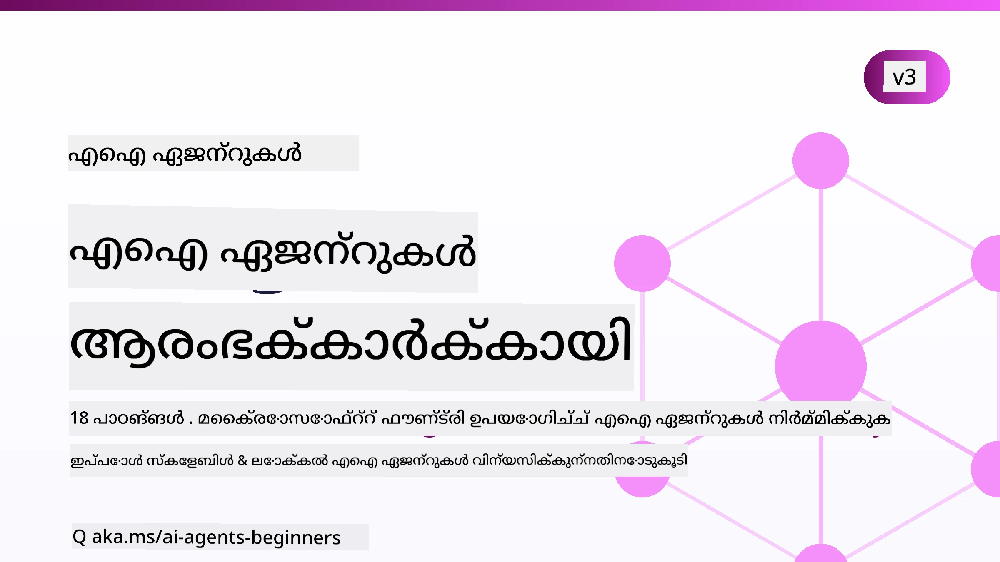

# ആരംഭക്കാർക്കുള്ള AI ഏജന്റുകൾ - ഒരു കോഴ്‌സ്



## AI ഏജന്റുകൾ നിർമ്മിക്ക തുടങ്ങാൻ അറിയേണ്ട എല്ലാം പഠിപ്പിക്കുന്ന ഒരു കോഴ്‌സ്

[](https://github.com/microsoft/ai-agents-for-beginners/blob/master/LICENSE?WT.mc_id=academic-105485-koreyst)
[](https://GitHub.com/microsoft/ai-agents-for-beginners/graphs/contributors/?WT.mc_id=academic-105485-koreyst)
[](https://GitHub.com/microsoft/ai-agents-for-beginners/issues/?WT.mc_id=academic-105485-koreyst)
[](https://GitHub.com/microsoft/ai-agents-for-beginners/pulls/?WT.mc_id=academic-105485-koreyst)
[](http://makeapullrequest.com?WT.mc_id=academic-105485-koreyst)

### 🌐 ബഹുഭാഷാ പിന്തുണ

#### GitHub Action മുഖേന പിന്തുണ (സ്വയംകൃതവും എല്ലായ്പ്പോഴും പുതുക്കപ്പെട്ടതും)

<!-- CO-OP TRANSLATOR LANGUAGES TABLE START -->
[Arabic](../ar/README.md) | [Bengali](../bn/README.md) | [Bulgarian](../bg/README.md) | [Burmese (Myanmar)](../my/README.md) | [Chinese (Simplified)](../zh-CN/README.md) | [Chinese (Traditional, Hong Kong)](../zh-HK/README.md) | [Chinese (Traditional, Macau)](../zh-MO/README.md) | [Chinese (Traditional, Taiwan)](../zh-TW/README.md) | [Croatian](../hr/README.md) | [Czech](../cs/README.md) | [Danish](../da/README.md) | [Dutch](../nl/README.md) | [Estonian](../et/README.md) | [Finnish](../fi/README.md) | [French](../fr/README.md) | [German](../de/README.md) | [Greek](../el/README.md) | [Hebrew](../he/README.md) | [Hindi](../hi/README.md) | [Hungarian](../hu/README.md) | [Indonesian](../id/README.md) | [Italian](../it/README.md) | [Japanese](../ja/README.md) | [Kannada](../kn/README.md) | [Khmer](../km/README.md) | [Korean](../ko/README.md) | [Lithuanian](../lt/README.md) | [Malay](../ms/README.md) | [Malayalam](./README.md) | [Marathi](../mr/README.md) | [Nepali](../ne/README.md) | [Nigerian Pidgin](../pcm/README.md) | [Norwegian](../no/README.md) | [Persian (Farsi)](../fa/README.md) | [Polish](../pl/README.md) | [Portuguese (Brazil)](../pt-BR/README.md) | [Portuguese (Portugal)](../pt-PT/README.md) | [Punjabi (Gurmukhi)](../pa/README.md) | [Romanian](../ro/README.md) | [Russian](../ru/README.md) | [Serbian (Cyrillic)](../sr/README.md) | [Slovak](../sk/README.md) | [Slovenian](../sl/README.md) | [Spanish](../es/README.md) | [Swahili](../sw/README.md) | [Swedish](../sv/README.md) | [Tagalog (Filipino)](../tl/README.md) | [Tamil](../ta/README.md) | [Telugu](../te/README.md) | [Thai](../th/README.md) | [Turkish](../tr/README.md) | [Ukrainian](../uk/README.md) | [Urdu](../ur/README.md) | [Vietnamese](../vi/README.md)

> **സ്ഥലന്തരണം ചെയ്യാൻ വായ്പ്സ്വാംഗികമാക്കരുതോ?**
>
> ഈ റിപോസിറ്ററിയിൽ 50-ലധികം ഭാഷാ അനുവാദങ്ങൾ ഉൾപ്പെടുത്തിയിട്ടുണ്ട്, ഇതു ഡൗൺലോഡ് വലുപ്പം വലിയതാക്കി. വിവർത്തനങ്ങളില്ലാതെ ക്ലോൺ ചെയ്യാൻ sparse checkout ഉപയോഗിക്കുക:
>
> **Bash / macOS / Linux:**
> ```bash
> git clone --filter=blob:none --sparse https://github.com/microsoft/ai-agents-for-beginners.git
> cd ai-agents-for-beginners
> git sparse-checkout set --no-cone '/*' '!translations' '!translated_images'
> ```
>
> **CMD (Windows):**
> ```cmd
> git clone --filter=blob:none --sparse https://github.com/microsoft/ai-agents-for-beginners.git
> cd ai-agents-for-beginners
> git sparse-checkout set --no-cone "/*" "!translations" "!translated_images"
> ```
>
> ഇതുവഴി കൂടുതൽ വേഗത്തിൽ ഡൗൺലോഡ് ചെയ്ത് കോഴ്‌സ് പൂർത്തീകരിക്കാൻ ആവശ്യമുള്ളതെല്ലാം ലഭിക്കും.
<!-- CO-OP TRANSLATOR LANGUAGES TABLE END -->

**താങ്കൾക്ക് അധികം വിവർത്തനഭാഷകൾ പിന്തുണയ്ക്കാൻ ആഗ്രഹമുണ്ടെങ്കിൽ, അവ ഇവിടെ ലിസ്റ്റ് ചെയ്തിട്ടുണ്ട് [here](https://github.com/Azure/co-op-translator/blob/main/getting_started/supported-languages.md).**

[](https://GitHub.com/microsoft/ai-agents-for-beginners/watchers/?WT.mc_id=academic-105485-koreyst)
[](https://GitHub.com/microsoft/ai-agents-for-beginners/network/?WT.mc_id=academic-105485-koreyst)
[](https://GitHub.com/microsoft/ai-agents-for-beginners/stargazers/?WT.mc_id=academic-105485-koreyst)

[](https://discord.com/invite/ATgtXmAS5D)


## 🌱 തുടങ്ങാം

ഈ കോഴ്‌സിൽ AI ഏജന്റുകൾ നിർമ്മിക്കാനുള്ള അടിസ്ഥാനങ്ങൾ ഉൾപ്പെടുന്ന പാഠങ്ങൾ ഉണ്ട്. ഓരോ പാഠവും തന്നെ വിഷയം ഉൾക്കൊള്ളുന്നു, എവിടത്തും നിന്ന് തുടങ്ങാം!

ഈ കോഴ്‌സിന് ബഹുഭാഷാ പിന്തുണ ഉണ്ട്. ലഭ്യമായ [ഭാഷകൾ ഇവിടെ](#-multi-language-support) കാണുക. 

ജനറേറ്റീവ് AI മോഡലുകളുമായി നിങ്ങൾ ആദ്യമായുള്ള നിർമ്മാണമാണെങ്കിൽ, 21 പാഠങ്ങൾ ഉൾക്കൊള്ളുന്ന [Generative AI For Beginners](https://aka.ms/genai-beginners) കോഴ്‌സ് കാണുക.

ഈ റിപോ [സ്റ്റാർ (🌟) ചെയ്യാനും](https://docs.github.com/en/get-started/exploring-projects-on-github/saving-repositories-with-stars?WT.mc_id=academic-105485-koreyst) [ഫോർക് ചെയ്യാനും](https://github.com/microsoft/ai-agents-for-beginners/fork) മറക്കരുത്, കോഡ് നിർമ്മിക്കാനായി.

### മറ്റ് പഠനാർത്ഥികളെ കണ്ടുമുട്ടൂ, നിങ്ങളുടെ ചോദ്യങ്ങൾക്ക് ഉത്തരം നേടൂ

AI ഏജന്റുകൾ നിർമ്മിക്കുന്നതിൽ സഹായം ആവശ്യമെങ്കിൽ അല്ലെങ്കിൽ ചോദ്യങ്ങൾ ഉണ്ടെങ്കിൽ, [Microsoft Foundry Discord](https://aka.ms/ai-agents/discord) ൽ പ്രത്യേക ഡിസ്‌കോർഡ് ചാനലിൽ ചേർക്കൂ.

### നിങ്ങൾക്ക് വേണ്ടത് 

ഈ കോഴ്‌സിലെ ഓരോ പാഠത്തിലും കോഡ് ഉദാഹരണങ്ങൾ ഉണ്ട്, അവ code_samples ഫോൾഡറിൽ കണ്ടെത്താം. നിങ്ങൾക്ക് [ഈ റിപോ ഫോർക് ചെയ്യാം](https://github.com/microsoft/ai-agents-for-beginners/fork) നിങ്ങളുടെ സ്വന്തം കോപ്പി സൃഷ്ടിക്കാൻ.  

ഈ വ്യായാമങ്ങളിൽ ഉപയോഗിക്കുന്ന കോഡ് ഉദാഹരണങ്ങൾ Microsoft Agent Framework-ഉം Microsoft Foundry Agent Service V2-ഉം ഉപയോഗിക്കുന്നു:

- [Microsoft Foundry](https://aka.ms/ai-agents-beginners/ai-foundry) - Azure അക്കൗണ്ട് ആവശ്യമാണ്

ഈ കോഴ്‌സ് Microsoft-ന്റെ താഴെ പറയുന്ന AI ഏജന്റ് ഫ്രെയിംവർകുകളും സേവനങ്ങളും ഉപയോഗിക്കുന്നു:

- [Microsoft Agent Framework (MAF)](https://aka.ms/ai-agents-beginners/agent-framework)
- [Microsoft Foundry Agent Service V2](https://aka.ms/ai-agents-beginners/ai-agent-service)

ചില കോഡ് ഉദാഹരണങ്ങൾ [MiniMax](https://platform.minimaxi.com/) പോലുള്ള OpenAI-സമ്മതമുള്ള പര്യായ പറയുന്നവയും പിന്തുണയ്ക്കുന്നു, കൂടാതെ ഇത് 204K ടോക്കനുകൾ വരെ ഉള്ള വലിയ കോൺടെക്സ്‌റ്റ് മോഡലുകൾ നൽകുന്നു. ക്രമീകരണ വിശദാംശങ്ങൾക്ക് [Course Setup](./00-course-setup/README.md) കാണുക.

ഈ കോഴ്‌സിന്റെ കോഡ് പ്രവർത്തിപ്പിക്കുന്നതിന് കൂടുതൽ വിവരങ്ങൾക്ക് [Course Setup](./00-course-setup/README.md) കാണുക.

## 🙏 സഹായിക്കണമെന്ന് ആഗ്രഹമുണ്ടോ?

നിർദ്ദേശങ്ങളുണ്ടോ അല്ലെങ്കിൽ വ്യാകരണം അല്ലെങ്കിൽ കോഡ് പിശകുകൾ കണ്ടെത്തിയോ? [ഒരു ഇഷ്യൂ ഉയർത്തൂ](https://github.com/microsoft/ai-agents-for-beginners/issues?WT.mc_id=academic-105485-koreyst) അല്ലെങ്കിൽ [ഒരു പുൾ അഭ്യർത്ഥന സൃഷ്ടിക്കൂ](https://github.com/microsoft/ai-agents-for-beginners/pulls?WT.mc_id=academic-105485-koreyst)


## 📂 ഓരോ പാഠത്തിലും ഉൾപ്പെടുന്നു

- README-യിൽ ഉള്ള എഴുത്തുപാഠം ഒരു ചെറിയ വീഡിയോടുകൂടി
- Microsoft Agent Framework ഉപയോഗിക്കുന്ന Python കോഡ് സാമ്പിളുകൾ Microsoft Foundry-വുമായ്
- പഠനം തുടർച്ചയായി തുടരാൻ അധികവഴികാട്ടലുകൾക്കുള്ള ലിങ്കുകൾ


## 🗃️ പാഠങ്ങൾ

| **പാഠം**                                    | **എഴുത്തും കോഡും**                              | **വീഡിയോ**                                                 | **അധിക പഠനം**                                                                     |
|----------------------------------------------|------------------------------------------------|------------------------------------------------------------|------------------------------------------------------------------------------------|
| AI ഏജന്റുകളിലേക്കും ഏജന്റ് ഉപയോഗ കേസുകളിലേക്കും പരിചയം   | [Link](./01-intro-to-ai-agents/README.md)        | [Video](https://youtu.be/3zgm60bXmQk?si=z8QygFvYQv-9WtO1)  | [Link](https://aka.ms/ai-agents-beginners/collection?WT.mc_id=academic-105485-koreyst) |
| AI ഏജന്റിക് ഫ്രെയിംവർക്സ് പരിശോധിക്കൽ                   | [Link](./02-explore-agentic-frameworks/README.md) | [Video](https://youtu.be/ODwF-EZo_O8?si=Vawth4hzVaHv-u0H)  | [Link](https://aka.ms/ai-agents-beginners/collection?WT.mc_id=academic-105485-koreyst) |
| AI ഏജന്റിക് ഡിസൈൻ പാറ്റേണുകൾ അവബോധം                     | [Link](./03-agentic-design-patterns/README.md)   | [Video](https://youtu.be/m9lM8qqoOEA?si=BIzHwzstTPL8o9GF)  | [Link](https://aka.ms/ai-agents-beginners/collection?WT.mc_id=academic-105485-koreyst) |
| ടൂൾ ഉപയോഗ ഡിസൈൻ പാറ്റേൺ                                  | [Link](./04-tool-use/README.md)                  | [Video](https://youtu.be/vieRiPRx-gI?si=2z6O2Xu2cu_Jz46N)  | [Link](https://aka.ms/ai-agents-beginners/collection?WT.mc_id=academic-105485-koreyst) |
| ഏജന്റിക് RAG                                              | [Link](./05-agentic-rag/README.md)               | [Video](https://youtu.be/WcjAARvdL7I?si=gKPWsQpKiIlDH9A3)  | [Link](https://aka.ms/ai-agents-beginners/collection?WT.mc_id=academic-105485-koreyst) |
| വിശ്വസനീയമായ AI ഏജന്റുകൾ നിർമ്മിക്കൽ                    | [Link](./06-building-trustworthy-agents/README.md) | [Video](https://youtu.be/iZKkMEGBCUQ?si=jZjpiMnGFOE9L8OK ) | [Link](https://aka.ms/ai-agents-beginners/collection?WT.mc_id=academic-105485-koreyst) |
| പ്ലാനിംഗ് ഡിസൈൻ പാറ്റേൺ                                    | [Link](./07-planning-design/README.md)           | [Video](https://youtu.be/kPfJ2BrBCMY?si=6SC_iv_E5-mzucnC)  | [Link](https://aka.ms/ai-agents-beginners/collection?WT.mc_id=academic-105485-koreyst) |
| മൾട്ടി-ഏജന്റ് ഡിസൈൻ പാറ്റേൺ                              | [Link](./08-multi-agent/README.md)               | [Video](https://youtu.be/V6HpE9hZEx0?si=rMgDhEu7wXo2uo6g)  | [Link](https://aka.ms/ai-agents-beginners/collection?WT.mc_id=academic-105485-koreyst) |

| മെറ്റാകോഗ്നിഷൻ ഡിസൈൻ പാറ്റേൺ                 | [Link](./09-metacognition/README.md)               | [Video](https://youtu.be/His9R6gw6Ec?si=8gck6vvdSNCt6OcF)  | [Link](https://aka.ms/ai-agents-beginners/collection?WT.mc_id=academic-105485-koreyst) |
| പ്രൊഡക്ഷനിലെ AI ഏജൻസുകൾ                      | [Link](./10-ai-agents-production/README.md)        | [Video](https://youtu.be/l4TP6IyJxmQ?si=31dnhexRo6yLRJDl)  | [Link](https://aka.ms/ai-agents-beginners/collection?WT.mc_id=academic-105485-koreyst) |
| ഏജൻസിക് പ്രോട്ടോകോളുകൾ ഉപയോഗിച്ച് (MCP, A2A, NLWeb) | [Link](./11-agentic-protocols/README.md)           | [Video](https://youtu.be/X-Dh9R3Opn8)                                 | [Link](https://aka.ms/ai-agents-beginners/collection?WT.mc_id=academic-105485-koreyst) |
| AI ഏജൻസുകൾക്കുള്ള കണ്ടക്‌സ്‌റ്റ് എഞ്ചിനീയറിങ്          | [Link](./12-context-engineering/README.md)         | [Video](https://youtu.be/F5zqRV7gEag)                                 | [Link](https://aka.ms/ai-agents-beginners/collection?WT.mc_id=academic-105485-koreyst) |
| ഏജൻസിക് മെമ്മറി മാനേജ്മെന്റ്                      | [Link](./13-agent-memory/README.md)     |      [Video](https://youtu.be/QrYbHesIxpw?si=vZkVwKrQ4ieCcIPx)                                                      |                                                                                        |
| മൈക്രോസോഫ്റ്റ് ഏജന്റ് ഫ്രെയിംവർക്ക് അന്വേഷിക്കൽ                 | [Link](./14-microsoft-agent-framework/README.md)                            |                                                            |                                                                                        |
| കമ്പ്യൂട്ടർ ഉപയോഗം ഏജൻസുകൾ (CUA) നിർമ്മാണം           | [Link](./15-browser-use/README.md)     |                                                            | [Link](https://docs.browser-use.com/examples/templates/playwright-integration)         |
| സ്കെയ്ലബിള്‍ ഏജൻസുകൾ ഡിപ്ലോയ്മെന്റ്                    | [Link](./16-deploying-scalable-agents/README.md) |                                                    | [Link](https://learn.microsoft.com/azure/ai-foundry/agents/overview)                   |
| ലോക്കൽ AI ഏജൻസുകൾ സൃഷ്ടിക്കൽ                     | [Link](./17-creating-local-ai-agents/README.md)  |                                                    | [Link](https://learn.microsoft.com/azure/ai-foundry/foundry-local/)                    |
| AI ഏജൻസുകളെ സുരക്ഷിതമാക്കൽ                           | [Link](./18-securing-ai-agents/README.md)  |                                                            | [Link](https://aka.ms/ai-agents-beginners/collection?WT.mc_id=academic-105485-koreyst) |

## 🎒 മറ്റ് കോഴ്സുകൾ

ഞങ്ങളുടെ ടീം മറ്റും കോഴ്സുകൾ നിർമ്മിക്കുന്നു! പരിശോധിക്കുക:

<!-- CO-OP TRANSLATOR OTHER COURSES START -->
### LangChain
[](https://aka.ms/langchain4j-for-beginners)
[](https://aka.ms/langchainjs-for-beginners?WT.mc_id=m365-94501-dwahlin)
[](https://github.com/microsoft/langchain-for-beginners?WT.mc_id=m365-94501-dwahlin)
---

### Azure / Edge / MCP / ഏജൻസുകൾ
[](https://github.com/microsoft/AZD-for-beginners?WT.mc_id=academic-105485-koreyst)
[](https://github.com/microsoft/edgeai-for-beginners?WT.mc_id=academic-105485-koreyst)
[](https://github.com/microsoft/mcp-for-beginners?WT.mc_id=academic-105485-koreyst)
[](https://github.com/microsoft/ai-agents-for-beginners?WT.mc_id=academic-105485-koreyst)

---
 
### ജനറേറ്റീവ് AI സീരീസ്
[](https://github.com/microsoft/generative-ai-for-beginners?WT.mc_id=academic-105485-koreyst)
[-9333EA?style=for-the-badge&labelColor=E5E7EB&color=9333EA)](https://github.com/microsoft/Generative-AI-for-beginners-dotnet?WT.mc_id=academic-105485-koreyst)

[-C084FC?style=for-the-badge&labelColor=E5E7EB&color=C084FC)](https://github.com/microsoft/generative-ai-for-beginners-java?WT.mc_id=academic-105485-koreyst)
[-E879F9?style=for-the-badge&labelColor=E5E7EB&color=E879F9)](https://github.com/microsoft/generative-ai-with-javascript?WT.mc_id=academic-105485-koreyst)

---
 
### കോർ ലേണിംഗ്
[](https://aka.ms/ml-beginners?WT.mc_id=academic-105485-koreyst)
[](https://aka.ms/datascience-beginners?WT.mc_id=academic-105485-koreyst)
[](https://aka.ms/ai-beginners?WT.mc_id=academic-105485-koreyst)
[](https://github.com/microsoft/Security-101?WT.mc_id=academic-96948-sayoung)
[](https://aka.ms/webdev-beginners?WT.mc_id=academic-105485-koreyst)
[](https://aka.ms/iot-beginners?WT.mc_id=academic-105485-koreyst)
[](https://github.com/microsoft/xr-development-for-beginners?WT.mc_id=academic-105485-koreyst)

---
 

### കോപിലോട്ട് സീരീസ്
[](https://aka.ms/GitHubCopilotAI?WT.mc_id=academic-105485-koreyst)
[](https://github.com/microsoft/mastering-github-copilot-for-dotnet-csharp-developers?WT.mc_id=academic-105485-koreyst)
[](https://github.com/microsoft/CopilotAdventures?WT.mc_id=academic-105485-koreyst)
<!-- CO-OP TRANSLATOR OTHER COURSES END -->

## 🌟 കമ്മ്യൂണിറ്റി നന്ദി

Agentic RAG കാണിക്കുന്ന പ്രധാന കോഡ് സാമ്പിളുകൾ സംഭാവന ചെയ്തതിന് നന്ദി [Shivam Goyal](https://www.linkedin.com/in/shivam2003/) .

## സംഭാവന ചെയ്യുക

ഈ പ്രോജക്ട് സംഭാവനകളും നിർദ്ദേശങ്ങളും സ്വാഗതം ചെയ്യുന്നു. അധികാരമുള്ള
Contributor License Agreement (CLA) ലെ കുറിപ്പിൽ നിങ്ങൾക്ക് നിങ്ങളുടെ സംഭാവന ഉപയോഗിക്കാനുള്ള അവകാശം ഉള്ളതും,
ഇത് നല്കാനുള്ള അധികാരം നിങ്ങൾക്കുണ്ടെന്ന് സാക്ഷ്യപ്പെടുത്തേണ്ടതാണ്. വിശദാംശങ്ങൾക്കായി <https://cla.opensource.microsoft.com> സന്ദർശിക്കുക.

നിങ്ങൾ ഒരു പുൾ അഭ്യർത്ഥന സമർപ്പിക്കുമ്പോൾ, CLA ബോട്ട് ഓട്ടോമാറ്റിക്കായി നിങ്ങളെ ആവശ്യപ്പെടുന്നതാണെന്ന് നിർണ്ണയിക്കും
CLA നൽകേണ്ടതുണ്ടോയെന്ന്, ശരിയായ ലേഖന പരിശോധനയും (ഉദാ., സ്റ്റാറ്റസ് ചെക്ക്, അഭിപ്രായം) അണിയിച്ചുപേർക്കും.
ബോട്ടിന്റെ നിർദ്ദേശങ്ങൾ പാലിക്കുക. നമ്മുടെ CLA ഉപയോഗിക്കുന്ന എല്ലാ റിപോസിറ്ററികൾക്കും ഒരിക്കൽ മാത്രമേ ഇത് ചെയ്യേണ്ടതുള്ളു.

ഈ പ്രോജക്ട് [Microsoft Open Source Code of Conduct](https://opensource.microsoft.com/codeofconduct/) സ്വീകരിച്ചിട്ടുണ്ട്.
കൂടുതൽ വിവരങ്ങൾക്ക് [Code of Conduct FAQ](https://opensource.microsoft.com/codeofconduct/faq/) കാണുക അല്ലെങ്കിൽ
[opencode@microsoft.com](mailto:opencode@microsoft.com) എന്ന ഇമെയിലിൽ സങ്കീര്‍ണ്ണങ്ങളോ അഭിപ്രായങ്ങളോ ഉണ്ടെങ്കിൽ ബന്ധപ്പെടുക.

## ട്രേഡ്മാർക്കുകൾ

ഈ പ്രോജക്ടിൽ പ്രോജക്ടുകൾ, ഉൽപ്പന്നങ്ങൾ അല്ലെങ്കിൽ സേവനങ്ങൾക്കുള്ള ട്രേഡ്മാർക്കുകളോ ലോഗോകളോ ഉണ്ടായിരിക്കാം. മൈക്രോസോഫ്‌റ്റിന്റെ
ട്രേഡ്മാർക്കുകൾ അല്ലെങ്കിൽ ലോഗോകൾ ഉപയോഗിക്കുന്നതിനുള്ള അനുമതി എന്നത് [Microsoft's Trademark & Brand Guidelines](https://www.microsoft.com/legal/intellectualproperty/trademarks/usage/general) അനുസരിച്ചായിരിക്കണം.

ഈ പ്രോജക്ടിന്റെ മാറ്റിപ്പെട്ട പതിപ്പുകളിൽ മൈക്രോസോഫ്‌റ്റ് ട്രേഡ്മാർക്കുകളുടെ ഉപയോഗം തെറ്റിദ്ധരിക്കൽ ഉണ്ടാക്കരുത് അല്ലെങ്കിൽ Microsoft.*ന്റെ സഹായം വളയുമെന്നുള്ള തരത്തിലുള്ള തരാത്തവ.
മൂന്നാംകക്ഷി ട്രേഡ്മാർക്കുകളോ ലോഗോകളോ ഉപയോഗിക്കുന്നത് ആ കക്ഷികളുടെ നയങ്ങൾ അനുസരിച്ചായിരിക്കണം.

## സഹായം ലഭിക്കുക


നിങ്ങൾ തടസമാകുമ്പോൾ അല്ലെങ്കിൽ AI ആപ്പ് നിർമാണത്തെക്കുറിച്ച് ഏതെങ്കിലും ചോദ്യം ഉണ്ടെങ്കിൽ ചേരുക:

[](https://aka.ms/foundry/discord)

നിർമ്മാണത്തിനിടെ ഉൽപ്പന്ന അഭിപ്രായങ്ങൾ അല്ലെങ്കിൽ പിശകുകൾ ഉണ്ടെങ്കിൽ സന്ദർശിക്കുക:


[](https://aka.ms/foundry/forum)

---

<!-- CO-OP TRANSLATOR DISCLAIMER START -->
**അറിയിപ്പ്**:
ഈ രേഖ AI പരിഭാഷാ സേവനം [Co-op Translator](https://github.com/Azure/co-op-translator) ഉപയോഗിച്ച് പരിഭാഷപ്പെടുത്തിയതാണ്. ഞങ്ങൾ കൃത്യതയ്ക്കായി ശ്രമിക്കുന്നുവെങ്കിലും, ഓട്ടോമേറ്റഡ് പരിഭാഷകളിൽ പിഴവുകൾ അല്ലെങ്കിൽ തെറ്റായ വിവരങ്ങൾ ഉണ്ടാകാൻ സാധ്യതയുണ്ട്. അതിന്റെ സ്വാഭാവിക ഭാഷയിലുള്ള അസൽ രേഖയാണ് പ്രാമാണികമായ ഉറവിടമായി പരിഗണിക്കേണ്ടത്. നിർണായകമായ വിവരങ്ങൾക്ക്, പ്രൊഫഷണൽ മനുഷ്യ പരിഭാഷ ശുപാർശ ചെയ്യുന്നു. ഈ പരിഭാഷ ഉപയോഗിച്ച് ഉണ്ടാകുന്ന തെറ്റിദ്ധാരണകൾ അല്ലെങ്കിൽ തെറ്റായ വ്യാഖ്യാനങ്ങൾക്കായി ഞങ്ങൾ ഉത്തരവാദികളല്ല.
<!-- CO-OP TRANSLATOR DISCLAIMER END -->