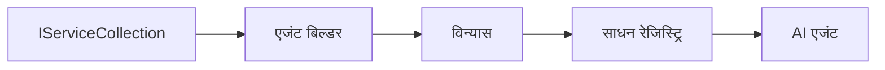

# 🎨 Azure OpenAI (Responses API) सह एजंटिक डिझाईन पॅटर्न्स (.NET)

## 📋 शिकण्याच्या उद्दिष्टे

हा उदाहरण Microsoft Agent Framework वापरून .NET मध्ये Azure OpenAI (Responses API) इंटिग्रेशनसह बुद्धिमान एजंट तयार करण्यासाठी एंटरप्राइझ-ग्रेड डिझाईन पॅटर्न्सचे प्रदर्शन करतो. तुम्ही व्यावसायिक पॅटर्न्स आणि आर्किटेक्चरल दृष्टीकोन शिकाल जे एजंट्सना उत्पादनासाठी तयार, देखभाल करण्यायोग्य आणि स्केलेबल बनवतात.

### एंटरप्राइझ डिझाईन पॅटर्न्स

- 🏭 **फॅक्टरी पॅटर्न**: डिपेंडन्सी इंजेक्शनसह स्टँडर्डाइज्ड एजंट निर्मिती
- 🔧 **बिल्डर पॅटर्न**: फ्लुएंट एजंट कॉन्फिगरेशन आणि सेटअप
- 🧵 **थ्रेड-सुरक्षित पॅटर्न्स**: समवर्ती संभाषण व्यवस्थापन
- 📋 **रिपॉझिटरी पॅटर्न**: सांगठित साधन आणि क्षमता व्यवस्थापन

## 🎯 .NET-विशिष्ट आर्किटेक्चरल लाभ

### एंटरप्राइझ वैशिष्ट्ये

- **मजबूत टायपिंग**: कंपाईल-टाइम व्हॅलिडेशन आणि IntelliSense समर्थन
- **डिपेंडन्सी इंजेक्शन**: इन-बिल्ट DI कंटेनर इंटिग्रेशन
- **कॉन्फिगरेशन व्यवस्थापन**: IConfiguration आणि Options पॅटर्न्स
- **Async/Await**: प्रथम श्रेणी असिंक्रोनस प्रोग्रामिंग समर्थन

### उत्पादनासाठी तयार पॅटर्न्स

- **लॉगिंग इंटिग्रेशन**: ILogger आणि रचनात्मक लॉगिंग समर्थन
- **हेल्थ चेक्स**: इन-बिल्ट मॉनिटरिंग आणि डायग्नोस्टिक्स
- **कॉन्फिगरेशन व्हॅलिडेशन**: डेटा अ‍ॅनोटेशन्ससह मजबूत टायपिंग
- **एरर हँडलिंग**: रचनात्मक अपवाद व्यवस्थापन

## 🔧 तांत्रिक आर्किटेक्चर

### मुख्य .NET घटक

- **Microsoft.Extensions.AI**: एकत्रिकृत AI सेवा अमूर्तता
- **Microsoft.Agents.AI**: एंटरप्राइझ एजंट आयोजक फ्रेमवर्क
- **Azure OpenAI (Responses API)**: उच्च-कार्यक्षमता API क्लायंट पॅटर्न्स
- **कॉन्फिगरेशन सिस्टम**: appsettings.json आणि पर्यावरण एकत्रीकरण

### डिझाईन पॅटर्न अमलात आणणे



## 🏗️ प्रदर्शित एंटरप्राइझ पॅटर्न्स

### 1. **निर्माणात्मक पॅटर्न्स**

- **एजंट फॅक्टरी**: सुसंगत कॉन्फिगरेशनसह केंद्रीकृत एजंट निर्मिती
- **बिल्डर पॅटर्न**: जटिल एजंट कॉन्फिगरेशनसाठी फ्लुएंट API
- **सिंगलटन पॅटर्न**: सामायिक संसाधने आणि कॉन्फिगरेशन व्यवस्थापन
- **डिपेंडन्सी इंजेक्शन**: सैल जोडणी आणि चाचणीयोग्यता

### 2. **व्यवहारात्मक पॅटर्न्स**

- **स्ट्रॅटेजी पॅटर्न**: बदलता येणारे साधन अंमलबजावणीच्या धोरणे
- **कमांड पॅटर्न**: अणुकूलित एजंट ऑपरेशन्ससह undo/redo
- **ऑब्झर्व्हर पॅटर्न**: इव्हेंट-चालित एजंट जीवनचक्र व्यवस्थापन
- **टेम्पलेट मेथड**: स्टँडर्ड एजंट अंमलबजावणी वर्कफ्लोज

### 3. **रचनात्मक पॅटर्न्स**

- **अ‍ॅडॉप्टर पॅटर्न**: Azure OpenAI (Responses API) इंटिग्रेशन लेयर
- **डेकोरेटर पॅटर्न**: एजंट क्षमता वाढविणे
- **फसाड पॅटर्न**: सोप्या एजंट संवाद इंटरफेस
- **प्रॉक्सी पॅटर्न**: कार्यक्षमतेसाठी लेझी लोडिंग आणि कॅशिंग

## 📚 .NET डिझाईन तत्त्वे

### SOLID तत्त्वे

- **सिंगल रिस्पॉन्सिबिलिटी**: प्रत्येक घटकाची एक स्पष्ट उद्दिष्ट
- **ओपन/क्लोज्ड**: बदलांशिवाय विस्तारित करता येणे
- **लिस्कॉव्ह सबस्टिट्युशन**: इंटरफेस-आधारित साधन अंमलबजावण्या
- **इंटरफेस सेग्रीगेशन**: केंद्रीत, सुसंगत इंटरफेस
- **डिपेंडन्सी इनव्हर्शन**: अमूर्तता अवलंबून राहणे, प्रत्यक्षावर नाही

### क्लीन आर्किटेक्चर

- **डोमेन लेयर**: मुख्य एजंट आणि साधन अमूर्तता
- **अ‍ॅप्लिकेशन लेयर**: एजंट सञ्चलन आणि वर्कफ्लोज
- **इन्फ्रास्ट्रक्चर लेयर**: Azure OpenAI (Responses API) इंटिग्रेशन आणि बाह्य सेवा
- **प्रेझेंटेशन लेयर**: वापरकर्ता संवाद आणि प्रतिसाद फॉरमॅटिंग

## 🔒 एंटरप्राइझ विचार

### सुरक्षा

- **प्रमाणपत्र व्यवस्थापन**: IConfiguration सह सुरक्षित API की हाताळणी
- **इनपुट व्हॅलिडेशन**: मजबूत टायपिंग आणि डेटा अ‍ॅनोटेशन व्हॅलिडेशन
- **आउटपुट सॅनिटायझेशन**: सुरक्षित प्रतिसाद प्रक्रिया आणि फिल्टरिंग
- **ऑडिट लॉगिंग**: व्यापक ऑपरेशन ट्रॅकिंग

### कार्यक्षमता

- **असिंक्रोनस पॅटर्न्स**: नॉन-ब्लॉकिंग I/O ऑपरेशन्स
- **कनेक्शन पूलिंग**: कार्यक्षम HTTP क्लायंट व्यवस्थापन
- **कॅशिंग**: सुधारित कार्यक्षमतेसाठी प्रतिसाद कॅशिंग
- **संसाधन व्यवस्थापन**: योग्य निपटारा आणि स्वच्छता पॅटर्न्स

### स्केलेबिलिटी

- **थ्रेड सुरक्षा**: समवर्ती एजंट अंमलबजावणी समर्थन
- **संसाधन पूलिंग**: कार्यक्षम संसाधन वापर
- **लोड व्यवस्थापन**: दर मर्यादा आणि बॅकप्रेशर हाताळणी
- **मॉनिटरिंग**: कार्यक्षमता मेट्रिक्स आणि हेल्थ चेक्स

## 🚀 उत्पादन तैनाती

- **कॉन्फिगरेशन व्यवस्थापन**: पर्यावरण-विशिष्ट सेटिंग्ज
- **लॉगिंग धोरण**: सुसंगत लॉगिंग सह संबंधी IDs
- **एरर हँडलिंग**: योग्य पुनर्प्राप्तीसह जागतिक अपवाद हाताळणी
- **मॉनिटरिंग**: अ‍ॅप्लिकेशन इनसाइट्स आणि कार्यक्षमता काउंटर
- **चाचणी**: युनिट चाचण्या, एकत्रीकरण चाचण्या, आणि लोड चाचणी पॅटर्न्स

.NET सह एंटरप्राइझ-ग्रेड बुद्धिमान एजंट तयार करायला तयार आहात? चला काही मजबूत आर्किटेक्चर बनवू या! 🏢✨

## 🚀 सुरुवात कशी करावी

### आवश्यक अटी

- [.NET 10 SDK](https://dotnet.microsoft.com/download/dotnet/10.0) किंवा त्याहून अधिक
- Azure OpenAI संसाधन आणि मॉडेल डिप्लॉयमेंटसह एक [Azure सदस्यता](https://azure.microsoft.com/free/)
- [Azure CLI](https://learn.microsoft.com/cli/azure/install-azure-cli) — `az login` वापरून साइन इन करा

### आवश्यक पर्यावरण चल

```bash
# zsh/bash
export AZURE_OPENAI_ENDPOINT=https://<your-resource>.openai.azure.com
export AZURE_OPENAI_DEPLOYMENT=gpt-4.1-mini
# नंतर साइन इन करा जेणेकरून AzureCliCredential टोकन मिळवू शकेल
az login
```

```powershell
# पॉवरशेल
$env:AZURE_OPENAI_ENDPOINT = "https://<your-resource>.openai.azure.com"
$env:AZURE_OPENAI_DEPLOYMENT = "gpt-4.1-mini"
# मग साइन इन करा जेणेकरून AzureCliCredential टोकन मिळवू शकेल
az login
```

### नमुना कोड

कोड उदाहरण चालवण्यासाठी,

```bash
# zsh/bash
chmod +x ./03-dotnet-agent-framework.cs
./03-dotnet-agent-framework.cs
```

किंवा dotnet CLI वापरून:

```bash
dotnet run ./03-dotnet-agent-framework.cs
```

संपूर्ण कोडसाठी [`03-dotnet-agent-framework.cs`](../../../../03-agentic-design-patterns/code_samples/03-dotnet-agent-framework.cs) पहा.

```csharp
#!/usr/bin/dotnet run

#:package Microsoft.Extensions.AI@10.*
#:package Microsoft.Agents.AI.OpenAI@1.*-*
#:package Azure.AI.OpenAI@2.1.0
#:package Azure.Identity@1.13.1

using System.ComponentModel;

using Microsoft.Agents.AI;
using Microsoft.Extensions.AI;

using Azure.AI.OpenAI;
using Azure.Identity;

// Tool Function: Random Destination Generator
// This static method will be available to the agent as a callable tool
// The [Description] attribute helps the AI understand when to use this function
// This demonstrates how to create custom tools for AI agents
[Description("Provides a random vacation destination.")]
static string GetRandomDestination()
{
    // List of popular vacation destinations around the world
    // The agent will randomly select from these options
    var destinations = new List<string>
    {
        "Paris, France",
        "Tokyo, Japan",
        "New York City, USA",
        "Sydney, Australia",
        "Rome, Italy",
        "Barcelona, Spain",
        "Cape Town, South Africa",
        "Rio de Janeiro, Brazil",
        "Bangkok, Thailand",
        "Vancouver, Canada"
    };

    // Generate random index and return selected destination
    // Uses System.Random for simple random selection
    var random = new Random();
    int index = random.Next(destinations.Count);
    return destinations[index];
}

// Azure OpenAI with the Responses API (stable v1 endpoint). Sign in with `az login`.
var azureEndpoint = Environment.GetEnvironmentVariable("AZURE_OPENAI_ENDPOINT")
    ?? throw new InvalidOperationException("AZURE_OPENAI_ENDPOINT is not set.");
var deployment = Environment.GetEnvironmentVariable("AZURE_OPENAI_DEPLOYMENT") ?? "gpt-4.1-mini";

var azureClient = new AzureOpenAIClient(new Uri(azureEndpoint), new AzureCliCredential());

// Define Agent Identity and Comprehensive Instructions
// Agent name for identification and logging purposes
var AGENT_NAME = "TravelAgent";

// Detailed instructions that define the agent's personality, capabilities, and behavior
// This system prompt shapes how the agent responds and interacts with users
var AGENT_INSTRUCTIONS = """
You are a helpful AI Agent that can help plan vacations for customers.

Important: When users specify a destination, always plan for that location. Only suggest random destinations when the user hasn't specified a preference.

When the conversation begins, introduce yourself with this message:
"Hello! I'm your TravelAgent assistant. I can help plan vacations and suggest interesting destinations for you. Here are some things you can ask me:
1. Plan a day trip to a specific location
2. Suggest a random vacation destination
3. Find destinations with specific features (beaches, mountains, historical sites, etc.)
4. Plan an alternative trip if you don't like my first suggestion

What kind of trip would you like me to help you plan today?"

Always prioritize user preferences. If they mention a specific destination like "Bali" or "Paris," focus your planning on that location rather than suggesting alternatives.
""";

// Create AI Agent with Advanced Travel Planning Capabilities
// Get the Responses client for the deployment and create the AI agent
// Configure agent with name, detailed instructions, and available tools
// This demonstrates the .NET agent creation pattern with full configuration
AIAgent agent = azureClient
    .GetChatClient(deployment)
    .AsAIAgent(
        name: AGENT_NAME,
        instructions: AGENT_INSTRUCTIONS,
        tools: [AIFunctionFactory.Create(GetRandomDestination)]
    );

// Create New Conversation Session for Context Management
// Initialize a new conversation session to maintain context across multiple interactions
// Sessions enable the agent to remember previous exchanges and maintain conversational state
// This is essential for multi-turn conversations and contextual understanding
var session = await agent.CreateSessionAsync();

// Execute Agent: First Travel Planning Request
// Run the agent with an initial request that will likely trigger the random destination tool
// The agent will analyze the request, use the GetRandomDestination tool, and create an itinerary
// Using the session parameter maintains conversation context for subsequent interactions
await foreach (var update in agent.RunStreamingAsync("Plan me a day trip", session))
{
    await Task.Delay(10);
    Console.Write(update);
}

Console.WriteLine();

// Execute Agent: Follow-up Request with Context Awareness
// Demonstrate contextual conversation by referencing the previous response
// The agent remembers the previous destination suggestion and will provide an alternative
// This showcases the power of conversation sessions and contextual understanding in .NET agents
await foreach (var update in agent.RunStreamingAsync("I don't like that destination. Plan me another vacation.", session))
{
    await Task.Delay(10);
    Console.Write(update);
}
```

---

<!-- CO-OP TRANSLATOR DISCLAIMER START -->
**अस्वीकरण**:
हा दस्तऐवज AI भाषांतर सेवा [Co-op Translator](https://github.com/Azure/co-op-translator) चा वापर करून अनुवादित केला आहे. जरी आम्ही अचूकतेसाठी प्रयत्न करतो, तरी कृपया लक्षात घ्या की स्वयंचलित भाषांतरांमध्ये त्रुटी किंवा अचूकतेची कमतरता असू शकते. मूळ दस्तऐवज त्याच्या मूळ भाषेत अधिकृत स्रोत मानला पाहिजे. महत्त्वाची माहिती असल्यास, व्यावसायिक मानवी भाषांतराची शिफारस केली जाते. या भाषांतराच्या वापरामुळे उद्भवणाऱ्या कोणत्याही गैरसमज किंवा चुकीच्या अर्थलावणीसाठी आम्ही जबाबदार नाही.
<!-- CO-OP TRANSLATOR DISCLAIMER END -->