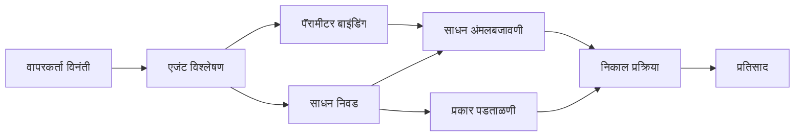

# 🛠️ Azure OpenAI सह प्रगत साधन वापर (Responses API) (.NET)

## 📋 शिकण्याचे उद्दिष्टे

हे नोटबुक .NET मध्ये Microsoft Agent Framework वापरून Azure OpenAI (Responses API) सह एंटरप्राइज-ग्रेड साधन एकत्रीकरण नमुने दर्शविते. तुम्ही C# च्या मजबूत टायपिंग आणि .NET च्या एंटरप्राइज वैशिष्ट्यांचा लाभ घेऊन अनेक विशेषीकृत साधनांसह परिष्कृत एजंट तयार करायला शिकाल.

### प्रगत साधन क्षमता ज्या तुम्ही आत्मसात कराल

- 🔧 **मल्टी-टूल आर्किटेक्चर**: अनेक विशेषीकृत क्षमता असलेले एजंट तयार करणे
- 🎯 **टाइप-सेफ टूल अंमलबजावणी**: C# च्या कंपाईल-टाइम मान्यता वापरणे
- 📊 **एंटरप्राइज टूल नमुने**: उत्पादन-तयार साधन डिझाइन आणि त्रुटी हाताळणी
- 🔗 **टूल संयोजन**: जटिल व्यवसाय प्रक्रियांसाठी साधने संयोजित करणे

## 🎯 .NET टूल आर्किटेक्चर फायदे

### एंटरप्राइज टूल वैशिष्ट्ये

- **कंपाईल-टाइम मान्यता**: मजबूत टायपिंगमुळे साधन पॅरामीटर्सची अचूकता सुनिश्चित होते
- **निर्भरता इंजेक्शन**: साधन व्यवस्थापनासाठी IoC कंटेनर समाकलन
- **Async/Await नमुने**: संसाधन व्यवस्थापनासह नॉन-ब्लॉकिंग साधन अंमलबजावणी
- **संरचित लॉगिंग**: साधन अंमलबजावणी निरीक्षणासाठी अंतर्भूत लॉगिंग समाकलन

### उत्पादन-तयार नमुने

- **अपवाद हाताळणी**: टाइप केलेल्या अपवादांसह सविस्तर त्रुटी व्यवस्थापन
- **संसाधन व्यवस्थापन**: योग्य डिस्पोजल नमुने आणि मेमरी व्यवस्थापन
- **कार्यक्षमता निरीक्षण**: अंतर्भूत मेट्रिक्स आणि कार्यक्षमता काउंटर
- **कॉन्फिगरेशन व्यवस्थापन**: प्रकार-सुरक्षित कॉन्फिगरेशन मान्यतेसह

## 🔧 तांत्रिक आर्किटेक्चर

### मुख्य .NET साधन घटक

- **Microsoft.Extensions.AI**: एकसंध साधन अमूर्त स्तर
- **Microsoft.Agents.AI**: एंटरप्राइज-ग्रेड साधन समन्वय
- **Azure OpenAI (Responses API)**: उच्च कार्यक्षमतेचा API क्लायंट कनेक्शन पूलिंगसह

### साधन अंमलबजावणी पाईपलाइन



## 🛠️ साधन वर्गीकरण आणि नमुने

### 1. **डेटा प्रक्रिया साधने**

- **इनपुट मान्यता**: डेटा अ‍ॅनो टेशन्ससह मजबूत टायपिंग
- **रूपांतरण ऑपरेशन्स**: प्रकार-सुरक्षित डेटा रूपांतरण आणि स्वरूपन
- **व्यवसाय लॉजिक**: डोमेन-विशिष्ट गणना आणि विश्लेषण साधने
- **आउटपुट स्वरूपन**: संरचित प्रतिसाद निर्माण

### 2. **एकत्रीकरण साधने** 

- **API कनेक्टर्स**: HttpClient सह RESTful सेवा एकत्रीकरण
- **डेटाबेस साधने**: डेटा प्रवेशासाठी Entity Framework समाकलन
- **फाइल ऑपरेशन्स**: मान्यतेसह सुरक्षित फाइल सिस्टम ऑपरेशन्स
- **बाह्य सेवा**: तृतीय-पक्ष सेवा एकत्रीकरण नमुने

### 3. **युटिलिटी साधने**

- **टेक्स्ट प्रक्रिया**: स्ट्रिंग रूपांतरण आणि स्वरूपन युटिलिटीज
- **दिनांक/वेळ ऑपरेशन्स**: संस्कृती-जाणिव असलेली दिनांक/वेळ गणना
- **गणितीय साधने**: अचूक गणना आणि सांख्यिकी ऑपरेशन्स
- **मान्यता साधने**: व्यवसाय नियम मान्यता आणि डेटा पडताळणी

.NET मध्ये शक्तिशाली, प्रकार-सुरक्षित साधन क्षमतांसह एंटरप्राइज-ग्रेड एजंट तयार करायला तयार आहात का? चला काही व्यावसायिक दर्जाचे सोल्यूशन्स तयार करूया! 🏢⚡

## 🚀 सुरुवात करणे

### आवश्यक अटी

- [.NET 10 SDK](https://dotnet.microsoft.com/download/dotnet/10.0) किंवा higher
- [Azure सदस्यता](https://azure.microsoft.com/free/) ज्यात Azure OpenAI स्रोत आणि मॉडेल तैनाती आहे
- [Azure CLI](https://learn.microsoft.com/cli/azure/install-azure-cli) — `az login` वापरून साइन इन करा

### आवश्यक पर्यावरणीय चल

```bash
# zsh/bash
export AZURE_OPENAI_ENDPOINT=https://<your-resource>.openai.azure.com
export AZURE_OPENAI_DEPLOYMENT=gpt-5-mini
# मग साइन इन करा जेणेकरून AzureCliCredential टोकन प्राप्त करू शकेल
az login
```

```powershell
# पॉवरशेल
$env:AZURE_OPENAI_ENDPOINT = "https://<your-resource>.openai.azure.com"
$env:AZURE_OPENAI_DEPLOYMENT = "gpt-5-mini"
# नंतर साइन इन करा जेणेकरून AzureCliCredential टोकन प्राप्त करू शकेल
az login
```

### नमुना कोड

हा कोड उदाहरण चालविण्यासाठी,

```bash
# झेडश/बॅश
chmod +x ./04-dotnet-agent-framework.cs
./04-dotnet-agent-framework.cs
```

किंवा dotnet CLI वापरून:

```bash
dotnet run ./04-dotnet-agent-framework.cs
```

संपूर्ण कोडसाठी [`04-dotnet-agent-framework.cs`](../../../../04-tool-use/code_samples/04-dotnet-agent-framework.cs) पहा.

```csharp
#!/usr/bin/dotnet run

#:package Microsoft.Extensions.AI@10.*
#:package Microsoft.Agents.AI.OpenAI@1.*-*
#:package Azure.AI.OpenAI@2.1.0
#:package Azure.Identity@1.13.1

using System.ComponentModel;

using Microsoft.Agents.AI;
using Microsoft.Extensions.AI;

using Azure.AI.OpenAI;
using Azure.Identity;

// Tool Function: Random Destination Generator
// This static method will be available to the agent as a callable tool
// The [Description] attribute helps the AI understand when to use this function
// This demonstrates how to create custom tools for AI agents
[Description("Provides a random vacation destination.")]
static string GetRandomDestination()
{
    // List of popular vacation destinations around the world
    // The agent will randomly select from these options
    var destinations = new List<string>
    {
        "Paris, France",
        "Tokyo, Japan",
        "New York City, USA",
        "Sydney, Australia",
        "Rome, Italy",
        "Barcelona, Spain",
        "Cape Town, South Africa",
        "Rio de Janeiro, Brazil",
        "Bangkok, Thailand",
        "Vancouver, Canada"
    };

    // Generate random index and return selected destination
    // Uses System.Random for simple random selection
    var random = new Random();
    int index = random.Next(destinations.Count);
    return destinations[index];
}

// Azure OpenAI with the Responses API (stable v1 endpoint). Sign in with `az login`.
var azureEndpoint = Environment.GetEnvironmentVariable("AZURE_OPENAI_ENDPOINT")
    ?? throw new InvalidOperationException("AZURE_OPENAI_ENDPOINT is not set.");
var deployment = Environment.GetEnvironmentVariable("AZURE_OPENAI_DEPLOYMENT") ?? "gpt-5-mini";

var azureClient = new AzureOpenAIClient(new Uri(azureEndpoint), new AzureCliCredential());

// Define Agent Identity and Comprehensive Instructions
// Agent name for identification and logging purposes
var AGENT_NAME = "TravelAgent";

// Detailed instructions that define the agent's personality, capabilities, and behavior
// This system prompt shapes how the agent responds and interacts with users
var AGENT_INSTRUCTIONS = """
You are a helpful AI Agent that can help plan vacations for customers.

Important: When users specify a destination, always plan for that location. Only suggest random destinations when the user hasn't specified a preference.

When the conversation begins, introduce yourself with this message:
"Hello! I'm your TravelAgent assistant. I can help plan vacations and suggest interesting destinations for you. Here are some things you can ask me:
1. Plan a day trip to a specific location
2. Suggest a random vacation destination
3. Find destinations with specific features (beaches, mountains, historical sites, etc.)
4. Plan an alternative trip if you don't like my first suggestion

What kind of trip would you like me to help you plan today?"

Always prioritize user preferences. If they mention a specific destination like "Bali" or "Paris," focus your planning on that location rather than suggesting alternatives.
""";

// Create AI Agent with Advanced Travel Planning Capabilities
// Get the Responses client for the deployment and create the AI agent
// Configure agent with name, detailed instructions, and available tools
// This demonstrates the .NET agent creation pattern with full configuration
AIAgent agent = azureClient
    .GetChatClient(deployment)
    .AsAIAgent(
        name: AGENT_NAME,
        instructions: AGENT_INSTRUCTIONS,
        tools: [AIFunctionFactory.Create(GetRandomDestination)]
    );

// Create New Conversation Session for Context Management
// Initialize a new conversation session to maintain context across multiple interactions
// Sessions enable the agent to remember previous exchanges and maintain conversational state
// This is essential for multi-turn conversations and contextual understanding
await using var session = await agent.CreateSessionAsync();

// Execute Agent: First Travel Planning Request
// Run the agent with an initial request that will likely trigger the random destination tool
// The agent will analyze the request, use the GetRandomDestination tool, and create an itinerary
// Using the session parameter maintains conversation context for subsequent interactions
await foreach (var update in agent.RunStreamingAsync("Plan me a day trip", session))
{
    await Task.Delay(10);
    Console.Write(update);
}

Console.WriteLine();

// Execute Agent: Follow-up Request with Context Awareness
// Demonstrate contextual conversation by referencing the previous response
// The agent remembers the previous destination suggestion and will provide an alternative
// This showcases the power of conversation sessions and contextual understanding in .NET agents
await foreach (var update in agent.RunStreamingAsync("I don't like that destination. Plan me another vacation.", session))
{
    await Task.Delay(10);
    Console.Write(update);
}
```

---

<!-- CO-OP TRANSLATOR DISCLAIMER START -->
**अस्वीकरण**:
हा दस्तऐवज AI भाषांतर सेवा [Co-op Translator](https://github.com/Azure/co-op-translator) चा वापर करून अनुवादित केला आहे. जरी आम्ही अचूकतेसाठी प्रयत्न करतो, तरी कृपया लक्षात घ्या की स्वयंचलित भाषांतरांमध्ये त्रुटी किंवा अचूकतेची कमतरता असू शकते. मूळ दस्तऐवज त्याच्या मूळ भाषेत अधिकृत स्रोत मानला पाहिजे. महत्त्वाची माहिती असल्यास, व्यावसायिक मानवी भाषांतराची शिफारस केली जाते. या भाषांतराच्या वापरामुळे उद्भवणाऱ्या कोणत्याही गैरसमज किंवा चुकीच्या अर्थलावणीसाठी आम्ही जबाबदार नाही.
<!-- CO-OP TRANSLATOR DISCLAIMER END -->