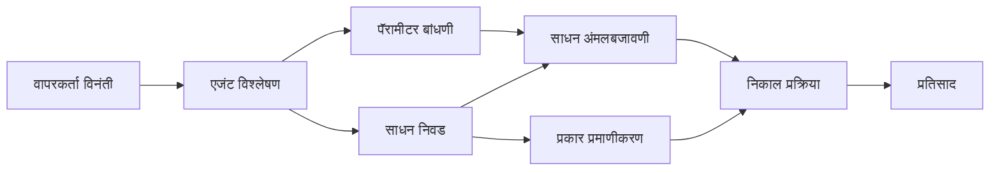

# 🛠️ Azure OpenAI (Responses API) सह प्रगत उपकरण वापर (.NET)

## 📋 शिक्षण उद्दिष्टे

हे नोटबुक Microsoft Agent Framework वापरून .NET मध्ये Azure OpenAI (Responses API) सोबत एंटरप्राइज-ग्रेड टूल इंटिग्रेशन पॅटर्न दाखवते. तुम्हाला C# च्या मजबूत टायपिंग आणि .NET च्या एंटरप्राइज वैशिष्ट्यांचा वापर करून अनेक विशेषज्ञ उपकरणांसह प्रगत एजंट तयार करायला शिकायला मिळेल.

### प्रगत उपकरण क्षमतांची तुम्हाला जाणलेली कौशल्ये

- 🔧 **मल्टी-टूल आर्किटेक्चर**: अनेक विशेषज्ञ क्षमता असलेले एजंट तयार करणे
- 🎯 **टाईप-सेफ टूल अंमलबजावणी**: C# च्या कंपाइल-टाइम व्हॅलिडेशनचा वापर
- 📊 **एंटरप्राइज टूल पॅटर्न्स**: उत्पादनांसाठी तयार टूल डिझाइन व त्रुटी व्यवस्थापन
- 🔗 **टूल कॉम्पोजिशन**: क्लिष्ट व्यावसायिक कार्यप्रवाहांसाठी उपकरणे संयोजन करणे

## 🎯 .NET टूल आर्किटेक्चरचे फायदे

### एंटरप्राइज टूल वैशिष्ट्ये

- **कंपाइल-टाइम व्हॅलिडेशन**: मजबूत टायपिंगमुळे उपकरणाच्या पॅरामीटर्सची अचूकता सुनिश्चित होते
- **डेपेंडन्सी इंजेक्शन**: टूल व्यवस्थापनासाठी IoC कंटेनर इंटिग्रेशन
- **Async/Await पॅटर्न्स**: योग्य संसाधन व्यवस्थापनासह नॉन-ब्लॉकिंग टूल अंमलबजावणी
- **स्ट्रक्चर्ड लॉगिंग**: टूल अंमलबजावणी निरीक्षणासाठी अंतर्भूत लॉगिंग इंटिग्रेशन

### उत्पादन तयार पॅटर्न्स

- **अपवाद व्यवस्थापन**: टाईप केलेल्या अपवादांसह सर्वसमावेशक त्रुटी व्यवस्थापन
- **संसाधन व्यवस्थापन**: योग्य डिस्पोजल पॅटर्न्स आणि मेमरी व्यवस्थापन
- **परफॉर्मन्स मॉनिटरींग**: अंतर्भूत मेट्रिक्स आणि परफॉर्मन्स काउंटर
- **कॉन्फिगरेशन व्यवस्थापन**: व्हॅलिडेशनसह टाईप-सेफ कॉन्फिगरेशन

## 🔧 तांत्रिक आर्किटेक्चर

### कोर .NET टूल घटक

- **Microsoft.Extensions.AI**: एकात्मिक टूल अब्स्ट्रॅक्शन लेयर
- **Microsoft.Agents.AI**: एंटरप्राइज-ग्रेड टूल ऑर्केस्ट्रेशन
- **Azure OpenAI (Responses API)**: कनेक्शन पूलिंगसह उच्च-कार्यक्षम API क्लायंट

### टूल अंमलबजावणी पाइपलाइन



## 🛠️ टूल वर्गीकरण आणि पॅटर्न्स

### 1. **डेटा प्रोसेसिंग टूल्स**

- **इनपुट व्हॅलिडेशन**: डेटा अॅनोटेशन्ससह मजबूत टायपिंग
- **ट्रान्सफॉर्म ऑपरेशन्स**: टाइप-सेफ डेटा रूपांतरण व फॉरमॅटिंग
- **बिझनेस लॉजिक**: डोमेन-विशिष्ट गणना आणि विश्लेषण टूल्स
- **आउटपुट फॉरमॅटिंग**: संरचित प्रतिसाद निर्मिती

### 2. **एकत्रीकरण टूल्स**

- **API कनेक्टर्स**: HttpClient सह RESTful सेवा एकत्रीकरण
- **डेटाबेस टूल्स**: डेटा प्रवेशासाठी Entity Framework एकत्रीकरण
- **फाइल ऑपरेशन्स**: व्हॅलिडेशनसह सुरक्षित फाइल प्रणाली ऑपरेशन्स
- **बाह्य सेवा**: तृतीय-पक्ष सेवा एकत्रीकरण पॅटर्न्स

### 3. **उपयुक्तता टूल्स**

- **टेक्स्ट प्रोसेसिंग**: स्ट्रिंग मॅनिप्युलेशन आणि फॉरमॅटिंग युटिलिटीज
- **दिनांक/वेळ ऑपरेशन्स**: संस्कृती-सचेत दिनांक/वेळ गणना
- **गणितीय टूल्स**: अचूक गणना आणि सांख्यिकीय ऑपरेशन्स
- **व्हॅलिडेशन टूल्स**: बिझनेस नियमाचे व्हॅलिडेशन आणि डेटा पडताळणी

शक्तिशाली, टाईप-सेफ टूल क्षमतांसह एंटरप्राइज-ग्रेड एजंट तयार करण्यासाठी तयार आहात? चला काही व्यावसायिक-ग्रेड सोल्यूशन्स आर्किटेक्ट करूया! 🏢⚡

## 🚀 सुरुवात कशी करावी

### पूर्वअट

- [.NET 10 SDK](https://dotnet.microsoft.com/download/dotnet/10.0) किंवा त्याहून अधिक
- Azure OpenAI संसाधन आणि मॉडेल डिप्लॉयमेंटसह [Azure सदस्यता](https://azure.microsoft.com/free/)
- [Azure CLI](https://learn.microsoft.com/cli/azure/install-azure-cli) — `az login` वापरून साइन इन करा

### आवश्यक पर्यावरण चल

```bash
# zsh/bash
export AZURE_OPENAI_ENDPOINT=https://<your-resource>.openai.azure.com
export AZURE_OPENAI_DEPLOYMENT=gpt-4.1-mini
# नंतर साइन इन करा जेणेकरून AzureCliCredential टोकन मिळवू शकेल
az login
```

```powershell
# PowerShell
$env:AZURE_OPENAI_ENDPOINT = "https://<your-resource>.openai.azure.com"
$env:AZURE_OPENAI_DEPLOYMENT = "gpt-4.1-mini"
# मग साइन इन करा जेणेकरून AzureCliCredential टोकन प्राप्त करू शकेल
az login
```

### नमुना कोड

कोड उदाहरण चालविण्यासाठी,

```bash
# झेडश/बॅश
chmod +x ./04-dotnet-agent-framework.cs
./04-dotnet-agent-framework.cs
```

किंवा dotnet CLI वापरून:

```bash
dotnet run ./04-dotnet-agent-framework.cs
```

संपूर्ण कोडसाठी [`04-dotnet-agent-framework.cs`](../../../../04-tool-use/code_samples/04-dotnet-agent-framework.cs) पहा.

```csharp
#!/usr/bin/dotnet run

#:package Microsoft.Extensions.AI@10.*
#:package Microsoft.Agents.AI.OpenAI@1.*-*
#:package Azure.AI.OpenAI@2.1.0
#:package Azure.Identity@1.13.1

using System.ComponentModel;

using Microsoft.Agents.AI;
using Microsoft.Extensions.AI;

using Azure.AI.OpenAI;
using Azure.Identity;

// Tool Function: Random Destination Generator
// This static method will be available to the agent as a callable tool
// The [Description] attribute helps the AI understand when to use this function
// This demonstrates how to create custom tools for AI agents
[Description("Provides a random vacation destination.")]
static string GetRandomDestination()
{
    // List of popular vacation destinations around the world
    // The agent will randomly select from these options
    var destinations = new List<string>
    {
        "Paris, France",
        "Tokyo, Japan",
        "New York City, USA",
        "Sydney, Australia",
        "Rome, Italy",
        "Barcelona, Spain",
        "Cape Town, South Africa",
        "Rio de Janeiro, Brazil",
        "Bangkok, Thailand",
        "Vancouver, Canada"
    };

    // Generate random index and return selected destination
    // Uses System.Random for simple random selection
    var random = new Random();
    int index = random.Next(destinations.Count);
    return destinations[index];
}

// Azure OpenAI with the Responses API (stable v1 endpoint). Sign in with `az login`.
var azureEndpoint = Environment.GetEnvironmentVariable("AZURE_OPENAI_ENDPOINT")
    ?? throw new InvalidOperationException("AZURE_OPENAI_ENDPOINT is not set.");
var deployment = Environment.GetEnvironmentVariable("AZURE_OPENAI_DEPLOYMENT") ?? "gpt-4.1-mini";

var azureClient = new AzureOpenAIClient(new Uri(azureEndpoint), new AzureCliCredential());

// Define Agent Identity and Comprehensive Instructions
// Agent name for identification and logging purposes
var AGENT_NAME = "TravelAgent";

// Detailed instructions that define the agent's personality, capabilities, and behavior
// This system prompt shapes how the agent responds and interacts with users
var AGENT_INSTRUCTIONS = """
You are a helpful AI Agent that can help plan vacations for customers.

Important: When users specify a destination, always plan for that location. Only suggest random destinations when the user hasn't specified a preference.

When the conversation begins, introduce yourself with this message:
"Hello! I'm your TravelAgent assistant. I can help plan vacations and suggest interesting destinations for you. Here are some things you can ask me:
1. Plan a day trip to a specific location
2. Suggest a random vacation destination
3. Find destinations with specific features (beaches, mountains, historical sites, etc.)
4. Plan an alternative trip if you don't like my first suggestion

What kind of trip would you like me to help you plan today?"

Always prioritize user preferences. If they mention a specific destination like "Bali" or "Paris," focus your planning on that location rather than suggesting alternatives.
""";

// Create AI Agent with Advanced Travel Planning Capabilities
// Get the Responses client for the deployment and create the AI agent
// Configure agent with name, detailed instructions, and available tools
// This demonstrates the .NET agent creation pattern with full configuration
AIAgent agent = azureClient
    .GetChatClient(deployment)
    .AsAIAgent(
        name: AGENT_NAME,
        instructions: AGENT_INSTRUCTIONS,
        tools: [AIFunctionFactory.Create(GetRandomDestination)]
    );

// Create New Conversation Session for Context Management
// Initialize a new conversation session to maintain context across multiple interactions
// Sessions enable the agent to remember previous exchanges and maintain conversational state
// This is essential for multi-turn conversations and contextual understanding
await using var session = await agent.CreateSessionAsync();

// Execute Agent: First Travel Planning Request
// Run the agent with an initial request that will likely trigger the random destination tool
// The agent will analyze the request, use the GetRandomDestination tool, and create an itinerary
// Using the session parameter maintains conversation context for subsequent interactions
await foreach (var update in agent.RunStreamingAsync("Plan me a day trip", session))
{
    await Task.Delay(10);
    Console.Write(update);
}

Console.WriteLine();

// Execute Agent: Follow-up Request with Context Awareness
// Demonstrate contextual conversation by referencing the previous response
// The agent remembers the previous destination suggestion and will provide an alternative
// This showcases the power of conversation sessions and contextual understanding in .NET agents
await foreach (var update in agent.RunStreamingAsync("I don't like that destination. Plan me another vacation.", session))
{
    await Task.Delay(10);
    Console.Write(update);
}
```

---

<!-- CO-OP TRANSLATOR DISCLAIMER START -->
**अस्वीकरण**:
हा दस्तऐवज AI भाषांतर सेवा [Co-op Translator](https://github.com/Azure/co-op-translator) चा वापर करून अनुवादित केला आहे. जरी आम्ही अचूकतेसाठी प्रयत्न करतो, तरी कृपया लक्षात घ्या की स्वयंचलित भाषांतरांमध्ये त्रुटी किंवा अचूकतेची कमतरता असू शकते. मूळ दस्तऐवज त्याच्या मूळ भाषेत अधिकृत स्रोत मानला पाहिजे. महत्त्वाची माहिती असल्यास, व्यावसायिक मानवी भाषांतराची शिफारस केली जाते. या भाषांतराच्या वापरामुळे उद्भवणाऱ्या कोणत्याही गैरसमज किंवा चुकीच्या अर्थलावणीसाठी आम्ही जबाबदार नाही.
<!-- CO-OP TRANSLATOR DISCLAIMER END -->