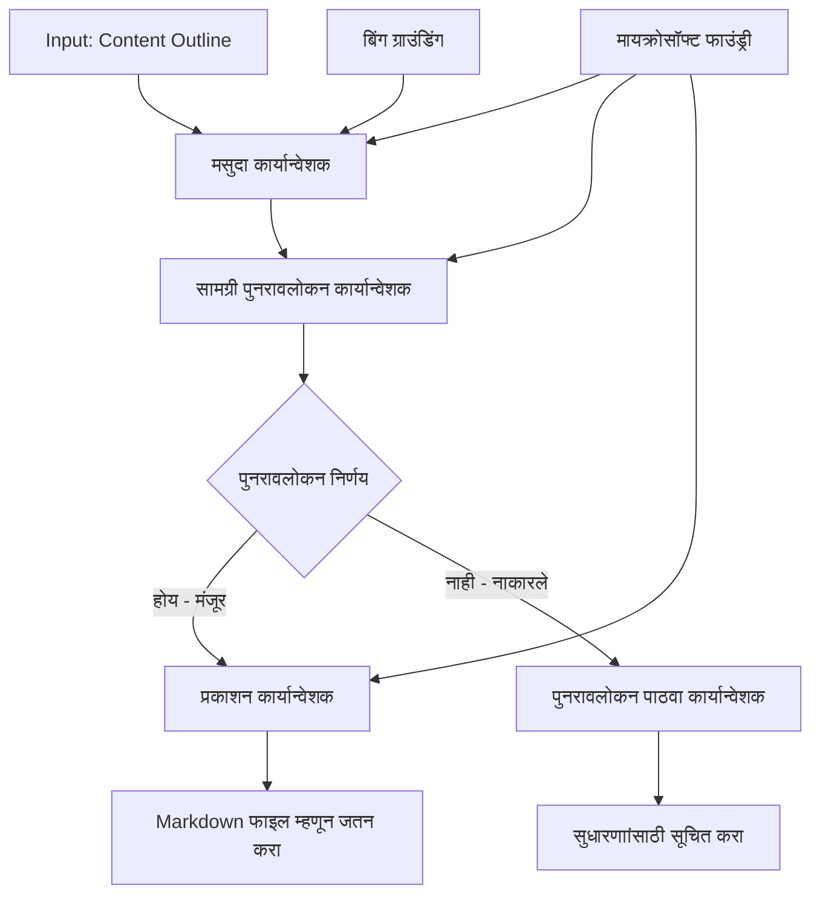

# 🔀 मायक्रोसॉफ्ट फाउंड्री (.NET) सह अटींच्या आधारे एजंट कार्यप्रवाह

## 📋 बुद्धिमान निर्णय-आधारित कार्यप्रवाह ट्यूटोरियल

हा नोटबुक मायक्रोसॉफ्ट फाउंड्री आणि .NET साठी मायक्रोसॉफ्ट एजंट फ्रेमवर्क वापरून **अटींच्या आधारे कार्यप्रवाह नमुने** कसे तयार करायचे हे दाखवतो. आपण एआय विश्लेषण, व्यवसाय नियम, आणि डायनॅमिक अटींवर आधारित प्रक्रिया बुद्धिमत्तेने मार्गदर्शन करणारे प्रगत, निर्णय-संचालित कार्यप्रवाह तयार करणे शिकाल, जे उद्योजकीय दर्जाच्या ऑटोमेशनसाठी उपयुक्त आहे.

## 🎯 शिकण्याच्या उद्दिष्टां

### 🧠 **बुद्धिमान निर्णय आर्किटेक्चर**
- **अटींची लॉजिक अंमलबजावणी**: अनेक शाखा बिंदूंसह क्लिष्ट निर्णय वृक्ष तयार करा
- **एआय-चालित मार्गदर्शन**: बुद्धिमान मार्गदर्शन निर्णयांसाठी मायक्रोसॉफ्ट फाउंड्री मॉडेल वापरा
- **डायनॅमिक कार्यप्रवाह रूपांतर**: रनटाइम विश्लेषण आणि अटींवर आधारित कार्यप्रवाह वर्तन बदला
- **उद्योजकीय नियम समाकलन**: कार्यप्रवाहात व्यवसाय लॉजिक आणि अनुपालन गरजा समाविष्ट करा

### 🔀 **प्रगत अटींचे नमुने**
- **एकाधिक निकष निर्णय घेणे**: मार्गदर्शन निर्णयांसाठी अनेक घटकांचे मूल्यांकन करा
- **संदर्भ-सजग प्रक्रिया**: संकलित कार्यप्रवाह संदर्भ आणि इतिहास आधारित निर्णय घ्या
- **अनुकूलन कार्यप्रवाह बदल**: प्रत्यक्ष अटींवर आधारित प्रक्रिया मार्गांमध्ये डायनॅमिक समायोजन करा
- **नियम यंत्र समाकलन**: कार्यप्रवाहात क्लिष्ट व्यवसाय नियम इंजिन कार्यान्वित करा

### 🏢 **उद्योजकीय अटींचे अनुप्रयोग**
- **दस्तऐवज वर्गीकरण व मार्गदर्शन**: दस्तऐवज योग्य कार्यप्रवाहांकडे स्वयंचलित वर्गीकरण आणि मार्गदर्शन करा
- **ग्राहक सेवा त्रीएज**: ग्राहक चौकशींच्या बुद्धिमान मार्गदर्शनासाठी खास टीमकडे वाटप करा
- **अनुपालन आणि धोका प्रक्रिया**: धोका मूल्यांकनावर आधारित वेगवेगळ्या तपासणी आणि पुनरावलोकन प्रक्रिया लागू करा
- **गुणवत्तेची खात्री कार्यप्रवाह**: गुणवत्ता मेट्रिक्सवर आधारित सामग्री योग्य पुनरावलोकन प्रक्रियांमधून मार्गदर्शित करा

## ⚙️ पूर्वअट व सेटअप

### 📦 **आवश्यक NuGet पॅकेजेस**

अटींवर आधारित कार्यप्रवाह प्रक्रियेसाठी प्रगत पॅकेजेस:

```xml
<!-- Core AI Framework -->
<PackageReference Include="Microsoft.Extensions.AI" Version="9.9.0" />

<!-- Azure AI Agents with Persistent State -->
<PackageReference Include="Azure.AI.Agents.Persistent" Version="1.2.0-beta.5" />

<!-- Azure Identity and Utilities -->
<PackageReference Include="Azure.Identity" Version="1.15.0" />
<PackageReference Include="System.Linq.Async" Version="6.0.3" />
<PackageReference Include="DotNetEnv" Version="3.1.1" />

<!-- Local Workflow Framework References -->
<!-- Microsoft.Agents.Workflows.dll - Advanced workflow orchestration -->
<!-- Microsoft.Agents.AI.AzureAI.dll - Microsoft Foundry integration -->
<!-- Microsoft.Agents.AI.dll - Core agent abstractions -->
```

### 🔑 **मायक्रोसॉफ्ट फाउंड्री कॉन्फिगरेशन**

**आवश्यक Azure संसाधने:**
- अटींवर प्रक्रिया करणाऱ्या मॉडेलसह मायक्रोसॉफ्ट फाउंड्री कार्यक्षेत्र
- योग्य संगणना कोटा व परवानग्यांसह Azure सदस्यता
- निर्णय घेण्यासाठी व सामग्री विश्लेषणासाठी नियुक्त एआय मॉडेल्स
- (ऐच्छिक) ग्राउंडिंग क्षमता साठी Bing शोध API कनेक्शन

**पर्यावरण कॉन्फिगरेशन (.env फाइल):**
```env
# Microsoft Foundry Configuration
AZURE_AI_PROJECT_ENDPOINT=https://your-project.cognitiveservices.azure.com/
BING_CONNECTION_ID=your-bing-connection-id
```

**प्रमाणीकरण सेटअप:**
```csharp
// Azure CLI or Managed Identity authentication
using Azure.Identity;
var credential = new AzureCliCredential();

// Load environment configuration
DotNetEnv.Env.Load("../../../.env");
```

### 🏗️ **अटींच्या आधारे कार्यप्रवाह आर्किटेक्चर**



**मुख्य घटक:**
- **ड्राफ्ट अंमलबजावणीकर्ता**: ऑउटलाइन्समधून प्राथमिक सामग्री ड्राफ्ट तयार करणारा एआय एजंट
- **सामग्री पुनरावलोकन अंमलबजावणीकर्ता**: ड्राफ्ट गुणवत्ता आणि अनुपालन मूल्यांकन करणारा एआय एजंट
- **अटींचे मार्गदर्शन**: पुनरावलोकन परिणामांवर आधारित मार्गदर्शन लॉजिक
- **प्रकाशन/पुनरावलोकन मार्ग**: मान्यता दिलेल्या व नकार दिलेल्या सामग्रीसाठी वेगळे प्रक्रिया मार्ग
- **स्थिती व्यवस्थापन**: कार्यप्रवाहात सामग्री आणि पुनरावलोकन संदर्भ राखणे

## 🎨 **अटींच्या आधारे कार्यप्रवाह डिझाईन नमुने**

### 📋 **गुणवत्तेच्या पडद्यांसह सामग्री उत्पादन**
```
Outline → Draft Creation → Quality Review → {Approve: Publish | Reject: Revise}
```

### 🎯 **धोक्याशी संबंधित दस्तऐवज प्रक्रिया**
```
Document → Risk Assessment → {Low: Standard | High: Enhanced Review}
```

### 🔍 **बुद्धिमान ग्राहक सेवा मार्गदर्शन**
```
Customer Query → Analysis → {Simple: FAQ Bot | Complex: Human Agent}
```

### 💼 **अनुपालन-चालित कार्यप्रवाह**
```
Content → Compliance Check → {Pass: Publish | Fail: Legal Review}
```

## 🏢 **उद्योजकीय अटींचे फायदे**

### 🎯 **बुद्धिमान ऑटोमेशन**
- **स्मार्ट निर्णय घेणे**: सामग्री विश्लेषण व संदर्भावर आधारित एआय-चालित मार्गदर्शन निर्णय
- **अनुकूलित प्रक्रिया**: बदलत्या परिस्थितीवर स्वयंचलित समायोजन करणारे कार्यप्रवाह
- **व्यवसाय नियम कार्यान्वयन**: क्लिष्ट व्यवसाय लॉजिक आणि धोरणे स्वयंचलितपणे लागू करणे
- **संदर्भ-सजग मार्गदर्शन**: संपूर्ण कार्यप्रवाह इतिहास व संकलित संदर्भावर आधारित निर्णय

### 📈 **ऑपरेशनल उत्कृष्टता**
- **संसाधनांचे अनुकूल वितरण**: सर्वात योग्य तज्ञ व प्रक्रियांना कार्य मार्गदर्शित करणे
- **कमी मानवी हस्तक्षेप**: स्वयंचलित निर्णयाने मानवी मार्गदर्शनासाठी गरज कमी करणे
- **जलद निकाल वेळा**: अगदी तज्ञता व प्रक्रिया क्षमताकडे थेट मार्गदर्शन
- **सुसंगत अंमलबजावणी**: व्यवसाय नियम व निर्णय निकषांची एकसंध अंमलबजावणी

### 🛡️ **धोका व्यवस्थापन व अनुपालन**
- **स्वयंचलित धोका मूल्यांकन**: सामग्री व परिस्थितीच्या धोका स्तराचे एआय-चालित मूल्यांकन
- **अनुपालन अंमलबजावणी**: आवश्यक नियम प्रक्रियेद्वारे स्वयंचलित मार्गदर्शन
- **सुरक्षा प्रोटोकॉल लागू करणे**: धोका मूल्यांकनावर आधारित वाढीव सुरक्षा उपायांकडे लक्ष
- **ऑडिट ट्रेल देखभाल**: मार्गदर्शन निर्णय आणि कारणांची संपूर्ण नोंद

### 📊 **विश्लेषण व सतत सुधारणा**
- **निर्णय विश्लेषण**: मार्गदर्शन निर्णयांची कार्यक्षमता व अचूकता ट्रॅक करा
- **नमुना ओळख**: वेळेनुसार मार्गदर्शन निर्णयांतून ट्रेंड व नमुने ओळखा
- **कार्यक्षमता अनुकूलन**: निर्णय निकष आणि मार्गदर्शन कार्यक्षमतेचा सतत सुधारणा
- **व्यवसाय बुद्धिमत्ता**: सामग्री वैशिष्ट्ये व प्रक्रिया गरजांवरील अंतर्दृष्टी

### 🔧 **तांत्रिक उत्कृष्टता**
- **सतत स्थिरता व्यवस्थापन**: कार्यप्रवाह अंमलबजावणीमध्ये क्लिष्ट स्थिरता राखणे
- **स्केलेबल आर्किटेक्चर**: उच्च-आकारणी अटींच्या प्रक्रिया गरजा हाताळणे
- **समाकलन क्षमता**: विद्यमान व्यवसाय प्रणाली व प्रक्रियांशी सुलभ समाकलन
- **निरिक्षण व निरीक्षण क्षमता**: कार्यप्रवाह कार्यक्षमता व निर्णयांचं सविस्तर ट्रॅकिंग

चला .NET सह बुद्धिमान, निर्णय-चालित उद्योजकीय कार्यप्रवाह तयार करूया! 🚀

## 💻 कोड चालविणे

संपूर्ण अंमलबजावणी `04.dotnet-agent-framework-workflow-aifoundry-condition.cs` मध्ये उपलब्ध आहे. हे **गुणवत्तेच्या पडद्यांसह सामग्री उत्पादन कार्यप्रवाह** दर्शवते:

### 🏗️ **कार्यप्रवाह आर्किटेक्चर**

```
Content Outline → Draft Creation → Quality Review → Conditional Routing:
                                                      ├─ Approved (>200 words) → Publish
                                                      └─ Rejected (<200 words) → Review Notification
```

**कार्यप्रवाहातील एजंट्स:**
1. **इव्हांजेलिस्ट एजंट**: ऑउटलाइन्समधून ट्यूटोरियल ड्राफ्ट तयार करतो, Bing ग्राउंडिंगसह
2. **सामग्री पुनरावलोकन एजंट**: ड्राफ्ट गुणवत्ता (शब्दसंख्या, पूर्णता) मूल्यांकन करतो
3. **प्रकाशक एजंट**: मान्यताप्राप्त सामग्रीला टाईमस्टँप केलेल्या Markdown फाइल्स म्हणून जतन करतो

**सानुकूल कार्यान्वितकर्ते:**
1. **DraftExecutor**: ड्राफ्ट तयार करणे एकत्रित करतो
2. **ContentReviewExecutor**: गुणवत्ता मूल्यांकन करतो
3. **PublishExecutor**: मान्यताप्राप्त सामग्री प्रकाशीत करतो
4. **SendReviewExecutor**: नाकारलेल्या कंटेंट सूचना व्यवस्थापित करतो

### 🚀 उदाहरण चालविणे

**पूर्वअटी:**
- मायक्रोसॉफ्ट फाउंड्री कार्यक्षेत्र कॉन्फिगर केले आहे
- Azure CLI प्रमाणीकरण (`az login`)
- (ऐच्छिक) ग्राउंडिंगसाठी Bing शोध कनेक्शन

```bash
# स्क्रिप्ट executable बनवा (Unix/Linux/macOS)
chmod +x 04.dotnet-agent-framework-workflow-aifoundry-condition.cs

# सशर्त वर्कफ़्लो चालवा
./04.dotnet-agent-framework-workflow-aifoundry-condition.cs
```

किंवा Windows वर:
```powershell
dotnet run 04.dotnet-agent-framework-workflow-aifoundry-condition.cs
```

### 📝 अपेक्षित आउटपुट

कार्यप्रवाह:
1. **एजंट तयार करा**: तीन विशेष मायक्रोसॉफ्ट फाउंड्री एजंट प्रारंभ करा
2. **ड्राफ्ट तयार करा**: इव्हांजेलिस्ट एजंट ऑउटलाइन्समधून ट्यूटोरियल ड्राफ्ट तयार करतो
3. **सामग्री पुनरावलोकन**: कंटेंट रिव्ह्युअर ड्राफ्टची गुणवत्ता तपासतो
4. **अटींचे मार्गदर्शन**:
   - **जर मान्यताप्राप्त (>200 शब्द)**: प्रकाशक कार्यान्वितकर्ता Markdown फाइल म्हणून जतन करतो
   - **जर नकार (<200 शब्द)**: पुनरावलोकन सूचना पाठवतो
5. **परिणाम दाखवा**: अंतिम कार्यप्रवाह परिणाम प्रदर्शित करा

### 🔧 सानुकूलन पर्याय

**पुनरावलोकन निकष संशोधन करा:**
```csharp
const string ContentReviewerInstructions = @"
You are a content reviewer...
1. Check if content is more than 500 words (instead of 200)
2. Verify technical accuracy
3. Ensure proper formatting
...";
```

**अधिक अटींचे मार्ग जोडा:**
```csharp
var workflow = new WorkflowBuilder(draftExecutor)
    .AddEdge(draftExecutor, contentReviewerExecutor)
    .AddEdge(contentReviewerExecutor, publishExecutor, condition: GetCondition("Excellent"))
    .AddEdge(contentReviewerExecutor, editExecutor, condition: GetCondition("Good"))
    .AddEdge(contentReviewerExecutor, sendReviewerExecutor, condition: GetCondition("Poor"))
    .Build();
```

**सामग्री गरजा बदला:**
```csharp
string OUTLINE_Content = @"
# Your Custom Topic
## Section 1
https://your-reference-url
## Section 2
...
";
```

### 🎯 वास्तविक जगातील अनुप्रयोग

हा अटींचा कार्यप्रवाह नमुना खालीलसाठी आदर्श आहे:
- **सामग्री व्यवस्थापन प्रणाली**: गुणवत्ता पडद्यांसह स्वयंचलित संपादकीय कार्यप्रवाह
- **दस्तऐवज प्रक्रिया**: वर्गीकरण आणि अनुपालनावर आधारित दस्तऐवज मार्गनिर्देशन
- **ग्राहक समर्थन**: जटीलता व तातडीवर आधारित बुद्धिमान तिकीट मार्गदर्शन
- **कायदेशीर पुनरावलोकन**: धोका मूल्यांकन आणि मूल्यावर आधारित करार मार्गदर्शन
- **मानव संसाधन प्रक्रिया**: योग्य छाटणी कार्यप्रवाहाद्वारे अर्ज मार्गदर्शन

### 🔍 अटींचे लॉजिक समजून घ्या

**शर्ती कार्य:**
```csharp
public Func<object?, bool> GetCondition(string expectedResult) =>
    reviewResult => reviewResult is ReviewResult review && review.Result == expectedResult;
```

हा कार्य एक प्रेडिकेट तयार करतो जो:
1. निकाल `ReviewResult` प्रकाराचा आहे का तपासतो
2. अपेक्षित मूल्याशी `Result` प्रॉपर्टीची तुलना करतो
3. मार्गदर्शन ठरविण्यासाठी खरे/खोटे परत करतो

**अटींसह कार्यप्रवाह कडा:**
```csharp
.AddEdge(contentReviewerExecutor, publishExecutor, condition: GetCondition("Yes"))
.AddEdge(contentReviewerExecutor, sendReviewerExecutor, condition: GetCondition("No"))
```

### 📊 प्रगत वैशिष्ट्ये

**JSON स्कीमा सत्यापन:**
कार्यप्रवाह संरचित प्रतिसादासाठी JSON स्कीमांचा वापर करतो:

```csharp
// Define response structure
public class ReviewResult
{
    [JsonPropertyName("review_result")]
    public string Result { get; set; } = string.Empty;
    
    [JsonPropertyName("reason")]
    public string Reason { get; set; } = string.Empty;
    
    [JsonPropertyName("draft_content")]
    public string DraftContent { get; set; } = string.Empty;
}

// Apply to agent
ResponseFormat = ChatResponseFormat.ForJsonSchema(
    AIJsonUtilities.CreateJsonSchema(typeof(ReviewResult)), 
    "ReviewResult", 
    "Review Result From DraftContent"
)
```

**Bing ग्राउंडिंग समाकलन:**
इव्हांजेलिस्ट एजंट वास्तविक-वेळ माहिती साठी Bing ग्राउंडिंग वापरतो:

```csharp
var bingGroundingConfig = new BingGroundingSearchConfiguration(bing_conn_id);
BingGroundingToolDefinition bingGroundingTool = new(
    new BingGroundingSearchToolParameters([bingGroundingConfig])
);
```

हे एजंटला ऑउटलाइन्समधील URL फॉलो करून वर्तमान माहिती काढण्यास सक्षम बनवते.

### 🛡️ त्रुटी हाताळणी

कार्यप्रवाह नाकारलेल्या सामग्रीसाठी मजबूत त्रुटी हाताळणी समाविष्ट करतो:
- पुनरावलोकन अपयशामुळे पर्यायी मार्ग सक्रिय होतो
- सूचना स्पष्ट नकार कारणे देतात
- सामग्री पुनरावलोकनासाठी जपली जाते

### 🔄 कार्यप्रवाह विस्तार

**पुनरावलोकन लूप जोडा:**
सामग्री स्वयंचलितपणे पुन्हा ड्राफ्ट करणारा अभिप्राय लूप तयार करा:

```csharp
.AddEdge(contentReviewerExecutor, publishExecutor, condition: GetCondition("Yes"))
.AddEdge(contentReviewerExecutor, draftExecutor, condition: GetCondition("No")) // Loop back
```

**बहु-स्तरीय पुनरावलोकन अंमलबजावणी:**
वेगवेगळ्या निकषांसह अनेक पुनरावलोकन टप्पे जोडा:

```csharp
.AddEdge(draftExecutor, technicalReviewer)
.AddEdge(technicalReviewer, editorialReviewer, condition: GetCondition("TechPass"))
.AddEdge(editorialReviewer, publishExecutor, condition: GetCondition("EditPass"))
```

हा अटींचा कार्यप्रवाह नमुना प्रगत, बुद्धिमान उद्योजकीय ऑटोमेशन सिस्टीम तयार करण्यासाठी पाया प्रदान करतो! 🚀

---

<!-- CO-OP TRANSLATOR DISCLAIMER START -->
**अस्वीकरण**:
हा दस्तऐवज AI भाषांतर सेवा [Co-op Translator](https://github.com/Azure/co-op-translator) चा वापर करून अनुवादित केला आहे. जरी आम्ही अचूकतेसाठी प्रयत्न करतो, तरी कृपया लक्षात घ्या की स्वयंचलित भाषांतरांमध्ये त्रुटी किंवा अचूकतेची कमतरता असू शकते. मूळ दस्तऐवज त्याच्या मूळ भाषेत अधिकृत स्रोत मानला पाहिजे. महत्त्वाची माहिती असल्यास, व्यावसायिक मानवी भाषांतराची शिफारस केली जाते. या भाषांतराच्या वापरामुळे उद्भवणाऱ्या कोणत्याही गैरसमज किंवा चुकीच्या अर्थलावणीसाठी आम्ही जबाबदार नाही.
<!-- CO-OP TRANSLATOR DISCLAIMER END -->