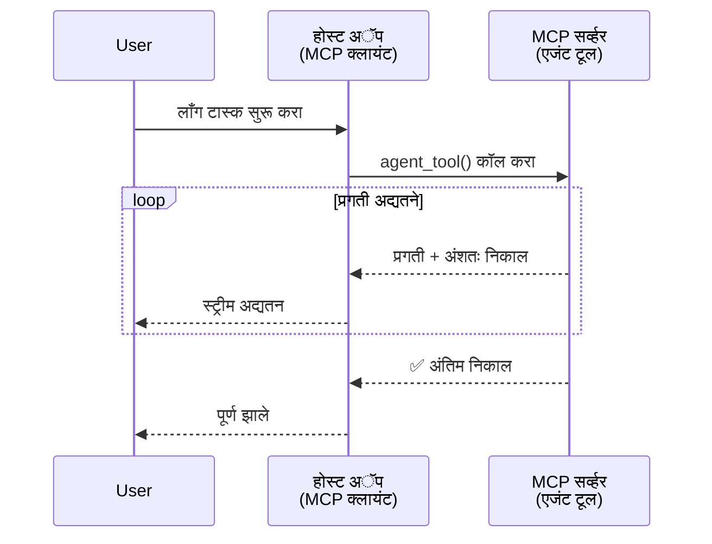
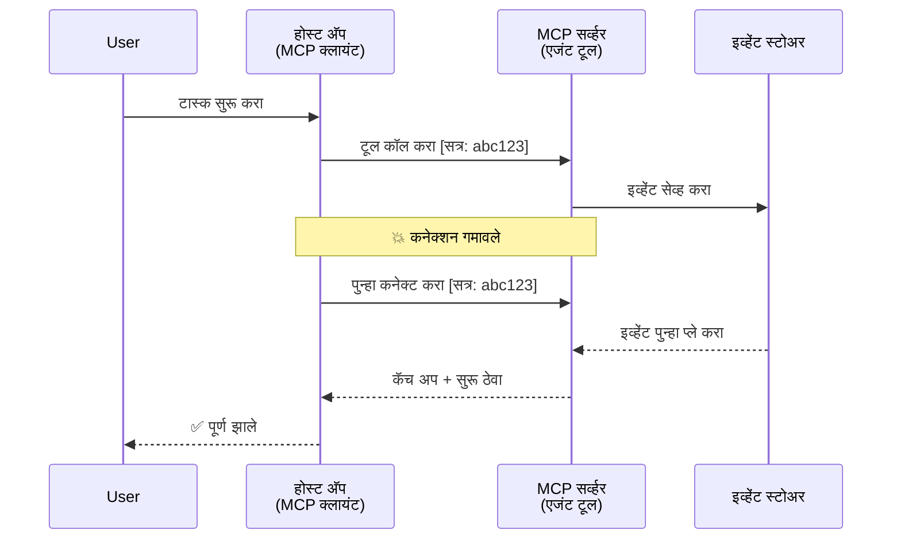
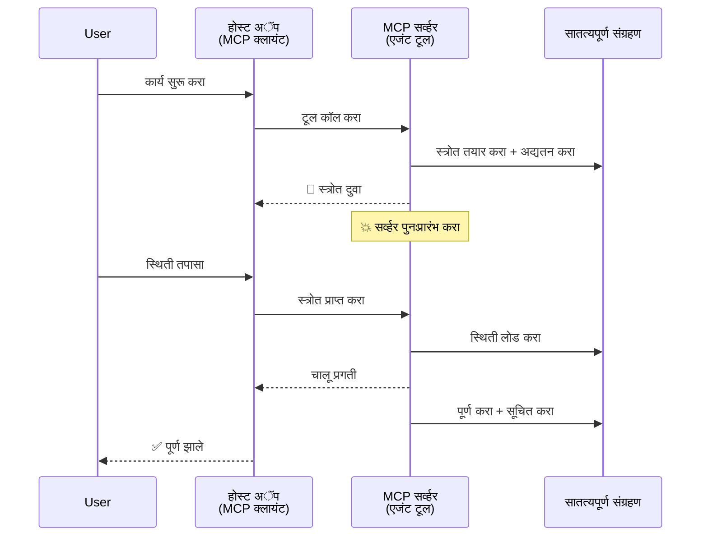
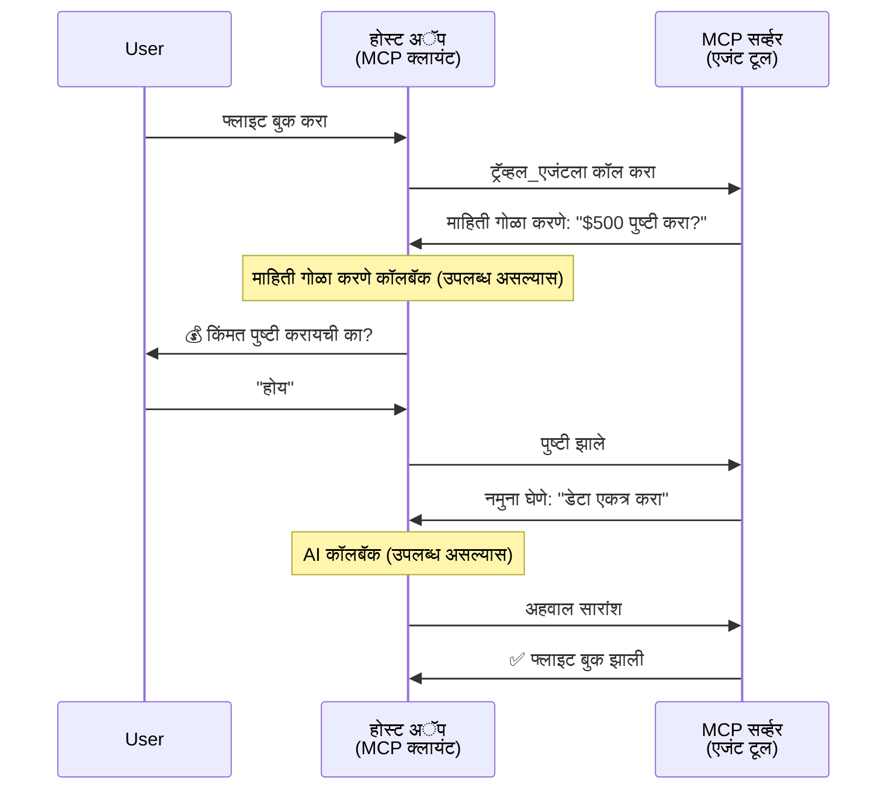
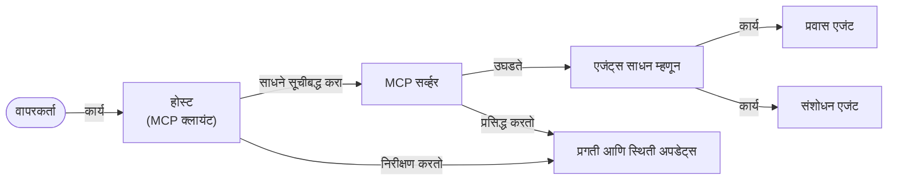

# MCP सह एजंट-टू-एजंट कम्युनिकेशन सिस्टम तयार करणे

> संक्षिप्त सारांश - तुम्ही MCP वर एजंट2एजंट कम्युनिकेशन तयार करू शकता का? होय!

MCP मूलतः "LLMs ला संदर्भ देणे" याच्या उद्दिष्टापेक्षा खूप पुढे विकसित झाले आहे. अलीकडील सुधारणा ज्यामध्ये [पुनर्सुरू होणारे प्रवाह](https://modelcontextprotocol.io/docs/concepts/transports#resumability-and-redelivery), [प्रेरणा](https://modelcontextprotocol.io/specification/2025-06-18/client/elicitation), [नमुना घेणे](https://modelcontextprotocol.io/specification/2025-06-18/client/sampling) आणि सूचना ([प्रगती](https://modelcontextprotocol.io/specification/2025-06-18/basic/utilities/progress) आणि [संसाधने](https://modelcontextprotocol.io/specification/2025-06-18/schema#resourceupdatednotification)) यांचा समावेश आहे, MCP आता गुंतागुंतीची एजंट-टू-एजंट कम्युनिकेशन प्रणाली तयार करण्यासाठी एक मजबूत पाया प्रदान करतो.

## एजंट/टूल बद्दल गैरसमजुती

अधिकाधिक विकसक एजंटसारख्या वागणुकीसह साधने (दिर्घकाळ चालणारी, मध्ये अतिरिक्त इनपुट आवश्यक असू शकणारी इत्यादी) तपासत असताना, सामान्य गैरसमज अशी आहे की MCP अनुपयुक्त आहे कारण याच्या सुरुवातीच्या उदाहरणांतील साधने प्रामुख्याने साध्या विनंती-प्रतिक्रिया पद्धतींकडे लक्ष केंद्रित करीत होती.

ही धारणा कालबाह्य झाली आहे. गेल्या काही महिन्यांमध्ये MCP तपशीलमध्ये महत्त्वपूर्ण सुधारणा करण्यात आल्या आहेत ज्यामुळे दिर्घकाळ चालणारी एजंटसारखी वागणूक तयार करण्यासाठी अंतर मिटते:

- **प्रवाहित करणे आणि आंशिक निकाल**: कार्यान्वयनादरम्यान रिअल-टाइम प्रगती अद्ययावत
- **पुनर्सुरू होण्याची क्षमता**: क्लायंट डिस्कनेक्शन नंतर पुन्हा जोडून पुढे सुरू ठेवू शकतात
- **टिकाऊपणा**: निकाल सर्व्हर रीस्टार्टनंतरही टिकून राहतात (उदा. संसाधन दुव्यांद्वारे)
- **बहु-टर्न**: कार्यान्वयनादरम्यान प्रेरणा आणि नमुनाकरणाद्वारे संवादात्मक इनपुट

या वैशिष्ट्यांचा वापर करून गुंतागुंतीच्या एजंटसंबंधी आणि बहु-एजंट अनुप्रयोग तयार केले जाऊ शकतात, जे सर्व MCP प्रोटोकॉलवर आधारित असतात.

संदर्भासाठी, आपण एजंट या शब्दाचा अर्थ असा घेऊ की तो "टूल" आहे जो MCP सर्व्हरवर उपलब्ध आहे. याचा अर्थ असा की होस्ट अनुप्रयोग असतो जो MCP क्लायंट अंमलात आणतो, जो MCP सर्व्हरशी सत्र स्थापन करतो आणि एजंट कॉल करू शकतो.

## MCP टूल "एजंटसारखा" बनवणारे काय आहे?

अमलबजावणीत उतरल्याआधी, आपण दीर्घकाळ चालणाऱ्या एजंटसाठी आवश्यक पायाभूत सुविधा काय आहेत हे निश्चित करूया.

> एजंट हा असा घटक असतो जो स्वायत्तपणे दीर्घकाळ कार्य करू शकतो, गुंतागुंतीची कामे हाताळू शकतो ज्यासाठी अनेक संवाद किंवा वास्तविक-वेळ अभिप्रायावर आधारित समायोजन आवश्यक असू शकतात.

### 1. प्रवाह आणि आंशिक निकाल

पारंपरिक विनंती-प्रतिक्रिया पद्धती दीर्घकालीन कामांसाठी कार्यरत नाहीत. एजंट्सना आवश्यक आहे:

- वास्तविक वेळेतील प्रगती अद्ययावत
- मधला निकाल

**MCP समर्थन**: संसाधन अद्यतन सूचना आंशिक निकाल प्रवाहित करण्यास सक्षम करतात, पण JSON-RPC च्या 1:1 विनंती/प्रतिक्रिया मॉडेलशी संघर्ष टाळण्यासाठी काळजीपूर्वक डिझाइन आवश्यक आहे.

| वैशिष्ट्य                   | वापर प्रकरण                                                                                                                                                                  | MCP समर्थन                                                                                 |
| -------------------------- | --------------------------------------------------------------------------------------------------------------------------------------------------------------------------- | ------------------------------------------------------------------------------------------ |
| वास्तविक वेळ प्रगती अद्ययावत    | वापरकर्ता कोडबेस स्थलांतर कार्यासाठी विनंती करतो. एजंट प्रगती प्रवाहित करतो: "10% - अवलंबित्वांचे विश्लेषण... 25% - TypeScript फायली रूपांतरित करत आहे... 50% - आयात अद्यतन..."   | ✅ प्रगती सूचना                                                                         |
| आंशिक निकाल                 | "पुस्तक तयार करा" कार्य आंशिक निकाल प्रवाहित करते, उदा. 1) कथा रचना, 2) प्रकरणांची यादी, 3) प्रत्येक प्रकरण पूर्ण झालेले. होस्ट कोणत्याही टप्प्यावर तपासू, रद्द करू, किंवा वळवू शकतो.    | ✅ सूचना "विस्तारित" केल्या जाऊ शकतात ज्यात आंशिक निकालांचा समावेश केला जातो, PR 383, 776 वर प्रस्ताव पहा |

<div align="center" style="font-style: italic; font-size: 0.95em; margin-bottom: 0.5em;">
<strong>आकृती १:</strong> हा आरेख दर्शवितो की कसा MCP एजंट रिअल-टाइम प्रगती अद्यतनं आणि आंशिक निकाल होस्ट अनुप्रयोगाला प्रवाहित करतो, ज्यामुळे वापरकर्ता दीर्घकाळ चालणाऱ्या कार्याचे रिअल-टाइम निरीक्षण करू शकतो.
</div>



### 2. पुनर्सुरू होण्याची क्षमता

एजंट्स नेटवर्क तुटण्यांचा सामना सुलभतेने करणे आवश्यक आहे:

- (क्लायंट) डिस्कनेक्शननंतर पुनः कनेक्ट करणे
- ज्या ठिकाणाहून विस्थापन झाले तिथून सुरू ठेवणे (माध्यमे पुनःवितरण)

**MCP समर्थन**: MCP StreamableHTTP वाहतूक सध्याच्या सत्र पुर्नरचना आणि संदेश पुनर्वितरणाला सत्र ओळखपत्रे आणि शेवटच्या इव्हेंट आयडीसह समर्थन करते. येथे महत्त्वाचे म्हणजे सर्व्हरने EventStore अंमलात आणले पाहिजे जे क्लायंट पुनः कनेक्शनवर इव्हेंट पुनःप्राप्ती सक्षम करते.  
लक्षात घ्या की एक समुदाय प्रस्ताव (PR #975) वाहतुकीपासून स्वतंत्र पुनर्सुरू होणारे प्रवाह याबाबत संशोधन करतो.

| वैशिष्ट्य      | वापर प्रकरण                                                                                                                                               | MCP समर्थन                                                                   |
| ------------ | -------------------------------------------------------------------------------------------------------------------------------------------------------- | -------------------------------------------------------------------------- |
| पुनर्सुरू होण्याची क्षमता | दीर्घकाळ चालणाऱ्या कार्यादरम्यान क्लायंट डिस्कनेक्ट होतो. पुनः कनेक्शनवर सत्र पुन्हा सुरू होते ज्यात चुकलेल्या घटना पुन्हा वाजवल्या जातात, अखंडपणे सुरू ठेवले जाते. | ✅ StreamableHTTP वाहतूक सत्र ओळखपत्रे, इव्हेंट पुनःप्राप्ती, आणि EventStore सह  |

<div align="center" style="font-style: italic; font-size: 0.95em; margin-bottom: 0.5em;">
<strong>आकृती २:</strong> हा आरेख दर्शवितो की कसा MCP चे StreamableHTTP ट्रान्सपोर्ट आणि इव्हेंट स्टोअर अखंड सत्र पुनर्सुरू करण्यास सक्षम करतात: जर क्लायंट डिस्कनेक्ट झाला तर, तो पुन्हा कनेक्ट होऊन चुकलेल्या घटना पुन्हा वाजवू शकतो आणि काम अखंडपणे सुरू ठेवू शकतो.
</div>



### 3. टिकाऊपणा

दीर्घकाळ चालणार्‍या एजंट्सना साठवलेली स्थिती आवश्यक आहे:

- निकाल सर्व्हर रीस्टार्टनंतर टिकतात
- स्थिती ऑफ-बँड मिळवता येते
- सत्रांदरम्यान प्रगतीचा मागोवा

**MCP समर्थन**: MCP आता टूल कॉलसाठी संसाधन दुवा परत करण्याचा प्रकार समर्थन करतो. सध्या एक शक्यता म्हणजे अशा टूलची रचना करणे जी संसाधन तयार करते आणि तत्काळ संसाधन दुवा परत करते. टूल पार्श्वभूमीत कार्याला पुढे न्यायला आणि संसाधन अद्यतनित करु शकतो. त्यानुसार, क्लायंट या संसाधनाची स्थिती पाळायला (पोल करायला) निवडू शकतो किंवा संसाधनाची सूचना घेण्यासाठी सदस्यता घेऊ शकतो.

येथे एक मर्यादा म्हणजे संसाधने पोल करणे किंवा अद्यतनांसाठी सदस्यता घेणे मोठ्या प्रमाणात संसाधनांचा वापर करू शकते. एक खुला समुदाय प्रस्ताव (#992 सह) वेबहुक किंवा ट्रिगर समाविष्ट करण्याच्या शक्यतांचा शोध घेत आहे ज्यामुळे सर्व्हर क्लायंट/होस्ट अनुप्रयोगास अद्यतने सूचित करू शकेल.

| वैशिष्ट्य    | वापर प्रकरण                                                                                                                                        | MCP समर्थन                                                        |
| ---------- | ----------------------------------------------------------------------------------------------------------------------------------------------- | ------------------------------------------------------------------ |
| टिकाऊपणा    | डेटा स्थलांतर कार्यादरम्यान सर्व्हर क्रॅश होतो. निकाल आणि प्रगती रीस्टार्टनंतर टिकतात, क्लायंट स्थिती तपासू शकतो आणि टिकाऊ संसाधनापासून पुढे सुरू ठेवू शकतो. | ✅ टिकाऊ साठवणसह संसाधन दुवे आणि स्थिती सूचना               |

सध्याचा एक सामान्य पॅटर्न असा आहे की टूल असे डिझाईन करणे जे संसाधन तयार करते आणि तत्काळ संसाधन दुवा परत करते. टूल पार्श्वभूमीत काम करतो, प्रगती अद्यतने किंवा आंशिक निकालांसह संसाधन सूचना जारी करतो, आणि आवश्यकतेनुसार संसाधनाच्या सामग्रीला अद्यतनित करतो.

<div align="center" style="font-style: italic; font-size: 0.95em; margin-bottom: 0.5em;">
<strong>आकृती ३:</strong> हा आरेख दाखवितो की कशी MCP एजंट्स टिकाऊ संसाधने आणि स्थिती सूचना वापरून दीर्घकाळ चालणाऱ्या कार्यांना सर्व्हर रीस्टार्टनंतरही टिकवून ठेवतात, ज्यामुळे क्लायंट प्रगती तपासू शकतो आणि निकाल मिळवू शकतो अगदी अयशस्वी झाल्यानंतरही.
</div>



### 4. बहु-टर्न संवाद

एजंट्सना कार्यान्वयनादरम्यान अतिरिक्त इनपुटची गरज भासू शकते:

- मानवी स्पष्टता किंवा मंजुरी
- गुंतागुंतीच्या निर्णयांसाठी AI मदत
- डायनॅमिक पॅरामीटर समायोजन

**MCP समर्थन**: नमुनाकरण (AI इनपुटसाठी) आणि प्रेरणा (मानवी इनपुटसाठी) द्वारे पूर्णपणे समर्थित.

| वैशिष्ट्य                 | वापर प्रकरण                                                                                                                                     | MCP समर्थन                                           |
| ----------------------- | -------------------------------------------------------------------------------------------------------------------------------------------- | ----------------------------------------------------- |
| बहु-टर्न संवाद            | प्रवास बुकिंग एजंट वापरकर्त्याकडून किंमतीची पुष्टी विचारतो, मग AI कडून प्रवास डेटा सारांश मागवतो आणि बुकिंग पूर्ण करतो.                       | ✅ मानवी इनपुटसाठी प्रेरणा, AI इनपुटसाठी नमुनाकरण        |

<div align="center" style="font-style: italic; font-size: 0.95em; margin-bottom: 0.5em;">
<strong>आकृती ४:</strong> हा आरेख दर्शवितो की कशी MCP एजंट्स कार्यान्वयनादरम्यान संवादात्मक मानवी इनपुट मागवू शकतात किंवा AI मदत मागवू शकतात, गुंतागुंतीच्या बहु-टर्न कार्यप्रवाहांसाठी पुष्टीकरणे आणि डायनॅमिक निर्णय घेण्यास समर्थन देतात.
</div>



## MCP वर दीर्घकालीन एजंटसची अंमलबजावणी - कोड विहंगावलोकन

या लेखाचा भाग म्हणून, आम्ही [कोड रिपॉझिटरी](https://github.com/victordibia/ai-tutorials/tree/main/MCP%20Agents) पुरवितो ज्यात MCP Python SDK सह StreamableHTTP ट्रान्सपोर्टसाठी सत्र पुनर्सुरू करणे आणि संदेश पुनर्वितरण वापरून दीर्घकालीन एजंट्सची पूर्ण अंमलबजावणी आहे. अंमलबजावणी दाखवते की कशी MCP क्षमता संयोजित करून प्रगत एजंटसारखे वर्तन सक्षम करता येते.

विशेषतः, आम्ही दोन मुख्य एजंट टूलसह सर्व्हर अंमलात आणतो:

- **ट्रॅव्हल एजंट** - प्रेरणाद्वारे किंमत पुष्टीसह प्रवास बुकिंग सेवा अनुकरण
- **संशोधन एजंट** - नमुनाकरणाद्वारे AI-आधारित सारांशांसह संशोधन कार्ये करतो

दोन्ही एजंट्स रिअल-टाइम प्रगती अद्यतनं, संवादात्मक पुष्टीकरणे, आणि पूर्ण सत्र पुनर्सुरू करण्याच्या क्षमता दर्शवितात.

### मुख्य अंमलबजावणी संकल्पना

पुढील विभागात प्रत्येक क्षमतेसाठी सर्व्हर-साइड एजंट अंमलबजावणी आणि क्लायंट-साइड होस्ट हाताळणी दाखविली आहे:

#### प्रवाहित करणे आणि प्रगती अद्यतन - वास्तविक वेळ कार्य स्थिती

प्रवाहित करणे एजंट्सना दीर्घकालीन कार्यादरम्यान रिअल-टाइम प्रगती अद्यतनं देण्यास सक्षम करते, ज्यामुळे वापरकर्ते कार्यस्थिती आणि मधल्या निकालांचा आढावा घेत राहू शकतात.

**सर्व्हर अंमलबजावणी (एजंट प्रगती सूचना पाठवतो):**

```python
# server/server.py मधून - प्रवास एजंट प्रगती अद्यतने पाठवत आहे
for i, step in enumerate(steps):
    await ctx.session.send_progress_notification(
        progress_token=ctx.request_id,
        progress=i * 25,
        total=100,
        message=step,
        related_request_id=str(ctx.request_id)
    )
    await anyio.sleep(2)  # कामाची नक्कल करा

# पर्यायी: तपशीलवार टप्प्याटप्प्याने अद्यतनेसाठी संदेश लॉग करा
await ctx.session.send_log_message(
    level="info",
    data=f"Processing step {current_step}/{steps} ({progress_percent}%)",
    logger="long_running_agent",
    related_request_id=ctx.request_id,
)
```

**क्लायंट अंमलबजावणी (होस्ट प्रगती अद्यतन प्राप्त करतो):**

```python
# client/client.py मधून - क्लायंट खऱ्या वेळेतील सूचना हाताळत आहे
async def message_handler(message) -> None:
    if isinstance(message, types.ServerNotification):
        if isinstance(message.root, types.LoggingMessageNotification):
            console.print(f"📡 [dim]{message.root.params.data}[/dim]")
        elif isinstance(message.root, types.ProgressNotification):
            progress = message.root.params
            console.print(f"🔄 [yellow]{progress.message} ({progress.progress}/{progress.total})[/yellow]")

# सत्र तयार करताना संदेश हाताळणारा नोंदवा
async with ClientSession(
    read_stream, write_stream,
    message_handler=message_handler
) as session:
```

#### प्रेरणा - वापरकर्ता इनपुट मागणे

प्रेरणा एजंट्सना कार्यान्वयनादरम्यान वापरकर्ता इनपुट मागण्यास सक्षम करते. हे पुष्टीकरणे, स्पष्टता किंवा मंजुरीसाठी आवश्यक आहे.

**सर्व्हर अंमलबजावणी (एजंट पुष्टीकरण मागतो):**

```python
# सर्व्हर/server.py मधून - प्रवास एजंट किमतीची पुष्टी मागवत आहे
elicit_result = await ctx.session.elicit(
    message=f"Please confirm the estimated price of $1200 for your trip to {destination}",
    requestedSchema=PriceConfirmationSchema.model_json_schema(),
    related_request_id=ctx.request_id,
)

if elicit_result and elicit_result.action == "accept":
    # बुकिंगसह पुढे जा
    logger.info(f"User confirmed price: {elicit_result.content}")
elif elicit_result and elicit_result.action == "decline":
    # बुकिंग रद्द करा
    booking_cancelled = True
```

**क्लायंट अंमलबजावणी (होस्ट प्रेरणा कॉलबॅक प्रदान करतो):**

```python
# client/client.py येथून - क्लायंट हाताळणी विनंती मागणीसाठी
async def elicitation_callback(context, params):
    console.print(f"💬 Server is asking for confirmation:")
    console.print(f"   {params.message}")

    response = console.input("Do you accept? (y/n): ").strip().lower()

    if response in ['y', 'yes']:
        return types.ElicitResult(
            action="accept",
            content={"confirm": True, "notes": "Confirmed by user"}
        )
    else:
        return types.ElicitResult(
            action="decline",
            content={"confirm": False, "notes": "Declined by user"}
        )

# सत्र तयार करताना कॉलबॅक नोंदणी करा
async with ClientSession(
    read_stream, write_stream,
    elicitation_callback=elicitation_callback
) as session:
```

#### नमुनाकरण - AI मदत मागणे

नमुनाकरण एजंट्सना कार्यान्वयनादरम्यान गुंतागुंतीच्या निर्णयांसाठी किंवा सामग्री निर्मितीसाठी LLM मदत मागण्यास सक्षम करते. हे मानवी-AI संयुक्त कार्यप्रवाहास सक्षम करते.

**सर्व्हर अंमलबजावणी (एजंट AI मदत मागतो):**

```python
# सर्व्हर/server.py मधून - संशोधन एजंट AI सारांशासाठी विनंती करत आहे
sampling_result = await ctx.session.create_message(
    messages=[
        SamplingMessage(
            role="user",
            content=TextContent(type="text", text=f"Please summarize the key findings for research on: {topic}")
        )
    ],
    max_tokens=100,
    related_request_id=ctx.request_id,
)

if sampling_result and sampling_result.content:
    if sampling_result.content.type == "text":
        sampling_summary = sampling_result.content.text
        logger.info(f"Received sampling summary: {sampling_summary}")
```

**क्लायंट अंमलबजावणी (होस्ट नमुनाकरण कॉलबॅक प्रदान करतो):**

```python
# client/client.py मधून - क्लायंट हाताळत आहे सॅंपलिंग विनंत्या
async def sampling_callback(context, params):
    message_text = params.messages[0].content.text if params.messages else 'No message'
    console.print(f"🧠 Server requested sampling: {message_text}")

    # खऱ्या अनुप्रयोगात, हे LLM API कॉल करू शकते
    # प्रदर्शनाच्या हेतूने, आम्ही एक ठोस प्रतिसाद प्रदान करतो
    mock_response = "Based on current research, MCP has evolved significantly..."

    return types.CreateMessageResult(
        role="assistant",
        content=types.TextContent(type="text", text=mock_response),
        model="interactive-client",
        stopReason="endTurn"
    )

# सत्र तयार करताना कॉलबॅक नोंदणी करा
async with ClientSession(
    read_stream, write_stream,
    sampling_callback=sampling_callback,
    elicitation_callback=elicitation_callback
) as session:
```

#### पुनर्सुरू होण्याची क्षमता - डिस्कनेक्शननंतर सत्र अखंडता

पुनर्सुरू होण्याची क्षमता सुनिश्चित करते की दीर्घकालीन एजंट कार्ये क्लायंट डिस्कनेक्शन्सना तोंड देऊन पुन्हा कनेक्शनवर अखंडपणे सुरू राहतात. हे इव्हेंट स्टोर्स आणि पुनर्सुरू टोकनद्वारे अंमलात येते.

**इव्हेंट स्टोअर अंमलबजावणी (सर्व्हर सत्र स्थिती राखतो):**

```python
# server/event_store.py मधून - सोपी इन-मेमरी इव्हेंट स्टोर
class SimpleEventStore(EventStore):
    def __init__(self):
        self._events: list[tuple[StreamId, EventId, JSONRPCMessage]] = []
        self._event_id_counter = 0

    async def store_event(self, stream_id: StreamId, message: JSONRPCMessage) -> EventId:
        """Store an event and return its ID."""
        self._event_id_counter += 1
        event_id = str(self._event_id_counter)
        self._events.append((stream_id, event_id, message))
        return event_id

    async def replay_events_after(self, last_event_id: EventId, send_callback: EventCallback) -> StreamId | None:
        """Replay events after the specified ID for resumption."""
        # शेवटच्या ओळखलेल्या इव्हेंटनंतरचे इव्हेंट शोधा आणि पुन्हा प्ले करा
        for _, event_id, message in self._events[start_index:]:
            await send_callback(EventMessage(message, event_id))

# server/server.py मधून - सेशन मॅनेजरला इव्हेंट स्टोर पाठवत आहे
def create_server_app(event_store: Optional[EventStore] = None) -> Starlette:
    server = ResumableServer()

    # पुनरारंभासाठी इव्हेंट स्टोरसह सेशन मॅनेजर तयार करा
    session_manager = StreamableHTTPSessionManager(
        app=server,
        event_store=event_store,  # इव्हेंट स्टोर सेशन पुनरारंभ सक्षम करते
        json_response=False,
        security_settings=security_settings,
    )

    return Starlette(routes=[Mount("/mcp", app=session_manager.handle_request)])

# वापर: इव्हेंट स्टोरसह प्रारंभ करा
event_store = SimpleEventStore()
app = create_server_app(event_store)
```

**पुनर्सुरू टोकनसह क्लायंट मेटाडेटा (क्लायंट संग्रहित स्थितीचा वापर करून पुनः कनेक्ट करतो):**

```python
# client/client.py मधून - मेटाडेटासह क्लायंट पुनरारंभ
if existing_tokens and existing_tokens.get("resumption_token"):
    # जिथे थांबलो तिथून सुरू ठेवण्यासाठी विद्यमान पुनरारंभ टोकन वापरा
    metadata = ClientMessageMetadata(
        resumption_token=existing_tokens["resumption_token"],
    )
else:
    # पुनरारंभ टोकन मिळाल्यावर जतन करण्यासाठी कॉलबॅक तयार करा
    def enhanced_callback(token: str):
        protocol_version = getattr(session, 'protocol_version', None)
        token_manager.save_tokens(session_id, token, protocol_version, command, args)

    metadata = ClientMessageMetadata(
        on_resumption_token_update=enhanced_callback,
    )

# पुनरारंभ मेटाडेटासह विनंती पाठवा
result = await session.send_request(
    types.ClientRequest(
        types.CallToolRequest(
            method="tools/call",
            params=types.CallToolRequestParams(name=command, arguments=args)
        )
    ),
    types.CallToolResult,
    metadata=metadata,
)
```

होस्ट अनुप्रयोग स्थानिकपणे सत्र ओळखपत्रे आणि पुनर्सुरू टोकन राखतो, ज्यामुळे प्रगती किंवा स्थिती न गमावता विद्यमान सत्रांशी पुन्हा जोडणे शक्य होते.

### कोड संघटन

<div align="center" style="font-style: italic; font-size: 0.95em; margin-bottom: 0.5em;">
<strong>आकृती ५:</strong> MCP-आधारित एजंट सिस्टम आर्किटेक्चर
</div>



**मुख्य फायली:**

- **`server/server.py`** - प्रवासी आणि संशोधन एजंटसह पुनर्सुरू होणारा MCP सर्व्हर जो प्रेरणा, नमुनाकरण आणि प्रगती अद्यतन दाखवतो
- **`client/client.py`** - पुनर्सुरू समर्थन, कॉलबॅक हाताळणी आणि टोकन व्यवस्थापनासह संवादात्मक होस्ट अनुप्रयोग
- **`server/event_store.py`** - सत्र पुनर्सुरू आणि संदेश पुनर्वितरण सक्षम करणारी इव्हेंट स्टोअर अंमलबजावणी

## MCP वर बहु-एजंट कम्युनिकेशन विस्तृत करणे

वरील अंमलबजावणी होस्ट अनुप्रयोगाची बुद्धिमत्ता आणि क्षेत्र वाढवून बहु-एजंट प्रणालींना विस्तृत केली जाऊ शकते:

- **बुद्धिमान कार्य decomposition**: होस्ट गुंतागुंतीच्या वापरकर्ता विनंत्यांचे विश्लेषण करतो आणि त्यांना विविध विशेष एजंटसाठी उपकार्यात विभागतो
- **बहु-सर्व्हर समन्वय**: होस्ट अनेक MCP सर्व्हरशी कनेक्शन्स राखतो, ज्यात वेगवेगळ्या एजंट क्षमता असतात
- **कार्य स्थिती व्यवस्थापन**: होस्ट अनेक सध्याच्या एजंट कार्यांच्या प्रगतीचा मागोवा घेतो, अवलंबित्वे आणि अनुक्रमण हाताळतो
- **लवचिकता आणि पुन्हा प्रयत्न**: होस्ट अपयश व्यवस्थापित करतो, पुन्हा प्रयत्न लॉजिक अंमलात आणतो, आणि एजंट्स अनुपलब्ध झाल्यास कामे पुन:मार्गदर्शित करतो
- **निकाल संकलन**: होस्ट अनेक एजंट्सच्या उत्पादनांना एकसंध अंतिम निकालात एकत्र करतो

होस्ट एक सोपा क्लायंट पासून एक बुद्धिमान समन्वयक बनतो, जे वितरित एजंट क्षमता समन्वयित करत आहे आणि त्याच वेळी समान MCP प्रोटोकॉल आधार राखतो.

## निष्कर्ष

MCP च्या सुधारित क्षमता - संसाधन सूचना, प्रेरणा/नमुनाकरण, पुनर्सुरू होणारे प्रवाह, आणि टिकाऊ संसाधने - गुंतागुंतीच्या एजंट-टू-एजंट संवादांना सक्षम करतात जे प्रोटोकॉलचे सोपेपण राखतात.

## सुरुवात कशी करावी

स्वतःचा एजंट2एजंट प्रणाली तयार करण्यास तयार आहात? या टप्प्यांचे पालन करा:

### 1. डेमो चालवा

```bash
# पुन्हा सुरू करण्यासाठी इव्हेंट स्टोअरसह सर्व्हर सुरू करा
python -m server.server --port 8006

# दुसऱ्या टर्मिनलमध्ये, इंटरऐक्टिव्ह क्लायंट चालवा
python -m client.client --url http://127.0.0.1:8006/mcp
```

**संवादात्मक मोड मधील उपलब्ध आदेश:**

- `travel_agent` - प्रेरणाद्वारे किंमत पुष्टी करून प्रवास बुक करा
- `research_agent` - AI-आधारित सारांशांसह संशोधन विषय तपासा
- `list` - उपलब्ध सर्व साधने दाखवा
- `clean-tokens` - पुनर्सुरू टोकन साफ करा
- `help` - तपशीलवार आदेश मदत दर्शवा
- `quit` - क्लायंटमधून बाहेर पडा

### 2. पुनर्सुरू क्षमतांचा तपास करा

- दीर्घकालीन एजंट सुरू करा (उदा. `travel_agent`)
- कार्यान्वयनादरम्यान क्लायंट मध्ये व्यत्यय आणा (Ctrl+C)
- क्लायंट पुन्हा सुरू करा - तो स्वयंचलितपणे जिथून थांबले होते तिथून पुनर्सुरू होईल

### 3. तपासा आणि विस्तृत करा

- **उदाहरणांचा शोध घ्या**: या [mcp-agents](https://github.com/victordibia/ai-tutorials/tree/main/MCP%20Agents) पहा
- **समुदायात सहभागी व्हा**: GitHub वर MCP चर्चा मध्ये भाग घ्या
- **प्रयोग करा**: सोप्या दीर्घकाळ चालणाऱ्या कार्यापासून सुरूवात करा आणि हळूहळू प्रवाह, पुनर्सुरू क्षमता, आणि बहु-एजंट समन्वय जोडत जा

हे दाखवते की MCP कसे बुद्धिमान एजंट वर्तन सक्षम करते ज्यासाठी साधनाधारित सादगी राखण्यात येते.

एकूणच, MCP प्रोटोकॉल तपशील वेगाने विकसित होत आहे; वाचकांनी अधिकृत दस्तऐवज संकेतस्थळावर सर्वात अलीकडील अद्यतने तपासण्याचा सल्ला दिला आहे - https://modelcontextprotocol.io/introduction

---

<!-- CO-OP TRANSLATOR DISCLAIMER START -->
**अस्वीकरण**:
हा दस्तऐवज AI भाषांतर सेवा [Co-op Translator](https://github.com/Azure/co-op-translator) चा वापर करून अनुवादित केला आहे. जरी आम्ही अचूकतेसाठी प्रयत्न करतो, तरी कृपया लक्षात घ्या की स्वयंचलित भाषांतरांमध्ये त्रुटी किंवा अचूकतेची कमतरता असू शकते. मूळ दस्तऐवज त्याच्या मूळ भाषेत अधिकृत स्रोत मानला पाहिजे. महत्त्वाची माहिती असल्यास, व्यावसायिक मानवी भाषांतराची शिफारस केली जाते. या भाषांतराच्या वापरामुळे उद्भवणाऱ्या कोणत्याही गैरसमज किंवा चुकीच्या अर्थलावणीसाठी आम्ही जबाबदार नाही.
<!-- CO-OP TRANSLATOR DISCLAIMER END -->