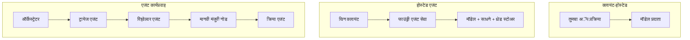
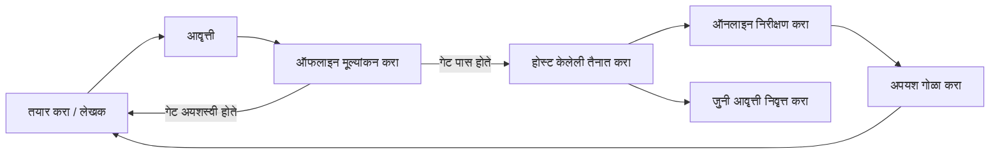
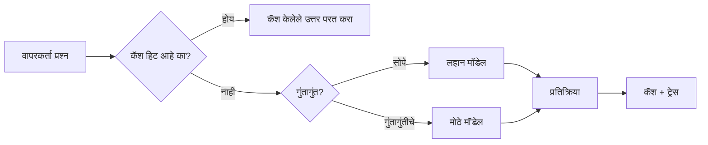
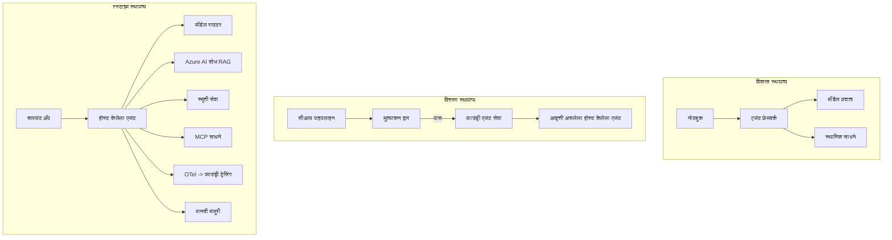

# Microsoft Foundry सह स्केलेबल एजंट्सची तैनाती


या कोर्समध्ये आतापर्यंत आपण असे एजंट तयार केले आहेत जे तुमच्या लॅपटॉपवर, नोटबुकमध्ये चालतात, `az login` आणि काही पर्यावरणीय चल (environment variables) द्वारे नियंत्रित. हे शिकण्याचा अगदी योग्य मार्ग आहे. तथापि, हजारो ग्राहक 3 अं.च्या वेळी अवलंबून असलेल्या एजंटसाठी हा योग्य मार्ग नाही.

हा धडा "माझ्या मशीनवर चालते" आणि "उत्पादनात खात्रीने आणि परवडणाऱ्या पद्धतीने चालते" यामधील अंतर विषयी आहे. आम्ही ते अंतर Microsoft Foundry आणि Microsoft Foundry Agent Service वापरून संपवतो, आणि आम्ही ते प्रत्यक्ष ग्राहक समर्थन एजंट तयार करून करतो ज्यामध्ये उपकरणे, पुनर्प्राप्ती, आठवण, मूल्यांकन, आणि निरीक्षण असते.

## परिचय

हा धडा खालील बाबींचा आढावा घेईल:

- **प्रोटोटाइप एजंट** आणि **तैनात एजंट** यामधील फरक, आणि मुख्यतः मॉडेलच्या *भोवती* असलेले सर्व गोष्टींचे संक्रमण का होते याबाबत.
- एजंटसाठी **तैनातीच्या पद्धती**: क्लायंट-होस्टेड, सेवा-होस्टेड (Hosted Agents), आणि कार्यप्रवाह-समन्वयित.
- Microsoft Foundry वरील **एजंट जीवनचक्र** — तयार करणे, आवृत्ती, तैनात करणे, मूल्यांकन करणे, निरीक्षण करणे, निवृत्त करणे.
- **स्केलिंग धोरणे**: मॉडेल राउटिंग, कॅशिंग, समकालीनता, आणि स्टेटलेस डिझाइन.
- OpenTelemetry आणि Foundry ट्रेसिंगसह **निरीक्षणक्षमता**.
- मॉडेल निवड, राउटिंग, आणि मूल्यांकन गेटद्वारे **खर्च ऑप्टिमायझेशन**.
- **एंटरप्राइज विचार**: शासन, मानवी मंजुरी, आणि उत्पादनात MCP सर्व्हर्स सुरक्षितपणे चालवणे.

## शिकण्याचे उद्दिष्टे

हा धडा पूर्ण केल्यानंतर, तुम्हाला हे कसे करायचे माहित असेल:

- दिलेल्या एजंट वर्कलोडसाठी योग्य तैनाती नमुना निवडणे.
- एजंटला Microsoft Foundry Agent Service मध्ये तैनात करणे जेणेकरून त्याला आवृत्ती, शासन, आणि निरीक्षण मिळेल.
- ट्रेसिंगसाठी एजंटची साधने संलग्न करणे आणि प्रत्येक प्रकाशनापूर्वी चालणारी मूल्यांकन पाइपलाइन जोडणे.
- स्केलवर विलंब आणि खर्च नियंत्रणात ठेवण्यासाठी मॉडेल राउटिंग आणि कॅशिंग लागू करणे.
- उच्च धोका असलेल्या क्रियांसाठी मानवी मंजुरी गेट जोडणे आणि उत्पादन-सुरक्षित मार्गाने MCP सर्व्हर समाकलित करणे.

## पूर्वपरीक्षा

हा धडा गृहित धरतो की तुम्ही आधीचे धडे पूर्ण केले आहेत आणि तुम्हाला खालील बाबतीत आरामदायी वाटते:

- [Microsoft Agent Framework](../14-microsoft-agent-framework/README.md) वापरून एजंट तयार करणे (धडा 14).
- [उपकरण वापर](../04-tool-use/README.md) (धडा 4) आणि [Agentic RAG](../05-agentic-rag/README.md) (धडा 5).
- [एजंट मेमरी](../13-agent-memory/README.md) (धडा 13) आणि [Agentic Protocols / MCP](../11-agentic-protocols/README.md) (धडा 11).
- [निरीक्षण आणि मूल्यांकन](../10-ai-agents-production/README.md) (धडा 10) — हा धडा यावर थेट आधारलेला आहे.

तुम्हाला खालील बाबीसुद्धा आवश्यक असतील:

- कमीतकमी एका तैनात चैट मॉडेलसह **Azure सदस्यता** आणि **Microsoft Foundry प्रकल्प**.
- प्रमाणित **Azure CLI** (`az login`).
- Python 3.12+ आणि रेपॉजिटरीतील पॅकेजेस [`requirements.txt`](../../../requirements.txt).

## प्रोटोटाइप ते उत्पादन: खरोखर काय बदलते

प्रोटोटाइप एजंट आणि उत्पादन एजंट एकाच मुख्य लूप शेअर करतात — कारण सांगणे, साधने कॉल करणे, प्रत्युत्तर देणे. जे बदलते ते या लूपभोवतीची सर्व ऑपरेशनल बाबी. मॉडेल कदाचित उत्पादन एजंटचा 20% आहे; उरलेले 80% ऑपरेशनल कंकाल आहे.

| बाब | प्रोटोटाइप | उत्पादन |
| --- | --- | --- |
| **होस्टिंग** | तुमच्या नोटबुकमध्ये चालते | होस्टेड सेवा म्हणून चालते, आवृत्ती आणि रोलआउट केली जाते |
| **ओळख** | तुमचा `az login` टोकन | स्कोप्ड RBAC सह व्यवस्थापित ओळख |
| **स्थिती** | इन-मेमरी, पुन्हा सुरू केल्यावर गमावले जाते | बाह्यीकरण (थ्रेड स्टोर, मेमरी सेवा) |
| **अपयश** | ट्रेसबॅक दिसतो | पुनःप्रयत्न, फालबॅक, डेड-लेटर, अलर्ट |
| **खर्च** | "हे काही सेंट्स आहे" | विनंतीप्रमाणे ट्रॅक केलेले, राउट केलेले, कॅश्ड, बजेट केलेले |
| **गुणवत्ता** | आउटपुट पाहून निर्णय | प्रत्येक प्रकाशनापूर्वी स्वयंचलितपणे मूल्यांकन केले जाते |
| **विश्वास** | प्रत्येक क्रियेस तुम्ही मान्यता देता | धोरण + धोका असलेल्या क्रियांसाठी मानवी-इन-द-लूप |

हा तक्ता लक्षात ठेवा. खालील प्रत्येक विभाग ह्यापैकी एका रांगेशी संबंधित आहे.

## एजंट तैनाती नमुने

तुम्ही तीन नमुने वापराल, सहसा संयोजनात.

### १. क्लायंट-होस्टेड एजंट्स

एजंट ऑब्जेक्ट तुमच्या अ‍ॅप्लिकेशन प्रक्रियेतील *अंतर्गत* असतो. तुमचा कोड मॉडेल प्रदात्याला थेट कॉल करतो; तर्क लूप तुमच्या सेवेतील चालतो. हे मागील प्रत्येक धड्याने केलेले आहे.

- **जेव्हा वापरावे**: तुम्हाला लूपवर पूर्ण नियंत्रण हवे असेल, सानुकूल मिडलवेअर हवे असेल, किंवा तुम्ही एजंट आधीपासून असलेल्या बॅकएंडमध्ये एम्बेड करत असाल.
- **तोल**: तुम्ही स्वतःच स्केलिंग, स्थिती, आणि टिकाऊपणा सांभाळता.

### २. होस्टेड एजंट्स (Foundry Agent Service)

एजंट Microsoft Foundry मध्ये *स्रोत म्हणून नोंदणीकृत* आहे. Foundry तर्क लूप होस्ट करते, थ्रेड्स संचयित करते, सामग्रीची सुरक्षा व RBAC लागू करते, आणि एजंट Foundry पोर्टलमध्ये दिसतो. तुमची अॅप एक थिन क्लायंट बनते जी थ्रेड तयार करते आणि प्रतिसाद वाचते.

- **जेव्हा वापरावे**: तुम्हाला टिकाऊपणा, अंगभूत निरीक्षणक्षमता, शासन, आणि कमी ऑपरेशनल क्षेत्र हवे.
- **तोल**: व्यवस्थापित रनटाइमसाठी कमी कमी-स्तरीय नियंत्रण.

### ३. एजंट वर्कफ्लो

अनेक एजंट (आणि उपकरणे) स्पष्ट नियंत्रण प्रवाहाने ग्राफमध्ये संयोजित केले जातात — अनुक्रमिक टप्पे, शाखा, मानवी मंजुरीचे नोड्स, आणि टिकाऊ चेकपॉइंट जे थांबवू आणि पुन्हा सुरू करू शकतात. हे Microsoft Agent Framework च्या **वर्कफ्लोज** क्षमतेचा वापर आहे ज्याला तैनातीत मोठ्या प्रमाणावर लागू केले आहे.

- **जेव्हा वापरावे**: एकाच कार्यासाठी अनेक विशेष एजंट लागतात किंवा मध्यभागी मंजुरी पायरीची आवश्यकता असेल.
- **तोल**: अनेक गतिशील भाग; समन्वय-स्तरीय निरीक्षणक्षमता आवश्यक.



## Microsoft Foundry वरील एजंट जीवनचक्र

एजंट तैनात करणे हा एक वेळचा `push` नाही. हा लूप आहे, आणि तो सॉफ्टवेअर प्रकाशन चक्रासारखा दिसतो कारण तो अगदी तसेच आहे.



मुख्य कल्पना, [धडा 10](../10-ai-agents-production/README.md) कडून घेतली: **ऑफलाइन मूल्यांकन गेट आहे, न कि उपपदार्थ.** नवीन एजंट आवृत्ती तुमचे मूल्यांकन थ्रेशोल्ड पार न केली तर प्रकाशीत होत नाही. ऑनलाइन निरीक्षणानंतर खऱ्या जीवनातील अपयश पुनःऑफलाइन चाचणी संचात परत फीड होते. हा पूर्णच लूप आहे.

## स्केलिंग धोरणे

एजंट स्केल करणे हे स्टेटलेस वेब API स्केल करण्यापेक्षा वेगळे आहे, कारण प्रत्येक विनंती अनेक महागडे मॉडेल आणि साधने कॉल करु शकते. चार तंत्रज्ञान म्हणजे बहुतेक भार सांभाळतात.

**स्टेटलेस विनंती हाताळणी.** तुमच्या प्रक्रियेच्या मेमरीमध्ये प्रत्येक वापरकर्त्याची स्थिती ठेवू नका. संभाषण थ्रेड Foundry थ्रेड स्टोर किंवा मेमरी सेवेत टिकवून ठेवा ज्यामुळे कोणताही उदाहरण कोणतीही विनंती हाताळू शकते. हा हेतू तुम्हाला आडवा स्केल करण्यात मदत करतो — उदाहरणे वाढवा, स्टिकी सेशन्स नाहीत.

**मॉडेल राउटिंग.** प्रत्येक विनंतीसाठी तुमच्या सर्वात क्षमतेच्या (आणि सर्वात महागड्या) मॉडेलची गरज नसते. साध्या विनंत्या — हेतू वर्गीकरण, लहान तथ्यात्मक उत्तरे — लहान, जलद मॉडेलकडे पाठवा आणि खर्‍या तर्कासाठी मोठ्या मॉडेल राखून ठेवा. Foundry चा **मॉडेल राउटर** तुम्हाला हे करू शकतो, किंवा तुम्ही स्वतः हलकी वर्गीकरणकर्ता निर्माण करू शकता. तुम्ही लॅबमध्ये DIY आवृत्ती तयार कराल.

**प्रत्युत्तर कॅशिंग.** अनेक समर्थन प्रश्न जवळजवळ समान असतात ("माझे संकेतशब्द कसे रीसेट करावे?"). सामान्य प्रश्नांची उत्तरे कॅश करा आणि मॉडेलवर कधीही न मारता सेवा द्या. अगदी मध्यम कॅश हिट दर देखील खर्च आणि विलंब कमी करतो.

**समकालीनता आणि बॅकप्रेशर.** मॉडेल प्रदात्यांना दर मर्यादा आहेत. समकालीनता मर्यादित करा, घातांकी परतप्रयत्न वापरा, आणि मृदूपणे अयशस्वी व्हा (कतारबद्ध "आम्ही त्यावर काम करत आहोत" प्रतिसाद 500 पेक्षा चांगला).



## उत्पादनात निरीक्षणक्षमता

तुम्ही जे पाहू शकत नाही ते तुम्ही चालवू शकत नाही. धडा 10 मध्ये सांगितल्याप्रमाणे, Microsoft Agent Framework मूळतः **OpenTelemetry** ट्रेसेस उत्सर्जित करतो — प्रत्येक मॉडेल कॉल, साधन आह्वान, आणि समन्वयन टप्याला स्पॅन बनवतो. उत्पादनात तुम्ही ते स्पॅन Microsoft Foundry (किंवा कोणत्याही OTel-सुसंगत मागील बाजूस) निर्यात करता ज्यामुळे तुम्ही करू शकता:

- एकाच ग्राहक तक्रारीचे प्रत्येक मॉडेल आणि साधन कॉलमधील संपूर्ण ट्रेसिंग करा.
- वेळोवेळी विनंती प्रती p50/p95 विलंब आणि खर्च पाहा.
- त्रुटी दरामधील झेप आणि खर्च विसंगतींवर अलर्ट करा, हे तुमचे वापरकर्ते (किंवा तुमचा आर्थिक विभाग) जाणून घेण्यापूर्वी.

```python
from agent_framework.observability import get_tracer

tracer = get_tracer()

with tracer.start_as_current_span("support_request") as span:
    span.set_attribute("customer.tier", "enterprise")
    span.set_attribute("routed.model", "gpt-4.1-mini")
    # एजंटची अंमलबजावणी स्वयंचलितपणे या स्पॅनमध्ये ट्रेस केली जाते
```

`customer.tier` आणि `routed.model` सारखे गुणधर्म हे ट्रेसेसच्या भिंतींना उत्तर देणाऱ्या प्रश्नांमध्ये रुपांतरित करतात ("उद्योग ग्राहकाना लहान मॉडेलकडे खूप वारंवार राउट केले जात आहे का?").

## खर्च ऑप्टिमायझेशन

उत्पादन एजंटमधील खर्च टोकनने वर्चस्व गाजवतो. तीन рыंजकंरे, प्रभावाच्या क्रमाने:

1. **मॉडेल योग्य आकार द्या.** एक लहान मॉडेल जे तुमचा मूल्यांकन गेट पार करते मोठ्या मॉडेलपेक्षा सहसा स्वस्त असते जे तेही पार करते. मोठ्या मॉडेलची हिंमत वाटण्यापेक्षा चांगले लहान मॉडेल पुरेसे आहे हे मूल्यांकनाने *सिद्ध करा*.
2. **संपादनानुसार राउट करा.** वरील प्रमाणे — मोठ्या मॉडेलची किंमत फक्त मोठ्या मॉडेलच्या तर्कासाठी लागणाऱ्या विनंत्यांना द्या.
3. ** agressively कॅश करा.** सर्वात स्वस्त मॉडेल कॉल तोच ज्याला तुम्ही कधीच करत नाही.

मूल्यांकन गेट्स आणि खर्च नियंत्रण हे तेच अनुशासन दोन दिशांनी पाहिलेले: मूल्यांकन तुम्हाला *गुणवत्तेचा पाया* सांगते, राउटिंग आणि कॅशिंग तुम्हाला त्या पायाच्या *खर्चापर्यंत* ठेवतात.

## एंटरप्राइज तैनाती विचार

**शासन.** होस्टेड एजंट्स Foundry च्या RBAC, सामग्री सुरक्षा, आणि ऑडिट लॉगिंग वारसाहक्क मिळवतात. प्रत्येक एजंटला कमी-सर्वात कमी विशेषाधिकार असलेली व्यवस्थापित ओळख द्या — ज्ञानाधार वाचण्याचा अधिकार, तिकीट API साठी स्कोप्ड प्रवेश, काहीही अधिक नाही.

**मानवी-इन-द-लूप.** काही क्रिया थेट स्वयंचलित करण्यासाठी खूप गंभीर असतात — परतफेडीची रक्कम देणे, खाते हटवणे, कायदेशीर टीमकडे वाढवणे. Microsoft Agent Framework **मंजुरी-आवश्यक** उपकरणांचा समर्थन करतो: एजंट क्रिया प्रस्तावित करतो, अंमलबजावणी थांबवते, मानवी अशी मंजुरी किंवा नकार देतो, आणि वर्कफ्लो पुन्हा सुरू होतो. तुम्ही हे [धडा 6](../06-building-trustworthy-agents/README.md) मध्ये पाहिले; येथे तुम्ही ते तैनात कराल.

**उत्पादनात MCP.** [MCP](../11-agentic-protocols/README.md) तुमच्या एजंटला बाह्य साधने मानक इंटरफेसद्वारे वापरण्याची संधी देते. उत्पादनात प्रत्येक MCP सर्व्हरला अविश्वसनीय सीमा म्हणून पाहा: सर्व्हर आवृत्ती पिन करा, स्कोप्ड ओळखीने चालवा, त्याच्या आउटपुटची पडताळणी करा, आणि त्याला गुपिते कधीही उघडू नका. MCP सर्व्हर हा अवलंबित्व आहे, अवलंबित्वांना पॅच, ऑडिट, आणि दर मर्यादा दिल्या जातात.



हे तीन आकृती — विकास, तैनाती, रनटाइम — याचे तीन वेगवेगळे एजंट जीवनचक्र टप्पे आहेत. पुढील लॅब तुम्हाला ते तयार करण्यास मार्गदर्शन करेल.

## हाताळणी लॅब: उत्पादनासाठी तयार ग्राहक समर्थन एजंट

[`code_samples/16-python-agent-framework.ipynb`](./code_samples/16-python-agent-framework.ipynb) उघडा आणि पूर्ण करा. तुम्ही एक **Contoso ग्राहक समर्थन एजंट** तयार कराल ज्यामध्ये प्रत्येक उत्पादन विषय सुसंगत असेल:

1. **उपकरण कॉलिंग** — ऑर्डर स्थिती पहा आणि समर्थन तिकीट उघडा.
2. **RAG** — ज्ञानाधारातून धोरण प्रश्नांची उत्तरे द्या (Azure AI Search, ज्यामध्ये इन-मेमरी फॉलबॅक आहे ज्यामुळे नोटबुकला Search स्रोतशिवाय चालवता येते).
3. **मेमरी** — संभाषणाच्या टप्प्यांदरम्यान ग्राहक लक्षात ठेवा.
4. **मॉडेल राउटिंग** — एक क्लिष्टता वर्गीकरणकर्ता प्रत्येक विनंतीला लहान किंवा मोठ्या मॉडेलकडे मार्गदर्शन करतो.
5. **प्रत्युत्तर कॅशिंग** — पुन्हा विचारलेल्या प्रश्नांना कॅशमधून सेवा दिली जाते.
6. **मानवी मंजुरी** — मर्यादेपलीकडील परतफेडींसाठी मानवी सहीची आवश्यकता.
7. **मूल्यांकन पाइपलाइन** — एक लहान ऑफलाइन चाचणी संच एजंटचे मानांकन करतो आणि प्रकाशनासाठी गेट म्हणून काम करतो.
8. **निरीक्षणक्षमता** — प्रत्येक विनंतीभोवती OpenTelemetry ट्रेसिंग.

### मार्गदर्शन

नोटबुक अशी रचना केलेली आहे की प्रत्येक उत्पादन विषय स्वतंत्र, चालवण्याजोगा विभाग आहे. त्याचा मुख्य भाग आहे राउटिंग-प्लस-कॅशिंग विनंती हाताळणारा:

```python
async def handle_support_request(query: str, customer_id: str) -> str:
    # 1. शक्य असल्यास कॅशेमधून सेवा द्या.
    cached = response_cache.get(normalize(query))
    if cached:
        return cached

    # 2. खर्च नियंत्रित करण्यासाठी क्लिष्टतेनुसार मार्गदर्शन करा.
    model = "gpt-4.1-mini" if is_simple(query) else "gpt-4.1"

    # 3. निरीक्षणासाठी एजंटला ट्रेस स्पॅनमध्ये चालवा.
    with tracer.start_as_current_span("support_request") as span:
        span.set_attribute("routed.model", model)
        span.set_attribute("customer.id", customer_id)
        response = await support_agent.run(query, model=model)

    # 4. कॅशे करा आणि परत द्या.
    response_cache.set(normalize(query), response.text)
    return response.text
```

प्रकाशनासाठी संरक्षण करणारा मूल्यांकन गेट असा दिसतो:

```python
async def evaluation_gate(agent, test_cases, threshold: float = 0.8) -> bool:
    passed = 0
    for case in test_cases:
        result = await agent.run(case["input"])
        if score_response(result.text, case["expected"]) >= 0.8:
            passed += 1
    pass_rate = passed / len(test_cases)
    print(f"Evaluation pass rate: {pass_rate:.0%} (gate: {threshold:.0%})")
    return pass_rate >= threshold  # द्वार उत्तीर्ण झाल्यासच तैनात करा
```

प्रत्येक ओळ वाचा — नोटबुक मधील मूळ कोड उद्देशाने लहान ठेवले आहे जेणेकरून काहीही फ्रेमवर्क कॉलमागे लपलेले नाही.

## धुम्रपान चाचण्यांसह तैनात एजंटचे मान्यकरण

वर उल्लेखलेला मूल्यांकन गेट तुमच्या एजंट ऑब्जेक्टवर *ऑफलाइन* चालवला जातो. एकदा एजंट Hosted Agent म्हणून तैनात झाला की, तुम्हाला आणखी एक, अगदी स्वस्त चाचणी पाहिजे: **तैनात एंडपॉइंट खरोखर प्रतिसाद देतो का?**

"यशस्वी" तैनात करणे फक्त नियंत्रण plane ने व्याख्या स्वीकारल्याचे सिद्ध करते — ते सिद्ध करत नाही की एजंट प्रतिसाद देतो. गहाळ अवलंबित्व, खराब मॉडेल राउटिंग, किंवा कालबाह्य कनेक्शन हिरवा तैनाती पण काहीही परत न देणारी ठेऊ शकते. एक **धुम्रपान चाचणी** हे सेकंदात पकडते, प्रत्येक तैनातीत, पूर्ण मूल्यांकनाचा खर्च न घालवता.

हा रेपॉजिटरी वापरायला तयार धुम्रपान-चाचणी पाइपलाइन AI Smoke Test GitHub Action वर आधारित पुरवतो:

- **सूची** — [`tests/lesson-16-smoke-tests.json`](../../../tests/lesson-16-smoke-tests.json) मध्ये Contoso समर्थन एजंटसाठी प्रॉम्प्ट्स आणि दावे आहेत (मूलभूत धोरण उत्तरे, ऑर्डर शोध, विषयावर राहणे, आणि बहु-चरण थ्रेड सातत्य). इतर धडा एजंटची सूचीही त्याच ठिकाणी आहे — पहा [`tests/README.md`](../tests/README.md).
- **वर्कफ्लो** — [`.github/workflows/smoke-test.yml`](../../../.github/workflows/smoke-test.yml) Azure OIDC ने लॉगिन होते आणि प्रत्येक प्रॉम्प्ट एजंटच्या Responses एंडपॉइंटवर POST करते, कोणत्याही दाव्यात अपयश झाल्यास काम अयशस्वी करते.

```yaml
- name: Smoke-test hosted agent
  uses: JFolberth/ai-smoketest@v1
  with:
    project_endpoint: ${{ inputs.project_endpoint }}
    agent_name: ContosoSupportAgent
    tests_file: tests/lesson-16-smoke-tests.json
```


एकदा तुमचा एजंट तैनात केल्यावर **Actions** टॅबमधून तो चालवा, तुमचा Foundry प्रकल्प एंडपॉइंट आणि एजंट नाव पुरवून. फेडरेटेड आयडेंटिटीला Foundry प्रकल्प च्या स्कोपवर **Azure AI User** भूमिका असावी लागते. लेयर्सना एका पिरॅमिड प्रमाणे विचार करा: स्मोक टेस्ट (पहुंचण्यायोग्य आणि प्रतिसाद देणारे?) प्रत्येक तैनातीवर चालतात, ऑफलाइन मूल्यांकन (शिप करण्यास पुरेसे चांगले आहे का?) प्रोत्साहनपूर्वी होते, आणि ऑनलाइन मूल्यांकन (ते नैसर्गिक स्थितीत कसे करत आहे?) सातत्याने चालू असते.

## ज्ञान तपासणी

असाइनमेंटकडे जाण्यापूर्वी तुमचे समज तपासा.

**1. एक उत्पादन एजंटमधील "मॉडेल" कितपत मोठे असते, आणि उरलेले काय असते?**

<details>
<summary>उत्तर</summary>

मॉडेल हा प्रणालीचा अल्पभाग आहे — बहुतेक वेळा सुमारे २०% एवढा हवेत उल्लेख केला जातो. उरलेले म्हणजे ऑपरेशनल कंकाल: होस्टिंग आणि आवृत्ती व्यवस्थापन, ओळख आणि RBAC, बाह्य स्थिती, अपयश हाताळणी, खर्च ट्रॅकिंग, मूल्यांकन, आणि मानव-इन-द-लूप नियंत्रण. उत्पादनात जाणे प्रामुख्याने विचार प्रोसेसच्या भोवती सर्व काही तयार करण्याबाबत असते.
</details>

**2. तुम्ही कधी क्लायंट-होस्टेड एजंटपेक्षा Hosted Agent निवडाल?**

<details>
<summary>उत्तर</summary>

जेव्हा तुम्हाला बिल्ट-इन टिकाऊपणा (थ्रेड जे टिकतात आणि पुन्हा सुरू होऊ शकतात), निरीक्षण क्षमता, कंटेंट सुरक्षा, आणि RBAC असलेल्या व्यवस्थापित रनटाइमची गरज असेल, आणि तुम्ही reasoning loop च्या कमी-स्तरीय नियंत्रणासाठी कमी ऑपरेशनल क्षेत्र स्वीकारण्यास तयार असाल. क्लायंट-होस्टेड तेव्हा प्राधान्य असते जेव्हा तुम्हाला लूपवर पूर्ण नियंत्रण हवे किंवा एजंट विद्यमान बॅकएंडमध्ये एम्बेड करायचा असेल.
</details>

**3. स्केलेबल एजंट कशासाठी त्याच्या स्वतःच्या प्रोसेस स्मृतीत स्टेटलेस असावा?**

<details>
<summary>उत्तर</summary>

जेणेकरून कोणताही उदाहरण कोणताही विनंती हाताळू शकेल, ज्यामुळे स्टीकी सेशन्सशिवाय आडवा स्केल करणे शक्य होते. वापरकर्ता-प्रत्येक संभाषण स्थिती थ्रेड स्टोर किंवा मेमरी सेवा मध्ये बाहेर ठेवली जाते. स्थिती प्रोसेस स्मृतीमध्ये असती तर रीस्टार्टवर ती हरवली जाईल आणि लोड मोकळेपणाने वाटप करू शकत नाही.
</details>

**4. मॉडेल रूटिंग कोणती समस्या सोडवते, आणि ते मूल्यमापनाशी कसे संबंधित आहे?**

<details>
<summary>उत्तर</summary>

रूटिंग सोप्या विनंत्यांना लहान, स्वस्त, जलद मॉडेलकडे पाठवते आणि मोठ्या मॉडेलला खरे विचार करण्यासाठी राखून ठेवते, ज्यामुळे लेटन्सी आणि खर्च दोन्ही नियंत्रित होतात. हे मूल्यमापनाशी संबंधित आहे कारण मूल्यमापन हे सिद्ध करते की लहान मॉडेल विशिष्ट विनंतींसाठी पुरेसं चांगलं आहे — मूल्यमापनाशिवाय रूटिंग केवळ अंदाज आहे.
</details>

**5. "मूल्यमापन गेट" म्हणजे काय आणि ते जीवनचक्रात कुठे आहे?**

<details>
<summary>उत्तर</summary>

एक मूल्यांकन गेट नवीन एजंट आवृत्तीवर ऑफलाइन टेस्ट संच चालवते आणि पास रेट थ्रेशोल्ड पार न केल्यास तैनाती थांबवते. ते जीवनचक्रातील "आवृत्ती" आणि "तैनात" यांच्यात असते, गुणवत्ता हा रिलीझसाठी एक अट बनवते, शिपिंगनंतर तपासण्याऐवजी.
</details>

**6. उत्पादनात MCP सर्वरला अविश्वसनीय सीमा का समजले पाहिजे?**

<details>
<summary>उत्तर</summary>

कारण ते तुमच्या एजंटकडून कॉल केलेली बाह्य अवलंबित्व आहे. तुम्ही त्याची आवृत्ती पिन करावी, स्कोप्ड आयडेंटिटीसोबत चालवावी, त्याच्या आउटपुटची पडताळणी करावी, दर मर्यादा लावावी आणि त्याला कधीही गुपिते उघड करु नयेत — जे तिसऱ्या पक्षाच्या अवलंबित्वावर लागू असलेली साधी शिस्त आहे. त्याचे आउटपुट तुमच्या एजंटच्या reasoning मध्ये जातात, त्यामुळे पडताळणीशिवाय विश्वास हा सुरक्षा धोका आहे.
</details>

**7. उत्पादन एजंट खर्चावर सर्वात मोठा परिणाम साधारणपणे कोणता बदल करतो, आणि का?**

<details>
<summary>उत्तर</summary>

मॉडेलचा योग्य आकार निवडणे — सर्वात लहान मॉडेल वापरणे जे तुमचा मूल्यांकन गेट पास करते. खर्च टोकन्सने नियंत्रित होतो, आणि गुणवत्ता निकष पूर्ण करणारे छोटे मॉडेल मोठ्या मॉडेलपेक्षा जवळजवळ नेहमीच स्वस्त असते. कॅशिंग आणि रूटिंग नंतर खर्च आणखी कमी करतात, पण योग्य बेस मॉडेलची निवड सर्वात मोठा पहिला परिणाम करते.
</details>

**8. `customer.tier` आणि `routed.model` सारख्या स्पॅन अ‍ॅट्रिब्युट्सची निरीक्षणामध्ये काय भूमिका आहे?**

<details>
<summary>उत्तर</summary>

ते कच्च्या ट्रेसना उत्तरयोग्य व्यवसाय प्रश्नांमध्ये रूपांतरित करतात. अ‍ॅट्रिब्युटशिवाय तुमच्याकडे फक्त स्पान ची भिंत असते; त्यांच्यासह तुम्ही "एंटरप्राइज ग्राहकांना लहान मॉडेलकडे खूप वेळा पाठवले जाते का?" किंवा "कोणता मॉडेल आपल्या सर्वात मंद विनंत्या हाताळतो?" असे विचारू शकता. अ‍ॅट्रिब्युट्स हे तंत्रज्ञानाचं मोजमाप तुमच्या ऑपरेशनसाठी महत्त्वाच्या परिमाणांनुसार कापण्यासाठी वापरले जातात.
</details>

## असाइनमेंट

लॅबमधील ग्राहक समर्थन एजंट घ्या आणि ते एक विशिष्ट परिस्थितीसाठी सशक्त करा: **एक SaaS कंपनीसाठी सदस्यता बिलिंग समर्थन एजंट.**

तुमची सबमिशन अशी असावी:

1. **टूल्स** बिलिंग-संबंधित टूल्सने बदला: `get_subscription_status`, `get_invoice`, आणि `issue_credit` (५० डॉलरहून अधिक क्रीडिटसाठी मानवी मंजुरी आवश्यक).
2. **तीन RAG दस्तऐवज जोडा** ज्यात कंपनीची परतावा धोरण, बिलिंग चक्र, आणि रद्द धोरण यांचा समावेश आहे.
3. **मूल्यमापन संचाचा विस्तार करा** कमीत कमी आठ प्रकरणांपर्यंत, ज्यात किमान दोन प्रकरणे मानवी मंजुरी मार्गाने चालण्यास हवे, आणि तुमचा मूल्यांकन गेट योग्यरित्या पास किंवा फेल होतो याची खात्री करा.
4. **एक खर्च अहवाल जोडा**: एजंटमधून दहा मिश्रित क्वेरी चालवल्यानंतर, किती क्वेरी लहान मॉडेलकडे, किती मोठ्या मॉडेलकडे, आणि किती कॅशमधून सेवा दिल्या गेल्या त्याचा तपशील दाखवा.

एक लहान परिच्छेद लिहा (markdown सेलमध्ये) ज्यात तुम्ही निवडलेली मॉडेल-रूटिंग नियम आणि वास्तविक ट्रॅफिकसह त्याची पडताळणी कशी कराल ते स्पष्ट करा. एकमेव योग्य उत्तर नाही — तुम्हाला मूल्यमापन केलं जात आहे की उत्पादनाच्या बाबतीत सर्व चिंता कोपरट किंचित सुसंगतपणे जोडल्या आहेत का.

## सारांश

या धड्यात तुम्ही एजंटला प्रोटोटाइपमधून उत्पादनात Microsoft Foundry सह हलवलं:

- उत्पादनात जाणं प्रामुख्याने मॉडेलभोवतीच्या **ऑपरेशनल कंकालावर** आधारित आहे — होस्टिंग, ओळख, स्थिती, अपयश हाताळणी, खर्च, गुणवत्ता, आणि विश्वास.
- तुम्ही तीन **तैनाती नमुने** शिकलात — क्लायंट-होस्टेड, Hosted Agents, आणि Agent Workflows — आणि ते कधी योग्य असतात.
- तुम्ही **एजंट जीवनचक्र** अनुभवला, जिथे ऑफलाइन **मूल्यमापन रिलीज गेटच्या** रूपात काम करते आणि ऑनलाइन निरीक्षण अपयशांना पुन्हा टेस्ट संचात पाठवते.
- तुम्ही **स्केलिंग धोरणे** वापरली — स्टेटलेस डिझाइन, मॉडेल रूटिंग, कॅशिंग, आणि सीमित समांतरता — आणि त्यांना **खर्च ऑप्टिमायझेशनशी** जोडले.
- तुम्ही **एंटरप्राइज नियंत्रणं** जोडली: RBAC, मानव-इन-द-लूप मंजुरी, आणि प्रॉडक्शन-सेफ MCP इंटिग्रेशन.
- तुम्ही एक **प्रॉडक्शन-रेडी ग्राहक समर्थन एजंट** तयार केला जो या प्रत्येक चिंतेला रन करण्यायोग्य कोडमध्ये वापरतो.

पुढील धडा उलटा प्रवास घेते: एजंट्सना क्लाऊडमधून स्केल करण्याऐवजी, तुम्ही त्यांना एका विकासक मशीनवर खाली आणाल आणि पूर्णपणे स्थानिकपणे चालवाल.

## अतिरिक्त संसाधने

- <a href="https://learn.microsoft.com/azure/ai-foundry/what-is-azure-ai-foundry" target="_blank">Microsoft Foundry ची माहिती</a>
- <a href="https://learn.microsoft.com/azure/ai-foundry/agents/overview" target="_blank">Microsoft Foundry Agent सेवा आढावा</a>
- <a href="https://aka.ms/ai-agents-beginners/agent-framework" target="_blank">Microsoft Agent Framework</a>
- <a href="https://learn.microsoft.com/azure/ai-foundry/concepts/model-router" target="_blank">Microsoft Foundry मध्ये मॉडेल राऊटर</a>
- <a href="https://learn.microsoft.com/azure/search/search-what-is-azure-search" target="_blank">Azure AI Search</a>
- <a href="https://opentelemetry.io/" target="_blank">OpenTelemetry</a>
- <a href="https://github.com/marketplace/actions/ai-smoke-test" target="_blank">AI स्मोक टेस्ट GitHub Action</a>
- <a href="https://modelcontextprotocol.io/" target="_blank">Model Context Protocol (MCP)</a>

## मागील धडा

[कंप्यूटर युज एजंटस् तयार करणे (CUA)](../15-browser-use/README.md)

## पुढील धडा

[स्थानिक AI एजंट तयार करणे](../17-creating-local-ai-agents/README.md)

---

<!-- CO-OP TRANSLATOR DISCLAIMER START -->
**अस्वीकरण**:
हा दस्तऐवज AI भाषांतर सेवा [Co-op Translator](https://github.com/Azure/co-op-translator) चा वापर करून अनुवादित केला आहे. जरी आम्ही अचूकतेसाठी प्रयत्न करतो, तरी कृपया लक्षात घ्या की स्वयंचलित भाषांतरांमध्ये त्रुटी किंवा अचूकतेची कमतरता असू शकते. मूळ दस्तऐवज त्याच्या मूळ भाषेत अधिकृत स्रोत मानला पाहिजे. महत्त्वाची माहिती असल्यास, व्यावसायिक मानवी भाषांतराची शिफारस केली जाते. या भाषांतराच्या वापरामुळे उद्भवणाऱ्या कोणत्याही गैरसमज किंवा चुकीच्या अर्थलावणीसाठी आम्ही जबाबदार नाही.
<!-- CO-OP TRANSLATOR DISCLAIMER END -->