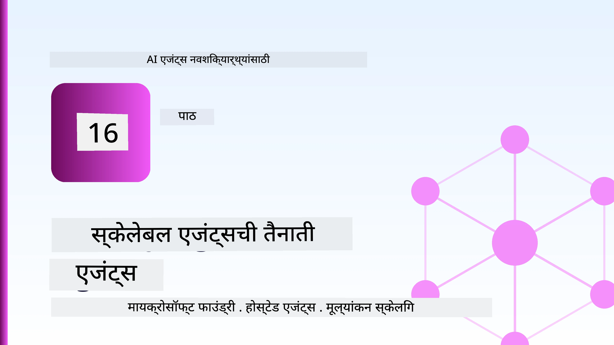
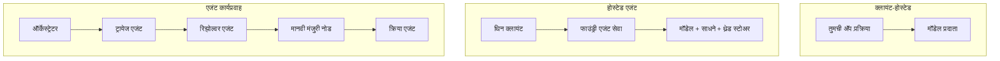
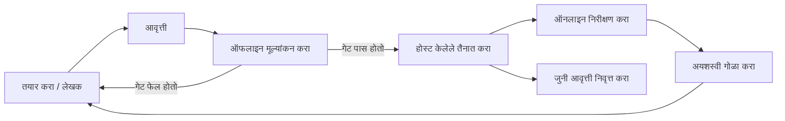
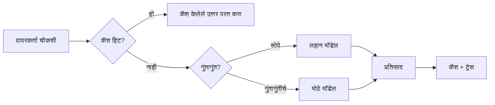
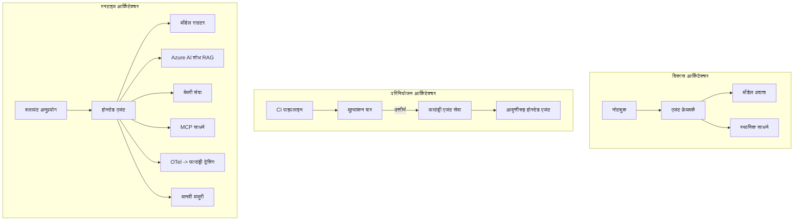

# मायक्रोसॉफ्ट फाउंड्रीसह स्केलेबल एजंटसची तैनाती



कोर्सच्या यापर्यंतच्या टप्प्यात तुम्ही आपल्या लॅपटॉपवर, नोटबुकमध्ये चालणारे एजंट तयार केले आहेत, जे `az login` आणि काही पर्यावरणीय चलांनी चालवले जातात. हे शिकण्यासाठी अगदी बरोबर मार्ग आहे. पण हजारो ग्राहक 3 वाजता अवलंबून असलेल्या एजंटला चालवण्यासाठी हा योग्य मार्ग नाही.

हा धडा "माझ्या मशीनवर चालते" आणि "उत्पादनात भरोसेमंद आणि किफायतशीर रीतीने चालते" यामध्ये असलेला अंतर यावर आधारित आहे. आम्ही त्या अंतराला **मायक्रोसॉफ्ट फाउंड्री** आणि **मायक्रोसॉफ्ट फाउंड्री एजंट सेवा** वापरून पूर्ण करतो, आणि त्यासाठी आम्ही उपकरणे, पुनर्प्राप्ती, स्मृती, मूल्यमापन आणि निरीक्षण असलेला एक वास्तविक ग्राहक समर्थन एजंट तयार करतो.

## परिचय

हा धडा खालील मुद्दे कव्हर करेल:

- **प्रोटोटाइप एजंट** आणि **तैनात एजंट** यांतील फरक, आणि का संक्रमण मुख्यतः मॉडेलच्या *भोवतालच्याच* गोष्टींबाबत आहे.
- एजंटसाठी **तैनाती नमुने**: क्लायंट-होस्टेड, सेवा-होस्टेड (होस्टेड एजंटस), आणि वर्कफ्लो-ऑर्केस्ट्रेटेड.
- मायक्रोसॉफ्ट फाउंड्रीवरील **एजंट जीवनचक्र** — तयार करणे, आवृत्ती देणे, तैनात करणे, मूल्यमापन करणे, निरीक्षण करणे, निवृत्ती घेणे.
- **स्केलिंग धोरणे**: मॉडेल राऊटिंग, कॅशिंग, समकालिकता, आणि स्टेटलेस डिझाइन.
- OpenTelemetry आणि फाउंड्री ट्रेसिंगसह **निरीक्षण**.
- मॉडेल निवड, राऊटिंग, आणि मूल्यमापन गेट्सद्वारे **खर्च सुधारणा**.
- **एंटरप्राइझ विचार**: शासन, मानवी मंजुरी, आणि उत्पादनामध्ये MCP सर्व्हर सुरक्षितपणे चालवणे.

## अध्ययन उद्दिष्टे

हा धडा पूर्ण केल्यानंतर, तुम्हाला खालील गोष्टी समजतील:

- दिलेल्या एजंट वर्कलोडसाठी योग्य तैनाती नमुना कसा निवडायचा.
- एजंटला मायक्रोसॉफ्ट फाउंड्री एजंट सेवेत कसे तैनात करायचे जेणेकरून तो आवृत्तिबद्ध, शासन केलेला, आणि निरीक्षणीय होईल.
- ट्रेसिंगसाठी एजंटला कसे साधने लावायची आणि प्रत्येक प्रकाशनापूर्वी चालणारा मूल्यमापन पाइपलाइन कसा जोडायचा.
- स्केलवर विलंब आणि खर्च नियंत्रणात ठेवण्यासाठी मॉडेल राऊटिंग आणि कॅशिंग कशी लागू करायची.
- उच्च धोका असलेल्या क्रियांसाठी मानवी मंजुरी गेट कसा जोडायचा आणि उत्पादन-सुरक्षित रीतीने MCP सर्व्हर कसा एकात्मिक करायचा.

## पूर्वसूत अपेक्षा

हा धडा गृहीत धरतो की तुम्ही आधीचे धडे पूर्ण केले आहेत आणि खालील विषयांमध्ये पारंगत आहात:

- [मायक्रोसॉफ्ट एजंट फ्रेमवर्क](../14-microsoft-agent-framework/README.md) (धडा 14) वापरून एजंट तयार करणे.
- [साधन वापर](../04-tool-use/README.md) (धडा 4) आणि [एजंटिक RAG](../05-agentic-rag/README.md) (धडा 5).
- [एजंट मेमरी](../13-agent-memory/README.md) (धडा 13) आणि [एजंटिक प्रोटोकॉल / MCP](../11-agentic-protocols/README.md) (धडा 11).
- [निरीक्षण आणि मूल्यमापन](../10-ai-agents-production/README.md) (धडा 10) — हा धडा त्यावर थेट आधारलेला आहे.

तुम्हाला खालील गोष्टी देखील आवश्यक असतील:

- किमान एक तैनात चॅट मॉडेल असलेला **अझूर सबस्क्रिप्शन** आणि **मायक्रोसॉफ्ट फाउंड्री प्रोजेक्ट**.
- प्राधिकृत **अझूर CLI** (`az login`).
- Python 3.12+ आणि रिपॉझिटरीमधील पॅकेजेस[`requirements.txt`](../../../requirements.txt).

## प्रोटोटाइप ते उत्पादन: काय बदलते

प्रोटोटाइप एजंट आणि उत्पादन एजंटमध्ये मुख्य लूप समान असतो — विचार करणे, उपकरणे कॉल करणे, प्रतिसाद देणे. जे बदलते ते म्हणजे त्या लूपभोवतीची सर्व बाबी. मॉडेल हे उत्पादन एजंटचे कदाचित 20% आहे; उर्वरित 80% म्हणजे ऑपरेशनल रचना.

| बाब | प्रोटोटाइप | उत्पादन |
| --- | --- | --- |
| **होस्टिंग** | तुमच्या नोटबुकमध्ये चालते | होस्टेड सेवा म्हणून चालते, आवृत्तिबद्ध आणि रोल आउट केलेले |
| **ओळख** | तुमचा `az login` टोकन | स्कोप्ड RBAC सह व्यवस्थापित ओळख |
| **स्थिती** | स्मृतीत, पुन्हा सुरू केल्यावर हरवते | बाह्यीकृत (थ्रेड स्टोअर, मेमरी सेवा) |
| **अपयश** | तुम्हाला ट्रेसबॅक दिसतो | पुनःप्रयत्न, फॉलबॅक, डेड-लेटर, अलर्ट्स |
| **खर्च** | "हे काही सेंट्स आहे" | विनंतीप्रमाणे ट्रॅक केलेले, मार्गित, कॅशेड, बजेट केलेले |
| **गुणवत्ता** | तुम्ही आउटपुट पाहता | प्रत्येक प्रकाशनापूर्वी आपोआप मूल्यमापन केलेले |
| **विश्वास** | तुम्ही प्रत्येक क्रिया मान्यता देता | धोरण + धोका असलेल्या क्रियांमध्ये मानवी सहभाग |

या तक्त्याला लक्षात ठेवा. खालील प्रत्येक विभाग या पंक्तींपैकी एका शी निगडीत आहे.

## एजंट तैनाती नमुने

तीन नमुने आहेत जे तुम्ही सामान्यत: एकत्र किंवा स्वतंत्रपणे वापराल.

### 1. क्लायंट-होस्टेड एजंटस

एजंट ऑब्जेक्ट तुमच्या *अ‍ॅप्लिकेशन प्रक्रियेच्या* आत असते. तुमचा कोड थेट मॉडेल प्रदात्याला कॉल करतो; विचार करण्याचा लूप तुमच्या सेवेमध्ये चालतो. हेच मागील सर्व धड्यांमध्ये केले आहे.

- **जेव्हा वापरायचे**: तुम्हाला पूर्ण नियंत्रण हवे असेल, सानुकूल मिडलवेयर हवे असेल, किंवा तुम्ही एजंट आधीच असलेल्या बॅकएंडमध्ये एम्बेड करत असाल.
- **व्यापार-बंद**: तुम्हीच स्केलिंग, स्थिती, आणि स्थिरता सांभाळावी लागेल.

### 2. होस्टेड एजंटस (फाउंड्री एजंट सेवा)

एजंट मायक्रोसॉफ्ट फाउंड्रीमध्ये *संसाधन म्हणून नोंदणीकृत* केला जातो. फाउंड्री विचार करण्याचा लूप होस्ट करते, थ्रेड्स संग्रहित करते, सामग्री सुरक्षितता आणि RBAC लागू करते, आणि फाउंड्री पोर्टलमध्ये एजंट दृश्यमान करतो. तुमची अ‍ॅप एक हलकी क्लायंट बनते जी थ्रेड तयार करते आणि प्रतिसाद वाचते.

- **जेव्हा वापरायचे**: तुम्हाला टिकाऊपणा, अंगभूत निरीक्षण, शासन, आणि कमी ऑपरेशनल क्षेत्र हवे असल्यास.
- **व्यापार-बंद**: व्यवस्थापित रनटाइमसाठी कमी तळाशी नियंत्रण.

### 3. एजंट वर्कफ्लोज

अनेक एजंटस (आणि साधने) स्पष्ट नियंत्रण प्रवाहासह ग्राफमध्ये संयोजित केले जातात — अनुक्रमिक टप्पे, शाखांकन, मानवी मंजुरी नोड्स, आणि टिकाऊ चेकपॉइंट्स जे थांबवू आणि पुन्हा चालवू शकतात. हे मायक्रोसॉफ्ट एजंट फ्रेमवर्कची **वर्कफ्लोज** क्षमता आहे जी तैनात स्केलवर लागू केली आहे.

- **जेव्हा वापरायचे**: एखादा एकट्या कामासाठी अनेक खास एजंटस लागतात किंवा मध्ये मंजुरी आवश्यक आहे.
- **व्यापार-बंद**: अधिक भाग हालचाल करतात; ऑर्केस्ट्रेशन-स्तरीय निरीक्षण आवश्यक.



## मायक्रोसॉफ्ट फाउंड्रीवरील एजंट जीवनचक्र

एजंट तैनात करणे हे एकदाचं 'पुश' नाही. ते एक लूप आहे, आणि ते खूप प्रमाणात सॉफ्टवेअर रिल리즈 सायकलसारखे दिसते कारण तसंच ते आहे.



मुख्य कल्पना, [धडा 10](../10-ai-agents-production/README.md) मधून घेतलेली: **ऑफलाइन मूल्यमापन हा गेट आहे, नाहीतर फक्त एक विचारवंत गोष्ट नाही.** नवीन एजंट आवृत्ती तब्बल तुमच्या मूल्यमापन मर्यादा पार केली नाहीतर ती सोडली जात नाही. ऑनलाईन निरीक्षण मग वास्तविक अपयशांची माहिती तुमच्या ऑफलाइन चाचणी सेटमध्ये परत पाठवते. हा सर्वच लूप आहे.

## स्केलिंग धोरणे

एजंट स्केल करणे एक स्टेटलेस वेब API स्केल करणे यापेक्षा भिन्न आहे, कारण प्रत्येक विनंती अनेक महागड्या मॉडेल आणि साधन कॉल्स करु शकते. चार तंत्रे बहुतेक भार उचलतात.

**स्टेटलेस विनंती हाताळणी.** तुमच्या प्रक्रियेस्मृतीमध्ये कोणतीही वापरकर्ता स्थिती ठेवू नका. संभाषण थ्रेड्स फाउंड्री थ्रेड स्टोअर किंवा मेमरी सेवेमध्ये टिकवून ठेवा ज्या कोणत्याही उदाहरणाला कोणतीही विनंती हाताळू देते. हेच तुमचं आडव्या स्केलिंग शक्य करतो — उदाहरणे वाढवा, कोणतेही चिकट सत्र नाहीत.

**मॉडेल राऊटिंग.** प्रत्येक विनंतीसाठी तुमच्या सर्वोत्तम (आणि सर्वात महागड्या) मॉडेलची गरज नसते. सोप्या विनंत्या — हेतू वर्गीकरण, लहान तथ्यात्मक उत्तरं — छोट्या वेगवान मॉडेलकडे पाठवा, आणि मोठा मॉडेल प्रत्यक्ष विचार करण्यासाठी राखून ठेवा. फाउंड्रीचा **मॉडेल राउटर** हे तुमच्यासाठी करू शकतो, किंवा तुम्ही सुलभ वर्गीकार स्वतः तयार करू शकता. तुम्ही लॅबमध्ये DIY आवृत्ती तयार कराल.

**प्रतिसाद कॅशिंग.** अनेक समर्थन प्रश्न जवळजवळ एकसारखे असतात ("माझा पासवर्ड कसा रीसेट करायचा?"). सामान्य प्रश्नांची उत्तरे कॅश करा आणि मॉडेल वापरण्याशिवाय पुरवा. अगदी मध्यम कॅश हिट रेटमुळेही खर्च आणि विलंब महत्त्वाने कमी होतो.

**समकालिकता आणि बॅकप्रेशर.** मॉडेल प्रदात्यांना दरमर्यादा असते. तुमची समकालिकता मर्यादित करा, प्रगुणित पुनःप्रयत्न वापरा, आणि सौम्यरीत्या अपयश स्विकार करा (एक रांखलेला "आम्ही त्यावर काम करत आहोत" प्रतिसाद 500 पेक्षा चांगला).



## उत्पादनातील निरीक्षणीयता

जे काही तुम्ही पाहू शकत नाही ते तुम्ही चालवू शकत नाही. धडा 10 मध्ये झाकलेल्या प्रमाणे, मायक्रोसॉफ्ट एजंट फ्रेमवर्क मूळतः **OpenTelemetry** ट्रेसेस उत्सर्जित करतो — प्रत्येक मॉडेल कॉल, साधन आमंत्रण, आणि ऑर्केस्ट्रेशन पाऊल एक स्पॅन बनते. उत्पादनात तुम्ही ते स्पॅन मायक्रोसॉफ्ट फाउंड्री (किंवा कोणत्याही OTel-सुसंगत बॅकएंड) कडे निर्यात करता ज्यामुळे तुम्ही:

- एका ग्राहक तक्रारीचे संपूर्ण मॉडेल आणि साधन कॉल्समधून एंड-टू-एंड ट्रेस करू शकता.
- वेळेनुसार विनंतीसाठी p50/p95 विलंब आणि खर्च पाहू शकता.
- त्रुटी दरातील झपाट्याने वाढ आणि खर्चातील विचित्रता यासाठी वापरकर्ते (किंवा तुमची अर्थव्यवस्था टीम) लक्षात आणण्याआधी अलर्ट करू शकता.

```python
from agent_framework.observability import get_tracer

tracer = get_tracer()

with tracer.start_as_current_span("support_request") as span:
    span.set_attribute("customer.tier", "enterprise")
    span.set_attribute("routed.model", "gpt-5-nano")
    # एजंटची अंमलबजावणी स्वयंचलितपणे या स्पॅनमध्ये ट्रेस केली जाते
```

`customer.tier` आणि `routed.model` सारखे गुणधर्म ट्रेसेसच्या भिंतीला उत्तर देण्यायोग्य प्रश्नांमध्ये रूपांतरित करतात ("एंटरप्राइझ ग्राहक खूप वेळा लहान मॉडेलकडे राऊट होत आहेत का?").

## खर्च सुधारणा

उत्पादन एजंटमधील खर्च मुख्यत्वे टोकनने स्पष्ट केला जातो. परिणामाच्या अनुक्रमे तीन लीव्हर्स:

1. **योग्य आकाराचे मॉडेल निवडा.** तुमच्या मूल्यमापन गेट पार करणारे लहान मॉडेल नेहमीच मोठ्या मॉडेलच्या तुलनेत स्वस्त असते. मोठ्या मॉडेलऐवजी लहान मॉडेल योग्य आहे हे मूल्यमापनाने सिद्ध करा.
2. **संकुलता अनुसार मार्गदर्शित करा.** वर नमूद केल्याप्रमाणे — मोठ्या मॉडेलच्या किंमती फक्त त्या विनंत्यांसाठी भरा ज्यांना मोठ्या मॉडेलचे विचार आवश्यक आहे.
3. **प्रचंड कॅश करा.** स्वस्त मॉडेल कॉल म्हणजे जो तुम्ही कधीच करत नाही.

मूल्यमापन गेट्स आणि खर्च नियंत्रण हे एकच शिस्त आहे दोन्ही बाजूंनी पाहिल्यास: मूल्यमापन तुम्हाला *गुणवत्तेचा पाया* सांगते, राऊटिंग आणि कॅशिंग तुम्हाला त्या पायाचा *खर्च* जितका शक्य तितका जवळ ठेवतात.

## एंटरप्राइझ तैनाती विचार

**शासन.** होस्टेड एजंट्स फाउंड्रीचे RBAC, सामग्री सुरक्षितता, आणि ऑडिट लॉगिंग वारसा म्हणून घेतात. प्रत्येक एजंटला कमी अधिकारांसह व्यवस्थापित ओळख द्या — ज्ञानाधारित वाचन केवळ, तिकीट API लिए स्कोप्ड अॅक्सेस, त्यापेक्षा जास्त नाही.

**मानवी सहभाग.** काही क्रिया इतक्या महत्त्वाच्या असतात की त्यांना थेट स्वयंचलित करता येत नाही — परतावा देणे, खाते हटवणे, कायदेशीर टीमकडे प्रकरण पाठवणे. मायक्रोसॉफ्ट एजंट फ्रेमवर्क **मंजुरी आवश्यक** साधने समर्थन करतो: एजंट क्रियेला प्रस्तावित करतो, अंमलबजावणी थांबते, माणूस मंजूर किंवा नाकारतो, आणि वर्कफ्लो पुनः चालू होते. तुम्ही [धडा 6](../06-building-trustworthy-agents/README.md) मध्ये हा मूलभूत प्रकार पाहिला; येथे तो तुम्ही तैनात करत आहात.

**उत्पादनामध्ये MCP.** [MCP](../11-agentic-protocols/README.md) तुमच्या एजंटला बाह्य साधने एक मानकीकृत इंटरफेसद्वारे वापरण्याची परवानगी देते. उत्पादनात, प्रत्येक MCP सर्व्हरला अविश्वसनीय सीमा म्हणून वागवा: सर्व्हर आवृत्ती फिक्स करा, स्कोप्ड ओळख वापरा, त्याच्या निष्पत्त्यांची पडताळणी करा, आणि कधीही त्याला गुपिते लपवा नाही. MCP सर्व्हर हा एक अवलंबित्व आहे, आणि अवलंबित्वे पॅच, ऑडिट, आणि दरमर्यादित केली जातात.



ही ती तीन आकृत्या आहेत — विकास, तैनाती, रनटाइम — एका एजंटच्या आयुष्याच्या तीन टप्प्यांवर. खालील लॅब तुम्हाला ते तयार करण्यास मदत करेल.

## हँड्स-ऑन लॅब: उत्पादन-सज्ज ग्राहक समर्थन एजंट

उघडा [`code_samples/16-python-agent-framework.ipynb`](./code_samples/16-python-agent-framework.ipynb) आणि संपूर्णपणे काम करा. तुम्ही assemble कराल **Contoso ग्राहक समर्थन एजंट**, ज्यात प्रत्येक उत्पादन चिंता जोडलेली आहे:

1. **साधन कॉलिंग** — ऑर्डर स्टेटस शोधणे आणि समर्थन तिकीटे उघडणे.
2. **RAG** — ज्ञानाधारातून धोरण प्रश्नांची उत्तरे (Azure AI Search, एक इन-मेमरी फॉलबॅकसह जेणेकरून नोटबुक संसाधनाशिवाय चालेल).
3. **स्मृती** — संभाषणाच्या वळणांदरम्यान ग्राहकाला लक्षात ठेवणे.
4. **मॉडेल राऊटिंग** — एक संकुलता वर्गीकार प्रत्येक विनंतीला लहान किंवा मोठ्या मॉडेलकडे पाठवतो.
5. **प्रतिसाद कॅशिंग** — पुनरावृत्ती प्रश्न कॅशमधून पुरवले जातात.
6. **मानवी मंजुरी** — ठराविक मर्यादेवर अधिक परतावे मानवी सह्या साठी थांबतात.
7. **मूल्यमापन पाइपलाइन** — एका लहान ऑफलाइन चाचणी संचाद्वारे एजंटचे गुणांकन आणि प्रकाशनासाठी गेट.
8. **निरीक्षण** — प्रत्येक विनंतीभोवती OpenTelemetry ट्रेसिंग.

### वॉकथ्रू

नोटबुक अशाप्रकारे आयोजित केले आहे की प्रत्येक उत्पादन चिंता एक स्वयंपूर्ण, चालवण्यायोग्य विभाग आहे. त्याचा मुख्य भाग म्हणजे राऊटिंग-प्लस-कॅशिंग विनंती हँडलर:

```python
async def handle_support_request(query: str, customer_id: str) -> str:
    # 1. शक्य असल्यास कॅचमधून सेवा द्या.
    cached = response_cache.get(normalize(query))
    if cached:
        return cached

    # 2. खर्चाच्या नियंत्रणासाठी जटिलतेनुसार मार्गदर्शन करा.
    model = "gpt-5-nano" if is_simple(query) else "gpt-5-mini"

    # 3. निरीक्षणासाठी एजंटला ट्रेस स्पॅन आत चालवा.
    with tracer.start_as_current_span("support_request") as span:
        span.set_attribute("routed.model", model)
        span.set_attribute("customer.id", customer_id)
        response = await support_agent.run(query, model=model)

    # 4. कॅच करा आणि परत करा.
    response_cache.set(normalize(query), response.text)
    return response.text
```

प्रकाशन संरक्षित करणारा मूल्यमापन गेट अशी दिसतो:

```python
async def evaluation_gate(agent, test_cases, threshold: float = 0.8) -> bool:
    passed = 0
    for case in test_cases:
        result = await agent.run(case["input"])
        if score_response(result.text, case["expected"]) >= 0.8:
            passed += 1
    pass_rate = passed / len(test_cases)
    print(f"Evaluation pass rate: {pass_rate:.0%} (gate: {threshold:.0%})")
    return pass_rate >= threshold  # गेट पास झाल्यासच तैनात करा
```

प्रत्येक ओळ वाचा — नोटबुक मूळ प्रकार खूप छोटे ठेवतो जेणेकरून फ्रेमवर्क कॉलच्या मागे काही लपलेले नाही.

## तैनात एजंटची स्मोक टेस्टसह पुष्टी करणे

वर दिलेला मूल्यमापन गेट तुमच्या एजंट ऑब्जेक्टवर *ऑफलाइन* चालतो. एकदा एजंट होस्टेड एजंट म्हणून तैनात झाला की, तुम्हाला अजून एक, आणखी स्वस्त तपासणी करावी लागेल: **तैनात एंडपॉइंट खरोखर उत्तर देत आहे का?**

"यशस्वी" तैनाती फक्त नियंत्रण पद्धत व्याख्या स्वीकारली हे सिद्ध करते — हे सिद्ध करत नाही की एजंट प्रतिसाद देतो. एक हरवलेले अवलंबित्व, चुकीची मॉडेल राऊटिंग, किंवा कालबाह्य कनेक्शन अशा गोष्टी तसंच काहीही न परत करणारी तैनाती राखू शकतात. एक **स्मोक टेस्ट** काही सेकंदांत ते पकडते, प्रत्येक तैनातीवर, पूर्ण मूल्यमापनाच्या खर्चाशिवाय.

हा रिपॉझिटरी एक वापरायला तयार स्मोक-टेस्ट पाइपलाइन प्रदान करतो जो [AI Smoke Test](https://github.com/marketplace/actions/ai-smoke-test) GitHub अॅक्शनवर आधारित आहे:

- **कॅटलॉग** — [`tests/lesson-16-smoke-tests.json`](../../../tests/lesson-16-smoke-tests.json) मध्ये Contoso समर्थन एजंटसाठी प्रॉम्प्ट आणि दावा आहेत (भूमीधारित धोरण उत्तरे, एक ऑर्डर शोध, विषयावर राहणे, आणि बहु-वळण धागा सातत्य). इतर धडा एजंटसाठी कॅटलॉगस त्याचत्र राहतात — पहा [`tests/README.md`](../tests/README.md).
- **वर्कफ्लो** — [`.github/workflows/smoke-test.yml`](../../../.github/workflows/smoke-test.yml) Azure OIDC सह लॉग इन करतो आणि प्रत्येक प्रॉम्प्ट एजंटच्या प्रतिसाद संपर्णांकडे POST करतो, कोणत्याही दाव्याची चूक झाल्यास काम फेल करते.

```yaml
- name: Smoke-test hosted agent
  uses: JFolberth/ai-smoketest@v1
  with:
    project_endpoint: ${{ inputs.project_endpoint }}
    agent_name: ContosoSupportAgent
    tests_file: tests/lesson-16-smoke-tests.json
```


तुमचा एजंट तैनात झाल्यानंतर **Actions** टॅबमधून ते चालवा, तुमचा Foundry प्रोजेक्ट एन्डपॉइंट आणि एजंट नाव पुरवून. फेडरेटेड ओळखीत Foundry प्रोजेक्ट स्कोपमध्ये **Azure AI User** भूमिका आवश्यक आहे. थरांना एका पिरॅमिडसारखे समजा: स्मोक टेस्ट (पोहोचणीय आणि प्रतिसाद देणारे?) प्रत्येक डिप्लॉयवर चालतात, ऑफलाइन मूल्यांकन (परवडणारे शिप करण्यासाठी?) प्रमोशनपूर्वी चालते, आणि ऑनलाइन मूल्यांकन (ते वास्तविक वातावरणात कसे कार्य करत आहे?) सतत चालते.

## ज्ञान चाचणी

असाइनमेंटला जाण्यापूर्वी तुमचे समज तपासा.

**1. उत्पादन एजंटमध्ये "मॉडेल" सुमारे किती आणि उर्वरित काय असते?**

<details>
<summary>उत्तर</summary>

सिस्टममधील मॉडेल हा अल्पांश आहे — सहसा सुमारे २०% म्हटले जाते. उर्वरित म्हणजे ऑपरेशनल स्केलेटन: होस्टिंग आणि व्हर्शनिंग, ओळख आणि RBAC, बाह्यस्थिती, अपयश हाताळणी, खर्च ट्रॅकिंग, मूल्यांकन, आणि मानवी-इन-लूप नियंत्रण. उत्पादनात जाणे म्हणजे कारणीभूत लूपच्या *आसपास* सर्वकाही बांधणे.
</details>

**2. तुम्ही कधी क्लायंट-होस्टेड एजंट ऐवजी Hosted Agent निवडाल?**

<details>
<summary>उत्तर</summary>

जेव्हा तुम्हाला अंतर्निहित टिकाऊपणा (थ्रेड्स जे टिकून राहतात आणि पुन्हा चालू होऊ शकतात), निरीक्षणक्षमता, सामग्री सुरक्षा, आणि RBAC सह व्यवस्थापित रनटाइम हवे असते, आणि तुम्ही कारणीभूत लूपवर कमी स्तराचे नियंत्रण बदलण्यास तयार असता जेणेकरून ऑपरेशनल क्षेत्र कमी होईल. क्लायंट-होस्टेड तेव्हाच चांगले जेव्हा तुम्हाला लूपवर पूर्ण नियंत्रण हवे असेल किंवा एजंट एखाद्या विद्यमान बॅकएंडमध्ये एम्बेड करत असाल.
</details>

**3. स्केलेबल एजंटने स्वतःच्या प्रक्रिया मेमरीमध्ये स्टेटलेस का असावे?**

<details>
<summary>उत्तर</summary>

म्हणजे कोणताही उदाहरण कोणतीही विनंती हाताळू शकेल, जे हॉरिझॉन्टल स्केलिंगला स्टिकी सेशन्सशिवाय परवानगी देते. वापरकर्ता-विशिष्ट संभाषण स्थिती थ्रेड स्टोर किंवा मेमरी सर्व्हिसमध्ये बाह्यीकरण केली जाते. जर स्थिती प्रक्रिया मेमरीत असती, तर रिस्टार्टनंतर ती गमावली जाईल आणि लोड मोकळेपणाने वाटप करता येणार नाही.
</details>

**4. मॉडेल राउटिंग काय समस्या सोडवते आणि ते मूल्यांकनाशी कसे संबंधित आहे?**

<details>
<summary>उत्तर</summary>

राउटिंग सोप्या विनंत्या लहान, स्वस्त, वेगवान मॉडेलकडे पाठवते आणि मोठ्या मॉडेलला खरा कारणीभूत लूपसाठी राखून ठेवते, ज्यामुळे विलंब आणि खर्च दोन्ही नियंत्रित होतात. मूल्यांकन संबंधित आहे कारण मूल्यांकन हेच सिद्ध करते की लहान मॉडेल एका विशिष्ट विनंती वर्गासाठी पुरेसं चांगलं आहे — मूल्यांकनाशिवाय राउटिंग म्हणजे अंदाज बांधणे.
</details>

**5. "मूल्यांकन गेट" काय आहे आणि तो जीवनचक्रात कोठे बसतो?**

<details>
<summary>उत्तर</summary>

मूल्यांकन गेट नवीन एजंट आवृत्तीवर ऑफलाइन चाचणी संच चालवते आणि पास रेट थ्रेशोल्ड पार न झाल्यास डिप्लॉयमेंट ब्लॉक करते. तो जीवनचक्रात "व्हर्जन" आणि "डिप्लॉय" यांच्यामध्ये बसतो, ज्यामुळे गुणवत्ता म्हणजे प्रकाशनापूर्वीची अट होते, नंतर शिपिंगनंतर तपासण्याचे काहीतरी नाही.
</details>

**6. उत्पादनात MCP सर्व्हरला का अविश्वसनीय सीमा म्हणून वागवले पाहिजे?**

<details>
<summary>उत्तर</summary>

कारण तो एक बाह्य सॉफ्टवेअर अवलंबित्व आहे ज्याला तुमचा एजंट कॉल करतो. तुम्ही त्याची आवृत्ती पिन करायला हवी, स्कोप्ड ओळखीने चालवायला हवी, त्याच्या आउटपुटचे प्रमाणीकरण करायला हवे, रेट-लिमिट करायला हवे, आणि त्याला कोणतेही गुपित उघडे करु नयेत — जसे तुम्ही कोणत्याही तृतीय-पक्ष अवलंबित्वाला लागू करता. त्याचे आउटपुट तुमच्या एजंटच्या निर्णय प्रक्रियेत जाते, त्यामुळे न तपासलेला विश्वास म्हणजे सुरक्षा धोका आहे.
</details>

**7. कोणता एकटाच बदल सामान्यतः उत्पादन एजंटच्या खर्चावर सर्वात मोठा परिणाम करतो, आणि का?**

<details>
<summary>उत्तर</summary>

योग्य आकाराचे मॉडेल निवडणे — जे सर्वाधिक लहान मॉडेल आहे जे तरीही तुमचा मूल्यांकन गेट पास करते. खर्च सर्वाधिक टोकनवर आधारित असतो, आणि एक छोटा मॉडेल जे गुणवत्ता निकष पूर्ण करतो तो साधारणतः मोठ्या मॉडेलपेक्षा स्वस्त असतो. कॅशिंग आणि राउटिंग नंतर खर्च आणखी कमी करतात, पण योग्य बेस मॉडेलची निवड हा सर्वात मोठा प्राथमिक परिणाम आहे.
</details>

**8. `customer.tier` आणि `routed.model` सारख्या स्पॅन वैशिष्ट्यांचा निरीक्षणक्षमतेत काय रोल असतो?**

<details>
<summary>उत्तर</summary>

ते कच्च्या ट्रेसना उत्तर देण्याजोग्या व्यवसायाच्या प्रश्नांमध्ये रूपांतरित करतात. वैशिष्ट्यांशिवाय तुमच्याकडे स्पॅन्सची भिंत असते; वैशिष्ट्यांसह तुम्ही विचारू शकता "एंटरप्राइज ग्राहकांना लहान मॉडेलकडे जास्त वेळा राउट केले जाते का?" किंवा "कोणते मॉडेल आमच्या सर्वात मंद विनंत्या हाताळते?" वैशिष्ट्ये म्हणजेTelemetry ला operation च्या महत्त्वाच्या परिमाणांनुसार विभागण्याचा मार्ग.
</details>

## असाइनमेंट

लॅबमधील ग्राहक समर्थन एजंट घेऊन त्याला एका विशिष्ट परिस्थितीसाठी मजबूत करा: **SaaS कंपनीसाठी सदस्यत्व बिलिंग समर्थन एजंट.**

तुमच्या सादरीकरणात असावे:

1. **टूल्स ची जागा** बिलिंग संबंधित टूल्सनी भरा: `get_subscription_status`, `get_invoice`, आणि `issue_credit` (५० डॉलर्स पेक्षा जास्त क्रेडिटसाठी मानवी मंजुरी आवश्यक आहे).
2. **तीन RAG दस्तऐवज** जोडा जे कंपनीची रिफंड धोरण, बिलिंग सायकल, आणि रद्द करण्याची धोरण यांचा समावेश करतात.
3. **मूल्यांकन संच विस्तार करा** कमीत कमी आठ केसेसपर्यंत, ज्या दोन प्रकरणात *मानवी मंजुरी मार्ग* सक्रिय होणे अपेक्षित आहे, आणि तुमचा मूल्यांकन गेट योग्यरित्या पास किंवा फेल होतो याची खात्री करा.
4. **एक खर्च अहवाल जोडा** : एजंटमधून दहा मिश्रित क्वेरी्स चालवल्यानंतर, किती लहान मॉडेलकडे गेले, किती मोठ्या मॉडेलकडे गेले, आणि किती कॅशेमधून सर्व्ह झाले हे दाखवा.

एक लहान परिच्छेद लिहा (markdown सेलमध्ये) ज्यात तुम्ही कोणती मॉडेल-राउटिंग नियम निवडली आणि प्रत्यक्ष ट्रॅफिकसह ती कशी पडताळाल ते समजावून सांगा. कोणताही एकंदरीत योग्य उत्तर नसते — उत्पादनाच्या चिंतांना सुसंगतपणे जोडलेले आहे का हे तुम्हाला तपासले जात आहे.

## सारांश

या धड्यात तुम्ही एजंटला प्रोटोटाइपपासून Microsoft Foundry सह उत्पादनात नेले:

- उत्पादनात जाणे म्हणजे प्रामुख्याने मॉडेलच्या आसपासचा **ऑपरेशनल स्केलेटन** — होस्टिंग, ओळख, स्थिती, अपयश हाताळणी, खर्च, गुणवत्ता आणि विश्वास.
- तुम्ही तीन **डिप्लॉयमेंट पॅटर्न्स** शिकलात — क्लायंट-होस्टेड, Hosted Agents, आणि Agent Workflows — आणि ते कधी वापरायचे ते समजले.
- तुम्ही **एजंट जीवनचक्र** पार केले, जिथे ऑफलाइन **मूल्यांकन एक रिलीज गेट** म्हणून काम करते आणि ऑनलाइन निरीक्षण अपयश परत चाचणी संचात पाठवते.
- तुम्ही **स्केलिंग धोरणे** लागू केली — स्टेटलेस डिझाइन, मॉडेल राउटिंग, कॅशिंग आणि बाउंडेड कॉन्सरन्सी — आणि ते **खर्च ऑप्टिमायझेशन** शी जोडले.
- तुम्ही **एंटरप्राइझ नियंत्रण** जोडले: RBAC, मानवी-इन-लूप मंजुरी, आणि उत्पादन-सुरक्षित MCP इंटिग्रेशन.
- तुम्ही एक **उत्पादन-तयार ग्राहक समर्थन एजंट** तयार केला जो या सर्व चिंतांना चालणाऱ्या कोडमध्ये जोडतो.

पुढील धडा उलटा प्रवास घेईल: क्लाउडमध्ये एजंट वाढवण्याऐवजी, तुम्ही त्यांना एका विकासक मशीनवर *खाली* आणाल आणि पूर्णपणे स्थानिकपणे चालवाल.

## अतिरिक्त संसाधने

- <a href="https://learn.microsoft.com/azure/ai-foundry/what-is-azure-ai-foundry" target="_blank">Microsoft Foundry ची दस्तऐवजीकरण</a>
- <a href="https://learn.microsoft.com/azure/ai-foundry/agents/overview" target="_blank">Microsoft Foundry Agent Service चे सारांश</a>
- <a href="https://aka.ms/ai-agents-beginners/agent-framework" target="_blank">Microsoft Agent Framework</a>
- <a href="https://learn.microsoft.com/azure/ai-foundry/concepts/model-router" target="_blank">Microsoft Foundry मध्ये मॉडेल राउटर</a>
- <a href="https://learn.microsoft.com/azure/search/search-what-is-azure-search" target="_blank">Azure AI Search</a>
- <a href="https://opentelemetry.io/" target="_blank">OpenTelemetry</a>
- <a href="https://github.com/marketplace/actions/ai-smoke-test" target="_blank">AI Smoke Test GitHub Action</a>
- <a href="https://modelcontextprotocol.io/" target="_blank">Model Context Protocol (MCP)</a>

## मागील धडा

[Building Computer Use Agents (CUA)](../15-browser-use/README.md)

## पुढील धडा

[Creating Local AI Agents](../17-creating-local-ai-agents/README.md)

---

<!-- CO-OP TRANSLATOR DISCLAIMER START -->
**अस्वीकरण**:
हा दस्तऐवज AI भाषांतर सेवा [Co-op Translator](https://github.com/Azure/co-op-translator) चा वापर करून अनुवादित केला आहे. जरी आम्ही अचूकतेसाठी प्रयत्न करतो, तरी कृपया लक्षात घ्या की स्वयंचलित भाषांतरांमध्ये त्रुटी किंवा अचूकतेची कमतरता असू शकते. मूळ दस्तऐवज त्याच्या मूळ भाषेत अधिकृत स्रोत मानला पाहिजे. महत्त्वाची माहिती असल्यास, व्यावसायिक मानवी भाषांतराची शिफारस केली जाते. या भाषांतराच्या वापरामुळे उद्भवणाऱ्या कोणत्याही गैरसमज किंवा चुकीच्या अर्थलावणीसाठी आम्ही जबाबदार नाही.
<!-- CO-OP TRANSLATOR DISCLAIMER END -->