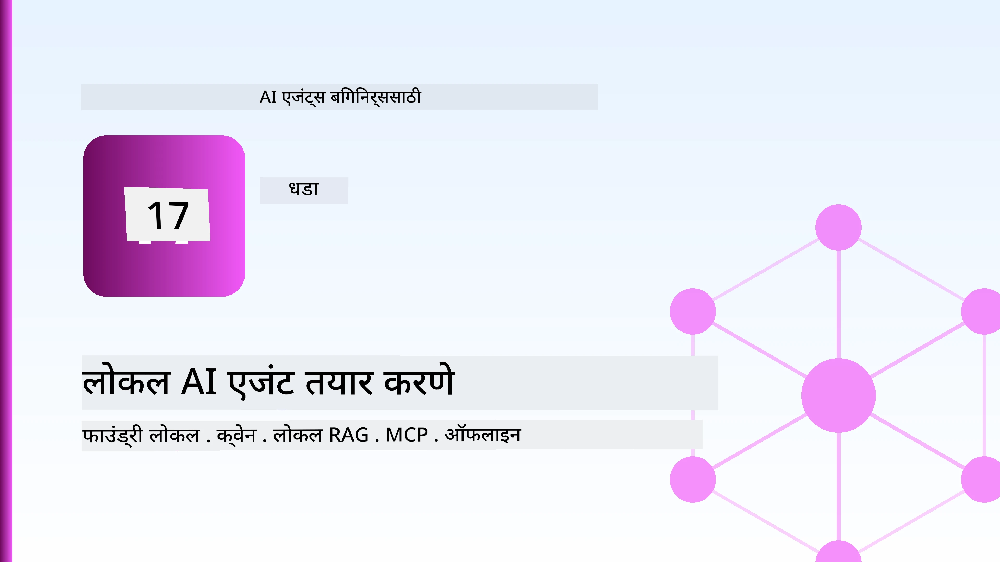
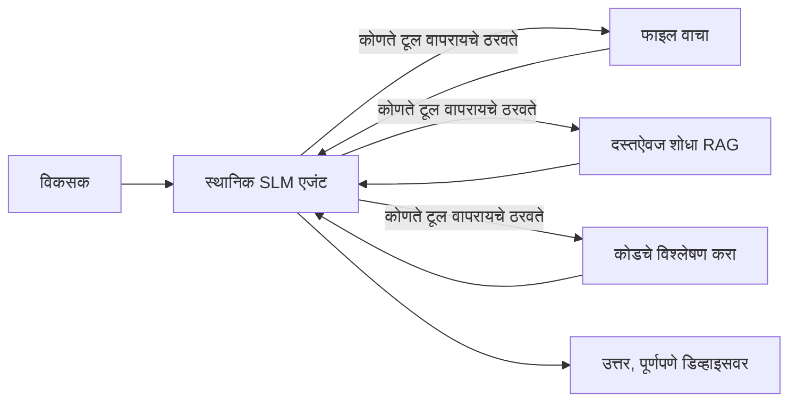
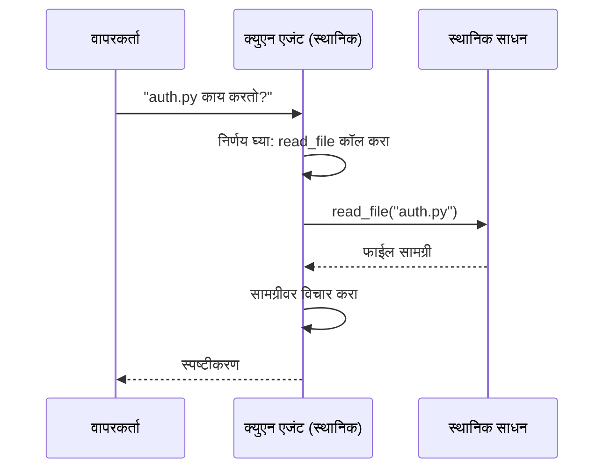
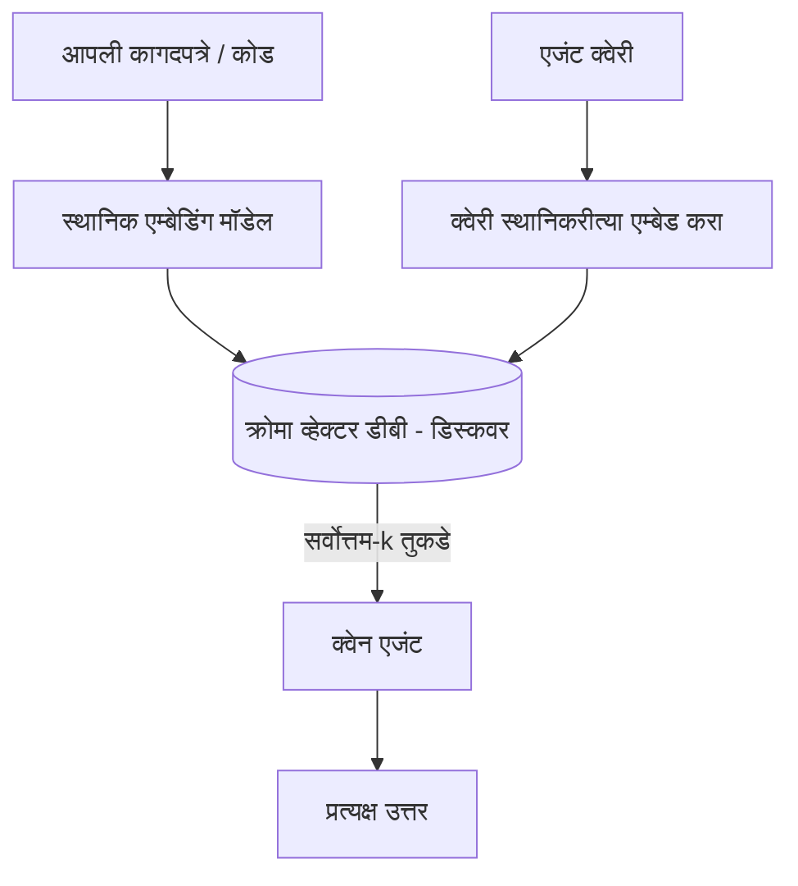
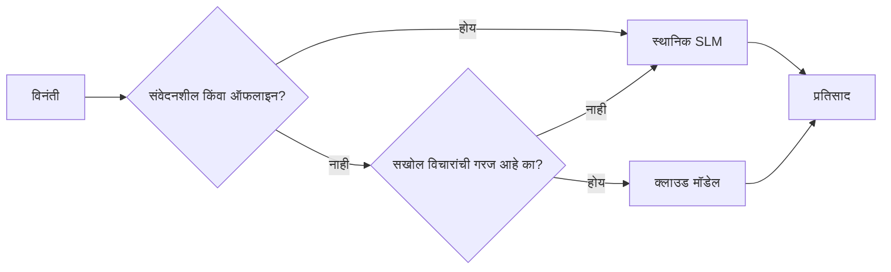

# Microsoft Foundry Local आणि Qwen वापरून स्थानिक AI एजंट तयार करणे



मागील धडा एजंट्सना *क्लाऊड* मध्ये स्केल केले. हा एकाच मशीनवर त्यांना *ओढतो*. शेवटी तुमच्याकडे एक कार्यरत अभियांत्रिकी सहाय्यक असेल जे विचार करते, साधने कॉल करते, तुमच्या फाइल्स वाचते आणि तुमच्या दस्तऐवजांमध्ये शोध घेतो — **एकही क्लाउड इन्फरन्स कॉल न करता.**

तुम्हाला हे का हवे आहे? प्रत्यक्ष अभियांत्रिकी कामात सतत येणाऱ्या तीन कारणे:

- **गोपनीयता.** कोड आणि दस्तऐवज कधीही मशीन सोडत नाहीत. कोणताही प्रॉम्प्ट, स्निपेट, ग्राहक डेटा नेटवर्क सीमारेषा पार करत नाही.
- **खर्च.** स्थानिक इन्फरन्सला प्रति-टोकन बिल नाही. तुम्ही दिवसभर वीजेच्या किमतीसाठी पुनरावृत्ती करू शकता.
- **ऑफलाइन.** विमानात, सुरक्षित संकल्पनेत, किंवा वीजपुरवठा बंद असताना देखील एजंट कार्य करते.

अडचण अशी आहे की तुम्ही तुमच्या CPU, GPU किंवा NPU वर चालणाऱ्या **लहान भाषा मॉडेल (SLM)** साठी एक अग्रगण्य क्लाउड मॉडेल ट्रेड करत आहात. हा धडा अशा एजंट्सबद्दल आहे जे त्या मर्यादेत *चांगले* असतात परंतु या मर्यादेचा नाट्य केला जात नाही.

## परिचय

या धड्यात समाविष्ट आहे:

- **लहान भाषा मॉडेल्स (SLMs)** — ते काय आहेत, कुठे प्रभावी आहेत, आणि कुठे नाहीत.
- **Microsoft Foundry Local** — एक रनटाइम जे मॉडेल्स डिव्हाइसवर डाउनलोड आणि सेवा देते, **OpenAI-सुसंगत API** द्वारे.
- **Qwen फंक्शन-कॉलिंग मॉडेल्स** — अशी SLMs जी विश्वासार्हपणे साधन कॉल तयार करतात, जे स्थानिक *एजंट्स* शक्य करतात (फक्त स्थानिक चॅटच नाही).
- **स्थानिक साधने, स्थानिक RAG, आणि स्थानिक MCP** — एजंटला क्लाउडशिवाय क्षमता देणे.
- **हायब्रिड नमुने** — कधी गोष्टी स्थानिक ठेवायच्या आणि कधी क्लाउडसाठी जावं.

## शिक्षणाचे उद्दिष्टे

हा धडा पूर्ण केल्यावर तुम्हाला कसे माहित होईल:

- SLMs चे फायदे आणि तोटे समजावून सांगणे व योग्य स्थानिक एजंट वापर प्रकरणे निवडणे.
- Foundry Local सह Qwen मॉडेल स्थानिकरित्या सेवा देणे आणि OpenAI-सुसंगत एंडपॉइंटद्वारे जोडणे.
- पूर्णपणे तुमच्या कार्यक्षेत्रावर चालणारा टूल-कॉलिंग एजंट तयार करणे.
- स्थानिक डॉक्युमेंट्सवर स्थानिक RAG जोडणे, स्थानिक व्हेक्टर डेटाबेस (Chroma) वापरून.
- एजंटला स्थानिक MCP सर्व्हरशी जोडणे आणि हायब्रिड स्थानिक/क्लाउड डिझाइन्सबद्दल चर्चा करणे.

## पूर्वआवश्यकता

हा धडा पूर्ण करण्यासाठी, तुम्ही आधीचे धडे पूर्ण केलेले असले पाहिजेत आणि तुम्हाला सोयीचे असले पाहिजे:

- [Tool Use](../04-tool-use/README.md) (धडा 4) आणि [Agentic RAG](../05-agentic-rag/README.md) (धडा 5).
- [Agentic Protocols / MCP](../11-agentic-protocols/README.md) (धडा 11).
- [Microsoft Agent Framework](../14-microsoft-agent-framework/README.md) (धडा 14).

याशिवाय तुम्हाला याची गरज आहे:

- एक विकसक कार्यस्थान. **8 GB RAM ही वास्तविक किमान गरज आहे**; 16 GB+ आरामदायक आहे. GPU किंवा NPU मदत करतो पण आवश्यक नाही.
- **Microsoft Foundry Local** स्थापित केलेले (खालील सेटअप तपासा).
- Python 3.12+ आणि साठवणूक [`requirements.txt`](../../../requirements.txt) मधील पॅकेजेस, आणि या धड्यासाठी `foundry-local-sdk`, `openai`, आणि `chromadb`.

## लहान भाषा मॉडेल्स: स्थानिक कामासाठी योग्य साधन

अग्रगण्य क्लाउड मॉडेलमध्ये शेकडो अब्ज पैरामीटर्स आणि एक डेटा सेंटर असतो. SLM मध्ये काही अब्ज पैरामीटर्स असतात आणि ते तुमच्या लॅपटॉपच्या RAM मध्ये बसले पाहिजे. हा फरक स्पष्ट अपेक्षा सेट करतो.

**SLMs चांगले आहेत:**

- संरचित, मर्यादित कामे — वर्गीकरण, काढणी, ज्ञात दस्तऐवजाचा सारांश.
- **टूल कॉल करणे** — कोणती फंक्शन कॉल करायची आणि कोणते अर्ग्युमेंट वापरायचे हे ठरवणे.
- तुमच्या स्वतःच्या डेटावर जलद, स्वस्त, खाजगी पुनरावृत्ती.

**SLMs मध्ये कमकुवत आहेत:**

- मोठ्या संदर्भामध्ये खुल्या टोकांचे, बहु-मोडीचे विचार करणं.
- व्यापक जागतिक ज्ञान (त्यांनी कमी पाहिलेले आणि जास्त विसरलेले आहे).

स्थानिक एजंट्ससाठी जिंकणारा धोरण आहे: **SLM ला आ orchestration करायला द्या, आणि साधनांना कठीण काम करण्यासाठी द्या.** मॉडेलला तुमचा कोडबेस *माहित* असण्याची गरज नाही — त्याला `read_file` आणि `search_docs` कधी कॉल करायचे हे माहित असले पाहिजे. हे थेट SLM च्या ताकदीस अनुरूप आहे.



## Microsoft Foundry Local

**Microsoft Foundry Local** एक हलकं-फुलकं रनटाइम आहे जे मॉडेल्स पूर्णपणे तुमच्या मशीनवर डाउनलोड, व्यवस्थापित, आणि सेवा देते. आमच्यासाठी त्याची सर्वात महत्त्वाची वैशिष्ट्य म्हणजे याने एक **OpenAI-सुसंगत HTTP एंडपॉइंट** उपलब्ध करून दिला आहे — म्हणजे OpenAI SDK आणि Microsoft Agent Framework चे OpenAI क्लायंट यात `base_url` बदलून सहज वापरू शकतात. एजंट तयार करण्याबाबत तुम्ही जे काही शिकलात ते सर्व सरळ येथे लागू होतात; फक्त एंडपॉइंट क्लाउडवरून `localhost` वर हलवले जाते.

Foundry Local तुमच्या हार्डवेअरसाठी सर्वोत्तम मॉडेल बिल्ड आपोआप निवडतो — CPU बिल्ड, CUDA/GPU बिल्ड, किंवा NPU बिल्ड — त्यामुळे तुम्हाला दर मशीनवर हाताने ऑप्टिमाइझ करावे लागत नाही.

### सेटअप

Foundry Local स्थापित करा (तुमच्या OS साठी [दस्तऐवज](https://learn.microsoft.com/azure/ai-foundry/foundry-local/) पहा) आणि नंतर ते कार्यरत आहे का ते तपासा:

```bash
# स्थापित करा (उदाहरणार्थ; आपल्या प्लॅटफॉर्मसाठी दस्तऐवजाचे पालन करा)
winget install Microsoft.FoundryLocal      # विंडोज
# brew install microsoft/foundrylocal/foundrylocal   # macOS

# Qwen मॉडेल डाउनलोड करा आणि चालवा, नंतर स्थानिक सेवा सुरू करा
foundry model run qwen2.5-7b-instruct
foundry service status
```

सेवा चालू झाल्यानंतर तुमच्याकडे एक स्थानिक, OpenAI-सुसंगत एंडपॉइंट असते (साधारणपणे `http://localhost:PORT/v1`). नोटबुक आपोआप एंडपॉइंट शोधण्यासाठी `foundry-local-sdk` वापरते, त्यामुळे तुम्हाला पोर्ट हार्डकोड करावा लागत नाही.

## Qwen फंक्शन कॉलिंग: का महत्त्वाचे आहे

एजंट एजंट असतो जेव्हा ते साधने कॉल करू शकतो. अनेक SLMs चॅट करू शकतात पण अविश्वसनीय, अपूर्ण टूल कॉल्स तयार करतात. **Qwen** मॉडेल फंक्शन कॉलसाठी प्रशिक्षित आहेत आणि विश्वसनीय, व्यवस्थित टूल कॉल्स सतत तयार करतात — जे स्थानिक चॅट मॉडेलला स्थानिक *एजंट* मध्ये रूपांतरित करते.

फ्लो आधीपासून परिचित टूल-कॉलिंग लूप आहे, फक्त येथे हे डिव्हाइसवर चालते:



## स्थानिक RAG

दस्तऐवज शोध हे स्थानिक एजंट्सचे फायदा मिळवण्याचे मुख्य स्थान आहे. जेथे SLM तुमच्या फ्रेमवर्कच्या दस्तऐवजांची आठवण ठेवेल अशी आशा न करता, तुम्ही त्या दस्तऐवजांना एका **स्थानिक व्हेक्टर डेटाबेस** मध्ये एम्बेड करता आणि एजंटला योग्य चंक मागवण्यासाठी देते.

आम्ही **Chroma** वापरतो, एक एम्बेड केलेला व्हेक्टर स्टोअर जो कोणताही सर्व्हर नसताना इन-प्रोसेस चालतो. पाइपलाइन पूर्णपणे स्थानिक आहे: स्थानिक एम्बेडिंग मॉडेल → स्थानिक व्हेक्टर → स्थानिक पुनर्प्राप्ती → स्थानिक SLM.



हा तोच Agentic RAG पॅटर्न आहे जो धडा 5 मध्ये होता — फरक इतकाच की प्रत्येक घटक तुमच्या मशीनवर चालतो.

## स्थानिक MCP सर्व्हर्स

[MCP](../11-agentic-protocols/README.md) एक ट्रान्सपोर्ट आहे, क्लाउड सेवा नाही. MCP सर्व्हर `stdio` वर स्थानिक प्रक्रियेप्रमाणे चालू होऊ शकतो, ज्यामुळे एजंटला मानक प्रोटोकॉलने साधनांशी संलग्नता मिळते. याने फाइलसिस्टम ऍक्सेस, Git ऑपरेशन्स, डेटाबेस क्वेरीज अशा वाढत्या MCP सर्व्हर्स पर्यावरणाचा पुनर्वापर पूर्णपणे ऑफलाइन करता येतो.

सुरक्षा धोरण क्लाउडसारखे नाही, पण नसलेले नाही: स्थानिक MCP सर्व्हर तुमच्या वापरकर्त्याच्या परवानग्यांवर चालतो, त्यामुळे त्याला काय स्पर्श करता येते याची मर्यादा ठेवा (उदा. प्रोजेक्ट डायरेक्टरी, संपूर्ण होम फोल्डर नव्हे) आणि त्याच्या आउटपुट्सना वैध ठरवण्याकडे लक्ष द्या.

## हायब्रिड क्लाउड आणि स्थानिक नमुने

स्थानिक-प्राथमिक म्हणजे फक्त स्थानिक नाही. परिपक्व प्रणाली संवेदनशीलता आणि कठीणतेनुसार मार्गदर्शित करतात:

| परिस्थिती | कुठे चालते |
| --- | --- |
| संवेदनशील कोड / डेटा, किंवा ऑफलाइन | **स्थानिक SLM** |
| सोपी, मर्यादित कामे | **स्थानिक SLM** (स्वस्त, जलद) |
| कठीण बहु-मोडीचा विचार न-संवेदनशील डेटावर | **क्लाउड मॉडेल** |
| वीजपुरवठा बंद असताना सर्वकाही | **स्थानिक SLM** (सौम्यदर्शन कमी होणे) |

हे धडा 16 मधील **मॉडेल रूटिंग** कल्पनेचे प्रतिबिंब आहे — फरक इतका की या "मॉडेल" पैकी एक आता तुमची स्वतःची मशीन आहे. मजबूत डिझाइन क्लाउड अनुपलब्ध असताना स्थानिकाकडे पुनरावृत्ती करते, ज्यामुळे एजंट गुणवत्ता कमी होतो पण पूर्णपणे अयशस्वी होत नाही.



## हस्तगत प्रयोगशाळा: स्थानिक अभियांत्रिकी सहाय्यक

[`code_samples/17-local-agent-foundry-local.ipynb`](./code_samples/17-local-agent-foundry-local.ipynb) उघडा आणि त्यावर काम करा. तुम्ही एक **स्थानिक अभियांत्रिकी सहाय्यक** तयार कराल जो पूर्णपणे तुमच्या कार्यक्षेत्रावर चालेल आणि खालीलप्रमाणे करता येईल:

1. **साधने कॉल करा** — Foundry Local द्वारे Qwen फंक्शन कॉलिंग वापरून.
2. **स्थानिक फाइल ऑपरेशन्स करा** — प्रोजेक्ट डायरेक्टरीतील फाइल्स यादी करा आणि वाचा.
3. **कोड विश्लेषण करा** — स्त्रोत फाइलवर मूलभूत मेट्रिक्स अहवाल द्या.
4. **डॉक्युमेंटेशन शोधा** — Chroma सह डॉक फोल्डरवर स्थानिक RAG करा.
5. **MCP वापरा** — स्थानिक MCP सर्व्हरशी संलग्न व्हा (जर एखादा कॉन्फिगर नसेल तर सुंदरपणे वगळा).

कोठेही क्लाउड इन्फरन्स वापरले जात नाही.

### मार्गदर्शन

सहाय्यक OpenAI-सुसंगत एंडपॉइंटद्वारे Foundry Local शी जोडले जाते, त्यामुळे एजंट कोड क्लाउड धड्यांप्रमाणे जवळजवळ सारखा दिसतो — फक्त क्लायंट बदलतो:

```python
from foundry_local import FoundryLocalManager
from openai import OpenAI

# फाउंड्री लोकल मॉडेल शोधतो/डाउनलोड करतो आणि आम्हाला एक स्थानिक एंडपॉइंट देतो.
manager = FoundryLocalManager(\"qwen2.5-7b-instruct\")
client = OpenAI(base_url=manager.endpoint, api_key=manager.api_key)  # api_key हा एक स्थानिक प्लेसहोल्डर आहे
```

साधने सामान्य Python फंक्शन्स आहेत जी प्रोजेक्ट डायरेक्टरीपर्यंत मर्यादित आहेत:

```python
def read_file(path: str) -> str:
    \"\"\"Read a file, but only inside the sandboxed project directory.\"\"\"
    full = (PROJECT_ROOT / path).resolve()
    if PROJECT_ROOT not in full.parents and full != PROJECT_ROOT:
        return \"Access denied: path is outside the project directory.\"
    return full.read_text(encoding=\"utf-8\")
```

सॅंडबॉक्स तपासणी लक्षात घ्या — अगदी स्थानिकरीत्या, ज्या साधनाने मनमानी मार्ग वाचायचे असतात ती जबाबदारी आहे. नोटबुक प्रत्येक साधनाला एका प्रोजेक्ट रूटशी मर्यादित ठेवतो.

## ज्ञान तपासणी

असाइनमेंट सुरू करण्याआधी तुमचे समज तपासा.

**1. एजंट स्थानिकरित्या चालवायचा का? दोन ठोस कारणे द्या.**

<details>
<summary>उत्तर</summary>

खालीलपैकी कोणतीही दोन: **गोपनीयता** (कोड आणि डेटा कधीही मशीन सोडत नाही), **खर्च** (प्रति-टोकन इन्फरन्स बिल नाही), आणि **ऑफलाइन क्षमता** (नेटवर्कशिवाय चालते — विमानात, सुरक्षित संकल्पनेत, किंवा वीजपुरवठा बंद असताना). नियामक/अनुपालन निर्बंध जे डिव्हाइसबाहेर डेटा पाठवण्यास मनाई करतात, ते गोपनीयता कारणासाठी सामान्य चालना देतात.
</details>

**2. स्थानिक एजंटमधील SLM आणि त्याच्या साधनांमधील कामाचे योग्य विभाजन काय आहे, आणि का?**

<details>
<summary>उत्तर</summary>

SLM ला **आ orchestration करायला द्या** (कोणता टूल कॉल करायचा आणि कोणता अर्ग्युमेंट वापरायचा ठरवत) आणि **साधनांना जड काम करण्यासाठी द्या** (फाइल्स वाचणे, डॉक्युमेंट्स शोधणे, निकाल मोजणे). SLMs मजबूत आहेत मर्यादित निर्णयांमध्ये जसे टूल निवडणे पण व्यापक ज्ञान आणि दीर्घ बहु-मोडी विचारात कमजोर आहेत, त्यामुळे साधनांवर अवलंबून राहणे त्यांची ताकद वाढवते.
</details>

**3. Foundry Local सह क्लाउड एजंट कोड पुन्हा वापरणे शक्य का आहे?**

<details>
<summary>उत्तर</summary>

Foundry Local एक **OpenAI-सुसंगत HTTP एंडपॉइंट** प्रदान करतो. OpenAI SDK आणि एजंट फ्रेमवर्कचा OpenAI क्लायंट फक्त `base_url` बदलून (स्थानिक API की वापरून) त्यासाठी कार्य करतात. एजंट कोडबाबत इतर काहीही बदलत नाही.
</details>

**4. आम्ही विशेषतः Qwen फंक्शन-कॉलिंग मॉडेल का वापरतो, अन्य कोणत्याही SLM ऐवजी?**

<details>
<summary>उत्तर</summary>

कारण एजंटला विश्वसनीय, व्यवस्थित **टूल कॉल्स** तयार करणे आवश्यक आहे. अनेक SLMs चॅट करू शकतात पण अपूर्ण किंवा विसंगत टूल कॉल स्ट्रक्चर्स तयार करतात. Qwen मॉडेल्स फंक्शन कॉलिंगसाठी प्रशिक्षित आहेत आणि सलग टूल कॉल्स उत्पादन करतात, जे स्थानिक चॅट मॉडेलला कार्यरत स्थानिक एजंट बनवते.
</details>

**5. स्थानिक RAG पाइपलाइनमध्ये कोणते घटक मशीनवर चालतात?**

<details>
<summary>उत्तर</summary>

सर्व घटक: एम्बेडिंग मॉडेल, व्हेक्टर डेटाबेस (Chroma, डिस्कवर), पुनर्प्राप्ती पायरी, आणि SLM. दस्तऐवज स्थानिकरित्या एम्बेड, साठवले, पुनर्प्राप्त, आणि स्थानिक मॉडेलद्वारे विचारले जातात — कोणताही घटक क्लाउडसंपर्क करत नाही.
</details>

**6. स्थानिक MCP सर्व्हर तुमच्या मशीनवर चालतो. त्यामुळे तो स्वयंचलितपणे सुरक्षित आहे का? कोणती खबरदारी घेतली पाहिजे?**

<details>
<summary>उत्तर</summary>

नाही. स्थानिक MCP सर्व्हर तुमच्या वापरकर्त्याच्या परवानग्यांवर चालतो, त्यामुळे तो काहीही स्पर्श करू शकतो जो तुम्ही करू शकता. तुम्हाला ज्याची गरज आहे त्यापुरता त्याचा कवच ठेवा (उदा. एका प्रोजेक्ट डायरेक्टरीपुरता, संपूर्ण होम फोल्डर नव्हे) आणि त्याच्या आउटपुट्सना क्रियान्वयनापूर्वी इनपुट्ससारखा Validate करा.
</details>

**7. स्थानिक मॉडेल समाविष्ट असलेले एक अर्थपूर्ण हायब्रिड रूटिंग नियम वर्णन करा.**

<details>
<summary>उत्तर</summary>

संवेदनशील किंवा ऑफलाइन विनंत्या स्थानिक SLM कडे पाठवा; सोपी मर्यादित कामे जलद आणि स्वस्तीसाठी स्थानिक SLM कडे द्या; कठीण बहु-मोडी विचार न-संवेदनशील डेटावर क्लाउड मॉडेल कडे पाठवा; आणि क्लाउड उपलब्ध नसल्यास स्थानिक SLM कडे परत जा, ज्यामुळे एजंट सौम्यपणे कमी दर्जाचा होतो पण पूर्णपणे अयशस्वी होत नाही. ही धडा 16 मधील मॉडेल रूटिंगची कल्पना आहे ज्यात स्थानिक मशीन एक मॉडेल आहे.
</details>

**8. या धड्यात स्थानिक एजंट चालवण्यासाठी काय एक वास्तविक किमान RAM आकडा आहे, आणि अधिक RAM तुम्हाला काय देते?**

<details>
<summary>उत्तर</summary>

साधारणपणे **8 GB** ही वास्तविक किमान गरज आहे; 16 GB+ आरामदायक आहे. अधिक RAM तुम्हाला मोठे, अधिक क्षमतेचे मॉडेल चालवता येते आणि अधिक संदर्भ स्मृतीत ठेवू शकता. GPU किंवा NPU इन्फरन्स जलद करतो पण आवश्यक नाही — Foundry Local CPU बिल्ड निवडतो जेंव्हा कोणताही अ‍ॅक्सेलरेटर उपलब्ध नसतो.
</details>

## असाइनमेंट

स्थानिक अभियांत्रिकी सहाय्यकाला विस्तारित करून तुमच्या आवडीचा एक **स्थानिक दस्तऐवज पुनरावलोकक** तयार करा (तुम्हाला आवडत असल्यास या रेपोजमध्येल्या धडा फोल्डर्सपैकी कोणताही वापरा).

तुमच्या सबमिशनमध्ये असावे:

1. प्रत्यक्ष डॉक्स/कोड फोल्डर Chroma मध्ये सूचीबद्ध करा (किमान पाच फाइल्स).
2. `find_todos` साधन जोडा, जो प्रोजेक्टमधील `TODO`/`FIXME` टिप्पण्यांचा शोध घेतो आणि फाइल आणि ओळी क्रमांकांसह परत करतो — `read_file` मधील सॅंडबॉक्स तपासणी सारखीच तपासणी ठेवून.

3. **एजंटला तीन प्रश्न विचारा** जे त्याला साधने एकत्र करण्यास भाग पाडतात: एक शुद्ध RAG प्रश्न, एक जो विशिष्ट फाइल वाचण्याची गरज आहे, आणि एक जो TODOs शोधण्याची गरज आहे.
4. **त्याचे मापन करा**: तीन प्रतिसादांपैकी प्रत्येकाचे वेळी मोजा आणि ते मार्कडाऊन सेल मध्ये नोंदवा. आपल्या इच्छित कार्यप्रवाहासाठी विलंब स्वीकार्य आहे का यावर टिप्पणी करा.

नंतर या पुनरावलोककासाठी **आपण काय क्लाउडवर नेणार आहात आणि काय स्थानिक ठेवणार आहात** यावर एक थोडक्यात परिच्छेद लिहा, आणि का. आपल्याला स्थानिक घटक योग्य रितीने जोडलेले आहेत का आणि आपला संकरणात्मक तार्किक विचार बरोबर आहे का यावर मूल्यांकन केले जाईल — मॉडेलच्या गुणवत्तेवर नाही.

## सारांश

या धड्यात आपण असा एजंट तयार केला जो पूर्णपणे आपल्या स्वतःच्या मशीनवर चालतो:

- **SLMs** गोपनीयता, खर्च, आणि ऑफलाइन ऑपरेशनसाठी व्याप्तीवर व्यापार करतात — आणि तेव्हा तेजस्वी होतात जेव्हा ते **साधने आयोजित करतात** केवळ स्वतःच सर्व ज्ञान घेऊन फिरण्याऐवजी.
- **Foundry Local** मॉडेल्सना डिव्हाइसवर **OpenAI-सुसंगत एंडपॉइंट** मागे सर्व्ह करते, त्यामुळे तुमचा क्लाउड एजंट कोड एका ओळीच्या बदलाने ट्रान्सफर होतो.
- **Qwen फंक्शन कॉलिंग मॉडेल्स** स्थानिक साधन कॉलिंगवर विश्वासार्हता आणतात — आणि त्यामुळे स्थानिक *एजंट्स* शक्य आहेत.
- **स्थानिक RAG** (Chroma) आणि **स्थानिक MCP** एजंटला कौशल्य देतात मशीन सोडल्याशिवाय.
- **हायब्रिड पॅटर्न्स** आपल्याला संवेदनशीलता आणि अवघडपणा नुसार मार्गदर्शन देतात, स्थानिक एक सुंदर पर्याय म्हणून.

हे तैनातीचा कल पूर्ण करते: धडा १६ मध्ये एजंट्स Microsoft Foundry मध्ये वाढवले गेले, आणि या धड्यात एकाच वर्कस्टेशनवर कमी केले गेले. पुढील धडा एजंट्स सुरक्षित ठेवण्याकडे वळतो.

## अतिरिक्त संसाधने

- <a href="https://learn.microsoft.com/azure/ai-foundry/foundry-local/" target="_blank">Microsoft Foundry Local दस्तऐवज</a>
- <a href="https://learn.microsoft.com/azure/ai-foundry/what-is-azure-ai-foundry" target="_blank">Microsoft Foundry दस्तऐवज</a>
- <a href="https://aka.ms/ai-agents-beginners/agent-framework" target="_blank">Microsoft Agent Framework</a>
- <a href="https://qwen.readthedocs.io/en/latest/framework/function_call.html" target="_blank">Qwen फंक्शन कॉलिंग दस्तऐवज</a>
- <a href="https://modelcontextprotocol.io/" target="_blank">मॉडेल संदर्भ प्रोटोकॉल (MCP)</a>
- <a href="https://docs.trychroma.com/" target="_blank">Chroma व्हेक्टर डेटाबेस</a>

## मागील धडा

[स्केलेबल एजंट्स तैनात करणे](../16-deploying-scalable-agents/README.md)

## पुढील धडा

[एआय एजंट्स सुरक्षित करणे](../18-securing-ai-agents/README.md)

---

<!-- CO-OP TRANSLATOR DISCLAIMER START -->
**अस्वीकरण**:
हा दस्तऐवज AI भाषांतर सेवा [Co-op Translator](https://github.com/Azure/co-op-translator) चा वापर करून अनुवादित केला आहे. जरी आम्ही अचूकतेसाठी प्रयत्न करतो, तरी कृपया लक्षात घ्या की स्वयंचलित भाषांतरांमध्ये त्रुटी किंवा अचूकतेची कमतरता असू शकते. मूळ दस्तऐवज त्याच्या मूळ भाषेत अधिकृत स्रोत मानला पाहिजे. महत्त्वाची माहिती असल्यास, व्यावसायिक मानवी भाषांतराची शिफारस केली जाते. या भाषांतराच्या वापरामुळे उद्भवणाऱ्या कोणत्याही गैरसमज किंवा चुकीच्या अर्थलावणीसाठी आम्ही जबाबदार नाही.
<!-- CO-OP TRANSLATOR DISCLAIMER END -->