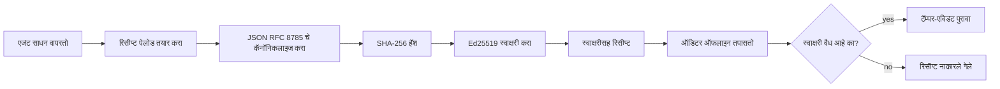
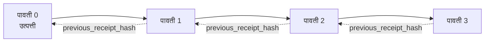

[धडा व्हिडिओ पहा: क्रिप्टोग्राफिक रिसिप्टसह AI एजंट्स सुरक्षित करणे](https://youtu.be/PLACEHOLDER_VIDEO_ID)

> _(धडा व्हिडिओ आणि थंबनेल मायक्रोसॉफ्ट सामग्री टीमद्वारे मर्ज नंतर जोडिले जातील, धडा १४ / १५ च्या नमुन्याशी जुळवून.)_

# क्रिप्टोग्राफिक रिसिप्टसह AI एजंट्स सुरक्षित करणे

## परिचय

हा धडा खालील गोष्टींना आच्छादित करेल:

- एआय एजंटसाठी ऑडिट ट्रेल्स का प्रमाणन, डीबगिंग आणि विश्वासासाठी महत्त्वाचे आहेत.
- क्रिप्टोग्राफिक रिसिप्ट म्हणजे काय आणि तो कोणत्या प्रकारे असाइन न केलेल्या लॉग लाईनपेक्षा वेगळा आहे.
- एजन्टच्या टूल कॉलसाठी साध्या पायथनमध्ये साइन केलेला रिसिप्ट कसा तयार करायचा.
- रिसिप्ट ऑफलाइन कशी पडताळायची आणि छळ प्रतिबंधक कसा शोधायचा.
- रिसिप्ट्स कसे साखळीत जोडायचे जेणेकरून कोणत्याही रिसिप्टचा हटवणे किंवा पुनर्बंधन पोसणे साखळी तोडेल.
- रिसिप्ट्स काय पुरपुर करतात आणि ते स्पष्टपणे काय पुरपुर करत नाहीत.

## शिक्षण उद्दिष्टे

हा धडा पूर्ण केल्यानंतर, तुम्हाला हे कळेल कसे:

- अशा अपयशाच्या परिस्थिती ओळखणे ज्यामुळे एजंट क्रियांसाठी क्रिप्टोग्राफिक प्रमाणन गरजेचे आहे.
- सरळ JSON पेलोडवर Ed25519-साइन केलेले रिसिप्ट तयार करणे.
- फक्त चालविणाऱ्याच्या सार्वजनिक कीचा वापर करून स्वतंत्रपणे रिसिप्ट सत्यापित करणे.
- बदल झालेल्या रिसिप्टवर पुनःसत्यापन करून छळ शोधणे.
- रिसिप्ट्सची हॅश-चेन साखळी तयार करणे आणि साखळी का महत्त्वाची आहे हे स्पष्ट करणे.
- रिसिप्ट काय पुरपुर करतात (अधिकारीकरण, अखंडता, क्रमवारी) आणि काय नाही (क्रियेची बरोपदारी, धोरणाची योग्यपणा).

## समस्या: तुमच्या एजंटचा ऑडिट ट्रेल

कल्पना करा, तुम्ही Contoso Travel साठी AI एजंट लागू केला आहे. हा एजंट ग्राहकांच्या विनंत्या वाचतो, फ्लाइट API कॉल करतो पर्याय शोधण्यासाठी, आणि ग्राहकांच्या वतीने आसने बुक करतो. मागील तिमाहीत एजंटने ५०,००० बुकिंग्स प्रक्रिया केल्या.

आज एक ऑडिटर येतो. तो एक सोपा प्रश्न विचारतो: "तुमचा एजंट काय करत होता ते दाखवा."

तुम्ही तुमची लॉग फाईल्स देता. ऑडिटर पाहतो आणि कठीण प्रश्न विचारतो: "मला कसे कळेल की हे लॉग्स संपादित केलेले नाहीत?"

ही ऑडिट-ट्रेल समस्या आहे. आजच्या बहुतेक एजंट तैनातीवर अवलंबून असतात:

- **अॅप्लिकेशन लॉग्स**: एजंटनेच लिहिलेले, फाईल सिस्टममध्ये प्रवेश असलेल्या कोणालाही संपादित करता येणारे.
- **क्लाउड लॉगिंग सेवा**: प्लॅटफॉर्म स्तरावर छळ प्रतिबंधक पण केवळ ऑडिटर प्लॅटफॉर्म ऑपरेटरवर विश्वास ठेवला तरच.
- **डेटाबेस व्यवहार लॉग्स**: डेटाबेस बदलांसाठी योग्य, पण मनमानी टूल कॉलसाठी नाही.

यापैकी कोणतेही ऑडिटरचा प्रश्न उत्तर देऊ शकत नाहीत जोपर्यंत ऑडिटर कोणावरही (तुम्ही, तुमचा क्लाउड पुरवठादार, तुमचा डेटाबेस विक्रेता) विश्वास ठेवत नसतो. अंतर्गत वापरासाठी तो विश्वास सहसा स्वीकार्य असतो. परंतु नियमनाधीन कार्यभारांसाठी (वित्त, आरोग्यसेवा, EU AI कायद्याअंतर्गत काहीही), तो असा नाही.

क्रिप्टोग्राफिक रिसिप्ट्स याला निराकरण करतात, प्रत्येक एजंट क्रिया स्वतंत्रपणे सत्यापित करण्यायोग्य बनवून. ऑडिटरला तुमच्यावर विश्वास ठेवण्याची गरज नाही. त्यांना फक्त तुमची सार्वजनिक की आणि रिसिप्टच आवश्यक आहे.

## क्रिप्टोग्राफिक रिसिप्ट म्हणजे काय?

रिसिप्ट हे JSON ऑब्जेक्ट आहे जे एजंटने काय केले ते नोंदवते, डिजिटल स्वाक्षरीने साइन केलेले.



एक लहान रिसिप्ट असे दिसते:

```json
{
  "type": "agent.tool_call.v1",
  "agent_id": "contoso-travel-bot",
  "tool_name": "lookup_flights",
  "tool_args_hash": "sha256:a3f9c1...",
  "result_hash": "sha256:7b2e1d...",
  "policy_id": "contoso-travel-policy-v3",
  "timestamp": "2026-04-25T14:30:00Z",
  "sequence": 47,
  "previous_receipt_hash": "sha256:9d4e6a...",
  "signature": {
    "alg": "EdDSA",
    "sig": "c5af83...",
    "public_key": "8f3b2c..."
  }
}
```

तीन गुणधर्म हे काम करीत आहेत:

1. **स्वाक्षरी**. रिसिप्ट एजंटच्या गेटवेने Ed25519 खाजगी की वापरून साइन केलेली आहे. कोणाकडेही संबंधित सार्वजनिक की असेल तर ते ऑफलाइन स्वाक्षरी पडताळू शकतात. कोणत्याही क्षेत्रामध्ये छळ केल्यास स्वाक्षरी अवैध होते.

2. **कॅनॉनिकल एन्कोडिंग**. साइन करण्यापूर्वी, रिसिप्ट JSON Canonicalization Scheme (JCS, RFC 8785) चा वापर करून सिरियलाइझ केला जातो. यामुळे दोन अंमलबजावणी एकसारखे लॉजिक रिसिप्ट तयार करतात तर बाइटमध्ये अचूक समान आउटपुट मिळते. कॅनॉनिकलायझेशनशिवाय, वेगवेगळे JSON सिरियलायझर वेगळ्या स्वाक्षऱ्या उत्पादन करतील.

3. **हॅश चेनिंग**. `previous_receipt_hash` क्षेत्र प्रत्येक रिसिप्टला त्यापूर्वीच्या रिसिप्टशी लिंक करते. रिसिप्ट काढल्यास किंवा पुनर्बंधन केल्यास त्यानंतरच्या प्रत्येक रिसिप्टचा ब्रेक होतो. छळ साखळीच्या पातळीवर दिसून येतो जरी स्वतंत्र स्वाक्षर्या बायपास केल्या गेल्या.

एकत्रितपणे हे गुण तीन हमी प्रदान करतात:

- **अधिकारीकरण**: या कीने हे सामग्री साइन केले.
- **अखंडता**: साइन नंतर सामग्री बदललेली नाही.
- **क्रमवारी**: ही रिसिप्ट त्या रिसिप्टनंतर आली आहे साखळीत.

## पायथनमध्ये रिसिप्ट कशी तयार करावी

रिसिप्ट तयार करण्यासाठी एखाद्या विशेष लायब्ररीची गरज नाही. क्रिप्टोग्राफिक मूळतत्त्वे सहज उपलब्ध आहेत आणि लॉजिक काही ओळींचे पायथन आहे.

`code_samples/18-signed-receipts.ipynb` या हँड्स-ऑन कार्यशाळेत पूर्ण प्रवाह समजावून सांगितलेला आहे. संक्षिप्त आवृत्ती:

```python
import json
import hashlib
import base64
from nacl import signing
from jcs import canonicalize  # RFC 8785 कॅनॉनिकल JSON

def b64url_nopad(data: bytes) -> str:
    return base64.urlsafe_b64encode(data).decode("ascii").rstrip("=")

def sha256_canonical(obj) -> str:
    """SHA-256 of a Python object's JCS-canonical JSON form."""
    return f"sha256:{hashlib.sha256(canonicalize(obj)).hexdigest()}"

# एक साइनिंग की तयार करा किंवा लोड करा (उत्पादनामध्ये, की वॉल्टमध्ये संग्रहित करा)
signing_key = signing.SigningKey.generate()
verify_key = signing_key.verify_key

# रसीद पेलोड तयार करा (अजून स्वाक्षरी नाही)
tool_args = {"origin": "SYD", "destination": "LAX"}
tool_result = [{"flight": "QF11", "price": 1850, "stops": 0}]

payload = {
    "type": "agent.tool_call.v1",
    "agent_id": "contoso-travel-bot",
    "tool_name": "lookup_flights",
    "tool_args_hash": sha256_canonical(tool_args),
    "result_hash": sha256_canonical(tool_result),
    "policy_id": "contoso-travel-policy-v3",
    "timestamp": "2026-04-25T14:30:00Z",
    "sequence": 0,
    "previous_receipt_hash": None,
}

# कॅनॉनिकल करा, हॅश करा, स्वाक्षरी करा.
canonical_bytes = canonicalize(payload)
message_hash = hashlib.sha256(canonical_bytes).digest()
signature_bytes = signing_key.sign(message_hash).signature

# एक रचनेत स्वाक्षरी ऑब्जेक्ट संलग्न करा.
receipt = {
    **payload,
    "signature": {
        "alg": "EdDSA",
        "sig": b64url_nopad(signature_bytes),
        "public_key": b64url_nopad(bytes(verify_key)),
    },
}
```

ही संपूर्ण साइनिंग पाइपलाइन आहे. नोटबुकमधील व्यायाम प्रत्येक टप्पा तपशीलवार समजावतात.

## रिसिप्ट सत्यापित करणे आणि छळ शोधणे

सत्यापन म्हणजे उलट क्रिया:

```python
import base64
import hashlib
from nacl import signing
from nacl.exceptions import BadSignatureError
from jcs import canonicalize

def b64url_decode(s: str) -> bytes:
    padding = "=" * ((4 - len(s) % 4) % 4)
    return base64.urlsafe_b64decode(s + padding)

def verify_receipt(receipt: dict) -> bool:
    # सही एक संरचित ऑब्जेक्ट आहे: {"alg", "sig", "public_key"}.
    sig_obj = receipt.get("signature")
    if not sig_obj or sig_obj.get("alg") != "EdDSA":
        return False

    # खरोखर स्वाक्षरी केलेला पेलोड पुनर्निर्मित करा (स्वाक्षरी वगळता सर्व काही).
    payload = {k: v for k, v in receipt.items() if k != "signature"}

    canonical_bytes = canonicalize(payload)
    message_hash = hashlib.sha256(canonical_bytes).digest()

    try:
        verify_key = signing.VerifyKey(b64url_decode(sig_obj["public_key"]))
        verify_key.verify(message_hash, b64url_decode(sig_obj["sig"]))
        return True
    except BadSignatureError:
        return False
```

ही फंक्शन रिसिप्ट घेतो आणि 'True' परत करतो जर स्वाक्षरी वैध असेल, अन्यथा 'False'. कोणतीही नेटवर्क कॉल नाही, कोणतीही सेवा अवलंबित्व नाही, कोणत्याही तृतीय पक्षावर विश्वास आवश्यक नाही.

छळ शोधण्याचे प्रदर्शन पाहण्यासाठी, नोटबुकमध्ये पुढील गोष्टी केल्या आहेत:

1. वैध रिसिप्ट तयार करणे आणि पडताळणी होणे याची खात्री करणे.
2. `tool_args_hash` क्षेत्राचा एक बाइट बदलणे.
3. पडताळणी पुन्हा चालवणे आणि ती अयशस्वी होणे.

हा हा प्रत्यक्ष प्रदर्शन आहे की रिसिप्ट्स छळ प्रतिबंधक आहेत: थोडीही बदल स्वाक्षरी तोडते.

## बहु-चरण एजंटसाठी रिसिप्ट्सची साखळी तयार करणे

एकच साइन केलेली रिसिप्ट एक क्रिया संरक्षण करते. रिसिप्ट्सची साखळी एक अनुक्रमण संरक्षण करते.



प्रत्येक रिसिप्ट त्यापूर्वीच्या रिसिप्टचा हॅश नोंदवते. रिसिप्ट २ शांतपणे काढण्यासाठी, हल्लेखोराला:

- रिसिप्ट ३ च्या `previous_receipt_hash` क्षेत्रात बदल करावा लागेल (रिसिप्ट ३ ची स्वाक्षरी मोडते), किंवा
- एक नवीन स्वाक्षरी तयार करावी लागेल सुधारित रिसिप्ट ३ वर (एजंटचा खाजगी की आवश्यक).

जर खाजगी की हार्डवेअर की व्हॉल्टमध्ये असेल आणि तुम्ही प्रत्येक रिसिप्टसह सार्वजनिक की प्रकाशित केली, तर दोन्ही हल्ले शोधाशोध केल्याशिवाय शक्य नाहीत.

नोटबुक मध्ये दर्शवले आहे:

1. तीन रिसिप्ट्सची साखळी तयार करणे.
2. प्रत्येक रिसिप्टचा `previous_receipt_hash` खरोखरच्या मागील रिसिप्टच्या हॅशशी जुळतो की नाही ते पडताळणे.
3. मधल्या रिसिप्टमध्ये छळ करणे आणि साखळी फक्त त्या ठिकाणी तुटणे.

ह्यामुळे तुम्ही असा ऑडिट ट्रेल तयार करता ज्याची बाह्य ऑडिटर द्वारे स्वतः पडताळणी केली जाऊ शकते, तुमच्यावर विश्वास न ठेवता.

## रिसिप्ट्स काय पुरपुर करतात (आणि काय नाही)

हा धड्याचा सर्वात महत्त्वाचा विभाग आहे. रिसिप्ट्स शक्तिशाली आहेत पण त्यांची क्षमता मर्यादित आहे.

**रिसिप्ट्स तीन गोष्टी पुरपुर करतात:**

1. **अधिकारीकरण**: एखाद्या विशिष्ट कीने विशिष्ट पेलोड साइन केले.
2. **अखंडता**: पेलोड साइनिंगनंतर बदललेला नाही.
3. **क्रमवारी**: ही रिसिप्ट त्या रिसिप्टच्या हॅश साखळीमध्ये नंतर आली.

**रिसिप्ट्स खालील गोष्टी पुरपुर करत नाहीत:**

1. **योग्यता**: एजंटची क्रिया योग्य होती का नाही. चुकीचा उत्तर असला तरी रिसिप्ट साइन होऊ शकतो त्याच प्रमाणे बरोबर उत्तरासाठी.
2. **धोरणाचा पालन**: `policy_id` मध्ये नमूद केलेल्या धोरणाची खरी अंमलबजावणी झाली की नाही, किंवा तपासल्यास ही क्रिया परवानगी दिली असती की नाही. रिसिप्ट काय दावा केले ते नोंदवते, काय अंमलात आणले नाही.
3. **कीपेक्षा ओळखपत्र**: रिसिप्ट सांगते "ही की या सामग्रीवर स्वाक्षरी केली." ती कधीच सांगत नाही "कोणीतरी मनुष्यने अधिकृत केले." कीला व्यक्ती किंवा संस्थेशी जोडण्यासाठी वेगळे ओळख यंत्रणा आवश्यक (डायरेक्टरी, सार्वजनिक की नोंदणी, इ).
4. **इनपुटची खरी माहिती**: जर एजंटाला फेरफार केलेली प्रॉम्प्ट मिळाली आणि त्यावर काम केले, तर रिसिप्ट क्रिया प्रामाणिक नोंदवते. रिसिप्ट्स इनपुट पडताळणीचे प्रतिस्थान नाहीत, केवळ तिच्या नंतर.

ही सीमा दोन कारणांसाठी महत्त्वाची आहे:

- ती सांगते रिसिप्ट्स कोणासाठी उपयुक्त आहेत: एजंट व्यवहार ऑडिट करण्यायोग्य आणि छळ प्रतिबंधक करणे, अगदी संघटनेच्या सीमेबाहेर.
- ती सांगते तुम्हाला अजून कोणते थर आवश्यक आहेत: इनपुट पडताळणी (धडा ६), धोरण अंमलबजावणी (खालोखाली थोडक्यात), आणि ओळख यंत्रणा (हा धडा कव्हर करत नाही).

एका सामान्य चुकीचा समज आहे की "आमच्याकडे रिसिप्ट्स आहेत" म्हणजे "आपण शासन करत आहोत." तसे नाही. रिसिप्ट्स ही पाया आहेत. शासन म्हणजे वरील स्तरावर तुम्ही तयार करणारा प्रणाली.

## मानवी अधिकाऱ्याने संपूर्ण क्रिया मान्य केल्याचे पुरावा देणे

वरचा मुद्दा ३ स्वतंत्र विभागासारखा आहे: क्रिया रिसिप्ट म्हणते "ही की या सामग्रीवर स्वाक्षरी केली," कधीही नाही "मानवाने ही अधिकृत केली." उच्च धोका क्रियांसाठी (परतावा, विलोपन, वायर्ड ट्रान्सफर) शासन फ्रेमवर्क्स हळूहळू तो गहाळ विधान आवश्यक ठरवतात, आणि तेच मूळतत्त्वे तुम्ही या धड्यात तयार केलेल्या पद्धतींशिवाय तयार करता येऊ शकतात.

पुढील नोटबुक `code_samples/human-authorization-receipts.ipynb` दुसऱ्या प्रकारचा रिसिप्ट जोडतो, `human.approval.v1`, ज्याचा आकार धड्यांच्या रिसिप्ट्ससारखा (टाइप केलेला पेलोड, Ed25519 सह साइन केलेला SHA-256 कॅनॉनिकल, `signature` ऑब्जेक्ट साइन केलेल्या बायट्सच्या बाहेर). एक नावुमान अधिकाऱ्याचा साइन पूर्ण कॅनॉनिकल क्रिया आणि तिचा पचन क्रिया करण्यापूर्वी करतो; एजंटची क्रिया रिसिप्ट त्याच क्रिया पचनाने बाळगते आणि `parent_approval_ref` आहे, मान्यतेचा `receipt_hash`, जे साखळीतील `previous_receipt_hash` सारखेच आहे. एक `verify_chain` दोन पदार्थांना वेगळ्या की नोंदणीकृत अंतर्गत (अधिकाऱ्याची की विरुद्ध एजंट की) तपासतो, त्यामुळे कोड वाटा सामायिक असला तरी अधिकार कधीही सामायिक नाहीत.

ही संपत्ती काळजीपूर्वक सांगितली: *मानवाने ही अचूक क्रिया मान्य केली, आणि एजंटने नेमकी ती मान्य केलेली क्रिया केली.* नोटबुकचे नकारात्मक तपासणी तत्त्वे ही संपत्ती सत्यात उतरवतात, फक्त सांगितलेली नाही:

- पारंपरिक सेट: छळ, गोंधळलेला मध्यस्थ, पुनर्प्रेरणा, दोन्ही बाजूंनी बनावट की, चुकीचे इनपुट;
- **साधारण अधिकार**: वरील काही स्वाक्षरीसुद्धा जरी पडताळली तरी नकार दिला जातो कारण धोरण आवृत्ती हलविलेली, अधिकाऱ्याची की नोंदणीकृत यादीतून काढलेली, किंवा मान्यता कालबाह्य झाल्यापूर्वी क्रिया झाली;
- **पचन बदलणे**: वैध साइन केलेली क्रिया रिसिप्ट एखाद्या *खऱ्या* मान्यतेकडे निर्देश करत आहे जी *भिन्न* कॅनॉनिकल क्रियेशी बांधली आहे.

प्रत्येक अपयश वेगळ्या कारणाने निषेध करतो, त्यामुळे ऑडिटर नकार वाचताना ठरवू शकतो की अधिकार कालबाह्य झाला की क्रिया बदली. नोटबुक शिकवते: एक साइन केलेली मान्यता फक्त अधिकार नाही. अधिकार फक्त आहे जर दोन्ही रिसिप्ट्स समान कॅनॉनिकल क्रियेशी बांधल्या असतील कार्यान्वयन वेळी. या धड्याच्या Internet-Draft (`draft-farley-acta-signed-receipts`) द्वारे सह-स्वाक्षरी मार्गमानक-प्रक्रियेत आहे.

## उत्पादन संदर्भ

या धड्यातील पायथन कोड जाणून घेण्यास सोपा ठेवले आहे, त्यामुळे तुम्ही प्रत्येक ओळ वाचून समजू शकता काय होत आहे. उत्पादनात, तुमच्याकडे दोन पर्याय आहेत:

1. **थेट क्रिप्टोग्राफिक मूळतत्त्वांवर बांधा.** वरील ५० ओळी अनेक वापरप्रकरणांसाठी पुरेश्या आहेत. PyNaCl (Ed25519) आणि `jcs` पॅकेज (कॅनॉनिकल JSON) ही चांगली देखभाल आणि तपासलेली लायब्ररी आहेत.

2. **उत्पादन रिसिप्ट लायब्ररी वापरा.** अनेक मुक्त स्रोत प्रकल्प समान नमुना अधिक वैशिष्ट्यांसह (की फिरवणे, बॅच सत्यापन, JWK सेट वितरण, धोरण इंजिनसह एकत्रीकरण) राबवतात:
   - हा धडा वापरलेला रिसिप्ट फॉरमॅट IETF Internet-Draft ([`draft-farley-acta-signed-receipts`](https://datatracker.ietf.org/doc/draft-farley-acta-signed-receipts/), सुधारणा ०२) सध्या मानक प्रक्रियेत आहे, सामायिक अनुरूपता सूईटसह ([agent-governance-testvectors](https://github.com/ScopeBlind/agent-governance-testvectors)) ज्यावर स्वतंत्र अंमलबजावणी बाइट-ओळखीच्या कॅनॉनिकल आउटपुटसाठी क्रॉस-सत्यापन करतात.
   - Microsoft Agent Governance Toolkit रिसिप्ट्स Cedar-आधारित धोरण निर्णयांसह सांगड घालतो; त्या रिपॉझिटरीतील ट्युटोरियल ३३ मध्ये संपूर्ण उदाहरण पहा.
   - `protect-mcp` (npm) आणि `@veritasacta/verify` (npm) पॅकेजेस रिसिप्ट साइनिंग आणि ऑफलाइन सत्यापनाचा Node-आधारित अमलबजावणी करतात, कोणत्याही MCP सर्व्हरला छळ प्रतिबंधक ऑडिट ट्रेलसह वेढण्यासाठी, ज्यात होल्ड-फॉर-को-साइन फ्लो आहे जिथे एका थांबलेल्या क्रियेतून एका मान्यता रिसिप्ट सोडला जातो जो क्रिया पचनाशी बांधलेला आहे (डेस्कटॉप फ्लोमधील WebAuthn-बॅक्ड), वरच्या मानवी-प्राधिकरण नोटबुकसारखा नमुना.
   - **[nobulex](https://github.com/arian-gogani/nobulex)** पायथन SDK (`pip install nobulex`) Ed25519 + JCS साइनिंग नमुना पायथनमध्ये LangChain आणि CrewAI एकत्रीकरणांसह पुरवते, प्रसिद्ध केलेले क्रॉस-व्हॅलिडेशन चाचणी सूईट आणि [OWASP PR #2210](https://github.com/OWASP/CheatSheetSeries/pull/2210) द्वारे दिलेले अनुपालन नकाशा समाविष्ट.

स्वतःचा कोड तयार करणे आणि लायब्ररी वापरण्याचा निर्णय त्याचप्रमाणे आहे ज्याप्रमाणे स्वतःचा JWT लायब्ररी लेखन आणि तपासलेली वापरणे यातील फरक आहे: दोन्ही बरोबर आहेत; लायब्ररी वेळ वाचवते आणि ऑडिट क्षेत्र कमी करते; सुरुवातपासून पद्धत तुम्हाला प्रत्येक मूळतत्त्व समजण्यास भाग पाडते. हा धडा सुरुवातीपासून शिकवतो जेणेकरून तुम्हाला कोणताही पर्याय आधार मिळेल.

## ज्ञान तपासणी

सरावसंबंधी व्यायाम करण्याआधी तुमचे ज्ञान तपासा.

**१. रिसिप्ट एजंटच्या खाजगी Ed25519 कीने साइन केलेली आहे. ऑडिटरकडे फक्त सार्वजनिक की आहे. ऑडिटर रिसिप्ट ऑफलाइन पडताळू शकतो का?**

<details>
<summary>उत्तर</summary>

होय. Ed25519 पडताळणीसाठी फक्त सार्वजनिक की आणि साइन केलेले बाइट्स लागतात. कोणतीही नेटवर्क कॉल नाही, कोणतीही सेवा अवलंबित्व नाही. हीच वैशिष्ट्ये रिसिप्ट्सना एअर-गॅप्ड, बहुउद्योगीक किंवा कमी-विश्वास ऑडिट सेटिंगमध्ये उपयुक्त बनवतात.
</details>

**२. हल्लेखोराने रिसिप्टचा `policy_id` क्षेत्र बदलून दावा केला की ती अधिक मोकळ्या धोरणाखाली होती. स्वाक्षरी मूळ पेलोडवर होती. पडताळणी दरम्यान काय होते?**

<details>
<summary>उत्तर</summary>


पडताळणी अयशस्वी झाली. सही मूळ पेलोडच्या कॅनॉनिकल बाइट्सवर गणना केली गेली होती; कोणताही फील्ड बदलल्यास कॅनॉनिकल बाइट्स बदलतात, ज्यामुळे SHA-256 हॅश बदलतो आणि त्यामुळे सही अवैध होते. हल्लेखोराला एक नवीन वैध सही तयार करण्यासाठी खाजगी कीची आवश्यकता असेल, परंतु त्यांच्याकडे ती नाही.
</details>

**3. पावतीमध्ये कच्च्या आर्ग्युमेंट्स आणि निकालाऐवजी `tool_args_hash` आणि `result_hash` का समाविष्ट केले आहेत?**

<details>
<summary>उत्तर</summary>

दोन कारणे. प्रथम, पावती जतन किंवा प्रेषित करण्यासाठी अशा वातावरणात आवश्यक असू शकते जिथे कच्चा मजकूर (PII, व्यवसाय माहिती) लीक होणे समस्या असू शकते. हॅशिंगने पावती लहान आणि सामग्री खाजगी राहते; ऑडिटर वेगळ्या ठिकाणी संग्रहित असलेल्या मूळ सामग्रीच्या कॉपीशी हॅश जुळतो का ते तपासतो. दुसरे, हॅशच्या आकारावर मर्यादा असते; हॅशसह पावतीचा आकार इनपुट्स आणि आउटपुट्स कितीही मोठे असले तरी निश्चित राहतो.
</details>

**4. `previous_receipt_hash` फील्ड प्रत्येक पावतीला तिच्या पूर्वीच्या पावतीशी जोडते. जर हल्लेखोराने साखळीत मधल्या कोणत्यातरी पावतीला गुपचूप हटवले, तर काय अवैध होते?**

<details>
<summary>उत्तर</summary>

हटवलेल्या पावतीनंतर आलेली प्रत्येक पावती अवैध ठरते. त्यांचे `previous_receipt_hash` फील्ड आता मूळ साखळीशी जुळत नाही (कारण त्यांनी संदर्भ दिलेली पावती अस्तित्वात नाही, किंवा साखळी आता वेगळ्या पूर्ववर्तीकडे निर्देश करते). हटवणूक लपवण्यासाठी, हल्लेखोराला पुढील प्रत्येक पावतीवर पुनःसही करावी लागेल, ज्यासाठी खाजगी की आवश्यक आहे.
</details>

**5. पावती स्वच्छपणे पडताळली गेली. हे एजंटच्या कृती योग्य, ठोस किंवा धोरणास अनुरूप असल्याचा पुरावा का आहे?**

<details>
<summary>उत्तर</summary>

नाही. वैध पावती तीन गोष्टी सिद्ध करते: प्रवेश (ही की या सामग्रीवर सही केली), अखंडता (सामग्री बदलली नाही), आणि क्रम (ही पावती त्या पावतीनंतर आली). ते सिद्ध करत नाही की कृती योग्य होती, `policy_id` मध्ये नमूद केलेले धोरण खरेदीने तपासले गेले किंवा एजंटने प्रत्येक नियमाचे पालन केले. पावती एजंटच्या वर्तनाची तपासणी करू शकते, त्याची हमी देत नाही. हा धडा मधील सर्वात महत्त्वाचा मर्यादा आहे.
</details>

## सराव सराव

`code_samples/18-signed-receipts.ipynb` उघडा आणि चार विभाग पूर्ण करा:

1. **विभाग 1**: तुमची पहिली पावती सही करा आणि पडताळणी करा.
2. **विभाग 2**: पावतीमध्ये फेरफार करा आणि पडताळणी अयशस्वी होईल ते पहा.
3. **विभाग 3**: तीन पावतींची साखळी तयार करा आणि साखळीची अखंडता तपासा.
4. **विभाग 4**: Microsoft Agent Framework सह तयार केलेल्या एजंटवर हे नमुना लागू करा: टूल कॉलच्या भोवती पावती-स्वाक्षरी लावा, नंतर स्वतंत्रपणे पावती पडताळणी करा.

**स्ट्रेच आव्हान 1:** पावती स्कीमामध्ये तुमच्या इच्छेनुसार एक अतिरिक्त फील्ड जोडा (उदाहरणार्थ, ट्रेसिंगसाठी विनंती आयडी), कॅनॉनिकल सहीकरण लॉजिकमध्ये त्याचा समावेश करा, आणि पडताळणी करताना पावती पूर्ण परत येते याची पुष्टी करा. नंतर सही केल्यानंतर फील्डमध्ये बदल करा आणि पडताळणी अयशस्वी होईल याची पुष्टी करा. यामुळे तुम्हाला समजेल की कॅनॉनिकल एनकोडिंगच्या प्रत्येक बाइटचा सहीवर काय परिणाम होतो.

**स्ट्रेच आव्हान 2:** तुमच्या दोन पावतींच्या कॅनॉनिकल बाइट्सना ठराविक क्रमाने एकत्र करा आणि SHA-256 हॅश तयार करा आणि परिणामी डायजेस्ट तिसऱ्या पावतीच्या नवीन फील्डमध्ये समाविष्ट करा आणि सही करा. सर्व तीन पावत्या अजूनही पूर्ण परत येतात याची पडताळणी करा. तुम्ही नुकतेच एक-चरण समावेशन पुरावा तयार केला आहे: जो कोणी तिसरी पावती ठेवतो, तो पहिल्या दोन पावती असल्याचे सिद्ध करू शकतो, त्यांची सामग्री उघड न करता. हाच नमुना निवडक-प्रकटीकरणाच्या पावती मोठ्या प्रमाणात वापरतात (Merkle कमिटमेंट्स, RFC 6962).

## निष्कर्ष

क्रिप्टोग्राफिक पावती AI एजंटांना एक ऑडिट ट्रेल देतात जी:

- **स्वतंत्रपणे पडताळण्यायोग्य**: कोणत्याही पक्षाकडे सार्वजनिक की असल्यास पडताळणी करू शकतो, सेवा अवलंबित्व नाही.
- **फेरफार-अदृश्यता**: कोणताही बदल सही अवैध करतो.
- **वाहनीय**: पावती एक लहान JSON फाइल आहे; ती संग्रहित, प्रेषित, आणि कुठेही पडताळणी केली जाऊ शकते.
- **मानक अनुरूप**: Ed25519 (RFC 8032), JCS (RFC 8785), आणि SHA-256 वर आधारित, सर्व सामान्यत: लागू होणारे प्रिमिटिव्ह.

ती इनपुट व्हॅलिडेशन, धोरण अंमलबजावणी, किंवा ओळख संरचनेची जागा घेऊ शकत नाहीत. त्या सर्व स्तरांसाठी आधार आहे. जेव्हा तुम्ही एजंटांना नियंत्रित कार्यभार, बहु-संस्था कार्यप्रवाह, किंवा अशा कोणत्याही सेटिंगमध्ये तैनात करता जिथे भविष्यातील ऑडिटर आपल्यावर विश्वास ठेवणार नाही, तेव्हा पावती तुम्ही ऑडिट ट्रेल प्रामाणिक ठेवण्याचा मार्ग आहे.

सर्वात महत्त्वाचा मुद्दा: पावती सिद्ध करतात कोण काय म्हणाला, केव्हा. ते सिद्ध करत नाहीत की म्हणलेले खरे किंवा योग्य होते. त्या फरकावर घट्ट लक्ष ठेवा. तो प्रामाणिक पूर्वज प्रणाली आणि भ्रामक यामध्ये फरक आहे.

## उत्पादन तपासणी सूची

जेव्हा तुम्ही या धड्यापासून प्रामुख्याने पावती-स्वाक्षरी एजंट प्रत्यक्ष वातावरणात तैनात करण्यासाठी तयार असाल:

- [ ] **सही करण्याची की विकसकाच्या लॅपटॉपवरून हलवा.** Azure Key Vault, AWS KMS, किंवा हार्डवेअर सुरक्षा मॉड्यूल वापरा. तुमच्या पावतींवर सही करणारी खाजगी की कधीही स्रोत नियंत्रण किंवा अ‍ॅप्लिकेशन मशीनवर सापडू नये.
- [ ] **पडताळणीसाठी सार्वजनिक की प्रकाशित करा.** ऑडिटर्सना ऑफलाइन पडताळणीसाठी आवश्यक आहे. मानक नमुना हा JWK सेट आहे जे ओळखीच्या URL वर उपलब्ध असते (RFC 7517), उदा. `https://your-org.example.com/.well-known/agent-keys.json`.
- [ ] **साखळीचे बाह्य ॲंकरिंग करा.** नियमित पद्धतीने नवीनतम साखळीच्या मुख्य हॅशला ट्रान्सपरन्सी लॉगमध्ये (Sigstore Rekor, RFC 3161 टाइमस्टॅम्प अधिकार, किंवा दुसरे अंतर्गत प्रणाली) लिहा जेणेकरून बाह्य पक्ष "ही साखळी त्या वेळी अस्तित्वात होती" हे पुष्टी करू शकेल.
- [ ] **पावत्या अजिंक्यपणे संग्रहित करा.** अ‍ॅपेंड-ओनली ब्लॉब स्टोरेज (Azure Storage सोबत अजिंक्य धोरणे, AWS S3 ऑब्जेक्ट लॉक) अंतर्गत वापरकर्त्याला इतिहास पुन्हा लिहिण्यापासून प्रतिबंधित करते.
- [ ] **रिटेन्शन ठरवा.** अनेक अनुपालन व्यवस्थांना बहुवर्षीय संग्रह आवश्यक आहे. पावती वाढीसाठी योजना करा (प्रत्येक पावती ~500 बाइट्स; एखादा एजंट दररोज 10K कॉल करीत असल्यास दरवर्षी ~1.8 GB तयार होतात).
- [ ] **पावत्या काय कव्हर करत नाहीत ते नोंदवा.** पावत्या प्रवेश, अखंडता, आणि क्रम सिद्ध करतात. तुमच्या रनबुकमध्ये स्पष्टपणे यादी करावी की कोणते अतिरिक्त नियंत्रण (इनपुट व्हॅलिडेशन, धोरण अंमलबजावणी, दर मर्यादा, ओळख संरचना) तुमच्या निती अंतर्गत पावत्या सोबत जातात.

### एआय एजंट सुरक्षित करण्याबाबत अधिक प्रश्न आहेत का?

[Microsoft Foundry Discord](https://aka.ms/ai-agents/discord) वर सामील व्हा, इतर विद्यार्थ्यांशी भेटा, ऑफिस तासात सहभागी व्हा, आणि तुमचे AI एजंट प्रश्न विचाराअन्.

## या धड्याच्या पुढे

हा धडा एकत्रित-पावती सही आणि हॅश-साखळीद्वारे साखळी यांचा आढावा घेतो. जेव्हा तुमची प्रशासन व्यवस्था प्रगत होते, तेव्हा तुम्हाला पुढील काही अधिक प्रगत नमुने दिसतील:

- **निवडक प्रकटीकरण.** जेव्हा पावतीचे फील्ड स्वतंत्रपणे बांधलेले असतात (RFC 6962 शैलीतील Merkle ट्री), तुम्ही विशिष्ट फील्ड विशिष्ट ऑडिटर्सना दाखवू शकता आणि बाकीचे बदलेले नाहीत हे सिद्ध करू शकता, त्यांची सामग्री उघड न करता. जेव्हा एकाच पावतीला संपूर्ण ऑडिट (पूर्णता हवी) आणि डेटा-कमीकरण नियमावली सारखी GDPR (ऑडिटरला आवश्यक तेवढेच पाहायला द्यायचे) दोन्ही पूर्ण करायची असते तेव्हा उपयुक्त.
- **पावती रद्द करणे.** जर सही करणारी की धोक्यात आली तर त्या किने केलेल्या सर्व पावत्या एका निर्दिष्ट वेळीपासून अविश्वसनीय म्हणून मार्क करण्याचा मार्ग हवा असतो. मानक नमुने: अल्पकालीन सही की आणि प्रसिद्ध रद्द सूची, किंवा स्पष्टता लॉगसह रद्द करणे नोंदी.
- **द्विपक्षीय / विभाजित-स्वाक्षरी पावत्या.** काही अंमलबजावण्या साइन केलेला पेलोड पूर्व-कार्यवाही (`authorization_*`) आणि पश्चात-कार्यवाही (`result_*`) भागात विभाजित करतात ज्यामध्ये स्वतंत्र सही असतात, जेव्हा अधिकृत निर्णय आणि निरीक्षित निकाल वेगवेगळ्या अभिनेत्यांद्वारे वेगळ्या वेळेत तयार होतात तेव्हा उपयुक्त. हे या धड्यात शिकवलेल्या पावती फॉरमॅटवर वाढत्या प्रकारे लागू होतात.
- **पेलोड संकलन.** एक पावती त्या सर्व बाइट्सना सील करते जे तुम्ही `result_hash` मध्ये ठेवता. वास्तविक जगातील पेलोड्स एकाच टूल कॉल निकालापेक्षा जास्त समृद्ध असू शकतात: निर्णयापूर्वी विचार (मॉडेल भाकीत, पर्याय, पुरावे व त्यांची पूर्णता, जोखिमीची स्थिती, जबाबदारी साखळी, गेट परिणाम) हे सगळे पेलोडमध्ये राहू शकतात, एक पावतीने सीलबंद केलेले. यामुळे पावतीचा फॉरमॅट कमी ठेवताना क्षेत्रानुसार पेलोड स्कीमा विकसित होऊ शकते.
- **अंमलबजावणीमध्ये सुसंगतता.** त्याच पावती फॉरमॅटची अनेक स्वतंत्र अंमलबजावण्या (Python, TypeScript, Rust, Go) सामायिक चाचणी व्हेक्टरशी पडताळणी करतात. जर तुम्ही स्वतःचा अंमलबजावणी तयार केली तर प्रसिद्ध व्हेक्टरसह पडताळणी केल्याने वायर सुसंगतता खात्रीशीर होते.
- **पोस्ट-क्वांटम स्थलांतरण.** Ed25519 सध्या मोठ्या प्रमाणावर वापरले जाते पण क्वांटम-प्रतिरोधक नाही. पावती फॉरमॅट आहे अल्गोरिदम-लवचिक: `signature.alg` फील्डमध्ये तुम्ही आवश्यकतेनुसार `ML-DSA-65` (NIST पोस्ट-क्वांटम सही मानक) वापरू शकता. द्वि-स्वाक्षरी काळ असताना स्थलांतरण योजा.

## अतिरिक्त संसाधने

- <a href="https://datatracker.ietf.org/doc/draft-farley-acta-signed-receipts/" target="_blank">IETF इंटरनेट-ड्राफ्ट: मशीन-ते-मशीन प्रवेश नियंत्रणासाठी सही केलेल्या निर्णयाच्या पावत्या</a>
- <a href="https://learn.microsoft.com/azure/ai-studio/responsible-use-of-ai-overview" target="_blank">जबाबदार AI आढावा (Azure AI)</a>
- <a href="https://datatracker.ietf.org/doc/html/rfc8032" target="_blank">RFC 8032: एडवर्ड्स-कर्व डिजिटल सही अल्गोरिदम (EdDSA)</a>
- <a href="https://datatracker.ietf.org/doc/html/rfc8785" target="_blank">RFC 8785: JSON कॅनॉनिकलायझेशन योजना (JCS)</a>
- <a href="https://datatracker.ietf.org/doc/html/rfc6962" target="_blank">RFC 6962: प्रमाणपत्र पारदर्शकता</a> (Merkle-ट्री रचना जी निवडक-प्रकटीकरण पावती वापरतात)
- <a href="https://github.com/microsoft/agent-governance-toolkit/blob/main/docs/tutorials/33-offline-verifiable-receipts.md" target="_blank">Microsoft Agent Governance Toolkit, ट्यूटोरियल 33: ऑफलाइन-पडताळणी-योग्य निर्णय पावत्या</a>
- <a href="https://github.com/ScopeBlind/agent-governance-testvectors" target="_blank">या धड्यात वापरल्या गेलेल्या पावती फॉरमॅटसाठी आंतर-अंमलबजावणी सुसंगतता चाचणी व्हेक्टर</a> (Apache-2.0)
- <a href="https://pynacl.readthedocs.io/" target="_blank">PyNaCl दस्तऐवज (Python मध्ये Ed25519)</a>

## मागील धडा

[स्थानिक AI एजंट तयार करणे](../17-creating-local-ai-agents/README.md)

---

<!-- CO-OP TRANSLATOR DISCLAIMER START -->
**अस्वीकरण**:
हा दस्तऐवज AI भाषांतर सेवा [Co-op Translator](https://github.com/Azure/co-op-translator) चा वापर करून अनुवादित केला आहे. जरी आम्ही अचूकतेसाठी प्रयत्न करतो, तरी कृपया लक्षात घ्या की स्वयंचलित भाषांतरांमध्ये त्रुटी किंवा अचूकतेची कमतरता असू शकते. मूळ दस्तऐवज त्याच्या मूळ भाषेत अधिकृत स्रोत मानला पाहिजे. महत्त्वाची माहिती असल्यास, व्यावसायिक मानवी भाषांतराची शिफारस केली जाते. या भाषांतराच्या वापरामुळे उद्भवणाऱ्या कोणत्याही गैरसमज किंवा चुकीच्या अर्थलावणीसाठी आम्ही जबाबदार नाही.
<!-- CO-OP TRANSLATOR DISCLAIMER END -->