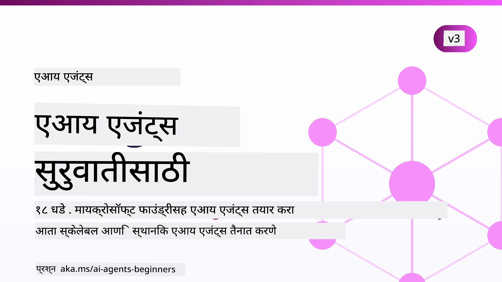

# नवीनांसाठी AI एजंट्स - एक कोर्स



## AI एजंट्स तयार करण्यासाठी आवश्यक असलेली सर्व काही शिकवणारा कोर्स

[](https://github.com/microsoft/ai-agents-for-beginners/blob/master/LICENSE?WT.mc_id=academic-105485-koreyst)
[](https://GitHub.com/microsoft/ai-agents-for-beginners/graphs/contributors/?WT.mc_id=academic-105485-koreyst)
[](https://GitHub.com/microsoft/ai-agents-for-beginners/issues/?WT.mc_id=academic-105485-koreyst)
[](https://GitHub.com/microsoft/ai-agents-for-beginners/pulls/?WT.mc_id=academic-105485-koreyst)
[](http://makeapullrequest.com?WT.mc_id=academic-105485-koreyst)

### 🌐 बहुभाषिक समर्थन

#### GitHub Action द्वारे समर्थित (स्वयंचलित आणि नेहमी अद्ययावत)

<!-- CO-OP TRANSLATOR LANGUAGES TABLE START -->
[Arabic](../ar/README.md) | [Bengali](../bn/README.md) | [Bulgarian](../bg/README.md) | [Burmese (Myanmar)](../my/README.md) | [Chinese (Simplified)](../zh-CN/README.md) | [Chinese (Traditional, Hong Kong)](../zh-HK/README.md) | [Chinese (Traditional, Macau)](../zh-MO/README.md) | [Chinese (Traditional, Taiwan)](../zh-TW/README.md) | [Croatian](../hr/README.md) | [Czech](../cs/README.md) | [Danish](../da/README.md) | [Dutch](../nl/README.md) | [Estonian](../et/README.md) | [Finnish](../fi/README.md) | [French](../fr/README.md) | [German](../de/README.md) | [Greek](../el/README.md) | [Hebrew](../he/README.md) | [Hindi](../hi/README.md) | [Hungarian](../hu/README.md) | [Indonesian](../id/README.md) | [Italian](../it/README.md) | [Japanese](../ja/README.md) | [Kannada](../kn/README.md) | [Khmer](../km/README.md) | [Korean](../ko/README.md) | [Lithuanian](../lt/README.md) | [Malay](../ms/README.md) | [Malayalam](../ml/README.md) | [Marathi](./README.md) | [Nepali](../ne/README.md) | [Nigerian Pidgin](../pcm/README.md) | [Norwegian](../no/README.md) | [Persian (Farsi)](../fa/README.md) | [Polish](../pl/README.md) | [Portuguese (Brazil)](../pt-BR/README.md) | [Portuguese (Portugal)](../pt-PT/README.md) | [Punjabi (Gurmukhi)](../pa/README.md) | [Romanian](../ro/README.md) | [Russian](../ru/README.md) | [Serbian (Cyrillic)](../sr/README.md) | [Slovak](../sk/README.md) | [Slovenian](../sl/README.md) | [Spanish](../es/README.md) | [Swahili](../sw/README.md) | [Swedish](../sv/README.md) | [Tagalog (Filipino)](../tl/README.md) | [Tamil](../ta/README.md) | [Telugu](../te/README.md) | [Thai](../th/README.md) | [Turkish](../tr/README.md) | [Ukrainian](../uk/README.md) | [Urdu](../ur/README.md) | [Vietnamese](../vi/README.md)

> **स्थानिक रूपात क्लोन करायला पसंत करता?**
>
> या रिपॉझिटरीमध्ये ५० पेक्षा जास्त भाषांतर समाविष्ट आहे जे डाउनलोड आकार मोठा करतात. भाषांतरांशिवाय क्लोन करण्यासाठी sparse checkout वापरा:
>
> **Bash / macOS / Linux:**
> ```bash
> git clone --filter=blob:none --sparse https://github.com/microsoft/ai-agents-for-beginners.git
> cd ai-agents-for-beginners
> git sparse-checkout set --no-cone '/*' '!translations' '!translated_images'
> ```
>
> **CMD (Windows):**
> ```cmd
> git clone --filter=blob:none --sparse https://github.com/microsoft/ai-agents-for-beginners.git
> cd ai-agents-for-beginners
> git sparse-checkout set --no-cone "/*" "!translations" "!translated_images"
> ```
>
> यामुळे कोर्स पूर्ण करण्यासाठी आवश्यक सर्व काही मिळते आणि डाउनलोड जलद होते.
<!-- CO-OP TRANSLATOR LANGUAGES TABLE END -->

**जर तुम्हाला अधिक भाषांतर भाषा समर्थित करून घ्यायच्या असतील, तर त्या [इथे](https://github.com/Azure/co-op-translator/blob/main/getting_started/supported-languages.md) दिल्या आहेत.**

[](https://GitHub.com/microsoft/ai-agents-for-beginners/watchers/?WT.mc_id=academic-105485-koreyst)
[](https://GitHub.com/microsoft/ai-agents-for-beginners/network/?WT.mc_id=academic-105485-koreyst)
[](https://GitHub.com/microsoft/ai-agents-for-beginners/stargazers/?WT.mc_id=academic-105485-koreyst)

[](https://discord.com/invite/ATgtXmAS5D)


## 🌱 सुरुवात कशी करावी

या कोर्समध्ये AI एजंट्स तयार करण्याच्या मुलभूत गोष्टींचे धडे आहेत. प्रत्येक धड्याचा आपला विषय असल्यामुळे तुम्हाला जिथून सुरू करायचे असेल तिथून सुरू करा!

या कोर्ससाठी बहुभाषिक समर्थन आहे. आमच्या [मिळवणाऱ्या भाषांचा आढावा येथे पहा](#-multi-language-support). 

जर तुम्ही जनरेटीव्ह AI मॉडेल्ससह प्रथमच तयार करत असाल, तर आमचा [Generative AI For Beginners](https://aka.ms/genai-beginners) कोर्स पहा, ज्यात GenAI वापरून तयार करण्याचे २१ धडे आहेत.

[या रिपॉझिटरीला स्टार द्या (🌟)](https://docs.github.com/en/get-started/exploring-projects-on-github/saving-repositories-with-stars?WT.mc_id=academic-105485-koreyst) आणि [ही रिपॉझिटरी fork करा](https://github.com/microsoft/ai-agents-for-beginners/fork) त्यामुळे तुम्ही कोड चालवू शकता.

### इतर शिकणाऱ्यांना भेटा, तुमचे प्रश्न विचारा

जर तुम्हाला अडचण आली किंवा AI एजंट्स तयार करताना काही प्रश्न असतील, तर Microsoft Foundry Discord मध्ये आमच्या विशेष Discord चॅनेलशी जोडा [Microsoft Foundry Discord](https://aka.ms/ai-agents/discord).

### तुम्हाला काय पाहिजे 

या कोर्समधील प्रत्येक धड्यात कोड उदाहरणे आहेत, जी code_samples फोल्डरमध्ये सापडतील. तुम्ही [ही रिपॉझिटरी fork करू शकता](https://github.com/microsoft/ai-agents-for-beginners/fork) आणि तुमची स्वतःची कॉपी तयार करू शकता.  

या व्यायामांमध्ये दिलेली कोड उदाहरणे Microsoft Agent Framework सह Microsoft Foundry Agent Service V2 वापरतात:

- [Microsoft Foundry](https://aka.ms/ai-agents-beginners/ai-foundry) - Azure Account आवश्यक

या कोर्समध्ये Microsoft कडून खालील AI Agent फ्रेमवर्क्स आणि सेवा वापरल्या आहेत:

- [Microsoft Agent Framework (MAF)](https://aka.ms/ai-agents-beginners/agent-framework)
- [Microsoft Foundry Agent Service V2](https://aka.ms/ai-agents-beginners/ai-agent-service)

काही कोड उदाहरणे OpenAI-समान प्रदाते जसे की [MiniMax](https://platform.minimaxi.com/) देखील समर्थन करतात, ज्यात मोठ्या संदर्भासाठीच्या मॉडेल्स (०२४K टोकन्सपर्यंत) ऑफर केले जातात. कॉन्फिगरेशन तपशीलांसाठी [Course Setup](./00-course-setup/README.md) पहा.

कोर्ससाठी कोड चालवण्याची अधिक माहिती [Course Setup](./00-course-setup/README.md) येथे आहे.

## 🙏 मदत करायची आहे का?

तुम्हाला काही सूचना आहेत किंवा स्पेलिंग किंवा कोडमध्ये चुका सापडल्या का? [इश्यू उघडा](https://github.com/microsoft/ai-agents-for-beginners/issues?WT.mc_id=academic-105485-koreyst) किंवा [पुल रिक्वेस्ट तयार करा](https://github.com/microsoft/ai-agents-for-beginners/pulls?WT.mc_id=academic-105485-koreyst)


## 📂 प्रत्येक धड्यात समाविष्ट आहे

- README मध्ये लिहिलेला धडा आणि एक लहान व्हिडिओ
- Microsoft Agent Framework सह Microsoft Foundry वापरून Python कोड उदाहरणे
- तुमचे शिक्षण सुरू ठेवण्यासाठी अतिरिक्त स्रोतांची दुवे


## 🗃️ धडे

| **धडा**                                   | **मजकूर & कोड**                                    | **व्हिडिओ**                                                  | **अतिरिक्त शिक्षण**                                                                     |
|----------------------------------------------|----------------------------------------------------|------------------------------------------------------------|----------------------------------------------------------------------------------------|
| AI एजंट्स आणि एजंट वापर प्रकरणांची ओळख       | [दुवा](./01-intro-to-ai-agents/README.md)          | [व्हिडिओ](https://youtu.be/3zgm60bXmQk?si=z8QygFvYQv-9WtO1)  | [दुवा](https://aka.ms/ai-agents-beginners/collection?WT.mc_id=academic-105485-koreyst) |
| AI एजंटिक फ्रेमवर्क्सचे अन्वेषण              | [दुवा](./02-explore-agentic-frameworks/README.md)  | [व्हिडिओ](https://youtu.be/ODwF-EZo_O8?si=Vawth4hzVaHv-u0H)  | [दुवा](https://aka.ms/ai-agents-beginners/collection?WT.mc_id=academic-105485-koreyst) |
| AI एजंटिक डिझाइन पॅटर्न समजून घेणे          | [दुवा](./03-agentic-design-patterns/README.md)     | [व्हिडिओ](https://youtu.be/m9lM8qqoOEA?si=BIzHwzstTPL8o9GF)  | [दुवा](https://aka.ms/ai-agents-beginners/collection?WT.mc_id=academic-105485-koreyst) |
| टूल वापर डिझाइन पॅटर्न                      | [दुवा](./04-tool-use/README.md)                    | [व्हिडिओ](https://youtu.be/vieRiPRx-gI?si=2z6O2Xu2cu_Jz46N)  | [दुवा](https://aka.ms/ai-agents-beginners/collection?WT.mc_id=academic-105485-koreyst) |
| एजंटिक RAG                                  | [दुवा](./05-agentic-rag/README.md)                 | [व्हिडिओ](https://youtu.be/WcjAARvdL7I?si=gKPWsQpKiIlDH9A3)  | [दुवा](https://aka.ms/ai-agents-beginners/collection?WT.mc_id=academic-105485-koreyst) |
| विश्वासार्ह AI एजंट्स तयार करणे              | [दुवा](./06-building-trustworthy-agents/README.md) | [व्हिडिओ](https://youtu.be/iZKkMEGBCUQ?si=jZjpiMnGFOE9L8OK ) | [दुवा](https://aka.ms/ai-agents-beginners/collection?WT.mc_id=academic-105485-koreyst) |
| नियोजन डिझाइन पॅटर्न                      | [दुवा](./07-planning-design/README.md)             | [व्हिडिओ](https://youtu.be/kPfJ2BrBCMY?si=6SC_iv_E5-mzucnC)  | [दुवा](https://aka.ms/ai-agents-beginners/collection?WT.mc_id=academic-105485-koreyst) |
| बहु-एजंट डिझाइन पॅटर्न                     | [दुवा](./08-multi-agent/README.md)                 | [व्हिडिओ](https://youtu.be/V6HpE9hZEx0?si=rMgDhEu7wXo2uo6g)  | [दुवा](https://aka.ms/ai-agents-beginners/collection?WT.mc_id=academic-105485-koreyst) |

| मेटाकॉग्निशन डिझाइन पॅटर्न                 | [Link](./09-metacognition/README.md)               | [Video](https://youtu.be/His9R6gw6Ec?si=8gck6vvdSNCt6OcF)  | [Link](https://aka.ms/ai-agents-beginners/collection?WT.mc_id=academic-105485-koreyst) |
| उत्पादनात AI एजंट्स                      | [Link](./10-ai-agents-production/README.md)        | [Video](https://youtu.be/l4TP6IyJxmQ?si=31dnhexRo6yLRJDl)  | [Link](https://aka.ms/ai-agents-beginners/collection?WT.mc_id=academic-105485-koreyst) |
| एजंटिक प्रोटोकॉल वापरणे (MCP, A2A आणि NLWeb) | [Link](./11-agentic-protocols/README.md)           | [Video](https://youtu.be/X-Dh9R3Opn8)                                 | [Link](https://aka.ms/ai-agents-beginners/collection?WT.mc_id=academic-105485-koreyst) |
| AI एजंटसाठी संदर्भ अभियांत्रिकी            | [Link](./12-context-engineering/README.md)         | [Video](https://youtu.be/F5zqRV7gEag)                                 | [Link](https://aka.ms/ai-agents-beginners/collection?WT.mc_id=academic-105485-koreyst) |
| एजंटिक मेमरी व्यवस्थापन                      | [Link](./13-agent-memory/README.md)     |      [Video](https://youtu.be/QrYbHesIxpw?si=vZkVwKrQ4ieCcIPx)                                                      |                                                                                        |
| Microsoft एजंट फ्रेमवर्क एक्सप्लोर करणे                         | [Link](./14-microsoft-agent-framework/README.md)                            |                                                            |                                                                                        |
| संगणक वापर एजंट्स तयार करणे (CUA)           | [Link](./15-browser-use/README.md)     |                                                            | [Link](https://docs.browser-use.com/examples/templates/playwright-integration)         |
| स्केलेबल एजंट्स तैनात करणे                    | [Link](./16-deploying-scalable-agents/README.md) |                                                    | [Link](https://learn.microsoft.com/azure/ai-foundry/agents/overview)                   |
| स्थानिक AI एजंट्स तयार करणे                     | [Link](./17-creating-local-ai-agents/README.md)  |                                                    | [Link](https://learn.microsoft.com/azure/ai-foundry/foundry-local/)                    |
| AI एजंट्स सुरक्षित करणे                           | [Link](./18-securing-ai-agents/README.md)  |                                                            | [Link](https://aka.ms/ai-agents-beginners/collection?WT.mc_id=academic-105485-koreyst) |

## 🎒 इतर कोर्सेस

आमची टीम इतर कोर्सेस तयार करते! पहा:

<!-- CO-OP TRANSLATOR OTHER COURSES START -->
### LangChain
[](https://aka.ms/langchain4j-for-beginners)
[](https://aka.ms/langchainjs-for-beginners?WT.mc_id=m365-94501-dwahlin)
[](https://github.com/microsoft/langchain-for-beginners?WT.mc_id=m365-94501-dwahlin)
---

### Azure / Edge / MCP / Agents
[](https://github.com/microsoft/AZD-for-beginners?WT.mc_id=academic-105485-koreyst)
[](https://github.com/microsoft/edgeai-for-beginners?WT.mc_id=academic-105485-koreyst)
[](https://github.com/microsoft/mcp-for-beginners?WT.mc_id=academic-105485-koreyst)
[](https://github.com/microsoft/ai-agents-for-beginners?WT.mc_id=academic-105485-koreyst)

---
 
### जनरेटिव AI सिरीज
[](https://github.com/microsoft/generative-ai-for-beginners?WT.mc_id=academic-105485-koreyst)
[-9333EA?style=for-the-badge&labelColor=E5E7EB&color=9333EA)](https://github.com/microsoft/Generative-AI-for-beginners-dotnet?WT.mc_id=academic-105485-koreyst)

[-C084FC?style=for-the-badge&labelColor=E5E7EB&color=C084FC)](https://github.com/microsoft/generative-ai-for-beginners-java?WT.mc_id=academic-105485-koreyst)
[-E879F9?style=for-the-badge&labelColor=E5E7EB&color=E879F9)](https://github.com/microsoft/generative-ai-with-javascript?WT.mc_id=academic-105485-koreyst)

---
 
### मुख्य शिक्षण
[](https://aka.ms/ml-beginners?WT.mc_id=academic-105485-koreyst)
[](https://aka.ms/datascience-beginners?WT.mc_id=academic-105485-koreyst)
[](https://aka.ms/ai-beginners?WT.mc_id=academic-105485-koreyst)
[](https://github.com/microsoft/Security-101?WT.mc_id=academic-96948-sayoung)
[](https://aka.ms/webdev-beginners?WT.mc_id=academic-105485-koreyst)
[](https://aka.ms/iot-beginners?WT.mc_id=academic-105485-koreyst)
[](https://github.com/microsoft/xr-development-for-beginners?WT.mc_id=academic-105485-koreyst)

---
 

### कॉपायलट मालिका
[](https://aka.ms/GitHubCopilotAI?WT.mc_id=academic-105485-koreyst)
[](https://github.com/microsoft/mastering-github-copilot-for-dotnet-csharp-developers?WT.mc_id=academic-105485-koreyst)
[](https://github.com/microsoft/CopilotAdventures?WT.mc_id=academic-105485-koreyst)
<!-- CO-OP TRANSLATOR OTHER COURSES END -->

## 🌟 समुदायाचे आभार

एजेंटिक RAG दाखवणाऱ्या महत्त्वाच्या कोड नमुन्यांसाठी [शिवम गोयल](https://www.linkedin.com/in/shivam2003/) यांचे आभार.

## योगदान

हा प्रकल्प योगदान आणि सूचना स्वीकारतो. बहुतांश योगदानासाठी तुम्हाला
योगदानकर्ता परवाना करार (CLA) स्वीकारणे आवश्यक आहे ज्यात तुम्ही सांगता की, तुम्हाला हक्क आहेत आणि प्रत्यक्षात तुम्ही
आम्हाला तुमच्या योगदानाचा वापर करण्याचा अधिकार देता. तपशीलांसाठी, येथे भेट द्या <https://cla.opensource.microsoft.com>.

जेव्हा तुम्ही पुल विनंती सादर करता, तेव्हा CLA बोट स्वयंचलितपणे तपासेल की तुम्हाला CLA प्रदान करायची आहे का आणि
योग्यतेने PR ला सजवेल (उदा., स्थिती तपासणी, टिप्पणी). फक्त बोटने दिलेल्या सूचनांचे पालन करा.
तुम्हाला आमच्या CLA वापरणाऱ्या सर्व रेपॉमध्ये यासाठी फक्त एकदाच करावे लागेल.

या प्रकल्पाने [मायक्रोसॉफ्ट ओपन सोर्स कोड ऑफ कॉंडक्ट](https://opensource.microsoft.com/codeofconduct/) स्वीकारले आहे.
अधिक माहितीसाठी पाहा [कोड ऑफ कॉंडक्ट FAQ](https://opensource.microsoft.com/codeofconduct/faq/) किंवा
[opencode@microsoft.com](mailto:opencode@microsoft.com) वर संपर्क करा कोणत्याही अतिरिक्त प्रश्नांसाठी किंवा टिप्पण्यांसाठी.

## ट्रेडमार्क

या प्रकल्पात प्रकल्प, उत्पादने किंवा सेवा यांचे ट्रेडमार्क किंवा लोगो असू शकतात. मायक्रोसॉफ्टच्या अधिकृत ट्रेडमार्क
किंवा लोगोचा वापर करण्यासाठी तुम्हाला खालील गोष्टी मान्य कराव्या लागतील आणि त्यांचे पालन करावे लागेल:
[मायक्रोसॉफ्टचा ट्रेडमार्क & ब्रँड मार्गदर्शक तत्त्वे](https://www.microsoft.com/legal/intellectualproperty/trademarks/usage/general).
या प्रकल्पाच्या सुधारित आवृत्त्यांमध्ये मायक्रोसॉफ्ट ट्रेडमार्क किंवा लोगो वापरून भ्रम निर्माण होऊ नये किंवा मायक्रोसॉफ्टच्या प्रायोजकत्वाचा अर्थ लावू नये.
तृतीय-पक्ष ट्रेडमार्क किंवा लोगोचा वापर त्या तृतीय-पक्षांच्या धोरणांवर अवलंबून राहील.

## मदत मिळवा


जर तुम्हाला अडकले असाल किंवा AI अॅप्स तयार करण्याबाबत काही प्रश्न असतील, तर सामील व्हा:

[](https://aka.ms/foundry/discord)

उत्पादनाबाबत अभिप्राय असेल किंवा अॅप बांधताना त्रुटी आल्यास, भेट द्या:


[](https://aka.ms/foundry/forum)

---

<!-- CO-OP TRANSLATOR DISCLAIMER START -->
**अस्वीकरण**:
हा दस्तऐवज AI भाषांतर सेवा [Co-op Translator](https://github.com/Azure/co-op-translator) चा वापर करून अनुवादित केला आहे. जरी आम्ही अचूकतेसाठी प्रयत्न करतो, तरी कृपया लक्षात घ्या की स्वयंचलित भाषांतरांमध्ये त्रुटी किंवा अचूकतेची कमतरता असू शकते. मूळ दस्तऐवज त्याच्या मूळ भाषेत अधिकृत स्रोत मानला पाहिजे. महत्त्वाची माहिती असल्यास, व्यावसायिक मानवी भाषांतराची शिफारस केली जाते. या भाषांतराच्या वापरामुळे उद्भवणाऱ्या कोणत्याही गैरसमज किंवा चुकीच्या अर्थलावणीसाठी आम्ही जबाबदार नाही.
<!-- CO-OP TRANSLATOR DISCLAIMER END -->